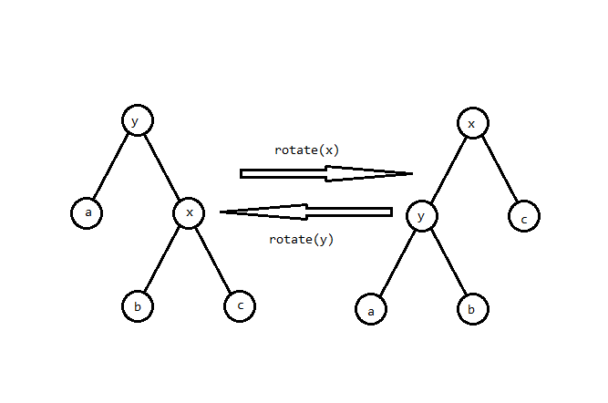
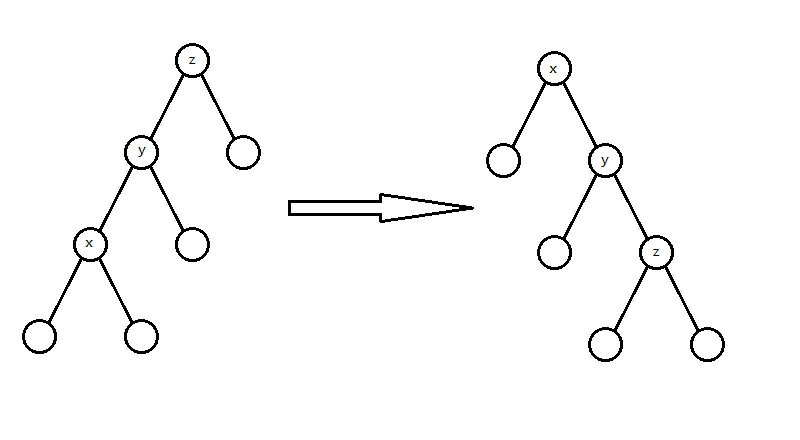
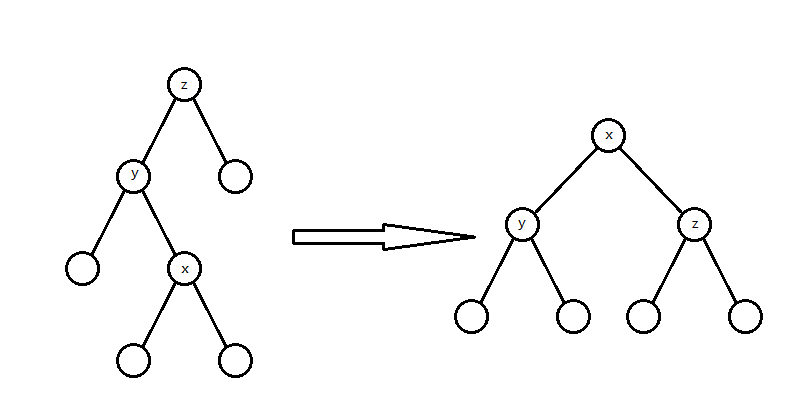
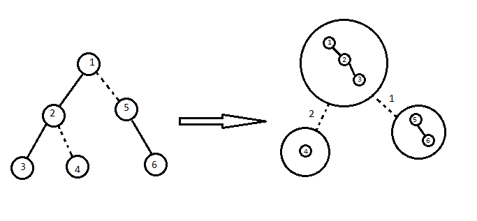
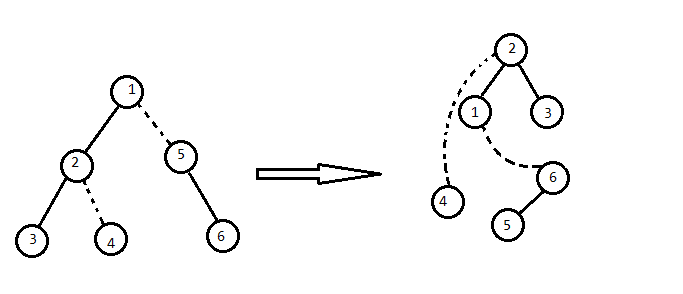
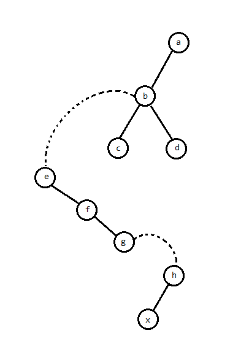
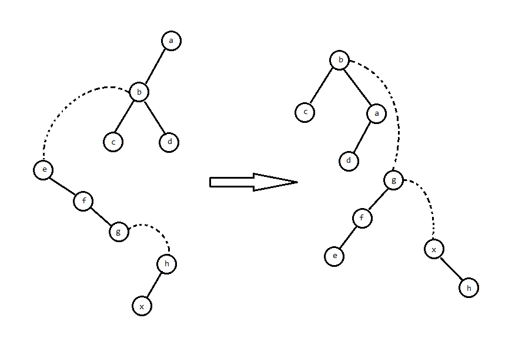
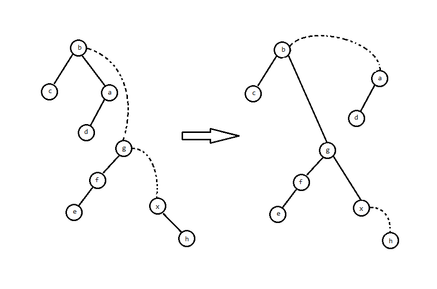
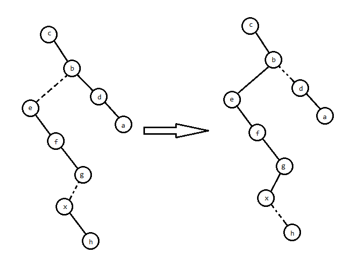

# LCT 学习笔记

## 前言

由于 Splay 除了写 LCT 少个 $\log$ 以外被 FHQ 全方面薄纱（常数，好写程度，易错率，还有不能可持久化），干脆就写一起了。

LCT 以前感觉巨大困难啊，但是熟悉了就简单了。

## Splay 树

先讲讲 LCT 所需要用到的 Splay 树部分。

Splay 树是一种平衡树，核心在 splay（伸展）操作，利用伸展操作使得势能分析后复杂度是 $O(n\log n)$ 的。

### 核心操作

splay 的实现基于 rotate 操作。rotate 操作类似于有旋 Treap 的 Zig/Zag 操作，可以在不改变 BST 性质的情况下改变树的形态：



`rotate(x)` 的意思是“把 $x$ 向上旋转”。

实现比较简单：

/// details | 参考实现
    open: True

```cpp
	#define get(x) (ch[fa[x]][1]==x)
	void Rotate(int x){
		int y=fa[x],z=fa[y],ss=get(x);
		ch[y][ss]=ch[x][!ss];fa[ch[x][!ss]]=y;
		ch[x][!ss]=y;fa[y]=x;fa[x]=z;
		if(z) ch[z][y==ch[z][1]]=x;
		PushUp(y);PushUp(x);
	}
```

///

然后就是 splay 操作。splay 操作的目的是通过若干次 `rotate` 操作把 $x$ 旋转到根，分三种情况（下文默认 $y=fa_x$）：

1. $y$ 就是根：

	此时一次 rotate 就能旋到根：

	图就是上面那张，就不再放一遍了。

	这种操作叫 Zig/Zag。

2. $y$ 和 $x$ 是父亲的同一个儿子

	就是这种情况：

	

	这种情况先 `rotate(y)` 再 `rotate(x)`，据说在势能分析下很平衡。

	这种操作叫 Zig-Zig/Zag-Zag。

3. $y$ 和 $x$ 是父亲的不同儿子

	这种情况：

	

	这种情况 `rotate(x)` 两次即可，看起来就很平衡。

	这种操作叫 Zig-Zag/Zag-Zig。

	代码实现很简单：

	/// details | 参考代码
		open: False
		type: success

	```cpp
		void Splay(int x){
			for(int f=fa[x];f=fa[x],f;Rotate(x)){
				if(fa[f]) Rotate(get(x)==get(f)?f:x);
			}
		}
	```

	///

### 其余操作

其余就比较简单了，注意每次访问一个结点就 splay 到根（因为 Splay 树的复杂度是“splay 操作的复杂度在势能分析下的复杂度”，我们需要每次操作都 splay 一下，保证每个操作的复杂度始终是 splay 的复杂度），然后删除可以 splay 到根后用类似 FHQ 的写法把两子树合并。基本上会 FHQ 的都能写，此处略过（因为在 LCT 中不重要）。

### 复杂度证明

[留坑待补。](https://oi.wiki/ds/splay/#splay-%E6%93%8D%E4%BD%9C%E7%9A%84%E6%97%B6%E9%97%B4%E5%A4%8D%E6%9D%82%E5%BA%A6)

## LCT

LCT，全称 link-cut tree（ ~~林克卡特树，意思是玩塞尔达特别容易卡到树上~~ ）中文貌似没有译名。我们可以用它解决**动态树问题**。

维护一棵树，支持如下操作：

- 修改两点间路径权值。
- 查询两点间路径权值和。
- 等等能用树剖维护的树链信息。

这是一道树剖模版题。

但是再加一个操作：

- 断开并连接一些边，保证仍是一棵树。

要求在线求出上面的答案。

这就成了动态树问题，可以使用 LCT 求解。

（另外子树问题貌似可以用 ETT 解决，留坑待补）

### 回顾一下树剖（重链剖分）

考虑树剖是对每个结点保留一条重边，然后对每一条连续的重链开一个数据结构，但因为一些奇妙的性质可以只用一棵线段树维护完。

所以提炼一下，其实就是**把树分解成垂直的链，并用数据结构维护每条链的信息**。

### 实链剖分

考虑重剖不是很动态啊，所以我们使用更自由的实链剖分。

具体来说，对每个点指定一个“实儿子”（也可能没有），然后对每一条实链维护数据结构。请记住我们选择实链剖分的最重要的原因：它是我们自己选择的，灵活且可变。正是它的这种灵活可变性，我们采用 Splay Tree 来维护这些实链。

### 正文

（乐，算法引入怎么这么长）

我们可以简单的把 LCT 理解成用一些 Splay 来维护动态的实链剖分，以期实现动态树上的区间操作。对于每条实链，我们建一个 Splay 来维护整个链的信息，其中 Splay 的中序遍历就是实链从上到下的路径。然后再连若干条虚边表示多条实链之间的相对关系。

我们想要维护的大概是这么一个东西：



然而事实上不需要这么麻烦，注意到一棵 Splay 的根处的 $fa$ 是空的，那么可以考虑直接用根节点的 $fa$ 存储虚边。具体来说，对于每条 Splay 的根，我们将它的 $fa$ 赋为**对应实链顶端结点的父亲**。

大概是这样（通常形态不唯一，这是一种可能的情况）：



注意**虚边在父亲处不指向儿子**！

我们称这一棵 Splay 与虚边构成的树为**辅助树**，为了区分，称原本的树为**原树**，那么根据定义，辅助树需要具有以下性质（其实刚刚提过，这里整合一下）：

- 辅助树上的点与原树的点一一对应
- 辅助树由多棵 Splay 组成，每棵 Splay 维护原树中的一条路径，且中序遍历这棵 Splay 得到的点序列，从前到后对应原树**从上到下**的一条路径。
- 辅助树的各棵 Splay 之间并不是独立的。每棵 Splay 的根节点的父亲节点本应是空，但在 LCT 中每棵 Splay 的根节点的父亲节点指向原树中**这条链**的父亲节点（即链最顶端的点的父亲节点）。这类父亲边与通常 Splay 的父亲边的区别在于儿子认父亲，而父亲不认儿子，对应原树的一条**虚边**。因此，每条实链**恰好有一个点**的父亲节点为空（这个点是原树上该实链的根节点对应的辅助树结点所在 Splay 的根）。
- 辅助树是可以在满足辅助树、Splay 的性质下任意换根的。
- 虚实链变换可以轻松在辅助树上完成，这也就是实现了动态维护树链剖分。

由于辅助树的以上性质，我们维护任何操作都不需要维护原树，辅助树可以在任何情况下拿出一个唯一的原树，我们只需要维护辅助树即可。

#### 核心操作

LCT 的核心操作有两个（其实真正核心的只有一个），但在此之前要先介绍特化的 rotate 和 splay 操作：

/// details | 参考代码
    open: True

```cpp
	#define get(x) (ch[fa[x]][1]==x)
	#define isRoot(x) (ch[fa[x]][0]!=x&&ch[fa[x]][1]!=x)
	void Rotate(int x){
		int y=fa[x],z=fa[y],ss=get(x);
		if(!isRoot(y)) ch[z][y==ch[z][1]]=x;
		ch[y][ss]=ch[x][!ss];fa[ch[x][!ss]]=y;
		ch[x][!ss]=y;fa[y]=x;fa[x]=z;
		PushUp(y);PushUp(x);
	}
	void Update(int x){
		if(!isRoot(x)) Update(fa[x]);
		PushDown(x);
	}
	void Splay(int x){
		Update(x);
		for(int f=fa[x];f=fa[x],!isRoot(x);Rotate(x)){
			if(!isRoot(f)) Rotate(get(x)==get(f)?f:x);
		}
	}
```

///

首先是宏定义的 `isRoot` 函数。这个很简单，因为若 $x$ 的父亲两个儿子都不是它，说明这是一条虚边，即 $x$ 是所在 Splay 的根。

然后 rotate 和 Splay 树差不多，注意要先特判 $y$ 是不是根（这个很重要，不然会把 $x$ 转到奇怪的地方）。

最后是 splay 操作。由于**任何树形数据结构**下传标记都是**从上到下**的，但 LCT 会从下到上操作。那么就需要在操作前先行下放标记（就是 `Update` 函数）。

- access 操作

access 操作的目的是将 $x$ 到所在连通块根节点的路径变为一条实链。

具体如何操作呢？考虑辅助树上 $x$ 到根路径中的所有 Splay。



“变为一条实链”就等价于把路径上的虚边变成实边，并且删掉不需要的实边。

考虑虚边在原树上的意义，那么变成的实边在辅助树上必定是若干个右儿子。那么我们可以把所有虚边连到的父亲 splay 到对应 Splay 的根：



然后把虚边变成右儿子，原本的右儿子自然就成了虚边：



就做完了。

让我们看看原树的表现：



显然是对的。

/// details | 参考代码
    open: True

```cpp
	int Access(int x){
		int p=0;
		for(;x;p=x,x=fa[x]){
			Splay(x);ch[x][1]=p;PushUp(x);
		}
		return p;
	}
```

///

这个返回值 $p$ 是这一棵 Splay 的根。

- makeroot 操作

顾名思义，将 $x$ 变为**对应连通块**的根。

考虑换根会使哪些点的深浅相对关系改变，容易发现就是原来的根到新根的路径。

那么 access 后进行平衡树的翻转操作即可。

/// details | 参考代码
    open: False
    type: success

```cpp
	void MakeRoot(int x){
		x=Access(x);
		swap(ch[x][0],ch[x][1]);
		revtag[x]^=1;// (1)!
	}
```

1. 这个标记记得在 `PushDown` 中下传。

///

#### 其余操作

LCT 通常都是解决链上问题的。那么其余操作一遍都是对链操作/查询，所以只要把链取出来就行了。具体步骤就是将链的一个端点变成根，然后 Access 另一个。

最后是 link/cut 操作。

- link 操作

把其中一边变成对应连通块的根，然后连一条虚边即可。

但是有可能需要判两点是不是原本就连通。这个有很多种实现。一种是找两点对应连通块的根是否相同，这个可以 `Access(x)` 后一直向左儿子走：

/// details | 参考代码
    open: True

```cpp
	int FindRoot(int p){
		Access(p);
		Splay(p);
		PushDown(p);
		while(ls){
			p=ls;
			PushDown(p);
		}
		Splay(p);
		return p;
	}
	void Link(int x,int y){
		if(FindRoot(x)==FindRoot(y)) return;
		MakeRoot(x);
		Splay(x);
		fa[x]=y;
	}
```

///

- cut 操作

`MakeRoot(x)` 后 `Access(y)`，此时（如果该边存在）那么 $y$ 必定是 $x$ 的右儿子（显然），并且 $y$ 没有左儿子（否则说明 $x,y$ 之间还有其它结点）。那么把这条边删掉即可。

/// details | 参考代码
    open: True

```cpp
	void Cut(int x,int y){
		MakeRoot(x);
		if(FindRoot(y)!=x||fa[y]!=x||ch[y][0]) return;
		ch[x][1]=fa[y]=0;
		PushUp(x);
	}
```

///

然后就完啦。

#### 复杂度证明

留坑待补。