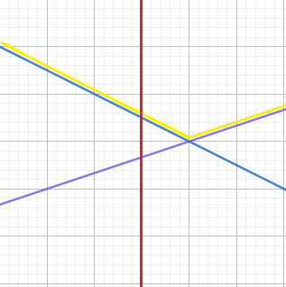
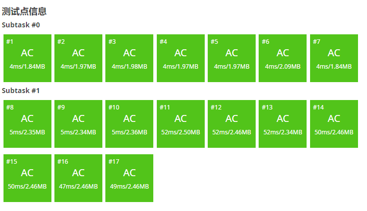

# 李超线段树

## 前言

~~Earthmessenger 大佬曾经说过，省选之前的所有和斜率有关的题基本上都能李超日过去。~~

通俗来说，李超线段树支持加入线段/直线，查询与某平行于 $y$ 轴的直线 $x=k$ 的所有交点中纵坐标最大/最小值。

## 算法简述

以 [P4097 【模板】李超线段树 / [HEOI2013] Segment](https://www.luogu.com.cn/problem/P4097) 为例。

在开始的开始，由于我们要维护线段（或者叫一次函数），为方便代码书写，我使用了一个结构体存储。

/// admonition | 注意
    type: warning

由于 $x_1,x_2$ 可能相等，对于相等的情况，相当于在区间 $[x_1,x_2]$ 插入了一条 $y=0x+\max(y_1,y_2)$ 的直线。

///

/// details | 参考代码
    open: False
    type: success

```cpp
struct line{
	db k,b;
	db operator ()(int x){
		return x*k+b;
	}
	line(int x1=0,int y1=-inf,int x2=0,int y2=-inf){
		if(x1==x2){
			k=0;b=max(y1,y2);
		}else{
			k=db(y2-y1)/(x2-x1);
			b=y1-x1*k;
		}
	}
}s[N];
```

///

由于要支持区间修改（一条线段肯定覆盖了一段横坐标吧），考虑用线段树维护。那么理想情况下，我们希望可以维护每个区间内纵坐标最高的线段。但这显然在大部分情况下是不行的：



比如这种情况，我们发现整个区间内所有位置的最大值（黄色折线）不是同一条直线。

那么我们很难直接维护区间内信息，考虑递归维护。

具体来说，我们维护区间中点处纵坐标取到最大值的线段，那么答案就是叶子结点的答案，但实际上为了修改方便，我们可以考虑标记永久化，答案就是**叶子结点到根节点路径上每个结点答案的最大值**，然后每个结点只维护**除去所有祖先的答案外，区间中点取到最大值的线段**。

设当前线段为 $p$。

首先简单地，对于一个原本没有答案的区间，直接把 $l$ 赋给该区间即可。

然后考虑 $p$ 与当前区间原本线段 $s$ 比较。若 $p_{mid}>s_{mid}$，那么当前区间的答案就会变成 $p$，但是 $s$ 可能会变成子区间的答案。此时可以考虑把 $s$ 和 $p$ 交换一下，让 $s$ 作为新的 $p$ 下传。那么我们就可以钦定 $p_{mid}<s_{mid}$ 了。

那么 $p$ 必定形如上图紫色线段。容易想到，$s,p$ 必然有一个交点。若交点在区间外，那么 $p$ 必定不会成为区间内任何一个 $x$ 的答案，直接退出。我们可以只考虑交点在区间内的情况。

若交点在左侧，那么 $p$ 就有可能成为左子树的答案，递归进入左子树即可，如何判断呢？容易发现，若交点在左侧，必然有 $p_{l}\ge s_{l}$（在这道题中要考虑边界，因为同高度取编号最小），右侧也是一样的道理。

由于每次递归只会进入至多一个儿子。修改的复杂度就是 $O(\log n)$。

然后注意一条线段只覆盖某个区间，那么我们可以像普通线段树一样找到该线段覆盖的 $O(\log n)$ 个区间。由于每个区间的复杂度是 $O(\log n)$，复杂度就是 $O(\log^2 n)$。

/// details | 修改部分参考代码
    open: False
    type: success

```cpp
bool cmp(db a,db b){//a<b
	return a-b<eps;
}
bool eql(db a,db b){
	return fabs(a-b)<eps;
}
struct LiChaoTree{
	#define mid ((l+r)>>1)
	#define lson l,mid,id<<1
	#define rson mid+1,r,id<<1|1
	int midmax[M<<2];
	void _update(int X,int l,int r,int id){
		if(!midmax[id]){
			midmax[id]=X;
			return;
		}
		if(cmp(s[midmax[id]](mid),s[X](mid))||(eql(s[midmax[id]](mid),s[X](mid))&&X<midmax[id])) swap(midmax[id],X);
		if(cmp(s[midmax[id]](l),s[X](l))||(eql(s[midmax[id]](l),s[X](l))&&X<midmax[id])) _update(X,lson);
		if(cmp(s[midmax[id]](r),s[X](r))||(eql(s[midmax[id]](r),s[X](r))&&X<midmax[id])) _update(X,rson);
	}
	void Update(int L,int R,int X,int l=1,int r=mod,int id=1){
		if(L<=l&&r<=R){
			_update(X,l,r,id);
			return;
		}
		if(L<=mid) Update(L,R,X,lson);
		if(mid< R) Update(L,R,X,rson);
	}
}
```

///

然后查询注意我们是标记永久化了，要求出路径上所有结点的最大值。

/// detials | 查询参考代码
    open: False
    type: success

```cpp
pdi mmax(pdi a,pdi b){
	if(eql(a.fi,b.fi)){
		if(a.se<b.se) return a;
		else return b;
	}else if(cmp(a.fi,b.fi)){
		return b;
	}else{
		return a;
	}
}
struct LiChaoTree{
	pdi Query(int X,int l=1,int r=mod,int id=1){
		if(l==r){
			return mkp(s[midmax[id]](l),midmax[id]);
		}
		pdi res;
		if(X<=mid) res=Query(X,lson);
		else       res=Query(X,rson);
		return mmax(res,mkp(s[midmax[id]](X),midmax[id]));
	}
}mt;
```

///

然后我们就能愉快地通过这道题了。



## 其他例题

