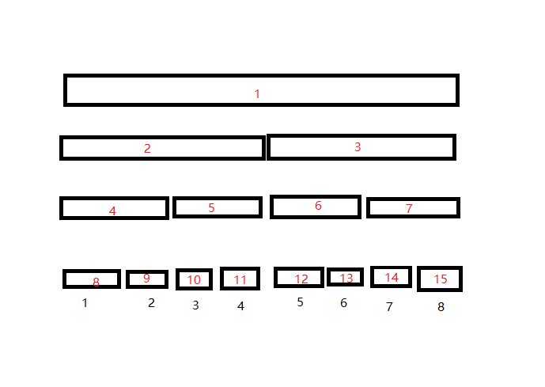

# 线段树和树状数组

## 前言

今天[金天](https://www.xn--vuqs4zq3d.com/oier/46981)老师给我们讲了一点数据结构，我大受启发，故得此文。

## 线段树

我们一般写线段树是这样写的：

/// details | 洛谷 P3372 【模板】线段树 1
    type: success
    open: False
```cpp
#include<cstdio>
#include<iostream>
#include<algorithm>
#include<cmath>
#define int long long
using namespace std;
const int N=2e5+5,inf=1e9;
int n,m,a[N];
struct SegmentTree{
	#define lson l,m,id<<1
	#define rson m+1,r,id<<1|1
	int querysum[N<<2];
	void PushUp(int id){
		querysum[id]=querysum[id<<1]+querysum[id<<1|1];
	}
	void Build(int* A,int l=1,int r=n,int id=1){
		if(l==r){querysum[id]=A[l];return;}
		int m=(l+r)>>1;
		Build(A,lson);
		Build(A,rson);
		PushUp(id);
	}
	void Update(int L,int R,int X,int l=1,int r=n,int id=1){
		if(L<=l&&r<=R){
			querysum[id]+=X*(r-l+1);
			return;
		}
		int m=(l+r)>>1;
		if(L<=m) Update(L,R,X,lson);
		if(m<R) Update(L,R,X,rson);
		PushUp(id);
	}
	int AskSum(int L,int R,int l=1,int r=n,int id=1){
		if(L<=l&&r<=R){return querysum[id];}
		int m=(l+r)>>1,res=0;
		if(L<=m) res+=AskSum(L,R,lson);
		if(m<R) res+=AskSum(L,R,rson);
		return res;
	}
	#undef lson
	#undef rson
};
SegmentTree mytree;
signed main(){
	scanf("%lld%lld",&n,&m);
	for(int i=1;i<=n;i++){
		scanf("%lld",&a[i]);
	}
	mytree.Build(a);
	while(m--){
		int tmp,x,y,k;
		scanf("%lld",&tmp);
		if(tmp==1){
			scanf("%lld %lld %lld",&x,&y,&k);
			mytree.Update(x,y,k);
		}else{
			scanf("%lld %lld",&x,&y);
			printf("%lld\n",mytree.AskSum(x,y));
		}
	}
}
```
///

这种递归式的，在赛场上至少要打差不多十分钟，常数也不小。

### 非递归线段树

假设 $N=2^k$，不够就补齐，考虑线段树维护的东西长啥样：



那么我们容易定位到一个点 $i$ 对应的叶子结点，即 $i+N-1$。我们每次除以二就可以得到这个点的父亲结点。

这里以单点加，区间求和为例。容易得到一个非常简短的建树：

/// details | 参考代码
    open: False
    type: success

```cpp
	void Build(int *A){
		forup(i,1,n) querysum[i+N]=A[i];
		fordown(i,N,1) querysum[i]=querysum[i<<1]+querysum[i<<1|1];
	}
```

///

和一个非常简短的单点修改。

/// details | 参考代码
    open: False
    type: success

```cpp
	void Update(int P,int X){
		for(int i=P+N;i;i>>=1){
			querysum[i]+=X;
		}
	}
```

///

以及一个稍微长一点的区间查询。

/// details | 参考代码
    open: False
    type: success

```cpp
	int AskSum(int l,int r){
		int res=0;
		for(l+=N-1,r+=N+1/* (1)!*/;l^r^1;l>>=1,r>>=1){
			if(!(l&1)) res+=querysum[l^1];// (2)!
			if(r&1)    res+=querysum[r^1];
		}
		return res;
	}
```

1. 转化为开区间。
2. 假如 $l$ 是左儿子说明它的兄弟在区间内，$r$ 同理。
///

这就是 zkw 线段树。

有人可能会问，为什么单点修区间查不用树状数组，但树状数组要维护的东西（如果不是前缀/后缀）必须满足这样两个性质：

1. $A+(B+C)=(A+B)+C$（即结合律）
1. $C+A+B-C=A+B$

这里的 $+,-$ 不一定特指加减法，比如异或也满足这样的性质。

但是线段树维护的只需要满足结合律就行了，比如 $\min,\max$，与，或等常见操作均有结合律。这就非常好。

zkw 线段树在单点修改区间查询时表现极其优秀（从各方面），但是区间修改时和普通线段树相比没有明显优势。