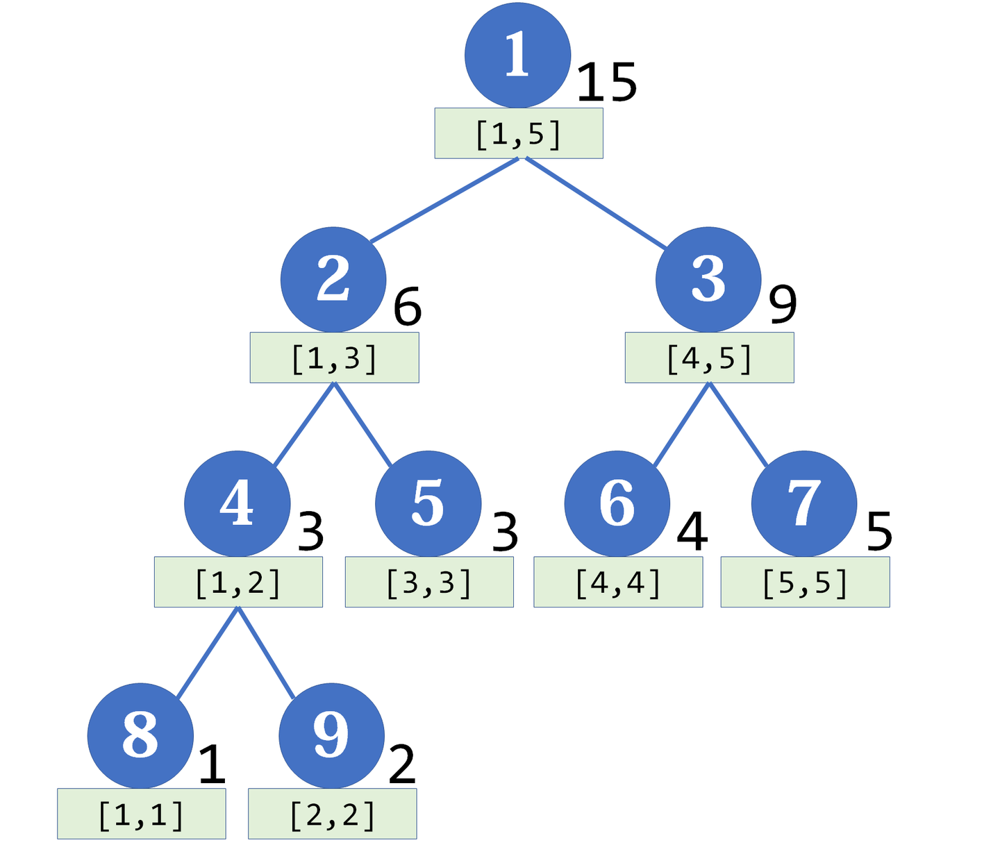
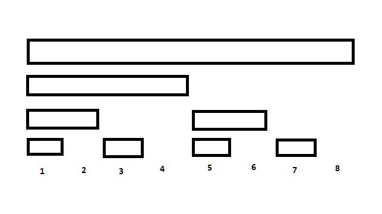

# 线段树，树状数组和 ST 表

## 前言

~~今天~~ 两个月前[金天](https://www.xn--vuqs4zq3d.com/oier/46981)老师给我们讲了一点数据结构，我大受启发，故得此文。

咕了两个月终于开写了。

线段树，树状数组（BIT）和 ST 表可以说是最基础的数据结构了，但是最近看讨论区还有一些人在犯一些知识性错误，为了避免自己犯错误，我觉得还是要复习一下。

## 线段树

### 概述

顾名思义，线段树是一棵二叉树，每个结点代表一段线段，其中任意非叶子结点的两儿子所代表的线段首尾连接能得到该结点代表的线段。



图片来自于[网络](https://zhuanlan.zhihu.com/p/106118909)。

那么假如我们要动态维护每条线段的信息，比如说区间求和之类的，那么我们就可以每次把子节点的信息合并到父亲，这样能在 $O(\log n)$ 的复杂度内实现单点修改，然后由于二进制的性质，每个大区间至多只会覆盖 $O(\log n)$ 个结点，那么区间查询也是 $O(\log n)$ 的。

另外非常重要的一点是（这点会贯穿全文）线段树维护的信息需要满足什么性质。但结论很显然，只要满足结合律即可：

$$(A\oplus B)\oplus C=A\oplus(B\oplus C)$$

其中 $\oplus$ 是你要维护的运算，包括但不限于加法，乘法，$\max$，$\min$，按位与，按位或，按位异或等。

然后大部分线段树基本只有合并部分有区别，所以想线段树要如何维护基本只需要搞懂如何合并即可。

很基础，就不贴代码了。

### 懒标记

考虑有些时候，我们要用线段树维护区间修改（比如区间加，区间赋值），区间查询。但是和某个区间有关的节点数量是 $O(n\log n)$ 级别的，直接做还不如暴力，何解？

过去的某个天才想出了**懒标记**这么一个好办法：

具体来说，我们修改时只修改区间完全覆盖的极大的 $O(\log n)$ 个结点，并在这些结点上打一个懒标记。当我们下一次访问到这些结点时，就把它们的子节点修改了，并下传懒标记。这样就能保证修改的复杂度是 $O(\log n)$ 的了。

然后多个懒标记时要注意懒标记下传的顺序，比如乘法和加法一起维护时要注意先乘后加，加法和赋值一起维护时要考虑赋值对加法的覆盖等。

还是很基础，就不贴代码了（主要是在网上也能找到）。

### 标记永久化

有些时候，懒标记不方便下传（比如 [CF319E ping-pong](https://www.luogu.com.cn/problem/CF319E) 这种维护区间覆盖，如果下传了会爆空间）。这种时候就可以利用标记永久化的思想。

具体来说，不把懒标记下传，只是在查询的时候把经过的所有结点的懒标记统计到一起。容易发现这样和下传其实是等价的，因为代码略难写所以不太常用。而且不太好调试，非必须不建议使用。

### 非递归线段树

通常的线段树是从根到叶子维护的，但是还有一种线段树，是从叶子到根维护的。

一般的线段树并不容易快速找到叶子结点，但在特殊的数据下，我们可以 $O(1)$ 找到叶子结点，最典型的就是完全二叉树（但是其实我也不知道其它的例子 ￣□￣｜｜）。

假设 $N=2^k$，不够就补齐，考虑线段树维护的东西长啥样：


那么我们容易定位到一个点 $i$ 对应的叶子结点，即 $i+N-1$。我们每次除以二再下取整就可以得到这个点的父亲结点。

这里以单点加，区间求和为例。容易得到一个非常简短的建树：

/// details | 参考代码
    open: False
    type: success

```cpp
	void Build(int *A){
		forup(i,1,n) querysum[i+N]=A[i];
		fordown(i,N,1) querysum[i]=querysum[i<<1]+querysum[i<<1|1];
	}
```

///

和一个非常简短的单点修改。

/// details | 参考代码
    open: False
    type: success

```cpp
	void Update(int P,int X){
		for(int i=P+N;i;i>>=1){
			querysum[i]+=X;
		}
	}
```

///

以及一个稍微长一点的区间查询。

/// details | 参考代码
    open: False
    type: success

```cpp
	int AskSum(int l,int r){
		int res=0;
		for(l+=N-1,r+=N+1/* (1)!*/;l^r^1;l>>=1,r>>=1){
			if(!(l&1)) res+=querysum[l^1];// (2)!
			if(r&1)    res+=querysum[r^1];
		}
		return res;
	}
```

1. 转化为开区间。
2. 假如 $l$ 是左儿子说明它的兄弟在区间内，$r$ 同理。
///

这就是 zkw 线段树。

有人可能会问，为什么单点修区间查不用树状数组，但树状数组要维护的东西（如果不是前缀/后缀）必须满足这样两个性质：

1. $A+(B+C)=(A+B)+C$（即结合律）
1. $A+B-A=B$（即可减性）

这里的 $+,-$ 不一定特指加减法，比如异或也满足这样的性质。

而之前说过，线段树维护的只需要满足结合律就行了，比如 $\min,\max$，与，或等常见操作均有结合律，但是没有可减性。这就非常好。

zkw 线段树在单点修改区间查询时表现极其优秀（从各方面），但是区间修改时和普通线段树相比没有明显优势。
### 拓展

但是线段树维护信息必须满足结合律是建立在要求 $O(1)$ 合并的情况下的。

有些时候，当复杂度要求不高时，我们可以考虑 $O(\log n)$ 的合并，并且假如信息不方便存储到每个结点时，可以考虑只存储部分信息然后递归合并。

比如 [P4198 楼房重建](https://www.luogu.com.cn/problem/P4198)。

### 总结

线段树的优势在于可以在线修改 $+$ 询问，并且维护的信息仅必要结合律（有些时候甚至都不必要），所以功能很广泛。缺点在于常数较大（与树状数组对比）。据说以前某位 ACM 金牌曾说过他数据结构只学过线段树就拿到金牌了，可见线段树应用之广泛。

## 树状数组（BIT）

然后就是刚刚提过树状数组了，国外貌似叫这个东西 BIT（Binary Index Tree，二叉索引树），国内由于形式像数组，而且空间是线性的，喜欢叫它树状数组。

树状数组和线段树很像，相当于去掉每个结点的第一级别右儿子的线段树：



由于二进制的性质，BIT 可以在 $O(\log n)$ 的时间内维护每个前缀的信息（当然假如你删的是左儿子就能维护后缀的信息了），当维护的信息具有可减性时，就可以利用前缀信息维护区间的信息了。

再强调一遍：

> 仅维护前缀/后缀信息所需运算律：

$$(A\oplus B)\oplus C=A\oplus(B\oplus C)$$

> 维护区间信息所需运算律：

$$(A\oplus B)\oplus C=A\oplus(B\oplus C)$$

$$A\oplus B\ominus A=B$$

其中 $\ominus$ 表示 $\oplus$ 的逆运算。

然后由于二进制的性质，我们只需要加上 lowbit 就能找到覆盖某结点的上一层结点，减去 lowbit 就能找到结点左侧最高的结点，这使得 BIT 的代码极其好写。

## ST 表

ST 表（Sparse Table，稀疏表）通常用来处理 RMQ（Range Maximum/Minimum Query，区间最大/最小值查询）问题。主要利用了**倍增**算法。

具体来说，我们预处理以每个结点为左端点，长度为 $2$ 的整数次幂的所有区间内的信息，这样的区间显然有 $O(n\log n)$ 个。预处理可以利用倍增实现，复杂度 $O(n\log n)$。

然后查询时，假设我们要查询的区间为 $[l,r]$，长度为 $len$，小于等于 $len$ 的最大 $2$ 的整数次幂为 $2^k$，那么我们将 $[l,l+2^k-1],[r-2^k+1,r]$ 两个区间的信息合并即可 $O(1)$ 查询。

于是显而易见，ST 表维护的信息必须满足以下运算律：

$$(A\oplus B)\oplus C=A\oplus(B\oplus C)$$
$$A\oplus A=A$$

比如 $\min$，$\max$，按位与，按位或等运算都满足以上性质。

但是 ST 表不能在线修改，所以应用面较窄。

## 总结

感觉不太好总结。

通常来说用线段树就行了，但是另外两个更好写，BIT 常数更小，ST 表不支持修改但是复杂度更优。