# 平衡树入门及 Treap

## 前言

平衡树是一种非常棒的数据结构，线段树能做的它能做不少，还能查前驱后继，还没有值域限制，空间复杂度还是 $O(n)$ 的，缺点是常数略大，码量也略大，事实上很多时候我都直接把 `set` 当成平衡树用。另外，其实线段树也可以看做一种只有叶子结点维护信息的特殊的平衡树。

## BST

在平衡树之前，我们先看看远处的 BST（Binary Search Tree）吧！

/// admonition | BST 的定义
    type: quote

BST，全称二叉搜索树（Binary Search Tree）。

二叉搜索树是一种二叉树的树形数据结构，其定义如下：

1. 空树是二叉搜索树。

1. 若二叉搜索树的左子树不为空，则其左子树上所有点的附加权值均小于其根节点的值。

1. 若二叉搜索树的右子树不为空，则其右子树上所有点的附加权值均大于其根节点的值。

1. 二叉搜索树的左右子树均为二叉搜索树。

摘自 [OI Wiki](https://oi-wiki.org/ds/bst/)

///

我们可以对二叉搜索树进行以下操作：

- **插入元素**：直接搜到叶子接在叶子上。
- **删除元素**：和自己左子树最大的叶子或右子树最小的叶子交换，然后删除它。
- **查询元素排名**：从根节点跳到这个值，每次如果向右跳就加上左子树的大小。
- **查询第 $k$ 大**： 分左子树，自己，右子树三段考虑。（这个后面会详细说）
- 等等

容易发现 BST 上操作的复杂度和树高正相关，虽然 BST 最好情况下高度是 $O(\log n)$ 的，但我们可以精心构造数据使得 BST 的形态变成这样：


这样各种操作的复杂度就退化成 $O(n)$ 的了。所以我们肯定希望 BST 稍微平衡一点，平衡树就诞生了。

## Treap

Treap 是一种比较基础的平衡树，它的名字是树（Tree）和堆（Heap）的合成词，就是说它既满足 BST 的性质也满足二叉堆的性质。

具体来说，我们在每插入一个结点时，除了它作为 BST 的权值，再给它随机一个作为二叉堆的权值，因为在随机数据下堆的期望深度是 $O(\log n)$ 的。然后我们考虑通过某种方法使它第一个权值满足 BST 的性质的同时第二个权值满足二叉堆的性质。

## 旋转 Treap

顾名思义，旋转 Treap 就是通过旋转操作维护的 Treap。

什么是旋转操作呢？假如我们有这样一棵 BST：

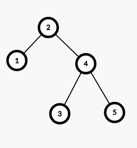

它左旋之后就会变成这样：

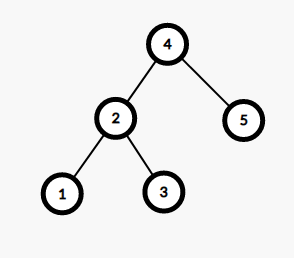

发现没有？它在不改变 BST 性质的条件下改变了结点的上下顺序。

/// details | 参考代码

```cpp
	void RRotate(int &k){
		int t=lson[k];
		lson[k]=rson[t];
		rson[t]=k;
		ssize[t]=ssize[k];
		PushUp(k);
		k=t;
	}
	void LRotate(int &k){
		int t=rson[k];
		rson[k]=lson[t];
		lson[t]=k;
		ssize[t]=ssize[k];
		PushUp(k);
		k=t;
	}
```

///

然后我们就可以利用旋转操作在不改变 BST 性质的同时维护二叉堆的性质，插入时先插到叶子结点再慢慢旋上去，删除时先旋到叶子结点再直接删除，其余操作和 BST 一样。

完整代码就不贴了，主要是我不太喜欢旋转 Treap

## FHQ Treap

FHQ Treap（范浩强 Treap），即无旋 Treap，是一种基于分裂（split）和合并（merge）操作维护的 Treap。

FHQ Treap 码量比旋转 Treap 小，写起来更直观，更好理解，但缺点是常数略大。鉴于现在 CCF 在尽力减小常数对考生成绩的影响，我更推荐学习 FHQ Treap。

首先我们整理一下每个结点要维护哪些信息：

1. 左右儿子（下文代码中 `l,r`）。
1. 作为 BST 的权值（下文代码中 `tv`）。
1. 作为二叉堆的权值（下文代码中 `hv`)。
1. 其它要维护的值（比如 [P3369 【模板】普通平衡树](https://www.luogu.com.cn/problem/P3369) 需要维护子树大小，即下文代码中 `sz`）。

### 基本操作

这是一些非常基本，而且一眼就能看懂的操作。

/// details | 新建结点与合并子树信息
    open: False
    type: success

```cpp
    mt19937 mr(time(0));
    int rd(){// (4)!
        return (unsigned long long)mr()%998244853;
    }
	int cntn,root;// (1)!
	int New(int x){// (2)!
		int nw=++cntn;
		hv[nw]=rd();
		tv[nw]=x;
		sz[nw]=1;
		l[nw]=r[nw]=0;
		return nw;
	}
	void PushUp(int id){// (3)!
		sz[id]=sz[l[id]]+sz[r[id]]+1;
	}
```

1. 结点数量，根结点。
2. 新建结点。
3. 合并操作。
4. 随机数生成。

///

### 分裂（split）操作

分裂操作有两种，按值分裂和按大小分裂，这里因为我的 Treap 不需要按大小分裂就不提了，只说按值分裂。

以这样一棵树为例：

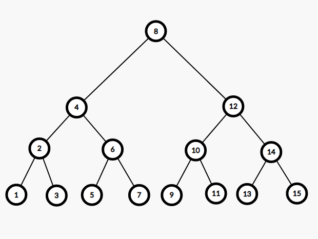

假如我们要按 $5$ 分裂，即分裂成两棵树，其中一棵 $T_1$ 所有权值均小于等于 $5$，另一棵 $T_2$ 均大于 $5$。

分出来就是这样：

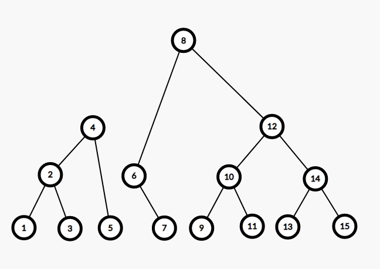

考虑分裂的过程是什么样的。

首先从根节点进入，发现根节点 $8>5$，说明根节点及其整个右子树都属于 $T_2$，而左子树里较大的可能也属于 $T_2$，继续往左子树分离。

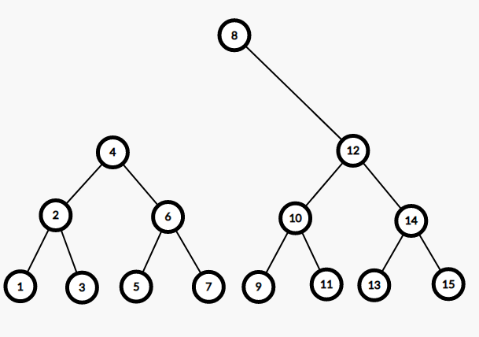

然后进入左子树，发现根节点 $4 \le 5$，说明根节点及其整个左子树都属于 $T_1$，继续往右子树分离。

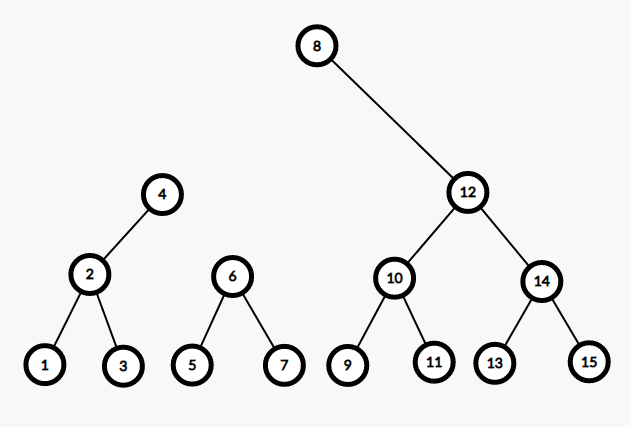

发现 $6>5$，连进 $T_2$，往左子树分离。

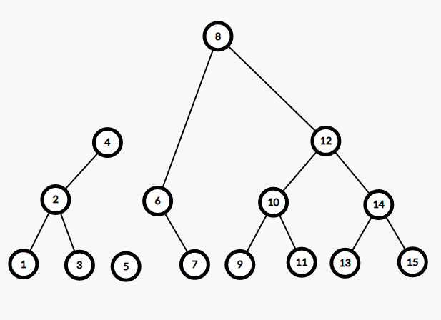

发现 $5 \le 5$，连进 $T_1$，往右子树分离。


发现不存在右子树，操作结束。

利用 C++ 的引用特性，我们可以非常优雅地实现这个过程：

/// details | 参考代码
    type: success
    open: False

```cpp
	void Split(int id,int key,int &x,int &y){
		if(!id){
			x=y=0;
		}else if(tv[id]<=key){
			x=id;
			Split(r[id],key,r[x],y);
			PushUp(id);// (1)!
		}else{
			y=id;
			Split(l[id],key,x,l[y]);
			PushUp(id);
		}
	}
```

1. 所有的修改操作后一定记得合并子树信息。

///

### 合并（merge）操作

由于我们维护的是**一棵**平衡树，分裂之后肯定要合并回去，我们就是要在合并的时候维护二叉堆的性质。

我们合并的时候假定 $T_1$ 中所有数都小于 $T_2$，注意到分裂的过程完全可以保证这个性质。所以我们合并的时候只用额外考虑二叉堆的性质即可。由于 $T_1$ 中所有数都小于 $T_2$，每次要么把 $T_1$ 中的结点 $x$ 放在 $T_2$ 中的结点 $y$ 的左子树，要么把 $y$ 放在 $x$ 的右子树。

假如我们分裂后有两棵这样的树，结点旁的红字为堆权。

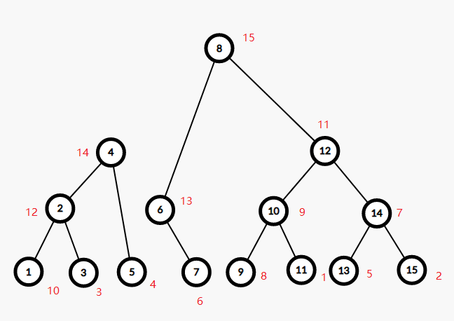

最开始考虑两根结点 $4,8$，发现 $14<15$，左边的当儿子，考虑以 $4,6$（$6$ 即 $8$ 的左儿子）为根结点的两子树合并。

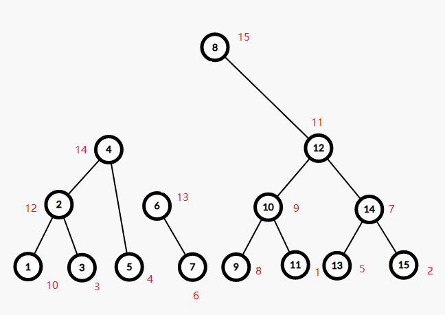

发现 $14>13$，右边的当儿子，考虑 $5,6$（$5$ 即 $4$ 的右儿子）为根结点的两子树合并。

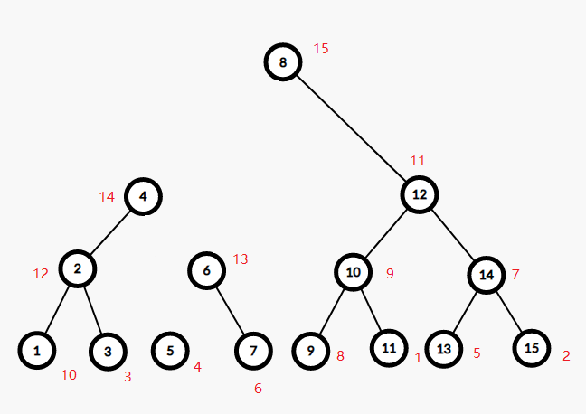

发现 $4<13$，左边的当儿子，考虑 $5,7$ 为根的两子树合并。

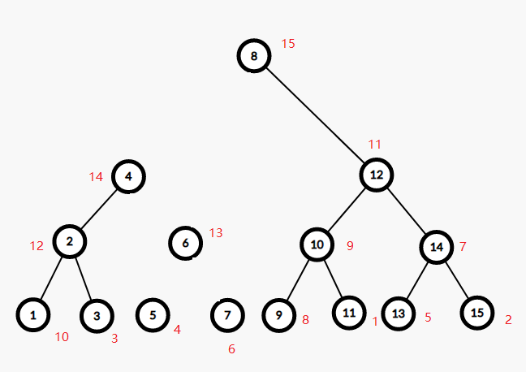

发现 $4<6$，左边的当儿子，考虑 $5$ 和 $7$ 的左儿子为根的两子树合并。

发现 $7$ 没有左儿子，结束查询，回溯时连边。

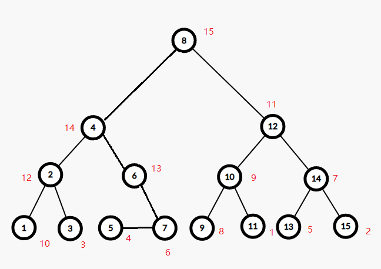

其中 $5$ 是 $7$ 的左儿子。

容易发现这样在保持 BST 性质的同时维护了二叉堆的性质。

写成代码就是这样：

/// details | 参考代码
    open: False
    type: success

```cpp
	int Merge(int x,int y){// (1)!
		if(!x||!y){
			return !x?y:x;
		}else if(hv[x]>hv[y]){
			r[x]=Merge(r[x],y);
			PushUp(x);
			return x;
		}else{
			l[y]=Merge(x,l[y]);
			PushUp(y);
			return y;
		}
	}
```

1. 返回值是以 $x,y$ 为根的两树合并后的根结点。

///

基于这两个操作，我们可以优雅地完成其它操作。

### 其它操作

#### 插入

要插入一个值 $key$，只需要把原树按 $key-1$ 分裂成两棵树，再为 $key$ 新建一个结点，把这三棵树合并起来。

/// details | 参考代码
    open: False
    type: success

```cpp
	void Insert(int key){
		int x,y;
		Split(root,key-1,x,y);
		root=Merge(Merge(x,New(key)),y);
	}
```

///

#### 删除

删除类似，把原数先按 $key$ 分裂成 $T_1,T_2$，再把 $T_1$ 按 $key-1$ 分裂成 $T_3,T_4$。需要注意此时 $T_4$ 中可能有多个值为 $key$ 的结点。我们可以把 $T_4$ 的根结点的儿子的子树合并起来，这样就能实现只删一个，然后把 $T_3,T_4,T_2$ 按顺序合并。如果要删除所有值为 $key$ 的结点的话直接把 $T_3,T_2$ 合并起来即可。

/// details | 参考代码
    open: False
    type: success

```cpp
	void Erase(int key){
		int x,y,z;
		Split(root,key-1,x,y);
		Split(y,key,y,z);
		y=Merge(l[y],r[y]);// (1)!
		root=Merge(Merge(x,y),z);
	}
```

1. 如果题目没有保证要删东西的一定存在这里需要特判一下。

///

#### 查询排名

**普通平衡树**题面中告诉我们排名就是比它小的数的数量加一。我们可以把原树按 $key-1$ 分裂后查询左树的大小再加一即可。

/// details | 参考代码
    open: False
    type: success

```cpp
	int Rank(int key){
		int x,y,ans;
		Split(root,key-1,x,y);
		ans=sz[x]+1;
		root=Merge(x,y);// (1)!
		return ans;
	}
```

1. 分裂了一定记得合并回去。

///

#### 查询排名 XX 的数

假如按大小分裂这个操作有一个非常优雅的写法。但是那样的话所有操作只有这一个必须要按大小分裂，得不偿失，不如直接用 BST 的的写法。

/// details | 参考代码
    open: False
    type: success

```cpp
	int _At(int rk,int id){
		if(rk==sz[l[id]]+1) return tv[id];// (1)!
		else if(rk<=sz[l[id]]) return _At(rk,l[id]);
		else return _At(rk-sz[l[id]]-1,r[id]);
	}
	int At(int rk){// (2)!
		return _At(rk,root);
	}
```

1. BST 上二分要分成左子树，自己，右子树三部分考虑。
2. 我得了一种数据结构不封装就想似的病。

///

#### 求前驱，后继

前驱可以直接按 $key-1$ 分裂后找到左树最大值，后继可以按 $key$ 分裂后找右树最小值。

/// details | 参考代码
    open: False
    type: success

```cpp
	int Pre(int key){
		int x,y,nw,ans;
		Split(root,key-1,x,y);
		nw=x;
		while(r[nw]) nw=r[nw];
		ans=tv[nw];
		root=Merge(x,y);
		return ans;
	}
	int Nxt(int key){
		int x,y,nw,ans;
		Split(root,key,x,y);
		nw=y;
		while(l[nw]) nw=l[nw];
		ans=tv[nw];
		root=Merge(x,y);
		return ans;
	}
```

///

### 垃圾回收优化

发现原来的写法某结点删除后就不会再利用它，这样非常不好，空间常数更大，由于内存访问不连续时间常数也更大，考虑用一个栈存储删掉的结点，新增结点时优先考虑利用之前删掉的那个。

/// details | 改动 `New` 和 `Erase`
    open: False
    type: success

```cpp hl_lines="3 14"
	int stk[N],top;
	int New(int x){
		int nw=(top?stk[top--]:++cntn);
		hv[nw]=rd();
		tv[nw]=x;
		sz[nw]=1;
		l[nw]=r[nw]=0;
		return nw;
	}
	void Erase(int key){
		int x,y,z;
		Split(root,key-1,x,y);
		Split(y,key,y,z);
		stk[++top]=y;
		y=Merge(l[y],r[y]);
		root=Merge(Merge(x,y),z);
	}
```

///

实践证明这样并不会使时间减慢。


## 总结

平衡树这个东西，一般不会用到，但是不怕一万只怕万一啊。