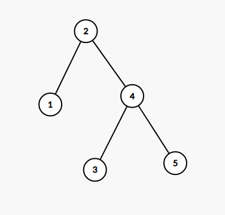
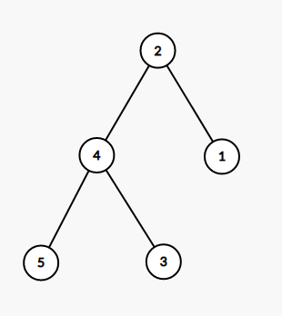

 
# FHQTreap 实现的文艺平衡树

## 前言

在刷专题时看到这个神奇的算法，然后就学了。

## 算法详解

[洛谷模板题](https://www.luogu.com.cn/problem/P3391)

大概就是让你维护一个数据结构，最初有一个单调增的排列，然后让你维护多次区间翻转，输出最终序列。

是模板题就不写题目分析了。 ~~因为我也不知道这个算法是什么神仙想出来的。~~

FHQTreap 维护区间操作的核心思路是**利用树的形态维护中序遍历的序列。** 具体来说，我们要使得维护后 Treap 的树值不一定满足 BST 的性质，但是树值的中序遍历是我们想要的序列。

只看这道题的区间翻转操作，假如我们原先的序列是 $1-2-3-4-5$，那么建出来的树可能是这样（随机赋堆值，然后因为序列是递增的可以看做满足 BST 性质）：



然后考虑翻转后的序列以相同的堆值建树（可以看做满足反过来的 BST）：



容易发现翻转相当于交换每个结点的左右儿子。

那么就有简单思路了，把要翻转的区间 `Split` 出来，然后把这一整块所有结点的左右儿子交换。

但是这样复杂度最劣是 $O(m(\log n+n))$ 的，还不如暴力。

回顾一下线段树的单点操作到区间操作经历了什么变化？我们增加了懒标记。那么我们考虑在 FHQTreap 上用懒标记维护交换操作。

具体来说，修改时把要修改的点的懒标记取反，懒标记表示“这个结点所有子孙的左右儿子需要交换”（和线段树懒标记一样，不包括自己），然后修改时记得下传。其实懒标记包括自己也能做这道题，但是就不方便改成在线做法了。

然后需要注意懒标记下传的时间，记住一句话就行：

> 在访问**任何**结点信息前**都要下传懒标记**。

重要的事情说三遍：

> 在访问**任何**结点信息前**都要下传懒标记**。

> 在访问**任何**结点信息前**都要下传懒标记**。

> 在访问**任何**结点信息前**都要下传懒标记**。

然后复杂度是 $O(n\log n)$ 的，和正常 FHQ 是一样的。

/// details | 参考代码
    open: False
    type: success

```cpp
const int N=5e5+5,inf=0x3f3f3f3f;
int n,m,a[N];
mt19937 mr(time(0));
struct Treap{
	private:
		int ls[N],rs[N],tv[N],hv[N],mark[N],cntn,root;
		int sz[N];
		int _New(int val){
			int nw=++cntn;
			tv[nw]=val;hv[nw]=(unsigned int)mr();
			ls[nw]=rs[nw]=0;
			mark[nw]=0;sz[nw]=1;
			return nw;
		}
		void _PushUp(int id){
			sz[id]=sz[ls[id]]+sz[rs[id]]+1;
		}
		void _Reverse(int id){
			swap(ls[id],rs[id]);
			mark[id]^=1;
		}
		void _PushDown(int id){
			if(mark[id]){
				if(ls[id]) _Reverse(ls[id]);
				if(rs[id]) _Reverse(rs[id]);
				mark[id]=0;
			}
		}
		void _Split(int key,int id,int &u,int &v){
			if(!id){
				u=v=0;
				return;
			}
			_PushDown(id);// (1)!
			if(sz[ls[id]]<key){
				u=id;
				_Split(key-sz[ls[id]]-1,rs[id],rs[u],v);
			}else{
				v=id;
				_Split(key,ls[id],u,ls[v]);
			}
			_PushUp(id);
		}
		int _Merge(int u,int v){
			if(!u||!v) return u|v;
			if(hv[u]>hv[v]){
				_PushDown(u);// (2)!
				rs[u]=_Merge(rs[u],v);
				_PushUp(u);
				return u;
			}else{
				_PushDown(v);
				ls[v]=_Merge(u,ls[v]);
				_PushUp(v);
				return v;
			}
		}
		void _Print(int id){// (3)!
			_PushDown(id);
			if(ls[id]) _Print(ls[id]);
			printf("%d ",tv[id]);
			if(rs[id]) _Print(rs[id]);
		}
	public:// (4)!
		void init(){
			root=cntn=0;
		}
		void Build(int N){
			forup(i,1,N){
				root=_Merge(root,_New(i));
			}
		}
		void Reverse(int L,int R){
			int x,y,z;
			_Split(L-1,root,x,y);_Split(R-L+1,y,y,z);
			_Reverse(y);
			root=_Merge(_Merge(x,y),z);
		}
		void Print(){
			_Print(root);
		}
}mt;
signed main(){
	n=read();m=read();
	mt.init();
	mt.Build(n);
	forup(Case,1,m){
		int l=read(),r=read();
		mt.Reverse(l,r);
	}
	mt.Print();
}
```

1. 在访问左右儿子前下传懒标记。
2. 这里只用下传 $u$ 的懒标记，因为只访问了 $u$ 的结点信息，下面同理。
3. 按中序遍历输出。
4. 我是超级封装王

///

## 例题

### P2042 [NOI2005] 维护数列

[传送门](https://www.luogu.com.cn/problem/P2042)

简要概括题意，就是改成在线的，然后加了几个无关紧要的操作（（（

首先区间推平一样可以用懒标记维护。

然后考虑如何维护最大连续子段和，其实这也很简单，平衡树和线段树有很多共同点，我们可以仿照线段树维护最大连续子段和即可，但是这道题要求子段非空（题目上没明确说，太可恶了），再维护一个最大值即可。

具体来说，除了刚刚说的最大值，还要对每棵子树维护**中序遍历上最大前缀和**，**中序遍历上最大后缀和**，**中序遍历上最大子段和**，**子树和**，然后就和线段树差不多的合并，需要注意一下平衡树是三个区间合并（左子树，右子树，自己）即可。

另外有个小细节，就是翻转的时候**中序遍历上最大前缀和**和**中序遍历上最大后缀和**也需要交换（ ~~这个细节我调了一上午~~ ）。


/// details | 参考代码
    open: False
    type: success

```cpp
#include<bits/stdc++.h>
#define mem(a,b) memset(a,b,sizeof(a))
#define forup(i,s,e) for(int i=(s);i<=(e);i++)
#define fordown(i,s,e) for(int i=(s);i>=(e);i--)
using namespace std;
#define gc getchar()
inline int read(){
    int x=0,f=1;char c;
    while(!isdigit(c=gc)) if(c=='-') f=-1;
    while(isdigit(c)){x=(x<<3)+(x<<1)+(c^48);c=gc;}
    return x*f;
}
#undef gc
const int N=5e5+5,inf=0x3f3f3f3f;
int n,m,a[N];
mt19937 mr(time(0));
struct Treap{
	private:
		int ls[N],rs[N],tv[N],hv[N],mark[N],add[N],cntn,root;
		int sz[N],sum[N],lsum[N],rsum[N],mxsum[N],mx[N];
		int stk[4000005],top;
		int _New(int val){
			int nw=(top?stk[top--]:++cntn);
			tv[nw]=val;hv[nw]=(unsigned int)mr();
			ls[nw]=rs[nw]=0;add[nw]=0;
			mark[nw]=0;sz[nw]=1;
			sum[nw]=val;mx[nw]=val;
			lsum[nw]=rsum[nw]=mxsum[nw]=max(val,0);
			return nw;
		}
		void _PushUp(int id){
			sz[id]=sz[ls[id]]+sz[rs[id]]+1;
			sum[id]=sum[ls[id]]+sum[rs[id]]+tv[id];
			lsum[id]=max(lsum[ls[id]],sum[ls[id]]+tv[id]+lsum[rs[id]]);
			rsum[id]=max(rsum[rs[id]],rsum[ls[id]]+tv[id]+sum[rs[id]]);
			mxsum[id]=max({mxsum[ls[id]],mxsum[rs[id]],rsum[ls[id]]+tv[id]+lsum[rs[id]]});
			mx[id]=max({tv[id],mx[ls[id]],mx[rs[id]]});
		}
		void _Add(int id,int C){
			tv[id]=C;
			sum[id]=sz[id]*C;
			lsum[id]=rsum[id]=mxsum[id]=max(sum[id],0);
			mx[id]=C;
			add[id]=1;
		}
		void _Reverse(int id){
			swap(ls[id],rs[id]);
			swap(lsum[id],rsum[id]);
			mark[id]^=1;
		}
		void _PushDown(int id){
			if(mark[id]){
				if(ls[id]) _Reverse(ls[id]);
				if(rs[id]) _Reverse(rs[id]);
				mark[id]=0;
			}
			if(add[id]){
				if(ls[id]) _Add(ls[id],tv[id]);
				if(rs[id]) _Add(rs[id],tv[id]);
				add[id]=0;
			}
		}
		void _Split(int key,int id,int &u,int &v){
			if(!id){
				u=v=0;
				return;
			}
			_PushDown(id);			
			if(sz[ls[id]]<key){
				u=id;
				_Split(key-sz[ls[id]]-1,rs[id],rs[u],v);
			}else{
				v=id;
				_Split(key,ls[id],u,ls[v]);
			}
			_PushUp(id);
		}
		int _Merge(int u,int v){
			if(!u||!v) return u|v;
			if(hv[u]>hv[v]){
				_PushDown(u);
				rs[u]=_Merge(rs[u],v);
				_PushUp(u);
				return u;
			}else{
				_PushDown(v);
				ls[v]=_Merge(u,ls[v]);
				_PushUp(v);
				return v;
			}
		}
		void _Print(int id){
			_PushDown(id);
			if(ls[id]) _Print(ls[id]);
			printf("%d ",tv[id]);
			if(rs[id]) _Print(rs[id]);
		}
		void _Recovery(int id){
			stk[++top]=id;
			if(ls[id]) _Recovery(ls[id]);
			if(rs[id]) _Recovery(rs[id]);
		}
	public:
		void init(){
			top=root=cntn=0;
			tv[0]=lsum[0]=rsum[0]=sum[0]=mxsum[0]=sz[0]=0;
			mx[0]=-inf;
			mark[0]=add[0]=0;
		}
		void Insert(int P,int *A,int N){
			int x,y;
			_Split(P,root,x,y);
			forup(i,1,N){
				x=_Merge(x,_New(A[i]));
			}
			root=_Merge(x,y);
		}
		void Erase(int P,int N){
			int x,y,z;
			_Split(P-1,root,x,y);_Split(N,y,y,z);
			_Recovery(y);
			root=_Merge(x,z);
		}
		void Modify(int P,int N,int C){
			int x,y,z;
			_Split(P-1,root,x,y);_Split(N,y,y,z);
			_Add(y,C);
			root=_Merge(_Merge(x,y),z);
		}
		void Reverse(int P,int N){
			int x,y,z;
			_Split(P-1,root,x,y);_Split(N,y,y,z);
			_Reverse(y);
			root=_Merge(_Merge(x,y),z);
		}
		int AskSum(int P,int N){
			int x,y,z;
			_Split(P-1,root,x,y);_Split(N,y,y,z);
			int ans=sum[y];
			root=_Merge(_Merge(x,y),z);
			return ans;
		}
		int MaxSum(){
			return mxsum[root]?mxsum[root]:mx[root];
		}
		void Print(){
			_Print(root);
		}
}mt;
char str[10];
signed main(){
	n=read();m=read();
	forup(i,1,n){
		a[i]=read();
	}
	mt.init();
	mt.Insert(0,a,n);
	forup(Case,1,m){
		scanf(" %s",str);
		if(str[0]=='I'){
			int pos=read(),tot=read();
			forup(i,1,tot){
				a[i]=read();
			}
			mt.Insert(pos,a,tot);
		}else if(str[0]=='D'){
			int pos=read(),tot=read();
			mt.Erase(pos,tot);
		}else if(str[0]=='M'&&str[2]=='K'){
			int pos=read(),tot=read(),c=read();
			mt.Modify(pos,tot,c);
		}else if(str[0]=='R'){
			int pos=read(),tot=read();
			mt.Reverse(pos,tot);
		}else if(str[0]=='G'){
			int pos=read(),tot=read();
			printf("%d\n",mt.AskSum(pos,tot));
		}else{
			printf("%d\n",mt.MaxSum());
		}
//		mt.Print();puts("");
	}
}
```

///