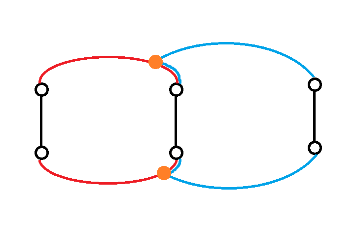

# 点双连通分量与边双连通分量

## 前言

佳老师说点双比边双要难一点，因为性质比较多，定义要更复杂一点，所以先写点双。

约定图的点数是 $n$，边数是 $m$。

另外本文中的图默认是无向图，因为点双的定义是基于无向图的。

## 点双连通分量

### 定义

在网上搜**点双连通图**的定义通常只会搜到“没有割点”，这里给出佳老师讲的定义：

1. 定义 $1$（基础定义）：对于任意两条边，都能用两条不经过重复点的路径连成环。

为什么要将这个定义作为基础定义呢？考虑三条边 $e_1,e_2,e_3$，若 $e_1,e_2$ 能连成环，$e_2,e_3$ 能连成环，那么 $e_1,e_3$ 也能连成环，即此定义具有**传递性**。

关于具体如何构造。考虑两个环分别长什么样：



必定是长这样的（两橙色点可能是 $e_2$ 的端点，但这不影响），所以显然具有传递性。

2. 定义 $2$：（前提：$n\ge 3$）对于任意两个点，都能用两条不经过重复点的路径连城环。

定义 $2$ 是弱于定义 $1$ 的（考虑随便找个出边），所以定义 $1\Rightarrow$ 定义 $2$ 是简单的，考虑证回来。

首先证明在定义 $2$ 下，一条边 $(u,v)$ 和一个点 $x$ 能连成简单环。考虑 $u\to x$ 的路径一条是 $u\to v \to x$，那么必然有至少一条和这一条点不重复，那么把这两条接起来即可。

然后再证到定义 $1$，即两条边 $(u,v),(x,y)$ 能连成简单环，由于 $x,(u,v)$ 能连成简单环，即存在 $x\to u\to v$ 的路径，那么对于必然有一条和它点不向交的 $y\to v$ 的路径，同样的，把它们接起来即可。

3. 定义 $3$（最常用）：没有割点。

割点的定义可以简要理解为“**删掉该点后图不连通**”，其实原本定义好像是基于一个叫点割集的东西的，但是因为貌似不怎么考（佳老师讲省选算法的时候压根没提），记住割点的定义即可。

由定义 $2$ 证到定义 $3$ 是显然的（因为任意两点之间有至少两条点不重复的路径，删掉其中一边还有另一边），又考虑证回来。

这个可以用网络流思想简单解决。怎么用网络流求两点之间不经过重复点的路径数至多有几条呢？容易发现这对点有限制，那么考虑拆点，把每个点拆成入点和出点，然后两点之间连一条容量为 $1$ 的边即可。如果要求 $u,v$ 之间不经过重复点的路径数只需要求 $u_{out}$ 和 $v_{in}$ 之间的最大流即可。

根据最大流最小割定理，最大流等于最小割，而由于不存在割点，任意取 $(u,v)$ 的最小割都大于等于 $2$，故当图没有割点时，任意两点之间都有至少两条点不重复的路径。

另外，特别地，我们认为仅有两点之间连一条边的图也是点双连通图。

---

然后根据点双连通图的定义，我们能得到**点双连通子图**的定义，即一个是点双连通图的子图。

进而可以得到**点双连通分量**的定义：**极大的点双连通子图**。

### 点双连通图相关性质

众所周知，点双连通图具有非常好的性质。

首先，任意指定 $(u,v,x)$，都存在一条简单路径从 $u$ 出发经过 $x$ 到达 $v$。证明的话考虑 $u,v$ 之间必定有一条路径不经过 $x$，然后把它当成一条边再进行一次定义 $1\Rightarrow$ 定义 $2$ 的证明即可。

具体构造考虑源点连向 $x_{in}$，$u_{out},v_{out}$ 连向汇点跑最大流。

然后任意指定 $(u,v,(x,y))$，都存在一条简单路径从 $u$ 出发经过**无向边** $(x,y)$（即不指定方向）到达 $v$，证明和构造同理。

然后此处我们能发现两点之间连一条边的图满足以上性质，所以我们之前才特别定义这样的图也是点双连通图。

### 圆方树

容易发现多个点双连通分量（以下简称**点双**）虽然不共用边（因为点双连通性对于边是有传递性的），但是可能共用点。所以我们不能用缩点的方法把点双缩起来。但是我们还有一个巧妙的办法，叫圆方树。

具体来说，我们对每一个点双建一个**方点**，把原图上的点称作**圆点**。然后每个圆点向所有所属点双的方点连边。由于两点双的交界必然是一个割点（不然就是同一个点双了），那么这样连出来必然是一棵树，我们称之为**圆方树**。

而众所周知，树/森林（相比一般图）具有很多非常好的性质，很多信息都可以在树上轻松维护。所以求圆方树是非常有意义的。

#### 求法

我们通常使用类似于 Tarjan 求割点的算法构建圆方树。

具体来说，考虑 DFS 树，如果一个点子树内没有返祖边返到它的祖先（不含它自己），说明它就是一个割点。

那么为了实现这个功能，我们定义 $dfn_i$ 表示 $i$ 被访问的时间戳，易证对于任意一条垂直的树链，$dfn$ 单调递增。然后定义 $low_i$ 为 $i$ 经过**至多一条**返祖边能到达的时间戳最小结点。

那么上面的条件就是 $low_v\ge dfn_u$（$v$ 是 $u$ 的一个儿子），而如果我们规定 $low$ 数组可以通过父边向上（这样实现也会更方便），那么就有一个更强的性质：$low_v=dfn_u$。更准确的说，对于一条树边 $u\to v$，两点 $u,v$ 在同一个点双中，且 $u$ 是这个点双中最浅的结点当且仅当 $low_v=dfn_u$。

那么我们可以在 DFS 的过程中确定哪些地方存在点双，但是还不能准确确定一个点双所包含的点集。其实这并不难处理，我们可以在 DFS 过程中维护一个栈，存储还未确定所属点双的节点（一个结点可能所属多个点双，只有在全部确定时才会弹出）。在找到点双时，点双中除了 $u$ 以外的其他的点都集中在栈顶端，并且由于是回溯时才处理的这些点，它们的出边必定都被考虑过了，那么它们的所属点双必定全都确定，所以只需要不断弹栈直到弹出 $v$ 为止即可。在弹出时可以直接向点双对应的方点连边，为方便实现，我们可以将方点的序号从 $n+1$ 开始计数，注意最后需要让 $u$ 和对应方点连边，但是不用弹出。

/// details | 参考代码
    open: False
    type: success

```cpp
vector<int> e[N],e2[N];
int dfn[N],low[N],Tm,cntn;
stack<int> stk;
void Tarjan(i64 x){
	dfn[x]=low[x]=++Tm;
	stk.push(x);
	for(auto i:e[x]){
		if(!dfn[i]){
			Tarjan(i);
			low[x]=min(low[x],low[i]);
			if(low[i]==dfn[x]){
				++cntn;
				i64 v=0;
				while(v!=i){
					v=stk.top();stk.pop();
					e2[v].push_back(cntn);
					e2[cntn].push_back(v);
				}
				e2[x].push_back(cntn);
				e2[cntn].push_back(x);
			}
		}else{
			low[x]=min(low[x],dfn[i]);
		}
	}
}
```

///

如此就完成了圆方树的构建。

#### 例题

//// details | [P4630 [APIO2018] 铁人两项](https://www.luogu.com.cn/problem/P4630)
    open: False

题意就是统计所有点对 $(s,t)$，它们之间的所有简单路径点集并（不算端点）的大小之和。

那么显然简单路径点集并的大小就是圆方树中路径上的所有点双大小之和。然后简单容斥可以得到方点点权取点双大小，圆点点权取 $-1$，然后统计树上路径点权和即可。对于统计所有点对，可以统一每个点产生了多少次贡献。这个比较简单。

/// details | 参考代码
    open: True
    type: success

```cpp
#include<bits/stdc++.h>
#define mem(a,b) memset(a,b,sizeof(a))
#define forup(i,s,e) for(i64 i=(s);i<=(e);i++)
#define fordown(i,s,e) for(i64 i=(s);i>=(e);i--)
using namespace std;
using i64=long long;
#define gc getchar()
inline i64 read(){
    i64 x=0,f=1;char c;
    while(!isdigit(c=gc)) if(c=='-') f=-1;
    while(isdigit(c)){x=(x<<3)+(x<<1)+(c^48);c=gc;}
    return x*f;
}
#undef gc
const i64 N=2e5+5,inf=0x3f3f3f3f;
i64 n,m,w[N],ans=0;
vector<i64> e[N],e2[N];
i64 dfn[N],low[N],Tm,cntn;
stack<i64> stk;
int als;
void Tarjan(i64 x){
	dfn[x]=low[x]=++Tm;
	stk.push(x);
	++als;
	for(auto i:e[x]){
		if(!dfn[i]){
			Tarjan(i);
			low[x]=min(low[x],low[i]);
			if(low[i]==dfn[x]){
				++cntn;
				w[cntn]=1;
				i64 v=0;
				while(v!=i){
					v=stk.top();stk.pop();
					e2[v].push_back(cntn);
					e2[cntn].push_back(v);
					++w[cntn];
				}
				e2[x].push_back(cntn);
				e2[cntn].push_back(x);
			}
		}else{
			low[x]=min(low[x],dfn[i]);
		}
	}
}
i64 sz[N];
void dfs2(i64 x,i64 fa){
	sz[x]=(x<=n);
	for(auto i:e2[x]){
		if(i==fa) continue;
		dfs2(i,x);
		ans+=2*sz[x]*sz[i]*w[x];
		sz[x]+=sz[i];
	}
	ans+=2*sz[x]*(als-sz[x])*w[x];
}
signed main(){
	n=read();m=read();
	cntn=n;
	forup(i,1,m){
		i64 u=read(),v=read();
		e[u].push_back(v);
		e[v].push_back(u);
	}
	forup(i,1,n){
		w[i]=-1;
	}
	forup(i,1,n){
		if(!dfn[i]){
			als=0;
			Tarjan(i);
			stk.pop();
			dfs2(i,0);
		}
	}
	printf("%lld\n",ans);
}
```

///

////

//// details | [CF487E Tourists](https://www.luogu.com.cn/problem/CF487E)
    open: False

题意就是有两个操作，一个是修改点权，另一个是查询以 $s$ 开头 $t$ 结尾的所有简单路径上点权最小值。

那么还是用圆方树，然后用 `multiset` 维护每个方点所有儿子的最小值，树剖维护路径上方点即可，注意特判 $\mathrm{lca}$ 的父亲。

对于为什么只维护儿子的最小值，因为一个原点周围可能有很多个方点，如果维护整个点双的最小值复杂度会寄。

/// details | 参考代码
    open: True
    type: success

```cpp
#include<bits/stdc++.h>
#define mem(a,b) memset(a,b,sizeof(a))
#define forup(i,s,e) for(register int i=(s);i<=(e);i++)
#define fordown(i,s,e) for(register int i=(s);i>=(e);i--)
using namespace std;
#define gc getchar()
inline int read(){
    int x=0,f=1;char c;
    while(!isdigit(c=gc)) if(c=='-') f=-1;
    while(isdigit(c)){x=(x<<3)+(x<<1)+(c^48);c=gc;}
    return x*f;
}
#undef gc
const int N=2e5+5,inf=0x3f3f3f3f;
int n,m,q,a[N],cntn;
multiset<int> s[N];
namespace T{
	vector<int> e[N];
	int dpt[N],hig[N],sz[N],son[N],fat[N],f[N];
	void dfs(int x,int fa){
		sz[x]=1;dpt[x]=dpt[fa]+1;
		fat[x]=fa;
		for(auto i:e[x]){
			if(i==fa) continue;
			dfs(i,x);
			sz[x]+=sz[i];
			if(sz[i]>sz[son[x]]||son[x]==0){
				son[x]=i;
			}
		}
	}
	int st[N],ed[N],Tm,seq[N];
	void dfs(int x,int fa,int hh){
		hig[x]=hh;st[x]=++Tm;
		if(x>n) s[x].insert(a[son[x]]);
		if(son[x]!=0) dfs(son[x],x,hh);
		for(auto i:e[x]){
			if(i==fa||i==son[x]) continue;
			if(x>n){
				s[x].insert(a[i]);
			}
			dfs(i,x,i);
		}
		ed[x]=Tm;
		if(x>n) a[x]=*s[x].begin();
		seq[st[x]]=a[x];
	}
	struct SegmentTree{
		#define mid ((l+r)>>1)
		#define lson l,mid,id<<1
		#define rson mid+1,r,id<<1|1
		private:
			int querymin[N<<2];
			void PushUp(int id){
				querymin[id]=min(querymin[id<<1],querymin[id<<1|1]);
			}
		public:
			void Build(int* A,int l=1,int r=cntn,int id=1){
				if(l==r){
					querymin[id]=A[l];
					return;
				}
				Build(A,lson);
				Build(A,rson);
				PushUp(id);
			}
			void Update(int P,int X,int l=1,int r=cntn,int id=1){
				if(l==r){
					querymin[id]=X;
					return;
				}
				if(P<=mid) Update(P,X,lson);
				else       Update(P,X,rson);
				PushUp(id);
			}
			int AskMin(int L,int R,int l=1,int r=cntn,int id=1){
				if(L<=l&&r<=R){
					return querymin[id];
				}
				int res=inf;
				if(L<=mid) res=min(res,AskMin(L,R,lson));
				if(mid< R) res=min(res,AskMin(L,R,rson));
				return res;
			}
	}mt; 
	void NodeUpdate(int P,int X){
		if(fat[P]){
			s[fat[P]].erase(s[fat[P]].find(a[P]));
			s[fat[P]].insert(X);
			a[fat[P]]=*s[fat[P]].begin();	
			mt.Update(st[fat[P]],a[fat[P]]);
		}
		a[P]=X;
		mt.Update(st[P],X);
	}
	int ChainAsk(int x,int y){
		if(hig[x]==hig[y]){
			if(dpt[x]>dpt[y]) swap(x,y);
			int res=mt.AskMin(st[x],st[y]);
			if(x>n&&fat[x]) res=min(res,a[fat[x]]);
			return res;
		}
		if(dpt[hig[x]]<dpt[hig[y]]) swap(x,y);
		int res=inf;
		res=min(res,mt.AskMin(st[hig[x]],st[x]));
		res=min(res,ChainAsk(fat[hig[x]],y));
		return res;
	}
}
vector<int> e[N];
int dfn[N],low[N],dfc;
int stk[N],top;
void Tarjan(int u){
	low[u]=dfn[u]=++dfc;
	stk[++top]=u;
	for(auto v:e[u]){
		if(!dfn[v]){
			Tarjan(v);
			low[u]=min(low[u],low[v]);
			if(low[v]==dfn[u]){
				++cntn;
				a[cntn]=inf;
				for(int x=0;x!=v;--top){
					x=stk[top];
					T::e[x].push_back(cntn);
					T::e[cntn].push_back(x);
				}
				T::e[cntn].push_back(u);
				T::e[u].push_back(cntn);
			}
		}else{
			low[u]=min(low[u],dfn[v]);
		}
	}
}
signed main(){
	n=read();m=read();q=read();
	cntn=n;
	forup(i,1,n){
		a[i]=read();
	}
	forup(i,1,m){
		int u=read(),v=read();
		e[u].push_back(v);
		e[v].push_back(u);
	}
	Tarjan(1);
	T::dfs(1,0);T::dfs(1,0,1);
	T::mt.Build(T::seq);
	while(q--){
		char op;
		scanf(" %1c",&op);
		if(op=='C'){
			int x=read(),w=read();
			T::NodeUpdate(x,w);
		}else{
			int u=read(),v=read();
			printf("%d\n",T::ChainAsk(u,v));
		}
	}
}
```

///

////

## 边双连通分量

感觉边双不好找例题啊。

### 定义

与点双类似，可以定义边双为“**任意两点间有至少两条边不重复的路径**”（另外这个性质是具有传递性的），然后类似可以证明这个定义等价于“**没有割边**”。

### 相关性质

和点双一样，把所有“点不重复”换成“边不重复”即可，这在一些“每条边只能用一次”的问题中可能会很有用。

### 边双缩点及其求法

由于边双连通性对于点是有传递性的，所有任意两个边双不可能共用点。那么我们就可以把一个边双缩成一个点，这就是边双缩点。

$dfn,low$ 两数组的定义和之前一样，但这里的 $low$ 不能通过父边向上，但是又由于有些时候存在重边，所以实现比较麻烦。

然后容易发现，对于一个点 $u$，若 $low_u=dfn_u$，说明 $u$ 是某个边双中最浅的点，然后类似地可以用栈维护。

/// details | 参考代码
    open: False
    type: success

其实这份代码貌似是直接抄了我自己的强连通分量板子，写的比较早，马蜂可能和现在略有差别。

```cpp
vector<int> e[N];
int dfn[N],low[N],blg[N],csc,Tm;
stack<int> stk;
void Tarjan(int x,int fa){
	low[x]=dfn[x]=++Tm;stk.push(x);
	bool flag=true;
	for(auto i:e[x]){
		if(i==fa&&flag){
			flag=false;
			continue;
		}
		if(!dfn[i]){
			Tarjan(i,x);
			low[x]=min(low[x],low[i]);
		}else{
			low[x]=min(low[x],dfn[i]);
		}
	}
	if(dfn[x]==low[x]){
		++csc;
		while(stk.size()&&stk.top()!=x){
			blg[stk.top()]=csc;
			stk.pop();
		}
		blg[x]=csc;stk.pop();
	}
}
```

///

然后缩点之后你可能还要考虑给缩起来的点连边，这个把边存下来即可，注意缩点后是一棵树（显然）。

### 例题

//// details | [CF555E Case of Computer Network](https://www.luogu.com.cn/problem/CF555E)
    open: False

题意就是给边定向，使得一些点对之间存在至少一条有向路径。

容易发现每个边双都能定向成一个强连通分量，因为任意两点间有至少两条路径。

那么就变成了树上问题，可以树上差分维护每条边向下的路径数与向上的路径数，若两边均非零就无解。

注意判原图连不连通。

/// details | 参考代码
    open: True
    type: success

```cpp
#include<bits/stdc++.h>
#define mem(a,b) memset(a,b,sizeof(a))
#define forup(i,s,e) for(int i=(s);i<=(e);i++)
#define fordown(i,s,e) for(int i=(s);i>=(e);i--)
using namespace std;
#define gc getchar()
inline int read(){
    int x=0,f=1;char c;
    while(!isdigit(c=gc)) if(c=='-') f=-1;
    while(isdigit(c)){x=(x<<3)+(x<<1)+(c^48);c=gc;}
    return x*f;
}
#undef gc
const int N=2e5+5,inf=0x3f3f3f3f;
int n,m,q;
vector<int> e[N],e1[N];
int dfn[N],low[N],blg[N],csc,Tm,vis[N],ltk[N];
stack<int> stk;
void Tarjan(int x,int fa,int nw){
	low[x]=dfn[x]=++Tm;stk.push(x);
	bool flag=true;
	ltk[x]=nw;
	for(auto i:e1[x]){
		if(i==fa&&flag){
			flag=false;
			continue;
		}
		if(!dfn[i]){
			Tarjan(i,x,nw);
			low[x]=min(low[x],low[i]);
		}else{
			low[x]=min(low[x],dfn[i]);
		}
	}
	if(dfn[x]==low[x]){
		++csc;
		while(stk.size()&&stk.top()!=x){
			blg[stk.top()]=csc;
			stk.pop();
		}
		blg[x]=csc;stk.pop();
	}
}
int dpt[N],f[N][21];
void dfs(int x,int fa){
	f[x][0]=fa;dpt[x]=dpt[fa]+1;
	forup(i,1,20){
		f[x][i]=f[f[x][i-1]][i-1];
	}
	for(auto i:e[x]){
		if(i==fa) continue;
		dfs(i,x);
	}
}
int lca(int x,int y){
	if(dpt[x]>dpt[y]) swap(x,y);
	for(int i=20;i>=0&&dpt[x]!=dpt[y];--i){
		if(dpt[f[y][i]]>=dpt[x]){
			y=f[y][i];
		}
	}
	if(x==y) return x;
	for(int i=20;i>=0&&f[x][0]!=f[y][0];--i){
		if(f[x][i]!=f[y][i]){
			x=f[x][i];y=f[y][i];
		}
	}
	return f[x][0];
}
int prea[N],preb[N];
void dfs1(int x,int fa){
	vis[x]=1;
	for(auto i:e[x]){
		if(i==fa) continue;
		dfs1(i,x);
		prea[x]+=prea[i];
		preb[x]+=preb[i];
	}
	if(prea[x]!=0&&preb[x]!=0){
		puts("No");
		exit(0);
	}
}
signed main(){
	n=read();m=read();q=read();
	forup(i,1,m){
		int u=read(),v=read();
		e1[u].push_back(v);e1[v].push_back(u);
	}
	forup(i,1,n){
		if(!dfn[i]){
			Tarjan(i,0,i);
		}
	}
	forup(i,1,n){
		for(auto j:e1[i]){
			if(blg[j]!=blg[i]){
				e[blg[i]].push_back(blg[j]);
			}
		}
	}
	forup(i,1,n){
		if(dpt[i]==0){
			dfs(i,0);
		}
	}
	forup(i,1,q){
		int s=read(),t=read();
		if(ltk[s]!=ltk[t]){
			puts("No");
			return 0;
		}
		if(blg[s]==blg[t]) continue;
		int Lca=lca(blg[s],blg[t]);
		prea[blg[s]]++;prea[Lca]--;
		preb[blg[t]]++;preb[Lca]--;
	}
	forup(i,1,n){
		if(!vis[i]){
			dfs1(i,0);
		}
	}
	puts("Yes");
}
```

///

////