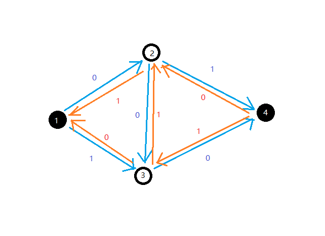
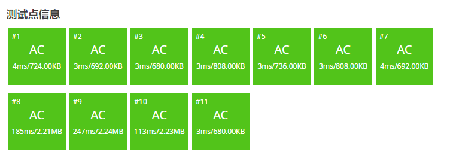

# 网络流基础

## 前言

作为这个博客（时间上的）的第一个算法内容，我本来打算放一点我喜欢的（比如数论基础），但是最近教练勒令我们先自学一下网络流，那来都来了，网络流也是个很重要的内容，不如就先写这个了。

## 定义

学一个东西肯定要先了解它“是什么”，不然就会像我学 DP 一样学了两年没入门。

/// admonition | 网络流的定义
    type: quote


- **网络**的定义：

网络是指一个有向图 $G=(V,E)$。

每条边 $(u,v)\in E$ 都有一个权值 $c(u,v)$，称之为容量（Capacity），当 $(u,v)\notin E$ 时有 $c(u,v)=0$。

其中有两个特殊的点：源点（Source）$s\in V$ 和汇点（Sink）$t\in V$,($s\neq t$)。

- **流**的定义

设 $f(u,v)$ 定义在二元组 ($u\in V,v\in V$) 上的实数函数且满足

- 容量限制：对于每条边，流经该边的流量不得超过该边的容量，即，$f(u,v)\leq c(u,v)$
- 斜对称性：每条边的流量与其相反边的流量之和为 0，即 $f(u,v)=-f(v,u)$
- 流守恒性：从源点流出的流量等于汇点流入的流量，即 $\forall x\in V-\{s,t\},\sum_{(u,x)\in E}f(u,x)=\sum_{(x,v)\in E}f(x,v)$

那么 f 称为网络 G 的流函数。对于 $(u,v)\in E，f(u,v)$ 称为边的**流量**，$c(u,v)-f(u,v)$ 称为边的**剩余容量**。整个网络的流量为 $\sum_{(s,v)\in E}f(s,v)$，即 从源点发出的所有流量之和。

一般而言也可以把网络流理解为整个图的流量。而这个流量必满足上述三个性质，我们称满足这三个性质的流为可行流。

摘自 [OI Wiki](https://oi-wiki.org/graph/flow/)

///

## 网络流常见算法

常见的网络流问题有三种：最大流，最小割，费用流。但是一般都不会直接考，因为网络流的重点是建模（就是如何把一个问题转化为网络流问题 ~~比如著名段子用网络流算 A+B problem~~），所以一般网络流题不会考你具体用哪个算法（但不排除有毒瘤出题人），通常我们三种问题各记一个算法就行了。

### 最大流

我们有一张图，要求从源点流向汇点的最大流量（可以有很多条路到达汇点），就是我们的最大流问题。

最大流是最基础的网络流问题，而解决最大流问题的入门算法有三种。

#### FF 算法

FF（Ford-Fulkerson）算法是解决最大流问题最基础的算法，其它算法基本都是以它为理论基础建立的。但它的复杂度并不优秀所以一般不掌握。

FF 算法的核心在于找增广路，何为增广路？

/// admonition | 增广路的定义
    type: quote

增广路，是从源点到汇点的路径，其上所有边的残余容量均大于 $0$。FF 算法就是不断寻找增广路，直到找不到为止。
///

什么是残余容量？首先每条边最初的残余容量就是它的容量 $c(u,v)$，然后流了一段时间后，这条边的流量为 $f(u,v)$，那么这条边的残余流量就是 $c(u,v)-f(u,v)$。通俗来讲，残余容量就是一条边还能容纳多少流量。残余容量组成的网络叫**残量网络**。

FF 算法的过程就是每次找一条增广路，然后流满这条路的流量，一直到找不到为止。

那么，这个算法一定是对的吗？ ~~明明都说了是最基础的算法怎么可能是错的。~~

确实不一定是对的。


假如我们有这么一个网络，原点 $s=1$，汇点 $t=4$，要求它的最大流。

假如我们第一次找到增广路 $1 \to 2 \to 3 \to 4$，容易发现这样就找不到第二条增广路了。但实际上这张图可以有两条增广路为 $1 \to 2 \to 4$ 和 $1 \to 3 \to 4$。

为了解决这个问题，我们引入了**反向边**，来维护一个类似于“反悔”的过程。


反向边 $(v,u)$ 的残量永远为 $f(u,v)$，即相应的正向边的流量。每次假如有流量经过反向边，那么相当于对对应正向边的流量做**撤销**操作。

比如上一张图，假如我们找到了一条流量为 $1$ 的增广路 $1 \to 2 \to 3 \to 4$，那么残量网络就会变成这样：



这时候我们就能找到另一条流量为 $1$ 的增广路 $1 \to 3 \to 2 \to 4$。

在程序眼里，我们走的两条增广路分别是 $1 \to 2 \to 3 \to 4$ 和 $1 \to 3 \to 2 \to 4$，其实我们自己分析一下会发现这样等价于走 $1 \to 2 \to 4$ 和 $1 \to 3 \to 4$，中间的 $3 \to 2$ 相当于撤销了 $2 \to 3$ 的流量。

值得一提的是，虽然在理论上反向边和正向边是不同的，实际在程序设计上它们并没有什么特别大的差异。

/// details | FF 算法参考代码
    open: False
    type: success

```cpp
struct Flow{
	struct edge{
		int v,rst,nxt;
	}e[M<<1];
	int head[N],cnte=1;// (1)!
	int n,s,t;
	int vis[N];
	void adde(int u,int v,int w){
		e[++cnte]=edge{v,w,head[u]};head[u]=cnte;
		e[++cnte]=edge{u,0,head[v]};head[v]=cnte;
	}
	int dfs(int x,int flow){
		if(x==t){// (2)!
			return flow;
		}
		vis[x]=true;
		for(int i=head[x];i;i=e[i].nxt){
			int v=e[i].v,w=e[i].rst;
			if(w>0&&!vis[v]){
				int c=dfs(v,min(flow,w));
				if(c!=-1){
					e[i].rst-=c;
					e[i^1].rst+=c;// (3)!
					return c;
				}
			}
		}
		return -1;// (4)!
	}
	i64 FF(){
		i64 ans=0,c;
		while((c=dfs(s,inf))!=-1){// (5)!
			mem(vis,0);
			ans+=c;
		}
		return ans;
	}
}mf;
```

1. `cnte` 一定要从 $1$ 开始，后面会解释（其实任何正奇数和 $-1$ 都可以，但是不能为 $0$）。
2. 如果增广路走到汇点直接返回流量。
3. 因为 `cnte` 从 $1$ 开始，又由于每条边和反向边是相邻的，所以每条边和其反向边相异或必定为 $1$。
4. 无法到达汇点，返回 $-1$。
5. 一直重复到找不到增广路为止。

///

FF 算法的复杂度上界为 $O(ef)$，其中 $e$ 为边数，$f$ 为最大流，证明显然，假设每次遍历所有边找到一条流量为 $1$ 的增广路。

在[洛谷模板题](https://www.luogu.com.cn/problem/P3376)上可以获得 $84pts$ 的高分。


#### EK 算法

EK（Edmond-Karp）算法的核心也是找增广路，只不过它是用 BFS 实现的。它可以保证每次找到的都是最短的增广路。

/// details | EK 算法参考代码
    open: False
    type: success

```cpp
queue<int> q;
int pre[N],flow[N];
int bfs(){
    mem(pre,-1);
    while(q.size()) q.pop();
    q.push(s);
    flow[s]=inf;
    while(q.size()){
        int u=q.front();q.pop();
        if(u==t) break;
        for(int i=head[u];i;i=e[i].nxt){
            int v=e[i].v,w=e[i].rst;
            if(w>0&&pre[v]==-1){// (1)!
                pre[v]=i;
                flow[v]=min(flow[u],w);
                q.push(v);
            }
        }
    }
    return pre[t]!=-1;// (2)!
}
i64 EK(){
    i64 ans=0;
    while(bfs()){
        ans+=flow[t];
        for(int i=t;i!=s;i=e[pre[i]^1].v){// (3)!
            e[pre[i]].rst-=flow[t];
            e[pre[i]^1].rst+=flow[t];
        }
    }
    return ans;
}
```

1. 假如这条边还有残量并且 $v$ 没被访问过。
2. 能否到达汇点。
3. 从汇点出发更新残量。

///

EK 算法的复杂度上限为 $O(ve^2)$，其中 $v$ 为点数。证明可以参考[这篇文章](https://www.cnblogs.com/uid001/p/10465580.html)。这个算法已经能通过洛谷模板题了。


#### dinic 算法

事实上，dinic 算法才是广大 OIer 写最大流最常用的算法，据传言提高组出题人中有一个不成文的规定：出最大流题可以卡 EK 算法，但不能卡 dinic 算法。

dinic 算法结合了 FF 算法和 EK 算法的长处，考虑在增广时先用 BFS 对网络按与源点的距离分层，再用 DFS 寻找增广路。每次找增广路时只会往层数高一级的方向找，感性理解的话，这样不兜圈子也不走回头路，就会优化时间，严谨证明可以参考 [OI Wiki](https://oi-wiki.org/graph/flow/max-flow/#dinic-%E7%AE%97%E6%B3%95)。

另外 dinic 算法有两个优化，**当前弧优化**和**多路增广**。虽然这两个优化是本质不同的，当前弧优化是保证复杂度正确的优化而多路增广只是常数优化，但是由于互联网以讹传讹通常被称作 dinic 两大优化。

/// details | dinic 算法参考代码
    open: False
    type: success
```cpp
int dpt[N],cur[N];
bool bfs(){
    while(q.size()) q.pop();
    forup(i,1,n){
        cur[i]=head[i];// (3)!
        dpt[i]=-1;
    }
    dpt[s]=0;
    q.push(s);
    while(q.size()){
        int u=q.front();q.pop();
        for(int i=head[u];i;i=e[i].nxt){
            int v=e[i].v;
            if(dpt[v]==-1&&e[i].rst){// (4)!
                dpt[v]=dpt[u]+1;
                q.push(v);	
            }
        }
    }
    return dpt[t]!=-1;
}
int dfs(int x,int flow){
    if(x==t||!flow) return flow;
    int res=0;
    for(int &i=cur[x];i;i=e[i].nxt){// (1)!
        int v=e[i].v;
        if(dpt[v]==dpt[x]+1){
            int get=dfs(v,min(flow-res,e[i].rst));
            if(get){
                res+=get;
                e[i].rst-=get;
                e[i^1].rst+=get;
                if(res==flow) break;// (2)!
            }
        }
    }
    return res;
}
i64 dinic(){
    i64 ans=0;
    while(bfs()){
        ans+=dfs(s,inf);
    }
    return ans;
}
```

1. 当前弧优化，假设（在当前分层方法下）某条边已经跑满了，那后面它必不可能成为增广路中的边，我们可以复制一份 `head` 数组（即本代码中的 `cur` 数组）来存储第一条还有残量的边。
2. 多路增广，只有在没有剩余流量时才退出，假如 $s \to x$ 还有剩余流量就继续找增广路尽可能把流量流完。
3. 注意每次循环都要更新层数和 `cur` 数组，因为在不同的残量网络上分层可能不同。
4. 如果这条边还有残量且下一个点没被访问过。

///

dinic 的复杂度上界是 $O(v^2e)$，但是据 [OI Wiki](https://oi-wiki.org/graph/flow/max-flow/#%E6%97%B6%E9%97%B4%E5%A4%8D%E6%9D%82%E5%BA%A6%E5%88%86%E6%9E%90_1) 说基本不可能卡到这个上界，在提高组范围内可以看做 $O(\text{能过})$。

在洛谷模板题上跑得飞快。


### 最小割

在最小割之前，我们先讲讲**割**的定义。

/// admonition | 割的相关概念
    type: quote

- **定义**

对于一个网络流图 $G=(V,E)$，其**割**的定义为一种**点的划分方式**：将所有的点划分为 $S$ 和 $T=V-S$ 两个集合，其中源点 $s\in S$，汇点 $t\in T$。

- 割的**容量**

我们的定义割 $(S,T)$ 的容量 $c(S,T)$ 表示所有从 $S$ 到 $T$ 的边的容量之和，即 $c(S,T)=\sum_{u\in S,v\in T,(u,v)\in E}c(u,v)$。当然我们也可以用 $c(s,t)$ 表示 $c(S,T)$。

- 最小割

最小割就是求得一个割 $(S,T)$ 使得割的容量 $c(S,T)$ 最小。

摘自 [OI Wiki](https://oi-wiki.org/graph/flow/min-cut/#%E6%A6%82%E5%BF%B5)。

///

如何求最小割呢？我们有一个非常强的定理。

#### 最大流最小割定理

这个定理的内容非常简单：最大流等于最小割。

/// details | 证明
    open: True
    type: note

形式化地，$f_{max}(s,t)=c_{min}(s,t)$

对于任意一个可行流 $f(s,t)$ 的割 $(S,T)$，我们可以得到：

$$f(s,t) = \sum\limits_{u\in S, v\in T,(u,v)\in E}f(u,v)-\sum\limits_{u\in T, v\in S,(u,v)\in E}f(u,v)$$

就是从 $s$ 到 $t$ 的总量等于流过去的减去流回来的。

由于可行流的性质，上面这玩意儿显然小于等于 $\sum_{u\in S,v\in T,(u,v)\in E}c(u,v)$，所以流小于等于割。

将网络跑出最大流后，可以构造出一个割：把 $s$ 能通过残量网络到的点集设为 $S$，其余设为 $T$， 作为割 $(S,T)$， 从 $S$ 到 $T$ 的边必然满流， 从 $T$ 到 $S$ 的边必然 $0$ 流， 所以这个割的容量就是最大流的流量， 而这个割显然就是最小割。

由于 $s$ 能通过残量网络到的点集为 $S$，所以 $S$ 到 $T$ 显然满流，那么 $T$ 到 $S$ 为什么必定 $0$ 流呢？（~~这不是显然吗~~）但并没有这样一个定理。我们可以用反证法，假设有一条从 $T$ 到 $S$ 的边不 $0$ 流，即 $f(u\in T,v\in S)> 0$，那么对于它的反向边 $(v,u)$，有 $f(v,u)<c(v,u)$，即 $(v,u)$ 不满流，与假设 $u \in T,v\in S$ 矛盾，故从 $T$ 到 $S$ 的边必定 $0$ 流。

///

所以求最小割也是跑一遍 dinic 就行了，甚至还能算出方案，只要遍历一下在残量网络上 $s$ 能到达的所有结点即可。

### 费用流

费用流，全称**最小费用最大流**。我们学最大流时或多或少都会意识到一个网络取到最大流的流不止一个。再某些问题上，网络上的边会有使用代价（比如现实中自来水引水之类的问题），我们需要一种算法来解决在流量等于最大流的情况下，最小化费用的问题。

形式化地，给定一个网络 $G=(V,E)$，每条边除了容量限制 $c(u,v)$，还有一个单位费用 $w(u,v)$，当 $(u,v)$ 的流量为 $f(u,v)$ 时，需要花费 $f(u,v)\times w(u,v)$ 的代价。


则在该网络种总花费最小的最大流称为**最下费用最大流**，即在最大化 $\sum_{(s,v)\in E}f(s,v)$ 的前提下最小化 $\sum_{(u,v)\in E}f(u,v)\times w(u,v)$。

然后反向边的费用为 $w(v,u)=-w(u,v)$，如果你理解了建反向边的意义这是显而易见的。

#### SSP 算法

容易发现找增广路的具体顺序不影响最终最大流具体是多少，这就是 SSP（Successive Shortest Path）算法的核心思路。SSP 算法是一个贪心的算法，它的思路是每次找总的单位费用最小的增广路进行增广，从而使最大流更容易取到最小费用。

注意如果网络上存在单位费用为负的圈，SSP 算法无法正确求出最小费用最大流，但常见的问题通常不会出现负环，所以一般 SSP 就够用了。

/// details | SSP 算法正确性证明
    open: False
    type: info

我们考虑使用数学归纳法与反证法。

假设流量为 $i$ 最小费用为 $w_i$，由于图上没有负圈，所以 $w_0$ 只有一种取值为 $0$。

假如现在费用为 $w_i$，我们找到了一条单位费用总和最小的增广路并增加了 $1$ 流量，那么新的费用就是 $w_{i+1}$，说明这条增广路的单位费用总和为 $w_{i+1}-w_{i}$。

假如存在 $w_{i+1}'<w_{i+1}$，那么肯定存在一条增广路单位费用为 $w_{i+1}'-w_i<w_{i+1}-w_i$，与之前的“单位费用最小”矛盾，故 $w_{i+1}$ 为流量为 $i+1$ 的最小费用。

证毕。

///

实现非常自然，只要把 dinic 中的 BFS 分层换成 Bellman–Ford 或者 SPFA 即可。

/// details | Bellman-Ford + dinic 参考代码
    open: False
    type: success

```cpp
	int dis[N],cur[N],cst,vis[N];
	bool bellman(){
		forup(i,1,n){
			cur[i]=head[i];
		}
		mem(dis,0x3f);mem(vis,0);
		dis[s]=0;
		forup(i,1,n){
			bool flag=false;
			forup(u,1,n){
				if(dis[u]==inf) continue;
				for(int i=head[u];i;i=e[i].nxt){
					int v=e[i].v,w=e[i].w,c=e[i].c;
					if(c==0) continue;
					if(dis[v]>dis[u]+w){
						dis[v]=dis[u]+w;
						flag=true;
					}
				}
			}
			if(!flag) break;// (1)!
		}
		return dis[t]!=inf;
	}
	int dfs(int x,int flow){
		if(x==t||!flow) return flow;
		vis[x]=true;
		int res=0;
		for(int &i=cur[x];i;i=e[i].nxt){
			int v=e[i].v,w=e[i].w;
			if(vis[v]) continue;// (2)!
			if(dis[v]==dis[x]+w){
				int get=dfs(v,min(flow-res,e[i].c));
				if(get){
					res+=get;
					cst+=get*w;
					e[i].c-=get;
					e[i^1].c+=get;
					if(res==flow) break;
				}
			}
		}
		return res;
	}
	pii SSP(){
		int ans=0;
		while(bellman()){
			ans+=dfs(s,inf);
		}
		return mkp(ans,cst);
	}

```

1. 如果没有可以松弛的边直接结束。
2. 注意反向边是负边权的所以只判 `dis[v]==dis[x]+w` 会死循环，所以在费用流中 dinic 相对 EK 算法没什么优势（但也没什么劣势就对了）。

///

然后 Bellman-Ford 过不了[洛谷模板题](https://www.luogu.com.cn/problem/P3381)/kk。


考虑使用 SPFA。

/// details | SPFA 参考代码
    open: False
    type: success

```cpp title='只有 SPFA 部分，其余部分一模一样'
	queue<int> q;
	bool spfa(){
		forup(i,1,n){
			cur[i]=head[i];
		}
		mem(dis,0x3f);mem(vis,0);
		dis[s]=0;
		while(q.size()) q.pop();
		q.push(s);vis[s]=1;
		while(q.size()){
			int u=q.front();q.pop();
			vis[u]=0;
			for(int i=head[u];i;i=e[i].nxt){
				int v=e[i].v,w=e[i].w;
				if(e[i].c&&dis[v]>dis[u]+w){
					dis[v]=dis[u]+w;
					if(!vis[v]){
						q.push(v);
						vis[v]=1;
					}
				}
			}
		}
		mem(vis,0);// (1)!
		return dis[t]!=inf;
	}
```

1. 注意在 dfs 前再次清空 vis 数组。

///

能过模板题。


如果用 Bellman-Ford 求解，每次找增广路的复杂度是 $O(nm)$ 的，故复杂度上界是 $O(nmf)$，如果用 SPFA 就是 $O(nkf)$ 的， ~~可以证明 $k$ 通常不大于 $2$。~~

#### Primal-Dual 原始对偶算法

众所周知 Bellman-Ford 的复杂度为 $O(nm)$，SPFA 也能被卡到 $O(nm)$，在稀疏图和稠密图上都比不上优先队列优化的 Dijkstra 算法 $O(m \log m)$ 的复杂度，但假如一张图上存在负边权的边就不得不用。

而在图论中，有一个叫 Johnson 全源最短路的算法，它求解全源最短路只跑一遍 SPFA，通过给每个点设置势能使得边权全变为正，然后用 Dijkstra 求解，这种算法效率非常高，是 $O(nm\log m)$ 的。

而在费用流中，我们同样需要多次求解最短路，是否有类似的算法呢？答案是肯定的：Primal-Dual 原始对偶算法（简称原始对偶算法）。

首先跑一遍 SPFA 算出源点到每个店的初始距离 $h_i$ 作为改点的初始势能，接下来把每条边边权 $w(u,v)$ 重置为 $w(u,v)+h_u-h_v$，这样所有边权都变为非负的并且最短路一定对应原图的最短路，证明可以参考 [OI Wiki](https://oi-wiki.org/graph/shortest-path/#%E6%AD%A3%E7%A1%AE%E6%80%A7%E8%AF%81%E6%98%8E_1)，或者我未来的最短路文章。

注意到一个问题，每轮增广后残量网络的形态会变化，相应的，势能也应该变化。但我们不可能重新跑一遍 SPFA ~~不然那还不如 SSP 算法~~ 。那具体如何更新呢？设增广后源点到 $i$ 号点的距离为 $d_i$（就是跑 Dijkstra 时求出来的），只需给 $h_i$ 加上 $d_i$ 即可。

/// admonition | 正确性证明
    type: info

首先容易发现这样仍会使最短路对应原图的最短路，对势能分析即可。

然后证明边权非负。

首先这轮增广后，由于可能有一些增广前 $f(i,j)=0$ 在增广路上，残量网络上就会多出一些 $(j,i)$ 的边，一定会满足 $d_j=d_i+w(i,j)+h_i-h_j$，不然 $(i,j)$ 就不在会增广路上了，故 $w(i,j)+(h_i+d_i)-(h_j+d_j)=0$，非负。

对于原有的边，$d_i+w(i,j)+h_i-h_j \ge d_j$，这由最短路“最短”的性质可以得到。故 $w(i,j)+(h_i+d_i)-(h_j+d_j) \ge 0$，同样非负。

故可以用 Dijkstra 算法正确地求出最短路。

///

/// details | 原始对偶算法 +dinic 参考代码
    open: False
    type: success

```cpp linenums="1"
	int cur[N],cst,vis[N],h[N];
	void spfa(){
		queue<int> q;
		mem(h,0x3f);mem(vis,0);
		h[s]=0;
		q.push(s);vis[s]=1;
		while(q.size()){
			int u=q.front();q.pop();
			vis[u]=0;
			for(int i=head[u];i;i=e[i].nxt){
				int v=e[i].v,w=e[i].w;
				if(e[i].c&&dis[v]>dis[u]+w){
					h[v]=h[u]+w;
					if(!vis[v]){
						q.push(v);
						vis[v]=1;
					}
				}
			}
		}
	}
	struct Node{
		int dis,u;
		bool operator <(const Node &r)const{return dis>r.dis;}
		Node(int _dis,int _u){
			dis=_dis;u=_u;
		}
	};
	int dis[N];
	bool dij(){
		priority_queue<Node> q;
		mem(vis,0);
		forup(i,1,n){cur[i]=head[i];}
		mem(dis,inf);dis[s]=0;
		q.push(Node{0,s});
		while(q.size()){
			int u=q.top().u;q.pop();
			if(vis[u]) continue;
			vis[u]=1;
			for(int i=head[u];i;i=e[i].nxt){
				int v=e[i].v,w=e[i].w;
				if(e[i].c&&dis[v]>dis[u]+w+h[u]-h[v]){
					dis[v]=dis[u]+w+h[u]-h[v];
					q.push(Node{dis[v],v});
				}
			}
		}
		mem(vis,0);// (3)!
		return dis[t]!=inf;
	}
	int dfs(int x,int flow){
		if(x==t||!flow) return flow;
		vis[x]=true;
		int res=0;
		for(int &i=cur[x];i;i=e[i].nxt){
			int v=e[i].v,w=e[i].w;
			if(vis[v]) continue;
			if(dis[v]==dis[x]+w+h[x]-h[v]){
				int get=dfs(v,min(flow-res,e[i].c));
				if(get){
					res+=get;
					cst+=get*w;
					e[i].c-=get;
					e[i^1].c+=get;
					if(res==flow) break;
				}
			}
		}
		return res;
	}
	pii PD(){
		int ans=0;
		spfa();// (1)!
		while(dij()){
			ans+=dfs(s,inf);
			forup(i,1,n){
				h[i]+=dis[i];// (2)!
			}
		}
		return mkp(ans,cst);
	}
```

1. 先初始化势能。
2. 每次更新势能。
3. 一定要记得清空 `vis` 数组。

~~但其实费用流写 EK 要好一点。~~

///

跑得快了不少。



## 结语

这篇博客介绍了网络流比较基础的内容，与真正的网络流相比还只是冰山一角，这里引用一句经典的话：

> 这不是结束，甚至不是结束的开始，只是开始的结束。

网络流学习道阻且长，我也要努力啊！