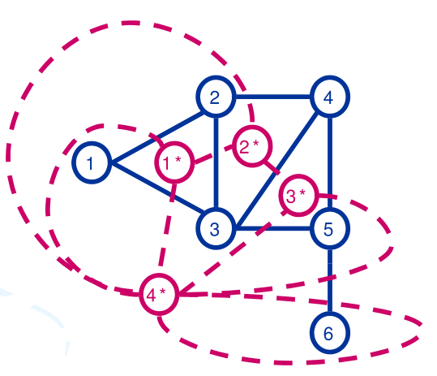
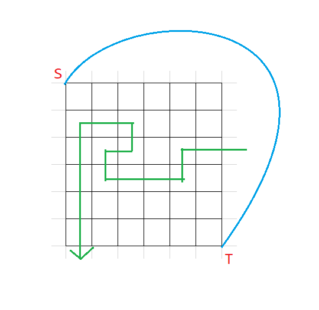

# 平面图性质

## 前言

平面图感觉用的很少啊。但是真考到了不会就是不会，怎么办嘛。

如果图 $G$ 能画在平面 $S$ 上，即除顶点处外无边相交，则称 $G$ 可平面嵌入 $S$，$G$ 为可平面图或平面图。画出的没有边相交的图称为 $G$ 的平面表示或平面嵌入。

一般来说很少遇到题上直接说是“平面图”的情况。但是当题目给定一“网格图”时，你可能就需要考虑这些性质了。

设 $G$ 是平面图，由 $G$ 的边将 $G$ 所在的平面划分成若干个区域，每个区域称为 $G$ 的一个面，其中面积无限的面称为无限面或外部面，面积有限的称为有限面或内部面。包围每个面的所有边组成的回路称为该面的边界，边界的长度称为该面的次数。

平面图中所有面的次数之和等于边数 $E$ 的 $2$ 倍（这个显然吧，每条边会增加两个面的次数）。

看了眼 OI wiki 感觉就下面这两个东西可能考到啊。

## 平面图的欧拉公式

这个可以用于判断某些具有特殊性质的平面图连通块数量。

公式内容很简单，对于一个连通的有至少一个点的平面图，$V+F-E=2$，其中 $V$ 是图中点的个数，$F$ 是面的个数，$E$ 是边的个数。

- 证明

首先考虑单个点，显然 $V+F-E=2$(因为本来平面就是一个面)。

而考虑加一条边，容易发现一条边必定使点数 $+1$（直接新建一个点连过去）或使面数 $+1$（将两个点连起来，不能与其它边相交），那么显然上式的值是不会变的。

- 推论：

> 对于有 $p$ 个连通块的平面图，有 $V+F-E=p+1$。

这个根据刚才的证明过程显然。

> 设 $G$ 是 $V \ge 3$ 阶 $E$ 条边的简单平面图，则 $E \le 3V-6$

容易发现任意闭合的面次数都至少为 $3$，而次数之和为 $2E$。则有 $3F\le 2E$。带入平面图欧拉公式即可得到 $E\le 3V-6$。

## 对偶图

设 $G$ 是平面图的某一个平面嵌入，构造图 $G'$：

- 在 $G$ 的每个面 $R_i$ 中放置 $G'$ 的一个顶点 $v'$
- 设 $e$ 为 $G$ 的一条边，若 $e$ 在 $G$ 的面 $f_i$ 和 $f_j$ 的公共边界上，做 $G'$ 的边 $e'$ 与 $e$ 相交，且 $e'$ 关联 $G'$ 的顶点 $v_i',v_j'$，即 $e'=(v_i', v_j')$，$e'$ 不与其他任何边相交。若 $e$ 为 $G$ 中桥且在 $f_i$ 的边界上，则 $e'$ 是以 $f_i$ 中顶点 $v_i'$ 为端点的环，即 $e'=(v_i',v_i')$。

称 $G'$ 为 $G$ 的对偶图。

举例（图源下文“参考资料”）：



### 性质

1. $G'$ 为平面图，且是平面嵌入。
1. $G$ 中自环在 $G'$ 中对应桥，$G$ 中桥在 $G'$ 中对应自环。
1. $G'$ 是连通的。
1. 若 $G$ 的面 $f_i,f_j$ 的边界上至少有两条公共边，则关联 $v_i',v_j'$ 的边有重边。
1. 同构的图的对偶图不一定是同构的。
1. $G''$ 与 $G$ 同构当且仅当 $G$ 是连通图。
1. $G,G'$ 边数相同，$G$ 的面数等于 $G'$ 的点数。$G$ 的点数等于 $G'$ 的面数。

### 网络流

[参考资料](https://www.doc88.com/p-3058242215674.html)

那么平面图是怎么和网络流扯上关系的呢？

容易发现 $G'$ 中任意一个环都能把 $G$ 的点集分成不交的两份。这和**割**的定义十分有关。

假设我们有一个有源汇平面图网络 $G$，记源点为 $s$，汇点为 $t$。假如我们能找到一个平面嵌入，使得 $s,t$ 均暴露在外部平面中（其实只要与同一个面相邻就行了）。这时候我们连一条连接 $s,t$ 的虚边得到 $G_{\ast}$。这条边显然会把外部平面分成两块，容易发现 $G_{\ast}'$ 中包含这两个面（它们在 $G_{\ast}'$ 中是点）的环与 $s,t$ 的割一一对应！

那么更进一步的，我们给 $G_{\ast}'$ 中的边赋权值等于与其相交的边容量（对于朝向问题，这个要根据具体题目来）。容易发现这样得出的那两个面之间的最短路就是原图的最小割。

于是就能 $O(n\log n)$ 地求出最小割了。

例题：[P2046 [NOI2010] 海拔](https://www.luogu.com.cn/problem/P2046)

//// details | 题解
    open: False
    type: example

> 题意

- 给定一 $(n+1)\times (n+1)$ 的网格图，每条边有边权，且每条边与其反向边边权不一定相同。
- 你需要给每个点实数赋点权 $h_i$，每条有向边 $(u\to v,w)$ 会产生 $\max(0,h_v-h_u)\times w$ 的贡献。初始最左上角点权为 $0$，最左下角为 $1$。
- 最小化贡献和，输出答案四舍五入到整数。

> 题解

容易发现 $h_i$ 取值只取 $0,1$ 是不劣的。证明考虑调整法，此处略。

那么这道题就是求平面图最小割，考虑转化对偶图最短路。那么思考如何给边赋权。

考虑这么一个割：



注意到每条割边的贡献是它从 $S$ 到 $T$ 这个方向的边权。假如最短路按箭头方向走，容易发现原图上对应边顺时针转 $90^{\circ}$ 即得到对偶图对应边边权。

于是做完了，复杂度 $O(n^2\log n)$。

/// details | 参考代码
    open: False
    type: success

```cpp
#include<bits/stdc++.h>
#define forup(i,s,e) for(int i=(s),E123123123=(e);i<=E123123123;++i)
#define fordown(i,s,e) for(int i=(s),E123123123=(e);i>=E123123123;--i)
#define mem(a,b) memset(a,b,sizeof(a))
#ifdef DEBUG
#define msg(args...) fprintf(stderr,args)
#else
#define msg(...) void();
#endif
using namespace std;
using i64=long long;
using pii=pair<int,int>;
#define fi first
#define se second
#define mkp make_pair
#define gc getchar()
int read(){
	int x=0,f=1;char c;
	while(!isdigit(c=gc)) if(c=='-') f=-1;
	while(isdigit(c)){x=(x<<1)+(x<<3)+(c^48);c=gc;}
	return x*f;
}
#undef gc
const int N=510,inf=0x3f3f3f3f;
int n,s,t;
struct edge{
	int v,w;
}; 
vector<edge> e[N*N];
int dis[N*N],vis[N*N];
void dijkstra(){
	priority_queue<pii,vector<pii>,greater<pii> > q;
	mem(dis,0x3f);
	dis[s]=0;
	q.push(mkp(0,s));
	while(q.size()){
		int u=q.top().se;q.pop();
		if(vis[u]) continue;
		vis[u]=1;
		for(auto i:e[u]){
			int v=i.v,w=i.w;
			if(dis[v]>dis[u]+w){
				dis[v]=dis[u]+w;
				q.push(mkp(dis[v],v));
			}
		}
	}
}
signed main(){
	n=read();++n;
	s=(n-1)*n+1;t=s+1;
	forup(i,1,n){
		forup(j,1,n-1){
			int a=read();
			if(i==1){
				e[s].push_back(edge{(i-1)*n+j,a});
			}else if(i==n){
				e[(i-2)*n+j].push_back(edge{t,a});
			}else{
				e[(i-2)*n+j].push_back(edge{(i-1)*n+j,a});
			}
		}
	}
	forup(i,1,n-1){
		forup(j,1,n){
			int a=read();
			if(j==n){
				e[s].push_back(edge{(i-1)*n+j-1,a});
			}else if(j==1){
				e[(i-1)*n+j].push_back(edge{t,a});
			}else{
				e[(i-1)*n+j].push_back(edge{(i-1)*n+j-1,a});
			}
		}
	}
	forup(i,1,n){
		forup(j,1,n-1){
			int a=read();
			if(i==n){
				e[t].push_back(edge{(i-2)*n+j,a});
			}else if(i==1){
				e[(i-1)*n+j].push_back(edge{s,a});
			}else{
				e[(i-1)*n+j].push_back(edge{(i-2)*n+j,a});
			}
		}
	}
	forup(i,1,n-1){
		forup(j,1,n){
			int a=read();
			if(j==1){
				e[t].push_back(edge{(i-1)*n+j,a});
			}else if(j==n){
				e[(i-1)*n+j-1].push_back(edge{s,a});
			}else{
				e[(i-1)*n+j-1].push_back(edge{(i-1)*n+j,a});
			}
		}
	}
	dijkstra();
	printf("%d\n",dis[t]);
}
```

///

////