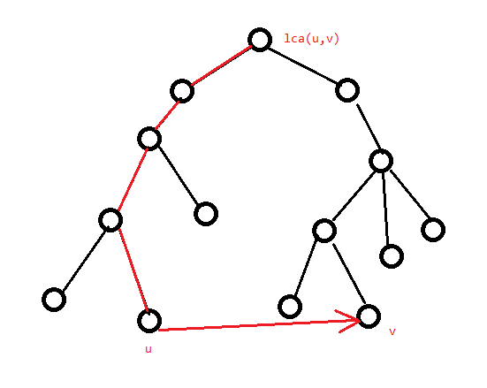

# 最短路

## 记号与约定

记一条边的边权为 $w(u,v)$ 或 $w_e$，记一条有边权的边为 $(u,v,w)$。

记图 $G=(V,E)$ 点数为 $n$，边数为 $m$。

## 单源最短路径问题

### 记号与约定

此处约定源点为 $s$，$dis_u$ 为源点到 $u$ 的“估计最短路”，$D_u$ 为“实际最短路”。最初除源点外，$dis_u$ 均为 $+\infty$，显然在任意时刻均有 $dis_u\ge D_u$，且算法执行完成时要求 $dis_u=D_u$。

### 性质

对于没有负环（即环上边权和为负）的图，任意两点间的最短路不会重复经过边或点。由此可得最短路最多包含 $n$ 个点 $n-1$ 条边。

### Bellman-Ford

Bellman-Ford 是一种暴力求解无负环图上最短路的算法。

此处定义“松弛”操作为遍历所有边，对于一条有向边（无向边视作两条有向边）$(u,v,w)$，执行 $dis_v=\min(dis_v,dis_u+w)$。执行 $n-1$ 次松弛即可求得最短路。

/// admonition | 证明

证明很简单，考虑 $s\to u$ 的最短路 $s\to p_1\to p_2\dots \to p_k\to u$，容易发现 $s\to p_k$ 前缀部分的肯定是 $s\to p_k$ 的最短路（不然这条路径就不是 $s\to u$ 的最短路了），也就是说 $s\to u$ 的最短路 $dis_u$ 必定是从一条边数少 $1$ 的最短路更新的。由于最短路最多包含 $n-1$ 条边，而边数为 $0$ 的最短路从开头就是确定的，故松弛 $n-1$ 次可以得到所有最短路。

///

但是有个问题，若图上有负环，那么最短路边数会大于 $n-1$。若第 $n$ 次松弛仍有 $dis$ 被更新，说明图上存在负环。

复杂度 $O(nm)$。

### Dijkstra

Dijkstra 是基于**贪心**的最短路算法，适用于**非负权图**。

我们维护两个集合 $S,T$，初始所有点均在 $T$ 中，初始化 $dis_s=0$，其余 $dis$ 赋为 $+\infty$。

然后重复以下两个操作直到 $T=\varnothing$：

1. 从 $T$ 中取出 $dis$ 最小的点 $u$。
1. 松弛 $u$ 所有出边，将 $u$ 加入 $S$ 集合。

由于没有负权边，所以对于每次取出的 $u$，$dis_u$ 单调不降。而每次取出 $u$ 时必定满足 $dis_u=D_u$ 考虑证明。

/// admonition | 证明

考虑利用归纳法和反证法证明。

首先初始情况，$S=\varnothing$，$S$ 中的结点显然全部满足于 $D_u=dis_u$。

接下来考虑 $p_0,p_1\dots p_{k-1}\in S$，此时取出的点为 $p_k$。

若 $p_k$ 未被更新，说明 $\forall v\in T,dis_{v}=+\infty$，也就是说这些点无法从 $s$ 出发抵达。此时 $dis_{p_k}=D_{p_k}=+\infty$，符合条件。

若 $p_k$ 被更新过，即 $\exists i<k,dis_{p_k}=dis_{p_i}+w(p_i,p_k)$。假设此时 $dis_{p_k}\ne D_{p_k}$，说明 $D_{p_k}$ 无法从 $p_0,p_{1}\dots p_{k-1}$ 更新过来，那么必然存在 $v\in T,j<k$，使得 $D_{p_k}=dis_{p_j}+w(p_j,v)+w(v,p_k)$，由于 $p_k$ 的最短路前驱确定，而且 $dis_v$ 必定已经从 $p_j$ 更新过了，可以推出此时 $D_v=dis_v=dis_{p_j}+w(p_j,v)$，所以 $D_{p_k}=D_v+w(v,p_k)$，进而可得 $D_{p_k}\ge D_v$。由定义得 $dis_{p_k}\ge D_{p_k}$，但是由于 $dis_{p_k}\ne D_{p_k}$ 故 $dis_{p_k}>D_{p_k}$。即 $dis_v=D_v\le D_{p_k}<dis_{p_k}$，可得 $dis_v<dis_{p_k}$。但是由于 $v$ 还没被取出 $T$ 集合，故 $dis_{v}\ge dis_{p_k}$。推出矛盾。故此时必定有 $D_{p_k}=dis_{p_k}$。

///

然后每次取出 $dis$ 最小的点这个过程，直接暴力是 $O(n^2)$ 的。对于稀疏图可以考虑用优先队列等数据结构维护二元组 $(u,dis_u)$，并以 $dis_u$ 为第一关键字升序排列。复杂度 $O(m\log m)$。

/// details | [模板题](https://www.luogu.com.cn/problem/P4779)参考代码
    open: False

```cpp
const int N=1e5+5,inf=0x3f3f3f3f;
int n,m,s;
struct edge{
	int v,w;
};
vector<edge> e[N];
struct Node{
	int dis,u;
	bool operator <(const Node &r)const{return dis>r.dis;}
};
priority_queue<Node> q;
int vis[N],dis[N];
signed main(){
	n=read();m=read();s=read();
	forup(i,1,m){
		int u=read(),v=read(),w=read();
		e[u].push_back(edge{v,w});
	}
	mem(dis,0x3f);
	dis[s]=0;q.push(Node{0,s});
	while(q.size()){
		int u=q.top().u;q.pop();
		if(vis[u]) continue;
		vis[u]=1;
		for(auto i:e[u]){
			int v=i.v,w=i.w;
			if(dis[u]+w<dis[v]){
				dis[v]=dis[u]+w;
				q.push(Node{dis[v],v});
			}
		}
	}
	forup(i,1,n){
		printf("%d ",dis[i]);
	}
}
```

///

在单源最短路径问题中，对于每条边 $(u,v)\in E$，有 $D_u+w(u,v)\ge D_v$。这样的形式称为三角形不等式。事实上，观察上面的证明，容易发现关键步骤就是这个三角形不等式中 $w(u,v)\ge 0$。也就是说只要图上信息满足三角形不等式，且 $w$ 均非负，就能用 dijkstra 算法求出最短路。

**拓展**：当边权只有 $0,1$ 两种，可以用双端队列代替优先队列，将以 $0$ 权边拓展的点压入队首，以 $1$ 权边拓展的点压入队尾即可。

### SPFA 与负环

SPFA（Shortest Path Faster Algorithm）是队列优化的 Bellman-Ford。

OI 界流传着一句广为人知的话：关于 SPFA，他死了。

原因是因为虽然在随机图上表现优秀，但在特殊构造的图（比如只有一个点度数为 $n-1$，其余点度数全为 $1$ 的菊花图）上，会被卡到和 Bellman-Ford 一样的复杂度。所以大部分情况还是推荐能用 dijkstra 就不要用 SPFA。

容易发现，对于 Bellman-Ford，每次只有上次被松弛过的结点连的边可能在下一次松弛中有效。那么我们用队列来维护**哪些结点可能会引起松弛操作**，就能只访问必要的边了。

具体来说，松弛点 $x$ 时找到接下来可能松弛的点，即与 $x$ 相邻且**最短路被更新的点**并压入队列。此外，记录一个点是否在队列中，若是则不压入，可以显著减小常数。

SPFA 也可以用于判断 $s$ 点是否能抵达一个负环，只需记录最短路经过了多少条边，当经过了至少 $n$ 条边时，说明 $s$ 点可以抵达一个负环。但是注意，从 $s$ 点出发没有找到负环不代表整张图上没有负环。如果想求出整张图上是否有负环可以考虑建一个超级源点向所有点连有向 $0$ 权边。

/// details | [P3371 【模板】单源最短路径（弱化版）](https://www.luogu.com.cn/problem/P3371)
    open: False

代码加了负环判断（虽然对这道题没用）。

```cpp
#include<bits/stdc++.h>
#define mem(a,b) memset(a,b,sizeof(a))
#define forup(i,s,e) for(int i=(s);i<=(e);i++)
#define fordown(i,s,e) for(int i=(s);i>=(e);i--)
using namespace std;
#define gc getchar()
inline int read(){
    int x=0,f=1;char c;
    while(!isdigit(c=gc)) if(c=='-') f=-1;
    while(isdigit(c)){x=(x<<3)+(x<<1)+(c^48);c=gc;}
    return x*f;
}
#undef gc
const int N=1e4+5,inf=2147483647;
int n,m,s;
struct edge{
	int v,w;
};
vector<edge> e[N];
queue<int> q;
int dis[N],cnt[N],vis[N];
bool SPFA(){
	forup(i,1,n){
		dis[i]=inf;
	}
	dis[s]=0;q.push(s);vis[s]=1;
	while(q.size()){
		int u=q.front();q.pop();vis[u]=0;
		for(auto i:e[u]){
			int v=i.v,w=i.w;
			if(dis[v]>dis[u]+w){
				dis[v]=dis[u]+w;
				cnt[v]=cnt[u]+1;
				if(cnt[v]>n) return false;//有负环
				if(!vis[v]) q.push(v),vis[v]=1;
			}
		}
	}
	return true;
}
signed main(){
	n=read();m=read();s=read();
	forup(i,1,m){
		int u=read(),v=read(),w=read();
		e[u].push_back(edge{v,w});
	}
	SPFA();
	forup(i,1,n){
		printf("%d ",dis[i]);
	}
}
```

///

## 三角形不等式与差分约束

之前 Dijkstra 位置提到过，一张没有负环的图必然满足三角形不等式，证明显然。

那么考虑加入给你一些形如 $x_u-x_v\ge c$ 的限制，要你求出 $x$ 序列。这个相当于是给你所有边 $D_u-c\ge D_v$，让你求出到每个点的最短路。

容易发现，若有负环则误无解，因为有负环相当于要求一个数加上一个负数后仍等于它自己。

/// details | [模板题](https://www.luogu.com.cn/problem/P5960)参考代码
    open: False

```cpp
const int N=5e3+5,inf=2147483647;
int n,m,s;
struct edge{
	int v,w;
};
vector<edge> e[N];
queue<int> q;
int dis[N],cnt[N],vis[N];
bool SPFA(){
	forup(i,1,n){
		dis[i]=inf;
	}
	dis[s]=0;q.push(s);vis[s]=1;
	while(q.size()){
		int u=q.front();q.pop();vis[u]=0;
		for(auto i:e[u]){
			int v=i.v,w=i.w;
			if(dis[v]>dis[u]+w){
				dis[v]=dis[u]+w;
				cnt[v]=cnt[u]+1;
				if(cnt[v]>n) return false;
				if(!vis[v]) q.push(v),vis[v]=1;
			}
		}
	}
	return true;
}
signed main(){
	n=read();m=read();s=0; 
	forup(i,1,m){
		int u=read(),v=read(),w=read();
		e[v].push_back(edge{u,w});
	}
	forup(i,1,n){
		e[0].push_back(edge{i,0});
	}
	if(SPFA()){
		forup(i,1,n){
			printf("%d ",dis[i]);
		}
	}else{
		puts("NO");
	}
}
```

///

然后有些时候题目可能会要求你求字典序极值的解。由于最短路的性质，容易发现对于一个 $i$，从源点到 $i$ 的路径上每条边都满足 $x_u+w(u,v)=x_v$，如果将 $x_i$ 增大 $1$，那么路径上必然有某个点的限制无法被满足。即**所有点都取到了理论最大值**。对于最小的，考虑取相反数，限制就从 $x_u+w(u,v)\ge x_v$ 变成了 $-x_v+w(u,v)\ge -x_u$，然后算字典序最大值再取相反数即可。

## 全源最短路径

全源最短路径问题是给定一张图 $G=(V,E)$，要你对每一个点对 $(u\in V,v\in V)$，求出 $D_{u,v}$。

对于非负权图，全源最短路径复杂度最低的算法其实是对每个点跑 dijkstra，复杂度是 $O(nm\log m)$（稀疏图）或者 $O(n^3)$（稠密图），用更高级的堆可以获得更好的复杂度。所以只考虑负权图的全源最短路。

### Floyd 与传递闭包

Floyd 是一种基于 DP 的全源最短路算法，可以解决负权图的全源最短路径问题。

考虑一条 $s\to t$ 的最短路上除去 $s,t$ 以外的所有点 $k$，都有 $D_{s,k}+D_{k,t}=D_{s,t}$。

那么容易想到 DP，设 $f_{k,s,t}$ 表示除去起点终点外，只经过编号小于等于 $k$ 的点时的 $dis_{s,t}$。

那么初始状态就是将 $f_0$ 初始化为邻接矩阵。然后转移就是每次枚举 $i,j$，用 $f_{k-1,i,k}+f_{k-1,k,j}$ 更新 $f_{k,i,j}$。

然后容易发现每次都是用第 $k$ 行，第 $k$ 列的点更新不在这两行列的点，那么是不用担心重复转移的，可以直接把第一维压掉。

/// details | 参考代码
    open: False

```cpp
forup(k,1,n){
    forup(i,1,n){
        if(i==k) continue;//其实这一句可以不加，但是因为若 i=k 答案不会更新，这样可以减小常数
        forup(j,1,n){
            if(j==i||j==k) continue;
            f[i][j]=min(f[i][j],f[i][k]+f[k][j]);
        }
    }
}
```

///

此外，Floyd 可以求有向图 $G$ 的**传递闭包**（这是个名词），有向图 $G$ 的**传递闭包**定义为 $n$ 阶 $01$ 矩阵 $T$，并且对于所有点对 $i,j$，$T_{i,j}=1$ 当且仅当 $i$ 可达 $j$。做法和求最短路类似，只是内部的式子写成 $T_{i,j}=T_{i,j}\lor(T_{i,k}\land T_{k,j})$ 即可。

### Johnson

考虑既然负权图跑不了，就想办法把它变成非负权图。这里有一个非常巧妙地想法，结合物理中的**势能**知识，给每个点加一个势能，使得所有边权变正，且只要起点终点相同，势能总量固定。

具体来说，先随便选一个源点（由于图不一定连通，最好新建一个超级源点）跑一遍 SPFA 或者 Bellman-Ford，然后把每个点的势能 $h_i$ 设为 $D_i$。在后面对每个点跑 dijkstra 时，将每条边 $(u,v,w)$ 的权值改为 $h_u+w-h_v$ 即可。

首先证明 $h_u+w-h_v$ 非负。由三角形不等式可得 $h_u+w\ge h_v$，显然有 $h_u+w-h_v\ge 0$。

然后考虑证明这样找出来的最短路就是原先的最短路，设这样得出的最短路长度为 $D_{s,t}'$。

那么设这样找出来的最短路为 $P=p_0,p_1,p_2\dots p_{k-1},p_k$（$p_0=s,p_k=t$），可以得到：

$$
\begin{aligned}
D_{s,t}'&=\sum_{i=0}^{k-1}h_{p_i}+w(p_i,p_{i+1})-h_{p_{i+1}}\\\\
&=h_{p_0}+h_{p_k}+\sum_{i=0}^{k-1}w(p_i,p_{i+1})
\end{aligned}
$$

容易发现这个势能只和起点终点有关，而既然势能固定，那么后面这一堆显然取到最小值，即最短路径长度。

复杂度 $O(nm+nm\log m)$，后面的 $m\log m$ 是 dijkstra 的复杂度。

/// details | 参考代码
    open: False
    type: success

```cpp
const int N=3e3+5,inf=1e9;
int n,m,s;
struct edge{
	int v,w;
};
vector<edge> e[N];
int h[N],cnt[N],vis[N];
bool SPFA(){
	queue<int> q;
	forup(i,1,n){
		h[i]=inf;
	}
	h[s]=0;q.push(s);vis[s]=1;
	while(q.size()){
		int u=q.front();q.pop();vis[u]=0;
		for(auto i:e[u]){
			int v=i.v,w=i.w;
			if(h[v]>h[u]+w){
				h[v]=h[u]+w;
				cnt[v]=cnt[u]+1;
				if(cnt[v]>n) return false;
				if(!vis[v]) q.push(v),vis[v]=1;
			}
		}
	}
	return true;
}
int dis[N];
struct Node{
	int u,dis;
	bool operator <(const Node &r)const{return dis>r.dis;}
};
i64 dijkstra(int s){
	forup(i,1,n){
		vis[i]=0;dis[i]=inf;
	}
	priority_queue<Node> q;
	dis[s]=0;q.push(Node{s,0});
	while(q.size()){
		int u=q.top().u;q.pop();
		if(vis[u]) continue;
		vis[u]=1;
		for(auto i:e[u]){
			int v=i.v,w=i.w;
			if(dis[u]+h[u]+w-h[v]<dis[v]){
				dis[v]=dis[u]+h[u]+w-h[v];
				q.push(Node{v,dis[v]});
			}
		}
	}
	i64 ans=0;
	forup(i,1,n){
		if(dis[i]!=inf) ans+=1ll*i*(dis[i]+h[i]-h[s]);
		else ans+=1ll*i*inf;
	}
	return ans;
}
signed main(){
	n=read();m=read();s=0; 
	forup(i,1,m){
		int u=read(),v=read(),w=read();
		e[u].push_back(edge{v,w});
	}
	forup(i,1,n){
		e[0].push_back(edge{i,0});
	}
	if(!SPFA()){
		puts("-1");
		return 0;
	}
	forup(i,1,n){
		printf("%lld\n",dijkstra(i));
	}
}
```

///


## 最短路树

最短路树可以看做单源最短路的拓展。

容易发现，除 $s$ 外每个 $dis_u$ 都是从某个 $dis_v$ 转移过来的。那么容易发现若只保留这样的边 $(v,u)$，所有点的最短路仍然不变。且容易发现若图连通，这样连边后所有点仍能从 $s$ 出发到达，且恰好连了 $n-1$ 条边。那么显然这样连出来是一棵外向树。我们称这样的树为**从 $s$ 出发的最短路树**。我们也可以类似地定义**到达 $s$ 的最短路树**，实现建反图即可。

另外显然，一张图的最短路树不唯一，而若把所有 $dis_u+w(u,v)=dis_v$ 的边加入结构，就能得到一个 DAG，称为**最短路 DAG**，可以解决一部分题目，比如对最短路计数相当于对 DAG 路径计数。

### 删边最短路

最短路树在求解单源最短路径问题的变形时发挥了很大的作用，如接下来介绍的删边最短路。

问题描述：给定一张**无向正权图**，对图上的每条边，求出删掉它后 $1\to n$ 的最短路。

那么记原图上 $1\to n$ 的最短路中边集为 $P$，用 $t$ 表示当前讨论要删的边 $(i,j)$，不妨设 $(i,j)$ 在最短路上取的方向是 $i\to j$，分两种情况讨论：

1. 若 $t\notin P$，显然原先的最短路不可能变短，故最短路不变。
1. 若 $t\in P$，这里有个结论。先把**从 $1$ 出发的最短路树** $T_1$ 和**到达 $n$ 的最短路树** $T_n$ 建出来，在删掉 $t$ 的新图中**存在最短路恰好经过一条原图上的非树边**（即存在一条最短路 $P$ 使得一条边 $(u,v)$ 使得 $p_0\sim u$ 全在 $T_1$ 上，$v\sim p_k$ 全在 $T_n$ 上）。

首先证明 $T_1$ 上 $j$ 的子树与 $T_n$ 上 $i$ 的子树不向交。考虑假设有一个点 $u$ 同时在两子树中。那么 $1\to u$ 的最短路中必定包含 $i\to j$，$u\to n$ 的最短路中也必须包含 $i\to j$。即 $D_{1,i}+w(i,j)+D_{j,u}\le D_{1,i}+D_{i,u}$，且 $D_{u,i}+w(i,j)+D_{j,n}\le D_{u,j}+D_{j,n}$。由于是无向边，可得 $D_{i,u}=D_{u,i},D_{j,u}=D_{u,j}$，那么化一下式子就能得到 $D_{i,u}-D_{j,u}\ge w(i,j)$ 且 $D_{i,u}-D_{j,u}\le -w(i,j)$。由于边权为正数，可以得到 $-w(i,j)<w(i,j)$，故 $D_{i,u}-D_{j,u}<D_{i,u}-D_{j,u}$，显然矛盾。

由于 $n$ 在 $T_1$ 上 $j$ 的子树中，$1$ 在 $T_n$ 上 $i$ 的子树中，又由于这两点集不交，故最短路上必然存在至少一条边 $(u,v)$ 跨越这两个点集，而跨越这两点集的唯一树边就是 $(i,j)$，这条边又被删了，说明**至少有一条非树边**（如果不存在这样的边说明删掉 $t$ 之后图不连通）。而钦定 $(u,v)$ 之后，$1\to u$ 的路径全选 $T_1$ 树边（即最短路）必定是不劣的，$v\to n$ 的路径全选 $T_n$ 的树边必定是不劣的，即**可以构造出方案只选钦定的非树边** $(u,v)$。命题得证。

那么枚举不是 $T_n$ 树边的边，容易发现"半条无向边" $(u,v)$ 可能影响的部分在 $T_n$ 上长这样：



注意枚举的这条边可能是 $T_1$ 的树边，但是这不影响，因为这样的边连出的路径显然会在后面有一条非树边。由于一条非树边会在 $T_1,T_n$ 两边形如上图的形状上都产生贡献，如果只向一边贡献，是必须算这样的边的。

即删掉这些红色边后 $u\to v$ 才可能跨越两集合。

那么这个可以树剖维护，或者用树上后缀维护 `multiset` 启发式合并来维护。复杂度 $O(m\log^2n)$。