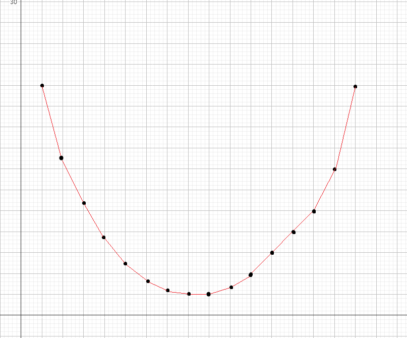

# wqs 二分

## 引入

wqs 二分最初由王钦石在他的 2012 年国家集训队论文中提出，而从 IOI 2016 的 Aliens 题目开始，这种方法开始逐步在竞赛圈中有了一定的地位。在国内我们一般称为「wqs 二分」，而在国外一般称为「Alien Trick」。

通常来说，设问中有**恰好选 $k$ 个**之类限制的问题可以考虑 wqs 二分。需要注意用 wqs 二分的前提是问题具有**凸完全单调性**。

## 算法简述

首先解释**凸完全单调性**，具体来说，设 $g_i$ 是某变量取到 $i$ 时的权值，那么若：

$$\forall i\in [1,n-2],g_{i+1}-g_i\ge g_{i+2}-g_{i+1}$$

或者：

$$\forall i\in [1,n-2],g_{i+1}-g_i\le g_{i+2}-g_{i+1}$$

则称 $g_i$ 关于 $i$ 具有**凸完全单调性**。

至于为什么叫这个名字，容易发现这样画出来图像的斜率是单调的，也就是说大概长得是个凸壳的样子。

这里以经典问题 [P2619 [国家集训队] Tree I](https://www.luogu.com.cn/problem/P2619) 为例。

令最小生成树大小关于白边数量的函数为 $f(x)$，那么它的图像大概长这样：



首先整张图的最小生成树白边数量是可以找到的（可能有多个最小生成树，但是不重要），然后你容易发现对于原图上的一个环，最小生成树肯定是断开了某条边的。那么你可以删一条边再加一条边，仍然是生成树。这样显然每次只会将白边数量变化 $0$ 或 $1$。

为保证每次都是最小生成树，每次肯定选代价最小的一个环断掉。这样最小值两侧的差是递增的，显然是满足凸完全单调性的（就大概长上面那样）。

然后考虑如何解决问题。这个非常巧妙，可以考虑用一条直线 $h(x)=\lambda x$ 去切这个图像：

显然，对于不同的斜率，切点可能不同。


那么容易发现在切点处，$g(x)=f(x)-h(x)$ 恰好取到最小值（就是切线的截距）。


那么可以考虑枚举这个 $\lambda$，在这个问题上就相当于每条白边的权值都减小 $\lambda$。然后跑一边 Kruskal 就能找到切点的纵坐标，并且还能知道有多少条白边，即切点的横坐标。此时 $f(x)=g(x)+h(x)$。

然后容易发现，随着 $\lambda$ 增大，切点的横坐标单调不降，就可以考虑二分了。并且由于这道题的点都是整点，且横坐标是连续的整数，那么两点之间的斜率都是整数，只需要二分整数斜率就能切到所有点了。

但这里有个问题，即大于等于三点共线的情况：


容易发现中间的点是切不到的。这个用实数斜率也切不到。

但其实我们只需要知道斜率和截距 $x$，然后若限制为 $t$，且也在当前这条线上，那么 $k$ 这个点的纵坐标就是 $g(x)+h(k)$，是可以直接算的。

那么对于每个斜率，只需要找到横坐标最大的点，然后若这个点横坐标大于你要找的点就带公式即可，最后一定能找到想要的斜率。

/// details | 参考代码
    open: False
    type: success

```cpp
#include<bits/stdc++.h>
#define mem(a,b) memset(a,b,sizeof(a))
#define forup(i,s,e) for(int i=(s);i<=(e);i++)
#define fordown(i,s,e) for(int i=(s);i>=(e);i--)
using namespace std;
#define gc getchar()
inline int read(){
    int x=0,f=1;char c;
    while(!isdigit(c=gc)) if(c=='-') f=-1;
    while(isdigit(c)){x=(x<<3)+(x<<1)+(c^48);c=gc;}
    return x*f;
}
#undef gc
const int N=5e4+5,M=1e5+5,inf=0x3f3f3f3f;
int n,m,s,ned;
struct edge{
	int u,v,w,c;
}e[M];
int fa[N];
int getfa(int x){return x==fa[x]?x:fa[x]=getfa(fa[x]);}
bool cmp(edge a,edge b){
	if(a.w!=b.w) return a.w<b.w;
	return a.c<b.c;// (1)!
}
int val=0;
bool chk(int mm){
	forup(i,1,m){
		if(e[i].c==0) e[i].w+=mm;
	}
	sort(e+1,e+m+1,cmp);
	forup(i,1,n){
		fa[i]=i;
	}
	val=0;
	int tmp=0;
	forup(i,1,m){
		int u=e[i].u,v=e[i].v,w=e[i].w,c=e[i].c;
		int fu=getfa(u),fv=getfa(v);
		if(fu==fv) continue;
		fa[fu]=fv;
		val+=w;
		if(c==0) ++tmp;
	}
	forup(i,1,m){
		if(e[i].c==0) e[i].w-=mm;
	}
	return tmp>=ned;
}
signed main(){
	n=read();m=read();ned=read();
	forup(i,1,m){
		e[i].u=read()+1;e[i].v=read()+1;e[i].w=read();e[i].c=read();
	}
	int ll=-30005,rr=30005,mm,ans;
	while(ll<rr){
		mm=ll+(rr-ll+1)/2;
		if(chk(mm)){
			ll=mm;ans=val-mm*ned;
		}else{
			rr=mm-1;
		}
	}
	printf("%d\n",ans);
}
```

1. 优先选白边

///