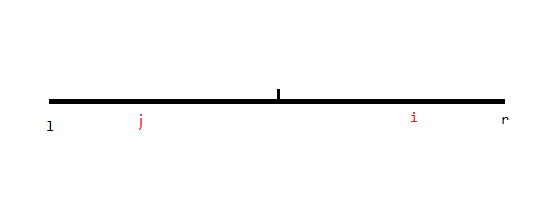
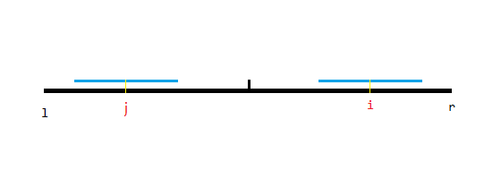
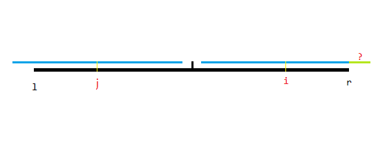

# Manacher 算法

## 前言

我曾经说过一句话。

> 字符串算法就是一堆看起来没有卵用其实超级有用的东西。

但 Manacher 算法是少有的意义明确的字符串算法。

## 算法简述

Manacher 算法（国内俗称马拉车）由 Glenn K. Manacher 在 1975 年提出。是一种在能在**线性时间**内求出某字符串所有回文子串的算法，且相比其它复杂度相近算法**压倒性地简单**。

首先，给出问题的严谨描述：

给定一个长度为 $n$ 的字符串 $s$，请找到所有对 $(i, j)$ 使得子串 $s[i \dots j]$ 为一个回文串。当 $t = t_{\text{rev}}$ 时，字符串 $t$ 是一个回文串（$t_{\text{rev}}$ 是 $t$ 的反转字符串）。

而回文串有一种更方便的表述方式，对于某个位置 $i$，我们令 $d_i$ 为以 $i$ 为对称轴的最长回文子串的长度。这样只能表示长度为奇数的回文子串，那么我们可以再令 $d_i'$ 为以 $i-1,i$ 间的间隔为对称轴的最长回文子串长度，这样就可以表示长度为偶数的回文子串了。

考虑如何暴力求解 $d$ 与 $d'$，其实很简单，枚举中心点暴力往两侧拓展即可，代码就不贴了。

然后考虑优化，这里只说如何求解 $d$，关于 $d'$ 的后面会详细说。

首先与 KMP 等字符串算法的思路类似，都考虑从之前的答案推出现在的答案。假如我们已经求出 $1\sim i-1$ 的答案，那么我们可以维护两个数 $l,r$ 表示右端点最大的回文子串的左右端点（当然你也可以维护能使得 $x+d_x$ 最大的 $x$），若当前 $i>r$，直接暴力拓展求出 $d_i$，否则考虑在其它情况下字符串长什么样：



那么我们可以在回文区间 $[l,r]$ 对称的位置找到一个 $j$，那么容易想到 $d_i$ **很可能等于** $d_j$！



比如这种情况，假设 $d_j$ 对应的是左边蓝色区间，那么右边的蓝色区间显然与左边的完全相等（注意是回文的），且无法拓展（考虑定义中的**最长**）。



但是在这种情况，我们无法确定右边黑色区间外的绿色区间是否与左侧匹配。这种时候就要暴力拓展了。

容易发现，每次暴力拓展都会更新 $r$，而 $r$ 至多被拓展 $n$ 次，若不拓展 $r$ 那么是 $O(1)$ 求出 $d_i$ 的。故复杂度是 $O(n)$。

/// details | [P3805 【模板】manacher](https://www.luogu.com.cn/problem/P3805) 参考代码
    open: False
    type: success

```cpp
const int N=1.1e7+5,inf=0x3f3f3f3f;
int n,d1[N],d2[N],ans;
char str[N];
signed main(){
	scanf(" %s",str+1);
	n=strlen(str+1);
	int l=1,r=0;
	forup(i,1,n){//长度为奇数
		int k=(i>r)?1:min(d1[l+r-i],r-i+1);
		while(1<=i-k&&i+k<=n&&str[i+k]==str[i-k]) ++k;
		d1[i]=k--;
		if(i+k>r){
			l=i-k;r=i+k;
		}
		ans=max(ans,d1[i]*2-1);
	}
	l=1,r=0;
	forup(i,1,n){//长度为偶数
		int k=(i>r)?0:min(d2[l+r-i+1],r-i+1);
		while(1<=i-k-1&&i+k<=n&&str[i-k-1]==str[i+k]) ++k;
		d2[i]=k--;
		if(i+k>r){
			l=i-k-1;
			r=i+k;
		}
		ans=max(ans,d2[i]*2);
	}
	printf("%d\n",ans);
}
```

///

但是其实有更简单的写法。考虑若回文子串长度为偶数，那么对称轴是两位置之间的**间隔**，那我们不妨把间隔用字符替代，这样对称轴就必定是某**位置**了。

比如原来字符串长这样：`abbaabba`

我们把间隔替换成字符：`#a#b#b#a#a#b#b#a#`

两侧的 `#` 是为了实现方便。

这样就只需要跑 $d_1$ 即可，另外，容易发现这样得到的 $d_i$ 等于以 $i$ 为中心的极长回文子串长度 $+1$。

/// details | 参考代码
    open: False
    type: success

```cpp
	scanf(" %s",str+1);
	n=strlen(str+1);
	forup(i,1,n){
		s[(i<<1)-1]='#';
		s[i<<1]=str[i];
	}
	s[n<<1|1]='#';
	int l=1,r=0;
	forup(i,1,n<<1|1){
		int k=(i>r)?1:min(d[l+r-i],r-i+1);
		while(1<=i-k&&i+k<=(n<<1|1)&&s[i+k]==s[i-k]) ++k;
		d[i]=k--;
		if(i+k>r){
			l=i-k;r=i+k;
		}
		ans=max(ans,d[i]-1);
	}
	printf("%d\n",ans);
```

///