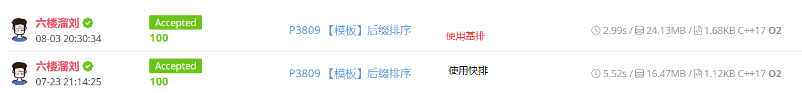
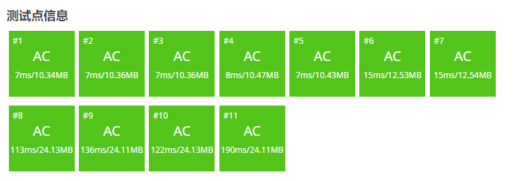

# 后缀数组（SA）学习笔记

## 前言

事实证明字符串算法就是一堆看起来卵用没有实际上巨有用的东西。

本文中所有字符串下标从 $1$ 开始。用 $suf(i)$ 表示字符串 $s$ 从 $i$ 开始的后缀。

## 什么是后缀数组

通俗来讲，后缀数组（Suffix Array,SA）就是把字符串所有后缀按字典序排序构成的数组。

实际实现中，我们通常用两个数组来存储，分别是 $sa_i$ 和 $rk_i$。其中 $sa_i$ 是排名 $\to$ 编号的数组，$rk_i$ 是编号 $\to$ 排名的数组。那么显然对于所有 $i$ 都有 $rk_{sa_i}=sa_{rk_i}=i$。

## 如何求后缀数组

### 朴素做法

首先有个显然的 $O(n^2 \log n)$ 做法，就是把所有后缀拎出来排序就行了，由于字典序比较是 $O(n)$ 的，要进行 $O(n\log n)$ 次比较所以复杂度长这样，代码就不贴了。

### 基于倍增的做法

设从 $i$ 开始的长度为 $2^j$ 的子串为 $c_j(i)$，所有 $c_j(i)$ 的 $sa$ 数组为 $sa_j(i)$，$rk_j(i)$ 同理。

然后先 $O(n \log n)$ 对 $c_0$ 排序，发现排 $c_1$ 的时候只要把 $c_0(i)$ 作为第一关键字，$c_0(i+2^0)$（越界视为无限小）作为第二关键字排序即可。这样子每层排序的复杂度就是 $O(n\log n)$，总复杂度 $O(n\log^2 n)$。

/// details | 参考代码
    open: False
    type: success

```cpp
const int N=1e6+5,inf=0x3f3f3f3f;
int n;
char s[N];
int sa[N],rk[N<<1],ork[N<<1],w;// (3)!
bool cmp(int a,int b){
    if(rk[a]==rk[b]) return rk[a+w]<rk[b+w];
    return rk[a]<rk[b];
}
signed main(){
    scanf(" %s",s+1);
    n=strlen(s+1);
    forup(i,1,n){
        sa[i]=i;
        rk[i]=s[i];// (4)!
    }
    for(w=1;w<n;w<<=1){
        sort(sa+1,sa+n+1,cmp);
        forup(i,1,n){// (1)!
            ork[i]=rk[i];
        }
        int p=0;
        forup(i,1,n){
            if(ork[sa[i]]==ork[sa[i-1]]&&ork[sa[i]+w]==ork[sa[i-1]+w]){
                rk[sa[i]]=p;// (2)!
            }else{
                rk[sa[i]]=++p;
            }
        }
    }
    forup(i,1,n){
        printf("%d ",sa[i]);
    }
}
```

1. 因为每层 $rk$ 前面的会覆盖后面的所以要复制一份 $ork$（origin rank）。
2. 假如两个都相等说明排名一样。
3. $w$ 定义成全局变量（或者使用我不会的 lambda 表达式），然后因为要越界访问所以要开二倍数组。
4. 一开始可以直接把 ASCII 码当排名，总之就是能概括它大小就行。

///

这篇代码开了 O2 已经能通过[洛谷模板题](https://www.luogu.com.cn/problem/P3809)了。


但是双 $\log$ 复杂度显然不够优美（而且我也不知道为什么双 $\log$ 可以过 $10^6$），极限数据甚至跑了将近 1.5s。

### 倍增 + 基数排序优化

在 OI 界有一个传奇，它作为一种排序算法，只多了常数的空间复杂度，换来的却是吊打一切基于比较的排序算法的 $O(n)$ 复杂度。它就是**基数排序**。

~~然而由于排序元素的局限性以及有一个更方便的东西叫快排基本没人用基排。~~

以防有人不知道基数排序：

/// details | 基数排序
    open: False
    type: info

这里讲的是我的理解，如果想要更严谨的版本清**上网自己搜**。

基排大概是对计数排序的空间优化。计数排序就是用桶统计每个数的出现次数求出每个数的排名但是它的空间复杂度等于值域大小 ~~不然你用平衡树存又变成 $O(n\log n)$ 的了。~~

基数排序的思想就是把数分成多个值域能开的下的关键字，然后从次要关键字到主要关键字依次做计数排序（要保证排序稳定），这样最后就能排好了。

///

由于字符集多半不会太大，又恰好是两个关键字的排序，后缀数组完全可以使用基数排序实现。

/// details | 参考代码
    open: False
    type: success

```cpp
const int N=1e6+5,inf=0x3f3f3f3f;
int n,m;
char s[N];
int sa[N],ssa[N],rk[N<<1],ork[N<<1],w,cnt[N];
signed main(){
    scanf(" %s",s+1);
    n=strlen(s+1);
    forup(i,1,n){
        sa[i]=i;
        rk[i]=s[i];
    }
    m=128;
    mem(cnt,0);
    forup(i,1,n){ssa[i]=sa[i];}
    forup(i,1,n){cnt[rk[ssa[i]]]++;}
    forup(i,1,m){cnt[i]+=cnt[i-1];}
    fordown(i,n,1){sa[cnt[rk[ssa[i]]]--]=ssa[i];}
    for(w=1;w<n;w<<=1){
        mem(cnt,0);
        forup(i,1,n){ssa[i]=sa[i];}
        forup(i,1,n){cnt[rk[ssa[i]+w]]++;}
        forup(i,1,m){cnt[i]+=cnt[i-1];}
        fordown(i,n,1){sa[cnt[rk[ssa[i]+w]]--]=ssa[i];}
        mem(cnt,0);
        forup(i,1,n){ssa[i]=sa[i];}
        forup(i,1,n){cnt[rk[ssa[i]]]++;}
        forup(i,1,m){cnt[i]+=cnt[i-1];}
        fordown(i,n,1){sa[cnt[rk[ssa[i]]]--]=ssa[i];}
        forup(i,1,n){
            ork[i]=rk[i];
        }
        int p=0;
        forup(i,1,n){
            if(ork[sa[i]]==ork[sa[i-1]]&&ork[sa[i]+w]==ork[sa[i-1]+w]){
                rk[sa[i]]=p;
            }else{
                rk[sa[i]]=++p;
            }
        }
        m=p;
    }
    forup(i,1,n){
        printf("%d ",sa[i]);
    }
}
```

///

发现速度显著提升：



但是没有预料中那么显著，毕竟一个 $\log 10^6$ 的差距显然不止两倍。

原因在于我们遍历了八遍数组，常数巨大。考虑进行一些常数优化。

首先简单地，当 $m=n$，即每个后缀在当前阶段已经两两不同，说明后缀排序已经完成，两两之间大小关系已经确定，就可以退出了。

然后另外，容易发现其实不需要对第二关键字进行计数排序。因为第二关键字其实在 $w-1$ 阶段已经排好了，除去末尾 $i+2^w>n$ 的一部分以外，但这部分显然可以直接塞到序列开头。

/// details | 优化后代码
    open: False
    type: success

除去这一段以外其余是一样的。

```cpp
    for(w=1;w<n;w<<=1){
        int p=0;
		forup(i,1,n) ssa[i]=sa[i];
        fordown(i,n,n-w+1) sa[++p]=i;
		forup(i,1,n) if(ssa[i]>w) sa[++p]=ssa[i]-w;
        mem(cnt,0);
        forup(i,1,n) ssa[i]=sa[i];
        forup(i,1,n) cnt[rk[ssa[i]]]++;
        forup(i,1,m) cnt[i]+=cnt[i-1];
        fordown(i,n,1) sa[cnt[rk[ssa[i]]]--]=ssa[i];
        forup(i,1,n) ork[i]=rk[i];
        p=0;
        forup(i,1,n){
            if(ork[sa[i]]==ork[sa[i-1]]&&ork[sa[i]+w]==ork[sa[i-1]+w]){
                rk[sa[i]]=p;
            }else{
                rk[sa[i]]=++p;
            }
        }
        m=p;
        if(m==n) break; 
    }
```

///

效率更加显著地提升。



另外还有很多 $O(n)$ 的做法。但是这个已经不在 OI 学习范畴了。

## 后缀数组有什么用

还记得我开头说了什么吗？

> 事实证明字符串算法就是一堆看起来卵用没有实际上巨有用的东西。

所以这个看起来没有卵用的东西其实非常有用。

### 已知文本串，每次给定模式串进行字符串匹配

由于一个字串必定是某个后缀的前缀，那么假如原文本串为 $T$，每次的模式串为 $S$，我们可以在后缀数组中二分找到第一个前缀为 $S$ 的后缀，复杂度 $O(|S|\log |T|)$，并且容易发现假如 $T$ 中 $S$ 出现了不止一次，那么它们对应的后缀在后缀数组中显然是相邻的。

### LCP 及 height 数组

但其实 SA 本身的用处并不大（ ~~这不是前后矛盾吗~~ ），用的更多的其实是 SA 的拓展知识 height 数组。

#### LCP

在了解 height 数组之前，先了解一下 LCP 是什么。

/// admonition | 什么是 LCP
    type: quote

两个字符串 $S$ 和 $T$ 的 LCP（longest common prefix，最长公共前缀）就是最大的 $x(x\le \min(|S|, |T|))$ 使得 $S_i=T_i\ (\forall\ 1\le i\le x)$。

下文中以 $\operatorname{lcp}(i,j)$（Longest Common Prefix）表示后缀 $i$ 和后缀 $j$ 的最长公共前缀的长度。

///

#### height 数组

height 数组的定义为 $height_i=\operatorname{lcp}(sa_i,sa_{i-1})$（这里的 $sa$ 是那个后缀对应的字符串），特别地，令 $height_1=0$（其实就相当于和空字符串的 $\operatorname{lcp}$）。

#### 求 height 数组

height 数组可以 $O(n)$ 求出，但需要一个引理：

/// details | 引理及其证明
    open: True
    type: abstract

引理：$height_{rk_i}\ge height_{rk_{i-1}}-1$。

证明：

其实很简单，考虑设 $suf(i-1)=cAB$，其中 $c$ 是一个字符，$AB$ 均是字符串，$cA$ 是 $height_{rk_{i-1}}$ 对应的那个 $\operatorname{lcp}$，这说明 $suf(sa_{rk_{i-1}-1})=cAD$，其中 $D$ 也是一个字符串。

容易发现 $suf(i)=AB$，并且由于存在 $suf(sa_{rk_{i-1}-1}+1)=AD$，所以 $height_{rk_i}$ 至少也是 $A$，并且由于去掉了一个 $c$，还可能存在一个 $\operatorname{lcp}$ 更长的后缀。

///

那么就可以直接暴力了：

/// details | 参考代码
    open: False
    type: success

```cpp
	int k=0;
	forup(i,1,n){
		if(rk[i]==1) continue;
		if(k) --k;
		while(str[i+k]==str[sa[rk[i]-1]+k]) ++k;
		ht[rk[i]]=k;
	}
```

///

由于 $k$ 至多只会减小 $n$ 次，且 $k$ 最大时不会超过 $n$，故至多对 $k$ 进行 $2n$ 次操作，复杂度 $O(n)$。

### 任意两后缀的最长公共前缀

那么 height 数组有什么用呢？

首先，可以求任意两后缀的 $\operatorname{lcp}$。

考虑把所有后缀压入一棵 Trie，那么两后缀的 $\operatorname{lcp}$ 就是对应结束状态在 Trie 上的 $\operatorname{lca}$。

然后根据经典结论，序列上两点 $u,v$ 的 $\operatorname{lca}$ 就是按 dfn 排序后，区间 $[u,v]$ 中所有相邻两点的 $\operatorname{lca}$ 中深度最小的。

而容易发现，按字典序排序恰好就是 Trie 上的 dfn 序列，而 $height_i$ 就是 $\operatorname{lca}(sa_i,sa_{i-1})$，那么做个 RMQ 即可。

### 本质不同子串个数

height 数组还可以求本质不同子串个数。

考虑多个字符串的本质不同前缀个数怎么求（求出 SA 后就转化成这个问题了）。

容易想到压入一棵 Trie，那么这个问题的答案就是 Trie 上的结点数量了。

然后同样用 dfn 的结论，每次新增的结点数量就是 $n-sa_i+1-height_i$。

代码就不贴了。

### 排名第 k 小的子串

如果只算本质不同的子串，那么就是上一个问题略微转化一下。

如果长得一样但位置不同的子串算作不同的，应该怎么做呢？

仍然考虑 Trie，容易发现对于一条没有分叉的树链中的每个状态的数量是可以计算的，就是这条树链被经过的次数。而显然 Trie 中状态的字典序就是先序遍历，那么考虑按先序遍历枚举关键点（就是所有 $sa_i,height_i$）即可。

可以得到一个长得像分治的做法：

/// details | 参考代码
    open: False
    type: success

感觉讲的太抽象了还是挂个代码。

```cpp
	void work(int l,int r,int lst){
		if(l==r){// (2)!
			int ad=n-sa[l]+1-lst;
			if(ad>=k){
				forup(i,0,lst+k-1){
					printf("%1c",str[sa[l]+i]);
				}
				exit(0);
			}
			k-=ad;
			return;
		}
		int mid=query(l+1,r),ad=(r-l+1)*(ht[mid]-lst);// (1)!
		if(ad>=k){// (3)!
			forup(i,0,lst+(k-1)/(r-l+1)){
				printf("%1c",str[sa[l]+i]);
			}
			exit(0);
		}
		k-=ad;
		work(l,mid-1,ht[mid]);work(mid,r,ht[mid]);
	}
	void solve(){
		init();//初始化区间 RMQ
		work(1,n,0);
	}
```

1. `query(l,r)` 会返回区间内 `ht` 最小的下标，`ht` 就是上文的 $height$ 数组。
2. 相当于遍历到 $sa_i$。
3. 相当于中间的树链。

///