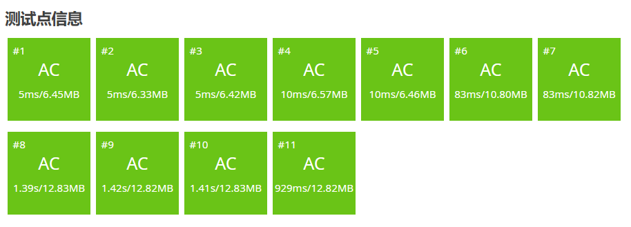

# 后缀数组学习笔记

## 前言

事实证明字符串算法就是一堆看起来卵用没有实际上巨有用的东西。

本文中所有字符串下标从 $1$ 开始。用 $suf_i$ 表示字符串 $s$ 从 $i$ 开始的后缀。

## 什么是后缀数组

通俗来讲，后缀数组（Suffix Array,SA）就是把字符串所有后缀按字典序排序构成的数组。

实际实现中，我们通常用两个数组来存储，分别是 $sa_i$ 和 $rk_i$。其中 $sa_i$ 是排名 $\to$ 编号的数组，$rk_i$ 是编号 $\to$ 排名的数组。那么显然对于所有 $i$ 都有 $rk_{sa_i}=sa_{rk_i}=i$。

## 如何求后缀数组

### 朴素做法

首先有个显然的 $O(n^2 \log n)$ 做法，就是把所有后缀拎出来排序就行了，由于字典序比较是 $O(n)$ 的，要进行 $O(n\log n)$ 次比较所以复杂度长这样，代码就不贴了。

### 基于倍增的做法

设从 $i$ 开始的长度为 $2^j$ 的子串为 $c_j(i)$，所有 $c_j(i)$ 的 $sa$ 数组为 $sa_j(i)$，$rk_j(i)$ 同理。

然后先 $O(n \log n)$ 对 $c_0$ 排序，发现排 $c_1$ 的时候只要把 $c_0(i)$ 作为第一关键字，$c_0(i+2^0)$（越界视为无限小）作为第二关键字排序即可。这样子每层排序的复杂度就是 $O(n\log n)$，总复杂度 $O(n\log^2 n)$。

/// details | 参考代码
    open: False
    type: success

```cpp
const int N=1e6+5,inf=0x3f3f3f3f;
int n;
char s[N];
int sa[N],rk[N<<1],ork[N<<1],w;// (3)!
bool cmp(int a,int b){
    if(rk[a]==rk[b]) return rk[a+w]<rk[b+w];
    return rk[a]<rk[b];
}
signed main(){
    scanf(" %s",s+1);
    n=strlen(s+1);
    forup(i,1,n){
        sa[i]=i;
        rk[i]=s[i];// (4)!
    }
    for(w=1;w<n;w<<=1){
        sort(sa+1,sa+n+1,cmp);
        forup(i,1,n){// (1)!
            ork[i]=rk[i];
        }
        int p=0;
        forup(i,1,n){
            if(ork[sa[i]]==ork[sa[i-1]]&&ork[sa[i]+w]==ork[sa[i-1]+w]){
                rk[sa[i]]=p;// (2)!
            }else{
                rk[sa[i]]=++p;
            }
        }
    }
    forup(i,1,n){
        printf("%d ",sa[i]);
    }
}
```

1. 因为每层 $rk$ 前面的会覆盖后面的所以要复制一份 $ork$（origin rank）。
2. 假如两个都相等说明排名一样。
3. $w$ 定义成全局变量（或者使用我不会的 lambda 表达式），然后因为要越界访问所以要开二倍数组。
4. 一开始可以直接把 ASCII 码当排名，总之就是能概括它大小就行。

///

这篇代码开了 O2 已经能通过[洛谷模板题](https://www.luogu.com.cn/problem/P3809)了。



但是双 $\log$ 复杂度显然不够优美（而且我也不知道为什么双 $\log$ 可以过 $10^6$），极限数据甚至跑了将近 1.5s。

### 倍增 + 基数排序优化

在 OI 界有一个传奇，它作为一种排序算法，只多了常数的空间复杂度，换来的却是吊打一切基于比较的排序算法的 $O(n)$ 复杂度。它就是**基数排序**。

~~然而由于排序元素的局限性以及有一个更方便的东西叫快排基本没人用基排。~~

以防有人不知道基数排序：

/// details | 基数排序
    open: False
    type: info

这里讲的是我的理解，如果想要更严谨的版本清**上网自己搜**。

基排大概是对计数排序的空间优化。计数排序就是用桶统计每个数的出现次数求出每个数的排名但是它的空间复杂度等于值域大小 ~~不然你用平衡树存又变成 $O(n\log n)$ 的了。~~

基数排序的思想就是把数分成多个值域能开的下的关键字，然后从次要关键字到主要关键字依次做计数排序（要保证排序稳定），这样最后就能排好了。

///

由于字符集多半不会太大，又恰好是两个关键字的排序，后缀数组完全可以使用基数排序实现。

/// details | 参考代码
    open: False
    type: success

```cpp
const int N=1e6+5,inf=0x3f3f3f3f;
int n,m;
char s[N];
int sa[N],ssa[N],rk[N<<1],ork[N<<1],w,cnt[N];
signed main(){
    scanf(" %s",s+1);
    n=strlen(s+1);
    forup(i,1,n){
        sa[i]=i;
        rk[i]=s[i];
    }
    m=128;
    mem(cnt,0);
    forup(i,1,n){ssa[i]=sa[i];}
    forup(i,1,n){cnt[rk[ssa[i]]]++;}
    forup(i,1,m){cnt[i]+=cnt[i-1];}
    fordown(i,n,1){sa[cnt[rk[ssa[i]]]--]=ssa[i];}
    for(w=1;w<n;w<<=1){
        mem(cnt,0);
        forup(i,1,n){ssa[i]=sa[i];}
        forup(i,1,n){cnt[rk[ssa[i]+w]]++;}
        forup(i,1,m){cnt[i]+=cnt[i-1];}
        fordown(i,n,1){sa[cnt[rk[ssa[i]+w]]--]=ssa[i];}
        mem(cnt,0);
        forup(i,1,n){ssa[i]=sa[i];}
        forup(i,1,n){cnt[rk[ssa[i]]]++;}
        forup(i,1,m){cnt[i]+=cnt[i-1];}
        fordown(i,n,1){sa[cnt[rk[ssa[i]]]--]=ssa[i];}
        forup(i,1,n){
            ork[i]=rk[i];
        }
        int p=0;
        forup(i,1,n){
            if(ork[sa[i]]==ork[sa[i-1]]&&ork[sa[i]+w]==ork[sa[i-1]+w]){
                rk[sa[i]]=p;
            }else{
                rk[sa[i]]=++p;
            }
        }
        m=p;
    }
    forup(i,1,n){
        printf("%d ",sa[i]);
    }
}
```

///

发现速度显著提升：


但是没有预料中那么显著，毕竟一个 $\log 10^6$ 的差距显然不止两倍。

原因在于我们遍历了八遍数组，常数巨大。其实倍增+基排求 SA 还有常数优化。但鉴于 CCF 最近在避免常数对考生成绩的影响我觉得没必要学。问就是上 OI Wiki。

另外还有很多 $O(n)$ 的做法。等以后有机会了说不定会分享一下

## 后缀数组有什么用

还记得我开头说了什么吗？

> 事实证明字符串算法就是一堆看起来卵用没有实际上巨有用的东西。

所以这个看起来没有卵用的东西其实非常有用。

### 已知文本串，每次给定模式串进行字符串匹配

由于一个字串必定是某个后缀的前缀，那么假如原文本串为 $T$，每次的模式串为 $S$，我们可以在后缀数组中二分找到第一个前缀为 $S$ 的后缀，复杂度 $O(|S|\log |T|)$，并且容易发现假如 $T$ 中 $S$ 出现了不止一次，那么它们对应的后缀在后缀数组中显然是相邻的。

### LCP 及 height 数组

但其实 SA 本身的用处并不大（ ~~这不是前后矛盾吗~~ ），用的更多的其实是 SA 的拓展知识 height 数组。

#### LCP

在了解 height 数组之前，先了解一下 LCP 是什么。

/// admonition | 什么是 LCP
    type: quote

两个字符串 $S$ 和 $T$ 的 LCP（longest common prefix，最长公共前缀）就是最大的 $x(x\le \min(|S|, |T|))$ 使得 $S_i=T_i\ (\forall\ 1\le i\le x)$。

下文中以 $\operatorname{lcp}(i,j)$ 表示后缀 $i$ 和后缀 $j$ 的最长公共前缀（的长度）。

///

#### height 数组

height 数组的定义为 $height_i=\operatorname{lcp}(sa_i,sa_{i-1})$（这里的 $sa$ 是那个后缀对应的字符串），特别地，令 $height_1=0$。

#### 求 height 数组

height 数组可以 $O(n)$ 求出，但需要一个引理：

/// details | 引理及其证明
    open: True
    type: abstract

引理：$height_{rk_i}\ge height_{rk_{i-1}}-1$。

证明：

当 $height_{rk_{i-1}}\le 1$ 时，引理显然成立，因为此时不等式右侧小于等于 $0$。


///