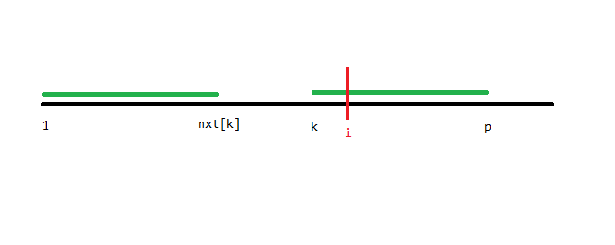
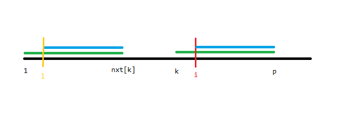
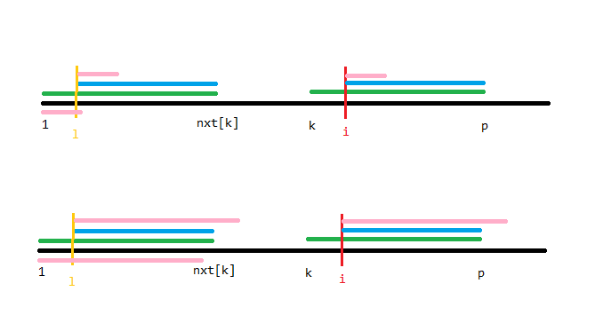

# 扩展 KMP 算法（Z 函数）

今天刷题时看到了这么一个算法，主要是为了做题就学了一下。

## 概述

顾名思义，扩展 KMP 即 KMP 算法的扩展。但是总所周知 KMP 其实叫前缀函数，只是国内喜欢叫它 KMP 算法。同理，国外一般称扩展 KMP 算法为 Z Algorithm（Z 算法），但这都不太重要。

> 约定：字符串下标从 $0$ 开始

## 定义

对于一个长度为 $n$ 的字符串 $s$，定义函数 $z_i$ 表示 $s$ 和 $s$ 以 $i$ 开头的后缀的 LCP 的长度，其中 $z_i$ 被称为 Z 函数，特别地，$z_0=0$。

但是我不是这样理解的，为了实现方便，我定义了 $nxt_i$，大部分和 $z$ 相同，唯一不同在于 $nxt_0=n$。

## 求解

我曾经说过我对字符串算法的理解：

> 一堆看起来毫无卵用其实非常有用的东西。

所以我们先不讲用法，而是先讲求法。

首先有个显然的 $O(n^2)$ 暴力，在此不多赘述了。

~~观察模板题数据范围可知~~ 扩展 KMP 有 $O(n)$ 的求法：

首先回顾一下我们是怎么求 KMP 的，先不管推出算法的思路是什么，最终算法就是利用先前求出的 $nxt_{0\le j< i}$ 求出 $nxt_i$。那么我们能否用类似的方法求出扩展 KMP 的 $nxt_i$ 呢？答案是肯定的。

首先，假设我们已经求出了 $0\le j<i$ 的 $nxt_j$，那么肯定存在一个 $0\le k<i$ 使得 $k+nxt_k-1$ 最大化，设这个最大的 $k+nxt_k-1=p$，这里暂且假定 $p\ge i$，我们画个图理解：

那么根据定义，上图中两段绿色线段是相等的。所以可以得出下图两段蓝色线段是相等的。

我们设 $l=i-k$，容易发现 $l$ 就是左边那段蓝色线段的开头。

那么容易想到 $nxt_l$ 可能有什么性质，我们分情况讨论一下。

首先上面的情况，$nxt_l\le p-i$，这种情况下显然 $nxt_i=nxt_l$。

另一种情况，我们无法判断最后粉色线段冒出绿色线段的部分匹配的有多长，但无论如何 $i$ 都会成为新的 $k$（根据定义），那么 $p$ 只会单调向右移动，可以直接暴力移动 $p$ 求出 $nxt_i$。

然后我们就可以考虑 $p<i$ 的情况了，容易发现这直接可以相当于图 $3$ 下面的那种情况，就不多赘述了。

复杂度 $O(n)$。