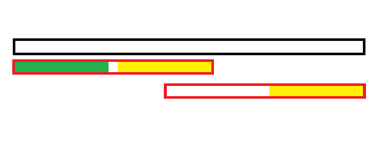

# KMP 与 AC 自动机

## 前言

这篇文章是我学习 AC 自动机的学习笔记，但是因为我以前对 KMP 也不了解在学 AC 自动机时就重新复习了一下。

另外，本文所有字符串下标从 $1$ 开始。

## 前缀函数与 KMP 算法

其实我们平时说的 KMP 通常指前缀函数，KMP 是一种基于前缀函数的单模式串匹配算法，就是判断某*一个*字符串在另一个字符串中出现了几次，我们判断的那个被称为**模式串**，另一个被称为**文本串**。

### 前缀函数

前缀函数是什么呢？我们通常用 $next_i$ 表示前缀函数，表示**以 $i$ 结尾的前缀的最长的相等的真前缀与真后缀的长度（Border）**。用数学语言描述就是：

$$next_i=\max_{k=1}^i\begin{Bmatrix}k|s[1\dots k]=s[i-(k-1)\dots i]\end{Bmatrix}$$

特别地，规定 $next_1=0$。

有点抽象，我们举个例子。对于字符串 $s=$ `abcabcd`，它的前缀函数就是 $[0,0,0,1,2,3,0]$，其中 $next_4=1$ 是因为 $s_1=s_4$，后面的同理。

那么这个东西有什么用呢？比如，我们可以用它进行单模式字符串匹配。

举个例子，假如模式串为 `abcaba`，文本串为 `abcabcaba`。

首先求出模式串的前缀函数 $next=[0,0,0,1,2,0]$，然后考虑用两个指针扫一遍。

首先扫到 `abca`，发现模式串与文本串匹配，但下一项就不匹配了，这时候发现 $next_5=2$，说明文本串现在前缀的后缀能和模式串长度为 $2$ 的前缀匹配，把模式串指针指向 $2$。然后往后遍历发现字符串匹配。

这说明这个看起来毫无卵用的东西其实是很有用的，但是我们应该如何求出它呢？

首先显而易见可以 $O(n^3)$ 枚举，不多赘述。

容易发现一个性质，以 $i$ 结尾前缀所有 Border 长度分别是 $next_i,next_{next_i},next_{next_{next_i}}\cdots$，为了方便叙述后文写作 $next_i^{k}$。这是显然的，我们画个图理解一下：



其中黑色矩形代表我们的前缀 $i$，红色矩形是 $next_i$，黄色和绿色矩形是 $next_{i}^2$

首先红色矩形显然是 Border，所以两黄色矩形相等。

又由于黄色矩形与绿色矩形相等，绿色矩形为真前缀，右侧的黄色矩形为真后缀，它们俩也是 Border。

然后依次套下去也是类似的。

为什么这样能得到所有 Border 呢？考虑反过来想，如果不能得到所有的 Border，说明存在一个 $next_i^{k+1}$ 不是比 $next_i^{k}$ 小的最大的 Border，但根据前缀函数的定义这个假设显然不成立。

那么容易发现 $next_i$ 必定是 $i-1$ 的某个 Border 后面各加入一个字符，可以直接用上面的结论遍历 $i-1$ 所有相等的 Border 再判断。

/// details | 参考代码
    open: False
    type: success

```cpp
int nxt[N],n;
char a[N];
scanf(" %s",a+1);
n=strlen(a+1);
int j=0;
forup(i,2,n){
    while(j&&(a[i]!=a[j+1])) j=nxt[j];
    if(a[i]==a[j+1]) ++j;
    nxt[i]=j;
}
```

///

考虑复杂度分析，容易发现指针 $j$ 每次最多右移 $1$，相当于积攒势能，每次 `j=nxt[j]` 相当于释放势能，故均摊复杂度 $O(1)$，总复杂度 $O(n)$。

前缀函数还有很多其它用法，比如求字符串最短循环节之类的，但今天的重点不是这个，就不多说了。

### KMP 算法

其实刚刚已经提过了，这里再具体说一遍。

同一个算法我看到很多种不同的定义，这里我引用一下蓝书（李煜东《算法竞赛进阶指南》）的定义。

若模式串为 $A[1,2,3\dots n]$，文本串为 $B[1,2,3\dots m]$，定义函数 $f$ 表示：

$$f_i=\max_{k=1}^i\begin{Bmatrix}k|A[1\dots k]=B[i-(k-1)\dots i]\end{Bmatrix}$$

当 $f_i=n$，说明存在一个以 $i$ 结尾的子串与模式串匹配。

由于定义的相似性，代码也类似。

/// details | 参考代码
    open: False
    type: success

```cpp
int f[N];
j=0;
forup(i,1,n){
    while(j&&(j==m||b[i]!=a[j+1])) j=nxt[j];
    if(b[i]==a[j+1]) ++j;
    f[i]=j;
    if(f[i]==m){
        // (1)!
    }
}
```

1. 说明匹配成功。

///

这里 $next$ 函数充当了一个失配指针的作用，这个思想在后文中会提到。

## AC 自动机

进入正题，关于什么是 AC 自动机， ~~顾名思义，就是可以让你自动 AC 一切题目的方法，可以参考 [萌娘百科](https://mzh.moegirl.org.cn/OI%E6%A2%97#.E8.87.AA.E5.8A.A8.E6.9C.BA)~~。

/// admonition | 介绍
    type: quote

AC 自动机是**以 Trie 的结构为基础**，结合**KMP 的思想**建立的自动机，用于解决多模式匹配等任务。

简单来说，建立一个 AC 自动机有两个步骤：

1. 基础的 Trie 结构：将所有的模式串构成一棵 Trie。
1. KMP 的思想：对 Trie 树上所有的结点构造失配指针。

然后就可以利用它进行多模式匹配了。

摘自 [OI Wiki](https://oi-wiki.org/string/ac-automaton/)。

///

### 具体实现

#### Trie 树

首先建立一棵 Trie 树，这棵 Trie 树就是普通的 Trie 树，没什么特别。但这里需要补充一下 Trie 树上结点的意义。

很多人初学 Trie 时觉得结点就是个摆设，只是在具体实现中不得不用，其实结点有个很重要的意义：字符串的**状态**，而每条边即是状态的转移，根节点即**空字符串**的状态。这点在理解 AC 自动机的思想上非常重要。

#### 失配指针

首先，为什么要构造失配指针，之前 KMP 时，容易发现假设模式串某位置不匹配，我们会尝试寻找另一个位置和文本串匹配，如果不构造失配指针我们就需要 $O(n)$ 重新遍历一下字符串，但假如构造了就可以均摊 $O(1)$ 地找到另一个位置。这就是失配指针（$fail$）的作用。

那么我们考虑如何对多模式匹配构造 $fail$ 指针，假如和一个字符串不匹配显然我们应该考虑尝试匹配另一个字符串的前缀，所以 AC 自动机的 $fail$ 指针应指向**最长的等于当前状态真后缀的状态**。

那么具体如何构造失配指针呢？我们可以参考 KMP 中构造 $next$ 数组的思想，然后从深度浅的结点向深度深的结点构造。

/// admonition | 构造 $fail$ 指针的基础思想
    type: info

注意这是**基础思想**。

考虑字典树中当前的结点 $u$，$u$ 的父结点是 $p$，$p$ 通过字符 $c$ 的边指向 $u$，即 $trie[p,c]=u$。假设深度小于 $u$ 的所有结点的 $fail$ 指针都已求得。

- 如果 $trie[fail_p,c]$ 存在：则让 $u$ 的 $fail$ 指针指向 $trie[fail_p,c]$。相当于在 $p$ 和 $fail_p$ 后面加一个字符 $c$，分别对应 $u$ 和 $fail_u$。
- 如果 $trie[fail_p,c]$ 不存在：那么我们继续找到 $trie[fail_{fail_p},c]$。重复上面的判断过程，一直跳 $fail$ 指针直到根结点。
- 如果真的没有，就让 $fail$ 指针指向根结点。

如此就完成了 $fail_u$ 的构建。

///

我找到一个[算法可视化](https://www.bilibili.com/video/BV14v4y1Z7fu/?spm_id_from=333.337.search-card.all.click&vd_source=59ffc95a9a04191aaa6f5fcf5ccffbe5)。

如果不想/不能上 B 站的我直接放在[这里](../../videos/AC_Automaton.mp4)了。但请有能力的一定去支持原作者。

#### 字典图

然后理论上我们就可以用类似于 KMP 的方法做多模式匹配了。但这样显然没有发挥 Trie 树的潜力，假如我们直接把不存在的边 $trie[u,c']$ 指向 $trie[fail_u,c']$，容易发现这样会让算法实现变得更加自然。我们走一条这样的边相当于舍弃原状态的某个前缀然后找到一个新状态，假如你理解了失配指针的意义你会发现这样显然是正确的。或者换一种理解，本来你跳到 $v=fail_u$ 就要再跳到 $trie[v,c']$，不如直接跳到 $tire[fail_u,c']$，这样构造 AC 自动机时还更简便。

#### 时间复杂度

时间复杂度：定义 $|s_i|$ 是模板串的长度，$|S|$ 是文本串的长度，$|\Sigma|$ 是字符集的大小（常数，一般为 $26$）。如果连了字典图，时间复杂度就是 $O(\sum|s_i|+n|\Sigma|+|S|)$，其中 $n$ 是 AC 自动机中结点的数目，并且最大可以达到 $O(\sum|s_i|)$。如果不连字典图，并且在构建 $fail$ 指针的时候避免遍历到空儿子，时间复杂度就是 $O(\sum|s_i|+|S|)$，差不多就是 $O(n)$ 级别的，数据范围可以出到 $2 \times 10^6$。


### 参考代码

/// details | [洛谷 P3808 【模板】AC 自动机（简单版）](https://www.luogu.com.cn/problem/P3808)
    open: False
    type: success

```cpp
const int N=1e6+5,inf=0x3f3f3f3f;
int n;
char str[N];
struct AC_Automaton{
	int trie[N][26],cntn,cnt[N],fail[N];
	void Insert(char *a,int len){
		int p=0;
		forup(i,1,len){
			int nxt=a[i]-'a';
			if(!trie[p][nxt]) trie[p][nxt]=++cntn;
			p=trie[p][nxt];
		}
		cnt[p]++;
	}
	void Build(){
		queue<int> q;
		forup(i,0,25){
			if(trie[0][i]) q.push(trie[0][i]);
		}
		while(q.size()){
			int u=q.front();q.pop();
			forup(i,0,25){
				if(trie[u][i]){
					fail[trie[u][i]]=trie[fail[u]][i];
					q.push(trie[u][i]);
				}else{
					trie[u][i]=trie[fail[u]][i];// (1)!
				}
			}
		}
	}
	int Ask(char *t,int len){
		int u=0,res=0;
		forup(i,1,len){
			u=trie[u][t[i]-'a'];
			for(int j=u;j&&cnt[j]!=-1;j=fail[j]){// (2)!
				res+=cnt[j];cnt[j]=-1;
			}
		}
		return res;
	}
}mt;
signed main(){
	n=read();
	forup(i,1,n){
		scanf(" %s",str+1);
		mt.Insert(str,strlen(str+1));
	}
	mt.Build();
	scanf(" %s",str+1);
	printf("%d\n",mt.Ask(str,strlen(str+1)));
}
```

1. 由于我们建了字典图所以这里会直接跳到存在 $i$ 这个转移的状态，如果没有会直接连向根结点。
2. 试跳 $u$ 的失配指针，因为它们都可能是字符串的结尾，如果 `cnt` 为 $-1$ 说明这个状态已经跳到过了，后面的也肯定都跳到过了。

///

/// details | [洛谷 P3796 【模板】AC 自动机（加强版）](https://www.luogu.com.cn/problem/P3796)
    open: False
    type: success

其实几乎一样，只是建树时记一下字符串编号，最后查找字符串出现次数。

值得一提的是这份代码复杂度不太一样，因为试跳 $fail$ 是 $O(L)$ 的，其中 $L$ 是模式串最大长度，很显然，每次跳 $fail$ 状态长度至少 $-1$。所以复杂度应是 $O(\sum|s_i|+n|\Sigma|+|S|L)$。

```cpp
const int M=1e6+5,N=155,NN=2e5+5,inf=0x3f3f3f3f;
int n;
char a[N][75],str[M];
struct AC_Automaton{
	int trie[NN][26],cntn,idx[NN],fail[NN],cnt[N];
	void clear(){
		mem(trie,0);cntn=0;
		mem(idx,0);mem(fail,0);
		mem(cnt,0);
	}
	void Insert(char *a,int len,int id){
		int p=0;
		forup(i,1,len){
			int nxt=a[i]-'a';
			if(!trie[p][nxt]) trie[p][nxt]=++cntn;
			p=trie[p][nxt];
		}
		idx[p]=id;
	}
	void Build(){
		queue<int> q;
		forup(i,0,25){
			if(trie[0][i]) q.push(trie[0][i]);
		}
		while(q.size()){
			int u=q.front();q.pop();
			forup(i,0,25){
				if(trie[u][i]){
					fail[trie[u][i]]=trie[fail[u]][i];
					q.push(trie[u][i]);
				}else{
					trie[u][i]=trie[fail[u]][i];
				}
			}
		}
	}
	int Ask(char *t,int len){
		int u=0;
		forup(i,1,len){
			u=trie[u][t[i]-'a'];
			for(int j=u;j;j=fail[j]){
				if(idx[j]) cnt[idx[j]]++;
			}
		}
		int res=0;
		forup(i,1,n){
			res=max(res,cnt[i]);
		}
		return res;
	}
}mt;
signed main(){
	while(1){
		mt.clear();
		n=read();
		if(n==0) break;
		forup(i,1,n){
			scanf(" %s",a[i]+1);
			mt.Insert(a[i],strlen(a[i]+1),i);
		}
		mt.Build();
		scanf(" %s",str+1);
		int ans;
		printf("%d\n",ans=mt.Ask(str,strlen(str+1)));
		forup(i,1,n){
			if(mt.cnt[i]==ans){
				printf("%s\n",a[i]+1);
			}
		}		
	}
}
```

///

/// details | [洛谷 P5357 【模板】AC 自动机（二次加强版）](https://www.luogu.com.cn/problem/P5357)
    open: False
    type: success

这里就不能每次试跳 $fail$ 了，因为 $L$ 和 $N$ 同阶。考虑优化。发现假如连结点数 $n-1$ 条 $(fail_i,i)$ 的无向边，会构成一棵以 Trie 树的根为根的 $fail$ 树的形式，发现每个状态匹配数就是 $fail$ 树上它的子树内所有点被经过次数总和，这样复杂度就是 $O(\sum|s_i|+n|\Sigma|+S+n)$ 的。

```cpp
const int M=2e6+5,N=2e5+5,inf=0x3f3f3f3f;
int n;
char str[M];
int pos[N];
struct AC_Automaton{
	int trie[N][26],cntn,fail[N],cnt[N];
	int Insert(char *a,int len){
		int p=0;
		forup(i,1,len){
			int nxt=a[i]-'a';
			if(!trie[p][nxt]) trie[p][nxt]=++cntn;
			p=trie[p][nxt];
		}
		return p;
	}
	void Build(){
		queue<int> q;
		forup(i,0,25){
			if(trie[0][i]) q.push(trie[0][i]);
		}
		while(q.size()){
			int u=q.front();q.pop();
			forup(i,0,25){
				if(trie[u][i]){
					fail[trie[u][i]]=trie[fail[u]][i];
					q.push(trie[u][i]);
				}else{
					trie[u][i]=trie[fail[u]][i];
				}
			}
		}
	}
	void Ask(char *t,int len){
		int u=0;
		forup(i,1,len){
			u=trie[u][t[i]-'a'];
			cnt[u]++;
		}
	}
	vector<int> e[N];// (1)!
	void dfs(int x){
		for(auto i:e[x]){
			dfs(i);
			cnt[x]+=cnt[i];
		}
	}
	void get(){
		forup(i,1,cntn){
			e[fail[i]].push_back(i);
		}
		dfs(0);
	}
}mt;
signed main(){
	n=read();
	forup(i,1,n){
		scanf(" %s",str+1);
		pos[i]=mt.Insert(str,strlen(str+1));
	}
	mt.Build();
	scanf(" %s",str+1);
	mt.Ask(str,strlen(str+1));
	mt.get();
	forup(i,1,n){
		printf("%d\n",mt.cnt[pos[i]]);
	}
}
```

1. 最后 DFS 求解（其实可以直接像这样连有向边，还方便一点）。

///

## 常考题型

首先就是形如模板题这种匹配完之后在 $fail$ 树上做一些奇技淫巧的。

比如这道题：

//// details | [CF1207G Indie Album](https://www.luogu.com.cn/problem/CF1207G)
    open: False

容易发现用所有 $t$ 建立 AC 自动机，然后对于前面给你的树形结构 dfs 即可，每进入一个结点激活 AC 自动机上对应的 $son_{x,c}$（就是给它单点加），然后回溯时删掉即可。询问挂在树形结构上，就是子树求和。

/// details | 参考代码
    open: True
    type: success

```cpp
#include<bits/stdc++.h>
#define mem(a,b) memset(a,b,sizeof(a))
#define forup(i,s,e) for(int i=(s);i<=(e);i++)
#define fordown(i,s,e) for(int i=(s);i>=(e);i--)
using namespace std;
#define gc getchar()
inline int read(){
    int x=0,f=1;char c;
    while(!isdigit(c=gc)) if(c=='-') f=-1;
    while(isdigit(c)){x=(x<<3)+(x<<1)+(c^48);c=gc;}
    return x*f;
}
#undef gc
const int N=4e5+5;
int n,m,ans[N];
int ED[N];
vector<int> e[N];
int st[N],ed[N],Tm;
void dfs(int x){
	st[x]=++Tm;
	for(auto i:e[x]) dfs(i);
	ed[x]=Tm;
}
struct BIT{
	int c[N];
	void upd(int x,int k){for(;x<=Tm;x+=x&-x)c[x]+=k;}
	int sum(int x){int res=0;for(;x>0;x-=x&-x)res+=c[x];return res;}
	int query(int l,int r){return sum(r)-sum(l-1);}
}t1;
struct AC_Autmaton{
	int son[N][26],fail[N],cntn;
	int insert(char *c){
		int n=strlen(c+1),p=0;
		forup(i,1,n){
			int a=c[i]-'a';
			if(!son[p][a]) son[p][a]=++cntn;
			p=son[p][a];
		}
		return p;
	}
	void Build(){
		queue<int> q;
		forup(i,0,25){
			if(son[0][i]) q.push(son[0][i]);
		}
		while(q.size()){
			int u=q.front();q.pop();
			e[fail[u]].push_back(u);
			forup(i,0,25){
				if(son[u][i]){
					fail[son[u][i]]=son[fail[u]][i];
					q.push(son[u][i]);
				}else{
					son[u][i]=son[fail[u]][i];
				}
			}
		}
		dfs(0);
	}
}mt;
vector<int> qu[N];
char str[N];
vector<int> e1[N];
char c[N];
void dfs1(int x,int u){
	t1.upd(st[u],1);
	for(auto j:qu[x]){
		ans[j]=t1.query(st[ED[j]],ed[ED[j]]);
	}
	for(auto i:e1[x]){
		dfs1(i,mt.son[u][c[i]-'a']);
	}
	t1.upd(st[u],-1);
}
signed main(){
	n=read();
	forup(i,1,n){
		int op=read();
		if(op==1){
			e1[0].push_back(i);
			scanf(" %1c",&c[i]);
		}else{
			int j=read();
			e1[j].push_back(i);
			scanf(" %1c",&c[i]);
		}
	}
	m=read();
	forup(i,1,m){
		int x=read();
		scanf(" %s",str+1);
		ED[i]=mt.insert(str);
		qu[x].push_back(i);
	}
	mt.Build();
	dfs1(0,0);
	forup(i,1,m){
		printf("%d\n",ans[i]);
	}
}
```

///

总结来说，这道题就是维护 $fail$ 树的树上差分。这类题型可以简单概括为**用 AC 自动机 $fail$ 树的性质把字符串问题转化为树上问题。**

然后是一类在自动机上 DP 的问题，比如这道题：

//// details | [P3193 [HNOI2008] GT考试](https://www.luogu.com.cn/problem/P3193)
    open: False

讨论这道题的加强版，有不止一个不吉利数字。

先考虑 DP，设 $dp_{i,x}$ 表示考虑长度为 $i$ 的字符串，经过一系列边走到状态 $x$，且没出现不吉利数字的方案数。容易发现不出现不吉利数字当且仅当没有进入过 $fail$ 树上对应状态的子树。那么 DP 就考虑除去这些状态以外其余状态即可。可以用一个矩阵 $T$ 维护，$T_{i,j}=\sum_{c\in \Sigma}[\delta(i,c)=j]$，即转移系数。然后矩阵快速幂解决。

另外加强版的做法显然可以解决原题。

/// details | 参考代码
    open: False
    type: success

这份代码改下输入和数组大小大概就能过加强版。

```cpp
#include<bits/stdc++.h>
#define mem(a,b) memset(a,b,sizeof(a))
#define forup(i,s,e) for(int i=(s);i<=(e);i++)
#define fordown(i,s,e) for(int i=(s);i>=(e);i--)
using namespace std;
#define gc getchar()
inline int read(){
    int x=0,f=1;char c;
    while(!isdigit(c=gc)) if(c=='-') f=-1;
    while(isdigit(c)){x=(x<<3)+(x<<1)+(c^48);c=gc;}
    return x*f;
}
#undef gc
const int N=25,inf=0x3f3f3f3f;
int n,m,mod;
char str[N];
vector<int> e[N];
int son[N][10],fail[N],cntn;
int Insert(char *t){
	int n=strlen(t+1),p=0;
	forup(i,1,n){
		int a=t[i]-'0';
		if(!son[p][a]) son[p][a]=++cntn;
		p=son[p][a];
	}
	return p;
}
void Build(){
	queue<int> q;
	forup(i,0,9){
		if(son[0][i]) q.push(son[0][i]);
	}
	while(q.size()){
		int u=q.front();q.pop();
		e[fail[u]].push_back(u);
		forup(i,0,9){
			if(son[u][i]){
				fail[son[u][i]]=son[fail[u]][i];
				q.push(son[u][i]);
			}else{
				son[u][i]=son[fail[u]][i];
			}
		}
	}
}
struct Matrix{
	int c[N][N];
	Matrix(int P=0){
		mem(c,0);
		if(P){
			forup(i,0,cntn){
				c[i][i]=1;
			}
		}
	}
	Matrix operator *(const Matrix r){
		Matrix res;
		forup(i,0,cntn){
			forup(j,0,cntn){
				forup(k,0,cntn){
					res.c[i][j]=(res.c[i][j]+c[i][k]*r.c[k][j]%mod)%mod;
				}
			}
		}
		return res;
	}
};
Matrix tran;
int co[N];
void dfs(int x){
	co[x]=1;
	for(auto i:e[x]){
		dfs(i);
	}
}
Matrix ksm(Matrix a,int b){
	Matrix c(1);
	while(b){
		if(b&1) c=c*a;
		a=a*a;
		b>>=1;
	}
	return c;
}
signed main(){
	n=read();m=read();mod=read();
	scanf(" %s",str+1);
	int bd=Insert(str);
	dfs(bd);
	Build();
	tran=Matrix(0);
	forup(i,0,cntn){
		if(co[i]) continue;
		forup(j,0,9){
			if(!co[son[i][j]]){
				tran.c[i][son[i][j]]++;
			}
		}
	}
	Matrix ans=ksm(tran,n);
	int res=0;
	forup(i,0,cntn){
		res=(res+ans.c[0][i])%mod;
	}
	printf("%d\n",res);
}
```

///

////

这一类题的特点就是模式串通常不会太多，总长度也不会太大，通常在 $50$ 左右。还有“必须出现某些字符串”的问题，这个需要状压，数据规模会更小。

## 结语

鸽了一周终于动笔了，心累。感觉集训不是给人上的，教练自己都说训练任务不可能全部完成，感觉挺无语的。

然后过了五个月省选过第一轮的时候讲到字符串了，补上了常见题型。