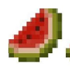
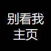

# 友链

如果你要挂我的友链：

- [头像](./assets/favicon.png)
- 名字：六楼溜刘/six-floor-slip-liu（取决于你是英文主题还是中文主题）
- 介绍：我是超级题解王/一个爱写题解的 Oier（取决于你想要逗比一点的还是正经一点的）

| 头像 | 名字 | 介绍 |
| :----------: | :----------: | :----------: |
|  | FatOldEight | Tip：如何提升自己的技术，根据所有大佬的建（fu）议（du）…多练 |
|  | Earthmessenger | EarthMessenger 的极简博客 |
|  | luohanzhao | 好朋友的洛谷博嗑儿 |
|  | robinyqc | 中学 OIer。什么语言都不会。玩 MC。 |
|  | SqrtSecond | 诈骗好闪，拜谢诈骗 |
|  | xx019 | 乂？ |
|  | Enonya | “if you like. 你想填什么填什么，如果要我建议那最好填**傻逼**”——Enonya |
|  | grass8woc | 神 |
|  | XxEray | 不管怎么样，明天又是新的一天。 |
|  | Imken | 当你真正想做成一件事情的时候，就连天地万物都会帮你。 |
|  | Rickyxrc | 一名初三的学生，致力于通过自己的努力让这个世界变得更好。 |