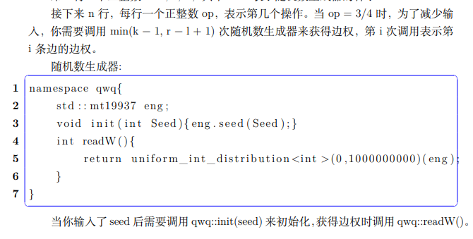
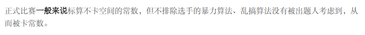
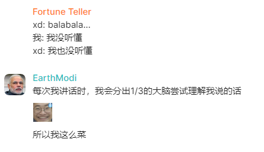
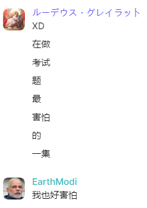
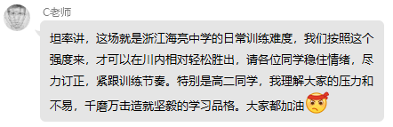
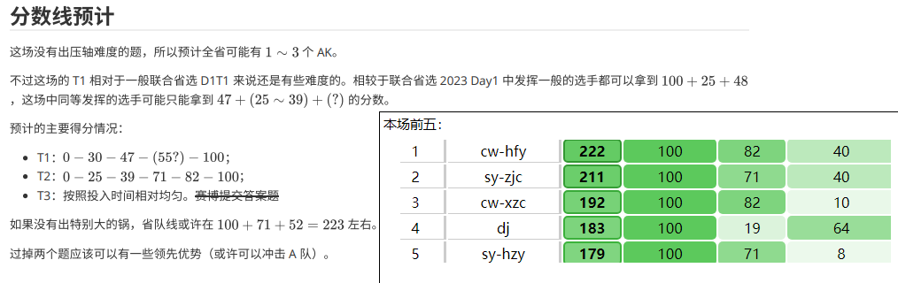
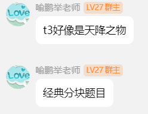
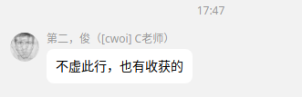
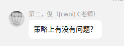

------
comments: true
---

# 2024 年度批话集锦

## 前言

古之 OI 者必有批。人非生而批者，孰能不批？批而不批，其为批也，终不批矣。生乎吾前，其批也固先乎吾，吾从而批之；生乎吾后，其批也亦先乎吾，吾从而批之。吾批道也，夫庸知其年之先后批于吾乎？是故无贵无贱，无长无少，批之所存，批之所存也。

嗟乎！批道之不传也久矣！欲人之不批也难矣！古之 opj，其出人也远矣，犹且批而批焉；今之 op，其下 opj 也亦远矣，而耻于批。是故 opj 益 opj，op 益 op。opj 之所以为 opj，op 之所以为 op，其皆出于此乎？

考虑年底整合一下评选一个最佳批话。

## 1.5

---
XD：我不知道复杂度对不对啊，和树高有关，但是大样例只跑了 0.2 秒，要是超过 40pts 我吃 dick。（这个逼 70pts）

---
LCX：那个T2，题目给了个数据生成器，但是我本地生成出来的数和样例解释里面的不一样。  
OPJ：啥意思？  
LCX：就是那个数据生成器，balabalabala……  
OPJ：你就说你要什么嘛。  
LCX：就是说，那个数据生成器，balabala……  
OPJ：哦，就是说他这个有问题嘛！我问一下出题人  
a few moments later...  
OPJ：那个谁你上来，我这里没有问题啊。（他甚至不愿意叫 LCX 的名字）  
LCX：它每个编译器输出不一样啊。  
OPJ：哦，你是说每个编译器输出不一样啊。那你就用出题人那个编译器啊。  
LCX：我怎么知道出题人是哪个编译器啊。  
OPJ：哦，那我再问一下出题人  
a few moments later...  
OPJ：那个T2，输出以 NOI Linux 下为准，然后我发一个编译器下来  
「正在下发文件：devcpp-5.11.rar」  
全场爆笑。  
OPJ：怎么了？有问题吗？  

附：数据生成器。

---
## 1.8

---
XD：是不是所有人都会 T3 啊（这场比赛加上高二只有他一个人 T3 会正解，他还挂了 5pts）。

---
LZQ：O2 为什么不在值域小的时候预处理 `__gcd` 啊。  
KK：照你这么说 O2 为什么不把单点修区间查直接优化成树状数组啊。  
WCX：那 O2 为什么不直接把暴力优化成正解啊。

---
WCX：我去，T3 原题 CF\*3000，XD 赛时切了。  
HYJ：原题数据范围还只有 1e6，这道题 3e7，这比 CF\*3000 还强。  
LZY：那这不 TM 是 CF\*90000！  

---
ZMY：我去 XD 赛时切黑。  
XD：这道题不简单到爆吗，你看所有人都赛时切黑。（事实上，赛时就这一个逼人会正解）。

---
XD：我 TM 不就写到黑题吗，大家激动个什么。

---
LZY：我的知乎没有一点非学术内容（虽然也没有一点学术内容）。

---
XD：T3 过程虽然很长，但是很简单，乱想就想到了，你随便乱想不会超过 40min。  

---
XD：这哪里批了，这一点也不批。

---
XD：这里我们先打一个 $n=5,n=6$ 的 表，发现 balabala...。然后可以猜一个性质，接下来我们打开大样例，发现性质是对的！（这个 B 给所有人讲题的时候说了这句话）

---
XD：我感觉最近一直在做一些很神奇的题，结论全都是猜的。

---
来自今天的题解：

---
LZQ：什么时候改错速度才能像 LZY 一样快  
LZY：哪里快了，从烤枯磊忒那场开始每一场就有至少一道题没改。

---
XD：垫垫垫，星期三还要垫一次，星期五也要垫一次。

---
LZQ：唉现在我成改的最少的了，我只做了一道题。  
XD：我也只做了一道……哦操不对我都改两道了！

---
## 1.9

---
XD：我是傻逼，我好菜，不要骂我了。我好菜不要再骂我了，我菜爆了。  
XD：我是菜逼，我一直在颓废，对不起对不起

---
XD：你看 Eray 八分钟写完区间本质不同子串个数，16:37 交第一发，16:45 就过了。

---
ZMY：XD 你得感谢 LZY，从门口完全看不到你在看小说，全被他挡住了。
XD：woc 那我还得感谢 LZY，LZY 谢谢你吃的这么多，下次请你吃东西。

---
KK：所以区间本质不同子串个数怎么 SA 做啊，感觉做不了啊，要不你出来给我讲一讲。  
XD：我真的不确定对不对啊，我感觉是猜的不一定对。（然后就出去讲了）

---

---
XD：我去！线段树！你好强！给你磕一个，给你磕两个，给你磕三个，给你磕四个。  
LZQ：怎么不磕了？  
XD：腰酸背痛，不想磕了。

---
XD：做计算几何怎么不算颓废。

---
XD：*看计算几何*  
LZY：我去！好有实力！  
XD：无语，我题都没读懂

---
LZY：上课时间禁止 XD 随意走动。

---
LZY：*被 OPJ 叫出去谈话回来*  
XD：OPJ 说什么了？  
LZY：OPJ 说我这几次考试心态崩了，让我调整心态，以后考好一点。  
XD：难道你不想考好吗？

---
OPJ：你们其实都一样聪明，除了 XY，因为他确实数学比较好嘛。但是无论如何，其实你们智商是没有差别的。

---

---
WCX：我的算几板子是不是很屎。
XD：我觉得不屎啊，我觉得很丑。

---
XD：LZY 你连许多题都做不出来你还会做什么。

---
## 1.10

---

---

---
XD：我从来没有说过批话。

---
HYJ: 今天 LH 虽然没有做计算几何专题，但他打了模拟赛，所以他做了 3 道题，我只做了 2 道题

---
## 1.11

---
XD：谁批话多。

---
XD：A 怎么做，你会吗。
LZY：会。
XD：怎么做。
LZY：直接做。

---
WCX：HYJ 你算几专题做的怎么还没有 LH 多
HYJ：对不起我太菜了。

---
## 1.12

---
OPJ：只要HFY来给我们讲题，一切都会好起来。（实际上不是这句，但差不多是这个意思）

---

---

---
## 1.18

---
XD：我是菜逼我是菜逼我是菜逼我是菜逼我是菜逼我是菜逼别骂别骂别骂别骂别骂别骂别骂别骂别骂别骂别骂别骂。

---
XD：我从来不说批话。

---
来自今日模拟赛题解：

---
## 1.21

---
XD（正在打 ARC）：破防了我不会 A，不会 A 就不会 B，不会 B 就不会 C。这这这...这是一个子任务依赖！（然而这个逼已经把 B 过了）

---
## 1.23

---
OPJ（正在训话 LZY）：以后你就以 LH 为学习榜样，LH 干什么你就干什么。我给你说 LH 中午都不回寝室在学习。虽然我当然不要求你中午都学习，但是还是就记住，LH 干什么你就干什么。

---
## 1.24

---
XD：傻逼周杰伦，只会唱有版权的歌。

---
## 1.26

---
OPJ：（走进门，摆出一副全天下就我最牛逼，你们都是傻逼的表情，走上讲台，放下包）这个……我今天说个事啊。  
LZY：YQC 还没来。  
OPJ：那等一下。  
a few moments later...  
YQC：（回来了）  
OPJ：这个……我说个事啊。昨天**中午**，有**特长中心**的老师说你们在机房里**打游戏**，并且**多次劝阻**仍未离开balabala...  
众人：（一脸懵逼，根本就没这事）  
a few moments later...（大概解释了一下不是我们，可能是强基计划的那群傻逼）  
OPJ：好嘛，但就算这次不是你们，你们也要得到教训，以后绝对不能在机房里打游戏balabala...

---

## 4.19

---

---
## 5.14

---

---
## 5.15

---
XD：我也想动一下脑子。

---
## 5.16

---
LSL：许多不是场切 T1T2 吗（XD 赛时 $0$ 分）。

---
WCX：JX 把 LH 安排在小机房进门的位置，他对 LH 有一种特别的关心。  
XD：woc！南桐。

---
LZY：XD 你在写什么题。  
XD：B 题。  
LZY：怎么做？  
XD：我不知道怎么做。哦不对我不知道怎么做为什么要写。