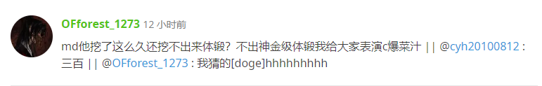
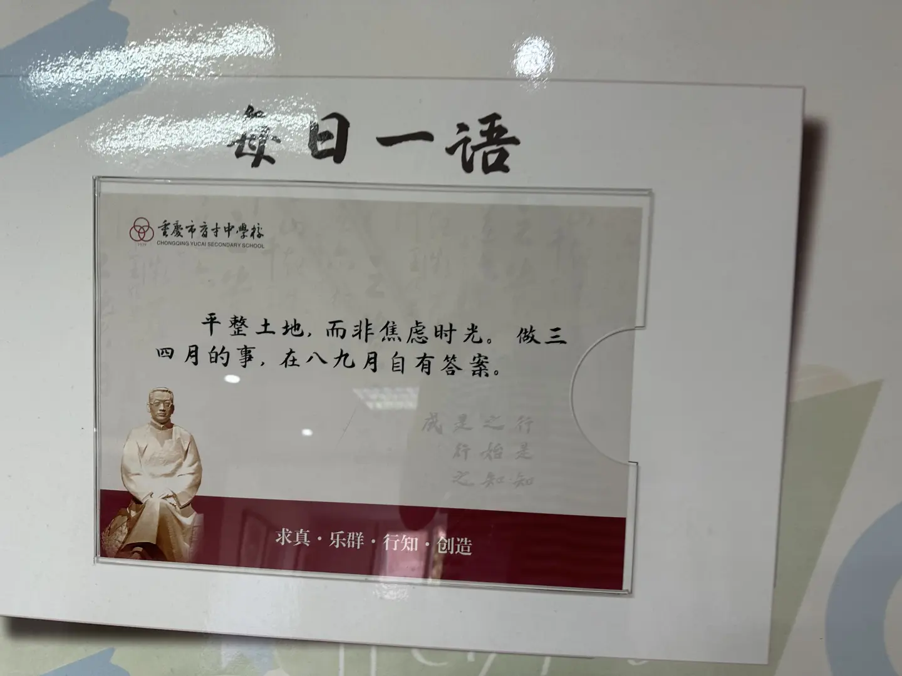
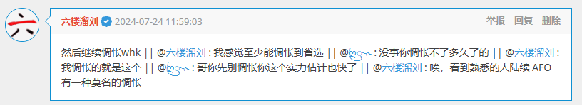
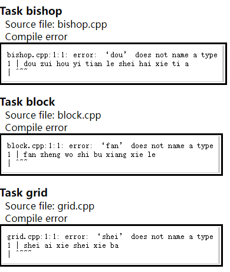

# 2024 西大附中集训 游记

## day -?

OPJ 告诉我们要去西附集训，并且多次找人单独谈话大谈这个集训有多有价值。我最初意见是如果所有人都不去我就不去，结果 XD 的母亲眼疾手快，没有问 XD 的意见就给他报了。这下不得不去了。

而且后来 OPJ 说不去西附就去 HB 成都分舵。已知烂的和未知质量的该选哪个我还是清楚的。

本来可能要去的只有我，XD 和叶总。叶总不去，他说他每次出远门就要生病。后来 zmy 复活了，他说 OPJ 告诉他必须去，没给他选择。只能说 OPJ 比较英明。

## day 0(2024/7/7)

坐高铁来的重庆。高铁上狂暴吸食 momotalk 二创，本来我妈说晚自习要带我去周围玩，但是后来想想又算了。

下高铁的一瞬间就感受到了重庆有多热，但是明显感觉湿度比成都要低，希望不要天天流鼻血。

宿舍环境还算行，集训方送了全套床上用品，但是床垫比较硬。热水、食堂、空调和插座的电费以及小卖部都需要用饭卡支付。感觉买饭制薄纱 CW 伙食团制啊，至少有得选。而且感觉味道比 CW 的好多了。

据说热水很贵，放 10min 能用 $12$ 块钱。最终决定洗澡不用热水，容易发现晒了一天的冷水已经够温了。（事实也确实如此）

这边收手机是只有周末发回来其余时间全收着，哎哟我感觉上课和睡觉收着就行了。

晚上随便找了道题写。

这边集训是给每个人一个网盘，让你把文件存在网盘里。我怀疑 D 盘会还原。

感觉学校环境很好也没啥蚊子，最大的问题是小卖部太你妈远了，和食堂至少有 250m 的水平距离和算上上下山 40m 的纵向距离，只能说不愧是重庆。但还好食堂机房和宿舍比较近。小卖部是建在另一栋教学楼里的，不知道那栋楼的怎么吃的饭。

貌似开了网页白名单（也可能是黑名单，有一大堆 CW Oier 自建的 blog 上不了，但是又有一些神秘网站能上，比如云原神），还把 U 盘禁了。不能颓废简直要我命。

发现这边有免费的 Typora 可以用，于是开始尝试用 Typora 编辑 .md 文件。

## day 1

到教室发现 D 盘果然还原了，一群人代码丢失，乐，还好我有先见之明。

上午讲课，是 zz 的数据结构杂题，经典跑几百公里来上网课。貌似后面全是线下讲课了。

居然全部听懂了，当天下午和晚上就口胡完了，晚上挑了一道 CF 的写。然后发现 `__int128` 的一些位运算啊，数组下标啊好像是 UB，还好没在正式比赛写。

下午被抓去讲了一道专题的题，貌似讲的很烂。语言表达能力过弱导致的。

## day 2

上午模拟赛。T1 简单题，T2T3 是 CWOI 考过的原题。但是 T2 因为弱智错误挂成了 $0$ 分，估分 $100+100+100$，实际得分 $100+0+100$，rk2。

下午火速改出 T2，然后是题目讨论，讲了 T2 和 T3，但是貌似讲的更烂了。还发生了和 XD 抢麦的趣事。

晚上 pb 讲贪心与构造，感觉全是神秘题，大部分没怎么搞懂。但怎么又是网课。

没咋搞懂啊，准备明天再研究一下，口胡了。

## day 3

上午努力口胡，中途被抓去讲了一道原题，是之前佳老师图论专题的，给 pb 抓到构造专题了。

下午终于胡完了，又挑了几道谷上有的写了。

晚上大概七点过说是要补前置知识问大家要不要去，除去 CW 的以外大部分人都去了，快八点的时候回来了，一问发现基本都是讲过的，还好没去。

快下课的时候说以后要把 U 盘禁了，有一说一我觉得开了也没啥用，教练说最后一天会开 U 盘。

另外事实证明装了虚拟机的电脑是禁不了 U 盘的，具体实现略。

## day 4

上午讲课，本来说来线下讲结果讲师（jzy）的飞机备降成都，明天才能来，那我为什么不直接在成都上课呢。

所以又上的网课，说是计数专题，但感觉全是数论啊，而且基本全都没搞懂，并且网课信号很烂，大部分时候不怎么听的清，下午自己努点力。

另外一件趣事是他的选题和 pb 重了一道。

下午题目分享，讲了三道“有至少一个人搞懂的”，恰好这三道我都没完全懂就去听了，最后懂了 $1.5$ 道。然后自己口胡搞懂了的题。中间 OPJ 打电话过来问怎么没交题，不是他说口胡了可以先不写的吗？然后展示 2min 过 $7$ 道。

晚上说要组织体育锻炼，有死亡的预感。晚自习又胡了几道，放生了几道“当前阶段不可能搞懂的”，等线性代数强一点了再说。准备等回去了再重学一下线性代数。

说实话胡了的题里面也有不少没完全搞懂的，重灾区在线性代数，线代重学刻不容缓。

## day 5

太好了，体育锻炼是自主锻炼，于是昨晚在学校里面逛了一圈，找到了一条到小卖部不用爬山的路。

上午讲课，终于是面对面了。这次还是 jzy 的计数专题，而且确实是计数专题了。并且讲的其实还不错，学会了 LGV 引理，以及维护多项式矩阵（就是矩阵元素是多项式）的小 trick。后面学线代的时候一起总结了。

下午经典口胡一下午。但是下午放学了可以拿到手机。拿到手机给家长打了个电话汇报情况，结果过了不久 OPJ 给我打电话了。时放学后，因为中午吃太饱就准备等会儿去再食堂，在机房口胡。OPJ 最终同意了不写代码只口胡，欧耶。

## day 6

放假，在寝室里瘫了一天，继续狂暴吸食 momotalk 二创，把 BA 剧情 v1c3 已经出了的部分（前三节）看完了。感觉没有 v3 那么好，但是也没有网上的风评那么烂，只能说断章取义过于害人了。

这边如果出太阳衣服晾的巨快无比，但是下雨时要考虑的可就多了，今天下暴雨，还好昨天就把衣服收下来了。

晚上返校（？），把昨天的题里面能做的口胡完了，又打了一道简单的。

晚上有 ABC，但是不想打。简单打听了一下题意，只有 F 有价值，是道诈骗题，而且我被骗到了，可恶。

感觉还是得以口胡为第一事项啊，胡完之后一道题至少懂了 $90\%$，我觉得所有题都懂了 $90\%$ 还是比部分题完全搞懂要好的。

## day 7

上午 tsx DP 专题。讲的太好了，选题也都选的很好。基本都听懂了。

下午和晚上一直在口胡，用了一下午没胡完，剩了一两道题。

## day 8

上午模拟赛，T1 推出结论没想到怎么维护（打了 $3.$ 几 kb 后发现有个地方搞不来）心态爆炸，T2 一眼没思路直接跳了，T3 推出结论不会维护再次爆炸，最后打了个 T3 $O(n^2)$ 暴力跑路，期望得分 $0+0+40$，实际得分 $0+0+50$。

下午一直在改 T1，发现自己不会树上 DDP，遂学习 XD 优秀写法。

晚上调了一天终于调出来，把昨天的口胡补上了。

## day 9

上午 ljy 字符串专题，难度比之前稍低，能全部搞懂。是线下的，但是听到一半就没剩下几个人了。并且还发现了几道原题，但是他今天剩了几道没讲完，留到明天讲。

下午准备口胡一下午，这次居然意外的高效率，下午就口胡完了。于是回头改昨天考试 T2。

晚上把 T2 改出来了。事实证明很多时候写基础算法（比如倍增）不要搞神秘新写法。以及考试记得对拍。

然后又写了两道专题的题。感觉平衡树太久没写有点生疏了啊。

## day 10

早上上课前教练提醒我们现在入伏了下面一周会变热。所以上周还不算热？啊？

上午 ljy 计数专题，中间有几道线代没搞懂，其它没多大问题。讲完了后开始补讲前一天没讲完的字符串，但是没多少人听了，其实我也没听（。

准备暑假时将“讲了的”和“口胡了的”题取个异或，容易发现基本全是线代内容，然后单独搞出来整一下。

下午口胡，期间有人杀极域，教练语出惊人：谁杀极域就杀谁。令人忍俊不禁。

因为准备搞懂的题不多，下午就口胡完了，开始写之前专题的题。

晚上机房一堆人迷上[赛博斗蛐蛐](https://www.whatbeatsrock.com)，这玩意真他妈有成瘾性，反正我是写不了题了，一直在看右侧的哥们。

快下课的时候教练给所有人分西瓜吃（是本来就有的安排），他貌似完全没有发现异常。

## day 11

上午是 zjk 博弈专题，最期待的一集。

发现其实目前的人只有 zjk 是来讲课的，其他人都是来讲题的。听了 zjk 的基础博弈论讲解感觉受益良多啊。

最晕晕的一集，前一半跟上了然后后面基本掉完了，尤其是最后讲了一点超纲知识，有一种原始人突然接触到现代信息的美。

准备博弈论单独搞一下，和线代一起加入 Todolist，先把现在能搞懂的题胡了。

晚上教练制裁了几个乱动别人机子的小朋友，令人忍俊不禁。

右边老哥晚自习在玩开盒模拟器（图寻），我做题效率骤减，不能再这样被别人影响了。

妈的晚上体锻要关机房，没口胡完，只能周末卷了。

## day 12

上午 zjk 图论专题，算法基本都学过了，基本在查漏补缺。

容易发现我不会 Boruvka，准备找时间写一下，例题用 CF888G。

下午又口胡了一下午，因为放学了所以留了两道题明天写。

## day 13

大家好，今天放假所以我又在寝室瘫了一天。

容易发现 mrfz 更新了，但是我有防沉迷，借别人的手机帮别人（？）打了一会新集。有一说一低难度（且有 ew）的仇恨蓝图队是真的爽。

别人把手机要回去后我用自己的手机看 B 站，发现 BA 主线更 v1c3p4 了。自己看完了觉得除了战力崩坏（地下老登把火龙果变小丑了，要是火龙果会这招鸡窝早毁灭了。而且 sensei 怎么在吃瘪啊，还要牢梦开导）以外没多大问题，剧情动画演出帅呆了，人设也很到位（除了 sensei 有点崩），最后色彩白子“会赢的”我是真有点没绷住。结果社区风评很差的样子，我初步认为是弱智策划碰上逆天玩家导致只要骂官方就是对的。

然后后面又捋了一遍感觉剧本确实有点不好，这种搞好几个角色当跳板塑造一个角色确实感觉有点怪。但是分析每个角色的动机又合乎情理，神奇。

中午的时候想起星铁前瞻直播有 300 石头，然后去找兑换码，发现铁要和**命运留在晚上**联动了，啊？

然后晚上把昨天剩的题口胡了，发现明天的讲题人姓名缩写是 lh，草。

后面闲着没事看了一眼 ABC 后几题的题面，发现 DE 都挺简单的，F 看着像记搜，我感觉暴力转移可过，有点不会分析复杂度，G 一眼不会就没认真想。

## day 14

上午是 lh 的网络流专题，前面讲了一点基础的东西，学会了最大流最小割定理的形式化证明，以及最小割的形式化建模。接着讲了几道基础题，感觉收获还蛮大的，用形式化建模去思考感觉上思路更平滑一点。回去补一下最小割经典建模。

然后后面讲了一点线性规划内容，发现完全听不懂，感觉要系统学一下线性规划啊。

中午寝室四个人都没听到打铃导致全都在两点半之后才醒，火速赶往机房，乐。

下午经典口胡一下午，中途被抓去讲了一道原题。口胡过程中分析复杂度时瞄了一眼自己写的 blog，发现了 Mkdocs 的逆天渲染把所有有序列表全渲染成从 $1$ 开始，考虑回去改一下。然后还有一点笔误（比如 Grid Coloring 2 题意部分少了个加号），回去记得改一下。

晚上把能搞懂的题胡完了，发现还剩 1h 放学就写了点简单题。

突然发现 XD 又把 AI 对战五子棋翻出来玩了，导致一群人又开始一起搞。这就是宇宙无敌批话哥的含金量。

## day 15

上午模拟赛，说的好听点就是很有联考风格，说的难听点就是狗屎，详见[此处](https://www.luogu.com/article/fnw0goig)。赛时秒 T1 后看 T2T3 发现 T3 根本读不懂，T2 有复杂度正确的思路，于是开始冲 T2，先打了个暴力，然后开始写正解。赛时写了 7kb 过不了大样例，最终估分 $100+20+0$，实际得分不变。

下午对拍了好久把 T2 调出来了，最终代码接近 8kb，在 OJ 上一发过，也就是说假如考 7h 就能过了（

一个笑话是我赛时忘了 ST 表能 $O(n\log n)-O(1)$ 维护区间最值，导致用线段树写的双 $\log$ 写法（傻逼东西题目上数据范围 $10^6$ 我还担心过不了赛时犹豫了好久，结果实际范围只有 $10^5$，所以最后没有换成 ST 表就过了）。但是你是能在我的那一份代码里发现 ST 表的，因为我用 ST 表写了 $O(n\log n)-O(1)$ 的 $\mathrm{lca}$。

晚上没啥事，T3 是 poly 版题但是不会 poly，考虑补点专题。

补了两道专题就完全不想写题了，集训期间还是第一次出现这种情况。感觉是不是写了道大 DS 就丧失了写题的欲望啊。

发现 XD 挂着梯子在看 P\*\*\*v 的 R18 小说，不是哥们你在学校干这事？

## day 16

上午模拟赛，T1 看到数据范围 $n,q\le 2000$ 时间限制 6s 就交了个 $O(n^3)$ 暴力跑路了，结果 A 了，跑的比某些人（比如 XD）的正解还快。T2T3 没啥想法就打了点暴力，估分 $100+10+25$，实际得分不变。

下午研究模拟赛 T3，其间 XD 骇入极域给所有人打开了云原神被制裁了，真他妈弱智。

这次 T3 很厉害，准备改一下，T2 是构造题不咋想改。

从晚上开始所有电脑开始随机开 cmd，以为是有人在玩极域，后面教练发现是有人的电脑用免费 VPN 感染病毒了，感染形式是疯狂往外传挖矿软件然后解压下载。有人很好奇教练就解释了一下挖矿的原理。

合订本：

> 这个东西就很抽象，你拿到的是别人承认的价值，不是客观的价值，你们学政治经济学会学到这一章。

> 你分析一下复杂度就知道，这个东西投入的电费远大于收益，只有那种一墙显卡直接不散热用工业散热的才能拿到一点收益。前段时间国家不是发了什么文章禁止了吗？

> 我自己也挖过一段时间。刚出来的时候挖的。

> 你要试不要在学校电脑试，回家自己去试。

> 虽然 Clash 是开源的，但是它套的这个壳不是开源的，你是不是用的控制台搞得嘛？如果是控制台那就比较安全，如果不是就有被感染的风险。

然后本来今天的体锻因为高温被取消了，结果后面因为要关机房调试又给加回来了，欧耶。

犇犇合订本：

笑点解析：这人是女的。

## day 17

昨天问题的解决办法是在每台电脑上装了 360，/jk。

上午 jly（即 jiangly）的杂题选讲。但是几乎每道题都在神秘地方走神了导致没咋听懂。倒数第二道是套路听懂了，最后一道甚至是最新最热 ABC G 铜牌题。

中午的时候和 kk 在犇犇对了会线（见下面第一张图），最终他给我私信发了下面第二张图。

天呐这就是我想听的。所以 XD 什么时候去死，同样是 CW 抽象 OIer 我觉得高下立判了。妈的有的人他妈的就是地球毒瘤。

下午口胡几道能找到题解/听懂了的。

这边机房给我一种全世界都在打雀魂的错觉，于是我（麻将 $0$ 基础菜逼）下午也开了个号启动了一会三人麻将，感觉还行，中间尝试做了一回四暗刻两回国士结果都被爆了。

晚上把那个大码量 ABC G 打了，交了发洛谷题解。

妈的傻逼 360 吃我 exe 文件，我他妈自己写出来的我知道是不是风险文件。

下午某广附老哥上白板用极域搞人被制裁了，乐。

## day 18

看了 kk 博客的更新突然有点想回去更新一下博客个人简介。

上午 jiangly 杂题选讲，结果选题搞得像构造专题，听的挺开心的。

哎哟想颓废了。准备下午水一水明后天再水一水模拟赛就直接润掉了。

看了会 NOI 游记，怎么说呢，感觉看多了会玉玉，还是不看了。

吃饭的时候我和 ZMY 争论役满是 $24000$ 还是 $32000$，他始终认为是 $24000$，但是他很快就知道非庄家役满是 $32000$ 了，此为伏笔。

吃完饭经典打雀，胡了个小三元三倍满。ZMY 一局点了同一个人两次国士（这下知道了），我建议他把回放发 B 站上，播放量不到五万我请他喝瓶水。

晚上写了道题。

## day 19

倒数第二天好耶。

上午模拟赛，T1 想了一会假做法之后想到正解，T2 看了一眼完全没思路就去看 T3，然后一眼看出 T3 假做法打完之后看 T2 发现可以点边容斥。大概 11 点写完 6kb 然后发现 T3 做法假了但是能过部分分，于是拼了个暴力。最后五分钟发现 T1 有点细节问题，没时间写了但是感觉我这个假做法出题人想不到于是就没管。估分 $[0,100]+100+30$，实际得分 $100+100+30$，rk1（我是字典序大王，两人同分仍然排在上面，这就是 **C**W 给我的自信）。

然后下午被抓去讲题，讲了 T1T2，T2 幽默讲法引人发笑。中间教练突然来问我有没有做过原题，显然是没做过的。

哎哟我想直接润了这个 B 天气一点也不想上这个 B 集训了。

然后听了还是不会 T3，怎么办嘛。考虑直接开颓。

卧槽吃完饭胡出国士了，开局流局按钮亮了差点按下去，还是庄家，直接三位变一位，上初心三好耶。

晚上真的啥都不想写，盯着隔壁老哥看 B 站在发愣。

突然教练把我们（指 CW 全员）叫到隔壁交待一点事情包括但不限于饭卡如何退款，走的时候走哪个门，中间问了“你们觉得这个集训怎么样”，大家一致认为“比 HB 好”，然后开始吐槽 HB，活动室里充满了快活的空气。然后说为了方便和家长教练联系直接把手机还给我们了。

卧槽今天星期五晚上八点钟手上有手机！但是不敢玩，唉。还是过于胆小了。

拿到手机和老妈打了个电话交代了点事情，然后随便找了道口胡过的网络流题粘了板子就交了，怎么还剩 1h 啊。

好耶九点放好耶九点放，这下只剩 15min 了。

## day 20

最后一天好耶。

模拟赛直接摆了，蜘蛛纸牌打了巨厉害的一局，牌发完了没凑齐一堆，最后居然清完了。

然后开始背诵 mrfz 技能名，发现好多常用技能名字背不到。

期望得分 CE+CE+CE，实际显然不变。

XD 更他妈厉害，上午用电脑接口充平板充满了直接回寝室躺尸，有实力的。

午休回去搬铺，搬完想用手机开雀发现雀魂官网在华为浏览器是风险网站直接不让上，逆天。

下午继续摆，然后放两周暑假好耶。

## 总结

总的来说，这是我参加过最好的集训。

题目难度也比较合适，讲课质量也很高，食堂也能薄纱 CW，寝室环境也算好。

本来想写游记的，但是好像写成颓废日记了，唉。
