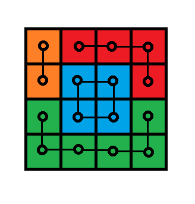
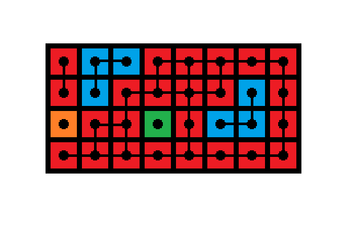
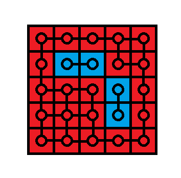
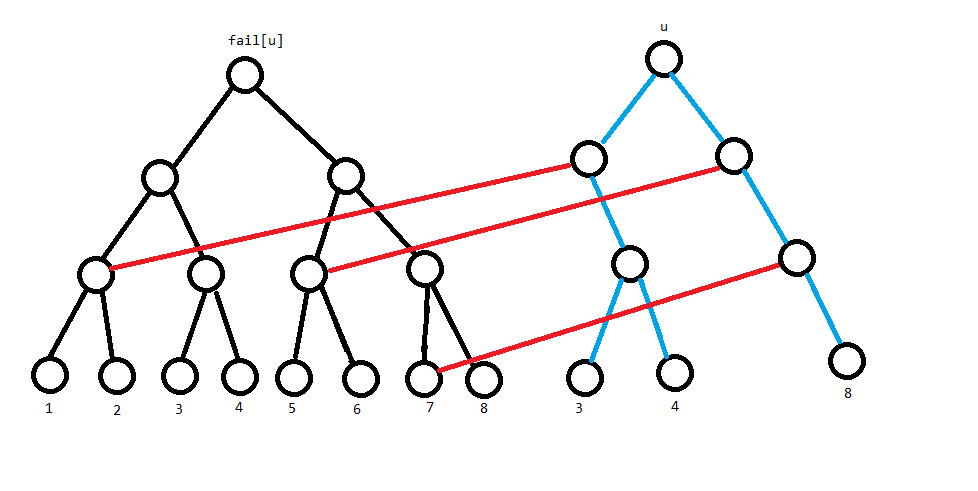
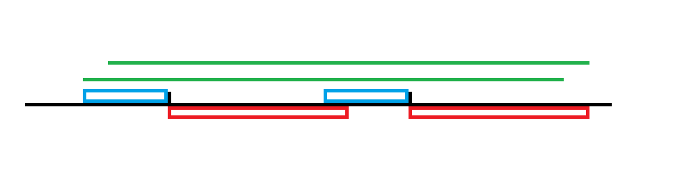
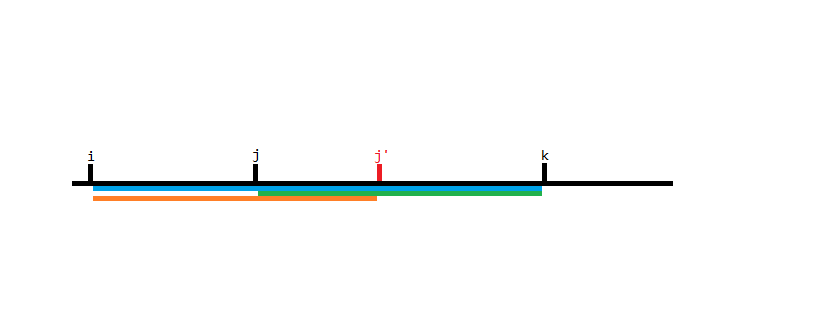
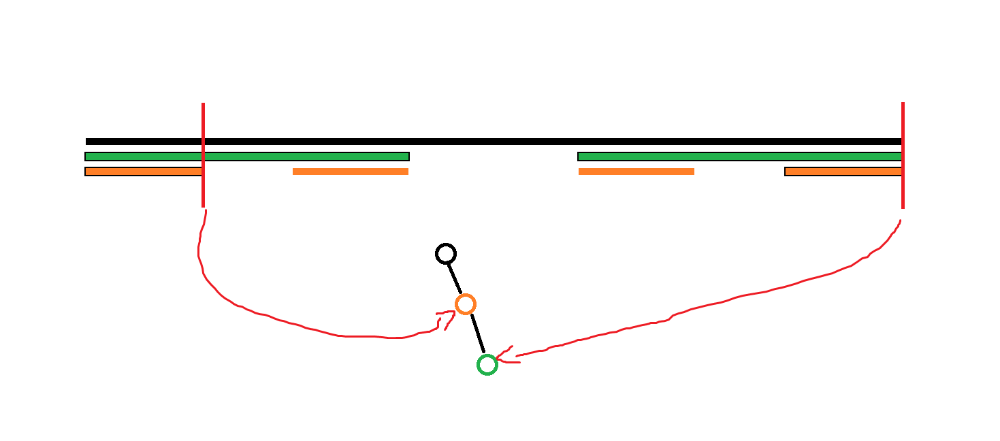

# 2023 12 月杂题

## 前言

分享一件事。

opj 喊 lsl 给我们讲数学知识。然后 lsl 就在问 opj 要讲什么，opj 说先讲数论相关的嘛，然后其它的看着办。于是 lsl 就列举了许多知识版块，譬如说博弈论，群论之类的，问 opj 讲不讲。问题在于 lsl 每说一个，opj 就说“**这个可以放到最后看有没有时间就讲了**”。于是乎，我们要在最后**建立起整座数学大厦**。opj 堪称死线战神。

upd：12.8，由于上午 T2 要用线代知识，Eray 花了 70min 讲了线代入门，大概讲到了拉普拉斯变换。让我们看到了死线建立数学大厦的可能性。

## P7295 [USACO21JAN] Paint by Letters P

~~虽然但是这道题还是图论题。~~

[传送门](https://www.luogu.com.cn/problem/P7295)

貌似是我第一次完全独立做出黑题。

约定 $a_{i,j}$ 表示给定矩阵的第 $i$ 行第 $j$ 列。

容易发现假如我们给四连通的同色块连边，那么容易发现每一笔可以涂完一整个连通块。而方格图建边后必然是平面图。故我们要求的其实就是**矩阵内平面图连通块的数量**。

根据平面图欧拉公式，我们有 $V+F-E-1=A$，其中 $A$ 为平面图连通块数量，$V$ 为点的数量，$F$ 为面的数量（包含外面无限大的平面），$E$ 为边的数量。其实你如果不算外面的平面那么有 $V+F-E=A$。

---

此处简要证明一下平面图欧拉公式。

考虑数学归纳法，容易发现，当 $V=1,E=0$，显然成立。

然后对于任意情况，假设所有 $V'\le V,E'<E$ 的情况都成立。

考虑删掉一条边，那么就有两种情况：

1. 删掉的这条边是桥边（即删掉后变成两个连通块）

那么容易发现它变成了两个更小的情况，面数不变（桥边两侧都是外围无限大的平面），点数不变，边数减一。$V+F-E$ 的值 $+1$，而连通块数量 $+1$，符合条件。

2. 删掉的这条边不是桥边

那么连通块数量不改变。但是由于它不是桥边，那么它两侧的两个面原先必定不连通（因为有至少一边是封闭的）。删掉这条边后变为连通，且变成了一个规模更小的情况。相比新情况，$V+F-E$ 的值不变（$E'=E-1,F'=F-1$），连通块数量不改变，符合条件。

另外容易发现某个连通块内部的“面”里面有另一个连通块其实和两个连通块相互独立是等价的。

---

那么考虑如何维护 $V+F-E$ 的值。

首先 $V$ 最简单，就是矩形大小。

然后是 $E$，容易想到分成纵向边和横向边两种情况求二维前缀和。

具体来说，令 $s_{x,y}=\sum_{i=1}^x\sum_{j=1}^y[a_{i,j}=a_{i-1,j}],s_{x,y}'=\sum_{i=1}^x\sum_{j=1}^y[a_{i,j}=a_{i,j-1}]$。那么容易发现矩形 $(x_1,y_1,x_2,y_2)$ 中的横向边数就是：

$$s_{x_2,y_2}-s_{x_1,y_2}-s_{x_2,y_1-1}+s_{x_1,y_1-1}$$

注意一边是 $x_1$，另一边是 $y_1-1$，因为在 $s$ 的定义中一条横向边是挂在右边的点上的。

同理，纵向边数就是：

$$s_{x_2,y_2}'-s_{x_1-1,y_2}'-s_{x_2,y_1}'+s_{x_1-1,y_1}'$$

加起来即可。

---

接下来是最难搞的 $F$。

$F$ 能分两种情况，一种是 $2\times 2$ 的小方格。



比如上图中间蓝色的那一坨。这种中间**不包含其它点**的面可以直接前缀和维护，挂在右下角上即可。

然后是另一种中间围了其它点的空腔。



（其实这就是样例）比如右边红色围着蓝色的就是一个例子。

这个怎么办呢？容易发现对于这样的一个连通块，显然存在一个矩形 $(x_1',y_1',x_2',y_2')$ 恰好包含它。而这个面产生贡献当且仅当询问的矩形恰好完全包含这个矩形，即若有一个询问 $(x_1,y_1,x_2,y_2)$ 满足：$x_1<x_1',y_1<y_1',x_2>x_2',y_2>y_2'$，那么这个面会对对应询问产生贡献。

那么容易发现这是一个四维偏序，考虑 cdq 套 cdq，内层排序后用树状数组解决。

另外，我们还要考虑一下如何找到空腔。这个其实很简单，先枚举是这个空腔是哪个颜色的空腔，比如是 $c$ 颜色。那么就可以把所有 $c$ 颜色视作障碍物，其余视作平地跑 dfs 染色，途中维护四个方向的最值即可。

注意这一种情况：



容易发现，中间的蓝色块虽然不是四连通的，但是也是同一个空穴。所以跑 dfs 染色的时候应该将八连通视作相邻，就不会出问题了。

另外，若某个空腔的边界取到了矩阵的边界，它显然是不可能产生贡献的。

---

此处简要阐述 cdq 套 cdq 怎么实现。

容易发现 cdq 的每一层是把所有点简化成了一个“左边的修改”对“右边的询问”产生贡献的形式。

那么对于第一层分治的每个区间，把左边的所有修改和右边的所有询问取出来，排序后放到新的序列上，然后对新的序列做第二层 cdq 即可。

注意这里有个问题，就是对于第一层（假设第一层是 $x_1$），若存在一修改和一询问的 $x_1$ 相等，那么应该将询问排到前面。因为若连续的 $x_1$ 横跨了第一层分治的某个区间，那么它们都会被取出来。就可能会有 $x_1=x_1'$ 的一对修改和查询产生贡献，而这是我们需要避免的。但只要把询问排到前面就能避免这种情况了，因为若询问被取出了那么对应修改必定不被取出，反之亦然。

---

然后我们就优雅地解决了这个问题，复杂度贼神奇，是 $O(q+nm|\Sigma|+(nm+q)\log^3(nm+q))$，其中第一个 $q$ 是前缀和维护可维护的信息，第二个 $nm|\Sigma|$ 中 $\Sigma$ 表示字符集，这个是寻找空腔的复杂度，第三个是求偏序的复杂度，看起来过不了，但是这个上界取的太松了，空腔数量是卡不到它的。

~~虽然但是，我目前暂居洛谷倒数第二劣解，因为这个解法确实做复杂了。~~

/// details | 参考代码
    open: False
    type: success

```cpp
#include<bits/stdc++.h>
#define mem(a,b) memset(a,b,sizeof(a))
#define forup(i,s,e) for(int i=(s);i<=(e);i++)
#define fordown(i,s,e) for(int i=(s);i>=(e);i--)
#define y1 y114514
using namespace std;
#define gc getchar()
inline int read(){
    int x=0,f=1;char c;
    while(!isdigit(c=gc)) if(c=='-') f=-1;
    while(isdigit(c)){x=(x<<3)+(x<<1)+(c^48);c=gc;}
    return x*f;
}
#undef gc
const int N=1005,inf=0x3f3f3f3f;
int n,m,q;
int a[N][N];
char str[N];
int e1[N][N],e2[N][N],f[N][N];
struct query{
	int x1,y1,x2,y2,pos;
}qu[N*N+N];// (1)!
int cntq;
int ans[N];
int calc(int x1,int y1,int x2,int y2){// (2)!
	int _e1=e1[x2][y2]-e1[x1-1][y2]-e1[x2][y1]+e1[x1-1][y1],
		_e2=e2[x2][y2]-e2[x1][y2]-e2[x2][y1-1]+e2[x1][y1-1],
		_f=f[x2][y2]-f[x1][y2]-f[x2][y1]+f[x1][y1],
		_v=(x2-x1+1)*(y2-y1+1);
	return _v+_f-_e1-_e2;
}
int nxt[8][2]={//注意八连通
	{0,1},{1,0},{0,-1},{-1,0},{1,1},{1,-1},{-1,1},{-1,-1}
};
int vis[N][N],u,d,l,r;
void dfs(int x,int y,int co){// (3)!
	vis[x][y]=1;
	u=max(u,y);d=min(d,y);
	r=max(r,x);l=min(l,x);
	forup(i,0,7){
		int nx=x+nxt[i][0],ny=y+nxt[i][1];
		if(vis[nx][ny]||a[nx][ny]==co||nx<1||nx>n||ny<1||ny>m) continue;
		dfs(nx,ny,co);
	}
}
query seq[N*N+N];
int cnts;
struct BIT{
	int c[N];
	void upd(int x,int k){for(;x<=m;x+=x&-x)c[x]+=k;}
	int sum(int x){int res=0;for(;x>0;x-=x&-x)res+=c[x];return res;}
}mt;
void cdq2(int l,int r){
	if(l>=r) return;
	int mid=(l+r)>>1;
	cdq2(l,mid);cdq2(mid+1,r);
	int ll=l;
	forup(i,mid+1,r){
		if(seq[i].pos!=0){
			while(ll<=mid&&seq[ll].x2<seq[i].x2){
				if(seq[ll].pos==0){
					mt.upd(seq[ll].y2,1);
				}
				++ll;
			}
			ans[seq[i].pos]+=mt.sum(seq[i].y2-1);
		}
	}
	forup(i,l,ll-1){
		if(seq[i].pos==0){
			mt.upd(seq[i].y2,-1);
		}
	}
	inplace_merge(seq+l,seq+mid+1,seq+r+1,[&](query a,query b){
		return a.x2<b.x2;
	});
}
void cdq(int l,int r){
	if(l>=r) return;
	int mid=(l+r)>>1;
	cdq(l,mid);cdq(mid+1,r);
	cnts=0;
	int ll=l;
	forup(i,mid+1,r){// (4)!
		if(qu[i].pos!=0){
			while(ll<=mid&&qu[ll].y1>qu[i].y1){
				if(qu[ll].pos==0){
					seq[++cnts]=qu[ll];
				}
				++ll;
			}
			seq[++cnts]=qu[i];
		}
	}
	cdq2(1,cnts);
	inplace_merge(qu+l,qu+mid+1,qu+r+1,[&](query a,query b){//归并排序
		return a.y1>b.y1;
	});
}
signed main(){
	n=read();m=read();q=read();
	forup(i,1,n){
		scanf(" %s",str+1);
		forup(j,1,m){
			a[i][j]=(str[j]-'A');
		}
	}
	forup(i,1,n){
		forup(j,1,m){//预处理前缀和
			e1[i][j]=e1[i-1][j]+e1[i][j-1]-e1[i-1][j-1]+(a[i][j]==a[i][j-1]);
			e2[i][j]=e2[i-1][j]+e2[i][j-1]-e2[i-1][j-1]+(a[i][j]==a[i-1][j]);
			f[i][j]=f[i-1][j]+f[i][j-1]-f[i-1][j-1]+(a[i][j]==a[i][j-1]&&a[i][j]==a[i-1][j]&&a[i][j]==a[i-1][j-1]);
		}
	}
	forup(co,0,25){// (5)!
		mem(vis,0);
		forup(i,1,n){
			forup(j,1,m){
				if(vis[i][j]||a[i][j]==co) continue;
				u=0,d=inf,l=inf,r=0;
				dfs(i,j,co);
				if(l!=1&&r!=n&&d!=1&&u!=m){
					qu[++cntq]=query{l,d,r,u,0};
				}
			}
		}
	}
	forup(Case,1,q){
		int x1=read(),y1=read(),x2=read(),y2=read();
		qu[++cntq]=query{x1,y1,x2,y2,Case};
		ans[Case]=calc(x1,y1,x2,y2);
	}
	sort(qu+1,qu+cntq+1,[&](query a,query b){
		if(a.x1!=b.x1) return a.x1>b.x1;
		return a.pos>b.pos;// (6)!
	});
	cdq(1,cntq);
	forup(i,1,q){
		printf("%d\n",ans[i]);
	}
}
```

1. 存储询问矩阵与空腔矩阵，`pos` 为 $0$ 表示是空腔
2. 计算能前缀和维护的部分
3. dfs 涂色，维护四个方向的最值
4. 把左侧的修改和右侧的询问取出来
5. 寻找每个颜色的空腔
6. 注意把询问排到修改前面

///

## CF1207G Indie Album

[传送门](https://www.luogu.com.cn/problem/CF1207G)

很复杂但是很典的一道题。

为方便叙述，称前面某一次操作得到的字符串是 $s$，后面的仍然叫 $t$。

先不考虑如何得到 $s$，容易发现这个就是个在线询问版的[【模板】AC 自动机（二次加强版）](https://www.luogu.com.cn/problem/P5357)，这个可以在 $fail$ 树上做单点加子树求和来算。

然后考虑如何得到 $s$，这个其实也很简单，先按它给的条件建出树形结构，如果是操作 $1$ 就接向结点 $0$，否则接向对应结点。然后 dfs 维护一条垂直的链上的字符串在 AC 自动机上的状态即可。

复杂度 $O(\sum|t||V| + n\log \sum|t|)$，其中 $V$ 是字符集（不用 $\Sigma$ 是因为有歧义）。

/// details | 参考代码
    open: False
    type: success

```cpp
#include<bits/stdc++.h>
#define mem(a,b) memset(a,b,sizeof(a))
#define forup(i,s,e) for(int i=(s);i<=(e);i++)
#define fordown(i,s,e) for(int i=(s);i>=(e);i--)
using namespace std;
#define gc getchar()
inline int read(){
    int x=0,f=1;char c;
    while(!isdigit(c=gc)) if(c=='-') f=-1;
    while(isdigit(c)){x=(x<<3)+(x<<1)+(c^48);c=gc;}
    return x*f;
}
#undef gc
const int N=4e5+5;
int n,m,ans[N];
int ED[N];
vector<int> e[N];
int st[N],ed[N],Tm;
void dfs(int x){
	st[x]=++Tm;
	for(auto i:e[x]) dfs(i);
	ed[x]=Tm;
}
struct BIT{
	int c[N];
	void upd(int x,int k){for(;x<=Tm;x+=x&-x)c[x]+=k;}
	int sum(int x){int res=0;for(;x>0;x-=x&-x)res+=c[x];return res;}
	int query(int l,int r){return sum(r)-sum(l-1);}
}t1;
struct AC_Autmaton{
	int son[N][26],fail[N],cntn;
	int insert(char *c){
		int n=strlen(c+1),p=0;
		forup(i,1,n){
			int a=c[i]-'a';
			if(!son[p][a]) son[p][a]=++cntn;
			p=son[p][a];
		}
		return p;
	}
	void Build(){
		queue<int> q;
		forup(i,0,25){
			if(son[0][i]) q.push(son[0][i]);
		}
		while(q.size()){
			int u=q.front();q.pop();
			e[fail[u]].push_back(u);
			forup(i,0,25){
				if(son[u][i]){
					fail[son[u][i]]=son[fail[u]][i];
					q.push(son[u][i]);
				}else{
					son[u][i]=son[fail[u]][i];
				}
			}
		}
		dfs(0);
	}
}mt;
vector<int> qu[N];
char str[N];
vector<int> e1[N];
char c[N];
void dfs1(int x,int u){
	t1.upd(st[u],1);
	for(auto j:qu[x]){
		ans[j]=t1.query(st[ED[j]],ed[ED[j]]);
	}
	for(auto i:e1[x]){
		dfs1(i,mt.son[u][c[i]-'a']);
	}
	t1.upd(st[u],-1);
}
signed main(){
	n=read();
	forup(i,1,n){
		int op=read();
		if(op==1){
			e1[0].push_back(i);
			scanf(" %1c",&c[i]);
		}else{
			int j=read();
			e1[j].push_back(i);
			scanf(" %1c",&c[i]);
		}
	}
	m=read();
	forup(i,1,m){
		int x=read();
		scanf(" %s",str+1);
		ED[i]=mt.insert(str);
		qu[x].push_back(i);
	}
	mt.Build();
	dfs1(0,0);
	forup(i,1,m){
		printf("%d\n",ans[i]);
	}
}
```

///

## P3167 [CQOI2014] 通配符匹配

[传送门](https://www.luogu.com.cn/problem/P3167)

好题，但是挺坏的。

首先一个简单贪心想法是按 `*` 分成若干段，然后（除去最后一段，因为它需要匹配字符串末尾）从第一段开始每一段都尽量往前匹配，因为无论两段相隔多远 `*` 都能把中间填好，那么前一段匹配的更靠前显然不劣。

然后考虑 `?` 怎么处理。现在的问题转化成了没有 `*` 的情况，那么每一个字符下标的相对位置显然是固定的。容易想到按 `?` 分段（每个 `?` 单独分一段，因为可能会有一些极端数据），然后匹配后对下标做差消除相对位置的差距即可。

复杂度 $O(|S||\Sigma|+\sum|t|)$。

/// details | 参考代码
    open: False
    type: success

```cpp
#include<bits/stdc++.h>
#define mem(a,b) memset(a,b,sizeof(a))
#define forup(i,s,e) for(int i=(s);i<=(e);i++)
#define fordown(i,s,e) for(int i=(s);i>=(e);i--)
#ifdef DEBUG
#define msg(args...) fprintf(stderr,args)
#else
#define msg(...) void()
#endif
using namespace std;
using pii=pair<int,int>;
#define fi first
#define se second
#define mkp make_pair
#define gc getchar()
inline int read(){
    int x=0,f=1;char c;
    while(!isdigit(c=gc)) if(c=='-') f=-1;
    while(isdigit(c)){x=(x<<3)+(x<<1)+(c^48);c=gc;}
    return x*f;
}
#undef gc
const int N=1e5+5,inf=0x3f3f3f3f;
int m,eflag,sflag,suml;
char str[N];
vector<vector<pii> > Ed(1,vector<pii>());
int cnt[N];
int son[N][26],fail[N],cntn;
int insert(char *s,int st,int ed){
	int p=0;
	forup(i,st,ed){
		int c=s[i]-'a';
		if(!son[p][c]) son[p][c]=++cntn;
		p=son[p][c];
	}
	return p;
}
vector<int> e[N];
void Build(){
	queue<int> q;
	forup(i,0,25){
		if(son[0][i]) q.push(son[0][i]);
	}
	while(q.size()){
		int u=q.front();q.pop();
		e[fail[u]].push_back(u);
		forup(i,0,25){
			if(son[u][i]){
				fail[son[u][i]]=son[fail[u]][i];
				q.push(son[u][i]);
			}else{
				son[u][i]=son[fail[u]][i];
			}
		}
	}
}
int st[N],ed[N],Tm;
struct BIT{
	int c[N];
	void upd(int x,int k){for(;x<=Tm;x+=x&-x)c[x]+=k;}
	int sum(int x){int res=0;for(;x>0;x-=x&-x)res+=c[x];return res;}
	int query(int l,int r){return sum(r)-sum(l-1);}
}mt;
void dfs(int x){
	st[x]=++Tm;
	for(auto i:e[x]){
		dfs(i);
	}
	ed[x]=Tm;
}
int ssz=0;
bool solve(){
	scanf(" %s",str+1);
	int n=strlen(str+1),p=0;
	int cv=0;
	while(cv<(int)Ed.size()&&Ed[cv].empty()) ++cv;
	mem(cnt,0);
	mem(mt.c,0);
	mt.upd(st[0],1);
	forup(i,1,n){
		mt.upd(st[p],-1);
		p=son[p][str[i]-'a'];
		mt.upd(st[p],1);
		for(auto j:Ed[cv]){
			if(i<j.se) continue;
			if(mt.query(st[j.fi],ed[j.fi])){
				++cnt[i-j.se];
				if(cnt[i-j.se]==(int)Ed[cv].size()){
					if(cv==0&&i-j.se>0){
						return false;
					}
					++cv;p=0;
					mem(cnt,0);
					while(cv<(int)Ed.size()&&Ed[cv].empty()) ++cv;
					if(cv==(int)Ed.size()){
						mt.upd(st[p],-1);
						if(!eflag){
							return true;
						}else if(!sflag){
							if(n!=suml){
								return false;
							}else{
								return true;
							}
						}else{
							--cv;int p=0;
							mem(mt.c,0);
							forup(i,n-ssz+1,n){
								p=son[p][str[i]-'a'];
								mt.upd(st[p],1);
								for(auto j:Ed[cv]){
									if(mt.query(st[j.fi],ed[j.fi])){
										++cnt[i-j.se];
										if(cnt[i-j.se]==(int)Ed[cv].size()){
											return true;
										}
									}
								}
								mt.upd(st[p],-1);
							}
							return false;
						}
					}
				}
			}
		}
	}
	return false;
}
signed main(){
	scanf(" %s",str+1);
	int n=strlen(str+1);
	if(n==1&&str[1]=='*'){
		m=read();
		forup(i,1,m){
			puts("YES");
		}
		return 0;
	}
	suml=n;
	int nw=0,ns=0;
	int cntv=0;
	forup(i,1,n){
		if(str[i]=='*'){
			sflag=true;
			if(nw+1!=i){
				Ed[cntv].push_back(mkp(insert(str,nw+1,i-1),i-1-ns));
			}
			++cntv;
			Ed.push_back(vector<pii>());
			nw=ns=i;
		}else if(str[i]=='?'){
			if(nw+1!=i){
				Ed[cntv].push_back(mkp(insert(str,nw+1,i-1),i-1-ns));
			}
			Ed[cntv].push_back(mkp(0,i-ns));
			nw=i;
		}
	}
	if(str[n]!='*'){
		eflag=1;
		if(nw!=n){
			Ed[cntv].push_back(mkp(insert(str,nw+1,n),n-ns));
		}
		ssz=n-ns;
	}
	Build();
	dfs(0);
	int m=read();
	while(m--){
		puts(solve()?"YES":"NO");
	}
}
```

///

## CF1437G Death DBMS

[传送门](https://www.luogu.com.cn/problem/CF1437G)

$fail$ 树上单点修改树链查最大值，树剖解决，复杂度 $O(n\log^2 n)$。

/// details | 参考代码
    open: False
    type: success

```cpp
#include<bits/stdc++.h>
#define mem(a,b) memset(a,b,sizeof(a))
#define forup(i,s,e) for(i64 i=(s);i<=(e);i++)
#define fordown(i,s,e) for(i64 i=(s);i>=(e);i--)
#ifdef DEBUG
#define msg(args...) fprintf(stderr,args)
#else
#define msg(...) void()
#endif
using namespace std;
using i64=long long;
#define gc getchar()
inline i64 read(){
    i64 x=0,f=1;char c;
    while(!isdigit(c=gc)) if(c=='-') f=-1;
    while(isdigit(c)){x=(x<<3)+(x<<1)+(c^48);c=gc;}
    return x*f;
}
#undef gc
const i64 N=1<<19,inf=1e18;
i64 n,m;
char str[N];
i64 son[N][26],fail[N],cntn;
i64 Insert(char *s){
	i64 n=strlen(s+1),p=0;
	forup(i,1,n){
		i64 c=s[i]-'a';
		if(!son[p][c]) son[p][c]=++cntn;
		p=son[p][c];
	}
	return p;
}
vector<i64> e[N];
void Build(){
	queue<i64> q;
	forup(i,0,25){
		if(son[0][i]) q.push(son[0][i]);
	}
	while(q.size()){
		i64 u=q.front();q.pop();
		e[fail[u]].push_back(u);
		forup(i,0,25){
			if(son[u][i]){
				fail[son[u][i]]=son[fail[u]][i];
				q.push(son[u][i]);
			}else{
				son[u][i]=son[fail[u]][i];
			}
		}
	}
}
i64 Ed[N];
i64 hs[N],sz[N],hig[N],ff[N],dfn[N],ed[N],Tm;
void dfs1(i64 x){
	sz[x]=1;hs[x]=-1;
	for(auto i:e[x]){
		ff[i]=x;
		dfs1(i);
		sz[x]+=sz[i];
		if(hs[x]==-1||sz[i]>sz[hs[x]]) hs[x]=i;
	}
}
void dfs2(i64 x,i64 h){
	dfn[x]=++Tm;
	hig[x]=h;
	if(~hs[x]){
		dfs2(hs[x],h);
	}
	for(auto i:e[x]){
		if(i==hs[x]) continue;
		dfs2(i,i);
	}
}
struct SegTree{
	i64 Max[N<<1];
	void Update(i64 p,i64 x){
		Max[N+p]=x;
		for(p=(N+p)>>1;p;p>>=1) Max[p]=max(Max[p<<1],Max[p<<1|1]);
	}
	i64 Query(i64 l,i64 r){
		i64 res=-inf;
		for(l+=N-1,r+=N+1;l^r^1;l>>=1,r>>=1){
			if(!(l&1)) res=max(res,Max[l^1]);
			if(  r&1 ) res=max(res,Max[r^1]);
		}
		return res;
	}
}mt;
multiset<i64> ss[N];
i64 val[N];
i64 Query(i64 x){
	i64 res=-inf;
	while(~x){
		res=max(res,mt.Query(dfn[hig[x]],dfn[x]));
		x=ff[hig[x]];
	}
	return res;
}
i64 Ask(char *t){
	i64 n=strlen(t+1),u=0,res=-inf;
	forup(i,1,n){
		u=son[u][t[i]-'a'];
		res=max(res,Query(u));
	}
	return res;
}
signed main(){
	n=read();m=read();
	forup(i,1,n){
		scanf(" %s",str+1);
		Ed[i]=Insert(str);
	}
	Build();
	dfs1(0);dfs2(0,0);
	ff[0]=-1;
	forup(i,1,n){
		ss[dfn[Ed[i]]].insert(val[i]);
	}
	forup(i,1,Tm){
		if(ss[i].empty()){
			mt.Update(i,-1);
		}else{
			mt.Update(i,*prev(ss[i].end()));
		}
	}
	forup(Case,1,m){
		i64 op=read();
		if(op==1){
			i64 x=read(),v=read();
			ss[dfn[Ed[x]]].erase(ss[dfn[Ed[x]]].find(val[x]));
			val[x]=v;
			ss[dfn[Ed[x]]].insert(val[x]);
			mt.Update(dfn[Ed[x]],*prev(ss[dfn[Ed[x]]].end()));
		}else{
			scanf(" %s",str+1);
			printf("%lld\n",Ask(str));
		}
	}
}
```

///

## P4287 [SHOI2011] 双倍回文

[传送门](https://www.luogu.com.cn/problem/P4287)

考虑一个本质不同的新回文子串只会在 Manacher 暴力拓展时产生。

那么每次暴力拓展时判断新回文子串前半部分是不是回文子串即可，复杂度 $O(n)$。

/// details | 参考代码
    open: False
    type: success

代码是偶数 Manacher，如果你不想写偶数版本或许能插 `#` 后判断中心点是不是 `#`。

```cpp
#include<bits/stdc++.h>
#define mem(a,b) memset(a,b,sizeof(a))
#define forup(i,s,e) for(int i=(s);i<=(e);i++)
#define fordown(i,s,e) for(int i=(s);i>=(e);i--)
#ifdef DEBUG
#define msg(args...) fprintf(stderr,args) 
#else
#define msg(...) void()
#endif
using namespace std;
#define gc getchar()
inline int read(){
    int x=0,f=1;char c;
    while(!isdigit(c=gc)) if(c=='-') f=-1;
    while(isdigit(c)){x=(x<<3)+(x<<1)+(c^48);c=gc;}
    return x*f;
}
#undef gc
const int N=5e5+5,inf=0x3f3f3f3f;
int n,d[N],ans;
char str[N];
signed main(){
	n=read();
	scanf(" %s",str+1);
	int l=1,r=0;
	forup(i,1,n){
		int k=(i>r)?0:min(d[l+r-i+1],r-i+1);
		while(1<=i-k-1&&i+k<=n&&str[i-k-1]==str[i+k]){
			++k;
			if(d[i-k]>=k*2){
				ans=max(ans,k*4);
			}
		}
		d[i]=k--;
		if(i+k>r){
			forup(j,max(1,r+1-i),k){
				if(j&1){
					if(d[i-(j+1)/2]>=(j+1)/2){
						ans=max(ans,(j+1)*2);
					}
				}
			}
			l=i-k-1;
			r=i+k;
		}
	}
	printf("%d\n",ans);
}
```

///

## P2336 [SCOI2012] 喵星球上的点名

[传送门](https://www.luogu.com.cn/problem/P2336)

首先容易想到这道题能用 AC 自动机做，现在最高赞题解就是用的 AC 自动机。建出 $\mathrm{fail}$ 树后的操作可以参考已有题解，我就不多赘述了。但是现在的所有 AC 自动机题解构建 $\mathrm{fail}$ 指针都是暴力跳的，虽然很难卡，但是复杂度是假的。

这里提供一种 $O(N\log |\Sigma|)$ 的 AC 自动机建法，其中 $N$ 是字符串总长度，$\Sigma$ 是字符集。

众所周知，无论你是用通常写法每次把不存在的 $son_{u,c}$ 指向 $son_{fail_u,c}$，还是暴力跳 $\mathrm{fail}$ 并且记忆化，构建 AC 自动机 $\mathrm{fail}$ 指针的复杂度都是 $N|\Sigma|$。

怎么办呢，考虑通常写法中，对于一个 $u$，它的 $son_{u,c}$ 由两部分构成，一部分是 Trie 树上的儿子，另一部分是从 $fail_u$ 继承过来的儿子。

容易想到这个可以用一个类似于**可持久化线段树**和**线段树合并**生的孩子的东西来维护。

具体来说，最初在 Trie 中插入字符串的时候，用一棵动态开点线段树代替数组来维护每个结点的儿子。然后在初始化 AC 自动机的时候，将 $u$ 对应的线段树和 $fail_u$ 进行一个类似于线段树合并的操作。

具体来说，从初始化 AC 自动机的通常写法开始考虑。

```cpp
//这是我平时用的板子
void Build(){
	queue<int> q;
	forup(i,0,25){
		if(son[0][i]) q.push(son[0][i]);
	}
	while(q.size()){
		int u=q.front();q.pop();
		forup(i,0,25){
			if(son[u][i]){
				fail[son[u][i]]=son[fail[u]][i];//1
				q.push(son[u][i]);
			}else{
				son[u][i]=son[fail[u]][i];//2
			}
		}
	}
}
```

递归时，若线段树上 $u$ 的一个结点没有左儿子，那么这整个儿子都要进行上面代码中的操作 $2$，可以直接继承 $fail_u$ 对应结点的左儿子。



比如像这样，假如 Trie 上 $u$ 只有这三个儿子，那么剩余儿子都能直接连向 $fail_u$ 的对应子树。

对于 $u$ 上已有的叶子结点，要进行上面代码中的操作 $1$，这个在叶子结点操作即可。

然后剩余操作都和 AC 自动机一样了，那么分析一下上面操作的复杂度。

容易发现，每插入一个字符串 $t$，会新建 $O(|t|\log |\Sigma|)$ 个结点，那么结点总数就是 $O(N\log |\Sigma|)$ 的。而线段树合并时，每个结点只会访问一次，故时间空间复杂度均是 $O(N\log|\Sigma|)$。

然后建出 $\mathrm{fail}$ 树后，每次插入一个文本串的复杂度是 $O(n\log |\Sigma|)$，其中 $n$ 是文本串的长度。带 $\log$ 是因为每次找下一个状态需要在线段树上查询叶子。显然这个 $\log$ 和每个结点维护单点加/单点求值是加算关系，所以数据结构维护树上信息的时间复杂度仍然是 $O(N\log N)$，不会变成双 $\log$，实测总共只跑了 350ms 左右（但是跑不过 $O(N\sqrt{N})$ 小常数做法 o(╥﹏╥)o）。

/// details | 完整代码
	open: False
	type: success

```cpp
#include<bits/stdc++.h>
#define mem(a,b) memset(a,b,sizeof(a))
#define forup(i,s,e) for(int i=(s);i<=(e);i++)
#define fordown(i,s,e) for(int i=(s);i>=(e);i--)
#ifdef DEBUG
#define msg(args...) fprintf(stderr,args)
#else
#define msg(...) void()
#endif
using namespace std;
#define gc getchar()
inline int read(){
    int x=0,f=1;char c;
    while(!isdigit(c=gc)) if(c=='-') f=-1;
    while(isdigit(c)){x=(x<<3)+(x<<1)+(c^48);c=gc;}
    return x*f;
}
#undef gc
const int N=1e5+5,M=1e4;
int n,m;
vector<int> name[2][50005];//很蠢的写法，分别存姓和名
vector<int> pth[50005];//每个文本串对应路径，总点数是 O(N) 的
int str[N];
int Ed[N];//每个模式串的结束状态
vector<int> e[N];
int st[N],ed[N],Tm;//子树内 dfn 序开头和结尾
int ST[20][N];
void dfs(int x,int fa){
	st[x]=++Tm;
	ST[0][Tm]=st[fa];
	for(auto i:e[x]){
		dfs(i,x);
	}
	ed[x]=Tm;
}
void initlca(){
	forup(i,0,18){
		forup(j,1,Tm-(1<<(i+1))+1){
			ST[i+1][j]=min(ST[i][j],ST[i][j+(1<<i)]);
		}
	}
}
int lca(int u,int v){//O(nlogn)-O(1) lca，主要是懒得写倍增
	if(u==v) return st[u];
	u=st[u],v=st[v];
	if(u>v) swap(u,v);
	++u;
	int len=31^__builtin_clz(v-u+1);
	return min(ST[len][u],ST[len][v-(1<<len)+1]);
}
struct BIT{//树状数组
	int c[N];
	void upd(int x,int k){for(;x<=Tm;x+=x&-x)c[x]+=k;}
	int sum(int x){int res=0;for(;x>0;x-=x&-x)res+=c[x];return res;}
	int query(int x){return sum(ed[x])-sum(st[x]-1);}
}mt;
struct AC_Automaton_with_SegTree{
	#define mid ((l+r)>>1)
	#define lson l,mid,ls[id]
	#define rson mid+1,r,rs[id]
	int ls[N*20],rs[N*20],num[N*20],cntt;//num 只在叶子结点有用，是这个指针所指向的 Trie 上的结点
	void Update(int P,int X,int l,int r,int &id){//插入一个儿子
		if(!id) id=++cntt;
		if(l==r){
			num[id]=X;
			return;
		}
		if(P<=mid) Update(P,X,lson);
		else       Update(P,X,rson);
	}
	int Ask(int P,int l,int r,int id){//询问指针 P 指向的 Trie 上的结点
		if(!id) return 0;
		if(l==r){
			return num[id];
		}
		if(P<=mid) return Ask(P,lson);
		else       return Ask(P,rson);
	}
	int root[N],fail[N],cntn;//root 是 Trie 上结点对应线段树的根
	int Insert(int len){//插入字符串
		int p=0;
		forup(i,1,len){
			int c=str[i];
			if(!Ask(c,0,M,root[p])) Update(c,++cntn,0,M,root[p]);
			p=Ask(c,0,M,root[p]);
		}
		return p;
	}
	queue<int> q;
	void Merge(int l,int r,int u,int &v){//将 v 合并到 u 上
		if(!v){v=u;return;}//如果没有这个儿子，就执行上文操作 2
		if(l==r){//到了叶子，执行操作 1
			fail[num[v]]=num[u];
			q.push(num[v]);
			return;
		}
		Merge(l,mid,ls[u],ls[v]);
		Merge(mid+1,r,rs[u],rs[v]);
	}
	void Build(){
		Merge(0,M,0,root[0]);//注意对于不存在的指针默认指向 0，线段树合并时通常也有类似的预定义
		while(q.size()){
			int u=q.front();q.pop();
			e[fail[u]].push_back(u);//这个加边是为了树上操作做的
			Merge(0,M,root[fail[u]],root[u]);
		}
	}
	void work1(){//求出每个文本串占用的所有状态，并且顺带解决问题 1 的单点加
		forup(q,1,n){
			vector<int> &vec=pth[q];
			forup(p,0,1){
				int u=0;
				vec.push_back(u);
				mt.upd(st[u],1);
				for(auto i:name[p][q]){
					u=Ask(i,0,M,root[u]);
					vec.push_back(u);
					mt.upd(st[u],1);
				}
			}
			sort(vec.begin(),vec.end(),[&](int a,int b){
				return st[a]<st[b];
			});
			int sz=vec.size();
			forup(i,0,sz-2){
				mt.upd(lca(vec[i],vec[i+1]),-1);
			}
		}
	}
	int work2(int q){//问题 2 的单点求和
		int res=0;
		vector<int> &vec=pth[q];
		for(auto u:vec){
			res+=mt.sum(st[u]);
		}
		int sz=vec.size();
		forup(i,0,sz-2){
			res-=mt.sum(lca(vec[i],vec[i+1]));
		}
		return res;
	}
}mac;
signed main(){
	n=read();m=read();
	forup(i,1,n){
		int l=read();
		forup(j,1,l){
			int a=read();
			name[0][i].push_back(a);
		}
		l=read();
		forup(j,1,l){
			int a=read();
			name[1][i].push_back(a);
		}
	}
	forup(i,1,m){
		int l=read();
		forup(j,1,l){
			str[j]=read();
		}
		Ed[i]=mac.Insert(l);
	}
	mac.Build();
	dfs(0,0);
	initlca();
	mac.work1();
	forup(i,1,m){
		printf("%d\n",mt.query(Ed[i]));
	}
	mem(mt.c,0);
	forup(i,1,m){
		mt.upd(st[Ed[i]],1);mt.upd(ed[Ed[i]]+1,-1);
	}
	forup(i,1,n){
		printf("%d ",mac.work2(i));
	}
}
```

///

## P4094 [HEOI2016/TJOI2016] 字符串

[传送门](https://www.luogu.com.cn/problem/P4094)

首先，这道题的第一个瓶颈是**认真读题**。

题意是求 $s[a:b]$ 的**后缀**和**整个** $s[c:d]$ 的 $\operatorname{lcp}$ 的最大值。

由于要求 $\operatorname{lcp}$，可以从 $sa$ 方面考虑，但是 $s[a:b]$ 的后缀在 $sa$ 上不一定是连续的，不太好直接维护。但是由于 $\operatorname{lcp}$ 在 $sa$ 意义下是一个**区间最小值**，那么这个问题其实是“最大化最小值”的问题，考虑二分答案。

容易发现，在 $sa$ 上，对于一个固定的 $u$，$\operatorname{lcp}(u,v)$ 是关于 $v$ 单峰的，其中在 $v=u$ 时取到唯一一个最大值（显然吧？区间最小值在固定某端点时肯定关于另一端点显然单调不增）。也就是说，能取到 $\operatorname{lca}(u,v)\ge x$ 的 $v$ 是一个连续的区间。在确定答案为 $mid$ 后，只要查询区间 $[a,b-mid+1]$ 中有没有 $rk_i$ 在能取到 $\operatorname{lca}(a,v)\ge mid$ 的 $v$ 的区间里即可。这个区间可以 RMQ+二分得到，然后可以用主席树维护，就做完了，复杂度 $O(n\log n+m\log^2n)$。

/// details | 参考代码
	open: False
	type: success

```cpp
#include<bits/stdc++.h>
#define mem(a,b) memset(a,b,sizeof(a))
#define forup(i,s,e) for(int i=(s);i<=(e);i++)
#define fordown(i,s,e) for(int i=(s);i>=(e);i--)
#ifdef DEBUG
#define msg(args...) fprintf(stderr,args)
#else
#define msg(...) void()
#endif
using namespace std;
#define gc getchar()
inline int read(){
    int x=0,f=1;char c;
    while(!isdigit(c=gc)) if(c=='-') f=-1;
    while(isdigit(c)){x=(x<<3)+(x<<1)+(c^48);c=gc;}
    return x*f;
}
#undef gc
const int N=1e5+5,inf=0x3f3f3f3f;
int n,m;
char str[N];
struct SegTree{
	#define mid ((l+r)>>1)
	int querysum[N*25],ls[N*25],rs[N*25],cntn;
	void Build(int l,int r,int id){
		querysum[id]=0;
		if(l==r) return;
		ls[id]=++cntn;rs[id]=++cntn;
		Build(l,mid,ls[id]);Build(mid+1,r,rs[id]);
	}
	void init(){
		cntn=n;
		Build(1,n,0);
	}
	void Update(int P,int l,int r,int u,int v){
		ls[v]=ls[u];rs[v]=rs[u];querysum[v]=querysum[u]+1;
		if(l==r) return;
		if(P<=mid){
			ls[v]=++cntn;
			Update(P,l,mid,ls[u],ls[v]);
		}else{
			rs[v]=++cntn;
			Update(P,mid+1,r,rs[u],rs[v]);
		}
	}
	int Query(int L,int R,int l,int r,int u,int v){
		if(L<=l&&r<=R){
			return querysum[v]-querysum[u];
		}
		int res=0;
		if(L<=mid) res+=Query(L,R,l,mid,ls[u],ls[v]);
		if(mid< R) res+=Query(L,R,mid+1,r,rs[u],rs[v]);
		return res;
	}
}mt;
int sa[N],rk[N<<1],osa[N],ork[N<<1],cnt[N],ht[N];
void getsa(){
	forup(i,1,n){
		sa[i]=i;
		rk[i]=(int)str[i];
	}
	int m=128;
	auto work=[&](){
		mem(cnt,0);
		forup(i,1,n) osa[i]=sa[i];
		forup(i,1,n) ++cnt[rk[osa[i]]];
		forup(i,1,m) cnt[i]+=cnt[i-1];
		fordown(i,n,1) sa[cnt[rk[osa[i]]]--]=osa[i];
	};
	work();
	for(int w=1;w<n;w<<=1){
		int p=0;
		forup(i,1,n) osa[i]=sa[i];
		fordown(i,n,n-w+1) sa[++p]=i;
		forup(i,1,n) if(osa[i]>w) sa[++p]=osa[i]-w;
		work();
		forup(i,1,n) ork[i]=rk[i];
		p=0;
		forup(i,1,n){
			if(ork[sa[i]]==ork[sa[i-1]]&&ork[sa[i]+w]==ork[sa[i-1]+w]){
				rk[sa[i]]=p;
			}else{
				rk[sa[i]]=++p;
			}
		}
		m=p;
		if(m==n) break;
	}
	int k=0;
	forup(i,1,n){
		if(rk[i]==1) continue;
		if(k) --k;
		while(str[i+k]==str[sa[rk[i]-1]+k]) ++k;
		ht[rk[i]]=k;
	}
}
struct Sparse_Table{
	int ST[18][N];
	void init(){
		forup(i,1,n) ST[0][i]=ht[i];
		forup(i,0,16){
			forup(j,1,n-(1<<(i+1))+1){
				ST[i+1][j]=min(ST[i][j],ST[i][j+(1<<i)]);
			}
		}
	}
	int query(int l,int r){
		if(l>r) return inf;
		int len=31^__builtin_clz(r-l+1);
		return min(ST[len][l],ST[len][r-(1<<len)+1]);
	}
}mst;
bool chk(int l,int r,int x,int y){
	int L,R;
	int ll=x,rr=n,mm;
	while(ll<rr){
		mm=(ll+rr+1)>>1;
		if(mst.query(x+1,mm)<y) rr=mm-1;
		else ll=mm;
	}
	R=ll;
	ll=1,rr=x;
	while(ll<rr){
		mm=(ll+rr)>>1;
		if(mst.query(mm+1,x)<y) ll=mm+1;
		else rr=mm;
	}
	L=ll;
	return mt.Query(L,R,1,n,l-1,r);
}
signed main(){
	n=read();m=read();
	scanf(" %s",str+1);
	getsa();
	mt.init();
	mst.init();
	forup(i,1,n) mt.Update(rk[i],1,n,i-1,i);
	forup(Case,1,m){
		int l1=read(),r1=read(),l2=read(),r2=read();
		int ll=0,rr=min(r2-l2+1,r1-l1+1),mm;
		while(ll<rr){
			mm=(ll+rr+1)>>1;
			if(chk(l1,r1-mm+1,rk[l2],mm)) ll=mm;
			else rr=mm-1;
		}
		printf("%d\n",ll);
	}
}
```

///

## P1117 [NOI2016] 优秀的拆分

[传送门](https://www.luogu.com.cn/problem/P1117)

人类智慧科技题。

首先，如果你能找到以所有 $i$ 开头的 $AA$ 数量 $g(i)$，以 $i$ 结尾的 $AA$ 数量 $f(i)$，那么答案就是：

$$\sum_{i=1}^{n-1}f(i)g(i+1)$$

那么考虑怎么求着两个东西。

考虑枚举块长 $len$，如果有一个 $AA$ 长度大于等于 $2len$，那么它显然会跨越恰好两个分界点。设这两个分界点分别是 $i,j$，如果你找到 $\operatorname{lcs}(suf(i),suf(j))$ 和 $\operatorname{lcp}(pre(i-1),pre(j-1))$（$\operatorname{lcs}$ 是最长公共后缀，其余应该都能看懂吧？），那么它们必然长这样：



其中两条绿色线段长度为 $2len$。

也就是说，只要上面的 $\operatorname{lcs}+\operatorname{lcp}\ge len$，在两条绿色线段之间的所有长度为 $2len$ 的线段都是 $AA$，那么左边的 $g$ 增加，右边的 $f$ 增加即可。这个可以差分维护。

复杂度是调和级数 $O(n\log n)$，因为其它操作都是 $O(1)$ 的。

/// details | 参考代码
	open: False
	type: success

```cpp
#include<bits/stdc++.h>
#define mem(a,b) memset(a,b,sizeof(a))
#define forup(i,s,e) for(i64 i=(s);i<=(e);i++)
#define fordown(i,s,e) for(i64 i=(s);i>=(e);i--)
#ifdef DEBUG
#define msg(args...) fprintf(stderr,args)
#else
#define msg(...) void()
#endif
using namespace std;
using i64=long long;
#define gc getchar()
inline i64 read(){
    i64 x=0,f=1;char c;
    while(!isdigit(c=gc)) if(c=='-') f=-1;
    while(isdigit(c)){x=(x<<3)+(x<<1)+(c^48);c=gc;}
    return x*f;
}
#undef gc
const i64 N=3e4+5;
i64 t,n;
char str[N];
struct SA{
	i64 sa[N],rk[N],osa[N],ork[N<<1],cnt[N],ht[N];
	void getsa(){
		forup(i,1,n){
			sa[i]=i;
			rk[i]=(i64)str[i];
		}
		i64 m=128;
		auto work=[&](){
			mem(cnt,0);
			forup(i,1,n) osa[i]=sa[i];
			forup(i,1,n) ++cnt[rk[osa[i]]];
			forup(i,1,m) cnt[i]+=cnt[i-1];
			fordown(i,n,1) sa[cnt[rk[osa[i]]]--]=osa[i];
		};
		work();
		for(i64 w=1;w<n;w<<=1){
			i64 p=0;
			forup(i,1,n) osa[i]=sa[i];
			fordown(i,n,n-w+1) sa[++p]=i;
			forup(i,1,n) if(osa[i]>w) sa[++p]=osa[i]-w;
			work();
			forup(i,1,n) ork[i]=rk[i];
			p=0;
			forup(i,1,n){
				if(ork[sa[i]]==ork[sa[i-1]]&&ork[sa[i]+w]==ork[sa[i-1]+w]){
					rk[sa[i]]=p;
				}else{
					rk[sa[i]]=++p;
				}
			}
			m=p;
			if(m==n) break;
		}
		i64 k=0;
		forup(i,1,n){
			if(rk[i]==1) continue;
			if(k) --k;
			while(str[i+k]==str[sa[rk[i]-1]+k]) ++k;
			ht[rk[i]]=k;
		}
	}
	i64 ST[16][N];
	void init(){
		mem(sa,0);mem(rk,0);mem(osa,0);mem(ork,0);mem(cnt,0);mem(ST,0);mem(ht,0);
		getsa();
		forup(i,1,n) ST[0][i]=ht[i];
		forup(i,0,14){
			forup(j,1,n-(1<<i)+1){
				ST[i+1][j]=min(ST[i][j],ST[i][j+(1<<i)]);
			}
		}
	}
	i64 query(i64 l,i64 r){
		l=rk[l],r=rk[r];
		if(l>r) swap(l,r);
		++l;
		i64 len=31^__builtin_clz(r-l+1);
		return min(ST[len][l],ST[len][r-(1<<len)+1]);
	}
};
SA A,B;
i64 ca[N],cb[N];
void solve(){
	scanf(" %s",str+1);
	n=strlen(str+1);
	mem(ca,0);mem(cb,0);
	A.init();
	reverse(str+1,str+n+1);
	B.init();
	forup(len,1,n/2){
		for(i64 i=len;i+len<=n;i+=len){
			i64 j=i+len;
			i64 lcp=min(A.query(i,j),len),lcs=min(B.query(n-i+2,n-j+2),len-1);
			if(lcp+lcs>=len){
				i64 p=lcs+lcp-len+1;
				cb[i-lcs]++;cb[i-lcs+p]--;
				ca[j+lcp-p]++;ca[j+lcp]--;
			}
		}
	}
	forup(i,1,n){
		ca[i]+=ca[i-1];
		cb[i]+=cb[i-1];
	}
	i64 ans=0;
	forup(i,1,n-1){
		ans+=ca[i]*cb[i+1];
	}
	printf("%lld\n",ans);
}
signed main(){
	t=read();
	while(t--){
		solve();
	}
}
```

///

## Loj #6041. 「雅礼集训 2017 Day7」事情的相似度

[传送门](https://loj.ac/p/6041)

很好的题啊。

容易想到区间内按 $rk_i$ 排序后，答案肯定在相邻的两数之间产生。

那么容易想到用只删的回滚莫队维护一个链表。

但是最大值不好维护，用 `set` 会带 $\log$，怎么办呢？有一个人类智慧的分块，因为这个会插入 $O(n\sqrt{n})$ 次，只查询 $O(m)$ 次，那么考虑用什么可以 $O(1)$ 插入 $O(\sqrt{n})$ 查询的东西维护就能保证复杂度了。这个可以分块啊，就是开一个桶，维护每一块里有没有东西，如果有就进去找，这样复杂度就对了。

复杂度 $O(n\sqrt{n})$。

/// details | 参考代码
	open: False
	type: success

```cpp
#include<bits/stdc++.h>
#define mem(a,b) memset(a,b,sizeof(a))
#define forup(i,s,e) for(int i=(s);i<=(e);i++)
#define fordown(i,s,e) for(int i=(s);i>=(e);i--)
#ifdef DEBUG
#define msg(args...) fprintf(stderr,args)
#else
#define msg(...) void()
#endif
using namespace std;
#define gc getchar()
inline int read(){
    int x=0,f=1;char c;
    while(!isdigit(c=gc)) if(c=='-') f=-1;
    while(isdigit(c)){x=(x<<3)+(x<<1)+(c^48);c=gc;}
    return x*f;
}
#undef gc
const int N=1e5+5;
int n,m;
char str[N];
int sa[N],rk[N],osa[N],ork[N],cnt[N],ht[N];
void getsa(){
	forup(i,1,n){
		sa[i]=i;
		rk[i]=(int)str[i];
	}
	int m=128;
	auto work=[&](){
		mem(cnt,0);
		forup(i,1,n) osa[i]=sa[i];
		forup(i,1,n) ++cnt[rk[osa[i]]];
		forup(i,1,m) cnt[i]+=cnt[i-1];
		fordown(i,n,1) sa[cnt[rk[osa[i]]]--]=osa[i];
	};
	work();
	for(int w=1;w<n;w<<=1){
		forup(i,1,n) osa[i]=sa[i];
		int p=0;
		fordown(i,n,n-w+1) sa[++p]=i;
		forup(i,1,n) if(osa[i]>w) sa[++p]=osa[i]-w;
		work();
		forup(i,1,n) ork[i]=rk[i];
		p=0;
		forup(i,1,n){
			if(ork[sa[i]]==ork[sa[i-1]]&&ork[sa[i]+w]==ork[sa[i-1]+w]){
				rk[sa[i]]=p;
			}else{
				rk[sa[i]]=++p;
			}
		}
		m=p;
		if(m==n) break;
	}
	int j=0;
	forup(i,1,n){
		if(rk[i]==1) continue;
		if(j) --j;
		while(str[i+j]==str[sa[rk[i]-1]+j]) ++j;
		ht[rk[i]]=j;
	}
}
struct Sparse_Table{
	int ST[18][N];
	void init(){
		forup(i,1,n) ST[0][i]=ht[i];
		forup(i,0,16){
			forup(j,1,n-(1<<(i+1))+1){
				ST[i+1][j]=min(ST[i][j],ST[i][j+(1<<i)]);
			}
		}
	}
	int query(int l,int r){
		if(l==r) return 0;
		if(l>r) swap(l,r);
		++l;
		int len=31^__builtin_clz(r-l+1);
		return min(ST[len][l],ST[len][r-(1<<len)+1]);
	}
}mst;
int tt,ans[N];
struct query{
	int l,r,pos;
}q[N];
int pre[N],nxt[N];
int ll[400],rr[400],blg[N];
int cntb[400],bkt[N];
void del(int u){
	int l=pre[u],r=nxt[u];
	nxt[l]=r;pre[r]=l;
	int rr=mst.query(u,l);
	--bkt[rr];--cntb[blg[rr]];
	rr=mst.query(u,r);
	--bkt[rr];--cntb[blg[rr]];
	rr=mst.query(l,r);
	++bkt[rr];++cntb[blg[rr]];
}
void add(int u,int l,int r){
	int rr=mst.query(l,r);
	--bkt[rr];--cntb[blg[rr]];
	nxt[l]=pre[r]=u;
	pre[u]=l;nxt[u]=r;
	rr=mst.query(u,l);
	++bkt[rr];++cntb[blg[rr]];
	rr=mst.query(u,r);
	++bkt[rr];++cntb[blg[rr]];
}
int getans(){
	fordown(i,tt,1){
		if(cntb[i]){
			fordown(j,rr[i],ll[i]){
				if(bkt[j]) return j;
			}
		}
	}
	msg("123512511");
	return 0;
}
void solve(){
	tt=sqrt(n);
	forup(i,1,tt){
		ll[i]=rr[i-1]+1;rr[i]=tt*i;
		forup(j,ll[i],rr[i]){
			blg[j]=i;
		}
	}
	if(rr[tt]<n){
		++tt;
		ll[tt]=rr[tt-1]+1;rr[tt]=n;
		forup(j,ll[tt],rr[tt]){
			blg[j]=tt;
		}
	}
	sort(q+1,q+m+1,[&](query a,query b){
		if(blg[a.l]==blg[b.l]){
			return a.r>b.r;
		}else{
			return blg[a.l]<blg[b.l];
		}
	});
	int L=0,R=0;
	forup(i,1,m){
		if(i==1||blg[q[i].l]!=blg[q[i-1].l]){
			mem(cntb,0);mem(bkt,0);
			mem(pre,0);mem(nxt,0);
			L=ll[blg[q[i].l]];R=q[i].r;
			vector<int> vec;
			forup(i,L,R){
				vec.push_back(rk[i]);
			}
			sort(vec.begin(),vec.end());
			int sz=vec.size()-1;
			forup(i,0,sz-1){
				nxt[vec[i]]=vec[i+1];
				pre[vec[i+1]]=vec[i];
			}
			pre[vec[0]]=vec[sz];
			nxt[vec[sz]]=vec[0];
			for(auto i:vec){
				int rs=mst.query(pre[i],i);
				++bkt[rs];++cntb[blg[rs]];
			}
		}
		while(R>q[i].r){
			del(rk[R--]);
		}
		stack<query> stk;
		while(L<q[i].l){
			int u=rk[L];
			stk.push(query{pre[u],nxt[u],u});
			del(u);
			++L;
		}
		ans[q[i].pos]=getans();
		while(stk.size()){
			query u=stk.top();
			add(u.pos,u.l,u.r);
			--L;
			stk.pop();
		}
	}
}
signed main(){
	n=read();m=read();
	scanf(" %s",str+1);
	reverse(str+1,str+n+1);
	getsa();
	mst.init();
	forup(i,1,m){
		int l=read(),r=read();q[i].pos=i;
		q[i].l=n+1-r;q[i].r=n+1-l;
	}
	solve();
	forup(i,1,m){
		printf("%d\n",ans[i]);
	}
}
```

///

## P9482 [NOI2023] 字符串

[传送门](https://www.luogu.com.cn/problem/P9482)

这种不好直接维护的有两种思路，一种是把限制放宽再减去不合法的，另一种是把限制收紧再加上少算的。

考虑“子串”是我们不喜欢的，而我们更喜欢“前缀”或者“后缀”，因为前者是 $O(n^2)$ 的而后者是 $O(n)$ 的。

那么把限制放宽到**后缀 $s[i:n]$ 小于前缀 $s[1:i+2l-1]$ 的倒置**。显然，这是一个必要不充分条件。

这个很好维护，把字符串复制一份倒置放到后面，中间放个分隔符（形如 $s+c+R(s)+c'$，此处为方便边界情况的实现，把 $c$ 赋为极大值，$c'$ 赋为极小值即可），然后用 SA 即可。

考虑什么时候不充分，注意到若 $s[i:i+l-1]<R(s[i+l:i+2l-1])$，他是充分的，只有当 $s[i:i+l-1]=R(s[i+l:i+2l-1])$，的时候可能会算多。注意到这是一个回文串的形式，考虑一个回文串何时会产生对于贡献。

显然，是这个回文串往前拓展的字典序比往后拓展大的情况，那么王两侧拓展到第一个不同位置然后判断即可。容易发现第一个不同位置就是 Manacher 求出的 $i+d_i$ 和 $i-d_i-1$（我的 Manacher 写法是把偶数回文串挂在分界点右边）。容易发现就是一条斜率为 $-1$ 的线段加，可以坐标变换一下（具体就是将所有 $y$ 加上 $x$）然后扫描线。

注意对奇偶分别维护。

复杂度 $O(n\log n)$。

/// details | 参考代码
	open: False
	type: success

```cpp
#include<bits/stdc++.h>
#define mem(a,b) memset(a,b,sizeof(a))
#define forup(i,s,e) for(int i=(s);i<=(e);i++)
#define fordown(i,s,e) for(int i=(s);i>=(e);i--)
#ifdef DEBUG
#define msg(args...) fprintf(stderr,args)
#else
#define msg(...) void()
#endif
using namespace std;
#define gc getchar()
inline int read(){
    int x=0,f=1;char c;
    while(!isdigit(c=gc)) if(c=='-') f=-1;
    while(isdigit(c)){x=(x<<3)+(x<<1)+(c^48);c=gc;}
    return x*f;
}
#undef gc
const int N=2e5+5,inf=0x3f3f3f3f;
int t,n,m,ans[N];
char str[N];
int sa[N],rk[N],osa[N],ork[N<<1],cnt[N];
void getsa(){
	int nn=n*2+2;
	forup(i,1,nn){
		sa[i]=i;
		rk[i]=str[i];
	}
	int m=128;
	auto work=[&](){
		mem(cnt,0);
		forup(i,1,nn) osa[i]=sa[i];
		forup(i,1,nn) ++cnt[rk[osa[i]]];
		forup(i,1,m) cnt[i]+=cnt[i-1];
		fordown(i,nn,1) sa[cnt[rk[osa[i]]]--]=osa[i];
	};
	work();
	for(int w=1;w<nn;w<<=1){
		forup(i,1,nn) osa[i]=sa[i];
		int p=0;
		fordown(i,nn,nn-w+1) sa[++p]=i;
		forup(i,1,nn) if(osa[i]>w) sa[++p]=osa[i]-w;
		work();
		forup(i,1,nn) ork[i]=rk[i];
		p=0;
		forup(i,1,nn){
			if(ork[sa[i]]==ork[sa[i-1]]&&ork[sa[i]+w]==ork[sa[i-1]+w]){
				rk[sa[i]]=p;
			}else{
				rk[sa[i]]=++p;
			}
		}
		m=p;
		if(m==nn) break;
	}
}
int d[N];
void manacher(){
	int l=1,r=0;
	forup(i,1,n){
		int k=(i>r?0:min(r-i+1,d[l+r-i+1]));
		while(1<=i-k-1&&i+k<=n&&str[i-k-1]==str[i+k]) ++k;
		d[i]=k--;
		if(i+k>r){
			r=i+k;
			l=i-k-1;
		}
	}
}
struct Node{
	int r,pos,val;
};
vector<Node> q[N];
struct query{
	int l,r,pos;
};
vector<query> qu[N];
struct BIT{
	int c[N];
	void upd(int x,int k){for(;x<=n*2+2;x+=x&-x)c[x]+=k;}
	int sum(int x){int res=0;for(;x>0;x-=x&-x)res+=c[x];return res;}
}t1,t2;
void solve(){
	n=read();m=read();
	mem(ans,0);
	scanf(" %s",str+1);
	str[n+1]='z'+1;
	forup(i,1,n) str[n*2+2-i]=str[i];
	str[n*2+2]='a'-1;
	getsa();
	manacher();
	forup(i,1,n) q[i].clear();
	forup(i,1,n*2+2) qu[i].clear();
	forup(i,1,n){
		if(d[i]&&str[i+d[i]]<str[i-d[i]-1]){
			q[i-d[i]].push_back(Node{i*2-1,0,1});
			q[i].push_back(Node{i*2-1,0,-1});
		}
	}
	forup(i,1,m){
		int l=read(),len=read(),r=l+2*len-1;
		q[l].push_back(Node{l+r,i,0});
		qu[rk[l]].push_back(query{n*2+2-r,n*2+2-l-1,i});
	}
	mem(t1.c,0);mem(t2.c,0);
	fordown(i,n*2+2,1){
		for(auto j:qu[i]){
			if(j.r&1){
				ans[j.pos]+=(t1.sum(j.r)-t1.sum(j.l-1));
			}else{
				ans[j.pos]+=(t2.sum(j.r)-t2.sum(j.l-1));
			}
		}
		if(sa[i]&1){
			t1.upd(sa[i],1);
		}else{
			t2.upd(sa[i],1);
		}
	}
	mem(t1.c,0);mem(t2.c,0);
	forup(i,1,n){
		for(auto j:q[i]){
			if(j.pos==0){
				if(j.r&1){
					t1.upd(j.r,j.val);
				}else{
					t2.upd(j.r,j.val);
				}
			}else{
				if(j.r&1){
					ans[j.pos]-=t1.sum(j.r);
				}else{
					ans[j.pos]-=t2.sum(j.r);
				}
			}
		}
	}
	forup(i,1,m){
		printf("%d\n",ans[i]);
	}
}
signed main(){
	t=read();t=read();
	while(t--){
		solve();
	}
}
```

///

## BZOJ3413 匹配

[实在找不到既有题面又能提交的地址了，挂个 vjudge 链接](https://vjudge.csgrandeur.cn/problem/%E9%BB%91%E6%9A%97%E7%88%86%E7%82%B8-3413)

考虑问的问题就是找到 $t$ 第一次在 $s$ 中出现的位置的**开头** $l$（若未出现取 $n$），求出 $\sum_{i=1}^l\operatorname{lcp}(s[i:n],t)$（再加上失败的匹配次数，但这个很好求，就是第一次出现位置 $-1$，因为前面必定没有匹配成功）。

先不考虑位置要求，假设要求 $\sum_{i=1}^n\operatorname{lcp}(s[i:n],t)$。

那么容易发现这个等价于求 $t$ 的所有前缀在 $s$ 中的出现次数之和。考虑一个 $\operatorname{lcp}$ 显然是 $t$ 的前缀，而一个前缀能对上式产生的贡献恰好是它的前缀数量。

感觉太抽象了，考虑用数学语言解释：

$$
\begin{aligned}
 &\sum_{i=1}^n\operatorname{lcp}(s[i:n],t)\\\\
=&\sum_{i=1}^n\sum_{j=1}^{n-i+1}[\operatorname{lcp}(s[i:n],t)\ge j]\\\\
=&\sum_{j=1}^n\sum_{i=1}^{n-j+1}[\operatorname{lcp}(s[i:n],t)\ge j]\\\\
=&\sum_{j=1}^n\sum_{i=1}^{n-j+1}[s[i:i+j-1]=t[1:j]]
\end{aligned}
$$

其中单独的中括号是艾佛森括号（$[P]$ 表示若 $P$ 为真，值为 $1$，否则为 $0$）。

那么对于没有位置要求的子问题，我们只需要建 SAM，将 $t$ 输入 SAM 后把路径上所有 $\mathrm{endpos}$ 大小加起来即可（或者也可以 KMP 找到对应位置后用 SA 加二分吧）。

然后考虑有位置限制的，这个也很简单，用线段树的可持久化合并（这个定语顺序是 wqs 说的）维护 $\mathrm{endpos}$ 内的具体元素即可（这个好像也可以 SA，二分后用主席树维护）。

复杂度是 $O(|s|+|s|\log |s|+|t|\log |s|)$。

/// details | 参考代码
	open: False
	type: success

```cpp
#include<bits/stdc++.h>
#define mem(a,b) memset(a,b,sizeof(a))
#define forup(i,s,e) for(int i=(s);i<=(e);i++)
#define fordown(i,s,e) for(int i=(s);i>=(e);i--)
#ifdef DEBUG
#define msg(args...) fprintf(stderr,args)
#else
#define msg(...) void()
#endif
using namespace std;
using i64=long long;
using pii=pair<int,int>;
#define fi first
#define se second
#define mkp make_pair
#define gc getchar()
inline int read(){
    int x=0,f=1;char c;
    while(!isdigit(c=gc)) if(c=='-') f=-1;
    while(isdigit(c)){x=(x<<3)+(x<<1)+(c^48);c=gc;}
    return x*f;
}
#undef gc
const int N=1e5+5;
int n,m;
char s[N],t[N];
struct SegTree{
	#define mid ((l+r)>>1)
	#define lson l,mid,ls[id]
	#define rson mid+1,r,rs[id]
	int root[N<<1],ls[N*80],rs[N*80],cnt[N*80],cntt;
	void PushUp(int id){
		cnt[id]=0;
		if(ls[id]) cnt[id]+=cnt[ls[id]];
		if(rs[id]) cnt[id]+=cnt[rs[id]];
	}
	void Update(int P,int l,int r,int &id){
		if(!id) id=++cntt;
		if(l==r){
			++cnt[id];
			return;
		}
		if(P<=mid) Update(P,lson);
		else       Update(P,rson);
		PushUp(id);
	}
	int Merge(int l,int r,int u,int v){
		if(!u||!v) return u|v;
		int id=++cntt;
		ls[id]=Merge(l,mid,ls[u],ls[v]);
		rs[id]=Merge(mid+1,r,rs[u],rs[v]);
		PushUp(id);
		return id;
	}
	int FindMin(int l,int r,int id){
		if(l==r) return l;
		if(cnt[ls[id]]) return FindMin(lson);
		else return FindMin(rson);
	}
	i64 Query(int L,int R,int l,int r,int id){
		if(!id) return 0;
		if(L<=l&&r<=R) return cnt[id];
		i64 res=0;
		if(L<=mid) res+=Query(L,R,lson);
		if(mid< R) res+=Query(L,R,rson);
		return res;
	}
	#undef mid
	#undef lson
	#undef rson
}mt;
int tr[N<<1][10],lnk[N<<1],len[N<<1],sz[N<<1],mn[N<<1],lst,cntn;
void Insert(int pos,int c){
	int x=++cntn,p=lst;lst=x;
	mt.Update(pos,1,n,mt.root[x]);
	len[x]=len[p]+1;
	while(~p&&!tr[p][c]){
		tr[p][c]=x;
		p=lnk[p];
	}
	if(p==-1){
		lnk[x]=0;
		return;
	}
	int q=tr[p][c];
	if(len[q]==len[p]+1){
		lnk[x]=q;
	}else{
		int _q=++cntn;
		lnk[_q]=lnk[q];
		lnk[x]=lnk[q]=_q;
		len[_q]=len[p]+1;
		forup(i,0,9) tr[_q][i]=tr[q][i];
		while(~p&&tr[p][c]==q){
			tr[p][c]=_q;
			p=lnk[p];
		}
	}
}
vector<int> e[N<<1];
void dfs(int x){
	for(auto i:e[x]){
		dfs(i);
		mt.root[x]=mt.Merge(1,n,mt.root[x],mt.root[i]);
	}
	sz[x]=mt.Query(1,n,1,n,mt.root[x]);
	mn[x]=mt.FindMin(1,n,mt.root[x]);
}
void solve(){
	scanf(" %s",t+1);
	int len=strlen(t+1);
	int p=0;
	vector<pii> vec;
	forup(i,1,len){
		int c=t[i]-'0';
		if(tr[p][c]){
			p=tr[p][c];
			vec.push_back(mkp(p,i));
		}else{
			i64 ans=n;
			for(auto i:vec){
				ans+=sz[i.fi];
			}
			printf("%lld\n",ans);
			return;
		}
	}
	int ll=mn[p]-len;
	i64 ans=ll;
	for(auto i:vec){
		ans+=mt.Query(1,ll+i.se,1,n,mt.root[i.fi]);
	}
	printf("%lld\n",ans);
	
}
signed main(){
	n=read();
	scanf(" %s",s+1);
	lnk[0]=-1;
	forup(i,1,n){
		Insert(i,s[i]-'0');
	}
	forup(i,1,cntn){
		e[lnk[i]].push_back(i);
	}
	dfs(0);
	m=read();
	forup(i,1,m){
		solve();
	}
}
```

///

## CF700E Cool Slogans

[传送门](https://www.luogu.com.cn/problem/CF700E)

子串问题可以考虑 SAM。

考虑同一个等价类内，不可能存在两子串 $s,t$ 使得 $s$ 能在 $t$ 中匹配多次。因为假如在非 $t$ 结尾的位置匹配了，说明这里也有一个 $t$，然后就无限递归了。

所以可以将一个等价类视为一个状态然后做 DP。容易想到设 $dp_x$（其中 $x$ 是一个状态）表示若 $s_1\in x$，$k$ 的最大值是多少。

由于 $s_{i+1}$ 必须是 $s_i$ 的子串，所以必定是 $s_i$ 某个前缀的后缀，即读入 $s_i$ 过程中经过的某个状态的祖先，那么就可以在 parent tree 上从上到下转移。这个可能会想到树上倍增转移，但是一个聪明的方法是除去 $dp_x$ 外再记一个 $g_x$ 表示 $x$ 的祖先中，$dp$ 值与 $x$ 相同的最高点。在从 $x$ 转移到 $v$ 时，若 $g_x$ 的某个祖先（不含它自己）在 $v$ 中匹配了至少两次，从它转移过来得到的 $dp$ 值显然小于等于 $dp_x$。而如果 $x$ 到 $g_x$ 的链上有某个状态在 $v$ 中匹配了至少两次，那么 $g_x$ 必定也在 $v$ 中出现了至少两次。所以直接从 $dp_x$ 转移时找 $\mathrm{endpos}_{g_x}$ 在 $[pos_v-\mathrm{len}_v+\mathrm{len}_{g_x},pos_v]$ 中有没有出现至少两次即可（其中 $pos_v$ 是在 $v$ 的 $\mathrm{endpos}$ 中随便找的一个位置），这个可以用线段树的可持久化合并维护。

然后转移边的转移就直接取 $\max$ 即可。注意更新 $g$。

然后考虑转移顺序。其实很简单，容易发现把 parent tree 和转移边放一起仍然是个 DAG，因为每条边都是从更短的 $\mathrm{len}_p$ 指向更长的 $\mathrm{len}_q$ 的。那么按拓扑序即可。

/// details | 参考代码
	open: False
	type: success

```cpp
#include<bits/stdc++.h>
#define mem(a,b) memset(a,b,sizeof(a))
#define forup(i,s,e) for(int i=(s);i<=(e);i++)
#define fordown(i,s,e) for(int i=(s);i>=(e);i--)
#ifdef DEBUG
#define msg(args...) fprintf(stderr,args)
#else
#define msg(...) void()
#endif
using namespace std;
#define gc getchar()
inline int read(){
    int x=0,f=1;char c;
    while(!isdigit(c=gc)) if(c=='-') f=-1;
    while(isdigit(c)){x=(x<<3)+(x<<1)+(c^48);c=gc;}
    return x*f;
}
#undef gc
const int N=2e5+5,inf=0x3f3f3f3f;
int n;
char str[N];
struct SegTree{
	#define mid ((l+r)>>1)
	#define lson l,mid,ls[id]
	#define rson mid+1,r,rs[id]
	int ls[N*80],rs[N*80],cnt[N*80],root[N<<1],cntt;
	void PushUp(int id){
		cnt[id]=0;
		if(ls[id]) cnt[id]+=cnt[ls[id]];
		if(rs[id]) cnt[id]+=cnt[rs[id]];
	}
	void Update(int P,int l,int r,int &id){
		if(!id) id=++cntt;
		if(l==r){
			++cnt[id];
			return;
		}
		if(P<=mid) Update(P,lson);
		else       Update(P,rson);
		PushUp(id);
	}
	int Merge(int l,int r,int u,int v){
		if(!u||!v) return u|v;
		int id=++cntt;
		ls[id]=Merge(l,mid,ls[u],ls[v]);
		rs[id]=Merge(mid+1,r,rs[u],rs[v]);
		PushUp(id);
		return id;
	}
	int Query(int L,int R,int l,int r,int id){
		if(!id) return 0;
		if(L<=l&&r<=R){
			return cnt[id];
		}
		int res=0;
		if(L<=mid) res+=Query(L,R,lson);
		if(mid< R) res+=Query(L,R,rson);
		return res;
	}
	int FindMin(int l,int r,int id){
		if(l==r) return l;
		if(ls[id]&&cnt[ls[id]]) return FindMin(lson);
		else return FindMin(rson);
	}
	#undef mid
	#undef lson
	#undef rson
}mt;
int tr[N<<1][26],lnk[N<<1],len[N<<1],sz[N<<1],mn[N<<1],cntn,lst;
void Insert(int pos,int c){
	int x=++cntn,p=lst;lst=x;
	len[x]=len[p]+1;
	mt.Update(pos,1,n,mt.root[x]);
	while(~p&&!tr[p][c]){
		tr[p][c]=x;
		p=lnk[p];
	}
	if(p==-1){
		lnk[x]=0;
		return;
	}
	int q=tr[p][c];
	if(len[q]==len[p]+1){
		lnk[x]=q;
	}else{
		int _q=++cntn;
		lnk[_q]=lnk[q];
		lnk[q]=lnk[x]=_q;
		len[_q]=len[p]+1;
		forup(i,0,25) tr[_q][i]=tr[q][i];
		while(~p&&tr[p][c]==q){
			tr[p][c]=_q;
			p=lnk[p];
		}
	}
}
vector<int> e[N<<1],e1[N<<1];
void dfs(int x){
	for(auto i:e[x]){
		dfs(i);
		mt.root[x]=mt.Merge(1,n,mt.root[x],mt.root[i]);
	}
	sz[x]=mt.Query(1,n,1,n,mt.root[x]);
	mn[x]=mt.FindMin(1,n,mt.root[x]);
}
int deg[N<<1],dp[N<<1],g[N<<1];
signed main(){
	n=read();
	scanf(" %s",str+1);
	lnk[0]=-1;
	forup(i,1,n) Insert(i,str[i]-'a');
	forup(i,1,cntn){
		e[lnk[i]].push_back(i);
		++deg[i];
		forup(c,0,25){
			if(tr[i][c]){
				e1[i].push_back(tr[i][c]);
				++deg[tr[i][c]];
			}
		}
	}
	forup(c,0,25){
		if(tr[0][c]){
			e1[0].push_back(tr[0][c]);
			++deg[tr[0][c]];
		}
	}
	dfs(0);
	queue<int> q;
	int ans=0;
	for(auto i:e[0]){
		--deg[i];
		if(!deg[i]){
			dp[i]=1;g[i]=i;
			q.push(i);
		}
	}
	for(auto i:e1[0]){
		--deg[i];
		if(!deg[i]){
			dp[i]=1;g[i]=i;
			q.push(i);
		}
	}
	while(q.size()){
		int u=q.front();q.pop();
		ans=max(ans,dp[u]);
		for(auto i:e[u]){
			if(mt.Query(mn[i]-len[i]+len[g[u]],mn[i],1,n,mt.root[g[u]])>=2){
				dp[i]=dp[u]+1;g[i]=i;
			}else{
				dp[i]=dp[u];g[i]=g[u];
			}
			--deg[i];
			if(!deg[i]) q.push(i);
		}
		for(auto i:e1[u]){
			if(dp[u]>dp[i]){
				g[i]=i;dp[i]=dp[u];
			}else{
				dp[i]=max(dp[i],1);
			}
			--deg[i];
			if(!deg[i]) q.push(i);
		}
	}
	printf("%d\n",ans);
}
```

///

## P4770 [NOI2018] 你的名字

[传送门](https://www.luogu.com.cn/problem/P4770)

~~我在题单里看到这道题的时候还以为是那道同名毒瘤分块卡常题~~

题意是求是 $t$ 的子串，但不是 $s[l:r]$ 的子串的字符串数量。

考虑“是 $t$ 的子串，不是 $s$ 的子串”不太经典，但是“$t$ 的本质不同子串数量”和“$t$ 和 $s$ 的公共子串数量”这两个问题都挺经典的。站在巨人的肩膀上肯定看得更远，所以考虑把原问题转化为前者的答案减去后者的答案。

前者就是板子，考虑后者怎么做。

先考虑两个完整字符串匹配的情况，由于一个子串必定是另一个子串的后缀，所以考虑对 $t$ 的每个 $i$ 求一个 $L_i$，表示 $t[L_i:i]$ 是 $t$ 中以 $i$ 结尾的与 $s$ 的最长公共子串。这个 $L_i$ 可以考虑建 $s$ 的自动机然后读入 $t$，若某个地方没有转移边就跳 $\mathrm{link}$ 直到有对应的转移为止，同时双指针维护 $L_i$。然后答案就是 parent tree 上，经过的这些所有点到根的路径并，这个可以按 $dfn$ 排序后 $O(|t|)$ 求。暴力跳 $\mathrm{link}$ 的复杂度显然是对的，因为每次跳 $\mathrm{link}$ 都会使 $L_i$ 增加，而 $L_i$ 不会超过 $i$，所以是线性的。注意这个可能会把某个等价类分成两半，实现时注意细节。

接下来考虑区间问题怎么做。容易想到用线段树维护 $\mathrm{endpos}$ 的位置，然后转移时额外查一下有没有对应区间内的转移。但是注意这里就不能直接跳 $\mathrm{link}$ 了，因为整个 $s$ 中的等价类在区间内不一定是一个等价类。这里只能用双指针维护，若 $[L_i,i]$ 长度短于 $\mathrm{minlen}$ 的时候再跳 $\mathrm{link}$。这样复杂度也是对的，还是因为 $L$ 无法超过 $i$。

复杂度 $O(|s|+|t|\log |t|)$（因为你要排一遍序，并且每次判对应区间内有没有转移也是 $\log$ 的），不知道为什么跑的贼慢，暂居最劣解。

/// details | 参考代码
	open: False
	type: success

```cpp
#include<bits/stdc++.h>
#define mem(a,b) memset(a,b,sizeof(a))
#define forup(i,s,e) for(int i=(s);i<=(e);i++)
#define fordown(i,s,e) for(int i=(s);i>=(e);i--)
#ifdef DEBUG
#define msg(args...) fprintf(stderr,args)
#else
#define msg(...) void()
#endif
using namespace std;
using i64=long long;
using pii=pair<int,int>;
#define fi first
#define se second
#define mkp make_pair
#define gc getchar()
inline int read(){
    int x=0,f=1;char c;
    while(!isdigit(c=gc)) if(c=='-') f=-1;
    while(isdigit(c)){x=(x<<3)+(x<<1)+(c^48);c=gc;}
    return x*f;
}
#undef gc
const int N=5e5+5,inf=0x3f3f3f3f;
int n;
char s[N],t[N];
struct SegTree{
	#define mid ((l+r)>>1)
	#define lson l,mid,ls[id]
	#define rson mid+1,r,rs[id]
	int ls[N*80],rs[N*80],cnt[N*80],root[N<<1],cntt;
	void PushUp(int id){
		cnt[id]=0;
		if(ls[id]) cnt[id]+=cnt[ls[id]];
		if(rs[id]) cnt[id]+=cnt[rs[id]];
	}
	void Update(int P,int l,int r,int &id){
		if(!id) id=++cntt;
		if(l==r){
			++cnt[id];
			return;
		}
		if(P<=mid) Update(P,lson);
		else       Update(P,rson);
		PushUp(id);
	}
	int Merge(int l,int r,int u,int v){
		if(!u||!v) return u|v;
		int id=++cntt;
		ls[id]=Merge(l,mid,ls[u],ls[v]);
		rs[id]=Merge(mid+1,r,rs[u],rs[v]);
		PushUp(id);
		return id;
	}
	int Query(int L,int R,int l,int r,int id){
		if(!id) return 0;
		if(L<=l&&r<=R){
			return cnt[id];
		}
		int res=0;
		if(L<=mid) res+=Query(L,R,lson);
		if(mid< R) res+=Query(L,R,rson);
		return res;
	}
	int FindMin(int l,int r,int id){
		if(l==r) return l;
		if(ls[id]&&cnt[ls[id]]) return FindMin(lson);
		else return FindMin(rson);
	}
	#undef mid
	#undef lson
	#undef rson
}mt;
int tr[N<<1][26],lnk[N<<1],len[N<<1],cntn,lst;
void Insert(int pos,int c){
	int x=++cntn,p=lst;lst=x;
	len[x]=len[p]+1;
	mt.Update(pos,1,n,mt.root[x]);
	while(~p&&!tr[p][c]){
		tr[p][c]=x;
		p=lnk[p];
	}
	if(p==-1){
		lnk[x]=0;
		return;
	}
	int q=tr[p][c];
	if(len[q]==len[p]+1){
		lnk[x]=q;
	}else{
		int _q=++cntn;
		lnk[_q]=lnk[q];
		lnk[q]=lnk[x]=_q;
		len[_q]=len[p]+1;
		forup(i,0,25) tr[_q][i]=tr[q][i];
		while(~p&&tr[p][c]==q){
			tr[p][c]=_q;
			p=lnk[p];
		}
	}
}
vector<int> e[N<<1];
int Tm,dfn[N<<1];
int st[22][N<<1];
void initst(){
	forup(i,1,21){
		forup(j,1,Tm-(1<<i)+1){
			int ls=st[i-1][j],rs=st[i-1][j+(1<<(i-1))];
			if(dfn[ls]<dfn[rs]){
				st[i][j]=ls;
			}else{
				st[i][j]=rs;
			}
		}
	}
}
int lca(int u,int v){
	if(u==v) return u;
	u=dfn[u];v=dfn[v];
	if(u>v) swap(u,v);
	++u;
	int len=31^__builtin_clz(v-u+1);
	int ls=st[len][u],rs=st[len][v-(1<<len)+1];
	if(dfn[ls]<dfn[rs]) return ls;
	else return rs;
}
void dfs(int x){
	dfn[x]=++Tm;
	for(auto i:e[x]){
		dfs(i);
		st[0][dfn[i]]=x;
		mt.root[x]=mt.Merge(1,n,mt.root[x],mt.root[i]);
	}
}
bool chk(int p,int l,int r,int c){
	if(!tr[p][c]) return false;
	int q=tr[p][c];
	return mt.Query(l,r,1,n,mt.root[q])!=0;
}
int sa[N],rk[N],osa[N],ork[N<<1],cnt[N],ht[N];
i64 calc(int n){
	forup(i,1,n<<1) ork[i]=0;
	forup(i,1,n){
		sa[i]=i;
		rk[i]=(int)t[i];
	}
	int m=128;
	auto work=[&](){
		mem(cnt,0);
		forup(i,1,n) osa[i]=sa[i];
		forup(i,1,n) ++cnt[rk[osa[i]]];
		forup(i,1,m) cnt[i]+=cnt[i-1];
		fordown(i,n,1) sa[cnt[rk[osa[i]]]--]=osa[i];
	};
	work();
	for(int w=1;w<n;w<<=1){
		forup(i,1,n) osa[i]=sa[i];
		int p=0;
		fordown(i,n,n-w+1) sa[++p]=i;
		forup(i,1,n) if(osa[i]>w) sa[++p]=osa[i]-w;
		work();
		forup(i,1,n) ork[i]=rk[i];
		p=0;
		forup(i,1,n){
			if(ork[sa[i]]==ork[sa[i-1]]&&ork[sa[i]+w]==ork[sa[i-1]+w]){
				rk[sa[i]]=p;
			}else{
				rk[sa[i]]=++p;
			}
		}
		m=p;
		if(m==n) break;
	}
	int k=0;
	forup(i,1,n){
		if(rk[i]==1) continue;
		if(k) --k;
		while(t[i+k]==t[sa[rk[i]-1]+k]) ++k;
		ht[rk[i]]=k;
	}
	i64 res=0;
	forup(i,1,n){
		res+=n-sa[i]+1-ht[i];
	}
	return res;
}
void solve(){
	scanf(" %s",t+1);
	int m=strlen(t+1),p=0;
	int l=read(),r=read(),ll=1;
	vector<pii> vec;
	forup(i,1,m){
		int c=t[i]-'a';
		while(~p&&!chk(p,l+i-ll,r,c)){
			++ll;
			if(i-ll<=len[lnk[p]]){
				p=lnk[p];
				ll=min(ll,i);
			}
		}
		if(p==-1){
			p=0;
			ll=i+1;
		}else{
			p=tr[p][c];
			vec.push_back(mkp(p,i-ll+1));
		}
	}
	sort(vec.begin(),vec.end(),[&](pii a,pii b){
		if(a.fi!=b.fi) return dfn[a.fi]<dfn[b.fi];
		else return a.se>b.se;
	});
	vector<pii> v1;
	i64 ans=0,sz=vec.size()-1;
	forup(i,0,sz){
		if(i==0||vec[i].fi!=vec[i-1].fi){
			v1.push_back(vec[i]);
		}
	}
	sz=v1.size()-1;
	forup(i,0,sz){
		ans+=v1[i].se;
		if(i){
			int pp=lca(v1[i-1].fi,v1[i].fi);
			ans-=(pp==v1[i-1].fi?v1[i-1].se:len[pp]);
		}
	}
	printf("%lld\n",calc(m)-ans);
}
signed main(){
	scanf(" %s",s+1);
	n=strlen(s+1);
	lnk[0]=-1;
	forup(i,1,n) Insert(i,s[i]-'a');
	forup(i,1,cntn) e[lnk[i]].push_back(i);
	dfs(0);initst();
	int m=read();
	while(m--){
		solve();
	}
}
```

///

## HDU4426 Palindromic Substring

[传送门](https://acm.hdu.edu.cn/showproblem.php?pid=4426)

考虑一个字符串中本质不同回文串数量是 $O(n)$ 的（具体来说，上界是 $n$，全是相同字符的字符串可以卡到这个上界）。

对于如何找到本质不同子串，容易发现一个新的本质不同子串只会在 Manacher 暴力拓展时产生，故可以 $O(n)$ 求，可能需要哈希去重。

但是原问题本质不同子串算多个，但其实求出每个回文串数量即可，这个可以 SA + 二分。

然后为了保证复杂度，可以用字符串哈希的思想，用前缀和维护区间权值（容易发现权值和字符串哈希的定义是差不多的）。

复杂度 $O(n\log n)$（去重，二分还有排序啥的要带个 $\log$）。

**注意 $k$ 会爆 `int` ！！！**

/// details | 参考代码
	open: False
	type: success

```cpp
#include<bits/stdc++.h>
#define mem(a,b) memset(a,b,sizeof(a))
#define forup(i,s,e) for(int i=(s);i<=(e);i++)
#define fordown(i,s,e) for(int i=(s);i>=(e);i--)
#ifdef DEBUG
#define msg(args...) fprintf(stderr,args)
#else
#define msg(...) void()
#endif
using namespace std;
using i64=long long;
using pii=pair<int,int>;
#define fi first
#define se second
#define mkp make_pair
#define gc getchar()
inline i64 read(){
    i64 x=0,f=1;char c;
    while(!isdigit(c=gc)) if(c=='-') f=-1;
    while(isdigit(c)){x=(x<<3)+(x<<1)+(c^48);c=gc;}
    return x*f;
}
#undef gc
const int N=1e5+5,inf=0x3f3f3f3f;
int t,n,m;
char str[N];
int sa[N],rk[N],osa[N],ork[N<<1],cnt[N],ht[N];
int ST[18][N];
void initst(){
	forup(i,1,n) ST[0][i]=ht[i];
	forup(i,0,16){
		forup(j,1,n-(1<<(i+1))+1){
			ST[i+1][j]=min(ST[i][j],ST[i][j+(1<<i)]);
		}
	}
}
int query(int l,int r){
	if(l>r) return inf;
	int len=31^__builtin_clz(r-l+1);
	return min(ST[len][l],ST[len][r-(1<<len)+1]);
}
void getsa(){
	forup(i,1,n<<1) ork[i]=0;
	forup(i,1,n) ht[i]=0;
	forup(i,1,n){
		sa[i]=i;
		rk[i]=(int)str[i];
	}
	int m=128;
	auto work=[&](){
		mem(cnt,0);
		forup(i,1,n) osa[i]=sa[i];
		forup(i,1,n) ++cnt[rk[osa[i]]];
		forup(i,1,m) cnt[i]+=cnt[i-1];
		fordown(i,n,1) sa[cnt[rk[osa[i]]]--]=osa[i];
	};
	work();
	for(int w=1;w<n;w<<=1){
		forup(i,1,n) osa[i]=sa[i];
		int p=0;
		fordown(i,n,n-w+1) sa[++p]=i;
		forup(i,1,n) if(osa[i]>w) sa[++p]=osa[i]-w;
		work();
		forup(i,1,n) ork[i]=rk[i];
		p=0;
		forup(i,1,n){
			if(ork[sa[i]]==ork[sa[i-1]]&&ork[sa[i]+w]==ork[sa[i-1]+w]){
				rk[sa[i]]=p;
			}else{
				rk[sa[i]]=++p;
			}
		}
		m=p;
		if(m==n) break;
	}
	int k=0;
	forup(i,1,n){
		if(rk[i]==1) continue;
		if(k) --k;
		while(i+k<=n&&sa[rk[i]-1]+k<=n&&str[i+k]==str[sa[rk[i]-1]+k]) ++k;
		ht[rk[i]]=k;
	}
	initst();
}
int d[N<<1];
const int P=31,MOD1=1e9+7,MOD2=1e9+9;
int hs1[N],hs2[N],pw1[N],pw2[N];
pii ghs(int l,int r){
	return mkp((hs1[r]+MOD1-1ll*hs1[l-1]*pw1[r-l+1]%MOD1)%MOD1,(hs2[r]+MOD2-1ll*hs2[l-1]*pw2[r-l+1]%MOD2)%MOD2);
}
char ss[N<<1];
map<pii,pii> mp;
int L[N],R[N],num[N],cntp;
int calc(int l,int r){
	int len=r-l+1;
	int ll=0,rr=rk[l]-1,mm;
	while(ll<rr){
		mm=(ll+rr+1)>>1;
		if(query(rk[l]-mm+1,rk[l])>=len) ll=mm;
		else rr=mm-1;
	}
	int LL=ll;
	ll=0,rr=n-rk[l];
	while(ll<rr){
		mm=(ll+rr+1)>>1;
		if(query(rk[l]+1,rk[l]+mm)>=len) ll=mm;
		else rr=mm-1;
	}
	int RR=ll;
	return LL+RR+1;
}
void manacher(){
	mp.clear();
	hs1[0]=hs2[0]=0;
	forup(i,1,n){
		hs1[i]=(1ll*hs1[i-1]*P%MOD1+(str[i]-'a'+1))%MOD2;
		hs2[i]=(1ll*hs2[i-1]*P%MOD2+(str[i]-'a'+1))%MOD2;
	}
	forup(i,1,n){
		ss[i*2]=str[i];
		ss[i*2-1]='#';
	}
	ss[n*2+1]='#';
	int l=1,r=0;
	forup(i,1,n*2+1){
		int k=(i>r?0:min(r-i+1,d[l+r-i]));
		while(1<=i-k&&i+k<=(n*2+1)&&ss[i-k]==ss[i+k]) ++k;
		d[i]=k--;
		if(i+k>r){
			forup(p,r-i+1,k){
				int ll=(i-p+1)/2,rr=(i+p)/2;
				pii nhs=ghs(ll,rr);
				if(ll>rr) continue;
				if(mp.count(nhs)) continue;
				mp[nhs]=mkp(ll,rr);
			}
			l=i-k;
			r=i+k;
		}
	}
	cntp=0;
	for(auto i:mp){
		++cntp;
		L[cntp]=i.se.fi;R[cntp]=i.se.se;
		num[cntp]=calc(L[cntp],R[cntp]);
	}
}
const int M2=777777777;
int v[26],h2[N],p26[N];
int gh2(int l,int r){
	return (h2[r]+M2-1ll*h2[l-1]*p26[r-l+1]%M2)%M2;
}
pii pld[N];
void work(){
	i64 k=read();
	forup(i,0,25) v[i]=read();
	forup(i,1,n) h2[i]=(1ll*h2[i-1]*26%M2+v[str[i]-'a'])%M2;
	forup(i,1,cntp) pld[i]=mkp(gh2(L[i],(L[i]+R[i])/2),num[i]);
	sort(pld+1,pld+cntp+1);
	forup(i,1,cntp){
		k-=pld[i].se;
		if(k<=0){
			printf("%d\n",pld[i].fi);
			return;
		}
	}
	puts("-1");
}
void solve(){
	n=read();m=read();
	scanf(" %s",str+1);
	getsa();
	manacher();
	while(m--){
		work();
	}
	puts("");
}
signed main(){
	t=read();
	pw1[0]=pw2[0]=p26[0]=1;
	forup(i,1,100000){
		pw1[i]=1ll*pw1[i-1]*P%MOD1;
		pw2[i]=1ll*pw2[i-1]*P%MOD2;
		p26[i]=1ll*p26[i-1]*26%M2;
	}
	while(t--){
		solve();
	}
}
```

///

## BZOJ3103 Palindromic Equivalence

[传送门](https://hydro.ac/d/bzoj/p/3103)

论文题，但是挺有意思的，很考验对 Manacher 算法的理解。

容易发现，若两字符串在回文子串意义下是等价的（即所有回文子串位置相同），那么它们跑 Manacher 的过程是完全相同的。同样的，如果两字符串跑 Manacher 的过程是完全相同的，那么它们在回文子串意义下是等价的（因为跑出来的东西是一样的）。

所以我们可以认为**Manacher 的过程和回文子串意义下的等价类一一对应**。

又考虑是什么决定了 Manacher 的过程。容易发现 Manacher 中每个 $d$ 的值只和每次暴力拓展的距离有关。而每次暴力拓展的距离又只和形如 $s_{i-k}=s_{i+k}$ 的相等关系以及边界处的不相等关系有关。所以我们只用维护这些相等关系和不相等关系即可。

相等关系很好维护，开个并查集即可，问题在于不相等关系。现在已经把每个相等的连通块缩成了一个点（下文称“等价类”），然后将不相等关系连成边（即每条边的意义是两端点颜色不同）。容易发现这是一个 26-SAT 问题，是 NPC 的。考虑寻找性质。

论文中给出了性质，对于每个等价类取其中最小的作为其下标（其实貌似任意取一个作为下标也行），对于三等价类 $a_i,a_j,a_k$，若 $i<j<k$，且 $a_i\ne a_k,a_j\ne a_k$，那么必然连过 $a_i\ne a_j$ 的边（但是如果 $a_i\ne a_j,a_j\ne a_k$ 无法推出 $a_i\ne a_k$）。

考虑证明。

观察 Manacher 的过程，容易发现每个 $a_x\ne a_y$ 的关系必定在某回文串 $[l,r]$ 的边缘 $l-1,r+1$ 产生。

容易发现满足 $i<j<k$ 且 $a_i\ne a_k,a_j\ne a_k$ 的关系必定长这样：
2


其中所有带颜色的线段均表示回文串，其中 $j'$ 是 $j$ 沿 $i,k$ 的中心翻折得到的点，显然 $j',j$ 在同一个等价类中。由于 $[i+1,k-1]$ 是回文串，$[j+1,k-1]$ 是回文串，所以 $[i+1,j'-1]$ 必定是回文串。故 $a_i,a_{j'}$ 间必定有连边，又由于 $j$ 和 $j'$ 在同一等价类中，故必定有一条 $a_i \ne a_j$ 的边。

这个性质其实是一个很强的性质，对于任意一个点 $u$，所有 $v<u,(u,v)\in E$ 的 $v$ 组成的点集 $V'$ 的导出子图必定是一个完全图，那么每个等价类的方案数就是 $26-|V'|$，乘起来显然是不会算多，也不重不漏的。

/// details | 参考代码
	open: False
	type: success

```cpp
#include<bits/stdc++.h>
#define mem(a,b) memset(a,b,sizeof(a))
#define forup(i,s,e) for(int i=(s);i<=(e);i++)
#define fordown(i,s,e) for(int i=(s);i>=(e);i--)
#ifdef DEBUG
#define msg(args...) fprintf(stderr,args)
#else
#define msg(...) void()
#endif
using namespace std;
using pii=pair<int,int>;
#define fi first
#define se second
#define mkp make_pair
#define gc getchar()
inline int read(){
    int x=0,f=1;char c;
    while(!isdigit(c=gc)) if(c=='-') f=-1;
    while(isdigit(c)){x=(x<<3)+(x<<1)+(c^48);c=gc;}
    return x*f;
}
#undef gc
const int N=1e6+5,inf=0x3f3f3f3f,mod=1e9+7;
int n,d[N<<1];
char str[N],ss[N<<1];
int fa[N];
int getfa(int x){return x==fa[x]?x:fa[x]=getfa(fa[x]);}
vector<pii> sve;
set<int> sss[N];
signed main(){
	scanf(" %s",str+1);
	n=strlen(str+1);
	forup(i,1,n){
		ss[i*2]=str[i];
		ss[i*2-1]='#';
	}
	ss[n*2+1]='#';
	forup(i,1,n) fa[i]=i;
	int l=1,r=0;
	forup(i,1,n*2+1){
		int k=(i>r?0:min(d[l+r-i],r-i+1));
		while(i-k>=1&&i+k<=n*2+1&&ss[i+k]==ss[i-k]){
			if((i+k)%2==0){
				fa[getfa((i+k)/2)]=getfa((i-k)/2);
			}
			++k;
		}
		if(i-k>=1&&i+k<=n*2+1){
			sve.push_back(mkp((i+k)/2,(i-k)/2));
		}
		d[i]=k--;
		if(i+k>r){
			l=i-k;
			r=i+k;
		}
	}
	for(auto i:sve){
		int u=getfa(i.fi),v=getfa(i.se);
		if(u>v) swap(u,v);
		sss[v].insert(u);
	}
	int ans=1;
	forup(i,1,n){
		if(fa[i]==i){
			ans=1ll*ans*(26-sss[i].size())%mod;
		}
	}
	printf("%d\n",ans);
}
```

///

## P4070 [SDOI2016] 生成魔咒

[传送门](https://www.luogu.com.cn/problem/P4070)

求每个前缀的本质不同子串个数。

不容易想到比较显然的 SA 做法，考虑 SAM。

容易发现本质不同子串个数就是每个等价类的 $\mathrm{len}-\mathrm{minlen}+1=\mathrm{len}-\mathrm{len}_{\mathrm{link}}$。

然后就做完了，而且 SAM 还刚好是在线的。

/// details | 参考代码
	open: False
	type: success

```cpp
#include<bits/stdc++.h>
#define mem(a,b) memset(a,b,sizeof(a))
#define forup(i,s,e) for(i64 i=(s);i<=(e);i++)
#define fordown(i,s,e) for(i64 i=(s);i>=(e);i--)
#ifdef DEBUG
#define msg(args...) fprintf(stderr,args)
#else
#define msg(...) void()
#endif
using namespace std;
using i64=long long;
#define gc getchar()
inline i64 read(){
    i64 x=0,f=1;char c;
    while(!isdigit(c=gc)) if(c=='-') f=-1;
    while(isdigit(c)){x=(x<<3)+(x<<1)+(c^48);c=gc;}
    return x*f;
}
#undef gc
const i64 N=1e5+5,inf=0x3f3f3f3f;
i64 n,ans;
struct SAM{
	i64 lnk[N<<1],len[N<<1],lst,cntn;
	map<i64,i64> tr[N<<1];
	SAM(){
		lnk[0]=-1;
	}
	void Insert(i64 c){
		i64 x=++cntn,p=lst;lst=x;
		len[x]=len[p]+1;
		while(~p&&!tr[p][c]){
			tr[p][c]=x;
			p=lnk[p];
		}
		if(p==-1){
			lnk[x]=0;
		}else{
			i64 q=tr[p][c];
			if(len[q]==len[p]+1){
				lnk[x]=q;
			}else{
				i64 _q=++cntn;
				len[_q]=len[p]+1;
				lnk[_q]=lnk[q];
				lnk[x]=lnk[q]=_q;
				tr[_q]=tr[q];
				while(~p&&tr[p][c]==q){
					tr[p][c]=_q;
					p=lnk[p];
				}
			}
		}
		ans+=len[x]-len[lnk[x]];
	}
}mt;
signed main(){
	n=read();
	forup(i,1,n){
		i64 a=read();
		mt.Insert(a);
		printf("%lld\n",ans);
	}
}
```

///

## USACO 2023 December Contest, Silver Problem 1. Bovine Acrobatics

[传送门](https://www.luogu.com.cn/problem/P9977)

考虑一个贪心，从大到小每次能放就放，不能放就跳过。

思考为什么是对的，注意到若 $a$ 能放在 $b$ 上面，那 $a$ 也必然能放在任意大于 $b$ 的 $c$ 上面。所以假如有一对奶牛存在“放了 $x$ 就不能放 $y$” 的关系时，显然放更大的是不劣的。

具体怎么实现，可以考虑双指针维护现在塔顶的区间，然后对其中每头奶牛存它占了多少个塔顶即可。

复杂度 $O(n\log n)$（需要排序）。

/// details | 参考代码
	open: False
	type: success

我写代码的时候题读错了，读成从小到大放了（虽然这也是对的），懒得改了。

```cpp
#include<bits/stdc++.h>
#define mem(a,b) memset(a,b,sizeof(a))
#define forup(i,s,e) for(i64 i=(s);i<=(e);i++)
#define fordown(i,s,e) for(i64 i=(s);i>=(e);i--)
#ifdef DEBUG
#define msg(args...) fprintf(stderr,args)
#else
#define msg(...) void()
#endif
using namespace std;
using i64=long long;
#define gc getchar()
inline i64 read(){
    i64 x=0,f=1;char c;
    while(!isdigit(c=gc)) if(c=='-') f=-1;
    while(isdigit(c)){x=(x<<3)+(x<<1)+(c^48);c=gc;}
    return x*f;
}
#undef gc
const i64 N=2e5+5,inf=0x3f3f3f3f;
i64 n,m,k,rst[N],ans;
struct Node{
	i64 a,w;
}s[N];
signed main(){
	n=read();m=read();k=read();
	forup(i,1,n){
		s[i].w=read();s[i].a=read();
		s[i].a=min(s[i].a,m);
	}
	sort(s+1,s+n+1,[&](Node a,Node b){
		return a.w<b.w;
	});
	i64 ll=0;
	rst[0]=m;
	s[0].w=-inf;
	forup(i,1,n){
		while(ll<i&&!rst[ll]) ++ll;
		while(ll<i&&s[i].a&&s[ll].w<=s[i].w-k){
			i64 con=min(s[i].a,rst[ll]);
			s[i].a-=con;rst[ll]-=con;
			rst[i]+=con;ans+=con;
			while(ll<i&&!rst[ll]) ++ll;
		}
	}
	printf("%lld\n",ans);
}
```

///

## USACO 2023 December Contest, Silver Problem 2. Cycle Correspondence

[传送门](https://www.luogu.com.cn/problem/P9978)

题意在说什么啊，读了 20min 才看懂。

题意就是有一张 $N$ 个点的图（点互不相同），其中包含且仅包含一个长为 $K$ 的无向环，其余点均未连边。

然后有两种标号方式，现在给你两种标号方式中环上顺次的标号，但是你不知道哪个标号对应哪个点，而且两个环上标号的方向可能不同，所以你需要计算最多可能有多少个点在两种方式中的标号相同。

考虑如果某标号在两个环上都未出现，说明它是一个散点，那显然它可以在两种方案中涂色相同，故只需要考虑环上的即可。

一个简单的想法是考虑顺着 `rotate` 出来的 $N$ 中情况和 `reverse` 后 `rotate` 出来的 $N$ 中情况。那么容易想到计算每个点要恰好 `rotate` 多少才会产生贡献。那么就很简单了。

复杂度 $O(n)$。

/// details | 参考代码
	open: False
	type: success

```cpp
#include<bits/stdc++.h>
#define mem(a,b) memset(a,b,sizeof(a))
#define forup(i,s,e) for(int i=(s);i<=(e);i++)
#define fordown(i,s,e) for(int i=(s);i>=(e);i--)
#ifdef DEBUG
#define msg(args...) fprintf(stderr,args)
#else
#define msg(...) void()
#endif
using namespace std;
#define gc getchar()
inline int read(){
    int x=0,f=1;char c;
    while(!isdigit(c=gc)) if(c=='-') f=-1;
    while(isdigit(c)){x=(x<<3)+(x<<1)+(c^48);c=gc;}
    return x*f;
}
#undef gc
const int N=5e5+5,inf=0x3f3f3f3f;
int n,m,a[N],b[N],cnt[N],ans,a2,mp[N],res[N];
signed main(){
	n=read();m=read();
	forup(i,0,m-1) a[i]=read(),++cnt[a[i]];
	forup(i,0,m-1) b[i]=read(),++cnt[b[i]],mp[b[i]]=i;
	forup(i,1,n) if(cnt[i]==0) ++ans;
	forup(i,0,m-1){
		if(cnt[a[i]]==2){
			++res[(mp[a[i]]+m-i)%m];
		}
	}
	forup(i,0,m-1){
		a2=max(a2,res[i]);
		res[i]=0;
	}
	forup(i,0,m-1){
		if(cnt[a[i]]==2){
			++res[(mp[a[i]]+i)%m];
		}
	}
	forup(i,0,m-1){
		a2=max(a2,res[i]);
		res[i]=0;
	}
	printf("%d\n",ans+a2);
}
```

///

## USACO 2023 December Contest, Silver Problem 3. Target Practice

[传送门](https://www.luogu.com.cn/problem/P9979)

考虑每次修改一个指令就是把整个后缀的所有开枪位置平移 $1\sim 2$ 位。

具体来说有 $6$ 中情况：

1. `L->F`：右移 $1$ 位，且多开一枪。
1. `F->L`：左移 $1$ 位，且少开一枪。
1. `R->F`：左移 $1$ 位，且多开一枪。
1. `F->R`：右移 $1$ 位，且少开一枪。
1. `L->R`：右移 $2$ 位。
1. `R->L`：左移 $2$ 位。

那么从后往前扫，存当前后缀四种平移方法分别的答案即可，复杂度 $O(n)$。

/// details | 参考代码
	open: False
	type: success

```cpp
#include<bits/stdc++.h>
#define mem(a,b) memset(a,b,sizeof(a))
#define forup(i,s,e) for(int i=(s);i<=(e);i++)
#define fordown(i,s,e) for(int i=(s);i>=(e);i--)
#ifdef DEBUG
#define msg(args...) fprintf(stderr,args)
#else
#define msg(...) void()
#endif
using namespace std;
#define gc getchar()
inline int read(){
    int x=0,f=1;char c;
    while(!isdigit(c=gc)) if(c=='-') f=-1;
    while(isdigit(c)){x=(x<<3)+(x<<1)+(c^48);c=gc;}
    return x*f;
}
#undef gc
const int N=1e5+5,inf=0x3f3f3f3f;
int n,m,tgt[N<<1],vis[N<<1],v[5][N<<1],na,ans[5],res;
char str[N];
vector<int> vec[N<<1];
signed main(){
	n=read();m=read();
	forup(i,1,n){
		int pos=read();
		tgt[pos+N]=1;
	}
	scanf(" %s",str+1);
	int nw=0;
	forup(i,1,m){
		if(str[i]=='L'){
			--nw;
		}else if(str[i]=='R'){
			++nw;
		}else{
			if(tgt[nw+N]){
				if(!vis[nw+N]) na++;
				++vis[nw+N];
			}
		}
	}
	res=na;
	fordown(i,m,1){
		if(str[i]=='L'){
			++nw;
			res=max(res,na+ans[4]);
			res=max(res,na+ans[3]+(tgt[nw+N]&&!vis[nw+N]&&!v[3][nw+N]));
		}else if(str[i]=='R'){
			--nw;
			res=max(res,na+ans[0]);
			res=max(res,na+ans[1]+(tgt[nw+N]&&!vis[nw+N]&&!v[1][nw+N]));
		}else{
			if(tgt[nw+N]){
				--vis[nw+N];
				if(!vis[nw+N]){
					na--;
					for(auto i:vec[nw+N]){
						if(!v[i][nw+N]) ans[i]++;
						++v[i][nw+N];
					}
				}
			}
			res=max({res,na+ans[1],na+ans[3]});
			auto work=[&](int ad){
				if(tgt[nw+ad+N]){
					if(!vis[nw+ad+N]){
						if(!v[ad+2][nw+ad+N]) ans[ad+2]++;
						++v[ad+2][nw+ad+N];
					}else{
						vec[nw+ad+N].push_back(ad+2);
					}
				}
			};
			work(-2);work(-1);
			work(1);work(2);
		}
	}
	printf("%d\n",res);
}
```

///

## USACO 2023 December Contest, Gold Problem 1. Flight Routes

[传送门](https://www.luogu.com.cn/problem/P9980)

简单题。

考虑如果 $u\to v$ 的道路有奇数条，当 $v$ 连向 $x$ 时，$u\to x$ 的路径也会增加奇数条。

故从小到大考虑以每个点为终点的边即可，然后每连一条边暴力更新前驱。$O(n^3)$ 是可以过 $n\le 750$ 的。

/// details | 参考代码
	open: False
	type: success

```cpp
#include<bits/stdc++.h>
#define mem(a,b) memset(a,b,sizeof(a))
#define forup(i,s,e) for(int i=(s);i<=(e);i++)
#define fordown(i,s,e) for(int i=(s);i>=(e);i--)
#ifdef DEBUG
#define msg(args...) fprintf(stderr,args)
#else
#define msg(...) void()
#endif
using namespace std;
#define gc getchar()
inline int read(){
    int x=0,f=1;char c;
    while(!isdigit(c=gc)) if(c=='-') f=-1;
    while(isdigit(c)){x=(x<<3)+(x<<1)+(c^48);c=gc;}
    return x*f;
}
#undef gc
const int N=800,inf=0x3f3f3f3f;
int n,a[N][N],b[N][N],ans;
char str[N];
signed main(){
	n=read();
	forup(i,1,n-1){
		scanf(" %s",str+1);
		forup(j,1,n-i){
			a[i][j+i]=(str[j]-'0');
		}
	}
	forup(i,2,n){
		fordown(j,i-1,1){
			if(a[j][i]!=b[j][i]){
				++ans;
				b[j][i]^=1;
				fordown(k,j-1,1){
					b[k][i]^=a[k][j];
				}
			}
		}
	}
	printf("%d\n",ans);
}
```

///

## USACO 2023 December Contest, Gold Problem 2. Minimum Longest Trip

[传送门](https://www.luogu.com.cn/problem/P9981)

考虑在反图上 DP。

长度很简单，略过。只考虑在长度相同的情况下最小化字典序。

容易发现要最小化某个序列的字典序，那么它的某个后缀肯定也是字典序最小的。所以可以直接从另一个字典序最小的序列转移过来。所以在（反图上）一条 $u\to v$ 边只需要考虑从 $u$ 的答案转移到 $v$ 的答案。

考虑具体转移方法，由于字典序比较就是找到极长的相同前缀，然后比较下一位。极长的相同前缀可以哈希加倍增维护。然后就做完了，复杂度 $O(n\log n)$。

/// details | 参考代码
	open: False
	type: success

```cpp
#include<bits/stdc++.h>
#define mem(a,b) memset(a,b,sizeof(a))
#define forup(i,s,e) for(i64 i=(s);i<=(e);i++)
#define fordown(i,s,e) for(i64 i=(s);i>=(e);i--)
#ifdef DEBUG
#define msg(args...) fprintf(stderr,args)
#else
#define msg(...) void()
#endif
using namespace std;
using i64=long long;
#define gc getchar()
inline i64 read(){
    i64 x=0,f=1;char c;
    while(!isdigit(c=gc)) if(c=='-') f=-1;
    while(isdigit(c)){x=(x<<3)+(x<<1)+(c^48);c=gc;}
    return x*f;
}
#undef gc
const i64 N=2e5+5,inf=0x3f3f3f3f;
i64 P=1e9+7,MOD=1e9+9;
i64 n,m,deg[N],pw[N],f[N][20],fd[N][20];
i64 ansl[N],anss[N];
struct edge{
	i64 v,w;
};
vector<edge> e[N];
bool cmp(int v,int u,int w){
	if(fd[v][0]<w) return false;
	if(fd[v][0]>w) return true;
	int l=f[v][0],r=u;
	fordown(i,18,0){
		if(fd[l][i]==fd[r][i]){
			l=f[l][i];r=f[r][i];
		}
	}
	return fd[r][0]<fd[l][0];
}
signed main(){
	n=read();m=read();
	pw[0]=1;
	forup(i,1,n){
		pw[i]=1ll*pw[i-1]*P%MOD;
	}
	forup(i,1,m){
		i64 u=read(),v=read(),w=read();
		e[v].push_back(edge{u,w});
		++deg[u];
	}
	queue<i64> q;
	forup(i,1,n){
		if(!deg[i]) q.push(i);
	}
	while(q.size()){
		i64 u=q.front();q.pop();
		for(auto i:e[u]){
			i64 v=i.v,w=i.w;
			if(ansl[u]+1>ansl[v]){
				ansl[v]=ansl[u]+1;
				anss[v]=anss[u]+w;
				f[v][0]=u;fd[v][0]=w;
				forup(j,1,18){
					f[v][j]=f[f[v][j-1]][j-1];
					fd[v][j]=(1ll*fd[f[v][j-1]][j-1]*pw[1<<(j-1)]%MOD+fd[v][j-1])%MOD;
				}
			}else if(ansl[u]+1==ansl[v]){
				if(cmp(v,u,w)){
					anss[v]=anss[u]+w;
					f[v][0]=u;fd[v][0]=w;
					forup(j,1,18){
						f[v][j]=f[f[v][j-1]][j-1];
						fd[v][j]=(1ll*fd[f[v][j-1]][j-1]*pw[1<<(j-1)]%MOD+fd[v][j-1])%MOD;
					}
				}
			}
			--deg[v];
			if(deg[v]==0){
				q.push(v);
			}
		}
	}
	forup(i,1,n){
		printf("%lld %lld\n",ansl[i],anss[i]);
	}
}
```

///

## USACO 2023 December Contest, Gold Problem 3. Haybale Distribution

[传送门](https://www.luogu.com.cn/problem/P9982)

考虑化式子，设 $cnt_u=\sum_{i=1}^n[x_i\le u],sum_i=\sum_{i=1}^n[x_i\le u]x_i$，容易发现答案如下。

$$
\begin{aligned}
 &a(u\cdot cnt_u-sum_u)+b(sum_{x_n}-sum_u-u(n-cnt_u))\\\\
=&a\cdot u\cdot cnt_u-a\cdot sum_u+b\cdot sum_{x_n}-b\cdot sum_u-b\cdot u\cdot n+b\cdot u\cdot cnt_u\\\\
=&(a+b)(u\cdot cnt_u-sum_u)-u\cdot r\cdot n+r\cdot sum_{x_n}
\end{aligned}
$$

容易发现 $(a+b)(u\cdot cnt_u-sum_u)$ 是一个随 $u$ 增大而增大，且斜率单调不降的函数（就是下凸壳），因为后面那坨就是 $u$ 和之前所有 $x_i$ 的距离和，$u\cdot r\cdot n$ 是个一次函数，$r\cdot sum_{x_n}$ 是个常数。加起来也是个下凸壳。所以考虑在凸壳上二分即可。复杂度 $O(n\log V)$，其中 $V$ 是值域。

注意 $x_i$ 相同的情况。

/// details | 参考代码
	open: False
	type: success

```cpp
#include<bits/stdc++.h>
#define mem(a,b) memset(a,b,sizeof(a))
#define forup(i,s,e) for(i64 i=(s);i<=(e);i++)
#define fordown(i,s,e) for(i64 i=(s);i>=(e);i--)
#ifdef DEBUG
#define msg(args...) fprintf(stderr,args)
#else
#define msg(...) void()
#endif
using namespace std;
using i64=long long;
#define gc getchar()
inline i64 read(){
    i64 x=0,f=1;char c;
    while(!isdigit(c=gc)) if(c=='-') f=-1;
    while(isdigit(c)){x=(x<<3)+(x<<1)+(c^48);c=gc;}
    return x*f;
}
#undef gc
const i64 N=2e5+5,NN=1e6+5;
i64 n,a[N],m,l,r,sum[NN],cnt[NN];
i64 f(i64 x){
	return (l+r)*(x*cnt[x]-sum[x])-r*n*x+r*sum[a[n]];
}
signed main(){
	n=read();
	forup(i,1,n) a[i]=read();
	sort(a+1,a+n+1);
	forup(i,1,n-1){
		if(a[i]!=a[i-1]){
			sum[a[i]]=sum[a[i]-1]+a[i];
			cnt[a[i]]=cnt[a[i]-1]+1;
		}else{
			sum[a[i]]+=a[i];
			cnt[a[i]]++;
		}
		if(a[i]!=a[i+1]){
			forup(j,a[i]+1,a[i+1]-1){
				sum[j]=sum[j-1];
				cnt[j]=cnt[j-1];
			}			
		}
	}
	if(a[n]!=a[n-1]){
		sum[a[n]]=sum[a[n]-1]+a[n];
		cnt[a[n]]=cnt[a[n]-1]+1;
	}else{
		sum[a[n]]+=a[n];
		cnt[a[n]]++;
	}
	m=read();
	forup(i,1,m){
		l=read();r=read();
		i64 ll=a[1]+1,rr=a[n],mm;
		while(ll<rr){
			mm=(ll+rr+1)>>1;
			if(f(mm)<=f(mm-1)) ll=mm;
			else rr=mm-1;
		}
		i64 ans=f(rr);
		if(ll==a[1]+1){
			ans=min(ans,f(a[1]));
		}
		printf("%lld\n",ans);
	}
}
```

///

## 51Nod1600 Simple KMP

[因为一些不可抗力（指那个 OJ 没登录看不到题），挂的是 vjudge 链接](https://vjudge.csgrandeur.cn/problem/51Nod-1600)

感谢蜘蛛蚝借账号给我交题。

题意是令 $g(T)$ 为 $T$ 的 $\mathrm{fail}$ 树（KMP 的 $\mathrm{fail}$ 树）上所有结点深度之和，其中空结点深度是 $-1$。又令 $f(S)$ 为 $S$ 的所有子串的 $g(T)$ 之和，对 $S$ 的每个前缀求出 $f(S[1:i])$。

这种看着就不好维护的可以考虑拆贡献，先拆 $g$ 的贡献，容易想到先刻画出一个字符串使其 $\mathrm{fail}$ 树上有深度超过 $2$ 的点。



容易发现，一个点的深度就等于**此处的 Border 数量**，在上图中表示为两对黑线描边的绿色和橙色矩形。

于是我们就能把 $G$ 转化成求每个前缀的 Border 数，考虑用数学语言解释：

$$g(T)=\sum_{i=1}^{|T|}\sum_{x=1}^{i-1}[T[1:x]=T[|T|-x+1:|T|]]$$

那么 $f(S)$ 就能写成：

$$
\begin{aligned}
f(S)&=\sum_{l=1}^n\sum_{r=l}^ng(S[l:r])\\\\
&=\sum_{l=1}^n\sum_{r=l}^n\sum_{i=l}^r\sum_{x=1}^{i-l}[S[l:l+x-1]=S[i-x+1:i]]
\end{aligned}
$$

根据经验，把枚举用于比较的那个字符串的 $\sum$ 放到外面是更容易用 SAM 维护的，并且从终点（字符串右边缘）枚举也是更容易维护的，考虑把 $i$ 和 $x$ 拎出来。

$$\sum_{r=i}^n\sum_{i=1}^r\sum_{x=1}^{i-1}\sum_{l=1}^{i-x}[S[l:l+x-1]=S[i-x+1:i]]$$

容易发现，在固定 $i$ 之后，满足 $S[l:l+x-1]=S[i-x+1:i]$ 的 $(l,x)$ 二元组是可以直接维护的。

具体来说，$l$ 的数量其实就是 parent tree 上 $S[1:i]$ 的祖先中，在 $x$ 之前出现过的次数总和，这个可以树剖动态维护。	

然后求出这个值后，容易发现外层的就是一个二次前缀和，做两遍前缀和即可。

/// details | 参考代码
	open: False
	type: success

```cpp
#include<bits/stdc++.h>
#define mem(a,b) memset(a,b,sizeof(a))
#define forup(i,s,e) for(int i=(s);i<=(e);i++)
#define fordown(i,s,e) for(int i=(s);i>=(e);i--)
#ifdef DEBUG
#define msg(args...) fprintf(stderr,args)
#else
#define msg(...) void()
#endif
using namespace std;
#define gc getchar()
inline int read(){
    int x=0,f=1;char c;
    while(!isdigit(c=gc)) if(c=='-') f=-1;
    while(isdigit(c)){x=(x<<3)+(x<<1)+(c^48);c=gc;}
    return x*f;
}
#undef gc
const int N=2e5+5,mod=1e9+7;
int n,ans[N];
char str[N];
int tr[N][26],lnk[N],len[N],cntn,lst;
void Insert(int c){
	int x=++cntn,p=lst;lst=x;
	len[x]=len[p]+1;
	while(~p&&!tr[p][c]){
		tr[p][c]=x;
		p=lnk[p];
	}
	if(p==-1){
		lnk[x]=0;
		return;
	}
	int q=tr[p][c];
	if(len[q]==len[p]+1){
		lnk[x]=q;
	}else{
		int _q=++cntn;
		len[_q]=len[p]+1;
		lnk[_q]=lnk[q];
		lnk[x]=lnk[q]=_q;
		forup(i,0,25) tr[_q][i]=tr[q][i];
		while(~p&&tr[p][c]==q){
			tr[p][c]=_q;
			p=lnk[p];
		}
	}
}
vector<int> e[N];
int sz[N],son[N],dfn[N],mp[N],Tm,hig[N],ff[N];
void dfs1(int x){
	sz[x]=1;son[x]=-1;
	for(auto i:e[x]){
		ff[i]=x;
		dfs1(i);
		sz[x]+=sz[i];
		if(son[x]==-1||sz[i]>sz[son[x]]) son[x]=i;
	}
}
void dfs2(int x,int h){
	hig[x]=h;dfn[x]=++Tm;
	mp[dfn[x]]=x;
	if(~son[x]){
		dfs2(son[x],h);
	}
	for(auto i:e[x]){
		if(i==son[x]) continue;
		dfs2(i,i);
	}
}
struct SegTree{
	#define mid ((l+r)>>1)
	#define lson l,mid,id<<1
	#define rson mid+1,r,id<<1|1
	int queryres[N<<2],querysum[N<<2],mark[N<<2];
	void Build(int l=1,int r=Tm,int id=1){
		if(l==r){
			if(mp[l]!=0){
				querysum[id]=len[mp[l]]-len[lnk[mp[l]]];
			}
			return;
		}
		Build(lson);Build(rson);
		querysum[id]=(querysum[id<<1]+querysum[id<<1|1])%mod;
	}
	void PushDown(int id){
		(queryres[id<<1]+=1ll*querysum[id<<1]*mark[id]%mod)%=mod;
		(queryres[id<<1|1]+=1ll*querysum[id<<1|1]*mark[id]%mod)%=mod;
		mark[id<<1]+=mark[id];
		mark[id<<1|1]+=mark[id];
		mark[id]=0;
	}
	void Update(int L,int R,int l=1,int r=Tm,int id=1){
		if(L<=l&&r<=R){
			(queryres[id]+=querysum[id])%=mod;
			++mark[id];
			return;
		}
		if(mark[id]) PushDown(id);
		if(L<=mid) Update(L,R,lson);
		if(mid< R) Update(L,R,rson);
		queryres[id]=(queryres[id<<1]+queryres[id<<1|1])%mod;
	}
	int Query(int L,int R,int l=1,int r=Tm,int id=1){
		if(L<=l&&r<=R){
			return queryres[id];
		}
		if(mark[id]) PushDown(id);
		int res=0;
		if(L<=mid) (res+=Query(L,R,lson))%=mod;
		if(mid< R) (res+=Query(L,R,rson))%=mod;
		return res;
	}
}mt;
int Work(int x){
	int res=0;
	while(~x){
		(res+=mt.Query(dfn[hig[x]],dfn[x]))%=mod;
		mt.Update(dfn[hig[x]],dfn[x]);
		x=ff[hig[x]];
	}
	return res;
}
void solve(){
	int p=0;
	forup(i,1,n){
		p=tr[p][str[i]-'a'];
		ans[i]=(ans[i-1]+Work(p))%mod;
	}
}
signed main(){
	n=read();
	scanf(" %s",str+1);
	lnk[0]=-1;
	forup(i,1,n){
		Insert(str[i]-'a');
	}
	forup(i,1,cntn){
		e[lnk[i]].push_back(i);
	}
	dfs1(0);dfs2(0,0);
	ff[0]=-1;
	mt.Build();
	solve();
	forup(i,1,n){
		(ans[i]+=ans[i-1])%=mod;
		printf("%d\n",ans[i]);
	}
}
```

///

## P9051 [PA2021] Wystawa

[传送门](https://www.luogu.com.cn/problem/P9051)

妙题。

考虑这玩意关于 $k$ 大致是下凸的（其实是平着一行一行的），这个显然不能用 wqs 二分，尝试把它转化成单调的。

容易想到对于 $a_i\le b_i$ 的 $i$ 选 $a$ 必然是不劣的，故我们把这些全部选上，然后剩下的每选一个 $a$，$c$ 的最大子段和显然是单调不减的，故把 $k$ 补齐即可（若已经大于 $k$ 考虑 $a,b$ 反转）。

那么如何 check 呢？二分 $mid$ 后，容易想到一个暴力 $dp$，设 $dp_{i,j}$ 表示考虑前 $i$ 位，（在整个前缀最大子段和不超过 $mid$ 的情况下）选了 $j$ 个 $a$ 时以 $i$ 结尾的最大子段和最小是多少，若这个值超过 $mid$ 就赋值为空，转移分选 $a$ 和选 $b$ 两种：

$$dp_{i,j}\gets dp_{i-1,j}+b_i$$
$$dp_{i,j}\gets dp_{i-1,j-1}+a_i$$

然后还要对 $0$ 取 $\max$。

首先根据之前的转化，$dp_{i,j}$ 关于 $j$ 是单调不减的，画出图像后考虑手模一下。容易发现它相当于把原图像复制一份，一半向上平移 $b_i$，另一半右移 $1$ 后向上平移 $a_i$。故在第一个 $dp_{i,j}+a_i<dp_{i,j+1}+b_i$ 的地方，会取到第二个转移，即 $dp_{i,j+1}-dp_{i,j}<a_i-b_i$。对于 $i=1,2$ 时，这玩意必然是下凸的，考虑 $i=3$ 时，分两种情况讨论（$dp_{3,2}$ 的转移）容易发现它还是下凸的。那么后面每次就是找到第一个斜率小于 $a_i-b_i$ 的地方，插入一条线段，显然这个会保持下凸的性质。用 `set` 维护差分即可，然后每次删掉开头小于 $0$ 的部分和结尾大于 $mid$ 的部分，最后判断非空的 $dp_{n,j}$ 数量即可。为输出方案需要把每个 $j$ 对应的 $a_i$ 存下来（以及开头的 $0$）。

复杂度 $O(n\log n\log V)$，具体细节见代码。

/// details | 参考代码
    open: False
    type: success

```cpp
#include<bits/stdc++.h>
#define mem(a,b) memset(a,b,sizeof(a))
#define forup(i,s,e) for(i64 i=(s);i<=(e);i++)
#define fordown(i,s,e) for(i64 i=(s);i>=(e);i--)
#ifdef DEBUG
#define msg(args...) fprintf(stderr,args)
#else
#define msg(...) void()
#endif
using namespace std;
using i64=long long;
using pii=pair<i64,i64>;
#define fi first
#define se second
#define mkp make_pair
#define gc getchar()
inline i64 read(){
    i64 x=0,f=1;char c;
    while(!isdigit(c=gc)) if(c=='-') f=-1;
    while(isdigit(c)){x=(x<<3)+(x<<1)+(c^48);c=gc;}
    return x*f;
}
#undef gc
const i64 N=1e5+5;
i64 n,m,a[N],b[N];
bool FLAG;
set<pii> f;
vector<i64> sv0;
i64 st,sum;
i64 cnt=0;
bool ans[N];
bool chk(i64 mm){
	f.clear();st=sum=0;
	sv0.clear();
	forup(i,1,n){
		if(!ans[i]){
			sum+=a[i]-b[i];
			st+=b[i];
			f.insert(mkp(a[i]-b[i],i));
		}else{
			st+=a[i];
		}
		while(st+sum>mm){
			if(f.size()){
				sum-=prev(f.end())->fi;
				f.erase(prev(f.end()));	
			}else{
				return true;
			}
		}
		while(st<0){
			if(f.size()){
				if(st+f.begin()->fi<0){
					sv0.push_back(f.begin()->se);
					st+=f.begin()->fi;
					sum-=f.begin()->fi;
					f.erase(f.begin());		
				}else{
					pii sv=*f.begin();
					sum+=st;
					sv.fi+=st;st=0;
					f.erase(f.begin());	
					f.insert(sv);
				}
			}else{
				st=0;
				break;
			}
		}
	}
	return (sv0.size()+f.size()<m-cnt);
}
signed main(){
	n=read();m=read();
	forup(i,1,n) a[i]=read();
	forup(i,1,n) b[i]=read();
	forup(i,1,n){
		if(a[i]<=b[i]){
			++cnt;
			ans[i]=true;
		}
	}
	if(cnt==m){
		i64 nw=0,res=0;
		forup(i,1,n){
			int c=min(a[i],b[i]);
			nw=max(nw+c,0ll);
			res=max(res,nw);
		}
		printf("%lld\n",res);
		forup(i,1,n){
			putchar(a[i]<=b[i]?'A':'B');
		}
		return 0;
	}
	if(cnt>m){
		forup(i,1,n) swap(a[i],b[i]);
		m=n-m;
		FLAG=true;
		cnt=n-cnt;
		forup(i,1,n){
			ans[i]=false;
			if(a[i]<b[i]){
				ans[i]=true;
			}
		}
	}
	i64 ll=0,rr=n*1e9,mm;
	while(ll<rr){
		mm=(ll+rr)/2;
		if(chk(mm)) ll=mm+1;
		else rr=mm;
	}
	chk(ll);
	printf("%lld\n",ll);
	if(cnt<m){
		for(auto i:sv0){
			++cnt;
			ans[i]=true;
			if(cnt==m) break;
		}
	}
	if(cnt<m){
		for(auto i:f){
			++cnt;
			ans[i.se]=true;
			if(cnt==m) break;
		}
	}
	forup(i,1,n){
		putchar(FLAG^ans[i]?'A':'B');
	}
}
```

///

## P5311 [Ynoi2011] 成都七中

[传送门](https://www.luogu.com.cn/problem/P5311)

简单题，不知道为什么评黑。

首先容易想到点分治，那么假如某分支中心到 $x_i$ 路径上全都在区间 $[l_i,r_i]$ 内，$x_i$ 显然在该分治中心中求解，离线挂到 $x$ 上即可。

具体如何求解，考虑简单扫描线（这个应该叫扫描线吧？），用类似于二维偏序的思路维护当前右端点时，每个左端点的答案，这里就是分治中心到对应点路径上编号极值被区间 $[l_i,r_i]$ 严格包含，BIT 维护。

复杂度 $O(n\log^2 n)$，注意点分治不要写假了。

/// details | 参考代码
    open: False
    type: success

```cpp
	#include<bits/stdc++.h>
#define mem(a,b) memset(a,b,sizeof(a))
#define forup(i,s,e) for(int i=(s);i<=(e);i++)
#define fordown(i,s,e) for(int i=(s);i>=(e);i--)
#ifdef DEBUG
#define msg(args...) fprintf(stderr,args)
#else
#define msg(...) void()
#endif
using namespace std;
#define gc getchar()
inline int read(){
    int x=0,f=1;char c;
    while(!isdigit(c=gc)) if(c=='-') f=-1;
    while(isdigit(c)){x=(x<<3)+(x<<1)+(c^48);c=gc;}
    return x*f;
}
#undef gc
const int N=1e5+5,inf=0x3f3f3f3f;
int n,m,c[N],ans[N];
vector<int> e[N];
struct query{
	int l,r,pos,tp;
};
vector<query> q[N];
int als,rt,sz[N],mx[N],vis[N],vv[N];
void dfs1(int x,int fa){
	sz[x]=1;mx[x]=0;
	for(auto i:e[x]){
		if(i==fa||vis[i]) continue;
		dfs1(i,x);
		sz[x]+=sz[i];
		mx[x]=max(mx[x],sz[i]);
	}
	mx[x]=max(mx[x],als-sz[x]);
	if(rt==-1||mx[x]<mx[rt]) rt=x;
}
vector<query> vec;
bool dfs2(int x,int fa,int d,int u){
	d=min(d,x);u=max(u,x);
	bool res=false;
	for(auto i:q[x]){
		if(!vv[i.pos]&&i.l<=d&&u<=i.r){
			vv[i.pos]=1;
			res=true;
			vec.push_back(i);
		}
	}
	vec.push_back(query{d,u,c[x],0});
	for(auto i:e[x]){
		if(i==fa||vis[i]) continue;
		res|=dfs2(i,x,d,u);
	}
	return res;
}
struct BIT{
	int c[N];
	void upd(int x,int k){for(;x<=n;x+=x&-x)c[x]+=k;}
	int sum(int x){int res=0;for(;x>0;x-=x&-x)res+=c[x];return res;}
}mt;
int cmx[N];
void dfz(int x,int ps){
	vec.clear();
	if(dfs2(x,0,x,x)){
		sort(vec.begin(),vec.end(),[&](query a,query b){
			if(a.r!=b.r) return a.r<b.r;
			return a.tp<b.tp;
		});
		for(auto i:vec){
			if(!i.tp){
				if(cmx[i.pos]<i.l){
					mt.upd(cmx[i.pos]+1,1);
					mt.upd(i.l+1,-1);
					cmx[i.pos]=i.l;
				}
			}else{
				ans[i.pos]=mt.sum(i.l);
			}
		}
		for(auto i:vec){
			if(!i.tp&&cmx[i.pos]){
				mt.upd(1,-1);
				mt.upd(cmx[i.pos]+1,1);
				cmx[i.pos]=0;
			}
		}
	}
	vis[x]=1;
	for(auto i:e[x]){
		if(vis[i]) continue;
		als=(sz[i]<sz[x]?sz[i]:ps-sz[x]);rt=-1;
		dfs1(i,x);
		dfz(rt,als);
	}
}
signed main(){
	n=read();m=read();
	forup(i,1,n){
		c[i]=read();
	}
	forup(i,1,n-1){
		int u=read(),v=read();
		e[u].push_back(v);
		e[v].push_back(u);
	}
	forup(i,1,m){
		int l=read(),r=read(),x=read();
		q[x].push_back(query{l,r,i,1});
	}
	als=n;rt=-1;
	dfs1(1,0);
	dfz(rt,n);
	forup(i,1,m){
		printf("%d\n",ans[i]);
	}
}
```

///

## P8253 [NOI Online 2022 提高组] 如何正确地排序

[传送门](https://www.luogu.com.cn/problem/P8253)

思路算是比较顺畅吧。

考虑 $a_{i,j}$ 能作为最小值在与第 $j'$ 列加起来时产生一次贡献的条件（最大值同理）：

$$\forall i'\ne i,a_{i',j}+a_{i',j'}<a_{i,j}+a_{i,j'}$$

那么化一下式子（把 $j$ 挪到同一边，$j'$ 挪到另一边）就能转化成 $m-1$ 维偏序。

当 $m=4$ 时复杂度是 $O(n\log^2 n)$ 乘以四倍常数的，不太能过。

因为总和显然是 $2\times sum\times n$，考虑反过来求不能产生贡献的，当存在一个小于它且存在一个大于它时它就必定既不是最小值也不是最大值，那么可以仿照上面的转化成二维偏序，差不多就做完了，被多算的恰好会被减两遍（$f(j,j'),f(j',j)$ 各一遍）。

为方便代码实现，可以把 $m=3$ 的复制一行或乘以二，$m=2$ 的可以直接求。

复杂度 $O(n\log n)$ 带 $24$ 倍常数。

注意两数相同的情况。

/// details | 参考代码
    open: False
    type: success

```cpp
#include<bits/stdc++.h>
#define mem(a,b) memset(a,b,sizeof(a))
#define forup(i,s,e) for(i64 i=(s);i<=(e);i++)
#define fordown(i,s,e) for(i64 i=(s);i>=(e);i--)
#ifdef DEBUG
#define msg(args...) fprintf(stderr,args)
#else
#define msg(...) void()
#endif
using namespace std;
using i64=long long;
#define gc getchar()
inline i64 read(){
    i64 x=0,f=1;char c;
    while(!isdigit(c=gc)) if(c=='-') f=-1;
    while(isdigit(c)){x=(x<<3)+(x<<1)+(c^48);c=gc;}
    return x*f;
}
#undef gc
const i64 N=2e5+5,inf=1e18;
i64 m,n,a[7][N],sum,ans;
struct Node{
	i64 x,y,pos,ty;
}q[N<<1];
struct BIT{
	i64 c[N<<1];
	void upd(i64 x,i64 k){for(;x<=n*2;x+=x&-x)c[x]+=k;}
	i64 sum(i64 x){i64 res=0;for(;x>0;x-=x&-x)res+=c[x];return res;}
}mt;
void solve(i64 A,i64 B,i64 C){
	vector<i64> lsh;
	mem(mt.c,0);
	forup(i,1,n){
		q[i].x=a[B][i]-a[A][i];
		q[i].y=a[C][i]-a[B][i];
		lsh.push_back(q[i].y);
		q[i+n].x=a[A][i]-a[B][i]+(A>B);
		q[i+n].y=a[B][i]-a[C][i]+(B>C);
		lsh.push_back(q[i+n].y);
		q[i].ty=0;q[i+n].ty=1;
		q[i].pos=q[i+n].pos=i;
	}
	sort(lsh.begin(),lsh.end());
	lsh.erase(unique(lsh.begin(),lsh.end()),lsh.end());
	forup(i,1,n*2){
		q[i].y=lower_bound(lsh.begin(),lsh.end(),q[i].y)-lsh.begin()+1;
	}
	sort(q+1,q+n*2+1,[&](Node a,Node b){
		if(a.x!=b.x) return a.x<b.x;
		if(a.y!=b.y) return a.y<b.y;
		return a.ty>b.ty;
	});
	forup(i,1,n*2){
		if(q[i].ty==0){
			ans-=mt.sum(q[i].y)*a[B][q[i].pos]*(5-m);
		}else{
			mt.upd(q[i].y,1);
		}
	}
}
signed main(){
	m=read();n=read();
	forup(i,1,m){
		forup(j,1,n){
			a[i][j]=read();
			sum+=a[i][j];
		}
	}
	ans=2*sum*n;
	forup(i,1,m){
		forup(j,1,m){
			if(j==i) continue;
			forup(k,1,m){
				if(k==i||k==j) continue;
				solve(i,j,k);
			}
		}
	}
	printf("%lld\n",ans);
}
```

///

## CF1572F Stations

[传送门](https://www.luogu.com.cn/problem/CF1572F)

简单题，不知道怎么评到 *3400 的。

每次操作相当于一个前缀推平（取 $\min$）加一个单点赋值，然后推平过程中另一颗线段树维护每个点被覆盖的次数，只需要实现区间加区间求和。

复杂度 $O(n\log^2 n)$（大概吧？不太懂这种情况 segbeats 要怎么均摊）。

/// details | 参考代码
    open: False
    type: success

```cpp
#include<bits/stdc++.h>
#define mem(a,b) memset(a,b,sizeof(a))
#define forup(i,s,e) for(int i=(s);i<=(e);i++)
#define fordown(i,s,e) for(int i=(s);i>=(e);i--)
#ifdef DEBUG
#define msg(args...) fprintf(stderr,args)
#else
#define msg(...) void()
#endif
using namespace std;
#define gc getchar()
inline int read(){
    int x=0,f=1;char c;
    while(!isdigit(c=gc)) if(c=='-') f=-1;
    while(isdigit(c)){x=(x<<3)+(x<<1)+(c^48);c=gc;}
    return x*f;
}
#undef gc
const int N=2e5+5,inf=0x3f3f3f3f;
int n,m;
#define mid ((l+r)>>1)
#define lson l,mid,id<<1
#define rson mid+1,r,id<<1|1
struct segtree{
	int sum[N<<2],mark[N<<2];
	void PushDown(int id,int len){
		sum[id<<1]+=mark[id]*(len-(len>>1));
		sum[id<<1|1]+=mark[id]*(len>>1);
		mark[id<<1]+=mark[id];
		mark[id<<1|1]+=mark[id];
		mark[id]=0;
	}
	void Build(int l=1,int r=n,int id=1){
		mark[id]=0;
		if(l==r){
			sum[id]=1;
			return;
		}
		Build(lson);Build(rson);
		sum[id]=sum[id<<1]+sum[id<<1|1];
	}
	void Update(int L,int R,int X,int l=1,int r=n,int id=1){
		if(L<=l&&r<=R){
			sum[id]+=X*(r-l+1);
			mark[id]+=X;
			return;
		}
		if(mark[id]) PushDown(id,r-l+1);
		if(L<=mid) Update(L,R,X,lson);
		if(mid< R) Update(L,R,X,rson);
		sum[id]=sum[id<<1]+sum[id<<1|1];
	}
	int Query(int L,int R,int l=1,int r=n,int id=1){
		if(L<=l&&r<=R){
			return sum[id];
		}
		if(mark[id]) PushDown(id,r-l+1);
		int res=0;
		if(L<=mid) res+=Query(L,R,lson);
		if(mid< R) res+=Query(L,R,rson);
		return res;
	}
}t1;
struct SegTree{
	int mx[N<<2],sec[N<<2],cmx[N<<2],mark[N<<2];
	void PushUp(int id){
		mx[id]=max(mx[id<<1],mx[id<<1|1]);
		cmx[id]=sec[id]=0;
		if(mx[id]==mx[id<<1]){
			cmx[id]+=cmx[id<<1];
			sec[id]=max(sec[id],sec[id<<1]);
		}else{
			sec[id]=max(sec[id],mx[id<<1]);
		}
		if(mx[id]==mx[id<<1|1]){
			cmx[id]+=cmx[id<<1|1];
			sec[id]=max(sec[id],sec[id<<1|1]);
		}else{
			sec[id]=max(sec[id],mx[id<<1|1]);
		}
	}
	void PushDown(int id){
		if(mx[id<<1]>mx[id]) mx[id<<1]=mx[id],mark[id<<1]=1;
		if(mx[id<<1|1]>mx[id]) mx[id<<1|1]=mx[id],mark[id<<1|1]=1;
		mark[id]=0;
	}
	void Build(int l=1,int r=n,int id=1){
		if(l==r){
			mx[id]=l;sec[id]=-inf;
			cmx[id]=1;
			return;
		}
		Build(lson);Build(rson);
		PushUp(id);
	}
	void Modify(int L,int R,int X,int l=1,int r=n,int id=1){
		if(L<=l&&r<=R){
			if(X>=mx[id]) return;
			if(sec[id]<X&&X<mx[id]){
				t1.Update(X+1,mx[id],-cmx[id]);
				mx[id]=X;
				mark[id]=1;
				return;
			}
		}
		if(mark[id]) PushDown(id);
		if(L<=mid) Modify(L,R,X,lson);
		if(mid< R) Modify(L,R,X,rson);
		PushUp(id);
	}
	void Update(int P,int X,int l=1,int r=n,int id=1){
		if(l==r){
			t1.Update(mx[id]+1,X,1);
			mx[id]=X;
			return;
		}
		if(mark[id]) PushDown(id);
		if(P<=mid) Update(P,X,lson);
		else       Update(P,X,rson);
		PushUp(id);
	}
}t2;
#undef mid
#undef lson
#undef rson
signed main(){
	n=read();m=read();
	t1.Build();t2.Build();
	forup(i,1,m){
		int op=read(),x=read(),y=read();
		if(op==1){
			t2.Modify(1,x,x-1);
			t2.Update(x,y);
		}else{
			printf("%d\n",t1.Query(x,y));
		}
	}
}
```

///

## CF1651F Tower Defense

[传送门](https://www.luogu.com.cn/problem/CF1651F)

首先显然可以视作每个怪移动都不需要时间，这样就不需要考虑时间差了。那么考虑每个怪必定是把一个前缀魔力全消耗完后，用掉某一座塔一部分的魔力。

这种“一大段 $+$ 散点”的形式容易让人想到分块维护。

具体来说，对塔分块，维护每块中所有塔**从空开始过了 $k$ 天后回复的魔力总和**。这个可以 $O(n)$ 实现，具体来说，对于一座塔，它的图像是一条一次函数接一条水平的射线。那么可以维护差分的差分，然后做二维前缀和。

然后上次把整块全用完的就可以 $O(1)$ 维护了，假如停在了这一块内，就暴力 $O(\sqrt{n})$ 维护。由于每个怪只会停下一次，所以复杂度还是对的。

但是这样空间就是 $O(n\sqrt{n})$ 了。考虑离线下来后，一块一块求解。

时间复杂度 $O(n\sqrt{n})$，空间复杂度 $O(n)$。

/// details | 参考代码
	open: False
	type: success

```cpp
#include<bits/stdc++.h>
#define mem(a,b) memset(a,b,sizeof(a))
#define forup(i,s,e) for(i64 i=(s);i<=(e);i++)
#define fordown(i,s,e) for(i64 i=(s);i>=(e);i--)
#ifdef DEBUG
#define msg(args...) fprintf(stderr,args)
#else
#define msg(...) void()
#endif
using namespace std;
using i64=long long;
#define gc getchar()
inline i64 read(){
    i64 x=0,f=1;char c;
    while(!isdigit(c=gc)) if(c=='-') f=-1;
    while(isdigit(c)){x=(x<<3)+(x<<1)+(c^48);c=gc;}
    return x*f;
}
#undef gc
const i64 N=2e5+5,SN=470,inf=0x3f3f3f3f;
i64 B=450;
i64 n,m,c[N],r[N],t[N],h[N];
i64 po[N],a[N];
i64 calc(i64 x,i64 t){
	if(t*r[x]>=c[x]) return c[x];
	else return t*r[x];
}
void solve(i64 L,i64 R){
	mem(po,0);
	forup(i,L,R){
		po[1]+=r[i];
		i64 pp=c[i]/r[i];
		if(pp<2e5){
			po[pp+1]+=c[i]%r[i]-r[i];
			po[pp+2]-=c[i]%r[i];
		}
	}
	forup(i,1,2e5) po[i]+=po[i-1];
	forup(i,1,2e5) po[i]+=po[i-1];
//	forup(i,1,50) msg("%lld ",po[i]);msg("|\n");
	i64 sum=0,flag=false,pt=0;
	forup(i,L,R) a[i]=c[i],sum+=c[i];
	forup(i,1,m){
		if(h[i]==0) continue;
		if(flag){
			sum=po[t[i]-pt];
			if(h[i]>=sum){
				flag=true;
				h[i]-=sum;sum=0;
			}else{
				flag=false;
				forup(j,L,R){
					a[j]=calc(j,t[i]-pt);
				}
				forup(j,L,R){
					if(h[i]>a[j]){
						h[i]-=a[j];
						a[j]=0;
					}else{
						a[j]-=h[i];
						h[i]=0;
					}
				}
				sum=0;
				forup(j,L,R){
					sum+=a[j];
				}
			}
		}else{
			sum=0;
			forup(j,L,R){
				a[j]=min(c[j],a[j]+(t[i]-pt)*r[j]);
				sum+=a[j];
			}
			if(h[i]>=sum){
				flag=true;
				h[i]-=sum;sum=0;
			}else{
				flag=false;
				forup(j,L,R){
					if(h[i]>a[j]){
						h[i]-=a[j];
						a[j]=0;
					}else{
						a[j]-=h[i];
						h[i]=0;
					}
				}
				sum=0;
				forup(j,L,R){
					sum+=a[j];
				}
			}
		}
		pt=t[i];
//		msg("%d %d %d||\n",flag,sum,pt);
	}
}
signed main(){
	n=read();
	forup(i,1,n){
		c[i]=read();r[i]=read();
	}
	m=read();
	forup(i,1,m){
		t[i]=read();h[i]=read();
	}
	i64 t=n/B;
	forup(i,1,t){
		solve((i-1)*B+1,i*B);
	}
	if(t*B!=n){
		solve(t*B+1,n);
	}
	i64 ans=0;
	forup(i,1,m){
//		msg("%d %d|\n",i,h[i]);
		ans+=h[i];
	}
	printf("%lld\n",ans);
}
```

///

## HDU7144 Treasure

[因为不可抗力，是 vjudge 链接](https://vj.imken.moe/problem/HDU-7144)

垃圾 HDU 评测机，卡了一天才卡过去，官方 std（比赛方下发的示例代码，不知道为什么 xzq 手上有）都 T 了，侧你妈。


考虑这种边权限制的就用 Kruskal 重构树维护，但是每种颜色只选一个不好维护。

怎么办呢，考虑链加单点查，当两条同颜色链重合时就取较大值。容易发现每条重合位置只会是虚树上的边，建虚树暴力跳即可（反正只有 $10$ 个点）。

复杂度 $O(n\log n)$（树上差分维护），带 $10$ 倍常数。

/// details | 参考代码
	open: False
	type: success

```cpp
#pragma GCC optimize(2)
#pragma GCC optimize(3)
#pragma GCC optimize("Ofast")
#pragma GCC optimize("inline")

#include<iostream>
#include<cstdio>
#include<vector>
#include<algorithm>
#include<string.h>
#include<ext/pb_ds/assoc_container.hpp>

#define mem(a,b) memset(a,b,sizeof(a))
#define forup(i,s,e) for(register int i=(s);i<=(e);i++)
#define fordown(i,s,e) for(register int i=(s);i>=(e);i--)
#ifdef DEBUG
#define msg(args...) fprintf(stderr,args)
#else
#define msg(...) void()
#endif
using i64=long long;
using pii=std::pair<int,int>;
#define fi first
#define se second
#define mkp make_pair
char *p1,*p2,buf[1<<16|1];
#define gc (p1==p2&&(p2=(p1=buf)+fread(buf,1,1<<16,stdin),p1==p2)?EOF:*p1++)
inline int read(){
    int x=0,f=1;char c;
    while(!isdigit(c=gc)) if(c=='-') f=-1;
    while(isdigit(c)){x=(x<<3)+(x<<1)+(c^48);c=gc;}
    return x*f;
}
#undef gc
const int N=1e5+5,M=2e5+5;
int t,n,m,q,c[N];
i64 w[N];
struct edge{
	int u,v,w;
}e[M];
int fa[N],rt[N];
int getfa(int x){
	while(x!=fa[x]) x=fa[x]=fa[fa[x]]=fa[fa[fa[x]]];
	return x;
}
int cntn,son[M][2],sz[M],val[M];
int dfn[M],Tm;
struct BIT{
	i64 c[M];
	void upd(int x,i64 k){if(!x)return;for(;x<=Tm;x+=x&-x)c[x]+=k;}
	i64 sum(int x){i64 res=0;for(;x>0;x-=x&-x)res+=c[x];return res;}
}mt;
int ST[19][M],F[19][M];
struct qwer{
	int v,nxt;
}vec[N];
int head[N],cnte;
void dfs(const int x){
	sz[x]=1;
	dfn[x]=++Tm;
	if(x<=n){vec[++cnte]=qwer{x,head[c[x]]};head[c[x]]=cnte;}
	F[1][x]=F[0][F[0][x]];
	F[2][x]=F[1][F[1][x]];
	F[3][x]=F[2][F[2][x]];
	F[4][x]=F[3][F[3][x]];
	F[5][x]=F[4][F[4][x]];
	F[6][x]=F[5][F[5][x]];
	F[7][x]=F[6][F[6][x]];
	F[8][x]=F[7][F[7][x]];
	F[9][x]=F[8][F[8][x]];
	F[10][x]=F[9][F[9][x]];
	F[11][x]=F[10][F[10][x]];
	F[12][x]=F[11][F[11][x]];
	F[13][x]=F[12][F[12][x]];
	F[14][x]=F[13][F[13][x]];
	F[15][x]=F[14][F[14][x]];
	F[16][x]=F[15][F[15][x]];
	F[17][x]=F[16][F[16][x]];
	F[18][x]=F[17][F[17][x]];
	if(son[x][0]){
		F[0][son[x][0]]=F[0][son[x][1]]=x;
		dfs(son[x][0]);
		dfs(son[x][1]);
		sz[x]+=sz[son[x][0]];
		sz[x]+=sz[son[x][1]];
		ST[0][dfn[son[x][0]]]=ST[0][dfn[son[x][1]]]=x;
	}
}
void initst(){
	forup(i,0,17){
		forup(j,1,Tm-(1<<(i+1))+1){
			register int ls=ST[i][j],rs=ST[i][j+(1<<i)];
			ST[i+1][j]=dfn[ls]<dfn[rs]?ls:rs;
		}
	}
}
int lca(int u,int v){
	if(u==v) return u;
	u=dfn[u];v=dfn[v];
	if(u>v){
		u+=v;
		v=u-v;
		u-=v;
	}
	++u;
	register int len=31^__builtin_clz(v-u+1);
	register int ls=ST[len][u],rs=ST[len][v-(1<<len)+1];
	return dfn[ls]<dfn[rs]?ls:rs;
}
int cnt[N];
edge e2[M];
void Kruskal(){
	mem(cnt,0);
	forup(i,1,m) ++cnt[e[i].w];
	forup(i,1,1e5) cnt[i]+=cnt[i-1];
	fordown(i,m,1) e2[cnt[e[i].w]--]=e[i];
	memcpy(e,e2,sizeof(e2));
	forup(i,1,n) fa[i]=rt[i]=i;
	mem(son,0);
	cntn=n;
	forup(i,1,m){
		int fu=getfa(e[i].u),fv=getfa(e[i].v);
		if(fu==fv) continue;
		fa[fu]=fv;
		int nw=++cntn;
		son[nw][0]=rt[fu];son[nw][1]=rt[fv];
		fa[fu]=fv;
		rt[fv]=nw;
		val[nw]=e[i].w;
	}
	dfs(cntn);
}
#define unordered_map __gnu_pbds::gp_hash_table
unordered_map<int,int> f2[M];
unordered_map<int,i64> mx[M];
#undef unordered_map
int stk[30],top;
bool cmp2(int a,int b){
	return dfn[a]<dfn[b];
}
void BuildVT(const int c){
	top=0;
	stk[++top]=cntn;
	for(int i=head[c];i;i=vec[i].nxt){
		int u=vec[i].v;
		if(lca(u,stk[top])!=stk[top]){
			while(top>1&&lca(u,stk[top-1])!=stk[top-1]){
				f2[stk[top]][c]=stk[top-1];
				--top;
			}
			int add=lca(u,stk[top]);
			f2[stk[top]][c]=add;
			--top;
			if(add!=stk[top]) stk[++top]=add;
		}
		stk[++top]=u;
	}
	while(top>1){
		f2[stk[top]][c]=stk[top-1];
		--top;
	}
}
void solve(){
	n=read();m=read();q=read();
	Tm=0;
	forup(i,1,n) c[i]=read();
	forup(i,1,n) w[i]=read();
	forup(i,1,m){
		e[i].u=read();e[i].v=read();e[i].w=read();
	}
	Kruskal();
	initst();
	forup(i,1,n){
		if(head[i]){
			BuildVT(i);
			f2[cntn][int(i)]=0;
		}
	}
	forup(i,1,n){
		register int x=i;
		while(x){
			if(w[i]>mx[x][c[i]]) mx[x][c[i]]=w[i];
			x=f2[x][c[i]];
		}
	}
	mem(mt.c,0);
	forup(x,1,cntn){
		for(auto i:mx[x]){
			int y=f2[x][i.fi],v=i.se;
			mt.upd(dfn[x],v);
			mt.upd(dfn[y],-v);
		}
	}
	forup(i,1,q){
		int op=read(),x=read(),y=read();
		if(op==0){
			w[x]+=y;
			const int co=c[x];
			const i64 va=w[x];
			register int _x=x;
			while(_x){
				i64 pp=mx[_x][co],nn=f2[_x][co];
				if(va<=pp) break; 
				mt.upd(dfn[_x],va-pp);
				mt.upd(dfn[nn],pp-va);
				mx[_x][co]=va;
				_x=nn;
			}
		}else{
			register int _x=x;
			if(F[18][_x]&&val[F[18][_x]]<=y) _x=F[18][_x];
			if(F[17][_x]&&val[F[17][_x]]<=y) _x=F[17][_x];
			if(F[16][_x]&&val[F[16][_x]]<=y) _x=F[16][_x];
			if(F[15][_x]&&val[F[15][_x]]<=y) _x=F[15][_x];
			if(F[14][_x]&&val[F[14][_x]]<=y) _x=F[14][_x];
			if(F[13][_x]&&val[F[13][_x]]<=y) _x=F[13][_x];
			if(F[12][_x]&&val[F[12][_x]]<=y) _x=F[12][_x];
			if(F[11][_x]&&val[F[11][_x]]<=y) _x=F[11][_x];
			if(F[10][_x]&&val[F[10][_x]]<=y) _x=F[10][_x];
			if(F[9][_x]&&val[F[9][_x]]<=y) _x=F[9][_x];
			if(F[8][_x]&&val[F[8][_x]]<=y) _x=F[8][_x];
			if(F[7][_x]&&val[F[7][_x]]<=y) _x=F[7][_x];
			if(F[6][_x]&&val[F[6][_x]]<=y) _x=F[6][_x];
			if(F[5][_x]&&val[F[5][_x]]<=y) _x=F[5][_x];
			if(F[4][_x]&&val[F[4][_x]]<=y) _x=F[4][_x];
			if(F[3][_x]&&val[F[3][_x]]<=y) _x=F[3][_x];
			if(F[2][_x]&&val[F[2][_x]]<=y) _x=F[2][_x];
			if(F[1][_x]&&val[F[1][_x]]<=y) _x=F[1][_x];
			if(F[0][_x]&&val[F[0][_x]]<=y) _x=F[0][_x];
			printf("%lld\n",mt.sum(dfn[_x]+sz[_x]-1)-mt.sum(dfn[_x]-1));
		}
	}
	forup(i,1,cntn) f2[i].clear();
	forup(i,1,cntn) mx[i].clear();
	mem(F,0);mem(ST,0);mem(val,0);mem(head,0);
	cnte=0;
}
signed main(){
	t=read();
	while(t--){
		solve();
	}
}
```

///

## P5163 WD与地图

[传送门](https://www.luogu.com.cn/problem/P5163)

首先删边肯定没有加边好做，故先把边删完之后逆向求解。

考虑无向图版本，这个就太简单了，并查集 $+$ 线段树合并即可。

我们只需要求出每条边两端点何时开始属于同一个强连通分量即可，这个对于每条边显然是可以二分做的（二分时间，然后跑 Tarjan），所以考虑整体二分。

具体来说，二分时间，然后在二分的时候下传一个边集 $E$ 表示“合并时间在此区间内的边”，每次加入 $[l,mid]$ 内的边，然后把当前已经在强连通分量内的边传到左儿子，其余传到右儿子。然后强连通分量可以用可撤销并查集维护，具体见代码：

复杂度 $O(n\log^2n)$。

/// details | 参考代码
	open: False
	type: success

```cpp
#include<bits/stdc++.h>
#define mem(a,b) memset(a,b,sizeof(a))
#define forup(i,s,e) for(int i=(s);i<=(e);i++)
#define fordown(i,s,e) for(int i=(s);i>=(e);i--)
#ifdef DEBUG
#define msg(args...) fprintf(stderr,args)
#else
#define msg(...) void()
#endif
using namespace std;
using i64=long long;
using pii=pair<int,int>;
#define fi first
#define se second
#define mkp make_pair
#define gc getchar()
inline int read(){
    int x=0,f=1;char c;
    while(!isdigit(c=gc)) if(c=='-') f=-1;
    while(isdigit(c)){x=(x<<3)+(x<<1)+(c^48);c=gc;}
    return x*f;
}
#undef gc
const int N=1e5+5;
int n,m,q,a[N];
i64 ans[N<<1];
map<pii,int> sve;
struct query{
	int op,x,y;
}s[N<<1],ee[N<<1];
vector<pii> mg[N<<1];
int dfn[N],low[N],Tm,ist[N];
stack<int> stk;
struct edge{
	int v,nxt;
}e[N<<1];
int head[N],cnte;
void adde(int u,int v){
	e[++cnte]=edge{v,head[u]};head[u]=cnte;
}
int fa[N],sz[N];
int getfa(int x){return x==fa[x]?x:getfa(fa[x]);}
stack<pii> dsus;
void Merge(int u,int v){
	int fu=getfa(u),fv=getfa(v);
	if(fu==fv) return;
	if(sz[fu]>sz[fv]) swap(fu,fv);
	fa[fu]=fv;
	sz[fv]+=sz[fu];
	dsus.push(mkp(fu,fv));
}
void Rollbk(){
	pii tp=dsus.top();dsus.pop();
	fa[tp.fi]=tp.fi;
	sz[tp.se]-=sz[tp.fi];
}
void Tarjan(int x){
	dfn[x]=low[x]=++Tm;
	ist[x]=1;stk.push(x);
	for(int i=head[x];i;i=e[i].nxt){
		int v=e[i].v;
		if(!dfn[v]){
			Tarjan(v);
			low[x]=min(low[x],low[v]);
		}else if(ist[v]){
			low[x]=min(low[x],dfn[v]);
		}
	}
	if(low[x]==dfn[x]){
		for(int v=0;v!=x;stk.pop()){
			v=stk.top();
			Merge(v,x);
			ist[v]=0;
		}
	}
}
void solve(int ql,int qr,int al,int ar){
	if(ql==qr){
		forup(i,al,ar){
			mg[ql].push_back(mkp(ee[i].x,ee[i].y));
		}
		return;
	}
	if(al>ar) return;
	int mid=(ql+qr)>>1;
	vector<query> cp;
	Tm=cnte=0;
	int nw=dsus.size();
	vector<int> node;
	forup(i,ql,mid){
		if(s[i].op==1){
			int u=getfa(s[i].x),v=getfa(s[i].y);
			adde(u,v);
			node.push_back(u);node.push_back(v);
		}
	}
	forup(i,al,ar){
		cp.push_back(ee[i]);
		if(ee[i].op<ql){
			int u=getfa(ee[i].x),v=getfa(ee[i].y);
			adde(u,v);
			node.push_back(u);node.push_back(v);
		}
	}
	sort(node.begin(),node.end());
	node.erase(unique(node.begin(),node.end()),node.end());
	for(auto i:node){
		if(!dfn[i]) Tarjan(i);
	}
	for(auto i:node){
		dfn[i]=low[i]=0;
		head[i]=0;
	}
	int cnt=0;
	for(auto i:cp){
		cnt+=(getfa(i.x)==getfa(i.y));
	}
	int cl=0,cr=0;
	for(auto i:cp){
		if(getfa(i.x)==getfa(i.y)){
			ee[al+cl]=i;
			++cl;
		}else{
			ee[al+cnt+cr]=i;
			++cr;
		}
	}
	solve(mid+1,qr,al+cnt,ar);
	while(dsus.size()>nw){
		Rollbk();
	}
	solve(ql,mid,al,al+cnt-1);
}
int root[N];
struct SegTree{
	#define mid ((l+r)>>1)
	#define lson l,mid,ls[id]
	#define rson mid+1,r,rs[id]
	int ls[N*80],rs[N*80],cntn,cnt[N*80];
	i64 sum[N*80];
	void PushUp(int id){
		sum[id]=cnt[id]=0;
		if(ls[id]) sum[id]+=sum[ls[id]],cnt[id]+=cnt[ls[id]];
		if(rs[id]) sum[id]+=sum[rs[id]],cnt[id]+=cnt[rs[id]];
	}
	void Update(int P,int X,int l,int r,int &id){
		if(!id) id=++cntn;
		if(l==r){
			cnt[id]+=X;
			sum[id]=1ll*cnt[id]*P;
			return;
		}
		if(P<=mid) Update(P,X,lson);
		else       Update(P,X,rson);
		PushUp(id);
	}
	int Merge(int l,int r,int u,int v){//merge v to u
		if(!u||!v) return u|v;
		if(l==r){
			cnt[u]+=cnt[v];
			sum[u]+=sum[v];
			return u;
		}
		ls[u]=Merge(l,mid,ls[u],ls[v]);
		rs[u]=Merge(mid+1,r,rs[u],rs[v]);
		PushUp(u);
		return u;
	}
	i64 Query(int X,int l,int r,int id){
		if(!id) return 0;
		if(X==cnt[id]) return sum[id];
		if(l==r){
			return 1ll*l*X;
		}
		if(X<cnt[rs[id]]) return Query(X,rson);
		else return sum[rs[id]]+Query(X-cnt[rs[id]],lson);
	}
}mt;
signed main(){
	n=read();m=read();q=read();
	forup(i,1,n) a[i]=read();
	forup(i,1,m){
		int u=read(),v=read();
		sve[mkp(u,v)]=i;
		ee[i]=query{0,u,v};
	}
	forup(i,1,q){
		s[i].op=read();s[i].x=read();s[i].y=read();
		if(s[i].op==1){
			ee[sve[mkp(s[i].x,s[i].y)]].op=q+1-i;
			sve.erase(mkp(s[i].x,s[i].y));
		}else if(s[i].op==2){
			a[s[i].x]+=s[i].y;
		}
	}
	reverse(s+1,s+q+1);
	forup(i,1,n){
		fa[i]=i;sz[i]=1;
		head[i]=0;
	}
	Tm=cnte=0;
	solve(1,q+1,1,m);
	forup(i,1,n){
		mt.Update(a[i],1,0,1e9,root[i]);
	}
	forup(i,1,n){
		int ff=getfa(i);
		if(ff!=i){
			root[ff]=mt.Merge(0,1e9,root[i],root[ff]);
		}
	}
	forup(i,1,q){
		for(auto j:mg[i]){
			int fu=getfa(j.fi),fv=getfa(j.se);
			if(fu!=fv){
				if(sz[fu]>sz[fv]) swap(fu,fv);
				root[fv]=mt.Merge(0,1e9,root[fu],root[fv]);
				fa[fu]=fv;
				sz[fv]+=sz[fu];
			}
		}
		int ff=getfa(s[i].x);
		if(s[i].op==2){
			mt.Update(a[s[i].x],-1,0,1e9,root[ff]);
			a[s[i].x]-=s[i].y;
			mt.Update(a[s[i].x],1,0,1e9,root[ff]);
		}else if(s[i].op==3){
			if(sz[ff]<=s[i].y){
				ans[i]=mt.sum[root[ff]];
			}else{
				ans[i]=mt.Query(s[i].y,0,1e9,root[ff]);
			}
		}
	}
	fordown(i,q,1){
		if(s[i].op==3){
			printf("%lld\n",ans[i]);
		}
	}
}
```

///

## CF765F Souvenirs

[传送门](https://www.luogu.com.cn/problem/CF765F)

考虑对于一个 $a_i$ 可能成为最小值的小于 $i$ 的所有 $j$。

先考虑 $a_j>a_i$ 的情况，小于同理。

首先在 $i$ 前面找到最大的 $j$ 使得 $a_j>a_i$，考虑更靠前的 $a_{j'}$ 什么时候才可能产生贡献，即 $a_{j'}-a_i<a_{j'}-a_{j}$。

画一下式子可以得到 $a_{j'}-a_i<\frac{1}{2}(a_j-a_i)$，那么每次值域会小一半，只会有 $\log V$ 个可能的 $j$。权值线段树维护即可。

复杂度 $O(n\log^2 V)$。

/// details | 参考代码
	open: False
	type: success

```cpp
#include<bits/stdc++.h>
#define mem(a,b) memset(a,b,sizeof(a))
#define forup(i,s,e) for(int i=(s);i<=(e);i++)
#define fordown(i,s,e) for(int i=(s);i>=(e);i--)
#ifdef DEBUG
#define msg(args...) fprintf(stderr,args)
#else
#define msg(...) void()
#endif
using namespace std;
using pii=pair<int,int>;
#define fi first
#define se second
#define mkp make_pair
#define gc getchar()
inline int read(){
    int x=0,f=1;char c;
    while(!isdigit(c=gc)) if(c=='-') f=-1;
    while(isdigit(c)){x=(x<<3)+(x<<1)+(c^48);c=gc;}
    return x*f;
}
#undef gc
const int N=1e5+5,inf=0x3f3f3f3f;
int n,m,a[N],ans[N*3];
struct SegTree{
	#define mid ((l+r)>>1)
	#define lson l,mid,ls[id]
	#define rson mid+1,r,rs[id]
	int ls[N*35],rs[N*35],mx[N*35],pos[N*35],cntn,root;
	void PushUp(int id){
		if(mx[ls[id]]>mx[rs[id]]){
			mx[id]=mx[ls[id]];
			pos[id]=pos[ls[id]];
		}else{
			mx[id]=mx[rs[id]];
			pos[id]=pos[rs[id]];
		}
	}
	void Update(int P,int X,int l,int r,int &id){
		if(!id) id=++cntn;
		if(l==r){
			mx[id]=max(mx[id],X);pos[id]=l;
			return;
		}
		if(P<=mid) Update(P,X,lson);
		else       Update(P,X,rson);
		PushUp(id);
	}
	pii Query(int L,int R,int l,int r,int id){
		if(!id||L>R) return mkp(-1,0);
		if(L<=l&&r<=R){
			return mkp(mx[id],pos[id]);
		}
		pii res=mkp(-1,0);
		if(L<=mid) res=max(res,Query(L,R,lson));
		if(mid< R) res=max(res,Query(L,R,rson));
		return res;
	}
}mt;
const int M=1<<17;
struct zkw{
	int querymin[M<<1];
	void Build(){
		forup(i,1,M+n){
			querymin[i]=inf;
		}
	}
	void Update(int P,int V){
		for(P+=M;P;P>>=1){
			querymin[P]=min(querymin[P],V);
		}
	}
	int Query(int L,int R){
		int res=inf;
		for(L+=M-1,R+=M+1;L^R^1;L>>=1,R>>=1){
			if(!(L&1)) res=min(res,querymin[L^1]);
			if(  R&1 ) res=min(res,querymin[R^1]);
		}
		return res;
	}
}t1;
struct query{
	int l,pos;
};
vector<query> q[N];
void work(int l,int r,int v,bool flag){
	if(l>r) return;
	pii res=mt.Query(l,r,0,1e9,mt.root);
	if(res.fi==-1) return;
	int t=abs(res.se-v);
	t1.Update(res.fi,t);
	if(l==r) return;
	if(flag){
		work(l,l+t/2,v,flag);
	}else{
		work(r-t/2,r,v,flag);
	}
}
signed main(){
	n=read();
	forup(i,1,n){
		a[i]=read();
	}
	m=read();
	forup(i,1,m){
		int l=read(),r=read();
		q[r].push_back(query{l,i});
	}
	t1.Build();
	forup(i,1,n){
		work(a[i],1e9,a[i],1);work(0,a[i],a[i],0);
		mt.Update(a[i],i,0,1e9,mt.root);
		for(auto j:q[i]){
			ans[j.pos]=t1.Query(j.l,i);
		}
	}
	forup(i,1,m){
		printf("%d\n",ans[i]);
	}
}
```

///

## CF1083D The Fair Nut's getting crazy

[传送门](https://www.luogu.com.cn/problem/CF1083D)

不知道怎么评到 *3500 的。

考虑暴力，就是找到两区间的交 $[c,b]$，然后左区间的左边界能取到的区间就是 $(\min_{i\in [c,b]}\begin{Bmatrix}pre_i\end{Bmatrix},c)$，其中 $pre_i$ 表示 $i$ 之前最近的与 $a_i$ 相同的颜色，不存在就是 $0$。右区间差不多，令 $suf_i$ 表示 $i$ 之后最近的与 $a_i$ 相同的颜色，不存在就是 $n+1$。

那么令 $f(i,j)=\min_{k\in [i,j]}\begin{Bmatrix}pre_k\end{Bmatrix}+1,g(i,j)=\min_{k\in [i,j]}\begin{Bmatrix}suf_k\end{Bmatrix}-1$，为方便列式子又令 $h(i,j)$ 表示 $[i,j]$ 内每个颜色是否只出现一次，若是则值为 $1$，否则为 $0$。答案就是：

$$\sum_{i=1}^n\sum_{j=i}^nh(i,j)(i-f(i,j))(g(i,j)-j)$$

而对于一个 $i$，显然合法的 $j$ 在一个区间内，且这个区间是可以双指针维护的，不妨设这个区间为 $[i,k]$，那么以 $i$ 为左端点的所有区间的答案就是：

$$\sum_{j=i}^k(i-f(i,j))(g(i,j)-j)$$

然后随便拆一下式子就能化为：

$$i\cdot \sum_{j=i}^kg(i,j)-i\cdot \sum_{j=i}^kj-\sum_{j=i}^kf(i,j)\cdot g(i,j)+\sum_{j=i}^kf(i,j)\cdot j$$

容易发现这几个都能维护，又因为容易发现从右到左扫 $i$ 时每次 $f,g$ 可能更新的区域都是以 $i$ 为左端点的一段区间，这个可以单调栈预处理，然后操作就是区间赋值。

复杂度 $O(n\log n)$。

/// details | 参考代码
	open: False
	type: success

```cpp
#include<bits/stdc++.h>
#define mem(a,b) memset(a,b,sizeof(a))
#define forup(i,s,e) for(int i=(s);i<=(e);i++)
#define fordown(i,s,e) for(int i=(s);i>=(e);i--)
#ifdef DEBUG
#define msg(args...) fprintf(stderr,args)
#else
#define msg(...) void()
#endif
using namespace std;
#define gc getchar()
inline int read(){
    int x=0,f=1;char c;
    while(!isdigit(c=gc)) if(c=='-') f=-1;
    while(isdigit(c)){x=(x<<3)+(x<<1)+(c^48);c=gc;}
    return x*f;
}
#undef gc
const int N=1e5+5,inf=0x3f3f3f3f,mod=1e9+7,inv2=5e8+4;
int n,a[N],pre[N],suf[N],nw[N];
int calc(int l,int r){
	return 1ll*(l+r)*(r-l+1)%mod*inv2%mod;
}
struct tri{
	int sums,mul,mulpi;
	tri operator +(const tri &r){
		tri res=tri{0,0,0};
		res.sums=(sums+r.sums)%mod;
		res.mul=(mul+r.mul)%mod;
		res.mulpi=(mulpi+r.mulpi)%mod;
		return res;
	}
};
struct SegTree{
	#define mid ((l+r)>>1)
	#define lson l,mid,id<<1
	#define rson mid+1,r,id<<1|1
	int sump[N<<2],sums[N<<2],mul[N<<2],markp[N<<2],marks[N<<2],mulpi[N<<2];
	void PushUp(int id){
		sump[id]=(sump[id<<1]+sump[id<<1|1])%mod;
		sums[id]=(sums[id<<1]+sums[id<<1|1])%mod;
		mul[id]=(mul[id<<1]+mul[id<<1|1])%mod;
		mulpi[id]=(mulpi[id<<1]+mulpi[id<<1|1])%mod;
	}
	void ModifyP(int id,int val,int len,int l){
		sump[id]=1ll*val*len%mod;
		mul[id]=1ll*val*sums[id]%mod;
		mulpi[id]=1ll*val*calc(l,l+len-1)%mod;
		markp[id]=val;
	}
	void ModifyS(int id,int val,int len){
		sums[id]=1ll*val*len%mod;
		mul[id]=1ll*val*sump[id]%mod;
		marks[id]=val;
	}
	void PushDown(int id,int l,int r){
		if(markp[id]){
			ModifyP(id<<1,markp[id],mid-l+1,l);
			ModifyP(id<<1|1,markp[id],r-mid,mid+1);
			markp[id]=0;
		}
		if(marks[id]){
			ModifyS(id<<1,marks[id],mid-l+1);
			ModifyS(id<<1|1,marks[id],r-mid);
			marks[id]=0;
		}
	}
	void UpdateS(int L,int R,int S,int l=1,int r=n,int id=1){
		if(L<=l&&r<=R){
			ModifyS(id,S,r-l+1);
			return;
		}
		PushDown(id,l,r);
		if(L<=mid) UpdateS(L,R,S,lson);
		if(mid< R) UpdateS(L,R,S,rson);
		PushUp(id);
	}
	void UpdateP(int L,int R,int P,int l=1,int r=n,int id=1){
		if(L<=l&&r<=R){
			ModifyP(id,P,r-l+1,l);
			return;
		}
		PushDown(id,l,r);
		if(L<=mid) UpdateP(L,R,P,lson);
		if(mid< R) UpdateP(L,R,P,rson);
		PushUp(id);
	}
	tri Query(int L,int R,int l=1,int r=n,int id=1){
		if(L<=l&&r<=R){
			return tri{sums[id],mul[id],mulpi[id]};
		}
		PushDown(id,l,r);
		tri res=tri{0,0,0};
		if(L<=mid) res=res+Query(L,R,lson);
		if(mid< R) res=res+Query(L,R,rson);
		return res;
	}
}mt;
int np[N],ns[N];
int ans;
void init(){
	forup(i,0,n) nw[i]=0;
	forup(i,1,n){
		pre[i]=nw[a[i]];
		nw[a[i]]=i;
	}
	forup(i,0,n) nw[i]=n+1;
	fordown(i,n,1){
		suf[i]=nw[a[i]];
		nw[a[i]]=i;
	}
	stack<int> stk;
	pre[n+1]=inf;suf[n+1]=-inf;
	stk.push(n+1);
	fordown(i,n,1){
		while(pre[i]>pre[stk.top()]) stk.pop();
		np[i]=stk.top();
		stk.push(i);
	}
	while(stk.size()) stk.pop();
	stk.push(n+1);
	fordown(i,n,1){
		while(suf[i]<suf[stk.top()]) stk.pop();
		ns[i]=stk.top();
		stk.push(i);
	}
}
signed main(){
	n=read();
	vector<int> lsh;
	forup(i,1,n){
		a[i]=read();
		lsh.push_back(a[i]);
	}
	sort(lsh.begin(),lsh.end());
	lsh.erase(unique(lsh.begin(),lsh.end()),lsh.end());
	forup(i,1,n){
		a[i]=lower_bound(lsh.begin(),lsh.end(),a[i])-lsh.begin();
	}
	init();
	int rr=n;
	forup(i,0,n) nw[i]=0;
	fordown(i,n,1){
		++nw[a[i]];
		mt.UpdateS(i,ns[i]-1,suf[i]-1);
		mt.UpdateP(i,np[i]-1,pre[i]+1);
		while(nw[a[i]]>1){
			--nw[a[rr]];
			--rr;
		}
		tri res=mt.Query(i,rr);
		(ans+=(1ll*res.sums*i%mod-1ll*i*calc(i,rr)%mod-res.mul+res.mulpi)%mod)%=mod;
	}
	printf("%d\n",(ans+mod)%mod);
}
```

///

## P3960 [NOIP2017 提高组] 列队

[传送门](https://www.luogu.com.cn/problem/P3960)

考虑用平衡树暴力维护，那么可以过 $O(n^2)$ 的点。

具体来说，对于前 $m-1$ 列，每一行开一棵平衡树，最后一列单独开一棵平衡树，然后按题意删删插插即可。

但是空间是 $O(n^2)$ 的。

考虑平衡树内很多连续段从头到尾都不会变。那么可以考虑维护编号连续段，对每个连续段开一个结点。然后每次找到想要的那个坐标所在的结点，删掉它之后裂成三份重新插回去。

复杂度差不多是 $O(n\log n)$ 级别的，反正 $n,m,q$ 同阶，具体长啥样就不管了。

/// details | 参考代码
	open: False
	type: success

```cpp
#include<bits/stdc++.h>
#define mem(a,b) memset(a,b,sizeof(a))
#define forup(i,s,e) for(int i=(s);i<=(e);i++)
#define fordown(i,s,e) for(int i=(s);i>=(e);i--)
#ifdef DEBUG
#define msg(args...) fprintf(stderr,args)
#else
#define msg(...) void()
#endif
using namespace std;
using i64=long long;
#define gc getchar()
inline int read(){
    int x=0,f=1;char c;
    while(!isdigit(c=gc)) if(c=='-') f=-1;
    while(isdigit(c)){x=(x<<3)+(x<<1)+(c^48);c=gc;}
    return x*f;
}
#undef gc
const int N=3e5+5,inf=0x3f3f3f3f;
int n,m,q;
mt19937 mr(time(0));
int Rd(){return (unsigned int)mr();}
struct FHQ_Treap{
	int ls[N*4],rs[N*4],hv[N*4],sz[N*4],sum[N*4],root[N*2],cntn;
	i64 st[N*4],ed[N*4];
	void PushUp(int id){
		sum[id]=sum[ls[id]]+(ed[id]-st[id]+1)+sum[rs[id]];
		sz[id]=sz[ls[id]]+1+sz[rs[id]];
	}
	stack<int> stk;
	int New(i64 ss,i64 ee){
		int nw;
		if(stk.size()){
			nw=stk.top();stk.pop();
		}else{
			nw=++cntn;
		}
		ls[nw]=rs[nw]=0;
		hv[nw]=Rd();
		st[nw]=ss;ed[nw]=ee;
		sum[nw]=ee-ss+1;sz[nw]=1;
		return nw;
	}
	void Split(int id,int key,int &x,int &y){
		if(!id){
			x=y=0;
			return;
		}
		if(sz[ls[id]]+1<=key){
			x=id;
			Split(rs[id],key-(sz[ls[id]]+1),rs[x],y);
		}else{
			y=id;
			Split(ls[id],key,x,ls[y]);
		}
		PushUp(id);
	}
	int Merge(int x,int y){
		if(!x||!y) return x|y;
		if(hv[x]>hv[y]){
			rs[x]=Merge(rs[x],y);
			PushUp(x);
			return x;
		}else{
			ls[y]=Merge(x,ls[y]);
			PushUp(y);
			return y;
		}
	}
	int Find(int id,int k){
		if(ls[id]&&sum[ls[id]]>=k) return Find(ls[id],k);
		else if(sum[ls[id]]+ed[id]-st[id]+1>=k) return sz[ls[id]]+1;
		else return sz[ls[id]]+1+Find(rs[id],k-(sum[ls[id]]+ed[id]-st[id]+1));
	}
	i64 work(int &rt,i64 key){
		int x,y,z,k;
		k=Find(rt,key);
		Split(rt,k-1,x,y);Split(y,1,y,z);
		i64 l=st[y],r=ed[y];
		key=l+key-sum[x]-1;
		stk.push(y);
		if(l!=key) x=Merge(x,New(l,key-1));
		if(r!=key) x=Merge(x,New(key+1,r));
		rt=Merge(x,z);
		return key;
	}
	void PushBack(int x,i64 y){
		root[x]=Merge(root[x],New(y,y));
	}
}mt;
signed main(){
	n=read();m=read();q=read();
	forup(i,1,n){
		mt.root[i]=mt.New(1ll*(i-1)*m+1,1ll*i*m-1);
		mt.PushBack(n+1,1ll*i*m);
	}
	forup(i,1,q){
		int x=read(),y=read();
		if(y<m){
			i64 n1=mt.work(mt.root[x],y),n2=mt.work(mt.root[n+1],x);
			mt.PushBack(x,n2);
			mt.PushBack(n+1,n1);
			printf("%lld\n",n1);
		}else{
			i64 n1=mt.work(mt.root[n+1],x);
			mt.PushBack(n+1,n1);
			printf("%lld\n",n1);
		}
	}
}
```

///