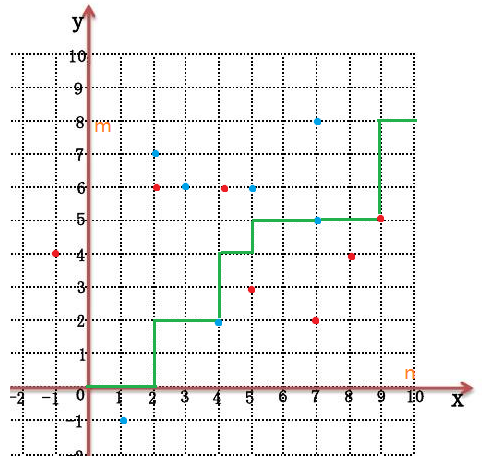

# 2023 暑期 NOIP 集训杂题

## 前言

时间好紧……

## CF319E Ping-Pong

[传送门](https://www.luogu.com.cn/problem/CF319E)

首先有包含、相交但不包含、不交三种情况。分别对应从小的往大的连有向边、连无向边、不连边。

显然我们可以把每个由无向边链接的连通块看成一个**等价区间**，下文**等价区间**均指连成连通块的区间。

- 结论 $1$：两等价区间不是包含就是不交。

挺显然的，假如等价区间 $A$ 与等价区间 $B$ 相交但不包含，那么必然存在区间 $a \in A$ 与区间 $b\in B$ 相交但不包含。那么 $A,B$ 其实是同一个等价区间。

- 结论 $2$：等价区间 $A$ 向等价区间 $B$ 连有向边当且仅当等价区间 $B$ 包含等价区间 $A$。

先证充分性，假如等价区间 $A$ 向等价区间 $B$ 连有向边，那么必然存在一个区间 $a\in A$ 被区间 $b \in B$ 包含。由结论 $1$，必定是 $A$ 包含 $B$ 或者 $B$ 包含 $A$。由于 $A$ 和 $B$ 是两个不同的等价区间，故 $A$ 中任意区间和 $B$ 中任意区间不是包含就是相离，由于 $a$ 已经被 $b$ 包含了，故 $A$ 必然也被 $b$ 包含，显然 $A$ 被 $B$ 包含。

再证必要性，假如等价区间 $B$ 包含等价区间 $A$，由于 $A$ 和 $B$ 是两个不同的等价区间，故 $A,B$ 中任意区间不是包含就是相离（复读），由于 $A$ 被 $B$ 包含，故 $A$ 必定向 $B$ 连有向边。

但是我们上面的证明都是建立在区间端点不重合的基础上的，假如 $A$ 和 $B$ 完全重合，且 $A$ 中只含有一个区间，那么 $A$ 是无法到达 $B$ 的。

那么我们用并查集维护等价区间，再记录每个等价区间的左右端点，查询时直接查两个对应的等价区间是否包含即可，这个非常简单。

考虑如何维护等价区间，首先由于区间大小单调递增，故后面的区间不可能被前面的区间包含，我们只要考虑当前区间两端点被前面的哪些等价区间包含即可。

考虑维护一棵线段树套 `set`，线段树上每个结点用一个 `set` 维护这个区间被哪些等价区间完全包含，要用标记永久化思想，每次把经过的结点所有 `set` 全部加到当前取件的等价区间里。注意维护开区间。

由于每加一个区间最多打 $\log n$ 个标记，每个标记最多被删一次，势能分析得这部分复杂度为 $O(n\log n)$，由于标记删除时要用并查集维护故维护等价区间的复杂度为 $O(n\log^2 n)$，线段树复杂度为 $O(n \log n)$，故总复杂度为 $O(n\log^2 n)$。

/// details | 参考代码
    open: False
    type: success

```cpp
#include<bits/stdc++.h>
#define mem(a,b) memset(a,b,sizeof(a))
#define forup(i,s,e) for(int i=(s);i<=(e);i++)
#define fordown(i,s,e) for(int i=(s);i>=(e);i--)
using namespace std;
#define gc getchar()
inline int read(){
    int x=0,f=1;char c;
    while(!isdigit(c=gc)) if(c=='-') f=-1;
    while(isdigit(c)){x=(x<<3)+(x<<1)+(c^48);c=gc;}
    return x*f;
}
#undef gc
const int N=1e5+5,inf=0x3f3f3f3f;
int n,cnts,sz;
struct que{
	int x,y;
}s[N];
struct ask{
	int a,b,tt;
}q[N];
vector<int> lsh;
int fa[N],L[N],R[N],siz[N];
int getfa(int x){return x==fa[x]?x:fa[x]=getfa(fa[x]);}
struct SegmentTree{
	#define mid ((l+r)>>1)
	#define lson l,mid,id<<1
	#define rson mid+1,r,id<<1|1
	set<int> mark[N<<2];
	void Update(int L,int R,int X,int l=1,int r=sz,int id=1){
		if(L<=l&&r<=R){
			mark[id].insert(X);
			return;
		}
		if(L<=mid) Update(L,R,X,lson);
		if(mid< R) Update(L,R,X,rson);
	}
	void Ask(int P,int U,int l=1,int r=sz,int id=1){
		for(auto i:mark[id]){
			int fi=getfa(i);
			if(fi!=U){
				fa[fi]=U;
				L[U]=min(L[U],L[fi]);
				R[U]=max(R[U],R[fi]);
				siz[U]+=siz[fi];
			}
		}
		mark[id].clear();
		if(l==r){
			return ;
		}
		if(P<=mid) Ask(P,U,lson);
		else       Ask(P,U,rson);
	}
}mt;
signed main(){
	n=read();
	forup(i,1,n){
		int op=read();
		q[i].tt=op;
		if(op==1){
			s[++cnts].x=read();s[cnts].y=read();
			lsh.push_back(s[cnts].x);
			lsh.push_back(s[cnts].y);
			q[i].a=cnts;
		}else{
			q[i].a=read();q[i].b=read();
		}
	}
	sort(lsh.begin(),lsh.end());
	lsh.erase(unique(lsh.begin(),lsh.end()),lsh.end());
	forup(i,1,cnts){
		s[i].x=lower_bound(lsh.begin(),lsh.end(),s[i].x)-lsh.begin()+1;
		s[i].y=lower_bound(lsh.begin(),lsh.end(),s[i].y)-lsh.begin()+1;
	}
	sz=lsh.size();
	forup(i,1,cnts){
		fa[i]=i;L[i]=s[i].x;R[i]=s[i].y;
		siz[i]=1;
	}
	forup(i,1,n){
		if(q[i].tt==2){
			int fu=getfa(q[i].a),fv=getfa(q[i].b);
			if((L[fv]<L[fu]&&R[fu]<=R[fv])||(L[fv]<=L[fu]&&R[fu]<R[fv])||(L[fu]==L[fv]&&R[fu]==R[fv]&&siz[fu]!=1)){
				puts("YES");
			}else{
				puts("NO");
			}
		}else{
			int u=q[i].a,l=s[u].x,r=s[u].y;
			mt.Ask(l,u);mt.Ask(r,u);
			mt.Update(L[u]+1,R[u]-1,u);
		}
	}
}
```

///

## CF1284D New Year and Conference

[传送门](https://www.luogu.com.cn/problem/CF1284D)

比较暴力的做法是用线段树维护第二个会场内每个讲座在第一个会场内最早的结束时间和最晚的开始时间，因为这样的讲座最有可能是不交的，然后排序后每次先查询相交的区间再上传。复杂度 $O(n\log n)$。

有一个非常妙的线性做法，先给每个讲座随机赋一个权值 $V_i$，然后设两会场的权值为 $\sum_{i \cap j\ne \varnothing}V_iV_j$，用前缀和维护 $\sum V_j$ 然后计算 $V_i\sum_{i \cap j \ne \varnothing} V_j$ 即可。假如两会场权值不同说明存在若干区间再其中一个相交另一个相离。

口胡的，代码就不放了。

## GYM 题不知道怎么写题号 Life as a Monster

[传送门](https://codeforces.com/gym/100739/problem/E)

首先可以走到周围八格，那么求的就是切比雪夫距离。

故题意即为：

- 有 $n$ 个点，第 $i$ 个点的坐标为 $(x_i,y_i)$。
- 有两个询问操作：
	- 修改某个点的坐标。
	- 查询某个坐标到所有点的切比雪夫距离之和。

第二个操作输出时转化一下，在此不多赘述。

发现切比雪夫距离没有很好的性质，考虑转化为曼哈顿距离。

关于切比雪夫距离和曼哈顿距离相互转化可以参考我的[这篇博客](../solution/20230704B_ABCD/#t4)。总之 $A(x_1,y_2)$ 和 $B(x_2,y_2)$ 的切比雪夫距离等于 $A'(x_1+y_1,x_1-y_1)$ 和 $B'(x_2+y_2,x_2-y_2)$ 的曼哈顿距离的二分之一。下文所有坐标均指转化后的坐标。

设询问 $2$ 的坐标为 $(X,Y)$，考虑把 $x,y$ 坐标分开考虑，然后拆绝对值，可以用平衡树维护所有比 $X$ 小的 $x_i$ 的加和与数量，比 $X$ 大的 $x_j$ 同理，$Y$ 也同理，然后就很好算了。

/// details | 参考代码
	open: False
	type: success

```cpp
#include<bits/stdc++.h>
#define mem(a,b) memset(a,b,sizeof(a))
#define forup(i,s,e) for(int i=(s);i<=(e);i++)
#define fordown(i,s,e) for(int i=(s);i>=(e);i--)
using namespace std;
using i64=long long;
using pii=pair<i64,i64>;
#define fi first
#define se second
#define mkp make_pair
#define gc getchar()
inline int read(){
    int x=0,f=1;char c;
    while(!isdigit(c=gc)) if(c=='-') f=-1;
    while(isdigit(c)){x=(x<<3)+(x<<1)+(c^48);c=gc;}
    return x*f;
}
#undef gc
const int N=2e5+5,inf=0x3f3f3f3f;
mt19937 mr(time(0));
int rd(){
	return (unsigned long long)mr()%998244853;
}
struct FHQ_Treap{
	int l[N],r[N],hv[N],tv[N],cnt[N];
	i64 sz[N];
	int stk[N],top;
	int cntn,root;
	int New(int x){
		int nw=(top?stk[top--]:++cntn);
		hv[nw]=rd();
		tv[nw]=x;
		sz[nw]=tv[nw];
		cnt[nw]=1;
		l[nw]=r[nw]=0;
		return nw;
	}
	void PushUp(int id){
		sz[id]=sz[l[id]]+sz[r[id]]+tv[id];
		cnt[id]=cnt[l[id]]+cnt[r[id]]+1;
	}
	void Split(int id,int key,int &x,int &y){
		if(!id){
			x=y=0;
		}else if(tv[id]<=key){
			x=id;
			Split(r[id],key,r[x],y);
			PushUp(id);
		}else{
			y=id;
			Split(l[id],key,x,l[y]);
			PushUp(id);
		}
	}
	int Merge(int x,int y){
		if(!x||!y){
			return !x?y:x;
		}else if(hv[x]>hv[y]){
			r[x]=Merge(r[x],y);
			PushUp(x);
			return x;
		}else{
			l[y]=Merge(x,l[y]);
			PushUp(y);
			return y;
		}
	}
	void Insert(int key){
		int x,y;
		Split(root,key-1,x,y);
		root=Merge(Merge(x,New(key)),y);
	}
	void Erase(int key){
		int x,y,z;
		Split(root,key-1,x,y);
		Split(y,key,y,z);
		stk[++top]=y;
		y=Merge(l[y],r[y]);
		root=Merge(Merge(x,y),z);
	}
	pair<pii,pii> Sum(int key){
		int x,y;pii ans,cans;
		Split(root,key,x,y);
		ans.fi=sz[x];ans.se=sz[y];
		cans.fi=cnt[x];cans.se=cnt[y];
		root=Merge(x,y);
		return mkp(ans,cans);
	}
};
FHQ_Treap xt,yt;
int n,q,x[N],y[N],BASE;
i64 TT;
signed main(){
	n=read();q=read();BASE=read();
	forup(i,1,n){
		int xx=read(),yy=read();
		x[i]=xx+yy;y[i]=xx-yy;
		xt.Insert(x[i]);yt.Insert(y[i]);
	}
	while(q--){
		int op=read();
		if(op==0){
			int pos=read(),a1=read(),b1=read(),a2=read(),b2=read();
			int xx=(1ll*a1*TT+b1)%BASE,yy=(1ll*a2*TT+b2)%BASE;
			xt.Erase(x[pos]);yt.Erase(y[pos]);
			x[pos]=xx+yy;y[pos]=xx-yy;
			xt.Insert(x[pos]);yt.Insert(y[pos]);
		}else{
			int a1=read(),b1=read(),a2=read(),b2=read();
			int xx=(1ll*a1*TT+b1)%BASE,yy=(1ll*a2*TT+b2)%BASE;
			int X=xx+yy,Y=xx-yy;
			i64 ans=0;
			pair<pii,pii> res;res=xt.Sum(X);
			ans+=(res.fi.se-res.se.se*X)+(res.se.fi*X-res.fi.fi);
			res=yt.Sum(Y);
			ans+=(res.fi.se-res.se.se*Y)+(res.se.fi*Y-res.fi.fi);
			printf("%lld\n",ans+(n-1)*2);
			TT=(ans+(n-1)*2)%BASE;
		}
	}
}
```

///

## CF1149C Tree Generator™

[传送门](https://www.luogu.com.cn/problem/CF1149C)

这是一道能体现 zkw 线段树优势的题。

首先结点深度等于在括号序列上的的前缀和，左括号加一右括号减一。

设前缀和为 $d_i$，容易想到这道题就是要求以下式子：

$$\max_{u \le l \le v}\begin{Bmatrix}d_u+d_v-2d_l\end{Bmatrix}$$

很好理解，两结点深度减去 $\operatorname{lca}$ 的深度，假如 $l$ 不是 $\operatorname{lca}$ 那么它得到的答案必定小于 $\operatorname{lca}$，所以可以直接这样求。

那么就转化成了线段树维护三元组最大值，合并时有四种情况，两左一右，一左两右，三左，三右。所以我们还要维护每个区间提供 $u,l$ 和 $l,v$ 的最大值，类似地，分三种情况合并，所以还要维护区间前缀和最大最小值。由于要维护前缀和，还要维护一个区间和。具体看代码。

单点修总体查，zkw 线段树薄纱。

/// details | 参考代码
	open: False
	type: success

```cpp
#include<bits/stdc++.h>
#define mem(a,b) memset(a,b,sizeof(a))
#define forup(i,s,e) for(int i=(s);i<=(e);i++)
#define fordown(i,s,e) for(int i=(s);i>=(e);i--)
using namespace std;
#define gc getchar()
inline int read(){
    int x=0,f=1;char c;
    while(!isdigit(c=gc)) if(c=='-') f=-1;
    while(isdigit(c)){x=(x<<3)+(x<<1)+(c^48);c=gc;}
    return x*f;
}
#undef gc
const int N=1<<18,inf=0x3f3f3f3f;
int n,q;
char a[N];
struct Node{
	int sum,mn,mx,mul,mlv,mulv;
};
struct SegmentTree{
	Node tree[N<<1];
	void PushUp(int id){
		int sl=tree[id<<1].sum;
		tree[id].sum=tree[id<<1].sum+tree[id<<1|1].sum;
		tree[id].mn=min(tree[id<<1].mn,tree[id<<1|1].mn+sl);
		tree[id].mx=max(tree[id<<1].mx,tree[id<<1|1].mx+sl);
		tree[id].mul=max({tree[id<<1].mul,tree[id<<1|1].mul-sl,tree[id<<1].mx-(tree[id<<1|1].mn+sl)*2});
		tree[id].mlv=max({tree[id<<1].mlv,tree[id<<1|1].mlv-sl,(tree[id<<1|1].mx+sl)-tree[id<<1].mn*2});
		tree[id].mulv=max({tree[id<<1].mulv,tree[id<<1|1].mulv,tree[id<<1].mx+tree[id<<1|1].mlv-sl,tree[id<<1].mul+tree[id<<1|1].mx+sl});
	}
	void Update(int P,int X){
		tree[N+P].sum=tree[N+P].mn=tree[N+P].mx=X;
		tree[N+P].mul=tree[N+P].mlv=tree[N+P].mulv=0;
		for(int i=(N+P)>>1;i;i>>=1){
			PushUp(i);
		}
	}
}mt;
signed main(){
	n=read();q=read();
	scanf(" %s",a+1);
	forup(i,1,2*n-2){
		mt.Update(i,a[i]=='('?1:-1);
	}
	printf("%d\n",mt.tree[1].mulv);
	while(q--){
		int l=read(),r=read();
		if(a[l]!=a[r]){
			swap(a[l],a[r]);
			mt.Update(l,a[l]=='('?1:-1);
			mt.Update(r,a[r]=='('?1:-1);
		}
		printf("%d\n",mt.tree[1].mulv);
	}
}
```

///


## CF906D Power Tower

[传送门](https://www.luogu.com.cn/problem/CF906D)

非常有意思的一道题。

首先根据扩展欧拉定理有：

$$
a^b \equiv \begin{cases}
a^{b\bmod \varphi(m)+\varphi(m)} &b \le \varphi(m)\\\\
a^b &b< \varphi(m)
\end{cases}\pmod m
$$

所以要求的就可以转化成这玩意：

$$w_l^{w_{l+1}^{w_{l+2}^{\cdots}\bmod \varphi(\varphi(m))+\varphi(\varphi(m))}\bmod \varphi(m)+\varphi(m)}\bmod m$$

（此处假设每次指数都大于对应的 $\varphi$）

容易发现 $\varphi(\varphi(\varphi(\varphi(\cdots(m)$ 一直套下去最多套 $O(\log m)$ 次就会变成一。

简要证明一下，假设 $m$ 为奇数，那么 $\varphi(m)=m \prod (\frac{p-1}{p})$ 必定为偶数，假如 $m$ 是个偶数那 $\varphi(m)=m \prod (\frac{p-1}{p})\le \frac{m}{2}$，所以下降次数是 $\log$ 级别的。

那么直接预处理下降前几次直到下降至 $1$，设这个次数为 $p$，然后每次快速幂暴力算 $[l,\min(l+p,r)]$ 的答案即可，复杂度 $O(q \log m)$。

然后注意快速幂时判一下有没有取过模来判断代扩展欧拉定理的哪个式子。

最近经常遇到最多变化 $\log n$ / $\sqrt{n}$ / 常数次就变为 $0/1$ 的题，以后遇到要多加小心。

/// details | 参考代码
	open: False
	type: success

```cpp
#include<bits/stdc++.h>
#define mem(a,b) memset(a,b,sizeof(a))
#define forup(i,s,e) for(i64 i=(s);i<=(e);i++)
#define fordown(i,s,e) for(i64 i=(s);i>=(e);i--)
using namespace std;
using i64=long long;
#define gc getchar()
inline i64 read(){
    i64 x=0,f=1;char c;
    while(!isdigit(c=gc)) if(c=='-') f=-1;
    while(isdigit(c)){x=(x<<3)+(x<<1)+(c^48);c=gc;}
    return x*f;
}
#undef gc
const i64 N=1e5+5,inf=0x3f3f3f3f;
i64 n,m,w[N],q,phi[55],pp;
i64 getphi(i64 x){
	i64 xx=x,ans=x;
	for(i64 i=2;i*i<=xx;i++){
		if(xx%i) continue;
		while(!(xx%i)) xx/=i;
		ans=ans/i*(i-1);
	}
	if(xx!=1){
		ans=ans/xx*(xx-1);
	}
	return ans;
}
void init(){
	i64 mm=m;pp=1;
	while(mm!=1){
		phi[pp]=mm;
		mm=getphi(mm);
		++pp;
	}
	phi[pp--]=1;
}
bool flag;
i64 ksm(i64 a,i64 b,i64 mod){
	i64 c=1;flag=false;
	bool f1=false;
	while(b){
		if(b&1){
			c=c*a;
			if(c>=mod||f1) flag=true;
			c%=mod;
		}
		a=a*a;
		if(a>=mod){
			a%=mod;
			f1=true;
		}
		b>>=1;
	}
	return c;
}
signed main(){
	n=read();m=read();
	forup(i,1,n){
		w[i]=read();
	}
	init();
	q=read();
	while(q--){
		if(m==1){
			puts("0");
			continue;
		}
		i64 l=read(),r=read();
		if(l==r){
			printf("%lld\n",w[l]%m);
			continue;
		}
		i64 p=min(r-1,l+pp-1);
		i64 res=ksm(w[p],w[p+1]%phi[p-l+2]+(w[p+1]>=phi[p-l+2]?phi[p-l+2]:0),phi[p-l+1]);
		fordown(i,p-1,l){
			res=ksm(w[i],res+(flag?phi[i-l+2]:0),phi[i-l+1]);
		}
		printf("%lld\n",res);
	}
}
```

///

## HDU-6265 Master of Phi

没有 HDU 账号找不到链接。

这道题也非常有意思，我有一个巨简单的做法。

题意就是求 $\sum_{d|n}\varphi(d)\times \frac{n}{d}$，其中 $n$ 由所有质因子 $p_i$ 及其指数 $q_i$ 给出。

首先 $\varphi(d)=d\times \text{一堆分数相乘}$。

那么原式 

$$
\begin{aligned}
&=\sum_{d|n}\text{一堆分数相乘}\times d \times \frac{n}{d}\\\\
&=\sum_{d|n}\text{一堆分数相乘}\times n\\\\
&=n\times\sum_{d|n}\text{一堆分数相乘}
\end{aligned}
$$

我们只要算出 $\sum_{d|n}\text{一堆分数相乘}$ 就行了。

发现这堆分数里有 $\frac{p_i-1}{p_i}$ 当且仅当在 $d$ 中 $p_i$ 的指数不为 $0$。

进行一些简单的因式分解，容易得到以下式子：

$$\prod_{i=1}^mq\frac{p_i-1}{p_i}+1$$

然后直接快速幂算就行了，复杂度 $O(Tm\log 998244353)$。

/// details | 参考代码
	type: success
	open: False

```cpp
#include<iostream>
#include<cstdio>
#define mem(a,b) memset(a,b,sizeof(a))
#define forup(i,s,e) for(i64 i=(s);i<=(e);i++)
#define fordown(i,s,e) for(i64 i=(s);i>=(e);i--)
using namespace std;
typedef long long i64;
#define gc getchar()
inline i64 read(){
    i64 x=0,f=1;char c;
    while(!isdigit(c=gc)) if(c=='-') f=-1;
    while(isdigit(c)){x=(x<<3)+(x<<1)+(c^48);c=gc;}
    return x*f;
}
#undef gc
const i64 mod=998244353;
i64 t,m,n,ans;
i64 ksm(i64 a,i64 b){
	i64 c=1;
	while(b){
		if(b&1) c=c*a%mod;
		a=a*a%mod;
		b>>=1;
	}
	return c;
}
signed main(){
	t=read();
	while(t--){
		ans=n=1;
		m=read();
		forup(i,1,m){
			i64 p=read(),q=read();
			i64 invp=ksm(p,mod-2)*(p-1)%mod;
			n=n*ksm(p,q)%mod;
			ans=ans*(invp*q%mod+1)%mod;
		}
		printf("%lld\n",ans*n%mod);
	}
}
```

///

## CF1010C Border

[传送门](https://www.luogu.com.cn/problem/CF1010C)

很简单的题，但很有意思。

首先题意等价于求给你的这些数的线性组合在模 $k$ 意义下能取到的所有数。

由于是模意义下，所以也不用担心是负数，假如 $ax+by \equiv c \pmod k$，其中 $y$ 是负数，那必然存在 $r$ 使得 $ax+b(y+r\cdot k) \equiv c \pmod k$，且 $y+r \cdot k$ 是非负数。

那么直接裴蜀定理，求出给你的所有数的 $\gcd$ 与 $k$ 的 $\gcd$，然后输出模 $k$ 意义下这个数的所有倍数即可。

这道题有趣在 $k$ 进制末位等价于模 $k$ 意义下的问题。

/// details | 参考代码
	open: False
	type: success

```cpp
#include<bits/stdc++.h>
#define mem(a,b) memset(a,b,sizeof(a))
#define forup(i,s,e) for(int i=(s);i<=(e);i++)
#define fordown(i,s,e) for(int i=(s);i>=(e);i--)
using namespace std;
#define gc getchar()
inline int read(){
    int x=0,f=1;char c;
    while(!isdigit(c=gc)) if(c=='-') f=-1;
    while(isdigit(c)){x=(x<<3)+(x<<1)+(c^48);c=gc;}
    return x*f;
}
#undef gc
const int N=1e5+5,inf=0x3f3f3f3f;
int n,k,a[N],res;
int gcd(int a,int b){
	return b==0?a:gcd(b,a%b);
}
signed main(){
	n=read();k=read();
	forup(i,1,n){
		a[i]=read();
		res=gcd(a[i],res);
	}
	res=gcd(res,k);
	printf("%d\n",k/res);
	printf("0 ");
	forup(i,1,k/res-1){
		printf("%d ",res*i);
	}
}
```

///

## AT_joisc2019_e ふたつの料理 (Two Dishes)

[传送门](https://www.luogu.com.cn/problem/AT_joisc2019_e)

这道题让人耳目一新。

首先容易发现做 $A$ 的第 $i$ 步需要把前面步骤全部完成，那么我们可以很容易二分得到在它产生贡献的情况下 $B$ 最多能完成多少步，设这个数为 $X_i$，类似地，设完成 $B$ 的第 $j$ 步最多能完成 $A$ 的 $Y_j$ 步。

容易把它转化成一个在平面直角坐标系里面的行走问题：设所有蓝点为 $(i,X_i)$，红点为 $(Y_j,j)$。


然后每次可以往上走，等价于做一步 $B$，或者往右走，等价于做一步 $A$。

那么我们就可以得到一条这样的路径：



容易发现这条线下方的红点和上方的蓝点以及线上的所有点就是能产生贡献的所有点。

以蓝点为例，假如线在它的下面说明z在做 $X_i$ 之前做了 $i$，所以能产生贡献，红点类似。

注意到有些负数点（这个细节非常重要），假如 $X_i=0$ 说明要 $i$ 产生贡献 $B$ 一步也不能做，但假如为负数说明它无论如何都无法产生贡献。

但是有的在上方有的在下方非常不好维护，考虑假设最开始所有蓝点都能产生贡献，但是在线严格下方会产生负的贡献。容易发现这两个问题是等价的。

这又产生新的问题，红点可以在线上，蓝点必须在线的下方。这个非常容易，只要把所有蓝点往左上角平移一格（即变为 $(i-1,X_i+1)$）即可。

考虑如何统计答案，首先贡献为正的点肯定选的越多越好，假如一个贡献为负的点左上角所有点贡献加起来都不能让它变成正的，那它显然不优，我们应该绕着它走，具体实现可以考虑从左到右扫用 `map` 维护左上角所有点权和的差分，这样假设某点点权为负我们可以通过删几个点找到第一个让它变成正的位置，具体实现见代码。

然后有一些显而易见的特判，具体见代码。

/// details | 参考代码
	open: False
	type: success

```cpp
#include<bits/stdc++.h>
#define mem(a,b) memset(a,b,sizeof(a))
#define forup(i,s,e) for(i64 i=(s);i<=(e);i++)
#define fordown(i,s,e) for(i64 i=(s);i>=(e);i--)
using namespace std;
using i64=long long;
using pii=pair<i64,i64>;
#define fi first
#define se second
#define mkp make_pair
#define gc getchar()
inline i64 read(){
    i64 x=0,f=1;char c;
    while(!isdigit(c=gc)) if(c=='-') f=-1;
    while(isdigit(c)){x=(x<<3)+(x<<1)+(c^48);c=gc;}
    return x*f;
}
#undef gc
const i64 N=1e6+5,inf=0x3f3f3f3f;
i64 n,m,s[N],t[N],p[N],q[N];
i64 a[N],b[N];
i64 ans;
vector<pii> po[N];
void addn(i64 x,i64 y,i64 val){
	if(x<0||y>m){
		return;
	}else if(x==n||y==0){
		ans+=val;
	}else{
		po[x].push_back(mkp(y,val));
	}
}
map<i64,i64> mp;
signed main(){
	n=read();m=read();
	forup(i,1,n){
		a[i]=read();a[i]+=a[i-1];s[i]=read();p[i]=read();
		ans+=p[i];
	}
	forup(i,1,m){
		b[i]=read();b[i]+=b[i-1];t[i]=read();q[i]=read();
	}
	forup(i,1,n){
		i64 y=upper_bound(b,b+m+1,s[i]-a[i])-b-1;
		addn(i-1,y+1,-p[i]);
	}
	forup(i,1,m){
		i64 x=upper_bound(a,a+n+1,t[i]-b[i])-a-1;
		addn(x,i,q[i]);
	}
	forup(x,0,n-1){
		sort(po[x].begin(),po[x].end(),greater<pii>());
		for(auto i:po[x]){
			i64 y=i.fi,val=i.se;
			if(val>0){
				mp[y]+=val;
			}else{
				val=-val;
				map<i64,i64>::iterator it=mp.lower_bound(y);
				while(val>0&&it!=mp.end()){
					if(val>=it->se){
						val-=it->se;
						mp.erase(prev(++it));
					}else{
						it->se-=val;
						break;
					}
				}
			}
		}
	}
	for(auto i:mp){
		ans+=i.se;
	}
	printf("%lld",ans);
}
```

///