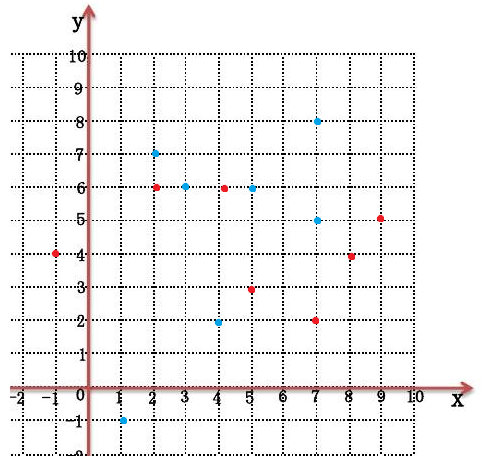

# 2023 暑期 NOIP 集训杂题

## 前言

时间好紧……

## CF319E Ping-Pong

[传送门](https://www.luogu.com.cn/problem/CF319E)

首先有包含、相交但不包含、不交三种情况。分别对应从小的往大的连有向边、连无向边、不连边。

显然我们可以把每个由无向边链接的连通块看成一个**等价区间**，下文**等价区间**均指连成连通块的区间。

- 结论 $1$：两等价区间不是包含就是不交。

挺显然的，假如等价区间 $A$ 与等价区间 $B$ 相交但不包含，那么必然存在区间 $a \in A$ 与区间 $b\in B$ 相交但不包含。那么 $A,B$ 其实是同一个等价区间。

- 结论 $2$：等价区间 $A$ 向等价区间 $B$ 连有向边当且仅当等价区间 $B$ 包含等价区间 $A$。

先证充分性，假如等价区间 $A$ 向等价区间 $B$ 连有向边，那么必然存在一个区间 $a\in A$ 被区间 $b \in B$ 包含。由结论 $1$，必定是 $A$ 包含 $B$ 或者 $B$ 包含 $A$。由于 $A$ 和 $B$ 是两个不同的等价区间，故 $A$ 中任意区间和 $B$ 中任意区间不是包含就是相离，由于 $a$ 已经被 $b$ 包含了，故 $A$ 必然也被 $b$ 包含，显然 $A$ 被 $B$ 包含。

再证必要性，假如等价区间 $B$ 包含等价区间 $A$，由于 $A$ 和 $B$ 是两个不同的等价区间，故 $A,B$ 中任意区间不是包含就是相离（复读），由于 $A$ 被 $B$ 包含，故 $A$ 必定向 $B$ 连有向边。

但是我们上面的证明都是建立在区间端点不重合的基础上的，假如 $A$ 和 $B$ 完全重合，且 $A$ 中只含有一个区间，那么 $A$ 是无法到达 $B$ 的。

那么我们用并查集维护等价区间，再记录每个等价区间的左右端点，查询时直接查两个对应的等价区间是否包含即可，这个非常简单。

考虑如何维护等价区间，首先由于区间大小单调递增，故后面的区间不可能被前面的区间包含，我们只要考虑当前区间两端点被前面的哪些等价区间包含即可。

考虑维护一棵线段树套 `set`，线段树上每个结点用一个 `set` 维护这个区间被哪些等价区间完全包含，要用标记永久化思想，每次把经过的结点所有 `set` 全部加到当前取件的等价区间里。注意维护开区间。

由于每加一个区间最多打 $\log n$ 个标记，每个标记最多被删一次，势能分析得这部分复杂度为 $O(n\log n)$，由于标记删除时要用并查集维护故维护等价区间的复杂度为 $O(n\log^2 n)$，线段树复杂度为 $O(n \log n)$，故总复杂度为 $O(n\log^2 n)$。

/// details | 参考代码
    open: False
    type: success

```cpp
#include<bits/stdc++.h>
#define mem(a,b) memset(a,b,sizeof(a))
#define forup(i,s,e) for(int i=(s);i<=(e);i++)
#define fordown(i,s,e) for(int i=(s);i>=(e);i--)
using namespace std;
#define gc getchar()
inline int read(){
    int x=0,f=1;char c;
    while(!isdigit(c=gc)) if(c=='-') f=-1;
    while(isdigit(c)){x=(x<<3)+(x<<1)+(c^48);c=gc;}
    return x*f;
}
#undef gc
const int N=1e5+5,inf=0x3f3f3f3f;
int n,cnts,sz;
struct que{
	int x,y;
}s[N];
struct ask{
	int a,b,tt;
}q[N];
vector<int> lsh;
int fa[N],L[N],R[N],siz[N];
int getfa(int x){return x==fa[x]?x:fa[x]=getfa(fa[x]);}
struct SegmentTree{
	#define mid ((l+r)>>1)
	#define lson l,mid,id<<1
	#define rson mid+1,r,id<<1|1
	set<int> mark[N<<2];
	void Update(int L,int R,int X,int l=1,int r=sz,int id=1){
		if(L<=l&&r<=R){
			mark[id].insert(X);
			return;
		}
		if(L<=mid) Update(L,R,X,lson);
		if(mid< R) Update(L,R,X,rson);
	}
	void Ask(int P,int U,int l=1,int r=sz,int id=1){
		for(auto i:mark[id]){
			int fi=getfa(i);
			if(fi!=U){
				fa[fi]=U;
				L[U]=min(L[U],L[fi]);
				R[U]=max(R[U],R[fi]);
				siz[U]+=siz[fi];
			}
		}
		mark[id].clear();
		if(l==r){
			return ;
		}
		if(P<=mid) Ask(P,U,lson);
		else       Ask(P,U,rson);
	}
}mt;
signed main(){
	n=read();
	forup(i,1,n){
		int op=read();
		q[i].tt=op;
		if(op==1){
			s[++cnts].x=read();s[cnts].y=read();
			lsh.push_back(s[cnts].x);
			lsh.push_back(s[cnts].y);
			q[i].a=cnts;
		}else{
			q[i].a=read();q[i].b=read();
		}
	}
	sort(lsh.begin(),lsh.end());
	lsh.erase(unique(lsh.begin(),lsh.end()),lsh.end());
	forup(i,1,cnts){
		s[i].x=lower_bound(lsh.begin(),lsh.end(),s[i].x)-lsh.begin()+1;
		s[i].y=lower_bound(lsh.begin(),lsh.end(),s[i].y)-lsh.begin()+1;
	}
	sz=lsh.size();
	forup(i,1,cnts){
		fa[i]=i;L[i]=s[i].x;R[i]=s[i].y;
		siz[i]=1;
	}
	forup(i,1,n){
		if(q[i].tt==2){
			int fu=getfa(q[i].a),fv=getfa(q[i].b);
			if((L[fv]<L[fu]&&R[fu]<=R[fv])||(L[fv]<=L[fu]&&R[fu]<R[fv])||(L[fu]==L[fv]&&R[fu]==R[fv]&&siz[fu]!=1)){
				puts("YES");
			}else{
				puts("NO");
			}
		}else{
			int u=q[i].a,l=s[u].x,r=s[u].y;
			mt.Ask(l,u);mt.Ask(r,u);
			mt.Update(L[u]+1,R[u]-1,u);
		}
	}
}
```

///

## CF1284D New Year and Conference

[传送门](https://www.luogu.com.cn/problem/CF1284D)

比较暴力的做法是用线段树维护第二个会场内每个讲座在第一个会场内最早的结束时间和最晚的开始时间，因为这样的讲座最有可能是不交的，然后排序后每次先查询相交的区间再上传。复杂度 $O(n\log n)$。

有一个非常妙的线性做法，先给每个讲座随机赋一个权值 $V_i$，然后设两会场的权值为 $\sum_{i \cap j\ne \varnothing}V_iV_j$，用前缀和维护 $\sum V_j$ 然后计算 $V_i\sum_{i \cap j \ne \varnothing} V_j$ 即可。假如两会场权值不同说明存在若干区间再其中一个相交另一个相离。

口胡的，代码就不放了。

## GYM 题不知道怎么写题号 Life as a Monster

[传送门](https://codeforces.com/gym/100739/problem/E)

首先可以走到周围八格，那么求的就是切比雪夫距离。

故题意即为：

- 有 $n$ 个点，第 $i$ 个点的坐标为 $(x_i,y_i)$。
- 有两个询问操作：
	- 修改某个点的坐标。
	- 查询某个坐标到所有点的切比雪夫距离之和。

第二个操作输出时转化一下，在此不多赘述。

发现切比雪夫距离没有很好的性质，考虑转化为曼哈顿距离。

关于切比雪夫距离和曼哈顿距离相互转化可以参考我的[这篇博客](../solution/20230704B_ABCD/#t4)。总之 $A(x_1,y_2)$ 和 $B(x_2,y_2)$ 的切比雪夫距离等于 $A'(x_1+y_1,x_1-y_1)$ 和 $B'(x_2+y_2,x_2-y_2)$ 的曼哈顿距离的二分之一。下文所有坐标均指转化后的坐标。

设询问 $2$ 的坐标为 $(X,Y)$，考虑把 $x,y$ 坐标分开考虑，然后拆绝对值，可以用平衡树维护所有比 $X$ 小的 $x_i$ 的加和与数量，比 $X$ 大的 $x_j$ 同理，$Y$ 也同理，然后就很好算了。

/// details | 参考代码
	open: False
	type: success

```cpp
#include<bits/stdc++.h>
#define mem(a,b) memset(a,b,sizeof(a))
#define forup(i,s,e) for(int i=(s);i<=(e);i++)
#define fordown(i,s,e) for(int i=(s);i>=(e);i--)
using namespace std;
using i64=long long;
using pii=pair<i64,i64>;
#define fi first
#define se second
#define mkp make_pair
#define gc getchar()
inline int read(){
    int x=0,f=1;char c;
    while(!isdigit(c=gc)) if(c=='-') f=-1;
    while(isdigit(c)){x=(x<<3)+(x<<1)+(c^48);c=gc;}
    return x*f;
}
#undef gc
const int N=2e5+5,inf=0x3f3f3f3f;
mt19937 mr(time(0));
int rd(){
	return (unsigned long long)mr()%998244853;
}
struct FHQ_Treap{
	int l[N],r[N],hv[N],tv[N],cnt[N];
	i64 sz[N];
	int stk[N],top;
	int cntn,root;
	int New(int x){
		int nw=(top?stk[top--]:++cntn);
		hv[nw]=rd();
		tv[nw]=x;
		sz[nw]=tv[nw];
		cnt[nw]=1;
		l[nw]=r[nw]=0;
		return nw;
	}
	void PushUp(int id){
		sz[id]=sz[l[id]]+sz[r[id]]+tv[id];
		cnt[id]=cnt[l[id]]+cnt[r[id]]+1;
	}
	void Split(int id,int key,int &x,int &y){
		if(!id){
			x=y=0;
		}else if(tv[id]<=key){
			x=id;
			Split(r[id],key,r[x],y);
			PushUp(id);
		}else{
			y=id;
			Split(l[id],key,x,l[y]);
			PushUp(id);
		}
	}
	int Merge(int x,int y){
		if(!x||!y){
			return !x?y:x;
		}else if(hv[x]>hv[y]){
			r[x]=Merge(r[x],y);
			PushUp(x);
			return x;
		}else{
			l[y]=Merge(x,l[y]);
			PushUp(y);
			return y;
		}
	}
	void Insert(int key){
		int x,y;
		Split(root,key-1,x,y);
		root=Merge(Merge(x,New(key)),y);
	}
	void Erase(int key){
		int x,y,z;
		Split(root,key-1,x,y);
		Split(y,key,y,z);
		stk[++top]=y;
		y=Merge(l[y],r[y]);
		root=Merge(Merge(x,y),z);
	}
	pair<pii,pii> Sum(int key){
		int x,y;pii ans,cans;
		Split(root,key,x,y);
		ans.fi=sz[x];ans.se=sz[y];
		cans.fi=cnt[x];cans.se=cnt[y];
		root=Merge(x,y);
		return mkp(ans,cans);
	}
};
FHQ_Treap xt,yt;
int n,q,x[N],y[N],BASE;
i64 TT;
signed main(){
	n=read();q=read();BASE=read();
	forup(i,1,n){
		int xx=read(),yy=read();
		x[i]=xx+yy;y[i]=xx-yy;
		xt.Insert(x[i]);yt.Insert(y[i]);
	}
	while(q--){
		int op=read();
		if(op==0){
			int pos=read(),a1=read(),b1=read(),a2=read(),b2=read();
			int xx=(1ll*a1*TT+b1)%BASE,yy=(1ll*a2*TT+b2)%BASE;
			xt.Erase(x[pos]);yt.Erase(y[pos]);
			x[pos]=xx+yy;y[pos]=xx-yy;
			xt.Insert(x[pos]);yt.Insert(y[pos]);
		}else{
			int a1=read(),b1=read(),a2=read(),b2=read();
			int xx=(1ll*a1*TT+b1)%BASE,yy=(1ll*a2*TT+b2)%BASE;
			int X=xx+yy,Y=xx-yy;
			i64 ans=0;
			pair<pii,pii> res;res=xt.Sum(X);
			ans+=(res.fi.se-res.se.se*X)+(res.se.fi*X-res.fi.fi);
			res=yt.Sum(Y);
			ans+=(res.fi.se-res.se.se*Y)+(res.se.fi*Y-res.fi.fi);
			printf("%lld\n",ans+(n-1)*2);
			TT=(ans+(n-1)*2)%BASE;
		}
	}
}
```

///

## CF1149C Tree Generator™

[传送门](https://www.luogu.com.cn/problem/CF1149C)

这是一道能体现 zkw 线段树优势的题。

首先结点深度等于在括号序列上的的前缀和，左括号加一右括号减一。

设前缀和为 $d_i$，容易想到这道题就是要求以下式子：

$$\max_{u \le l \le v}\begin{Bmatrix}d_u+d_v-2d_l\end{Bmatrix}$$

很好理解，两结点深度减去 $\operatorname{lca}$ 的深度，假如 $l$ 不是 $\operatorname{lca}$ 那么它得到的答案必定小于 $\operatorname{lca}$，所以可以直接这样求。

那么就转化成了线段树维护三元组最大值，合并时有四种情况，两左一右，一左两右，三左，三右。所以我们还要维护每个区间提供 $u,l$ 和 $l,v$ 的最大值，类似地，分三种情况合并，所以还要维护区间前缀和最大最小值。由于要维护前缀和，还要维护一个区间和。具体看代码。

单点修总体查，zkw 线段树薄纱。

/// details | 参考代码
	open: False
	type: success

```cpp
#include<bits/stdc++.h>
#define mem(a,b) memset(a,b,sizeof(a))
#define forup(i,s,e) for(int i=(s);i<=(e);i++)
#define fordown(i,s,e) for(int i=(s);i>=(e);i--)
using namespace std;
#define gc getchar()
inline int read(){
    int x=0,f=1;char c;
    while(!isdigit(c=gc)) if(c=='-') f=-1;
    while(isdigit(c)){x=(x<<3)+(x<<1)+(c^48);c=gc;}
    return x*f;
}
#undef gc
const int N=1<<18,inf=0x3f3f3f3f;
int n,q;
char a[N];
struct Node{
	int sum,mn,mx,mul,mlv,mulv;
};
struct SegmentTree{
	Node tree[N<<1];
	void PushUp(int id){
		int sl=tree[id<<1].sum;
		tree[id].sum=tree[id<<1].sum+tree[id<<1|1].sum;
		tree[id].mn=min(tree[id<<1].mn,tree[id<<1|1].mn+sl);
		tree[id].mx=max(tree[id<<1].mx,tree[id<<1|1].mx+sl);
		tree[id].mul=max({tree[id<<1].mul,tree[id<<1|1].mul-sl,tree[id<<1].mx-(tree[id<<1|1].mn+sl)*2});
		tree[id].mlv=max({tree[id<<1].mlv,tree[id<<1|1].mlv-sl,(tree[id<<1|1].mx+sl)-tree[id<<1].mn*2});
		tree[id].mulv=max({tree[id<<1].mulv,tree[id<<1|1].mulv,tree[id<<1].mx+tree[id<<1|1].mlv-sl,tree[id<<1].mul+tree[id<<1|1].mx+sl});
	}
	void Update(int P,int X){
		tree[N+P].sum=tree[N+P].mn=tree[N+P].mx=X;
		tree[N+P].mul=tree[N+P].mlv=tree[N+P].mulv=0;
		for(int i=(N+P)>>1;i;i>>=1){
			PushUp(i);
		}
	}
}mt;
signed main(){
	n=read();q=read();
	scanf(" %s",a+1);
	forup(i,1,2*n-2){
		mt.Update(i,a[i]=='('?1:-1);
	}
	printf("%d\n",mt.tree[1].mulv);
	while(q--){
		int l=read(),r=read();
		if(a[l]!=a[r]){
			swap(a[l],a[r]);
			mt.Update(l,a[l]=='('?1:-1);
			mt.Update(r,a[r]=='('?1:-1);
		}
		printf("%d\n",mt.tree[1].mulv);
	}
}
```

///


## CF906D Power Tower

[传送门](https://www.luogu.com.cn/problem/CF906D)

非常有意思的一道题。

首先根据扩展欧拉定理有：

$$
a^b \equiv \begin{cases}
a^{b\bmod \varphi(m)+\varphi(m)} &b \le \varphi(m)\\\\
a^b &b< \varphi(m)
\end{cases}\pmod m
$$

所以要求的就可以转化成这玩意：

$$w_l^{w_{l+1}^{w_{l+2}^{\cdots}\bmod \varphi(\varphi(m))+\varphi(\varphi(m))}\bmod \varphi(m)+\varphi(m)}\bmod m$$

（此处假设每次指数都大于对应的 $\varphi$）

容易发现 $\varphi(\varphi(\varphi(\varphi(\cdots(m)$ 一直套下去最多套 $O(\log m)$ 次就会变成一。

简要证明一下，假设 $m$ 为奇数，那么 $\varphi(m)=m \prod (\frac{p-1}{p})$ 必定为偶数，假如 $m$ 是个偶数那 $\varphi(m)=m \prod (\frac{p-1}{p})\le \frac{m}{2}$，所以下降次数是 $\log$ 级别的。

那么直接预处理下降前几次直到下降至 $1$，设这个次数为 $p$，然后每次快速幂暴力算 $[l,\min(l+p,r)]$ 的答案即可，复杂度 $O(q \log m)$。

然后注意快速幂时判一下有没有取过模来判断代扩展欧拉定理的哪个式子。

最近经常遇到最多变化 $\log n$ / $\sqrt{n}$ / 常数次就变为 $0/1$ 的题，以后遇到要多加小心。

/// details | 参考代码
	open: False
	type: success

```cpp
#include<bits/stdc++.h>
#define mem(a,b) memset(a,b,sizeof(a))
#define forup(i,s,e) for(i64 i=(s);i<=(e);i++)
#define fordown(i,s,e) for(i64 i=(s);i>=(e);i--)
using namespace std;
using i64=long long;
#define gc getchar()
inline i64 read(){
    i64 x=0,f=1;char c;
    while(!isdigit(c=gc)) if(c=='-') f=-1;
    while(isdigit(c)){x=(x<<3)+(x<<1)+(c^48);c=gc;}
    return x*f;
}
#undef gc
const i64 N=1e5+5,inf=0x3f3f3f3f;
i64 n,m,w[N],q,phi[55],pp;
i64 getphi(i64 x){
	i64 xx=x,ans=x;
	for(i64 i=2;i*i<=xx;i++){
		if(xx%i) continue;
		while(!(xx%i)) xx/=i;
		ans=ans/i*(i-1);
	}
	if(xx!=1){
		ans=ans/xx*(xx-1);
	}
	return ans;
}
void init(){
	i64 mm=m;pp=1;
	while(mm!=1){
		phi[pp]=mm;
		mm=getphi(mm);
		++pp;
	}
	phi[pp--]=1;
}
bool flag;
i64 ksm(i64 a,i64 b,i64 mod){
	i64 c=1;flag=false;
	bool f1=false;
	while(b){
		if(b&1){
			c=c*a;
			if(c>=mod||f1) flag=true;
			c%=mod;
		}
		a=a*a;
		if(a>=mod){
			a%=mod;
			f1=true;
		}
		b>>=1;
	}
	return c;
}
signed main(){
	n=read();m=read();
	forup(i,1,n){
		w[i]=read();
	}
	init();
	q=read();
	while(q--){
		if(m==1){
			puts("0");
			continue;
		}
		i64 l=read(),r=read();
		if(l==r){
			printf("%lld\n",w[l]%m);
			continue;
		}
		i64 p=min(r-1,l+pp-1);
		i64 res=ksm(w[p],w[p+1]%phi[p-l+2]+(w[p+1]>=phi[p-l+2]?phi[p-l+2]:0),phi[p-l+1]);
		fordown(i,p-1,l){
			res=ksm(w[i],res+(flag?phi[i-l+2]:0),phi[i-l+1]);
		}
		printf("%lld\n",res);
	}
}
```

///

## HDU-6265 Master of Phi

没有 HDU 账号找不到链接。

这道题也非常有意思，我有一个巨简单的做法。

题意就是求 $\sum_{d|n}\varphi(d)\times \frac{n}{d}$，其中 $n$ 由所有质因子 $p_i$ 及其指数 $q_i$ 给出。

首先 $\varphi(d)=d\times \text{一堆分数相乘}$。

那么原式 

$$
\begin{aligned}
&=\sum_{d|n}\text{一堆分数相乘}\times d \times \frac{n}{d}\\\\
&=\sum_{d|n}\text{一堆分数相乘}\times n\\\\
&=n\times\sum_{d|n}\text{一堆分数相乘}
\end{aligned}
$$

我们只要算出 $\sum_{d|n}\text{一堆分数相乘}$ 就行了。

发现这堆分数里有 $\frac{p_i-1}{p_i}$ 当且仅当在 $d$ 中 $p_i$ 的指数不为 $0$。

进行一些简单的因式分解，容易得到以下式子：

$$\prod_{i=1}^mq\frac{p_i-1}{p_i}+1$$

然后直接快速幂算就行了，复杂度 $O(Tm\log 998244353)$。

/// details | 参考代码
	type: success
	open: False

```cpp
#include<iostream>
#include<cstdio>
#define mem(a,b) memset(a,b,sizeof(a))
#define forup(i,s,e) for(i64 i=(s);i<=(e);i++)
#define fordown(i,s,e) for(i64 i=(s);i>=(e);i--)
using namespace std;
typedef long long i64;
#define gc getchar()
inline i64 read(){
    i64 x=0,f=1;char c;
    while(!isdigit(c=gc)) if(c=='-') f=-1;
    while(isdigit(c)){x=(x<<3)+(x<<1)+(c^48);c=gc;}
    return x*f;
}
#undef gc
const i64 mod=998244353;
i64 t,m,n,ans;
i64 ksm(i64 a,i64 b){
	i64 c=1;
	while(b){
		if(b&1) c=c*a%mod;
		a=a*a%mod;
		b>>=1;
	}
	return c;
}
signed main(){
	t=read();
	while(t--){
		ans=n=1;
		m=read();
		forup(i,1,m){
			i64 p=read(),q=read();
			i64 invp=ksm(p,mod-2)*(p-1)%mod;
			n=n*ksm(p,q)%mod;
			ans=ans*(invp*q%mod+1)%mod;
		}
		printf("%lld\n",ans*n%mod);
	}
}
```

///

## CF1010C Border

[传送门](https://www.luogu.com.cn/problem/CF1010C)

很简单的题，但很有意思。

首先题意等价于求给你的这些数的线性组合在模 $k$ 意义下能取到的所有数。

由于是模意义下，所以也不用担心是负数，假如 $ax+by \equiv c \pmod k$，其中 $y$ 是负数，那必然存在 $r$ 使得 $ax+b(y+r\cdot k) \equiv c \pmod k$，且 $y+r \cdot k$ 是非负数。

那么直接裴蜀定理，求出给你的所有数的 $\gcd$ 与 $k$ 的 $\gcd$，然后输出模 $k$ 意义下这个数的所有倍数即可。

这道题有趣在 $k$ 进制末位等价于模 $k$ 意义下的问题。

/// details | 参考代码
	open: False
	type: success

```cpp
#include<bits/stdc++.h>
#define mem(a,b) memset(a,b,sizeof(a))
#define forup(i,s,e) for(int i=(s);i<=(e);i++)
#define fordown(i,s,e) for(int i=(s);i>=(e);i--)
using namespace std;
#define gc getchar()
inline int read(){
    int x=0,f=1;char c;
    while(!isdigit(c=gc)) if(c=='-') f=-1;
    while(isdigit(c)){x=(x<<3)+(x<<1)+(c^48);c=gc;}
    return x*f;
}
#undef gc
const int N=1e5+5,inf=0x3f3f3f3f;
int n,k,a[N],res;
int gcd(int a,int b){
	return b==0?a:gcd(b,a%b);
}
signed main(){
	n=read();k=read();
	forup(i,1,n){
		a[i]=read();
		res=gcd(a[i],res);
	}
	res=gcd(res,k);
	printf("%d\n",k/res);
	printf("0 ");
	forup(i,1,k/res-1){
		printf("%d ",res*i);
	}
}
```

///

## AT_joisc2019_e ふたつの料理 (Two Dishes)

[传送门](https://www.luogu.com.cn/problem/AT_joisc2019_e)

这道题让人耳目一新。

首先容易发现做 $A$ 的第 $i$ 步需要把前面步骤全部完成，那么我们可以很容易二分得到在它产生贡献的情况下 $B$ 最多能完成多少步，设这个数为 $X_i$，类似地，设完成 $B$ 的第 $j$ 步最多能完成 $A$ 的 $Y_j$ 步。

容易把它转化成一个在平面直角坐标系里面的行走问题：设所有蓝点为 $(i,X_i)$，红点为 $(Y_j,j)$。



然后每次可以往上走，等价于做一步 $B$，或者往右走，等价于做一步 $A$。

那么我们就可以得到一条这样的路径：


容易发现这条线下方的红点和上方的蓝点以及线上的所有点就是能产生贡献的所有点。

以蓝点为例，假如线在它的下面说明z在做 $X_i$ 之前做了 $i$，所以能产生贡献，红点类似。

注意到有些负数点（这个细节非常重要），假如 $X_i=0$ 说明要 $i$ 产生贡献 $B$ 一步也不能做，但假如为负数说明它无论如何都无法产生贡献。

但是有的在上方有的在下方非常不好维护，考虑假设最开始所有蓝点都能产生贡献，但是在线严格下方会产生负的贡献。容易发现这两个问题是等价的。

这又产生新的问题，红点可以在线上，蓝点必须在线的下方。这个非常容易，只要把所有蓝点往左上角平移一格（即变为 $(i-1,X_i+1)$）即可。

考虑如何统计答案，首先贡献为正的点肯定选的越多越好，假如一个贡献为负的点左上角所有点贡献加起来都不能让它变成正的，那它显然不优，我们应该绕着它走，具体实现可以考虑从左到右扫用 `map` 维护左上角所有点权和的差分，这样假设某点点权为负我们可以通过删几个点找到第一个让它变成正的位置，具体实现见代码。

然后有一些显而易见的特判，具体见代码。

/// details | 参考代码
	open: False
	type: success

```cpp
#include<bits/stdc++.h>
#define mem(a,b) memset(a,b,sizeof(a))
#define forup(i,s,e) for(i64 i=(s);i<=(e);i++)
#define fordown(i,s,e) for(i64 i=(s);i>=(e);i--)
using namespace std;
using i64=long long;
using pii=pair<i64,i64>;
#define fi first
#define se second
#define mkp make_pair
#define gc getchar()
inline i64 read(){
    i64 x=0,f=1;char c;
    while(!isdigit(c=gc)) if(c=='-') f=-1;
    while(isdigit(c)){x=(x<<3)+(x<<1)+(c^48);c=gc;}
    return x*f;
}
#undef gc
const i64 N=1e6+5,inf=0x3f3f3f3f;
i64 n,m,s[N],t[N],p[N],q[N];
i64 a[N],b[N];
i64 ans;
vector<pii> po[N];
void addn(i64 x,i64 y,i64 val){
	if(x<0||y>m){
		return;
	}else if(x==n||y==0){
		ans+=val;
	}else{
		po[x].push_back(mkp(y,val));
	}
}
map<i64,i64> mp;
signed main(){
	n=read();m=read();
	forup(i,1,n){
		a[i]=read();a[i]+=a[i-1];s[i]=read();p[i]=read();
		ans+=p[i];
	}
	forup(i,1,m){
		b[i]=read();b[i]+=b[i-1];t[i]=read();q[i]=read();
	}
	forup(i,1,n){
		i64 y=upper_bound(b,b+m+1,s[i]-a[i])-b-1;
		addn(i-1,y+1,-p[i]);
	}
	forup(i,1,m){
		i64 x=upper_bound(a,a+n+1,t[i]-b[i])-a-1;
		addn(x,i,q[i]);
	}
	forup(x,0,n-1){
		sort(po[x].begin(),po[x].end(),greater<pii>());
		for(auto i:po[x]){
			i64 y=i.fi,val=i.se;
			if(val>0){
				mp[y]+=val;
			}else{
				val=-val;
				map<i64,i64>::iterator it=mp.lower_bound(y);
				while(val>0&&it!=mp.end()){
					if(val>=it->se){
						val-=it->se;
						mp.erase(prev(++it));
					}else{
						it->se-=val;
						break;
					}
				}
			}
		}
	}
	for(auto i:mp){
		ans+=i.se;
	}
	printf("%lld",ans);
}
```

///

## 洛谷 P6009 [USACO20JAN] Non-Decreasing Subsequences P

[传送门](https://www.luogu.com.cn/problem/P6009)

矩阵乘法的优化是算法竞赛的一部分，不得不尝。

考虑 $dp_{i,j}$ 表示末尾位置小于等于 $i$，值为 $j$ 的不降子序列个数，$j \in [0,K]$。

转移方程略。

容易写成矩阵的形式，大概就是主对角线加上一列，比如 $K=5,a_i=3$ 的矩阵 $A_i$ 长这样：

$$
\begin{pmatrix}
1 &0 &0 &1 &0 &0\\\\
0 &1 &0 &1 &0 &0\\\\
0 &0 &1 &1 &0 &0\\\\
0 &0 &0 &2 &0 &0\\\\
0 &0 &0 &0 &1 &0\\\\
0 &0 &0 &0 &0 &1
\end{pmatrix}
$$

容易发现整个序列的答案如下：

$$
\begin{pmatrix}
1 &0 &0 &0 &\cdots
\end{pmatrix}
\prod_{i=1}^nA_i
\begin{pmatrix}
1\\\\
1\\\\
1\\\\
1\\\\
\vdots
\end{pmatrix}
$$

然后拓展到区间 $[l,r]$

$$
\begin{pmatrix}
1 &0 &0 &0 &\cdots
\end{pmatrix}
\prod_{i=l}^rA_i
\begin{pmatrix}
1\\\\
1\\\\
1\\\\
1\\\\
\vdots
\end{pmatrix}
$$

考虑差分，注意矩阵的逆元是可交换的，即 $AA^{-1}=A^{-1}A=E$，所以我们可以把矩阵 $A_1^{-1}\dots A_{l-1}^{-1}$ 按顺序乘在 $A_i$ 前缀积前面，每次 $A_i^{-1}$ 都会把 $A_i$ 变成 $E$。设 $P_i$ 为 $A_i$ 的前缀积（$A_1A_2A_3\dots A_i$），$Q_i$ 为 $A_i^{-1}$ 的前缀积（$A_iA_{i-1}A_{i-2}\dots A_1$），那么式子可以化成这样：

$$
\begin{pmatrix}
1 &0 &0 &0 &\cdots
\end{pmatrix}
Q_{l-1}P_{r}
\begin{pmatrix}
1\\\\
1\\\\
1\\\\
1\\\\
\vdots
\end{pmatrix}
$$

再次注意前缀积每次乘在左边还是右边很重要。

考虑如何求 $A^{-1}$，其实无论你手动构造还是求解一个 $(K+1)^2$ 元线性方程组，结果都是主对角线然后第 $a$ 列减去 $\frac{1}{2}$。比如 $K=5,a_i=3$ 的 $A_i^{-1}$ 长这样：


$$
\begin{pmatrix}
1 &0 &0 &-\frac{1}{2} &0 &0\\\\
0 &1 &0 &-\frac{1}{2} &0 &0\\\\
0 &0 &1 &-\frac{1}{2} &0 &0\\\\
0 &0 &0 &\frac{1}{2} &0 &0\\\\
0 &0 &0 &0 &1 &0\\\\
0 &0 &0 &0 &0 &1
\end{pmatrix}
$$

这样直接做复杂度就是 $O(nK^3+qK^3)$，考虑如何优化。

容易发现 $A$ 和 $A^{-1}$ 都十分稀疏，我们乘的时候可以只算有值的位置，就可以 $O(K^2)$ 做矩阵乘法了。

另外可以先把两个向量分别乘给 $Q,P$，这样不会增加预处理的复杂度，但是算答案的时候就是两个向量相乘，复杂度就是 $O(K)$ 了。

故总复杂度 $O(nK^2+qK)$。

这道题告诉我们比较稀疏的矩阵乘法有很好的性质，很好优化。

/// details | 参考代码
	open: False
	type: success

```cpp
#include<bits/stdc++.h>
#define mem(a,b) memset(a,b,sizeof(a))
#define forup(i,s,e) for(int i=(s);i<=(e);i++)
#define fordown(i,s,e) for(int i=(s);i>=(e);i--)
using namespace std;
#define gc getchar()
inline int read(){
    int x=0,f=1;char c;
    while(!isdigit(c=gc)) if(c=='-') f=-1;
    while(isdigit(c)){x=(x<<3)+(x<<1)+(c^48);c=gc;}
    return x*f;
}
#undef gc
const int N=5e4+5,mod=1e9+7;
int n,a[N],K;
struct Matrix{
	int a[21][21];
	Matrix(int p=0,int v=0){
		mem(a,0);
		forup(i,0,K){a[i][i]=1;}
		forup(i,0,p){a[i][p]+=v;}
	}
};
Matrix lmul(Matrix A,Matrix B,int p){
	Matrix res;
	forup(i,0,K){
		forup(j,0,K){
			res.a[i][j]=1ll*A.a[i][i]*B.a[i][j]%mod;
			if(i<p) (res.a[i][j]+=1ll*A.a[i][p]*B.a[p][j]%mod)%=mod;
		}
	}
	return res;
}
Matrix rmul(Matrix A,Matrix B,int p){
	Matrix res;
	forup(i,0,K){
		forup(j,0,K){
			if(j==p){
				res.a[i][j]=0;
				forup(k,0,p){
					(res.a[i][j]+=1ll*A.a[i][k]*B.a[k][j]%mod)%=mod;
				}
			}else{
				res.a[i][j]=1ll*A.a[i][j]*B.a[j][j]%mod;
			}
		}
	}
	return res;
}
Matrix pre[N],pinv[N];
int inv2=(mod+1)/2;
vector<int> L[N],R[N];
signed main(){
	n=read();K=read();
	forup(i,1,n){
		a[i]=read();
	}
	pre[0]=pinv[0]=Matrix(0,0);
	forup(i,1,n){
		pre[i]=rmul(pre[i-1],Matrix(a[i],1),a[i]);
		pinv[i]=lmul(Matrix(a[i],mod-inv2),pinv[i-1],a[i]);
	}
	L[0].resize(K+1);L[0][0]=1;
	forup(i,1,n){
		L[i].resize(K+1);
		forup(j,0,K){
			L[i][j]=pinv[i].a[0][j];
		}
	}
	R[0].resize(K+1);
	forup(i,0,K){R[0][i]=1;}
	forup(k,1,n){
		R[k].resize(K+1);
		forup(i,0,K){
			R[k][i]=0;
			forup(j,0,K){
				(R[k][i]+=pre[k].a[i][j])%=mod;
			}
		}
	}
	int q=read();
	while(q--){
		int l=read(),r=read();
		int ans=0;
		forup(i,0,K){
			(ans+=1ll*L[l-1][i]*R[r][i]%mod)%=mod;
		}
		printf("%d\n",ans);
	}
}
```

///

## AT_keyence2019_e Connecting Cities

[传送门](https://www.luogu.com.cn/problem/AT_keyence2019_e)

很有意思的一道题，用 Kruskal 的思路和 Prim 的思路都能做。

先讲 Kruskal 思路。首先边数是 $n^2$，直接做 Kruskal 会 T 飞掉。考虑能不能忽略一些绝对不可能被选的边。

首先假如我们知道了 $i,j$ 的大小关系（设 $i<j$），显然可以把绝对值拆开把式子化成这样：

$$(A_i-Di)+(A_j+Dj)$$

考虑分治，对于分治的某个阶段，有两半边 $[l,mid],[mid+1,r]$，把所有边分成左半边内，右半边内和横跨三部分，左右半边往下递归，只管横跨的。容易发现只有两边最小值向另一半边连边必定是不劣的，假如两半边最小值分别是 $x,y$，考虑另一对 $x',y'$，发现 $(x,y),(x',y),(x,y'),(x',y')$ 四条边构成一个环，显然 $(x',y')$ 这条边是边权最大的，可以被删掉。

这样总边数就是 $O(n \log n)$ 级别的，做 Kruskal 的复杂度就是 $O(n \log^2 n)$ 的。

/// details | 参考代码
	open: False
	type: success

```cpp
#include<bits/stdc++.h>
#define mem(a,b) memset(a,b,sizeof(a))
#define forup(i,s,e) for(i64 i=(s);i<=(e);i++)
#define fordown(i,s,e) for(i64 i=(s);i>=(e);i--)
using namespace std;
using i64=long long;
#define gc getchar()
inline i64 read(){
    i64 x=0,f=1;char c;
    while(!isdigit(c=gc)) if(c=='-') f=-1;
    while(isdigit(c)){x=(x<<3)+(x<<1)+(c^48);c=gc;}
    return x*f;
}
#undef gc
const i64 N=2e5+5,inf=0x3f3f3f3f;
i64 n,a[N],d;
struct edge{
	i64 u,v;
	i64 w;
	bool operator <(const edge &r)const{return w<r.w;}
	edge(i64 _u=0,i64 _v=0,i64 _w=0):u(_u),v(_v),w(_w){}
};
vector<edge> e;
i64 fa[N];
i64 getfa(i64 x){return x==fa[x]?x:fa[x]=getfa(fa[x]);}
i64 Kruskal(){
	forup(i,1,n) fa[i]=i;
	sort(e.begin(),e.end());
	i64 res=0;
	for(auto i:e){
		i64 fu=getfa(i.u),fv=getfa(i.v),w=i.w;
		if(fu!=fv){
			fa[fu]=fv;
			res+=w;
		}
	}
	return res;
}
void solve(i64 l,i64 r){
	if(l>=r) return;
	i64 mid=(l+r)>>1;
	solve(l,mid);solve(mid+1,r);
	i64 ml=l,mr=r;
	forup(i,l,mid){
		if(a[i]-d*i<a[ml]-d*ml){
			ml=i;
		}
	}
	forup(i,mid+1,r){
		if(a[i]+d*i<a[mr]+d*mr){
			mr=i;
		}
	}
	forup(i,l,mid){
		e.push_back(edge(i,mr,a[i]+a[mr]+(mr-i)*d));
	}
	forup(i,mid+1,r){
		e.push_back(edge(ml,i,a[ml]+a[i]+(i-ml)*d));
	}
}
signed main(){
	n=read();d=read();
	forup(i,1,n){
		a[i]=read();
	}
	solve(1,n);
	printf("%lld",Kruskal());
}
```

///

然后讲 Prim 做法，我觉得这个做法非常自然。

设已经连好的点的集合为 $S$，其余的为 $T$。那么只要能快速从从 $S$ 和 $T$ 里面分别找出两个点 $u,v$ 使得它们间边权最小就能做 Prim。

由于有绝对值，考虑拆绝对值，那么分两种情况讨论：

$$
\begin{cases}
(A_u-uD)+(A_v+vD)   &u<v\\\\
(A_u+uD)+(A_v-vD)  &u \ge v
\end{cases}
$$

那么可以直接用线段树维护，合并的时候分 $u$ 左 $v$ 右，$v$ 左 $u$ 右，两个都在左边和两个都在右边四种情况考虑。那么我们对于每个点维护 **$(A_u-uD),(A_v+vD),(A_u+uD),(A_v-vD)$ 分别的最小值**，**答案** 五个值即可解决问题，但是由于我们要维护加入集合 $S$ 的操作，还要维护答案是由哪个 $v$ 得到的。

由于是单调修改整体查询，使用 zkw 线段树十分好写。

/// details | 参考代码
	open: False
	type: success

```cpp
#include<bits/stdc++.h>
#define mem(a,b) memset(a,b,sizeof(a))
#define forup(i,s,e) for(i64 i=(s);i<=(e);i++)
#define fordown(i,s,e) for(i64 i=(s);i>=(e);i--)
using namespace std;
using i64=long long;
#define gc getchar()
inline i64 read(){
    i64 x=0,f=1;char c;
    while(!isdigit(c=gc)) if(c=='-') f=-1;
    while(isdigit(c)){x=(x<<3)+(x<<1)+(c^48);c=gc;}
    return x*f;
}
#undef gc
const i64 N=1<<18,inf=1e18;
i64 n,a[N],d;
struct SegmentTree{
	struct Node{
		i64 uadd,usub,vadd,va,vsub,vs,ans,vans;
		Node(i64 _uadd=inf,i64 _usub=inf,i64 _vadd=inf,i64 _va=0,i64 _vsub=inf,i64 _vs=0,i64 _ans=inf,i64 _vans=0){
			uadd=_uadd;usub=_usub;vadd=_vadd;va=_va;vsub=_vsub;vs=_vs;ans=_ans;vans=_vans;
		}
	}tree[(N<<1)+10];
	void PushUp(i64 id){
		tree[id].uadd=min(tree[id<<1].uadd,tree[id<<1|1].uadd);
		tree[id].usub=min(tree[id<<1].usub,tree[id<<1|1].usub);
		tree[id].vadd=min(tree[id<<1].vadd,tree[id<<1|1].vadd);
		tree[id].vsub=min(tree[id<<1].vsub,tree[id<<1|1].vsub);
		tree[id].va=tree[id<<1].vadd<tree[id<<1|1].vadd?tree[id<<1].va:tree[id<<1|1].va;
		tree[id].vs=tree[id<<1].vsub<tree[id<<1|1].vsub?tree[id<<1].vs:tree[id<<1|1].vs;
		tree[id].ans=min(tree[id<<1].ans,tree[id<<1|1].ans);
		if(tree[id<<1].usub!=inf&&tree[id<<1|1].vadd!=inf){
			tree[id].ans=min(tree[id].ans,tree[id<<1].usub+tree[id<<1|1].vadd);
		}
		if(tree[id<<1].vsub!=inf&&tree[id<<1|1].uadd!=inf){
			tree[id].ans=min(tree[id].ans,tree[id<<1].vsub+tree[id<<1|1].uadd);
		}
		if(tree[id].ans==tree[id<<1].ans){
			tree[id].vans=tree[id<<1].vans;
		}else if(tree[id].ans==tree[id<<1|1].ans){
			tree[id].vans=tree[id<<1|1].vans;
		}else if(tree[id].ans==tree[id<<1].usub+tree[id<<1|1].vadd){
			tree[id].vans=tree[id<<1|1].va;
		}else{
			tree[id].vans=tree[id<<1].vs;
		}
	}
	void Build(){
		tree[N+1]=Node(a[1]+d,a[1]-d,inf,0,inf,0,inf,0);
		forup(i,2,n){tree[N+i]=Node(inf,inf,a[i]+d*i,i,a[i]-d*i,i,inf,0);}
		fordown(i,N,1){PushUp(i);}
	}
	void Update(i64 L){
		tree[N+L]=Node(a[L]+d*L,a[L]-d*L,inf,0,inf,0,inf,0);
		for(int i=(L+N)>>1;i;i>>=1){PushUp(i);}
	}
}mt;
signed main(){
	n=read();d=read();
	forup(i,1,n){
		a[i]=read();
	}
	mt.Build();
	i64 res=0;
	forup(i,1,n-1){
		res+=mt.tree[1].ans;
		mt.Update(mt.tree[1].vans);
	}
	printf("%lld",res);
}
```

///

## CF1270I Xor on Figures 

[传送门](https://www.luogu.com.cn/problem/CF1270I)

非常巧妙的题，考察对数学归纳法的理解。

首先下标从 $1$ 开始的话，取模很难受，改为下标从 $0$ 到 $2^k-1$，这样就能直接取模了，不影响答案。

容易想到修改等价于修改 $t$ 个从 $(p,q)$ 引出的向量 $(x_i,y_i)$。容易想到具体怎么修改其实和 $(p,q)$ 关系不大，那么把每个向量 $(x_i,y_i)$ 改为 $(x_i-x_1,y_i-y_1)$ 后可以转化为在 $(x_1,y_1)$ 上进行操作（其实不转化也能做，只是转化了更好想，毕竟少一个要考虑的点）。

这里有一个小推论，对每个点**至多只会操作一次**，因为无论操作多少次都可以用一次完成，为了最小化肯定最多只操作一次。

考虑对哪些点操作会影响点 $(x,y)$，显然，是所有 $(x-x_i,y-y_i)(i \in [i,t])$，容易想到假如所有的这种点异或起来等于 $0$，那么假如只对这些点操作使它们各自等于 $0$，$(x,y)$ 天然等于 $0$。那么设 $f(x,y)$ 表示 $\bigoplus_{i=1}^t(x-x_i,y-y_i)$（其中 $\bigoplus$ 表示按位异或），有可能把 $a$ 矩阵变为 $0$ 等价于把 $f$ 矩阵变为 $0$。这个猜想是否正确呢？

先思考 $f$ 矩阵能怎么操作。或者说对哪些点操作会影响 $f(x,y)$。很显然是在矩阵 $a$ 中能影响 $(x-x_i,y-y_i)$ 的所有点 $(x-x_i-x_j,y-y_i-y_j)(i,j \in [1,t])$，即任意两个在 $(-x_i,-y_i)$ 中的向量的和，我们设这些向量为 $\mathbf{A}_i$。容易发现 $\mathbf{A}_i+\mathbf{A}_j=\mathbf{A}_j+\mathbf{A}_i$，换句话说，由于 $i,j$ 都取遍 $[1,t]$，那么 $\mathbf{A}_i+\mathbf{A}_j$ 得到的向量有很多两两重复的，而两两重复的相异或显然等于 $0$。也就是说只有不重复的才会影响 $f(x,y)$。那么哪些不会重复呢？显然，$i=j$ 的情况。能推出一个很重要的结论：

> 能影响 $f(x,y)$ 的点为 $(x-2x_i,y-2y_i)(i\in [1,t])$。

那么把 $f$ 全变为 $0$ 和把 $a$ 全变为 $0$ 其实是类似的问题，我们可以类似地设 $f^2(x,y)=\bigoplus_{i=1}^tf(x-2x_i,y-2y_i)$，显然也能推出类似的结论，那么上面的结论可以拓展一下：

> 能影响 $f^p(x,y)$ 的点为 $(x-2^px_i,y-2^py_i)(i\in [1,t])$。

容易发现当 $p=k$ 的时候，所有能影响 $f^k(x,y)$ 的点均重合在了 $(x,y)$ 上，这时候可以很简单地求出需要操作多少次，就是 $f^k(x,y)$ 中不为 $0$ 的点。

这时候我们发现只要前面的猜想成立就能快速求解。

令 $a=f^0$，考虑数学归纳法，下证若 $f^{k}(x,y)$ 全变为 $0$， $f^{0}(x,y)$ 也全为 $0$。

必要性显然，因为 $f^0$ 全为那么后面的必然全为 $0$。下面证充分性。

下证若 $f^{p}(p>0)$ 全为 $0$，$f^{p-1}$ 全为 $0$。

首先当 $k=0$，必有 $p \ge k$ ，由之前的推论可知结论成立。

假设对于所有 $0 \le k'<k$ 的 $k'$ 结论成立。由于 $2x_i,2y_i$ 必定全为偶数，所以所有能影响 $f^p(x,y)$ 的 $(x-x_i,y-y_i)$ 横纵坐标奇偶性必定与 $(x,y)$ 相同。那么我们可以按横纵坐标奇偶性分成 $4$ 个独立的 $k'=k-1$ 的矩阵，由之前的假设可知结论成立。

由于若 $f^{p}$ 全为 $0$，$f^{p-1}$ 全为 $0$，稍微推一推可知若 $f^k$ 全为 $0$，$f^0$ 全为 $0$。而 $f^k$ 中每点能影响的点只有它自己，我们对每个不为 $0$ 的点异或自己即可。

只要求出 $f^k$ 然后遍历一下即可，复杂度 $O(4^kkt)$，可以通过此题。

/// details | 参考代码
	open: False
	type: success

```cpp
#include<bits/stdc++.h>
#define mem(a,b) memset(a,b,sizeof(a))
#define forup(i,s,e) for(i64 i=(s);i<=(e);i++)
#define fordown(i,s,e) for(i64 i=(s);i>=(e);i--)
using namespace std;
using i64=long long; 
#define gc getchar()
inline i64 read(){
    i64 x=0,f=1;char c;
    while(!isdigit(c=gc)) if(c=='-') f=-1;
    while(isdigit(c)){x=(x<<3)+(x<<1)+(c^48);c=gc;}
    return x*f;
}
#undef gc
const i64 N=1<<10,inf=0x3f3f3f3f;
i64 k,a[N][N],n,b[N][N],t;
i64 x[N],y[N];
signed main(){
	k=read();n=1<<k;
	forup(i,0,n-1){
		forup(j,0,n-1){
			a[i][j]=read();
		}
	}
	t=read();
	forup(i,1,t){
		x[i]=read();y[i]=read();
	}
	fordown(i,t,1){
		x[i]=(n+x[i]-x[1])%n;y[i]=(n+y[i]-y[1])%n;
	}
	forup(num,1,k){
		forup(i,0,n-1){
			forup(j,0,n-1){
				b[i][j]=0;
				forup(l,1,t){
					b[i][j]^=a[(i+n-x[l])%n][(j+n-y[l])%n];
				}
			}
		}
		forup(i,0,n-1){
			forup(j,0,n-1){
				a[i][j]=b[i][j];
			}
		}
		forup(i,1,t){
			(x[i]*=2)%=n;
			(y[i]*=2)%=n;
		}
	}
	i64 ans=0;
	forup(i,0,n-1){
		forup(j,0,n-1){
			if(a[i][j]) ans++;
		}
	}
	printf("%lld",ans);
}
```

///

## bzoj1461 字符串的匹配

[传送门](https://hydro.ac/d/bzoj/p/1461)

这道题需要对 kmp 的理解。

题目定义了“相等”，相对应的就有“不相等”，那么考虑尝试用 kmp 维护是否相等。发现两字符串相等当且仅当每个位置排名相等，那么可以用某种数据结构维护区间排名求解。

另外，容易发现在两相等的串内各加入某个字符时，如果两串中小于它们的字符数相等且两串中小于等于它们的字符数相等，那么两新串也相等。

又及，因为匹配时区间是单调增的（即滑动窗口），那么可以直接用树状数组维护，每次暴力插入删除，复杂度是对的。

/// details | 参考代码
	open: False
	type: success

```cpp
#include<bits/stdc++.h>
#define mem(a,b) memset(a,b,sizeof(a))
#define forup(i,s,e) for(int i=(s);i<=(e);i++)
#define fordown(i,s,e) for(int i=(s);i>=(e);i--)
using namespace std;
#define gc getchar()
inline int read(){
    int x=0,f=1;char c;
    while(!isdigit(c=gc)) if(c=='-') f=-1;
    while(isdigit(c)){x=(x<<3)+(x<<1)+(c^48);c=gc;}
    return x*f;
}
#undef gc
const int N=5e5+5;
int n,m,s,a[N],b[N],rkl[N],rke[N];
struct BIT{
	int c[10005];
	void clear(){forup(i,1,s)c[i]=0;}
	void upd(int x,int k){for(;x<=s;x+=x&-x)c[x]+=k;}
	int sum(int x){int res=0;for(;x>0;x-=x&-x)res+=c[x];return res;}
}mt;
int nxt[N],f[N];
vector<int> ans;
signed main(){
	n=read();m=read();s=read();
	forup(i,1,n){a[i]=read();}
	forup(i,1,m){b[i]=read();}
	mt.clear();
	forup(i,1,m){
		mt.upd(b[i],1);
		rkl[i]=mt.sum(b[i]-1);
		rke[i]=mt.sum(b[i]);
	}
	mt.clear();
	int j=0;
	mt.upd(b[1],1);
	forup(i,2,m){
		mt.upd(b[i],1);
		while(j&&(mt.sum(b[i])!=rke[j+1]||mt.sum(b[i]-1)!=rkl[j+1])){
			forup(k,i-j,i-nxt[j]-1){
				mt.upd(b[k],-1);
			}
			j=nxt[j];
		}
		++j;// (1)!
		nxt[i]=j;
	}
	j=0;
	mt.clear();
	forup(i,1,n){
		mt.upd(a[i],1);
		while(j&&(j==m||mt.sum(a[i]-1)!=rkl[j+1]||mt.sum(a[i])!=rke[j+1])){
			forup(k,i-j,i-nxt[j]-1){
				mt.upd(a[k],-1);
			}
			j=nxt[j];
		}
		++j;
		if(j==m) ans.push_back(i-j+1);
	}
	printf("%d\n",(int)ans.size());
	for(auto i:ans) printf("%d\n",i);
}
```

1. 注意两个长度为 $1$ 的字符串必定相等，所以这里可以直接 `++j`。

///

## P3426 [POI2005] SZA-Template

[传送门](https://www.luogu.com.cn/problem/P3426)

首先答案肯定是某个前缀，显然如果要最大化它那么它必定是某个 $next_i$，那么考虑在 kmp 方向上思考。

容易发现某个以 $i$ 结尾的前缀的答案不是 $i$ 就是 $next_i$ 的答案，因为要覆盖 $i$ 至少要覆盖 $next_i$，考虑什么情况才能取到 $next_i$。

首先第一种，$next_i\ge\frac{i}{2}$，这个显然可以取到，不管。

那么考虑中间那段满足什么条件才不会影响答案，显然，当存在一个 $j\ge i-next_i$，使得以 $j$ 结尾的前缀的答案等于 $next_i$ 的答案时就可以取到 $next_i$ 的答案，那么顺理成章地使用 DP。

/// details | 参考代码
	open: False
	type: success

```cpp
#include<bits/stdc++.h>
#define mem(a,b) memset(a,b,sizeof(a))
#define forup(i,s,e) for(int i=(s);i<=(e);i++)
#define fordown(i,s,e) for(int i=(s);i>=(e);i--)
using namespace std;
#define gc getchar()
inline int read(){
    int x=0,f=1;char c;
    while(!isdigit(c=gc)) if(c=='-') f=-1;
    while(isdigit(c)){x=(x<<3)+(x<<1)+(c^48);c=gc;}
    return x*f;
}
#undef gc
const int N=5e5+5,inf=0x3f3f3f3f;
int n,dp[N],nxt[N],brk[N];
char a[N];
signed main(){
	scanf(" %s",a+1);
	n=strlen(a+1);
	int j=0;
	forup(i,2,n){
		while(j&&(a[i]!=a[j+1])) j=nxt[j];
		if(a[i]==a[j+1]) ++j;
		nxt[i]=j;
	}
	forup(i,1,n){
		dp[i]=i;
		if(brk[dp[nxt[i]]]>=i-nxt[i]){
			dp[i]=dp[nxt[i]];
		}
		brk[dp[i]]=i;
	}
	printf("%d",dp[n]);
}
```

///

## CF713D Animals and Puzzle

[传送门](https://www.luogu.com.cn/problem/CF713D)

以前 CW 模拟赛考过，这次又做到了感觉挺有趣的拿出来说说。

假如没有区间限制，这道题应该怎么做呢？有一个很显然的 DP，设 $dp_{i,j}$ 表示以 $(i,j)$ 为右下角的最大的全 $1$ 正方形边长，易得转移方程：

$$
dp_{i,j}=\begin{cases}
0 & a_{i,j}=0\\\\
\min\begin{Bmatrix}dp_{i-1,j},dp_{i,j-1},dp_{i-1,j-1}\end{Bmatrix}+1 & a_{i,j}=1
\end{cases}
$$

感性理解一下就是向上最多延伸多少，向左最多延伸多少，左上角最多有多远，取个 $\min$，严谨证明可以自己分类讨论。

那么假如询问 $(x_1,y_1),(x_2,y_2)$ 这个区间答案为 $l$，显然答案对应正方形的右下角必定在 $(x_1+l-1,y_1+l-1),(x_2,y_2)$ 这个区间内，二分答案加二维 ST 表即可。

/// details | 参考代码
	open: False
	type: success

```cpp
#include<bits/stdc++.h>
#define mem(a,b) memset(a,b,sizeof(a))
#define forup(i,s,e) for(int i=(s);i<=(e);i++)
#define fordown(i,s,e) for(int i=(s);i>=(e);i--)
using namespace std;
#define gc getchar()
inline int read(){
    int x=0,f=1;char c;
    while(!isdigit(c=gc)) if(c=='-') f=-1;
    while(isdigit(c)){x=(x<<3)+(x<<1)+(c^48);c=gc;}
    return x*f;
}
#undef gc
const int N=1005,LN=11,inf=0x3f3f3f3f;
int n,m,a[N][N],f[N][N],qq;
int lg[N];
struct ST{
	unsigned short g[LN][LN][N][N];
	void init(){
		forup(i,1,n){
			forup(j,1,m){
				g[0][0][i][j]=f[i][j];
			}
		}
		for(int ln=0;(1<<ln)<=n;++ln){
			int nn=max(ln-1,0),sn=1<<nn;
			if(ln==0) sn=0;
			for(int lm=0;(1<<lm)<=m;++lm){
				int nm=max(lm-1,0),sm=1<<nm;
				if(lm==0) sm=0;
				if(lm==0&&ln==0) continue;
				forup(i,1,min(n,n-sn*2+1)){
					forup(j,1,min(m,m-sm*2+1)){
						g[ln][lm][i][j]=max({g[nn][nm][i][j],g[nn][nm][i+sn][j],g[nn][nm][i][j+sm],g[nn][nm][i+sn][j+sm]});
					}
				}
			}
		}
	}
	int ask(int x1,int y1,int x2,int y2){
		int ln=lg[x2-x1+1],lm=lg[y2-y1+1],sn=1<<ln,sm=1<<lm;
		return max({g[ln][lm][x1][y1],g[ln][lm][x2-sn+1][y1],g[ln][lm][x1][y2-sm+1],g[ln][lm][x2-sn+1][y2-sm+1]});
	}
}mst;
signed main(){
	n=read(),m=read();
	forup(i,2,max(n,m)){
		lg[i]=lg[i>>1]+1;
	}
	forup(i,1,n){
		forup(j,1,m){
			a[i][j]=read();
			if(a[i][j]==0) f[i][j]=0;
			else f[i][j]=min({f[i-1][j],f[i][j-1],f[i-1][j-1]})+1;
		}
	}
	mst.init();
	qq=read();
	forup(i,1,qq){
		int x1=read(),y1=read(),x2=read(),y2=read();
		int ll=0,rr=min(x2-x1+1,y2-y1+1),mm;
		while(ll<rr){
			mm=(ll+rr+1)>>1;
			if(mst.ask(x1+mm-1,y1+mm-1,x2,y2)>=mm) ll=mm;
			else rr=mm-1;
		}
		printf("%d\n",ll);
	}
}
```

///

## P6881 [JOI 2020 Final] 火事

[传送门](https://www.luogu.com.cn/problem/P6881)

写了这道题对扫描线有了新的理解。

首先假如将 $T$ 作为纵坐标，$n$ 作为横坐标，容易发现每个数出现的位置是个平行四边形。

设 $i$ 左侧第一个大于 $s_i$ 的位置为 $L_i$，右侧第一个大于等于 $s_i$ 的位置为 $R_i$，容易发现 $s_i$ 出现的平行四边形四顶点分别是 $(i,0),(i,i-L_i-1),(R_i-1,R_i-L_i-2),(R_i-1,R_i-i-1)$。然后每次查询就是一条水平的线段，可以转化为两个前缀的差分。

考虑一条竖着的扫描线从左到右扫一遍求解所有 $t$ 时刻某个前缀的和，首先最 simple 的做法就是把每个平行四边形切成一列一列的，但是这样条数显然炸了。这时候根据笛卡尔树的常见结论：$\sum_{i=1}^n\min(i-L_i,R_i-i)\approx n\log n$（考虑启发式合并），又发现平行四边形与 $t$ 轴垂直的边长度为 $i-L_i$，与 $n$ 轴垂直的高长度为 $R_i-i$，考虑利用那个性质解决。

首先竖着的很好处理，那么斜着切应该怎么做呢？容易发现一条斜着的边的 $(x-y)$ 是定值，那么我们可以在另一个坐标系中，每个点映射到 $(x-y,y)$ 上。这样斜着的边就变成正的了，横着的边依然是横着的。

然后把两部分的答案直接加起来即可，复杂度应该是 $O(n\log^2 n)$。

/// details | 参考代码
	open: False
	type: success

```cpp
#include<bits/stdc++.h>
#define mem(a,b) memset(a,b,sizeof(a))
#define forup(i,s,e) for(i64 i=(s);i<=(e);i++)
#define fordown(i,s,e) for(i64 i=(s);i>=(e);i--)
using namespace std;
using i64=long long;
using pii=pair<i64,i64>;
#define fi first
#define se second
#define mkp make_pair
#define gc getchar()
inline i64 read(){
    i64 x=0,f=1;char c;
    while(!isdigit(c=gc)) if(c=='-') f=-1;
    while(isdigit(c)){x=(x<<3)+(x<<1)+(c^48);c=gc;}
    return x*f;
}
#undef gc
const i64 N=2e5+5,inf=0x3f3f3f3f;
i64 n,q,s[N],ans[N];
struct que{
	i64 f,y,pos;
};
vector<que> qq[2][N<<1];
struct qry{
	i64 l,r,v;
};
vector<qry> ss[2][N<<1];
i64 L[N],R[N];
void getlr(){
	stack<pii> stk;
	stk.push(mkp(inf,-inf));
	forup(i,1,n){
		while(stk.size()&&stk.top().fi<=s[i]) stk.pop();
		L[i]=stk.top().se;
		stk.push(mkp(s[i],i));
	}
	while(stk.size()) stk.pop();
	stk.push(mkp(inf,inf));
	fordown(i,n,1){
		while(stk.size()&&stk.top().fi<s[i]) stk.pop();
		R[i]=stk.top().se;
		stk.push(mkp(s[i],i));
	}
}
void buildquery(){
	forup(i,1,n){
		if(R[i]-i<=i-L[i]){
			forup(j,i,min(R[i]-1,n)){
				ss[0][j].push_back(qry{j-i,min(j-L[i]-1,n),s[i]});
			}
		}else{
			forup(j,0,min(i-L[i]-1,n)){
				ss[1][i+N-j].push_back(qry{j,j+(min(R[i]-1,n)-i),s[i]});
			}
		}
	}
}
struct BIT{
	i64 c[N<<1],nn;
	void clear(i64 p){mem(c,0);nn=p+5;}
	void upd(i64 x,i64 k){++x;for(;x<=nn;x+=x&-x)c[x]+=k;}
	i64 sum(i64 x){++x;i64 res=0;for(;x>0;x-=x&-x)res+=c[x];return res;}
}mt;
void solve(i64 x){
	i64 eed=(x==0?n:N+n);
	mt.clear(eed);
	forup(i,1,eed){
		for(auto j:ss[x][i]){
			mt.upd(j.l,j.v);mt.upd(j.r+1,-j.v);
		}
		for(auto j:qq[x][i]){
			ans[j.pos]+=j.f*mt.sum(j.y);
		}
	}
}
signed main(){
	n=read();q=read();
	forup(i,1,n){
		s[i]=read();
	}
	forup(i,1,q){
		i64 t=read(),l=read(),r=read();
		qq[0][l-1].push_back(que{-1,t,i});qq[0][r].push_back(que{1,t,i});
		qq[1][l+N-t-1].push_back(que{-1,t,i});qq[1][r+N-t].push_back(que{1,t,i});
	}
	getlr();
	buildquery();
	solve(0);solve(1);
	forup(i,1,q){
		printf("%lld\n",ans[i]);
	}
}
```

///

## CF1386C Joker

[传送门](https://www.luogu.com.cn/problem/CF1386C)

我觉得这是道基于值域分治的好题（如果你像我一样不会 LCT 但是会**可撤销并查集**又恰好对基于值域分治不熟悉的话这其实能算基于值域分治的入门题），但很多洛谷题解都说这是整体二分，甚至最后一篇题解交错题，但题解中出现了“整体二分”字眼都给过了，可见你谷管理员对黑题审核之松。

首先删除这个操作是不好维护的，我们考虑把边序列复制一份接到原序列后面，这样没被删的边就是一段连续的区间，考虑如何求连续区间内有没有奇环。

我们发现假如边集 $[l,r]$ 中有奇环，那么 $[l,r+k](k>0)$ 中也有奇环（显然吧），那么考虑预处理每个 $l$ 能对应的能出现奇环的最小的 $r=f_l$，假如查询区间 $[L,R]$ 中 $R \ge f_l$ 就说明有奇环，用扩展域并查集就能得到 $O(n^2 \log n)$ 做法，对于每个左端点向右扫一遍即可。

考虑如何优化，容易发现 $f_i \le f_{j}(i<j)$，那么我们可以基于 $f$ 的值域分治，具体来说，我们先求出中间 $mid$ 的答案 $f_{mid}$，然后对于所有 $l<mid$ 的答案必定小于等于 $f_{mid}$，$l>mid$ 的答案必定大于等于 $f_{mid}$，然后就可以递归解决。容易发现每次下一层都可以继承一些上一层的边，具体来讲，设每次查找的区间为 $[l,r]$，答案所在区间为 $[L,R]$，容易发现 $(r,L)$ 这一段是必定会保留的（为什么不算 $[mid,r]$ 这段呢？因为用可撤销并查集不好维护），我们并查集删边时可以保留这一段，这样每层要额外访问的边数就是 $O(n)$ 的，加上可撤销并查集总复杂度为 $O(n\log ^2 n)$。

/// details | 参考代码
	open: False
	type: success

```cpp
#include<bits/stdc++.h>
#define mem(a,b) memset(a,b,sizeof(a))
#define forup(i,s,e) for(int i=(s);i<=(e);i++)
#define fordown(i,s,e) for(int i=(s);i>=(e);i--)
using namespace std;
#define gc getchar()
inline int read(){
    int x=0,f=1;char c;
    while(!isdigit(c=gc)) if(c=='-') f=-1;
    while(isdigit(c)){x=(x<<3)+(x<<1)+(c^48);c=gc;}
    return x*f;
}
#undef gc
const int N=4e5+5,inf=0x3f3f3f3f;
int m,n,pp,f[N],q;
struct edge{
	int u,v;
}s[N];
int fa[N],sz[N];
int getfa(int x){return x==fa[x]?x:getfa(fa[x]);}
struct Node{
	int u,v,Tm;
};
stack<Node> stk;
void merge(int u,int v){
	int fu=getfa(u),fv=getfa(v);
	if(fu==fv) return;
	if(sz[fu]>sz[fv]) swap(fu,fv);
	fa[fu]=fv;sz[fv]+=sz[fu];
	stk.push(Node{fu,fv,pp});
}
void back(){
	while(stk.size()&&stk.top().Tm==pp){
		fa[stk.top().u]=stk.top().u;
		sz[stk.top().v]-=sz[stk.top().u];
		stk.pop();
	}
	--pp;
}
void init(){
	forup(i,1,n<<1){
		fa[i]=i;sz[i]=1;
	}
}
void solve(int l,int r,int L,int R){
	if(l>r||L>R) return;
	if(L==R){
		forup(i,l,r){
			f[i]=L;
		}
		return;
	}
	int mid=(l+r)>>1;
	forup(i,mid,R){
		if(i==r+1) i=max(i,L);
		f[mid]=i;
		++pp;
		int fu=getfa(s[i].u),fv=getfa(s[i].v);
		if(fu==fv) break;
		merge(fu,s[i].v+n);merge(s[i].u+n,fv);
	}
	fordown(i,f[mid],max(L,mid)) back();
	solve(l,mid-1,L,f[mid]);
	forup(i,mid,min(r,L-1)) back();
	forup(i,max(r+1,L),f[mid]-1){
		++pp;
		int fu=getfa(s[i].u),fv=getfa(s[i].v);
		if(fu==fv) break;
		merge(fu,s[i].v+n);merge(s[i].u+n,fv);
	}
	solve(mid+1,r,f[mid],R);
	forup(i,max(r+1,L),f[mid]-1) back();
}
signed main(){
	n=read();m=read();q=read();
	forup(i,1,m){
		s[i].u=read();s[i].v=read();
		s[i+m]=s[i];
	}
	init();
	s[m*2+1]=edge{1,1};
	solve(2,m+1,1,m*2+1);
	forup(i,1,q){
		int l=read(),r=read();
		puts(f[r+1]>m+l-1?"NO":"YES");
	}
}
```

///

## P4654 [CEOI2017] Mousetrap

[传送门](https://www.luogu.com.cn/problem/P4654)

又到了不定期的卡博弈论时间。

这道题博弈部分其实不难分析。假设以陷阱为根，老鼠肯定不能直接往上跳，这样显然不优（除非只有一条链），那么老鼠肯定会进入某棵子树，管理员肯定希望尽快把老鼠赶出来。

发现从“老鼠从父亲进入子树”到“把老鼠从子树赶出来”需要的步数是很好求的，考虑树形 DP。设从**进入结点 $u$** 到 **把老鼠赶出结点 $u$** 需要的步数为 $f_u$，首先当老鼠进入结点 $u$，考虑所有 $u$ 的儿子 $v$ 需要的步数 $f_v$，管理员肯定会堵上 $f_v$ 最大的边，不然老鼠进入 $v$ 一定不优于其它边，堵上之后老鼠必定会进入 $f_v$ 第二大的边，因为其它边对老鼠说必定不优于这一条。最终老鼠必定会被堵在某个位置。这时候管理员可以把从老鼠的位置到根路径的所有岔路都堵上，然后慢慢清理路径，这样显然是最优的（不然走到一半老鼠反手钻进另一棵子树需要的代价肯定不少于把它堵上的）。

那么整个过程就是老鼠可能向上走一点，然后钻进一棵子树，被赶到某个地方停下，最后直接一步到位走进陷阱，我们可以预处理根到每个结点的岔路数和 $f$，然后就能 $O(1)$ 求出老鼠钻进每棵子树需要的代价。

首先容易发现，老鼠钻进的子树肯定是路径 $(s,t)$ 的一条岔路（这里为了方便把 $s$ 的儿子也算作岔路）。那么假如我们知道了答案 $mid$ 就能很快求出这个答案可不可行（从 $s$ 向上跳判断有没有堵不住的子树需要的代价超过 $mid$），直接二分即可，注意这个过程中堵住岔路也要算代价。

需要注意，有些时候某个结点的岔路所需代价全都不超过 $mid$，这时候管理员显然可以先堵后面大于 $mid$ 的岔路 ~~回合制游戏总不能跳过回合吧？~~ 可以考虑存一个标记记录之前有多少次没有操作，起一个类似懒惰标记的效果。

还有点细节注释在代码里了。

/// details | 参考代码
	open: False
	type: success

```cpp
#include<bits/stdc++.h>
#define mem(a,b) memset(a,b,sizeof(a))
#define forup(i,s,e) for(int i=(s);i<=(e);i++)
#define fordown(i,s,e) for(int i=(s);i>=(e);i--)
using namespace std;
#define gc getchar()
inline int read(){
    int x=0,f=1;char c;
    while(!isdigit(c=gc)) if(c=='-') f=-1;
    while(isdigit(c)){x=(x<<3)+(x<<1)+(c^48);c=gc;}
    return x*f;
}
#undef gc
const int N=1e6+5,inf=0x3f3f3f3f;
int n,s,t;
vector<int> e[N];
int f[N],fat[N],ff[N];
void dfs(int x,int fa){
	if(x!=t) ff[x]=max((int)e[x].size()-2,0)+ff[fa];
	fat[x]=fa;
	f[x]=1;
	int mx=1,se=0;
	for(auto i:e[x]){
		if(i==fa) continue;
		dfs(i,x);
		if(f[i]>=mx){
			se=mx;mx=f[i];
		}else if(f[i]>se){
			se=f[i];
		}
	}
	f[x]+=se+max((int)e[x].size()-2,0);
}
int cnt;
vector<int> brc[N];
bool chk(int x){
	int p=0;
	forup(i,1,cnt){
		++p;
		if(brc[i].empty()) continue;
		int res=0;
		for(auto j:brc[i]){
			if(j<=x) break;
			++res;
		}
		x-=res;p-=res;
		if(p<0||x<0) return false;
	}
	return true;
}
signed main(){
	n=read();t=read();s=read();
	forup(i,1,n-1){
		int u=read(),v=read();
		e[u].push_back(v);
		e[v].push_back(u);
	}
	dfs(t,0);
	int nw=0,pp=s;
	while(pp!=t){
		++cnt;
		for(auto i:e[pp]){
			if(i!=fat[pp]&&i!=nw){
				brc[cnt].push_back(f[i]+ff[pp]-(pp!=s));// (1)!
			}
		}
		sort(brc[cnt].begin(),brc[cnt].end(),greater<int>());
		nw=pp;pp=fat[pp];
	}
	int ll=0,rr=2e6,mid;
	while(ll<rr){
		mid=(ll+rr)>>1;
		if(chk(mid)) rr=mid;
		else ll=mid+1;
	}
	printf("%d\n",ll);
}
```

1. 为什么 `pp==s` 的时候不用减呢？考虑求岔路的过程，是不算到父亲的边和到儿子的边的，假如 `pp==s` 那么 $i$ 就是 $pp$ 的儿子了，之前已经省略过了。

///

## P7154 [USACO20DEC] Sleeping Cows P

[传送门](https://www.luogu.com.cn/problem/P7154)

莫名感觉这道题有点像偏序问题。

首先 *当且仅当每头奶牛可以进入分配给她的牛棚，且对于每头未被分配牛棚的奶牛无法进入任何未分配的空牛棚。* 这个限制等价于对于每个没有牛棚的牛，比她大的棚都住满了。

另外容易发现，一个大小为 $p$ 的牛棚可以住任意大小小于等于 $p$ 的牛，那么考虑把棚和牛混在一起排序然后 DP 解决。

设 $dp_{i,j,0/1}$ 表示考虑前 $i$ 个牛/棚，有 $j$ 头牛要分配牛棚但暂时没有分配牛棚，有/无不分配牛棚的牛。

首先显然把牛和棚分开处理，转移挺显然的，对于牛：

$$
dp_{i,j,0}=dp_{i-1,j,0}+dp_{i-1,j,1}+dp_{i-1,j-1,0}\\\\
dp_{i,j,1}=dp_{i-1,j-1,1}
$$

对于棚：

$$
dp_{i,j,0}=dp_{i-1,j+1,0}\times(j+1)\\\\
dp_{i,j,1}=dp_{i-1,j+1,1}\times(j+1)+dp_{i-1,j,1}
$$

然后答案就是 $dp_{2n,0,0}+dp_{2n,0,1}$。

/// details | 参考代码
	open: False
	type: success

```cpp
#include<bits/stdc++.h>
#define mem(a,b) memset(a,b,sizeof(a))
#define forup(i,s,e) for(i64 i=(s);i<=(e);i++)
#define fordown(i,s,e) for(i64 i=(s);i>=(e);i--)
using namespace std;
using i64=long long;
#define gc getchar()
inline i64 read(){
    i64 x=0,f=1;char c;
    while(!isdigit(c=gc)) if(c=='-') f=-1;
    while(isdigit(c)){x=(x<<3)+(x<<1)+(c^48);c=gc;}
    return x*f;
}
#undef gc
const i64 N=3005,mod=1e9+7;
i64 t,n;
struct Node{
	i64 tp,w;
}s[N<<1];
bool cmp(Node a,Node b){
	if(a.w!=b.w) return a.w<b.w;
	return a.tp<b.tp;
}
i64 dp[N<<1][N][2];
signed main(){
	n=read();
	forup(i,1,n){
		s[i].w=read();s[i].tp=0;
	}
	forup(i,1,n){
		s[i+n].w=read();s[i+n].tp=1;
	}
	sort(s+1,s+(n<<1)+1,cmp);
	dp[0][0][1]=1;
	forup(i,1,n<<1){
		forup(j,0,min(i,n)){
			if(!s[i].tp){
				(dp[i][j][0]+=dp[i-1][j][0]+dp[i-1][j][1])%=mod;
				if(j){
					(dp[i][j][0]+=dp[i-1][j-1][0])%=mod;
					(dp[i][j][1]+=dp[i-1][j-1][1])%=mod;
				}
			}else{
				dp[i][j][0]=dp[i-1][j+1][0]*(j+1)%mod;
				dp[i][j][1]=(dp[i-1][j+1][1]*(j+1)%mod+dp[i-1][j][1])%mod;
			}
		}
	}
	printf("%lld",(dp[n<<1][0][0]+dp[n<<1][0][1])%mod);
}
```

///