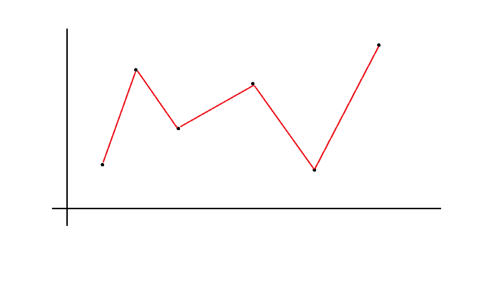
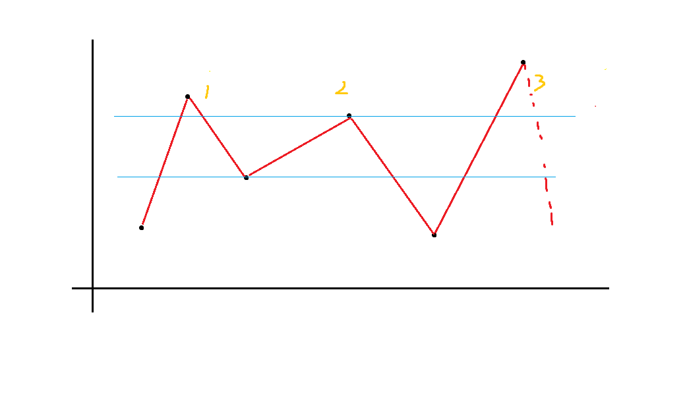

---
comments: true
----

# 2023 南京集训 杂题

## Day 3 模拟赛 T3

[原题链接](https://acm.timus.ru/problem.aspx?space=1&num=1128)

考虑一个贪心，先把所有人放在一队，每次从两队中随便选一个不合法的放到另一队，直到选不出为止。

这个贪心为什么是对的？

首先边数是 $O(n)$ 级别的（大前提）。

然后假如一个点不合法说明它连了至少两条边，放到另一队里至多增加一条边，会使得总边数至少减一。

最终一定会减到合法为止，且最多需要减 $O(n)$ 次。假如暴力找不合法的就是 $O(n^2)$，可以通过。

据说还有神秘做法可以 $O(1)$ 查找不合法，复杂度就是线性的，但我不会，讲题的也没讲。

/// details | 参考代码
    open: False
    type: success

```cpp
#include<bits/stdc++.h>
#define mem(a,b) memset(a,b,sizeof(a))
#define forup(i,s,e) for(int i=(s);i<=(e);i++)
#define fordown(i,s,e) for(int i=(s);i>=(e);i--)
using namespace std;
#define gc getchar()
inline int read(){
    int x=0,f=1;char c;
    while(!isdigit(c=gc)) if(c=='-') f=-1;
    while(isdigit(c)){x=(x<<3)+(x<<1)+(c^48);c=gc;}
    return x*f;
}
#undef gc
const int N=7005,inf=0x3f3f3f3f;
int n,c[N],d[N],sd[N];
vector<int> e[N];
bool work(){
    forup(i,1,n){
        if(d[i]>1){
            for(auto j:e[i]){
                if(sd[j]==sd[i]) d[j]--;
                else d[j]++;
            }
            d[i]=c[i]-d[i];
            sd[i]^=1;
            return true;
        }
    }
    return false;
}
void print(){
    int c1=0,c0=0;
    forup(i,1,n){
        if(sd[i]==1) c1++;
        else c0++;
    }
    if(c1<c0){
        printf("%d\n",c1);
        forup(i,1,n){
            if(sd[i]==1) printf("%d ",i);
        }
    }else if(c1>c0){
        printf("%d\n",c0);
        forup(i,1,n){
            if(sd[i]==0) printf("%d ",i);
        }
    }else{
        printf("%d\n",c1);
        forup(i,1,n){
            if(sd[i]==sd[1]) printf("%d ",i);
        }
    }
}
signed main(){
    n=read();
    forup(i,1,n){
        d[i]=c[i]=read();
        sd[i]=0;
        forup(j,1,c[i]){
            int v=read();
            e[i].push_back(v);
        }
    }
    while(work());
    print();
}
```

///

## Day 3 模拟赛 T4

[原题传送门](https://www.luogu.com.cn/problem/CF283E)

发现正着做不太好做，考虑反着求不满足 $a \to b \to c \to a$ 的三元组个数。

由于是个比赛图，所以不满足的三元组必定是 $a \to b,a \to c,b\to c/c \to b$。

换句话说，在一个点指向的点中随便选两个都不合法。

然后就很简单了，线段树维护每个点在修改后的出边个数。具体来说，假如不修改，那么出边个数就是比它小的数的个数。然后开一棵线段树维护区间异或 $1$，区间求和即可。结合双指针复杂度 $O(n\log n+m)$。

然后组合数求解即可。

/// details | 参考代码
    open: False
    type: success

```cpp
#include<bits/stdc++.h>
#define mem(a,b) memset(a,b,sizeof(a))
#define forup(i,s,e) for(i64 i=(s);i<=(e);i++)
#define fordown(i,s,e) for(i64 i=(s);i>=(e);i--)
using namespace std;
using i64=long long;
#define gc getchar()
inline i64 read(){
    i64 x=0,f=1;char c;
    while(!isdigit(c=gc)) if(c=='-') f=-1;
    while(isdigit(c)){x=(x<<3)+(x<<1)+(c^48);c=gc;}
    return x*f;
}
#undef gc
const i64 N=1e5+5,inf=0x3f3f3f3f;
i64 n,m,a[N];
struct op{
    i64 l,r;
}q1[N],q2[N];
struct SegmentTree{
    #define mid ((l+r)>>1)
    #define lson l,mid,id<<1
    #define rson mid+1,r,id<<1|1
    i64 querysum[N<<2],mark[N<<2];
    void PushUp(i64 id){
        querysum[id]=querysum[id<<1]+querysum[id<<1|1];
    }
    void PushDown(i64 id,i64 len){
        mark[id]=0;
        mark[id<<1]^=1;mark[id<<1|1]^=1;
        querysum[id<<1|1]=(len>>1)-querysum[id<<1|1];
        querysum[id<<1]=(len-(len>>1))-querysum[id<<1];
    }
    void Modify(i64 L,i64 R,i64 l=1,i64 r=n,i64 id=1){
        if(R<L) return;
        if(L<=l&&r<=R){
            mark[id]^=1;
            querysum[id]=(r-l+1)-querysum[id];
            return;
        }
        if(mark[id]) PushDown(id,r-l+1);
        if(L<=mid) Modify(L,R,lson);
        if(mid< R) Modify(L,R,rson);
        PushUp(id);
    }
    i64 AskSum(i64 L,i64 R,i64 l=1,i64 r=n,i64 id=1){
        if(R<L) return 0;
        if(L<=l&&r<=R){
            return querysum[id];
        }
        if(mark[id]) PushDown(id,r-l+1);
        i64 res=0;
        if(L<=mid) res+=AskSum(L,R,lson);
        if(mid< R) res+=AskSum(L,R,rson);
        return res;
    }
}mt;
bool cmp1(op a,op b){
    if(a.l!=b.l) return a.l<b.l;
    return a.r<b.r;
}
bool cmp2(op a,op b){
    if(a.r!=b.r) return a.r<b.r;
    return a.l<b.l;
}
i64 ans;
signed main(){
    n=read();m=read();
    ans=n*(n-1)*(n-2)/6;
    forup(i,1,n){
        a[i]=read();
    }
    sort(a+1,a+n+1);
    forup(i,1,m){
        int l=read(),r=read();
        q1[i].l=q2[i].l=lower_bound(a+1,a+n+1,l)-a;
        q1[i].r=q2[i].r=upper_bound(a+1,a+n+1,r)-a-1;
    }
    sort(q1+1,q1+m+1,cmp1);
    sort(q2+1,q2+m+1,cmp2);
    mt.Modify(1,n);
    i64 p1=1,p2=1;
    forup(i,1,n){
        mt.Modify(i,i);
        while(p1<=m&&q1[p1].l<=i){
            mt.Modify(q1[p1].l,q1[p1].r);
            ++p1;
        }
        while(p2<=m&&q2[p2].r<i){
            mt.Modify(q2[p2].l,q2[p2].r);
            ++p2;
        }
        i64 res=mt.AskSum(1,i-1)+mt.AskSum(i+1,n);
        ans-=res*(res-1)/2;
    }
    printf("%lld",ans);
}
```

///

## [AGC030D] Inversion Sum

[传送门](https://www.luogu.com.cn/problem/AT_agc030_d)

直接做完全没思路。这种情况有个套路，就是转化成期望 DP 再最终乘以某个数，利用期望的线性性求解。

设 $dp_{p,i,j}$ 表示考虑前 $p$ 个操作，假设每个操作有 $\frac{1}{2}$ 的概率不进行，$a_i>a_j$ 的概率是多少。转移是简单的，先计算 $dp_{p,x_p,y_p}$ 和 $$dp_{p,y_p,x_p}，然后直接枚举除去这一步交换的两个位置以外的其它位置，由于这一步只有 $x_p,y_p$ 可能变化，所以只有 $O(n)$ 的状态会变化。最终统计 $i>j,a_i<a_j$ 的二元组 $(i,j)$ 个数，乘以 $2^Q$ 即可。

然后可以把 $p$ 这一维压掉。

这道题主要难在不知道套路一点思路都想不出来。

/// details | 参考代码
    open: False
    type: success

```cpp
#include<bits/stdc++.h>
#define mem(a,b) memset(a,b,sizeof(a))
#define forup(i,s,e) for(int i=(s);i<=(e);i++)
#define fordown(i,s,e) for(int i=(s);i>=(e);i--)
using namespace std;
#define gc getchar()
inline int read(){
    int x=0,f=1;char c;
    while(!isdigit(c=gc)) if(c=='-') f=-1;
    while(isdigit(c)){x=(x<<3)+(x<<1)+(c^48);c=gc;}
    return x*f;
}
#undef gc
const int N=3005,inf=0x3f3f3f3f,mod=1e9+7;
int n,a[N],m,x,y,dp[N][N],pw=1;
int inv2=(mod+1)/2;
signed main(){
    n=read();m=read();
    forup(i,1,n){
        a[i]=read();
    }
    forup(i,1,n){
        forup(j,1,n){
            dp[i][j]=(a[i]>a[j]);
        }
    }
    forup(i,1,m){
        (pw*=2)%=mod;
        x=read();y=read();
        dp[x][y]=dp[y][x]=1ll*(dp[x][y]+dp[y][x])*inv2%mod;
        forup(j,1,n){
            if(j==x||j==y) continue;
            dp[x][j]=dp[y][j]=1ll*(dp[x][j]+dp[y][j])*inv2%mod;
            dp[j][x]=dp[j][y]=1ll*(dp[j][x]+dp[j][y])*inv2%mod;
        }
    }
    int ans=0;
    forup(i,1,n){
        forup(j,i+1,n){
            (ans+=dp[i][j])%=mod;
        }
    }
    printf("%lld\n",1ll*ans*pw%mod);
}
```

///

## P9197 [JOI Open 2016] 摩天大楼

[传送门](https://www.luogu.com.cn/problem/P9197)

很有意思的一道题，第一步的转化很巧妙。

首先从 $f$ 的顺序角度考虑显然是不可做的，考虑把所有数拍在一个二维平面上。



那么其实就是要求折线总纵向长度。

那么考虑从上到下用一个类似扫描线的东西。发现只要知道之前有几段连续的，下一层的贡献其实是唯一确定的。



上图中这一层有 $5\times (f_4-f_3)$ 的贡献，因为右侧已经到头了。

那么考虑排降序后 DP，设 $dp_{i,j,k,0/1,0/1}$ 表示放入（排序后）前 $i$ 个，分了 $j$ 个连续段，总和为 $k$，左/右有没有抵到边界的方案数。转移就分三种情况考虑：

1. 新开一段。
1. 并入之前的某一段。
1. 合并原先的两段。

具体方程略。最后答案就是 $\sum_{i=0}^kdp_{n,1,i,1,1}$。

/// details | 参考代码
    open: False
    type: success

```cpp
#include<bits/stdc++.h>
#define mem(a,b) memset(a,b,sizeof(a))
#define forup(i,s,e) for(int i=(s);i<=(e);i++)
#define fordown(i,s,e) for(int i=(s);i>=(e);i--)
using namespace std;
#define gc getchar()
inline int read(){
    int x=0,f=1;char c;
    while(!isdigit(c=gc)) if(c=='-') f=-1;
    while(isdigit(c)){x=(x<<3)+(x<<1)+(c^48);c=gc;}
    return x*f;
}
#undef gc
const int N=105,M=1005,inf=0x3f3f3f3f,mod=1e9+7;
int n,m,a[N],dp[2][N][M][2][2],ans=0;
signed main(){
    n=read();m=read();
    forup(i,1,n){
        a[i]=read();
    }
    sort(a+1,a+n+1,greater<int>());
    dp[1][1][0][0][0]=dp[1][1][0][0][1]=dp[1][1][0][1][0]=dp[1][1][0][1][1]=1;
    forup(i,2,n){
        int o=i&1,r=o^1;
        mem(dp[o],0);
        forup(j,1,i-1){
            forup(k,0,m){
                forup(p,0,1){
                    forup(q,0,1){
                        if(!dp[r][j][k][p][q]) continue;
                        int nxt=k+(2*j-p-q)*(a[i-1]-a[i]);
                        if(nxt>m) continue;
                        if(j>1){
                            (dp[o][j+1][nxt][p][q]+=1ll*(j-1)*dp[r][j][k][p][q]%mod)%=mod;
                            (dp[o][j][nxt][p][q]+=2ll*(j-1)*dp[r][j][k][p][q]%mod)%=mod;
                            (dp[o][j-1][nxt][p][q]+=1ll*(j-1)*dp[r][j][k][p][q]%mod)%=mod;
                        }
                        if(!p){
                            (dp[o][j+1][nxt][0][q]+=dp[r][j][k][p][q])%=mod;
                            (dp[o][j+1][nxt][1][q]+=dp[r][j][k][p][q])%=mod;
                            (dp[o][j][nxt][0][q]+=dp[r][j][k][p][q]%mod)%=mod;
                            (dp[o][j][nxt][1][q]+=dp[r][j][k][p][q]%mod)%=mod;
                        }
                        if(!q){
                            (dp[o][j+1][nxt][p][0]+=dp[r][j][k][p][q])%=mod;
                            (dp[o][j+1][nxt][p][1]+=dp[r][j][k][p][q])%=mod;
                            (dp[o][j][nxt][p][0]+=dp[r][j][k][p][q]%mod)%=mod;
                            (dp[o][j][nxt][p][1]+=dp[r][j][k][p][q]%mod)%=mod;
                        }
                    }
                }
            }
        }
    }
    int ans=0;
    forup(i,0,m){
        (ans+=dp[n&1][1][i][1][1])%=mod;
    }
    printf("%d",ans);
}
```

///

## [AGC033D] Complexity

[传送门](https://www.luogu.com.cn/problem/AT_agc033_d)

貌似是很经典的一道套路题。

首先 $O(n^5)$ 的记忆化搜索很简单，不多讲了。设状态 $f_{x_1,y_1,x_2,y_2}$ 表示左上角为 $(x_1,y_1)$，右下角为 $(x_2,y_2)$ 的矩形的复杂度。这种情况状态是 $O(n^4)$ 级别的，考虑先想办法压一维状态，然后把转移控制在大约 $\log$ 的复杂度内。

首先考虑最坏情况，即要把整个矩阵剁成一格一格的臊子。发现此时答案为 $\left\lceil\log n\right\rceil+\left\lceil\log m\right\rceil\le 20$。

那么发现答案的级别很小，考虑把答案和状态的某一维交换。

具体来说，设 $f_{x_1,x_2,y,c}$ 表示矩阵左边为一条从 $(x_1,y)$ 到 $(x_2,y)$ 的线段，复杂度为 $c$ 的矩阵右边缘最多延伸到多远（我定义的是左闭右闭区间，貌似左闭右开会好写一点）。

那么转移分两种，横着切的转移和竖着切的转移。

首先是竖着切的转移，由于切一刀只会增加 $1$ 复杂度，所以转移和倍增类似，即：

$$dp_{x_1,x_2,y,c}=dp_{x_1,x_2,dp_{x_1,x_2,y,c-1}+1,c-1}$$

然后考虑横着切的转移，发现其实就是要求这个式子（类似于区间 DP）：

$$dp_{x_1,x_2,y,c}=\max_{mid=x_1}^{x_2}\begin{Bmatrix}\min(dp_{x_1,mid,y,c-1},dp_{mid+1,x_2,y,c-1})\end{Bmatrix}$$

容易发现 $dp_{x_1,mid,y,c-1}$ 随着 $mid$ 的增加单调不增，$dp_{mid+1,x_2,y,c-1}$ 随着 $mid$ 增加单调不减，那么在它们取等的时候显然 $\min(dp_{x_1,mid,y,c-1},dp_{mid+1,x_2,y,c-1})$ 取到最大值，我们可以二分这个点。

复杂度 $O(n^2m(\log n+\log m)\log n)$ 带小常数，随便过。

/// details | 参考代码
    oprn: False
    type: success

```
#include<bits/stdc++.h>
#define mem(a,b) memset(a,b,sizeof(a))
#define forup(i,s,e) for(int i=(s);i<=(e);i++)
#define fordown(i,s,e) for(int i=(s);i>=(e);i--)
using namespace std;
#define gc getchar()
inline int read(){
    int x=0,f=1;char c;
    while(!isdigit(c=gc)) if(c=='-') f=-1;
    while(isdigit(c)){x=(x<<3)+(x<<1)+(c^48);c=gc;}
    return x*f;
}
#undef gc
const int N=200,inf=0x3f3f3f3f;
int n,m,a[N][N],sum[N][N],dp[25][N][N][N];
char str[N];
int calc(int x1,int x2,int y1,int y2){
    return sum[x2][y2]-sum[x1-1][y2]-sum[x2][y1-1]+sum[x1-1][y1-1];
}
signed main(){
    n=read();m=read();
    forup(i,1,n){
        scanf(" %s",str+1);
        forup(j,1,m){
            a[i][j]=(str[j]=='#');
            sum[i][j]=a[i][j]+sum[i-1][j]+sum[i][j-1]-sum[i-1][j-1];
        }
    }
    forup(x1,1,n){
        forup(x2,x1,n){
            forup(y,1,m){
                if(calc(x1,x2,y,y)!=0&&calc(x1,x2,y,y)!=(x2-x1+1)){
                    continue;
                }
                int ll=y,rr=m,mid;
                while(ll<rr){
                    mid=(ll+rr+1)>>1;
                    if(calc(x1,x2,y,mid)==0||calc(x1,x2,y,mid)==(x2-x1+1)*(mid-y+1)) ll=mid;
                    else rr=mid-1;
                }
                dp[0][x1][x2][y]=ll;
            }
        }
    }
    forup(i,1,20){
        forup(len,1,n){
            forup(x1,1,n-len+1){
                int x2=x1+len-1;
                fordown(y,m,1){
                    if(dp[i][x1][x2][y]) continue;
                    if(dp[i-1][x1][x2][y]==m){
                        dp[i][x1][x2][y]=m;
                        continue;
                    }
                    if(dp[i-1][x1][x2][y]!=0){
                        dp[i][x1][x2][y]=max(dp[i][x1][x2][y],dp[i-1][x1][x2][dp[i-1][x1][x2][y]+1]);
                    }
                    int ll=x1,rr=x2,mid;
                    while(ll<rr){
                        mid=(ll+rr)>>1;
                        if(dp[i-1][x1][mid][y]>=dp[i-1][mid+1][x2][y]) ll=mid+1;
                        else rr=mid;
                    }
                    dp[i][x1][x2][y]=max({dp[i][x1][x2][y],min(dp[i-1][x1][ll][y],dp[i-1][ll+1][x2][y]),min(dp[i-1][x1][ll-1][y],dp[i-1][ll][x2][y])});
                }
            }
        }        
    }
    forup(i,0,20){
        if(dp[i][1][n][1]>=m){
            printf("%d\n",i);
            return 0;
        }
    }
}
```

///