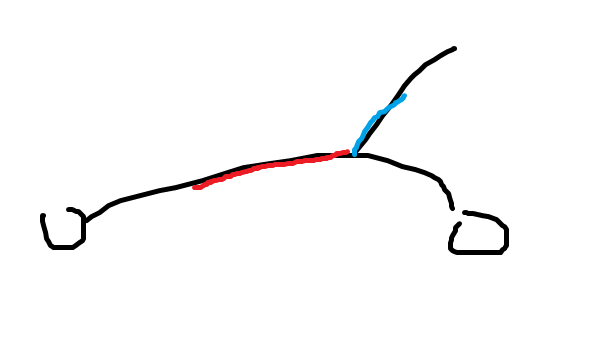

# 2024 8 月杂题

感觉耍一个暑假耍废了。

## P2839 [国家集训队] middle

[传送门](https://www.luogu.com.cn/problem/P2839)

> 题意

- 给定一个序列 $s$。
- $q$ 次询问，每次询问给你四个值 $a,b,c,d$，查询左端点在 $[a,b]$ 内，右端点在 $[c,d]$ 内的字串中，中位数最大值。
- 此处大小的偶数的可重集中中位数取较大的那个。
- $1\le n\le 2\times 10^4,1\le q\le 25000$，强制在线。

> 题解

哎哟傻逼题调了一晚上。

容易想到二分答案，那么先考虑如何判断固定区间中位数能否大于 $x$？即大于等于 $x$ 的数的个数减去小于 $x$ 的数的个数大于等于 $0$。换句话说，对于固定的 $x$，将大于等于它的赋值为 $1$，小于的赋值为 $-1$，区间和大于等于 $0$。

对于原问题，容易发现就是 $[b,c]$ 的总和加上 $[a,b-1]$ 的最大后缀和 $[c+1,d]$ 的最大前缀。

这个可以（离散化后）对每个值开线段树维护（可持久化即可），也可以分块。

那么如何分块呢？设块长为 $B$，容易发现对于每一块只有 $B+1$ 种不同的情况，那么分别扫一遍预处理，复杂度 $O(B^2\frac{n}{B})$。

然后二分后 check 可以简单地做到 $O(\frac{n}{B}+B)$。

于是复杂度 $O(n\sqrt{n}+q\sqrt{n}\log n)$，调一调块长说不定能得到更好的复杂度，但是我懒得搞了，反正数据范围那么小。

/// details | 参考代码
    open: False
    type: success

```cpp
#include<bits/stdc++.h>
#define forup(i,s,e) for(i64 i=(s),E123123123=(e);i<=E123123123;++i)
#define fordown(i,s,e) for(i64 i=(s),E123123123=(e);i>=E123123123;--i)
#define mem(a,b) memset(a,b,sizeof(a))
#ifdef DEBUG
#define msg(args...) fprintf(stderr,args)
#else
#define msg(...) void();
#endif
using namespace std;
using i64=long long;
#define gc getchar()
i64 read(){
	i64 x=0,f=1;char c;
	while(!isdigit(c=gc)) if(c=='-') f=-1;
	while(isdigit(c)){x=(x<<1)+(x<<3)+(c^48);c=gc;}
	return x*f;
}
#undef gc
const i64 N=2e4+5;
const i64 B=150;
i64 n,m,a[N],lans;
vector<i64> lsh;
i64 L[155],R[155],blg[N];
i64 sum[155][N],smx[155][N],pmx[155][N];
bool chk(i64 l1,i64 r1,i64 l2,i64 r2,i64 val){
	i64 mx1=0,mx2=0,ss=0;
	if(blg[r1]+1<blg[l2]){
		forup(i,blg[r1]+1,blg[l2]-1){
			ss+=sum[i][val];
		}
		forup(i,r1,R[blg[r1]]){
			ss+=(a[i]>=val?1:-1);
		}
		forup(i,L[blg[l2]],l2){
			ss+=(a[i]>=val?1:-1);
		}
	}else{
		forup(i,r1,l2){
			ss+=(a[i]>=val?1:-1);
		}
	}
	--r1,++l2;
	i64 nw=0;
	if(blg[l1]+1<blg[r1]){
		fordown(i,r1,L[blg[r1]]){
			nw+=(a[i]>=val?1:-1);
			mx1=max(mx1,nw);
		}
		fordown(i,blg[r1]-1,blg[l1]+1){
			mx1=max(mx1,nw+smx[i][val]);
			nw+=sum[i][val];
		}
		fordown(i,R[blg[l1]],l1){
			nw+=(a[i]>=val?1:-1);
			mx1=max(mx1,nw);
		}		
	}else{
		fordown(i,r1,l1){
			nw+=(a[i]>=val?1:-1);
			mx1=max(mx1,nw);
		}
	}
	nw=0;
	if(blg[l2]+1<blg[r2]){
		forup(i,l2,R[blg[l2]]){
			nw+=(a[i]>=val?1:-1);
			mx2=max(mx2,nw);
		}
		forup(i,blg[l2]+1,blg[r2]-1){
			mx2=max(mx2,nw+pmx[i][val]);
			nw+=sum[i][val];
		}
		forup(i,L[blg[r2]],r2){
			nw+=(a[i]>=val?1:-1);
			mx2=max(mx2,nw);
		}
	}else{
		forup(i,l2,r2){
			nw+=(a[i]>=val?1:-1);
			mx2=max(mx2,nw);
		}
	}
	return ss+mx1+mx2>=0;
}
signed main(){
	n=read();
	forup(i,1,n){
		a[i]=read();
		lsh.push_back(a[i]);
	}
	sort(lsh.begin(),lsh.end());
	lsh.erase(unique(lsh.begin(),lsh.end()),lsh.end());
	forup(i,1,n){
		a[i]=lower_bound(lsh.begin(),lsh.end(),a[i])-lsh.begin();
	}
	i64 T=n/B;
	forup(i,1,T){
		L[i]=R[i-1]+1,R[i]=i*B;
		forup(j,L[i],R[i]){
			blg[j]=i;
		}
	}
	if(R[T]!=n){
		++T;
		L[T]=R[T-1]+1;R[T]=n;
		forup(j,L[T],R[T]){
			blg[j]=T;
		}
	}
	forup(i,1,T){
		forup(j,0,n){
			smx[i][j]=pmx[i][j]=sum[i][j]=-(R[i]-L[i]+1);
		}
		forup(j,L[i],R[i]){
			i64 x=a[j];
			i64 mmx=0,nw=0;
			fordown(k,R[i],L[i]){
				nw+=(a[k]>=x?1:-1);
				mmx=max(mmx,nw);
			}
			smx[i][x]=mmx;
			mmx=0,nw=0;
			forup(k,L[i],R[i]){
				nw+=(a[k]>=x?1:-1);
				mmx=max(mmx,nw);
			}
			pmx[i][x]=mmx;
			sum[i][x]=nw;
		}
		fordown(j,n-1,0){
			smx[i][j]=max(smx[i][j+1],smx[i][j]);
			pmx[i][j]=max(pmx[i][j+1],pmx[i][j]);
			sum[i][j]=max(sum[i][j+1],sum[i][j]);
		}
	}
	m=read();
	forup(i,1,m){
		vector<i64> q;
		forup(j,1,4){
			i64 p=read();
			q.push_back((p+lans)%n+1);
		}
		sort(q.begin(),q.end());
		i64 l1=q[0],r1=q[1],l2=q[2],r2=q[3];
		i64 ll=0,rr=n,mm;
		while(ll<rr){
			mm=(ll+rr+1)>>1;
			if(chk(l1,r1,l2,r2,mm)) ll=mm;
			else rr=mm-1;
		}
		lans=lsh[ll];
		printf("%lld\n",lans);
	}
}
```

///

## UOJ#164 V

[传送门](https://vjudge.net.cn/problem/UniversalOJ-164)

> 题意

- 初始给定长度为 $n$ 的序列 $a_i$，维护五个操作共 $q$ 次：
    - 区间 $[l,r]$ 赋值为 $a_i+x\;(x\ge 0)$。
    - 区间 $[l,r]$ 赋值为 $\max(0,a[i]-x)\;(x<0)$。
    - 区间 $[l,r]$ 赋值为 $x\;(x\ge 0)$。
    - 查询单点值。
    - 查询单点历史最值。
- $1\le n,q\le 5\times 10^5$，所有输入的数在 $10^9$ 以内。

> 题解

还是比较有启发性吧。

考虑三个操作都能概括为 $a_i\gets \max(a_i+v,b)$，于是用 $(v,b)$ 二元组表示一个操作。

考虑两操作 $(v_1,b_1),(v_2,b_2)$ 的复合，容易发现 $\max(\max(a_i+v_1,b_1)+v_2,b_2)=\max(a_i+v_1+v_2,\max(b_1+v_2,b_2))$，显然这玩意有结合律，所以可以直接扔到线段树上维护懒标记。

那么单点查值是简单的，然后查历史最值由于查询和操作都是 $\max$，所以直接分别维护 $v,b$ 的最大值即可在叶子处得到答案。

复杂度 $O(n\log n)$。

/// details | 参考代码
    open: False
    type: success

```cpp
#include<bits/stdc++.h>
#define forup(i,s,e) for(i64 i=(s),E123123123=(e);i<=E123123123;++i)
#define fordown(i,s,e) for(i64 i=(s),E123123123=(e);i>=E123123123;--i)
#define mem(a,b) memset(a,b,sizeof(a))
#ifdef DEBUG
#define msg(args...) fprintf(stderr,args)
#else
#define msg(...) void();
#endif
using namespace std;
using i64=long long;
using pii=pair<i64,i64>;
#define fi first
#define se second
#define mkp make_pair
#define gc getchar()
i64 read(){
	i64 x=0,f=1;char c;
	while(!isdigit(c=gc)) if(c=='-') f=-1;
	while(isdigit(c)){x=(x<<1)+(x<<3)+(c^48);c=gc;}
	return x*f;
}
#undef gc
const i64 N=5e5+5,inf=1e18;
i64 n,a[N],m;
struct SegTree{
	#define mid ((l+r)>>1)
	#define lson l,mid,id<<1
	#define rson mid+1,r,id<<1|1
	pii tag[N<<2],htag[N<<2];
	void work(i64 id,pii val,pii hval){
		htag[id].fi=max(htag[id].fi,tag[id].fi+hval.fi);
		htag[id].se=max(htag[id].se,max(hval.se,tag[id].se+hval.fi));
		tag[id].fi=max(-inf,tag[id].fi+val.fi);
		tag[id].se=max(tag[id].se+val.fi,val.se);
	}
	void PushDown(i64 id){
		work(id<<1,tag[id],htag[id]);
		work(id<<1|1,tag[id],htag[id]);
		tag[id]=htag[id]=mkp(0,0);
	}
	void Build(i64 l=1,i64 r=n,i64 id=1){
		tag[id]=htag[id]=mkp(0,0);
		if(l==r) return;
		Build(lson);Build(rson);
	}
	void Update(i64 L,i64 R,pii X,i64 l=1,i64 r=n,i64 id=1){
		if(L<=l&&r<=R){
			work(id,X,X);
			return;
		}
		PushDown(id);
		if(L<=mid) Update(L,R,X,lson);
		if(mid< R) Update(L,R,X,rson);
	}
	pii Query(i64 P,i64 l=1,i64 r=n,i64 id=1){
		if(l==r){
			return mkp(max(a[l]+tag[id].fi,tag[id].se),max(a[l]+htag[id].fi,htag[id].se));
		}
		PushDown(id);
		if(P<=mid) return Query(P,lson);
		else       return Query(P,rson);
	}
}mt;
signed main(){
	n=read();
	m=read();
	forup(i,1,n){
		a[i]=read();
	}
	mt.Build();
	forup(i,1,m){
		i64 op=read();
		if(op==1){
			i64 l=read(),r=read(),v=read();
			mt.Update(l,r,mkp(v,0));
		}else if(op==2){
			i64 l=read(),r=read(),v=read();
			mt.Update(l,r,mkp(-v,0));
		}else if(op==3){
			i64 l=read(),r=read(),v=read();
			mt.Update(l,r,mkp(-inf,v));
		}else if(op==4){
			i64 p=read();
			printf("%lld\n",mt.Query(p).fi);
		}else{
			i64 p=read();
			printf("%lld\n",mt.Query(p).se);
		}
	}
}
```

///

## LOJ#6029 「雅礼集训 2017 Day1」市场

[传送门](https://loj.ac/p/6029)

> 题意

- 给定义一个长度为 $n$ 的序列 $a$，维护四个操作共 $q$ 次：
    - 区间加 $c\;(|c|\le 10^4)$.
    - 区间除以 $d$ 向下取整 $(2\le d\le 10^9)$。
    - 区间询问最小值。
    - 区间询问总和。
- $1\le n,q\le 10^5$，注意这道题下标从 $0$ 开始。

> 题解

神秘。

首先看到维护除法容易想到势能分析线段树，但是有区间加，怎么办。

因为有区间加，所以考虑对区间内数的相对大小做文章。

设 $f(x,d)=x-\left\lfloor\frac{x}{d}\right\rfloor$，容易发现对于一个区间，若 $f(mx,d)=f(mn,d)$（其中 $mx$ 是区间最大值，$mn$ 是区间最小值），那么操作二相当与区间减去 $f(mx,d)$。若不是就向下递归。

容易发现 $f(mx,d)=f(mn,d)$ 当且仅当 $mx=mn$ 或两者恰好在以 $d$ 的倍数分块的两块交界（即最大值和最小值的差比较小时），而区间加显然不会影响区间内最大值和最小值的差，那么它只会影响 $O(\log)$ 个区间，每个区间显然至多操作 $O(\log)$ 次这玩意就等于 $0$ 了，于是复杂度 $O(n\log^2 n)$（$q,n$ 同阶就不管了）。

/// details | 参考代码
    open: False
    type: success

```cpp
#include<bits/stdc++.h>
#define forup(i,s,e) for(i64 i=(s),E123123123=(e);i<=E123123123;++i)
#define fordown(i,s,e) for(i64 i=(s),E123123123=(e);i>=E123123123;--i)
#define mem(a,b) memset(a,b,sizeof(a))
#ifdef DEBUG
#define msg(args...) fprintf(stderr,args)
#else
#define msg(...) void();
#endif
using namespace std;
using i64=long long;
#define gc getchar()
i64 read(){
	i64 x=0,f=1;char c;
	while(!isdigit(c=gc)) if(c=='-') f=-1;
	while(isdigit(c)){x=(x<<1)+(x<<3)+(c^48);c=gc;}
	return x*f;
}
#undef gc
const i64 N=1e5+5,inf=0x3f3f3f3f;
i64 n,m,a[N];
i64 calcdel(i64 x,i64 d){
	if(x>=0){
		return x-(x/d);
	}else{
		x=-x;
		return ((x+d-1)/d)-x;
	}
} 
struct SegTree{
	#define mid ((l+r)>>1)
	#define lson l,mid,id<<1
	#define rson mid+1,r,id<<1|1
	i64 mx[N<<2],mn[N<<2],sum[N<<2],mark[N<<2];
	void PushUp(i64 id){
		mx[id]=max(mx[id<<1],mx[id<<1|1]);
		mn[id]=min(mn[id<<1],mn[id<<1|1]);
		sum[id]=sum[id<<1]+sum[id<<1|1];
	}
	void work(i64 id,i64 val,i64 len){
		mx[id]+=val;
		mn[id]+=val;
		mark[id]+=val;
		sum[id]+=val*len;
	}
	void PushDown(i64 id,i64 l,i64 r){
		work(id<<1,mark[id],mid-l+1);
		work(id<<1|1,mark[id],r-mid);
		mark[id]=0;
	}
	void Build(i64 l=1,i64 r=n,i64 id=1){
		mark[id]=0;
		if(l==r){
			sum[id]=mx[id]=mn[id]=a[l];
			return;
		}
		Build(lson);Build(rson);
		PushUp(id);
	}
	void Update(i64 L,i64 R,i64 X,i64 l=1,i64 r=n,i64 id=1){
		if(L<=l&&r<=R){
			work(id,X,r-l+1);
			return;
		}
		if(mark[id]) PushDown(id,l,r);
		if(L<=mid) Update(L,R,X,lson);
		if(mid< R) Update(L,R,X,rson);
		PushUp(id);
	}
	void Modify(i64 L,i64 R,i64 D,i64 l=1,i64 r=n,i64 id=1){
		if(L<=l&&r<=R&&calcdel(mx[id],D)==calcdel(mn[id],D)){
			work(id,-calcdel(mx[id],D),r-l+1);
			return;
		}
		if(mark[id]) PushDown(id,l,r);
		if(L<=mid) Modify(L,R,D,lson);
		if(mid< R) Modify(L,R,D,rson);
		PushUp(id);
	}
	i64 Querymn(i64 L,i64 R,i64 l=1,i64 r=n,i64 id=1){
		if(L<=l&&r<=R){
			return mn[id];
		}
		i64 res=inf;
		if(mark[id]) PushDown(id,l,r);
		if(L<=mid) res=min(res,Querymn(L,R,lson));
		if(mid< R) res=min(res,Querymn(L,R,rson));
		return res;
	}
	i64 Querysum(i64 L,i64 R,i64 l=1,i64 r=n,i64 id=1){
		if(L<=l&&r<=R){
			return sum[id];
		}
		i64 res=0;
		if(mark[id]) PushDown(id,l,r);
		if(L<=mid) res+=Querysum(L,R,lson);
		if(mid< R) res+=Querysum(L,R,rson);
		return res;
	}
}mt;
signed main(){
	n=read();m=read();
	forup(i,1,n){
		a[i]=read();
	}
	mt.Build();
	forup(i,1,m){
		i64 op=read(),l=read()+1,r=read()+1;
		if(op==1){
			i64 v=read();
			mt.Update(l,r,v);
		}else if(op==2){
			i64 d=read();
			mt.Modify(l,r,d);
		}else if(op==3){
			printf("%lld\n",mt.Querymn(l,r));
		}else{
			printf("%lld\n",mt.Querysum(l,r));
		}
	}
}
```

///

## P5618 [SDOI2015] 道路修建

[传送门](https://www.luogu.com.cn/problem/P5618)

这么版的题怎么都没人写 DDP（动态动态规划）做法啊。

> 题意

- 有一个两行 $n$ 列的网格图，四联通连边，每条边有边权。
- 有两个操作共 $q$ 次：
    - 修改某条边的边权。
    - 查询区间 $[l,r]$ 内两行共 $2(r-l+1)$ 个点的最小生成树。
- $1\le n,q\le 60000$，边权不超过 $10^4$

> 题解

晚自习 20min 切了，但是唐诗错误 WA 一发，但是洛谷最优解。

考虑静态问题（即没有修改，只有一次全局查询），容易想到 DP（因为只能相邻连边，所以这一列想和之前的连边必须和上一列连，那么可以对每一列设状态，从上一列转移）。

具体来说，设 $dp_{i,0/1}$ 表示考虑前 $i$ 列，第 $i$ 列两个点是否已经联通的最小代价。

转移很显然，具体如下（$d1$ 表示这一列第一行与上一列连边的边权，$d2$ 表示第二行，$d3$ 表示这一类的纵向连边）：

$$
dp_{i,0}=\min(dp_{i-1,1}+\min(d1,d2),dp_{i-1,0}+d1+d2)
$$
$$
dp_{i,1}=\min(dp_{i-1,1}+\min(d1+d2,d1+d3,d2+d3),dp_{i-1,0}+d1+d2+d3)
$$

初始状态为 $dp_{1,0}=0,dp_{1,1}=d3$。

然后用 $\min,+$ 的广义矩阵扔到线段树上维护一下就做完了。

具体来说，一般矩阵乘法（$A\times B=C$，此处以 $2\times 2$ 矩阵为例）的定义是 $C_{i,j}=\sum_{k=0}^1A_{i,k}\times B_{k,j}$，$\oplus,\otimes$（这代指两种运算）的广义矩阵乘法定义是 $C_{i,j}=\bigoplus A_{i,k}\otimes B_{k,j}$，容易证明只要 $\oplus$ 有交换律，$\otimes$ 有结合律和交换律，$\otimes$ 对 $\oplus$ 有分配率即可得到有结合律的矩阵乘法，具体证明考虑将 $(A\times B)\times C$ 和 $A\times(B\times C)$ 分别暴力拆开，此处略过。

然后容易发现用 $\min$ 代替 $\oplus$，用加法代替 $\otimes$ 即可完美地概括此题的 DP 转移，具体矩阵请自行构造，转移已给出。

复杂度 $O(n\log nk^3)$，其中 $k=2$，为矩阵边长。

/// details | 参考代码
    open: False
    type: success

```cpp
#include<bits/stdc++.h>
#define forup(i,s,e) for(int i=(s),E123123123=(e);i<=E123123123;++i)
#define fordown(i,s,e) for(int i=(s),E123123123=(e);i>=E123123123;--i)
#define mem(a,b) memset(a,b,sizeof(a))
#ifdef DEBUG
#define msg(args...) fprintf(stderr,args)
#else
#define msg(...) void();
#endif
using namespace std;
using i64=long long;
#define gc getchar()
int read(){
	int x=0,f=1;char c;
	while(!isdigit(c=gc)) if(c=='-') f=-1;
	while(isdigit(c)){x=(x<<1)+(x<<3)+(c^48);c=gc;}
	return x*f;
}
#undef gc
const int N=6e4+5,inf=0x3f3f3f3f;
struct Matrix{
	int c[2][2];
	Matrix(int a1=0,int a2=0,int a3=0,int a4=0){
		c[0][0]=a1;
		c[0][1]=a2;
		c[1][0]=a3;
		c[1][1]=a4;
	}
	Matrix operator *(const Matrix &r){//广义矩阵乘法
		Matrix res;
		forup(i,0,1){
			forup(j,0,1){
				res.c[i][j]=inf;
				forup(k,0,1){
					res.c[i][j]=min(res.c[i][j],c[i][k]+r.c[k][j]);
				}
			}
		}
		return res;
	}
};
int n,m,d1[N],d2[N],d3[N];
Matrix tr(int l){//转移矩阵
	return Matrix(d1[l]+d2[l],d1[l]+d2[l]+d3[l],min(d1[l],d2[l]),min({d1[l]+d2[l],d1[l]+d3[l],d2[l]+d3[l]}));
}
struct SegTree{//线段树维护区间矩阵广义积
	#define mid ((l+r)>>1)
	#define lson l,mid,id<<1
	#define rson mid+1,r,id<<1|1
	Matrix mat[N<<2];
	void PushUp(int id){
		mat[id]=mat[id<<1]*mat[id<<1|1];
	}
	void Build(int l=1,int r=n,int id=1){//初始化
		if(l==r){
			mat[id]=tr(l);
			return;
		}
		Build(lson);Build(rson);
		PushUp(id);
	}
	void Update(int P,int l=1,int r=n,int id=1){//单点修改
		if(l==r){
			mat[id]=tr(l);
			return;
		}
		if(P<=mid) Update(P,lson);
		else       Update(P,rson);
		PushUp(id);
	}
	Matrix Query(int L,int R,int l=1,int r=n,int id=1){//区间查询
		if(L<=l&&r<=R){
			return mat[id];
		}
		Matrix res(0,inf,inf,0);
		if(L<=mid) res=res*Query(L,R,lson);
		if(mid< R) res=res*Query(L,R,rson);
		return res;
	}
}mt;
char str[5];
signed main(){
	n=read();m=read();
	forup(i,2,n) d1[i]=read();
	forup(i,2,n) d2[i]=read();
	forup(i,1,n) d3[i]=read();
	mt.Build();//记得初始化
	forup(i,1,m){
		scanf(" %s",str);
		if(str[0]=='C'){
			int x1=read(),y1=read(),x2=read(),y2=read(),w=read();
			if(x1>x2) swap(x1,x2);
			if(y1>y2) swap(y1,y2);
			if(x1==1){
				if(x2==1){
					d1[y2]=w;
				}else{
					d3[y2]=w;
				}
			}else{
				d2[y2]=w;
			}
			mt.Update(y2);
		}else{
			int l=read(),r=read();
			Matrix res=mt.Query(l+1,r);
			res=Matrix(0,d3[l],-inf,-inf)*res;
			printf("%d\n",res.c[0][1]);//最后答案显然必须连通。
		}
	}
}
```

///

## [ABC236G] Good Vertices

[传送门](https://www.luogu.com.cn/problem/AT_abc236_g)

> 题意

- 有一张 $n$ 个点的有向图，初始没有边。
- 有 $t$ 次加边操作，每次加入一条有向边，可能有自环。
- 求每个点从哪次操作开始存在一条从 $1$ 开始**恰好**经过 $l$ 条边的路径到达它。
- $1\le n\le 100,1\le t\le n^2,1\le L\le 10^9$。

> 题解

广义矩阵快速幂加速递推好题。

容易想到一个 DP，设 $f_{i,j}$ 表示从 $1$ 开始经过恰好 $i$ 条边到达 $j$ 的路径上边权（即加入时间，一直没加入即为正无穷）最大值最小是多少，转移就枚举每一条边即可从 $f_{i,u}$ 转移到 $f_{i+1,v}$。

转移式子为 $f_{i+1,v}= \min_{u=1}^n\begin{Bmatrix}\max(f_{i,u},w(u,v))\end{Bmatrix}$，其中 $w(u,v)$ 为 $u,v$ 间的边权。

这个长的就很像矩阵乘法的 $C_{i,j}=\bigoplus A_{i,k}\otimes B_{k,j}$，那么能不能设计广义矩阵乘法呢？

然后瞪一下容易发现 $\min$ 对 $\max$ 有分配律（显然 $\min(\max(a,b),\max(a,c))=\max(a,\min(b,c))$，分类讨论即可），其它需要的运算律都是经典的。

然后这个转移就能用矩阵概括了，复杂度 $O(n^3\log L)$。

注意在 $\min,\max$ 意义下的单位矩阵和全 $0$ 矩阵长什么样。

/// details | 参考代码
	open: False
	type: success

```cpp
#include<bits/stdc++.h>
#define forup(i,s,e) for(int i=(s),E123123123=(e);i<=E123123123;++i)
#define fordown(i,s,e) for(int i=(s),E123123123=(e);i>=E123123123;--i)
#define mem(a,b) memset(a,b,sizeof(a))
#ifdef DEBUG
#define msg(args...) fprintf(stderr,args)
#else
#define msg(...) void();
#endif
using namespace std;
using i64=long long;
using pii=pair<int,int>;
#define fi first
#define se second
#define mkp make_pair
#define gc getchar()
int read(){
	int x=0,f=1;char c;
	while(!isdigit(c=gc)) if(c=='-') f=-1;
	while(isdigit(c)){x=(x<<1)+(x<<3)+(c^48);c=gc;}
	return x*f;
}
#undef gc
const int N=105,inf=0x3f3f3f3f;
int n,t,m;
struct Matrix{
	int c[N][N];
	Matrix operator *(const Matrix &r){
		Matrix res;
		forup(i,0,n-1){
			forup(j,0,n-1){
				res.c[i][j]=inf;
				forup(k,0,n-1){
					res.c[i][j]=min(res.c[i][j],max(c[i][k],r.c[k][j]));
				}
			}
		}
		return res;
	}
}tr;
Matrix ksm(Matrix a,int b){
	Matrix c;
	forup(i,0,n-1){
		forup(j,0,n-1){
			c.c[i][j]=inf;
		}
	}
	forup(i,0,n-1){
		c.c[i][i]=-inf;
	}
	while(b){
		if(b&1) c=c*a;
		a=a*a;
		b>>=1;
	}
	return c;
}
signed main(){
	n=read();t=read();m=read();
	forup(i,0,n-1){
		forup(j,0,n-1){
			tr.c[i][j]=inf;
		}
	}
	forup(i,1,t){
		int u=read()-1,v=read()-1;
		tr.c[u][v]=i;
	}
	Matrix res=ksm(tr,m);
	forup(i,0,n-1){
		if(res.c[0][i]!=inf){
			printf("%d ",res.c[0][i]);
		}else{
			printf("-1 ");
		}
	}
}
```

///

## P5298 [PKUWC2018] Minimax

[传送门](https://www.luogu.com.cn/problem/P5298)

唉，我是线段树合并低手。

> 题意

- 有一颗以 $1$ 为根的树，最初只有叶子有值 $w_u$，非叶子结点均有一个概率 $p$，表示该结点的权值有 $p$ 的概率是儿子中的最大值，$1-p$ 的概率是最小值。
- 因为 $0 < p < 1$，所以显然根节点有可能取到所有叶子，设根节点的权值是第 $i$ 小的叶子的概率为 $D_i$，第 $i$ 小的叶子权值为 $V_i$，输出 $\sum i\times V_i\times D_i^2$。
- $1\le n\le 3\times 10^5,w_u\in[1,10^9],p\in(0,1)$，**每个结点至多有两个儿子**，叶子权值互不相同。

> 题解

首先可以对权值离散化方便处理。

因为每个点只和自己的直接儿子有关，容易想到树形 DP。

设 $f_{u,i}$ 表示点 $u$ 的权值取到 $i$ 的概率，当 $u$ 只有一个儿子显然可以直接继承，若 $u$ 有两个儿子情况则略有变化。

设两个儿子分别是 $l,r$，不妨设 $u$ 的权值从 $l$ 继承过来（$r$ 是一样的），那么假如是取“最小值”取到 $l$，则有 $w_r>w_l$，那么 $w_u=x$ 的概率就是 $(1-p)f_{l,x}\sum_{i=x+1}^nf_{r,i}$，同理若取最大值取到 $l$ 则有 $pf_{l,x}\sum_{i=1}^{x-1}f_{r,i}$。

综上，$f_{u,i}=(f_{l,i}\times ((1-p)\sum_{i=x+1}^nf_{r,i}+p\sum_{i=1}^{x-1}f_{r,i}))+(f_{r,i}\times ((1-p)\sum_{i=x+1}^nf_{l,i}+p\sum_{i=1}^{x-1}f_{l,i}))$。

容易发现转移都是单点乘前后缀和，于是可以线段树合并优化（注意只有一边有值时会变成一个区间乘，打乘法 tag 即可），复杂度 $O(n\log n)$。

注意最后还原离散化的细节问题。

/// details | 参考代码
	open: False
	type: success

```cpp
#include<bits/stdc++.h>
#define forup(i,s,e) for(int i=(s),E123123123=(e);i<=E123123123;++i)
#define fordown(i,s,e) for(int i=(s),E123123123=(e);i>=E123123123;--i)
#define mem(a,b) memset(a,b,sizeof(a))
#ifdef DEBUG
#define msg(args...) fprintf(stderr,args)
#else
#define msg(...) void();
#endif
using namespace std;
using i64=long long;
using pii=pair<int,int>;
#define fi first
#define se second
#define mkp make_pair
#define gc getchar()
int read(){
	int x=0,f=1;char c;
	while(!isdigit(c=gc)) if(c=='-') f=-1;
	while(isdigit(c)){x=(x<<1)+(x<<3)+(c^48);c=gc;}
	return x*f;
}
#undef gc
const int N=3e5+5,inf=0x3f3f3f3f,mod=998244353;
int ksm(int a,int b){
	int c=1;
	while(b){
		if(b&1) c=1ll*a*c%mod;
		a=1ll*a*a%mod;
		b>>=1;
	}
	return c;
}
int n,inv,sz;
vector<int> e[N];
int val[N];
vector<int> lsh;
struct SegTree{
	#define mid ((l+r)>>1)
	#define lson l,mid,ls[u]
	#define rson mid+1,r,rs[u]
	int sum[N*20],ls[N*20],rs[N*20],tag[N*20],cntn,root[N];
	void PushUp(int u){
		sum[u]=0;
		if(ls[u]) (sum[u]+=sum[ls[u]])%=mod;
		if(rs[u]) (sum[u]+=sum[rs[u]])%=mod;
	}
	void PushDown(int u){
		if(ls[u]){
			sum[ls[u]]=1ll*sum[ls[u]]*tag[u]%mod;
			tag[ls[u]]=1ll*tag[ls[u]]*tag[u]%mod;
		}
		if(rs[u]){
			sum[rs[u]]=1ll*sum[rs[u]]*tag[u]%mod;
			tag[rs[u]]=1ll*tag[rs[u]]*tag[u]%mod;
		}
		tag[u]=1;
	}
	int New(){
		int nw=++cntn;
		ls[nw]=rs[nw]=sum[nw]=0;
		tag[nw]=1;
		return nw;
	}
	void Update(int P,int l,int r,int &u){
		if(!u) u=New();
		if(l==r){
			sum[u]=1;
			return;
		}
		if(P<=mid) Update(P,lson);
		else       Update(P,rson);
		PushUp(u);
	}
	int Merge(int valu,int valv,int p,int l,int r,int u,int v){
		if(!u||!v){
			if(!v){
				tag[u]=1ll*tag[u]*valv%mod;
				sum[u]=1ll*sum[u]*valv%mod;
				return u;
			}else{
				tag[v]=1ll*tag[v]*valu%mod;
				sum[v]=1ll*sum[v]*valu%mod;
				return v;
			}
		}
		if(tag[u]!=1) PushDown(u);
		if(tag[v]!=1) PushDown(v);
		int nvalu=(valu+mod-1ll*sum[ls[u]]*(mod+1-p)%mod+1ll*sum[ls[u]]*p%mod)%mod;
		if(!ls[u]) nvalu=valu;
		int nvalv=(valv+mod-1ll*sum[ls[v]]*(mod+1-p)%mod+1ll*sum[ls[v]]*p%mod)%mod;
		if(!ls[v]) nvalv=valv;
		ls[u]=Merge(valu,valv,p,lson,ls[v]);
		rs[u]=Merge(nvalu,nvalv,p,rson,rs[v]);
		PushUp(u);
		return u;
	}
	int Get(int l,int r,int u){
		if(!u) return 0;
		if(l==r){
			return 1ll*(l+1)*lsh[l]%mod*sum[u]%mod*sum[u]%mod;
		}
		if(tag[u]!=1) PushDown(u);
		int res=0;
		(res+=Get(lson))%=mod;
		(res+=Get(rson))%=mod;
		return res;
	}
	#undef mid
	#undef lson
	#undef rson
}mt;
void dfs(int u){
	if(e[u].empty()) return;
	if(e[u].size()==1){
		dfs(e[u][0]);
		mt.root[u]=mt.root[e[u][0]];
	}else{
		dfs(e[u][0]);dfs(e[u][1]);
		int np=val[u],rp=(mod+1-np)%mod;
		mt.root[u]=mt.Merge(1ll*mt.sum[mt.root[e[u][0]]]*rp%mod,1ll*mt.sum[mt.root[e[u][1]]]*rp%mod,np,0,sz-1,mt.root[e[u][0]],mt.root[e[u][1]]);
	}
}
signed main(){
	n=read();
	forup(i,1,n){
		int f=read();
		if(i>1){
			e[f].push_back(i);
		}
	}
	inv=ksm(10000,mod-2);
	forup(i,1,n){
		val[i]=read();
		if(e[i].size()){
			val[i]=1ll*val[i]*inv%mod;
		}else{
			lsh.push_back(val[i]);
		}
	}
	sort(lsh.begin(),lsh.end());
	lsh.erase(unique(lsh.begin(),lsh.end()),lsh.end());
	sz=lsh.size();
	forup(i,1,n){
		if(e[i].empty()){
			val[i]=lower_bound(lsh.begin(),lsh.end(),val[i])-lsh.begin();
			mt.Update(val[i],0,sz-1,mt.root[i]);
		}
	}
	dfs(1);
	printf("%d\n",mt.Get(0,sz-1,mt.root[1]));
}
```

///

## P3899 [湖南集训] 更为厉害

[传送门](https://www.luogu.com.cn/problem/P3899)

> 题意

- 给定一棵 $n$ 个点，以 $1$ 为根的树。
- 称一个有序三元组 $(a,b,c)$ 是“$k$ 合法的”当且仅当 $a,b,c$ 互不相同，且 $a,b$ 之间距离小于等于 $k$ 且 $a,b$ 均为 $c$ 的祖先。
- $q$ 次询问，每次给定 $p,k$，求有多少个有序三元组 $(p,b,c)$ 是“$k$ 合法的”。
- $1\le n,q\le 3\times 10^5$，其余数据在合理范围内。

> 题解

容易发现其实就两种情况，一种是 $b$ 是 $p$ 的祖先，$c$ 是 $p$ 子树内任意一点，另一种是 $b$ 是 $p$ 的后代，$c$ 是 $b$ 子树内任意一点。

前者是简单的，记录 $p$ 子树大小和 $p$ 的深度即可。后者相当于 dfn 上区间询问深度小于某个数的所有点子树大小之和（相当于平面直角坐标系矩形求和），主席树秒了。

复杂度 $O(n\log n+q\log n)$。

/// details | 参考代码
	open: False
	type: success

```cpp
#include<bits/stdc++.h>
#define forup(i,s,e) for(i64 i=(s),E123123123=(e);i<=E123123123;++i)
#define fordown(i,s,e) for(i64 i=(s),E123123123=(e);i>=E123123123;--i)
#define mem(a,b) memset(a,b,sizeof(a))
#ifdef DEBUG
#define msg(args...) fprintf(stderr,args)
#else
#define msg(...) void();
#endif
using namespace std;
using i64=long long;
using pii=pair<i64,i64>;
#define fi first
#define se second
#define mkp make_pair
#define gc getchar()
i64 read(){
	i64 x=0,f=1;char c;
	while(!isdigit(c=gc)) if(c=='-') f=-1;
	while(isdigit(c)){x=(x<<1)+(x<<3)+(c^48);c=gc;}
	return x*f;
}
#undef gc
const i64 N=3e5+5,inf=1e18;
i64 n,q;
vector<i64> e[N];
struct SegTree{
	#define mid ((l+r)>>1)
	#define lson l,mid,ls[id]
	#define rson mid+1,r,rs[id]
	i64 ls[N*40],rs[N*40],sum[N*40],root[N],cntn;
	void Build(i64 l,i64 r,i64 &id){
		if(!id) id=++cntn;
		if(l==r) return;
		Build(lson);Build(rson);
	}
	void Update(i64 P,i64 X,i64 l,i64 r,i64 &id,i64 pre){
		id=++cntn;
		ls[id]=ls[pre];rs[id]=rs[pre];
		sum[id]=sum[pre]+X;
		if(l==r) return;
		if(P<=mid) Update(P,X,lson,ls[pre]);
		else       Update(P,X,rson,rs[pre]);
	}
	i64 Query(i64 L,i64 R,i64 l,i64 r,i64 id,i64 pre){
		if(L<=l&&r<=R){
			return sum[id]-sum[pre];
		}
		i64 res=0;
		if(L<=mid) res+=Query(L,R,lson,ls[pre]);
		if(mid< R) res+=Query(L,R,rson,rs[pre]);
		return res;
	}
}mt;
i64 dfn[N],mp[N],sz[N],dpt[N],Tm;
void dfs(i64 x,i64 fa){
	dpt[x]=dpt[fa]+1;
	dfn[x]=++Tm;
	mp[dfn[x]]=x;
	sz[x]=1;
	for(auto i:e[x]){
		if(i==fa) continue;
		dfs(i,x);
		sz[x]+=sz[i];
	}
}
signed main(){
	n=read();q=read();
	forup(i,1,n-1){
		i64 u=read(),v=read();
		e[u].push_back(v);
		e[v].push_back(u);
	}
	dfs(1,0);
	mt.Build(1,n,mt.root[0]);
	forup(i,1,n){
		i64 u=mp[i];
		mt.Update(dpt[u],sz[u]-1,1,n,mt.root[i],mt.root[i-1]);
	}
	forup(i,1,q){
		i64 p=read(),k=read();
		i64 res=mt.Query(dpt[p],dpt[p]+k,1,n,mt.root[dfn[p]+sz[p]-1],mt.root[dfn[p]]);
		res+=min(dpt[p]-1,k)*(sz[p]-1);
		printf("%lld\n",res);
	}
}
```

///

## P8496 [NOI2022] 众数

[传送门](https://www.luogu.com.cn/problem/P8496)

> 题意

- 有 $n$ 个序列，第 $i$ 个序列长度为 $l_i$，维护四种操作共 $q$ 次：
	- 在某个序列末尾插入一个数字。
	- 删除某个序列尾部的数字。
	- 将两个序列接在一起成为一个新的序列，删除原来的两个序列。
	- 将一个大小为 $m$ 的序列可重集（出现多次需要算多次）拼在一起求绝对众数。
- 此处绝对众数指出现次数严格大于 $\left\lfloor\frac{M}{2}\right\rfloor$ 的数，$M$ 是序列长度。
- $1\le n,q,\sum m,\sum l_i\le 5\times 10^5$，序列中所有数为小于等于 $n+q$ 的正整数。

> 题解

看起来容易想到一些数据结构（比如线段树）的合并，那么显然最难的就是操作 $4$。

容易发现绝对众数必然是中位数，那么可以把可重集内的线段树放在一起进行线段树上二分（大概就是线段树二分的时候传一个点集进去，因为 $\sum m\le 5\times 10^5$ 所以复杂度还是对的），最后看中位数出现次数是否足够即可。

于是线段树和链表即可维护四个操作，复杂度 $O(\sum l\log n+q\log n+\sum m\log n)$。

/// details | 参考代码
	open: False
	type: success

```cpp
#include<bits/stdc++.h>
#define forup(i,s,e) for(int i=(s),E123123123=(e);i<=E123123123;++i)
#define fordown(i,s,e) for(int i=(s),E123123123=(e);i>=E123123123;--i)
#define mem(a,b) memset(a,b,sizeof(a))
#ifdef DEBUG
#define msg(args...) fprintf(stderr,args)
#else
#define msg(...) void();
#endif
using namespace std;
using i64=long long;
using pii=pair<int,i64>;
#define fi first
#define se second
#define mkp make_pair
#define gc getchar()
int read(){
	int x=0,f=1;char c;
	while(!isdigit(c=gc)) if(c=='-') f=-1;
	while(isdigit(c)){x=(x<<1)+(x<<3)+(c^48);c=gc;}
	return x*f;
}
#undef gc
const int N=1e6+5,inf=0x3f3f3f3f;
int n,q;
struct SegTree{
	#define mid ((l+r)>>1)
	int ls[N*20],rs[N*20],sum[N*20],root[N],cntn;
	void Update(int P,int X,int l,int r,int &id){
		if(!id) id=++cntn;
		sum[id]+=X;
		if(l==r) return;
		if(P<=mid) Update(P,X,l,mid,ls[id]);
		else       Update(P,X,mid+1,r,rs[id]);
	}
	i64 calc(vector<int> &vec){
		i64 res=0;
		for(auto i:vec){
			if(!i) continue;
			res+=sum[i];
		}
		return res;
	}
	vector<int> gls(vector<int>& vec){
		vector<int> res;
		for(auto i:vec){
			res.push_back(ls[i]);
		}
		return res;
	}
	vector<int> grs(vector<int>& vec){
		vector<int> res;
		for(auto i:vec){
			res.push_back(rs[i]);
		}
		return res;
	}
	pii Query(i64 P,int l,int r,vector<int> nd){
		if(l==r){
			return mkp(l,calc(nd));
		}
		vector<int> LS=gls(nd);
		i64 cnt=calc(LS);
		if(cnt>=P){
			return Query(P,l,mid,LS);
		}else{
			return Query(P-cnt,mid+1,r,grs(nd));
		}
	}
	int Merge(int l,int r,int u,int v){
		if(!u||!v){
			return u|v;
		}
		sum[u]+=sum[v];
		if(l==r) return u;
		ls[u]=Merge(l,mid,ls[u],ls[v]);
		rs[u]=Merge(mid+1,r,rs[u],rs[v]);
		return u;
	}
}mt;
int st[N],head[N],val[N],nxt[N],num[N],cnte;
void add(int x,int y){
	++cnte;
	val[cnte]=y;
	nxt[cnte]=head[x];
	if(!num[x]){
		st[x]=cnte;
	}
	++num[x];
	head[x]=cnte;
	mt.Update(y,1,1,n+q,mt.root[x]);
}
void del(int x){
	mt.Update(val[head[x]],-1,1,n+q,mt.root[x]);
	head[x]=nxt[head[x]];
	--num[x];
	if(!num[x]) st[x]=0;
}
signed main(){
	n=read();q=read();
	forup(i,1,n){
		int l=read();
		forup(j,1,l){
			int a=read();
			add(i,a);
		}
	}
	forup(i,1,q){
		int op=read();
		if(op==1){
			int x=read(),y=read();
			add(x,y);
		}else if(op==2){
			int x=read();
			del(x);
		}else if(op==3){
			int m=read();
			vector<int> vec;
			i64 sum=0;
			forup(i,1,m){
				int a=read();
				vec.push_back(mt.root[a]);
				sum+=num[a];
			}
			pii res=mt.Query((sum+1)/2,1,n+q,vec);
			if(res.se>sum/2){
				printf("%d\n",res.fi);
			}else{
				puts("-1");
			}
		}else{
			int x1=read(),x2=read(),x3=read();
			if(!num[x1]){
				mt.root[x3]=mt.root[x2];
				st[x3]=st[x2];head[x3]=head[x2];
				num[x3]=num[x2];
			}else if(!num[x2]){
				mt.root[x3]=mt.root[x1];
				st[x3]=st[x1];head[x3]=head[x1];
				num[x3]=num[x1];
			}else{
				mt.root[x3]=mt.Merge(1,n+q,mt.root[x1],mt.root[x2]);
				nxt[st[x2]]=head[x1];
				head[x3]=head[x2];st[x3]=st[x1];
				num[x3]=num[x1]+num[x2];
			}
		}
	}
}
```

///

## [AGC002D] Stamp Rally

[传送门](https://www.luogu.com.cn/problem/AT_agc002_d)

> 题意

- 有一张 $n$ 个点 $m$ 条边的无向图，边的边权即为它读入时的编号。
- $q$ 次询问，每次询问给定两点 $x,y$ 和正整数 $z$，问你从 $x,y$ 出发经过总共恰好 $z$ 个不同的点所需经过的边权最大值最小是多少。
- $3\le n\le 10^5,n-1\le m\le 10^5,1\le q\le 10^5$，其它数据在合理范围内。

> 题解

首先容易想到二分答案，于是转化为求只经过边权不超过 $mid$ 的边能到达多少个点。

容易想到 Kruskal 重构树。一个问题是有两个点，可能会算重，容易发现若两个点通过边权不超过 $mid$ 的边能连通那么两个点必定会倍增跳到同一个点，只需要算一遍，否则就是两个不同连通块，直接加起来即可。

复杂度 $O(n\log n+q\log^2 n)$。

/// details | 参考代码
	open: False
	type: success

```cpp
#include<bits/stdc++.h>
#define forup(i,s,e) for(int i=(s),E123123123=(e);i<=E123123123;++i)
#define fordown(i,s,e) for(int i=(s),E123123123=(e);i>=E123123123;--i)
#define mem(a,b) memset(a,b,sizeof(a))
#ifdef DEBUG
#define msg(args...) fprintf(stderr,args)
#else
#define msg(...) void();
#endif
using namespace std;
using i64=long long;
using pii=pair<int,int>;
#define fi first
#define se second
#define mkp make_pair
#define gc getchar()
int read(){
	int x=0,f=1;char c;
	while(!isdigit(c=gc)) if(c=='-') f=-1;
	while(isdigit(c)){x=(x<<1)+(x<<3)+(c^48);c=gc;}
	return x*f;
}
#undef gc
const int N=1e5+5,inf=0x3f3f3f3f;
int n,m,q,cntn;
int fa[N],rt[N];
int getfa(int x){return x==fa[x]?x:fa[x]=getfa(fa[x]);}
int f[N<<1][18],val[N<<1],sz[N<<1];
vector<int> e[N<<1];
void dfs(int x){
	if(x<=n) sz[x]=1;
	forup(i,1,17){
		f[x][i]=f[f[x][i-1]][i-1];
	}
	for(auto i:e[x]){
		f[i][0]=x;
		dfs(i);
		sz[x]+=sz[i];
	}
}
int calc(int x,int y,int mm){
	fordown(i,17,0){
		if(f[x][i]&&val[f[x][i]]<=mm) x=f[x][i];
		if(f[y][i]&&val[f[y][i]]<=mm) y=f[y][i];
	}
	if(x==y){
		return sz[x];
	}else{
		return sz[x]+sz[y];
	}
}
signed main(){
	n=read();m=read();
	forup(i,1,n) fa[i]=rt[i]=i;
	cntn=n;
	forup(i,1,m){
		int u=read(),v=read();
		u=getfa(u);v=getfa(v);
		if(u==v) continue;
		++cntn;
		val[cntn]=i;
		e[cntn].push_back(rt[u]);
		e[cntn].push_back(rt[v]);
		fa[u]=v;
		rt[v]=cntn;
	}
	dfs(cntn);
	q=read();
	forup(i,1,q){
		int x=read(),y=read(),z=read();
		int ll=0,rr=m,mm;
		while(ll<rr){
			mm=(ll+rr)>>1;
			if(calc(x,y,mm)>=z) rr=mm;
			else ll=mm+1;
		}
		printf("%d\n",ll);
	}
}
```

///

## P9196 [JOI Open 2016] 销售基因链

[传送门](https://www.luogu.com.cn/problem/P9196)

> 题意

- 给定一个大小为 $n$ 的字符串集合。
- $q$ 次询问，每次给定两字符串 $s,t$，问集合中有多少字符串既存在前缀等于 $s$ 又存在后缀等于 $t$。
- $1\le n,q\le 10^5,\sum|s|,\sum |t|\le 2\times 10^6$，集合内字符串总长度小于等于 $2\times 10^6$。

> 题解

一眼正反分别扔到 Trie 上转化为二维数点，复杂度 $O(\sum |s|+\sum |t|+(n+q)\log S)$，其中 $S$ 是集合内字符串总长。

然后看题解发现有更优的做法。

首先一个 $O(\sum |s|+\sum |t|)$ 的做法是在第一颗 Trie 上跑完之后发现是区间查询第二棵 Trie，可以可持久化 Trie。

另一个 $O(\sum |s|+\sum |t|)$ 的做法是将所有字符串拼成形如 $s_1\#s_1\& s_2\#s_2\& s_3\#s_3\& s_4\#s_4\dots$ 的样子（$\&,\#$ 是两个没出现过的特殊字符），然后查询 $t\# s$ 的出现次数，这个可以用 ACAM 或者 SAM。

代码是最上面那个二维数点做法的。

/// details | 参考代码
	open: False
	type: success

```cpp
#include<bits/stdc++.h>
#define forup(i,s,e) for(int i=(s),E123123123=(e);i<=E123123123;++i)
#define fordown(i,s,e) for(int i=(s),E123123123=(e);i>=E123123123;--i)
#define mem(a,b) memset(a,b,sizeof(a))
#ifdef DEBUG
#define msg(args...) fprintf(stderr,args)
#else
#define msg(...) void();
#endif
using namespace std;
using i64=long long;
using pii=pair<int,int>;
#define fi first
#define se second
#define mkp make_pair
#define gc getchar()
int read(){
	int x=0,f=1;char c;
	while(!isdigit(c=gc)) if(c=='-') f=-1;
	while(isdigit(c)){x=(x<<1)+(x<<3)+(c^48);c=gc;}
	return x*f;
}
#undef gc
const int N=2e6+5,inf=0x3f3f3f3f;
int n,m,ans[N];
char str[N];
int get(char c){
	if(c=='A'){
		return 0;
	}else if(c=='U'){
		return 1;
	}else if(c=='G'){
		return 2;
	}else{
		return 3;
	}
}
int x[N],y[N];
struct Trie{
	int tr[N][4],cntn,st[N],ed[N],Tm;
	int insert(int len){
		int p=0;
		forup(i,1,len){
			int c=get(str[i]);
			if(!tr[p][c]) tr[p][c]=++cntn;
			p=tr[p][c];
		}
		return p;
	}
	int find(int len){
		int p=0;
		forup(i,1,len){
			int c=get(str[i]);
			if(!tr[p][c]) return -1;
			p=tr[p][c];
		}
		return p;
	}
	void dfs(int x){
		st[x]=++Tm;
		forup(i,0,3){
			if(!tr[x][i]) continue;
			dfs(tr[x][i]);
		}
		ed[x]=Tm;
	}
};
Trie t1,t2;
struct BIT{
	int c[N];
	void upd(int x,int k){for(;x<=t2.Tm;x+=x&-x)c[x]+=k;}
	int sum(int x){int res=0;for(;x>0;x-=x&-x)res+=c[x];return res;}
}mt;
struct Query{
	int l,r,pos,val;
};
vector<Query> q[N];
signed main(){
	n=read();m=read();
	forup(i,1,n){
		scanf(" %s",str+1);
		int len=strlen(str+1);
		x[i]=t1.insert(len);
		reverse(str+1,str+len+1);
		y[i]=t2.insert(len);
	}
	t1.dfs(0);t2.dfs(0);
	forup(i,1,n){
		int px=t1.st[x[i]],py=t2.st[y[i]];
		q[px].push_back(Query{py,0,0,0});
	}
	forup(i,1,m){
		int x1=-1,y1=-1,x2=-1,y2=-1;
		scanf(" %s",str+1);
		int len=strlen(str+1);
		int u=t1.find(len);
		if(u!=-1){
			x1=t1.st[u];x2=t1.ed[u];
		}
		scanf(" %s",str+1);
		len=strlen(str+1);
		reverse(str+1,str+len+1);
		u=t2.find(len);
		if(u!=-1){
			y1=t2.st[u],y2=t2.ed[u];
		}
		if(~x1&&~y1){
			q[x1-1].push_back(Query{y1,y2,i,-1});
			q[x2].push_back(Query{y1,y2,i,1});
		}
	}
	forup(i,1,t1.Tm){
		for(auto j:q[i]){
			if(j.pos==0){
				mt.upd(j.l,1);
			}else{
				ans[j.pos]+=j.val*(mt.sum(j.r)-mt.sum(j.l-1));
			}
		}
	}
	forup(i,1,m){
		printf("%d\n",ans[i]);
	}
}
```

///

## P3285 [SCOI2014] 方伯伯的OJ

[传送门](https://www.luogu.com.cn/problem/P3285)

> 题意

- 有 $n$ 个人排成一排，初始编号为 $1\sim n$，且递增排列，维护四个操作共 $m$ 次：
	- 查询从前往后第 $k$ 个人的编号。
	- 将编号为 $k$ 的人挪到队伍开头。
	- 将编号为 $k$ 的人挪到队伍末尾。
	- 将编号为 $k$ 的人的编号修改为 $p$。
- 保证所有操作的编号存在，并且无论何时都不会有两个人编号相同。
- $1\le n\le 10^8,1\le q\le 10^5$，无论何时所有编号在 $2\times 10^8$ 以内。

> 题解

平衡树板题，但是写起来比较复杂（如果用 FHQ 的话需要维护一些新的操作）。

容易发现只要能找到某个编号的排名剩下的就是平衡树板子操作了。

这个怎么办呢，可以用一个 map 维护每个编号在平衡树上对应结点，然后每次从结点往上跳即可找到排名。

这个在 Splay 好像是经典的，但是我不咋熟悉 Splay，就搞了个神秘 FHQ。

复杂度 $O(m\log m)$，注意把所有点都维护出来空间会炸，考虑维护点的连续段即可。

/// details | 参考代码
	open: False
	type: success

```cpp
#include<bits/stdc++.h>
#define forup(i,s,e) for(int i=(s),E123123123=(e);i<=E123123123;++i)
#define fordown(i,s,e) for(int i=(s),E123123123=(e);i>=E123123123;--i)
#define mem(a,b) memset(a,b,sizeof(a))
#ifdef DEBUG
#define msg(args...) fprintf(stderr,args)
#else
#define msg(...) void();
#endif
using namespace std;
using i64=long long;
using pii=pair<int,int>;
#define fi first
#define se second
#define mkp make_pair
#define gc getchar()
int read(){
	int x=0,f=1;char c;
	while(!isdigit(c=gc)) if(c=='-') f=-1;
	while(isdigit(c)){x=(x<<1)+(x<<3)+(c^48);c=gc;}
	return x*f;
}
#undef gc
const int N=5e5+5,inf=0x3f3f3f3f;
int n,m,lans;
map<pii,int> mp;
using mit=map<pii,int>::iterator;
mt19937 mr(time(0));
struct FHQTreap{
	int ls[N],rs[N],lp[N],rp[N],hv[N],fa[N],sum[N],root,cntn;
	stack<int> stk;
	int New(int L,int R){
		int nw;
		if(stk.size()){
			nw=stk.top();stk.pop();
		}else{
			nw=++cntn;
		}
		ls[nw]=rs[nw]=fa[nw]=0;
		lp[nw]=L;rp[nw]=R;
		mp[mkp(L,R)]=nw;
		hv[nw]=mr();
		sum[nw]=R-L+1;
		return nw;
	}
	void Del(int id){
		stk.push(id);
		mp.erase(mkp(lp[id],rp[id]));
	}
	void PushUp(int id){
		sum[id]=sum[ls[id]]+sum[rs[id]]+rp[id]-lp[id]+1;
		fa[id]=0;//可以在 pushup 的时候更新 fa
		if(ls[id]) fa[ls[id]]=id;
		if(rs[id]) fa[rs[id]]=id;
	}
	void Split(int id,int key,int &x,int &y){
		if(!id){
			x=y=0;
			return;
		}
		if(sum[ls[id]]>=key){
			y=id;
			Split(ls[id],key,x,ls[y]);
		}else{
			x=id;
			Split(rs[id],key-(sum[id]-sum[rs[id]]),rs[x],y);
		}
		PushUp(id);
	}
	int Merge(int x,int y){
		if(!x||!y){
			return x|y;
		}
		if(hv[x]>hv[y]){
			rs[x]=Merge(rs[x],y);
			PushUp(x);
			return x;
		}else{
			ls[y]=Merge(x,ls[y]);
			PushUp(y);
			return y;
		}
	}
	void insert(int L,int R){
		root=Merge(root,New(L,R));
	}
	pii findrank(int id){
		int res=sum[ls[id]],len=rp[id]-lp[id]+1;
		while(fa[id]){
			if(id==rs[fa[id]]){
				res+=(sum[fa[id]]-sum[id]);
			}
			id=fa[id];
		}
		return mkp(res+1,res+len);
	}
	int SplitNode(int p,int &x,int &y,int &z){
		mit it=prev(mp.upper_bound(mkp(p,inf)));
		int l=it->fi.fi,r=it->fi.se;
		pii rg=findrank(it->se);
		Split(root,rg.fi-1,x,y);Split(y,rg.se-rg.fi+1,y,z);
		Del(y);
		if(p!=l) x=Merge(x,New(l,p-1));
		y=New(p,p);
		if(p!=r) z=Merge(New(p+1,r),z);
		return rg.fi+p-l;
	}
	int Tomax(int p){
		int x,y,z;
		int res=SplitNode(p,x,y,z);
		root=Merge(Merge(x,z),y);
		return res;
	}
	int Tomin(int p){
		int x,y,z;
		int res=SplitNode(p,x,y,z);
		root=Merge(y,Merge(x,z));
		return res;
	}
	int Modify(int p,int v){
		int x,y,z;
		int res=SplitNode(p,x,y,z);
		Del(y);
		root=Merge(Merge(x,New(v,v)),z);
		return res;
	}
	int At(int key,int id){
		if(ls[id]&&sum[ls[id]]>=key){
			return At(key,ls[id]);
		}else if(key-sum[ls[id]]<=rp[id]-lp[id]+1){
			return lp[id]+key-sum[ls[id]]-1;
		}else{
			return At(key-(sum[id]-sum[rs[id]]),rs[id]);
		}
	}
}mt;
signed main(){
	n=read();m=read();
	mt.insert(1,n);
	forup(i,1,m){
		int op=read();
		if(op==1){
			int x=read(),y=read();
			x-=lans;y-=lans;
			lans=mt.Modify(x,y);
			printf("%d\n",lans);
		}else if(op==2){
			int x=read();
			x-=lans;
			lans=mt.Tomin(x);
			printf("%d\n",lans);
		}else if(op==3){
			int x=read();
			x-=lans;
			lans=mt.Tomax(x);
			printf("%d\n",lans);
		}else{
			int k=read();
			k-=lans;
			lans=mt.At(k,mt.root);
			printf("%d\n",lans);
		}
	}
}
```

///

## CF19E Fairy 加强版

[传送门](https://www.luogu.com.cn/problem/CF19E)

> 题意

- 有一张 $n$ 个点 $m$ 条边的无向图，可能有重边和自环，不一定连通，问有哪些边删掉后这张图是二分图。
- $1\le n,m\le 10^6$

> 题解

呃呃被重边自环气晕。

先特判本来就是二分图的情况。

首先容易想到在 dfs 生成树上搞。

然后称仅包含一条非树边的环为简单环，显然需要删掉的边必定是所有简单奇环的交（不然简单环都没删完怎么可能搞完）。

并且容易发现删掉的边不可能属于简单偶环，不然它显然不可能把奇环删完。

然后再分类讨论一下可以发现能删的边就是**所有简单奇环，且不属于任意简单偶环**的边。

然后特判只有一个奇环的情况，此时那条非树边是可以删的。

可以树上差分维护，复杂度 $O(n+m)$。

/// details | 参考代码
	open: False
	type: success

```cpp
#include<bits/stdc++.h>
#define forup(i,s,e) for(int i=(s),E123123123=(e);i<=E123123123;++i)
#define fordown(i,s,e) for(int i=(s),E123123123=(e);i>=E123123123;--i)
#define mem(a,b) memset(a,b,sizeof(a))
#ifdef DEBUG
#define msg(args...) fprintf(stderr,args)
#else
#define msg(...) void();
#endif
using namespace std;
using i64=long long;
using pii=pair<int,int>;
#define fi first
#define se second
#define mkp make_pair
#define gc getchar()
int read(){
	int x=0,f=1;char c;
	while(!isdigit(c=gc)) if(c=='-') f=-1;
	while(isdigit(c)){x=(x<<1)+(x<<3)+(c^48);c=gc;}
	return x*f;
}
#undef gc
const int N=1e6+5;
int n,m,u[N],v[N];
vector<int> e[N],e2[N];
vector<pii> sv;
int dpt[N],sum[2][N],vis[N],cnt;
void dfs(int x,int fa){
	vis[x]=1;
	dpt[x]=dpt[fa]+1;
	for(auto i:e[x]){
		if(vis[i]){
			if(dpt[i]>=dpt[x]) sv.push_back(mkp(i,x));
			continue;
		}
		e2[x].push_back(i);
		dfs(i,x);
	}
}
void dfs2(int x){
	for(auto i:e2[x]){
		dfs2(i);
		sum[0][x]+=sum[0][i];
		sum[1][x]+=sum[1][i];
	}
}
signed main(){
	n=read();m=read();
	forup(i,1,m){
		u[i]=read();v[i]=read();
		e[u[i]].push_back(v[i]);
		if(v[i]!=u[i]) e[v[i]].push_back(u[i]);
	}
	vector<int> rt;
	forup(i,1,n){
		if(!vis[i]){
			rt.push_back(i);
			dfs(i,0);
		}
	}
	vector<int> ans;
	for(auto i:sv){
		int u=i.fi,v=i.se;
		sum[(dpt[u]-dpt[v]+1)&1][u]+=1;
		sum[(dpt[u]-dpt[v]+1)&1][v]-=1;
		cnt+=(dpt[u]-dpt[v]+1)&1;
	}
	if(cnt==0){
		printf("%d\n",m);
		forup(i,1,m){
			printf("%d ",i);
		}
		return 0;
	}
	for(auto i:rt){
		dfs2(i);
	}
	forup(i,1,m){
		int a=u[i],b=v[i];
		if(dpt[a]>dpt[b]) swap(a,b);
		if(dpt[b]==dpt[a]+1){
			if(sum[1][b]==cnt&&!sum[0][b]){
				ans.push_back(i);
			}
		}else{
			if(cnt==1&&(dpt[b]-dpt[a])%2==0){
				ans.push_back(i);
			}
		}
	}
	printf("%d\n",(int)ans.size());
	sort(ans.begin(),ans.end());
	for(auto i:ans){
		printf("%d ",i);
	}
}
```

///

## P4219 [BJOI2014] 大融合

[传送门](https://www.luogu.com.cn/problem/P4219)

> 题意

- 有一个 $n$ 个点的森林，初始没有边。
- 维护 $2$ 种操作共 $q$ 次：
	- 加边 $(u,v)$，保证此前 $u,v$ 不连通。
	- 询问 $f(u,v)$，其中 $f(u,v)$ 指经过边 $(u,v)$ 的简单路径数量，保证此前边 $(u,v)$ 已经加入。
- $1\le n,q\le 10^5$

> 题解

简单题，但是想复杂了。

这个询问就是相当于询问对应连通块的点数以及该连通块中某个子树的点数。

设某连通块有 $c$ 个点，容易发现只要在每个点处维护一个 $1$，每个连通块根节点父亲处维护一个 $-c$，这样每个点的子树和就是它所在连通块中它的子树大小。

用并查集 $+$ 树状数组即可维护（需要离线预处理 dfn），复杂度 $O(n\log n)$。

/// details | 参考代码
	open: False
	type: success

```cpp
#include<bits/stdc++.h>
#define forup(i,s,e) for(i64 i=(s),E123123123=(e);i<=E123123123;++i)
#define fordown(i,s,e) for(i64 i=(s),E123123123=(e);i>=E123123123;--i)
#define mem(a,b) memset(a,b,sizeof(a))
#ifdef DEBUG
#define msg(args...) fprintf(stderr,args)
#else
#define msg(...) void();
#endif
using namespace std;
using i64=long long;
using pii=pair<i64,i64>;
#define fi first
#define se second
#define mkp make_pair
#define gc getchar()
i64 read(){
	i64 x=0,f=1;char c;
	while(!isdigit(c=gc)) if(c=='-') f=-1;
	while(isdigit(c)){x=(x<<1)+(x<<3)+(c^48);c=gc;}
	return x*f;
}
#undef gc
const i64 N=1e5+5,inf=0x3f3f3f3f;
i64 n,m;
i64 fa[N];
i64 dfn[N],Tm,sz[N],dpt[N],ff[N];
struct Query{
	i64 u,v,op;
}q[N];
char str[5];
vector<i64> e[N];
void dfs(i64 x,i64 fa){
	dfn[x]=++Tm;
	sz[x]=1;
	dpt[x]=dpt[fa]+1;
	ff[x]=fa;
	for(auto i:e[x]){
		if(i==fa) continue;
		dfs(i,x);
		sz[x]+=sz[i];
	}
}
struct BIT{
	i64 c[N];
	void upd(i64 x,i64 k){for(;x<=Tm;x+=x&-x)c[x]+=k;}
	i64 sum(i64 x){i64 res=0;for(;x>0;x-=x&-x)res+=c[x];return res;}
}mt;
i64 getfa(i64 x){return x==fa[x]?x:fa[x]=getfa(fa[x]);}
void merge(i64 u,i64 v){
	u=getfa(u);v=getfa(v);
	if(dpt[u]>dpt[v]) swap(u,v);
	i64 val=mt.sum(dfn[v]+sz[v]-1)-mt.sum(dfn[v]-1);
	if(ff[v]) mt.upd(dfn[ff[v]],val);
	if(ff[u]) mt.upd(dfn[ff[u]],-val);
	fa[v]=u;
}
signed main(){
	n=read();m=read();
	forup(i,1,m){
		scanf(" %s",str);
		i64 u=read(),v=read();
		if(str[0]=='A'){
			e[u].push_back(v);
			e[v].push_back(u);
			q[i]=Query{u,v,1};
		}else{
			q[i]=Query{u,v,0};
		}
	}
	forup(i,1,n){//注意可能不连通
		if(!dfn[i]){
			dfs(i,0);
		}
	}
	forup(i,1,n) fa[i]=i;
	forup(i,1,n){
		mt.upd(dfn[i],1);
		if(ff[i]) mt.upd(dfn[ff[i]],-1);
	}
	forup(i,1,m){
		if(q[i].op){
			merge(q[i].u,q[i].v);
		}else{
			i64 u=q[i].u,v=q[i].v;
			if(dpt[u]>dpt[v]) swap(u,v);
			i64 rt=getfa(v);
			i64 sz1=mt.sum(dfn[v]+sz[v]-1)-mt.sum(dfn[v]-1),sz2=mt.sum(dfn[rt]+sz[rt]-1)-mt.sum(dfn[rt]-1);
			printf("%lld\n",(sz2-sz1)*sz1);
		}
	}
}
```

///

## 「JOISC 2017 Day 2」火车旅行

[传送门](https://www.luogu.com.cn/problem/AT_joisc2017_f)

> 题意

- 有一条铁路线，其上有 $n$ 个站点，每个站点有权值 $a_i$。
- 有 $k$ 种列车（双向运行），第 $i$ 种列车编号为 $i$，表示它会在所有编号大于等于 $i$ 的站点停靠。
- 有 $q$ 名旅客，第 $i$ 名旅客要从 $u_i$ 坐车到 $v_i$（保证 $u_i\ne v_i$），允许走回头路，问最少停靠几站，不算起点终点。
- $2\le n\le 10^5,1\le q\le 10^5,1\le k\le n$

> 题解

很神秘的倍增题，日本人出题都这样吗。

首先下文叙述停靠站点算终点不算起点，这样比较符合直觉。

一个显然的观察是路线具有可逆性，即如果能从 $u$ 开始停靠 $p$ 站到达 $v$，那么必然能从 $v$ 开始顺着走 $p$ 站到达 $u$，每次坐同样的列车就好了。于是考虑能不能从起点和终点走到同一个点。

另一个观察是若 $u$ 停 $p$ 站能走到的最左右端点分别是 $l_u,r_u$，$v$ 停 $q$ 站的左右端点分别是 $l_v,r_v$，那么假如 $[l_u,r_u]$ 和 $[l_v,r_v]$ 有交，则必定存在从 $u$ 停 $p+q$ 站到达 $v$ 的路线。（先钦定 $u < v$）容易发现假如 $u$ 停 $p$ 站不能到达 $l_v$，那么必然有 $a_{r_u} > a_{l_v}$，于是 $v$ 停至多 $q$ 站必定能到达 $r_u$。

那么容易想到倍增，因为允许走回头路，所以倍增预处理要分别考虑从左右走，并且预处理和查询都要分别从左右转移取最值，然后查询和 LCA 一样找到“再走一步就会有交”的位置，具体见代码。

复杂度 $O(n\log n+q\log n)$。

/// details | 参考代码
	open: False
	type: success

```cpp
#include<bits/stdc++.h>
#define forup(i,s,e) for(int i=(s),E123123123=(e);i<=E123123123;++i)
#define fordown(i,s,e) for(int i=(s),E123123123=(e);i>=E123123123;--i)
#define mem(a,b) memset(a,b,sizeof(a))
#ifdef DEBUG
#define msg(args...) fprintf(stderr,args)
#else
#define msg(...) void()
#endif
using namespace std;
using i64=long long;
using pii=pair<int,int>;
#define fi first
#define se second
#define mkp make_pair
#define gc getchar()
int read(){
	int x=0,f=1;char c;
	while(!isdigit(c=gc)) if(c=='-') f=-1;
	while(isdigit(c)){x=(x<<1)+(x<<3)+(c^48);c=gc;}
	return x*f;
}
#undef gc
const int N=1e5+5,inf=0x3f3f3f3f;
int n,m,q,fl[20][N],fr[20][N],a[N];
signed main(){
	n=read();m=read();q=read();
	forup(i,1,n){
		a[i]=read();
	}
	stack<int> stk;
	stk.push(1);
	fl[0][1]=1;
	forup(i,2,n){
		while(a[stk.top()]<a[i]) stk.pop();
		fl[0][i]=stk.top();
		stk.push(i);
	}
	while(stk.size()) stk.pop();
	stk.push(n);
	fr[0][n]=n;
	fordown(i,n-1,1){
		while(a[stk.top()]<a[i]) stk.pop();
		fr[0][i]=stk.top();
		stk.push(i);
	}
	forup(i,1,19){
		forup(j,1,n){
			fl[i][j]=min(fl[i-1][fl[i-1][j]],fl[i-1][fr[i-1][j]]);
			fr[i][j]=max(fr[i-1][fl[i-1][j]],fr[i-1][fr[i-1][j]]);
		}
	}
	forup(i,1,q){
		int u=read(),v=read();
		if(u>v) swap(u,v);
		int pl=u,pr=u,ans=0;
		fordown(i,19,0){
			int nl=min(fl[i][pl],fl[i][pr]),nr=max(fr[i][pl],fr[i][pr]);
			if(nr<v){
				pl=nl;pr=nr;
				ans+=(1<<i);
			}
		}
		u=pr;
		pr=pl=v;
		fordown(i,19,0){
			int nl=min(fl[i][pl],fl[i][pr]),nr=max(fr[i][pl],fr[i][pr]);
			if(nl>u	){
				pl=nl;pr=nr;
				ans+=(1<<i);
			}
		}
		printf("%d\n",ans);
	}
}
```

///

## P1084 [NOIP2012 提高组] 疫情控制

[传送门](https://www.luogu.com.cn/problem/P1084)

> 题意

- 有一棵 $n$ 个点的树，树上有 $m$ 个黑色棋子，每个点上可能有多个黑子，每条边有长度。
- 你现在需要移动每个棋子使得任意叶子至少有一个非根的祖先上有黑子，求移的最远的棋子移了多远。
- $1\le n,m\le 5\times 10^4$。

> 题解

一眼二分答案，考虑如何 check。

首先显然无解当且仅当根结点的度数大于 $m$。

容易想到每个点暴力往上跳是不劣的，那么每个点就有能到根和不能到根两种情况。

不能到根的就站在那里不动，能到根的还能跨过根去支援其它子树。

于是容易想到二分图匹配，每个黑子向自己的子树和某按距离排序的前缀连边，直接拍前缀和优化建图的 dinic 有 90pts，被菊花图卡了。

有一个贪心，将所有能到根的黑子按剩余距离从小到大排，然后每个黑子分给还没有黑子的的距离最大的子树（包括它自己的），正确性显然，使用一点调整法即可。

复杂度 $O(n\log^2 n)$，因为需要倍增找每个点停在哪里，但是这个 $\log$ 好像可以压掉，怎么回事呢。

/// details | 参考代码
	open: False
	type: success

```cpp
#include<bits/stdc++.h>
#define forup(i,s,e) for(i64 i=(s),E123123123=(e);i<=E123123123;++i)
#define fordown(i,s,e) for(i64 i=(s),E123123123=(e);i>=E123123123;--i)
#define mem(a,b) memset(a,b,sizeof(a))
#ifdef DEBUG
#define msg(args...) fprintf(stderr,args)
#else
#define msg(...) void()
#endif
using namespace std;
using i64=long long;
using pii=pair<i64,i64>;
#define fi first
#define se second
#define mkp make_pair
#define gc getchar()
i64 read(){
	i64 x=0,f=1;char c;
	while(!isdigit(c=gc)) if(c=='-') f=-1;
	while(isdigit(c)){x=(x<<1)+(x<<3)+(c^48);c=gc;}
	return x*f;
}
#undef gc
const i64 N=5e4+5,inf=1e18;
i64 n,m,a[N],sum;
vector<pii> e[N];
i64 f[17][N],dpt[N],rt[N],val[N];
void dfs(i64 x,i64 fa){
	f[0][x]=fa;
	if(fa==1||x==1){
		rt[x]=x;
	}else{
		rt[x]=rt[fa];
	}
	forup(i,1,16){
		f[i][x]=f[i-1][f[i-1][x]];
	}
	for(auto i:e[x]){
		i64 v=i.fi,w=i.se;
		if(v==fa) continue;
		dpt[v]=dpt[x]+w;
		val[v]=w;
		dfs(v,x);
	}
}
i64 vis[N];
vector<pii> ed;
bool dfs2(i64 x,i64 fa){
	if(vis[x]) return false;
	if(e[x].size()==1){
		return true;
	}
	for(auto i:e[x]){
		i64 v=i.fi;
		if(v==fa) continue;
		if(dfs2(v,x)){
			return true;
		}
	}
	return false;
}
bool chk(i64 mm){
	forup(i,1,n) vis[i]=0;
	vector<pii> vec;
	set<pii> ss;
	forup(i,1,m){
		i64 u=a[i];
		if(mm>=dpt[u]){
			vec.push_back(mkp(mm-dpt[u],u));
		}else{
			i64 dd=dpt[u]-mm;
			fordown(j,16,0){
				if(dpt[f[j][u]]>=dd){
					u=f[j][u];
				}
			}
			vis[u]=1;
		}
	}
	for(auto i:e[1]){
		i64 v=i.fi;
		if(dfs2(v,1)){
			ss.insert(mkp(val[v],v));
		}
	}
	sort(vec.begin(),vec.end());
	for(auto i:vec){
		int u=i.se,rr=rt[u];;
		if(val[rr]>i.fi&&ss.count(mkp(val[rr],rr))){
			ss.erase(mkp(val[rr],rr));
			continue;
		}
		set<pii>::iterator p=ss.upper_bound(mkp(i.fi,inf));
		if(p!=ss.begin()){
			ss.erase(prev(p));
		}
	}
	return ss.empty();
}
signed main(){
	n=read();
	forup(i,1,n-1){
		i64 u=read(),v=read(),w=read();
		e[u].push_back(mkp(v,w));
		e[v].push_back(mkp(u,w));
		sum+=w;
	}
	m=read();
	forup(i,1,m){
		a[i]=read();
	}
	if(m<(i64)e[1].size()){
		puts("-1");
		return 0;
	}
	dfs(1,0);
	i64 ll=0,rr=sum,mm;
	while(ll<rr){
		mm=(ll+rr)>>1;
		if(chk(mm)) rr=mm;
		else ll=mm+1;
	}
	printf("%lld\n",ll);
}
```

///

## [ARC173D] Bracket Walk

[传送门](https://www.luogu.com.cn/problem/AT_arc173_d)

> 题意

- 有一张 $n$ 个点 $m$ 条边的有向图，每条边上有一个 `(` 或 `)` 字符，保证图强连通。
- 问存不存在一条路径，使得：
	- 这条路径上的字符恰好构成一个合法括号序列。
	- 这条路径经过每条边至少一次。
	- 这条路径的起点和终点相同。
- $1\le n\le 4000,n\le m\le 8000$。

> 题解

猜了个结论，没想到对了。

容易发现把左括号设为 $+1$ 右括号视为 $-1$ 那么就是问存不存在总和恰为 $0$ 的环。

首先考虑如何构造经过每条边至少一次，有一个平凡构造是先随便选一个点 $p$，枚举每条边 $u\to v$，走 $p\to u\to v\to p$，因为图强连通这是显然能构造出来的。

那么设这样构造出来的环总和为 $C$，若 $C>0$ 则找一个 $C'<0$ 的环取最小公倍数抵消掉（因为每条边都被经过了一次所以可以顺路搞），$C<0$ 同理。

那么容易猜出有解的充要条件：**图中既有正环又有负环或图中既没有正环又没有负环**。

充分性比较好证，前者能根据之前的构造得出，后者也是显然的，因为图中任意环总和都是 $0$ 故 $C=0$。

然后考虑必要性，可证否命题**若图中有且仅有两者之一则必定无解**。

~~想一想感觉构造不出来于是直接交然后就过了~~

考虑反证法，以只有正环的情况为例，假设这样的情况能得到一组合法解。那么显然其中必定包含了至少一个正环（因为经过了所有边至少一次），那么把它删掉后剩下的还是一个环（因为一个环的起点终点显然相同），因为原先的环和是 $0$，剩下的就是一个负环，与假设矛盾。只有负环的情况同理。

于是跑两遍 SPFA 判负环（全取反即可判正环）即可，复杂度 $O(nm)$。

/// details | 参考代码
	open: False
	type: success

```cpp
#include<bits/stdc++.h>
#define forup(i,s,e) for(int i=(s),E123123123=(e);i<=E123123123;++i)
#define fordown(i,s,e) for(int i=(s),E123123123=(e);i>=E123123123;--i)
#define mem(a,b) memset(a,b,sizeof(a))
#ifdef DEBUG
#define msg(args...) fprintf(stderr,args)
#else
#define msg(...) void()
#endif
using namespace std;
using i64=long long;
using pii=pair<int,int>;
#define fi first
#define se second
#define mkp make_pair
#define gc getchar()
int read(){
	int x=0,f=1;char c;
	while(!isdigit(c=gc)) if(c=='-') f=-1;
	while(isdigit(c)){x=(x<<1)+(x<<3)+(c^48);c=gc;}
	return x*f;
}
#undef gc
const int N=4005,inf=0x3f3f3f3f;
int n,m;
struct edge{
	int v,w;
};
vector<edge> e[N];
char str[5];
int dis[N],cnt[N],vis[N];
bool spfa(int p){
	forup(i,1,n){
		dis[i]=inf;
		cnt[i]=vis[i]=0;
	}
	queue<int> q;
	dis[1]=0;q.push(1);
	vis[1]=1;
	while(q.size()){
		int u=q.front();q.pop();
		vis[u]=0;
		for(auto i:e[u]){
			int v=i.v,w=i.w*p;
			if(dis[v]<=dis[u]+w) continue;
			++cnt[v];
			dis[v]=dis[u]+w;
			if(!vis[v]){
				vis[v]=1;
				q.push(v);
			}
			if(cnt[v]>=n) return true;
		}
	}
	return false;
}
signed main(){
	n=read();m=read();
	forup(i,1,m){
		int u=read(),v=read();
		scanf(" %s",str);
		int w=(str[0]=='('?1:-1);
		e[u].push_back(edge{v,w});
	}
	int c1=spfa(1),c2=spfa(-1);
	msg("%d %d|\n",c1,c2);
	puts((c1&&c2)||(!c1&&!c2)?"Yes":"No");
}
```

///

## P2680 [NOIP2015 提高组] 运输计划

[传送门](https://www.luogu.com.cn/problem/P2680)

> 题意

- 有一棵 $n$ 个点的树，边有边权。另有 $m$ 条简单路径。
- 你可以将任意一条边权值修改为 $0$，求路径长度最大值最小是多少。
- $1\le n,m \le 3\times 10^5$。

> 题解

单 $\log$ 过 $3\times 10^5$ 的一秒要卡常，怎么回事呢。

显然答案就是对每条边计算**断掉的最长链**与**没断掉的最长链**取 $\max$。

考虑显然必须断最长路径，否则必定不优。

然后断掉的最长链就是全局最长路径，于是只需要对这条路径上的每条边计算不经过它的最长路径。

每条路径与最长路径的交显然是一段区间，所以不包含它的必定是一段前缀和一段后缀，随便维护一下即可。

复杂度 $O(n\log n)$。

/// details | 参考代码
	open: False
	type: success

```cpp
#include<bits/stdc++.h>
#define forup(i,s,e) for(int i=(s),E123123123=(e);i<=E123123123;++i)
#define fordown(i,s,e) for(int i=(s),E123123123=(e);i>=E123123123;--i)
#define mem(a,b) memset(a,b,sizeof(a))
#ifdef DEBUG
#define msg(args...) fprintf(stderr,args)
#else
#define msg(...) void()
#endif
using namespace std;
using pii=pair<int,int>;
#define fi first
#define se second
#define mkp make_pair
#define gc getchar()
int read(){
	int x=0,f=1;char c;
	while(!isdigit(c=gc)) if(c=='-') f=-1;
	while(isdigit(c)){x=(x<<1)+(x<<3)+(c^48);c=gc;}
	return x*f;
}
#undef gc
const int N=3e5+5,inf=0x3f3f3f3f;
int n,m;
struct edge{
	int v,w;
};
vector<edge> e[N];
int f[19][N],dpt[N],dis[N],Tm,co[N],fv[N];
int dfn[N],st[19][N];
void dfs1(int x,int fa){
	dfn[x]=++Tm;
	st[0][dfn[x]]=fa;
	for(auto i:e[x]){
		if(i.v==fa) continue;
		dis[i.v]=dis[x]+i.w;
		dfs1(i.v,x);
	}
}
void initst(){
	forup(i,0,17){
		forup(j,1,n-(1<<(i+1))+1){
			st[i+1][j]=dfn[st[i][j]]<dfn[st[i][j+(1<<i)]]?st[i][j]:st[i][j+(1<<i)];
		}
	}
}
void dfs2(int x,int fa){
	f[0][x]=fa;
	forup(i,1,18){
		f[i][x]=f[i-1][f[i-1][x]];
	}
	dpt[x]=dpt[fa]+1;
	for(auto i:e[x]){
		if(i.v==fa) continue;
		fv[i.v]=i.w;
		dfs2(i.v,x);
	}
}
int lca(int u,int v){
	if(u==v) return u;
	u=dfn[u];v=dfn[v];
	if(u>v) swap(u,v);
	++u;
	int len=31^__builtin_clz(v-u+1);
	return dfn[st[len][u]]<dfn[st[len][v-(1<<len)+1]]?st[len][u]:st[len][v-(1<<len)+1];
}
int len[N],p[N],q[N];
vector<int> del[N],add[N];
multiset<int> ss;
signed main(){
//	freopen("P2680_13.in","r",stdin);
	n=read();m=read();
	forup(i,1,n-1){
		int u=read(),v=read(),w=read();
		e[u].push_back(edge{v,w});
		e[v].push_back(edge{u,w});
	}
	dfs1(1,0);
	initst();
	int mx=-1;
	forup(i,1,m){
		p[i]=read();q[i]=read();
		int l=lca(p[i],q[i]);
		len[i]=dis[p[i]]+dis[q[i]]-2*dis[l];
		ss.insert(len[i]);
		if(mx==-1||len[i]>len[mx]) mx=i;
	}
	ss.erase(ss.find(len[mx]));
	Tm=0;
	dfs2(p[mx],0);
	for(int i=q[mx];i;i=f[0][i]){
		co[i]=1;
	}
	forup(i,1,m){
		if(i==mx) continue;
		int u=p[i],v=q[i];
		fordown(i,18,0) if(f[i][u]&&!co[f[i][u]]) u=f[i][u];
		fordown(i,18,0) if(f[i][v]&&!co[f[i][v]]) v=f[i][v];
		u=f[0][u];v=f[0][v];
		if(u==p[mx]&&v==p[mx]) continue;
		if(dpt[u]>dpt[v]) swap(u,v);
		del[v].push_back(len[i]);
		add[u].push_back(len[i]);
	}
	int ans=len[mx];
	for(int i=q[mx];i!=p[mx];i=f[0][i]){
		for(auto j:add[i]){
			ss.insert(j);
		}
		for(auto j:del[i]){
			ss.erase(ss.find(j));
		}
		if(ss.size()) ans=min(ans,max(*prev(ss.end()),len[mx]-fv[i]));
		else ans=min(ans,len[mx]-fv[i]);
	}
	printf("%d\n",ans);
}
```

///

## CF1659E AND-MEX Walk

[传送门](https://www.luogu.com.cn/problem/CF1659E)

> 题意

- 有一张 $n$ 个点的无向联通图，边有边权。
- 对于一条可经过重复边的路径，设它顺次经过的边权值分别为 $w_1,w_2,\dots$，定义它的权值为 $\mathrm{mex}(w_1,w_1\And w_2,w_1\And w_2\And w_3,\dots)$，其中 $\And$ 指按位与。
- $q$ 次询问，每次给定点 $u,v$ 求从 $u$ 出发到达 $v$ 的路径权值最小是多少。
- $1\le n,q\le 10^5+5,1\le w< 2^{30}$

> 题解

首先容易发现答案只可能是 $0,1,2$，因为序列中不可能同时出现 $1,2$。

何时答案为 $0$？即 $u,v$ 只经过某一位为 $1$ 的边能联通，可以开 $30$ 个并查集解决。

何时答案为 $1$？首先答案不为 $0$，并且序列的最低位在其它位不为 $0$ 的情况下变为 $0$，那么在上一个情况的每个联通块中再维护这个联通块中有没有末位为 $0$ 的边即可。

否则答案为 $2$。

复杂度 $O(n\log V\alpha (n))$。

/// details | 参考代码
	open: False
	type: success

```cpp
#include<bits/stdc++.h>
#define forup(i,s,e) for(int i=(s),E123123123=(e);i<=E123123123;++i)
#define fordown(i,s,e) for(int i=(s),E123123123=(e);i>=E123123123;--i)
#define mem(a,b) memset(a,b,sizeof(a))
#ifdef DEBUG
#define msg(args...) fprintf(stderr,args)
#else
#define msg(...) void()
#endif
using namespace std;
using i64=long long;
using pii=pair<int,int>;
#define fi first
#define se second
#define mkp make_pair
#define gc getchar()
int read(){
	int x=0,f=1;char c;
	while(!isdigit(c=gc)) if(c=='-') f=-1;
	while(isdigit(c)){x=(x<<1)+(x<<3)+(c^48);c=gc;}
	return x*f;
}
#undef gc
const int N=2e5+5,inf=0x3f3f3f3f;
int n,m,q;
struct dsu{
	int fa[N],has0[N];
	void init(){
		forup(i,1,n){
			fa[i]=i;
			if(!(i&1)) has0[i]=0;
		}
	}
	int getfa(int x){return x==fa[x]?x:fa[x]=getfa(fa[x]);}
	void merge(int u,int v){
		u=getfa(u);v=getfa(v);
		if(u==v) return;
		fa[u]=v;
		has0[v]=has0[u]|has0[v];
	}
}t[30];
signed main(){
	n=read();m=read();
	forup(i,0,29) t[i].init();
	forup(i,1,m){
		int u=read(),v=read(),w=read();
		forup(j,0,29){
			if((w>>j)&1){
				t[j].merge(u,v);
			}
		}
		if(!(w&1)){
			forup(j,0,29){
				t[j].has0[t[j].getfa(u)]=1;
				t[j].has0[t[j].getfa(v)]=1;
			}
		}
	}
	q=read();
	while(q--){
		int u=read(),v=read();
		bool f1=false,f2=false;
		forup(i,0,29){
			int fu=t[i].getfa(u),fv=t[i].getfa(v);
			if(fu==fv){
				f1=true;
				break;
			}
			if(i!=0&&t[i].has0[fu]){
				f2=true;
			}
		}
		if(f1){
			puts("0");
		}else if(f2){
			puts("1");
		}else{
			puts("2");
		}
		
	}
}
```

///

## CF516D Drazil and Morning Exercise

[传送门](https://www.luogu.com.cn/problem/CF516D)

> 题意

- 有一棵 $n$ 个点的树，边有边权。
- 设 $f(u)$ 表示树上与 $u$ 距离最远的点和它的距离。
- 有 $q$ 次询问，每次询问满足 $\max f(u)-\min f(u)\le l$ 的连通块最多有多少个点。
- $1\le n\le 10^5,1\le q\le 50$，边权在 $10^6$ 以内，$1\le l\le 10^{11}$。

> 题解

太菜了只会双 $\log$ 做法还写假了一回。

考虑先把 $f$ 算出来，那么就是求最大值减去最小值小于等于 $l$ 的连通块。

容易想到线段树分治，把每个点 $u$ 视作在 $[f(u)-l,f(u)]$ 区间内出现即可。

然后发现直接存点复杂度是假的，于是改为处理边，把每条边视作在两端点区间的交内出现即可。

复杂度 $O(nq\log^2 n)$，CF 的机子还是能过的。

/// details | 参考代码
	open: False
	type: success

```cpp
#include<bits/stdc++.h>
#define forup(i,s,e) for(int i=(s),E123123123=(e);i<=E123123123;++i)
#define fordown(i,s,e) for(int i=(s),E123123123=(e);i>=E123123123;--i)
#define mem(a,b) memset(a,b,sizeof(a))
#ifdef DEBUG
#define msg(args...) fprintf(stderr,args)
#else
#define msg(...) void()
#endif
using namespace std;
using i64=long long;
using pii=pair<int,int>;
#define fi first
#define se second
#define mkp make_pair
#define gc getchar()
i64 read(){
	i64 x=0,f=1;char c;
	while(!isdigit(c=gc)) if(c=='-') f=-1;
	while(isdigit(c)){x=(x<<1)+(x<<3)+(c^48);c=gc;}
	return x*f;
}
#undef gc
const int N=1e5+5;
const i64 inf=1e18;
int n,q;
i64 dp[N],sdp[N],mx[N],sec[N];
struct edge{
	int v,w;
};
vector<edge> e[N];
void dfs1(int x,int fa){
	for(auto i:e[x]){
		int v=i.v,w=i.w;
		if(v==fa) continue;
		dfs1(v,x);
		i64 val=dp[v]+w;
		if(val>dp[x]){
			sdp[x]=dp[x];
			dp[x]=val;
		}else if(val>sdp[x]){
			sdp[x]=val;
		}
	}
}
void dfs2(int x,int fa){
	for(auto i:e[x]){
		int v=i.v,w=i.w;
		if(v==fa) continue;
		i64 val=0;
		if(mx[x]==dp[v]+w){
			val=sec[x]+w;
		}else{
			val=mx[x]+w;
		}
		if(val>mx[v]){
			sec[v]=mx[v];
			mx[v]=val;
		}else if(val>sec[v]){
			sec[v]=val;
		}
		dfs2(v,x);
	}
}
int fa[N],sz[N],vis[N],mxc,ans;
struct Node{
	int u,v,pmx;
};
stack<Node> stk;
void clear(){
	forup(i,1,n){
		fa[i]=i;sz[i]=1;
	}
	mxc=1;
}
int getfa(int x){return x==fa[x]?x:getfa(fa[x]);}
void merge(int u,int v){
	u=getfa(u);v=getfa(v);
	if(u==v) return;
	if(sz[u]>sz[v]) swap(u,v);
	stk.push(Node{u,v,mxc});
	sz[v]+=sz[u];
	fa[u]=v;
	mxc=max(mxc,sz[v]);
}
void rollback(){
	int u=stk.top().u,v=stk.top().v;
	mxc=stk.top().pmx;stk.pop();
	fa[u]=u;
	sz[v]-=sz[u];
}
int SZ;
struct SegTree{
	#define mid ((l+r)>>1)
	#define lson l,mid,id<<1
	#define rson mid+1,r,id<<1|1
	vector<pii> vec[N<<2];
	void clear(int l=1,int r=SZ,int id=1){
		vec[id].clear();
		if(l==r) return;
		clear(lson);clear(rson);
	}
	void Update(int L,int R,pii X,int l=1,int r=SZ,int id=1){
		if(L<=l&&r<=R){
			vec[id].push_back(X);
			return;
		}
		if(L<=mid) Update(L,R,X,lson);
		if(mid< R) Update(L,R,X,rson);
	}
	void work(int l=1,int r=SZ,int id=1){
		int sz=stk.size();
		for(auto i:vec[id]){
			merge(i.fi,i.se);
		}
		if(l==r){
			ans=max(ans,mxc);
		}else{
			work(lson);work(rson);
		}
		while((int)stk.size()>sz){
			rollback();
		}
	}
}mt;
vector<i64> lsh;
vector<pii> vec[N];
void solve(i64 len){
	int ll=-1;
	forup(i,0,lsh.size()-1){
		while(ll+1<(int)lsh.size()&&lsh[ll+1]-lsh[i]<=len){
			++ll;
			for(auto j:vec[ll]){
				if(mx[j.se]>=i){
					mt.Update(i+1,mx[j.se]+1,j);
				}
			}
		}
	}
	ans=0;
	mt.work();
	printf("%d\n",ans);
}
signed main(){
	n=read();
	forup(i,1,n-1){
		int u=read(),v=read(),w=read();
		e[u].push_back(edge{v,w});
		e[v].push_back(edge{u,w});
	}
	dfs1(1,0);
	forup(i,1,n){
		mx[i]=dp[i];sec[i]=sdp[i];
	}
	dfs2(1,0);
	forup(i,1,n) lsh.push_back(mx[i]);
	sort(lsh.begin(),lsh.end());
	lsh.erase(unique(lsh.begin(),lsh.end()),lsh.end());
	SZ=lsh.size();
	forup(i,1,n){
		mx[i]=lower_bound(lsh.begin(),lsh.end(),mx[i])-lsh.begin();
	}
	forup(i,1,n){
		for(auto j:e[i]){
			int v=j.v;
			if(mx[v]<=mx[i]){
				vec[mx[i]].push_back(mkp(i,v));
			}
		}
	}
	q=read();
	forup(i,1,q){
		clear();
		mt.clear();
		i64 l=read();
		solve(l);
	}
}
```

///

## CF1783G Weighed Tree Radius

[传送门](https://www.luogu.com.cn/problem/CF1783G)

> 题意

- 有一棵 $n$ 个点的树，每个点有点权 $a_i$，定义 $d(u,v)$ 表示 $u,v$ 之间简单路径上的边数加上 $a_v$。
- 有 $q$ 次修改，每次单点修改点权，每次修改后求 $\min_{u}\begin{Bmatrix}\max_{v}d(u,v)\end{Bmatrix}$。
- $1\le n\le 2\times 10^5,1\le q\le 10^5,0\le a_i\le 10^6$

> 题解

想到一半被 XD 剧透了，破防。

考虑这个 $d(u,v)$ 是有序的，不太好搞，能不能搞成无序的。

容易发现设 $D(u,v)=a_u+d(u,v)$，那么答案就是 $D$ 意义下的直径除以二上取整。

容易发现 $D$ 意义下的直径相当于每个点外接了一条链（除去 $u=v$ 的情况），那么其实可以直接套用树的性质。那么任何点的最远距离应都与直径某端点取到，显然能在直径中点取到最小值。

然后假如 $D(u,v)$ 最大值在 $u=v$ 时取到那么显然也只能选 $u$ 自己取 $d(u,u)$ 了。

于是就转化成每次修改一个 $a_i$ 动态维护直径。容易想到线段树。

怎么合并呢？一个经典性质是同一棵树上两个点集并的直径两端点必然是原先两点集直径的四个端点其中两个，证明是简单的，可以利用**和任意点最远的点都是直径某端点**的性质。

于是做完了，复杂度 $O(n\log n)$，因为感觉常数略大所以用了 zkw。

/// details | 参考代码
	open: False
	type: success

```cpp
#include<bits/stdc++.h>
#define forup(i,s,e) for(i64 i=(s),E123123123=(e);i<=E123123123;++i)
#define fordown(i,s,e) for(i64 i=(s),E123123123=(e);i>=E123123123;--i)
#define mem(a,b) memset(a,b,sizeof(a))
#ifdef DEBUG
#define msg(args...) fprintf(stderr,args)
#else
#define msg(...) void()
#endif
using namespace std;
using i64=long long;
using pii=pair<i64,i64>;
#define fi first
#define se second
#define mkp make_pair
#define gc getchar()
i64 read(){
	i64 x=0,f=1;char c;
	while(!isdigit(c=gc)) if(c=='-') f=-1;
	while(isdigit(c)){x=(x<<1)+(x<<3)+(c^48);c=gc;}
	return x*f;
}
#undef gc
const i64 N=1<<18;
i64 n,m,a[N];
vector<i64> e[N];
i64 st[19][N],dfn[N],dpt[N],Tm;
void dfs(i64 x,i64 fa){
	dpt[x]=dpt[fa]+1;
	dfn[x]=++Tm;
	st[0][dfn[x]]=dpt[fa];
	for(auto i:e[x]){
		if(i==fa) continue;
		dfs(i,x);
	}
}
void initst(){
	forup(i,0,17){
		forup(j,1,n-(1<<(i+1))+1){
			st[i+1][j]=min(st[i][j],st[i][j+(1<<i)]);
		}
	}
}
i64 dis(i64 u,i64 v){
	if(u==v) return a[u]+a[v];
	i64 res=dpt[u]+dpt[v]+a[u]+a[v];
	u=dfn[u];v=dfn[v];
	if(u>v) swap(u,v);
	++u;
	i64 len=31^__builtin_clz(v-u+1);
	res-=2*min(st[len][u],st[len][v-(1<<len)+1]);
	return res;
}
struct SegTree{
	i64 u[N<<1],v[N<<1],len[N<<1];
	void PushUp(i64 i){
		if(len[i<<1]>=len[i<<1|1]){
			u[i]=u[i<<1];v[i]=v[i<<1];
			len[i]=len[i<<1];
		}else{
			u[i]=u[i<<1|1];v[i]=v[i<<1|1];
			len[i]=len[i<<1|1];
		}
		auto work=[&](i64 a,i64 b){
			if(!a||!b) return;
			i64 t=dis(a,b);
			if(t>len[i]){
				u[i]=a,v[i]=b;
				len[i]=t;
			}
		};
		work(u[i<<1],u[i<<1|1]);
		work(u[i<<1],v[i<<1|1]);
		work(v[i<<1],u[i<<1|1]);
		work(v[i<<1],v[i<<1|1]);
	}
	void Build(){
		forup(i,1,n){
			u[i+N]=v[i+N]=i;
			len[i+N]=2*a[i];
		}
		fordown(i,N-1,1){
			PushUp(i);
		}
	}
	void Modify(i64 P,i64 X){
		a[P]=X;
		len[P+N]=2*a[P];
		for(i64 i=(N+P)>>1;i;i>>=1){
			PushUp(i);
		}
	}
	i64 Query(){
		return (len[1]+1)>>1;
	}
}mt;
signed main(){
	n=read();
	forup(i,1,n){
		a[i]=read();
	}
	forup(i,1,n-1){
		i64 u=read(),v=read();
		e[u].push_back(v);
		e[v].push_back(u);
	}
	dfs(1,0);
	initst();
	mt.Build();
	m=read();
	forup(i,1,m){
		i64 u=read(),a=read();
		mt.Modify(u,a);
		printf("%lld\n",mt.Query());
	}
}
```

///

## P5666 [CSP-S2019] 树的重心

[传送门](https://www.luogu.com.cn/problem/P5666)

> 题意

- 给定一棵 $n$ 个点的树（$n$ 为奇数），设 $f(e)$（其中 $e$ 是一条边）为断掉 $e$ 后两棵树所有重心的编号之和（注意到一棵树可能有多个重心）。
- 求 $\sum_{e\in E}f(e)$。
- $1\le n\le 3\times 10^5$

> 题解

比较巧妙的一道题，想了好久能不能优化到 $O(n)$ 结果还是滚去写 $O(n\log n)$ 了。

首先考虑这个相当于对每个点 $u$ 计算有多少条边断掉后 $u$ 能成为所在连通块的重心。

容易想到有三种情况：断掉 $u$ 子树内的，断掉 $u$ 的一个祖先，断掉 $u$ 祖先的某个后代。

发现断 $u$ 子树内的边不是很好搞，一个想法是把全树的重心定为根（因为 $n$ 为奇数所以重心只有一个），容易发现这样做之后，假如断的边是 $u$ 的后代，那么 $u$ 就必然不是所在连通块重心。

然后考虑什么样的边可以断，设 $sz_u$ 为 $u$ 子树大小，$mx_u$ 为 $u$ 的儿子中最大的 $sz$。假如 $u$ 是重心，连通块大小是 $S$，那么显然 $S\ge 2mx_u$ 并且 $S\ge 2(S-sz_u)$，简单化一下可得 $2mx_u\le S\le 2sz_u$。然后断 $u$ 祖先的就好处理了。

第三种看起来需要主席树，即查询 $u$ 的后代和祖先除外 $n-2sz_u\le sz_v\le n-2mx_u$ 的 $v$，但是我们观察一下性质，容易发现和 $u$ 在根节点的同一个儿子中的点 $v$ 必定有 $sz_v\le \left\lfloor\frac{n}{2}\right\rfloor-sz_u<n-2sz_u$，所以将 $u$ 所在的子树整个去掉即可（记得处理完一个子树后加回来）。

复杂度 $O(n\log n)$。

/// details | 参考代码
	open: False
	type: success

```cpp
#include<bits/stdc++.h>
#define forup(i,s,e) for(int i=(s),E123123123=(e);i<=E123123123;++i)
#define fordown(i,s,e) for(int i=(s),E123123123=(e);i>=E123123123;--i)
#define mem(a,b) memset(a,b,sizeof(a))
#ifdef DEBUG
#define msg(args...) fprintf(stderr,args)
#else
#define msg(...) void()
#endif
using namespace std;
using i64=long long;
using pii=pair<int,int>;
#define fi first
#define se second
#define mkp make_pair
#define gc getchar()
int read(){
	int x=0,f=1;char c;
	while(!isdigit(c=gc)) if(c=='-') f=-1;
	while(isdigit(c)){x=(x<<1)+(x<<3)+(c^48);c=gc;}
	return x*f;
}
#undef gc
const int N=3e5+5,inf=0x3f3f3f3f;
i64 n,ans;
vector<i64> e[N];
i64 sz[N],mx[N],rt;
struct BIT{
	i64 c[N];
	void clear(){ forup(i,1,n) c[i]=0;}
	void upd(i64 x,i64 k){for(;x<=n;x+=x&-x)c[x]+=k;}
	i64 sum(i64 x){i64 res=0;for(;x>0;x-=x&-x)res+=c[x];return res;}
};
BIT t1,t2;
void clear(){
	t1.clear();
	forup(i,1,n){
		e[i].clear();
	}
}
void dfs1(i64 x,i64 fa){
	sz[x]=1;mx[x]=0;
	for(auto i:e[x]){
		if(i==fa) continue;
		dfs1(i,x);
		sz[x]+=sz[i];
		mx[x]=max(mx[x],sz[i]);
	}
	mx[x]=max(mx[x],n-sz[x]);
	if(mx[x]<=n/2) rt=x;
}
i64 dfn[N],Tm,mp[N];
void dfs2(i64 x,i64 fa){
	sz[x]=1;
	mx[x]=0;
	dfn[x]=++Tm;
	mp[dfn[x]]=x;
	for(auto i:e[x]){
		if(i==fa) continue;
		dfs2(i,x);
		sz[x]+=sz[i];
		mx[x]=max(mx[x],sz[i]);
	}
}
void dfs3(i64 x,i64 fa){
	t2.upd(sz[x],1);
	ans+=x*(t1.sum(n-mx[x]*2)-t1.sum(n-sz[x]*2-1)+t2.sum(sz[x]*2)-t2.sum(mx[x]*2-1));
	for(auto i:e[x]){
		if(i==fa) continue;
		dfs3(i,x);
	}
	t2.upd(sz[x],-1);
}
void solve(){
	n=read();
	Tm=0;ans=0;
	forup(i,1,n-1){
		i64 u=read(),v=read();
		e[u].push_back(v);
		e[v].push_back(u);
	}
	dfs1(1,0);
	dfs2(rt,0);
	forup(i,1,n){
		if(i!=rt){
			t1.upd(sz[i],1);
		}
	}
	for(auto u:e[rt]){
		forup(j,dfn[u],dfn[u]+sz[u]-1){
			t1.upd(sz[mp[j]],-1);
		}
		dfs3(u,rt);
		forup(j,dfn[u],dfn[u]+sz[u]-1){
			t1.upd(sz[mp[j]],1);
		}
	}
	int mxx=0,sec=0;
	for(auto u:e[rt]){
		if(mxx==0||sz[u]>sz[mxx]){
			sec=mxx;
			mxx=u;
		}else if(sec==0||sz[u]>sz[sec]){
			sec=u;
		}
	}
	for(auto u:e[rt]){
		forup(j,dfn[u],dfn[u]+sz[u]-1){
			int nmx=max(u==mxx?sz[sec]:sz[mxx],sz[u]-sz[mp[j]]);
			if(nmx<=(n-sz[mp[j]])/2){
				ans+=rt;
			}
		}
	}
	printf("%lld\n",ans);
}
signed main(){
	i64 t=read();
	while(t--){
		solve();
		clear();
	}
}
```

///

## P2491 [SDOI2011] 消防

[传送门](https://www.luogu.com.cn/problem/P2491)

> 题意

- 给定一棵 $n$ 个点的树，边有边权。
- 定义点与路径的距离为点和路径上所有点距离的最小值。
- 定义路径的偏心距离为所有点与该路径距离的最大值。
- 给定常数 $s$，求长度不超过 $s$ 的路径偏心距离最小值。
- $1\le n\le 3\times 10^5$，图上任意一条路径长度和 $s$ 不超过 $10^9$。

> 题解

看题解做的，感觉想自己做真的挺需要猜结论能力的。

首先看到最长距离应该能想到直径，那么猜测**答案路径必定在某一条直径上**。

然后后面的我就猜不来了，直接上结论。引理：对于任意一条直径，将答案路径不与该直径相交的部分删掉偏心距离不会变大。

考虑证明，不妨画个图：



假设下面的这条是一条直径，就是说红色和蓝色加起来的偏心距离肯定不小于只有红色部分的偏心距离。

考虑怎么计算偏心距离，一个想法是假如把这条路径删掉那么会得到一个森林，称路径上每个点直接相连的森林为这个点的**管辖部分**，显然偏心距离就是每个点与其管辖部分最大距离的最大值。

考虑上面蓝色路径总共的管辖部分与红蓝交界处的距离，根据直径的性质，它们不会大于交界点与右边那个直径端点的距离，并且恰好这个直径端点在交界点的管辖部分。那么无论删不删上面的这个分支都不可能成为偏心距离，得证。

这个引理其实是非常强的，它说明**答案必定在所有直径相交部分取到**。

于是随便选一条直径即可得到答案。

那么如何计算一条直径的答案呢？显然路径取到最长答案肯定不会劣，那么可以用单调队列维护区间内分叉的最大距离，然后和路径两端点与直径端点的距离取 $\max$，能做到 $O(n)$。

/// details | 参考代码
	open: False
	type: success

```cpp
#include<bits/stdc++.h>
#define forup(i,s,e) for(int i=(s),E123123123=(e);i<=E123123123;++i)
#define fordown(i,s,e) for(int i=(s),E123123123=(e);i>=E123123123;--i)
#define mem(a,b) memset(a,b,sizeof(a))
#ifdef DEBUG
#define msg(args...) fprintf(stderr,args)
#else
#define msg(...) void()
#endif
using namespace std;
using i64=long long;
using pii=pair<int,int>;
#define fi first
#define se second
#define mkp make_pair
#define gc getchar()
int read(){
	int x=0,f=1;char c;
	while(!isdigit(c=gc)) if(c=='-') f=-1;
	while(isdigit(c)){x=(x<<1)+(x<<3)+(c^48);c=gc;}
	return x*f;
}
#undef gc
const int N=3e5+5,inf=0x3f3f3f3f;
int n,s,dis[N],p,q;
int cntn,co[N],ff[N],mxd[N];
struct edge{
	int v,w;
};
vector<edge> e[N];
void dfs1(int x,int fa){
	ff[x]=fa;
	for(auto i:e[x]){
		int v=i.v,w=i.w;
		if(v==fa) continue;
		dis[v]=dis[x]+w;
		dfs1(v,x);
	}
}
int dfs2(int x,int fa){
	int res=0;
	for(auto i:e[x]){
		int v=i.v,w=i.w;
		if(v==fa) continue;
		res=max(res,dfs2(v,x)+w);
	}
	return res;
}
signed main(){
	n=read();s=read();
	forup(i,1,n-1){
		int u=read(),v=read(),w=read();
		e[u].push_back(edge{v,w});
		e[v].push_back(edge{u,w});
	}
	dfs1(1,0);
	forup(i,1,n){
		if(!p||dis[i]>dis[p]) p=i;
	}
	dis[p]=0;
	dfs1(p,0);
	forup(i,1,n){
		if(!q||dis[i]>dis[q]) q=i;
	}
	deque<int> qu;
	int ll=q,ans=inf;
	for(int i=q;i;i=ff[i]){
		++cntn;
		co[i]=1;
		for(auto j:e[i]){
			int v=j.v,w=j.w;
			if(v==ff[i]||co[v]) continue;
			mxd[i]=max(mxd[i],dfs2(v,i)+w);
		}
		while(dis[ll]-dis[i]>s) ll=ff[ll];
		while(qu.size()&&dis[qu.front()]-dis[i]>s) qu.pop_front(); 
		while(qu.size()&&mxd[qu.back()]<mxd[i]) qu.pop_back();
		qu.push_back(i);
		ans=min(ans,max(mxd[qu.front()],max(dis[q]-dis[ll],dis[i])));
	}
	printf("%d\n",ans);
}
```

///

## 模拟赛神秘题目 【0820 B组】路在何方

没有保密协议就不管了。

> 题意

- 有一张 $n$ 个点 $m$ 条边的无向图，有一个人要在无向图上走路。
- 现在里面有一条边被删掉了，但是他要走到这条边的端点才知道它有没有被删掉，对于每一个起点 $i$ 求他最优的策略最劣情况需要走多远才能走到给定的终点 $v$。
- $1\le n\le 10^6,1\le m\le 2\times 10^6$。

> 题解

呃呃怎么单 $\log$ 跑 $4$ 秒啊。

显然最优策略是以某一个策略走，如果走到 $v$ 就直接走到了，如果断掉了就从断掉的位置走删边最短路到 $v$。

那么先解决删边最短路，这个是经典的，求出最短路树后显然只有删某个点 $u$ 到父亲的边是有用的，这样就需要从 $u$ 的后代中找一条非树边跨越到某个不是 $u$ 后代的点。显然只会走一条非树边，容易发现一条非树边 $(x,y,w)$ 会影响路径 $x,y$ 除去 $\mathrm{lca}(u,v)$，设删掉 $u$ 和父亲之间的边后的最短路为 $val_u$，那么就有 $val_u\gets dis_x+dis_y+w-dis_u$，那么按 $dis_x+dis_y+w$ 将非树边排序然后并查集维护即可。

然后考虑怎么得到答案，容易想到 DP，于是设 $dp_u$ 表示点 $u$ 的答案。

假设点 $u$ 周围的点 DP 值都确定了，因为是最坏情况，所以需要将所有转移的最小值与 $val_u$ 取 $\max$，即 $dp_u=\max(val_u,\min_{(u,v)\in E}\begin{Bmatrix}dp_v+w(u,v)\end{Bmatrix})$，其中 $w(u,v)$ 代表 $u,v$ 的边权。

然后把 $\min,\max$ 交换可得 $dp_u=\min_{(u,v)\in E}\begin{Bmatrix}\max(val_u,dp_v+w(u,v))\end{Bmatrix}$，容易发现所有转移都是从较小的转移到较大的，故不会形成环，于是可以类似 dij 地做这个过程，复杂度 $O(n\log n)$。

/// details | 参考代码
	open: False
	type: success

```cpp
#include<bits/stdc++.h>
#define forup(i,s,e) for(i64 i=(s),E123123123=(e);i<=E123123123;++i)
#define fordown(i,s,e) for(i64 i=(s),E123123123=(e);i>=E123123123;--i)
#define mem(a,b) memset(a,b,sizeof(a))
#ifdef DEBUG
#define msg(args...) fprintf(stderr,args)
#else
#define msg(...) void()
#endif
using namespace std;
using i64=long long;
using pii=pair<i64,i64>;
#define fi first
#define se second
#define mkp make_pair
#define gc getchar()
i64 read(){
	i64 x=0,f=1;char c;
	while(!isdigit(c=gc)) if(c=='-') f=-1;
	while(isdigit(c)){x=(x<<1)+(x<<3)+(c^48);c=gc;}
	return x*f;
}
#undef gc
const i64 N=1e6+5,inf=1e18;
i64 n,m,rt,ff[N],val[N];
vector<pii> e[N];
i64 dis[N],vis[N];
i64 dfn[N],Tm,st[21][N];
void dijkstra(){
	forup(i,1,n){
		dis[i]=inf;
	}
	dis[rt]=0;
	priority_queue<pii,vector<pii>,greater<pii> > q;
	q.push(mkp(0,rt));
	while(q.size()){
		i64 u=q.top().se;q.pop();
		if(vis[u]) continue;
		vis[u]=1;
		for(auto i:e[u]){
			i64 v=i.fi,w=i.se;
			if(dis[v]<=dis[u]+w) continue;
			dis[v]=dis[u]+w;
			ff[v]=u;
			q.push(mkp(dis[v],v));
		}
	}
}
vector<pair<i64,pii> > vec;
int vv[N];
void dfs(i64 x){
	dfn[x]=++Tm;
	st[0][dfn[x]]=ff[x];
	vv[x]=1;
	for(auto i:e[x]){
		i64 v=i.fi,w=i.se;
		if(ff[v]!=x||dis[v]!=dis[x]+w||vv[v]){
			if(dis[v]>dis[x]) vec.push_back(mkp(w+dis[v]+dis[x],mkp(x,v)));
			continue;
		}
		dfs(v);
	}
}
i64 lca(i64 u,i64 v){
	if(u==v) return u;
	u=dfn[u];v=dfn[v];
	if(u>v) swap(u,v);
	++u;
	i64 len=31^__builtin_clz(v-u+1);
	return dfn[st[len][u]]<dfn[st[len][v-(1<<len)+1]]?st[len][u]:st[len][v-(1<<len)+1];
}
i64 fa[N];
i64 getfa(i64 x){return x==fa[x]?x:fa[x]=getfa(fa[x]);}
i64 dp[N];
signed main(){
	n=read();m=read();rt=read();
	forup(i,1,m){
		i64 u=read(),v=read(),w=read();
		e[u].push_back(mkp(v,w));
		e[v].push_back(mkp(u,w));
	}
	dijkstra();
	dfs(rt);
	forup(i,0,19){
		forup(j,1,n-(1<<(i+1))+1){
			st[i+1][j]=dfn[st[i][j]]<dfn[st[i][j+(1<<i)]]?st[i][j]:st[i][j+(1<<i)];
		}
	}
	sort(vec.begin(),vec.end());
	forup(i,1,n){
		val[i]=inf;
		fa[i]=i;
	}
	val[rt]=0;
	for(auto i:vec){
		i64 w=i.fi,u=i.se.fi,v=i.se.se,l=lca(u,v);
		u=getfa(u);v=getfa(v);
		while(dis[u]>dis[l]){
			val[u]=w;
			fa[u]=getfa(ff[u]);
			u=getfa(u);
		}
		while(dis[v]>dis[l]){
			val[v]=w;
			fa[v]=getfa(ff[v]);
			v=getfa(v);
		}
	}
	forup(i,1,n){
		if(val[i]!=inf) val[i]-=dis[i];
	}
	forup(i,1,n){
		dp[i]=inf;
		vis[i]=0;
	}
	dp[rt]=0;
	priority_queue<pii,vector<pii>,greater<pii>> q;
	q.push(mkp(0,rt));
	while(q.size()){
		i64 u=q.top().se;q.pop();
		if(vis[u]) continue;
		vis[u]=1;
		for(auto i:e[u]){
			i64 v=i.fi,w=max(dp[u]+i.se,val[v]);
			if(dp[v]<=w) continue;
			dp[v]=w;
			q.push(mkp(w,v));
		}
	}
	forup(i,1,n){
		if(dp[i]!=inf) printf("%lld ",dp[i]);
		else printf("-1 ");
	}
}
```

///

## P1600 [NOIP2016 提高组] 天天爱跑步

[传送门](https://www.luogu.com.cn/problem/P1600)

> 题意

- 给定一棵 $n$ 个点的树，每个点上有一个记录员，会在 $w_i$ 时刻记录有多少个人经过这个点。
- 有 $m$ 个人，每个人从 $0$ 时刻出发，以一单位时间走 $1$ 条边的速度从 $s_i$ 前往 $t_i$。
- 求每个记录员记录的值。
- $1\le n\le 3\times 10^5$。

> 题解

简单题，但是弱智 sfsl 写错 $\mathrm{lca}$ 怒挂两发。

首先（如果把路径看成序列的话）加一条斜线非常不好做，考虑能不能转化为在某个固定值 $+1$。

设 $u$ 的深度为 $dpt_u$，某个人的路径长度为 $len$，$\mathrm{lca}(s,t)=l$。

显然将一个人的路径拆成 $s\to l,l\to t$ 两部分，向上的部分将每个时间加上 $dpt_u$，向下的全部减去 $dpt_u$ 即可（注意负数下标）。

然后线段树合并加树上差分随便维护一下就行了，复杂度 $O(n\log n)$。

/// details | 参考代码
	open: False
	type: success

```cpp
#include<bits/stdc++.h>
#define forup(i,s,e) for(int i=(s),E123123123=(e);i<=E123123123;++i)
#define fordown(i,s,e) for(int i=(s),E123123123=(e);i>=E123123123;--i)
#define mem(a,b) memset(a,b,sizeof(a))
#ifdef DEBUG
#define msg(args...) fprintf(stderr,args)
#else
#define msg(...) void()
#endif
using namespace std;
using i64=long long;
using pii=pair<int,int>;
#define fi first
#define se second
#define mkp make_pair
#define gc getchar()
int read(){
	int x=0,f=1;char c;
	while(!isdigit(c=gc)) if(c=='-') f=-1;
	while(isdigit(c)){x=(x<<1)+(x<<3)+(c^48);c=gc;}
	return x*f;
}
#undef gc
const int N=3e5+5,inf=0x3f3f3f3f;
int n,m,w[N],ans[N];
vector<int> e[N];
int dpt[N];
int st[20][N],dfn[N],Tm,ff[N];
void dfs(int x,int fa){
	ff[x]=fa;
	dfn[x]=++Tm;
	st[0][dfn[x]]=fa;
	dpt[x]=dpt[fa]+1;
	for(auto i:e[x]){
		if(i==fa) continue;
		dfs(i,x);
	}
}
int lca(int u,int v){
	if(u==v) return u;
	u=dfn[u];v=dfn[v];
	if(u>v) swap(u,v);
	++u;
	int len=31^__builtin_clz(v-u+1);
	return dfn[st[len][u]]<dfn[st[len][v-(1<<len)+1]]?st[len][u]:st[len][v-(1<<len)+1];
}
struct SegTree{
	#define mid ((l+r)>>1)
	#define lson l,mid,ls[id]
	#define rson mid+1,r,rs[id]
	int ls[N*32],rs[N*32],sum[N*32],cntn,root[N];
	void Update(int P,int X,int l,int r,int &id){
		if(!id) id=++cntn;
		sum[id]+=X;
		if(l==r) return;
		if(P<=mid) Update(P,X,lson);
		else       Update(P,X,rson);
	}
	int Merge(int l,int r,int id,int pre){
		if(!id||!pre) return id|pre;
		sum[id]+=sum[pre];
		ls[id]=Merge(lson,ls[pre]);
		rs[id]=Merge(rson,rs[pre]);
		return id;
	}
	int Query(int P,int l,int r,int id){
		if(!id) return 0;
		if(l==r) return sum[id];
		if(P<=mid) return Query(P,lson);
		else       return Query(P,rson);
	}
};
SegTree t1,t2;
void dfs2(int x,int fa){
	for(auto i:e[x]){
		if(i==fa) continue;
		dfs2(i,x);
		t1.root[x]=t1.Merge(0,n*2,t1.root[x],t1.root[i]);
		t2.root[x]=t2.Merge(0,n*2,t2.root[x],t2.root[i]);
	}
	ans[x]=t1.Query(dpt[x]+w[x],0,n*2,t1.root[x])+t2.Query(w[x]-dpt[x]+n,0,n*2,t2.root[x]);
}
signed main(){
	n=read();m=read();
	forup(i,1,n-1){
		int u=read(),v=read();
		e[u].push_back(v);
		e[v].push_back(u);
	}
	dfs(1,0);
	forup(i,0,18){
		forup(j,1,n-(1<<(i+1))+1){
			st[i+1][j]=dfn[st[i][j]]<dfn[st[i][j+(1<<i)]]?st[i][j]:st[i][j+(1<<i)];
		}
	}
	forup(i,1,n){
		w[i]=read();
	}
	forup(i,1,m){
		int s=read(),t=read(),l=lca(s,t);
		int len=dpt[s]+dpt[t]-2*dpt[l];
		t1.Update(dpt[s],1,0,n*2,t1.root[s]);
		t1.Update(dpt[s],-1,0,n*2,t1.root[l]);
		t2.Update(len-dpt[t]+n,1,0,n*2,t2.root[t]);
		t2.Update(len-dpt[t]+n,-1,0,n*2,t2.root[ff[l]]);
	}
	dfs2(1,0);
	forup(i,1,n){
		printf("%d ",ans[i]);
	}
}
```

///

## CF375D Tree and Queries

[传送门](https://www.luogu.com.cn/problem/CF375D)

> 题意

- 给定一棵 $n$ 个点的树，点有颜色。
- $q$ 次询问，每次询问 $u$ 子树内出现次数大于等于 $k$ 的颜色有多少种。
- $1\le n,q,k\le 10^5$

> 题解

感觉挺简单的。

就是说你需要统计每个颜色的出现次数，并且最好一个一个统计。

于是容易想到 dsu on tree，然后线段树维护一下就完了，复杂度 $O(n\log^2 n)$。

/// details | 参考代码
	open: False
	type: success

```cpp
#include<bits/stdc++.h>
#define forup(i,s,e) for(int i=(s),E123123123=(e);i<=E123123123;++i)
#define fordown(i,s,e) for(int i=(s),E123123123=(e);i>=E123123123;--i)
#define mem(a,b) memset(a,b,sizeof(a))
#ifdef DEBUG
#define msg(args...) fprintf(stderr,args)
#else
#define msg(...) void()
#endif
using namespace std;
using i64=long long;
using pii=pair<int,int>;
#define fi first
#define se second
#define mkp make_pair
#define gc getchar()
int read(){
	int x=0,f=1;char c;
	while(!isdigit(c=gc)) if(c=='-') f=-1;
	while(isdigit(c)){x=(x<<1)+(x<<3)+(c^48);c=gc;}
	return x*f;
}
#undef gc
const int N=1<<17;
int n,m,c[N],mxc,ans[N];
vector<int> e[N];
vector<pii> q[N];
int sz[N],son[N],dfn[N],mp[N],Tm;
void dfs1(int x,int fa){
	sz[x]=1;dfn[x]=++Tm;
	mp[dfn[x]]=x;
	for(auto i:e[x]){
		if(i==fa) continue;
		dfs1(i,x);
		sz[x]+=sz[i];
		if(son[x]==0||sz[i]>sz[son[x]]) son[x]=i;
	}
}
int apr[N];
struct SegTree{
	int sum[N<<1];
	void Update(int P,int X){
		for(int i=P+N;i;i>>=1){
			sum[i]+=X;
		}
	}
	int Query(int l,int r){
		if(l>r) return 0;
		int res=0;
		for(l+=(N-1),r+=(N+1);l^r^1;l>>=1,r>>=1){
			if(!(l&1)) res+=sum[l^1];
			if(  r&1 ) res+=sum[r^1];
		}
		return res;
	}
}mt;
void add(int u){
	mt.Update(apr[u],-1);
	++apr[u];
	mt.Update(apr[u],1);
}
void del(int u){
	mt.Update(apr[u],-1);
	--apr[u];
	mt.Update(apr[u],1);
}
void dfs2(int x,int fa){
	for(auto i:e[x]){
		if(i==son[x]||i==fa) continue;
		dfs2(i,x);
		forup(j,dfn[i],dfn[i]+sz[i]-1){
			del(c[mp[j]]);
		}
	}
	if(son[x]) dfs2(son[x],x);
	for(auto i:e[x]){
		if(i==son[x]||i==fa) continue;
		forup(j,dfn[i],dfn[i]+sz[i]-1){
			add(c[mp[j]]);
		}
	}
	add(c[x]);
	for(auto i:q[x]){
		ans[i.se]=mt.Query(i.fi,n);
	}
}
signed main(){
	n=read();m=read();
	forup(i,1,n){
		c[i]=read();
		mxc=max(mxc,c[i]);
	}
	forup(i,1,n-1){
		int u=read(),v=read();
		e[u].push_back(v);
		e[v].push_back(u);
	}
	forup(i,1,m){
		int u=read(),k=read();
		q[u].push_back(mkp(k,i));
	}
	dfs1(1,0);
	mt.Update(0,mxc);
	dfs2(1,0);
	forup(i,1,m){
		printf("%d\n",ans[i]);
	}
}
```

///

## CF715C Digit Tree

[传送门](https://www.luogu.com.cn/problem/CF715C)

> 题意

- 给定一棵 $n$ 个点的树，树上每条边有 $[1,9]$ 之内的权值。
- 给定 $m$，计算有哪些路径上权值组成的十进制数是 $m$ 的倍数。
- 保证 $\gcd(m,10)=1$。
- $1\le n\le 10^5,1\le m\le 10^9$。

> 题解

一眼点分治。那么考虑推一下式子想办法把某个数的高若干位和低若干位拼起来（即把两条链连起来）就搞定了。

具体来说，我们需要 $a\times 10^{len_b}+b\equiv 0\pmod{m}$（此处 $len_b$ 指 $b$ 的位数），则 $a\equiv -b\times 10^{-len_b}\pmod{m}$，注意到 $10$ 在模 $m$ 意义下存在逆元，所以对同余号左右分别维护即可，需要预处理逆元（考虑 exgcd，$m$ 可能不是质数）及其幂次。

复杂度 $O(n\log^2n)$。

/// details | 参考代码
	open: False
	type: success

```cpp
#include<bits/stdc++.h>
#define forup(i,s,e) for(i64 i=(s),E123123123=(e);i<=E123123123;++i)
#define fordown(i,s,e) for(i64 i=(s),E123123123=(e);i>=E123123123;--i)
#define mem(a,b) memset(a,b,sizeof(a))
#ifdef DEBUG
#define msg(args...) fprintf(stderr,args)
#else
#define msg(...) void()
#endif
using namespace std;
using i64=long long;
using pii=pair<i64,i64>;
#define fi first
#define se second
#define mkp make_pair
#define gc getchar()
i64 read(){
	i64 x=0,f=1;char c;
	while(!isdigit(c=gc)) if(c=='-') f=-1;
	while(isdigit(c)){x=(x<<1)+(x<<3)+(c^48);c=gc;}
	return x*f;
}
#undef gc
const i64 N=1e5+5,inf=0x3f3f3f3f;
i64 n,mod,ans,p10[N],ip10[N],inv;
i64 exgcd(i64 a,i64 b,i64 &x,i64 &y){
	if(!b){
		x=1;y=0;
		return a;
	}
	i64 d=exgcd(b,a%b,x,y);
	i64 x1=x,y1=y;
	x=y1;
	y=x1-(a/b)*y1;
	return d;
}
vector<pii> e[N];
i64 sz[N],mx[N],als,rt,vis[N],dis1[N],dis2[N],dpt[N];
map<i64,i64> mp1,mp2;
void dfs1(i64 x,i64 fa){
	sz[x]=1;mx[x]=0;
	for(auto i:e[x]){
		i64 v=i.fi;
		if(vis[v]||v==fa) continue;
		dfs1(v,x);
		sz[x]+=sz[v];
		mx[x]=max(mx[x],sz[v]);
	}
	mx[x]=max(mx[x],als-sz[x]);
	if(mx[x]<=als/2) rt=x;
}
vector<i64> sv1,sv2;
void dfs2(i64 x,i64 fa){
	if(mp1.count(dis2[x])) ans+=mp1[dis2[x]];
	i64 t=1ll*(mod-dis1[x])*ip10[dpt[x]]%mod;
	if(mp2.count(t)) ans+=mp2[t];
	sv2.push_back(dis2[x]);
	sv1.push_back(t);
	for(auto i:e[x]){
		i64 v=i.fi,w=i.se;
		if(vis[v]||v==fa) continue;
		dpt[v]=dpt[x]+1;
		dis1[v]=(10ll*dis1[x]%mod+w)%mod;
		dis2[v]=(dis2[x]+1ll*p10[dpt[x]]*w%mod)%mod;
		dfs2(v,x);
	}
}
void dfz(i64 x,i64 ps){
	vis[x]=1;
	mp1.clear();mp2.clear();
	dis1[x]=dis2[x]=dpt[x]=0;
	mp1[0]=mp2[0]=1;
	for(auto i:e[x]){
		i64 v=i.fi,w=i.se;
		if(vis[v]) continue;
		sv1.clear();sv2.clear();
		dpt[v]=1;
		dis1[v]=dis2[v]=w%mod;
		dfs2(v,x);
		for(auto i:sv1) ++mp1[i];
		for(auto i:sv2) ++mp2[i];
	}
	for(auto i:e[x]){
		i64 v=i.fi;
		if(vis[v]) continue;
		als=sz[v]<sz[x]?sz[v]:ps-sz[x];
		dfs1(v,x);
		dfz(rt,als);
	}
}
signed main(){
	n=read();mod=read();
	i64 y;
	exgcd(10,mod,inv,y);
	inv=(inv%mod+mod)%mod;
	p10[0]=ip10[0]=1;
	forup(i,1,n){
		p10[i]=10ll*p10[i-1]%mod;
		ip10[i]=1ll*inv*ip10[i-1]%mod;
	}
	forup(i,1,n-1){
		i64 u=read(),v=read(),w=read();
		++u;++v;
		e[u].push_back(mkp(v,w));
		e[v].push_back(mkp(u,w));
	}
	als=n;
	dfs1(1,0);
	dfz(rt,n);
	printf("%lld\n",ans);
}
```

///

## P7310 [COCI2018-2019#2] Deblo

[传送门](https://www.luogu.com.cn/problem/P7310)

> 题意

- 给定一棵 $n$ 个点的树，点有点权，定义一条路径（包括只有一个点的路径）的权值为其上所有点权值的异或和。
- 求树上所有路径的权值和（加和）。
- $1\le n\le 10^5$

> 题解

显然点分治，考虑怎么计算一条链与之前的链拼起来的异或和的和。

因为加法对异或没有分配律所以不能简单搞，那么记录每一位的 $1,0$ 分别出现了多少次把每一位拆开算即可。

复杂度 $O(n\log n\log V)$。

/// details | 参考代码
	open: False
	type: success

```cpp
#include<bits/stdc++.h>
#define forup(i,s,e) for(i64 i=(s),E123123123=(e);i<=E123123123;++i)
#define fordown(i,s,e) for(i64 i=(s),E123123123=(e);i>=E123123123;--i)
#define mem(a,b) memset(a,b,sizeof(a))
#ifdef DEBUG
#define msg(args...) fprintf(stderr,args)
#else
#define msg(...) void()
#endif
using namespace std;
using i64=long long;
using pii=pair<i64,i64>;
#define fi first
#define se second
#define mkp make_pair
#define gc getchar()
i64 read(){
	i64 x=0,f=1;char c;
	while(!isdigit(c=gc)) if(c=='-') f=-1;
	while(isdigit(c)){x=(x<<1)+(x<<3)+(c^48);c=gc;}
	return x*f;
}
#undef gc
const i64 N=1e5+5,inf=0x3f3f3f3f;
i64 n,v[N],ans;
vector<i64> e[N];
i64 sz[N],mx[N],vis[N],als,rt;
void dfs(i64 x,i64 fa){
	sz[x]=1;mx[x]=0;
	for(auto i:e[x]){
		if(i==fa||vis[i]) continue;
		dfs(i,x);
		sz[x]+=sz[i];
		mx[x]=max(mx[x],sz[i]);
	}
	mx[x]=max(mx[x],als-sz[x]);
	if(mx[x]<=als/2) rt=x;
}
i64 dis[N],cntp[2][22];
vector<i64> sv;
void dfs2(i64 x,i64 fa){
	forup(i,0,21){
		ans+=(1<<i)*cntp[1^((dis[x]>>i)&1)][i];
	}
	sv.push_back(dis[x]);
	for(auto i:e[x]){
		if(i==fa||vis[i]) continue;
		dis[i]=dis[x]^v[i];
		dfs2(i,x);
	}
}
void dfz(i64 x,i64 ps){
	vis[x]=1;
	forup(k,0,21){
		++cntp[(v[x]>>k)&1][k];
	}
	dis[x]=0;
	for(auto i:e[x]){
		if(vis[i]) continue;
		sv.clear();
		dis[i]=v[i];
		dfs2(i,x);
		for(auto j:sv){
			i64 t=j^v[x];
			forup(k,0,21){
				++cntp[(t>>k)&1][k];
			}
		}
	}
	forup(i,0,1){
		forup(j,0,21){
			cntp[i][j]=0;
		}
	}
	for(auto i:e[x]){
		if(vis[i]) continue;
		als=sz[i]<sz[x]?sz[i]:ps-sz[x];
		dfs(i,x);
		dfz(rt,als);
	}
}
signed main(){
	n=read();
	forup(i,1,n){
		v[i]=read();
		ans+=v[i];
	}
	forup(i,1,n-1){
		i64 u=read(),v=read();
		e[u].push_back(v);
		e[v].push_back(u);
	}
	als=n;
	dfs(1,0);
	dfz(rt,n);
	printf("%lld\n",ans);
}
```

///

## 模拟赛神秘题目 【0825 B组】战争

同上。

> 题意

- 有一棵 $n$ 个点的树，初始边权为 $0$，给定一个长度为 $m$ 的操作序列，其中有两种操作：
	- 给树上一条简单路径中的边权值 $+1$。
	- 撤销之前的某一次加操作，保证对应操作没被撤销过。
- 有 $q$ 次询问，每次询问第 $l$ 次操作后到第 $r$ 次操作后始终边权不为 $0$ 的边深度最大是多少，若不存在则认为深度为 $0$。
- 边的深度定义为它所连接的两个点与点 $1$（树根）距离的较大值，$1$ 的深度为 $0$。
- $1\le n,m\le 10^5,1\le q\le 5\times 10^5$

> 题解

我觉得一场比赛出三道 DS 出题人的父母还是有点太多了。

首先考虑一个暴力，可以先预处理出每个加操作覆盖的时间轴，然后扔到树上用树上差分维护每条边每个时刻的值，然后处理出每个结点所有非 $0$ 的连续区间用二位数点搞定，实现可以做到 $O(n^2)$。

这个怎么优化呢？树上每个结点要维护一串东西，看起来线段树合并很能做的样子，但是想一想发现不好做（其实是可以维护的，但是逆天出题人又卡时间又卡空间），而且空间会炸。

那怎么办呢？根据经验，树上很多能用线段树合并维护的操作都能用 dsu on tree 搞定，于是考虑 dsu on tree 怎么做。

现在要解决的问题就是，$u$ 从重儿子继承了一个什么数据结构，然后要把其它儿子（以及 $u$ 自己）合并过来，求出所有连续区间。

一个自然的想法是其实不需要求出所有连续的区间，注意到数据结构中原本有的区间已经在重儿子处被算过了，重儿子显然是比 $u$ 更深的，那么其实 $u$ 处就不需要计算这些区间，只需要计算从其它儿子合并过来时新增的区间了。

于是现在的问题是有一个数据结构中维护了一些区间，每次操作会新加入一个区间并且需要求出包含这个区间的最长连续非 $0$ 段。容易想到线段树（不要想 odt，复杂度是假的），每次线段树上二分找左右第一个 $0$ 即可。

然后现在的一个问题是如何撤销操作（树上差分需要在 $\mathrm{lca}$ 处撤销），这个其实随便维护一下就行了，我是先把重儿子里面已经被撤销的区间去掉，再开一个 `set` 维护被撤销掉的区间，如果遇到了就跳过。

复杂度 $O(n\log^2 n)$，注意 dsu on tree 不要写假了。

/// details | 参考代码
	open: False
	type: success

```cpp
#include<bits/stdc++.h>
#define forup(i,s,e) for(int i=(s),E123123123=(e);i<=E123123123;++i)
#define fordown(i,s,e) for(int i=(s),E123123123=(e);i.=E123123123;--i)
#define mem(a,b) memset(a,b,sizeof(a))
#ifdef DEBUG
#define msg(args...) fprintf(stderr,args)
#else
#define msg(...) void();
#endif
using namespace std;
using i64=long long;
using pii=pair<int,int>;
#define fi first
#define se second
#define mkp make_pair
#define gc getchar()
int read(){
    int x=0,f=1;char c;
    while(!isdigit(c=gc)) if(c=='-') f=-1;
    while(isdigit(c)){x=(x<<1)+(x<<3)+(c^48);c=gc;}
    return x*f;
}
#undef gc
const int N=1e5+5,M=5e5+5;
int n,m,q,ans[M];
vector<int> e[N];
int cnto;
struct opr{
    int u,v,s,t;
}seq[N];
int mp[N];
vector<pii> qu[N],upd[N],ers[N];
struct SegTree{
    #define mid ((l+r)>>1)
    #define lson l,mid,id<<1
    #define rson mid+1,r,id<<1|1
    int mn[N<<2],mark[N<<2];
    void PushUp(int id){
        mn[id]=min(mn[id<<1],mn[id<<1|1]);
    }
    void PushDown(int id){
        mark[id<<1]+=mark[id];
        mark[id<<1|1]+=mark[id];
        mn[id<<1]+=mark[id];
        mn[id<<1|1]+=mark[id];
        mark[id]=0;
    }
    int FindR(int L,int R,int l=1,int r=m,int id=1){
        if(L>R) return 0;
        if(l!=r&&mark[id]) PushDown(id);
        if(L<=l&&r<=R){
            if(mn[id]) return 0;
            if(l==r) return l;
            if(!mn[id<<1|1]) return FindR(L,R,rson);
            return FindR(L,R,lson);
        }
        if(mid<R){
            int res=FindR(L,R,rson);
            if(res!=0) return res;
        }
        if(L<=mid){
            return FindR(L,R,lson);
        }
        return 0;
    }
    int FindL(int L,int R,int l=1,int r=m,int id=1){
        if(L>R) return m+1;
        if(l!=r&&mark[id]) PushDown(id);
        if(L<=l&&r<=R){
            if(mn[id]) return m+1;
            if(l==r) return l;
            if(!mn[id<<1]) return FindL(L,R,lson);
            return FindL(L,R,rson);
        }
        if(L<=mid){
            int res=FindL(L,R,lson);
            if(res!=m+1) return res;
        }
        if(mid<R){
            return FindL(L,R,rson);
        }
        return m+1;
    }
    void Update(int L,int R,int X,int l=1,int r=m,int id=1){
        if(L<=l&&r<=R){
            mn[id]+=X;
            mark[id]+=X;
            return;
        }
        if(mark[id]) PushDown(id);
        if(L<=mid) Update(L,R,X,lson);
        if(mid< R) Update(L,R,X,rson);
        PushUp(id);
    }
    #undef mid
    #undef lson
    #undef rson
};
SegTree mt;
int st[19][N],dfn[N],Tm,sz[N],son[N];
void dfs1(int x,int fa){
    dfn[x]=++Tm;
    st[0][dfn[x]]=fa;
    for(auto i:e[x]){
        if(i==fa) continue;
        dfs1(i,x);
        sz[x]+=sz[i];
        if(son[x]==0||sz[i]>sz[son[x]]) son[x]=i;
    }
}
void initst(){
    forup(i,0,17){
        forup(j,1,n-(1<<(i+1))+1){
            st[i+1][j]=dfn[st[i][j]]<dfn[st[i][j+(1<<i)]]?st[i][j]:st[i][j+(1<<i)];
        }
    }
}
int lca(int u,int v){
    if(u==v) return u;
    u=dfn[u];v=dfn[v];
    if(u>v) swap(u,v);
    ++u;
    int len=31^__builtin_clz(v-u+1);
    return dfn[st[len][u]]<dfn[st[len][v-(1<<len)+1]]?st[len][u]:st[len][v-(1<<len)+1];
}
vector<pii> add[N],del[N];
set<pii> ss[N];
int dpt[N];
void dfs2(int x,int fa){
    dpt[x]=dpt[fa]+1;
    for(auto i:e[x]){
        if(i==fa||i==son[x]) continue;
        dfs2(i,x);
        for(auto i:ss[i]){
            mt.Update(i.fi,i.se,-1);
        }
    }
    if(son[x]){
        dfs2(son[x],x);
        swap(ss[x],ss[son[x]]);
    }
    set<pii> s2;
    for(auto i:del[x]){
        if(ss[x].count(i)){
            ss[x].erase(i);
            mt.Update(i.fi,i.se,-1);
        }
        s2.insert(i);
    }
    for(auto i:e[x]){
        if(i==fa||i==son[x]) continue;
        for(auto j:ss[i]){
            if(s2.count(j)) continue;
            int l=j.fi,r=j.se;
            int pl=mt.FindR(1,l-1),pr=mt.FindL(r+1,m);
            upd[pl+1].push_back(mkp(pl+1,dpt[x]));
            ers[pr].push_back(mkp(pl+1,dpt[x]));
            mt.Update(l,r,1);
            ss[x].insert(j);
        }
    }
    for(auto j:add[x]){
        if(s2.count(j)) continue;
        int l=j.fi,r=j.se;
        int pl=mt.FindR(1,l-1),pr=mt.FindL(r+1,m);
        upd[pl+1].push_back(mkp(pl+1,dpt[x]));
        ers[pr].push_back(mkp(pl+1,dpt[x]));
        mt.Update(l,r,1);
        ss[x].insert(j);
    }
}
multiset<int> mxp[N];
const int NN=1<<17;
struct zkw{
    int mx[NN<<1];
    void Update(int p,int x){
        mx[p+NN]=x;
        for(int i=(p+NN)>>1;i;i>>=1){
            mx[i]=max(mx[i<<1],mx[i<<1|1]);
        }
    }
    int Query(int l,int r){
        int res=0;
        for(l+=NN-1,r+=NN+1;l^r^1;l>>=1,r>>=1){
            if(!(l&1)) res=max(res,mx[l^1]);
            if(  r&1 ) res=max(res,mx[r^1]);
        }
        return res;
    }
}t2;
signed main(){
    n=read();m=read();q=read();
    forup(i,1,n-1){
        int u=read(),v=read();
        e[u].push_back(v);
        e[v].push_back(u);
    }
    forup(i,1,m){
        int op=read();
        if(op==1){
            int u=read(),v=read();
            seq[++cnto]=opr{u,v,i,n+1};
            mp[i]=cnto;
            ++sz[u];++sz[v];
        }else{
            int p=read();
            seq[mp[p]].t=i-1;
        }
    }
    forup(i,1,q){
        int l=read(),r=read();
        qu[r].push_back(mkp(l,i));
    }
    dfs1(1,0);
    initst();
    forup(i,1,cnto){
        int u=seq[i].u,v=seq[i].v,s=seq[i].s,t=seq[i].t,l=lca(u,v);
        add[u].push_back(mkp(s,t));add[v].push_back(mkp(s,t));
        del[l].push_back(mkp(s,t));
    }
    dfs2(1,0);
    forup(i,1,m){
        for(auto j:upd[i]){
            mxp[j.fi].insert(j.se);
            t2.Update(j.fi,*prev(mxp[j.fi].end()));
        }
        for(auto j:ers[i]){
            mxp[j.fi].erase(mxp[j.fi].find(j.se));
            if(mxp[j.fi].size()){
                t2.Update(j.fi,*prev(mxp[j.fi].end()));
            }else{
                t2.Update(j.fi,0);
            }
        }
        for(auto j:qu[i]){
            ans[j.se]=t2.Query(1,j.fi);
        }
    }
    forup(i,1,q){
        printf("%d\n",ans[i]-1);
    }
}
```

///

## LOJ#6669 Nauuo and Binary Tree

[传送门](https://loj.ac/p/6669)

> 题意

- 交互题。
- 有一棵 $n$ 个点的二叉树，你需要将它还原出来（只需要输出每个点的父亲）。
- 你可以向交互库询问两点之间的距离，限制询问次数 $30000$。
- $1\le n\le 3000$。

> 题解

不是哥们谁 TM 做交互题能想到树剖啊。

首先 $30000$ 大致是 $O(n\log n)$ 的范围，于是考虑树上有什么单 $\log$ 算法。

然后我一直在想倍增怎么做硬控我一天。

一个想法是先确定每个点的深度，然后从浅到深一层一层确定。假如在处理第 $i$ 层，考虑钦定一个 $i-1$ 层的点 $u$，对于下一层的点 $v$，可以询问它和 $u$ 的距离找到 $\mathrm{lca}(u,v)$，从 $\mathrm{lca}(u,v)$ 的另一个子树进去就是一个子问题了。

那么如何让这个过程的复杂度正确呢？考虑树剖，让 $u$ 为根节点所在重链的末端，这样这个过程就只会进行 $O(\log)$ 次了（就是树剖的复杂度）。

于是询问次数复杂度 $O(n+n\log n)$，时间复杂度 $O(n^2)$，因为树剖常数小其实是很容易过的。

/// details | 参考代码
	open: False
	type: success

```cpp
#include<bits/stdc++.h>
#define forup(i,s,e) for(int i=(s),E123123123=(e);i<=E123123123;++i)
#define fordown(i,s,e) for(int i=(s),E123123123=(e);i.=E123123123;--i)
#define mem(a,b) memset(a,b,sizeof(a))
#ifdef DEBUG
#define msg(args...) fprintf(stderr,args)
#else
#define msg(...) void();
#endif
using namespace std;
using i64=long long;
using pii=pair<int,int>;
#define fi first
#define se second
#define mkp make_pair
#define gc getchar()
int read(){
    int x=0,f=1;char c;
    while(!isdigit(c=gc)) if(c=='-') f=-1;
    while(isdigit(c)){x=(x<<1)+(x<<3)+(c^48);c=gc;}
    return x*f;
}
#undef gc
const int N=2e5+5,inf=0x3f3f3f3f;
int n,mx,ff[N],dpt[N];
vector<int> e[N];
vector<int> dseq[N];
int getdis(int a,int b){
    cout<<"? "<<a<<' '<<b<<endl;
    int p;cin>>p;
    return p;
}
int sz[N],son[N],dfn[N],mp[N],Tm,bot[N];
void dfs1(int x){
    sz[x]=1;son[x]=0;
    for(auto i:e[x]){
        dfs1(i);
        sz[x]+=sz[i];
        if(!son[x]||sz[i]>sz[son[x]]) son[x]=i;
    }
}
void dfs2(int x){
    dfn[x]=++Tm;mp[dfn[x]]=x;
    if(son[x]){
        dfs2(son[x]);
        bot[x]=bot[son[x]];
    }else{
        bot[x]=x;
    }
    for(auto i:e[x]){
        if(i==son[x]) continue;
        dfs2(i);
    }
}
void init(){
    Tm=0;
    dfs1(1);
    dfs2(1);
}
void work(int u){
    int v=bot[1];
    while(1){
        int d=getdis(v,u);
        if(d==1){
            e[v].push_back(u);
            ff[u]=v;
            return;
        }
        int p=dpt[u]-(d+dpt[u]-dpt[v])/2,t=mp[dfn[v]-(dpt[v]-p)];
        for(auto i:e[t]){
            if(i!=son[t]){
                v=bot[i];
                break;
            }
        }
    }
}
signed main(){
    n=read();
    forup(i,2,n){
        int dd=getdis(1,i);
        mx=max(mx,dd);
        dpt[i]=dd;
        dseq[dd].push_back(i);
    }
    dseq[0].push_back(1);
    for(auto i:dseq[1]){
        e[1].push_back(i);
        ff[i]=1;
    }
    forup(i,2,n){
        init();
        for(auto j:dseq[i]){
            work(j);
        }
    }
    cout<<"! ";
    forup(i,2,n){
        cout<<ff[i]<<' ';
    }
    cout<<endl;
}
```

///

## CF364E Empty Rectangles

[传送门](https://www.luogu.com.cn/problem/CF364E)

> 题意

- 给定一个 $n\times m$ 的矩形，每个点有黑白两种颜色。
- 求有多少个子矩形中恰好有 $k$ 个黑点。
- $1\le n,m\le 2500,0\le k\le 6$

> 题解

为什么这种东西能想到分治啊。

或许“看起来不太能枚举什么东西进行统计”的就可以想想能不能分治。

总之这道题就是分治。

对于当前矩形，从其长边中点割开，统计所有跨过这条中线的子矩形。假设是竖着割开的，那么需要对每一个纵向区间 $[y_1,y_2]$ 统计左侧和右侧有多少个以 $[y_1,y_2]$ 为一条边矩形中恰好有 $p=0\sim k$ 个黑点，再 $O(k)$ 将左右乘起来。

显然不能直接枚举，一个想法是二分 $l_i,r_i$ 表示“少于 $i$ 个黑点的最左/右端点”，但是带这个 $\log$ 就不太能过了。

注意到对于固定的 $y_1$，随着 $y_2$ 增大，$l_i$ 是单调不降的（$r_i$ 单调不升），那么其实可以指针维护就均摊 $O(1)$ 了。

因为每次割长边（即枚举区间的那一边是短边），于是复杂度 $O(nmk\log n)$。

/// details | 参考代码
	open: False
	type: success

```cpp
#include<bits/stdc++.h>
#define forup(i,s,e) for(i64 i=(s),E123123123=(e);i<=E123123123;++i)
#define fordown(i,s,e) for(i64 i=(s),E123123123=(e);i>=E123123123;--i)
#define mem(a,b) memset(a,b,sizeof(a))
#ifdef DEBUG
#define msg(args...) fprintf(stderr,args)
#else
#define msg(...) void();
#endif
using namespace std;
using i64=long long;
using pii=pair<i64,i64>;
#define fi first
#define se second
#define mkp make_pair
#define gc getchar()
i64 read(){
    i64 x=0,f=1;char c;
    while(!isdigit(c=gc)) if(c=='-') f=-1;
    while(isdigit(c)){x=(x<<1)+(x<<3)+(c^48);c=gc;}
    return x*f;
}
#undef gc
const i64 N=2505,inf=0x3f3f3f3f;
i64 n,m,k,a[N][N],ans;
char str[N];
i64 sum[N][N];
i64 calc(i64 xl,i64 xr,i64 yl,i64 yr){
    return sum[xr][yr]-sum[xl-1][yr]-sum[xr][yl-1]+sum[xl-1][yl-1];
}
void solve(i64 xl,i64 xr,i64 yl,i64 yr){
    if(xl>xr||yl>yr) return;
    if(xl==xr){
        i64 sum=0;
        map<i64,i64> cnt;
        ++cnt[0];
        forup(i,yl,yr){
            sum+=a[xl][i];
            if(cnt.count(sum-k)) ans+=cnt[sum-k];
            ++cnt[sum];
        }
        return;
    }
    if(yl==yr){
        i64 sum=0;
        map<i64,i64> cnt;
        ++cnt[0];
        forup(i,xl,xr){
            sum+=a[i][yl];
            if(cnt.count(sum-k)) ans+=cnt[sum-k];
            ++cnt[sum];
        }
        return;
    }
    if(xr-xl>yr-yl){
        i64 mid=(xl+xr)>>1;
        i64 l[10],r[10];
        forup(i,yl,yr){
            l[0]=mid+1;r[0]=mid;
            forup(p,1,k+1){
                l[p]=xl;r[p]=xr;
            }
            forup(j,i,yr){
                forup(p,1,k+1){
                    while(l[p]<=mid&&calc(l[p],mid,i,j)>=p) ++l[p];
                    while(r[p]>mid&&calc(mid+1,r[p],i,j)>=p) --r[p];
                }
                forup(p,0,k){
                    ans+=(l[p]-l[p+1])*(r[k-p+1]-r[k-p]);
                }
            }
        }
        solve(xl,mid,yl,yr);solve(mid+1,xr,yl,yr);
    }else{
        i64 mid=(yl+yr)>>1;
        i64 l[10],r[10];
        forup(i,xl,xr){
            l[0]=mid+1;r[0]=mid;
            forup(p,1,k+1){
                l[p]=yl;r[p]=yr;
            }
            forup(j,i,xr){
                forup(p,1,k+1){
                    while(l[p]<=mid&&calc(i,j,l[p],mid)>=p) ++l[p];
                    while(r[p]>mid&&calc(i,j,mid+1,r[p])>=p) --r[p];
                }
                forup(p,0,k){
                    ans+=(l[p]-l[p+1])*(r[k-p+1]-r[k-p]);
                }
            }
        }
        solve(xl,xr,yl,mid);solve(xl,xr,mid+1,yr);
    }
}
signed main(){
    n=read();m=read();k=read();
    forup(i,1,n){
        scanf(" %s",str+1);
        forup(j,1,m){
            a[i][j]=(str[j]-'0');
        }
    }
    forup(i,1,n){
        forup(j,1,m){
            sum[i][j]=sum[i-1][j]+sum[i][j-1]-sum[i-1][j-1]+a[i][j];
        }
    }
    solve(1,n,1,m);
    printf("%lld\n",ans);
}
```

///

## P2487 [SDOI2011] 拦截导弹

[传送门](https://www.luogu.com.cn/problem/P2487)

> 题意

- 给定 $n$ 个二元组，求两维都单调不增的最长子序列长度，并且假设均匀随机地选一个最长单调不增子序列，求每个点被选到的概率。
- $1\le n\le 5\times 10^4$，保证整个过程中所有值不爆 C++ 的 `double` 上限。

> 题解

容易发现正着求以它为结尾的最长单调不增子序列长度和个数，再反着求一遍单调不降的，然后拼起来就能简单得到答案了。

然后容易发现这个是个简单 cdq 优化 DP，并且容易发现树状数组/线段树其实可以在维护 LIS 的过程中同时维护最大值的数量，于是做完了，复杂度 $O(n\log ^2 n)$。

/// details | 参考代码
	open: False
	type: success

```cpp
#include<bits/stdc++.h>
#define forup(i,s,e) for(int i=(s),E123123123=(e);i<=E123123123;++i)
#define fordown(i,s,e) for(int i=(s),E123123123=(e);i>=E123123123;--i)
#define mem(a,b) memset(a,b,sizeof(a))
#ifdef DEBUG
#define msg(args...) fprintf(stderr,args)
#else
#define msg(...) void();
#endif
using namespace std;
using i64=long long;
using pii=pair<int,int>;
#define fi first
#define se second
#define mkp make_pair
#define gc getchar()
int read(){
    int x=0,f=1;char c;
    while(!isdigit(c=gc)) if(c=='-') f=-1;
    while(isdigit(c)){x=(x<<1)+(x<<3)+(c^48);c=gc;}
    return x*f;
}
#undef gc
const int N=5e4+5,inf=0x3f3f3f3f;
int n,sz;
struct node{
    int h,v,pos;
}s[N],ps[N];
int dp[2][N];
double num[2][N];
struct BIT{
    int c[N];
    double val[N];
    void clear(int x){for(;x<=sz;x+=x&-x)c[x]=val[x]=0;}
    void upd(int x,int k,double v){
        for(;x<=sz;x+=x&-x){
            if(k>c[x]){
                c[x]=k;val[x]=v;
            }else if(k==c[x]){
                val[x]+=v;
            }else{
                return;
            }
        }
    }
    pair<int,double> sum(int x){
        int res=0;double ans=0;
        for(;x>0;x-=x&-x){
            if(c[x]>res){
                res=c[x];ans=val[x];
            }else if(c[x]==res){
                ans+=val[x];
            }
        }
        return mkp(res,ans);
    }
};
BIT mt;
void cdq(int l,int r,int p){
    if(l==r) return;
    int mid=(l+r)>>1;
    cdq(l,mid,p);
    vector<node> vv;
    forup(i,mid+1,r) vv.push_back(s[i]);
    sort(vv.begin(),vv.end(),[&](node a,node b){return a.h>b.h;});
    int L=l;
    for(auto i:vv){
        while(L<=mid&&s[L].h>=i.h){
            mt.upd(s[L].v,dp[p][s[L].pos],num[p][s[L].pos]);
            ++L;
        }
        pair<int,double> res=mt.sum(i.v);
        if(res.fi+1>dp[p][i.pos]){
            dp[p][i.pos]=res.fi+1;num[p][i.pos]=res.se;
        }else if(res.fi+1==dp[p][i.pos]){
            num[p][i.pos]+=res.se;
        }
    }
    forup(i,l,L){   
        mt.clear(s[i].v);
    }
    cdq(mid+1,r,p);
    inplace_merge(s+l,s+mid+1,s+r+1,[&](node a,node b){return a.h>b.h;});
}
vector<int> lsh;
signed main(){
    n=read();
    forup(i,1,n){
        s[i].h=read();s[i].v=read();s[i].pos=i;
        lsh.push_back(s[i].v);
        dp[0][i]=dp[1][i]=num[0][i]=num[1][i]=1;
    }
    sort(lsh.begin(),lsh.end());
    lsh.erase(unique(lsh.begin(),lsh.end()),lsh.end());
    sz=lsh.size();
    forup(i,1,n){
        s[i].v=lsh.end()-lower_bound(lsh.begin(),lsh.end(),s[i].v);
        ps[i]=s[i];
    }
    cdq(1,n,0);
    forup(i,1,n){
        s[i]=ps[n+1-i];
        s[i].v=sz+1-s[i].v;
        s[i].h=-s[i].h;
    }
    cdq(1,n,1);
    int mx=0;
    forup(i,1,n){
        mx=max(mx,dp[0][i]);
    }
    double al=0;
    forup(i,1,n){
        if(dp[0][i]==mx){
            al+=num[0][i];
        }
    }
    forup(i,1,n){
        msg("%d %lf|\n",dp[0][i],num[0][i]);
    }
    msg("===\n");
    forup(i,1,n){
        msg("%d %lf|\n",dp[1][i],num[1][i]);
    }
    printf("%d\n",mx);
    forup(i,1,n){
        if(dp[0][i]+dp[1][i]-1==mx){
            printf("%.5lf ",(num[0][i]*num[1][i])/al);
        }else{
            printf("0.00000 ");
        }  
    }
}
```

///

## P3206 [HNOI2010] 城市建设

[传送门](https://www.luogu.com.cn/problem/P3206)

> 题意

- 给定一个 $n$ 个点 $m$ 条边的无向图，边有边权。
- 有 $q$ 次修改一条边的边权，每次修改后输出最小生成树的边权和。
- $2\le n\le 2\times 10^4,1\le m,q\le 5\times 10^4$，保证图连通。

> 题解

感觉很吃对 Kruskal 算法的理解啊。

经典分治题，感觉很多最小生成树/分治的讲义都会搬一两道这种题。

在开始之前再回顾一下 Kruskal 算法。容易发现本质上是维护一些连通块，每次取最小的边看能否将两个连通块合并，可以视作缩为一个点。

那么思路是分治，每次将没在这个区间内修改过的边缩起来或者删掉。所以考虑什么边**必定会缩起来**或者**必定不会缩起来**。

显然，假如将区间内的边全部缩起来得到若干个点，那么缩点后新图最小生成树的边是必定会缩的。

同理，假如不考虑区间内的边仍然不在最小生成树内的边是必定不会缩的。

于是把第一种缩起来，第二种删掉再往下递归即可。

为了方便实现我用了类似线段树分治的写法维护**没在这个区间内改过的边**，然后用可撤销并查集即可维护。

关于复杂度问题，因为图连通，而区间 $[l,r]$ 内至多只动过 $r-l+1$ 条边，那么缩点后点数至多为 $r-l$，并且因为保留下来的边不会出现环（否则会删掉最大的那个），所以边数也是这个，那么套用分治的复杂度分析即可得到复杂度 $O(n\log^2 n)$。

/// details | 参考代码
	open: False
	type: success

```cpp
#include<bits/stdc++.h>
#define forup(i,s,e) for(int i=(s),E123123123=(e);i<=E123123123;++i)
#define fordown(i,s,e) for(int i=(s),E123123123=(e);i>=E123123123;--i)
#define mem(a,b) memset(a,b,sizeof(a))
#ifdef DEBUG
#define msg(args...) fprintf(stderr,args)
#else
#define msg(...) void();
#endif
using namespace std;
using i64=long long;
using pii=pair<int,int>;
#define fi first
#define se second
#define mkp make_pair
#define gc getchar()
int read(){
    int x=0,f=1;char c;
    while(!isdigit(c=gc)) if(c=='-') f=-1;
    while(isdigit(c)){x=(x<<1)+(x<<3)+(c^48);c=gc;}
    return x*f;
}
#undef gc
const int N=5e4+5;
int n,m,q;
i64 ans[N];
struct edge{
    int u,v,w;
}e[N];
int lst[N],p[N];
int fa[N],sz[N];
i64 nval;
stack<edge> stk;
int getfa(int x){return x==fa[x]?x:getfa(fa[x]);}
bool merge(int u,int v,int w){
    u=getfa(u);v=getfa(v);
    if(u==v) return false;
    if(sz[u]>sz[v]) swap(u,v);
    fa[u]=v;
    sz[v]+=sz[u];
    nval+=w;
    stk.push(edge{u,v,w});
    return true;
}
void rollback(){
    int u=stk.top().u,v=stk.top().v,w=stk.top().w;stk.pop();
    nval-=w;
    sz[v]-=sz[u];
    fa[u]=u;
}
bool cmp(edge a,edge b){return a.w<b.w;}
struct SegTree{
    #define mid ((l+r)>>1)
    #define lson l,mid,id<<1
    #define rson mid+1,r,id<<1|1
    vector<edge> vec[N<<2];
    void Update(int L,int R,edge X,int l=1,int r=q,int id=1){
        if(L<=l&&r<=R){
            vec[id].push_back(X);
            return;
        }
        if(L<=mid) Update(L,R,X,lson);
        if(mid< R) Update(L,R,X,rson);
    }
    void work(int l=1,int r=q,int id=1){
        int sz=stk.size();
        sort(vec[id].begin(),vec[id].end(),cmp);
        if(l==r){
            for(auto i:vec[id]){
                merge(i.u,i.v,i.w);
            }
            ans[l]=nval;
        }else{
            vector<int> vis(vec[id].size(),0);
            vector<edge> v2;
            forup(i,0,vec[id].size()-1){
                if(!merge(vec[id][i].u,vec[id][i].v,0)){
                    vis[i]=1;
                }
            }
            while((int)stk.size()>sz) rollback();
            forup(i,l,r){
                merge(e[p[i]].u,e[p[i]].v,0);
            }
            forup(i,0,vec[id].size()-1){
                if(vis[i]) continue;
                if(merge(vec[id][i].u,vec[id][i].v,0)){
                    v2.push_back(vec[id][i]);
                    vis[i]=1;
                }
            }
            while((int)stk.size()>sz) rollback();
            for(auto i:v2) merge(i.u,i.v,i.w);
            forup(i,0,vec[id].size()-1){
                if(!vis[i]){
                    vec[id<<1].push_back(vec[id][i]);
                    vec[id<<1|1].push_back(vec[id][i]);
                }
            }
            work(lson);work(rson);
        }
        while((int)stk.size()>sz) rollback();
    }
};
SegTree mt;
signed main(){
    n=read();m=read();q=read();
    forup(i,1,m){
        e[i].u=read();e[i].v=read();e[i].w=read();
        lst[i]=1;
    }
    forup(i,1,q){
        p[i]=read();int c=read();
        if(i>1) mt.Update(lst[p[i]],i-1,e[p[i]]);
        e[p[i]].w=c;
        lst[p[i]]=i;
    }
    forup(i,1,m){
        mt.Update(lst[i],q,e[i]);
    }
    forup(i,1,n) fa[i]=i,sz[i]=1;
    mt.work();
    forup(i,1,q){
        printf("%lld\n",ans[i]);
    }
}
```

///

## BZOJ#2961 共点圆

[传送门](https://vjudge.net.cn/problem/BZOJ-2961)

> 题意

- 有以下两种操作共 $n$ 次：
	- 加入一个圆，第 $i$ 个圆圆心为 $(x_i,y_i)$，且坐标原点在圆上。保证 $x\ne 0,y > 0$。
	- 查询某个点 $(x_i,y_i)$ 是否在所有圆内（包括圆上），若一个圆都没有则认为答案为否。
- $1\le n\le 5\times 10^5$

> 题解

设某个圆为 $(X,Y)$，某个点为 $(x,y)$。容易发现点在圆内当且仅当 $(X-x)^2+(Y-y)^2\le X^2+Y^2$。

然后分正负零化一下式子即可得到：

$$
\begin{cases}
-\frac{x}{y}X+\frac{x^2+y^2}{2y}\le Y &y > 0\\\\
-\frac{x}{y}X+\frac{x^2+y^2}{2y}\ge Y &y < 0\\\\
-2xX+x^2\le 0 &y = 0
\end{cases}
$$

正的相当于对一条直线查询是否有点在下方，负的同理，$0$ 的维护 $X$ 最大最小值即可。然后发现可以 cdq 分治，每次把左半边取出来维护上下凸壳查右半边即可。

注意精度问题。

复杂度 $O(n\log^2 n)$。

/// details | 参考代码
	open: False
	type: success

```cpp
#include<bits/stdc++.h>
#define forup(i,s,e) for(int i=(s),E123123123=(e);i<=E123123123;++i)
#define fordown(i,s,e) for(int i=(s),E123123123=(e);i>=E123123123;--i)
#define mem(a,b) memset(a,b,sizeof(a))
#ifdef DEBUG
#define msg(args...) fprintf(stderr,args)
#else
#define msg(...) void();
#endif
#define pw(x) ((x)*(x))
using namespace std;
using i64=long long;
using ld=long double;
using pii=pair<int,int>;
#define fi first
#define se second
#define mkp make_pair
#define gc getchar()
int read(){
    int x=0,f=1;char c;
    while(!isdigit(c=gc)) if(c=='-') f=-1;
    while(isdigit(c)){x=(x<<1)+(x<<3)+(c^48);c=gc;}
    return x*f;
}
#undef gc
const int N=5e5+5;
const ld eps=1e-11;
mt19937 mr(time(0));
ld Rd(){
    return eps*((int)mr()%100);
}
int n,ans[N];
struct Node{
    ld x,y;
    int pos;
};
Node s[N];
int cntn=0;
struct Point{
    ld x,y;
    Point operator -(const Point &r){
        return Point{x-r.x,y-r.y};
    }
};
ld cross(Point a,Point b){
    return a.x*b.y-a.y*b.x;
}
ld slp(Point a,Point b,Point c){
    return cross(b-a,c-b);
}
bool slp(Point a,Point b,ld c){
    return b.y-a.y<c*(b.x-a.x);
}
vector<Point> conv1,conv2;
void cdq(int l,int r){
    if(l>=r) return;
    int mid=(l+r)>>1;
    cdq(l,mid);cdq(mid+1,r);
    // msg("%d %d %d===\n",l,mid,r);
    ld mnx=1e9,mxx=-1e9;
    forup(i,l,mid){
        if(s[i].pos) continue;
        mnx=min(mnx,s[i].x);
        mxx=max(mxx,s[i].x);
        Point nw=Point{s[i].x,s[i].y};
        while(conv1.size()>1&&slp(conv1[conv1.size()-2],conv1.back(),nw)<=0) conv1.pop_back();
        conv1.push_back(nw);
        while(conv2.size()>1&&slp(conv2[conv2.size()-2],conv2.back(),nw)>=0) conv2.pop_back();
        conv2.push_back(nw);
    }
    // for(auto i:conv1){
    //     msg("[%.2Lf %.2Lf]",i.x,i.y);
    // }msg("|\n");
    // for(auto i:conv2){
    //     msg("[%.2Lf %.2Lf]",i.x,i.y);
    // }msg("|\n");
    forup(i,mid+1,r){
        if(!s[i].pos) continue;
        if(fabs(s[i].y)<=1e-9){
            if(mnx!=1e9){
                // msg("C %d|%Lf %Lf|\n",s[i].pos,-mnx*s[i].x*2+pw(s[i].x),-mxx*s[i].x*2+pw(s[i].x));
                if(-mnx*s[i].x*2+pw(s[i].x)>0||-mxx*s[i].x*2+pw(s[i].x)>0){
                    ans[s[i].pos]=0;
                }
            }
        }else if(s[i].y>0){
            if(conv1.size()){
                ld k=-s[i].x/s[i].y,b=(pw(s[i].x)+pw(s[i].y))/(2*s[i].y);
                int ll=0,rr=conv1.size()-2,mm;
                while(ll<rr){
                    mm=(ll+rr)>>1;
                    if(slp(conv1[mm],conv1[mm+1],k)) ll=mm+1;
                    else rr=mm;
                }
                if(ll==(int)conv1.size()-2&&slp(conv1[ll],conv1[ll+1],k)) ++ll;
                // msg("A %d|%Lf %Lf %Lf\n",s[i].pos,conv1[ll].x,conv1[ll].y,conv1[ll].x*k+b);
                if(conv1[ll].x*k+b-conv1[ll].y>1e-9) ans[s[i].pos]=0;
            }
        }else{
            if(conv2.size()){
                ld k=-s[i].x/s[i].y,b=(pw(s[i].x)+pw(s[i].y))/(2*s[i].y);
                int ll=0,rr=conv2.size()-2,mm;
                while(ll<rr){
                    mm=(ll+rr)>>1;
                    if(!slp(conv2[mm],conv2[mm+1],k)) ll=mm+1;
                    else rr=mm;
                }
                if(ll==(int)conv2.size()-2&&!slp(conv2[ll],conv2[ll+1],k)) ++ll;
                // msg("B %d|%Lf %Lf %Lf|\n",s[i].pos,conv2[ll].x,conv2[ll].y,conv2[ll].x*k+b);
                if(conv2[ll].x*k+b-conv2[ll].y<-1e-9) ans[s[i].pos]=0;
            }
        }
    }
    conv1.clear();conv2.clear();
    inplace_merge(s+l,s+mid+1,s+r+1,[&](Node a,Node b){return a.x<b.x;});
}
signed main(){
    n=read();
    forup(i,1,n){
        int op;
        scanf("%d %Lf %Lf",&op,&s[i].x,&s[i].y);
        s[i].x+=Rd();s[i].y+=Rd();
        s[i].pos=(op==0?0:++cntn);
        if(op&&cntn<i){
            ans[cntn]=1;
        }
    }
    cdq(1,n);
    forup(i,1,cntn){
        puts(ans[i]?"Yes":"No");
    }
}
```

///

## [ABC133F] Colorful Tree

[传送门](https://www.luogu.com.cn/problem/AT_abc133_f)

> 题意

- 有一棵 $n$ 个点的树，每条边有颜色和边权。
- $q$ 次询问，每次询问假如把颜色为 $x$ 的边边权全变为 $y$，$u,v$ 之间的距离。询问之间独立。
- $1\le n,q\le 10^5$，颜色在 $n$ 以内，所有边权（包括修改后）在 $10^4$ 以内。

> 题解

简单题。首先容易想到维护每种颜色的树上前缀和以及个数做树上差分。

但是显然不能直接 $O(n^2)$ 维护，于是用主席树即可。

复杂度 $O((n+q)\log n)$。

/// details | 参考代码
	open: False
	type: success

```cpp
#include<bits/stdc++.h>
#define forup(i,s,e) for(int i=(s),E123123123=(e);i<=E123123123;++i)
#define fordown(i,s,e) for(int i=(s),E123123123=(e);i>=E123123123;--i)
#define mem(a,b) memset(a,b,sizeof(a))
#ifdef DEBUG
#define msg(args...) fprintf(stderr,args)
#else
#define msg(...) void();
#endif
using namespace std;
using i64=long long;
using pii=pair<int,int>;
#define fi first
#define se second
#define mkp make_pair
#define gc getchar()
int read(){
    int x=0,f=1;char c;
    while(!isdigit(c=gc)) if(c=='-') f=-1;
    while(isdigit(c)){x=(x<<1)+(x<<3)+(c^48);c=gc;}
    return x*f;
}
#undef gc
const int N=1e5+5,inf=0x3f3f3f3f;
int n,m;
struct edge{
    int v,c,w;
};
vector<edge> e[N];
int st[19][N],dfn[N],Tm,dis[N];
struct SegTree{
    #define mid ((l+r)>>1)
    #define lson l,mid,ls[id]
    #define rson mid+1,r,rs[id]
    int sum[N*24],cnt[N*24],ls[N*24],rs[N*24],cntn,root[N];
    void Build(int l,int r,int &id){
        id=++cntn;
        if(l==r) return;
        Build(lson);Build(rson);
    }
    void Update(int P,int X,int l,int r,int &id,int pre){
        id=++cntn;
        cnt[id]=cnt[pre]+1;sum[id]=sum[pre]+X;
        ls[id]=ls[pre];rs[id]=rs[pre];
        if(l==r) return;
        if(P<=mid) Update(P,X,lson,ls[pre]);
        else       Update(P,X,rson,rs[pre]);
    }
    pii Query(int P,int l,int r,int id){
        if(l==r){
            return mkp(sum[id],cnt[id]);
        }
        if(P<=mid) return Query(P,lson);
        else       return Query(P,rson);
    }
};
SegTree mt;
void dfs(int x,int fa){
    dfn[x]=++Tm;
    st[0][dfn[x]]=fa;
    for(auto i:e[x]){
        int v=i.v,w=i.w,c=i.c;
        if(v==fa) continue;
        mt.Update(c,w,1,n,mt.root[v],mt.root[x]);
        dis[v]=dis[x]+w;
        dfs(v,x);
    }
}
int lca(int u,int v){
    if(u==v) return u;
    u=dfn[u];v=dfn[v];
    if(u>v) swap(u,v);
    ++u;
    int len=31^__builtin_clz(v-u+1);
    return dfn[st[len][u]]<dfn[st[len][v-(1<<len)+1]]?st[len][u]:st[len][v-(1<<len)+1];
}
signed main(){
    n=read();m=read();
    forup(i,1,n-1){
        int u=read(),v=read(),c=read(),w=read();
        e[u].push_back(edge{v,c,w});
        e[v].push_back(edge{u,c,w});
    }
    mt.Build(1,n,mt.root[1]);
    dfs(1,0);
    forup(i,0,17){
        forup(j,1,n-(1<<(i+1))+1){
            st[i+1][j]=dfn[st[i][j]]<dfn[st[i][j+(1<<i)]]?st[i][j]:st[i][j+(1<<i)];
        }
    }
    forup(i,1,m){
        int x=read(),y=read(),u=read(),v=read(),l=lca(u,v);
        int ans=dis[u]+dis[v]-2*dis[l];
        pii r1=mt.Query(x,1,n,mt.root[u]),r2=mt.Query(x,1,n,mt.root[v]),r3=mt.Query(x,1,n,mt.root[l]);
        ans-=(r1.fi+r2.fi-2*r3.fi);
        ans+=y*(r1.se+r2.se-2*r3.se);
        printf("%d\n",ans);
    }
}
```

///

## [ARC180D] Division into 3

[传送门](https://www.luogu.com.cn/problem/AT_arc180_d)

> 题意

- 给定一个长度为 $n$ 的序列 $a_n$，有 $m$ 次询问，每次询问将一个区间 $[L,R]$ 分成非空的三份，三份的最大值之和最小是多少，保证 $R-L+1\ge 3$。
- $1\le n,m\le 2.5\times 10^5,1\le a_i\le 10^8$。

> 题解

经典 ARC 瞪眼题。

显然区间最大值一定会对答案贡献，于是考虑最小化剩下两个数之和。

若最大值在中间一段，那么显然另外两段长度都取 $1$ 是不劣的。

若最大值在某一边，那么显然中间这一段长度取 $1$ 是不劣的。

以上两个证明考虑调整法。

然后第一个可以简单维护，第二个离线下来用单调栈加线段树也能维护。

于是做完了，复杂度 $O(n\log n)$。

/// details | 参考代码
	open: False
	type: success

```cpp
#include<bits/stdc++.h>
#define forup(i,s,e) for(int i=(s),E123123123=(e);i<=E123123123;++i)
#define fordown(i,s,e) for(int i=(s),E123123123=(e);i>=E123123123;--i)
#define mem(a,b) memset(a,b,sizeof(a))
#ifdef DEBUG
#define msg(args...) fprintf(stderr,args)
#else
#define msg(...) void();
#endif
using namespace std;
using i64=long long;
using pii=pair<int,int>;
#define fi first
#define se second
#define mkp make_pair
#define gc getchar()
int read(){
    int x=0,f=1;char c;
    while(!isdigit(c=gc)) if(c=='-') f=-1;
    while(isdigit(c)){x=(x<<1)+(x<<3)+(c^48);c=gc;}
    return x*f;
}
#undef gc
const int N=2.5e5+5,inf=0x3f3f3f3f;
int n,m,a[N],ans[N];
vector<pii> q[N],rq[N];
struct Spare_Table{
    int st[20][N];
    void init(){
        forup(i,1,n){
            st[0][i]=i;
        }
        forup(i,0,18){
            forup(j,1,n-(1<<(i+1))+1){
                st[i+1][j]=a[st[i][j]]>=a[st[i][j+(1<<i)]]?st[i][j]:st[i][j+(1<<i)];
            }
        }
    }
    int Query(int l,int r){
        int len=31^__builtin_clz(r-l+1);
        return a[st[len][l]]>=a[st[len][r-(1<<len)+1]]?st[len][l]:st[len][r-(1<<len)+1];
    }
}st;
struct SegTree{
    #define mid ((l+r)>>1)
    #define lson l,mid,id<<1
    #define rson mid+1,r,id<<1|1
    int mn[N<<2],mark[N<<2];
    void Build(int l=1,int r=n,int id=1){
        mark[id]=mn[id]=0;
        if(l==r) return;
        Build(lson);Build(rson);
    }
    void PushUp(int id){
        mn[id]=min(mn[id<<1],mn[id<<1|1]);
    }
    void PushDown(int id){
        mn[id<<1]+=mark[id];
        mark[id<<1]+=mark[id];
        mn[id<<1|1]+=mark[id];
        mark[id<<1|1]+=mark[id];
        mark[id]=0;
    }
    void Update(int L,int R,int X,int l=1,int r=n,int id=1){
        if(L<=l&&r<=R){
            mn[id]+=X;
            mark[id]+=X;
            return;
        }
        if(mark[id]) PushDown(id);
        if(L<=mid) Update(L,R,X,lson);
        if(mid< R) Update(L,R,X,rson);
        PushUp(id);
    }
    int Query(int L,int R,int l=1,int r=n,int id=1){
        if(L<=l&&r<=R){
            return mn[id];
        }
        if(mark[id]) PushDown(id);
        int res=inf;
        if(L<=mid) res=min(res,Query(L,R,lson));
        if(mid< R) res=min(res,Query(L,R,rson));
        return res;
    }
}mt;
signed main(){
    n=read();m=read();
    forup(i,1,n){
        a[i]=read();
    }
    st.init();
    forup(i,1,m){
        int l=read(),r=read();
        q[r].push_back(mkp(l,i));
        rq[n-l+1].push_back(mkp(n-r+1,i));
        ans[i]=a[l]+a[r]+a[st.Query(l+1,r-1)];
    }
    mt.Build();
    stack<int> stk;
    a[0]=inf;stk.push(0);
    forup(i,1,n){
        while(a[stk.top()]<a[i]){
            int p=stk.top();stk.pop();
            mt.Update(stk.top()+1,p,-a[p]);
        }
        mt.Update(stk.top()+1,i,a[i]);stk.push(i);
        if(i>1) mt.Update(i,i,a[i-1]);
        for(auto j:q[i]){
            int t=st.Query(j.fi,i);
            if(t<i-1){
                ans[j.se]=min(ans[j.se],a[t]+mt.Query(t+2,i));
            }
        }
    }
    while(stk.size()) stk.pop();
    reverse(a+1,a+n+1);
    st.init();
    a[0]=inf,stk.push(0);
    mt.Build();
    forup(i,1,n){
        while(a[stk.top()]<a[i]){
            int p=stk.top();stk.pop();
            mt.Update(stk.top()+1,p,-a[p]);
        }
        mt.Update(stk.top()+1,i,a[i]);stk.push(i);
        if(i>1) mt.Update(i,i,a[i-1]);
        for(auto j:rq[i]){
            int t=st.Query(j.fi,i);
            if(t<i-1){
                ans[j.se]=min(ans[j.se],a[t]+mt.Query(t+2,i));
            }
        }
    }
    forup(i,1,m){
        printf("%d\n",ans[i]);
    }
}
```

///