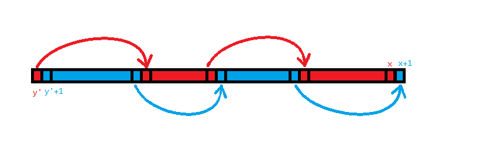
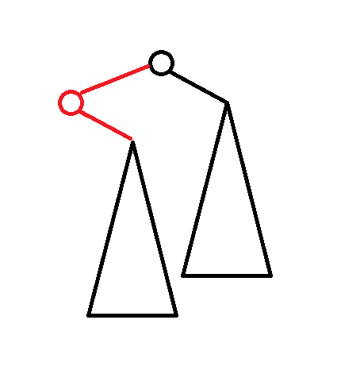

# 2024 5 月杂题

## P4690 [Ynoi2016] 镜中的昆虫

[传送门](https://www.luogu.com.cn/problem/P4690)

> 题意

- 初始给定一个长度为 $n$ 的序列 $a_i$，有两个操作。
- 操作 $1$ 是区间涂色。
- 操作 $2$ 是查询区间内有多少种不同颜色。
- $1\le n\le 10^5$，颜色可以离散化。

> 题解

神秘 cdq 题。

这道题因为带修改所以很难直接用主席树（主席树修改过于困难了）或者扫描线（这个贡献很难拆啊）做，那么考虑一个简单的转化，容易发现区间数颜色相当于区间内每种颜色若出现多次只计算一次。那不妨认为计算的是**某种颜色在区间内第一次出现**。这就非常有意思了，考虑“ $[l,r]$ 内第一次出现”应该如何维护。由于是在区间内第一次出现，那么它在整个序列上上一次出现的位置（设 $a_i$ 上一次出现位置为 $pre_i$，若没有则设为 $0$）必定在 $[0,l)$ 中。那么这个问题就转化成了一个二维数点。具体来说，设 $a_i$ 在某坐标系上对应的点为 $(i,pre_i)$，那么对 $[l,r]$ 的询问就是查询 $[l,r]\times [0,l)$ 的这个矩形中有多少个点。这个可以把询问离线下来跑扫描线。虽然又绕回扫描线了，但是容易发现现在点的贡献变独立了。

然后考虑单点修改应该怎么做。容易发现单点修改颜色只会改变至多两个 $pre_i$，即删两个点（相当于加两个权值为 $-1$ 的点）加两个点，具体改了哪两个 $pre$ 可以对每种眼色开个 `set` 维护。由于点的贡献是独立的所以这个问题就相当于加了一个时间维度，变成了空间里的点。那么用 cdq 分治就可以维护了。

然后考虑区间修改，这个区间颜色覆盖容易想到 odt。考虑 odt 的维护过程，容易发现**每个区间除了第一个数以外，中间的 $pre_i$ 都不会变**，并且修改到的每一个区间至多只会额外影响后面的一个 $pre_i$，而 odt 修改的区间总数量是 $O(n+m)$ 的，那么 $pre_i$ 的变化总次数就是 $O(n+m)$ 的，然后就能做了。

复杂度 $O((n+m)\log^2(n+m))$，过的还是比较轻松的。

/// details | 参考代码
    open: False
    type: success

```cpp
#include<bits/stdc++.h>
#define mem(a,b) memset(a,b,sizeof(a))
#define forup(i,s,e) for(int i=(s);i<=(e);i++)
#define fordown(i,s,e) for(int i=(s);i>=(e);i--)
#ifdef DEBUG
#define msg(args...) fprintf(stderr,args)
#else
#define msg(...) void()
#endif
using namespace std;
using pii=pair<int,int>;
#define fi first
#define se second
#define mkp make_pair
#define gc getchar()
inline int read(){
    int x=0,f=1;char c;
    while(!isdigit(c=gc)) if(c=='-') f=-1;
    while(isdigit(c)){x=(x<<3)+(x<<1)+(c^48);c=gc;}
    return x*f;
}
#undef gc
const int N=1e5+5,inf=0x3f3f3f3f;
int n,m,a[N],ans[N],pre[N];
struct Node{
	int x,y,pos,val;
}modi[N],q[N*8];
int cntq;
map<pii,int> odt;
set<int> seq[N<<1];
using mit=map<pii,int>::iterator;
vector<int> lsh;
mit split(int x){
	if(x>n) return odt.end();
	mit it=odt.upper_bound(mkp(x,0));
	if(it!=odt.end()&&it->fi.fi==x) return it;
	--it;
	int l=it->fi.fi,r=it->fi.se,c=it->se;
	odt.erase(it);
	seq[c].insert(x-1);seq[c].insert(x);
	odt.insert(mkp(mkp(l,x-1),c));
	return odt.insert(mkp(mkp(x,r),c)).fi;
}
void inita(){
	int lst=0;
	forup(i,1,n){
		a[i]=lower_bound(lsh.begin(),lsh.end(),a[i])-lsh.begin();
		if(i!=1&&a[i]!=a[i-1]){
			odt.insert(mkp(mkp(lst+1,i-1),a[i-1]));
			seq[a[i-1]].insert(lst+1);seq[a[i-1]].insert(i-1);
			lst=i-1;
		}
		pre[i]=(a[i]==a[i-1]?i-1:(seq[a[i]].size()?*prev(seq[a[i]].end()):0));
		q[++cntq]=Node{i,pre[i],0,1};
	}
	odt.insert(mkp(mkp(lst+1,n),a[n]));
	seq[a[n]].insert(lst+1);seq[a[n]].insert(n);
}
void initp(){
	forup(i,1,m){
		if(modi[i].pos==0) continue;
		modi[i].val=lower_bound(lsh.begin(),lsh.end(),modi[i].val)-lsh.begin();
		int l=modi[i].x,r=modi[i].y,vv=modi[i].val;
		mit ed=split(r+1),st=split(l);
		for(mit it=st;it!=ed;odt.erase(prev(++it))){
			int x=it->fi.fi;
			q[++cntq]=Node{x,pre[x],i,-1};
			if(x==l){
				pre[x]=(seq[vv].lower_bound(x)==seq[vv].begin()?0:*prev(seq[vv].lower_bound(x)));
			}else{
				pre[x]=x-1;
			}
			q[++cntq]=Node{x,pre[x],i,1};
			if(seq[it->se].upper_bound(r)!=seq[it->se].end()){
				int nxt=*seq[it->se].upper_bound(r);
				if(pre[nxt]>=l){
					q[++cntq]=Node{nxt,pre[nxt],i,-1};
					pre[nxt]=(seq[it->se].lower_bound(l)==seq[it->se].begin()?0:*prev(seq[it->se].lower_bound(l)));
					q[++cntq]=Node{nxt,pre[nxt],i,1};
				}
			}
			seq[it->se].erase(it->fi.fi);
			seq[it->se].erase(it->fi.se);
		}
		if(seq[vv].upper_bound(r)!=seq[vv].end()){
			int nxt=*seq[vv].upper_bound(r);
			q[++cntq]=Node{nxt,pre[nxt],i,-1};
			pre[nxt]=r;
			q[++cntq]=Node{nxt,pre[nxt],i,1};
		}
		odt.insert(mkp(mkp(l,r),vv));
		seq[vv].insert(l);seq[vv].insert(r);
	}
}
struct BIT{
	int c[N];
	void upd(int x,int k){++x;for(;x<=n+1;x+=x&-x)c[x]+=k;}
	int sum(int x){++x;int res=0;for(;x>0;x-=x&-x)res+=c[x];return res;}
}bit;
void cdq(int l,int r){
	if(l>=r) return;
	int mid=(l+r)>>1;
	cdq(l,mid);cdq(mid+1,r);
	int L=l;
	forup(i,mid+1,r){
		if(q[i].val!=0) continue;
		for(;L<=mid&&q[L].y<q[i].y;++L){
			if(q[L].val==0) continue;
			bit.upd(q[L].x,q[L].val);
		}
		ans[q[i].pos]+=(bit.sum(q[i].x)-bit.sum(q[i].y-1));
	}
	forup(i,l,L-1){
		if(q[i].val==0) continue;
		bit.upd(q[i].x,-q[i].val);
	}
	inplace_merge(q+l,q+mid+1,q+r+1,[&](Node a,Node b){
		if(a.y!=b.y) return a.y<b.y;
		return a.val!=0&&b.val==0;
	});
}
signed main(){
	n=read();m=read();
	forup(i,1,n){
		a[i]=read();
		lsh.push_back(a[i]);
	}
	forup(i,1,m){
		int op=read();
		if(op==1){
			int l=read(),r=read(),x=read();
			lsh.push_back(x);
			modi[i]=Node{l,r,i,x};
		}else{
			int l=read(),r=read();
			q[++cntq]=Node{r,l,i,0};
		}
	}
	sort(lsh.begin(),lsh.end());
	lsh.erase(unique(lsh.begin(),lsh.end()),lsh.end());
	inita();
	initp();
	sort(q+1,q+cntq+1,[&](Node a,Node b){
		if(a.pos!=b.pos) return a.pos<b.pos;
		return a.val!=0&&b.val==0;
	});
	cdq(1,cntq);
	forup(i,1,m){
		if(modi[i].pos==0){
			printf("%d\n",ans[i]);
		}
	}
}
```

///

## P6105 [Ynoi2010] y-fast trie

[传送门](https://www.luogu.com.cn/problem/P6105)

神秘题目。

> 题意

- 维护一个集合，有 $n$ 次操作。操作分两种，分别是插入一个 $x$ 和删除一个 $x$，保证集合内不会同时存在两个相同的数。
- 给定 $C$，每次操作后输出 $\max_{x,y\in S}^{x\ne y}\begin{Bmatrix}(x+y)\bmod C\end{Bmatrix}$
- $1\le n\le 5\times 10^5,0\le x\le 1073741823,1\le C\le 1073741823$

> 题解

首先容易发现插入是简单的，考虑对 $C$ 取模后再加入，那么答案只有 $x+y$ 或 $x+y-C$ 两种。后者显然 $x,y$ 取最大值和次大值即可。前者可以对于新加入的 $x$ 找到满足 $x+y<C$ 的最大的 $y$，这个可以随便用一些前驱后继数据结构。

考虑为什么删除是困难的，令 $f(x)$ 为满足 $x+y<C$ 的最大的 $y$。容易发现若删除 $x$，那么可能有多个 $f(x')=x$，这些全都要修改，于是复杂度就炸了。

然后正常思路是考虑用某些数据结构优化（事实上我最开始也是这样想的）。

但是这道题考虑寻找性质。容易发现若 $x+y$ 是方案一的最优解，那么 $f(x)=y,f(y)=x$（不然必定不是最优）。所以只维护双向的 $f$ 关系。这样每次加入删除都只需要修改一次了。

复杂度 $O(n\log n)$，注意 $x\bmod C$ 可能会重复，实现时记得用 `multiset`。

/// details | 参考代码
	open: False
	type: success

```cpp
#include<bits/stdc++.h>
#define mem(a,b) memset(a,b,sizeof(a))
#define forup(i,s,e) for(int i=(s);i<=(e);i++)
#define fordown(i,s,e) for(int i=(s);i>=(e);i--)
#ifdef DEBUG
#define msg(args...) fprintf(stderr,args)
#else
#define msg(...) void()
#endif
using namespace std;
#define gc getchar()
inline int read(){
    int x=0,f=1;char c;
    while(!isdigit(c=gc)) if(c=='-') f=-1;
    while(isdigit(c)){x=(x<<3)+(x<<1)+(c^48);c=gc;}
    return x*f;
}
#undef gc
const int N=5e5+5,inf=0x3f3f3f3f;
int n,mod,lans;
multiset<int> mx,ss;
map<int,int> bst;
int find(int x){
	set<int>::iterator it=ss.lower_bound(mod-x);
	if(it==ss.begin()) return -1;
	if(*prev(it)==x){
		--it;
		if(it==ss.begin()) return -1;
	}
	return *prev(it);
}
signed main(){
	n=read();mod=read();
	forup(i,1,n){
		int op=read(),x=read();
		x^=lans;
		x%=mod;
		if(op==1){
			int y=find(x);
			ss.insert(x);
			if(y!=-1&&find(y)==x){
				if(bst.count(y)){
					int t=bst[y];
					mx.erase(mx.find(y+t));
					bst.erase(t);bst.erase(y);
				}
				bst[y]=x;bst[x]=y;
				mx.insert(x+y);
			}
		}else{
			if(bst.count(x)){
				int y=bst[x];
				bst.erase(x);bst.erase(y);
				mx.erase(mx.find(x+y));
				ss.erase(ss.find(x));
				int t=find(y);
				if(t!=-1&&find(t)==y){
					bst[y]=t;bst[t]=y;
					mx.insert(t+y);
				}
			}else{
				ss.erase(ss.find(x));
			}
		}
		if(ss.size()<2){
			puts("EE");
			lans=0;
		}else{
			lans=(*prev(ss.end())+*prev(prev(ss.end())))%mod;
			if(mx.size()) lans=max(lans,*prev(mx.end()));
			printf("%d\n",lans);
		}
	}
	
}
```

///

## P3648 [APIO2014] 序列分割

> 题意

- 有一个长度为 $n$ 的非负整数序列 $a_i$，你要切 $k$ 刀把它分成 $k+1$ 份。
- 每一刀能获得这刀切出的两段分别的总和相乘的权值，问最大能获得多少权值。
- $2\le n\le 10^5,1\le k\le \min(n-1,200),0\le a_i\le 10^4$

> 题解

简单题。突然发现做题计划里面有这道题，于是就写了。

这个贡献非常不好算啊，考虑转化。容易发现最后答案就是 $\sum_{1\le i<j\le n}^{b_i\ne b_j}a_i\times a_j$，其中 $b_i$ 是 $i$ 最终所在的块（就是说每一对不在同一块的都会乘起来作贡献）。那么用总的减去多算的，答案就是 $\frac{S^2-\sum_{i=1}^{k+1}c_i^2}{2}$，其中 $S$ 是 $a_i$ 的总和，$c_i$ 是某一块中 $a_j$ 的总和。

其它都是定值，考虑求 $\sum_{i=1}^{k+1}c_i^2$ 的最小值，下文称这个为“代价”。

容易想到一个简单 DP，设 $dp_{l,i}$ 表示将 $[1,i]$ 切成 $l$ 块的最小代价。令 $s_i=\sum_{j=1}^ia_i$ 易得转移：

$$
\begin{aligned}
dp_{l,i}&=\min_{j=l-1}^{i-1}\begin{Bmatrix}dp_{i-1,j}+(s_i-s_j)^2\end{Bmatrix}\\\\
&=\min_{j=l-1}^{i-1}\begin{Bmatrix}dp_{i-1,j}+s_i^2+s_j^2-2s_is_j\end{Bmatrix}\\\\
&=\min_{j=l-1}^{i-1}\begin{Bmatrix}dp_{i-1,j}+s_j^2-2s_is_j\end{Bmatrix}+s_i^2
\end{aligned}
$$

长得就很斜率优化，然后就做完了。

另外由于 $s_i$ 是单调递增的，可以用单调队列 $O(n)$ 维护。这样复杂度就是 $O(nk)$。注意斜优的斜率比较部分可能会爆 `long long`。

/// details | 参考代码
	open: False
	type: success

```cpp
#include<bits/stdc++.h>
#define mem(a,b) memset(a,b,sizeof(a))
#define forup(i,s,e) for(int i=(s);i<=(e);i++)
#define fordown(i,s,e) for(int i=(s);i>=(e);i--)
#ifdef DEBUG
#define msg(args...) fprintf(stderr,args)
#else
#define msg(...) void()
#endif
using namespace std;
using i64=long long;
using i128=__int128;
#define gc getchar()
inline int read(){
    int x=0,f=1;char c;
    while(!isdigit(c=gc)) if(c=='-') f=-1;
    while(isdigit(c)){x=(x<<3)+(x<<1)+(c^48);c=gc;}
    return x*f;
}
#undef gc
const int N=1e5+5,inf=0x3f3f3f3f;
struct Point{
	i64 x,y,pos;
	Point operator -(const Point &r){
		return Point{x-r.x,y-r.y,0};
	}
};
i128 cross(Point a,Point b){
	return (i128)a.x*b.y-(i128)a.y*b.x;
}
int n,k;
i64 dp[205][N],pre[205][N],ans,s[N];
deque<Point> conv;
void print(int l,int i){
	if(l==0) return;
	print(l-1,pre[l][i]);
	if(i!=n) printf("%d ",i);
}
signed main(){
	n=read();k=read();
	forup(i,1,n){
		s[i]=read();
		s[i]+=s[i-1];
		dp[1][i]=s[i]*s[i];
		msg("%lld ",dp[1][i]);
	}
	msg("|\n");
	ans=s[n]*s[n];
	forup(l,2,k+1){
		while(conv.size()) conv.pop_back();
		conv.push_back(Point{2*s[l-1],s[l-1]*s[l-1]+dp[l-1][l-1],l-1});
		forup(i,l,n){
			while(conv.size()>1&&cross(conv[1]-conv[0],Point{1,s[i],0})>=0) conv.pop_front();
			Point nw=Point{2*s[i],s[i]*s[i]+dp[l-1][i],i};
			dp[l][i]=conv.front().y-conv.front().x*s[i]+s[i]*s[i];
			pre[l][i]=conv.front().pos;
			while(conv.size()>1&&cross(conv[conv.size()-1]-conv[conv.size()-2],nw-conv.back())<=0) conv.pop_back();
			conv.push_back(nw);
			msg("%lld ",dp[l][i]);
		}
		msg("|\n");
	}
	ans-=dp[k+1][n];
	printf("%lld\n",ans>>1);
	print(k+1,n);
}
```

///

## CF1616G Just Add an Edge

[传送门](https://www.luogu.com.cn/problem/CF1616G)

> 题意

- 有一个 $N$ 个点 $M$ 条边的 DAG。每条边 $u\to v$ 均有 $v>u$。
- 你要添加一条边 $x\to y(x>y)$，问有多少种方法可以使这张图具有哈密顿路。
- $1\le N\le 150000,1\le M\le \min(\frac{n(n-1)}{2},150000)$

> 题解

考虑怎么样这张图才能有哈密顿路。

首先一个 DAG 什么时候有哈密顿回路，那由于题设的性质，它必然存在一条 $1\to 2\to 3\to \dots \to N$ 的链。此时加边方案数就是 $\binom{n}{2}$。

特判这种情况后，考虑一般情况。容易发现除了加的这条边 $x\to y$，哈密顿回路的其它地方必定是两条**结点编号单调递增**，**点集不相交**的链。考虑 $1\rightsquigarrow x$ 叫“第一条链”，$y\rightsquigarrow n$ 叫“第二条链”。容易发现 $[1,y-1]$ 必定由第一条链填满，$[x+1,n]$ 必定由第二条链填满。

那么最终的哈密顿回路必然形如这样：

$$
(1\to 2\to \dots \to y-1)\rightsquigarrow x\to y \rightsquigarrow (x+1\to x+2\to \dots\to n)
$$

其中两个括起来的部分表示每次 $+1$ 的链，$y-1\rightsquigarrow x$ 和 $y\rightsquigarrow x+1$ 是两条交为 $\varnothing$，并为 $[x,y]$ 的链。

是否存在 $(1\to 2\to \dots \to y-1)$ 和 $(x+1\to x+2\to \dots\to n)$ 的链是好判断的，所以只考虑满足条件的 $y-1\rightsquigarrow x$ 和 $y\rightsquigarrow x+1$ 是否存在即可。

容易发现这个条件形如存在一对 $(y-1,y)\rightsquigarrow (x,x+1)$ 的链，且两条链并起来恰好是 $[y-1,x+1]$。考虑枚举 $y'=y-1$ 然后计算有多少个 $x$ 满足 $(y',y'+1)\rightsquigarrow (x,x+1)$ 的条件。

由于两条链都只能从小到大延伸，想要覆盖一段连续的区间，那么两条链必定形如这样：



那么考虑枚举对颜色交界点 DP，设 $f_{i,0/1}$ 表示从 $(y',y'+1)$ 开始，能否走到 $(i,i+1)$（即第二维为 $0$ 表示左红右蓝）或 $(i+1,i)$（第二维为 $1$ 表示左蓝右红）。

具体转移考虑若 $f_{i,t}=1$，则枚举 $i$ 的出边 $i\to j$，若存在 $(i+1\to i+2\to\dots \to j-1)$，则 $f_{j-1,\lnot t}\gets 1$。这个 $(i+1\to \dots \to j-1)$ 的条件可以考虑存储 $r_i$ 表示 $i$ 能每次加一走到的最大点，那么那个条件就转化成了 $j-1\in [i+1,r_{i+1}]$。

这样就能 $O(nm)$ 的做了。但是这个不好优化啊（而且就算能除以 $\omega$ 也过不了），考虑有没有什么更强力的方法。

容易发现，对于一个 $p\nrightarrow p+1$，$i<p$ 的 $f_i$ 是无法转移到 $j-1>p$ 的 $f_{j-1}$ 的。因为对于 $i<p$，必有 $r_{i+1}\le p$，又因为 $j-1>p$，这显然与 $r_{i+1}> j-1$ 矛盾。

由于需要存在 $(1\to \dots \to y-1)$ 的路径，所以 $1\le y\le r_1+1$，那么对于 $y'=y-1$，必有 $0\le y' \le r_1$。同理由于需要 $(x+1\to \dots \to n)$，所以 $lst-1\le x\le n$，其中 $lst$ 是最小的 $i$ 满足 $r_i=n$。

> 此处暂且断一下，注意到 $f_{0}$ 没有定义，但这里能取到 $0$ 是因为哈密顿路的起点不一定是 $1$，可能根本不存在 $(1\to \dots \to y-1)$ 的路径。不妨建一个虚点，向所有点连边，这样起点就能固定是 $0$ 了。同理建一个虚点 $n+1$，让所有点向它连边，这样终点也能固定了。

回到刚才的思路，由于 $y'\le p$，而 $x>p$（除非 $r_1=n$，但这个在第一步就特判了），所以**对于任何 $y$，DP 的转移必定要经过 $f_{p}$ 这个点**。这就非常强了。

考虑对于 $i<p$，令 $f_{i,0/1}$ 表示能否从 $(i,i+1)$ 走到 $(p,p+1)/(p+1,p)$，对于 $i>p$，令 $f_{i,0/1}$ 表示能否从 $(p,p+1)$ 走到 $(i,i+1)/(i+1,i)$（容易发现这两种定义对于 $i=p$ 是等价的）。

然后路径就转化成了 $(y',y'+1)\rightsquigarrow (p,p+1)/(p+1,p)\rightsquigarrow (x,x+1)$。容易发现这可以枚举 $y'\in[0,p]$ 和 $x\in[lst-1,n]$ 来做，若 $f_{y',0}\land f_{x,0}$ 或 $f_{y',1}\land f_{x,1}$，则说明存在一条那样的路径。

而且这个非常强力，考虑一个简单的容斥，计算满足 $f_{y',0}\land f_{x,0}$ 的 $(y',x)$ 二元组数量加上满足 $f_{y',1}\land f_{x,1}$ 的 $(y',x)$ 的数量再减去两个都满足的即可。具体计算考虑乘法原理。

注意到一个 bug，根据枚举的方式，假如 $p=lst-1$ 就会多算一次 $y'=x=p$ 的情况，特判 $r_{r_{1}+1}=n$ 的情况减掉即可。

复杂度 $O(n)$。注意实际实现中加了虚点后的边界情况会发生改变。

/// details | 参考代码
	open: False
	type: success

```cpp
#include<bits/stdc++.h>
#define mem(a,b) memset(a,b,sizeof(a))
#define forup(i,s,e) for(int i=(s);i<=(e);i++)
#define fordown(i,s,e) for(int i=(s);i>=(e);i--)
#ifdef DEBUG
#define msg(args...) fprintf(stderr,args)
#else
#define msg(...) void()
#endif
using namespace std;
using i64=long long;
#define gc getchar()
inline int read(){
    int x=0,f=1;char c;
    while(!isdigit(c=gc)) if(c=='-') f=-1;
    while(isdigit(c)){x=(x<<3)+(x<<1)+(c^48);c=gc;}
    return x*f;
}
#undef gc
const int N=150005,inf=0x3f3f3f3f;
int n,m,a[N],r[N];
int dp[N][2];
vector<int> e[N];
void solve(){
	n=read();m=read();
	forup(i,0,n+1){
		e[i].clear();
		r[i]=i;a[i]=0;
		dp[i][0]=dp[i][1]=0;
		if(i>1) e[0].push_back(i);
		if(i<n) e[i].push_back(n+1);
	}
	a[n]=a[0]=1;
	forup(i,1,m){
		int u=read(),v=read();
		if(v==u+1) a[u]=1;
		else e[u].push_back(v);
	}
	fordown(i,n+1,0){
		if(a[i]) r[i]=r[i+1];
	}
	if(r[0]==n+1){
		printf("%lld\n",1ll*n*(n-1)/2);
		return;
	}
	dp[r[0]][0]=1;
	forup(i,r[0],n+1){
		for(auto j:e[i]){
			if(j-1<=r[i+1]){
				dp[j-1][0]|=dp[i][1];
				dp[j-1][1]|=dp[i][0];
			}
		}
	}
	fordown(i,r[0]-1,0){
		for(auto j:e[i]){
			if(j-1<=r[i+1]){
				dp[i][0]|=dp[j-1][1];
				dp[i][1]|=dp[j-1][0];
			}
		}
	}
	int cx0=0,cx1=0,cy0=0,cy1=0,cx01=0,cy01=0;
	forup(i,0,r[0]){
		cy0+=dp[i][0];
		cy1+=dp[i][1];
		cy01+=dp[i][0]&&dp[i][1];
	}
	int lst=n+1;
	while(r[lst]==n+1) --lst;
	forup(i,lst,n){
		cx0+=dp[i][0];
		cx1+=dp[i][1];
		cx01+=dp[i][0]&&dp[i][1];
	}
	i64 ans=1ll*cx0*cy0+1ll*cx1*cy1-1ll*cx01*cy01;
	if(r[r[0]+1]==n+1) --ans;
	printf("%lld\n",ans);
}
signed main(){
	int t=read();
	while(t--){
		solve();
	}
}
```

///

## [AGC001E] BBQ Hard

[传送门](https://www.luogu.com.cn/problem/AT_agc001_e)

> 题意

- 给定 $N$ 个二元组 $(a_i,b_i)$。
- 求 $\sum_{i=1}^{n-1}\sum_{j=i+1}^{n}\binom{a_i+b_i+a_j+b_j}{a_i+a_j}$。
- $2\le N \le 2\times 10^5,1\le a_i,b_i\le 2000$

> 题解

神秘题目。

容易发现 $\binom{a_i+b_i+a_j+b_j}{a_i+a_j}$ 等于从 $(-a_i,-b_i)$ 只能往右上走走到 $(a_j,b_j)$ 的路径数（经典结论）。

由于值域很小，那么容易想到一个和值域有关的 DP。具体来说，设 $f_{i,j}$（$i,j$ 均能取负数）表示从所有起点 $(-a_i,-b_i)$ 走到 $(i,j)$ 的路径条数总和。转移就考虑从下面和左边走过来，是简单的。

然后统计每个 $(a_j,b_j)$ 是多少种路径的末尾即可，但是还有两个问题：

1. 会算到 $(-a_i,-b_i)\to (a_i,b_i)$ 的情况，这个一共只有 $N$ 种，直接减掉即可。
1. 会算到 $i>j$ 的情况（其实就是每个情况会算两遍），除以二即可。

复杂度 $O(V^2+N)$。

/// details | 参考代码
	open: False
	type: success

```cpp
#include<bits/stdc++.h>
#define mem(a,b) memset(a,b,sizeof(a))
#define forup(i,s,e) for(int i=(s);i<=(e);i++)
#define fordown(i,s,e) for(int i=(s);i>=(e);i--)
#ifdef DEBUG
#define msg(args...) fprintf(stderr,args)
#else
#define msg(...) void()
#endif
using namespace std;
#define gc getchar()
inline int read(){
    int x=0,f=1;char c;
    while(!isdigit(c=gc)) if(c=='-') f=-1;
    while(isdigit(c)){x=(x<<3)+(x<<1)+(c^48);c=gc;}
    return x*f;
}
#undef gc
const int N=2e5+5,V=2005,mod=1e9+7;
int n,a[N],b[N],dp[V<<1][V<<1],ans,maxa,maxb;
int fact[V<<2],finv[V<<2];
int ksm(int a,int b){
	int c=1;
	while(b){
		if(b&1) c=1ll*a*c%mod;
		a=1ll*a*a%mod;
		b>>=1;
	}
	return c;
}
int binom(int n,int m){
	if(n<m) return 0;
	return 1ll*fact[n]*finv[m]%mod*finv[n-m]%mod;
}
signed main(){
	n=read();
	forup(i,1,n){
		a[i]=read();b[i]=read();
		++dp[V-a[i]][V-b[i]];
		maxa=max(maxa,a[i]);
		maxb=max(maxb,b[i]);
	}
	int mm=max(maxa,maxb)*4;
	fact[0]=1;
	forup(i,1,mm) fact[i]=1ll*fact[i-1]*i%mod;
	finv[mm]=ksm(fact[mm],mod-2);
	fordown(i,mm-1,0) finv[i]=1ll*finv[i+1]*(i+1)%mod;
	forup(i,-maxa,maxa){
		forup(j,-maxb,maxb){
			(dp[i+V][j+V]+=dp[i-1+V][j+V])%=mod;
			(dp[i+V][j+V]+=dp[i+V][j-1+V])%=mod;
		}
	}
	forup(i,1,n){
		(ans+=dp[a[i]+V][b[i]+V])%=mod;
		(ans+=mod-binom(a[i]*2+b[i]*2,a[i]*2))%=mod;
	}
	printf("%lld\n",1ll*ans*((mod+1)/2)%mod);
}
```

///

## 模拟赛神秘题目

来源不知道，漏了就漏了，反正没人看，而且反正我又没签保密协议。

> 题意

- 给定两个长为 $n$ 的序列 $a_i,c_i$，其中 $c_i=\pm1$ 和正整数 $m$。
- 求有多少个正整数 $x$ 满足存在整数 $\lambda$，使得 $\sum_{i=1}^nc_ix^{a_i}=\lambda \sum_{i=0}^{m-1}x_i$。
- $1\le n\le 10^5,1\le m\le 10^9,0\le a_i\le 10^9$，其实带多测，但是无所谓。

> 题解

首先根据等比数列求和公式，$\sum_{i=0}^{m-1}x_i=\frac{x^m-1}{x-1}$。

则有：

$$
\sum_{i=1}^nc_ix^{a_i}=\lambda \frac{x^m-1}{x-1}
$$

于是：

$$
(x-1)\sum_{i=1}^nc_ix^{a_i}=\lambda (x^m-1)
$$

容易发现这个东西等价于：

$$
(x-1)\sum_{i=1}^nc_ix^{a_i}\equiv 0\pmod{x^m-1}
$$

容易发现（其实是个经典结论），$x^n\equiv x^{n-m}\pmod{x^m-1}$，因为 $x^{n-m}+x^{n-m}(x^m-1)=x^n$。又可以推出 $x^m\equiv x^{n\bmod m}\pmod{x^m-1}$。

那么考虑把所有 $a_i$ 全部模以 $m$ 然后合并同类项，这样左边就变成了一个 $m$ 项式：

$$
\sum_{i=0}^{m-1}b_ix^i\equiv 0\pmod{x^m-1}
$$

注意把 $x-1$ 乘进去。

容易发现，如果 $b_i$ 全都等于 $0$，那么有无数个解，这个直接特判。

然后考虑不等于 $0$ 的情况，枚举答案 $x_0$，若 $|b_i|\ge x_0$，那么可以把每个 $x_0\times x_0^{i}$ 变成 $x_0^{(i+1)\bmod m}$，进行这样的转化后，对于所有 $b_i$，均有 $|b_i|< x_0$，容易发现在这种情况下，上面的那个东西成立当且仅当所有 $b_i$ 全部等于 $x_0-1$ 或全部等于 $0$ 或全等于 $-x_0+1$。

考虑怎么维护。注意到 $\max\begin{Bmatrix}b_i\end{Bmatrix}\le n$，根据刚刚的结论，显然 $x_0\le \max\begin{Bmatrix}b_i\end{Bmatrix}$，是 $O(n)$ 的。又容易发现 $\sum |b_i|\le n$，而每次操作都会让 $\sum |b_i|$ 减小 $x_0-1$，那么只要每次能 $O(p)$ 地找到下一个需要修改的位置，复杂度就是 $O(n\log n\times p)$ 的（调和级数），可以考虑 `map` 维护，那就是双 $\log$ 的。

/// details | 参考代码
	open: False
	type: success

```cpp
#include<bits/stdc++.h>
#define mem(a,b) memset(a,b,sizeof(a))
#define forup(i,s,e) for(int i=(s);i<=(e);i++)
#define fordown(i,s,e) for(int i=(s);i>=(e);i--)
#ifdef DEBUG
#define msg(args...) fprintf(stderr,args)
#else
#define msg(...) void()
#endif
using namespace std;
using i64=long long;
using pii=pair<int,int>;
#define fi first
#define se second
#define mkp make_pair
#define gc getchar()
inline int read(){
    int x=0,f=1;char c;
    while(!isdigit(c=gc)) if(c=='-') f=-1;
    while(isdigit(c)){x=(x<<3)+(x<<1)+(c^48);c=gc;}
    return x*f;
}
#undef gc
const int N=1e5+5,inf=0x3f3f3f3f;
int n,m,ans;
map<int,int> cnt,seq;
vector<int> vec[N<<1];
map<int,int> a;
int num[N<<1];
vector<pii> modi;
void work(int i,int x){
	if(a[i]>=x||a[i]<=-x){
		int p=a[i]/x;
		--num[a[i]+N];
		a[i]-=p*x;
		++num[a[i]+N];
		if(a[i]==0) a.erase(i);
		modi.push_back(mkp(i,p));
		int j=(i+1)%m; 
		--num[a[j]+N];
		a[j]+=p;
		++num[a[j]+N];
		if(a[j]==0) a.erase(j);
		work(j,x);
	}
}
void rollback(int x){
	for(auto i:modi){
		num[a[i.fi]+N]--;
		a[i.fi]+=i.se*x;
		num[a[i.fi]+N]++;
		if(a[i.fi]==0) a.erase(i.fi);
		int j=(i.fi+1)%m;
		num[a[j]+N]--;
		a[j]-=i.se;
		num[a[j]+N]++;
		if(a[j]==0) a.erase(j);
	}
}
set<int> ind;
void solve(){
	n=read();m=read();
	ans=0;
	cnt.clear();seq.clear();
	ind.clear();
	i64 a1=0;
	forup(i,1,n){
		int c=read(),e=read();
		a1+=c;
		cnt[e%m]+=c;
	}
	if(a1%m==0) ans=1;
	for(auto i:cnt){
		seq[(i.fi+1)%m]+=i.se;
		seq[i.fi]-=i.se;
	}
	bool flag=true;
	for(auto i:seq){
		if(i.se!=0){
			flag=false;
			break;
		}
	}
	if(flag){
		puts("-1");
		return;
	}
	int maxa=0;a.clear();
	for(auto i:seq){
		a[i.fi]=i.se;
		maxa=max(maxa,abs(i.se));
	}
	forup(i,-maxa,maxa) vec[i+N].clear(),num[i+N]=0;
	for(auto i:a){
		vec[i.se+N].push_back(i.fi);
		++num[i.se+N];
		ind.insert(i.se);
	}
	num[N]+=m-a.size();
	forup(x,2,maxa){
		modi.clear();
		for(set<int>::iterator it=ind.begin();*it<=-x;++it){
			int i=*it;
			for(auto j:vec[i+N]){
				work(j,x);
			}
		}
		for(set<int>::iterator it=ind.lower_bound(x);it!=ind.end();++it){
			int i=*it;
			for(auto j:vec[i+N]){
				work(j,x);
			}
		}
		if(num[N+x-1]==m||num[N-x+1]==m||num[N]==m){
			++ans;
		}
		rollback(x);
	}
	printf("%d\n",ans);
}
signed main(){
	int t=read();
	while(t--){
		solve();
	}
}
```

///

## [ARC176B] Simple Math 4

当代经典阳谋：给你一道小于蓝色的题，如果你犹豫了超过 30s 就用开玩笑的语气让你做。你不做就是蠢，做了无论过了还是没过都会污染你的提交记录。

我选择了污染提交记录。

> 题意

- 给定 $N,M,K$，求 求 $2^N \bmod (2^M-2^K)$ 的个位数。
- $1\le N,M,K\le 10^{18},K<M$，带多测。

> 题解

amns，傻逼题硬控我 20min。

考虑当 $N<M$，$2^N \bmod (2^M-2^K)=2^N$，这个可以用小学生经典结论搞定（个位数的循环节为 $4$）。

当 $N>M$，容易发现 $2^N\equiv 2^{K+(N-K)\bmod (M-K)}$，后者的指数小于 $M$，于是做完了。

具体证明考虑 $2^{K+N-M}+(2^M-2^K)\times 2^{N-M}=2^{N}$，然后不停地重复这个过程直到 $N'<M$ 为止。

复杂度 $O(1)\times T$。

/// details | 参考代码
	open: False
	type: success

```cpp
#include<bits/stdc++.h>
#define mem(a,b) memset(a,b,sizeof(a))
#define forup(i,s,e) for(i64 i=(s);i<=(e);i++)
#define fordown(i,s,e) for(i64 i=(s);i>=(e);i--)
#ifdef DEBUG
#define msg(args...) fprintf(stderr,args)
#else
#define msg(...) void()
#endif
using namespace std;
using i64=long long;
#define gc getchar()
inline i64 read(){
    i64 x=0,f=1;char c;
    while(!isdigit(c=gc)) if(c=='-') f=-1;
    while(isdigit(c)){x=(x<<3)+(x<<1)+(c^48);c=gc;}
    return x*f;
}
#undef gc
i64 n,m,k;
i64 a[4]={2,4,8,6};
void solve(){
	n=read();m=read();k=read();
	if(n>=m) n=k+(n-k)%(m-k);
	if(k==n&&m==n+1){
		puts("0");
	}else{
		printf("%lld\n",a[(n-1)%4]);
	}
}
signed main(){
	i64 t=read();
	while(t--){
		solve();
	}
}
```

///

## 模拟赛神秘题目 2

同上。

> 题意

- 称一个 $01$ 串为**单词**当且仅当其中没有连续的 $0$。称一个 $01$ 串集合为**词典**当且仅当其中的元素均为单词，且互相不为前缀。
- 设 $01$ 串对一个词典的的代价 $C(s)=F(k),F(k)=\sum_{j=1}^k(1+\left\lfloor\log_2 j\right\rfloor)$，其中 $k$ 是词典中满足 $s$ 是 $t$ 前缀的字符串 $t$ 的数量。设一个词典的代价是所有 $01$ 串的代价之和。
- 比如对于词典 $\begin{Bmatrix}0,10,110,111\end{Bmatrix}$，代价如下：

$$
\begin{aligned}
&C(\varnothing)+C(0)+C(1)+C(00)+C(01)+C(10)+C(11)+C(000)+C(001)+C(010)\\\\
&+C(011)+C(100)+C(101)+C(110)+C(111)+C(0000)+\dots\\\\
=&F(4)+F(1)+F(3)+F(0)+F(0)+F(1)+F(2)+F(0)+F(0)+F(0)\\\\
&+F(0)+F(0)+F(0)+F(1)+F(1)+F(0)+\dots\\\\
=&8+1+5+0+0+1+3+0+0\\\\
&+0+0+0+1+1+0+\dots\\\\
=&20
\end{aligned}
$$

其中 $\varnothing$ 代表空串。

- 给定若干个 $n$，求出大小为 $n$ 的词典的代价最小值。
- $1\le n\le 10^{15}$，有多测，$1\le t\le 5\times 10^4$。

> 题解

充分考验考试技巧。

首先是最简单的一步，就算连了网也能在忍不住看题解之前想到，转化成 Trie 上问题，那么容易想到题设条件就是没有连续的左儿子，并且没有任意两个字符串是子树关系。然后代价就是求每个点的子树中字符串的数量为 $k$，算 $F(k)$ 的总和最小是多少。设对于大小为 $n$ 的词典这个最小值为 $D(n)$

考虑在一棵二叉树里面插东西不好做，那么可以考虑每次用一个根结点把两棵子树合起来。转移如下：

$$
D(i)=\min_{j=1}^{i-1}\begin{Bmatrix}[j\ne 1]F(j)+D(j)+D(i-j)\end{Bmatrix}+F(i)
$$

其中 $j$ 是枚举左子树的大小。因为不能有连续的左儿子，所以考虑加个“拐”变成这样：



所以是 $F(j)+D(j)$，但是显然 $j=1$ 时不需要加这个拐。然后加上这个新的根结点的答案即可。

值得注意的是这个根结点是空结点，在 $i=1$ 时 $D(i)$ 会出现问题，需要特判。

然后由于 $F(j)$ 显然是一个下凸的函数，令 $g(i)=[j\ne 1]F(j)+D(j)$，转移的形式大致是 $g(j)$ 与 $D(j)$ 进行 $\min,+$ 卷积再加上一个下凸的函数 $F(i)$，那么 $D_i$ 也是下凸的，所以 $[j\ne 1]F(j)+D(j)+D(i-j)$ 也是下凸的，于是就有 $O(n\log n)$ 做法了，即每次三分（或二分斜率）求出那玩意的最小值。

然后下面就是考试技巧部分了。

因为有 $n\log n$ 做法，考虑求出 $10^6$ 以内的答案。因为是凸包所以观察斜率的变化。然后惊奇地发现斜率只会变化大约 $300$ 次，并且在 $1000$ 以内就变化了大约 $100$ 次。于是大胆猜测 $10^{15}$ 内不同的斜率是不多的（题解说是 $O(\log^2n)$ 的，但是没给出可靠证明）。那么考虑维护斜率的变化点。

考虑每次二分找下一个斜率变化点。

容易发现一个问题，算 $D(i)$ 时，$D(j)$ 和 $D(i-j)$ 可能还没有求出来，怎么办呢？

设当前求出了 $[1,r]$ 的 $D_i$ 值。首先可以发现一个显然的性质，对于最优转移点，$j\le \frac{i}{2}$，不然考虑交换 $j$ 和 $i-j$。所以考虑每次拓展两倍在 $(r,2r]$ 内找。

但这样只能保证 $D(j)$ 是确定的，$D(i-j)$ 怎么办？一个想法是假设 $(r,i-j]$ 内没有斜率变化点。这样 $D(i-j)$ 就是可以求的。

如果这样算出来 $D'(i)$ 前面有转折点那 $D(i)$ 前必定有转折点（考虑分讨，如果算对了那显然对了，如果算错了说明 $D(i-j)$ 前面必定有转折点，那 $D(i)$ 前面显然有转折点）。

如果 $D'(i)$ 前面没有转折点，那么必定算对了，如果算错了说明 $D(i-j)$ 前面有转折点。考虑反证法，假设 $D(i-j)$ 前面有转折点时算出来 $D'(i)$ 前面没有转折点，由于 $D'(i-j)$ 前面没有转折点，必然 $D(i-j)>D'(i-j)$，设 $D(i-j)-D'(i-j)=k$ ，显然有 $D(i)\le D'(i)+k$（因为必定**可以**从这个地方转移过去），此时容易发现 $D(i-j)\sim D(i)$ 的斜率小于等于 $[1,r]$ 最后一段的斜率，那么斜率就不单调递增了，所以不存在这种情况。

那么先对小的情况暴力，然后每次将 $r$ 拓展两倍二分下一个转折点即可，这一部分复杂度是 $O(\log ^3n\times P)$ 的，其中 $P$ 是转折点数量。计算得出转折点只有 $1833$ 个（算上 $1$），那么可以考虑打表下来做，复杂度 $O(\log P)\times T$（如果先预处理后做的话复杂度就是两者加起来）。

另外，答案上界是 $O(n\log^2 n)$ 的，具体构造考虑每次分成均等的两半，那么一共有 $\log$ 层，每一层多的 $F(i)$ 总和就是 $O(n\log n)$ 的。所以不会爆 `long long`。

/// details | 参考代码
	open: False
	type: success

```cpp
#include<bits/stdc++.h>
#define mem(a,b) memset(a,b,sizeof(a))
#define forup(i,s,e) for(i64 i=(s);i<=(e);i++)
#define fordown(i,s,e) for(i64 i=(s);i>=(e);i--)
#ifdef DEBUG
#define msg(args...) fprintf(stderr,args)
#else
#define msg(...) void()
#endif
using namespace std;
using i64=long long;
#define gc getchar()
inline i64 read(){
    i64 x=0,f=1;char c;
    while(!isdigit(c=gc)) if(c=='-') f=-1;
    while(isdigit(c)){x=(x<<3)+(x<<1)+(c^48);c=gc;}
    return x*f;
}
#undef gc
const i64 N=2000,inf=1e18;
i64 n;
i64 x[N],k[N],b[N],cntp;
i64 log2(i64 x){return 63^__builtin_clzll(x);}
i64 getval(i64 u){
	if(u==1) return 2;
	i64 t=upper_bound(x+1,x+cntp+1,u)-x-1;
	return k[t]*u+b[t];
}
i64 calcf(i64 u){
	i64 res=u;
	i64 w=log2(u),hb=1ll<<w;
	res+=w*(u-hb+1);--w;
	while(hb>1){
		res+=w*(hb>>1);
		hb>>=1;--w;
	}
	return res;
}
i64 Calc(i64 mm,i64 u){
	return getval(mm)+getval(u-mm)+(mm==1?0:calcf(mm));
}
i64 calcg(i64 u){
	i64 ll=1,rr=u/2,mm;
	while(ll<rr){
		mm=ll+(rr-ll)/2;
		if(Calc(mm+1,u)<=Calc(mm,u)) ll=mm+1;
		else rr=mm;
	}
	return Calc(ll,u)+calcf(u);
}
i64 M=1e15;
void init(){
	i64 r=923;
	while(r<M){
		i64 p=min(M,r*2),res=calcg(p);
		i64 kk=k[cntp],bb=b[cntp];
		if(res==kk*p+bb){
			r=p;
			continue;
		}
		i64 ll=r+1,rr=p,mm;
		while(ll<rr){
			mm=ll+(rr-ll)/2;
			if(calcg(mm)==kk*mm+bb) ll=mm+1;
			else rr=mm;
		}
		i64 g=calcg(ll);++cntp;
		x[cntp]=ll;k[cntp]=g-(kk*(ll-1)+bb);
		b[cntp]=g-ll*k[cntp];
		r=ll;
	}
//	freopen("TXT.out","w",stderr);//打表用
//	msg("x[N]={0,");
//	forup(i,1,cntp) msg("%lld,",x[i]);
//	msg("},\nk[N]={0,");
//	forup(i,1,cntp) msg("%lld,",k[i]);
//	msg("},\nb[N]={,0");
//	forup(i,1,cntp) msg("%lld,",b[i]);
//	msg("},\n");
//	msg("cntp=%lld\n",cntp);
//	freopen("con", "w", stderr);
}
void solve(){
	i64 n=read();
	printf("%lld\n",getval(n));
}
i64 g[N];
signed main(){
	g[1]=1;
	forup(i,2,1000){
		g[i]=inf;
		forup(j,1,i-1){
			g[i]=min(g[i],g[j]+g[i-j]+(j==1?0:calcf(j)));
		}
		g[i]+=calcf(i);
	}
	vector<i64> v1,v2;
	v1.push_back(1);v2.push_back(g[2]-g[1]);
	forup(i,2,999){
		if(g[i+1]-g[i]!=g[i]-g[i-1]){
			v1.push_back(i);v2.push_back(g[i+1]-g[i]);
		}
	}
	cntp=v1.size();
	forup(i,0,cntp-1){
		x[i+1]=v1[i];
	}
	forup(i,0,cntp-1){
		k[i+1]=v2[i];
	}
	forup(i,0,cntp-1){
		b[i+1]=g[v1[i]]-v2[i]*v1[i];
	}
	init();
	i64 t=read();
	while(t--){
		solve();
	}
}
```

///

## P2761 软件补丁问题

[传送门](https://www.luogu.com.cn/problem/P2761)

怎么网络流 24 题里面有网络流无关题啊。

> 题意

- 有一个 $N$ 位二进制数，最初里面全是 $1$，你要进行一些操作，每个操作有一定代价，问把它变成全 $0$ 的最小代价。
- 有 $m$ 种操作。每个操作形如 $(t,B1,B2,F1,F2)$，表示消耗 $t$ 的代价，在 $B1\And x=B1,B2\And x=0$ 的情况下，可以使 $x\gets (x\And\lnot F1)|F2$。其中 $\And$ 表示按位与，$|$ 表示按位或，$\lnot$ 表示按位取反。
- $1\le N\le 20,1\le m\le 100$，$t$ 的范围没给，但是不会爆 $64$ 位整数。

> 题解

简单题，状压后跑最短路即可，复杂度 $O(2^nm\log (2^nm))$，数据没卡。

/// details | 参考代码
	open: False
	type: success

```cpp
#include<bits/stdc++.h>
#define mem(a,b) memset(a,b,sizeof(a))
#define forup(i,s,e) for(int i=(s);i<=(e);i++)
#define fordown(i,s,e) for(int i=(s);i>=(e);i--)
#ifdef DEBUG
#define msg(args...) fprintf(stderr,args)
#else
#define msg(...) void()
#endif
using namespace std;
using i64=long long;
using pii=pair<i64,int>;
#define fi first
#define se second
#define mkp make_pair
#define gc getchar()
inline int read(){
    int x=0,f=1;char c;
    while(!isdigit(c=gc)) if(c=='-') f=-1;
    while(isdigit(c)){x=(x<<3)+(x<<1)+(c^48);c=gc;}
    return x*f;
}
#undef gc
const i64 N=105,inf=1e18;
int n,m,b1[N],b2[N],f1[N],f2[N],t[N];
i64 dis[1<<20];
char str[25];
signed main(){
	n=read();m=read();
	forup(i,1,m){
		t[i]=read();
		scanf(" %s",str);
		forup(j,0,n-1){
			if(str[j]=='+'){
				b1[i]|=(1<<j);
			}else if(str[j]=='-'){
				b2[i]|=(1<<j);
			}
		}
		scanf(" %s",str);
		forup(j,0,n-1){
			if(str[j]=='+'){
				f2[i]|=(1<<j);
			}else if(str[j]=='-'){
				f1[i]|=(1<<j);
			}
		}
		f1[i]=((1<<n)-1)^f1[i];
	}
	forup(i,0,(1<<n)-1) dis[i]=inf;
	dis[(1<<n)-1]=0;
	priority_queue<pii,vector<pii>,greater<pii> > q;
	q.push(mkp(0,(1<<n)-1));
	while(q.size()){
		int u=q.top().se;q.pop();
		forup(j,1,m){
			if((u&b1[j])==b1[j]&&(u&b2[j])==0){
				int v=(u&f1[j])|f2[j];
				if(dis[v]>dis[u]+t[j]){
					dis[v]=dis[u]+t[j];
					q.push(mkp(dis[v],v));
				}
			}
		}
	}
	if(dis[0]==inf){
		puts("0");
	}else{
		printf("%lld\n",dis[0]);
	}
}
```

///

## 模拟赛神秘题目3

同上。

> 题意

- 给定 $n,m$，问有多少长度为 $n$，值域为 $[1,m]$ 的整数序列 $a_i$ 满足 $\forall i\in[1,n),\max_{j=1}^i\begin{Bmatrix}a_j\end{Bmatrix}\ne \min_{j=i+1}^n\begin{Bmatrix}a_j\end{Bmatrix}$（称这样的序列为“好的”）。
- $1\le n\le 400,1\le m\le 10^8$，答案对 $p$ 取模，$10^9<p<2^{30}$，并且它是一个质数。

> 题解

赛时一直当数学题做，结果最后 30min 发现需要 DP，强行改代码最后没整出来。

首先容易想到好的序列是不好判断的。考虑用 $m^n-$ 不好的序列数量来计算，设 $dp_{i,k}$ 表示长度为 $i$ 的序列，值域为 $[1,k]$ 时，好的序列的数量。

具体计算考虑枚举最后一个 $\max_{j=1}^l\begin{Bmatrix}a_j\end{Bmatrix}= \min_{j=l+1}^i\begin{Bmatrix}a_j\end{Bmatrix}$ 的 $l$（称这样的 $l$ 为“坏的位置”）以及对应的 $\max/\min=v$，这样每个不好的序列就只会被算一遍了。那么对于 $[1,l]$ 部分，只需要保证 $\max_{j=1}^l\begin{Bmatrix}a_j\end{Bmatrix}=v$，具体序列数量就是 $v^l-(v-1)^l$。

对于后面的，要保证 $\min$ 恰好等于 $v$，又需要里面没有坏的位置，怎么办呢？因为没有坏的位置，所以考虑用某个（或某几个） $dp$ 的值来概括。如果只保证这一段的最小值大于等于 $v$，显然值是 $dp_{i-l,k-v+1}$（其中 $k$ 是当前值域）。显然的，可以再减去大于等于 $v+1$ 的。于是贡献就是 $dp_{i-l,k-v+1}-dp_{i-l,k-v}$。

综上，有以下转移：

$$
dp_{i,k}=k^i-\sum_{v=1}^k\sum_{l=1}^{i-1}\left(v^l-(v-1)^l\right)\times(dp_{i-l,k-v+1}-dp_{i-l,k-v})
$$

显然 $k$ 不能取到 $m$，不然时间会炸，但这其实很好做，显然序列的好坏只和数的相对大小有关，那么可以简单容斥算出**恰好使用 $i$ 种不同的数**的好的序列个数。设这个答案为 $f_i$，那么最终答案就是 $\sum_{i=1}^n\binom{m}{i}f_i$。

这样就能 $O(n^4)$ 做了。考虑优化到 $O(n^3)$。

注意到枚举的其中一维是 $l$ 在值域上的某个前缀，考虑令 $t=i-l$ 把下标和指数都整成 $t$，那么可以变成这个形式：

$$
\begin{aligned}
&\sum_{t=1}^{i-1}\left(v^iv^{-t}\times (dp_{t,k-v+1}-dp_{t,k-v})\right)-\left((v-1)^i\cdot(v-1)^{-t}\times(dp_{t,k-v+1}-dp_{t,k-v})\right)\\\\
=&\sum_{t=1}^{i-1}v^i\left(v^{-t}\times (dp_{t,k-v+1}-dp_{t,k-v})\right)-\sum_{t=1}^{i-1}(v-1)^i\left((v-1)^{-t}\times(dp_{t,k-v+1}-dp_{t,k-v})\right)\\\\
=&\left(v^i\sum_{t=1}^{i-1}\left(v^{-t}\times (dp_{t,k-v+1}-dp_{t,k-v})\right)\right)-\left((v-1)^i\sum_{t=1}^{i-1}\left((v-1)^{-t}\times(dp_{t,k-v+1}-dp_{t,k-v})\right)\right)
\end{aligned}
$$

然后就发生了非常酷炫的事情，可以预处理 $(v-d)^{-t}\times (dp_{t,k-v+1}-dp_{t,k-v})$（其中 $d=0/1$）的前缀和来转移了。

这样就能压掉一个 $n$，复杂度 $O(n^3)$，注意预处理逆元、组合数和幂（以及逆元的幂），最后使用时单个的计算不能大于 $O(1)$。

/// details | 参考代码
	open: False
	type: success

```cpp
#include<bits/stdc++.h>
#define mem(a,b) memset(a,b,sizeof(a))
#define forup(i,s,e) for(int i=(s);i<=(e);i++)
#define fordown(i,s,e) for(int i=(s);i>=(e);i--)
#ifdef DEBUG
#define msg(args...) fprintf(stderr,args)
#else
#define msg(...) void()
#endif
using namespace std;
#define gc getchar()
inline int read(){
    int x=0,f=1;char c;
    while(!isdigit(c=gc)) if(c=='-') f=-1;
    while(isdigit(c)){x=(x<<3)+(x<<1)+(c^48);c=gc;}
    return x*f;
}
#undef gc
const int N=405;
#define ull unsigned long long 
#define ui128 __uint128_t
struct Barrett{
    ull d;ui128 m;
    void init(ull _d){
        d=_d,m=(((ui128)(1)<<64)/d);
    }
}mod;
ull operator %(ull a,Barrett mod){
    ull w=(mod.m*a)>>64;w=a-w*mod.d;
    if(w>=mod.d)w-=mod.d;return w;
}
int ksm(int a,int b){
	int c=1;
	while(b){
		if(b&1) c=1ll*a*c%mod;
		a=1ll*a*a%mod;
		b>>=1;
	}
	return c;
}
int n,m,p;
int Dec[N],fact[N],finv[N],inv[N];
int binomM(int b){
	return 1ll*Dec[b]*finv[b]%mod;
}
int binom(int n,int m){
	if(n<m) return 0;
	return 1ll*fact[n]*finv[m]%mod*finv[n-m]%mod;
}
int pw[N][N],dp[N][N],f[N];
int ipw[N][N],g[N][N][N][2];
signed main(){
	n=read();m=read();p=read();
	mod.init(p);
	fact[0]=1;
	forup(i,1,n) fact[i]=1ll*fact[i-1]*i%mod;
	finv[n]=ksm(fact[n],p-2);
	fordown(i,n-1,0) finv[i]=1ll*finv[i+1]*(i+1)%mod;
	forup(i,1,n) inv[i]=1ll*finv[i]*fact[i-1]%mod;
	Dec[0]=1;
	forup(i,1,min(n,m)) Dec[i]=1ll*Dec[i-1]*(m+1-i)%mod;
	forup(i,1,n){
		pw[i][0]=1;
		forup(j,1,n){
			pw[i][j]=1ll*pw[i][j-1]*i%mod;
		}
		ipw[i][0]=1;
		forup(j,1,n){
			ipw[i][j]=1ll*ipw[i][j-1]*inv[i]%mod;
		}
	}
	forup(i,1,n){
		forup(k,1,n){
			dp[i][k]=pw[k][i];
			forup(v,1,k){
				dp[i][k]=(dp[i][k]+p-1ll*pw[v][i]*g[i-1][k][v][0]%mod+1ll*pw[v-1][i]*g[i-1][k][v][1]%mod)%mod;
			}
			forup(v,1,k){
				forup(d,0,1){
					g[i][k][v][d]=(g[i-1][k][v][d]+1ll*ipw[v-d][i]*(dp[i][k-v+1]+p-dp[i][k-v])%mod)%mod;
				}
			}
		}
	}
	int ans=0;
	forup(i,1,min(n,m)){
		f[i]=dp[n][i];
	}
	forup(i,1,n){
		forup(j,i+1,n){
			f[j]=(f[j]+p-1ll*f[i]*binom(j,i)%mod)%mod;
		}
	}
	forup(i,1,min(n,m)){
		ans=(ans+1ll*f[i]*binomM(i)%mod)%mod;
	}
	printf("%d\n",ans);
}
```

///

## 模拟赛神秘题目 4

同上。

> 题意

- 给你一个可重集 $a_i$，你要进行以下操作共 $n-1$ 次：
	- 删除 $a_i$。
	- 选择 $a_i,a_j$，删除它们，加入 $\left\lfloor\frac{a_i|b_i}{2}\right\rfloor$，其中 $|$ 表示按位或。
- 显然最后会剩下一个数，最小化剩下的这个数。
- $0\le w\le 60,a_i\in[0,2^w-1],1\le n\le 10^5$

> 题解

神秘。

考虑假如确定了操作序列，那么相当于每个数右移若干位后全部或起来（删除视为右移 $w$）。

首先只看每个数最高位，有一个显然的贪心（从大到小枚举位数，如果这一位出现了大于等于 $2$ 次就合起来），这样就能得到答案的最高位了，设为 $2^p$。

套路地，先假设答案是 $2^{p+1}-1$，然后从 $p$ 到 $0$ 看这一位能不能填 $0$（即不能有任何一个 $a_i$ 的 $1$ 把这一位覆盖了）。容易维护 $a_i$ 不可行的右移位数集合 $bit_i$（$bit_i$ 的第 $j$ 位为 $1$ 表示 $a_i$ 右移 $j$ 位**会**覆盖答案中的 $0$），若枚举第 $j$ 位为 $0$ 考虑 $a_i$ 为 $1$ 的某一位 $a_i'\times 2^{-t}=2^j\Leftrightarrow a_i'\times 2^{-j}=2^t$，所以 $bit_i$ 或上 $a_i\times 2^{-j}$ 即可。

那么如何判断右移集合 $bit_i$ 的集合合不合法呢？考虑每次必定是两个需要右移 $i$ 位的合成一个右移 $i-1$ 位的。那么不妨给需要右移 $i$ 位的赋一个权值 $2^{-i}$，看加起来如果比 $1$ 大说明就合法（关于负数的问题，显然不能用逆元，因为取模后不能和 $1$ 比较大小，可以考虑全部加上 $w+1$）。那么显然找每个 $a_i$ 最小的可行右移位数必定不劣，取反求 $\mathrm{lowbit}$ 即可。

复杂度 $O(nw)$。

/// details | 参考代码
	open: False
	type: success

```cpp
#include<bits/stdc++.h>
#define mem(a,b) memset(a,b,sizeof(a))
#define forup(i,s,e) for(i64 i=(s);i<=(e);i++)
#define fordown(i,s,e) for(i64 i=(s);i>=(e);i--)
#ifdef DEBUG
#define msg(args...) fprintf(stderr,args)
#else
#define msg(...) void()
#endif
using namespace std;
using i64=long long;
#define gc getchar()
inline i64 read(){
    i64 x=0,f=1;char c;
    while(!isdigit(c=gc)) if(c=='-') f=-1;
    while(isdigit(c)){x=(x<<3)+(x<<1)+(c^48);c=gc;}
    return x*f;
}
#undef gc
#define lbt(x) ((x)&(-(x)))
const i64 N=1e5+5,inf=0x3f3f3f3f;
i64 n,w,a[N],cnt[65],bit[N],al;
i64 ans[65];
i64 hbt(i64 x){
	fordown(i,w-1,0){
		if((x>>i)&1) return i;
	}
	return -1;
}
void solve(){
	n=read();w=read();
	mem(cnt,0);mem(ans,0);
	bool flag=false;
	forup(i,1,n){
		a[i]=read();
		if(a[i]) ++cnt[hbt(a[i])];
		else flag=true;
	}
	if(flag){
		puts("0");
		return;
	}
	fordown(i,w-1,1){
		cnt[i-1]+=cnt[i]/2;
		cnt[i]%=2;
	}
	if(cnt[0]>=2){
		puts("0");
		return;
	}
	i64 p=0;
	while(!cnt[p]){
		ans[p]=1;
		++p;
	}
	ans[p]=1;
	forup(i,1,n){
		i64 h=hbt(a[i]);
		bit[i]=0;
		forup(j,0,h-p-1){
			bit[i]|=(1ll<<j);
		}
	}
	al=(1ll<<(w+1))-1;
	fordown(i,p-1,0){
		i64 sum=0;
		forup(j,1,n){
			i64 t=bit[j]|(a[j]>>i);
			i64 k=63^__builtin_clzll(lbt(t^al));
			sum+=(1ll<<(w+1-k));
		}
		if(sum>=(1ll<<(w+1))){
			ans[i]=0;
			forup(j,1,n){
				bit[j]|=(a[j]>>i);
			}
		}
	}
	i64 res=0;
	forup(i,0,w-1){
		res|=(ans[i]<<i);
	}
	printf("%lld\n",res);
}
signed main(){
	i64 t=read();
	while(t--){
		solve();
	}
}
/*
3
3 4
9 10 12
4 3
7 7 7 7
7 3
5 2 0 1 3 1 4

*/
```

///

## P4898 [IOI2018] seats 排座位

[传送门](https://www.luogu.com.cn/problem/P4898)

历史遗留问题（远古模拟赛原题，一直没做）。

> 题意

- 给你一个由矩形上的点构成的序列，保证 $H\times W$ 矩形中的每个点出现恰好一次。
- 设序列权值为序列能恰好填满一个矩形的前缀个数。
- 有 $q$ 次操作，每次操作是交换序列上的两个点。每次操作后输出序列的权值。
- $2\le H\cdot W\le 10^6,1\le q\le 50000$，所有东西下标从 $0$ 开始。

> 题解

感觉算是套路题，因为思路不是很连贯。

考虑把**一个**和**矩形**看做两个条件，分别是**有恰好一个四连通的连通块**和**这个连通块是矩形**。

为方便叙述，设对于一个前缀 $[0,k]$，$[0,k]$ 中的点为“黑点”，其余的为白点。

恰有一个连通块可以这样维护：每个连通块必有至少一个左上角，而左上角必然正上面和正左边都是白点（这是感性理解）。理性理解是每个连通块必定存在至少一个黑点，使得其上面和左面都是白点或边缘（如果所有黑点的上面或左面都是另一个黑点，那就无限递归了）。那么对这样的点计数即可。

如果连通块不是矩形，那么必然存在至少一个白点周围有不少于两个黑点（如果每个白点周围只有至多一个黑点，那么黑白点的界限只能向黑点方向拐直角），那么可以统计周围有不少于两个黑点的白点数量。

容易发现一个前缀是矩形当且仅当以上两者加起来等于 $1$。那么可以用线段树维护这个和，然后统计 $1$ 的个数（考虑线段树统计最小值和最小值个数，除非一个黑点都没有不然这个值必不为 $0$）。

具体如何维护修改，考虑把相关的点全部取出来把原来的贡献删掉然后修改后再暴力加贡献，每次只会修改 $O(1)$ 个点，复杂度 $O(n\log n)$。

注意我的写法太丑了，会影响到 ~~剑雨范围~~ 所有曼哈顿距离小于等于 $2$ 的点对第二个权值的贡献。貌似有更优秀的写法可以只考虑四连通的点。

/// details | 参考代码
	open: False
	type: success

```cpp
#include<bits/stdc++.h>
#define forup(i,s,e) for(int i=(s),E123123123=(e);i<=E123123123;++i)
#define fordown(i,s,e) for(int i=(s),E123123123=(e);i>=E123123123;--i)
#define mem(a,b) memset(a,b,sizeof(a))
#ifdef DEBUG
#define msg(args...) fprintf(stderr,args)
#else
#define msg(...) void();
#endif
using namespace std;
using i64=long long;
#define gc getchar()
int read(){
    int x=0,f=1;char c;
    while(!isdigit(c=gc)) if(c=='-') f=-1;
    while(isdigit(c)){x=(x<<1)+(x<<3)+(c^48);c=gc;}
    return x*f;
}
#undef gc
const int N=1e6+5;
int h,w,n,q,r[N],c[N];
vector<vector<int> > pos;
struct Node{
    int mn,cmn;
    Node operator +(const Node &r){
        Node res;
        res.mn=min(mn,r.mn);
        res.cmn=0;
        if(res.mn==mn) res.cmn+=cmn;
        if(res.mn==r.mn) res.cmn+=r.cmn;
        return res;
    }
};
int sum[N];
struct SegTree{
    #define mid ((l+r)>>1)
    #define lson l,mid,id<<1
    #define rson mid+1,r,id<<1|1
    Node info[N<<2];
    int mark[N<<2];
    void PushUp(int id){
        info[id]=info[id<<1]+info[id<<1|1];
    }
    void modi(int id,int k){
        info[id].mn+=k;
        mark[id]+=k;
    }
    void PushDown(int id){
        if(!mark[id]) return;
        modi(id<<1,mark[id]);
        modi(id<<1|1,mark[id]);
        mark[id]=0;
    }
    void Build(int l=0,int r=n-1,int id=1){
    	if(l==r){
    		info[id].cmn=1;info[id].mn=sum[l];
    		return;
		}
		Build(lson);Build(rson);
		PushUp(id);
	}
    void Update(int L,int R,int X,int l=0,int r=n-1,int id=1){
        if(L<=l&&r<=R){
            modi(id,X);
            return;
        }
        PushDown(id);
        if(L<=mid) Update(L,R,X,lson);
        if(mid< R) Update(L,R,X,rson);
        PushUp(id);
    }
    int Query(){
        return info[1].mn==1?info[1].cmn:0;
    }
}mt;
bool chk0(int x,int y,int c){
	return (x==0||pos[x-1][y]>c)&&(y==0||pos[x][y-1]>c);
}
int nxt[4][2]={
	{0,1},{1,0},{0,-1},{-1,0}
};
int sur[12][2]={
	{1,0},{0,1},{-1,0},{0,-1},{2,0},{0,2},{-2,0},{0,-2},{1,1},{1,-1},{-1,1},{-1,-1}
};
int cntb(int x,int y,int c){
	int res=0;
	forup(i,0,3){
		int nx=x+nxt[i][0],ny=y+nxt[i][1];
		if(nx<0||nx>h-1||ny<0||ny>w-1||pos[nx][ny]>c) continue;
		++res;
	}
	return res;
}
int work(int i){
	int res=0;
	if(chk0(c[i],r[i],i)) ++res;
	if(c[i]<h-1&&pos[c[i]+1][r[i]]<=i&&chk0(c[i]+1,r[i],i-1)) --res;
	if(r[i]<w-1&&pos[c[i]][r[i]+1]<=i&&chk0(c[i],r[i]+1,i-1)) --res;
	if(cntb(c[i],r[i],i-1)>=2) --res;
	forup(j,0,3){
		int nx=c[i]+nxt[j][0],ny=r[i]+nxt[j][1];
		if(nx<0||nx>h-1||ny<0||ny>w-1) continue;
		if(pos[nx][ny]>i&&cntb(nx,ny,i-1)==1) ++res;
	}
	return res;
}
signed main(){
    h=read();w=read();q=read();
    n=h*w;
    pos.resize(h,vector<int>(w));
    forup(i,0,n-1){
    	c[i]=read();r[i]=read();
    	pos[c[i]][r[i]]=i;
	}
	forup(i,0,n-1){
		if(i) sum[i]=sum[i-1];
		sum[i]+=work(i);
	}
	mt.Build();
	forup(i,1,q){
		int x=read(),y=read();
		vector<int> vec;
		vec.push_back(x);vec.push_back(y);
		forup(j,0,11){
			int nx=c[x]+sur[j][0],ny=r[x]+sur[j][1];
			if(nx<0||nx>h-1||ny<0||ny>w-1) continue;
			vec.push_back(pos[nx][ny]);
		}
		forup(j,0,11){
			int nx=c[y]+sur[j][0],ny=r[y]+sur[j][1];
			if(nx<0||nx>h-1||ny<0||ny>w-1) continue;
			vec.push_back(pos[nx][ny]);
		}
		sort(vec.begin(),vec.end());
		vec.erase(unique(vec.begin(),vec.end()),vec.end());
		for(auto i:vec){
			int res=work(i);
			mt.Update(i,n-1,-res);
		}
		swap(c[x],c[y]);swap(r[x],r[y]);
		pos[c[x]][r[x]]=x;pos[c[y]][r[y]]=y;
		for(auto i:vec){
			int res=work(i);
			mt.Update(i,n-1,res);
		}
		printf("%d\n",mt.Query());
	}
}
```

///

## Gym102394 H. Highway Buses

[传送门](https://codeforces.com/gym/102394/problem/H)

神秘缝合怪模拟赛原。

> 题意

- 有一张 $n$ 个点 $m$ 条边的无向连通图（$n-1\le m\le n+50$），每条边边权均为 $1$。
- 每个点有三个权值 $f_i,c_i,w_i$，其中 $f_i$ 是从 $f_i$ 能一步跳的距离，通过 $c_i,w_i$ 计算出跳一步的代价。
- 具体来说，给你一个 $T$，你要选择一个 $t\in[0,T-1]$，那么对于所有 $i$，跳一步的代价是 $c_i+w_i\cdot t$。
- 分别求出从 $1$ 跳到所有点的最小代价（$t$ 取值不一定相同）。
- $1\le n\le 2\times 10^5,1\le T \le 10^6$（模拟赛 $T$ 的范围是 $100$，其实一点区别也没有）。
- 保证对于任何 $t$ 的取值，边权均为小于 $2\times 10^9$ 的非负整数。

> 题解

著名 Oier GM_Joanna_ 说这道题就是两道套路 DS $+$ 一个 ATC 大约能评 #1000 左右的结论。

首先处理 $T$，容易发现每条路径权值都是一个关于 $t$ 的一次函数（或者与 $x$ 轴平行的直线），那么显然在端点处取到最值，所以 $t$ 其实只能取 $0$ 或 $T-1$。

考虑 $m=n-1$ 的情况，容易想到点分治 $+$ 前缀和优化建图然后跑最短路，复杂度 $O(n\log^2 n)$。

由于只多了 $m-n+1\le 41$ 条边，不妨对这些边额外处理。注意到一条经过边 $(u,v)$ 的路径必定经过点 $u$。所以对这多出来的边每条边选一个端点复制一遍点分治内侧代码（注意 bfs 求距离）。复杂度 $O(n(\log n+m-n)\log (\log n+m-n))$，爽 TLE。

考虑压掉一个 $\log$，注意到优化建图里面有很多边权值为 $0$，那么 dij 的过程中每次访问到这些边 $u\to v$ 下次堆顶的点必定是 $v$，那么对这些边权为 $0$ 的边就不压到堆里面，额外维护一个栈（类似于 $01$ bfs 吧），这样复杂度就变成了 $O(n\log m+n(\log n+m-n))$ 了，因为 dij 的 $\log$ 在优先队列里面，这样搞那些虚点就不带 $\log$ 了。

但还是过不去，原因是常数过大，而且空间卡得很紧。怎么办？考虑用点分树存，不把图实际建出来。

由于每个点的所有出边边权都相同。那么不妨把优先队列里面的权值改成 $dis_u+V_u$，其中 $V_u$ 是 $u$ 出边的边权。容易发现这样每个点的 $dis$ 就只会被更新一遍了。

然后容易发现这样可以对点分树每层（以及多的 $m-n+1$ 个关键点）维护一个指针，每次尽可能多的向后更新，由于每个点只会被更新一次，所以指针前面的不修改也不会影响答案。然后容易发现复杂度不变，还是 $O(n\log m+n(\log n+m-n))$，但常数显著减小。

/// details | 参考代码
	open: False
	type: success

```cpp
#include<bits/stdc++.h>
#define mem(a,b) memset(a,b,sizeof(a))
#define forup(i,s,e) for(int i=(s);i<=(e);i++)
#define fordown(i,s,e) for(int i=(s);i>=(e);i--)
#ifdef DEBUG
#define msg(args...) fprintf(stderr,args)
#else
#define msg(...) void()
#endif
using namespace std;
using i64=long long;
using pii=pair<int,int>;
#define fi first
#define se second
#define mkp make_pair
#define gc getchar()
inline int read(){
    int x=0,f=1;char c;
    while(!isdigit(c=gc)) if(c=='-') f=-1;
    while(isdigit(c)){x=(x<<3)+(x<<1)+(c^48);c=gc;}
    return x*f;
}
#undef gc
const i64 N=2e5+5,inf=1e18;
int n,m,T,f[N],c[N],w[N],cntn;
struct edge{
	int v,nxt;
}e[N*5];
int head[N],cnte,dpt[N];
vector<pii> ote;
bool vis[N];
int dfn[N],Tm;
int ST[19][N];
void dfs1(int x,int fa){
	vis[x]=1;
	dpt[x]=dpt[fa]+1;
	dfn[x]=++Tm;
	ST[0][dfn[x]]=dpt[fa];
	for(int l=head[x];l;l=e[l].nxt){
		int i=e[l].v;
		if(vis[i]){
			if(dpt[i]>dpt[x]){
				ote.push_back(mkp(x,i));
			}
			continue;
		}
		dfs1(i,x);
	}
}
void initlca(){
	forup(i,0,17){
		forup(j,1,n-(1<<(i+1))+1){
			ST[i+1][j]=min(ST[i][j],ST[i][j+(1<<i)]);
		}
	}
}
int dist(int u,int v){
	if(u==v) return 0;
	int res=dpt[u]+dpt[v];
	u=dfn[u],v=dfn[v];
	if(u>v) swap(u,v);
	++u;
	int len=31^__builtin_clz(v-u+1);
	return res-(min(ST[len][u],ST[len][v-(1<<len)+1])<<1);
}
int als,rt,sz[N],mx[N];
int ff[N];
vector<pii> vec[N];
int pl[N];
int dd[N];
void dfs2(int x,int fa){
	sz[x]=1;mx[x]=0;dd[x]=-1;
	for(int l=head[x];l;l=e[l].nxt){
		int i=e[l].v;
		if(i==fa||vis[i]||abs(dpt[i]-dpt[x])!=1) continue;
		dfs2(i,x);
		sz[x]+=sz[i];
		mx[x]=max(mx[x],sz[i]);
	}
	mx[x]=max(mx[x],als-sz[x]);
	if(rt==-1||mx[x]<mx[rt]) rt=x;
}
void dfz(int x,int ps){
	vis[x]=1;
	queue<int> q;
	dd[x]=0;q.push(x);
	while(q.size()){
		int u=q.front();q.pop();
		vec[x].push_back(mkp(dd[u],u));
		for(int l=head[u];l;l=e[l].nxt){
			int i=e[l].v;
			if(~dd[i]||vis[i]||abs(dpt[i]-dpt[u])!=1) continue;
			dd[i]=dd[u]+1;
			q.push(i);
		}
	}
	for(int l=head[x];l;l=e[l].nxt){
		int i=e[l].v;
		if(vis[i]||abs(dpt[i]-dpt[x])!=1) continue;
		als=(sz[i]<sz[x]?sz[i]:ps-sz[x]);rt=-1;
		dfs2(i,x);
		ff[rt]=x;
		dfz(rt,als);
	}
}
void Dfz(){
	mem(vis,0);
	als=n;rt=-1;
	dfs2(1,0);
	dfz(rt,als);
}
int d1[55][N];
vector<pii> v2[55];
int pl2[55];
void work(int x){
	++cntn;
	queue<int> q;
	forup(i,1,n) d1[cntn][i]=-1;
	d1[cntn][x]=0;q.push(x);
	while(q.size()){
		int u=q.front();q.pop();
		v2[cntn].push_back(mkp(d1[cntn][u],u));
		for(int l=head[u];l;l=e[l].nxt){
			int i=e[l].v;
			if(~d1[cntn][i]) continue;
			d1[cntn][i]=d1[cntn][u]+1;
			q.push(i);
		}
	}
}
i64 dis[N],ans[N];
void dijkstra(int t){
	priority_queue<pair<i64,int>,vector<pair<i64,int> >,greater<pair<i64,int> > > q;
	mem(pl,0);mem(pl2,0);
	mem(dis,-1);
	dis[1]=0;q.push(mkp(c[1]+w[1]*t,1));
	while(q.size()){
		int u=q.top().se;
		ans[u]=min(ans[u],dis[u]);
		i64 p=q.top().fi;q.pop();
		for(int x=u;x;x=ff[x]){
			int dd=dist(u,x);
			while(pl[x]<(int)vec[x].size()&&vec[x][pl[x]].fi<=f[u]-dd){
				int v=vec[x][pl[x]].se;
				if(dis[v]==-1){
					dis[v]=p;
					q.push(mkp(dis[v]+c[v]+w[v]*t,v));
				}
				++pl[x];
			}
		}
		forup(x,1,cntn){
			int dd=d1[x][u];
			while(pl2[x]<(int)v2[x].size()&&v2[x][pl2[x]].fi<=f[u]-dd){
				int v=v2[x][pl2[x]].se;
				if(dis[v]==-1){
					dis[v]=p;
					q.push(mkp(dis[v]+c[v]+w[v]*t,v));
				}
				++pl2[x];
			}
		}
	}
}
signed main(){
	n=read();m=read();T=read();
	forup(i,1,n){
		f[i]=read();c[i]=read();w[i]=read();
		ans[i]=1e18;
	}
	forup(i,1,m){
		int u=read(),v=read();
		if(u==v) continue;
		e[++cnte]=edge{v,head[u]};head[u]=cnte;
		e[++cnte]=edge{u,head[v]};head[v]=cnte;
	}
	dfs1(1,0);
	sort(ote.begin(),ote.end());
	ote.erase(unique(ote.begin(),ote.end()),ote.end());
	initlca();
	Dfz();
	for(auto i:ote){
		work(i.fi);
	}
	dijkstra(0);dijkstra(T-1);
	forup(i,1,n){
		printf("%lld\n",ans[i]);
	}
}
/*
6 6 2
1 50 -40
1 2 100
2 1 100
2 4 100
3 1 100
1 1 100
1 2
2 3
3 4
4 2
2 5
6 1

*/
```

///

## P10528 [XJTUPC2024] 崩坏：星穹铁道

> 题意

- 有四个人从左到右轮流行动，你要维护一个权值 $k$，每个人有一个行动逻辑，共有三种行动逻辑，三种行动逻辑如下：
	1. 使 $k\gets \min(k+1,5)$
   2. 使若 $k\ne 0$，则 $k\gets k-1$，否则 $k\gets 1$。
   3. 不作限制，即可以使 $k\gets k-1$（$k\ne 0$）或 $k\gets \min(k+1,5)$
- 给定 $k$ 的初值，问四个人共行动 $n$ 次有多少种不同的方案。两个方案不同当且仅当某一个人行动时 $k$ 的变化不同。
- $1\le n\le 10^{18},0\le k\le 5$


> 题解

因为每一步只和上一步相关，那么其实这道题就差把**用矩阵维护**写在脸上了。

用一个向量 $\begin{bmatrix}A_0,A_1,A_2,A_3,A_4,A_5\end{bmatrix}$ 表示 $k=i$ 时有多少种不同的情况。容易发现三种行动逻辑可以用矩阵概括：

$$
M_1=
\begin{bmatrix}
0&1&0&0&0\\
0&0&1&0&0\\
0&0&0&1&0\\
0&0&0&0&1\\
0&0&0&0&1
\end{bmatrix}
$$
$$
M_2=
\begin{bmatrix}
0&1&0&0&0\\
1&0&0&0&0\\
0&1&0&0&0\\
0&0&1&0&0\\
0&0&0&1&0
\end{bmatrix}
$$
$$
M_3=
\begin{bmatrix}
0&1&0&0&0\\
1&0&1&0&0\\
0&1&0&1&0\\
0&0&1&0&1\\
0&0&0&1&1
\end{bmatrix}
$$

这个矩阵具体计算比较感性。如果要严格计算的话可能需要解一堆方程，~~但是都能直接写出来的转移矩阵为什么要搞这么复杂。~~

然后对于前面 $4$ 的倍数，直接矩阵快速幂，最后的余数暴力乘即可，复杂度 $O(\log n\times s^3)$，其中 $s=6$。

注意我初始是一个行向量，把第 $0$ 行第 $k$ 位赋成 $1$。这样最后的答案就是第 $0$ 行求和。

/// details | 参考代码
	open: False
	type: success

```cpp
#include<bits/stdc++.h>
#define forup(i,s,e) for(i64 i=(s),E123123123=(e);i<=E123123123;++i)
#define fordown(i,s,e) for(i64 i=(s),E123123123=(e);i.=E123123123;--i)
#define mem(a,b) memset(a,b,sizeof(a))
#ifdef DEBUG
#define msg(args...) fprintf(stderr,args)
#else
#define msg(...) void();
#endif
using namespace std;
using i64=long long;
#define gc getchar()
i64 read(){
	i64 x=0,f=1;char c;
	while(!isdigit(c=gc)) if(c=='-') f=-1;
	while(isdigit(c)){x=(x<<1)+(x<<3)+(c^48);c=gc;}
	return x*f;
}
#undef gc
const i64 N=2e5+5,inf=0x3f3f3f3f,mod=998244353;
i64 n,k;
struct Matrix{
	i64 c[6][6];
	Matrix(bool p=false){
		mem(c,0);
		if(p){
			forup(i,0,5){
				c[i][i]=1;
			}
		}
	}
	Matrix operator *(const Matrix &r){
		Matrix res;
		forup(i,0,5){
			forup(j,0,5){
				forup(k,0,5){
					(res.c[i][j]+=c[i][k]*r.c[k][j]%mod)%=mod;
				}
			}
		}
		return res;
	}
};
Matrix m[4],mm[5];
Matrix ksm(Matrix a,i64 b){
	Matrix c(1);
	while(b){
		if(b&1) c=c*a;
		a=a*a;
		b>>=1;
	}
	return c;
}
signed main(){
	forup(i,0,4) m[1].c[i][i+1]=1,m[3].c[i][i+1]=1;
	m[1].c[5][5]=1;m[3].c[5][5]=1;
	forup(i,1,5) m[2].c[i][i-1]=1,m[3].c[i][i-1]=1;
	m[2].c[0][1]=1;
	n=read();k=read();
	mm[0]=Matrix(1);
	forup(i,1,4){
		i64 a=read();
		mm[i]=mm[i-1]*m[a];
	}
	Matrix res;
	res.c[0][k]=1;
	res=res*ksm(mm[4],n/4);
	res=res*mm[n%4];
	i64 ans=0;
	forup(i,0,5){
		(ans+=res.c[0][i])%=mod;
	}
	printf("%lld\n",ans);
}
```

///

## CF1975E Chain Queries

> 题意

- 给定一棵 $n$ 个点的树，每个点是黑色或白色的。
- 有 $q$ 次操作，每次操作是反转某个点的颜色（即黑变白，白变黑）。
- 每次操作后，判断树上的所有黑色点是否恰好是一条链。
- 有多测，$\sum n,\sum q\le 2\times 10^5$

> 题解

趣味思维题。

首先简单地，黑点组成一条链当且仅当**只有一个黑点**，或**恰有两个黑点周围只有一个黑点，其余黑点周围均有两个黑点**。

前者容易特判，但是后者不好维护，原因是一个点的修改会影响到它的所有儿子，复杂度爆炸。

~~然后这时候有一个脑子短路想出来的神逼做法，在 bfs 序上维护线段树，考虑等会发[洛谷](https://www.luogu.com.cn/article/c94i0l8d)题解~~

为什么不好维护呢？原因是儿子处维护了父亲的信息。考虑如何**只维护每个点儿子的信息**来概括这个条件。

容易发现，至多只有一个黑点有两个黑儿子，它的父亲必须是白色的，且有至少一个至多两个黑点没有黑儿子，并且没有任意一个黑点有多于两个黑儿子。以上信息是能简单用 `std::set` 维护的。

然后容易发现这样只考虑每个点独立的儿子判不掉不连通的情况。那么容易发现黑点连通当且仅当黑点的黑儿子总数恰为黑点总数 $-1$。

然后就做完了。

但还能优化。前面为什么要用 `set`？因为当有两个黑儿子的黑点只有一个时要找到它判它的父亲。其实这个可以 $O(1)$ 维护，维护所有相关点的异或和即可。

复杂度 $O(n+q)$。

/// details | 参考代码
	open: False
	type: success

```cpp
#include<bits/stdc++.h>
#define mem(a,b) memset(a,b,sizeof(a))
#define forup(i,s,e) for(int i=(s);i<=(e);i++)
#define fordown(i,s,e) for(int i=(s);i>=(e);i--)
#ifdef DEBUG
#define msg(args...) fprintf(stderr,args)
#else
#define msg(...) void()
#endif
using namespace std;
#define gc getchar()
inline int read(){
    int x=0,f=1;char c;
    while(!isdigit(c=gc)) if(c=='-') f=-1;
    while(isdigit(c)){x=(x<<3)+(x<<1)+(c^48);c=gc;}
    return x*f;
}
#undef gc
const int N=2e5+5,inf=0x3f3f3f3f;
int n,q,a[N];
vector<int> e[N];
int cson[N],cnt,cc,cnt0,cnt2,xor2,cnt3,ff[N];
void dfs(int x,int fa){
	ff[x]=fa;
	for(auto i:e[x]){
		if(i==fa) continue;
		cson[x]+=a[i];
		dfs(i,x);
	}
	if(a[x]){
		if(cson[x]==0){
			++cnt0;
		}
		if(cson[x]==2){
			++cnt2;
			xor2^=x;
		}
		if(cson[x]>=3){
			++cnt3;
		}
		cnt+=cson[x];
	}
}
void solve(){
	n=read();q=read();
	cc=cnt=cnt0=cnt2=xor2=cnt3=0;
	forup(i,1,n){
		a[i]=read();
		cc+=a[i];
		e[i].clear();
		cson[i]=0;
	}
	forup(i,1,n-1){
		int u=read(),v=read();
		e[u].push_back(v);
		e[v].push_back(u);
	}
	dfs(1,0);
	forup(i,1,q){
		int u=read();
		if(ff[u]){
			if(a[ff[u]]){
				if(cson[ff[u]]==0){
					--cnt0;
				}
				if(cson[ff[u]]==2){
					--cnt2;
					xor2^=ff[u];
				}
				if(cson[ff[u]]>=3){
					--cnt3;
				}
				cnt-=cson[ff[u]];
			}
			cson[ff[u]]+=(!a[u])-a[u];
			if(a[ff[u]]){
				if(cson[ff[u]]==0){
					++cnt0;
				}
				if(cson[ff[u]]==2){
					++cnt2;
					xor2^=ff[u];
				}
				if(cson[ff[u]]>=3){
					++cnt3;
				}
				cnt+=cson[ff[u]];
			}
		}
		if(a[u]){
			if(cson[u]==0){
				--cnt0;
			}
			if(cson[u]==2){
				--cnt2;
				xor2^=u;
			}
			if(cson[u]>=3){
				--cnt3;
			}
			cnt-=cson[u];
		}else{
			if(cson[u]==0){
				++cnt0;
			}
			if(cson[u]==2){
				++cnt2;
				xor2^=u;
			}
			if(cson[u]>=3){
				++cnt3;
			}
			cnt+=cson[u];
		}
		cc+=(!a[u])-a[u];
		a[u]^=1;
		puts((cc==0||cnt!=cc-1||cnt0>2||cnt2>1||cnt3||(cnt2&&a[ff[xor2]]))?"No":"Yes");
	}
}
signed main(){
	int t=read();
	while(t--){
		solve();
	}
}
```

///

## 模拟赛神秘题目 5

改的时候糖丸了。

> 题意

- 给定一个 $n$ 个点 $m$ 条边（可能有重边自环）的无向图。
- 称一个边集 $E'\subseteq E$ 是**好的**，当且仅当它覆盖了所有点。
- 求有多少个好的边集。重边被认为是不同的边。称两个边集不同当且仅当存在一条边在其中一个中出现了在另一个中没有出现。
- $2\le n\le 40,1\le m\le 60$，答案对 $10^9+7$ 取模。

> 题解

数据范围看起来像 meet-in-middle，先考虑与 $2^n$ 接近的复杂度怎么做。

有一个显然的 $O(2^nn)$ 容斥（我赛时打的这个部分分），但是显然不可拓展。meet-in-middle 应该想一些 DP 和搜索之类的东西。

容易想到一个 DP，设 $f_{msk}$ 表示点集为 $msk$ 的方案数，转移先枚举每条边，然后对于每个集合转移到加入这条边后的集合。注意枚举集合应倒序枚举。

然后考虑如何把两个部分合起来。容易发现确定横跨两个集合的边集后，两边分别合法的选边方案数是能 $O(1)$ 查询的（考虑对 $f$ 做高维后缀和），乘法原理乘起来即可。复杂度 $O(m2^{|S|}+2^{|L|})$，其中 $S$ 是分出来的点集，$L$ 是横框两点集的边集。

那么只要把点集分的平均一点，然后横跨两个集合的边数比较少就做完了。

一个做法是使用爬山算法随机化分割集合，由于图比较稀疏，这个搞出来居然意外的优秀。

具体来说，考虑给点涂色，黑色分一个集合，白色分另一个集合。先随机把一半的点涂黑，然后每次随机找一个点把它的颜色反转，如果更优就进行这个操作，否则不动。可以设一个阈值防止黑点/白点过多。因为可能会陷入局部最优解，所以需要重构几次（但貌似不重构也能过，大部分局部最优解已经足够优了）。

/// details | 参考代码
	open: False
	type: success

```cpp
#include<bits/stdc++.h>
#define mem(a,b) memset(a,b,sizeof(a))
#define forup(i,s,e) for(int i=(s);i<=(e);i++)
#define fordown(i,s,e) for(int i=(s);i>=(e);i--)
#ifdef DEBUG
#define msg(args...) fprintf(stderr,args)
#else
#define msg(...) void()
#endif
using namespace std;
using i64=long long;
using pii=pair<int,int>;
#define fi first
#define se second
#define mkp make_pair
#define gc getchar()
inline int read(){
    int x=0,f=1;char c;
    while(!isdigit(c=gc)) if(c=='-') f=-1;
    while(isdigit(c)){x=(x<<3)+(x<<1)+(c^48);c=gc;}
    return x*f;
}
#undef gc
const int N=45,mod=1e9+7;
int n,m,grp[N][N],mp[N],al;
int pln[2][1<<22],dp[1<<22];
vector<pii> cros;
void work(i64 s,int p){
	vector<int> vec;
	forup(i,0,n-1){
		if(s&(1ll<<i)){
			mp[i]=vec.size();
			vec.push_back(i);
		}
	}
	int sz=vec.size();
	if(!sz){
		pln[p][0]=1;
		return;
	}
	al=(1ll<<sz)-1;
	vector<pii> ed;
	forup(i,0,sz-1){
		forup(j,0,n-1){
			if(!grp[vec[i]][j]) continue;
			if(s&(1ll<<j)){
				if(mp[j]>=i) ed.push_back(mkp(i,mp[j]));
			}else if(!p){
				forup(k,1,grp[vec[i]][j]) cros.push_back(mkp(vec[i],j));
			}
		}
	}
	mem(dp,0);
	dp[0]=1;
	for(auto i:ed){
		int w=(1ll<<i.fi)|(1ll<<i.se);
		forup(j,1,grp[vec[i.fi]][vec[i.se]]){
			fordown(msk,al,0){
				(dp[msk|w]+=dp[msk])%=mod;
			}
		}
	}
	forup(i,0,al){
		pln[p][al^i]=dp[i];
	}
	forup(i,0,sz-1){
		forup(msk,0,al){
			if(msk&(1ll<<i)){
				(pln[p][msk]+=pln[p][msk^(1ll<<i)])%=mod;
			}
		}
	}
//	forup(msk,0,al){
//		msg("%d %d|\n",msk,pln[p][msk]);
//	}
}
int a[N];
mt19937 mr(time(0));
int Rd(int l,int r){
	return (unsigned int)mr()%(r-l+1)+l;
}
i64 getmsk(){
	i64 res=0;
	forup(i,0,n-1){
		if(a[i]) res+=(1ll<<i);
	}
	return res;
}
signed main(){
	// freopen("silksong.in","r",stdin);
	// freopen("silksong.out","w",stdout);
	n=read();m=read();
	forup(i,1,m){
		int u=read(),v=read();
		--u;--v;
		++grp[u][v];
		if(v^u) ++grp[v][u];
	}
	i64 mx=0,ct=m;
	forup(qwerty,1,10){
		int nt=min(n,20),nc=0;
		mem(a,0);
		forup(i,0,19) a[i]=1;
		shuffle(a,a+n,mr);
		forup(i,0,n-1){
			if(!a[i]) continue;
			forup(j,0,n-1){
				if(a[j]) continue;
				nc+=grp[i][j];
			}
		}
		forup(i,1,5000){
			int p=Rd(0,n-1);
			if(nt>21){
				while(!a[p]) p=Rd(0,n-1);
			}else if(n-nt>21){
				while(a[p]) p=Rd(0,n-1);
			}
			int cge=0;
			forup(i,0,n-1){
				if(i==p) continue;
				if(a[i]==a[p]) cge+=grp[i][p];
				else cge-=grp[i][p];
			}
			if(cge<0){
				nc+=cge;
				nt+=(!a[p])-a[p];
				a[p]^=1;
			}
			if(nc<ct&&nt<=22&&n-nt<=22){
				ct=nc;
				mx=getmsk();
			}
		}
	}
	msg("===\n");
	forup(i,0,n-1){
		msg("%lld ",(mx>>i)&1);
	}msg("|%lld\n",ct);
	work(mx,0);work(((1ll<<n)-1)^mx,1);
	int res=0,sz=cros.size(),al=(1ll<<sz)-1;
	forup(msk,0,al){
		int lmsk=0,rmsk=0;
		forup(i,0,sz-1){
			if(msk&(1ll<<i)){
				lmsk|=(1ll<<mp[cros[i].fi]);
				rmsk|=(1ll<<mp[cros[i].se]);
			}
		}
		(res+=1ll*pln[0][lmsk]*pln[1][rmsk]%mod)%=mod;
	}
	printf("%d\n",res);
}
```

///
