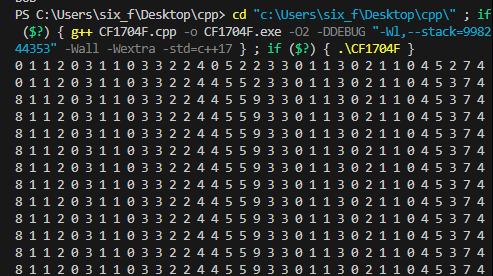

# 2024 10 月杂题

## CF429E Points and Segments

[传送门](https://www.luogu.com.cn/problem/CF429E)

> 题意

- 有一条序列，给定 $m$ 个区间 $[l,r]$，你要给每个区间确定一个区间加一或减一，使得序列上每个点最终的绝对值不大于 $1$。
- $1\le m\le 10^5,1\le l_i\le r_i\le 10^9$

> 题解

过于神秘。

考虑区间加不好转化，不妨全部转化为后缀加。

那么一个区间 $+1$ 就是后缀 $l$ 加一，后缀 $r+1$ 减一，区间减一也是同理。于是我们不妨把每个 $r$ 全部 $+1$，下文中的 $r$ 均为题目中 $r$ 加一得到。

一个非常厉害的想法就是将 $+1$ 看作 $l\to r$ 的一条边，$-1$ 看作 $r\to l$ 的一条边，这样每个入度对应一个后缀 $-1$，每个出度对应一个后缀 $+1$。

现在就相当于给定无向图，给每条边定向。如果每个点出度数都是偶数的话，很容易构造出序列全 $0$，即每个连通块连欧拉回路。

如果有奇数怎么办呢？注意到度数为奇数的点肯定有偶数个，那么我们把相邻的奇数点相连，得到全偶的情况，最后再把这些边去掉，就能得到答案了。

复杂度 $O(m\log m)$，因为需要离散化。

/// details | 参考代码
    open: False
    type: success

```cpp
#include<bits/stdc++.h>
#define mem(a,b) memset(a,b,sizeof(a))
#define forup(i,s,e) for(int i=(s),E123123=(e);i<=E123123;i++)
#define fordown(i,s,e) for(int i=(s),E123123=(e);i>=E123123;i--)
using namespace std;
#ifdef DEBUG
#define msg(args...) fprintf(stderr,args)
#else
#define msg(...) void()
#endif
using i64=long long;
using pii=pair<int,int>;
#define fi first
#define se second
#define mkp make_pair
#define gc getchar()
inline int read(){
    int x=0,f=1;char c;
    while(!isdigit(c=gc)) if(c=='-') f=-1;
    while(isdigit(c)){x=(x<<3)+(x<<1)+(c^48);c=gc;}
    return x*f;
}
#undef gc
const int N=2e5+5,inf=0x3f3f3f3f;
int n,m;
struct Node{
    int l,r;
}s[N];
vector<int> lsh;
int sz,deg[N],ans[N],vis[N],vv[N],cnte;
vector<pii> e[N];
void dfs(int x,int fa){
    vv[x]=1;
    for(auto i:e[x]){
        int v=i.fi,w=i.se;
        if(vis[w]) continue;
        vis[w]=1;
        if(x==s[w].l){
            ans[w]=0;
        }else{
            ans[w]=1;
        }
        dfs(v,x);
    }
}
signed main(){
    m=read();
    forup(i,1,m){
        s[i].l=read();s[i].r=read()+1;
        lsh.push_back(s[i].l);
        lsh.push_back(s[i].r);
    }
    sort(lsh.begin(),lsh.end());
    lsh.erase(unique(lsh.begin(),lsh.end()),lsh.end());
    sz=lsh.size();
    forup(i,1,m){
        s[i].l=lower_bound(lsh.begin(),lsh.end(),s[i].l)-lsh.begin()+1;
        s[i].r=lower_bound(lsh.begin(),lsh.end(),s[i].r)-lsh.begin()+1;
        e[s[i].l].push_back(mkp(s[i].r,i));
        e[s[i].r].push_back(mkp(s[i].l,i));
        ++deg[s[i].l];++deg[s[i].r];
    }
    cnte=m;
    int pre=-1;
    forup(i,1,sz){
        if(deg[i]&1){
            if(~pre){
                ++cnte;
                e[pre].push_back(mkp(i,cnte));
                e[i].push_back(mkp(pre,cnte));
                pre=-1;
            }else{
                pre=i;
            }
        }
    }
    forup(i,1,sz){
        if(!vv[i]) dfs(i,0);
    }
    forup(i,1,m){
        printf("%d ",ans[i]);
    }
}
```

///

## LOJ#6077. 「2017 山东一轮集训 Day7」逆序对

[传送门](https://loj.ac/p/6077)

> 题意

- 求长度为 $n$，逆序对个数恰好为 $m$ 的排列数。
- $1\le n,m\le 10^5,m\le \binom{n}{2}$

> 题解

考虑每个数左侧有多少数大于它，设这个数为 $x_i$，那么就转化成了求序列 $x_i$ 的个数，满足 $\sum x_i=m$，并且 $x_i\in[0,i)$。

这个很像容斥套路，我们可以枚举不合法集合，钦定这些集合不合法后简单组合数得到答案。具体来说，设 $S$ 集合不合法，$a=|S|$，并且 $b$ 为 $S$ 中所有数之和，那么答案为：

$\sum_{S}(-1)^{a}\binom{m-b+n-1}{n-1}$

注意到后面这个式子仅与 $a,b$ 相关，而 $a$ 只有 $2\sqrt{b}$ 种取值，那么只要能算出每种 $a,b$ 二元组出现了多少次，复杂度就能压到 $O(m\sqrt{m})$。

容易想到 DP，设 $g_{a,b}$ 表示选择 $a$ 个不同且不超过 $n$ 的数总和为 $b$ 的方案数，转移要么全部 $+1$，要么新增一个 $0$ 再全部 $+1$（注意新的 $0$ 会变成 $1$），但是要考虑超过 $n$ 的情况，显然超过 $n$ 的数只有一个，那么把它去掉就能得到多算的情况数是 $g_{a-1,b-n-1}$。则 $g_{a,b}=g_{a,b-a}+g_{a-1,b-a}-g_{a-1,b-n-1}$。

复杂度 $O(m\log m)$。

/// details | 参考代码
    open: False
    type: success

```cpp
#include<bits/stdc++.h>
#define forup(i,s,e) for(int i=(s),E123123123=(e);i<=E123123123;++i)
#define fordown(i,s,e) for(int i=(s),E123123123=(e);i>=E123123123;--i)
#define mem(a,b) memset(a,b,sizeof(a))
#ifdef DEBUG
#define msg(args...) fprintf(stderr,args)
#else
#define msg(...) void();
#endif
using namespace std;
using i64=long long;
using pii=pair<int,int>;
#define fi first
#define se second
#define mkp make_pair
#define gc getchar()
int read(){
    int x=0,f=1;char c;
    while(!isdigit(c=gc)) if(c=='-') f=-1;
    while(isdigit(c)){x=(x<<1)+(x<<3)+(c^48);c=gc;}
    return x*f;
}
#undef gc
const int N=1e5+5,inf=0x3f3f3f3f,mod=1e9+7;
int ksm(int a,int b){
    int c=1;
    while(b){
        if(b&1) c=1ll*a*c%mod;
        a=1ll*a*a%mod;
        b>>=1;
    }
    return c;
}
int n,m;
int fact[N<<1],finv[N<<2];
int binom(int n,int m){
    if(n<m) return 0;
    return 1ll*fact[n]*finv[m]%mod*finv[n-m]%mod;
}
int g[2][N];
signed main(){
    n=read();m=read();
    fact[0]=1;
    forup(i,1,n+m) fact[i]=1ll*fact[i-1]*i%mod;
    finv[n+m]=ksm(fact[n+m],mod-2);
    fordown(i,n+m-1,0) finv[i]=1ll*finv[i+1]*(i+1)%mod;
    g[0][0]=1;
    int ans=binom(n+m-1,n-1);
    forup(a,1,min(650,n)){
        int p=a&1,q=p^1;
        forup(b,1,m){
            g[p][b]=0;
            if(b>=a) (g[p][b]+=g[p][b-a]+g[q][b-a])%=mod;
            if(b>=n) g[p][b]=(g[p][b]+mod-g[q][b-n-1])%mod;
            (ans+=1ll*(a&1?mod-1:1)*binom(n+m-b-1,n-1)%mod*g[p][b]%mod)%=mod;
        }
        mem(g[q],0);
    }
    printf("%d\n",ans);
}
```

///

## P10777 BZOJ3706 反色刷

[传送门](https://www.luogu.com.cn/problem/P10777)

> 题意

- 给定一张无向简单（不一定连通）图，每条边是黑色 $1$ 或者白色 $0$。
- 你可以进行以下操作任意次：
    - 选择一个点，从这个点出发经过若干条边（可以重复）回到这个点，每经过一条边就将这条边反色。
- 求最少需要多少次操作才能把图变为全白。
- 然后这道题还在外面套了一层，即修改与查询，题目有 $q$ 次操作，有两种操作：
    - $1\; x$：将第 $x$ 条边反色，边的编号从 $0$ 开始。
    - $2$：查询最少需要多少次操作能把图变的全白（注意并不会真的改变图）。
- $1\le n,m,q\le 10^6$

> 题解

看起来好像无从下手，我们从一些简单的性质开始。

首先容易发现每次操作并不会改变一个点周围黑边的奇偶性，所以有解仅当每个点周围的黑边均有偶数条。

考虑这个条件是否必要，即能否从每个点黑色度数为偶推出有解，看到度数为偶数容易想到欧拉回路。容易发现有简单构造：对每个黑的连通块跑欧拉回路。

那么操作次数最少是多少呢？容易发现只要有解任意一个原图的连通块（不考虑黑白边）都能在一次操作中解决。

于是随便维护一下即可，复杂度 $O(n+m+q)$。

/// details | 参考代码
    open: False
    type: success

```cpp
#include<bits/stdc++.h>
#define forup(i,s,e) for(int i=(s),E123123123=(e);i<=E123123123;++i)
#define fordown(i,s,e) for(int i=(s),E123123123=(e);i>=E123123123;--i)
#define mem(a,b) memset(a,b,sizeof(a))
#ifdef DEBUG
#define msg(args...) fprintf(stderr,args)
#else
#define msg(...) void();
#endif
using namespace std;
using i64=long long;
using pii=pair<int,int>;
#define fi first
#define se second
#define mkp make_pair
#define gc getchar()
int read(){
    int x=0,f=1;char c;
    while(!isdigit(c=gc)) if(c=='-') f=-1;
    while(isdigit(c)){x=(x<<1)+(x<<3)+(c^48);c=gc;}
    return x*f;
}
#undef gc
const int N=1e6+5,inf=0x3f3f3f3f;
int n,m,q,u[N],v[N],co[N];
int deg[N];
vector<pii> e[N];
int rt[N],cnto[N],cnte[N],cntb;
int rese,reso;
void dfs(int x,int rr){
    rt[x]=rr;
    if(deg[x]&1) ++cnto[rr];
    for(auto i:e[x]){
        int v=i.fi;
        if(rt[v]) continue;
        dfs(v,rr);
    }
}
signed main(){
    n=read();m=read();
    forup(i,1,m){
        u[i]=read();v[i]=read();co[i]=read();
        e[u[i]].push_back(mkp(v[i],i));
        e[v[i]].push_back(mkp(u[i],i));
        deg[u[i]]+=co[i];deg[v[i]]+=co[i];
    }
    forup(i,1,n){
        if(!rt[i]){
            dfs(i,++cntb);
        }
    }
    forup(i,1,m){
        if(co[i]) ++cnte[rt[u[i]]];
    }
    forup(i,1,cntb){
        if(cnte[i]) ++rese;
        if(cnto[i]) ++reso;
    }
    q=read();
    forup(i,1,q){
        int op=read();
        if(op==1){
            int x=read()+1,r=rt[u[x]];
            int t=1;
            if(co[x]) t=-1;
            co[x]=0;
            if(cnte[r]) --rese;
            cnte[r]+=t;;
            if(cnte[r]) ++rese;
            if(cnto[r]) --reso;
            deg[u[x]]+=t;
            if(deg[u[x]]&1) ++cnto[r];
            else --cnto[r];
            deg[v[x]]+=t;
            if(deg[v[x]]&1) ++cnto[r];
            else --cnto[r];
            if(cnto[r]) ++reso;
        }else{
            if(!reso){
                printf("%d\n",rese);
            }else{
                puts("-1");
            }
        }
    }
}
```

///

## P4042 [AHOI2014/JSOI2014] 骑士游戏

[传送门](https://www.luogu.com.cn/problem/P4042)

> 题意

- 有一张 $n$ 个点的有向图，可能有重边自环。
- 初始点 $1$ 上有一个棋子，有两种操作：耗费 $a_i$ 的代价删去点 $i$ 的一个棋子，并且给点 $i$ 的所有出边指向的点增加一个棋子，或者耗费 $b_i$ 的代价直接删去点 $i$ 的一个棋子。
- 求删掉所有棋子所需最小代价。
- $1\le n\le 2\times 10^5$，边数总和不超过 $10^6$，$1\le a_i,b_i\le5\times 10^{14}$。

> 题解

一眼 DP，但是显然有后效性，怎么办呢？

我们理性地思考一下，容易发现 DP 式子为：

$$
dp_{i}=\min(a_i,b_i+\sum_{v}dp_v)
$$

显然可能的转移必定满足 $dp_v < dp_u$。

所以容易想到类似于 dijkstra 的做法，用一个堆维护点，每次取出最小的 $dp_i$，更新所有前驱（注意开一个数组暂存 $\sum dp_v$）。如果一个点所有后继都走过了就更新 DP 值。

复杂度 $O((n+m)\log n)$（其中 $m$ 是边数），注意到一个点最多同时在堆内出现两次。

/// details | 参考代码
    open: False
    type: success

```cpp
#include<bits/stdc++.h>
#define forup(i,s,e) for(i64 i=(s),E123123123=(e);i<=E123123123;++i)
#define fordown(i,s,e) for(i64 i=(s),E123123123=(e);i>=E123123123;--i)
#define mem(a,b) memset(a,b,sizeof(a))
#ifdef DEBUG
#define msg(args...) fprintf(stderr,args)
#else
#define msg(...) void();
#endif
using namespace std;
using i64=long long;
using pii=pair<i64,i64>;
#define fi first
#define se second
#define mkp make_pair
#define gc getchar()
i64 read(){
    i64 x=0,f=1;char c;
    while(!isdigit(c=gc)) if(c=='-') f=-1;
    while(isdigit(c)){x=(x<<1)+(x<<3)+(c^48);c=gc;}
    return x*f;
}
#undef gc
const i64 N=2e5+5,inf=0x3f3f3f3f;
i64 n,a[N],b[N],r[N];
vector<i64> e[N];
i64 dp[N],v2[N],vis[N];
struct Node{
    i64 u,dis;
    bool operator <(const Node &r)const{return dis>r.dis;}
};
signed main(){
    n=read();
    forup(i,1,n){
        a[i]=read();b[i]=read();r[i]=read();
        forup(j,1,r[i]){
            i64 v=read();
            e[v].push_back(i);
        }
    }
    priority_queue<Node> q;
    forup(i,1,n){
        dp[i]=b[i];v2[i]=a[i];
        q.push(Node{i,dp[i]});
    }
    while(q.size()){
        i64 u=q.top().u;q.pop();
        if(vis[u]) continue;
        vis[u]=1;
        for(i64 v:e[u]){
            if(vis[v]) continue;
            v2[v]+=dp[u];
            --r[v];
            if(!r[v]){
                if(v2[v]<dp[v]){
                    dp[v]=v2[v];
                    q.push(Node{v,dp[v]});
                }
            }
        }
    }
    printf("%lld\n",dp[1]);
}
```

///

## CF1699E Three Days Grace

[传送门](https://www.luogu.com.cn/problem/CF1699E)

> 题意

- 给定一个大小为 $n$，值域为 $[1,m]$ 的可重集。
- 你可以进行任意次以下操作：
    - 选择一个可重集中的数 $x$ 将其删掉。
    - 选择两个数 $p,q$，满足 $pq=x$，并且 $p,q > 1$，将两个数加入可重集。
- 求操作后可重集中的最大值减最小值最小是多少。
- $1\le n\le 10^6,1\le m\le 5\times 10^6$

> 题解

神秘题，想了好久枚举最大值发现做不了，破防了。

考虑从大到小枚举最小值 $l$。

设 $f_i$ 表示把 $i$ 分解成若干个不小于 $l$ 的数，最大值最小是多少。

容易发现每次只有 $l$ 的 $j$ 倍数（$j\ge l$）会更新（$f_{j\cdot l}\gets \min(f_{j\cdot l},\max(l,f_{j}))$），其它值保持不变。

于是就能 $O(m\log m)$ 维护了，因为最大值是单调减小的，所以可以用桶维护。

/// details | 参考代码
    open: False
    type: success

```cpp
#include<bits/stdc++.h>
#define forup(i,s,e) for(int i=(s),E123123=(e);i<=E123123;++i)
#define fordown(i,s,e) for(int i=(s),E123123=(e);i>=E123123;--i)
#define mem(a,b) memset(a,b,sizeof(a))
#ifdef DEBUG
#define msg(args...) fprintf(stderr,args)
#else
#define msg(...) void()
#endif
using namespace std;
using i64=long long;
using pii=pair<int,int>;
#define fi first
#define se second
#define mkp make_pair
#define gc getchar()
int read(){
	int x=0,f=1;char c;
	while(!isdigit(c=gc)){if(c=='-')f=-1;}
	while(isdigit(c)){x=(x<<1)+(x<<3)+(c^48);c=gc;}
	return x*f;
}
#undef gc
const int N=1e6+5,inf=0x3f3f3f3f;
int n,m,a[N],f[N*5];
int bkt[N*5],vis[N*5];
void solve(){
	n=read();m=read();
    int mn=m;
    forup(i,1,m){
        bkt[i]=vis[i]=0;
        f[i]=i;
    }
    forup(i,1,n){
        a[i]=read();
        bkt[a[i]]=vis[a[i]]=1;
        mn=min(mn,a[i]);
    }
    int mx=m,ans=inf;
    fordown(i,m,1){
        for(int j=i;1ll*i*j<=m;++j){
            int p=i*j;
            if(vis[p]){
                --bkt[f[p]];
            }
            f[p]=min(f[p],max(i,f[j]));
            if(vis[p]){
                ++bkt[f[p]];
            }
        }
        while(mx>0&&!bkt[mx]) --mx;
        if(i<=mn){
            ans=min(ans,mx-i);
        }
    }
    printf("%d\n",ans);
}
signed main(){
	int t=read();
	while(t--){
		solve();
	}
}
```

///

## 模拟赛神秘题目 【1006 B组】C 简单题

> 题意

- 每个数据给定常数 $n,x,y$ 设 $f_n(a,b)=\sum_{i=a}^{n-b}x^{i-a}\binom{i}{a}y^{n-i-b}\binom{n-i}{b}$。
- $q$ 次询问 $f_n(a,b)$。
- $2\le n\le 10^9,1\le x,y < 998244353,1\le q\le 2\times 10^5,1\le a_i,b_i\le 5000,a_i+b_i\le n$，答案对 $998244353$ 取模。

> 题解

这他妈是人能想出来的？

考虑组合意义，即给一排共 $n+1$ 小球染色，有红绿白三种颜色，其中绿球只有一个，绿球左边有 $a$ 个红球，右边有 $b$ 个红球，并且绿球左侧每个白球带 $x$ 的系数，右侧每个白球带 $y$ 的系数。

首先容易发现 $x=y$ 是好做的，就是组合数经典的范德蒙德卷积。下面默认 $x\ne y$。

考虑从 $f_n$ 推到 $f_{n+1}$，即在 $f_n$ 的最左边或者最右边加一个球。

先考虑最左边，若想要得到 $f_{n+1}(0,b)$，那么要么在 $f_n$ 的基础上加一个白球，要么直接是单个绿球，则有 $f_{n+1}(0,b)=y^{n+1-b}\binom{n+1}{b}+xf_{n}(0,b)$。当 $a\ne 0$，则要么加一个红球，要么加一个白球，则 $f_{n+1}(a,b)=f_{n}(a-1,b)+xf_{n}(a,b)$。

右侧同理，有 $f_{n+1}(a,0)=x^{n+1-a}\binom{n+1}{a}+yf_{n}(a,0),f_{n+1}(a,b)=f_{n}(a,b-1)+yf_{n}(a,b)\;(b\ne0)$。

容易发现这四个式子相互联立可以得到 $f_n$ 的递推关系，然后就能 $O(ab)$ 地算出所有答案了。

复杂度 $O(ab)$。

/// details | 参考代码
    open: False
    type: success

```cpp
#include<bits/stdc++.h>
#define forup(i,s,e) for(int i=(s),E123123123=(e);i<=E123123123;++i)
#define fordown(i,s,e) for(int i=(s),E123123123=(e);i>=E123123123;--i)
#define mem(a,b) memset(a,b,sizeof(a))
#ifdef DEBUG
#define msg(args...) fprintf(stderr,args)
#else
#define msg(...) void();
#endif
using namespace std;
using i64=long long;
using pii=pair<int,int>;
#define fi first
#define se second
#define mkp make_pair
#define gc getchar()
int read(){
    int x=0,f=1;char c;
    while(!isdigit(c=gc)) if(c=='-') f=-1;
    while(isdigit(c)){x=(x<<1)+(x<<3)+(c^48);c=gc;}
    return x*f;
}
#undef gc
const int N=5005,inf=0x3f3f3f3f,mod=998244353;
int ksm(int a,int b){
    int c=1;
    while(b){
        if(b&1) c=1ll*a*c%mod;
        a=1ll*a*a%mod;
        b>>=1;
    }
    return c;
}
int n,x,y,q,f[N][N];
int Cn[N<<1];
signed main(){
    n=read();x=read();y=read();q=read();
    Cn[0]=1;
    forup(i,1,min(10001,n+1)){
        Cn[i]=1ll*Cn[i-1]*(n+2-i)%mod*ksm(i,mod-2)%mod;
    }
    if(x!=y){
        int inv=ksm((x-y+mod)%mod,mod-2);
        f[0][0]=1ll*(ksm(x,n+1)+mod-ksm(y,n+1))*inv%mod;
        forup(i,1,min(5000,n)){
            f[0][i]=1ll*(f[0][i-1]+mod-1ll*Cn[i]*ksm(y,n+1-i)%mod)*inv%mod;
            f[i][0]=1ll*(1ll*Cn[i]*ksm(x,n+1-i)%mod+mod-f[i-1][0])*inv%mod;
        }
        forup(a,1,5000){
            if(a>n) break;
            forup(b,1,5000){
                if(a+b>n) break;
                f[a][b]=1ll*(f[a][b-1]-f[a-1][b]+mod)*inv%mod;
            }
        }
        forup(i,1,q){
            int a=read(),b=read();
            printf("%d\n",f[a][b]);
        }
    }else{
        forup(i,1,q){
            int a=read(),b=read();
            printf("%lld\n",1ll*Cn[a+b+1]*ksm(x,n-a-b)%mod);
        }
    }
}
```

///

## [ARC167C] MST on Line++

[传送门](https://www.luogu.com.cn/problem/AT_arc167_c)

> 题意

- 给定一个长度为 $n$ 的序列 $a_i$ 和一个常数 $L$。
- 对于一个排列 $P$，定义 $f(P)$ 表示以下问题的答案：
    - 任意两个点 $i,j$ 满足 $|i-j|\le L$ 均有连边，边权为 $\max(A_{P_i},A_{P_j})$。
    - 求这张图的最小生成树。
- 对于 $P$ 的全排列，求 $f(P)$ 的答案之和。
- $1\le L < n\le 5000,1\le a_i\le 10^9$，答案对 $998244353$ 取模。

> 题解

想复杂了，唉。

先把 $a_i$ 从小到大排序，考虑 $a_i$ 会产生多少贡献，即 $a_i$ 和所有小于 $a_i$ 的 $a_j$ 总共连了多少边。

设 $f_i$ 表示考虑只前 $i$ 个点，在全排列的所有图中总共连了多少条边，容易发现答案就是 $\sum_{i=1}^n a_i(f_i-f_{i-1})$。

那么怎么算 $f_i$ 呢？设前 $i$ 个点在序列上的位置从小到大分别是 $q_1,q_2,\dots q_i$ 一个容易观察出的性质是，只要两个相邻的点满足 $q_{j+1}-q_j\le L$，那么就必定会有一条连边（可能不一定是 $j$ 和 $j-1$ 连，但是必定有边），因为后面的数更大，不连这条边必定不优。

于是我们只要计算所有情况中小于等于 $k$ 的空格总数即可。不难从组合意义推出对于任意一个 $1\le j < i$，$q_{j+1}-q_j=t$ 的方案数为 $\binom{n-t}{i-1}$，那么枚举这个空格数，再乘以 $i-1$ 即可得到一个序列 $q$ 的总贡献。然后序列 $q$ 有 $(n-i)!i!$ 种，于是：

$$
f_i=i!(n-i)!(i-1)\sum_{t=1}^k\binom{n-t}{i-1}
$$

然后就能 $O(nL)$ 计算了。

/// details | 参考代码
    open: False
    type: success

```cpp
#include<bits/stdc++.h>
#define forup(i,s,e) for(int i=(s),E123123123=(e);i<=E123123123;++i)
#define fordown(i,s,e) for(int i=(s),E123123123=(e);i>=E123123123;--i)
#define mem(a,b) memset(a,b,sizeof(a))
#ifdef DEBUG
#define msg(args...) fprintf(stderr,args)
#else
#define msg(...) void();
#endif
using namespace std;
using i64=long long;
using pii=pair<int,int>;
#define fi first
#define se second
#define mkp make_pair
#define gc getchar()
int read(){
    int x=0,f=1;char c;
    while(!isdigit(c=gc)) if(c=='-') f=-1;
    while(isdigit(c)){x=(x<<1)+(x<<3)+(c^48);c=gc;}
    return x*f;
}
#undef gc
const int N=5005,inf=0x3f3f3f3f,mod=998244353;
int ksm(int a,int b){
    int c=1;
    while(b){
        if(b&1) c=1ll*a*c%mod;
        a=1ll*a*a%mod;
        b>>=1;
    }
    return c;
}
int n,l,a[N],f[N];
int fact[N],finv[N];
int binom(int n,int m){
    if(n<m) return 0;
    return 1ll*fact[n]*finv[m]%mod*finv[n-m]%mod;
}
signed main(){
    n=read();l=read();
    fact[0]=1;
    forup(i,1,n){
        a[i]=read();
        fact[i]=1ll*fact[i-1]*i%mod;
    }
    sort(a+1,a+n+1);
    finv[n]=ksm(fact[n],mod-2);
    fordown(i,n-1,0){
        finv[i]=1ll*finv[i+1]*(i+1)%mod;
    }
    forup(i,1,n){
        f[i]=1ll*fact[i]*fact[n-i]%mod*(i-1)%mod;
        int ss=0;
        forup(j,1,l){
            (ss+=binom(n-j,i-1))%=mod;
        }
        f[i]=1ll*f[i]*ss%mod;
    }
    int ans=0;
    forup(i,1,n){
        (ans+=1ll*a[i]*(f[i]+mod-f[i-1])%mod)%=mod;
    }
    printf("%d\n",ans);
}
```

///

## 模拟赛神秘题目 【1007 B组】D 航行

> 题意

- 有一条长度为 $n$ 的航道，经过点 $i$ 时有 $\frac{p_i}{100}$ 的概率刮东风，有 $1-\frac{p_i}{100}$ 的概率刮西风，持续一个时刻。
- 如果刮西风，小船的速度会 $+1$，刮东风会 $-1$。
- 若小船在点 $x$ 速度为 $i$，那么他下一时刻就会到达点 $x+i$。
- 对于小船的所有出发点 $p=1\sim n$，求小船上岸（到达小于 $1$ 的点或大于 $n$ 的点）的期望步数，若永远无法上岸，输出 $-1$。
- $1\le n\le 500,0\le p_i\le 100$

> 题解

感觉挺神秘的。

首先容易想到 DP，将速度和位置全部压进状态，但这玩意有后效性，所以考虑高斯消元，有 $O(n^6)$ 做法。容易想到速度不会超过 $O(\sqrt{n})$，有 $O(n^{4.5})$ 做法。

状态不太能直接压了，考虑能不能删掉一些状态。容易发现我们其实只关心速度为 $0$ 的情况，那么能不能推出每个点速度为 $0$ 的状态之间的关系呢？

设 $f_{i,j,k},g_{i,j,k}$ 表示若在点 $i$ 速度为 $k$，那么下一次小船速度为 $0$ 的位置是 $j$ 的概率和期望步数。由于速度每次只会变化 $1$，并且钦定 $i,j$ 之间没有速度为 $0$ 的点，所以必定是从 $i$ 到 $j$ 不走回头路的，于是就没有后效性，可以直接转移。具体转移式子为：

$$
\begin{aligned}
&f_{i,j,k}\gets p_i(f_{i+k-1,j,k-1}+g_{i+k-1,j,k-1})[k\ne 1]+(1-p_i)(f_{i+k+1,j,k+1}+g_{i+k+1,j,k+1})[k\ne -1]\\\\
&g_{i,j,k}\gets p_ig_{i+k-1,j,k-1}[k\ne 1]+(1-p_i)g_{i+k+1,j,k+1}[k\ne -1]
\end{aligned}
$$

注意途中不能有 $0$。另外由于转移忽略了 $0$，初始状态应考虑 $f_{i,i,\pm 1},g_{i,i,\pm 1}$。

设点 $i$ 的答案为 $ans_i$，我们就能知道 $ans_i=\sum_{j\in[1,n]}^{j\ne i}ans_jg_{i,j,0}+f_{i,j,0}$ 了。

但是有个问题，我们没有考虑从 $i$ 一直不减速到 $0$ 直接上岸的情况，这个再 DP 一下就行了。

然后列出 $n$ 个方程直接高斯消元，最后解出来若某未知数无解或无数解或者解为 $0$ 那么它的答案就是 $-1$。

复杂度 $O(n^3)$，实际瓶颈在于 $f,g$ 的 DP 常数巨大，这部分最好用之前的结论优化成 $O(n^{2.5})$，不然不太能过。

/// details | 参考代码
    open: False
    type: success

```cpp
#include<bits/stdc++.h>
#define forup(i,s,e) for(int i=(s),E123123=(e);i<=E123123;++i)
#define fordown(i,s,e) for(int i=(s),E123123=(e);i>=E123123;--i)
#define mem(a,b) memset(a,b,sizeof(a))
#ifdef DEBUG
#define msg(args...) fprintf(stderr,args)
#else
#define msg(...) void()
#endif
using namespace std;
using i64=long long;
using pii=pair<int,int>;
#define fi first
#define se second
#define mkp make_pair
#define gc getchar()
int read(){
	int x=0,f=1;char c;
	while(!isdigit(c=gc)){if(c=='-')f=-1;}
	while(isdigit(c)){x=(x<<1)+(x<<3)+(c^48);c=gc;}
	return x*f;
}
#undef gc
const int N=505,A=50,mod=998244353;
int ksm(int a,int b){
	int c=1;
	while(b){
		if(b&1) c=1ll*a*c%mod;
		a=1ll*a*a%mod;
		b>>=1;
	}
	return c;
}
int n,sn,p[N],inv;
int f[N][N][120],g[N][N][120];
int h[N][120],t[N][120];
int a[N][N];
signed main(){
	n=read();
	sn=1.5*sqrt(n);
	inv=ksm(100,mod-2);
	forup(i,1,n){
		p[i]=read();
		p[i]=1ll*p[i]*inv%mod;
		f[i][i][A+1]=g[i][i][A+1]=p[i];
		f[i][i][A-1]=g[i][i][A-1]=(mod+1-p[i])%mod;
	}
	forup(len,2,n){
		forup(l,1,n-len+1){
			int r=l+len-1;
			forup(k,0,min(sn,r-l+1)){
				if(k>1){
					(f[l][r][A+k]+=1ll*p[l]*(f[l+k-1][r][A+k-1]+g[l+k-1][r][A+k-1])%mod)%=mod;
					(g[l][r][A+k]+=1ll*p[l]*g[l+k-1][r][A+k-1]%mod)%=mod;
					(f[r][l][A-k]+=1ll*(mod+1-p[r])*(f[r-k+1][l][A-k+1]+g[r-k+1][l][A-k+1])%mod)%=mod;
					(g[r][l][A-k]+=1ll*(mod+1-p[r])*g[r-k+1][l][A-k+1]%mod)%=mod;
				}
				if(k<min(sn,r-l)){
					(f[l][r][A+k]+=1ll*(mod+1-p[l])*(f[l+k+1][r][A+k+1]+g[l+k+1][r][A+k+1])%mod)%=mod;
					(g[l][r][A+k]+=1ll*(mod+1-p[l])*g[l+k+1][r][A+k+1]%mod)%=mod;
					(f[r][l][A-k]+=1ll*p[r]*(f[r-k-1][l][A-k-1]+g[r-k-1][l][A-k-1])%mod)%=mod;
					(g[r][l][A-k]+=1ll*p[r]*g[r-k-1][l][A-k-1]%mod)%=mod;
				}
			}
		}
	}
	forup(i,1,n){
		forup(k,-sn,0){
			if(i+k-1<1||i+k-1>n){
				(h[i][A+k]+=p[i])%=mod;
				(t[i][A+k]+=p[i])%=mod;
			}else if(k-1!=0&&k!=-sn){
				(h[i][A+k]+=1ll*p[i]*(h[i+k-1][A+k-1]+t[i+k-1][A+k-1])%mod)%=mod;
				(t[i][A+k]+=1ll*p[i]*t[i+k-1][A+k-1]%mod)%=mod;
			}
			if(k){
				if(i+k+1<1||i+k+1>n){
					(h[i][A+k]+=(mod+1-p[i]))%=mod;
					(t[i][A+k]+=(mod+1-p[i]))%=mod;
				}else if(k+1!=0&&k!=sn){
					(h[i][A+k]+=1ll*(mod+1-p[i])*(h[i+k+1][A+k+1]+t[i+k+1][A+k+1])%mod)%=mod;
					(t[i][A+k]+=1ll*(mod+1-p[i])*t[i+k+1][A+k+1]%mod)%=mod;
				}
			}
		}
	}
	fordown(i,n,1){
		forup(k,0,sn){
			if(k){
				if(i+k-1<1||i+k-1>n){
					(h[i][A+k]+=p[i])%=mod;
					(t[i][A+k]+=p[i])%=mod;
				}else if(k-1!=0&&k!=-sn){
					(h[i][A+k]+=1ll*p[i]*(h[i+k-1][A+k-1]+t[i+k-1][A+k-1])%mod)%=mod;
					(t[i][A+k]+=1ll*p[i]*t[i+k-1][A+k-1]%mod)%=mod;
				}			
			}
			if(i+k+1<1||i+k+1>n){
				(h[i][A+k]+=(mod+1-p[i]))%=mod;
				(t[i][A+k]+=(mod+1-p[i]))%=mod;
			}else if(k+1!=0&&k!=sn){
				(h[i][A+k]+=1ll*(mod+1-p[i])*(h[i+k+1][A+k+1]+t[i+k+1][A+k+1])%mod)%=mod;
				(t[i][A+k]+=1ll*(mod+1-p[i])*t[i+k+1][A+k+1]%mod)%=mod;
			}
		}
	}
	forup(i,1,n){
		forup(j,1,n){
			if(j==i) continue;
			a[i][j]=(mod-g[i][j][A])%mod;
			(a[i][n+1]+=f[i][j][A])%=mod;
		}
		a[i][i]=1;
		(a[i][n+1]+=h[i][A])%=mod;
	}
	forup(i,1,n){
		forup(j,i,n){
			if(a[j][i]){
				forup(k,1,n+1){
					swap(a[i][k],a[j][k]);
				}
				break;
			}
		}
		if(!a[i][i]){
			continue;
		}
		int inv=ksm(a[i][i],mod-2);
		forup(j,1,n+1) a[i][j]=1ll*a[i][j]*inv%mod;
		forup(j,i+1,n){
			if(!a[j][i]) continue;
			int p=a[j][i];
			forup(k,1,n+1){
				a[j][k]=(a[j][k]+mod-1ll*a[i][k]*p%mod)%mod;
			}
		}
	}
	fordown(i,n,1){
		if(!a[i][i]) continue;
		fordown(j,i-1,1){
			if(a[j][i]){
				a[j][n+1]=(a[j][n+1]+mod-1ll*a[i][n+1]*a[j][i]%mod)%mod;
				a[j][i]=0;
			}
		}
	}
	forup(i,1,n){
		bool flag=true;
		if(!a[i][i]&&a[i][n+1]) flag=false;
		if(a[i][i]&&!a[i][n+1]) flag=false;
		forup(j,1,n){
			if(j!=i&&a[i][j]) flag=false;
		}
		if(flag){
			printf("%d ",a[i][n+1]);
		}else{
			printf("-1 ");
		}
	}
}
```

///

## P5508 寻宝

[传送门](https://www.luogu.com.cn/problem/P5508)

> 题意

- 有一张 $n$ 个点的图，有很多边，按给出方式有两种，如下：
    - 给定一长度为 $n$ 的数组 $v_i$，表示若 $v_i\ne 0$，则 $i$ 向所有 $j\ne i$ 连边权为 $|i-j|v_i$ 的边。
    - 给定 $m$ 个五元组 $(l_1,r_1,l_2,r_2,w)$，表示有连接 $[l_1,r_1],[l_2,r_2]$ 两区间总共 $(r_1-l_1+1)\times (r_2-l_2+1)$ 条边权为 $w$ 的边。
- 求从 $1$ 到 $n$ 的最短路。
- $1\le n,m\le 50000,1\le v_i,w\le 10^9$

> 题解

比较厉害的一道题。

首先容易想到正解应该是对 dijkstra 进行优化，因为如果想 DP 显然有后效性，最后还得搞最短路顺序。

区间连区间是简单的，线段树优化建图（建个中间点）即可将边数优化到 $O(n+m\log n)$。考虑 $v_i|j-i|$ 的边怎么处理。

考虑 dijkstra 的过程，相当于每次用一个点 $u$ 去更新其它点的 $dis_i$。容易发现更新一次 $v_i|j-i|$ 就是将所有的 $dis$ 和一个分段函数（两条线段）取最小值。因为是和一次函数取最小值，容易想到李超线段树维护。

再梳理一下我们需要维护什么：**区间插入一次函数**，**删除一个点**，**全局求没被删的点所对应的函数最小取值**。考虑李超线段树怎么维护，显然李超线段树上任意结点维护的那条线段取值最小值必定会取到最左边没被删的点或最右侧没被删的点，所以我们再对每个结点维护**编号最小/大的没删的点**即可维护上述三个信息。

复杂度 $O(n\log m+m\log n\log m+n\log n)$。

/// details | 参考代码
    open: False
    type: success

```cpp
#include<bits/stdc++.h>
#define forup(i,s,e) for(i64 i=(s),E123123123=(e);i<=E123123123;++i)
#define fordown(i,s,e) for(i64 i=(s),E123123123=(e);i>=E123123123;--i)
#define mem(a,b) memset(a,b,sizeof(a))
#ifdef DEBUG
#define msg(args...) fprintf(stderr,args)
#else
#define msg(...) void();
#endif
using namespace std;
using i64=long long;
using pii=pair<i64,i64>;
#define fi first
#define se second
#define mkp make_pair
#define gc getchar()
i64 read(){
    i64 x=0,f=1;char c;
    while(!isdigit(c=gc)) if(c=='-') f=-1;
    while(isdigit(c)){x=(x<<1)+(x<<3)+(c^48);c=gc;}
    return x*f;
}
#undef gc
const i64 N=1<<16,inf=1e18;
i64 n,m,v[N];
i64 cntn;
vector<pii> e[N*6];
i64 dis[N*6],vis[N*6],pre[N*6];
struct zkw{
    i64 nd[N<<1],ty;
    void Build(i64 p){
        ty=p;
        forup(i,1,n){
            nd[i+N]=i;
        }
        fordown(i,N-1,1){
            if(nd[i<<1]||nd[i<<1|1]){
                nd[i]=++cntn;
                if(ty){
                    e[nd[i]].push_back(mkp(nd[i<<1],0));
                    e[nd[i]].push_back(mkp(nd[i<<1|1],0));
                }else{
                    e[nd[i<<1]].push_back(mkp(nd[i],0));
                    e[nd[i<<1|1]].push_back(mkp(nd[i],0));
                }                
            }
        }
    }
    void Link(i64 l,i64 r,i64 x){
        for(l+=N-1,r+=N+1;l^r^1;l>>=1,r>>=1){
            if(!(l&1)){
                if(ty){
                    e[x].push_back(mkp(nd[l^1],0));
                }else{
                    e[nd[l^1]].push_back(mkp(x,0));
                }
            }
            if(r&1){
                if(ty){
                    e[x].push_back(mkp(nd[r^1],0));
                }else{
                    e[nd[r^1]].push_back(mkp(x,0));
                }
            }
        }
    }
}t1,t2;
struct Line{
    i64 k,b,pos;
    i64 operator()(const i64 &n){
        if(!pos) return inf;
        return k*n+b;
    }
};
struct Node{
    i64 val,u,pos;
    bool operator <(const Node &r)const{return val<r.val;}
};
struct SegTree{
    #define mid ((l+r)>>1)
    #define lson l,mid,id<<1
    #define rson mid+1,r,id<<1|1
    Line midmn[N<<2];
    Node mn[N<<2];
    i64 lp[N<<2],rp[N<<2];
    void Build(i64 l=1,i64 r=n,i64 id=1){
        mn[id]=Node{inf,0,0};
        if(l==r){
            lp[id]=rp[id]=l;
            return;
        }
        Build(lson);Build(rson);
		PushUp(id);
    }
    void PushUp(i64 id){
        mn[id]=Node{inf,0,0};
        if(lp[id<<1]) lp[id]=lp[id<<1];
        else lp[id]=lp[id<<1|1];
        if(rp[id<<1|1]) rp[id]=rp[id<<1|1];
        else rp[id]=rp[id<<1];
        if(midmn[id].k&&lp[id]){
            mn[id]=min(Node{midmn[id](lp[id]),lp[id],midmn[id].pos},Node{midmn[id](rp[id]),rp[id],midmn[id].pos});
        }
        mn[id]=min({mn[id],mn[id<<1],mn[id<<1|1]});
    }
    void Insert(i64 L,i64 R,Line X,i64 l=1,i64 r=n,i64 id=1){
        if(L<=l&&r<=R){
            if(!midmn[id].k){
                midmn[id]=X;
                if(l==r){
                    if(midmn[id].k&&lp[id]){
                        mn[id]=Node{midmn[id](lp[id]),lp[id],midmn[id].pos};
                    }else{
						mn[id]=Node{inf,0,0};
					}
                }else{
                    PushUp(id);
                }
                return;
            }
            if(midmn[id](mid)>X(mid)) swap(midmn[id],X);
            if(l==r){
                if(midmn[id].k&&lp[id]){
                    mn[id]=Node{midmn[id](lp[id]),lp[id],midmn[id].pos};
                }else{
					mn[id]=Node{inf,0,0};
				}
                return;
            }
            if(midmn[id](l)>X(l)){
                Insert(L,R,X,lson);
            }else if(midmn[id](r)>X(r)){
                Insert(L,R,X,rson);
            }
            PushUp(id);
            return;
        }
        if(L<=mid) Insert(L,R,X,lson);
        if(mid< R) Insert(L,R,X,rson);
        PushUp(id);
    }
    void Update(i64 P,i64 l=1,i64 r=n,i64 id=1){
        if(l==r){
            lp[id]=rp[id]=0;
            mn[id]=Node{inf,0,0};
            return;
        }
        if(P<=mid) Update(P,lson);
        else       Update(P,rson);
        PushUp(id);
    }
}mt;
void dijkstra(){
    priority_queue<pii,vector<pii>,greater<pii>> q;
    forup(i,1,cntn) dis[i]=inf;
    dis[1]=0;
    q.push(mkp(0,1));
    while(q.size()||mt.mn[1].u){
        i64 u;
        if((!mt.mn[1].u)||(q.size()&&q.top().fi<mt.mn[1].val)){
            u=q.top().se;q.pop();
        }else{
            u=mt.mn[1].u;
            if(mt.mn[1].val<dis[u]){
                dis[u]=mt.mn[1].val;
                pre[u]=mt.mn[1].pos;
            }
        }
        if(vis[u]) continue;
        vis[u]=1;
		if(u<=n){
			mt.Update(u);
		}
        for(auto i:e[u]){
            i64 v=i.fi,w=i.se;
            if(dis[v]>dis[u]+w){
                dis[v]=dis[u]+w;
                pre[v]=u;
                q.push(mkp(dis[v],v));
            }
        }
        if(u<=n&&v[u]){
            Line nw;
            nw.pos=u;
            nw.k=v[u];
            nw.b=dis[u]-v[u]*u;
            mt.Insert(u,n,nw);
            nw.k=-v[u];
            nw.b=dis[u]+v[u]*u;
            mt.Insert(1,u,nw);
        }
    }
}
vector<i64> ans;
void get(i64 x){
    if(!x) return;
    get(pre[x]);
    if(x<=n) ans.push_back(x);
}
signed main(){
    n=read();m=read();
    forup(i,1,n){
        v[i]=read();
    }
    cntn=n;
    t1.Build(0);t2.Build(1);
    mt.Build();
    forup(i,1,m){
        i64 l1=read(),r1=read(),l2=read(),r2=read(),w=read();
        i64 u=++cntn,v=++cntn;
        e[u].push_back(mkp(v,w));
        t1.Link(l1,r1,u);
        t2.Link(l2,r2,v);
    }
    dijkstra();
	if(dis[n]==inf){
		puts("-1");
		return 0;
	}
    printf("%lld\n",dis[n]);
    get(n);
    printf("%lld\n",(i64)ans.size());
    for(auto i:ans){
        printf("%lld ",i);
    }
}
```

///

## P2053 [SCOI2007] 修车

[传送门](https://www.luogu.com.cn/problem/P2053)

[P2050 [NOI2012] 美食节](./flow.md/#p2050-noi2012) 的数据范围削弱版。

重写了一遍的代码：

/// details | 参考代码
    open: False
    type: success

```cpp
#include<bits/stdc++.h>
#define forup(i,s,e) for(int i=(s),E123123123=(e);i<=E123123123;++i)
#define fordown(i,s,e) for(int i=(s),E123123123=(e);i>=E123123123;--i)
#define mem(a,b) memset(a,b,sizeof(a))
#ifdef DEBUG
#define msg(args...) fprintf(stderr,args)
#else
#define msg(...) void();
#endif
using namespace std;
using i64=long long;
using pii=pair<int,int>;
#define fi first
#define se second
#define mkp make_pair
#define gc getchar()
int read(){
    int x=0,f=1;char c;
    while(!isdigit(c=gc)) if(c=='-') f=-1;
    while(isdigit(c)){x=(x<<1)+(x<<3)+(c^48);c=gc;}
    return x*f;
}
#undef gc
const int inf=0x3f3f3f3f;
int n,m,t[15][70],cntn;
int pl[15],pe[15];
void work(int i);
namespace flow{
    struct edge{
        int v,rst,w,nxt;
    }e[10000];
    int head[200],dis[200],incf[200],pre[200],vis[200],cnte=1,s,t;
    void adde(int u,int v,int rst,int w){
        e[++cnte]=edge{v,rst,w,head[u]};head[u]=cnte;
        e[++cnte]=edge{u,0,-w,head[v]};head[v]=cnte;
    }
    bool spfa(){
        forup(i,1,cntn) dis[i]=inf;
        incf[s]=inf;incf[t]=0;
        dis[s]=0;
        queue<int> q;
        q.push(s);
        while(q.size()){
            int u=q.front();q.pop();
            vis[u]=0;
            for(int i=head[u];i;i=e[i].nxt){
                int v=e[i].v,w=e[i].w,rst=e[i].rst;
                if(!rst||dis[v]<=dis[u]+w) continue;
                dis[v]=dis[u]+w;pre[v]=i;
                incf[v]=min(rst,incf[u]);
                if(!vis[v]){
                    q.push(v);
                    vis[v]=1;
                }
            }
        }
        return incf[t];
    }
    pii SSP(){
        int mxf=0,mnc=0;
        while(spfa()){
            mxf+=incf[t];
            for(int i=t;i!=s;i=e[pre[i]^1].v){
                mnc+=incf[t]*e[pre[i]].w;
                e[pre[i]].rst-=incf[t];
                e[pre[i]^1].rst+=incf[t];
            }
            forup(i,1,n){
                if(!e[pe[i]].rst){
                    ++pl[i];
                    work(i);
                }
            }
        }
        return mkp(mxf,mnc);
    }
}
void work(int i){
    int nd=++cntn;
    flow::adde(flow::s,nd,1,0);
    pe[i]=flow::cnte-1;
    forup(j,1,m){
        flow::adde(nd,j,1,t[i][j]*pl[i]);
    }
}
signed main(){
    n=read();m=read();
    flow::s=m+1;flow::t=flow::s+1;
    forup(i,1,m){
        flow::adde(i,flow::t,1,0);
    }
    cntn=flow::t;
    forup(i,1,m){
        forup(j,1,n){
            t[j][i]=read();
        }
    }
    forup(i,1,n){
        pl[i]=1;
        work(i);
    }
    pii res=flow::SSP();
    printf("%.2lf\n",1.0*res.se/m);
}
```

///

## P8868 [NOIP2022] 比赛

[传送门](https://www.luogu.com.cn/problem/P8868)

> 题意

- 有两个长度为 $n$ 的排列 $a,b$
- 定义 $f(l,r)=\max_{i=l}^r\begin{Bmatrix}a_i\end{Bmatrix}\times \max_{i=l}^r\begin{Bmatrix}b_i\end{Bmatrix}$。
- $m$ 次询问，每次询问区间 $[l,r]$ 所有子区间的 $f(l,r)$ 之和。
- $1\le n,m\le 2.5\times 10^5$，答案对 $2^{64}$ 取模。

> 题解

首先容易想到设 $A_{l,r}$ 表示 $\max_{i=l}^r\begin{Bmatrix}a_i\end{Bmatrix}$，$B_{l,r}$ 同理。那么每次询问就是一个矩形中 $AB$ 之积的和。容易想到扫描线维护，那么需要维护历史版本和。

考虑在线段树上用矩阵维护，容易想到开 $5\times 5$ 的矩阵，维护**区间 $A$ 之和**，**区间 $B$ 之和**，**区间 $AB$ 的积之和**，**区间历史版本和**，然后为了维护再开一维常数恒等于区间长度。

然后容易发现对 $A,B$ 的赋值都能概括为矩阵，每一行操作完再乘一个矩阵将当前行统计入历史版本和即可。复杂度 $O(n\log n+m\log n)$，然后卡卡常就过了。

/// details | 参考代码
    open: False
    type: success

```cpp
#include<bits/stdc++.h>
#define forup(i,s,e) for(int i=(s),E123123123=(e);i<=E123123123;++i)
#define fordown(i,s,e) for(int i=(s),E123123123=(e);i>=E123123123;--i)
#define mem(a,b) memset(a,b,sizeof(a))
#ifdef DEBUG
#define msg(args...) fprintf(stderr,args)
#else
#define msg(...) void();
#endif
using namespace std;
using i64=unsigned long long;
#define gc getchar()
i64 read(){
	i64 x=0,f=1;char c;
	while(!isdigit(c=gc)) if(c=='-') f=-1;
	while(isdigit(c)){x=(x<<1)+(x<<3)+(c^48);c=gc;}
	return x*f;
}
#undef gc
const int N=1<<18;
int T,n,m;
i64 a[N],b[N],ans[N];
struct Matrix{
    i64 c[5][5];
    Matrix(){mem(c,0);}
    void init(int p){
        mem(c,0);
        if(p) c[0][0]=c[1][1]=c[2][2]=c[3][3]=c[4][4]=1;
    }
    Matrix operator*(const Matrix &r){
        Matrix res;
        res.c[0][0]=c[0][0]*r.c[0][0];
        res.c[0][2]=c[0][0]*r.c[0][2]+c[0][2]*r.c[2][2];
        res.c[0][3]=c[0][0]*r.c[0][3]+c[0][2]*r.c[2][3]+c[0][3]*r.c[3][3];
        res.c[1][1]=c[1][1]*r.c[1][1];
        res.c[1][2]=c[1][1]*r.c[1][2]+c[1][2]*r.c[2][2];
        res.c[1][3]=c[1][1]*r.c[1][3]+c[1][2]*r.c[2][3]+c[1][3]*r.c[3][3];
        res.c[2][2]=c[2][2]*r.c[2][2];
        res.c[2][3]=c[2][2]*r.c[2][3]+c[2][3]*r.c[3][3];
        res.c[3][3]=c[3][3]*r.c[3][3];
        res.c[4][0]=c[4][0]*r.c[0][0]+c[4][4]*r.c[4][0];
        res.c[4][1]=c[4][1]*r.c[1][1]+c[4][4]*r.c[4][1];
        res.c[4][2]=c[4][0]*r.c[0][2]+c[4][1]*r.c[1][2]+c[4][2]*r.c[2][2]+c[4][4]*r.c[4][2];
        res.c[4][3]=c[4][0]*r.c[0][3]+c[4][1]*r.c[1][3]+c[4][2]*r.c[2][3]+c[4][3]*r.c[3][3]+c[4][4]*r.c[4][3];
        res.c[4][4]=c[4][4]*r.c[4][4];
        return res;
    }
};
struct Vector{
    i64 c[5];
    Vector(){mem(c,0);}
    Vector operator *(const Matrix &r){
        Vector res;
        res.c[0]=c[0]*r.c[0][0]+c[4]*r.c[4][0];
        res.c[1]=c[1]*r.c[1][1]+c[4]*r.c[4][1];
        res.c[2]=c[0]*r.c[0][2]+c[1]*r.c[1][2]+c[2]*r.c[2][2]+c[4]*r.c[4][2];
        res.c[3]=c[0]*r.c[0][3]+c[1]*r.c[1][3]+c[2]*r.c[2][3]+c[3]*r.c[3][3]+c[4]*r.c[4][3];
        res.c[4]=c[4]*r.c[4][4];
        return res;
    }
    Vector operator +(const Vector &r){
        Vector res;
        res.c[0]=c[0]+r.c[0];
        res.c[1]=c[1]+r.c[1];
        res.c[2]=c[2]+r.c[2];
        res.c[3]=c[3]+r.c[3];
        res.c[4]=c[4]+r.c[4];
        return res;
    }
};
Matrix nwX,tr;
struct SegTree{
    Vector val[N<<1];
    Matrix mark[N<<1];
    bool tag[N<<1];
    void PushUp(int id){
        val[id]=val[id<<1]+val[id<<1|1];
    }
    void PushDown(int id){
        if(!tag[id]) return;
        val[id<<1]=val[id<<1]*mark[id];
        val[id<<1|1]=val[id<<1|1]*mark[id];
        mark[id<<1]=mark[id<<1]*mark[id];
        mark[id<<1|1]=mark[id<<1|1]*mark[id];
        tag[id<<1]=tag[id<<1|1]=1;
        tag[id]=0;mark[id].init(1);
    }
    void Build(){
        forup(i,1,n) val[i+N].c[4]=1;
        fordown(i,N-1,1){
            mark[i].init(1);
            PushUp(i);
        }
    }
    void PushD(int l,int r){
        l+=N;r+=N+1;
        fordown(i,18,1){
            if(((l>>i)<<i)!=l) PushDown(l>>i);
            if(((r>>i)<<i)!=r) PushDown((r-1)>>i);
        }
    }
    void PushU(int l,int r){
        l+=N;r+=N+1;
        forup(i,1,18){
            if(((l>>i)<<i)!=l) PushUp(l>>i);
            if(((r>>i)<<i)!=r) PushUp((r-1)>>i);
        }
    }
    void Update(int L,int R){
        PushD(L,R);
        auto work=[&](int id){
            val[id]=val[id]*nwX;
            mark[id]=mark[id]*nwX;
            tag[id]=1;
        };
        for(int l=L+N-1,r=R+N+1;l^r^1;l>>=1,r>>=1){
            if(!(l&1)) work(l^1);
            if(  r&1 ) work(r^1);
        }
        PushU(L,R);
    }
    i64 Query(int L,int R){
        PushD(L,R);
        i64 res=0;
        for(int l=L+N-1,r=R+N+1;l^r^1;l>>=1,r>>=1){
            if(!(l&1)) res+=val[l^1].c[3];
            if(  r&1 ) res+=val[r^1].c[3];
        }
        return res;
    }
}mt;
void GetMat(i64 v,int p){
    nwX.init(0);
    nwX.c[3][3]=nwX.c[4][4]=1;
    if(p){
        nwX.c[0][0]=1;
        nwX.c[4][1]=nwX.c[0][2]=v;
    }else{
        nwX.c[1][1]=1;
        nwX.c[4][0]=nwX.c[1][2]=v;
    }
}
struct Query{
	int l,r,pos;
    i64 val;
}ad[N*2],qu[N];
signed main(){
    tr.init(1);
    tr.c[2][3]=1;
	T=read();n=read();
	forup(i,1,n) a[i]=read();
	forup(i,1,n) b[i]=read();
	m=read();
	stack<int> stk;
	stk.push(0);
	a[0]=1e18;
	forup(i,1,n){
		while(a[stk.top()]<a[i]) stk.pop();
		ad[i*2]=Query{stk.top()+1,i,0,a[i]};
		stk.push(i);
	}
	while(stk.size()) stk.pop();
	stk.push(0);
	b[0]=1e18;
	forup(i,1,n){
		while(b[stk.top()]<b[i]) stk.pop();
		ad[i*2-1]=Query{stk.top()+1,i,1,b[i]};
		stk.push(i);
	}
	forup(i,1,m){
		int l=read(),r=read();
		qu[i]=Query{l,r,i,1ull};
	}
    sort(qu+1,qu+m+1,[&](Query a,Query b){return a.r<b.r;});
    mt.Build();
    int ql=1;
	forup(i,1,n){
        GetMat(ad[i*2].val,ad[i*2].pos);
        mt.Update(ad[i*2].l,ad[i*2].r);
        GetMat(ad[i*2-1].val,ad[i*2-1].pos);
        mt.Update(ad[i*2-1].l,ad[i*2-1].r);
        nwX=tr;
        mt.Update(1,n);
        while(qu[ql].r==i){
			ans[qu[ql].pos]=mt.Query(qu[ql].l,qu[ql].r);
            ++ql;
        }
	}
	forup(i,1,m){
		printf("%llu\n",ans[i]);
	}
}
```

///

## P3320 [SDOI2015] 寻宝游戏

[传送门](https://www.luogu.com.cn/problem/P3320)

> 题意

- 有一棵 $n$ 个点的树，初始所有点都是白色，边有边权，有 $m$ 个单点颜色黑白反转的操作。
- 每次操作后求出以下问题的答案：
    - 找一个起点 $v$，找到最短的路径（可以经过重复点和边），使得经过所有黑点，且起点和终点均为 $v$。
    - 输出最短路径的长度。
- $1\le n,m\le 10^5$ 边权在 $10^9$。

> 题解

简单题。

考虑建出虚树，容易发现答案就是虚树边权和的两倍。

发现虚树其实不需要显式建出来，我们把所有黑点按 $dfn$ 排序，答案就是相邻两点的距离和加上首尾的距离。

然后 `std::set` 维护一下即可，复杂度 $O(m\log n)$。

/// details | 参考代码
    open: False
    type: success

```cpp
#include<bits/stdc++.h>
#define forup(i,s,e) for(int i=(s),E123123=(e);i<=E123123;++i)
#define fordown(i,s,e) for(int i=(s),E123123=(e);i>=E123123;--i)
#define mem(a,b) memset(a,b,sizeof(a))
#ifdef DEBUG
#define msg(args...) fprintf(stderr,args)
#else
#define msg(...) void()
#endif
using namespace std;
using i64=long long;
using pii=pair<int,i64>;
#define fi first
#define se second
#define mkp make_pair
#define gc getchar()
int read(){
	int x=0,f=1;char c;
	while(!isdigit(c=gc)){if(c=='-')f=-1;}
	while(isdigit(c)){x=(x<<1)+(x<<3)+(c^48);c=gc;}
	return x*f;
}
#undef gc
const int N=1e5+5;
int n,m;
vector<pii> e[N];
i64 dis[N];
int dfn[N],Tm,mp[N];
i64 st[17][N];
void dfs1(int x,int fa){
	dfn[x]=++Tm;
	mp[dfn[x]]=x;
	st[0][dfn[x]]=dis[fa];
	for(auto i:e[x]){
		int v=i.fi,w=i.se;
		if(v==fa) continue;
		dis[v]=dis[x]+w;
		dfs1(v,x);
	}
}
void initst(){
	forup(i,0,15){
		forup(j,1,n-(1<<(i+1))+1){
			st[i+1][j]=min(st[i][j],st[i][j+(1<<i)]);
		}
	}
}
i64 dist(int u,int v){
	if(u==v) return 0;
	i64 res=dis[u]+dis[v];
	u=dfn[u];v=dfn[v];
	if(u>v) swap(u,v);
	++u;
	int len=31^__builtin_clz(v-u+1);
	return res-2*min(st[len][u],st[len][v-(1<<len)+1]);
}
set<int> ss;
using sit=set<int>::iterator;
i64 ans;
void Insert(int x){
	if(ss.empty()){
		ss.insert(dfn[x]);
		return;
	}
	sit it=ss.upper_bound(dfn[x]);
	sit pr,nx;
	if(it!=ss.begin()) pr=prev(it);
	else pr=prev(ss.end());
	if(it!=ss.end()) nx=it;
	else nx=ss.begin();
	int u=mp[*nx],v=mp[*pr];
	ss.insert(dfn[x]);
	ans-=dist(u,v);
	ans+=dist(u,x)+dist(v,x);
}
void Erase(int x){
	if(ss.size()==1){
		ss.erase(dfn[x]);
		return;
	}
	sit it=ss.find(dfn[x]);
	sit pr,nx;
	if(it!=ss.begin()) pr=prev(it);
	else pr=prev(ss.end());
	if(it!=prev(ss.end())) nx=next(it);
	else nx=ss.begin();
	int u=mp[*nx],v=mp[*pr];
	ss.erase(dfn[x]);
	ans-=dist(u,x)+dist(v,x);
	ans+=dist(u,v);
}
signed main(){
	n=read();m=read();
	forup(i,1,n-1){
		int u=read(),v=read(),w=read();
		e[u].push_back(mkp(v,w));
		e[v].push_back(mkp(u,w));
	}
	dfs1(1,0);
	initst();
	forup(i,1,m){
		int u=read();
		if(ss.count(dfn[u])){
			Erase(u);
		}else{
			Insert(u);
		}
		printf("%lld\n",ans);
	}
}
```

///

## 模拟赛神秘题目 【1009 B组】C 蛋糕

> 题意

- 给定一长度为 $n$ 的序列 $a_n$，表示第 $i$ 列有 $a_i$ 个小球，并且从下到上分别写有 $a_i\sim 1$。
- 现在有两种操作：
    - 将最左侧的非空列删掉，代价为这一列最下面的小球上的数字。
    - 将最下面的一行删掉，代价为所有非空列初始 $a_i$ 的最大值。
- 求删掉所有小球的最小代价。
- $1\le n\le 10^6,1\le a_i\le 10^9$

> 题解

考虑一个 DP。注意到两个操作只会让左下角移动一格，容易想到对左下角 DP。

具体来说，设 $f_{i,j}$ 表示左下角为 $(i,j)$ 的最小代价，答案就是 $f_{n+1,\max a_i}$。DP 是简单的。

具体来说，DP 有两种转移：

$$
\begin{aligned}
&f_{i+1,j}\gets f_{i,j}+[j\le a_i](a_i+1-j)\\\\
&f_{i,j}\gets f_{i,j-1}+suf_i
\end{aligned}
$$

其中 $suf_i$ 是 $i$ 的后缀最大值。

这种看着就像维护斜率的，考虑把 DP 的每一行（$f_{i,\ast}$）拎出来，容易发现转移 $1$ 相当于给 $f$ 加一个下凸壳，转移 $2$ 相当于将所有斜率和 $suf_i$ 取 $\min$，不难发现 $f_{i,\ast}$ 构成一个下凸壳，根据套路，用线段树维护斜率即可。

注意到 $j$ 的范围是值域 $10^9$，但是容易发现如果按出现过的 $a_i$ 将值域划分为 $O(n)$ 段，那么每一段的斜率是相等的，于是离散化解决。

复杂度 $O(n\log n)$。

/// details | 参考代码
    open: False
    type: success

```cpp
#include<bits/stdc++.h>
#define forup(i,s,e) for(int i=(s),E123123=(e);i<=E123123;++i)
#define fordown(i,s,e) for(int i=(s),E123123=(e);i>=E123123;--i)
#define mem(a,b) memset(a,b,sizeof(a))
#ifdef DEBUG
#define msg(args...) fprintf(stderr,args)
#else
#define msg(...) void()
#endif
using namespace std;
using i64=long long;
using pii=pair<i64,i64>;
#define fi first
#define se second
#define mkp make_pair
#define gc getchar()
int read(){
	int x=0,f=1;char c;
	while(!isdigit(c=gc)){if(c=='-')f=-1;}
	while(isdigit(c)){x=(x<<1)+(x<<3)+(c^48);c=gc;}
	return x*f;
}
#undef gc
const int N=1e6+5;
int n,a[N];
i64 ans;
vector<int> lsh;
int sz;
struct SegTree{
	#define mid ((l+r)>>1)
	#define lson l,mid,id<<1
	#define rson mid+1,r,id<<1|1
	int mx[N<<2],amark[N<<2],mmark[N<<2];
	void PushUp(int id){
		mx[id]=max(mx[id<<1],mx[id<<1|1]);
	}
	void PushDown(int id){
		if(mmark[id]){
			mx[id<<1]=mx[id<<1|1]=0;
			amark[id<<1]=amark[id<<1|1]=0;
			mmark[id<<1]=mmark[id<<1|1]=1;
			mmark[id]=0;
		}
		if(amark[id]){
			mx[id<<1]+=amark[id];
			mx[id<<1|1]+=amark[id];
			amark[id<<1]+=amark[id];
			amark[id<<1|1]+=amark[id];
			amark[id]=0;
		}
	}
	void Update(int L,int R,int X,int l=1,int r=sz-1,int id=1){
		if(L<=l&&r<=R){
			amark[id]+=X;
			mx[id]+=X;
			return;
		}
		PushDown(id);
		if(L<=mid) Update(L,R,X,lson);
		if(mid< R) Update(L,R,X,rson);
		PushUp(id);
	}
	void Modify(int L,int R,int X,int l=1,int r=sz-1,int id=1){
		if(L<=l&&r<=R){
			mmark[id]=1;
			amark[id]=X;
			mx[id]=X;
			return;
		}
		PushDown(id);
		if(L<=mid) Modify(L,R,X,lson);
		if(mid< R) Modify(L,R,X,rson);
		PushUp(id);
	}
	void Work(int key,int l=1,int r=sz-1,int id=1){
		if(mx[id]<key) return;
		if(l==r){
			mmark[id]=1;amark[id]=key;mx[id]=key;
			return;
		}
		PushDown(id);
		if(mx[id<<1]>key){
			Work(key,lson);
			mmark[id<<1|1]=1;amark[id<<1|1]=mx[id<<1|1]=key;
		}else{
			Work(key,rson);
		}
		PushUp(id);
	}
	pii Get(int l=1,int r=sz-1,int id=1){
		if(l==r){
			i64 p=lsh[l]-lsh[l-1];
			return mkp(mx[id]*p,mx[id]*p);
		}
		PushDown(id);
		pii rl=Get(lson),rr=Get(rson);
		return mkp(min(rl.fi,rl.se+rr.fi),rl.se+rr.se);
	}
}mt;
int mx[N];
signed main(){
	n=read();
	lsh.push_back(0);
	forup(i,1,n){
		a[i]=read();
		lsh.push_back(a[i]);
	}
	fordown(i,n,1){
		mx[i]=max(mx[i+1],a[i]);
	}
	sort(lsh.begin(),lsh.end());
	lsh.erase(unique(lsh.begin(),lsh.end()),lsh.end());
	sz=lsh.size();
	mt.Modify(1,sz-1,mx[1]);
	forup(i,2,n+1){
		if(a[i-1]){
			int p=lower_bound(lsh.begin(),lsh.end(),a[i-1])-lsh.begin();
			mt.Update(1,p,-1);
			ans+=(a[i-1]);
		}
		if(i<n&&a[i]){
			mt.Work(mx[i]);
		}
	}
	pii res=mt.Get();
	ans+=min(0ll,res.fi);
	printf("%lld\n",ans);
}
```

///

## P5299 [PKUWC2018] Slay the Spire

[传送门](https://www.luogu.com.cn/problem/P5299)

> 题意

- 有一个卡组，大小为 $2n$，其中有 $n$ 张攻击卡和 $n$ 张强化卡。
- 使用第 $i$ 长攻击卡可以造成 $w_i$ 的伤害，使用第 $i$ 张强化卡可以将所有未使用攻击卡的数值乘以 $w_i$。
- 现在你在卡组中随机抽取 $m$ 张，并且使用其中的 $k$ 张，求能造成的期望最大伤害乘以 $\frac{(2n)!}{m!(2n-m)!}$ 对 $998244353$ 取模的答案。
- $1\le k\le m\le 2n\le 3000,1\le w_i\le 10^8$，多测，$\sum 2n\le 30000$，特别地，所有强化卡均有 $w_i > 1$。

> 题解

首先显然这道题就是让你求所有情况的贡献总和。

考虑最优策略。

由于所有强化卡均有 $w_i > 1$，所以使用尽可能多的强化卡是不劣的。

首先容易想到求出强化卡的贡献，设 $f_{i,j}$ 表示考虑前 $i$ 大的强化卡，抽取 $j$ 张，所有情况最大的 $\min(j,k-1)$ 张之积的总和，DP 求出是简单的。

那么设强化卡抽了 $j$ 张，强化卡的贡献就是 $f_{n,j}$。对于攻击卡的贡献，分 $j < k$ 和 $j\ge k$ 讨论：

- 若 $j < k$：

    那么需要在剩下的 $m-j$ 张攻击卡中选择最大的 $k-j$ 张。

    容易想到设 $g_{i,p}$ 表示考虑前 $i$ 大的攻击卡，所有大小为 $p$ 的集合之和的总和（这个也是好 DP 的）。容易想到这对 $f_j$ 的贡献就是 $\binom{n-i}{m-k}\times g_{i,k-j}\times f_j$，但是显然会算重，一个想法是钦定第 $i$ 张攻击卡一定被选，那么把 $g_{i,k-j}$ 换成 $g_{i,k-j}-g_{i-1,k-j}$ 即可，容易发现这样就不重了。

- 若 $j\ge k$

    这个就简单了，一张攻击卡产生贡献当且仅当比它大的都没被抽到，随便枚举一下算组合数即可。

复杂度 $O(n^2)$。

/// details | 参考代码
    open: False
    type: success

```cpp
#include<bits/stdc++.h>
#define forup(i,s,e) for(int i=(s),E123123=(e);i<=E123123;++i)
#define fordown(i,s,e) for(int i=(s),E123123=(e);i>=E123123;--i)
#define mem(a,b) memset(a,b,sizeof(a))
#ifdef DEBUG
#define msg(args...) fprintf(stderr,args)
#else
#define msg(...) void()
#endif
using namespace std;
using i64=long long;
using pii=pair<int,int>;
#define fi first
#define se second
#define mkp make_pair
#define gc getchar()
int read(){
	int x=0,f=1;char c;
	while(!isdigit(c=gc)){if(c=='-')f=-1;}
	while(isdigit(c)){x=(x<<1)+(x<<3)+(c^48);c=gc;}
	return x*f;
}
#undef gc
const int N=3005,mod=998244353;
int ksm(int a,int b){
	int c=1;
	while(b){
		if(b&1) c=1ll*a*c%mod;
		a=1ll*a*a%mod;
		b>>=1;
	}
	return c;
}
int n,m,k;
int a[N],b[N];
int f[N],g[N];
int fact[N],finv[N];
int binom(int n,int m){
	if(n<m) return 0;
	return 1ll*fact[n]*finv[m]%mod*finv[n-m]%mod;
}
void solve(){
	n=read();m=read();k=read();
	forup(i,1,n) b[i]=read();
	forup(i,1,n) a[i]=read();
	sort(a+1,a+n+1,greater<int>());
	sort(b+1,b+n+1,greater<int>());
	forup(i,0,m) f[i]=g[i]=0;
	f[0]=1;
	forup(i,1,n){
		fordown(j,min(i,m),1){
			if(j<=k-1){
				(f[j]+=1ll*f[j-1]*b[i]%mod)%=mod;
			}else{
				(f[j]+=f[j-1])%=mod;
			}
		}
	}
    int ans=0;
    forup(i,1,n){
        fordown(j,min(i,k),1){
            int p=(g[j-1]+1ll*a[i]*binom(i-1,j-1)%mod)%mod;
            (ans+=1ll*f[k-j]*p%mod*binom(n-i,m-k)%mod)%=mod;
            (g[j]+=p)%=mod;
        }
    }
	forup(i,1,n){
		forup(j,k,m-1){
			(ans+=1ll*a[i]*binom(n-i,m-j-1)%mod*f[j]%mod)%=mod;
		}
	}
	printf("%d\n",ans);
}
signed main(){
	int t=read();
	n=3000;
	fact[0]=1;
	forup(i,1,n) fact[i]=1ll*fact[i-1]*i%mod;
	finv[n]=ksm(fact[n],mod-2);
	fordown(i,n-1,0) finv[i]=1ll*finv[i+1]*(i+1)%mod;
	while(t--){
		solve();
	}
}
```

///

## P2664 树上游戏

[传送门](https://www.luogu.com.cn/problem/P2664)

> 题意

- 给定一棵 $n$ 个点的树，点有颜色 $c_i$。
- 设 $f(i,j)$ 表示 $i,j$ 间简单路径上的颜色数。
- 对于每个点 $i$，求 $\sum_{j=1}^nf(i,j)$。
- $1\le n,c_i\le 10^5$

> 题解

考虑用总的减去多算的。

首先显然每个点的每条路径最多能提供 $C$ 的贡献（$C$ 为颜色数），显然算多了，考虑什么情况下会算多。

假如我们按每个颜色的点将树分为若干个连通块，那么显然每个连通块内互相不会贡献这种颜色。

于是简单维护一下即可，复杂度 $O(n)$。

/// details | 参考代码
    open: False
    type: success

```cpp
#include<bits/stdc++.h>
#define forup(i,s,e) for(i64 i=(s),E123123123=(e);i<=E123123123;++i)
#define fordown(i,s,e) for(i64 i=(s),E123123123=(e);i>=E123123123;--i)
#define mem(a,b) memset(a,b,sizeof(a))
#ifdef DEBUG
#define msg(args...) fprintf(stderr,args)
#else
#define msg(...) void();
#endif
using namespace std;
using i64=long long;
using pii=pair<i64,i64>;
#define fi first
#define se second
#define mkp make_pair
#define gc getchar()
i64 read(){
    i64 x=0,f=1;char c;
    while(!isdigit(c=gc)) if(c=='-') f=-1;
    while(isdigit(c)){x=(x<<1)+(x<<3)+(c^48);c=gc;}
    return x*f;
}
#undef gc
const i64 N=1e5+5;
i64 n,c[N],ans[N];
vector<i64> e[N],son[N];
i64 dfn[N],mp[N],sz[N],pp[N],Tm;
i64 pre[N];
void dfs1(i64 x,i64 fa){
    dfn[x]=++Tm;mp[dfn[x]]=x;
    sz[x]=1;
    for(auto i:e[x]){
        if(i==fa) continue;
        dfs1(i,x);
        sz[x]+=sz[i];
    }
}
vector<i64> sonc[N];
i64 cp[N];
void dfs2(i64 x,i64 fa){
    i64 nw=pre[c[fa]];
    pre[c[fa]]=x;
    pp[x]=sz[x];
    if(pre[c[x]]!=1){
        son[pre[c[x]]].push_back(x);
        pp[pre[c[x]]]-=sz[x];
    }else{
        sonc[c[x]].push_back(x);
        cp[c[x]]-=sz[x];
    }
    for(auto i:e[x]){
        if(i==fa) continue;
        dfs2(i,x);
    }
    pre[c[fa]]=nw;
    if(x==1) return;
    ans[dfn[x]]-=pp[x];
    ans[dfn[x]+sz[x]]+=pp[x];
    for(auto i:son[x]){
        ans[dfn[i]]+=pp[x];
        ans[dfn[i]+sz[i]]-=pp[x];
    }
}
signed main(){
    n=read();
    i64 mx=0;
    forup(i,1,n){
        c[i]=read();
        mx=max(mx,c[i]);
    }
    forup(i,1,mx) pre[i]=1,cp[i]=n;
    forup(i,1,n-1){
        i64 u=read(),v=read();
        e[u].push_back(v);
        e[v].push_back(u);
    }
    ans[1]=mx*n;
    dfs1(1,0);
    dfs2(1,0);
    forup(i,1,mx){
        ans[1]-=cp[i];
        for(auto j:sonc[i]){
            ans[dfn[j]]+=cp[i];
            ans[dfn[j]+sz[j]]-=cp[i];
        }
    }
    forup(i,1,n){
        ans[i]+=ans[i-1];
    }
    forup(i,1,n){
        printf("%lld\n",ans[dfn[i]]);
    }
}
```

///

## P5840 [COCI2015] Divljak

[传送门](https://www.luogu.com.cn/problem/P5840)

> 题意

- 给定 $n$ 个字符串 $S_n$，还有一个字符串可重集 $T$，初始为空。
- 维护两种操作共 $m$ 次：
    - $1\; P$ 在 $T$ 中插入字符串 $P$。
    - $2\; x$ 查询 $S_x$ 是 $T$ 中多少字符串的子串。
- $1\le n,m\le 10^5,\sum |S_i|,\sum |P|\le 2\times 10^6$

> 题解

考虑对 $S$ 建 AC 自动机，那么每次就是对自动机读入 $P$，然后将经过的点全部 $+1$，查询就是子树和。

但是显然可能算重（一个 $P$ 贡献同一个 $S_i$ 多次），我们再分析一下问题，相当于一个子集，然后将里面所有点祖先集合的并 $+1$。考虑一些虚树的经典结论，那么将点按 $dfn$ 排序，除去第一个点将所有祖先 $+1$ 以外，将每个点和它上一个点的 $\mathrm{lca}$ 之间的点全部贡献 $+1$ 即可，可以树状数组维护树上差分，复杂度 $O(\sum|P|\log \sum |S_i|)$。

/// details | 参考代码
    open: False
    type: success

```cpp
#include<bits/stdc++.h>
#define forup(i,s,e) for(int i=(s),E123123123=(e);i<=E123123123;++i)
#define fordown(i,s,e) for(int i=(s),E123123123=(e);i>=E123123123;--i)
#define mem(a,b) memset(a,b,sizeof(a))
#ifdef DEBUG
#define msg(args...) fprintf(stderr,args)
#else
#define msg(...) void();
#endif
using namespace std;
using i64=long long;
using pii=pair<int,int>;
#define fi first
#define se second
#define mkp make_pair
#define gc getchar()
int read(){
    int x=0,f=1;char c;
    while(!isdigit(c=gc)) if(c=='-') f=-1;
    while(isdigit(c)){x=(x<<1)+(x<<3)+(c^48);c=gc;}
    return x*f;
}
#undef gc
const int N=2e6+5,inf=0x3f3f3f3f;
int n,m,pos[N];
char str[N];
int tr[N][26],fail[N],cntn;
vector<int> e[N];
int Insert(int n){
    int p=0;
    forup(i,1,n){
        int c=str[i]-'a';
        if(!tr[p][c]) tr[p][c]=++cntn;
        p=tr[p][c];
    }
    return p;
}
int dfn[N],Tm,sz[N],st[21][N];
void dfs(int x){
    dfn[x]=++Tm;
    sz[x]=1;
    for(auto i:e[x]){
        dfs(i);
        st[0][dfn[i]]=x;
        sz[x]+=sz[i];
    }
}
int lca(int u,int v){
    if(u==v) return u;
    u=dfn[u];v=dfn[v];
    if(u>v) swap(u,v);
    ++u;
    int len=31^__builtin_clz(v-u+1);
    return dfn[st[len][u]]<dfn[st[len][v-(1<<len)+1]]?st[len][u]:st[len][v-(1<<len)+1];
}
void Build(){
    queue<int> q;
    forup(i,0,25){
        if(tr[0][i]){
            q.push(tr[0][i]);
        }
    }
    while(q.size()){
        int u=q.front();q.pop();
        e[fail[u]].push_back(u);
        forup(i,0,25){
            if(tr[u][i]){
                fail[tr[u][i]]=tr[fail[u]][i];
                q.push(tr[u][i]);
            }else{
                tr[u][i]=tr[fail[u]][i];
            }
        }
    }
    dfs(0);
    forup(i,0,19){
        forup(j,1,Tm-(1<<(i+1))+1){
            st[i+1][j]=dfn[st[i][j]]<dfn[st[i][j+(1<<i)]]?st[i][j]:st[i][j+(1<<i)];
        }
    }
}
struct BIT{
    int c[N];
    void upd(int x,int k){for(;x<=Tm;x+=x&-x)c[x]+=k;}
    int sum(int x){int res=0;for(;x>0;x-=x&-x)res+=c[x];return res;}
}mt;
void work(int n){
    vector<int> vec;
    int p=0;
    forup(i,1,n){
        int c=str[i]-'a';
        p=tr[p][c];
        vec.push_back(p);
    }
    sort(vec.begin(),vec.end(),[&](int a,int b){return dfn[a]<dfn[b];});
    vec.erase(unique(vec.begin(),vec.end()),vec.end());
    int sz=vec.size();
    mt.upd(dfn[vec[0]],1);
    forup(i,1,sz-1){
        mt.upd(dfn[vec[i]],1);
        mt.upd(dfn[lca(vec[i],vec[i-1])],-1);
    }
}
signed main(){
    n=read();
    forup(i,1,n){
        scanf(" %s",str+1);
        pos[i]=Insert(strlen(str+1));
    }
    Build();
    m=read();
    forup(i,1,m){
        int op=read();
        if(op==1){
            scanf(" %s",str+1);
            work(strlen(str+1));
        }else{
            int u=read();
            printf("%d\n",mt.sum(dfn[pos[u]]+sz[pos[u]]-1)-mt.sum(dfn[pos[u]]-1));
        }
    }
}
```

///

## CF889E Mod Mod Mod

[传送门](https://www.luogu.com.cn/problem/CF889E)

> 题意

- 给定一个长度为 $n$ 的序列 $a_n$。
- 定义函数 $f(x,i)$ 如下：

    $$
    f(x,i)=\begin{cases}
    x\bmod a_n&,i=n\\\\
    (x\bmod a_i)+f(x\bmod a_i,i+1)&,i < n
    \end{cases}
    $$

- 求 $f(x,1)$ 的最大值，其中 $x$ 能取遍非负整数。
- $1\le n\le 2\times 10^5,1\le a_i\le 10^{13}$

> 题解

容易想到这个 $f(x)$ 相当于搞一个数列 $b$，其中 $b_1=x\bmod a_1,b_i=b_{i-1}\bmod a_i$，然后求 $b$ 的和。

容易想到 DP，设 $dp_{i,j}$ 表示 $b_i=j$ 时前缀和的最大值，不难 $O(nV)$ 求解。

显然地，$dp_1$ 是一个一次函数 $y=x(0\le x < a_1)$ 的形式，不难想到 $dp_2$ 就相当于把 $dp_1$ 每隔 $a_2$ 切一刀，全部平移到最左侧，显然只有最后一段和最后一个长度为 $a_2$ 的段（倒数第二段或者就是最后一段）是不劣的，于是我们只保留这两段即可。由于斜率均为 $1$，所以我们可以用（截距，长度）二元组 $(p,r)$ 来概括一段一次函数，并且显然每一种长度只需要保留截距最大的。

那么考虑长度数量，首先显然地，任意一个不劣的情况都能在某处取到 $b_i=a_i-1$，否则给 $b$ 全局 $+1$ 会更优，所以保留整段的操作至多会产生 $O(n)$ 段。而注意到任意一个数至多取模 $\log_2 n$ 次，因为每次取模至少减半，那么截下最后一段的操作只会进行 $O(n\log V)$ 次。剩下还有 $r < a_i$ 的线段，这些转移前后不变，不去遍历即可。

复杂度 $O(n\log V\log n)$。

/// details | 参考代码
    open: False
    type: success

```cpp
#include<bits/stdc++.h>
#define forup(i,s,e) for(i64 i=(s),E123123123=(e);i<=E123123123;++i)
#define fordown(i,s,e) for(i64 i=(s),E123123123=(e);i>=E123123123;--i)
#define mem(a,b) memset(a,b,sizeof(a))
#ifdef DEBUG
#define msg(args...) fprintf(stderr,args)
#else
#define msg(...) void();
#endif
using namespace std;
using i64=long long;
using pii=pair<i64,i64>;
#define fi first
#define se second
#define mkp make_pair
#define gc getchar()
i64 read(){
    i64 x=0,f=1;char c;
    while(!isdigit(c=gc)) if(c=='-') f=-1;
    while(isdigit(c)){x=(x<<1)+(x<<3)+(c^48);c=gc;}
    return x*f;
}
#undef gc
const i64 N=2e5+5;
i64 n,a[N];
map<i64,i64> dp;
using mit=map<i64,i64>::iterator;
void update(i64 k,i64 val){
    if(dp.count(k)){
        i64 v=dp[k];
        if(val>v){
            dp[k]=val;
        }
    }else{
        dp[k]=val;
    }

}
signed main(){
    n=read();
    forup(i,1,n){
        a[i]=read();
    }
    dp[a[1]-1]=0;
    i64 mn=a[1];
    forup(i,2,n){
        for(mit it=dp.lower_bound(a[i]);it!=dp.end();dp.erase(prev(++it))){
            pii j=*it;
            update(j.fi%a[i],j.se+(i-1)*(j.fi-j.fi%a[i]));
            update(a[i]-1,j.se+(i-1)*((j.fi-a[i])/a[i]*a[i]));
        }
        for(auto j:dp){
            msg("[%lld %lld]",j.fi,j.se);
        }
        msg("|\n");
    }
    i64 ans=0;
    for(auto i:dp){
        ans=max(ans,i.se+i.fi*n);
    }
    printf("%lld\n",ans);
}
```

///

## CF1591F Non-equal Neighbours

[传送门](https://www.luogu.com.cn/problem/CF1591F)

发现 23 年六月就写了，但是没写题解，这里补一下。

> 题意

- 给定长度为 $n$ 的正整数序列 $a_n$，求有多少个正整数序列 $b_n$，满足：
    - $1\le b_i\le a_i$
    - $b_i\ne b_{i+1}(i\in [1,n))$
- $1\le n\le 2\times 10^5,1\le a_i\le 10^9$

> 题解

挺牛的，我只能说我不太能想出来。

考虑容斥，称 $b_i=b_{i+1}$ 的点为关键点，设 $f(x)$ 为**恰好**有 $x$ 个关键点的方案数，答案即为 $f(0)$。根据套路，令 $g(x)$ 表示**钦定**有 $x$ 个关键点的方案数， ~~根据二项式反演~~ 有 $f(0)=\sum_{i=0}^{n-1}(-1)^{i}g(i)$。

考虑刻画一下 $g(i)$，容易发现 $g(i)$ 就是将序列分为 $n-i$ 段，每一段内数全部相同，但是不同块间不要求是否相同的方案数。不难想到使用 DP。

具体来说，设 $f_{i,j}$ 表示考虑前 $i$ 个，分 $j$ 段的方案数。转移就枚举上一刀切在哪里。则有：

$$
f_{i,j}=\sum_{p=0}^{i-1} f_{p,j-1}\times \min_{k=p+1}^i a_k
$$

考虑怎么优化，注意到若 $\min_{k=p+1}^i a_k < a_i$，那么可以直接将 $p+1\sim i$ 加入 $f_{p,j}$ 的最后一段。所以我们只需要考虑这个 $\min=a_i$ 的情况。然后发现因为后面的是个常数，那么前面的 $\sum f$ 可以前缀和解决。设 $s_{i,j}=\sum_{p=0}^i f_{p,j}$，又记 $p$ 表示满足 $a_j < a_i,j < i$ 的最大的 $j$，则有：

$$
f_{i,j}=f_{p,j}+(s_{i-1,j-1}-s_{p,j-1})\times a_i
$$

现在转移 $O(1)$ 了，但是状态数是 $O(n^2)$ 的，怎么办呢？

注意到容斥系数仅与 $j$ 的奇偶性有关，所以我们把第二维记成 $j$ 的奇偶性即可。复杂度 $O(n)$。

/// details | 参考代码
    open: False
    type: success

```cpp
#include<bits/stdc++.h>
#define mem(a,b) memset(a,b,sizeof(a))
#define forup(i,s,e) for(int i=(s);i<=(e);i++)
#define fordown(i,s,e) for(int i=(s);i>=(e);i--)
using namespace std;
#define gc getchar()
inline int read(){
    int x=0,f=1;char c;
    while(!isdigit(c=gc)) if(c=='-') f=-1;
    while(isdigit(c)){x=(x<<3)+(x<<1)+(c^48);c=gc;}
    return x*f;
}
#undef gc
const int N=2e5+5,mod=998244353;
int n,a[N],dp[N][2],sum[N][2],pre[N];
stack<int> stk;
signed main(){
	n=read();
	forup(i,1,n){
		a[i]=read();
	}
	forup(i,1,n){
		while(stk.size()&&a[stk.top()]>=a[i]) stk.pop();
		pre[i]=(stk.size()?stk.top():0);
		stk.push(i);
	}
	sum[0][0]=1;
	forup(i,1,n){
		dp[i][0]=(dp[pre[i]][0]+1ll*(sum[i-1][1]-(pre[i]==0?0:sum[pre[i]-1][1])+mod)%mod*a[i]%mod)%mod;
		dp[i][1]=(dp[pre[i]][1]+1ll*(sum[i-1][0]-(pre[i]==0?0:sum[pre[i]-1][0])+mod)%mod*a[i]%mod)%mod;
		sum[i][0]=(sum[i-1][0]+dp[i][0])%mod;
		sum[i][1]=(sum[i-1][1]+dp[i][1])%mod;
	}
	printf("%d\n",(((n&1)?dp[n][1]-dp[n][0]:dp[n][0]-dp[n][1])+mod)%mod);
}
```

///

## CF878E Numbers on the blackboard

[传送门](https://www.luogu.com.cn/problem/CF878E)

> 题意

- 给定一个长度为 $n$ 的序列 $a_i$，$m$ 次询问。
- 每次询问给定区间 $[l,r]$，求对这个区间进行 $r-l$ 次如下操作：
    - 选择两个相邻的数 $x,y$，$x$ 在 $y$ 左侧，将两个数删掉后在原位插入 $x+2y$。
- 最后剩下的那个数最大是多少。
- 将这个最大值对 $10^9+7$ 取模后输出。
- $1\le n\le 10^5,-10^9\le a_i\le 10^9$

> 题解

挺神秘的。

首先这个合并过程大致可以看作一个二叉树的形式，$x,y$ 每次合并就新建一个结点连上去。容易发现点 $x$ 对答案的贡献就是 $a_x\times 2^p$，其中 $p$ 是 $x$ 祖先中右儿子的数量。

那么显然应该让正数 $a_i$ 对应的指数 $p$ 尽可能大。容易想到一个贪心，从右往左扫，维护从 $i$ 开始的最长段满足这一整段均有 $i+1$ 是 $i$ 的右儿子，若为正就合并到 $i-1$，否则 $i-1$ 新开一段。最终答案就是每一段的总和乘以二（除去第一段）。

那么怎么处理区间询问呢？考虑从左往右扫右端点 $i$，用并查集维护每一段，每次暴力往前合并直到 $i$ 所在的段变为负数为止（注意到段贡献和可能会爆 $64$ 位整数，但是我们其实只需要把这个数对 $10^9$ 取 $\min$ 即可，因为我们只需要保证能和之前的数合并，显然一个 $10^9$ 可以一直往前合并，那么更大的数没有意义）。这样每次查询就是若干个整段的一个散段，显然散段的贡献应是 $\sum_i 2^{i-l}a_i$，直接求 $2^ia_i$ 前缀和就能维护了。然后后面的整段树状数组即可维护。

复杂度 $O(n\log n)$。

/// details | 参考代码
    open: False
    type: success

```cpp
#include<bits/stdc++.h>
#define forup(i,s,e) for(i64 i=(s),E123123=(e);i<=E123123;++i)
#define fordown(i,s,e) for(i64 i=(s),E123123=(e);i>=E123123;--i)
#define mem(a,b) memset(a,b,sizeof(a))
#ifdef DEBUG
#define msg(args...) fprintf(stderr,args)
#else
#define msg(...) void()
#endif
using namespace std;
using i64=long long;
using pii=pair<i64,i64>;
#define fi first
#define se second
#define mkp make_pair
#define gc getchar()
i64 read(){
	i64 x=0,f=1;char c;
	while(!isdigit(c=gc)){if(c=='-')f=-1;}
	while(isdigit(c)){x=(x<<1)+(x<<3)+(c^48);c=gc;}
	return x*f;
}
#undef gc
const i64 N=1e5+5,inf=1e9,mod=1e9+7,inv2=5e8+4;
i64 ksm(i64 a,i64 b){
	i64 c=1;
	while(b){
		if(b&1) c=a*c%mod;
		a=a*a%mod;
		b>>=1;
	}
	return c;
}
i64 n,m,a[N],ip2[N],p2[N],pw2[N],ans[N];
i64 pre[N];
struct BIT{
	i64 c[N];
	void upd(i64 x,i64 k){for(;x<=n;x+=x&-x)(c[x]+=k)%=mod;}
	i64 sum(i64 x){i64 res=0;for(;x>0;x-=x&-x)(res+=c[x])%=mod;return res;}
}mt;
i64 fa[N],val[N],sum[N],len[N];
i64 getfa(i64 x){return x==fa[x]?x:fa[x]=getfa(fa[x]);}
void merge(i64 u,i64 v){
	u=getfa(u);v=getfa(v);
	if(u==v) return puts("WARNING"),void();
	fa[u]=v;
	mt.upd(u,mod-sum[u]);
	mt.upd(v,mod-sum[v]);
	(sum[v]+=p2[len[v]]*sum[u]%mod)%=mod;
	mt.upd(v,sum[v]);
	val[v]=min(inf,val[v]+pw2[len[v]]*val[u]);
	len[v]+=len[u];
}
vector<pii> ql[N];
signed main(){
	n=read();m=read();
	ip2[0]=p2[0]=pw2[0]=1;
	forup(i,1,n){
		a[i]=read();
		fa[i]=i;len[i]=1;sum[i]=val[i]=a[i];
		ip2[i]=ip2[i-1]*inv2%mod;
		p2[i]=2ll*p2[i-1]%mod;
		pw2[i]=min(inf,2ll*pw2[i-1]);
		pre[i]=(pre[i-1]+a[i]*p2[i]%mod)%mod;
	}
	forup(i,1,m){
		i64 l=read(),r=read();
		ql[r].push_back(mkp(l,i));
	}
	forup(i,1,n){
		mt.upd(i,a[i]);
		i64 u=getfa(i);
		while(u!=1&&val[u]>=0){
			i64 v=getfa(u-1);
			merge(u,v);
			u=getfa(i);
		}
		for(auto j:ql[i]){
			i64 p=getfa(j.fi);
			msg("%d %d|%d %d|%d",i,j.fi,p,len[p],j.se);
			i64 res=2ll*(mt.sum(i)+mod-mt.sum(p+len[p]-1))%mod;
			(res+=ip2[j.fi]*((pre[p+len[p]-1]-pre[j.fi-1]+mod)%mod)%mod)%=mod;
			msg("[%d]||\n",res);
			ans[j.se]=(res+mod)%mod;
		}
	}
	forup(i,1,m){
		printf("%lld\n",ans[i]);
	}
}
```

///

## CF1539F Strange Array

[传送门](https://www.luogu.com.cn/problem/CF1539F)

> 题意

- 给定一长度为 $n$ 的正整数序列 $a$。
- 定义 $f_i$ 表示进行一次如下操作后得到的最大值：
    - 选择一个区间 $[l,r]$，满足 $l\le i\le r$。
    - 将这个区间从小到大排序，相同的数可以随意排列。
    - 设排序后 $a_i$ 的位置是 $y$，令 $x=\left\lceil\frac{l+r}{2}\right\rceil$。
    - 得到 $|y-x|$ 的最大值。
- 对于 $1\le i\le n$ 求出 $f_i$。
- $1\le n\le 2\times 10^5,1\le a_i\le n$

> 题解

显然地，我们应该最大化选的区间内比 $a_i$ 大的数个数和小的数个数之差。

于是很容易想到从小到大考虑每个数 $a_p$，将比 $a_p$ 小的设为 $-1$，比 $a_p$ 大的设为 $+1$，求包含 $p$ 的区间和的最大/最小值。但是和 $a_p$ 相等的怎么办？

首先我们求区间和的时候应该不考虑 $a_p$ 自己，不然分类讨论的情况还会变多。容易想到等于 $a_p$ 的既可以排在 $a_p$ 前面也可以排在后面。那么我们在算最小值时应将其当成 $-1$，算最大值时应当成 $+1$。

然后求出最大/小值就是简单分类讨论了，可以自己推一推。

复杂度 $O(n\log n)$。

/// details | 参考代码
    open: False
    type: success

```cpp
#include<bits/stdc++.h>
#define forup(i,s,e) for(int i=(s),E123123123=(e);i<=E123123123;++i)
#define fordown(i,s,e) for(int i=(s),E123123123=(e);i>=E123123123;--i)
#define mem(a,b) memset(a,b,sizeof(a))
#ifdef DEBUG
#define msg(args...) fprintf(stderr,args)
#else
#define msg(...) void();
#endif
using namespace std;
using i64=long long;
using pii=pair<int,int>;
#define fi first
#define se second
#define mkp make_pair
#define gc getchar()
int read(){
    int x=0,f=1;char c;
    while(!isdigit(c=gc)) if(c=='-') f=-1;
    while(isdigit(c)){x=(x<<1)+(x<<3)+(c^48);c=gc;}
    return x*f;
}
#undef gc
const int N=1<<18,inf=0x3f3f3f3f;
int n,a[N],ans[N];
vector<int> pos[N];
struct Node{
    int lmx,rmx,mxs;
    int lmn,rmn,mns;
    Node operator +(const Node &r){
        Node res;
        res.lmx=max(lmx,mxs+r.lmx);
        res.rmx=max(r.rmx,r.mxs+rmx);
        res.lmn=min(lmn,mns+r.lmn);
        res.rmn=min(r.rmn,r.mns+rmn);
        res.mns=mns+r.mns;
        res.mxs=mxs+r.mxs;
        return res;
    }
};
struct SegTree{
    Node tr[N<<1];
    void Build(){
        forup(i,1,n){
            tr[i+N].lmx=tr[i+N].rmx=tr[i+N].mxs=tr[i+N].mns=1;
            tr[i+N].lmn=tr[i+N].rmn=0;
        }
        fordown(i,N-1,1){
            tr[i]=tr[i<<1]+tr[i<<1|1];
        }
    }
    void Update(int P,int T){
        if(T){
            tr[P+N].lmx=tr[P+N].rmx=tr[P+N].mxs=1;
            tr[P+N].lmn=tr[P+N].rmn=tr[P+N].mns=-1;
        }else{
            tr[P+N].lmx=tr[P+N].rmx=0;
            tr[P+N].lmn=tr[P+N].rmn=tr[P+N].mns=tr[P+N].mxs=-1;
        }
        for(int i=(P+N)>>1;i;i>>=1){
            tr[i]=tr[i<<1]+tr[i<<1|1];
        }
    }
    Node Query(int l,int r){
        Node lres,rres;
        lres.lmx=lres.rmx=lres.mxs=lres.lmn=lres.rmn=lres.mns=0;
        rres.lmx=rres.rmx=rres.mxs=rres.lmn=rres.rmn=rres.mns=0;
        for(l+=N-1,r+=N+1;l^r^1;l>>=1,r>>=1){
            if(!(l&1)) lres=lres+tr[l^1];
            if(  r&1 ) rres=tr[r^1]+rres;
        }
        return lres+rres;
    }
}mt;
signed main(){
    n=read();
    forup(i,1,n){
        a[i]=read();
        pos[a[i]].push_back(i);
    }
    mt.Build();
    forup(i,1,n){
        for(auto j:pos[i-1]) mt.Update(j,0);
        for(auto j:pos[i]) mt.Update(j,1);
        for(auto j:pos[i]){
            Node rl=mt.Query(1,j-1),rr=mt.Query(j+1,n);
            int p1=-rl.rmn-rr.lmn,p2=rl.rmx+rr.lmx;
            msg("%d[%d %d]|\n",j,p1,p2);
            ans[j]=max((p1-(p1&1))/2,(p2+(p2&1))/2);
        }
    }
    forup(i,1,n){
        printf("%d ",ans[i]);
    }
}
```

///

## [ABC275Ex] Monster

[传送门](https://www.luogu.com.cn/problem/AT_abc275_h)

> 题意

- 给定两长度为 $n$ 的数列 $a_i,b_i$，你可以进行以下操作任意次：
    - 选择一区间 $[l,r]$，将 $a_l\sim a_r$ 全部 $-1$，代价为 $\max_{i=l}^r b_i$。
- 求将所有 $a$ 变为非整数的最小代价。
- $1\le n\le 10^5,1\le a_i,b_i \le 10^9$

> 题解

假做法杀穿。

首先容易想到每次修改一定是 $b$ 的大根笛卡尔树上的一个子树，否则拓展到该子树代价不变，区间还变大了。

那么容易想到在笛卡尔树上 DP，设 $f_{i,j}$ 表示考虑 $i$ 的子树，将子树内 $a_i$ 最大值删到全局最大值（$mx$）减去 $j$ 的最小代价。（这样设那么第二维越大代价越大，更符合直觉）

设左儿子为 $p$，右儿子为 $q$，则 DP 转移如下：

$$
\begin{aligned}
&f_{i,j}=f_{p,j}+f_{q,j}+b_i\times \max(0,a_i-(mx-j))\\\\
&f_{i,j}=\min(f_{i,j},f_{i,j-1}+b_i)
\end{aligned}
$$

其中第二种转移按 $j$ 从小到大做。

不难发现 $f_{i,j}$ 关于 $j$ 是下凸的，那么我们可以套路地用线段树维护斜率，每次就是将左右儿子的线段树合并起来，然后后缀斜率 $+b_i$，再将所有大于 $b_i$ 的斜率（显然是一个后缀）改为 $b_i$。

容易发现区间修的线段树合并复杂度是假的，但是我剪了一下枝卡了一下常就过了，包括但不限于：

- 不开 `long long`。
- 注意到线段树按 $mx-a_i+1$ 分成的每一段斜率相同，那么可以离散化。
- 后一个操作有区间赋值操作，写成“删掉某个子树后新建一个只有区间加懒标记的点”。

然后就过了，跑的还挺快的。

复杂度 $O(magic)$（其实上界应该是 $O(n^2)$ 来着）。

/// details 
    open: False
    type: success

```cpp
#include<bits/stdc++.h>
#define forup(i,s,e) for(int i=(s),E123123123=(e);i<=E123123123;++i)
#define fordown(i,s,e) for(int i=(s),E123123123=(e);i>=E123123123;--i)
#define mem(a,b) memset(a,b,sizeof(a))
#ifdef DEBUG
#define msg(args...) fprintf(stderr,args)
#else
#define msg(...) void();
#endif
using namespace std;
using i64=long long;
using pii=pair<int,int>;
#define fi first
#define se second
#define mkp make_pair
#define gc getchar()
int read(){
    int x=0,f=1;char c;
    while(!isdigit(c=gc)) if(c=='-') f=-1;
    while(isdigit(c)){x=(x<<1)+(x<<3)+(c^48);c=gc;}
    return x*f;
}
#undef gc
const int N=1e5+5;
int n,a[N],b[N],mx;
int ls[N],rs[N];
int stk[N],top;
int rt;
vector<int> lsh;
int sz,pa[N];
struct SegTree{
    #define mid ((l+r)>>1)
    #define lson l,mid,ls[id]
    #define rson mid+1,r,rs[id]
    #define islf(id) ((!ls[id]&&!rs[id])||l==r)
    i64 amark[N*100],mx[N*100];
    int ls[N*100],rs[N*100],cntn,root[N];
    stack<int> stk;
    int New(){
        int nw=0;
        if(stk.empty()){
            nw=++cntn;
        }else{
            nw=stk.top();
            stk.pop();
        }
        ls[nw]=rs[nw]=amark[nw]=mx[nw]=0;
        return nw;
    }
    void PushUp(int id){
        mx[id]=max(mx[ls[id]],mx[rs[id]]);
    }
    void PushDown(int id){
        if(!ls[id]) ls[id]=New();
        if(!rs[id]) rs[id]=New();
        mx[ls[id]]+=amark[id];
        mx[rs[id]]+=amark[id];
        amark[ls[id]]+=amark[id];
        amark[rs[id]]+=amark[id];
        amark[id]=0;
    }
    void Update(int L,int R,int X,int l,int r,int &id){
        if(!id) id=New();
        if(L<=l&&r<=R){
            mx[id]+=X;
            amark[id]+=X;
            return;
        }
        if(amark[id]) PushDown(id);
        if(L<=mid) Update(L,R,X,lson);
        if(mid< R) Update(L,R,X,rson);
        PushUp(id);
    }
    void Erase(int l,int r,int id){
        if(!id) return;
        stk.push(id);
        if(islf(id)) return;
        Erase(lson);Erase(rson);
    }
    int Merge(int l,int r,int id,int pre){
        if(!id||!pre) return id|pre;
        if(islf(id)&&islf(pre)){
            amark[id]+=amark[pre];
            mx[id]+=amark[pre];
            stk.push(pre);
            return id;
        }
        if(amark[id]) PushDown(id);
        if(amark[pre]) PushDown(pre);
        ls[id]=Merge(lson,ls[pre]);
        rs[id]=Merge(rson,rs[pre]);
        stk.push(pre);
        PushUp(id);
        return id;
    }
    void Work(int key,int l,int r,int id){
        if(mx[id]<=key) return;
        if(islf(id)){
            mx[id]=amark[id]=key;
            return;
        }
        if(amark[id]) PushDown(id);
        if(ls[id]&&mx[ls[id]]>key){
            Erase(rson);
            rs[id]=New();
            mx[rs[id]]=amark[rs[id]]=key;
            Work(key,lson);
        }else{
            Work(key,rson);
        }
        PushUp(id);
    }
    int cnt=0;
    i64 gans(int l,int r,int id){
        msg("%d %d[%d]\n",l,r,mx[id]);
        ++cnt;
        if(islf(id)){
            return mx[id]*(r==sz?lsh[r-1]-lsh[l-1]+1:lsh[r]-lsh[l-1]);
        }
        PushDown(id);
        return gans(lson)+gans(rson);
    }
}mt;
void solve(int l,int r,int p){
    if(l==r){
        mt.Update(pa[p],sz,b[p],1,sz,mt.root[p]);
        return;
    }
    if(ls[p]) solve(l,p-1,ls[p]);
    if(rs[p]) solve(p+1,r,rs[p]);
    if(ls[p]&&rs[p]){
        mt.root[p]=mt.Merge(1,sz,mt.root[ls[p]],mt.root[rs[p]]);
    }else{
        mt.root[p]=ls[p]?mt.root[ls[p]]:mt.root[rs[p]];
    }
    mt.Update(pa[p],sz,b[p],1,sz,mt.root[p]);
    mt.Work(b[p],1,sz,mt.root[p]);
}
signed main(){
    int st=clock();
    n=read();
    forup(i,1,n){
        a[i]=read();
        mx=max(mx,a[i]);
    }
    forup(i,1,n){
        b[i]=read();
    }
    forup(i,1,n){
        lsh.push_back(mx-a[i]+1);
    }
    lsh.push_back(mx);
    sort(lsh.begin(),lsh.end());
    lsh.erase(unique(lsh.begin(),lsh.end()),lsh.end());
    sz=lsh.size();
    forup(i,1,n){
        pa[i]=lower_bound(lsh.begin(),lsh.end(),mx-a[i]+1)-lsh.begin()+1;
    }
    forup(i,1,n){
        int k=top;
        while(k&&b[stk[k]]<b[i]) --k;
        if(k) rs[stk[k]]=i;
        if(k<top) ls[i]=stk[k+1];
        top=k;
        stk[++top]=i;
    }
    rt=stk[1];
    solve(1,n,rt);
    printf("%lld\n",mt.gans(1,sz,mt.root[rt]));
    msg("%ld|%d\n",clock()-st,mt.cnt);
}
```

///

## [ARC185E] Adjacent GCD

[传送门](https://atcoder.jp/contests/arc185/tasks/arc185_e)

> 题意

- 对于一个长度为 $p$ 的序列 $a$，设它的权值为 $\sum_{i=1}^{p-1}\gcd(a_i,a_{i+1})$。
- 给定一长度为 $n$ 的序列 $a_n$，对于它的每个非空前缀，求出这个前缀所有子序列的权值和。
- $1\le n\le 5\times 10^5,1\le a_i\le 10^5$

> 题解

简单题，但是赛时 $\varphi$ 求错了没调出来。

记 $m=\max a_i$

容易想到每一对数 $p,q(p \le q)$ 对长度为 $m$ 的前缀的贡献是 $2^{m-q+p-1}\times\gcd(a_p,a_q)$。因为式子和 $\gcd$ 相关，所以考虑莫反。不妨求每一个新的 $q$ 对答案的贡献。

$$
\begin{aligned}
&\sum_{p=1}^{q-1}2^{n-q+p-1}\times \gcd(a_p,a_q)\\\\
=&2^{n-1}\sum_{p=1}^{q-1}2^{p-1}\times \gcd(a_p,a_q)
\end{aligned}
$$

设 $T_v$ 表示所有 $a_p=v$ 的 $2^{p-1}$ 之和，则有：

$$
\begin{aligned}
=&2^{n-1}\sum_{v=1}^{m}T_v\times \gcd(v,a_q)\\\\
=&2^{n-1}\sum_{k\mid a_q}k\sum_{j=1}^{\left\lfloor\frac{m}{k}\right\rfloor}T_{jk}[\gcd(j,\frac{a_q}{k})=1]\\\\
=&2^{n-1}\sum_{k\mid a_q}k\sum_{j=1}^{\left\lfloor\frac{m}{k}\right\rfloor}T_{jk}\sum_{d\mid\gcd(j,\frac{a_q}{k})}\mu(d)\\\\
=&2^{n-1}\sum_{d\mid a_p}\mu(d)\sum_{k\mid\frac{a_p}{d}}k\sum_{dk\mid w} T_w\\\\
=&2^{n-1}\left(\sum_{S\mid a_p}\sum_{d\mid s}\mu(d)\frac{S}{d}\right)\sum_{S\mid w} T_w\\\\
=&2^{n-1}\sum_{S\mid a_p}\varphi(S)\sum_{s\mid w} T_w
\end{aligned}
$$

然后发现括号内可以 $O(n\log n)$ 预处理，$\sum T_w$ 可以在遇到每个 $a_q$ 时枚举 $a_q$ 的所有因数加入贡献。复杂度大约是 $O(n\tau(m))\approx O(n\sqrt[3]{m})$（其中 $\tau$ 是因数个数）。

/// details | 参考代码
    open: False
    type: success

```cpp
#include<bits/stdc++.h>
#define forup(i,s,e) for(int i=(s),E123123123=(e);i<=E123123123;++i)
#define fordown(i,s,e) for(int i=(s),E123123123=(e);i>=E123123123;--i)
#define mem(a,b) memset(a,b,sizeof(a))
#ifdef DEBUG
#define msg(args...) fprintf(stderr,args)
#else
#define msg(...) void();
#endif
using namespace std;
using i64=long long;
using pii=pair<int,int>;
#define fi first
#define se second
#define mkp make_pair
#define gc getchar()
int read(){
    int x=0,f=1;char c;
    while(!isdigit(c=gc)) if(c=='-') f=-1;
    while(isdigit(c)){x=(x<<1)+(x<<3)+(c^48);c=gc;}
    return x*f;
}
#undef gc
const int N=5e5+5,M=1e5+5,mod=998244353,inv2=(mod+1)/2;
int n,a[N],ans;
int p2[N],ip2[N];
vector<int> fct[M];
int isp[M],phi[M];
vector<int> pri;
void init(){
    phi[1]=1;
    forup(i,2,1e5){
        if(!isp[i]){
            pri.push_back(i);
            phi[i]=i-1;
        }
        for(auto j:pri){
            if(1ll*i*j>1e5) break;
            isp[i*j]=1;
            if(i%j==0){
                phi[i*j]=1ll*phi[i]*j%mod;
                break;
            }else{
                phi[i*j]=1ll*phi[i]*phi[j]%mod;
            }
        }
    }
    forup(i,1,1e5){
        for(int j=i,p=1;j<=1e5;j+=i,++p){
            fct[j].push_back(i);
        }
    }
}
int f[M];
signed main(){
    init();
    n=read();
    p2[0]=ip2[0]=1;
    forup(i,1,n){
        p2[i]=2ll*p2[i-1]%mod;
        ip2[i]=1ll*ip2[i-1]*inv2%mod;
    }
    forup(i,1,n){
        a[i]=read();
    }
    forup(i,1,n){
        int s1=0;
        for(auto k:fct[a[i]]){
            (s1+=1ll*phi[k]*f[k]%mod)%=mod;
        }
        (ans+=1ll*p2[n-i]*s1%mod)%=mod;
        for(auto k:fct[a[i]]){
            (f[k]+=p2[i-1])%=mod;
        }
        printf("%lld\n",1ll*ans*ip2[n-i]%mod);
    }
}
```

///

然后你会发现你刚刚干了世界上最蠢的事，显然莫比乌斯反演相当于容斥，而容斥系数其实不需要你自己去推，可以代码里面暴力枚举因数去算，复杂度并不会变劣。

/// details | 参考代码
    open: False
    type: success

```cpp
#include<bits/stdc++.h>
#define forup(i,s,e) for(int i=(s),E123123123=(e);i<=E123123123;++i)
#define fordown(i,s,e) for(int i=(s),E123123123=(e);i>=E123123123;--i)
#define mem(a,b) memset(a,b,sizeof(a))
#ifdef DEBUG
#define msg(args...) fprintf(stderr,args)
#else
#define msg(...) void();
#endif
using namespace std;
using i64=long long;
using pii=pair<int,int>;
#define fi first
#define se second
#define mkp make_pair
#define gc getchar()
int read(){
    int x=0,f=1;char c;
    while(!isdigit(c=gc)) if(c=='-') f=-1;
    while(isdigit(c)){x=(x<<1)+(x<<3)+(c^48);c=gc;}
    return x*f;
}
#undef gc
const int N=5e5+5,M=1e5+5,mod=998244353,inv2=(mod+1)/2;
int n,a[N],ans;
int p2[N],ip2[N];
vector<int> fct[M];
int ss[N];
void init(){
    forup(i,1,1e5){
        for(int j=i;j<=1e5;j+=i){
            fct[j].push_back(i);
            if(j>i) (ss[j]+=mod-ss[i])%=mod;
            else (ss[j]+=i)%=mod;
        }
    }
}
int f[M];
signed main(){
    init();
    n=read();
    p2[0]=ip2[0]=1;
    forup(i,1,n){
        p2[i]=2ll*p2[i-1]%mod;
        ip2[i]=1ll*ip2[i-1]*inv2%mod;
    }
    forup(i,1,n){
        a[i]=read();
    }
    forup(i,1,n){
        int s1=0;
        for(auto k:fct[a[i]]){
            (s1+=1ll*ss[k]*f[k]%mod)%=mod;
        }
        (ans+=1ll*p2[n-i]*s1%mod)%=mod;
        for(auto k:fct[a[i]]){
            (f[k]+=p2[i-1])%=mod;
        }
        printf("%lld\n",1ll*ans*ip2[n-i]%mod);
    }
}
```

///

## CF2022E2 Billetes MX (Hard Version)

破防了我怎么赛时卡 C 了，哎哟 E 这么简单。

> 题意

- 我们称一个 $n\times m$ 的整数矩阵 $A$ 合法当且仅当 $\forall 1\le i < n,1\le j < m$ 满足 $A_{i,j}\oplus A_{i,j+1}\oplus A_{j+1,0}\oplus A_{i+1,j+1}=0$，且每个数在 $[1,2^{30})$ 中，其中 $\oplus$ 表示按位异或。
- 现在矩阵 $A$ 初始有 $k$ 个要求 $A_{x,y}=v$ 的限制，还有 $q$ 次增加限制的操作，同一个点不会被操作两次。
- 在初始和每次操作后，输出合法的矩阵个数，对 $10^9+7$ 取模。
- $1\le n,m\le 10^5$，保证所有操作的 $v$ 在 $[1,2^{30})$ 之中。

> 题解

首先所有数的每一个二进制位是独立的，那么我们把每个二进制位的答案算出来再乘起来即可。下文只考虑一个二进制位。

显然地，我们只要确定了第一行第一列就能确定整个矩阵。并且容易发现假设我们在第一行之前加一个第 $0$ 行，第一列之前加一个第 $0$ 列，那么 $A_{i,j}=A_{i,0}\oplus A_{0,j}$。

于是我们就把每个限制转化成了“$A_{x,0}$ 和 $A_{0,y}$ 的这一位必须相等/相反”于是扩展域并查集即可解决，复杂度 $O((n+m)\log V+(q+k)\log V\alpha(n+m))$。

/// details | 参考代码
    open: False
    type: success

```cpp
#include<bits/stdc++.h>
#define forup(i,s,e) for(int i=(s),E123123123=(e);i<=E123123123;++i)
#define fordown(i,s,e) for(int i=(s),E123123123=(e);i>=E123123123;--i)
#define mem(a,b) memset(a,b,sizeof(a))
#ifdef DEBUG
#define msg(args...) fprintf(stderr,args)
#else
#define msg(...) void();
#endif
using namespace std;
using i64=long long;
using pii=pair<int,int>;
#define fi first
#define se second
#define mkp make_pair
#define gc getchar()
int read(){
    int x=0,f=1;char c;
    while(!isdigit(c=gc)) if(c=='-') f=-1;
    while(isdigit(c)){x=(x<<1)+(x<<3)+(c^48);c=gc;}
    return x*f;
}
#undef gc
const int N=2e5+5,mod=1e9+7,inv2=5e8+4;
int n,m,k,q,p2[N],res;
struct dsu{
    int fa[N*2];
    void init(){
        forup(i,1,(n+m)*2){
            fa[i]=i;
        }
    }
    int getfa(int x){return x==fa[x]?x:fa[x]=getfa(fa[x]);}
    bool merge(int u,int v){
        u=getfa(u);v=getfa(v);
        if(u==v) return false;
        fa[u]=v;
        return true;
    }
    void Merge(int x,int y,int p){
        if(p){
            if(merge(x,y+n+m)){
                merge(x+n+m,y);
                res=1ll*res*inv2%mod;
            }
        }else{
            if(merge(x,y)){
                merge(x+n+m,y+n+m);
                res=1ll*res*inv2%mod;
            }
        }
        if(getfa(x)==getfa(x+n+m)){
            res=0;
        }
    }
}mt[30];
void solve(){
    n=read();m=read();k=read();q=read();
    res=1;
    forup(i,0,29){
        res=1ll*res*p2[n+m-1]%mod;
        mt[i].init();
    }
    forup(i,1,k){
        int x=read(),y=read(),w=read();
        if(res){
            fordown(i,29,0){
                mt[i].Merge(x,y+n,(w>>i)&1);
            }
        }
    }
    printf("%d\n",res);
    forup(i,1,q){
        int x=read(),y=read(),w=read();
        if(res){
            fordown(i,29,0){
                mt[i].Merge(x,y+n,(w>>i)&1);
            }
        }
        printf("%d\n",res);
    }
}
signed main(){
    int t=read();
    p2[0]=1;
    forup(i,1,2e5) p2[i]=2ll*p2[i-1]%mod;
    while(t--){
        solve();
    }
}
```

///

## 【1012 B组】D 高速收费

> 题意

- 有一个国家，可以概括成 $n\times m$ 的一个矩阵，每个点代表一个城市。
- 相邻（四连通）的点之间有高速公路连接，高速公路有一个边权表示其收费。
- 现在你可以进行任意次**给某条边边权加一**的操作。定义从第一列到最后一列的最短路为两列 $n$ 个点之间共 $n^2$ 条最短路的最小值。求你最少进行多少次操作才能使从第一列到最后一列的最短路长度至少加 $k$。
- $1\le n,m\le 500,1\le n\times m\le 1000,1\le k\le 4000$，边权在 $[0,2000]$ 之间。

> 题解

很厉害的一道题。

首先最短路可以搞一个超级起点一个超级终点，分别向第一列/最后一列连边权为 $0$ 的边求最短路。

考虑一个经典转化：平面图最短路和其对偶图的最小割一一对应。而显然加了超级起点终点后这张图仍然是平面图。

那么问题就变成了一张网络流图，问增加最少增加多少容量能使最小割增加 $k$。

那么就在每条边上再加一条容量无穷费用为 $1$ 的边，然后跑费用流就做完了。

边数 $O(nm)$。

/// details | 参考代码
    open: False
    type: success

```cpp
#include<bits/stdc++.h>
#define forup(i,s,e) for(i64 i=(s),E123123123=(e);i<=E123123123;++i)
#define fordown(i,s,e) for(i64 i=(s),E123123123=(e);i>=E123123123;--i)
#define mem(a,b) memset(a,b,sizeof(a))
#ifdef DEBUG
#define msg(args...) fprintf(stderr,args)
#else
#define msg(...) void();
#endif
using namespace std;
using i64=long long;
using pii=pair<i64,i64>;
#define fi first
#define se second
#define mkp make_pair
#define gc getchar()
i64 read(){
    i64 x=0,f=1;char c;
    while(!isdigit(c=gc)) if(c=='-') f=-1;
    while(isdigit(c)){x=(x<<1)+(x<<3)+(c^48);c=gc;}
    return x*f;
}
#undef gc
const i64 N=3000,inf=0x3f3f3f3f;
i64 n,m,K,col[505][505],row[505][505];
vector<pii> e[N];
i64 ss,tt,dis[N],vis[N];
void dijkstra(){
    priority_queue<pii,vector<pii>,greater<pii>> q;
    mem(dis,0x3f);
    dis[ss]=0;
    q.push(mkp(dis[ss],ss));
    while(q.size()){
        i64 u=q.top().se;q.pop();
        if(vis[u]) continue;
        vis[u]=1;
        for(auto i:e[u]){
            i64 v=i.fi,w=i.se;
            if(dis[v]>dis[u]+w){
                dis[v]=dis[u]+w;
                q.push(mkp(dis[v],v));
            }
        }
    }
}
namespace flow{
    struct edge{
        i64 v,w,rst,nxt;
    }e[N*16];
    i64 head[N],incf[N],dis[N],pre[N],vis[N],cnte=1,s,t;
    void adde(i64 u,i64 v,i64 w,i64 rst){
        e[++cnte]=edge{v,w,rst,head[u]};head[u]=cnte;
        e[++cnte]=edge{u,-w,0,head[v]};head[v]=cnte;
    }
    bool spfa(){
        queue<i64> q;
        mem(dis,0x3f);
        incf[t]=0;incf[s]=inf;
        q.push(s);
        dis[s]=0;vis[s]=1;
        while(q.size()){
            i64 u=q.front();q.pop();
            vis[u]=0;
            for(i64 i=head[u];i;i=e[i].nxt){
                i64 v=e[i].v,w=e[i].w,rst=e[i].rst;
                if(!rst||dis[v]<=dis[u]+w) continue;
                dis[v]=dis[u]+w;pre[v]=i;
                incf[v]=min(incf[u],rst);
                if(!vis[v]){
                    vis[v]=1;
                    q.push(v);
                }
            }
        }
        return incf[t]!=0;
    }
    pii SSP(){
        i64 mxf=0,mnc=0;
        while(spfa()){
            mxf+=incf[t];
            for(i64 i=t;i!=s;i=e[pre[i]^1].v){
                mnc+=incf[t]*e[pre[i]].w;
                e[pre[i]].rst-=incf[t];
                e[pre[i]^1].rst+=incf[t];
            }
        }
        return mkp(mxf,mnc);
    }
}
signed main(){
    n=read();m=read();
    forup(i,0,n-1){
        forup(j,0,m-2){
            col[i][j]=read();
            e[i*m+j].push_back(mkp(i*m+j+1,col[i][j]));
            e[i*m+j+1].push_back(mkp(i*m+j,col[i][j]));
        }
    }
    forup(i,0,n-2){
        forup(j,0,m-1){
            row[i][j]=read();
            e[i*m+j].push_back(mkp((i+1)*m+j,row[i][j]));
            e[(i+1)*m+j].push_back(mkp(i*m+j,row[i][j]));
        }
    }
    K=read();
    ss=n*m;tt=ss+1;
    forup(i,0,n-1){
        e[ss].push_back(mkp(i*m,0));
        e[(i+1)*m-1].push_back(mkp(tt,0));
    }
    dijkstra();
    i64 p=(n-1)*(m-1),q=p+1;
    flow::s=q+1;flow::t=flow::s+1;
    forup(i,0,n-2){
        forup(j,1,m-2){
            i64 u=(j==0?p:i*(m-1)+j-1),v=(j==m-1?q:i*(m-1)+j);
            flow::adde(u,v,0,row[i][j]);
            flow::adde(v,u,0,row[i][j]);
            flow::adde(u,v,1,inf);
            flow::adde(v,u,1,inf);
        }
    }
    forup(i,0,n-1){
        forup(j,0,m-2){
            i64 u=(i==0?p:(i-1)*(m-1)+j),v=(i==n-1?q:i*(m-1)+j);
            flow::adde(u,v,0,col[i][j]);
            flow::adde(v,u,0,col[i][j]);
            flow::adde(u,v,1,inf);
            flow::adde(v,u,1,inf);
        }
    }
    flow::adde(flow::s,p,0,dis[tt]+K);
    flow::adde(q,flow::t,0,dis[tt]+K);
    pii res=flow::SSP();
    printf("%d\n",res.se);
}
```

///

## [ARC157E] XXYX Binary Tree

[传送门](https://www.luogu.com.cn/problem/AT_arc157_e)

> 题意

- 给定一棵二叉树，满足每个点的儿子数量不是 $2$ 就是 $0$。
- 你要给每个点上写一个字母 `X` 或者 `Y`，要求：
    - 有恰好 $a$ 个父亲-儿子构成的长度为 $2$ 的字符串为 `XX`。
    - 恰好 $b$ 个 `XY`。
    - 恰好 $c$ 个 `YX`。
    - 没有 `YY`。
- 问是否有解。
- 带多测，$1\le \sum n\le 10^4,a+b+c=n-1$

> 题解

看起来很没有思路啊，考虑找点性质。

容易发现 `Y` 比较特殊，因为不存在 `YY`，所以任意一个非叶子的 `Y` 都会产生恰好两个 `YX`，任意一个非根的 `Y` 都会产生恰好一个 `XY`。

于是先枚举根是 `X` 还是 `Y`。然后容易发现能算出需要多少 `Y` 是叶子，多少 `Y` 是非叶子。容易发现只要是 `Y` 的叶子数和非叶子数固定了那么上面三个值也是固定的。

于是现在我们需要求出能否构造**恰好有 $p$ 个叶子 `Y` 字母且恰好有 $q$ 个非叶子 `Y` 字母**的树。容易想到只需要求出对于特定叶子数**最多有多少个非叶子**即可，然后可以随便把多的 `Y` 换成 `X`，这个可以 $O(n^2)$ 树上背包。

/// details | 参考代码
    open: False
    type: success

```cpp
#include<bits/stdc++.h>
#define forup(i,s,e) for(int i=(s),E123123=(e);i<=E123123;++i)
#define fordown(i,s,e) for(int i=(s),E123123=(e);i>=E123123;--i)
#define mem(a,b) memset(a,b,sizeof(a))
#ifdef DEBUG
#define msg(args...) fprintf(stderr,args)
#else
#define msg(...) void()
#endif
using namespace std;
using i64=long long;
using pii=pair<int,int>;
#define fi first
#define se second
#define mkp make_pair
#define gc getchar()
int read(){
	int x=0,f=1;char c;
	while(!isdigit(c=gc)){if(c=='-')f=-1;}
	while(isdigit(c)){x=(x<<1)+(x<<3)+(c^48);c=gc;}
	return x*f;
}
#undef gc
const int N=1e4+5,inf=0x3f3f3f3f;
int n,a,b,c,ff[N],son[N][2],dpt[N];
vector<int> vec[2];
int dp[N][N][2],sz[N];
void dfs(int x){
	if(son[x][0]){
		dpt[son[x][0]]=dpt[son[x][1]]=dpt[x]+1;
		dfs(son[x][0]);dfs(son[x][1]);
		int u=son[x][0],v=son[x][1];
		forup(i,0,sz[u]+sz[v]){
			dp[x][i][0]=dp[x][i][1]=-inf;
		}
		forup(i,0,sz[u]){
			forup(j,0,sz[v]){
				dp[x][i+j][0]=max(dp[x][i+j][0],max(dp[u][i][0],dp[u][i][1])+max(dp[v][j][0],dp[v][j][1]));
				dp[x][i+j][1]=max(dp[x][i+j][1],dp[u][i][0]+dp[v][j][0]+1);
			}
		}
		sz[x]=sz[u]+sz[v];
	}else{
		dp[x][0][0]=0;dp[x][1][1]=1;
        dp[x][0][1]=dp[x][1][0]=-inf;
		sz[x]=1;
	}
}
bool chk1(){
	int p=b-(c/2);
	if(p<0||p>sz[1]) return false;
	return dp[1][p][0]>=b;
}
bool chk2(){
	int p=(b+1)-(c/2);
	if(p<0||p>sz[1]) return false;
	return dp[1][p][1]>=b+1;
}
void solve(){
	n=read();a=read();b=read();c=read();
	forup(i,1,n){
		son[i][0]=son[i][1]=0;
	}
	forup(i,2,n){
		ff[i]=read();
		if(son[ff[i]][0]){
			son[ff[i]][1]=i;
		}else{
			son[ff[i]][0]=i;
		}
	}
	if(c%2==1){
		msg("A");puts("No");
		return;
	}
	dfs(1);
	vec[0].clear();vec[1].clear();
	forup(i,1,n){
		if(!son[i][0]) vec[dpt[i]&1].push_back(i);
	}
	if(chk1()){
		msg("a");puts("Yes");
	}else if(chk2()){
		msg("b");puts("Yes");
	}else{
		msg("B");puts("No");
	}
}
signed main(){
	int t=read();
	while(t--){
		solve();
	}
}
```

///

## utpc2023 K-Kth Sum

[传送门](https://atcoder.jp/contests/utpc2023/tasks/utpc2023_k)

> 题意

- 给定三个长度为 $n$ 数组 $a,b,c$，给定 $k$，求 $a_i+b_j+c_k$ 的第 $k$ 小。
- $1\le n\le 50000,0\le a_i,b_i,c_i\le 10^9$

> 题解

神秘。

看到 $50000$，可能能想到一些根号做法，但是很明显我赛时没想到。 

首先容易想到二分答案，问题变成固定 $mid$，求有多少组 $a_i+b_j+c_k\le mid$ 的三元组数是否大于等于 $k$。为了方便叙述，下文默认三个数组均升序排列。

设 $f(v)$ 表示 $b_j+c_k\le v$ 的对数，那么问题就变成了 $\sum_{i=1}^nf(mid-a_i)\ge k$。

容易想到根号分治，设一个阈值 $B$，若 $f(mid-a_{B})\ge \frac{k}{B}$，则已经大于等于 $k$ 了，因为前面的 $B$ 个 $f(mid-a_i)$ 均大于等于 $\frac{k}{B}$。否则前面部分可以 $O(nB)$ 求出，后面部分全都小于 $\frac{k}{B}$，可以先预处理前 $\frac{k}{B}$ 小的 $b_j+c_k$，然后直接二分。

复杂度 $O(nB\log V+\frac{k}{B}\log n)$，最优块长为 $\sqrt{\frac{k}{n}}$，此时复杂度是 $O(\sqrt{nk}(\log V+\log n))$。

/// details | 参考代码
    open: False
    type: success

```cpp
#include<bits/stdc++.h>
#define forup(i,s,e) for(int i=(s),E123123=(e);i<=E123123;++i)
#define fordown(i,s,e) for(int i=(s),E123123=(e);i>=E123123;--i)
#define mem(a,b) memset(a,b,sizeof(a))
#ifdef DEBUG
#define msg(args...) fprintf(stderr,args)
#else
#define msg(...) void()
#endif
using namespace std;
using i64=long long;
char buf[1<<21],*p1,*p2;
#define gc (p1==p2&&(p2=(p1=buf)+fread(buf,1,1<<21,stdin),p1==p2)?EOF:*p1++)
int read(){
	int x=0,f=1;char c;
	while(!isdigit(c=gc)){if(c=='-')f=-1;}
	while(isdigit(c)){x=(x<<1)+(x<<3)+(c^48);c=gc;}
	return x*f;
}
#undef gc
const int N=5e4+5;
int n,k,B;
i64 a[3][N];
vector<i64> vec;
bool calc(i64 p){
	if(a[0][B]+vec.back()<=p&&1ll*B*vec.size()>=k){
		msg("A");
		return false;
	}
	i64 res=0;
	forup(i,1,B){
		int pl=n;
		forup(j,1,n){
			while(pl>0&&a[2][pl]>p-a[0][i]-a[1][j]) --pl;
			res+=pl;
			if(res>=k) return false;
		}
	}
	forup(i,B+1,n){
		int pl=upper_bound(vec.begin(),vec.end(),p-a[0][i])-vec.begin();
		res+=pl;
	}
	msg("%d",res);
	return res<k;
}
struct Node{
	int u,v,p;
	bool operator <(const Node &r)const{
		return a[1][u]+a[2][v]>a[1][r.u]+a[2][r.v];
	}
};
priority_queue<Node> q;
void init(){
	q.push(Node{1,1,0});
	while(q.size()){
		Node u=q.top();q.pop();
		vec.push_back(a[1][u.u]+a[2][u.v]);
		if(vec.size()*B>k) break;
		if(!u.p){
			if(u.u<n) q.push(Node{u.u+1,u.v,0});
		}
		if(u.v<n) q.push(Node{u.u,u.v+1,1});
	}
}
signed main(){
	n=read();k=read();
	B=min((int)sqrt((k+n-1)/n),n);
	msg("%d|\n",B);
	forup(i,0,2){
		forup(j,1,n){
			a[i][j]=read();
		}
		sort(a[i]+1,a[i]+n+1);
	}
	init();
	i64 ll=a[0][1]+a[1][1]+a[2][1],rr=a[0][n]+a[1][n]+a[2][n],mm;
	while(ll<rr){
		mm=(ll+rr)>>1;
		if(calc(mm)) ll=mm+1;
		else rr=mm;
	}
	printf("%lld\n",ll);
}
```

///

## CF1253F Cheap Robot

[传送门](https://www.luogu.com.cn/problem/CF1253F)

> 题意

- 给定一场 $n$ 个点 $m$ 条边的无向图，边带权，其中前 $k$ 个点是充电站。
- 有一种机器人，若它电量为 $x$ 那么它一次走的距离不能超过 $x$，但是遇到充电站可以重新把电量充满。
- 现在有 $q$ 个询问，每次询问从点 $a$ 到点 $b$ 需要电量上限 $p$ 最小是多少。
- $1\le k < n\le 10^5,1\le m,q\le 3\times 10^5$

> 题解

唉，思路错了怒卡 1h。

考虑一条边什么时候能被走，显然两端点都应该有较近的充电站。具体来说，设 $dis_u$ 表示 $u$ 离最近的加油站的距离，那么一条边 $(u,v,w)$ 能被经过必须要满足 $p\ge dis_u+dis_v+w$，$dis$ 可以直接 dijkstra，一开始将所有充电站距离设为 $0$ 即可。

然后对这玩意求瓶颈路（最小生成树上路径边权最大值）即可。我用的 Kruskal 重构树。复杂度 $O(m\log m+q)$。

/// details | 参考代码
    open: False
    type: success

```cpp
#include<bits/stdc++.h>
#define forup(i,s,e) for(i64 i=(s),E123123123=(e);i<=E123123123;++i)
#define fordown(i,s,e) for(i64 i=(s),E123123123=(e);i>=E123123123;--i)
#define mem(a,b) memset(a,b,sizeof(a))
#ifdef DEBUG
#define msg(args...) fprintf(stderr,args)
#else
#define msg(...) void();
#endif
using namespace std;
using i64=long long;
using pii=pair<i64,i64>;
#define fi first
#define se second
#define mkp make_pair
#define gc getchar()
i64 read(){
    i64 x=0,f=1;char c;
    while(!isdigit(c=gc)) if(c=='-') f=-1;
    while(isdigit(c)){x=(x<<1)+(x<<3)+(c^48);c=gc;}
    return x*f;
}
#undef gc
const i64 N=2e5+5,inf=1e18;
i64 n,s,m,q,co[N];
struct edge{
    i64 u,v,w;
};
vector<edge> sv;
vector<pii> e[N];
i64 dis[N],vis[N];
void dijkstra(){
    priority_queue<pii,vector<pii>,greater<pii>> q;
    forup(i,1,n){
        if(co[i]){
            dis[i]=0;
            q.push(mkp(0,i));
        }else{
            dis[i]=inf;
        }
    }
    while(q.size()){
        i64 u=q.top().se;q.pop();
        if(vis[u]) continue;
        vis[u]=1;
        for(auto i:e[u]){
            i64 v=i.fi,w=i.se;
            if(dis[v]<=dis[u]+w) continue;
            dis[v]=dis[u]+w;
            q.push(mkp(dis[v],v));
        }
    }
}
i64 fa[N],rt[N];
i64 val[N<<1],son[N<<1][2],cntn;
i64 getfa(i64 x){return x==fa[x]?x:fa[x]=getfa(fa[x]);}
void merge(i64 u,i64 v,i64 w){
    u=getfa(u),v=getfa(v);
    if(u==v) return;
    ++cntn;
    val[cntn]=w;
    son[cntn][0]=rt[u];son[cntn][1]=rt[v];
    fa[u]=v;rt[v]=cntn;
}
i64 st[20][N<<1],dfn[N<<1],Tm;
void dfs2(i64 x,i64 fa){
    dfn[x]=++Tm;
    st[0][dfn[x]]=fa;
    if(son[x][0]){
        dfs2(son[x][0],x);
        dfs2(son[x][1],x);
    }
}
i64 lca(i64 u,i64 v){
    if(u==v) return u;
    u=dfn[u];v=dfn[v];
    if(u>v) swap(u,v);
    ++u;
    i64 len=31^__builtin_clz(int(v-u+1));
    return dfn[st[len][u]]<dfn[st[len][v-(1<<len)+1]]?st[len][u]:st[len][v-(1<<len)+1];
}
signed main(){
    n=read();m=read();s=read();q=read();
    forup(i,1,s){
        co[i]=1;
    }
    forup(i,1,m){
        i64 u=read(),v=read(),w=read();
        sv.push_back(edge{u,v,w});
        e[u].push_back(mkp(v,w));
        e[v].push_back(mkp(u,w));
    }
    dijkstra();
    cntn=n;
    forup(i,1,n){
        fa[i]=rt[i]=i;
    }
    for(auto &i:sv){
        i.w+=dis[i.u]+dis[i.v];
    }
    sort(sv.begin(),sv.end(),[&](edge a,edge b){return a.w<b.w;});
    for(auto i:sv){
        merge(i.u,i.v,i.w);
    }
    forup(i,1,n){
        if(i==getfa(i)){
            dfs2(rt[i],0);
        }
    }
    forup(i,0,18){
        forup(j,1,Tm-(1<<(i+1))+1){
            st[i+1][j]=(dfn[st[i][j]]<dfn[st[i][j+(1<<i)]]?st[i][j]:st[i][j+(1<<i)]);
        }
    }
    forup(i,1,q){
        i64 x=read(),y=read();
        if(getfa(x)!=getfa(y)){
            puts("NIE");
            continue;
        }
        i64 p=lca(x,y);
        printf("%lld\n",val[p]);
    }
}
```

///

## P9731 [CEOI2023] Balance

[传送门](https://www.luogu.com.cn/problem/P9731)

> 题意

- 给定一个 $n\times m$ 的矩阵，满足存在整数 $k$ 使得 $m=2^k$。每个点有颜色，颜色编号小于等于 $T$。
- 你可以进行任意次以下操作：
    - 交换同一行两个点的颜色。
- 你需要让每一种颜色在每一列数目的极差（最大值减最小值）小于等于 $1$。
- 输出任意一个操作后的矩阵。
- $1\le n\times m\le 5\times 10^5,1\le n,m,T\le 10^5$
- **部分分有 $m=2$，给了足足 $35$ 分**

> 题解

很巧妙的构造。

我们先考虑一下 $m=2$ 的部分分，容易发现就是把每种颜色平均地分到两列。注意到这个不好贪心（显然不对）也不好 DP（状态数过多）。怎么办呢？考虑图论建模。

具体来说，我们在每一行的两种颜色之间连边，那么每一条边就要选一个端点放在左侧，容易想到这相当于给边定向。那么给边定向，要求每个点（颜色）的出入度之差小于等于 $1$，容易想到欧拉回路建模。

具体来说，简单处理一下把计数度数的点变成偶数（两两配对或者连向超级源点），然后在图上跑欧拉回路即可。显然新图上每个点入度等于出度，而加的新边对每个点出入度的变化至多为 $1$。

那么拓展到 $m=2^k$ 怎么做呢？容易发现我们只需要每次将每种颜色平均地分到两半即可。这个同样可以欧拉回路建模，左侧第一列与右侧第一列连边，依此类推。

复杂度 $O(nm\log m)$。

所以看到这种“分配某物到两个集合使得差不超过 $1$”的题我们通常可以想想欧拉回路建模。

/// details | 参考代码
    open: False
    type: success

```cpp
#include<bits/stdc++.h>
#define forup(i,s,e) for(int i=(s),E123123123=(e);i<=E123123123;++i)
#define fordown(i,s,e) for(int i=(s),E123123123=(e);i>=E123123123;--i)
#define mem(a,b) memset(a,b,sizeof(a))
#ifdef DEBUG
#define msg(args...) fprintf(stderr,args)
#else
#define msg(...) void();
#endif
using namespace std;
using i64=long long;
using pii=pair<int,int>;
#define fi first
#define se second
#define mkp make_pair
#define gc getchar()
int read(){
    int x=0,f=1;char c;
    while(!isdigit(c=gc)) if(c=='-') f=-1;
    while(isdigit(c)){x=(x<<1)+(x<<3)+(c^48);c=gc;}
    return x*f;
}
#undef gc
const int N=5e5+5;
int n,m,t;
vector<vector<int>> a;
struct edge{
    int v,nxt,i,j1,j2,flg;
}e[N*2];
int head[N],deg[N],vis[N*2],vv[N],cnte;
bool flg[N];
void adde(int u,int v,int i,int j1,int j2){
    e[++cnte]=edge{v,head[u],i,j1,j2,1};head[u]=cnte;
    e[++cnte]=edge{u,head[v],i,j1,j2,0};head[v]=cnte;
}
void dfs(int x){
    vv[x]=1;
    for(int &i=head[x];i;i=e[i].nxt){
        if(vis[i]) continue;
        vis[i]=vis[i^1]=1;
        if(!e[i].flg&&(~e[i].i)){
            swap(a[e[i].i][e[i].j1],a[e[i].i][e[i].j2]);
        }
        dfs(e[i].v);
    }
}
void work(int l,int r){
    if(l==r) return;
    vector<int> vec;
    forup(i,0,n-1){
        forup(j,l,r){
            int p=a[i][j];
            head[p]=vv[p]=deg[p]=0;
            if(!flg[p]){
                vec.push_back(p);
                flg[p]=1;
            }
        }
    }
    forup(i,1,cnte) vis[i]=0;
    cnte=1;
    int mid=(l+r)>>1;
    forup(i,0,n-1){
        forup(j,mid+1,r){
            if(a[i][j]!=a[i][l+(j-mid)-1]){
                ++deg[a[i][j]];
                ++deg[a[i][l+(j-mid)-1]];
                adde(a[i][j],a[i][l+(j-mid)-1],i,j,l+(j-mid)-1);
            }
        }
    }
    for(auto i:vec){
        flg[i]=0;
        if(deg[i]&1){
            adde(0,i,-1,-1,-1);
        }
    }
    for(auto i:vec){
        if(!vv[i]){
            dfs(i);
        }
    }
    work(l,mid);work(mid+1,r);
}
signed main(){
    n=read();m=read();t=read();
    a.resize(n,vector<int>(m));
    forup(i,0,n-1){
        forup(j,0,m-1){
            a[i][j]=read();
        }
    }
    work(0,m-1);
    forup(i,0,n-1){
        forup(j,0,m-1){
            printf("%d ",a[i][j]);
        }
        puts("");
    }
}
```

///

## 模拟赛神秘题目 【1015 B组】D 父

> 题意

- 给定两个长度为 $n$ 的序列 $a_n,b_n$。给定常数 $k$，你可以进行一次以下操作：
    - 选择一个长度大于等于 $k$ 的区间，全部涂成蓝色，每涂一个点贡献为 $-a_i$。
    - 在蓝色点中选择 $k$ 个点涂成红色，每涂一个点获得贡献 $b_i$。
- 求出贡献最大值，并对每个点求出“是否存在最优情况使得它被涂成了红色”。
- $1\le n\le 250000,1\le a_i,b_i\le 10^9$

> 题解

首先显然先选一个区间，然后将区间前 $k$ 大涂成红色。于是设 $w(l,r)$ 表示选择区间 $[l,r]$ 的贡献，这个可以主席树 $O(\log n)$ 求出。

容易发现 $w(l,r)$ 满足四边形不等式，于是可以用类似于决策单调性优化 DP 的分治求出最大贡献。接下来考虑第二问怎么做。

假如存在两区间 $[L,R],[L',R'](L < L' < R' < R)$ 贡献均为答案，那么容易发现区间 $[L,R'],[L',R]$ 的贡献也是答案。那么我们其实不需要考虑 $[L,R]$，因为任意一个点显然更容易在其它三个区间中被涂成红色。

于是容易发现有用的区间左端点是随着右端点右移单调不减的，所以有用的区间只有 $O(n)$ 个，求出每个右端点最右的左端点即可维护。然后若这个区间是答案，那么区间内所有大于等于第 $k$ 大的均能被涂成红色，于是再维护一个数组 $c$ 表示“若 $b_i\ge c_i$，则能被涂成红色”，直接线段树即可维护。

复杂度 $O(n\log^2 n)$，瓶颈在分治求答案。

/// details | 参考代码
    open: False
    type: success

```cpp
#include<bits/stdc++.h>
#define forup(i,s,e) for(int i=(s),E123123123=(e);i<=E123123123;++i)
#define fordown(i,s,e) for(int i=(s),E123123123=(e);i>=E123123123;--i)
#define mem(a,b) memset(a,b,sizeof(a))
#ifdef DEBUG
#define msg(args...) fprintf(stderr,args)
#else
#define msg(...) void();
#endif
using namespace std;
using i64=long long;
#define gc getchar()
int read(){
    int x=0,f=1;char c;
    while(!isdigit(c=gc)) if(c=='-') f=-1;
    while(isdigit(c)){x=(x<<1)+(x<<3)+(c^48);c=gc;}
    return x*f;
}
#undef gc
const int N=1<<18;
const i64 inf=1e18;
int n,k,a[N],b[N];
i64 sum[N],ans;
vector<int> lsh;
int sz;
struct SegTree{
    #define mid ((l+r)>>1)
    #define lson l,mid,ls[id]
    #define rson mid+1,r,rs[id]
    i64 sum[N*20];
    int cnt[N*20],root[N],cntn,ls[N*20],rs[N*20];
    void Build(int l,int r,int &id){
        id=++cntn;
        if(l==r) return;
        Build(lson);Build(rson);
    }
    void Update(int P,int l,int r,int &id,int pre){
        id=++cntn;
        sum[id]=sum[pre]+lsh[P];
        cnt[id]=cnt[pre]+1;
        ls[id]=ls[pre];rs[id]=rs[pre];
        if(l==r) return;
        if(P<=mid) Update(P,lson,ls[pre]);
        else       Update(P,rson,rs[pre]);
    }
    i64 Query(int key,int l,int r,int id,int pre){
        if(l==r) return 1ll*key*lsh[l];
        if(cnt[rs[id]]-cnt[rs[pre]]<=key){
            return Query(key-(cnt[rs[id]]-cnt[rs[pre]]),lson,ls[pre])+sum[rs[id]]-sum[rs[pre]];
        }else{
            return Query(key,rson,rs[pre]);
        }
    }
    int Find(int key,int l,int r,int id,int pre){
        if(l==r) return l;
        if(cnt[rs[id]]-cnt[rs[pre]]<key){
            return Find(key-(cnt[rs[id]]-cnt[rs[pre]]),lson,ls[pre]);
        }else{
            return Find(key,rson,rs[pre]);
        }
    }
    #undef mid
    #undef lson
    #undef rson
}t1;
i64 calc(int l,int r){
    if(r-l+1<k) return -inf;
    return t1.Query(k,0,sz-1,t1.root[r],t1.root[l-1])-(sum[r]-sum[l-1]);
}
int R[N];
void solve(int pl,int pr,int ql,int qr){
    if(ql>qr) return;
    if(pl==pr){
        forup(i,ql,qr){
            R[i]=pl;
            ans=max(ans,calc(pl,i));
        }
        return;
    }
    int mid=(ql+qr)>>1,p=pl;
    i64 mx=calc(pl,mid);
    forup(i,pl+1,min(mid-k+1,pr)){
        i64 val=calc(i,mid);
        if(val>=mx){
            mx=val;
            p=i;
        }
    }
    ans=max(ans,mx);
    R[mid]=p;
    solve(pl,p,ql,mid-1);solve(p,pr,mid+1,qr);
}
struct zkw{
    i64 mark[N<<1];
    void Build(){
        forup(i,1,N+n){
            mark[i]=inf;
        }
    }
    void Update(int l,int r,i64 X){
        for(l+=N-1,r+=N+1;l^r^1;l>>=1,r>>=1){
            if(!(l&1)) mark[l^1]=min(mark[l^1],X);
            if(  r&1 ) mark[r^1]=min(mark[r^1],X);
        }
    }
    void Push(){
        forup(i,1,N-1){
            mark[i<<1]=min(mark[i<<1],mark[i]);
            mark[i<<1|1]=min(mark[i<<1|1],mark[i]);
        }
    }
}t2;
signed main(){
    n=read();k=read();
    forup(i,1,n){
        a[i]=read();
        sum[i]=sum[i-1]+a[i];
    };
    forup(i,1,n){
        b[i]=read();
        lsh.push_back(b[i]);
    }
    sort(lsh.begin(),lsh.end());
    lsh.erase(unique(lsh.begin(),lsh.end()),lsh.end());
    sz=lsh.size();
    forup(i,1,n){
        b[i]=lower_bound(lsh.begin(),lsh.end(),b[i])-lsh.begin();
    }
    t1.Build(0,sz-1,t1.root[0]);
    forup(i,1,n){
        t1.Update(b[i],0,sz-1,t1.root[i],t1.root[i-1]);
    }
    ans=-inf;
    solve(1,n,1,n);
    printf("%lld\n",ans);
    int pl=1;
    t2.Build();
    forup(i,1,n){
        if(calc(R[i],i)!=ans) continue;
        while(pl<R[i]){
            if(calc(pl,i)==ans){
                t2.Update(pl,i,t1.Find(k,0,sz-1,t1.root[i],t1.root[pl-1]));
            }
            ++pl;
        }
        if(calc(pl,i)==ans){
            t2.Update(pl,i,t1.Find(k,0,sz-1,t1.root[i],t1.root[pl-1]));
        }
    }
    t2.Push();
    forup(i,1,n){
        putchar(b[i]>=t2.mark[i+N]?'1':'0');
    }
}
```

///

## CF1707E Replace

[传送门](https://www.luogu.com.cn/problem/CF1707E)

> 题意

- 给定一个长度为 $n$ 值域为 $[1,n]$ 的序列 $a$。
- 对于一个区间 $[l,r]$，我们一次操作能让它变成 $[\min_{i=l}^r\begin{Bmatrix}a_i\end{Bmatrix},\max_{i=l}^r\begin{Bmatrix}a_i\end{Bmatrix}]$（即左端点变成区间最小值，右端点变成区间最大值）。
- $q$ 次询问，每次询问一个区间要操作多少次才能变成 $[1,n]$，若无论操作多少次都不行则输出 $-1$。
- $1\le n,q\le 10^5$

> 题解

妙妙题。

首先容易注意到答案不会超过 $2n$，否则就一定是循环的。

考虑倍增，有简单 $O(n^2\log n+q\log n)$ 做法，设 $f^k(l,r)$ 表示区间 $[l,r]$ 操作 $k$ 次的终点，$f^{2^p}(l,r)$ 是能简单求出的。

注意到一个性质，若区间 $[l_1,r_1],[l_2,r_2]$ 满足 $[l_1,r_1]\cap [l_2,r_2]\ne \varnothing$，那么 $f([l_1,r_1]\cup [l_2,r_2])=f([l_1,r_1])\cup f([l_2,r_2])$ 因为 $[l_1,r_1]\cup [l_2,r_2]$ 的区间最大最小值必定都能取到，并且得到的两个新区间也必定有交（显然新区间都包含之前相交的部分）。那么显然，把 $f$ 替换成 $f^k$ 这个性质仍然成立。然后我们就能发现一个很酷的东西：

$$
\begin{aligned}
f^k(l,r)&=f^k(l,r-1)\cup f^k(r-1,r)\\\\
        &=f^k(l,r-2)\cup f^k(r-2,r-1)\cup f^k(r-1,r)\\\\
        &\cdots\\\\
        &=\bigcup_{i=1}^{r-1}f^k(i,i+1)
\end{aligned}
$$

那么我们只需要预处理总共 $n-1$ 个长度为 $2$ 的区间对应的 $f^{2^p}$ 即可倍增了。每次 $f^k(l,r)$ 就是一个区间查，可以用线段树或者 ST 表维护。我用的线段树，时间复杂度 $O((n+q)\log^2n)$，空间复杂度 $O(n\log n)$。

/// details | 参考代码
    open: False
    type: success

```cpp
#include<bits/stdc++.h>
#define forup(i,s,e) for(int i=(s),E123123123=(e);i<=E123123123;++i)
#define fordown(i,s,e) for(int i=(s),E123123123=(e);i>=E123123123;--i)
#define mem(a,b) memset(a,b,sizeof(a))
#ifdef DEBUG
#define msg(args...) fprintf(stderr,args)
#else
#define msg(...) void();
#endif
using namespace std;
using i64=long long;
using pii=pair<int,int>;
#define fi first
#define se second
#define mkp make_pair
#define gc getchar()
int read(){
    int x=0,f=1;char c;
    while(!isdigit(c=gc)) if(c=='-') f=-1;
    while(isdigit(c)){x=(x<<1)+(x<<3)+(c^48);c=gc;}
    return x*f;
}
#undef gc
const int N=1e5+5,inf=0x3f3f3f3f;
int n,m,a[N];
struct SegTree{
    #define mid ((l+r)>>1)
    #define lson l,mid,id<<1
    #define rson mid+1,r,id<<1|1
    int mn[N<<2],mx[N<<2];
    void PushUp(int id){
        mn[id]=min(mn[id<<1],mn[id<<1|1]);
        mx[id]=max(mx[id<<1],mx[id<<1|1]);
    }
    void Update(int P,pii X,int l=1,int r=n,int id=1){
        if(l==r){
            mn[id]=X.fi;mx[id]=X.se;
            return;
        }
        if(P<=mid) Update(P,X,lson);
        else       Update(P,X,rson);
        PushUp(id);
    }
    pii Query(int L,int R,int l=1,int r=n,int id=1){
        if(L>R){
            return mkp(a[R],a[R]);
        }
        if(L<=l&&r<=R){
            return mkp(mn[id],mx[id]);
        }
        pii res=mkp(inf,0);
        if(L<=mid){
            pii rr=Query(L,R,lson);
            res.fi=min(res.fi,rr.fi);
            res.se=max(res.se,rr.se);
        }
        if(mid< R){
            pii rr=Query(L,R,rson);
            res.fi=min(res.fi,rr.fi);
            res.se=max(res.se,rr.se);
        }
        return res;
    }
}mt[19];
signed main(){
    n=read();m=read();
    forup(i,1,n){
        a[i]=read();
    }
    forup(i,2,n){
        int pl=min(a[i],a[i-1]),pr=max(a[i],a[i-1]);
        mt[0].Update(i,mkp(pl,pr));
    }
    forup(j,1,18){
        forup(i,2,n){
            pii r1=mt[j-1].Query(i,i),r2=mt[j-1].Query(r1.fi+1,r1.se);
            mt[j].Update(i,r2);
        }
    }
    forup(i,1,m){
        int l=read(),r=read(),res=0;
        if(l==1&&r==n){
            puts("0");
            continue;
        }
        if(l==r){
            puts("-1");
            continue;
        }
        fordown(i,18,0){
            pii rr=mt[i].Query(l+1,r);
            if(rr!=mkp(1,n)){
                l=rr.fi,r=rr.se;
                res+=(1<<i);
            }
        }
        if(mt[0].Query(l+1,r)!=mkp(1,n)){
            puts("-1");
        }else{
            printf("%d\n",res+1);
        }
    }
}
```

///

## P4602 [CTSC2018] 混合果汁

[传送门](https://www.luogu.com.cn/problem/P4602)

> 题意

- 有 $n$ 种果汁，第 $i$ 种果汁有 $l_i$ 升，每升的价格是 $p_i$，美味度为 $d_i$。
- 你可以把若干果汁混合起来，混合果汁的价格和体积是所有果汁的总和，美味度是所有果汁美味度的最小值。
- 现在有 $m$ 个客人，第 $i$ 个客人希望买至少 $L_i$ 升果汁，最多付 $g_i$ 元，求他能喝到果汁的最大美味度是多少（无解输出 $-1$）。每次用完果汁会立刻补货。
- $1\le n,m,l_i,p_i,d_i\le 10^5,1\le L_i,g_i\le 10^{18}$

> 题解

容易想到二分美味度，check 可以将所有美味度大于等于 $mid$ 的按价格排序，再二分即可。这个复杂度就显然不对了，是 $O(qn\log^2 n)$ 的。

考虑整体二分，然后做完了，复杂度 $O((n+q)\log^2 n)$。

/// details | 参考代码
    open: False
    type: success

```cpp
#include<bits/stdc++.h>
#define forup(i,s,e) for(i64 i=(s),E123123=(e);i<=E123123;++i)
#define fordown(i,s,e) for(i64 i=(s),E123123=(e);i>=E123123;--i)
#define mem(a,b) memset(a,b,sizeof(a))
#ifdef DEBUG
#define msg(args...) fprintf(stderr,args)
#else
#define msg(...) void()
#endif
using namespace std;
using i64=long long;
using pii=pair<i64,i64>;
#define fi first
#define se second
#define mkp make_pair
#define gc getchar()
i64 read(){
	i64 x=0,f=1;char c;
	while(!isdigit(c=gc)){if(c=='-')f=-1;}
	while(isdigit(c)){x=(x<<1)+(x<<3)+(c^48);c=gc;}
	return x*f;
}
#undef gc
const i64 N=1<<17,inf=1e18+1;
i64 n,m,ans[N];
struct Node{
	i64 d,p,l;
}s[N];
struct query{
	i64 g,L,pos;
}q[N];
i64 cntq;
struct zkw{
	i64 sum[N<<1],len[N<<1];
	void Update(i64 P,i64 X){
		sum[P+N]+=P*X;len[P+N]+=X;
		for(i64 i=(P+N)>>1;i;i>>=1){
			sum[i]=sum[i<<1]+sum[i<<1|1];
			len[i]=len[i<<1]+len[i<<1|1];
		}
	}
	i64 Find(i64 L){
		if(len[1]<L) return inf;
		i64 l=0,r=N-1,id=1,res=0;
		while(l<r){
			i64 mid=(l+r)>>1;
			if(len[id<<1]<L){
				L-=len[id<<1];
				res+=sum[id<<1];
				l=mid+1;id=(id<<1|1);
			}else{
				r=mid;id=(id<<1);
			}
		}
		return res+l*L;
	}
}mt;
struct opr{
	i64 pl,pr,ql,qr;
};
void solve(){
	queue<opr> qu;
	qu.push(opr{1,n,1,cntq});
	i64 P=n;
	mem(mt.sum,0);mem(mt.len,0);
	while(qu.size()){
		i64 pl=qu.front().pl,pr=qu.front().pr,ql=qu.front().ql,qr=qu.front().qr;qu.pop();
		if(ql>qr){
			continue;
		}
		if(pl==pr){
            msg("%lld|",s[pl].d);
			forup(i,ql,qr){
                msg("%lld ",q[i].pos);
				ans[q[i].pos]=s[pl].d;
			}
            msg("|\n");
			continue;
		}
		i64 mid=(pl+pr)>>1;
		if(P<mid+1){
			mem(mt.sum,0);mem(mt.len,0);
			P=n;
		}
		while(P>=mid+1){
			mt.Update(s[P].p,s[P].l);
			--P;
		}
		vector<query> vl,vr;
		forup(i,ql,qr){
			if(mt.Find(q[i].L)<=q[i].g){
				vr.push_back(q[i]);
			}else{
				vl.push_back(q[i]);
			}
		}
		i64 pp=ql;
		for(auto i:vl) q[pp++]=i;
		for(auto i:vr) q[pp++]=i;
		pp=ql+vl.size()-1;
		qu.push(opr{mid+1,pr,pp+1,qr});
		qu.push(opr{pl,mid,ql,pp});
	}
}
signed main(){
	n=read();m=read();
	forup(i,1,n){
		s[i].d=read();s[i].p=read();s[i].l=read();
		mt.Update(s[i].p,s[i].l);
	}
	sort(s+1,s+n+1,[&](Node a,Node b){return a.d<b.d;});
	forup(i,1,m){
		i64 g=read(),L=read();
		if(mt.Find(L)>g){
			ans[i]=-1;
		}else{
			++cntq;
			q[cntq]=query{g,L,i};
		}
	}
	solve();
	forup(i,1,m){
		printf("%lld\n",ans[i]);
	}
}
```

///

## [AGC043D] Merge Triplets

[传送门](https://www.luogu.com.cn/problem/AT_agc043_d)

> 题意

- 给定 $n$，你以以下方式构造一个长度为 $3n$ 的排列 $p$：
    - 先随机一个长度为 $3n$ 的排列 $a$，然后 $\forall k\in[1,n]$，将 $a_{3k-2},a_{3k-1},a_{3k}$ 分为一块。
    - 每次取出所有还存在的块的第一个元素的最小值（然后下一个元素会成为第一个元素），插入 $p$ 的末尾。
- 求能得到多少种不同的排列 $p$。
- 答案对 $M$ 取模，$1\le n\le 2000,10^8\le M\le 10^9+7$

> 题解

挺牛的。

首先看起来没什么思路，考虑寻找性质。

容易发现若 $p_i$ 和 $p_{i-1}$ 不属于同一块，那么 $p_i$ 必定是前缀最大值，否则显然我们会在之前就将 $p_i$ 加入排列。

那么容易得到排列 $p$ 必定被前缀最大值划分为了若干长度不大于 $3$ 的连续段。并且容易想到长度为 $2$ 的段不会太多，否则拼不出足够的 $3$。

更具体地，一个排列能被这种方式得到当且仅当按前缀最大值划分的每一段长度都小于等于 $3$，且长度为 $2$ 的段数小于等于长度为 $1$ 的段数。

容易想到 DP，设 $f_{i,j}$ 表示考虑前 $i$ 个数，长度为 $1$ 的段数减去长度为 $2$ 的段数等于 $j$ 的方案数。每次新加一段除了那个“前缀最大值”必须是新的最大值以外，剩下的可以随便选，相当于把之前的序列按值域平移一下。复杂度 $O(n^2)$。

/// details | 参考代码
    open: False
    type: success

```cpp
#include<bits/stdc++.h>
#define forup(i,s,e) for(int i=(s),E123123123=(e);i<=E123123123;++i)
#define fordown(i,s,e) for(int i=(s),E123123123=(e);i>=E123123123;--i)
#define mem(a,b) memset(a,b,sizeof(a))
#ifdef DEBUG
#define msg(args...) fprintf(stderr,args)
#else
#define msg(...) void();
#endif
using namespace std;
using i64=long long;
using pii=pair<int,int>;
#define fi first
#define se second
#define mkp make_pair
#define gc getchar()
int read(){
    int x=0,f=1;char c;
    while(!isdigit(c=gc)) if(c=='-') f=-1;
    while(isdigit(c)){x=(x<<1)+(x<<3)+(c^48);c=gc;}
    return x*f;
}
#undef gc
const int N=6005,A=6000;
int n,mod,dp[N][N<<1];
signed main(){
    n=read();mod=read();
    n*=3;
    dp[0][A]=1;
    forup(i,0,n-1){
        forup(j,-i,i){
            (dp[i+1][j+A+1]+=dp[i][j+A])%=mod;
            (dp[i+2][j+A-1]+=1ll*dp[i][j+A]*(i+1)%mod)%=mod;
            (dp[i+3][j+A]+=1ll*dp[i][j+A]*(i+1)%mod*(i+2)%mod)%=mod;
        }
    }
    int res=0;
    forup(i,0,n){
        (res+=dp[n][i+A])%=mod;
    }
    printf("%d\n",res);
}
```

///

## 【1012 B组】C 抢凳子

> 题意

- 有 $n$ 个人，第 $i$ 个人编号为 $i$，初始坐在编号为 $i\bmod n$ 的凳子上，凳子按顺时针排成一个圆形。
- 有三种指令共 $m$ 次：
    - 给坐在 $x$ 号凳子上的人分数 $+1$，若这个座位上没人则无人加分。
    - 所有人向后移动 $x$ 个凳子，即若某人本来坐在 $p$ 号凳子上，那么移动到 $(p+x)\bmod n$ 号凳子上。
    - 所有人凳子编号乘以 $x$，即若某人本来坐在 $p$ 号凳子上，那么移动到 $(p\times x)\bmod n$ 号凳子上。显然有可能多人坐在同一座位。当多人将要移动到同一座位时，距离那个座位顺时针最近的人将抢到这个座位，其余人将被淘汰，但分数不会清零。
- 输出每个人最终的分数。
- $1\le x\le n\le 5\times 10^5,1\le q\le 5\times 10^5$

> 题解

貌似是简单题，赛时想的过于复杂了。

容易发现若 $x,n$ 互质那么其实可以直接维护，即维护两个数 $k,b$ 表示第 $i$ 个人坐在了 $(ki+b)\bmod n$ 号座位上，操作一用 exgcd 即可实现。

考虑不互质怎么办，容易发现人数至少减半，那么这种操作只会进行 $O(\log n)$ 次，显然剩下的人坐的位置也形如 $wx+t$，exgcd 时额外考虑一下即可。

复杂度 $O(n\log^2 n)$，如果一直进行和剩余人数不互质的操作 $3$ 可以卡到上界。貌似可以做到 $O(n\log n)$，但是我懒得写了。

/// details | 参考代码
    open: False
    type: success

```cpp
#include<bits/stdc++.h>
#define forup(i,s,e) for(int i=(s),E123123123=(e);i<=E123123123;++i)
#define fordown(i,s,e) for(int i=(s),E123123123=(e);i>=E123123123;--i)
#define mem(a,b) memset(a,b,sizeof(a))
#ifdef DEBUG
#define msg(args...) fprintf(stderr,args)
#else
#define msg(...) void();
#endif
using namespace std;
using i64=long long;
using pii=pair<int,int>;
#define fi first
#define se second
#define mkp make_pair
#define gc getchar()
int read(){
    int x=0,f=1;char c;
    while(!isdigit(c=gc)) if(c=='-') f=-1;
    while(isdigit(c)){x=(x<<1)+(x<<3)+(c^48);c=gc;}
    return x*f;
}
#undef gc
const int N=5e5+5;
int n,m,k,b,w,t,ans[N],pos[N],mn[N];
int gcd(int a,int b){return !b?a:gcd(b,a%b);}
i64 exgcd(i64 a,i64 b,i64 &x,i64 &y){
    if(!b){
        x=1;y=0;
        return a;
    }
    i64 x1,y1,d=exgcd(b,a%b,x1,y1);
    x=y1;
    y=x1-(a/b)*y1;
    return d;
}
int calc(i64 v){
    i64 x,y;
    i64 d=exgcd(1ll*w*k,n,x,y);
    v=v-b-1ll*k*t;
    if(v%d!=0){
        return -1;
    }
    v/=d;
    x=(x+n)%n;
    x=(1ll*x*v%n*w%n+t+n)%n;
    return pos[x];
}
signed main(){
    n=read();m=read();
    forup(i,1,n){
        pos[i%n]=i;
    }
    k=1;b=0;
    w=1;t=0;
    forup(i,1,m){
        int opr=read(),x=read();
        if(opr==1){
            int rr=calc(x);
            if(~rr) ++ans[rr];
        }else if(opr==2){
            (b+=x)%=n;
        }else{
            if(gcd(x,n/w)==1){
                k=1ll*k*x%n;
                b=1ll*b*x%n;
            }else{
                vector<pii> vec;
                forup(j,0,n-1){
                    int p=calc(j);
                    if(~p){
                        vec.push_back(mkp(j,p));
                    }
                }
                forup(j,0,n-1){
                    pos[j]=-1;
                    mn[j]=n;
                }
                k=1;b=0;
                w=w*gcd(n/w,x);
                t=n-1;
                for(auto j:vec){
                    int p=1ll*j.fi*x%n;
                    t=min(t,p);
                    if((p+n-j.fi)%n<mn[p]){
                        mn[p]=(p+n-j.fi)%n;
                        pos[p]=j.se;
                    }
                }
            }
        }
        forup(j,0,n-1){
            msg("%d ",pos[j]);
        }msg("|\n");
        forup(j,0,n-1){
            msg("%d ",calc(j));
        }msg("|%d\n",n/w);
    }
    forup(i,1,n){
        printf("%d ",ans[i]);
    }puts("");
}
```

///

## The Red Button

[传送门](https://www.luogu.com.cn/problem/CF325E)

> 题意

- 有一张 $n$ 个点的有向图，编号从 $0$ 到 $n-1$ 其中 $i$ 号点向 $(2i)\bmod n$ 和 $(2i+1)\bmod n$ 连边。
- 求哈密顿回路（为统一输出，以 $0$ 开头和结尾，输出经过的所有点编号）。
- $1\le n\le 10^5$

> 题解

歪打正着想到了，感觉很厉害啊。本题解记录思路用。

首先看到哈密顿回路，哇塞 NPC 问题直接跳了。但是怎么办嘛，不做不好交差。

考虑正着想没啥思路，能不能倒过来？

容易发现就相当于 $\left\lfloor\frac{i}{2}\right\rfloor$ 和 $\left\lfloor\frac{i+n}{2}\right\rfloor$ 向 $i$ 连边。emm 还是不怎么能做。但是我们容易看出一个很厉害的结论，因为我们发现了每个点入度出度都是 $2$。

那么既然边数是不多的，我们不妨手玩一下，注意到对于奇数 $n$，$0$ 和 $n-1$ 除去自环都只有入边 $\left\lfloor\frac{n}{2}\right\rfloor$，那么显然无解，因为它不可能在哈密顿回路中连向两个点，于是只考虑偶数。

画一画 $n=2,4,6$ 的图，我们能发现边连的很整齐，更具体地说，容易发现 $i,i+\frac{n}{2}$ 地两条出边都是 $2i,2i+1$，显然后两者的入边也是前两者。因为哈密顿回路中每个点必定有一个入度一个出度，所以这四个点的连边不是 $(i,2i),(i+\frac{n}{2},2i+1)$ 就是 $(i,2i+1),(i+\frac{n}{2},2i)$。

这种二选一又不好 DP 或者 2-sat 的，考虑直接随便乱选然后调整。

注意到随便乱选后，因为每个点出度入度都是 $1$，所以必定形成若干个环。

容易发现，对于任意两个环，必定存在一组点使得改变该组点连接方式后两个环合为一个。

证明考虑反证，因为不存在这一组点，所以所有环都完整地包含了若干组点，即任意 $2i$ 都和 $2i+1$ 在一个环里，并且 $i$ 和 $i+\frac{n}{2}$ 也在一个环里，那么全图就只有一个环了。

所以随便搞搞就能做了，我用的并查集，复杂度 $O(n\alpha(n))$。

/// details | 参考代码
    open: False
    type: success

```cpp
#include<bits/stdc++.h>
#define mem(a,b) memset(a,b,sizeof(a))
#define forup(i,s,e) for(int i=(s),E123123=(e);i<=E123123;i++)
#define fordown(i,s,e) for(int i=(s),E123123=(e);i>=E123123;i--)
using namespace std;
#ifdef DEBUG
#define msg(args...) fprintf(stderr,args)
#else
#define msg(...) void()
#endif
using i64=long long;
using pii=pair<int,int>;
#define fi first
#define se second
#define mkp make_pair
#define gc getchar()
inline int read(){
    int x=0,f=1;char c;
    while(!isdigit(c=gc)) if(c=='-') f=-1;
    while(isdigit(c)){x=(x<<3)+(x<<1)+(c^48);c=gc;}
    return x*f;
}
#undef gc
const int N=1e5+5,inf=0x3f3f3f3f;
int n,to[N];
vector<int> ans;
int fa[N];
int getfa(int x){return x==fa[x]?x:fa[x]=getfa(fa[x]);}
signed main(){
    n=read();
    if(n&1){
        puts("-1");
        return 0;
    }
    forup(i,1,n){
        fa[i]=i;
    }
    forup(i,0,n/2-1){
        to[i]=i*2;
        to[i+n/2]=i*2+1;
        fa[getfa(i)]=getfa(i*2);
        fa[getfa(i+n/2)]=i*2+1;
    }
    forup(i,0,n/2-1){
        if(getfa(i)!=getfa(i+n/2)){
            swap(to[i],to[i+n/2]);
            fa[getfa(i)]=getfa(i+n/2);
        }
    }
    int p=0;
    do{
        printf("%d ",p);
        p=to[p];
    }while(p!=0);
    puts("0");
}
```

///

## CF1493F Enchanted Matrix

[传送门](https://www.luogu.com.cn/problem/CF1493F)

> 题意

- 交互题，有一个 $n\times m$ 的整数矩阵，问有多少个二元组 $(r,c)$，满足 $r\mid n,c\mid m$，且整个矩阵能被划分成 $\frac{n}{r}\times \frac{m}{c}$ 个完全相同的 $r\times c$ 的子矩阵。
- 你可以进行至多 $3\left\lfloor\log_2(n+m)\right\rfloor$ 次询问，询问两个不交的大小相同的子矩阵是否完全相同。
- $1\le n,m\le 1000$

> 题解

首先容易发现行列是独立的，所以我们只需要考虑一维的问题。

根据经典结论：字符串任意循环节长度都是最小循环节的倍数（考虑任意两循环节的 $\gcd$ 也是循环节）。我们只需要求出最小循环节 $r$ 即可得到答案是 $\frac{n}{r}$ 的因数个数。

但显然我们不能枚举循环节长度，因为 $n$ 的因数个数大致是根号级别的，不可能 $\log$ 次做完。考虑依次处理 $n$ 的每个质因数。

具体来说，若最小循环节是 $r$，那么对于 $\frac{n}{r}$ 的任意因数 $p$，$\frac{n}{p}$ 都是一个循环节，那么我们枚举 $n$ 的质因数 $p$，若 $\frac{n}{p}$ 是循环节，就说明 $r$ 是 $\frac{n}{p}$ 的因数，我们可以直接当成一个 $\frac{n}{p}$ 规模的子问题做，显然我们只需要处理这个问题 $O(\log n)$ 次。

那么我们的问题是如何三次询问以内确认一个字符串是否是循环节。首先若 $p$ 是偶数（因为是质数所以显然等于 $2$）是简单的，我们只需要考虑奇数。

经常做字符串题的都知道，循环节等于 $n$ 减去 border 的长度。那么我们只需要判断 $[1,n-\frac{n}{p}]$ 和 $[\frac{n}{p}+1,n]$ 是否相等即可。但是我们询问的区间不能相交，怎么办呢？一个想法是把循环节的 $p$ 次出现划分为前 $\left\lfloor\frac{p}{2}\right\rfloor$ 次和后 $p-\left\lfloor\frac{p}{2}\right\rfloor$ 次，将后面一半分别掐头去尾和前一半比较，容易发现两次比较都返回 $1$ 相当于我们求了后一半的 border，并且前一半也和后一半一样，否则就说明不对。

比较次数上界是 $2\left\lfloor\log_3 n\right\rfloor$ 的，离上界还是比较远。

/// details | 参考代码
    open: False
    type: success

```cpp
#include<bits/stdc++.h>
#define mem(a,b) memset(a,b,sizeof(a))
#define forup(i,s,e) for(int i=(s),E123123=(e);i<=E123123;i++)
#define fordown(i,s,e) for(int i=(s),E123123=(e);i>=E123123;i--)
using namespace std;
#ifdef DEBUG
#define msg(args...) fprintf(stderr,args)
#else
#define msg(...) void()
#endif
using i64=long long;
using pii=pair<int,int>;
#define fi first
#define se second
#define mkp make_pair
#define gc getchar()
inline int read(){
    int x=0,f=1;char c;
    while(!isdigit(c=gc)) if(c=='-') f=-1;
    while(isdigit(c)){x=(x<<3)+(x<<1)+(c^48);c=gc;}
    return x*f;
}
#undef gc
const int N=1e7+5,inf=0x3f3f3f3f;
bool simons(int h,int w,int x1,int y1,int x2,int y2){
    cout<<"? "<<h<<' '<<w<<' '<<x1<<' '<<y1<<' '<<x2<<' '<<y2<<endl;
    int res;cin>>res;
    return res;
}
int work(int n,int m,bool flag){
    int nn=n;
    vector<int> pri;
    for(int i=2;i*i<=nn;++i){
        if(nn%i==0){
            while(nn%i==0){
                nn/=i;
                pri.push_back(i);
            }
        }
    }
    if(nn!=1){
        pri.push_back(nn);
    }
    int r=n;
    for(auto i:pri){
        if(i==2){
            if(flag?simons(r/2,m,1,1,r/2+1,1):
                    simons(m,r/2,1,1,1,r/2+1)){
                r/=i;
            }
        }else{
            int p=r/i,len=p*(i/2);
            if(flag?(simons(len,m,1,1,len+1,1)&&simons(len,m,1,1,len+p+1,1)):
                    (simons(m,len,1,1,1,len+1)&&simons(m,len,1,1,1,len+p+1))){
                r/=i;
            }
        }
    }
    return r;
}
int calc(int n){
    int res=0;
    for(int i=1;i*i<=n;++i){
        if(n%i==0){
            ++res;
            if(i*i!=n) ++res;
        }
    }
    return res;
}
signed main(){
    int n,m;cin>>n>>m;
    int r=work(n,m,1),c=work(m,n,0);
    cout<<"! "<<1ll*calc(n/r)*calc(m/c)<<endl;
}
```

///

## [AGC002F] Leftmost Ball

[传送门](https://www.luogu.com.cn/problem/AT_agc002_f)

> 题意

- 有 $n$ 种颜色的球，每种颜色均有 $k$ 个。
- 任意排列这 $n\times k$ 个球，然后把每种颜色最靠左的球涂成白色（初始球不含白色）。
- 问能得到多少种不同的排列。
- $1\le n,k\le 2000$

> 题解

这种排列题一般有两种思路：先把空留出来，挨个填空。或者直接维护序列，每次插入一些。考虑这道题怎么搞。

显然一个序列合法当且仅当任意前缀所含的其它颜色的种类数小于等于白色球的个数。显然插入是不好维护的，于是考虑挨个填空。

容易想到 DP，设 $f_{i,j}$ 表示放了 $i$ 个白球和 $j$ 种颜色的所有球，并且所有空格前面都有 $i$ 个白球的方案数。这样我们只需要保证 $j\le i$ 即合法。

于是转移考虑要么放一个白球要么放某种颜色的 $m-1$ 个球。因为要求所有白球都在空格前面，所以白球只有一种方法（第一个空）。放颜色球的方案数是剩余颜色数乘以一个组合数 $\binom{p}{m-1}$，这里 $p$ 表示后面的空格数。则转移 $f_{i,j}=f_{i-1,j}+f_{i,j-1}\times (n-j+1)\times \binom{nk-(i+(j-1)(k-1))}{k-1}$。

但是显然连续放颜色球会算重，怎么办呢？这种时候考虑钦定某些东西，我们在放颜色球时钦定“第一个空格必须放这个颜色的球”就行了，转移改一下组合数即可。

复杂度 $O(n^2)$。

/// details | 参考代码
    open: False
    type: success

```cpp
#include<bits/stdc++.h>
#define mem(a,b) memset(a,b,sizeof(a))
#define forup(i,s,e) for(int i=(s),E123123=(e);i<=E123123;i++)
#define fordown(i,s,e) for(int i=(s),E123123=(e);i>=E123123;i--)
using namespace std;
#ifdef DEBUG
#define msg(args...) fprintf(stderr,args)
#else
#define msg(...) void()
#endif
using i64=long long;
using pii=pair<int,int>;
#define fi first
#define se second
#define mkp make_pair
#define gc getchar()
inline int read(){
    int x=0,f=1;char c;
    while(!isdigit(c=gc)) if(c=='-') f=-1;
    while(isdigit(c)){x=(x<<3)+(x<<1)+(c^48);c=gc;}
    return x*f;
}
#undef gc
const int N=2005,inf=0x3f3f3f3f,mod=1e9+7;
int ksm(int a,int b){
    int c=1;
    while(b){
        if(b&1) c=1ll*a*c%mod;
        a=1ll*a*a%mod;
        b>>=1;
    }
    return c;
}
int n,m;
int fact[N*N],finv[N*N];
int binom(int n,int m){
    if(n<m) return 0;
    return 1ll*fact[n]*finv[m]%mod*finv[n-m]%mod;
}
int dp[N][N];
signed main(){
    n=read();m=read();
    if(m==1){
        puts("1");
        return 0;
    }
    fact[0]=1;
    forup(i,1,n*m){
        fact[i]=1ll*fact[i-1]*i%mod;
    }
    finv[n*m]=ksm(fact[n*m],mod-2);
    fordown(i,n*m-1,0){
        finv[i]=1ll*finv[i+1]*(i+1)%mod;
    }
    forup(i,1,n){
        dp[i][0]=1;
    }
    forup(i,1,n){
        forup(j,1,i){
            dp[i][j]=(dp[i-1][j]+1ll*dp[i][j-1]*(n-j+1)%mod*binom(n*m-(i+(j-1)*(m-1))-1,m-2)%mod)%mod;
        }
    }
    printf("%d\n",dp[n][n]);
}
```

///

## [ARC130D] Zigzag Tree

[传送门](https://www.luogu.com.cn/problem/AT_arc130_d)

> 题意

- 给定一棵 $n$ 个点的树，你要给每个点赋一个点权，使得点权构成一个排列，且要求每个点不是比它所有邻居更大，就是比它所有邻居更小，求方案数。
- $1\le n\le 5000$

> 题解

容易想到 DP。

设 $f_{i,j,0/1}$ 表示考虑 $i$ 的子树，$i$ 是它子树内第 $j$ 小，$i$ 比所有邻居大/小的方案数。

转移就枚举每个儿子 $v$ 是它的子树内第几小的，然后把当前子树和对应子树的值域插空并起来即可，具体来说，枚举 $x$ 的儿子 $v$，设 $x$ 不算 $v$ 的子树大小为 $sz_x$，$v$ 的子树大小为 $sz_v$，然后有：

$$
f_{x,p+q,1}=f_{x,p,0}\times\left(\sum_{w=1}^qf_{v,w,1}\right)\times\binom{q+p-1}{p-1}\times \binom{(sz_v-q)+(sz_x-p+1)-1}{(sz_x-p+1)-1}
$$

就是枚举 $u$ 是原子树第 $p$ 小，然后要将 $v$ 子树前 $q$ 小插在 $p$ 前面，剩下的插在 $p$ 后面，因为 $u$ 要比自己的儿子更大，所以点 $v$ 必须在前 $q$ 小里面。剩下的是个盒子里面放小球的问题。

$f_{x,\ast,1}$ 的转移类似，就不写了。

然后前后缀优化一下就是树上背包的复杂度，复杂度 $O(n^2)$。

/// details | 参考代码
    open: False
    type: success

```cpp
#include<bits/stdc++.h>
#define forup(i,s,e) for(int i=(s),E123123=(e);i<=E123123;++i)
#define fordown(i,s,e) for(int i=(s),E123123=(e);i>=E123123;--i)
#define mem(a,b) memset(a,b,sizeof(a))
#ifdef DEBUG
#define msg(args...) fprintf(stderr,args)
#else
#define msg(...) void()
#endif
using namespace std;
using i64=long long;
using pii=pair<int,int>;
#define fi first
#define se second
#define mkp make_pair
#define gc getchar()
int read(){
	int x=0,f=1;char c;
	while(!isdigit(c=gc)){if(c=='-')f=-1;}
	while(isdigit(c)){x=(x<<1)+(x<<3)+(c^48);c=gc;}
	return x*f;
}
#undef gc
const int N=3005,inf=0x3f3f3f3f,mod=998244353;
int n,f[N][N][2],g[N][N][2],pre[N][N],suf[N][N],sz[N];
int binom[N][N];
vector<int> e[N];
void dfs(int x,int fa){
	sz[x]=1;
	g[x][1][0]=g[x][1][1]=1;
	for(auto v:e[x]){
		if(v==fa) continue;
		dfs(v,x);
		forup(p,0,sz[x]){
			f[x][p][0]=g[x][p][0];
			f[x][p][1]=g[x][p][1];
			g[x][p][0]=g[x][p][1]=0;
		}
		fordown(p,sz[x],1){
			forup(q,0,sz[v]){
				int w=1;
				if(q>0) w=1ll*w*binom[q+p-1][p-1]%mod;
				if(q<sz[v]) w=1ll*w*binom[sz[v]-q+(sz[x]-p+1)-1][(sz[x]-p+1)-1]%mod;
				(g[x][p+q][0]+=1ll*f[x][p][0]*pre[v][q]%mod*w%mod)%=mod;
				(g[x][p+q][1]+=1ll*f[x][p][1]*suf[v][q+1]%mod*w%mod)%=mod;
			}
		}
		sz[x]+=sz[v];
	}
	forup(i,1,sz[x]) pre[x][i]=(pre[x][i-1]+g[x][i][1])%mod;
	fordown(i,sz[x],0) suf[x][i]=(suf[x][i+1]+g[x][i][0])%mod;
}
signed main(){
	n=read();
	forup(i,0,n){
		binom[i][0]=1;
		forup(j,1,i){
			binom[i][j]=(binom[i-1][j]+binom[i-1][j-1])%mod;
		}
	}
	forup(i,1,n-1){
		int u=read(),v=read();
		e[u].push_back(v);
		e[v].push_back(u);
	}
	dfs(1,0);
	printf("%d\n",(pre[1][n]+suf[1][0])%mod);
}
```

///

## CF2024E C+K+S

[传送门](https://codeforces.com/contest/2024/problem/E)

> 题意

- 有两张 $n$ 个点的强连通有向图 $G_1,G_2$，边数分别是 $m_1,m_2$，保证两个图中所有环的长度都是 $k$ 的倍数。
- 现在你要加 $n$ 条横跨两张图的有向边，并且对每个点要求增加一个入度或者出度。
- 判断是否有连边方案使得两张图连成的新图上所有环长度都是 $k$ 的倍数。
- $2\le k\le n\le 2\times 10^5,1\le m_1,m_2\le 5\times 10^5$

> 题解

挺厉害的一道题。

首先有两个显然的特殊情况：出入度不能匹配，$G_1$ 只有出度/入度，特判即可。

考虑题目就相当于要求对于任意两条加的边 $a\to b,d\to c$（其中 $a,c\in G_1,b,d\in G_2$）对于所有从 $c$ 到 $a$ 的路径 $l_1$，和所有从 $b$ 到 $d$ 的路径 $l_2$，均有 $(l_1+l_2+2)\bmod k=0$。

因为两张图上任意环的长度都是 $k$ 的倍数，那么我们能看出一个很厉害的性质：任意两个点的所有路径在模 $k$ 意义上长度是相同的！

那么任意 $x\to y$ 的距离就等于 $x\to 1+1\to y$ 的距离（模 $k$ 意义下），设 $G_1$ 中点 $1$ 到 $u$ 的距离是 $dis_{1,0}(u)$，$u$ 到 $1$ 的距离是 $dis_{1,1}(u)$，$G_2$ 同理，那么条件就变成了 $dis_{1,0}(c)+dis_{1,1}(a)+dis_{2,0}(b)+dis_{2,1}(d)+2\equiv k\pmod{2}$。

这相当于所有 $G_1\to G_2$ 的边的 $dis_{1,0}(c)+dis_{1,1}(a)$ 都是同一个数，不妨设等于 $c$，即 $dis_{1,0}(c)+dis_{1,1}(a)=c$，转化为 $dis_{1,0}(c)=c-dis_{1,1}(a)$，这个可以对每个 $dis$ 取值的出现次数序列哈希，然后每次循环移位求出所有合法的 $c$。再判断是否有 $c+c'\equiv k-2\pmod{k}$ 即可。

复杂度 $O(n)$。

/// details | 参考代码
    open: False
    type: success

```cpp
#include<bits/stdc++.h>
#define forup(i,s,e) for(int i=(s),E123123123=(e);i<=E123123123;++i)
#define fordown(i,s,e) for(int i=(s),E123123123=(e);i>=E123123123;--i)
#define mem(a,b) memset(a,b,sizeof(a))
#ifdef DEBUG
#define msg(args...) fprintf(stderr,args)
#else
#define msg(...) void();
#endif
using namespace std;
using i64=long long;
using ui64=unsigned long long;
using pii=pair<int,int>;
#define fi first
#define se second
#define mkp make_pair
#define gc getchar()
int read(){
    int x=0,f=1;char c;
    while(!isdigit(c=gc)) if(c=='-') f=-1;
    while(isdigit(c)){x=(x<<1)+(x<<3)+(c^48);c=gc;}
    return x*f;
}
#undef gc
const int N=2e5+5,M=5e5+5,inf=0x3f3f3f3f;
int n,k,a[N],b[N],m1,m2;
struct edge{
    int v,nxt;
}e[M*4];
int head[2][2][N],cnte;
int dis[2][2][N],cnt[2][2];
void adde(int u,int v,int p){
    e[++cnte]=edge{v,head[p][1][u]};head[p][1][u]=cnte;
    e[++cnte]=edge{u,head[p][0][v]};head[p][0][v]=cnte;
}
int num[2][2][N];
void work(int p,int q){
    dis[p][q][1]=0;
    queue<int> qu;
    qu.push(1);
    while(qu.size()){
        int u=qu.front();qu.pop();
        for(int i=head[p][q][u];i;i=e[i].nxt){
            int v=e[i].v;
            if(~dis[p][q][v]) continue;
            dis[p][q][v]=dis[p][q][u]+1;
            qu.push(v);
        }
    }
}
const int P=13331,MOD[2]={(int)1e9+7,(int)1e9+9};
int pw[2][N];
struct hash{
    int v[2];
    void init(){
        mem(v,0);
    }
    void add(int a){
        forup(i,0,1){
            v[i]=(1ll*v[i]*P+a)%MOD[i];
        }
    }
    void del(int a){
        forup(i,0,1){
            v[i]=(v[i]+MOD[i]-1ll*pw[i][k-1]*a%MOD[i])%MOD[i];
        }
    }
    bool operator ==(const hash &r)const{
        forup(i,0,1){
            if(v[i]!=r.v[i]) return false;
        }
        return true;
    }
}hs[2][2];
void solve(){
    n=read();k=read();
    forup(i,0,n){
        forup(p,0,1){
            forup(q,0,1){
                head[p][q][i]=0;
                dis[p][q][i]=-1;
                num[p][q][i]=0;
            }
        }
    }
    cnt[0][0]=cnt[0][1]=cnt[1][0]=cnt[1][1]=0;
    cnte=0;
    forup(i,1,n){
        a[i]=read();
        ++cnt[0][a[i]];
    }
    m1=read();
    forup(i,1,m1){
        int u=read(),v=read();
        adde(u,v,0);
    }
    forup(i,1,n){
        b[i]=read();
        ++cnt[1][b[i]];
    }
    m2=read();
    forup(i,1,m2){
        int u=read(),v=read();
        adde(u,v,1);
    }
    if(cnt[0][1]!=cnt[1][0]){
        puts("No");
        return;
    }
    if(!cnt[0][0]||!cnt[0][1]){
        puts("Yes");
        return;
    }
    forup(p,0,1){
        forup(q,0,1){
            work(p,q);
        }
    }
    forup(i,1,n){
        ++num[0][a[i]][dis[0][a[i]][i]%k];
        ++num[1][b[i]][dis[1][b[i]][i]%k];
    }
    hs[0][0].init();hs[0][1].init();
    hs[1][0].init();hs[1][1].init();
    forup(i,0,k-1){
        hs[0][0].add(num[0][0][i]);
        hs[1][0].add(num[1][0][i]);
    }
    forup(i,0,k-1){
        hs[1][1].add(num[1][1][k-1-i]);
        hs[0][1].add(num[0][1][k-1-i]);
    }
    set<int> v[2];
    if(hs[0][0]==hs[1][1]){
        v[0].insert(k-1);
    }
    if(hs[0][1]==hs[1][0]){
        v[1].insert(k-1);
    }
    fordown(i,k-2,0){
        hs[1][1].del(num[1][1][i+1]);
        hs[1][1].add(num[1][1][i+1]);
        hs[0][1].del(num[0][1][i+1]);
        hs[0][1].add(num[0][1][i+1]);
        if(hs[0][0]==hs[1][1]){
            v[0].insert(i);
        }
        if(hs[0][1]==hs[1][0]){
            v[1].insert(i);
        }
    }
    for(auto i:v[0]){
        if(v[1].count((k-2-i+k)%k)){
            puts("Yes");
            return;
        }
    }
    puts("No");
}
signed main(){
    pw[0][0]=pw[1][0]=1;
    forup(i,1,2e5){
        pw[0][i]=1ll*pw[0][i-1]*P%MOD[0];
        pw[1][i]=1ll*pw[1][i-1]*P%MOD[1];
    }
    int t=read();
    while(t--){
        solve();
    }
}
```

///

## [AGC012D] Colorful Balls

[传送门](https://www.luogu.com.cn/problem/AT_agc012_d)

> 题意

- 有 $n$ 个球排成一排，每个球有一个颜色和一个重量，你可以进行以下两个操作任意次：
    - 选择两个颜色不同，且重量和小于等于 $y$ 的球，交换它们。
    - 选择两个颜色相同，且重量和小于等于 $x$ 的球，交换它们。
- 问最终能得到多少种不同的颜色序列。
- $1\le n\le 2\times 10^5$，颜色在 $n$ 以内，重量在 $10^9$ 以内。

> 题解

挺简单的。

容易想到相同颜色可以任意互换，那么每种颜色所有和**对应颜色最小重量**加起来不超过 $x$ 的球都能视作重量就是最小重量。

然后我们发现我们其实只需要关心重量最小的球能不能和其它球交换，因为假如 $a,b$ 能互换，$b,c$ 能互换，那么我们可以用这两种交换等价出 $a,c$ 的互换。

于是我们可以简单求出每种颜色有多少球能和重量最小的球交换，剩下的就是个可重集排列数了。

注意我们考虑最轻的球和自己的颜色能否互换可能需要用次小值搭一个桥，因为存在 $y > x$ 的情况。

复杂度 $O(n)$。

/// details | 参考代码
    open: False
    type: success

```cpp
#include<bits/stdc++.h>
#define forup(i,s,e) for(int i=(s),E123123123=(e);i<=E123123123;++i)
#define fordown(i,s,e) for(int i=(s),E123123123=(e);i>=E123123123;--i)
#define mem(a,b) memset(a,b,sizeof(a))
#ifdef DEBUG
#define msg(args...) fprintf(stderr,args)
#else
#define msg(...) void();
#endif
using namespace std;
using i64=long long;
using pii=pair<int,int>;
#define fi first
#define se second
#define mkp make_pair
#define gc getchar()
int read(){
    int x=0,f=1;char c;
    while(!isdigit(c=gc)) if(c=='-') f=-1;
    while(isdigit(c)){x=(x<<1)+(x<<3)+(c^48);c=gc;}
    return x*f;
}
#undef gc
const int N=2e5+5,mod=1e9+7;
int ksm(int a,int b){
    int c=1;
    while(b){
        if(b&1) c=1ll*a*c%mod;
        a=1ll*a*a%mod;
        b>>=1;
    }
    return c;
}
int n,x,y,c[N],w[N],cnt[N];
vector<int> pos[N];
int fact[N],finv[N];
signed main(){
    n=read();x=read();y=read();
    fact[0]=1;
    forup(i,1,n) fact[i]=1ll*fact[i-1]*i%mod;
    finv[n]=ksm(fact[n],mod-2);
    fordown(i,n-1,0) finv[i]=1ll*finv[i+1]*(i+1)%mod;
    forup(i,1,n){
        c[i]=read();w[i]=read();
        pos[c[i]].push_back(i);
    }
    int mn=-1,sec=-1;
    forup(i,1,n){
        if(pos[i].empty()) continue;
        sort(pos[i].begin(),pos[i].end(),[&](int a,int b){return w[a]<w[b];});
        cnt[i]=1;
        while(cnt[i]<(int)pos[i].size()&&w[pos[i][cnt[i]]]+w[pos[i][0]]<=x) ++cnt[i];
        if(mn==-1||w[pos[i][0]]<w[pos[mn][0]]){
            sec=mn;
            mn=i;
        }else if(sec==-1||w[pos[i][0]]<w[pos[sec][0]]){
            sec=i;
        }
    }
    if(~sec){
        while(cnt[mn]<(int)pos[mn].size()&&w[pos[mn][cnt[mn]]]+w[pos[sec][0]]<=y) ++cnt[mn];
    }
    int num=cnt[mn],res=finv[cnt[mn]];
    forup(i,1,n){
        if(pos[i].empty()||i==mn) continue;
        while(cnt[i]<(int)pos[i].size()&&w[pos[i][cnt[i]]]+w[pos[mn][0]]<=y) ++cnt[i];
        if(w[pos[i][0]]+w[pos[mn][0]]<=y){
            res=1ll*res*finv[cnt[i]]%mod;
            num+=cnt[i];
        }
    }
    res=1ll*res*fact[num]%mod;
    printf("%d\n",res);
}
```

///

## CF213E Two Permutations

[传送门](https://www.luogu.com.cn/problem/CF213E)

> 题意

- 给定两个排列 $a,b$，长度分别为 $n,m$。
- 问有多少个整数 $x$，满足序列 $a_1+x,a_2+x,\dots,a_n+x$ 是 $b$ 的一个子序列。
- $1\le n\le m\le 2\times 10^5$

> 题解

看出问题在问什么就很简单了。

首先很难不发现发现这道题就是问 $b$ 的差分数组和 $a$ 相同的子序列个数。

然后因为 $a,b$ 都是排列，所以这个子序列必然在值域上是连续的一段。

那么其实就和差分没啥关系了，我们只需要这一段的相对位置和 $a$ 中的顺序一样就行了，可以线段树加哈希维护每个数依次的排名。注意到我们需要维护“每个数减一”，那么按字符串哈希相当于减去一个 $P$ 进制下的 $111111\dots$，直接线段树打懒标记即可。

复杂度 $O(m\log m)$。

/// details | 参考代码
    open: False
    type: success

```cpp
#include<bits/stdc++.h>
#define forup(i,s,e) for(int i=(s),E123123123=(e);i<=E123123123;++i)
#define fordown(i,s,e) for(int i=(s),E123123123=(e);i>=E123123123;--i)
#define mem(a,b) memset(a,b,sizeof(a))
#ifdef DEBUG
#define msg(args...) fprintf(stderr,args)
#else
#define msg(...) void();
#endif
using namespace std;
using i64=long long;
using ui64=unsigned long long;
using pii=pair<int,int>;
#define fi first
#define se second
#define mkp make_pair
#define gc getchar()
int read(){
    int x=0,f=1;char c;
    while(!isdigit(c=gc)) if(c=='-') f=-1;
    while(isdigit(c)){x=(x<<1)+(x<<3)+(c^48);c=gc;}
    return x*f;
}
#undef gc
const int N=2e5+5,inf=0x3f3f3f3f;
int n,m,a[N],b[N],p[N];
const ui64 P=200003;
ui64 pw[N],p1w[N],ha;
struct SegTree{
    #define mid ((l+r)>>1)
    #define lson l,mid,id<<1
    #define rson mid+1,r,id<<1|1
    int cnt[N<<2];
    ui64 hs[N<<2],mark[N<<2];
    void PushUp(int id){
        cnt[id]=cnt[id<<1]+cnt[id<<1|1];
        hs[id]=hs[id<<1]*pw[cnt[id<<1|1]]+hs[id<<1|1];
    }
    void PushDown(int id){
        mark[id<<1]+=mark[id];
        hs[id<<1]-=mark[id]*p1w[cnt[id<<1]];
        mark[id<<1|1]+=mark[id];
        hs[id<<1|1]-=mark[id]*p1w[cnt[id<<1|1]];
        mark[id]=0;
    }
    void Update(int P,int X,int l=1,int r=m,int id=1){
        if(l==r){
            if(X){
                cnt[id]=1;
                hs[id]=X;
            }else{
                hs[id]=0;
                cnt[id]=0;
            }
            return;
        }
        if(mark[id]) PushDown(id);
        if(P<=mid) Update(P,X,lson);
        else       Update(P,X,rson);
        PushUp(id);
    }
    void Add(){
        ++mark[1];
        hs[1]-=p1w[cnt[1]];
    }
}mt;
signed main(){
    n=read();m=read();
    pw[0]=1;
    forup(i,1,n){
        pw[i]=pw[i-1]*P;
        p1w[i]=p1w[i-1]+pw[i-1];
    }
    forup(i,1,n){
        a[i]=read();
        ha=P*ha+a[i];
    }
    forup(i,1,m){
        b[i]=read();
        p[b[i]]=i;
    }
    forup(i,1,n){
        mt.Update(p[i],i);
    }
    int res=0;
    if(ha==mt.hs[1]) ++res;
    forup(i,2,m-n+1){
        mt.Update(p[i-1],0);
        mt.Add();
        mt.Update(p[i+n-1],n);
        if(ha==mt.hs[1]) ++res;
    }
    printf("%d\n",res);
}
```

///

## [ABC138F] Coincidence

[传送门](https://www.luogu.com.cn/problem/AT_abc138_f)

> 题意

- 给定 $L,R$，求有多少对 $L\le x\le y\le R$，满足 $y\bmod x=y\oplus x$，其中 $\oplus$ 表示按位异或。
- $1\le L\le R\le 10^{18}$

> 题解

考察一些分类讨论发现性质的技巧。

首先取模肯定是不好做的，我们考虑讨论一下不同情况下取模会变成什么：

- $y\le 2x$，此时 $y\bmod x=y-x$
- $y> 2x$，此时 $y\bmod x < y-x$

注意到异或的一个性质：$y\oplus x\ge y-x$，那么只有 $x\le y\le 2x$ 时才可能有合法情况，并且条件转化成了 $y\oplus x=y-x$。

因为有异或所以不妨在二进制下思考，容易发现上面两个条件等价于**两数 $x,y$ 最高位相同，并且对于任意 $y=0$ 的位，这一位必定 $x=0$，对于 $y=1$ 则没有限制**。

那么数位 DP 即可，先枚举最高位，然后再 DP。

一个显然的想法是设 $f_{i,0/1,0/1,0/1,0/1}$ 表示考虑低 $i$ 位，$x$ 是/否被下/上界限制，$y$ 是否被下/上界限制。但是注意到因为每一位都必须有 $x < y$，所以我们其实只需要关心 $x$ 的下界限制以及 $y$ 的上界限制，然后记搜即可。

复杂度 $O(\log^2 R)$。

/// details | 参考代码
    open: False
    type: success

```cpp
#include<bits/stdc++.h>
#define forup(i,s,e) for(i64 i=(s),E123123123=(e);i<=E123123123;++i)
#define fordown(i,s,e) for(i64 i=(s),E123123123=(e);i>=E123123123;--i)
#define mem(a,b) memset(a,b,sizeof(a))
#ifdef DEBUG
#define msg(args...) fprintf(stderr,args)
#else
#define msg(...) void();
#endif
using namespace std;
using i64=long long;
using pii=pair<i64,i64>;
#define fi first
#define se second
#define mkp make_pair
#define gc getchar()
i64 read(){
    i64 x=0,f=1;char c;
    while(!isdigit(c=gc)) if(c=='-') f=-1;
    while(isdigit(c)){x=(x<<1)+(x<<3)+(c^48);c=gc;}
    return x*f;
}
#undef gc
const i64 mod=1e9+7;
i64 L,R,dp[65][2][2];
i64 solve(i64 bt,bool xl,bool yr){
    if(bt<0) return 1;
    if(~dp[bt][xl][yr]) return dp[bt][xl][yr];
    i64 liml=xl?0:(L>>bt)&1,limr=yr?1:(R>>bt)&1,res=0;
    forup(y,liml,limr){
        forup(x,liml,y){
            (res+=solve(bt-1,xl|(x!=liml),yr|(y!=limr)))%=mod;
        }
    }
    return dp[bt][xl][yr]=res;
}
signed main(){
    L=read();R=read();
    i64 pr=63^__builtin_clzll(R),pl=63^__builtin_clzll(L);
    i64 res=0;
    mem(dp,-1);
    fordown(h,pr,pl){
        (res+=solve(h-1,(h!=pl),(h!=pr)))%=mod;
    }
    printf("%lld\n",res);
}
```

///

## CF1704F Colouring Game

[传送门](https://www.luogu.com.cn/problem/CF1704F)

> 题意

- 有一个长度为 $n$ 的序列，上面每个点是红色或者蓝色，Alice 和 Bob 轮流进行游戏，其中 Alice 先手，其中：
    - Alice 需要选择两个相邻的点，并且其中必须有至少一个是红色的，然后将这两个点涂成白色。
    - Bob 需要选择两个相邻的点，并且其中必须有至少一个是蓝色的，然后将这两个点涂成白色。
- 需要注意的是，白色点也是能被选择的，只要另一个点颜色正确。
- 不能操作者败，求胜者是谁。
- $1\le n\le 5\times 10^5$

> 题解

逆天博弈论。

> 这种看着没什么思路的博弈论可以打个表找找规律，这是学博弈论不可不尝的一个环节。  
> by zjk

首先容易想到两人必定一开始每次都选择一红一蓝的两个点，不能进行这个操作后每次操作删掉一个自已颜色的点。

因为这个操作不能改变两颜色的差，所以若两颜色初始数量不等那么多的那个胜利。

否则（即两颜色数量相等）进行完这个操作后，下一次行动者败。

于是我们只需要求出是谁先无法进行这个操作，这又是一个新的游戏（我们称这个游戏是 $G$）。

设 $sg_i$ 表示“对于一个长度为 $i$ 的序列进行游戏，先后手依次删掉两个相邻的点，不能操作者败”的游戏（我们称这个游戏是 $G'$）的 SG 函数，那么每次操作就是把原游戏分成两个独立的游戏，则有：

$$
sg_n=\mathrm{mex}_{i=0}^{n-2}\begin{Bmatrix}sg_i\oplus sg_{n-2-i}\end{Bmatrix}
$$

其中 $\oplus$ 表示按位异或。

容易发现游戏 $G$ 就是把原序列分成若干段极长的相邻颜色不等段，对每一段独立地进行游戏 $G'$，那么把这些全部异或起来即可。为 $0$ 则后手必胜，否则先手必胜。

那么我们怎么求这个 $sg$ 函数呢？首先显然能 $O(n^2)$ 求出。

我会打表！具体步骤是先把表输出到 cmd 里面，然后缓慢拉伸窗口，容易发现：



除去前 $68$ 个之外，后面是 $34$ 个一循环。

然后做完了，复杂度 $O(n)$。

/// details | 参考代码
    open: False
    type: success

```cpp
#include<bits/stdc++.h>
#define forup(i,s,e) for(int i=(s),E123123123=(e);i<=E123123123;++i)
#define fordown(i,s,e) for(int i=(s),E123123123=(e);i>=E123123123;--i)
#define mem(a,b) memset(a,b,sizeof(a))
#ifdef DEBUG
#define msg(args...) fprintf(stderr,args)
#else
#define msg(...) void();
#endif
using namespace std;
using i64=long long;
using pii=pair<int,int>;
#define fi first
#define se second
#define mkp make_pair
#define gc getchar()
int read(){
    int x=0,f=1;char c;
    while(!isdigit(c=gc)) if(c=='-') f=-1;
    while(isdigit(c)){x=(x<<1)+(x<<3)+(c^48);c=gc;}
    return x*f;
}
#undef gc
const int N=5e5+5,inf=0x3f3f3f3f;
int n,a[N],cnt[2];
char str[N];
int sg[3005];
int bkt[3005];
int calcsg(int x){
    if(x<68){
        return sg[x];
    }else{
        return sg[x%34+68];
    }
}
void solve(){
    n=read();
    scanf(" %s",str+1);
    cnt[0]=cnt[1]=0;
    forup(i,1,n){
        a[i]=(str[i]=='R'?1:0);
        ++cnt[a[i]];
    }
    if(cnt[0]!=cnt[1]){
        if(cnt[0]>cnt[1]){
            puts("Bob");
        }else{
            puts("Alice");
        }
        return;
    }
    int lst=1,res=0;
    forup(i,2,n){
        if(a[i]==a[i-1]){
            res^=calcsg(i-lst);
            lst=i;
        }
    }
    res^=calcsg(n-lst+1);
    puts(res?"Alice":"Bob");
}
signed main(){
    sg[0]=sg[1]=0;
    forup(i,1,200){
        mem(bkt,0);
        forup(j,0,i-2){
            bkt[sg[j]^sg[i-j-2]]=1;
        }
        while(bkt[sg[i]]) ++sg[i];
    }
    int t=read();
    while(t--){
        solve();
    }
}
```

///

## P8860 动态图连通性

[传送门](https://www.luogu.com.cn/problem/P8860)

> 题意

- 给定一张 $n$ 个点 $m$ 条边的有向图，保证存在至少一条从 $1$ 到 $n$ 的路径。
- 现在有 $q$ 次删边操作，每次给定边 $x$，若 $x$ 没被删掉，且删掉后仍存在至少一条从 $1$ 到 $n$ 的路径，则输出 $1$，并且删掉这条边，否则输出 $0$，并且什么也不干。
- $1\le n,m,q\le 2\times 10^5$

> 题解

显然最后必定存在一条 $1\to n$ 的路径，并且这条路径上的所有边均不能被删，其余边均可以删。考虑能不能找到这条路径。

不妨设第 $i$ 条边第一次被操作的时间是 $w_i$（显然只需要关注第一次，后面的答案必定是 $0$），若始终没被操作就是 $+\inf$。显然我们要找的这条路径就是在 $w_i$ 最小值最大的前提下次小值最大，再其次第三小值，依次类推。显然这就相当于**升序排列后字典序最大**。

然后我们用主席树就能 $O(n\log^2 n)$ 维护一个类似于 dijkstra 的东西，已经能过这道题了。

有没有更强力的做法？

容易想到排序后的字典序比较相当于将每条边设为 $2^{q-w_i}$ 再求最短路。

考虑 dij 拓展的过程，相当于我们把所有点分成两集合 $S,T$，现在已经经过的 $k$ 个点构成的集合 $S$ 比没经过的其它点构成的集合 $T$ 都更小，现在我们需要找到第 $k+1$ 小的点加入 $S$。也就是说我们需要找到集合 $T$ 中最小的点。

考虑我们有两条横跨 $S,T$ 的边 $(u_1,v_1,w_1),(u_2,v_2,w_2)$，我们需要比较的就是 $dis_{u_1}+2^{q-w_1}$ 和 $dis_{u_2}+2^{q-w_2}$。若 $dis_{u_1}=dis_{u_2}$ 那么我们只需要比较 $w_1,w_2$，否则不妨设 $dis_{u_1} < dis_{u_2}$，根据 dij 拓展过程，显然有 $dis_{u_1}+2^{q-w_1} > dis_{u_2}$。

由于 $dis_{u_1} < dis_{u_2}$，但是加上一个二进制位后就更大了，那么这两个数的更高位必定是全部相同的，又因为每一位只出现一次（即不会发生进位），那么若 $w_2 < w_1$（即在更高位）则 $dis_{u_2}+2^{q-w_2} > dis_{u_1}+2^{q-w_1}$，否则 $dis_{u_2}+2^{q-w_2} < dis_{u_1}+2^{q-w_1}$。

那么 $w_1=w_2$ 的情况就只需要比较 $dis_1$ 和 $dis_2$ 了，但这个是做不到的，怎么办呢？注意到只有在 $w_i=+\inf$ 的时候才有可能相同，既然等于 $+\inf$ 那其实我们随便赋一些两两不同的边权就行了。

于是我们只需要比较最后这条边的 $w_i$ 了，复杂度 $O(n\log n)$。

/// details | 参考代码
    open: False
    type: success

```cpp
#include<bits/stdc++.h>
#define forup(i,s,e) for(int i=(s),E123123123=(e);i<=E123123123;++i)
#define fordown(i,s,e) for(int i=(s),E123123123=(e);i>=E123123123;--i)
#define mem(a,b) memset(a,b,sizeof(a))
#ifdef DEBUG
#define msg(args...) fprintf(stderr,args)
#else
#define msg(...) void();
#endif
using namespace std;
using i64=long long;
using pii=pair<int,int>;
#define fi first
#define se second
#define mkp make_pair
#define gc getchar()
int read(){
    int x=0,f=1;char c;
    while(!isdigit(c=gc)) if(c=='-') f=-1;
    while(isdigit(c)){x=(x<<1)+(x<<3)+(c^48);c=gc;}
    return x*f;
}
#undef gc
const int N=5e5+5,inf=0x3f3f3f3f;
int n,m,q,ans[N];
int u[N],v[N],num[N];
vector<pii> e[N];
int mx[N],pre[N],vis[N];
void dij(){
    priority_queue<pii> qu;
    mx[1]=inf;
    qu.push(mkp(inf,1));
    while(qu.size()){
        int u=qu.top().se;qu.pop();
        if(vis[u]) continue;
        vis[u]=1;
        for(auto i:e[u]){
            int v=i.fi,p=i.se;
            if(vis[v]||num[p]<=mx[v]) continue;
            mx[v]=num[p];pre[v]=p;
            qu.push(mkp(mx[v],v));
        }
    }
}
signed main(){
    n=read();m=read();q=read();
    forup(i,1,m){
        u[i]=read();v[i]=read();
        e[u[i]].push_back(mkp(v[i],i));
    }
    forup(i,1,q){
        ans[i]=1;
    }
    forup(i,1,q){
        int x=read();
        if(num[x]){
            ans[i]=0;
            continue;
        }
        num[x]=i;
    }
    int cntq=q;
    forup(i,1,m){
        if(!num[i]) num[i]=++cntq;
    }
    dij();
    for(int i=n;i!=1;i=u[pre[i]]){
        if(num[pre[i]]<=q){
            ans[num[pre[i]]]=0;
        }
    }
    forup(i,1,q){
        printf("%d\n",ans[i]);
    }
}
```

///

## [ARC114D] Moving Pieces on Line

[传送门](https://www.luogu.com.cn/problem/AT_arc114_d)

> 题意

- 有一条充分长的链，现在上面有 $n$ 个棋子，第 $i$ 个棋子位于 $a_i$。最初所有边都是红色的。
- 你可以进行若干次将一个棋子移到相邻点的操作，每条边每被经过一次就会被反色（红色 $\to$ 蓝色，或者反过来）。
- 我们希望每条边的颜色能变成某种样式，具体来说，我们给定了 $k$ 个点 $t_i$（$k$ 是偶数），对于所有奇数 $i$，我们要求 $p_i$ 和 $p_{i+1}$ 之间的边全是蓝色的，其余边全是红色的。
- 求所需最小操作次数。
- $1\le n,k\le 5000,|a_i|,|p_i|\le 10^9$，$t_i$ 两两不同。

> 题解

很神奇的转化。

下文默认 $a_i,t_i$ 均是升序的。

首先一个显然的观察是每个棋子只会一路移动到终点，即将一个区间取反。

考虑区间是不好做的，不妨通过差分转化为单点。那么每个棋子就是把 $a_i$ 和另外的某一点取反。

那么所有 $a_i$ 和 $t_i$ 都是必须取反一次的，那么我们可以预处理出有那些点需要被取反，然后用每个棋子的另一点去取反它。设这样操作后有 $m$ 个点需要取反，分别是 $p_1,p_2,\dots ,p_m$。

那么我们就需要将 $a_i$ 和 $p_i$ 进行匹配，匹配的代价是 $|a_i-p_i|$。另外每个 $a_i$ 都必须用一次，所以多余的 $a_i$ 还必须两两匹配，代价是 $|a_i-a_j|$。

一个显然的观察是（除去多余的 $a_i$ 之外），$a_i,p_i$ 是依次匹配的，那么容易想到 DP，设 $f_{i,j}$ 表示考虑 $a$ 的前 $i$ 个和 $p$ 的前 $j$ 个，并且全部匹配完的最小代价，则有：

$$
f_{i,j}=\min(f_{i-1,j-1}+|a_i-p_j|,f_{i-2,j}+|a_i-a_{i-1}|)
$$

注意边界情况，复杂度 $O(n(n+k))$。

/// details | 参考代码
    open: False
    type: success

```cpp
#include<bits/stdc++.h>
#define forup(i,s,e) for(i64 i=(s),E123123123=(e);i<=E123123123;++i)
#define fordown(i,s,e) for(i64 i=(s),E123123123=(e);i>=E123123123;--i)
#define mem(a,b) memset(a,b,sizeof(a))
#ifdef DEBUG
#define msg(args...) fprintf(stderr,args)
#else
#define msg(...) void();
#endif
using namespace std;
using i64=long long;
using pii=pair<i64,i64>;
#define fi first
#define se second
#define mkp make_pair
#define gc getchar()
i64 read(){
    i64 x=0,f=1;char c;
    while(!isdigit(c=gc)) if(c=='-') f=-1;
    while(isdigit(c)){x=(x<<1)+(x<<3)+(c^48);c=gc;}
    return x*f;
}
#undef gc
const int N=5005;
const i64 inf=1e18;
i64 n,m,a[N],t[N],f[N][N<<1];
vector<int> lsh;
int p[N<<1],cntp;
int cnt[N<<1];
signed main(){
    n=read();m=read();
    forup(i,1,n){
        a[i]=read();
        lsh.push_back(a[i]);
    }
    sort(a+1,a+n+1);
    forup(i,1,m){
        t[i]=read();
        lsh.push_back(t[i]);
    }
    sort(lsh.begin(),lsh.end());
    lsh.erase(unique(lsh.begin(),lsh.end()),lsh.end());
    forup(i,1,n){
        int p=lower_bound(lsh.begin(),lsh.end(),a[i])-lsh.begin();
        ++cnt[p];
    }
    forup(i,1,m){
        int p=lower_bound(lsh.begin(),lsh.end(),t[i])-lsh.begin();
        ++cnt[p];
    }
    forup(i,0,lsh.size()-1){
        if(cnt[i]&1){
            p[++cntp]=lsh[i];
        }
    }
    m=cntp;
    if(n<m){
        puts("-1");
        return 0;
    }
    forup(i,0,n){
        forup(j,0,m){
            f[i][j]=inf;
        }
    }
    f[0][0]=0;
    forup(i,1,n){
        forup(j,0,min(i,m)){
            if(j){
                f[i][j]=f[i-1][j-1]+abs(a[i]-p[j]);
            }
            if(i>=2){
                f[i][j]=min(f[i][j],f[i-2][j]+(a[i]-a[i-1]));
            }
        }
    }
    printf("%lld\n",f[n][m]);
}
```

///

## P4208 [JSOI2008] 最小生成树计数

[传送门](https://www.luogu.com.cn/problem/P4208)

> 题意

- 给定一张 $n$ 个点 $m$ 条边的图，边带权。
- 求这张图最小生成树个数。
- 注意图可能不连通，此时我们认为有 $0$ 棵最小生成树。
- $1\le n\le 100,1\le m\le 1000$，点权的值域是 $[1,10^9]$ 点权相同的边不超过 $10$ 条，答案对 $31011$ 取模。

> 题解

根据 Kruskal 算法，显然我们从小到大枚举边权，然后每种边权将图尽可能连起来，将每种边权的方案数相乘即可。

~~于是容易想到 Matrix-tree 定理，但是模数不是质数不好算行列式，但其实我们可以辗转相除来实现高斯消元。~~

注意到点权相同的边不超过 $10$ 条，于是暴力枚举即可，可以用可撤销并查集维护。

复杂度 $O(2^{10}\times m\times \log n)$，显然这个上界巨松无比，但是已经足够了。

/// details | 参考代码
    open: False
    type: success

```cpp
#include<bits/stdc++.h>
#define forup(i,s,e) for(int i=(s),E123123=(e);i<=E123123;++i)
#define fordown(i,s,e) for(int i=(s),E123123=(e);i>=E123123;--i)
#define mem(a,b) memset(a,b,sizeof(a))
#ifdef DEBUG
#define msg(args...) fprintf(stderr,args)
#else
#define msg(...) void()
#endif
using namespace std;
using i64=long long;
using pii=pair<int,int>;
#define fi first
#define se second
#define mkp make_pair
#define gc getchar()
int read(){
	int x=0,f=1;char c;
	while(!isdigit(c=gc)){if(c=='-')f=-1;}
	while(isdigit(c)){x=(x<<1)+(x<<3)+(c^48);c=gc;}
	return x*f;
}
#undef gc
const int N=105,M=1005,inf=0x3f3f3f3f,mod=31011;
int n,m;
vector<int> lsh;
int u[M],v[M],w[M];
vector<pii> sv[M];
int fa[N],sz[N];
int getfa(int x){return x==fa[x]?x:getfa(fa[x]);}
stack<pii> stk;
void rollback(){
	int u=stk.top().fi,v=stk.top().se;stk.pop();
	sz[v]-=sz[u];
	fa[u]=u;
}
bool merge(int u,int v){
	u=getfa(u),v=getfa(v);
	if(u==v) return false;
	if(sz[u]>sz[v]) swap(u,v);
	fa[u]=v;sz[v]+=sz[u];
	stk.push(mkp(u,v));
	return true;
}
signed main(){
	n=read();m=read();
	forup(i,1,n){
		fa[i]=i;sz[i]=1;
	}
	forup(i,1,m){
		u[i]=read(),v[i]=read(),w[i]=read();
		merge(u[i],v[i]);
		lsh.push_back(w[i]);
	}
	int cnt=0;
	forup(i,1,n){
		if(fa[i]==i) ++cnt;
	}
	if(cnt!=1){
		puts("0");
		return 0;
	}
	while(stk.size()) rollback();
	sort(lsh.begin(),lsh.end());
	lsh.erase(unique(lsh.begin(),lsh.end()),lsh.end());
	forup(i,1,m){
		int p=lower_bound(lsh.begin(),lsh.end(),w[i])-lsh.begin();
		sv[p].push_back(mkp(u[i],v[i]));
	}
	int ans=1;
	forup(i,0,lsh.size()-1){
		int tp=stk.size();
		int cnt=0;
		for(auto p:sv[i]){
			if(merge(p.fi,p.se)) ++cnt;
		}
		if(cnt==0) continue;
		while((int)stk.size()>tp) rollback();
		int al=(1<<sv[i].size())-1,res=0;
		forup(msk,0,al){
			if(__builtin_popcount(msk)!=cnt) continue;
			bool flag=true;
			forup(j,0,sv[i].size()-1){
				if((msk>>j)&1){
					if(!merge(sv[i][j].fi,sv[i][j].se)){
						flag=false;
						break;
					}
				}
			}
			while((int)stk.size()>tp) rollback();
			if(flag) ++res;
		}
		for(auto p:sv[i]){
			merge(p.fi,p.se);
		}
		ans=1ll*ans*res%mod;
	}
	printf("%d\n",ans);
}
```

///

## [ARC147D] Sets Scores

[传送门](https://www.luogu.com.cn/problem/AT_arc147_d)

> 题意

- 给定 $n,m$，你需要构造 $n$ 个集合，每个集合中的元素都是小于等于 $m$ 的正整数。
- 要求相邻两个集合异或起来只有一个元素。
- 定义 $cnt(i)$ 表示 $i$ 在所有集合中出现的总次数，定义一个集合序列的分数是 $\prod_{i=1}^mcnt(i)$。
- 求所有集合序列的分数和。
- $1\le n,m\le 2\times 10^5$

> 题解

考虑固定每个集合和上一个集合异或的那个元素后，$cnt_i$ 只和第一个集合有关。

注意到一个元素是/否出现在第一个集合的两种情况中，$cnt(i)$ 的和恰好是 $n$，因为存在的集合互为补集。

那么对于一个固定的变化序列，答案是 $n^m$，

所以总答案就是 $m^{n-1}\times n^m$。快速幂搞定，复杂度 $O(\log n+\log m)$。

/// details | 参考代码
    open: False
    type: success

```cpp
#include<bits/stdc++.h>
#define forup(i,s,e) for(int i=(s),E123123123=(e);i<=E123123123;++i)
#define fordown(i,s,e) for(int i=(s),E123123123=(e);i>=E123123123;--i)
#define mem(a,b) memset(a,b,sizeof(a))
#ifdef DEBUG
#define msg(args...) fprintf(stderr,args)
#else
#define msg(...) void();
#endif
using namespace std;
using i64=long long;
using pii=pair<int,int>;
#define fi first
#define se second
#define mkp make_pair
#define gc getchar()
int read(){
    int x=0,f=1;char c;
    while(!isdigit(c=gc)) if(c=='-') f=-1;
    while(isdigit(c)){x=(x<<1)+(x<<3)+(c^48);c=gc;}
    return x*f;
}
#undef gc
const int N=2e5+5,inf=0x3f3f3f3f,mod=998244353;
int ksm(int a,int b){
    int c=1;
    while(b){
        if(b&1) c=1ll*a*c%mod;
        a=1ll*a*a%mod;
        b>>=1;
    }
    return c;
}
int n,m,dp[N][2];
signed main(){
    n=read();m=read();
    printf("%lld\n",1ll*ksm(m,n-1)*ksm(n,m)%mod);
}
```

///