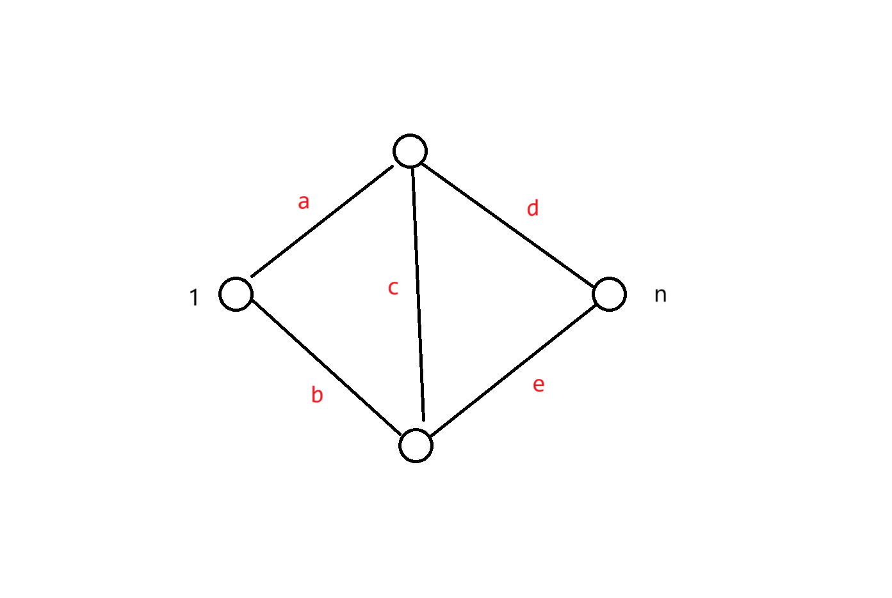
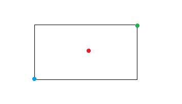
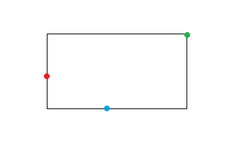

# 2025 年 2 月杂题

## CF1827C Palindrome Partition

[传送门](https://www.luogu.com.cn/problem/CF1827C)

> 题意

- 给定一个长度为 $n$ 的字符串 $s$。
- 定义一个字符串是好的当且仅当它能由若干个（包括一个）长度为偶数的回文串连接得到。
- 问 $s$ 有多少格子串是好的。
- $1\le n\le 5\times 10^5$

> 题解

不难想到 DP，设 $f_i$ 表示以点 $i$ 结尾的好的子串数量。发现问题在于一一个点结尾的回文串可能不止一个。

仔细思考一下，其实我们只需要保留其中最短的一个，因为更长的回文串必定能由若干个更短的拼接得到。

于是 Manacher 的同时做一个区间赋值（我用的栈维护），然后直接转移即可。复杂度 $O(n)$。

/// details | 参考代码
    open: False
    type: success

```cpp
#include<bits/stdc++.h>
#define mem(a,b) memset(a,b,sizeof(a))
#define forup(i,s,e) for(i64 i=(s),E123123=(e);i<=E123123;i++)
#define fordown(i,s,e) for(i64 i=(s),E123123=(e);i>=E123123;i--)
using namespace std;
#ifdef DEBUG
#define msg(args...) fprintf(stderr,args)
#else
#define msg(...) void()
#endif
using i64=long long;
using pii=pair<i64,i64>;
#define fi first
#define se second
#define mkp make_pair
#define gc getchar()
inline i64 read(){
    i64 x=0,f=1;char c;
    while(!isdigit(c=gc)) if(c=='-') f=-1;
    while(isdigit(c)){x=(x<<3)+(x<<1)+(c^48);c=gc;}
    return x*f;
}
#undef gc
const i64 N=5e5+5;
i64 n;
char str[N];
i64 d[N],pd[N],f[N];
void Manacher(){
    forup(i,0,n) pd[i]=d[i]=0;
    i64 l=1,r=0;
    stack<pii> stk;
    forup(i,1,n){
        i64 k=(i>r?0:min(d[l+r-i+1],r-i+1));
        while(i+k<=n&&i-k-1>=1&&str[i+k]==str[i-k-1]) ++k;
        d[i]=k--;
        if(i+k>=r){
            r=i+k;l=i-k-1;
        }
        if(d[i]>0){
            stk.push(mkp(i,i+d[i]));
        }
        while(stk.size()&&stk.top().se<=i) stk.pop();
        if(stk.size()) pd[i]=stk.top().fi;
    }
}
void solve(){
    n=read();
    scanf(" %s",str+1);
    Manacher();
    forup(i,0,n) f[i]=0;
    i64 ans=0;
    forup(i,1,n){
        i64 ss=pd[i];
        if(ss){
            f[i]=f[ss-(i-ss+1)-1]+1;
            ans+=f[i];            
        }
    }
    printf("%lld\n",ans);
}
signed main(){
    i64 t=read();
    while(t--){
        solve();
    }
}
```

///

## P10716 【MX-X1-T4】「KDOI-05」简单的字符串问题

[传送门](https://www.luogu.com.cn/problem/P10716)

> 题意

- 给定一个长度为 $n$ 的字符串，有 $q$ 次询问。
- 每次询问给定一个二元组 $(x,k)$，对于字符串长度为 $s$ 的前缀，问存在多少种不同的字符串 $A$，满足这个前缀的前缀和后缀均为 $A$，且存在一种将此前缀划分为 $2k-1$ 个字符串的方案，使得划分出来的字符串中至少有 $k$ 个是 $A$。
- $1\le n,q\le 2\times 10^5,1\le k\le x\le n$。

> 题解

注意到我们要找的是一个 Border，于是在 KMP 失配树上考虑。不难发现合法的 $A$ 是从失配树根到 $x$ 的某个祖先 $u$ 的一条链，于是我们只需要求出点 $u$ 的深度即可。

于是我们只关注出现 $k$ 次的限制，显然每次贪心地选择最左的，与之前不交的 $A$ 切出来是不劣的，于是贪心地寻找前缀地出现位置，注意到 $n$ 个前缀的总出现次数不会超过 $O(n\log n)$，那么我们只要低复杂度地找到下一次出现即可，最简单地做法是 exKMP $+$ 二分的 $O(n\log^2 n)$，貌似可以链表做到 $O(n\log n)$。

然后查询，离线下来可以 $O(n\log n)$ 倍增，但是我写的在线 $O(n\log^2 n)$。

/// details | 参考代码
    open: False
    type: success

```cpp
#include<bits/stdc++.h>
#define mem(a,b) memset(a,b,sizeof(a))
#define forup(i,s,e) for(int i=(s),E123123=(e);i<=E123123;i++)
#define fordown(i,s,e) for(int i=(s),E123123=(e);i>=E123123;i--)
using namespace std;
#ifdef DEBUG
#define msg(args...) fprintf(stderr,args)
#else
#define msg(...) void()
#endif
using i64=long long;
using pii=pair<int,int>;
#define fi first
#define se second
#define mkp make_pair
#define gc getchar()
inline int read(){
    int x=0,f=1;char c;
    while(!isdigit(c=gc)) if(c=='-') f=-1;
    while(isdigit(c)){x=(x<<3)+(x<<1)+(c^48);c=gc;}
    return x*f;
}
#undef gc
const int N=2e5+5,inf=0x3f3f3f3f;
int n,q;
char str[N];
int nxt[N];
vector<int> e[N];
int f[18][N],dpt[N];
void dfs(int x){
    forup(i,1,17){
        f[i][x]=f[i-1][f[i-1][x]];
    }
    for(auto i:e[x]){
        f[0][i]=x;
        dpt[i]=dpt[x]+1;
        dfs(i);
    }
}
int z[N];
void exKMP(){
	i64 k=2,p=1;
	while(p+1<=n&&str[p]==str[p+1]) ++p;
	z[2]=p-1;z[1]=n;
	forup(i,3,n){
		i64 p=k+z[k]-1,l=z[i-k+1];
		if(i+l<=p){
			z[i]=l;
		}else{
			i64 j=max(0ll,p-i+1);
			while(i+j<=n&&str[i+j]==str[j+1]) ++j;
			z[i]=j;
			k=i;
		}
	}
}
int st[18][N];
void initst(){
    forup(i,1,n){
        st[0][i]=z[i];
    }
    forup(i,0,16){
        forup(j,1,n-(1<<(i+1))+1){
            st[i+1][j]=max(st[i][j],st[i][j+(1<<i)]);
        }
    }
}
int Query(int l,int r){
    int len=31^__builtin_clz(r-l+1);
    return max(st[len][l],st[len][r-(1<<len)+1]);
}
vector<int> vec[N];
int calc(int p,int x){
    if(p==0) return inf;
    return upper_bound(vec[p].begin(),vec[p].end(),x)-vec[p].begin();
}
signed main(){
    n=read();
    scanf(" %s",str+1);
    nxt[1]=0;
    e[0].push_back(1);
    int j=0;
    forup(i,2,n){
        while(j!=0&&str[i]!=str[j+1]) j=nxt[j];
        if(str[i]==str[j+1]) ++j;
        nxt[i]=j;
        e[nxt[i]].push_back(i);
        msg("%d ",nxt[i]);
    }
    msg("||\n");
    mem(f,-1);
    dpt[0]=0;
    dfs(0);
    exKMP();
    forup(i,1,n){
        msg("%d ",z[i]);
    }
    msg("|\n");
    initst();
    forup(i,1,n){
        int p=i+1;
        msg("%d|%d ",i,i);
        vec[i].push_back(i);
        while(p+i-1<=n){
            int ll=p,rr=n-i+1,mm;
            while(ll<rr){
                mm=(ll+rr)>>1;
                if(Query(p,mm)<i) ll=mm+1;
                else rr=mm;
            }
            if(Query(p,ll)>=i){
                vec[i].push_back(ll+i-1);
                msg("%d ",ll+i-1);
            }
            p=ll+i;
        }
        msg("|\n");
    }
    q=read();
    forup(Case,1,q){
        int x=read(),k=read();
        int u=x;
        if(k==1){
            puts("1");
            continue;
        }
        fordown(i,17,0){
            int p=f[i][u];
            if((~p)&&calc(p,x)<k) u=p;
        }
        // msg("%d|\n",u);
        printf("%d\n",dpt[u]-1);
    }
}
```

///

## CF1913F Palindromic Problem

[传送门](https://www.luogu.com.cn/problem/CF1913F)

> 题意

- 给定一个长度为 $n$ 的字符串，你可以修改其中至多一个位置上的字符。
- 问修改过后这个字符串最多有多少个回文子串。并构造方案。若有多个方案输出修改后字典序最小的那个。
- $1\le n\le 3\times 10^5$

> 题解

首先不难想到枚举将哪个位置修改成哪个字符，那么在原先基础上减少的回文串数量是好算的，Manacher 后就是若干个区间加等差数列，维护差分的差分即可。

那么新增的呢？不难发现新增回文串只会在原有的极长回文串边缘往外一格，那么只需要在 Manacher 时求出若两端点外一格变得一样了端点还会再往外延伸多少。可以哈希加二分解决。

然后输出答案是一个简单的贪心，此处略。

复杂度 $O(n\log n+n|\Sigma|)$。

/// details | 参考代码
    open: False
    type: success

```cpp
#include<bits/stdc++.h>
#define mem(a,b) memset(a,b,sizeof(a))
#define forup(i,s,e) for(i64 i=(s),E123123=(e);i<=E123123;i++)
#define fordown(i,s,e) for(i64 i=(s),E123123=(e);i>=E123123;i--)
using namespace std;
#ifdef DEBUG
#define msg(args...) fprintf(stderr,args)
#else
#define msg(...) void()
#endif
using i64=long long;
using pii=pair<i64,i64>;
#define fi first
#define se second
#define mkp make_pair
#define gc getchar()
inline i64 read(){
    i64 x=0,f=1;char c;
    while(!isdigit(c=gc)) if(c=='-') f=-1;
    while(isdigit(c)){x=(x<<3)+(x<<1)+(c^48);c=gc;}
    return x*f;
}
#undef gc
const i64 N=3e5+5;
i64 n;
char str[N];
i64 val[N],adv[N][26];
i64 d[N];
const i64 P=131,mod1=900000011,mod2=900000041,mod3=900000053;
i64 p1[N],p2[N],p3[N];
struct HASH{
    i64 v1,v2,v3;
    HASH(i64 a1,i64 a2,i64 a3):v1(a1),v2(a2),v3(a3){}
    HASH(i64 a):v1(a),v2(a),v3(a){}
    HASH():v1(0),v2(0),v3(0){}
    HASH operator +(const HASH &r)const{
        return HASH((v1+r.v1)%mod1,(v2+r.v2)%mod2,(v3+r.v3)%mod3);
    }
    HASH operator -(const HASH &r)const{
        return HASH((v1+mod1-r.v1)%mod1,(v2+mod2-r.v2)%mod2,(v3+mod3-r.v3)%mod3);
    }
    HASH operator()(const i64 &x)const{
        return HASH(1ll*v1*p1[x]%mod1,1ll*v2*p2[x]%mod2,1ll*v3*p3[x]%mod3);
    }
    bool operator ==(const HASH &r)const{
        return v1==r.v1&&v2==r.v2&&v3==r.v3;
    }
}hs[N],rhs[N];
void iniths(){
    p1[0]=p2[0]=p3[0]=1;
    forup(i,1,n){
        p1[i]=1ll*p1[i-1]*P%mod1;
        p2[i]=1ll*p2[i-1]*P%mod2;
        p3[i]=1ll*p3[i-1]*P%mod3;
    }
}
HASH cuths(i64 l,i64 r,bool p){
    if(l>r) return 0;
    if(p){
        return hs[r]-hs[l-1](r-l+1);
    }else{
        return rhs[l]-rhs[r+1](r-l+1);
    }
}
signed main(){
    n=read();
    scanf(" %s",str+1);
    iniths();
    forup(i,1,n){
        hs[i]=hs[i-1](1)+HASH(str[i]-'a'+1);
    }
    fordown(i,n,1){
        rhs[i]=rhs[i+1](1)+HASH(str[i]-'a'+1);
    }
    mem(d,0);
    i64 l=1,r=0,sum=0;
    forup(i,1,n){
        i64 k=(i>r?0:min(d[l+r-i+1],r-i+1));
        while(i+k<=n&&i-k-1>=1&&str[i+k]==str[i-k-1]) ++k;
        d[i]=k--;
        sum+=d[i];
        if(i+k>=r){
            r=i+k;l=i-k-1;
        }
        if(d[i]>0){
            ++val[i-d[i]];--val[i];
            --val[i+1];++val[i+d[i]+1];
        }
        i64 pl=i-d[i]-1,pr=i+d[i];
        if(pl<1||pr>n) continue;
        i64 ll=0,rr=min(pl-1,n-pr),mm;
        while(ll<rr){
            mm=(ll+rr+1)>>1;
            if(cuths(pl-mm,pl-1,1)==cuths(pr+1,pr+mm,0)) ll=mm;
            else rr=mm-1;
        }
        adv[pl][str[pr]-'a']+=(ll+1);
        adv[pr][str[pl]-'a']+=(ll+1);
        // msg("%lld %lld|(%lld)|\n",pl,pr,ll+1);
    }
    mem(d,0);
    l=1,r=0;
    forup(i,1,n){
        i64 k=(i>r?1:min(d[l+r-i],r-i+1));
        while(i+k<=n&&i-k>=1&&str[i+k]==str[i-k]) ++k;
        d[i]=k--;
        sum+=d[i];
        if(i+k>=r){
            r=i+k;l=i-k;
        }
        if(d[i]>1){
            ++val[i-d[i]+1];--val[i];
            val[i]-=(d[i]-1);val[i+1]+=(d[i]-1);
            val[i+1]+=(d[i]-1);val[i+2]-=(d[i]-1);
            --val[i+2];++val[i+d[i]+1];            
        }
        i64 pl=i-d[i],pr=i+d[i];
        if(pl<1||pr>n) continue;
        i64 ll=0,rr=min(pl-1,n-pr),mm;
        while(ll<rr){
            mm=(ll+rr+1)>>1;
            if(cuths(pl-mm,pl-1,1)==cuths(pr+1,pr+mm,0)) ll=mm;
            else rr=mm-1;
        }
        adv[pl][str[pr]-'a']+=(ll+1);
        adv[pr][str[pl]-'a']+=(ll+1);
        // msg("%lld %lld|(%lld)|\n",pl,pr,ll+1);
    }
    forup(i,1,n){
        val[i]+=val[i-1];
    }
    forup(i,1,n){
        val[i]+=val[i-1];
        adv[i][str[i]-'a']=val[i];
    }
    i64 ans=-1,mx=-1,cc=-1;
    forup(i,1,n){
        forup(j,0,str[i]-'a'-1){
            if(adv[i][j]-val[i]>ans){
                msg("(%lld %lld)%lld|\n",i,j,adv[i][j]-val[i]);
                ans=adv[i][j]-val[i];
                mx=i;cc=j;
            }
        }
        // msg("|\n");
    }
    fordown(i,n,1){
        forup(j,str[i]-'a',25){
            if(adv[i][j]-val[i]>ans){
                msg("(%lld %lld)%lld|\n",i,j,adv[i][j]-val[i]);
                ans=adv[i][j]-val[i];
                mx=i;cc=j;
            }
        }
    }
    printf("%lld\n",sum+ans);
    str[mx]=cc+'a';
    forup(i,1,n){
        printf("%c",str[i]);
    }puts("");
}
/*
5
aabaa

*/
```

///

## CF888G Xor-MST

[传送门](https://www.luogu.com.cn/problem/CF888G)

> 题意

- 有一张 $n$ 个点的完全图，每个点有点权 $a_i$，每条边的边权为两端点点权的异或和。
- 求这张图最小生成树的边权和。
- $1\le n\le 2\times 10^5,0\le a_i < 2^{30}$

> 题解

典题。

先建出点权的 Trie 树，不难发现每个子树内部连通必定优于通过某外部点连通。

那么两子树必定在其 $\mathrm{lca}$ 处通过两子树内最小边连通，直接遍历左子树，再在右子树找异或最小值即可。

因为每个点至多遍历 $O(\log V)$ 次，遍历它需要耗费 $O(\log V)$ 时间，于是复杂度 $O(n\log^2 V)$。

/// details | 参考代码
    open: False
    type: success

```cpp
#include<bits/stdc++.h>
#define mem(a,b) memset(a,b,sizeof(a))
#define forup(i,s,e) for(i64 i=(s),E123123=(e);i<=E123123;i++)
#define fordown(i,s,e) for(i64 i=(s),E123123=(e);i>=E123123;i--)
using namespace std;
#ifdef DEBUG
#define msg(args...) fprintf(stderr,args)
#else
#define msg(...) void()
#endif
using i64=long long;
using pii=pair<i64,i64>;
#define fi first
#define se second
#define mkp make_pair
#define gc getchar()
inline i64 read(){
    i64 x=0,f=1;char c;
    while(!isdigit(c=gc)) if(c=='-') f=-1;
    while(isdigit(c)){x=(x<<3)+(x<<1)+(c^48);c=gc;}
    return x*f;
}
#undef gc
const i64 N=2e5+5,inf=1e18;
i64 n;
i64 tr[N*31][2],cntn;
void Insert(i64 x){
    i64 p=0;
    fordown(i,29,0){
        i64 c=(x>>i)&1;
        if(!tr[p][c]) tr[p][c]=++cntn;
        p=tr[p][c];
    }
}
i64 ans=0,res=0;
void dfs(i64 p,i64 q,i64 d,i64 nw){
    if(d<0){
        res=min(res,nw);
        return;
    }
    forup(s,0,1){
        if(tr[p][s]){
            if(tr[q][s]){
                dfs(tr[p][s],tr[q][s],d-1,nw);
            }else{
                dfs(tr[p][s],tr[q][!s],d-1,nw|(1<<d));
            }
        }        
    }

}
void work(i64 u,i64 d){
    if(d<0) return;
    if(tr[u][0]&&tr[u][1]){
        i64 p=tr[u][0],q=tr[u][1];res=1e18;
        dfs(p,q,d-1,(1<<d));
        ans+=res;
    }
    if(tr[u][0]) work(tr[u][0],d-1);
    if(tr[u][1]) work(tr[u][1],d-1);
}
signed main(){
    n=read();
    forup(i,1,n){
        i64 a=read();
        Insert(a);
    }
    work(0,29);
    printf("%lld\n",ans);
}
```

///

## CF827F Dirty Arkady's Kitchen

[传送门](https://www.luogu.com.cn/problem/CF827F)

> 题意

- 有一张 $n$ 个点 $m$ 条边的无向图，第 $i$ 条边只能在 $[l_i,r_i)$ 之间内通过，并且通过一条边需要 $1$ 单位时间，你不能在某个地方停下。
- 你在 $0$ 时刻位于点 $1$，求到最早哪个时刻到达点 $n$。
- $1\le n\le 5\times 10^5,0\le m\le 5\times 10^5,0\le l < r\le 10^9$

> 题解

比较巧妙的类 dij 算法。

首先注意到不能停下，但是因为是无向图，所以我们可以在一条边上来回走，那么我们按奇偶时间将每个点裂成两个点，那么就是能在一段时间内在一个点上停下了。

考虑对每个点记一个 $L_i$ 表示最早到达时间，显然 $L_i$ 更大的只能被更小的更新，这启发我们构造 dijkstra 模型。

因为时间的限制是在边上的，那么我们不妨将边压入堆内。即堆内每个元素 $(u,L,R)$ 表示在 $L$ 时刻到达点 $u$，并且这条边在 $R$ 时刻之前都能来回走，我们每次可以将 $l_i < R$ 的全部取出来，那么每条边只会被取出一次。复杂度 $O(m\log m)$。

/// details | 参考代码
    open: False
    type: success

```cpp
#include<bits/stdc++.h>
#define mem(a,b) memset(a,b,sizeof(a))
#define forup(i,s,e) for(int i=(s),E123123=(e);i<=E123123;i++)
#define fordown(i,s,e) for(int i=(s),E123123=(e);i>=E123123;i--)
using namespace std;
#ifdef DEBUG
#define msg(args...) fprintf(stderr,args)
#else
#define msg(...) void()
#endif
using i64=long long;
using pii=pair<int,int>;
#define fi first
#define se second
#define mkp make_pair
#define gc getchar()
inline int read(){
    int x=0,f=1;char c;
    while(!isdigit(c=gc)) if(c=='-') f=-1;
    while(isdigit(c)){x=(x<<3)+(x<<1)+(c^48);c=gc;}
    return x*f;
}
#undef gc
const int N=1e6+5,inf=0x3f3f3f3f;
int n,m;
struct edge{
    int v,l,r;
};
vector<edge> e[N];
int pl[N];
struct Node{
    int u,L,R;
    bool operator <(const Node &r)const{return L>r.L;}
};
int dis[N];
void dijkstra(){
    priority_queue<Node> q;
    forup(i,1,n*2) dis[i]=inf;
    dis[1]=0;
    while(pl[1]<(int)e[1].size()&&e[1][pl[1]].l==0){
        q.push(Node{e[1][pl[1]].v,1,e[1][pl[1]].r});
        ++pl[1];
    }
    while(q.size()){
        int u=q.top().u,L=q.top().L,R=q.top().R;q.pop();
        msg("%d(%d %d)|\n",u,L,R);
        dis[u]=min(dis[u],L);
        for(int t=L;pl[u]<(int)e[u].size()&&e[u][pl[u]].l<=R;++pl[u]){
            int l=e[u][pl[u]].l,r=e[u][pl[u]].r;
            if(L>=r) continue;
            if(t<l) t+=((l-t+1)/2)*2;
            if(t>R) break;
            q.push(Node{e[u][pl[u]].v,t+1,r});
        }
    }
}
signed main(){
    n=read();m=read();
    forup(i,1,m){
        int u=read(),v=read(),l=read(),r=read();
        if(r-l>1||(!(l&1))){
            e[u].push_back(edge{v+n,l,r});
            e[v].push_back(edge{u+n,l,r});
        }
        if(r-l>1||(l&1)){
            e[u+n].push_back(edge{v,l,r});
            e[v+n].push_back(edge{u,l,r});
        }
    }
    forup(i,1,n*2){
        sort(e[i].begin(),e[i].end(),[&](edge a,edge b){return a.l<b.l;});
        pl[i]=0;
    }
    dijkstra();
    int ans=min(dis[n],dis[n+n]);
    if(ans==inf){
        puts("-1");
    }else{
        printf("%d\n",ans);
    }
}
```

///

## [AGC025E] Walking on a Tree

[传送门](https://www.luogu.com.cn/problem/AT_agc025_e)

> 题意

- 给定一棵 $n$ 个点的树，并且给定 $m$ 条简单路径。
- 现在你需要对每条路径定向，定义每条树边的权值为经过它的方向数量（比如有两条路径以不同方向经过它权值就是 $2$，如果若干条路径以同一方向经过它就是 $1$，没有路径经过它就是 $0$）。
- 求所有路径权值和的最大值。
- $1\le n,m\le 2000$

> 题解

妙妙题。

考虑设第 $i$ 条边被经过的次数为 $c_i$，不难发现答案的上界是 $\sum_i\min(2,c_i)$。

那么能不能达到这个上界呢？答案是可以的。

考虑将每条路径 $(a,b)$ 连边 $a\leftrightarrow b$，然后每条树边每被覆盖一次就异或 $1$，将最终为 $1$ 的边练出来。在新图上跑欧拉回路。因为每加一条路径每个点度数变化都不改变奇偶性，所以必定存在欧拉回路。然后按我们加的非树边方向对路径定向就能达到这个上界，因为我们“异或”相当于偶数条边抵消，那么将他们加回来再两两设为相反方向仍然是欧拉回路，并且恰好每条路径对应一个环，且权值达到了上界。然后发现每个环在树边上部分的方向恰好与它在非树边上的方向相反（显然全部取反也是对的），于是做完了，复杂度最好能做好 $O(n\log n+m)$，但是我偷懒写的 $O(nm)$。

/// details | 参考代码
    open: False
    type: success

```cpp
#include<bits/stdc++.h>
#define mem(a,b) memset(a,b,sizeof(a))
#define forup(i,s,e) for(int i=(s),E123123=(e);i<=E123123;i++)
#define fordown(i,s,e) for(int i=(s),E123123=(e);i>=E123123;i--)
using namespace std;
#ifdef DEBUG
#define msg(args...) fprintf(stderr,args)
#else
#define msg(...) void()
#endif
using i64=long long;
using pii=pair<int,int>;
#define fi first
#define se second
#define mkp make_pair
#define gc getchar()
inline int read(){
    int x=0,f=1;char c;
    while(!isdigit(c=gc)) if(c=='-') f=-1;
    while(isdigit(c)){x=(x<<3)+(x<<1)+(c^48);c=gc;}
    return x*f;
}
#undef gc
const int N=2005,inf=0x3f3f3f3f;
int n,m;
vector<int> e[N];
struct edge{
    int v,nxt;
}e2[N*4];
int head[N],cnte=1;
int adde(int u,int v){
    e2[++cnte]=edge{v,head[u]};head[u]=cnte;
    e2[++cnte]=edge{u,head[v]};head[v]=cnte;
    return head[u];
}
int ff[N],dpt[N];
void dfs(int x,int fa){
    ff[x]=fa;
    dpt[x]=dpt[fa]+1;
    for(auto i:e[x]){
        if(i==fa) continue;
        dfs(i,x);
    }
}
int val[N],cnt[N];
int vv[N],vis[N*4];
void dfs2(int x){
    vv[x]=1;
    for(int &i=head[x];i;i=e2[i].nxt){
        if(vis[i]||vis[i^1]) continue;
        vis[i]=1;
        dfs2(e2[i].v);
    }
}
int num[N];
int a[N],b[N];
signed main(){
    n=read();m=read();
    forup(i,1,n-1){
        int u=read(),v=read();
        e[u].push_back(v);
        e[v].push_back(u);
    }
    dfs(1,0);
    forup(i,1,m){
        int u=read(),v=read();
        a[i]=u;b[i]=v;
        num[i]=adde(u,v);
        if(dpt[u]>dpt[v]) swap(u,v);
        while(dpt[v]>dpt[u]){
            val[v]^=1;
            ++cnt[v];
            v=ff[v];
        }
        while(u!=v){
            val[u]^=1;val[v]^=1;
            ++cnt[u];++cnt[v];
            u=ff[u];v=ff[v];
        }
    }
    int ans=0;
    forup(i,1,n){
        if(val[i]){
            adde(i,ff[i]);
        }
        ans+=min(2,cnt[i]);
    }
    printf("%d\n",ans);
    forup(i,1,n){
        if(!vv[i]) dfs2(i);
    }
    forup(i,1,m){
        if(vis[num[i]]){
            printf("%d %d\n",b[i],a[i]);
        }else{
            printf("%d %d\n",a[i],b[i]);
        }
    }
}
/*
4 3
2 1
3 1
4 1
2 3
3 4
4 2

*/
```

///

## P6790 [SNOI2020] 生成树

[传送门](https://www.luogu.com.cn/problem/P6790)

> 题意

- 给定一张 $n$ 个点 $m$ 条边的图，满足存在一条边，使得删掉这条边后，这张图不存在两个简单环共用同一条边（即仙人掌图）。
- 求这张图有多少个生成树。
- $1\le n\le 2\times 10^5$

> 题解

科技题。

定义广义串并联图为不含与 $K_4$ 同胚子图的图。不难发现广义串并联图能通过删一度点，缩二度点，合并重边变为一个点。

而显然仙人掌加一条边是一个广义串并联图，因为 $K_4$ 不管删哪条边剩下的部分都存在两个环共用一条边。

那么我们进行以上缩点操作的同时维护每条缩起后的等效边断开/不断开有多少种方案，在删一度点时统计入答案即可，具体实现略。

复杂度 $O(n\log n)$，因为要维护删边我用了 `std::set`，可能有更优的做法。

/// details | 参考代码
    open: False
    type: success

```cpp
#include<bits/stdc++.h>
#define mem(a,b) memset(a,b,sizeof(a))
#define forup(i,s,e) for(int i=(s),E123123=(e);i<=E123123;i++)
#define fordown(i,s,e) for(int i=(s),E123123=(e);i>=E123123;i--)
using namespace std;
#ifdef DEBUG
#define msg(args...) fprintf(stderr,args)
#else
#define msg(...) void()
#endif
using i64=long long;
using pii=pair<int,int>;
#define fi first
#define se second
#define mkp make_pair
#define gc getchar()
inline int read(){
    int x=0,f=1;char c;
    while(!isdigit(c=gc)) if(c=='-') f=-1;
    while(isdigit(c)){x=(x<<3)+(x<<1)+(c^48);c=gc;}
    return x*f;
}
#undef gc
const int N=5e5+5,inf=0x3f3f3f3f,mod=998244353;
int n,m,ans;
multimap<int,int> e[N];
using mit=multimap<int,int>::iterator;
vector<int> v1,v2;
vector<pii> v3;
int f[N][2];
void get(int i){
    if(e[i].size()==1) v1.push_back(i);
    if(e[i].size()==2) v2.push_back(i);
}
void work1(){
    int u=v1.back();v1.pop_back();
    if(e[u].size()!=1) return;
    msg("A %d|\n",u);
    ans=1ll*ans*f[e[u].begin()->se][1]%mod;
    int v=e[u].begin()->fi;
    e[u].clear();e[v].erase(u);
    get(v);
}
void work2(){
    int u=v2.back();v2.pop_back();
    if(e[u].size()!=2) return;
    msg("B %d|\n",u);
    int p=e[u].begin()->fi,a=e[u].begin()->se;
    int q=next(e[u].begin())->fi,b=next(e[u].begin())->se;
    e[u].clear();
    e[p].erase(u);e[q].erase(u);
    if(e[p].find(q)!=e[p].end()) v3.push_back(mkp(p,q));
    e[p].insert(mkp(q,a));
    e[q].insert(mkp(p,a));
    int f0=0,f1=0;
    f0=(1ll*f[a][0]*f[b][1]%mod+1ll*f[a][1]*f[b][0]%mod)%mod;
    f1=1ll*f[a][1]*f[b][1]%mod;
    f[a][0]=f0;f[a][1]=f1;
}
void work3(){
    int u=v3.back().fi,v=v3.back().se;v3.pop_back();
    if(e[u].count(v)<2) return;
    msg("C %d %d|\n",u,v);
    mit it=e[u].lower_bound(v),jt=next(it);
    int a=it->se,b=jt->se;
    e[u].erase(jt);
    mit qt=next(e[v].lower_bound(u));
    e[v].erase(qt);
    int f0=0,f1=0;
    f0=1ll*f[a][0]*f[b][0]%mod;
    f1=(1ll*f[a][1]*f[b][0]%mod+1ll*f[a][0]*f[b][1]%mod)%mod;
    f[a][0]=f0;f[a][1]=f1;
    get(u);get(v);
}
signed main(){
    n=read();m=read();
    forup(i,1,m){
        int u=read(),v=read();
        if(u==v) continue;
        if(e[u].find(v)!=e[u].end()) v3.push_back(mkp(u,v));
        e[u].insert(mkp(v,i));
        e[v].insert(mkp(u,i));
        f[i][0]=f[i][1]=1;
    }
    forup(i,1,n){
        get(i);
    }
    ans=1;
    while(v1.size()||v2.size()||v3.size()){
        if(v3.size()){
            work3();
            continue;
        }
        if(v2.size()){
            work2();
            continue;
        }
        if(v1.size()){
            work1();
            continue;
        }
    }
    printf("%d\n",ans);
}
```

///

## P7353 [2020-2021 集训队作业] Tom & Jerry

[传送门](https://www.luogu.com.cn/problem/P7353)

> 题意

- 有一张 $n$ 个点 $m$ 条边的无向连通图，A 和 B 正在上面进行追逐游戏。
- 两人轮流行动，B 先行动，若某时刻 A 和 B 出现在同一个点上则视为 A 获胜，若在充分长的时间内 A 无法获胜则 B 获胜。
- B 每一回合可以移动任意多步，但是不能经过 A 所在的点。
- A 每回合只能移动一步（经过一条边）。
- 现在有 $q$ 次询问，每次询问若初始 A 在点 $a$ 并且 B 在点 $b$，最终 A 是否获胜。
- $1\le n,m,q\le 10^5,a\ne b$。

> 题解

首先由于 B 不能经过 A 所在的点，不难想到 A 需要待在某个割点才能拦住 B。进而想到建立点双的广义圆方树。

那么在圆方树上考虑 A 是否必胜。不妨假设 $a$ 是树根，那么显然获胜条件大致是把 B 限制在某个子树内直到抓住 B。

考虑对于一个点双，A 能否让 B 无法通过这个点双离开这个子树。不难发现 A 能堵住 B 当且仅当这个点双中方点的父亲能到达其它所有点。我们将这样的方点染成红色，其余染成蓝色。

不难发现 A 能将 B 一直限制在这个子树内当且仅当这个子树内的方点全是红色的。

那么假如 A 不能将 B 限制在一个子树内，A 有没有可能获胜呢？因为 A 不能限制住 B，那么相当于初始 B 取任意位置，显然 B 在任意位置 A 都获胜当且仅当存在一个根使得所有方点都是红色的。

于是简单换根即可解决。我写的比较劣带了 $\log$，或许可以不带。

/// details | 参考代码
    open: False
    type: success

```cpp
#include<bits/stdc++.h>
#define mem(a,b) memset(a,b,sizeof(a))
#define forup(i,s,e) for(int i=(s),E123123=(e);i<=E123123;i++)
#define fordown(i,s,e) for(int i=(s),E123123=(e);i>=E123123;i--)
using namespace std;
#ifdef DEBUG
#define msg(args...) fprintf(stderr,args)
#else
#define msg(...) void()
#endif
using i64=long long;
using pii=pair<int,int>;
#define fi first
#define se second
#define mkp make_pair
#define gc getchar()
inline int read(){
    int x=0,f=1;char c;
    while(!isdigit(c=gc)) if(c=='-') f=-1;
    while(isdigit(c)){x=(x<<3)+(x<<1)+(c^48);c=gc;}
    return x*f;
}
#undef gc
const int N=1e5+5,inf=0x3f3f3f3f;
int n,m,q,cntn;
vector<int> e1[N],e2[N<<1];
int dfn[N],Tm,low[N];
vector<int> stk;
map<int,int> deg[N<<1];
int cnt[N<<1];
void Tarjan(int x){
    dfn[x]=low[x]=++Tm;
    stk.push_back(x);
    for(auto i:e1[x]){
        if(dfn[i]){
            low[x]=min(low[x],dfn[i]);
        }else{
            Tarjan(i);
            low[x]=min(low[x],low[i]);
            if(low[i]==dfn[x]){
                int nw=++cntn;
                msg("%d|",nw);
                for(int v=0;v!=i;){
                    v=stk.back();stk.pop_back();
                    e2[v].push_back(nw);
                    e2[nw].push_back(v);
                    deg[nw][v]=0;++cnt[nw];
                    msg("%d ",v);
                }
                e2[x].push_back(nw);
                e2[nw].push_back(x);
                deg[nw][x]=0;++cnt[nw];
                msg("%d|\n",x);
            }
        }
    }
}
int dpt[N<<1],ff[N<<1],cc[N<<1],sz[N<<1];
int st[N<<1],TT;
void dfs1(int x,int fa){
    st[x]=++TT;
    dpt[x]=dpt[fa]+1;ff[x]=fa;
    cc[x]=(x>n);sz[x]=1;
    for(auto i:e2[x]){
        if(i==fa) continue;
        dfs1(i,x);
        cc[x]+=cc[i];
        sz[x]+=sz[i];
    }
}
int rnum[N<<1],fnum[N<<1];
int f[18][N<<1];
void dfs(int x,int fa){
    f[0][x]=fa;
    forup(i,1,17){
        f[i][x]=f[i-1][f[i-1][x]];
    }
    for(auto i:e2[x]){
        if(i==fa) continue;
        dfs(i,x);
        rnum[x]+=rnum[i];
        if(x<=n&&deg[i][x]==cnt[i]-1){
            ++rnum[x];
        }
    }
}
bool flag=false;
void dfs2(int x,int fa){
    int sum=fnum[x]+rnum[x];
    if(x<=n&&sum==cntn-n){
        flag=true;
    }
    for(auto i:e2[x]){
        if(i==fa) continue;
        if(x>n){
            fnum[i]=sum-rnum[i]+(deg[x][i]==cnt[x]-1);
        }else{
            fnum[i]=sum-rnum[i]-(deg[i][x]==cnt[i]-1);
        }
        dfs2(i,x);
    }
}
int gson(int u,int v){
    fordown(i,17,0){
        if(dpt[f[i][v]]>dpt[u]) v=f[i][v];
    }
    return v;
}
signed main(){
    n=read();m=read();q=read();
    forup(i,1,m){
        int u=read(),v=read();
        e1[u].push_back(v);
        e1[v].push_back(u);
    }
    cntn=n;
    Tarjan(1);
    dfs1(1,0);
    forup(u,1,n){
        for(auto v:e1[u]){
            if(v<u) continue;
            int a=u,b=v;
            if(dpt[a]<dpt[b]) swap(a,b);
            ++deg[ff[a]][u];
            ++deg[ff[a]][v];
        }
    }
    dfs(1,0);
    dfs2(1,0);
    msg("(%d)\n",fnum[10]);
    forup(i,1,q){
        int a=read(),b=read();
        if(flag){
            puts("Yes");
        }else{
            if(st[b]<st[a]||st[a]+sz[a]<=st[b]){
                msg("%d %d|%d|%d %d|\n",a,b,f[0][a],fnum[a],cntn-n-cc[a]);
                puts(fnum[a]==cntn-n-cc[a]?"Yes":"No");
            }else{
                int p=gson(a,b),val=rnum[p]+(deg[p][a]==cnt[p]-1);
                msg("%d %d|%d|%d %d|\n",a,b,p,val,cc[p]);
                puts(val==cc[p]?"Yes":"No");
            }
        }
    }
}
```

///

## QOJ#9904 最小生成树

[传送门](https://qoj.ac/problem/9904)

> 题意

- 有一张 $n$ 个点的完全图，其中边 $(u,v)$ 的边权是 $a_{u_v}$。
- 求这张图最小生成树的边权和。
- $1\le n\le 2\times 10^5$

> 题解

如果考虑 Brouvka，发现我们需要区间挖掉一些位置求最小值，并不好做。于是考虑 Kruskal。

发现大致过程是每次找到最小的 $a_i$，然后一个区间按第一个和最后一个匹配，以此类推。

那么不难发现按连通块染色后，若这个区间是回文的则这个 $a_i$ 不会产生贡献，否则不难用线段树维护哈希，然后二分找到第一个不回文的位置并修改。

复杂度 $O(n\log^2 n)$。

/// details | 参考代码
    open: False
    type: success

```cpp
#include<bits/stdc++.h>
#define mem(a,b) memset(a,b,sizeof(a))
#define forup(i,s,e) for(i64 i=(s),E123123=(e);i<=E123123;i++)
#define fordown(i,s,e) for(i64 i=(s),E123123=(e);i>=E123123;i--)
using namespace std;
#ifdef DEBUG
#define msg(args...) fprintf(stderr,args)
#else
#define msg(...) void()
#endif
using i64=long long;
using u64=unsigned long long;
using pii=pair<i64,i64>;
#define fi first
#define se second
#define mkp make_pair
#define gc getchar()
inline i64 read(){
    i64 x=0,f=1;char c;
    while(!isdigit(c=gc)) if(c=='-') f=-1;
    while(isdigit(c)){x=(x<<3)+(x<<1)+(c^48);c=gc;}
    return x*f;
}
#undef gc
const i64 N=1<<18;
const u64 P=200003;
u64 pw[N];
i64 n,a[N<<1],c[N];
vector<pii> vec;
struct SegTree{
    u64 hs[N<<1][2];
    i64 getlen(i64 id){
        return 1<<(18-(31^__builtin_clz(id)));
    }
    void PushUp(i64 id){
        hs[id][0]=hs[id<<1][0]*pw[getlen(id<<1)]+hs[id<<1|1][0];
        hs[id][1]=hs[id<<1][1]+hs[id<<1|1][1]*pw[getlen(id<<1|1)];
    }
    void Build(){
        forup(i,1,n) hs[i+N][0]=hs[i+N][1]=i;
        fordown(i,N-1,1) PushUp(i);
    }
    void Update(i64 P,i64 X){
        hs[P+N][0]=hs[P+N][1]=X;
        for(i64 i=(P+N)>>1;i;i>>=1) PushUp(i);
    }
    u64 Query(i64 L,i64 R,i64 P){
        u64 res=0;
        if(P==0){
            u64 resl=0,resr=0;
            i64 lenr=0;
            for(i64 l=L+N,r=R+N+1;l<r;l>>=1,r>>=1){
                if(l&1){
                    resl=resl*pw[getlen(l)]+hs[l][0];
                    ++l;
                }
                if(r&1){
                    --r;
                    resr=hs[r][0]*pw[lenr]+resr;
                    lenr+=getlen(r);
                }
            }
            res=resl*pw[lenr]+resr;
        }else{
            u64 resl=0,resr=0;
            i64 lenl=0;
            for(i64 l=L+N,r=R+N+1;l<r;l>>=1,r>>=1){
                if(l&1){
                    resl=resl+hs[l][1]*pw[lenl];
                    lenl+=getlen(l);
                    ++l;
                }
                if(r&1){
                    --r;
                    resr=hs[r][1]+resr*pw[getlen(r)];
                }
            }
            res=resl+resr*pw[lenl];
        }
        return res;
    }
}mt;
i64 fa[N];
vector<i64> meb[N];
i64 getfa(i64 x){return x==fa[x]?x:fa[x]=getfa(fa[x]);}
void Merge(i64 u,i64 v){
    u=getfa(u);v=getfa(v);
    if(u==v) return;
    if(meb[u].size()>meb[v].size()){
        swap(u,v);
    }
    fa[u]=v;
    for(auto i:meb[u]){
        c[i]=c[v];
        mt.Update(i,c[i]);
        meb[v].push_back(i);
    }
    meb[u].clear();
}
signed main(){
    n=read();
    forup(i,3,n*2-1){
        a[i]=read();
        vec.push_back(mkp(a[i],i));
    }
    sort(vec.begin(),vec.end());
    forup(i,1,n) c[i]=i;
    pw[0]=1;
    forup(i,1,n){
        pw[i]=pw[i-1]*P;
        fa[i]=i;
        meb[i].push_back(i);
    }
    mt.Build();
    i64 ans=0;
    forup(l,1,n){
        forup(r,l,n){
            msg("%llu %llu|\n",mt.Query(l,r,0),mt.Query(l,r,1));
        }
    }
    for(auto i:vec){
        i64 p=i.se,v=i.fi;
        i64 r=min(n,p-1),l=p-r;
        if((r-l+1)&1){
            i64 mid=(l+r)/2;
            while(mt.Query(l,mid-1,0)!=mt.Query(mid+1,r,1)){
                i64 ll=0,rr=mid-l,mm;
                while(ll<rr){
                    mm=(ll+rr)>>1;
                    if(mt.Query(l,l+mm,0)==mt.Query(r-mm,r,1)) ll=mm+1;
                    else rr=mm;
                }
                if(ll==mid-l) break;
                Merge(l+ll,r-ll);
                msg("%llu %llu|\n",mt.Query(l,l+ll,0),mt.Query(r-ll,r,1));
                // msg("A %lld|\n",ll);
                ans+=v;
            }
        }else{
            i64 mid=(l+r)/2;
            while(mt.Query(l,mid,0)!=mt.Query(mid+1,r,1)){
                i64 ll=0,rr=mid-l+1,mm;
                while(ll<rr){
                    mm=(ll+rr)>>1;
                    if(mt.Query(l,l+mm,0)==mt.Query(r-mm,r,1)) ll=mm+1;
                    else rr=mm;
                }
                if(ll==mid-l+1) break;
                Merge(l+ll,r-ll);
                msg("B %lld|\n",ll);
                ans+=v;
            }
        }
        msg("%lld %lld|",p,v);
        forup(i,1,n) msg("%lld ",getfa(i));
        msg("|%lld\n",ans);
    }
    printf("%lld\n",ans);
}
```

///

## GYM104076I Shortest Path

[传送门](https://codeforces.com/gym/104076/problem/I)

> 题意

- 有一张 $n$ 个点 $m$ 条边的无向图。
- 给定常数 $x$，令 $D(1,n,i)$ 表示从 $1$ 到 $n$ 经过恰好 $i$ 条边的最短路，若不存在这样的最短路则为 $0$。求 $\sum_{l=1}^x D(1,n,l)$。
- $1\le n\le 2000,0\le m\le 5000,1\le x\le 10^9$，可能有重边自环。答案对 $998244353$ 取模后输出。

> 题解

首先当 $l$ 比较小的时候我们可以拆点破最短路求出，可以 $O(nm)$ 解决。

由于是无向图，不难想到当 $l$ 足够大时最短路中应必定有在一条边上反复横跳的环节。

那么我们可以简略估计一下这个“足够大”是多少，注意到若最短路中出现了偶环或者超过一个奇环必定是不优的，而显然除去环之外是不会经过重复点的，这个环也必定是简单环那么这个“足够大”大致就是 $2n$。

但是显然我们需要枚举这条边具体是哪条（小数据的最短路不一定能应用到大数据），那么就需要算 $1\to u$ 和 $u\to n$ 两条最短路，这个“足够大”取到 $4n$ 会稳妥一点。

那么小于等于 $4n$ 暴力，大于 $4n$ 是若干个一次函数求最小值，用凸包即可解决。

复杂度 $O(nm)$，瓶颈在前面的暴力。

/// details | 参考代码
    open: False
    type: success

```cpp
#include<bits/stdc++.h>
#define mem(a,b) memset(a,b,sizeof(a))
#define forup(i,s,e) for(int i=(s),E123123=(e);i<=E123123;i++)
#define fordown(i,s,e) for(int i=(s),E123123=(e);i>=E123123;i--)
using namespace std;
#ifdef DEBUG
#define msg(args...) fprintf(stderr,args)
#else
#define msg(...) void()
#endif
using i64=long long;
using pii=pair<i64,i64>;
#define fi first
#define se second
#define mkp make_pair
#define gc getchar()
inline int read(){
    int x=0,f=1;char c;
    while(!isdigit(c=gc)) if(c=='-') f=-1;
    while(isdigit(c)){x=(x<<3)+(x<<1)+(c^48);c=gc;}
    return x*f;
}
#undef gc
const i64 N=2005,inf=1e18,mod=998244353,inv2=(mod+1)/2;
int n,m,x,ans;
i64 mn[N];
vector<pii> e[N];
i64 dis[N][N*4];
void dijkstra(int s){
    forup(i,1,n){
        forup(j,0,4*n){
            dis[i][j]=inf;
        }
    }
    dis[s][0]=0;
    forup(d,0,n*4-1){
        forup(u,1,n){
            for(auto i:e[u]){
                int v=i.fi,w=i.se;
                dis[v][d+1]=min(dis[v][d+1],dis[u][d]+w);
            }
        }
    }
}
i64 d1[2][N];
vector<pii> val[2];
i64 get(pii l,int p){
    return l.fi+p*l.se;
}
int intersect(pii a,pii b){
    int ll=0,rr=x+1;
    while(ll<rr){
        int mm=(ll+rr)>>1;
        if(get(a,mm)<get(b,mm)) ll=mm+1;
        else rr=mm;
    }
    return ll;
}
void solve(int p){
    if(val[p].empty()) return;
    sort(val[p].begin(),val[p].end(),[&](pii a,pii b){return a.se>b.se;});
    vector<pair<int,pii>> conv;
    conv.push_back(mkp(0,mkp(3e18,0ll)));
    for(auto i:val[p]){
        while(conv.size()&&get(conv.back().se,conv.back().fi)>=get(i,conv.back().fi)) conv.pop_back();
        if(conv.empty()){
            conv.push_back(mkp(0,i));
        }else{
            int p=intersect(conv.back().se,i);
            if(p<=x) conv.push_back(mkp(p,i));
        }
    }
    int sz=conv.size();
    // msg("%lld=====\n",p);
    forup(i,0,sz-1){
        int l=max(n*4+1,conv[i].fi),r=(i==sz-1?x:conv[i+1].fi-1);
        l=((l&1)==p?l:l+1),r=((r&1)==p?r:r-1);
        if(l>r) continue;
        // msg("%lld %lld|(%lld %lld)|\n",l,r,conv[i].se.fi,conv[i].se.se);
        (ans+=(get(conv[i].se,l)%mod+get(conv[i].se,r)%mod)%mod*((r-l)/2+1)%mod*inv2%mod)%=mod;
    }
}
void solve(){
    n=read();m=read();x=read();
    forup(i,1,n) e[i].clear();
    forup(i,1,m){
        int u=read(),v=read(),w=read();
        e[u].push_back(mkp(v,w));
        if(u!=v) e[v].push_back(mkp(u,w));
    }
    dijkstra(1);
    ans=0;
    forup(i,1,n){
        d1[0][i]=d1[1][i]=2e18;
        mn[i]=inf;
        for(auto j:e[i]){
            mn[i]=min(mn[i],j.se);
        }
    }
    forup(i,0,min(x,n*4)){
        if(dis[n][i]!=inf) (ans+=dis[n][i]%mod)%=mod;
        if(i>n*2) continue;
        forup(j,1,n){
            if(dis[j][i]==inf) continue;
            d1[i&1][j]=min(d1[i&1][j],dis[j][i]-i*mn[j]);
        }
    }
    if(ans==0){
        puts("0");
        return;
    }
    if(x>n*4){
        dijkstra(n);
        val[0].clear();val[1].clear();
        forup(i,1,n){
            i64 nd[2]={2*inf,2*inf};
            forup(j,0,n*2){
                if(dis[i][j]==inf) continue;
                nd[j&1]=min(nd[j&1],dis[i][j]-j*mn[i]);
            }
            // msg("%lld %lld|%lld %lld|\n",d1[0][i],d1[1][i],nd[0],nd[1]);
            if(mn[i]!=inf){
                i64 v0=min(nd[0]+d1[0][i],nd[1]+d1[1][i]),v1=min(nd[1]+d1[0][i],nd[0]+d1[1][i]);
                if(v0<inf) val[0].push_back(mkp(v0,mn[i]));
                if(v1<inf) val[1].push_back(mkp(v1,mn[i]));
            }
        }
        solve(0);solve(1);        
    }
    printf("%d\n",ans);
}
signed main(){
    int t=read();
    while(t--){
        solve();
    }
}
```

///

## P8260 [CTS2022] 燃烧的呐球

[传送门](https://www.luogu.com.cn/problem/P8260)

> 题意

- 给定一棵 $n$ 个点的树和一张 $m$ 个点的完全图。其中完全图上点 $i$ 的权值是一个二元组 $(x_i,y_i)$。
- 定义 $D(u,v)$ 表示在点 $u$ 子树内但不在点 $v$ 子树内的点数。令完全图上，边 $(i,j)$ 的边权为 $w(i,j)=D(x_i,x_j)+D(x_j,x_i)+D(y_i,y_j)+D(y_j,y_i)$。
- 求这张完全图的最小生成树。
- $1\le n\le 10^6,1\le m\le 10^5$

> 题解

屎。

不难想到使用 Brouvka 算法，那么考虑每一轮如何找到**和点 $i$ 不在同一个集合，且 $w(i,j)$ 最小的点 $j$**。

首先“不在同一集合”是易于处理的，我们将点染色，然后维护最小值与**和最小值不同色的最小值**即可，下文不会再提及，只会说“最小值”。

不难发现 $w(i,j)$ 大致是几个子树大小相互加减，并且减法只有在两 $x/y$ 有祖先后代关系时才会出现。那么分以下几种情况讨论离 $i$ 最近的点 $j$：

- $x,y$ 均无祖先后代关系

    最简单的，维护全局最小值即可。注意因为减法不大于加法，这里可以重复贡献。

- $x,y$ 其中一个有祖先后代关系。

    不妨设有祖先后代关系的为 $x$。那么分两种情况：

    - $j$ 是 $i$ 的祖先。

        直接 DFS 维护这条链的最小值即可，退出时注意撤销。

    - $i$ 是 $j$ 的祖先。

        可以 DSU on tree 维护，复杂度 $O(n\log n)$。

- $x,y$ 均有祖先后代关系。

    分三种情况：

    - $x_j$ 是 $x_i$ 的祖先。$y_j$ 是 $y_i$ 的后代（或者两边都反过来）。

        我们 DFS $x$ 的这一维，那么 $y$ 的这一维就是单点修子树求最小值，在 dfs 序上开线段树即可。

        注意这个线段树需要支持撤销，可以存下修改前的每个点值，暴力赋值回去即可。

    - $x_j$ 是 $x_i$ 的祖先。$y_j$ 是 $y_i$ 的祖先。

        可以 DFS 其中一维，另一位区间取最小值单点查询，因为需要支持撤销，所以标记永久化，然后还是暴力撤销

    - $x_j$ 是 $x_i$ 的后代。$y_j$ 是 $y_i$ 的后代。

        想要单 $\log$ 可以线段树合并，但是众所周知线段树合并维护子树信息一般不如 DSU on tree 加线段树的双 $\log$ 快，后者因为能复用上面的线段树还会短一些。

于是做完了，复杂度大常数 $O(n+m\log^2 m)$ 或者小常数 $O(n+m\log^3 m)$（注意 Brouvka 还带一个 $log$），为什么这里都是 $m$ 呢？因为我们只关注 $O(m)$ 个关键点的祖先后代关系，那么其实我们可以只保留这一部分点，每个点向最近的关键祖先连边即可。

/// details | 参考代码
    open: False
    type: success

9kb 巨型代码。

```cpp
#include<bits/stdc++.h>
#define mem(a,b) memset(a,b,sizeof(a))
#define forup(i,s,e2) for(int i=(s),E123123=(e2);i<=E123123;i++)
#define fordown(i,s,e2) for(int i=(s),E123123=(e2);i>=E123123;i--)
using namespace std;
#ifdef DEBUG
#define msg(args...) fprintf(stderr,args)
#else
#define msg(...) void()
#endif
using i64=long long;
using pii=pair<int,int>;
#define fi first
#define se second
#define mkp make_pair
#define gc getchar()
inline int read(){
    int x=0,f=1;char c;
    while(!isdigit(c=gc)) if(c=='-') f=-1;
    while(isdigit(c)){x=(x<<3)+(x<<1)+(c^48);c=gc;}
    return x*f;
}
#undef gc
const int N=1<<20,inf=0x3f3f3f3f;
int n,m;
pii po[N];
vector<int> vp[2][N];
vector<int> e[N];
vector<int> e2[N];
int dfn[N],Tm,sz[N],mp[N],val[N];
int son[N];
struct Node{
    pii mn,sec;
    int mnc;
    Node(){
        mn=sec=mkp(inf,0);
        mnc=0;
    }
    void operator ()(pii X,int C){
        if(X<mn){
            if(C==mnc){
                mn=X;
            }else{
                sec=mn;
                mn=X;mnc=C;
            }
        }else if(X<sec&&C!=mnc){
            sec=X;
        }
    }
    Node operator +(Node R){
        Node res=*this;
        res(R.mn,R.mnc);
        res(R.sec,0);
        return res;
    }
    pii get(int C){
        return mnc==C?sec:mn;
    }
};
namespace Seg2{
    struct SegTree{
        Node tr[N<<1];
        vector<vector<pair<int,Node>>> ver;
        void Update(int L,int R,pii X,int C){
            vector<pair<int,Node>> vec;
            auto modi=[&](int id){
                vec.push_back(mkp(id,tr[id]));
                tr[id](X,C);
            };
            for(int l=L+N,r=R+N+1;l<r;l>>=1,r>>=1){
                if(l&1) modi(l++);
                if(r&1) modi(--r);
            }
            ver.push_back(vec);
        }
        void rollback(){
            vector<pair<int,Node>> vec=ver.back();ver.pop_back();
            for(auto i:vec){
                tr[i.fi]=i.se;
            }
        }
        pii Query(int P,int C){
            pii res=mkp(inf,0);
            for(int i=P+N;i;i>>=1){
                res=min(res,tr[i].get(C));
            }
            return res;
        }
    }mt;
}
namespace Seg3{
    struct SegTree{
        Node tr[N<<1];
        vector<vector<pair<int,Node>>> ver;
        void Update(int P,pii X,int C){
            vector<pair<int,Node>> vec;
            for(int i=P+N;i;i>>=1){
                vec.push_back(mkp(i,tr[i]));
                tr[i](X,C);
            }
            ver.push_back(vec);
        }
        void rollback(){
            vector<pair<int,Node>> vec=ver.back();ver.pop_back();
            for(auto i:vec){
                tr[i.fi]=i.se;
            }
        }
        void clear(){
            while(ver.size()) rollback();
        }
        pii Query(int L,int R,int C){
            pii res=mkp(inf,0);
            auto work=[&](int id){
                res=min(res,tr[id].get(C));
            };
            for(int l=L+N,r=R+N+1;l<r;l>>=1,r>>=1){
                if(l&1) work(l++);
                if(r&1) work(--r);
            }
            return res;
        }
    }mt;
}
void dfs0_(int x,int pre){
    if(x!=1&&(vp[0][x].size()||vp[1][x].size())){
        e2[pre].push_back(x);
        pre=x;
    }
    val[x]=1;
    for(auto i:e[x]){
        dfs0_(i,pre);
        val[x]+=val[i];
    }
}
void dfs0(int x){
    dfn[x]=++Tm;sz[x]=1;
    son[x]=0;
    mp[dfn[x]]=x;
    for(auto i:e2[x]){
        dfs0(i);
        sz[x]+=sz[i];
        if(!son[x]||sz[i]>sz[son[x]]) son[x]=i;
    }
}
pii to[N];
int cnt;
i64 ans;
struct DSU{
    int fa[N];
    void init(){
        forup(i,1,m) fa[i]=i;
    }
    int getfa(int x){return x==fa[x]?x:fa[x]=getfa(fa[x]);}
    bool Merge(int u,int v){
        u=getfa(u);v=getfa(v);
        if(u==v) return false;
        fa[u]=v;
        --cnt;
        return true;
    }
}dsu;
int mn[N];
void dfs1(int x){
    for(auto i:vp[0][x]){
        int u=po[i].se,c=dsu.getfa(i);
        Seg2::mt.Update(dfn[u],dfn[u]+sz[u]-1,mkp(val[po[i].fi]+val[po[i].se],i),c);
        Seg3::mt.Update(dfn[u],mkp(val[po[i].fi]-val[po[i].se],i),c);
    }
    for(auto i:vp[0][x]){
        int u=po[i].se,c=dsu.getfa(i);
        pii rr=Seg2::mt.Query(dfn[u],c);
        rr.fi=rr.fi-val[po[i].fi]-val[po[i].se];
        to[c]=min(to[c],rr);
        rr=Seg3::mt.Query(dfn[u],dfn[u]+sz[u]-1,c);
        rr.fi=rr.fi-val[po[i].fi]+val[po[i].se];
        to[c]=min(to[c],rr);
    }
    for(auto i:e2[x]){
        dfs1(i);
    }
    for(auto i:vp[0][x]){
        Seg2::mt.rollback();
        Seg3::mt.rollback();
    }
}
void dfs2(int x){
    for(auto i:vp[1][x]){
        int u=po[i].fi,c=dsu.getfa(i);
        Seg3::mt.Update(dfn[u],mkp(-val[po[i].fi]+val[po[i].se],i),c);
    }
    for(auto i:vp[1][x]){
        int u=po[i].fi,c=dsu.getfa(i);
        pii rr=Seg3::mt.Query(dfn[u],dfn[u]+sz[u]-1,c);
        rr.fi=rr.fi+val[po[i].fi]-val[po[i].se];
        to[c]=min(to[c],rr);
    }
    for(auto i:e2[x]){
        dfs2(i);
    }
    for(auto i:vp[1][x]){
        Seg3::mt.rollback();
    }
}
void dfs3(int x){
    for(auto i:e2[x]){
        if(i==son[x]) continue;
        dfs3(i);
        Seg3::mt.clear();
    }
    if(son[x]){
        dfs3(son[x]);
    }
    auto work=[&](int i){
        int v=-val[po[i].fi]-val[po[i].se],c=dsu.getfa(i);
        Seg3::mt.Update(dfn[po[i].se],mkp(v,i),c);
    };
    for(auto i:vp[0][x]){
        work(i);
    }
    for(auto u:e2[x]){
        if(u==son[x]) continue;
        forup(i,dfn[u],dfn[u]+sz[u]-1){
            for(auto j:vp[0][mp[i]]){
                work(j);
            }
        }
    }
    for(auto i:vp[0][x]){
        int v=val[po[i].fi]+val[po[i].se],c=dsu.getfa(i),u=po[i].se;
        pii rr=Seg3::mt.Query(dfn[u],dfn[u]+sz[u]-1,c);
        rr.fi+=v;
        to[c]=min(to[c],rr);
    }
}
namespace sub{
    Node mn;
    void dfs4(int x,int t){
        Node pmn=mn;
        for(auto i:vp[t][x]){
            int v=val[po[i].fi]+val[po[i].se],c=dsu.getfa(i);
            mn(mkp(v,i),c);
        }
        for(auto i:vp[t][x]){
            int v=-val[po[i].fi]+val[po[i].se],c=dsu.getfa(i);
            if(t==1) v=-v;
            pii rr=mn.get(c);
            rr.fi+=v;
            to[c]=min(to[c],rr);
        }
        for(auto i:e2[x]){
            dfs4(i,t);
        }
        mn=pmn;
    }
    void dfs5(int x,int t){
        for(auto i:e2[x]){
            if(i==son[x]) continue;
            dfs5(i,t);
            mn=Node();
        }
        if(son[x]){
            dfs5(son[x],t);
        }
        auto work=[&](int i){
            int v=-val[po[i].fi]+val[po[i].se],c=dsu.getfa(i);
            if(t==1) v=-v;
            mn(mkp(v,i),c);
        };
        for(auto i:vp[t][x]){
            work(i);
        }
        for(auto u:e2[x]){
            if(u==son[x]) continue;
            forup(i,dfn[u],dfn[u]+sz[u]-1){
                for(auto j:vp[t][mp[i]]){
                    work(j);
                }
            }
        }
        for(auto i:vp[t][x]){
            int v=val[po[i].fi]+val[po[i].se],c=dsu.getfa(i);
            pii rr=mn.get(c);
            rr.fi+=v;
            to[c]=min(to[c],rr);
        }
    }
}
void getto(){
    pii amn=mkp(inf,0),asec=mkp(inf,0);
    int amnc=0;
    forup(i,1,m){
        mn[i]=inf;
        to[i]=mkp(inf,0);
    }
    forup(i,1,m){
        int v=val[po[i].fi]+val[po[i].se],c=dsu.getfa(i);
        mn[c]=min(mn[c],v);
    }
    forup(i,1,m){
        if(mn[i]!=inf){
            if(mkp(mn[i],i)<amn){
                asec=amn;
                amn=mkp(mn[i],i);amnc=i;
            }else if(mkp(mn[i],i)<asec){
                asec=mkp(mn[i],i);
            }
        }
    }
    forup(i,1,m){
        int c=dsu.getfa(i),v=val[po[i].fi]+val[po[i].se];
        if(c==amnc){
            pii nw=asec;
            nw.fi+=v;
            to[c]=min(to[c],nw);
        }else{
            pii nw=amn;
            nw.fi+=v;
            to[c]=min(to[c],nw);
        }
    }
    dfs1(1);
    dfs2(1);
    dfs3(1);
    Seg3::mt.clear();
    sub::dfs4(1,0);
    sub::dfs4(1,1);
    sub::dfs5(1,0);
    sub::mn=Node();
    sub::dfs5(1,1);
    sub::mn=Node();
}
void mergeto(){
    forup(i,1,m){
        if(dsu.fa[i]==i){
            if(to[i].fi!=inf&&dsu.Merge(i,to[i].se)){
                ans+=to[i].fi;
            }
        }
    }
}
signed main(){
    n=read();m=read();
    forup(i,2,n){
        int f=read();
        e[f].push_back(i);
    }
    forup(i,1,m){
        po[i].fi=read();po[i].se=read();
        vp[0][po[i].fi].push_back(i);
        vp[1][po[i].se].push_back(i);
    }
    dfs0_(1,1);
    dfs0(1);
    cnt=m;
    dsu.init();
    while(cnt>1){
        getto();
        mergeto();
    }
    printf("%lld\n",ans);
}
```

///

## P8426 [JOI Open 2022] 放学路（School Road）

[传送门](https://www.luogu.com.cn/problem/P8426)

> 题意

- 给定一张 $n$ 个点 $m$ 条边的无向图。
- 问这张图存不存在 $1$ 到 $n$ 的严格简单次短路。
- $2\le n\le 10^5,1\le m\le 2\times 10^5$。

> 题解

妙妙题。

不难想到若图上只有若干条从 $1$ 到 $n$ 并且两两不交的路径时是好做的，因为此时路径数是 $O(n)$ 的，但是路径有交时就不好做了，此时路径数会飙升到指数级别。

不难想到对这张图进行类似广义串并联图的缩点（注意不要缩点 $1$ 和 $n$），发现若最终只剩 $1,n$ 和中间这条边，那么其实可以在缩点的途中记录这条边有多少种不同的走法。

但是缩到不能缩的情况呢？一个结论是：这种情况必定有解。

不难想到不能缩的情况必定包含和下图同胚的子图：



显然 $a+d,a+c+e,b+e,b+d+c$ 不可能全部相等，则必定存在严格最短路。

我写的带 $\log$，或许可以不带吧。

/// details | 参考代码
    open: False
    type: success

```cpp
#include<bits/stdc++.h>
#define mem(a,b) memset(a,b,sizeof(a))
#define forup(i,s,e) for(i64 i=(s),E123123=(e);i<=E123123;i++)
#define fordown(i,s,e) for(i64 i=(s),E123123=(e);i>=E123123;i--)
using namespace std;
#ifdef DEBUG
#define msg(args...) fprintf(stderr,args)
#else
#define msg(...) void()
#endif
using i64=long long;
using pii=pair<i64,i64>;
#define fi first
#define se second
#define mkp make_pair
#define gc getchar()
inline i64 read(){
    i64 x=0,f=1;char c;
    while(!isdigit(c=gc)) if(c=='-') f=-1;
    while(isdigit(c)){x=(x<<3)+(x<<1)+(c^48);c=gc;}
    return x*f;
}
#undef gc
const i64 N=1e5+5;
i64 n,m,cnt;
multimap<i64,i64> e[N];
using mit=multimap<i64,i64>::iterator;
vector<i64> v1,v2;
vector<pii> v3;
void get(i64 i){
    if(i==1||i==n) return;
    if(e[i].size()==1) v1.push_back(i);
    if(e[i].size()==2) v2.push_back(i);
}
void work1(){
    i64 u=v1.back();v1.pop_back();
    if(e[u].size()!=1) return;
    i64 v=e[u].begin()->fi;
    e[u].clear();e[v].erase(u);
    get(v);
    --cnt;
}
void work2(){
    i64 u=v2.back();v2.pop_back();
    if(e[u].size()!=2) return;
    i64 p=e[u].begin()->fi,a=e[u].begin()->se;
    i64 q=next(e[u].begin())->fi,b=next(e[u].begin())->se;
    e[u].clear();
    e[p].erase(u);e[q].erase(u);
    if(e[p].find(q)!=e[p].end()) v3.push_back(mkp(p,q));
    if(a!=-1&&b!=-1){
        e[p].insert(mkp(q,a+b));
        e[q].insert(mkp(p,a+b));
    }else{
        e[p].insert(mkp(q,-1));
        e[q].insert(mkp(p,-1));
    }
    --cnt;
}
void work3(){
    i64 u=v3.back().fi,v=v3.back().se;v3.pop_back();
    mit it=e[u].lower_bound(v),jt=next(it);
    i64 a=it->se,b=jt->se;
    e[u].erase(jt);
    mit pt=e[v].lower_bound(u),qt=next(pt);
    e[v].erase(qt);
    if(a!=b||a==-1||b==-1){
        it->se=pt->se=-1;
    }
    get(u);get(v);
}
signed main(){
    n=read();m=read();
    forup(i,1,m){
        i64 u=read(),v=read(),w=read();
        if(u==v) continue;
        if(e[u].find(v)!=e[u].end()) v3.push_back(mkp(u,v));
        e[u].insert(mkp(v,w));
        e[v].insert(mkp(u,w));
    }
    forup(i,1,n){
        get(i);
    }
    cnt=n;
    while(v1.size()||v2.size()||v3.size()){
        if(v3.size()){
            work3();
            continue;
        }
        if(v2.size()){
            work2();
            continue;
        }
        if(v1.size()){
            work1();
            continue;
        }
        msg("%lld %lld %lld|\n",v1.size(),v2.size(),v3.size());
    }
    if(cnt>2||e[1].begin()->se==-1){
        puts("1");
    }else{
        puts("0");
    }
}
```

///

## P7307 [COCI 2018/2019 #1] Teoretičar

[传送门](https://www.luogu.com.cn/problem/P7307)

> 题意

- 给定一张左部点 $l$ 个，右部点 $r$ 个，$m$ 条边的二分图。
- 你需要对边染色，使得每个结点所有出边的颜色两两不同。
- 设所需最小颜色数是 $C$（根据结论，$C$ 是度数最大的点的度数），设 $X$ 为大于等于 $C$ 的最小的 $2$ 的非负整数次幂。你需要保证你使用的颜色数不多于 $X$。
- $1\le l,r\le 10^5,1\le m\le 5\times 10^5$

> 题解

构造题。

当构造题的限制条件中出现了 $2$ 的非负整数次幂时就应联想到分治构造。

考虑这样做：每次将边集划分为两个集合，使得每个点的出边尽量平均地划分成两半，这样 $O(\log C)$ 层后每个集合里每个点的度数都不超过 $1$ 了，全部染成一种颜色即可。

那么怎么做呢？尽量平均就是说两边的差越小越好。这让我们联想到欧拉回路构造。我们建立两个超级源点（左右部各一个）消除奇度数，在这张图上跑欧拉回路。从左往右的边分入第一个边集，从右往左的分入第二个即可。

复杂度 $O(n\log n)$，此处认为 $n,m$ 同阶。

/// details | 参考代码
    open: False
    type: success

```cpp
#include<bits/stdc++.h>
#define mem(a,b) memset(a,b,sizeof(a))
#define forup(i,s,e) for(int i=(s),E123123=(e);i<=E123123;i++)
#define fordown(i,s,e) for(int i=(s),E123123=(e);i>=E123123;i--)
using namespace std;
#ifdef DEBUG
#define msg(args...) fprintf(stderr,args)
#else
#define msg(...) void()
#endif
using i64=long long;
using pii=pair<int,int>;
#define fi first
#define se second
#define mkp make_pair
#define gc getchar()
inline int read(){
    int x=0,f=1;char c;
    while(!isdigit(c=gc)) if(c=='-') f=-1;
    while(isdigit(c)){x=(x<<3)+(x<<1)+(c^48);c=gc;}
    return x*f;
}
#undef gc
const int N=2e5+5,M=5e5+5,inf=0x3f3f3f3f;
int l,r,n,m,cntc,co[M];
struct Node{
    int u,v,pos;
};
Node s[M],ns[M];
int num[M];
struct edge{
    int v,nxt;
}e[M<<2];
int head[N+2],deg[N+2],vv[N+2],cnte;
int vis[M<<2];
int adde(int u,int v){
    e[++cnte]=edge{v,head[u]};head[u]=cnte;
    e[++cnte]=edge{u,head[v]};head[v]=cnte;
    ++deg[u];++deg[v];
    return head[u];
}
void dfs(int x){
    vv[x]=1;
    for(int &i=head[x];i;i=e[i].nxt){
        int v=e[i].v;
        if(vis[i]||vis[i^1]) continue;
        vis[i]=1;
        dfs(v);
    }
}
void solve(int l,int r){
    if(l>r) return;
    forup(i,1,cnte) vis[i]=0;
    cnte=1;
    vector<int> vec;
    vec.push_back(n+1);vec.push_back(n+2);
    forup(i,l,r){
        vec.push_back(s[i].u);
        vec.push_back(s[i].v);
    }
    sort(vec.begin(),vec.end());
    vec.erase(unique(vec.begin(),vec.end()),vec.end());
    for(auto u:vec){
        head[u]=deg[u]=vv[u]=0;
    }
    forup(i,l,r){
        num[i]=adde(s[i].u,s[i].v);
    }
    bool flag=true;
    for(auto u:vec){
        if(deg[u]>1){
            flag=false;
            break;
        }
    }
    if(flag){
        ++cntc;
        forup(i,l,r){
            co[s[i].pos]=cntc;
        }
        return;
    }
    for(auto u:vec){
        if(deg[u]&1) adde(u,n+1+(u>l));
    }
    if(deg[n+1]&1) adde(n+1,n+2);
    for(auto i:vec){
        if(!vv[i]){
            dfs(i);
        }
    }
    int pl=l,pr=r;
    forup(i,l,r){
        if(vis[num[i]]){
            ns[pl++]=s[i];
        }else{
            ns[pr--]=s[i];
        }
    }
    forup(i,l,r){
        s[i]=ns[i];
    }
    assert(l<=pl-1&&pl<=r);
    solve(l,pl-1);solve(pl,r);
}
signed main(){
    l=read();r=read();m=read();
    n=l+r;
    forup(i,1,m){
        int u=read(),v=read();
        s[i]=Node{u,v+l,i};
    }
    solve(1,m);
    printf("%d\n",cntc);
    forup(i,1,m){
        printf("%d\n",co[i]);
    }
}
```

///

## QOJ#3629 「2021 集训队互测」序列

[传送门](https://loj.ac/p/3629)

> 题意

- 有一个长度为 $n$ 的序列，有 $m$ 个限制。
- 每个限制形如 $(x,y,z,p)$，表示 $a_x,a_y,a_z$ 的中位数是 $p$。
- 构造一个这样的序列，或报告无解。
- $1\le n,m\le 10^5$，构造出的 $a_i$ 必须在 $[1,10^9]$ 之间。

> 题解

不难构造 2-SAT 模型。

三个数的中位数可以这样构造：

- 若其中一个数小于 $p$，另外两个都要大于等于 $p$。
- 若其中一个数大于 $p$，另外两个都要小于等于 $p$。

那么我们对每个位置开若干个点（即将和这个点有关的限制离散化），表示“$a_i$ 是否大于等于 $p$”，根据套路再开一个取反的点，即“$a_i$ 是否严格小于 $p$”。因为要表示“严格大于 $p$”所以额外开一个 $p+1$ 的点即可。

然后注意内部连边，注意不能小于 $1$ 或者大于等于 $10^9+1$（这个是经典的）。

复杂度 $O(n)$，常数巨大。

/// details | 参考代码
    open: False
    type: success

```cpp
#include<bits/stdc++.h>
#define mem(a,b) memset(a,b,sizeof(a))
#define forup(i,s,e) for(int i=(s),E123123=(e);i<=E123123;i++)
#define fordown(i,s,e) for(int i=(s),E123123=(e);i>=E123123;i--)
using namespace std;
#ifdef DEBUG
#define msg(args...) fprintf(stderr,args)
#else
#define msg(...) void()
#endif
using i64=long long;
using pii=pair<int,int>;
#define fi first
#define se second
#define mkp make_pair
#define gc getchar()
inline int read(){
    int x=0,f=1;char c;
    while(!isdigit(c=gc)) if(c=='-') f=-1;
    while(isdigit(c)){x=(x<<3)+(x<<1)+(c^48);c=gc;}
    return x*f;
}
#undef gc
const int N=1e5+5;
int n,m,cntn;
vector<int> num[N],les[N],grt[N];
struct lim{
    int i,j,k,x;
}s[N];
vector<int> e[N*16];
int dfn[N*16],low[N*16],ist[N*16],Tm;
int blg[N*16],csc;
vector<int> stk;
void Tarjan(int x){ 
    dfn[x]=low[x]=++Tm;
    ist[x]=1;stk.push_back(x);
    for(auto i:e[x]){
        if(!dfn[i]){
            Tarjan(i);
            low[x]=min(low[x],low[i]);
        }else if(ist[i]){
            low[x]=min(low[x],dfn[i]);
        }
    }
    if(low[x]==dfn[x]){
        ++csc;
        for(int v=0;v!=x;){
            v=stk.back();stk.pop_back();
            blg[v]=csc;
            ist[v]=0;
        }
    }
}
int ans[N];
signed main(){
    n=read();m=read();
    forup(i,1,m){
        int x=read(),y=read(),z=read(),p=read();
        num[x].push_back(p);num[y].push_back(p);num[z].push_back(p);
        num[x].push_back(p+1);num[y].push_back(p+1);num[z].push_back(p+1);
        s[i]=lim{x,y,z,p};
    }
    forup(i,1,n){
        num[i].push_back(1);num[i].push_back(1e9+1);
        sort(num[i].begin(),num[i].end());
        num[i].erase(unique(num[i].begin(),num[i].end()),num[i].end());
        int sz=num[i].size();
        les[i].resize(sz,0);grt[i].resize(sz,0);
        forup(j,0,sz-1){
            les[i][j]=++cntn;grt[i][j]=++cntn;
        }
        forup(j,0,sz-1){
            if(j>0) e[grt[i][j]].push_back(grt[i][j-1]);
            if(j<sz-1) e[les[i][j]].push_back(les[i][j+1]);
        }
        e[les[i].front()].push_back(grt[i].front());
        e[grt[i].back()].push_back(les[i].back());
    }
    forup(i,1,m){
        int x=s[i].i,y=s[i].j,z=s[i].k,p=s[i].x;
        int nx=lower_bound(num[x].begin(),num[x].end(),p)-num[x].begin(),
            ny=lower_bound(num[y].begin(),num[y].end(),p)-num[y].begin(),
            nz=lower_bound(num[z].begin(),num[z].end(),p)-num[z].begin();
        e[les[x][nx]].push_back(grt[y][ny]);e[les[x][nx]].push_back(grt[z][nz]);
        e[les[y][ny]].push_back(grt[x][nx]);e[les[y][ny]].push_back(grt[z][nz]);
        e[les[z][nz]].push_back(grt[x][nx]);e[les[z][nz]].push_back(grt[y][ny]);
        nx=lower_bound(num[x].begin(),num[x].end(),p+1)-num[x].begin(),
        ny=lower_bound(num[y].begin(),num[y].end(),p+1)-num[y].begin(),
        nz=lower_bound(num[z].begin(),num[z].end(),p+1)-num[z].begin();
        e[grt[x][nx]].push_back(les[y][ny]);e[grt[x][nx]].push_back(les[z][nz]);
        e[grt[y][ny]].push_back(les[x][nx]);e[grt[y][ny]].push_back(les[z][nz]);
        e[grt[z][nz]].push_back(les[x][nx]);e[grt[z][nz]].push_back(les[y][ny]);
    }
    forup(i,1,cntn){
        if(!dfn[i]) Tarjan(i);
    }
    forup(u,1,n){
        int sz=num[u].size();
        forup(i,0,sz-1){
            if(blg[grt[u][i]]==blg[les[u][i]]){
                puts("NO");
                return 0;
            }
            if(blg[grt[u][i]]<blg[les[u][i]]){
                ans[u]=num[u][i];
            }
        }
    }
    puts("YES");
    forup(i,1,n){
        printf("%d ",ans[i]);
    }puts("");
}
```

///

## QOJ#4219 Insects

[传送门](https://qoj.ac/problem/4219)

> 题意

- 有一个平面直角坐标系，上面有 $n$ 个黑点，第 $i$ 个黑点的坐标为 $(x_i,y_i)$。
- 有 $m$ 次加入白点的操作。每次加入后，设这个白点坐标为 $(X,Y)$，向所有 $x_i\le X$ 且 $y_i\le Y$ 的黑点连有向边。
- 显然这是一个二分图，每次操作后求这张图的最小点覆盖。
- $1\le n,m\le 10^5,0\le x_i,y_i,X_i,Y_i\le 10^5$

> 题解

妙妙题。

考虑最小点覆盖不好做，转化为最大独立集。

这张图最大独立集显然形如一条折线，保留左下角所有白点和右上角所有黑点。不难发现随着白点的加入这条折线是单调向右上方移动的。即某个时刻折线左下方的白点在此后都会产生贡献，黑点都不会。右上方的黑点在此前都会产生贡献，白点都不会。

我们发现任意时刻的折线都能把点集分为两部分，折线左下的点集在这个时刻**之后贡献全都确定了**，右上的在这个时刻**之前贡献全都确定了**。这启发我们进行整体二分。

那么我们只需要对一个固定的状况求出这条折线。考虑最大独立集和最大匹配的关系：任意一个匹配的两点中有且仅有一个点产生贡献。那么我们可以贪心地对每个黑点匹配一个纵坐标最小的白点（从右往左扫即可），此时必定存在一条折线使得未匹配的白点全在左下方，未匹配的黑点全在右上方，并且任意一对匹配点在折线同侧。证明分类讨论即可，此处略。

然后我们可以从左往右贪心地确定这条折线，任意时刻让折线尽可能高即可。

总复杂度 $O(n\log^2 n)$。

/// details | 参考代码
    open: False
    type: success

```cpp
#include<bits/stdc++.h>
#define mem(a,b) memset(a,b,sizeof(a))
#define forup(i,s,e) for(int i=(s),E123123=(e);i<=E123123;i++)
#define fordown(i,s,e) for(int i=(s),E123123=(e);i>=E123123;i--)
using namespace std;
#ifdef DEBUG
#define msg(args...) fprintf(stderr,args)
#else
#define msg(...) void()
#endif
using i64=long long;
using pii=pair<int,int>;
#define fi first
#define se second
#define mkp make_pair
#define gc getchar()
inline int read(){
    int x=0,f=1;char c;
    while(!isdigit(c=gc)) if(c=='-') f=-1;
    while(isdigit(c)){x=(x<<3)+(x<<1)+(c^48);c=gc;}
    return x*f;
}
#undef gc
const int N=1e5+5,inf=0x3f3f3f3f;
int n,m,ans[N];
struct Point{
    int x,y,pos,t;
}s[N*2],sv[N*2];
void solve(int ql,int qr,int pl,int pr){
    if(ql>qr||pl>pr) return;
    int mid=(ql+qr)>>1;
    vector<Point> vec;
    forup(i,pl,pr){
        if(s[i].t<=mid){
            vec.push_back(s[i]);
        }
    }
    sort(vec.begin(),vec.end(),[&](Point a,Point b){
        if(a.x!=b.x) return a.x<b.x;
        if(a.y!=b.y) return a.y<b.y;
        return a.t<b.t;
    });
    multiset<pii> ss;
    using mit=multiset<pii>::iterator;
    vector<Point> wp,bp;
    vector<pair<Point,Point>> vp;
    reverse(vec.begin(),vec.end());
    for(auto i:vec){
        if(i.t){
            ss.insert(mkp(i.y,i.pos));
        }else{
            mit it=ss.lower_bound(mkp(i.y,-1));
            if(it==ss.end()){
                bp.push_back(i);
            }else{
                msg("(%d %d|%d %d)\n",sv[i.pos].x,sv[i.pos].y,sv[it->se].x,sv[it->se].y);
                vp.push_back(mkp(sv[it->se],sv[i.pos]));
                ss.erase(it);
            }
        }
    }
    for(auto i:ss){
        wp.push_back(sv[i.se]);
    }
    vector<Point> vl=wp,vr=bp;
    forup(i,pl,pr){
        if(s[i].t>mid){
            vr.push_back(s[i]);
        }
    }
    int l=0,mn=inf;
    int valL=wp.size(),valR=bp.size();
    reverse(vp.begin(),vp.end());
    sort(bp.begin(),bp.end(),[&](Point a,Point b){return a.x<b.x;});
    for(auto i:vp){
        while(l<(int)bp.size()&&bp[l].x<=i.se.x){
            mn=min(mn,bp[l].y);
            ++l;
        }
        if(i.fi.y<mn){
            msg("L [%d](%d %d|%d %d)\n",mn,i.fi.x,i.fi.y,i.se.x,i.se.y);
            vl.push_back(i.fi);vl.push_back(i.se);
            ++valL;
        }else{
            msg("R [%d](%d %d|%d %d)\n",mn,i.fi.x,i.fi.y,i.se.x,i.se.y);
            vr.push_back(i.fi);vr.push_back(i.se);
            mn=min(mn,i.se.y);
            ++valR;
        }
    }
    ans[mid]+=valL;ans[qr+1]-=valL;
    ans[ql]+=valR;ans[mid+1]-=valR;
    forup(i,pl,pr){
        if(s[i].t<=mid){
            msg("%d %d(%d)\n",s[i].x,s[i].y,s[i].t==0);
        }
    }
    msg("(%d %d %d)[%d %d](%d %d){%d %d}[%d %d]\n",ql,mid,qr,(int)wp.size(),(int)bp.size(),pl,pr,(int)vl.size(),(int)vr.size(),valL,valR);
    forup(i,0,vl.size()-1){
        s[pl+i]=vl[i];
    }
    forup(i,0,vr.size()-1){
        s[pr-i]=vr[i];
    }
    solve(ql,mid-1,pl,pl+vl.size()-1);solve(mid+1,qr,pl+vl.size(),pr);
}
signed main(){
    n=read();
    forup(i,1,n){
        int x=read(),y=read();
        s[i]=sv[i]=Point{x,y,i,0};
    }
    m=read();
    forup(i,1,m){
        int x=read(),y=read();
        s[i+n]=sv[i+n]=Point{x,y,i+n,i};
    }
    solve(1,m,1,n+m);
    forup(i,1,m){
        ans[i]+=ans[i-1];
        printf("%d\n",n+i-ans[i]);
    }
}
```

///

## P8326/LOJ#3682 [COCI 2021/2022 #5] Fliper

[传送门](https://loj.ac/p/3682)

> 题意

- 有一块理想平面，上面有 $n$ 个与坐标轴成 $45^{\circ}$ 夹角的挡板。
- 有一个小球平行于坐标轴行动，小球碰到挡板会立刻将自身运动方向顺时针或逆时针旋转 $90^{\circ}$。显然从任意整点开始向任意方向行动，小球最终都会在若干挡板之间循环或者沿着某个方向匀速前进。
- 现在你需要将挡板涂成四种颜色之一。使得任意一个循环中，四种颜色出现次数相同，且都是偶数。
- 构造方案，或返回无解。
- $1\le n\le 5\times 10^5$

> 题解

首先不难把每个挡板看作两个度数为 $2$ 的点，那么整张图就是若干个环或者链。显然链是没用的，于是我们暂时不管它们。

不难想到把每个环看作点，挡板看作边，就转化成了一个边染色问题，那么我们可以将图上的所有连向链链的边连向超级源点。容易猜到结论：有解当且仅当除去超级源点外每个点度数都是 $8$ 的倍数。考虑构造证明：

首先只有两种颜色的边染色问题是容易的，跑欧拉回路，然后回路上相邻边染成不同颜色即可。

那么有四种颜色呢？由于每个点度数都是 $8$ 的倍数，那么除以二后还是 $4$ 的倍数，黑白染色后两种颜色的边构成的子图仍然存在欧拉回路。于是做完了。

可能会考虑超级源点的度数问题，由于其它点度数都是偶数，那么超级源点度数也是偶数。

复杂度 $O(n)$。

/// details | 参考代码
    open: False
    type: success

```cpp
#include<bits/stdc++.h>
#define mem(a,b) memset(a,b,sizeof(a))
#define forup(i,s,e) for(int i=(s),E123123=(e);i<=E123123;i++)
#define fordown(i,s,e) for(int i=(s),E123123=(e);i>=E123123;i--)
using namespace std;
#ifdef DEBUG
#define msg(args...) fprintf(stderr,args)
#else
#define msg(...) void()
#endif
using i64=long long;
using pii=pair<int,int>;
#define fi first
#define se second
#define mkp make_pair
#define gc getchar()
inline int read(){
    int x=0,f=1;char c;
    while(!isdigit(c=gc)) if(c=='-') f=-1;
    while(isdigit(c)){x=(x<<3)+(x<<1)+(c^48);c=gc;}
    return x*f;
}
#undef gc
const int N=5e5+5,inf=0x3f3f3f3f;
int n,h,w;
char str[5];
vector<int> lshx,lshy;
struct Node{
    int x,y,p;
}s[N];
vector<int> vx[N],vy[N];
vector<int> e1[N*2];
int co[N*2];
bool flag;
void dfs(int x){
    co[x]=-1;
    if(e1[x].size()!=2) flag=false;
    for(auto i:e1[x]){
        if(co[i]) continue;
        dfs(i);
    }
}
void dfs2(int x,int c){
    co[x]=c;
    for(auto i:e1[x]){
        if(co[i]!=-1) continue;
        dfs2(i,c);
    }
}
struct edge{
    int v,w,nxt;
}e[N*2];
int head[N],cur[N],cnte=1,deg[N];
void adde(int u,int v,int w){
    e[++cnte]=edge{v,w,head[u]};head[u]=cnte;
    e[++cnte]=edge{u,w,head[v]};head[v]=cnte;
    ++deg[u];++deg[v];
}
int vv[N],vis[N*2];
int tp[N];
vector<int> vec;
void dfs3(int x){
    vv[x]=1;
    for(int &i=cur[x];i;i=e[i].nxt){
        int v=e[i].v,w=e[i].w;
        if(vis[i]||vis[i^1]) continue;
        vis[i]=1;
        dfs3(v);
        vec.push_back(w);
    }
}
int ans[N];
void dfs4(int x,int pt){
    vv[x]=1;
    for(int &i=cur[x];i;i=e[i].nxt){
        int v=e[i].v,w=e[i].w;
        if(vis[i]||vis[i^1]||tp[w]!=pt) continue;
        vis[i]=1;
        dfs4(v,pt);
        vec.push_back(w);
    }
}
signed main(){
    n=read();
    forup(i,1,n){
        s[i].x=read();s[i].y=read();
        lshx.push_back(s[i].x);
        lshy.push_back(s[i].y);
        scanf(" %s",str);
        if(str[0]=='/'){
            s[i].p=0;
        }else{
            s[i].p=1;
        }
    }
    sort(lshx.begin(),lshx.end());
    lshx.erase(unique(lshx.begin(),lshx.end()),lshx.end());
    h=lshx.size();
    sort(lshy.begin(),lshy.end());
    lshy.erase(unique(lshy.begin(),lshy.end()),lshy.end());
    w=lshy.size();
    forup(i,1,n){
        s[i].x=lower_bound(lshx.begin(),lshx.end(),s[i].x)-lshx.begin()+1;
        s[i].y=lower_bound(lshy.begin(),lshy.end(),s[i].y)-lshy.begin()+1;
        vx[s[i].x].push_back(i);
        vy[s[i].y].push_back(i);
    }
    forup(u,1,h){
        int pre=-1;
        sort(vx[u].begin(),vx[u].end(),[&](int a,int b){
            return s[a].y<s[b].y;
        });
        for(auto i:vx[u]){
            int nd=i;
            if(~pre){
                e1[pre].push_back(nd);
                e1[nd].push_back(pre);
            }
            pre=i+n;
        }
    }
    forup(u,1,w){
        int pre=-1;
        sort(vy[u].begin(),vy[u].end(),[&](int a,int b){
            return s[a].x<s[b].x;
        });
        for(auto i:vy[u]){
            int nd=s[i].p?i:i+n;
            if(~pre){
                e1[pre].push_back(nd);
                e1[nd].push_back(pre);
            }
            pre=s[i].p?i+n:i;
        }
    }
    int cntc=0;
    forup(i,1,n*2){
        if(!co[i]){
            flag=true;
            dfs(i);
            if(flag){
                dfs2(i,++cntc);
            }
        }
    }
    forup(i,1,n*2){
        if(co[i]==-1) co[i]=0;
    }
    forup(i,1,n){
        msg("(%d %d)\n",co[i],co[i+n]);
    }msg("===\n");
    forup(i,1,n){
        adde(co[i],co[i+n],i);
    }
    forup(i,1,cntc){
        if(deg[i]%8!=0){
            puts("-1");
            return 0;
        }
    }
    forup(i,0,cntc) cur[i]=head[i];
    forup(i,0,cntc){
        if(!vv[i]){
            vec.clear();
            dfs3(i);
            forup(i,0,vec.size()-1){
                tp[vec[i]]=i&1;
            }
        }
    }
    forup(i,1,n){
        msg("%d ",tp[i]);
    }msg("|\n");
    forup(i,0,cntc) vv[i]=0;
    forup(i,0,cnte) vis[i]=0;
    forup(i,0,cntc) cur[i]=head[i];
    forup(i,0,cntc){
        if(!vv[i]){
            vec.clear();
            dfs4(i,0);
            forup(i,0,vec.size()-1){
                ans[vec[i]]=(i&1)+1;
            }
        }
    }
    forup(i,0,cntc) vv[i]=0;
    forup(i,0,cnte) vis[i]=0;
    forup(i,0,cntc) cur[i]=head[i];
    forup(i,0,cntc){
        if(!vv[i]){
            vec.clear();
            dfs4(i,1);
            forup(i,0,vec.size()-1){
                ans[vec[i]]=(i&1)+3;
            }
        }
    }
    forup(u,0,cntc){
        msg("%d|",u);
        int c[5]={0,0,0,0,0},ct[2]={0,0};
        for(int i=head[u];i;i=e[i].nxt){
            ++c[ans[e[i].w]];
            ++ct[tp[e[i].w]];
            // msg("%d ",ans[e[i].w]);
        }
        msg("%d %d|%d %d %d %d|\n",ct[0],ct[1],c[1],c[2],c[3],c[4]);
    }
    forup(i,1,n){
        if(ans[i]==0) ans[i]=1;
        printf("%d ",ans[i]);
    }
    puts("");
}
```

///

## Yosupo - wildcard_pattern_matching（带通配符的字符串匹配）

[传送门](https://vjudge.net/problem/Yosupo-wildcard_pattern_matching)

> 题意

- 带通配符的字符串匹配，其中通配符是 `*`。
- 给定两个字符串 $S,T$，其中 $S,T$ 里面均有通配符，满足 $|T|\le |S|$。
- 输出一个长度为 $|S|-|T|+1$ 的 $01$ 串，其中点 $i$ 为 $1$ 当且仅当：
    - $S[i:i+|T|-1]=T$
- $1\le |T|\le |S|\le 2^{19}$，字符不是小写英文字母就是 `*`。

> 题解

不是哥们谁能想到多项式啊。

本文字符串下标从 $0$ 开始。

考虑这么一个进行字符串匹配的方法：

设 $f(x)=\sum_{i=0}^{m-1}(S_{x+i}-T_i)^2$（这里 $-$ 指字符编号减法，显然可以给字符随意映射不同的编号，后面会再次提及）。不难发现 $T$ 能与 $S[x:x+|T|-1]$ 当且仅当 $f(x)=0$。

那么带通配符怎么办呢？显然只要让有通配符的位置恒等于 $0$ 即可。设 $[C]$ 表示若 $C$ 是通配符则取 $0$，否则取 $1$，有：

$$
f(x)=\sum_{i=0}^{m-1}(S_{x+i}-T_i)^2[S_{x+i}][T_i]
$$

进行一个括号的拆：

$$
\begin{aligned}
f(x)&=\sum_{i=0}^{m-1}(S_{x+i}-T_i)^2[S_{x+i}][T_i]\\\\
    &=\sum_{i=0}^{m-1}S_{x+i}^2[S_{x+i}][T_i]+T_i^2[S_{x+i}][T_i]-2S_{x+i}T_i[S_{x+i}][T_i]
\end{aligned}
$$

我们令 $A_{i}=T_{m-1-i}$，则上式等于：

$$
\begin{aligned}
&=\sum_{i=0}^{m-1}S_{x+i}^2[S_{x+i}][T_i]+T_i^2[S_{x+i}][T_i]-2S_{x+i}T_i[S_{x+i}][T_i]\\\\
&=\sum_{i=0}^{m-1}S_{x+i}^2[S_{x+i}][A_{m-1-i}]+A_{m-1-i}^2[S_{x+i}][A_{m-1-i}]-2S_{x+i}A_i[S_{x+i}][A_{m-1-i}]\\\\
\end{aligned}
$$

不难发现这个式子里面所有位置 $S$ 和 $A$ 的下标加起来都是 $x+m-1$。换句话说，**若 $S$ 和 $A$ 进行 $+,\times$ 卷积得到的数列 $g$，那么 $g_{x+m-1}$ 与 $f(x)$ 恰好相等**。

于是做三次 NTT 得到三组点值，加起来再 INTT 回来即可。复杂度 $O(n\log n)$。

注意 NTT 需要对 $998244353$ 取模，可能会取模冲突，所以对所有字母随机编号。也就是说，这其实是个非确定性算法。

/// details | 参考代码
    open: False
    type: success

```cpp
#include<bits/stdc++.h>
#define mem(a,b) memset(a,b,sizeof(a))
#define forup(i,s,e) for(int i=(s),E123123=(e);i<=E123123;i++)
#define fordown(i,s,e) for(int i=(s),E123123=(e);i>=E123123;i--)
using namespace std;
#ifdef DEBUG
#define msg(args...) fprintf(stderr,args)
#else
#define msg(...) void()
#endif
using i64=long long;
using pii=pair<int,int>;
#define fi first
#define se second
#define mkp make_pair
#define gc getchar()
inline int read(){
    int x=0,f=1;char c;
    while(!isdigit(c=gc)) if(c=='-') f=-1;
    while(isdigit(c)){x=(x<<3)+(x<<1)+(c^48);c=gc;}
    return x*f;
}
#undef gc
const int N=1<<19|5,p=1<<19,mod=998244353,inv3=332748118;
int ksm(int a,int b){
    int c=1;
    while(b){
        if(b&1) c=1ll*a*c%mod;
        a=1ll*a*a%mod;
        b>>=1;
    }
    return c;
}
int n,m;
mt19937 mr(20071221);
int mp[26];
char s[N],t[N];
int rev(int x){
    int res=0;
    forup(i,0,18){
        res=(res<<1)|(x&1);
        x>>=1;
    }
    return res;
}
int f[N],g[N],ans[N];
void NTT(int *f,int type){
    forup(i,0,p-1){
        int r=rev(i);
        if(i<r) swap(f[i],f[r]);
    }
    for(int len=1;len<p;len<<=1){
        int wn=ksm(type==1?3:inv3,(mod-1)/(len<<1));
        for(int i=0;i<p;i+=(len<<1)){
            int nw=1;
            forup(j,0,len-1){
                int x=f[i+j],y=1ll*nw*f[i+len+j]%mod;
                f[i+j]=(x+y)%mod;
                f[i+len+j]=(x+mod-y)%mod;
                nw=1ll*nw*wn%mod;
            }
        }
    }
    if(type==-1){
        int inv=ksm(p,mod-2);
        forup(i,0,p-1){
            f[i]=1ll*f[i]*inv%mod;
        }
    }
}
void convolution(){
    NTT(f,1);NTT(g,1);
    forup(i,0,p-1) (ans[i]+=1ll*f[i]*g[i]%mod)%=mod;
}
signed main(){
    forup(i,0,25) mp[i]=(unsigned int)mr()%998244353;
    scanf(" %s",s);
    scanf(" %s",t);
    n=strlen(s);m=strlen(t);
    mem(f,0);mem(g,0);
    forup(i,0,n-1){
        int v=(s[i]=='*'?0:mp[s[i]-'a']);
        f[i]=1ll*v*v%mod;
    }
    forup(i,0,m-1){
        g[m-1-i]=(t[i]!='*');
    }
    convolution();
    mem(f,0);mem(g,0);
    forup(i,0,n-1){
        f[i]=(s[i]!='*');
    }
    forup(i,0,m-1){
        int v=(t[i]=='*'?0:mp[t[i]-'a']);
        g[m-1-i]=1ll*v*v%mod;
    }
    convolution();
    mem(f,0);mem(g,0);
    forup(i,0,n-1){
        int v=(s[i]=='*'?0:mp[s[i]-'a']);
        f[i]=(mod-2ll*v%mod)%mod;
    }
    forup(i,0,m-1){
        int v=(t[i]=='*'?0:mp[t[i]-'a']);
        g[m-1-i]=v;
    }
    convolution();
    NTT(ans,-1);
    forup(i,m-1,n-1){
        printf("%d",(ans[i]==0));
    }
}
```

///

## CF1975G Zimpha Fan Club

[传送门](https://www.luogu.com.cn/problem/CF1975G)

> 题意

- 给定两个字符串 $s,t$，长度分别为 $n,m$。
- $s,t$ 由以下字符组成：
    - 小写英文字母。
    - `-`：可以替换成任意一个小写英文字母。
    - `*`：可以替换成任意一个由小写英文字母组成的字符串（包括空串）。
- 求是否存在一种替换方案使得 $s'=t'$。
- $1\le n,m\le 2\times 10^6$，时限 12s。

> 题解

会了上面一道题就是简单分类讨论了：

- $s,t$ 中均无 `*`

    直接挨个比较就行了。

- $s,t$ 中均有 `*`

    只要在第一个 `*` 之前的前缀和最后一个 `*` 之后的后缀都能匹配就行了，还是挨个比较。

- $s,t$ 其中一个中有 `*`

    这个情况比较困难。

---

对于第三种情况，不妨设 $t$ 中有 `*`。

首先不难转化成开头和结尾都是 `*`，那么只需要管中间的段了。

一个贪心是将 $t$ 内 `*` 中间的字符串从左往右贪心地匹配最左的点，这个贪心是显然正确的。并且一个简单的 $O(n\log^2 n)$ 做法是直接二分，然后用上一题的做法判断能否匹配。

但是有个很妙的方法，设我们要匹配的字符串长度为 $l$，那么我们截取 $s$ 未匹配段开头长度 $2l$ 的段。若这一段不能匹配则长度为 $l$ 的前半段就没用了。那么 $s$ 中每一段只会被匹配 $O(1)$ 次。总复杂度就变成了 $O(n\log n)$。

注意一些边界情况，比如下面这组数据：

```
3 5
aba
ab*ba
```

/// details | 参考代码
    open: False
    type: success

```cpp
#include<bits/stdc++.h>
#define mem(a,b) memset(a,b,sizeof(a))
#define forup(i,s,e) for(int i=(s),E123123=(e);i<=E123123;i++)
#define fordown(i,s,e) for(int i=(s),E123123=(e);i>=E123123;i--)
using namespace std;
#ifdef DEBUG
#define msg(args...) fprintf(stderr,args)
#else
#define msg(...) void()
#endif
using i64=long long;
using pii=pair<int,int>;
#define fi first
#define se second
#define mkp make_pair
#define gc getchar()
inline int read(){
    int x=0,f=1;char c;
    while(!isdigit(c=gc)) if(c=='-') f=-1;
    while(isdigit(c)){x=(x<<3)+(x<<1)+(c^48);c=gc;}
    return x*f;
}
#undef gc
const int N=1<<21|5,mod=998244353,inv3=(mod+1)/3;
int n,m;
string s,t;
mt19937 mr(20071221);
int mp[26];
namespace sub1{
    void solve(){
        if(n!=m){
            puts("No");
            return;
        }
        forup(i,0,n-1){
            if(s[i]!=t[i]&&s[i]!='-'&&t[i]!='-'){
                puts("No");
                return;
            }
        }
        puts("Yes");
    }
}
namespace sub2{
    void solve(){
        int sl=0,tl=0;
        while(s[sl]!='*'&&t[tl]!='*'){
            if(s[sl]!=t[tl]&&s[sl]!='-'&&t[tl]!='-'){
                puts("No");
                return;
            }
            ++sl;++tl;
        }
        sl=n-1;tl=m-1;
        while(s[sl]!='*'&&t[tl]!='*'){
            if(s[sl]!=t[tl]&&s[sl]!='-'&&t[tl]!='-'){
                puts("No");
                return;
            }
            --sl;--tl;
        }
        puts("Yes");
    }
}
namespace sub3{
    int ksm(int a,int b){
        int c=1;
        while(b){
            if(b&1) c=1ll*a*c%mod;
            a=1ll*a*a%mod;
            b>>=1;
        }
        return c;
    }
    int rev(int x,int w){
        int res=0;
        forup(i,1,w){
            res=(res<<1)|(x&1);
            x>>=1;
        }
        return res;
    }
    int f[N],g[N],ans[N];
    void NTT(int *f,int p,int type){
        int w=31^__builtin_clz(p);
        forup(i,0,p-1){
            int r=rev(i,w);
            if(i<r) swap(f[i],f[r]);
        }
        for(int len=1;len<p;len<<=1){
            int wn=ksm(type==1?3:inv3,(mod-1)/(len<<1));
            for(int i=0;i<p;i+=(len<<1)){
                int nw=1;
                forup(j,0,len-1){
                    int x=f[i+j],y=1ll*nw*f[i+len+j]%mod;
                    f[i+j]=(x+y)%mod;
                    f[i+len+j]=(x+mod-y)%mod;
                    nw=1ll*nw*wn%mod;
                }
            }
        }
        if(type==-1){
            int inv=ksm(p,mod-2);
            forup(i,0,p-1){
                f[i]=1ll*f[i]*inv%mod;
            }
        }
    }
    void convolution(int p){
        NTT(f,p,1);NTT(g,p,1);
        forup(i,0,p-1) (ans[i]+=1ll*f[i]*g[i]%mod)%=mod;
    }
    int match(int sl,int sr,int tl,int tr){
        msg("%d %d|%d %d|\n",sl,sr,tl,tr);
        int p=1,len=max(sr-sl,tr-tl);
        while(p<len) p<<=1;
        forup(i,0,p-1) f[i]=g[i]=ans[i]=0;
        forup(i,sl,sr-1){
            int v=(s[i]=='-'?0:mp[s[i]-'a']);
            f[i-sl]=1ll*v*v%mod;
        }
        forup(i,tl,tr-1){
            g[tr-1-i]=(t[i]!='-');
        }
        convolution(p);
        forup(i,0,p-1) f[i]=g[i]=0;
        forup(i,sl,sr-1){
            f[i-sl]=(s[i]!='-');
        }
        forup(i,tl,tr-1){
            int v=(t[i]=='-'?0:mp[t[i]-'a']);
            g[tr-1-i]=1ll*v*v%mod;
        }
        convolution(p);
        forup(i,0,p-1) f[i]=g[i]=0;
        forup(i,sl,sr-1){
            int v=(s[i]=='-'?0:mp[s[i]-'a']);
            f[i-sl]=(mod-2ll*v%mod)%mod;
        }
        forup(i,tl,tr-1){
            int v=(t[i]=='-'?0:mp[t[i]-'a']);
            g[tr-1-i]=v;
        }
        convolution(p);
        NTT(ans,p,-1);
        forup(i,tr-tl-1,sr-sl-1){
            if(ans[i]==0){
                return sl+i;
            }
        }
        return -1;
    }
    void solve(){
        int sl=0,tl=0;
        while(s[sl]!='*'&&t[tl]!='*'){
            msg("%d %d|%c %c\n",sl,tl,s[sl],t[tl]);
            if(s[sl]!=t[tl]&&s[sl]!='-'&&t[tl]!='-'){
                puts("No");
                return;
            }
            ++sl;++tl;
        }
        int sr=n-1,tr=m-1;
        while(s[sr]!='*'&&t[tr]!='*'){
            if(s[sr]!=t[tr]&&s[sr]!='-'&&t[tr]!='-'){
                puts("No");
                return;
            }
            --sr;--tr;
        }
        if(sl>sr+1||tl>tr+1){
            puts("No");
            return;
        }
        s=s.substr(sl,sr-sl+1);
        t=t.substr(tl,tr-tl+1);
        n=s.size();m=t.size();
        int L=0;
        for(int l=0;l<m;){
            if(t[l]=='*'){
                ++l;continue;
            }
            int r=l;
            while(t[r]!='*') ++r;
            int len=r-l;
            bool flag=false;
            while(L+len<=n){
                int pp=match(L,min(n,L+len*2),l,r);
                if(pp!=-1){
                    L=pp+1;
                    flag=true;
                    break;
                }
                L+=len;
            }
            if(!flag){
                puts("No");
                return;
            }
            l=r;
        }
        puts("Yes");
    }
}
signed main(){
    std::ios::sync_with_stdio(false);
    cin.tie(0);cout.tie(0);
    forup(i,0,25) mp[i]=(unsigned int)mr()%mod;
    cin>>n>>m>>s>>t;
    bool f1=false,f2=false;
    forup(i,0,n-1) if(s[i]=='*') f1=true;
    forup(i,0,m-1) if(t[i]=='*') f2=true;
    if(!f1&&!f2){
        sub1::solve();
    }else if(f1&&f2){
        sub2::solve();
    }else{
        if(f1){
            swap(n,m);swap(s,t);
        }
        sub3::solve();
    }
}
```

///

## GYM102956B Beautiful Sequence Unraveling

[传送门](https://codeforces.com/gym/102956/problem/B)

> 题意

- 给定 $n,m$，问有多少个长度为 $n$，值域为 $[1,m]$ 的序列 $a$，满足：

    $$
    \forall 1\le i \le n-1,\max_{j=1}^ia_j\ne \min_{j=i+1}^na_j
    $$

- 答案对一个给定质数 $p$ 取模。
- $1\le n\le 400,1\le m\le 10^8,998244353\le p\le 10^9+9$

> 题解

比较套路的 DP。

首先不妨把值域缩成 $n$，然后可以组合数回去得到 $m$，这里我们需要恰好使用了 $k$ 种不同的数的答案，简单容斥即可。

然后对于值域为 $n$ 可以简单 DP，设 $f_{i,j}$ 表示 $n=i,m=j$ 的答案，转移就枚举最后一个不合法点和这个点的前缀 $\max$ 容斥掉，则：

$$
f_{i,j}=j^i-\sum_{k=1}^{i-1}\sum_{t=1}^j(t^k-(t-1)^k)(f_{i-k,j-t+1}-f_{i-k,j-t})
$$

暴力是 $O(n^4)$ 的，不难前缀和 $k$ 这一维优化成 $O(n^3)$。

/// details | 参考代码
    open: False
    type: success

```cpp
#include<bits/stdc++.h>
#define mem(a,b) memset(a,b,sizeof(a))
#define forup(i,s,e) for(int i=(s),E123123=(e);i<=E123123;i++)
#define fordown(i,s,e) for(int i=(s),E123123=(e);i>=E123123;i--)
using namespace std;
#ifdef DEBUG
#define msg(args...) fprintf(stderr,args)
#else
#define msg(...) void()
#endif
using i64=long long;
using pii=pair<int,int>;
#define fi first
#define se second
#define mkp make_pair
#define gc getchar()
inline int read(){
    int x=0,f=1;char c;
    while(!isdigit(c=gc)) if(c=='-') f=-1;
    while(isdigit(c)){x=(x<<3)+(x<<1)+(c^48);c=gc;}
    return x*f;
}
#undef gc
const int N=405,inf=0x3f3f3f3f;
int n,m,mod;
int inv[N];
int pw[N][N],ipw[N][N],binom[N][N];
int f[N][N];
int binom_bl(int n,int m){
    if(n<m) return 0;
    int res=1;
    forup(i,1,m){
        res=1ll*res*inv[i]%mod*(n-i+1)%mod;
    }
    return res;
}
int a[N];
int p0[N][N],p1[N][N];
signed main(){
    n=read();m=read();mod=read();
    inv[1]=1;
    forup(i,2,n){
        inv[i]=1ll*(mod-mod/i)*inv[mod%i]%mod;
    }
    forup(i,1,n){
        pw[i][0]=ipw[i][0]=1;
        forup(j,1,n){
            pw[i][j]=1ll*pw[i][j-1]*i%mod;
            ipw[i][j]=1ll*ipw[i][j-1]*inv[i]%mod;
        }
    }
    forup(i,0,n){
        binom[i][0]=1;
        forup(j,1,i){
            binom[i][j]=(binom[i-1][j]+binom[i-1][j-1])%mod;
        }
    }
    forup(i,1,n){
        f[1][i]=i;
    }
    forup(j,2,n){
        forup(t,2,j){
            p0[t][0]=0;
            forup(k,1,n){
                int vr=(f[k][j-t+1]+mod-f[k][j-t])%mod;
                p0[t][k]=(p0[t][k-1]+1ll*ipw[t][k]*vr%mod)%mod;
                p1[t][k]=(p1[t][k-1]+1ll*ipw[t-1][k]*vr%mod)%mod;
            }
        }
        p0[1][0]=0;
        int vr=(f[1][j]+mod-f[1][j-1])%mod;
        p0[1][1]=(p0[1][0]+1ll*ipw[1][1]*vr%mod)%mod;
        p1[1][1]=(p1[1][0]+1ll*ipw[0][1]*vr%mod)%mod;
        forup(i,2,n){
            int val=0;
            forup(t,1,j){
                (val+=1ll*pw[t][i]*p0[t][i-1]%mod)%=mod;
                val=(val+mod-1ll*pw[t-1][i]*p1[t][i-1]%mod)%mod;
            }
            f[i][j]=(pw[j][i]+mod-val)%mod;
            int vr=(f[i][j]+mod-f[i][j-1])%mod;
            p0[1][i]=(p0[1][i-1]+1ll*ipw[1][i]*vr%mod)%mod;
            p1[1][i]=(p1[1][i-1]+1ll*ipw[0][i]*vr%mod)%mod;
        }
    }
    forup(i,1,n){
        int val=f[n][i];
        forup(j,1,i-1){
            val=(val+mod-1ll*binom[i][j]*a[j]%mod)%mod;
        }
        a[i]=val;
        msg("%d ",a[i]);
    }
    msg("|\n");
    int ans=0;
    forup(i,1,min(n,m)){
        (ans+=1ll*binom_bl(m,i)*a[i]%mod)%=mod;
    }
    printf("%d\n",ans);
}
/*
2 2 1000000007

*/
```

///

## GYM102798E So Many Possibilities...

[传送门](https://codeforces.com/gym/102798/problem/E)

> 题意

- 有一个长度为 $n$ 的正整数序列 $a_i$，问进行 $m$ 次“随机选一个非 $0$ 点值 $-1$”操作后，数列中 $0$ 的期望个数。
- $1\le n\le 15,1\le m\le 100$，答案不取模。

> 题解

为方便叙述，设全集为 $U$，$V_S$ 表示集合 $S$ 内 $a$ 的总和。

显然我们不可能把每个点的值全部压进状态里面。注意到转移系数仅和剩余非 $0$ 个数有关，那么考虑能不能在状态中只保存有哪些地方是 $0$。

设 $f(i,S)$ 表示进行 $i$ 次操作后，为 $0$ 的集合为 $S$ 的概率。

注意到我们进行 $m$ 的转移的时候概率会和之前的步数有关，解决办法是进行一些费用提前计算，在 $f(i,S)$ 中再乘上一些“作用在 $U\setminus S$ 上操作的概率”，具体见转移：

$$
f(i,S)=\frac{1}{n-|S|}f(i-1,S)+\frac{1}{n-|S|-1}\sum_{x\in S}\binom{i-1-V_S}{a_x-1}f(i-1,S\setminus\begin{Bmatrix}x\end{Bmatrix})
$$

此处 $\binom{i-1-V_S}{a_x-1}$ 表示用之前待定的操作将 $a_x$ 减为 $1$ 的概率，其它部分都是显然的。

然后我们在统计答案时还需要算上这些待定的操作，设 $g(i,S)$ 表示用 $i$ 次操作作用在 $S$ 中，且不将其中任何数减为 $0$ 的方案数（注意概率已经在 $f$ 中算过了）。$g$ 的转移也是简单的：

$$
g(i,S)=\sum_{j=0}^{a_x-1}\binom{i}{j}g(i-j,S\setminus\begin{Bmatrix}x\end{Bmatrix})
$$

这里 $x$ 是任意 $S$ 中的点。这个转移指枚举这个点被减了多少次。

最终答案就是：

$$
\sum_{S}f(m,S)g(m-V_S,U\setminus S)|S|
$$

复杂度 $O(n^2(m+n)m)$，可能要注意精度问题。

/// details | 参考代码
    open: False
    type: success

```cpp
#include<bits/stdc++.h>
#define mem(a,b) memset(a,b,sizeof(a))
#define forup(i,s,e) for(int i=(s),E123123=(e);i<=E123123;i++)
#define fordown(i,s,e) for(int i=(s),E123123=(e);i>=E123123;i--)
using namespace std;
#ifdef DEBUG
#define msg(args...) fprintf(stderr,args)
#else
#define msg(...) void()
#endif
using i64=long long;
using ld=long double;
using pii=pair<int,int>;
#define fi first
#define se second
#define mkp make_pair
#define gc getchar()
inline int read(){
    int x=0,f=1;char c;
    while(!isdigit(c=gc)) if(c=='-') f=-1;
    while(isdigit(c)){x=(x<<3)+(x<<1)+(c^48);c=gc;}
    return x*f;
}
#undef gc
const int N=16,M=105,inf=0x3f3f3f3f;
int n,m,a[N];
ld binom[M][M];
ld f[M][1<<15],g[M][1<<15];
int sum[1<<15];
signed main(){
    n=read();m=read();
    forup(i,1,n){
        a[i]=read();
    }
    forup(i,0,m){
        binom[i][0]=1;
        forup(j,1,i){
            binom[i][j]=binom[i-1][j]+binom[i-1][j-1];
        }
    }
    f[0][0]=1;
    int al=(1<<n)-1;
    forup(i,1,al){
        int p=__builtin_ctz(i),nx=i^(1<<p);
        sum[i]=sum[nx]+a[p+1];
    }
    forup(i,1,m){
        forup(S,0,al){
            int cc=__builtin_popcount(S);
            if(f[i-1][S]!=0&&cc<n) f[i][S]=f[i-1][S]/(n-cc);
            forup(x,1,n){
                if(!(S&(1<<(x-1)))) continue;
                int ns=S^(1<<(x-1));
                f[i][S]+=(binom[i-1-sum[ns]][a[x]-1]*f[i-1][ns])/(n-cc+1);
            }
            msg("%d %d|%Lf\n",i,S,f[i][S]);
        }
    }
    msg("===\n");
    forup(i,0,al){
        g[0][i]=1;
    }
    forup(i,1,m){
        forup(S,1,al){
            int x=__builtin_ctz(S);
            forup(j,0,min(i,a[x+1]-1)){
                g[i][S]+=binom[i][j]*g[i-j][S^(1<<x)];
            }
            msg("%d %d|%Lf\n",i,S,g[i][S]);
        }
    }
    ld ans=0;
    forup(S,0,al){
        if(m<sum[S]) continue;
        msg("%Lf %Lf %d\n",f[m][S],g[m-sum[S]][al^S],__builtin_popcount(S));
        ans+=f[m][S]*g[m-sum[S]][al^S]*(__builtin_popcount(S));
    }
    printf("%.6Lf\n",ans);
}
```

///

## P7907 [Ynoi2005] rmscne

[传送门](https://www.luogu.com.cn/problem/P7907)

> 题意

- 给定一个长度为 $n$ 的序列 $a_i$。
- $q$ 次询问，问一个区间 $[l,r]$ 最短的子段满足这个**区间内所有颜色都出现过**的长度是多少。
- $1\le n,q,a_i\le 2\times 10^6$

> 题解

不难想到扫描线。

显然随着右端点右移每个左端点的答案都是会变化的，那么像常见的扫描线一样维护历史最值是不行的。

考虑维护每个左端点**合法的最小右端点**（即当前扫描到 $R$，维护最小的 $r$ 使得 $[l,R]$ 中所有颜色都出现过至少一次），然后每次询问就去寻找**存在合法右端点的左端点**（显然这个可以维护每个左端点到当前右端点的颜色数，然后线段树上二分），问题彻底变成如何维护每个左端点的最小合法右端点。

发现每个点 $i$ 会更新 $a_i$ 上一次出现到 $i$ 的所有左端点的 $r$，那么就是区间赋值为一个等差数列，也是易于维护的。

复杂度 $O((n+q)\log n)$，需要稍微卡卡常。

/// details | 参考代码
    open: False
    type: success

```cpp
#include<bits/stdc++.h>
#define mem(a,b) memset(a,b,sizeof(a))
#define forup(i,s,e) for(int i=(s),E123123=(e);i<=E123123;i++)
#define fordown(i,s,e) for(int i=(s),E123123=(e);i>=E123123;i--)
using namespace std;
#ifdef DEBUG
#define msg(args...) fprintf(stderr,args)
#else
#define msg(...) void()
#endif
using i64=long long;
using pii=pair<int,int>;
#define fi first
#define se second
#define mkp make_pair
char buf[1<<21],*p1,*p2;
#define gc (p1==p2&&(p2=(p1=buf)+fread(buf,1,1<<21,stdin),p2==p1)?EOF:*p1++)
inline int read(){
    int x=0,f=1;char c;
    while(!isdigit(c=gc)) if(c=='-') f=-1;
    while(isdigit(c)){x=(x<<3)+(x<<1)+(c^48);c=gc;}
    return x*f;
}
#undef gc
const int N=1<<21;
int n,a[N],m,ans[N];
struct Query{
    int l,r,pos;
}q[N];
struct Seg1{
    int mn[N<<1],mark[N<<1];
    void pushup(int id){
        mn[id]=min(mn[id<<1],mn[id<<1|1]);
    }
    void PushUp(int l,int r){
        l+=N;r+=N+1;
        forup(i,1,21){
            if(((l>>i)<<i)!=l) pushup(l>>i);
            if(((r>>i)<<i)!=r) pushup((r-1)>>i);
        }
    }
    void modi(int id,int V){
        mark[id]+=V;
        mn[id]+=V;
    }
    void pushdown(int id){
        if(!mark[id]) return;
        modi(id<<1,mark[id]);modi(id<<1|1,mark[id]);
        mark[id]=0;
    }
    void PushDown(int l,int r){
        l+=N;r+=N+1;
        fordown(i,21,1){
            if(((l>>i)<<i)!=l) pushdown(l>>i);
            if(((r>>i)<<i)!=r) pushdown((r-1)>>i);
        }
    }
    void Update(int L,int R,int V){
        PushDown(L,R);
        for(int l=L+N,r=R+N+1;l<r;l>>=1,r>>=1){
            if(l&1) modi(l++,V);
            if(r&1) modi(--r,V);
        }
        PushUp(L,R);
    }
    int Find(int id,int V){
        while(id<N){
            pushdown(id);
            if(mn[id<<1]<V){
                id=id<<1;
            }else{
                id=id<<1|1;
            }
        }
        return id-N;
    }
    int Query(int L,int R){
        PushDown(L,L);
        int V=mn[L+N];
        PushDown(L,R);
        vector<int> vr;
        for(int l=L+N,r=R+N+1;l<r;l>>=1,r>>=1){
            if(l&1){
                if(mn[l]<V){
                    return Find(l,V);
                }
                ++l;
            }
            if(r&1) vr.push_back(--r);
        }
        reverse(vr.begin(),vr.end());
        for(auto i:vr){
            if(mn[i]<V){
                return Find(i,V);
            }
        }
        return R+1;
    }
}t1;
struct Seg2{
    int mn[N<<1],mark[N<<1];
    void pushup(int id){
        mn[id]=min(mn[id<<1],mn[id<<1|1]);
    }
    void PushUp(int l,int r){
        l+=N;r+=N+1;
        forup(i,1,21){
            if(((l>>i)<<i)!=l) pushup(l>>i);
            if(((r>>i)<<i)!=r) pushup((r-1)>>i);
        }
    }
    int getr(int id){
        int p=31^__builtin_clz(id);
        int len=21-p;
        int l=(id^(1<<p))<<len;
        return l+(1<<len)-1;
    }
    void modi(int id,int V){
        mark[id]=V;
        mn[id]=V-getr(id);
    }
    void pushdown(int id){
        if(!mark[id]) return;
        modi(id<<1,mark[id]);modi(id<<1|1,mark[id]);
        mark[id]=0;
    }
    void PushDown(int l,int r){
        l+=N;r+=N+1;
        fordown(i,21,1){
            if(((l>>i)<<i)!=l) pushdown(l>>i);
            if(((r>>i)<<i)!=r) pushdown((r-1)>>i);
        }
    }
    void Update(int L,int R,int V){
        PushDown(L,R);
        for(int l=L+N,r=R+N+1;l<r;l>>=1,r>>=1){
            if(l&1) modi(l++,V);
            if(r&1) modi(--r,V);
        }
        PushUp(L,R);
    }
    int Query(int L,int R){
        int res=n+1;
        PushDown(L,R);
        for(int l=L+N,r=R+N+1;l<r;l>>=1,r>>=1){
            if(l&1) res=min(res,mn[l++]);
            if(r&1) res=min(res,mn[--r]);
        }
        return res;
    }
}t2;
int pre[N];
signed main(){
    n=read();
    forup(i,1,n){
        a[i]=read();
    }
    m=read();
    forup(i,1,m){
        int l=read(),r=read();
        q[i]=Query{l,r,i};
    }
    sort(q+1,q+m+1,[&](Query a,Query b){return a.r<b.r;});
    int pl=1;
    forup(i,1,m){
        while(pl<=q[i].r){
            int p=pre[a[pl]]+1;pre[a[pl]]=pl;
            t1.Update(p,pl,1);
            t2.Update(p,pl,pl+1);
            ++pl;         
        }
        int l=q[i].l,r=q[i].r,pos=q[i].pos;
        int p=t1.Query(l,r);
        ans[pos]=t2.Query(l,p-1);
    }
    forup(i,1,m){
        printf("%d\n",ans[i]);
    }
}   
```

///

## GYM104976K Card Game

[传送门](https://codeforces.com/gym/104976/problem/K)

> 题意

- 有一个人要用序列玩卡牌游戏。
- 具体来说，对于一个序列 $p$，他会从左往右抽出每一张牌按顺序放入手牌，若在手牌中有一张和这张新牌一样的牌，则将那张牌之后抽到的所有牌置入弃牌堆（包括它自己和新抽到的牌）。
- 现在给你一个长度为 $n$ 的序列 $a$，$q$ 次询问，每次询问给定 $l,r$，问若用 $a[l:r]$ 玩游戏，最终这个人手牌有多少张。
- $1\le n,q\le 3\times 10^5,1\le a_i\le n$，**强制在线**

> 题解

可持久化线段树板题。

先考虑静态问题。显然从左往右遍历并不好优化，因为你需要维护整个序列。不妨从右向左遍历，这样每遇到一个出现过的 $a_i$ 就能直接从上一次出现转移了。

具体来说，设 $f_{l,r}$ 表示问题 $(l,r)$（这里指二元组而非开区间）的答案，设 $a_l$ 在大于 $l$ 处第一次出现为 $p$，转移即为：

$$
f_{l,r}=\begin{cases}
f_{l+1,r}+1&,r < p\\\\
0&,r = p\\\\
f_{p+1,r}&,r > p
\end{cases}
$$

不难想到用线段树维护，转移就是线段树的可持久化合并。

注意到有区间 $+1$，但是不难发现需要 $+1$ 的部分恰好是合并的其中一整棵树，于是在合并的时候顺便打一个不下传的永久化标记即可。

复杂度 $O(n\log n)$。

/// details | 参考代码
    open: False
    type: success

```cpp
#include<bits/stdc++.h>
#define mem(a,b) memset(a,b,sizeof(a))
#define forup(i,s,e) for(int i=(s),E123123=(e);i<=E123123;i++)
#define fordown(i,s,e) for(int i=(s),E123123=(e);i>=E123123;i--)
using namespace std;
#ifdef DEBUG
#define msg(args...) fprintf(stderr,args)
#else
#define msg(...) void()
#endif
using i64=long long;
using pii=pair<int,int>;
#define fi first
#define se second
#define mkp make_pair
#define gc getchar()
inline int read(){
    int x=0,f=1;char c;
    while(!isdigit(c=gc)) if(c=='-') f=-1;
    while(isdigit(c)){x=(x<<3)+(x<<1)+(c^48);c=gc;}
    return x*f;
}
#undef gc
const int N=3e5+5;
int n,m,a[N],lans;
struct SegTree{
    #define mid ((l+r)>>1)
    #define lson l,mid,ls[id]
    #define rson mid+1,r,rs[id]
    int ls[N*100],rs[N*100],mark[N*100],cntn,root[N];
    void Build(int l,int r,int &id){
        id=++cntn;
        if(l==r){
            return;
        }
        Build(lson);Build(rson);
    }
    int Merge(int L,int R,int sum,int V,int l,int r,int p1,int p2){
        // msg("%d %d|\n",l,r);
        if(l>R) return p2;
        int id=++cntn;
        sum+=mark[p1];
        if(r<L){
            mark[id]=sum;
            ls[id]=ls[p1];rs[id]=rs[p1];
            return id;
        }
        if(L<=l&&r<=R){
            mark[id]=sum+V;
            ls[id]=ls[p1];rs[id]=rs[p1];
            return id;
        }
        ls[id]=Merge(L,R,sum,V,l,mid,ls[p1],ls[p2]);
        rs[id]=Merge(L,R,sum,V,mid+1,r,rs[p1],rs[p2]);
        return id;
    }
    int Query(int P,int l,int r,int id){
        if(l==r){
            return mark[id];
        }
        if(P<=mid) return mark[id]+Query(P,lson);
        else       return mark[id]+Query(P,rson);
    }
}mt;
int pre[N];
signed main(){
    n=read();m=read();
    forup(i,1,n){
        a[i]=read();
        pre[i]=n+1;
    }
    mt.Build(1,n,mt.root[n+1]);
    fordown(i,n,1){
        // msg("%d|\n",i);
        if(pre[a[i]]==n+1){
            mt.root[i]=mt.Merge(i,n,0,1,1,n,mt.root[i+1],mt.root[i+1]);
        }else{
            int p=pre[a[i]];
            mt.root[i]=mt.Merge(i,p-1,0,1,1,n,mt.root[i+1],mt.root[n+1]);
            mt.root[i]=mt.Merge(i,p-1,0,0,1,n,mt.root[i],mt.root[p+1]);
        }
        pre[a[i]]=i;
    }
    forup(i,1,m){
        int l=read(),r=read();
        l^=lans;r^=lans;
        lans=mt.Query(r,1,n,mt.root[l]);
        printf("%d\n",lans);
    }
}
```

///

## P10639 BZOJ4695 最佳女选手

[传送门](https://www.luogu.com.cn/problem/P10639)

> 题意

- 给定一个长度为 $n$ 的序列 $a$，维护下面六种操作共 $m$ 次：
    - 区间加 $x$。
    - 区间大于 $x$ 的数赋值为 $x$。
    - 区间小于 $x$ 的数赋值为 $x$。
    - 区间求和。
    - 区间求最大值。
    - 区间求最小值。
- $1\le n,m\le 5\times 10^5,|a_i|\le 10^8$，操作 $1$ 有 $|x|\le 1000$，其余有 $|x|\le 10^8$

> 题解

segbeats 板子题。

维护区间最大值，最大值个数，严格次大值。最小值，最小值个数，严格次小值。总和。

注意标记之间的互相影响。

复杂度 $O(n\log^2 n)$，需要非常复杂的势能分析，讲课的老师也略过了。

/// details | 参考代码
    open: False
    type: success

```cpp
#include<bits/stdc++.h>
#define mem(a,b) memset(a,b,sizeof(a))
#define forup(i,s,e) for(int i=(s),E123123=(e);i<=E123123;i++)
#define fordown(i,s,e) for(int i=(s),E123123=(e);i>=E123123;i--)
using namespace std;
#ifdef DEBUG
#define msg(args...) fprintf(stderr,args)
#else
#define msg(...) void()
#endif
using i64=long long;
using pii=pair<int,int>;
#define fi first
#define se second
#define mkp make_pair
#define gc getchar()
inline int read(){
    int x=0,f=1;char c;
    while(!isdigit(c=gc)) if(c=='-') f=-1;
    while(isdigit(c)){x=(x<<3)+(x<<1)+(c^48);c=gc;}
    return x*f;
}
#undef gc
const int N=5e5+5,inf=0x3f3f3f3f;
int n,m,a[N];
struct SegTree{
    #define mid ((l+r)>>1)
    #define lson l,mid,id<<1
    #define rson mid+1,r,id<<1|1
    int mx[N<<2],smx[N<<2],mn[N<<2],smn[N<<2],cmx[N<<2],cmn[N<<2];
    i64 sum[N<<2];
    int mxmark[N<<2],mnmark[N<<2],admark[N<<2];
    bool mxtag[N<<2],mntag[N<<2];
    void PushUp(int id){
        sum[id]=sum[id<<1]+sum[id<<1|1];
        mx[id]=max(mx[id<<1],mx[id<<1|1]);
        cmx[id]=0;smx[id]=-inf;
        if(mx[id]==mx[id<<1]){
            cmx[id]+=cmx[id<<1];
            smx[id]=max(smx[id],smx[id<<1]);
        }else{
            smx[id]=max(smx[id],mx[id<<1]);
        }
        if(mx[id]==mx[id<<1|1]){
            cmx[id]+=cmx[id<<1|1];
            smx[id]=max(smx[id],smx[id<<1|1]);
        }else{
            smx[id]=max(smx[id],mx[id<<1|1]);
        }
        mn[id]=min(mn[id<<1],mn[id<<1|1]);
        cmn[id]=0;smn[id]=inf;
        if(mn[id]==mn[id<<1]){
            cmn[id]+=cmn[id<<1];
            smn[id]=min(smn[id],smn[id<<1]);
        }else{
            smn[id]=min(smn[id],mn[id<<1]);
        }
        if(mn[id]==mn[id<<1|1]){
            cmn[id]+=cmn[id<<1|1];
            smn[id]=min(smn[id],smn[id<<1|1]);
        }else{
            smn[id]=min(smn[id],mn[id<<1|1]);
        }
    }
    void admodi(int id,int v,int len){
        admark[id]+=v;
        if(mxtag[id]) mxmark[id]+=v;
        if(mntag[id]) mnmark[id]+=v;
        mx[id]+=v;smx[id]+=v;
        mn[id]+=v;smn[id]+=v;
        sum[id]+=1ll*v*len;
    }
    void mxmodi(int id,int v){
        if(v<mn[id]) return;
        sum[id]+=1ll*cmn[id]*(v-mn[id]);
        if(mn[id]==smx[id]) smx[id]=v;
        if(mn[id]==mx[id]){
            mx[id]=v;
            if(mntag[id]) mnmark[id]=v;
        }
        mn[id]=v;
        mxmark[id]=v;mxtag[id]=1;
    }
    void mnmodi(int id,int v){
        if(v>mx[id]) return;
        sum[id]+=1ll*cmx[id]*(v-mx[id]);
        if(mx[id]==smn[id]) smn[id]=v;
        if(mx[id]==mn[id]){
            mn[id]=v;
            if(mxtag[id]) mxmark[id]=v;
        }
        mx[id]=v;
        mnmark[id]=v;mntag[id]=1;
        // msg("%d|[%lld]\n",id,sum[id]);
    }
    void PushDown(int id,int l,int r){
        if(admark[id]){
            admodi(id<<1,admark[id],mid-l+1);
            admodi(id<<1|1,admark[id],r-mid);
            admark[id]=0;
        }
        if(mxtag[id]){
            // msg("[%d %d]%d %d|\n",id,mxmark[id],l,r);
            mxmodi(id<<1,mxmark[id]);
            mxmodi(id<<1|1,mxmark[id]);
            mxmark[id]=mxtag[id]=0;
        }
        if(mntag[id]){
            mnmodi(id<<1,mnmark[id]);
            mnmodi(id<<1|1,mnmark[id]);
            mnmark[id]=mntag[id]=0;
        }
    }
    void Build(int l=1,int r=n,int id=1){
        mxmark[id]=mnmark[id]=admark[id]=0;
        mxtag[id]=mntag[id]=0;
        if(l==r){
            mx[id]=mn[id]=a[l];
            sum[id]=a[l];
            cmn[id]=cmx[id]=1;
            smx[id]=-inf;smn[id]=inf;
            return;
        }
        Build(lson);Build(rson);
        PushUp(id);
    }
    void ChkMax(int L,int R,int X,int l=1,int r=n,int id=1){
        // msg("%d %d|%d %d(%d %lld)\n",l,r,mn[id],smn[id],X,sum[id]);
        if(L<=l&&r<=R){
            if(X<=mn[id]) return;
            if(mn[id]<X&&X<smn[id]){
                mxmodi(id,X);
                return;
            }
        }
        PushDown(id,l,r);
        if(L<=mid) ChkMax(L,R,X,lson);
        if(mid< R) ChkMax(L,R,X,rson);
        PushUp(id);
    }
    void ChkMin(int L,int R,int X,int l=1,int r=n,int id=1){
        // msg("%d %d|%d %d(%d %lld)\n",l,r,mx[id],smx[id],X,sum[id]);
        if(L<=l&&r<=R){
            if(X>=mx[id]) return;
            if(mx[id]>X&&X>smx[id]){
                mnmodi(id,X);
                return;
            }
        }
        PushDown(id,l,r);
        if(L<=mid) ChkMin(L,R,X,lson);
        if(mid< R) ChkMin(L,R,X,rson);
        PushUp(id);
    }
    void Add(int L,int R,int X,int l=1,int r=n,int id=1){
        if(L<=l&&r<=R){
            admodi(id,X,r-l+1);
            return;
        }
        PushDown(id,l,r);
        if(L<=mid) Add(L,R,X,lson);
        if(mid< R) Add(L,R,X,rson);
        PushUp(id);
    }
    int QueryMax(int L,int R,int l=1,int r=n,int id=1){
        if(L<=l&&r<=R){
            return mx[id];
        }
        int res=-inf;
        PushDown(id,l,r);
        if(L<=mid) res=max(res,QueryMax(L,R,lson));
        if(mid< R) res=max(res,QueryMax(L,R,rson));
        return res;
    }
    int QueryMin(int L,int R,int l=1,int r=n,int id=1){
        if(L<=l&&r<=R){
            return mn[id];
        }
        int res=inf;
        PushDown(id,l,r);
        if(L<=mid) res=min(res,QueryMin(L,R,lson));
        if(mid< R) res=min(res,QueryMin(L,R,rson));
        return res;
    }
    i64 QuerySum(int L,int R,int l=1,int r=n,int id=1){
        if(L<=l&&r<=R){
            return sum[id];
        }
        i64 res=0;
        PushDown(id,l,r);
        if(L<=mid) res+=QuerySum(L,R,lson);
        if(mid< R) res+=QuerySum(L,R,rson);
        return res;
    }
}mt;
signed main(){
    n=read();
    forup(i,1,n){
        a[i]=read();
    }
    mt.Build();
    m=read();
    forup(i,1,m){
        int op=read(),l=read(),r=read();
        if(op==1){
            int x=read();
            mt.Add(l,r,x);
        }else if(op==2){
            int x=read();
            mt.ChkMax(l,r,x);
        }else if(op==3){
            int x=read();
            mt.ChkMin(l,r,x);
        }else if(op==4){
            printf("%lld\n",mt.QuerySum(l,r));
        }else if(op==5){
            printf("%d\n",mt.QueryMax(l,r));
        }else{
            printf("%d\n",mt.QueryMin(l,r));
        }
        // forup(j,1,n){
        //     printf("%d ",mt.QuerySum(j,j));
        // }
        // puts("");
    }
}
```

///

## Becoder#29550 牛半仙的妹子序列

[传送门](https://www.becoder.com.cn/problem/29550)

> 题意

- 给定一个长度为 $n$ 的排列 $a$。
- 求满足以下条件的上升子序列 $(p_1,p_2,\dots,p_k)$ 的个数：
    - $\forall i < p_1,a_{p_1} < a_i$。
    - $\forall i > p_k,a_{p_k} > a_i$。
    - $\forall 1\le i \le k-1,\forall p_i < j < p_{i+1},a_j <a_{p_i}\lor a_j > a_{p_{i+1}}$
- 换句话说，若把排列看作在坐标系上取点，令 $p_0$ 为 $(0,0)$，$p_k$ 为 $(n+1,n+1)$，则相邻两点围成的矩形中不能有不在子序列中的点。
- $1\le n\le 2\times 10^5$

> 题解

不难想到 DP。

设 $dp_i$ 表示以 $i$ 结尾的合法序列个数，那么转移直接枚举上一个点 $j$ 即可。

怎么优化呢？考虑刻画一下合法的 $j$ 的位置。发现是**前缀**中**小于 $a_i$ 的部分**中所有满足条件的点。

注意到有两维偏序关系，从前向后枚举时可以自然地处理序列这一维，那么考虑在值域上维护。

不难发现在值域上是对称的，这是一个类似于 [P4198 楼房重建](https://www.luogu.com.cn/problem/P4198) 的问题，于是维护每个结点最大值，只考虑该区间时合法点的 DP 值总和，以及它左儿子对它的贡献。pushup 的时候递归左儿子求解即可。查询时从右往左扫相关结点往下递归即可。复杂度 $O(n\log^2 n)$。

/// details | 参考代码
    open: False
    type: success

```cpp
#include<bits/stdc++.h>
#define mem(a,b) memset(a,b,sizeof(a))
#define forup(i,s,e) for(int i=(s),E123123=(e);i<=E123123;i++)
#define fordown(i,s,e) for(int i=(s),E123123=(e);i>=E123123;i--)
using namespace std;
#ifdef DEBUG
#define msg(args...) fprintf(stderr,args)
#else
#define msg(...) void()
#endif
using i64=long long;
using pii=pair<int,int>;
#define fi first
#define se second
#define mkp make_pair
#define gc getchar()
inline int read(){
    int x=0,f=1;char c;
    while(!isdigit(c=gc)) if(c=='-') f=-1;
    while(isdigit(c)){x=(x<<3)+(x<<1)+(c^48);c=gc;}
    return x*f;
}
#undef gc
const int N=2e5+5,inf=0x3f3f3f3f,mod=998244353;
int n,a[N],p[N];
int dp[N];
struct Node{
    int sum,mx,lval;
    int l,r;
};
struct SegTree{
    #define mid ((l+r)>>1)
    #define lson l,mid,id<<1
    #define rson mid+1,r,id<<1|1
    Node tr[N<<2];
    int Find(int V,int l,int r,int id){
        if(l==r) return V>tr[id].mx?0:tr[id].sum;
        if(V>tr[id<<1|1].mx){
            return Find(V,lson);
        }else{
            return (tr[id].lval+Find(V,rson))%mod;
        }
    }
    Node Merge(int pl,int pr){
        Node res;
        res.mx=max(tr[pl].mx,tr[pr].mx);
        res.lval=Find(tr[pr].mx,tr[pl].l,tr[pl].r,pl);
        res.sum=(tr[pr].sum+res.lval)%mod;
        res.l=tr[pl].l;res.r=tr[pr].r;
        return res;
    }
    void PushUp(int id){
        tr[id]=Merge(id<<1,id<<1|1);
    }
    void Build(int l=1,int r=n,int id=1){
        if(l==r){
            tr[id].sum=tr[id].lval=0;
            tr[id].mx=-inf;
            tr[id].l=tr[id].r=l;
            return;
        }
        Build(lson);Build(rson);
        PushUp(id);
    }
    void Update(int P,int V,int Y,int l=1,int r=n,int id=1){
        if(l==r){
            tr[id].sum=V;
            tr[id].mx=Y;
            return;
        }
        if(P<=mid) Update(P,V,Y,lson);
        else       Update(P,V,Y,rson);
        PushUp(id);
    }
    void query(int L,int R,vector<int>& vec,int l=1,int r=n,int id=1){
        if(L<=l&&r<=R){
            vec.push_back(id);
            return;
        }
        if(mid< R) query(L,R,vec,rson);
        if(L<=mid) query(L,R,vec,lson);
    }
    int Query(int L,int R){
        if(L>R) return 0;
        vector<int> vec;
        query(L,R,vec);
        int mx=-inf,ans=0;
        for(auto i:vec){
            (ans+=Find(mx,tr[i].l,tr[i].r,i))%=mod;
            mx=max(mx,tr[i].mx);
        }
        return ans;
    }
}mt;
signed main(){
    n=read();
    forup(i,1,n){
        a[i]=read();
        p[i]=-inf;
    }
    int ans=0;
    mt.Build();
    int mn=n+1;
    forup(i,1,n){
        mn=min(mn,a[i]);
        dp[i]=(mt.Query(1,a[i]-1)+(a[i]==mn))%mod;
        mt.Update(a[i],dp[i],i);
    }
    int mx=0;
    fordown(i,n,1){
        mx=max(mx,a[i]);
        if(a[i]==mx) (ans+=dp[i])%=mod;
    }
    printf("%d\n",ans);
}
```

///

## Becoder#46907 黑白树

[传送门](https://www.becoder.com.cn/problem/46907)

> 题意

- 有一棵 $n$ 个点的树，点有点权 $a_i$ 和颜色 $c_i$（黑或白）。
- 维护以下五个操作共 $m$ 次：
    1. 单点 $x$ 反转颜色。
    2. 将某个点 $x$ 同色连通块内的点权全 $+v$。
    3. 查询某个点 $x$ 同色连通块内点权最大值。
    4. 将点 $x$ 子树内点权 $+v$。
    5. 将 $x,y$ 简单路径上点权 $+v$。
- $1\le n,m\le 2\times 10^5,0\le a_i,v\le 10000,0\le c_i\le 1$

> 题解

科技题。

不难将树上连通块转化为从最高点的子树中扣掉若干个子树。在 dfs 序上就是从一个大区间中扣掉若干个小区间。

这个怎么做呢？考虑这些区间是无平凡交的，即要么不交要么包含。我们可以像 [P7497 四方喝彩](https://www.luogu.com.cn/problem/P7497) 一样维护它。

具体来说，首先将黑白连通块分别用线段树维护，在白色线段树上，我们在每个黑点对应的 dfs 序区间上打一个标记。不难发现，此时对于某点点 $u$，它子树内和它在同一连通块的点必定满足线段树祖先中标记数和点 $u$ 相同。那么我们可以在 pushup 和 pushdown 时均不考虑打了标记的儿子，查询时注意一下即可。

然后操作一注意将修改后的权值挪到另一棵树上即可。剩下的操作是简单的，复杂度 $O((n+m)\log n)$。

/// details | 参考代码
    open: False
    type: success

```cpp
#include<bits/stdc++.h>
#define mem(a,b) memset(a,b,sizeof(a))
#define forup(i,s,e) for(i64 i=(s),E123123=(e);i<=E123123;i++)
#define fordown(i,s,e) for(i64 i=(s),E123123=(e);i>=E123123;i--)
using namespace std;
#ifdef DEBUG
#define msg(args...) fprintf(stderr,args)
#else
#define msg(...) void()
#endif
using i64=long long;
using pii=pair<i64,i64>;
#define fi first
#define se second
#define mkp make_pair
#define gc getchar()
inline i64 read(){
    i64 x=0,f=1;char c;
    while(!isdigit(c=gc)) if(c=='-') f=-1;
    while(isdigit(c)){x=(x<<3)+(x<<1)+(c^48);c=gc;}
    return x*f;
}
#undef gc
const i64 N=2e5+5,inf=0x3f3f3f3f;
i64 n,m,c[N],a[N];
vector<i64> e[N];
i64 sz[N],son[N],ff[N],dpt[N];
i64 hig[N],dfn[N],Tm,mp[N];
void dfs1(i64 x,i64 fa){
    sz[x]=1;son[x]=0;
    ff[x]=fa;dpt[x]=dpt[fa]+1;
    for(auto i:e[x]){
        if(i==fa) continue;
        dfs1(i,x);
        sz[x]+=sz[i];
        if(!son[x]||sz[i]>sz[son[x]]) son[x]=i;
    }
}
void dfs2(i64 x,i64 fa,i64 hh){
    hig[x]=hh;
    dfn[x]=++Tm;
    mp[dfn[x]]=x;
    if(son[x]){
        dfs2(son[x],x,hh);
    }
    for(auto i:e[x]){
        if(i==fa||i==son[x]) continue;
        dfs2(i,x,i);
    }
}
struct SegTree{
    #define mid ((l+r)>>1)
    #define lson l,mid,id<<1
    #define rson mid+1,r,id<<1|1
    i64 mx[N<<2];
    i64 blktag[N<<2];
    i64 bmark[N<<2],omark[N<<2];
    void PushUp(i64 id){
        mx[id]=-inf;
        if(!blktag[id<<1]) mx[id]=max(mx[id],mx[id<<1]);
        if(!blktag[id<<1|1]) mx[id]=max(mx[id],mx[id<<1|1]);
    }
    void PushDown(i64 id){
        if(!blktag[id<<1]){
            mx[id<<1]+=bmark[id];
            bmark[id<<1]+=bmark[id];
        }
        if(!blktag[id<<1|1]){
            mx[id<<1|1]+=bmark[id];
            bmark[id<<1|1]+=bmark[id];
        }
        mx[id<<1]+=omark[id];
        omark[id<<1]+=omark[id];
        mx[id<<1|1]+=omark[id];
        omark[id<<1|1]+=omark[id];
        omark[id]=bmark[id]=0;
    }
    void Block(i64 L,i64 R,i64 V,i64 l=1,i64 r=n,i64 id=1){
        if(L<=l&&r<=R){
            blktag[id]+=V;
            return;
        }
        PushDown(id);
        if(L<=mid) Block(L,R,V,lson);
        if(mid< R) Block(L,R,V,rson);
        PushUp(id);
    }
    void BModify(i64 L,i64 R,i64 V,i64 VB,i64 pre=0,i64 l=1,i64 r=n,i64 id=1){
        pre+=blktag[id];
        if(L<=l&&r<=R){
            if(pre!=VB) return;
            mx[id]+=V;
            bmark[id]+=V;
            return;
        }
        PushDown(id);
        if(L<=mid) BModify(L,R,V,VB,pre,lson);
        if(mid< R) BModify(L,R,V,VB,pre,rson);
        PushUp(id);
    }
    void OModify(i64 L,i64 R,i64 V,i64 l=1,i64 r=n,i64 id=1){
        if(L<=l&&r<=R){
            mx[id]+=V;
            omark[id]+=V;
            return;
        }
        PushDown(id);
        if(L<=mid) OModify(L,R,V,lson);
        if(mid< R) OModify(L,R,V,rson);
        PushUp(id);
    }
    i64 Chk(i64 P,i64 l=1,i64 r=n,i64 id=1){
        if(l==r){
            return blktag[id];
        }
        PushDown(id);
        if(P<=mid) return blktag[id]+Chk(P,lson);
        else       return blktag[id]+Chk(P,rson);
    }
    i64 Query(i64 L,i64 R,i64 VB,i64 pre=0,i64 l=1,i64 r=n,i64 id=1){
        pre+=blktag[id];
        if(L<=l&&r<=R){
            if(pre!=VB) return -inf;
            return mx[id];
        }
        PushDown(id);
        i64 res=-inf;
        if(L<=mid) res=max(res,Query(L,R,VB,pre,lson));
        if(mid< R) res=max(res,Query(L,R,VB,pre,rson));
        return res;
    }
    void Set(i64 P,i64 V,i64 l=1,i64 r=n,i64 id=1){
        if(l==r){
            mx[id]=V;
            return;
        }
        PushDown(id);
        if(P<=mid) Set(P,V,lson);
        else       Set(P,V,rson);
        PushUp(id);
    }
}t1,t2;
struct BIT{
    i64 c[N];
    void upd(i64 x,i64 k){for(;x<=Tm;x+=x&-x)c[x]+=k;}
    i64 sum(i64 x){i64 res=0;for(;x>0;x-=x&-x)res+=c[x];return res;}
}t0;
i64 gettop(i64 x){
    i64 nc=c[x];
    while(1){
        i64 h=hig[x];
        if(nc){
            if(t0.sum(dfn[x])-t0.sum(dfn[h]-1)!=dfn[x]-dfn[h]+1){
                i64 v=t0.sum(dfn[x]);
                i64 ll=dfn[h],rr=dfn[x],mm;
                while(ll<rr){
                    mm=(ll+rr)>>1;
                    if(v-t0.sum(mm-1)!=dfn[x]-mm+1) ll=mm+1;
                    else rr=mm;
                }
                return mp[ll];
            }else if(h==1||!c[ff[h]]){
                return h;
            }
        }else{
            if(t0.sum(dfn[x])-t0.sum(dfn[h]-1)!=0){
                i64 v=t0.sum(dfn[x]);
                i64 ll=dfn[h],rr=dfn[x],mm;
                while(ll<rr){
                    mm=(ll+rr)>>1;
                    if(v-t0.sum(mm-1)!=0) ll=mm+1;
                    else rr=mm;
                }
                return mp[ll];
            }else if(h==1||c[ff[h]]){
                return h;
            }
        }
        x=ff[h];
    }
}
void Update(i64 x,i64 y,i64 v){
    while(hig[x]!=hig[y]){
        if(dpt[hig[x]]<dpt[hig[y]]) swap(x,y);
        t1.OModify(dfn[hig[x]],dfn[x],v);
        t2.OModify(dfn[hig[x]],dfn[x],v);
        x=ff[hig[x]];
    }
    if(dpt[x]>dpt[y]) swap(x,y);
    t1.OModify(dfn[x],dfn[y],v);
    t2.OModify(dfn[x],dfn[y],v);
}
signed main(){
    n=read();m=read();
    forup(i,1,n-1){
        i64 u=read(),v=read();
        e[u].push_back(v);
        e[v].push_back(u);
    }
    dfs1(1,0);
    dfs2(1,0,1);
    forup(i,1,n){
        c[i]=read();
        if(c[i]){
            t1.Block(dfn[i],dfn[i]+sz[i]-1,1);
            t0.upd(dfn[i],1);
        }else{
            t2.Block(dfn[i],dfn[i]+sz[i]-1,1);
        }
    }
    forup(i,1,n){
        a[i]=read();
        t1.OModify(dfn[i],dfn[i],a[i]);
        t2.OModify(dfn[i],dfn[i],a[i]);
    }
    forup(i,1,m){
        i64 op=read();
        if(op==1){
            i64 x=read();
            if(c[x]==1){
                i64 v=t2.Query(dfn[x],dfn[x],t2.Chk(dfn[x]));
                t1.Block(dfn[x],dfn[x]+sz[x]-1,-1);
                t0.upd(dfn[x],-1);
                c[x]=0;
                t2.Block(dfn[x],dfn[x]+sz[x]-1,1);
                t1.Set(dfn[x],v);
            }else{
                i64 v=t1.Query(dfn[x],dfn[x],t1.Chk(dfn[x]));
                t2.Block(dfn[x],dfn[x]+sz[x]-1,-1);
                c[x]=1;
                t1.Block(dfn[x],dfn[x]+sz[x]-1,1);
                t2.Set(dfn[x],v);
                t0.upd(dfn[x],1);
            }
        }else if(op==2){
            i64 x=read(),v=read();
            i64 p=gettop(x);
            if(c[x]==0){
                t1.BModify(dfn[p],dfn[p]+sz[p]-1,v,t1.Chk(dfn[p]));
            }else{
                t2.BModify(dfn[p],dfn[p]+sz[p]-1,v,t2.Chk(dfn[p]));
            }
        }else if(op==3){
            i64 x=read();
            i64 p=gettop(x);
            if(c[x]==0){
                i64 pv=t1.Chk(dfn[p]);
                printf("%lld\n",t1.Query(dfn[p],dfn[p]+sz[p]-1,pv));
            }else{
                i64 pv=t2.Chk(dfn[p]);
                printf("%lld\n",t2.Query(dfn[p],dfn[p]+sz[p]-1,pv));
            }
        }else if(op==4){
            i64 x=read(),y=read(),v=read();
            Update(x,y,v);
        }else{
            i64 x=read(),v=read();
            t1.OModify(dfn[x],dfn[x]+sz[x]-1,v);
            t2.OModify(dfn[x],dfn[x]+sz[x]-1,v);
        }
    }
}
```

///

## P3345 [ZJOI2015] 幻想乡战略游戏

[传送门](https://www.luogu.com.cn/problem/P3345)

> 题意

- 给定一棵 $n$ 个点的树，点有点权 $w_i$（初始全为 $0$）边有边权。
- 有 $m$ 次操作，每次操作会将某点 $x$ 的点权增加 $v$（可正可负），每次操作后，求出：

    $$
    \min_{u=1}^n\sum_{i=1}^ndist(u,i)w_i
    $$

- 其中 $dist(u,i)$ 表示点 $u$ 和点 $i$ 之间简单路径上的边权和。
- $1\le n,m\le 10^5,|v|\le 1000$，任何时刻点权非负，任何点度数不大于 $20$。

> 题解

首先求出点 $u$ 后剩下的部分是好做的，树剖之类的算法都能维护。不难猜到点 $u$ 应是这棵树的带权重心，考虑证明。

设 $f(u)=\sum_{i=1}^ndist(u,i)w_i$ 考虑将点 $u$ 移动的过程，对于一条边 $(u,v,W)$，从 $u$ 移动到 $v$ 时 $f(u)$ 会如何变化：

$$
f(v)-f(u)=\sum_{i=1}^nw_i(dist(i,v)-dist(i,u))=W(\sum_{x\in U}w_x-\sum_{x\in V}w_x)
$$

其中 $U,V$ 是断掉 $(u,v)$ 这条边后 $u,v$ 分别所在的点集。

显然在定根后这个式子仅与子树大小有关。那么并且不难想到在重链上二分。

具体来说，我们将一条重链看作一个序列，那么问题转化为答案应在某个点的上方还是下方。设 $sz_i$ 表示点 $i$ 子树内的点权和，$sum$ 为全局点权和。对于某个点 $p$，我们发现若 $2sz_p-sum < 0$ 则网上走必定是更优的，否则答案不会高于它。

找到重链上的答案点后再遍历轻边判断是否需要走进去，递归处理即可。结合线段树上二分复杂度能做到 $O(q\log n(\log n+D))$，其中 $D$ 为最大度数。

有没有更强力的做法？

考虑全局平衡二叉树，发现二分的过程在一棵二叉树上是易于刻画的，并且由于全局平衡二叉树总树高为 $O(\log n)$，而最后的查询操作在全局平衡二叉树上能做到 $O(\log n)$，于是复杂度能做到 $O(qD\log n)$，结合三度化能把 $D$ 变成 $1$，但是我懒得写了。

/// details | 参考代码
    open: False
    type: success

```cpp
#include<bits/stdc++.h>
#define mem(a,b) memset(a,b,sizeof(a))
#define forup(i,s,e) for(i64 i=(s),E123123=(e);i<=E123123;i++)
#define fordown(i,s,e) for(i64 i=(s),E123123=(e);i>=E123123;i--)
using namespace std;
#ifdef DEBUG
#define msg(args...) fprintf(stderr,args)
#else
#define msg(...) void()
#endif
using i64=long long;
using pii=pair<i64,i64>;
#define fi first
#define se second
#define mkp make_pair
#define gc getchar()
inline i64 read(){
    i64 x=0,f=1;char c;
    while(!isdigit(c=gc)) if(c=='-') f=-1;
    while(isdigit(c)){x=(x<<3)+(x<<1)+(c^48);c=gc;}
    return x*f;
}
#undef gc
const i64 N=1e5+5,inf=0x3f3f3f3f;
i64 n,m,rt;
i64 sum;
vector<pii> e[N];
i64 sz[N],son[N],pre[N];
void dfs1(i64 x,i64 fa){
    sz[x]=1;son[x]=0;
    for(auto i:e[x]){
        i64 v=i.fi,w=i.se;
        if(v==fa) continue;
        pre[v]=pre[x]+w;
        dfs1(v,x);
        sz[x]+=sz[v];
        if(!son[x]||sz[v]>sz[son[x]]) son[x]=v;
    }
}
i64 ff[N],tr[N][2];
i64 seq[N],sseq[N];
vector<i64> lson[N];
i64 cbuild(i64 l,i64 r){
    i64 ll=l,rr=r,mm;
    while(ll<rr){
        mm=(ll+rr)>>1;
        if(sseq[mm]-sseq[l-1]<sseq[r]-sseq[mm]) ll=mm+1;
        else rr=mm;
    }
    i64 p=seq[ll];
    if(l<ll){
        tr[p][0]=cbuild(l,ll-1);
        ff[tr[p][0]]=p;
    }
    if(ll<r){
        tr[p][1]=cbuild(ll+1,r);
        ff[tr[p][1]]=p;
    }
    return p;
}
i64 build(i64 x){
    for(i64 y=x;y;y=son[y]){
        for(auto i:e[y]){
            i64 v=i.fi;
            if(pre[v]>pre[y]&&v!=son[y]){
                i64 p=build(v);
                ff[p]=y;
                lson[y].push_back(p);
            }
        }
    }
    i64 pl=0;
    for(;x;x=son[x]){
        seq[++pl]=x;
        sseq[pl]=sseq[pl-1]+sz[x]-sz[son[x]];
    }
    return cbuild(1,pl);
}
#define get(x) (x==tr[ff[x]][1])
#define isRoot(x) (x!=tr[ff[x]][0]&&x!=tr[ff[x]][1])
i64 lval[N],tsum[N],tsump[N];
i64 psum[N],lsum[N];
void Modify(i64 u,i64 V,i64 P){
    for(i64 p=0,tv=0;u;p=u,u=ff[u]){
        tsum[u]+=V;tsump[u]+=P;
        if(!p||isRoot(p)){
            tv=-2*V*pre[u];
        }
        if(p==0||p!=tr[u][0]){
            lval[u]+=V;
            psum[u]+=P;
            if(tr[u][1]){
                lval[tr[u][1]]-=V;
                psum[tr[u][1]]-=P;
            }
        }
        if(p==0||p!=tr[u][1]){
            if(p&&!isRoot(p)){
                lsum[u]+=P+tv;
                lsum[p]-=P+tv;
            }else if(tr[u][1]){
                lsum[tr[u][1]]+=P+tv;
            }
        }
    }
}
i64 Find(i64 u){
    i64 smark=0,ans=u;
    while(u){
        smark+=lval[u];
        if(smark*2-sum<0){
            if(tr[u][0]){
                u=tr[u][0];
            }else{
                break;
            }
        }else{
            ans=u;
            u=tr[u][1];
        }
    }
    for(auto i:lson[ans]){
        if(2*tsum[i]-sum>0){
            return Find(i);
        }
    }
    return ans;
}
i64 gans(i64 u){
    i64 res=0,cc=0;
    i64 v=u;
    while(!isRoot(v)){
        res+=psum[v];
        cc+=lval[v];
        v=ff[v];
    }
    res+=psum[v];
    cc+=lval[v];
    res=res+pre[u]*(sum-2*cc);
    i64 nsp=0,nsc=0,np=-1;
    for(i64 p=0;u;p=u,u=ff[u]){
        res+=lsum[u];
        if(p&&isRoot(p)){
            if(~np){
                res+=nsp-2*nsc*np;
            }
            np=pre[u];
            nsp=-tsump[p];
            nsc=-tsum[p];
        }
        nsp+=psum[u];
        nsc+=lval[u];
    }
    if(~np){
        res+=nsp-2*nsc*np;
    }
    return res;
}
signed main(){
    n=read();m=read();
    forup(i,1,n-1){
        i64 u=read(),v=read(),w=read();
        e[u].push_back(mkp(v,w));
        e[v].push_back(mkp(u,w));
    }
    dfs1(1,0);
    rt=build(1);
    sum=0;
    forup(i,1,m){
        i64 x=read(),v=read();
        sum+=v;
        Modify(x,v,pre[x]*v);
        i64 p=Find(rt);
        i64 ans=gans(p);
        printf("%lld\n",ans);   
    }
}
```

///

## 神秘内部题目 wisdom

[传送门](https://www.becoder.com.cn/contest/6011/problem/4)

> 题意

- 给定一棵 $n$ 个点的树，每个叶子有一个目标颜色（非叶子的颜色并不重要）。所有点初始颜色都是 $0$。
- 你可以进行若干次操作，每次操作可以将某个子树内的点全部涂成某种指定颜色。
- 问将每个叶子都涂成目标颜色最少需要多少次操作。
- $1\le n\le 2\times 10^6$，颜色在 $[1,n]$ 范围内。

> 题解

应该算是套路题吧。

首先不难想到一个 DP，设 $f_{i,j}$ 表示用 $i$ 及其祖先的操作将整个子树都涂成颜色 $j$ 后，子树内至少还需要操作多少次。

不难发现，$f_{v,j}\to f_{u,j}$ 点对点的转移不会产生代价，否则产生 $1$ 的代价。也就是说我们转移时只需要关注 $f_{v,j}$ 的最小值以及取到最小值的点就行了。

更具体地，我们找到所有儿子取到最小值的位置。取到次数最多的就是新的最小值位置。

显然 $f_{u,j}$ 有值的位置数不多于子树内叶子数量，这启发我们使用 dsu on tree，那么继承重儿子信息时如何确定新的最小值位置呢？我们可以利用时间戳，记录每个点上次被修改的时间。再记录**上次出现次数最大值不为 $1$ 的时间**和**那一次的最大值**就能确定现在这个点究竟是不是最小值了。

复杂度 $O(n\log n)$。

/// details | 参考代码
    open: False
    type: success

```cpp
#include<bits/stdc++.h>
#define mem(a,b) memset(a,b,sizeof(a))
#define forup(i,s,e) for(int i=(s),E123123=(e);i<=E123123;i++)
#define fordown(i,s,e) for(int i=(s),E123123=(e);i>=E123123;i--)
using namespace std;
#ifdef DEBUG
#define msg(args...) fprintf(stderr,args)
#else
#define msg(...) void()
#endif
using i64=long long;
using pii=pair<int,int>;
#define fi first
#define se second
#define mkp make_pair
#define gc getchar()
inline int read(){
    int x=0,f=1;char c;
    while(!isdigit(c=gc)) if(c=='-') f=-1;
    while(isdigit(c)){x=(x<<3)+(x<<1)+(c^48);c=gc;}
    return x*f;
}
#undef gc
const int N=2e6+5,inf=0x3f3f3f3f;
int n;
vector<int> e[N];
int c[N];
vector<int> f[N];
int fv[N];
int sz[N],son[N];
int dfn[N],Tm,mp[N];
void dfs(int x){
    sz[x]=1;son[x]=0;
    dfn[x]=++Tm;
    mp[dfn[x]]=x;
    for(auto i:e[x]){
        dfs(i);
        sz[x]+=sz[i];
        if(!son[x]||sz[i]>sz[son[x]]) son[x]=i;
    }
}
int pt[N],cnt[N];
int pmx=inf,pmt=-1,tp=0;
void dfs2(int x,bool clr){
    if(c[x]){
        fv[x]=0;
        f[x].push_back(c[x]);
        cnt[c[x]]=1;
        pt[c[x]]=0;
        if(!clr){
            pmx=1,pmt=0,tp=0;
            pt[c[x]]=-1;
            cnt[c[x]]=0;
        }
        return;
    }
    for(auto i:e[x]){
        if(i==son[x]) continue;
        dfs2(i,0);
    }
    dfs2(son[x],1);
    ++tp;
    int mx=1,sum=fv[son[x]];
    // msg("%d===\n",x);
    for(auto i:e[x]){
        if(i==son[x]) continue;
        sum+=fv[i];
        // msg("%d|",i);
        for(auto j:f[i]){
            // msg("[%d %d %d|%d %d]",j,cnt[j],pt[j],pmt,pmx);
            if(pt[j]!=tp){
                if(pt[j]<pmt||(pt[j]==pmt&&cnt[j]<pmx)||cnt[j]<1){
                    cnt[j]=0;
                }else{
                    cnt[j]=1;
                }
            }
            // msg("[%d %d]",j,cnt[j]);
            ++cnt[j];
            mx=max(mx,cnt[j]);
            pt[j]=tp;
        }
        // msg("|\n");
    }
    fv[x]=sum+(e[x].size()-mx);
    // msg("%d|%d %d|%d|\n",x,sum,mx,fv[x]);
    if(mx>1){
        pmt=tp;pmx=mx;
    }
    if(!clr){
        forup(i,dfn[x],dfn[x]+sz[x]-1){
            int u=mp[i];
            if(!c[u]) continue;
            if(pt[c[u]]!=tp){
                if(pt[c[u]]<pmt||(pt[c[u]]==pmt&&cnt[c[u]]<pmx)||cnt[c[u]]<1){
                    cnt[c[u]]=0;
                }else{
                    cnt[c[u]]=1;
                }
            }
            if(cnt[c[u]]==mx){
                f[x].push_back(c[u]);
            }
            pt[c[u]]=0;
            cnt[c[u]]=0;
        }
        pmx=inf,pmt=-1,tp=0;
    }
}
signed main(){
    n=read();
    forup(i,2,n){
        int f=read();
        e[f].push_back(i);
    }
    forup(i,1,n){
        c[i]=read();
    }
    forup(i,1,n){
        pt[i]=-1;
    }
    dfs(1);
    dfs2(1,0);
    printf("%d\n",fv[1]+1);
}
```

///

## QOJ#2266 Colorful Rectangle

[传送门](https://qoj.ac/problem/2266)

> 题意

- 一个平面直角坐标系上有 $n$ 个点，每个点有 $0,1,2$ 三种颜色之一。
- 求出周长最小的矩形（四边平行于坐标轴），使得这个矩形的内部或边缘包含了每种颜色的点至少一个。
- 保证有解，矩形可退化，你只需要输出矩形的周长。
- $1\le n\le 10^5$，时限 5s。

> 题解

比较套路的数据结构题。

考虑矩形必定是在能包含三种颜色点的情况下尽可能小，那么我们其实只需要在每种颜色点中各选一个关键点，然后用矩形把它们包起来。

首先不难想到先钦定三种颜色点 $x$ 坐标的顺序，这样就减少了不少枚举要素。

考虑第一种情况：有两个点在矩形的角上。那么这两个角必定是对角，用一些简单的二维数点就可以解决（如下图，另外中间的红点其实是可以取到边上的）。



然后考虑只有一个点在角上，即另外两个点都在边上的情况：




考虑三个点的贡献，红点的贡献是 $-x_r$，蓝点是 $-y_b$，绿点是 $x_g+y_g$。那么从左往右扫描线，用线段树维护 $a,b$ 两个值，碰到红点就给 $b$ 单点对 $-x_r$ 取 $\min$，碰到蓝点就将其上方红点的 $a\gets b-y_b$，碰到绿点则统计红点处的答案。

不难发现，因为 $a$ 是单调减小的，所以不会出现贡献错误的情况。

然后再做几遍上面两种情况上下和左右分别考虑是否翻转的情况即可。

注意到第一种情况中，三种颜色的关系其实是较为对称的，那么我们其实不需要考虑上下翻转的情况，因为对应情况能在另一种排列中算到。

复杂度大常数 $O(n\log n)$。

/// details | 参考代码
    open: False
    type: success

```cpp
#include<bits/stdc++.h>
#define mem(a,b) memset(a,b,sizeof(a))
#define forup(i,s,e) for(i64 i=(s),E123123=(e);i<=E123123;i++)
#define fordown(i,s,e) for(i64 i=(s),E123123=(e);i>=E123123;i--)
using namespace std;
#ifdef DEBUG
#define msg(args...) fprintf(stderr,args)
#else
#define msg(...) void()
#endif
using i64=long long;
using pii=pair<i64,i64>;
#define fi first
#define se second
#define mkp make_pair
#define gc getchar()
inline i64 read(){
    i64 x=0,f=1;char c;
    while(!isdigit(c=gc)) if(c=='-') f=-1;
    while(isdigit(c)){x=(x<<3)+(x<<1)+(c^48);c=gc;}
    return x*f;
}
#undef gc
const i64 N=1<<17,inf=1e12;
i64 n,ans=inf;
struct Node{
    i64 x,y,c;
}s[N];
vector<i64> lsh;
i64 sz;
struct Seg1{
    i64 mn[N<<1];
    void Build(){
        forup(i,1,sz+N){
            mn[i]=inf;
        }
    }
    void Update(i64 P,i64 X){
        for(i64 i=P+N;i;i>>=1){
            mn[i]=min(mn[i],X);
        }
    }
    i64 Query(i64 L,i64 R){
        i64 res=inf;
        for(i64 l=L+N,r=R+N+1;l<r;l>>=1,r>>=1){
            if(l&1) res=min(res,mn[l++]);
            if(r&1) res=min(res,mn[--r]);
        }
        return res;
    }
}t0,t1;
struct Seg2{
    i64 mnx[N<<1],mns[N<<1];
    i64 rgy[N<<1];
    void Build(){
        forup(i,1,sz+N){
            mnx[i]=mns[i]=rgy[i]=inf;
        }
    }
    void pushup(i64 id){
        mnx[id]=min(mnx[id<<1],mnx[id<<1|1]);
        mns[id]=min(mns[id<<1],mns[id<<1|1]);
    }
    void PushUp(i64 l,i64 r){
        l+=N;r+=N+1;
        forup(i,1,17){
            if(((l>>i)<<i)!=l) pushup(l>>i);
            if(((r>>i)<<i)!=r) pushup((r-1)>>i);
        }
    }
    void modi(i64 id,i64 Y){
        rgy[id]=min(rgy[id],Y);
        mns[id]=min(mns[id],mnx[id]+Y);
    }
    void pushdown(i64 id){
        modi(id<<1,rgy[id]);
        modi(id<<1|1,rgy[id]);
        rgy[id]=inf;
    }
    void PushDown(i64 l,i64 r){
        l+=N;r+=N+1;
        fordown(i,17,1){
            if(((l>>i)<<i)!=l) pushdown(l>>i);
            if(((r>>i)<<i)!=r) pushdown((r-1)>>i);
        }
    }
    void Update(i64 P,i64 X){
        if(mnx[P+N]<X) return;
        PushDown(P,P);
        mnx[P+N]=X;
        PushUp(P,P);
    }
    void Modify(i64 L,i64 R,i64 Y){
        PushDown(L,R);
        for(i64 l=L+N,r=R+N+1;l<r;l>>=1,r>>=1){
            if(l&1) modi(l++,Y);
            if(r&1) modi(--r,Y);
        }
        PushUp(L,R);
    }
    i64 Query(i64 L,i64 R){
        i64 res=inf;
        PushDown(L,R);
        for(i64 l=L+N,r=R+N+1;l<r;l>>=1,r>>=1){
            if(l&1) res=min(res,mns[l++]);
            if(r&1) res=min(res,mns[--r]);
        }
        return res;
    }
}t2,t3;
void clear(){
    t0.Build();t1.Build();
    t2.Build();t3.Build();
}
void solve(i64 a,i64 b,i64 c){
    auto work=[&](Node p,i64 w){
        if(p.c==a){
            t0.Update(p.y,-w*p.x-lsh[p.y-1]);
            t2.Update(p.y,-w*p.x);
            t3.Update(p.y,-w*p.x);
        }else if(p.c==b){
            t1.Update(p.y,t0.Query(1,p.y));
            t2.Modify(1,p.y,lsh[p.y-1]);
            t3.Modify(p.y,sz,-lsh[p.y-1]);
        }else{
            ans=min(ans,w*p.x+lsh[p.y-1]+t1.Query(1,p.y));
            ans=min(ans,w*p.x-lsh[p.y-1]+t2.Query(p.y,sz));
            ans=min(ans,w*p.x+lsh[p.y-1]+t3.Query(1,p.y));
        }
    };
    clear();
    forup(i,1,n) work(s[i],1);
    clear();
    fordown(i,n,1) work(s[i],-1);
}
signed main(){
    n=read();
    forup(i,1,n){
        i64 x=read(),y=read(),c=read();
        s[i]=Node{x,y,c};
        lsh.push_back(y);
    }
    sort(lsh.begin(),lsh.end());
    lsh.erase(unique(lsh.begin(),lsh.end()),lsh.end());
    sz=lsh.size();
    forup(i,1,n){
        s[i].y=lower_bound(lsh.begin(),lsh.end(),s[i].y)-lsh.begin()+1;
    }
    sort(s+1,s+n+1,[&](Node a,Node b){
        return a.x<b.x;
    });
    solve(0,1,2);solve(0,2,1);
    solve(1,0,2);solve(1,2,0);
    solve(2,0,1);solve(2,1,0);
    printf("%lld\n",2*ans);
}
```

///

## CF643F Bears and Juice

[传送门](https://www.luogu.com.cn/problem/CF643F)

> 题意

- 有 $n$ 只小熊和若干桶饮料，每一桶饮料充分多，其中恰好一桶是酒，其余是果汁。但是你并不知道哪一桶是酒，所以你挑战通过小熊找到酒在哪里。
- 具体来说，整个过程要经过若干天，在某一天你需要安排每只醒着的小熊从酒桶的某个子集（可以为空）中各取一杯饮料混起来喝掉，一只小熊如果喝到了酒那么他在这天晚上就会选一张空着的床睡觉，直到挑战结束才醒来。床一共只有 $p$ 张，若某只小熊要睡觉却找不到床则挑战失败。
- 若第 $i$ 天后，还有至少一只小熊是醒着的，并且你精确地判断出哪一桶是酒，则挑战成功。
- 现给定 $n,p$ 设 $f(i)$ 为 $i$ 天，$n$ 只小熊和 $p$ 张床至多能从多少桶饮料中找出酒，求 $\bigoplus_{i=1}^q((i\times f(i))\bmod 2^{32})$。
- $1\le n\le 10^9,1\le p\le 130,1\le q\le 2\times 10^6$

> 题解

妙妙题。

考虑 $i$ 天后一共有多少种小熊睡觉时间的序列，不难发现是：

$$
\sum_{j=0}^{\min(n-1,p)}\binom{n}{j}i^j
$$

那么显然 $f(i)$ 不会超过这个数。

注意到 $f(i)$ 是能达到这个上界的，因为你可以钦定第一种睡觉序列对应第一种酒，然后让对应的小熊在对应的日子喝对应的酒。

然后就做完了。

注意到一个难点：预处理 $\binom{n}{j}$ 时，模数 $2^{32}$ 不是一个质数。

考虑把组合路分子分母暴力拆开，然后暴力枚举分子分母约分，显然最终分母会约为 $1$，就避免了带取模的除法。

复杂度 $O(p^3\log n+pq)$。

/// details | 参考代码
    open: False
    type: success

```cpp
#include<bits/stdc++.h>
#define mem(a,b) memset(a,b,sizeof(a))
#define forup(i,s,e) for(uint i=(s),E123123=(e);i<=E123123;i++)
#define fordown(i,s,e) for(uint i=(s),E123123=(e);i>=E123123;i--)
using namespace std;
#ifdef DEBUG
#define msg(args...) fprintf(stderr,args)
#else
#define msg(...) void()
#endif
using i64=long long;
using uint=unsigned int;
using pii=pair<uint,uint>;
#define fi first
#define se second
#define mkp make_pair
#define gc getchar()
inline uint read(){
    uint x=0,f=1;char c;
    while(!isdigit(c=gc)) if(c=='-') f=-1;
    while(isdigit(c)){x=(x<<3)+(x<<1)+(c^48);c=gc;}
    return x*f;
}
#undef gc
const uint N=200;
uint n,p,q;
uint gcd(uint a,uint b){return b?gcd(b,a%b):a;}
uint binom[N];
signed main(){
    n=read();p=read();q=read();
    forup(i,0,min(n-1,p)){
        vector<uint> vec;
        fordown(j,n,n-i+1){
            vec.push_back(j);
        }
        forup(j,1,i){
            uint v=j;
            for(auto &k:vec){
                uint g=gcd(v,k);
                k/=g;v/=g;
                if(v==1) break;
            }
        }
        binom[i]=1;
        for(auto j:vec){
            binom[i]*=j;
        }
    }
    uint res=0;
    forup(i,1,q){
        uint ans=0,pw=1;
        forup(j,0,min(n-1,p)){
            if(j>0) pw*=i;
            ans+=binom[j]*pw;
        }
        res^=(i*ans);
    }
    printf("%u\n",res);
}
```

///

## CF1710D Recover the Tree

[传送门](https://www.luogu.com.cn/problem/CF1710D)

> 题意

- 有 $n$ 个点，你要把它们连成一棵树。
- 对于每个区间 $[l,r]$，有 $a_{l,r}$ 表示这个区间是否连通。
- 构造这样一棵树，保证有解。
- $1\le n\le 2000$

> 题解

比较简单的构造题。

首先考虑若除了每个单点以外只有 $[1,n]$ 要求连通，如何构造。

对于 $n=1,2$，有平凡构造。对于 $n=3$，无解。

对于 $n\ge 4$，连接 $(1,3),(1,4),\dots(1,n)$ 和 $(2,n)$ 即可。

那么一般情况呢？首先不难发现连通区间是无平凡交的（除非相交部分也是连通区间），那么考虑增量构造，每次找到最右的**还未连通的连通区间**，当成只有 $[1,n]$ 的情况处理即可，因为无平凡交所以那些看起来不合法的情况其实不存在，注意途中合并区间的左右端点连接位置。

复杂度 $O(n^2)$。

/// details | 参考代码
    open: False
    type: success

```cpp
#include<bits/stdc++.h>
#define mem(a,b) memset(a,b,sizeof(a))
#define forup(i,s,e) for(int i=(s),E123123=(e);i<=E123123;i++)
#define fordown(i,s,e) for(int i=(s),E123123=(e);i>=E123123;i--)
using namespace std;
#ifdef DEBUG
#define msg(args...) fprintf(stderr,args)
#else
#define msg(...) void()
#endif
using i64=long long;
using pii=pair<int,int>;
#define fi first
#define se second
#define mkp make_pair
#define gc getchar()
inline int read(){
    int x=0,f=1;char c;
    while(!isdigit(c=gc)) if(c=='-') f=-1;
    while(isdigit(c)){x=(x<<3)+(x<<1)+(c^48);c=gc;}
    return x*f;
}
#undef gc
const int N=2005,inf=0x3f3f3f3f;
int n;
bitset<N> a[N];
char str[N];
int fa[N],pl[N],pr[N];
int getfa(int x){return x==fa[x]?x:fa[x]=getfa(fa[x]);}
void Merge(int u,int v){
    u=getfa(u);v=getfa(v);
    if(u==v) return;
    fa[u]=v;
    pl[v]=min(pl[v],pl[u]);
    pr[v]=max(pr[v],pr[u]);
}
vector<pii> ans;
void solve(){
    n=read();
    ans.clear();
    forup(i,1,n){
        fa[i]=pl[i]=pr[i]=i;
        scanf(" %s",str);
        forup(j,i,n){
            a[i][j]=(str[j-i]=='1');
        }
    }
    forup(i,2,n){
        fordown(j,i-1,1){
            if(a[j][i]){
                vector<pii> vec;
                for(int p=j;p<=i;p++){
                    int l=p,r=pr[getfa(p)];
                    vec.push_back(mkp(l,r));
                    p=r;
                }
                if(vec.size()==2){
                    ans.push_back(mkp(j,i));
                    Merge(j,i);
                }else{
                    forup(k,2,vec.size()-1){
                        ans.push_back(mkp(j,vec[k].se));
                    }
                    ans.push_back(mkp(vec[1].fi,i));
                    forup(i,0,vec.size()-2){
                        Merge(vec[i].se,vec[i+1].fi);
                    }                    
                }
                j=pl[getfa(j)];
            }
        }
    }
    for(auto i:ans){
        printf("%d %d\n",i.fi,i.se);
    }
}
signed main(){
    int t=read();
    while(t--){
        solve();
    }
}
```

///

## CF1687E Become Big For Me

[传送门](https://www.luogu.com.cn/problem/CF1687E)

> 题意

- 给定一个长度为 $n$ 的序列 $a_i$，你有一个整数 $v$，初始为 $1$。
- 你可以进行以下两种操作：
    - 选择 $a$ 的一个子序列 $b$，$v=v\times \mathrm{lcm}(b)$。
    - 选择 $a$ 的一个子序列 $b$，$v=\frac{v}{\mathrm{lcm}(b)}$。
- 你要让 $v$ 变成 $\gcd_{1\le i < j\le n}(a_i\times a_j)$。
- 你至多使用 $10^5$ 次操作，并且使用的 $b$ 总长不能超过 $10^6$。
- $2\le n\le 10^5,1\le a_i\le 10^6$

> 题解

妙妙题。

首先考虑如何用 $\mathrm{lcm}$ 刻画 $\gcd$，不难发现 $\mathrm{lcm}$ 是质因数指数上的 $\max$，而 $\gcd$ 是 $\min$，于是考虑 min-max 容斥。

考虑经典式子：

$$
\min_{x\in S} x=\sum_{T\subseteq S,T\ne \varnothing}(-1)^{|T|+1}\max_{x\in T}x
$$

那么扔到指数上就是：

$$
\gcd_{x\in S} x=\prod_{T\subseteq S,T\ne \varnothing}\left(\mathrm{lcm_{\mathit{x\in T}}}\;x\right)^{(-1)^{|T|+1}}
$$

于是转化问题为用若干个 $\gcd$ 刻画答案。

还需要一步转化，不难发现 $\gcd$ 至多有 $7$ 个质因子，那么我们从 $S$ 中随便选一个 $x$，找到 $x$ 每个质因子取到最小指数的点，加上 $x$ 就能刻画出原集合的 $\gcd$ 了，那么问题的规模就变得非常小了。

根据一些观察，不难发现答案等于：

$$
(\gcd_{i}a_i)^2\prod_{i}\frac{\gcd_{j\ne i}a_j}{\gcd_ja_j}
$$

从每个出现在 $\gcd$ 中的质因数考虑，前面的平方项相当于把每个质因数的最小值算两遍，后面则在考虑将最小值替换为次小值。因为一个质因数出现至少 $n-1$ 次才能对后一项产生贡献，所以这一项不等于 $1$ 的 $i$ 是不多的，

那么直接暴力计算即可，复杂度 $O(n\sqrt{V})$，瓶颈在分解质因数。并且不难发现操作次数大致不会超过 $10000$，且显然每次操作 $b$ 的长度不会超过 $8$。

/// details | 参考代码
    open: False
    type: success

```cpp
#include<bits/stdc++.h>
#define mem(a,b) memset(a,b,sizeof(a))
#define forup(i,s,e) for(int i=(s),E123123=(e);i<=E123123;i++)
#define fordown(i,s,e) for(int i=(s),E123123=(e);i>=E123123;i--)
using namespace std;
#ifdef DEBUG
#define msg(args...) fprintf(stderr,args)
#else
#define msg(...) void()
#endif
using i64=long long;
using pii=pair<int,int>;
#define fi first
#define se second
#define mkp make_pair
#define gc getchar()
inline int read(){
    int x=0,f=1;char c;
    while(!isdigit(c=gc)) if(c=='-') f=-1;
    while(isdigit(c)){x=(x<<3)+(x<<1)+(c^48);c=gc;}
    return x*f;
}
#undef gc
const int N=1e5+5,M=1e6+5,inf=0x3f3f3f3f;
int n,a[N];
vector<pii> fct[N];
void work(vector<pii> &vec,int v){
    for(int i=2;i*i<=v;++i){
        if(v%i) continue;
        int cnt=0;
        while(!(v%i)){
            ++cnt;v/=i;
        }
        vec.push_back(mkp(i,cnt));
    }
    if(v!=1){
        vec.push_back(mkp(v,1));
    }
}
vector<pii> fgcd;
struct Node{
    int k,p;
    vector<int> vv;
};
vector<Node> ans;
vector<int> vec;
void mul_gcd(){
    int sz=vec.size();
    forup(msk,1,(1<<sz)-1){
        Node nw;
        int cc=__builtin_popcount(msk);
        nw.k=(cc&1)^1;nw.p=cc;
        forup(i,0,sz-1){
            if((msk>>i)&1){
                nw.vv.push_back(vec[i]);
            }
        }
        ans.push_back(nw);
    }
}
void div_gcd(){
    int sz=vec.size();
    forup(msk,1,(1<<sz)-1){
        Node nw;
        int cc=__builtin_popcount(msk);
        nw.k=(cc&1);nw.p=cc;
        forup(i,0,sz-1){
            if((msk>>i)&1){
                nw.vv.push_back(vec[i]);
            }
        }
        ans.push_back(nw);
    }
}
void solve(int p){
    int s=(p==1?2:1);
    vector<int> vec;
    vec.push_back(s);
    for(auto t:fct[s]){
        pii mn=mkp(inf,0);
        forup(i,1,n){
            if(i==s||i==p) continue;
            int vv=a[i],cc=0;
            while(!(vv%t.fi)){
                vv/=t.fi;++cc;
            }
            mn=min(mn,mkp(cc,i));
        }
        if(mn.se) vec.push_back(mn.se);
    }
    sort(vec.begin(),vec.end());
    vec.erase(unique(vec.begin(),vec.end()),vec.end());
    int sz=vec.size();
    forup(msk,1,(1<<sz)-1){
        Node nw;
        int cc=__builtin_popcount(msk);
        nw.k=(cc&1)^1;nw.p=cc;
        forup(i,0,sz-1){
            if((msk>>i)&1){
                nw.vv.push_back(vec[i]);
            }
        }
        ans.push_back(nw);
    }
}
int cnt[M],mnc[M],sec[M];
vector<int> num;
signed main(){
    n=read();
    forup(i,1,1e6){
        mnc[i]=sec[i]=inf;
    }
    forup(i,1,n){
        a[i]=read();
        work(fct[i],a[i]);
        for(auto j:fct[i]){
            ++cnt[j.fi];
            if(j.se<mnc[j.fi]){
                mnc[j.fi]=j.se;
            }else if(j.se<sec[j.fi]){
                sec[j.fi]=j.se;
            }
        }
    }
    vec.push_back(1);
    for(auto p:fct[1]){
        pii mn=mkp(inf,0);
        forup(i,1,n){
            int vv=a[i],cc=0;
            while(!(vv%p.fi)){
                vv/=p.fi;++cc;
            }
            mn=min(mn,mkp(cc,i));
        }
        vec.push_back(mn.se);
    }
    sort(vec.begin(),vec.end());
    vec.erase(unique(vec.begin(),vec.end()),vec.end());
    forup(i,2,1e6){
        if(cnt[i]>=n-1){
            num.push_back(i);
        }
    }
    int cn=2;
    forup(i,1,n){
        bool flag=false;
        for(auto j:num){
            if(a[i]%j){
                flag=true;
                break;
            }
            int cc=0,vv=a[i];
            while(!(vv%j)){
                vv/=j;++cc;
            }
            if(cnt[j]==n&&cc<sec[j]){
                flag=true;
                break;
            }
        }
        if(flag){
            msg("%d|\n",i);
            solve(i);
            if(cn){
                --cn;
            }else{
                div_gcd();
            }
        }
    }
    forup(i,1,cn){
        mul_gcd();
    }
    printf("%lld\n",ans.size());
    for(auto i:ans){
        printf("%d %d ",i.k,i.p);
        sort(i.vv.begin(),i.vv.end());
        for(auto j:i.vv){
            printf("%d ",j);
        }
        puts("");
    }
}
```

///

## CF1844G Tree Weights

[传送门](https://www.luogu.com.cn/problem/CF1844G)

> 题意

- 有一棵 $n$ 个点的树，边带正整数权值。
- 但是你不知道边权，你只对每个 $1\le i < n$，知道点 $i$ 和点 $i+1$ 的距离。
- 输出每条边的边权，或判断无正整数解。
- $2\le n\le 10^5$

> 题解

妙妙题。

首先不难 $O(n)$ 判断每条边的奇偶性。具体来说，先以 $1$ 为根。显然我们可以通过 $d_i$ 的奇偶性知道点 $i$ 和点 $i+1$ 树上前缀和的奇偶性是否相同，注意到我们以 $1$ 为根了，所以点 $1$ 树上前缀和必定是偶数 $0$，就能推出后面的了。

那么我们就知道了每条边边权的最低位，将它们去掉后，再将 $d$ 全部除以二，就能递归到一个子问题了。

无解当且仅当某个 $d_i$ 在去掉最低为后变成了负数，或某条边最终边权为 $0$。

复杂度 $O(n\log n)$。

/// details | 参考代码
    open: False
    type: success

```cpp
#include<bits/stdc++.h>
#define mem(a,b) memset(a,b,sizeof(a))
#define forup(i,s,e) for(int i=(s),E123123=(e);i<=E123123;i++)
#define fordown(i,s,e) for(int i=(s),E123123=(e);i>=E123123;i--)
using namespace std;
#ifdef DEBUG
#define msg(args...) fprintf(stderr,args)
#else
#define msg(...) void()
#endif
using i64=long long;
using pii=pair<int,int>;
#define fi first
#define se second
#define mkp make_pair
#define gc getchar()
inline i64 read(){
    i64 x=0,f=1;char c;
    while(!isdigit(c=gc)) if(c=='-') f=-1;
    while(isdigit(c)){x=(x<<3)+(x<<1)+(c^48);c=gc;}
    return x*f;
}
#undef gc
const int N=1e5+5;
i64 ans[N],fv[N],d[N];
int n,fp[N],ff[N];
vector<pii> e[N];
int pre[N];
int dfn[N],Tm;
int st[17][N];
void dfs(int x,int fa){
    dfn[x]=++Tm;
    st[0][dfn[x]]=fa;
    ff[x]=fa;
    for(auto i:e[x]){
        if(i.fi==fa) continue;
        fp[i.fi]=i.se;
        dfs(i.fi,x);
    }
}
void initlca(){
    forup(i,0,15){
        forup(j,1,n-(1<<(i+1))+1){
            st[i+1][j]=(dfn[st[i][j]]<dfn[st[i][j+(1<<i)]]?st[i][j]:st[i][j+(1<<i)]);
        }
    }
}
int lca(int u,int v){
    if(u==v) return u;
    u=dfn[u];v=dfn[v];
    if(u>v) swap(u,v);
    ++u;
    int len=31^__builtin_clz(v-u+1);
    return dfn[st[len][u]]<dfn[st[len][v-(1<<len)+1]]?st[len][u]:st[len][v-(1<<len)+1];
}
void dfs2(int x,int fa){
    for(auto i:e[x]){
        int v=i.fi;
        if(v==fa) continue;
        fv[v]+=fv[x];
        dfs2(v,x);
    }
}
signed main(){
    n=read();
    forup(i,1,n-1){
        int u=read(),v=read();
        e[u].push_back(mkp(v,i));
        e[v].push_back(mkp(u,i));
    }
    dfs(1,0);
    initlca();
    forup(i,1,n-1){
        d[i]=read();
    }
    forup(w,0,39){
        mem(fv,0);
        pre[1]=0;
        forup(i,1,n-1){
            pre[i+1]=(pre[i]^(d[i]&1));
        }
        forup(i,2,n){
            fv[i]=(pre[i]^pre[ff[i]]);
            if(fv[i]) ans[fp[i]]+=1ll<<w;
        }
        dfs2(1,0);
        forup(i,1,n-1){
            d[i]-=(fv[i]+fv[i+1]-2*fv[lca(i,i+1)]);
            if(d[i]<0){
                puts("-1");
                return 0;
            }
            d[i]>>=1;
        }
    }
    forup(i,1,n-1){
        if(ans[i]==0){
            puts("-1");
            return 0;
        }
    }
    forup(i,1,n-1){
        printf("%lld\n",ans[i]);
    }
}
```

///

## P6860 象棋与马

[传送门](https://www.luogu.com.cn/problem/P6860)

> 题意

- 有一张无限大的棋盘，有一颗棋子初始在 $(0,0)$。
- 这颗棋子的走法由二元组 $(a,b)$ 描述。具体来说，若这颗棋子当前位于 $(x,y)$，那么它能一步走到 $(x\pm a,y\pm b)$ 或 $(x\pm b,y\pm a)$。
- 设 $p(a,b)$ 表示对于二元组 $(a,b)$，这颗棋子能否走到这个棋盘上的任意一个点。若能，则 $p(a,b)$ 的值为 $1$，否则为 $0$。
- 求 $\left(\sum_{i=1}^{n}\sum_{j=1}^{n}p(i,j)\right)\bmod 2^{64}$
- 有 $T$ 组数据，$1\le n\times T\le 10^{11},T\le 5$

> 题解

应该可能大概或许算是板题吧。

首先显然有解当且仅当能从原点走到 $(0,1)$。那么根据裴蜀定理，若 $\gcd(a,b)\ne 1$ 则必然无解。

考虑方案 $(0,0)\to (a,b)\to (a+b,a-b)\to(b,a-2b)$，这个形式非常类似于辗转相除，即可以将 $a$ 变为 $|a-2b|$。不难发现若 $a=b$ 则无解，否则 $|a-2b| < a$，可以递归子问题。由于这个操作不改变 $a+b$ 的奇偶性，所以最终必定得到 $(0,1)$（和为奇数）或 $(1,1)$（和为偶数）。

于是我们得到结论：$p(a,b)=[\gcd(a,b)=1\land 2\nmid (a+b)]$。

怎么处理呢？不妨先对 $a > b$ 的情况计数（显然 $a=b$ 无解），再乘二就行了。若不管奇偶性不同的限制，答案就是 $\sum_{i=1}^n\varphi(i)$，在算上奇偶性，不难发现对于偶数 $i$，贡献还是 $\varphi(i)$。否则（$i$ 为奇数的情况）我们注意到若 $x$ 和 $i$ 互质，那么 $i-x$ 也和 $i$ 互质，显然这两个数奇偶性不同，所以奇数的贡献是 $\frac{\varphi(i)}{2}$。

那么答案就是 $2\left(\sum_{1\le i\le n}^{2\mid i}\varphi(i)\right)+\left(\sum_{1\le i\le n}^{2\nmid i}\varphi(i)\right)$，我们要怎么求呢？

考虑 $\sum_{1\le i\le n}^{2\mid i}\varphi(i)=2\left(\sum_{1\le i\le \left\lfloor\frac{n}{2}\right\rfloor}^{2\mid i}\varphi(i)\right)+\left(\sum_{1\le i\le \left\lfloor\frac{n}{2}\right\rfloor}^{2\nmid i}\varphi(i)\right)$。这相当于把小于 $n$ 的偶数分为了“除以二仍是偶数”和“除以二是奇数”两部分。前者因为本身就带 $2$ 因子，所以乘二之后 $\varphi$ 全体乘二，后半则因为不带 $2$ 因子，根据积性，乘二后 $\varphi$ 不变。

那么不难发现，$ans(n)=\left(\sum_{i=1}^n\varphi(i)-ans(\left\lfloor\frac{n}{2}\right\rfloor)\right)+2\cdot ans(\left\lfloor\frac{n}{2}\right\rfloor)=\sum_{i=1}^n\varphi(i)+ans(\left\lfloor\frac{n}{2}\right\rfloor)$，于是杜教筛求出 $\sum_{i=1}^n\varphi(i)$ 即可，复杂度 $O(n^{\frac{2}{3}}\log n)$。

/// details | 参考代码
    open: False
    type: success

```cpp
#include<bits/stdc++.h>
#define mem(a,b) memset(a,b,sizeof(a))
#define forup(i,s,e) for(u64 i=(s),E123123=(e);i<=E123123;i++)
#define fordown(i,s,e) for(u64 i=(s),E123123=(e);i>=E123123;i--)
using namespace std;
#ifdef DEBUG
#define msg(args...) fprintf(stderr,args)
#else
#define msg(...) void()
#endif
using i64=long long;
using i128=__int128;
using u64=unsigned long long;
using pii=pair<u64,u64>;
#define fi first
#define se second
#define mkp make_pair
#define gc getchar()
inline u64 read(){
    u64 x=0;char c;
    while(!isdigit(c=gc));
    while(isdigit(c)){x=(x<<3)+(x<<1)+(c^48);c=gc;}
    return x;
}
#undef gc
const u64 N=1e7+5;
u64 n;
vector<u64> pri;
u64 vv[N],phi[N],sphi[N];
void init(u64 n){
    phi[1]=1;
    forup(i,2,n){
        if(!vv[i]){
            phi[i]=i-1;
            pri.push_back(i);
        }
        for(auto j:pri){
            if(i*j>n) break;
            vv[i*j]=1;
            if(i%j){
                phi[i*j]=phi[i]*(j-1);
            }else{
                phi[i*j]=phi[i]*j;
                break;
            }
        }
    }
    forup(i,1,n){
        sphi[i]=sphi[i-1]+phi[i];
    }
}
map<u64,u64> sv;
u64 sumphi(u64 n){
    if(n<=1e7){
        return sphi[n];
    }
    if(sv.count(n)) return sv[n];
    u64 sum=(i128)n*(n+1)/2;
    for(u64 l=2,r=0;l<=n;l=r+1){
        r=n/(n/l);
        u64 res=sumphi(n/l);
        sum-=(r-l+1)*res;
    }
    return sv[n]=sum;
}
map<u64,u64> svans;
u64 calc(u64 n){
    if(n==1) return 0;
    if(svans.count(n)) return svans[n];
    u64 ans=calc(n>>1);
    ans+=sumphi(n);
    return svans[n]=ans;
}
void solve(){
    u64 n=read();
    printf("%llu\n",calc(n));
}
signed main(){
    init(1e7);
    u64 t=read();
    while(t--){
        solve();
    }
}
```

///

## CF878D Magic Breeding

[传送门](https://www.luogu.com.cn/problem/CF878D)

> 题意

- 有 $k$ 个长度为 $n$ 的序列，有 $q$ 次操作每次操作形如：
    1. 将 $x,y$ 合并得到一个新序列，编号为当前序列数量 $+1$，新序列上每个点值是序列 $x,y$ 对位取 $\min$。
    2. 同上，但是对位取 $\max$。
    3. 查询编号为 $x$ 的序列第 $y$ 位的值。
- $1\le k\le 12,1\le n,q\le 10^5$，序列的值不超过 $10^9$。

> 题解

做法非常神秘。

先假设这个序列长度为 $1$，那么显然只有 $k$ 个元素，设 $f(i,S)$ 表示无论 $S$ 内元素的大小关系，序列 $i$ 是否**一定**大于等于集合 $S$ 中的最小值。首先初状态就是 $f(i,S)=[i\in S]$，对于取 $\max$ 操作，显然 $\max(x,y)\ge \min_{i\in S}(i)$ 等价于 $x\ge \min_{i\in S}(i)\lor y\ge \min_{i\in S}(i)$，可以用或运算刻画。同理能用与运算刻画取 $\min$。

注意到我们这个状态不关心 $S$ 内元素的大小关系，所以我们可以一并计算一个序列的所有状态。

那么如何统计答案呢？从大到小枚举第 $y$ 位的数加入一个集合 $T$，直到 $f(x,T)=1$ 时，最后加入的这个数就是答案。

首先根据定义，答案大于等于这个数，而因为我们的限制在转移过程中是充分紧的，答案不会严格大于这个数，那么它就是答案。

对于多个 $S$，可以将其状态压缩到整数后使用 `bitset` 批量转移。复杂度 $O((k+q)2^k)$。

/// details | 参考代码
    open: False
    type: success

```cpp
#include<bits/stdc++.h>
#define mem(a,b) memset(a,b,sizeof(a))
#define forup(i,s,e) for(int i=(s),E123123=(e);i<=E123123;i++)
#define fordown(i,s,e) for(int i=(s),E123123=(e);i>=E123123;i--)
using namespace std;
#ifdef DEBUG
#define msg(args...) fprintf(stderr,args)
#else
#define msg(...) void()
#endif
using i64=long long;
using pii=pair<int,int>;
#define fi first
#define se second
#define mkp make_pair
#define gc getchar()
inline int read(){
    int x=0,f=1;char c;
    while(!isdigit(c=gc)) if(c=='-') f=-1;
    while(isdigit(c)){x=(x<<3)+(x<<1)+(c^48);c=gc;}
    return x*f;
}
#undef gc
const int N=1e5+5,K=12,inf=0x3f3f3f3f;
int n,k,q,a[K+5][N];
vector<int> seq[N];
bitset<1<<K> f[N+K];
signed main(){
    n=read();k=read();q=read();
    forup(i,1,k){
        forup(j,1,n){
            a[i][j]=read();
            seq[j].push_back(i);
        }
    }
    forup(i,1,n){
        sort(seq[i].begin(),seq[i].end(),[&](int p,int q){return a[p][i]>a[q][i];});
    }
    forup(i,1,k){
        forup(j,0,(1<<k)-1){
            if(j&(1<<(i-1))){
                f[i][j]=1;
            }
        }
    }
    int cnt=k;
    forup(i,1,q){
        int op=read(),x=read(),y=read();
        if(op==1){
            f[++cnt]=f[x]|f[y];
        }else if(op==2){
            f[++cnt]=f[x]&f[y];
        }else{
            int msk=0;
            forup(i,0,k-1){
                msk|=(1<<(seq[y][i]-1));
                if(f[x][msk]){
                    printf("%d\n",a[seq[y][i]][y]);
                    break;
                }
            }
        }
    }
}
```

///

## CF1466H Finding satisfactory solutions

[传送门](https://www.luogu.com.cn/problem/CF1466H)

> 题意

- 题意挺复杂的。
- 有 $n$ 个人和 $n$ 件物品，每个人手上有一个 $n$ 阶排列，代表物品在他心中的排名，我们称这个排列是“好感度排列”，第 $i$ 个人手上初始拿着 $i$ 号物品。
- 现在这些人要进行物品交换，我们用一个排列来描述物品交换的过程，$a_i$ 表示第 $i$ 个人拿到了第 $a_i$ 号物品。
- 称一个排列是不稳定的，当且仅当存在一个子集，满足假如只有这个子集内部的人互相进行物品交换，存在某个方案使得没有人拿到的物品比原方案劣（就是在这个人好感度排列更靠后的位置），且至少一个人的物品变优了（同理）。反之，这个排列是稳定的。
- 现在给定一个排列 $a$，问有多少种不同的好感度序列集合，使得这个排列是稳定的。
- $1\le n\le 40$，答案对 $10^9+7$ 取模。

> 题解

先考虑给定好感度排列，如何构造分配方案。

不难想到图论建模，每个人向自己最喜欢的物品连边，显然这是一个内向基环树，那么环上的人必须拿到自己指向的物品，否则将这个环拿出来就是不稳定的。然后把用过的物品删掉，重复这个过程，可以得到唯一解。

那么我们就能刻画出一个稳定的排列了。具体来说，设每个人向实际拿到的物品连一条白边，向他更喜欢的物品连黑边，那么一个排列是稳定的当且仅当不存在一个含有黑边的有向环，否则这个环就是不稳定的。

显然，我们只关注一个点的黑边数量，并不关系它们之间的具体顺序，那么若一个点有 $i$ 条黑色出边，它好感度序列的方案数就是 $i!(n-1-i)!$。

不难发现，这样下来若把白边的环看作一个点，这些点构成了一张 DAG（不一定弱连通），于是将白边构成的环视为点，这个换上的点数就是点权，考虑 DAG 容斥。

具体来说，设 $f(S)$ 表示点集 $S$ 的合法好感度排列方案数。根据套路，枚举点集 $S$ 中没入度的子集 $T$ 进行转移。显然直接算是不容易的，于是容斥。

设 $a(S,T)$ 表示点集 $S$ 中恰好点集 $T$ 没有入度的总方案数，$b(S,T)$ 为钦定点集 $T$ 没有入度的方案数，根据定义和超集反演，有：

$$
\begin{aligned}
b(S,T)&=\sum_{T\subseteq P\subseteq S} a(S,P)\\\\
a(S,T)&=\sum_{T\subseteq P\subseteq S} b(S,P)(-1)^{|P|-|T|}\\\\
\end{aligned}
$$

那么根据定义，$f(S)=\sum_{T\subsetneq S}a(S,S\setminus T)$，而 $b(S,P)=f(S\setminus P)\times w(P,S\setminus P)$（其中 $w(A,B)$ 表示点集 $B$ 向点集 $A$ 连边的方案数），进行一个式子的推：

$$
\begin{aligned}
f(S)&=\sum_{T\subsetneq S}a(S,S\setminus T)\\\\
    &=\sum_{T\subsetneq S}\sum_{T\subseteq P\subseteq S} b(S,P)(-1)^{|P|-|T|}\\\\
    &=\sum_{T\subsetneq S}\sum_{T\subseteq P\subseteq S} f(S\setminus P)\times w(P,S\setminus P)\times (-1)^{|P|-|T|}\\\\
    &=\sum_{P\subseteq S}f(S\setminus P)\times w(P,S\setminus P)\times \sum_{T\subsetneq P} (-1)^{|P|-|T|}\\\\
    &=\sum_{P\subseteq S}f(S\setminus P)\times w(P,S\setminus P)\times \sum_{i=0}^{|P|-1}\binom{|P|}{i}\times (-1)^{i}\\\\
    &=\sum_{P\subseteq S}f(S\setminus P)\times w(P,S\setminus P)\times (-1)^{|P|+1}\\\\
\end{aligned}
$$

最后一步为什么 $\sum_{i=0}^{|P|-1}\binom{|P|}{i}\times (-1)^{i}=(-1)^{|P|+1}$ 呢？不难发现我们只需要证明 $\sum_{i=0}^{|P|}\binom{|P|}{i}\times (-1)^{i}=0$，考虑这就是啊杨辉三角上一行的偶数项减去奇数项，显然杨辉三角中上一层对这层奇数和偶数的贡献和是相同的，那么这一团式子天生就等于 $0$。

我们再来考虑 $w(A,B)$ 怎么算，不难发现这只和两集合内的点权和相关，并且 $B$ 集合中**环上的所有点**（这里点指原问题中的点）是等价的，于是我们计算 $g(x)$ 表示某个点连向一个点权和为 $x$ 的集合的方案数。

不妨枚举出边数量，则：

$$
\begin{aligned}
g(x)&=\sum_{i=0}^x\binom{x}{i}i!(n-i-1)!\\\\
    &=\sum_{i=0}^x\frac{x!}{i!(x-i)!}i!(n-i-1)!\\\\
    &=x!\sum_{i=0}^x\frac{(n-i-1)!}{(x-i)!}\\\\
    &=x!(n-x-1)!\sum_{i=0}^x\frac{(n-i-1)!}{(x-i)!(n-x-1)!}\\\\
    &=x!(n-x-1)!\sum_{i=0}^x\binom{n-1-i}{x-i}\\\\
    &=x!(n-x-1)!\sum_{i=0}^x\binom{n-1-x+i}{i}\\\\
\end{aligned}
$$

后面这部分考虑经典组合意义：$\sum_{i=0}^{b}\binom{a}{i}=\binom{a+b}{b}$，我们可以将左边的组合方案和右边的建立双射。具体来说，右边就是我们在 $a+b$ 个点中选择 $b$ 个涂黑，再将最右侧的白色点及其右侧部分全部砍掉，就转化为前一个问题了。


$$
\begin{aligned}
    &=x!(n-x-1)!\binom{n}{x}\\\\
    &=x!(n-x-1)!\frac{n!}{x!(n-x)!}\\\\
    &=\frac{n!}{n-x}\\\\
\end{aligned}
$$

就能快速计算 $g(x)$ 了。

但是这样复杂度是 $O(3^{c})$ 的，其中 $c$ 是白环的数量，最高就是 $n$，怎么办呢？

注意到我们转移时只关心点权，于是我们将状态设为一个混合 $k$ 进制数，表示每种点权出现了多少次，枚举子集时再乘一个组合数就行了，打表可得这样状态数是非常少的，最大只有 $1440$。

/// details | 参考代码
    open: False
    type: success

```cpp
#include<bits/stdc++.h>
#define mem(a,b) memset(a,b,sizeof(a))
#define forup(i,s,e) for(int i=(s),E123123=(e);i<=E123123;i++)
#define fordown(i,s,e) for(int i=(s),E123123=(e);i>=E123123;i--)
using namespace std;
#ifdef DEBUG
#define msg(args...) fprintf(stderr,args)
#else
#define msg(...) void()
#endif
using i64=long long;
using pii=pair<int,int>;
#define fi first
#define se second
#define mkp make_pair
#define gc getchar()
inline int read(){
    int x=0,f=1;char c;
    while(!isdigit(c=gc)) if(c=='-') f=-1;
    while(isdigit(c)){x=(x<<3)+(x<<1)+(c^48);c=gc;}
    return x*f;
}
#undef gc
const int N=45,M=2000,inf=0x3f3f3f3f,mod=1e9+7;
int n,a[N];
int binom[N][N];
int dp[M];
int cnt[N],vis[N];
vector<pii> seq;
int sz;
int fact[N],inv[N];
int f[N],pwf[N][N];
void getv(vector<int> &vec,int msk){
    vec.resize(sz);
    forup(i,0,sz-1){
        vec[i]=msk%(seq[i].se+1);
        msk/=(seq[i].se+1);
    }
}
int getm(const vector<int> &vec){
    int res=0;
    fordown(i,sz-1,0){
        res=res*(seq[i].se+1)+vec[i];
    }
    return res;
}
int getsize(const vector<int>& vec){
    int res=0;
    for(auto i:vec) res+=i;
    return res;
}
int getsum(const vector<int>& vec){
    int res=0;
    forup(i,0,sz-1){
        res+=vec[i]*seq[i].fi;
    }
    return res;
}
signed main(){
    n=read();
    forup(i,1,n){
        a[i]=read();
    }
    fact[0]=1;
    forup(i,1,n) fact[i]=1ll*fact[i-1]*i%mod;
    inv[1]=1;
    forup(i,2,n) inv[i]=1ll*(mod-mod/i)*inv[mod%i]%mod;
    forup(i,0,n-1) f[i]=1ll*fact[n]*inv[n-i]%mod;
    forup(i,0,n){
        pwf[i][0]=1;
        forup(j,1,n){
            pwf[i][j]=1ll*pwf[i][j-1]*f[i]%mod;
        }
    }
    forup(i,0,n){
        binom[i][0]=1;
        forup(j,1,i){
            binom[i][j]=(binom[i-1][j-1]+binom[i-1][j])%mod;
        }
    }
    forup(i,1,n){
        if(vis[i]) continue;
        int u=i,cc=0;
        do{
            ++cc;vis[u]=1;
            u=a[u];
        }while(u!=i);
        ++cnt[cc];
    }
    int sum=1;
    forup(i,1,n){
        if(cnt[i]){
            sum*=(cnt[i]+1);
            seq.push_back(mkp(i,cnt[i]));
        }
    }
    sz=seq.size();
    dp[0]=1;
    forup(S,1,sum-1){
        vector<int> vec,nx;
        getv(vec,S);
        forup(i,0,sz-1){
            msg("%d ",vec[i]);
        }msg("]\n");
        int cs=getsize(vec),ss=getsum(vec);
        nx.resize(sz);
        (dp[S]+=1ll*((cs&1)?1:mod-1)*pwf[0][ss]%mod)%=mod;
        while(1){
            int p=0;
            ++nx[p];
            while(p<sz&&nx[p]>vec[p]){
                nx[p]=0;
                ++p;
                if(p<sz) ++nx[p];
            }
            if(p==sz) break;
            int T=getm(nx);
            if(T==S) break;
            msg("(%d %d)\n",S,T);
            int ct=getsize(nx),st=getsum(nx);
            int pf=1;
            forup(i,0,sz-1){
                pf=1ll*pf*binom[vec[i]][nx[i]]%mod;
            }
            (dp[S]+=1ll*(((cs-ct)&1)?1:mod-1)*dp[T]%mod*pwf[st][ss-st]%mod*pf%mod)%=mod;
        }
        msg("%d %d|\n",S,dp[S]);
    }
    printf("%d\n",dp[sum-1]);
}
```

///

## P10278 [USACO24OPEN] Painting Fence Posts S

[传送门](https://www.luogu.com.cn/problem/P10278)

> 题意

- 有 $m$ 个点，保证这些点按某种顺序连接起来能变成一个**封闭**的，**连通**的，**任意两条边不在非端点处相交**的，并且**任意两条在柱子处相交的线段都垂直**，**任意边都垂直于坐标轴**的多边形。且可以证明这样的多边形是唯一的。
- 现在有 $n$ 个人在多边形上走路，给定每个人起点和终点的坐标（保证在多边形的点上或边上），它会沿多边形走较短的那一边从起点走到终点，保证沿多边形的两边走距离不同。
- 求每个端点被经过了多少次（起点和终点也算经过）。
- $1\le m\le 2\times 10^5,1\le n\le 10^5$

> 题解

想法简单，代码复杂。

不难发现，连边就是把每一行每一列的边取出来，然后每个奇数点向下一个偶数点连边。

然后搞出环然后在序列上做差分即可，代码细节较多。

复杂度 $O(n\log n)$，因为需要二分找每个人起点终点所在的边，还要离散化。

/// details | 参考代码
    open: False
    type: success

```cpp
#include<bits/stdc++.h>
#define forup(i,s,e) for(i64 i=(s),E123123123=(e);i<=E123123123;++i)
#define fordown(i,s,e) for(i64 i=(s),E123123123=(e);i>=E123123123;--i)
#define mem(a,b) memset(a,b,sizeof(a))
#ifdef DEBUG
#define msg(args...) fprintf(stderr,args)
#else
#define msg(...) void();
#endif
using namespace std;
using i64=long long;
using pii=pair<i64,i64>;
#define fi first
#define se second
#define mkp make_pair
#define gc getchar()
i64 read(){
	i64 x=0,f=1;char c;
	while(!isdigit(c=gc)) if(c=='-') f=-1;
	while(isdigit(c)){x=(x<<1)+(x<<3)+(c^48);c=gc;}
	return x*f;
}
#undef gc
const i64 N=2e5+5;
i64 n,m;
i64 x[N],y[N];
vector<i64> lshx,lshy;
vector<pii> vx[N],vy[N];
vector<pii> e[N];
i64 vis[N];
i64 seq[N],cntn;
i64 pre[N],pos[N];
void dfs(i64 x,i64 w){
    vis[x]=1;
    ++cntn;
    seq[cntn]=x;pos[x]=cntn;
    pre[cntn]=pre[cntn-1]+w;
    for(auto i:e[x]){
        i64 v=i.fi,w=i.se;
        if(vis[v]) continue;
        dfs(v,w);
    }
}
i64 cnt[N];
signed main(){
    // freopen("P10278_9.in","r",stdin);
    // freopen("P10278.out","w",stdout);
    n=read();m=read();
    forup(i,1,m){
        x[i]=read(),y[i]=read();
        lshx.push_back(x[i]);
        lshy.push_back(y[i]);
    }
    sort(lshx.begin(),lshx.end());
    lshx.erase(unique(lshx.begin(),lshx.end()),lshx.end());
    sort(lshy.begin(),lshy.end());
    lshy.erase(unique(lshy.begin(),lshy.end()),lshy.end());
    forup(i,1,m){
        x[i]=lower_bound(lshx.begin(),lshx.end(),x[i])-lshx.begin();
        y[i]=lower_bound(lshy.begin(),lshy.end(),y[i])-lshy.begin();
        vx[x[i]].push_back(mkp(lshy[y[i]],i));
        vy[y[i]].push_back(mkp(lshx[x[i]],i));
    }
    i64 sum=0;
    forup(i,0,lshx.size()-1){
        sort(vx[i].begin(),vx[i].end());
        for(i64 j=0;j<vx[i].size();j+=2){
            i64 u=vx[i][j].se,v=vx[i][j+1].se,w=lshy[y[v]]-lshy[y[u]];
            e[u].push_back(mkp(v,w));
            e[v].push_back(mkp(u,w));
            sum+=w;
        }
    }
    forup(i,0,lshy.size()-1){
        sort(vy[i].begin(),vy[i].end());
        for(i64 j=0;j<vy[i].size();j+=2){
            i64 u=vy[i][j].se,v=vy[i][j+1].se,w=lshx[x[v]]-lshx[x[u]];
            e[u].push_back(mkp(v,w));
            e[v].push_back(mkp(u,w));
            sum+=w;
        }
    }
    dfs(1,0);
    forup(i,1,n){
        i64 sx=read(),sy=read(),tx=read(),ty=read();
        i64 psx=lower_bound(lshx.begin(),lshx.end(),sx)-lshx.begin(),
            psy=lower_bound(lshy.begin(),lshy.end(),sy)-lshy.begin(),
            ptx=lower_bound(lshx.begin(),lshx.end(),tx)-lshx.begin(),
            pty=lower_bound(lshy.begin(),lshy.end(),ty)-lshy.begin();
        i64 st=0,ed=0,ad=0;
        bool fs=false,ft=false;
        i64 pl=lower_bound(vx[psx].begin(),vx[psx].end(),mkp(sy,0ll))-vx[psx].begin();
        if(lshx[psx]==sx&&(pl%2==1||vx[psx][pl].fi==sy)){
            if(vx[psx][pl].fi==sy){
                st=pos[vx[psx][pl].se];
                fs=true;
            }else{
                if((pos[vx[psx][pl].se]>pos[vx[psx][pl-1].se]||(pos[vx[psx][pl].se]==1&&pos[vx[psx][pl-1].se]==m))&&(pos[vx[psx][pl].se]!=m||pos[vx[psx][pl-1].se]!=1)){
                    st=pos[vx[psx][pl].se];
                    ad+=vx[psx][pl].fi-sy;
                }else{
                    st=pos[vx[psx][pl-1].se];
                    ad+=sy-vx[psx][pl-1].fi;
                }
            }
        }else{
            pl=lower_bound(vy[psy].begin(),vy[psy].end(),mkp(sx,0ll))-vy[psy].begin();
            if((pos[vy[psy][pl].se]>pos[vy[psy][pl-1].se]||(pos[vy[psy][pl].se]==1&&pos[vy[psy][pl-1].se]==m))&&(pos[vy[psy][pl].se]!=m||pos[vy[psy][pl-1].se]!=1)){
                st=pos[vy[psy][pl].se];
                ad+=vy[psy][pl].fi-sx;
            }else{
                st=pos[vy[psy][pl-1].se];
                ad+=sx-vy[psy][pl-1].fi;
            }
        }
        pl=lower_bound(vx[ptx].begin(),vx[ptx].end(),mkp(ty,0ll))-vx[ptx].begin();
        if(lshx[ptx]==tx&&(pl%2==1||vx[ptx][pl].fi==ty)){
            if(vx[ptx][pl].fi==ty){
                ed=pos[vx[ptx][pl].se];
                ft=true;
            }else{
                if((pos[vx[ptx][pl].se]>pos[vx[ptx][pl-1].se]||(pos[vx[ptx][pl].se]==1&&pos[vx[ptx][pl-1].se]==m))&&(pos[vx[ptx][pl].se]!=m||pos[vx[ptx][pl-1].se]!=1)){
                    ed=pos[vx[ptx][pl].se];
                    ad-=vx[ptx][pl].fi-ty;
                }else{
                    ed=pos[vx[ptx][pl-1].se];
                    ad-=ty-vx[ptx][pl-1].fi;
                }
            }
        }else{
            pl=lower_bound(vy[pty].begin(),vy[pty].end(),mkp(tx,0ll))-vy[pty].begin();
            if((pos[vy[pty][pl].se]>pos[vy[pty][pl-1].se]||(pos[vy[pty][pl].se]==1&&pos[vy[pty][pl-1].se]==m))&&((pos[vy[pty][pl].se]!=m||pos[vy[pty][pl-1].se]!=1))){
                ed=pos[vy[pty][pl].se];
                ad-=vy[pty][pl].fi-tx;
            }else{
                ed=pos[vy[pty][pl-1].se];
                ad-=tx-vy[pty][pl-1].fi;
            }
        }
        if(st>ed||(st==ed&&ad<0)){
            swap(st,ed);swap(fs,ft);ad=-ad;
        }
        i64 dis=pre[ed]-pre[st]+ad;
        if(dis<sum-dis){
            ++cnt[st];--cnt[ft?ed+1:ed];
        }else{
            ++cnt[1];--cnt[fs?st+1:st];
            ++cnt[ed];--cnt[m+1];
        }
    }
    forup(i,1,m){
        cnt[i]+=cnt[i-1];
    }
    forup(i,1,m){
        printf("%lld\n",cnt[pos[i]]);
    }
}
```

///