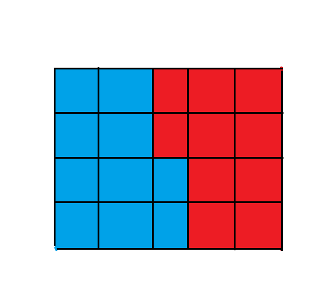

# CSP2023 考前杂题

## 前言

今天（9.20）看到了一道有意思的题，便突然有记杂题的想法了。

至于为什么不叫九月杂题呢，毕竟都二十号了嘛。

## P6018 [Ynoi2010] Fusion tree

[传送门](https://www.luogu.com.cn/problem/P6018)

科技题。

首先看到异或就要想到 01Trie，那么考虑如何维护。

假如给每个节点建一个 01Trie 存所有邻居显然是不行的，时间空间双双炸掉，考虑随便定个根，然后存每个结点所有儿子，修改和查询时额外把父亲加上就行了。

然后 01Trie 需要支持插入删除求异或和和整体 $+1$，前三个是简单的。第四个就是这道题需要用科技的地方了。

考虑在二进制上 $+1$ 相当于把最低位的 $0$ 变成 $1$，后面的 $1$ 全变成 $0$。那么假如我们的 01Trie 从低位往高位存储，这个操作就相当于交换结点左右儿子然后向 $0$ 递归。然后稍微注意一下另外三个操作的变化即可。

/// details | 代码
    open: False
    type: success

```cpp
#include<bits/stdc++.h>
#define mem(a,b) memset(a,b,sizeof(a))
#define forup(i,s,e) for(int i=(s);i<=(e);i++)
#define fordown(i,s,e) for(int i=(s);i>=(e);i--)
using namespace std;
#define gc getchar()
inline int read(){
    int x=0,f=1;char c;
    while(!isdigit(c=gc)) if(c=='-') f=-1;
    while(isdigit(c)){x=(x<<3)+(x<<1)+(c^48);c=gc;}
    return x*f;
}
#undef gc
const int N=5e5+5,inf=0x3f3f3f3f;
int n,m,a[N],tg[N];
vector<int> e[N];
struct Trie{
	int son[N*22][2],wxor[N*22],num[N*22],root[N],cntn;
	int _New(){
		++cntn;
		son[cntn][0]=son[cntn][1]=0;
		wxor[cntn]=0;num[cntn]=0;
		return cntn;
	}
	void init(){cntn=0;forup(i,1,n) root[i]=_New();mem(son,0);}
	void _PushUp(int p){
		wxor[p]=num[p]=0;
		if(son[p][0]){
			wxor[p]^=(wxor[son[p][0]]<<1);
			num[p]+=num[son[p][0]];
		}
		if(son[p][1]){
			wxor[p]^=((wxor[son[p][1]]<<1)|(num[son[p][1]]&1));
			num[p]+=num[son[p][1]];
		}
	}
	void Insert(int p,int a,int q=0){
		if(q==21){
			++num[p];
			return;
		}
		if(!son[p][a&1]) son[p][a&1]=_New();
		Insert(son[p][a&1],a>>1,q+1);
		_PushUp(p);
	}
	void Erase(int p,int a,int q=0){
		if(q==21){
			--num[p];
			return;
		}
		Erase(son[p][a&1],a>>1,q+1);
		_PushUp(p);
	}
	void Add1(int p,int q=0){
		if(q==21) return;
		swap(son[p][0],son[p][1]);
		if(son[p][0]) Add1(son[p][0],q+1);
		_PushUp(p);
	}
}mt;
int f[N];
void dfs(int x,int fa){
	f[x]=fa;
	for(auto i:e[x]){
		if(i==fa) continue;
		dfs(i,x);
	}
}
signed main(){
	n=read();m=read();
	forup(i,1,n-1){
		int u=read(),v=read();
		e[u].push_back(v);
		e[v].push_back(u);
	}
	dfs(1,0);
	mt.init();
	forup(i,1,n){
		a[i]=read();
		if(i!=1) mt.Insert(mt.root[f[i]],a[i]);
	}
	forup(Case,1,m){
		int op=read();
		if(op==1){
			int x=read();tg[x]++;
			if(x!=1&&f[x]!=1){
				int ff=f[x];
				mt.Erase(mt.root[f[ff]],a[ff]+tg[f[ff]]);
				a[ff]++;
				mt.Insert(mt.root[f[ff]],a[ff]+tg[f[ff]]);
			}else if(x!=1){
				a[f[x]]++;
			}
			mt.Add1(mt.root[x]);
		}else if(op==2){
			int x=read(),v=read();
			if(x!=1){
				mt.Erase(mt.root[f[x]],a[x]+tg[f[x]]);
				a[x]-=v;
				mt.Insert(mt.root[f[x]],a[x]+tg[f[x]]);				
			}else{
				a[x]-=v;
			}
		}else{
			int x=read(),ans=mt.wxor[mt.root[x]];
			if(x!=1) ans^=a[f[x]]+tg[f[f[x]]];
			printf("%d\n",ans);
		}
	}
}
```
///

## P4198 楼房重建

[传送门](https://www.luogu.com.cn/problem/P4198)

首先显然是要维护斜率的，后面的大小比较都默认是说斜率了。

那么题意就是单点修改，求前缀最大值数量。

前缀最大值数量不具有结合律，乍一看不能用线段树维护，但是这道题就是要反其道而行。

首先考虑合并时左儿子的前缀最大值必定是整个区间的前缀最大值，那么只用考虑右儿子大于左儿子最大值的部分。

设右儿子为 $u$，左儿子为 $v$，$r_u$ 表示 $u$ 内的前缀最大值个数，$mx_u$ 表示 $u$ 内的最大值，$ls,rs$ 分别代表 $u$ 的左右儿子，那么分情况讨论：

若 $mx_v>mx_u$，右儿子对当前区间的贡献必为 $0$，直接等于左区间的 $r$。

若 $mx_{ls}<mx_v<mx_u$，那么 $ls$ 就没有贡献，递归查找 $rs$。

若 $mx_v<mx_{ls}$，那么 $rs$ 的贡献必定为 $r_u-r_{ls}$，递归查找 $ls$。

那么合并的复杂度就是 $O(\log n)$ 的，总复杂度 $O(n\log^2 n)$。

/// details | 参考代码
	open: False
	type: success

```cpp
#include<bits/stdc++.h>
#define mem(a,b) memset(a,b,sizeof(a))
#define forup(i,s,e) for(i64 i=(s);i<=(e);i++)
#define fordown(i,s,e) for(i64 i=(s);i>=(e);i--)
using namespace std;
using i64=long long;
#define gc getchar()
inline i64 read(){
    i64 x=0,f=1;char c;
    while(!isdigit(c=gc)) if(c=='-') f=-1;
    while(isdigit(c)){x=(x<<3)+(x<<1)+(c^48);c=gc;}
    return x*f;
}
#undef gc
const i64 N=1e5+5,inf=0x3f3f3f3f;
i64 n,m;
struct Node{
	i64 x,y;
	Node(i64 _x=1,i64 _y=-1):x(_x),y(_y){};
	bool operator <(const Node &r)const{return y*r.x<r.y*x;}
	bool operator >(const Node &r)const{return y*r.x>r.y*x;}
	bool operator <=(const Node &r)const{return y*r.x<=r.y*x;}
	bool operator >=(const Node &r)const{return y*r.x>=r.y*x;}
	bool operator ==(const Node &r)const{return y*r.x==r.y*x;}
};
struct SegTree{
	#define mid ((l+r)>>1)
	#define lson l,mid,id<<1
	#define rson mid+1,r,id<<1|1
	Node querymax[N<<2];
	i64 queryans[N<<2];
	i64 Getans(Node LMX,i64 l,i64 r,i64 id){
		if(queryans[id]==0){
			return 0;
		}
		if(l==r){
			return 1;
		}
		if(LMX<querymax[id<<1]){
			return Getans(LMX,lson)+queryans[id]-queryans[id<<1];
		}else{
			return Getans(LMX,rson);
		}
	}
	void Update(i64 P,Node X,i64 l=1,i64 r=n,i64 id=1){
		if(l==r){
			querymax[id]=X;
			queryans[id]=1;
			return;
		}
		if(P<=mid) Update(P,X,lson);
		else       Update(P,X,rson);
		querymax[id]=max(querymax[id<<1],querymax[id<<1|1]);
		if(querymax[id<<1]>=querymax[id<<1|1]){
			queryans[id]=queryans[id<<1];
		}else if(r==mid+1){
			queryans[id]=queryans[id<<1]+queryans[id<<1|1];
		}else{
			queryans[id]=queryans[id<<1]+Getans(querymax[id<<1],rson);
		}
	}
	i64 Ask(){
		return queryans[1];
	}
}mt; 
signed main(){
	n=read();m=read();
	forup(Case,1,m){
		i64 x=read(),y=read();
		mt.Update(x,Node(x,y));
		printf("%lld\n",mt.Ask());
	}
}
```

///

## P7470 [NOI Online 2021 提高组] 岛屿探险

[传送门](https://www.luogu.com.cn/problem/P7470)

本文中 $\oplus$ 表示按位异或。

---

首先考虑把 $b_i>d_j$ 和 $b_i \le d_j$ 的分开考虑：

对于 $b_i>d_j$ 的，即为求 $a_i\oplus c_j\le d_j$ 的 $i$ 的个数，由于 $c,d$ 是知道的，这个可以直接 01Trie 维护，具体维护方式略。

对于 $b_i\le d_j$ 的，即为求 $c_j\oplus a_i\le b_i$ 的 $i$ 的个数，发现和上一种情况是对称的，那么考虑把询问塞到 01Trie 里面，然后统计改为给 Trie 的结点打标记，最后贡献即为根到叶子路径上标记的综合。

---

但是假如每次询问都这样做复杂度直接爆炸，大概是 $O(qn\log V)$ 的，那么考虑如何维护多次询问：

首先考虑全都是 $b_i>d_j$ 的（貌似有部分分），可以开一个可持久化 Trie，然后仿照可持久化权值线段树做前缀和即可。

然后假如全是 $b_i\le d_j$，我们可以把询问拆成 $[1,r]-[1,l-1]$，直接离线下来排序做即可。

这里离线下来指的是把所有 $c_j$ 插进 Trie 里，然后排序后遇到 $a_i$ 就打标记，遇到 $c_i$ 就查询路径上的标记和。

然后就转化成了一个偏序问题，直接套一层 CDQ 分治即可。

但是既然已经用了 CDQ 了，那可以把一维偏序当二维偏序做，就不需要可持久化 Trie 了。

---

复杂度分析：

$$T(n)=2T(\frac{n}{2})+O(n\log V)$$

那么 $T(n)$ 的渐进复杂度即为 $O(n\log n\log V)$，然后这里的 $n$ 取题目中的 $n+q$，所以复杂度即为 $O((n+q)\log(n+q)\log V)$。

/// details | 参考代码 updated on 22 Sept.
	open: False
	type: success

```cpp
#include<bits/stdc++.h>
#define mem(a,b) memset(a,b,sizeof(a))
#define forup(i,s,e) for(int i=(s);i<=(e);i++)
#define fordown(i,s,e) for(int i=(s);i>=(e);i--)
using namespace std;
using pii=pair<int,int>;
#define fi first
#define se second
#define mkp make_pair
#define gc getchar()
inline int read(){
    int x=0,f=1;char c;
    while(!isdigit(c=gc)) if(c=='-') f=-1;
    while(isdigit(c)){x=(x<<3)+(x<<1)+(c^48);c=gc;}
    return x*f;
}
#undef gc
const int N=1e5+5,inf=0x3f3f3f3f;
int n,m,ans[N];
struct Trie1{
	int tag[N*25],son[N*25][2],cntn;
	void init(){
		mem(tag,0);mem(son,0);cntn=0;
	}
	void Clear(){
		forup(i,0,cntn){
			tag[i]=son[i][0]=son[i][1]=0;
		}
		cntn=0;
	}
	void Insert(int a){
		int p=0;
		fordown(i,23,0){
			if(!son[p][(a>>i)&1]) son[p][(a>>i)&1]=++cntn;
			p=son[p][(a>>i)&1];
		}
	}
	void Work(int a,int b){
		int p=0;
		fordown(i,23,0){
			if((b>>i)&1){
				if(son[p][(a>>i)&1]) tag[son[p][(a>>i)&1]]++;
				if(son[p][((a>>i)&1)^1]) p=son[p][((a>>i)&1)^1];
				else return;
			}else{
				if(son[p][(a>>i)&1]) p=son[p][(a>>i)&1];
				else return;
			}
		}
		tag[p]++;
	}
	int Get(int a){
		int p=0,res=0;
		fordown(i,23,0){
			res+=tag[p];
			p=son[p][(a>>i)&1];
		}
		res+=tag[p];
		return res;
	}
}t1;
struct Trie0{
	int son[N*25][2],cntn,cnt[N*25];
	void init(){
		mem(son,0);mem(cnt,0);
		cntn=0;
	}
	void Clear(){
		forup(i,0,cntn){
			son[i][0]=son[i][1]=cnt[i]=0;
		}
		cntn=0;
	}
	void Insert(int a){
		int p=0;
		fordown(i,23,0){
			cnt[p]++;
			if(!son[p][(a>>i)&1]) son[p][(a>>i)&1]=++cntn;
			p=son[p][(a>>i)&1];
		}
		cnt[p]++;
	}
	int Work(int a,int b){
		int res=0,p=0;
		fordown(i,23,0){
			if((b>>i)&1){
				if(son[p][(a>>i)&1]) res+=cnt[son[p][(a>>i)&1]];
				if(son[p][((a>>i)&1)^1]) p=son[p][((a>>i)&1)^1];
				else return res;
			}else{
				if(son[p][(a>>i)&1]) p=son[p][(a>>i)&1];
				else return res;
			}
		}
		res+=cnt[p];
		return res;
	}
}t0;
struct Node{
	int tp,r,f,a,b,pos;
}q[N<<2];
void cdq(int l,int r){
	if(l>=r){return;}
	int mid=(l+r)>>1;
	cdq(l,mid);cdq(mid+1,r);
	vector<Node> v0,v1;
	t0.Clear();t1.Clear();
	forup(i,l,mid){
		if(q[i].tp==0) v0.push_back(q[i]);
		else           v1.push_back(q[i]),t1.Insert(q[i].a);
	}
	int l0=0,l1=0;
	forup(i,mid+1,r){
		if(q[i].tp==0){
			while(l1<(int)v1.size()&&v1[l1].r<q[i].r){
				ans[v1[l1].pos]+=t1.Get(v1[l1].a)*v1[l1].f;
				++l1;
			}
			t1.Work(q[i].a,q[i].b);
		}else{
			while(l0<(int)v0.size()&&v0[l0].r<=q[i].r){
				t0.Insert(v0[l0].a);
				++l0;
			}
			ans[q[i].pos]+=t0.Work(q[i].a,q[i].b)*q[i].f;
		}
	}
	while(l1<(int)v1.size()){
		ans[v1[l1].pos]+=t1.Get(v1[l1].a)*v1[l1].f;
		++l1;
	}
	inplace_merge(q+l,q+mid+1,q+r+1,[](Node a,Node b){return a.r<b.r;});
}
signed main(){
	n=read();m=read();
	t1.init();t0.init();
	forup(i,1,n){
		q[i].tp=0;q[i].r=i;q[i].a=read();q[i].b=read();
	}
	forup(i,1,m){
		int l=read(),r=read(),c=read(),d=read(),tt=i*2+n-1;
		q[tt].tp=q[tt+1].tp=1;
		q[tt].a=q[tt+1].a=c;
		q[tt].b=q[tt+1].b=d;
		q[tt].pos=q[tt+1].pos=i;
		q[tt].r=l-1;q[tt].f=-1;
		q[tt+1].r=r;q[tt+1].f=1;
	}
	sort(q+1,q+m*2+n+1,[](Node a,Node b){return a.b>b.b;});
//	forup(i,1,m*2+n){
//		printf("%d %d %d %d %d %d||\n",q[i].tp,q[i].a,q[i].b,q[i].pos,q[i].r,q[i].f);
//	}
	cdq(1,m*2+n);
	forup(i,1,m){
		printf("%d\n",ans[i]);
	}
}
```

///
## P8349 [SDOI/SXOI2022] 整数序列

[传送门](https://www.luogu.com.cn/problem/P8349)

根号分治题。

题意就是说选一个区间内两种颜色数量相等，最大化权值和。

---

首先考虑暴力，把两种颜色取出来，设 $x$ 的总数量为 $len_x$，然后从前往后扫一遍，设一个前缀的权值是 $c_x-c_y+len_y$（$c_x$ 表示前缀中 $x$ 的个数，加上 $len_y$ 是为了防止负数下标），那么容易发现两个全职相同的前缀的差就是一个合法的区间，后面的维护是简单的。

复杂度为 $O(len_x+len_y)$。

---

设一个阈值 $K$，然后把 $len_x>K$ 的称为“大色”，$len_x\le K$ 的称为“小色”，那么可以把询问分为三种：

1. 小色对小色

直接暴力复杂度是 $O(K)$ 的，复杂度最多是 $O(qK)$。

2. 大色对大色

这样的颜色最多有 $\frac{n}{K}$ 种，本质不同的对数只有 $\frac{n}{K}^2$ 对，可以用 `unordered_map` 存起来。设有 $k$ 个大色，极限情况下 $\sum_{i=1}^k {len_i}=n$，那么共有 $\frac{k(k-1)}{2}$ 种本质不同的询问，总计算次数为 $\sum_{i\le i<j\le k}{len_i+len_j}=(k-1)\sum_{i=1}^k{len_i}=n(k-1)$。由于 $len_i\le K$，得到 $k\le \frac{n}{K}$，则极限复杂度为 $O(\frac{n^2}{K})$。

当然也可以感性理解，此处给了严谨证明就略过了。

3. 大色对小色

由于小色对应的点数和大色对应的点数差距悬殊，而题目要求选择的区间内两种颜色点数相同，大色里面有很多点都是不可能产生贡献的的。我们可以把两种颜色的点分成**有效点**与**无效点**两种。

为方便叙述，假设 $len_x\le K <len_y$

首先 $x$ 内所有点都是有效点（显然吧）。

然后考虑维护 $y$ 内有效点的集合，遍历 $x$，然后二分对应的下一个 $y$，这样也能找到一段极长的连续 $x$，设这一段的长度为 $l$，那么往前 $l$ 个 $y$，往后 $l$ 个 $y$ 都是有效点，然后注意跳过原本就是有效点的，这里可以用 `set` 维护，容易发现一个 $x$ 会对应至多 $2$ 个 $y$，故有效点的数量是 $O(K)$ 的，那么就可以直接暴力了。复杂度是 $O(len_x\log{len_y})$

考虑极限情况，设有 $k_1$ 个大色，其中第 $i$ 个大小为 $L_i$，有 $k_2$ 个小色，其中第 $i$ 个大小为 $l_i$，考虑到复杂度与小色的大小关系更大，那么我们用最大的 $\frac{q}{k_1}$ 个小色对大色询问，这样对于记忆化是最劣的，计算次数为 $\sum_{i=1}^{k_2}\sum_{j=1}^{k_1}l_i\log L_j\le k_1\log n\sum l_i$。

最强的情况，可以构造出约为 $\frac{n}{2K}$ 个长度略大于 $K$ 的大色，然后其余小色总长度约为 $\frac{n}{2}$，并且使每个大色对每个小色问一遍，此时 $k_1$ 约为 $O(\frac{n}{K})$，$\sum l_i$ 约为 $O(n)$，则总复杂度为 $\frac{n^2\log n}{B}$。

---

总复杂度约为 $O(qK+\frac{n^2\log n}{K})$，大对大的因为严格小于大对小可以直接忽略，据说 $K$ 取 $\sqrt{\frac{n^2\log n}{q}}$ 时最优，但是我个人觉得取 $\sqrt{n}$ 差不多得了（ ~~主要是我不会证明~~ ）。

好了现在我会证了，感谢 xx019。

根据均值不等式 $a+b\ge 2\sqrt{ab}$，$qK+\frac{n^2\log n}{K}\ge 2\sqrt{qn^2\log n}$，且在 $qK=\frac{n^2\log n}{K}$ 时取等，即 $K=\sqrt{\frac{n^2\log n}{q}}$，此时复杂度为 $O(n\sqrt{q\log n})$。

---

好了写出来了，$O(n\sqrt{q\log n})$ 没卡过去，学了下 $O(n\sqrt{q})$ 的写法。

具体来说，把大色对小色的离线到大色上，然后对于每个大色 $y$ 可以 $O(n)$ 预处理序列上每个数往前第一个 $y$ 和往后第一个 $y$。然后用栈维护连续段的个数，假如当前段的左端点比上一段右端点靠前就可以合并，再前缀和维护一下合并时没产生贡献的点数，把工薪额外加在当前区间的两端，最后和前面的做法一样，总的来说压掉了一个 $\sqrt{\log}$，就不用卡常了。

/// details | 参考代码 updated on 22 Sept.
	open: False
	type: success

```cpp
#include<bits/stdc++.h>
#define mem(a,b) memset(a,b,sizeof(a))
#define forup(i,s,e) for(int i=(s);i<=(e);i++)
#define fordown(i,s,e) for(int i=(s);i>=(e);i--)
using namespace std;
using pii=pair<int,int>;
#define fi first
#define se second
#define mkp make_pair
using i64=long long;
#define gc getchar()
inline int read(){
    int x=0,f=1;char c;
    while(!isdigit(c=gc)) if(c=='-') f=-1;
    while(isdigit(c)){x=(x<<3)+(x<<1)+(c^48);c=gc;}
    return x*f;
}
#undef gc
const int N=3e5+5,TT=300;
const i64 inf=1e18;
int n,q,a[N],b[N];
vector<int> pos[N];
i64 bkt[N],ans[1000005];
unordered_map<int,i64> mp[N];
vector<pii> quu[N];
int pre[N],nxt[N],cnt[N];
i64 calc(vector<int> &t1,vector<int> &t2){
	int l1=0,l2=0,sz=t1.size()+t2.size();
	forup(i,0,sz) bkt[i]=inf;
	int nw=t2.size();i64 res=-inf,sum=0;
	bkt[nw]=0;
	forup(i,1,sz){
		if(l1<(int)t1.size()&&(l2>=(int)t2.size()||t2[l2]>t1[l1])){
			++nw;
			sum+=b[t1[l1]];
			res=max(res,sum-bkt[nw]);
			bkt[nw]=min(bkt[nw],sum);
			++l1;
		}else{
			--nw;
			sum+=b[t2[l2]];
			res=max(res,sum-bkt[nw]);
			bkt[nw]=min(bkt[nw],sum);
			++l2;
		}
	}
	return res;
}
int id[N],ps[N];
signed main(){
//	freopen("ex_sequence2.in","r",stdin);
//	freopen("a.out","w",stdout);
	n=read();q=read();
	forup(i,1,n){
		a[i]=read();
		pos[a[i]].push_back(i);
	}
	forup(i,1,n){
		b[i]=read();
	}
	forup(Case,1,q){
		int x=read(),y=read();
		if(pos[x].size()>pos[y].size()||(pos[x].size()==pos[y].size()&&x>y)) swap(x,y);
		if(mp[x].count(y)){
			ans[Case]=mp[x][y];
			continue;
		}
		if((pos[x].size()<=TT&&pos[y].size()<=TT)||(pos[x].size()>TT&&pos[y].size()>TT)){
			mp[x][y]=ans[Case]=calc(pos[x],pos[y]);
		}else{
			quu[y].push_back(mkp(Case,x));
		}
	}
	forup(y,1,n){
		if(pos[y].size()<=TT) continue;
		forup(i,1,n) pre[i]=(a[i]==y?i:pre[i-1]);
		forup(i,1,n) cnt[i]=cnt[i-1]+(a[i]==y);
		nxt[n+1]=n+1;cnt[n+1]=cnt[n];
		fordown(i,n,1) nxt[i]=(a[i]==y?i:nxt[i+1]);
		ps[1]=0;id[0]=1;
		int cn=1;
		forup(i,1,n){
			if(a[i]==y){
				id[i]=++cn;
				ps[cn]=i;
			}
		}
		id[n+1]=++cn;
		ps[cn]=n+1;
		for(auto i:quu[y]){
			vector<pii> stk;
			int x=i.se,pp=i.fi;
			if(mp[x].count(y)){
				ans[pp]=mp[x][y];
				continue;
			}
			for(auto j:pos[x]){
				pii nw=mkp(pre[j],nxt[j]);
				while(stk.size()&&stk.back().se>=nw.fi){
					pii tp=stk.back();stk.pop_back();
					if(tp.fi<nw.fi) swap(nw.fi,tp.fi);
					if(tp.se>nw.se) swap(nw.se,tp.se);
					int num=cnt[tp.se]-(tp.fi?cnt[tp.fi-1]:0);
					nw.fi=ps[max(id[nw.fi]-num,1)];
					nw.se=ps[min(id[nw.se]+num,cn)];
				}
				stk.push_back(nw);
			}
			vector<int> v1;
			int l=2;
			for(auto j:stk){
				int st=j.fi,ed=j.se;
				if(l<id[st]-1) l=id[st]-1;
				while(l<cn&&l<=id[ed]+1){
					v1.push_back(ps[l++]);
				}
			}
			mp[x][y]=ans[pp]=calc(pos[x],v1);
		}
	}
	forup(i,1,q){
		printf("%lld\n",ans[i]);
	}
}
```

///


## P7739 [NOI2021] 密码箱

[传送门](https://www.luogu.com.cn/problem/P7739)

首先 $f(a)$ 相当于重复 $n-1$ 次把末项取倒数然后加在倒数第二项里再删掉这一项，设现在的末项为 $\frac{x}{y}$，倒数第二项为 $a_{n-1}$，容易发现假如 $\gcd(x,y)=1$，那么 $\gcd(y+a_{n-1}x,x)=1$（即加入下一项后的分子分母），又由于最开始 $y=1$，所以其实并不需要约分，那么只用考虑取模即可。

容易想到 $x,y$ 可以用矩阵乘法维护，先不考虑三种操作，假设序列 $a$ 固定，我们先把矩阵构造出来：

具体的，我们希望构造的矩阵 $A_i$ 满足以下式子：

$$A_i\times \begin{bmatrix}x\\\\y\end{bmatrix}=\begin{bmatrix}y+a_ix\\\\x\end{bmatrix}$$

由于每次是乘最后一个所以我设置为把一个列向量乘在右边，这样每次加入新的操作就是乘在右边的，比较符合直觉。

那么解一解方程，容易发现矩阵 $A_i$ 应该长这样：

$$\begin{bmatrix}a_i&1\\\\1&0\end{bmatrix}$$

---

但是现在 `W`，`E` 两种操作还是不好维护，我们希望这两种操作也能用矩阵概括。

首先是 `W`，我们设它对应的矩阵为 $W$，那么我们希望它满足以下式子：

$$\begin{bmatrix}b&1\\\\1&0\end{bmatrix}\times W=\begin{bmatrix}b+1&1\\\\1&0\end{bmatrix}$$

然后解一解方程可以发现：

$$W=\begin{bmatrix}1&0\\\\1&1\end{bmatrix}$$

但是对于 `E` 操作仍然不好维护，但是假如我们发现对于 $a_n=1$，`E` 的两种操作类型对答案的影响相同的话，就能维护了，记住，转换题意后一定记得回到原题意解题。

由于只要后面的一样就肯定肯定不影响前面的，我们不妨假设现在后面的算出来是 $\frac{x}{y}$，然后前面啥也没有，那么可以简单推一下：

1. 给倒数第二项加一。

$$
\begin{aligned}
f(a_1+1,1,\frac{x}{y})
=&f(a_1+1,\frac{x+y}{x})\\\\
=&f(\frac{(a_1+1)(x+y)+x}{x+y})\\\\
=&\frac{a_1(x+y)+2x+y}{x+y}
\end{aligned}
$$

2. 给最后一项减一，然后添两个 $1$

$$
\begin{aligned}
f(a_1,0,1,1,\frac{x}{y})
=&f(a_1,0,1,\frac{x+y}{x})\\\\
=&f(a_1,0,\frac{2x+y}{x+y})\\\\
=&f(a_1,\frac{x+y}{2x+y})\\\\
=&f(\frac{a_1(x+y)+2x+y}{x+y})\\\\
=&\frac{a_1(x+y)+2x+y}{x+y}
\end{aligned}
$$

显然这两个东西相等，那么 `E` 操作实际上就是：**先给数列的最后一项减 $1$，接着在数列尾再加两项，两项的值都是 $1$。**

那么仿照刚才算 $W$（真的仿了吗？如仿），$E$ 的矩阵如下：

$$E=\begin{bmatrix}1&0\\\\-1&1\end{bmatrix}\times\begin{bmatrix}1&1\\\\1&0\end{bmatrix}\times \begin{bmatrix}1&1\\\\1&0\end{bmatrix}=\begin{bmatrix}2&1\\\\-1&0\end{bmatrix}$$

好了，现在我们已经会维护 `APPEND` 操作了，✿✿ヽ(°▽°)ノ✿。

那么区间翻转和区间反转操作呢？首先翻转操作可以考虑文艺平衡树维护，但是反转操作呢？

其实是一样的，我们对于每个子树预处理**当前矩阵**，**操作反转的矩阵**，**操作翻转的矩阵**，**操作翻转后反转的矩阵**。然后和文艺平衡树一样打标记维护，每次下传标记就 `swap` 一下即可。复杂度 $O((n+q)\log (n+q)2^3)$。

最后考虑一下如何求答案，设最后整个操作序列乘出来的矩阵为 $B$，那么首先在前面乘上初始的两个数（这个很简单），考虑后面乘的一个初始向量是多少，设这个向量为 $V$，那么我们希望：

$$\begin{bmatrix}a_i&1\\\\1&0\end{bmatrix}\times V=\begin{bmatrix}a_i\\\\1\end{bmatrix}$$

容易得到：

$$V=\begin{bmatrix}1\\\\0\end{bmatrix}$$

所以最终答案为：

$$
\begin{aligned}
&A_0\times A_1\times B\times V\\\\
=&\begin{bmatrix}1&0\\\\1&1\end{bmatrix}\times B\times \begin{bmatrix}1\\\\0\end{bmatrix}
\end{aligned}
$$

然后总结一下，以后看到很难维护的操作应该考虑一下能不能转化成矩阵乘法。

/// details | 参考代码 updated on 22 Sept.
	open: False
	type: success

```cpp
#include<bits/stdc++.h>
#define mem(a,b) memset(a,b,sizeof(a))
#define forup(i,s,e) for(int i=(s);i<=(e);i++)
#define fordown(i,s,e) for(int i=(s);i>=(e);i--)
using namespace std;
#define gc getchar()
inline int read(){
    int x=0,f=1;char c;
    while(!isdigit(c=gc)) if(c=='-') f=-1;
    while(isdigit(c)){x=(x<<3)+(x<<1)+(c^48);c=gc;}
    return x*f;
}
#undef gc
const int N=2e5+5,inf=0x3f3f3f3f,mod=998244353;
int n,q;
char str[N];
void adm(int &a,int b){
	a+=b;
	if(a>=mod) a-=mod;
	if(a<0) a+=mod;
}
struct Matrix{
	int c[2][2];
	Matrix(int _=1,int __=0,int ___=0,int ____=1){
		c[0][0]=_;
		c[0][1]=__;
		c[1][0]=___;
		c[1][1]=____;
	}
	Matrix operator *(const Matrix &b){
		Matrix res(0,0,0,0);
		forup(i,0,1){
			forup(j,0,1){
				forup(k,0,1){
					adm(res.c[i][j],1ll*c[i][k]*b.c[k][j]%mod);
				}
			}
		}
		return res;
	}
}W(1,0,1,1),E(2,1,-1,0);
mt19937 mr(time(0));
struct FHQTreap{
	private:
		int ls[N],rs[N],sz[N],root,cntn,hv[N];
		bool tv[N],itag[N],rtag[N];// true->E false->W
		Matrix ori[N],rev[N],inv[N],rinv[N];
		int _New(bool val){
			int id=++cntn;
			tv[id]=val;
			Matrix p=W,q=E;
			if(val) swap(p,q);
			ori[id]=rev[id]=p;
			inv[id]=rinv[id]=q;
			sz[id]=1;
			ls[id]=rs[id]=0;
			itag[id]=rtag[id]=0;
			hv[id]=mr();
			return id;
		}
		void _PushUp(int id){
			Matrix p=W,q=E;
			if(tv[id]) swap(p,q);
			sz[id]=sz[ls[id]]+1+sz[rs[id]];
			ori[id]=ori[ls[id]]*p*ori[rs[id]];
			inv[id]=inv[ls[id]]*q*inv[rs[id]];
			rev[id]=rev[rs[id]]*p*rev[ls[id]];
			rinv[id]=rinv[rs[id]]*q*rinv[ls[id]];
		}
		void _Reverse(int id){
			swap(ls[id],rs[id]);
			swap(ori[id],rev[id]);
			swap(inv[id],rinv[id]);
		}
		void _Inverse(int id){
			tv[id]^=1;
			swap(ori[id],inv[id]);
			swap(rev[id],rinv[id]);
		}
		void _PushDown(int id){
			if(itag[id]){
				if(ls[id]) _Inverse(ls[id]),itag[ls[id]]^=1;
				if(rs[id]) _Inverse(rs[id]),itag[rs[id]]^=1;
				itag[id]=0;
			}
			if(rtag[id]){
				if(ls[id]) _Reverse(ls[id]),rtag[ls[id]]^=1;
				if(rs[id]) _Reverse(rs[id]),rtag[rs[id]]^=1;
				rtag[id]=0;
			}
		}
		void _Split(int key,int id,int &x,int &y){
			if(!id){
				x=y=0;
				return;
			}
			_PushDown(id);
			if(sz[ls[id]]<key){
				x=id;
				_Split(key-sz[ls[id]]-1,rs[id],rs[x],y);
			}else{
				y=id;
				_Split(key,ls[id],x,ls[y]);
			}
			_PushUp(id);
		}
		int _Merge(int x,int y){
			if(!x||!y) return x|y;
			if(hv[x]>hv[y]){
				_PushDown(x);
				rs[x]=_Merge(rs[x],y);
				_PushUp(x);
				return x;
			}else{
				_PushDown(y);
				ls[y]=_Merge(x,ls[y]);
				_PushUp(y);
				return y;
			}
		}
	public:
		FHQTreap():root(0),cntn(0){}
		void Insert(char c){
			root=_Merge(root,_New(c=='E'));
		}
		void Inverse(int l,int r){
			int x,y,z;
			_Split(l-1,root,x,y);_Split(r-l+1,y,y,z);
			_Inverse(y);itag[y]^=1;
			root=_Merge(_Merge(x,y),z);
		}
		void Reverse(int l,int r){
			int x,y,z;
			_Split(l-1,root,x,y);_Split(r-l+1,y,y,z);
			_Reverse(y);rtag[y]^=1;
			root=_Merge(_Merge(x,y),z);
		}
		Matrix Ask(){
			return ori[root];
		}
}mt;
signed main(){
	n=read();q=read();
	scanf(" %s",str+1);
	forup(i,1,n){
		mt.Insert(str[i]);
	}
	Matrix ans=Matrix(1,0,1,1)*mt.Ask()*Matrix(1,0,0,0);
	printf("%d %d\n",ans.c[0][0],ans.c[1][0]);
	forup(Case,1,q){
		scanf(" %s",str+1);
		if(str[1]=='A'){
			char c;
			scanf(" %1c",&c);
			mt.Insert(c);
		}else if(str[1]=='F'){
			int l=read(),r=read();
			mt.Inverse(l,r);
		}else{
			int l=read(),r=read();
			mt.Reverse(l,r);
		}
		Matrix ans=Matrix(1,0,1,1)*mt.Ask()*Matrix(1,0,0,0);
		printf("%d %d\n",ans.c[0][0],ans.c[1][0]);
	}
}
```

///

## P7518 [省选联考 2021 A/B 卷] 宝石

[传送门](https://www.luogu.com.cn/problem/P7518)

设查询的路径为 $u,v$，且 $\operatorname{lca}(u,v)=t$，那么我们可以把每个询问分成 $u\to t,t\to v$ 三部分。

首先 $u\to t$ 的，这是一段上升的路径，那么我们可以利用倍增跳，具体地，设 $f_{u,i}$ 表示从 $u$ 开始，从 $w_u$ 的后继开始只向上走收集 $2^i$ 个宝石后到达哪个结点，预处理一下 $f_{u,0}$，然后后面就是正常倍增了。

然后考虑 $t\to v$，我们可以把所有询问以二元组 $(c_i,i)$ 离线到 $t$ 上，然后在 $v$ 处打一个结束标记，表示编号为 $i$ 的询问在 $t$ 之前拿到的最后一个宝石为 $c_i$，这里我们需要对每个宝石维护一个容器 $d_c$，表示该容器内所有询问的下一颗宝石为 $c$，这个容器需要以下功能：

1. 在进入结点 $k$ 时，将所有 $i$ 插入 $d_{c_i}$ 中。
2. 将 $w_k$ 和 $w_k$ 的后继合并。
3. 对于所有结束标记，查询所在容器。
4. 在退出结点 $k$ 时，撤销所有操作。

显然，可以用可撤销并查集维护，复杂度 $O(q\log n+n\log q)$。

/// details | 参考代码 updated on 25 Sept.
	open: False
	type: success

```cpp
#include<bits/stdc++.h>
#define mem(a,b) memset(a,b,sizeof(a))
#define forup(i,s,e) for(int i=(s);i<=(e);i++)
#define fordown(i,s,e) for(int i=(s);i>=(e);i--)
using namespace std;
#define gc getchar()
inline int read(){
    int x=0,f=1;char c;
    while(!isdigit(c=gc)) if(c=='-') f=-1;
    while(isdigit(c)){x=(x<<3)+(x<<1)+(c^48);c=gc;}
    return x*f;
}
#undef gc
const int N=2e5+5,M=5e4+5,inf=0x3f3f3f3f;
int n,m,c,q,w[N],ans[N];
vector<int> e[N];
struct query{
	int pos,cc;
};
int p[M],pre[M],nxt[M];
vector<query> st[N];
vector<int> ed[N];
int f[N][19],dpt[N],f2[N][19],nw[M],tst[N];
int cntc[N];
void dfs(int x,int fa){
	dpt[x]=dpt[fa]+1;f[x][0]=fa;
	forup(i,1,18){f[x][i]=f[f[x][i-1]][i-1];}
	f2[x][0]=nw[nxt[w[x]]];
	forup(i,1,18){f2[x][i]=f2[f2[x][i-1]][i-1];}
	int sv=nw[w[x]];nw[w[x]]=x;
	tst[x]=nw[p[1]];
	for(auto i:e[x]){
		if(i==fa) continue;
		dfs(i,x);
	}
	nw[w[x]]=sv;
}
int lca(int x,int y){
	if(dpt[x]>dpt[y]) swap(x,y);
	for(int i=18;dpt[y]>dpt[x]&&i>=0;--i){
		if(dpt[f[y][i]]>=dpt[x]) y=f[y][i];
	}
	if(x==y) return x;
	for(int i=18;f[x][0]!=f[y][0]&&i>=0;--i){
		if(f[x][i]!=f[y][i]){
			x=f[x][i];y=f[y][i];
		}
	}
	return f[x][0];
}
int fa[N],sz[N],mp[N],co[N];
struct Node{
	int u,v,cu,cv;
};
stack<Node> stk;
int getfa(int x){return x==fa[x]?x:getfa(fa[x]);}
void merge(int u,int v){
	int fu=getfa(u),fv=getfa(v);
	if(fu==fv) return;
	int nv=co[fv],nu=co[fu];
	if(sz[fu]>sz[fv]) swap(fu,fv);
	stk.push(Node{fu,fv,co[fu],co[fv]});
	sz[fv]+=sz[fu];
	fa[fu]=fv;
	co[fv]=nv;
	mp[nu]=0;mp[nv]=fv;
}
void ctrlz(){
	int fu=stk.top().u,fv=stk.top().v,cu=stk.top().cu,cv=stk.top().cv;stk.pop();
	if(fv) co[fv]=cv,sz[fv]-=sz[fu];
	mp[co[fu]]=0;
	if(cu) mp[cu]=fu;
	if(cv) mp[cv]=fv;
	fa[fu]=fu;
	co[fu]=cu;
}
void dfs2(int x,int fa){
	int ppp=stk.size();
	for(auto i:st[x]){
		if(mp[i.cc]==0){
			mp[i.cc]=i.pos;
			co[i.pos]=i.cc;
			stk.push(Node{i.pos,0,0,0});
		}else{
			merge(i.pos,mp[i.cc]);
		}
	}
	if(mp[w[x]]){
		if(mp[nxt[w[x]]]){
			merge(mp[w[x]],mp[nxt[w[x]]]);
		}else{
			stk.push(Node{mp[w[x]],0,w[x],0});
			co[mp[w[x]]]=nxt[w[x]];
			mp[nxt[w[x]]]=mp[w[x]];
			mp[w[x]]=0;
		}
	}
	for(auto i:ed[x]){
		int nc=co[getfa(i)];
		ans[i]=cntc[nc]-1;
	}
	for(auto i:e[x]){
		if(i==fa) continue;
		dfs2(i,x);
	}
	while((int)stk.size()>ppp){
		ctrlz();
	}
}
signed main(){
	n=read();m=read();c=read();
	forup(i,1,c){
		p[i]=read();
		nxt[p[i-1]]=p[i];
		pre[p[i]]=p[i-1];
		cntc[p[i]]=cntc[p[i-1]]+1;
	}
	p[c+1]=m+1;
	nxt[p[c]]=m+1;
	cntc[m+1]=c+1;
	forup(i,1,n) w[i]=read();
	forup(i,1,n-1){
		int u=read(),v=read();
		e[u].push_back(v);
		e[v].push_back(u);
	}
	dfs(1,0);
	q=read();
	forup(Case,1,q){
		int u=read(),v=read(),y=lca(u,v);
		int l=tst[u];
		if(dpt[l]<dpt[y]){
			st[y].push_back(query{Case,p[1]});
			ed[v].push_back(Case);
		}else{
			fordown(i,18,0){
				if(dpt[f2[l][i]]>=dpt[y]){
					l=f2[l][i];
				}
			}
			if(w[l]==p[c]) ans[Case]=c;
			else st[y].push_back(query{Case,nxt[w[l]]}),ed[v].push_back(Case);
		}
	}
	forup(i,1,q){
		fa[i]=i;sz[i]=1;
	}
	dfs2(1,0);
	forup(i,1,q){
		printf("%d\n",ans[i]);
	}
}
```

///

## CF1017G The Tree

[传送门](https://www.luogu.com.cn/problem/CF1017G)

首先，直接做要么修改是 $O(n)$ 的（暴力修改，单点查询），要么查询是 $O(n)$ 的（标记修改，往上跳查询），其中一个会被链卡另一个会被菊花图卡。

那么我们可以考虑均衡一下，让修改和查询都变成 $O(\sqrt{n})$ 的，很自然地想到分块。

思路是将询问分成 $\sqrt{q}$ 块，对于每一块建虚树，然后处理完一块后用虚树上的信息给原树染色。

这样要求块内每个操作复杂度不多于 $O(\sqrt{n})$，对每一块预处理和处理完一块后染色的复杂度不多于 $O(n)$。

首先是建虚树，但是为了维护操作 $1$ 需要处理虚树上每个关键点和它父亲中间有多少个白点，由于反正都要维护链的信息了，那直接可以 $O(n)$ 建虚树，符合条件。

然后是三个操作，操作 $3$ 直接查即可，操作 $1$ 维护一下每条边上剩的白点数，假如全涂完了就往儿子递归，由于点数不超过 $\sqrt{q}$ 所以复杂度是对的，为了后面染回原树可能要维护一下每条边加了几个黑点，有没有被涂白过。操作 $2$ 就直接遍历，三个操作复杂度均不超过 $O(\sqrt{q})$。

然后是染色，我现在臆想的实现是遍历虚树，然后每次定位到原树的这个结点，分有没有涂白过把距离最近的若干个白点涂黑，或者把黑点刷白，复杂度是 $O(\sqrt{q}+n)$ 的。

然后就做完了，估计代码不会太好写。

/// details | 参考代码 updated on 27 Sept.
	open: False
	type: success

其实还挺好写的，就是调到一半 CF 炸了被迫去写下一题。

```cpp
#include<bits/stdc++.h>
#define mem(a,b) memset(a,b,sizeof(a))
#define forup(i,s,e) for(int i=(s);i<=(e);i++)
#define fordown(i,s,e) for(int i=(s);i>=(e);i--)
using namespace std;
#define gc getchar()
inline int read(){
    int x=0,f=1;char c;
    while(!isdigit(c=gc)) if(c=='-') f=-1;
    while(isdigit(c)){x=(x<<3)+(x<<1)+(c^48);c=gc;}
    return x*f;
}
#undef gc
const int N=1e5+5,P=350;
int n,m,ans[N],op[N];
vector<int> e[N],e1[N];
struct operation{
	int op,x;
}q[N];
int f[N][21],dpt[N],st[N],Tm,co[N];
void dfs1(int x,int fa){
	st[x]=++Tm;
	f[x][0]=fa;dpt[x]=dpt[fa]+1;
	forup(i,1,20){
		f[x][i]=f[f[x][i-1]][i-1];
	}
	for(auto i:e[x]){
		if(i==fa) continue;
		dfs1(i,x);
	}
}
int lca(int x,int y){
	if(dpt[x]>dpt[y]) swap(x,y);
	for(int i=20;i>=0&&dpt[y]>dpt[x];--i){
		if(dpt[f[y][i]]>=dpt[x]){
			y=f[y][i];
		}
	}
	if(x==y) return x;
	for(int i=20;i>=0&&f[x][0]!=f[y][0];--i){
		if(f[x][i]!=f[y][i]){
			x=f[x][i];y=f[y][i];
		}
	}
	return f[x][0];
}
int ispt[N],ctw[N],isw[N],vc[N],ff[N],cntb[N];
void dfs2(int x,int fa,int nc,int pre){
	if(ispt[x]){
		e1[x].push_back(pre);
		e1[pre].push_back(x);
		ff[x]=pre;
		ctw[x]=nc;nc=0;
		pre=x;
		vc[x]=co[x];
	}
	if(!co[x]) ++nc;
	for(auto i:e[x]){
		if(i==fa) continue;
		dfs2(i,x,nc,pre);
	}
}
void dfs3(int x,int fa,int tp){
	if(tp==0){
		vc[x]=0;isw[x]=1;
		cntb[x]=0;
		for(auto i:e1[x]){
			if(i==fa) continue;
			ctw[i]=dpt[i]-dpt[x];
			dfs3(i,x,0);
		}
	}else{
		cntb[x]++;
		if(vc[x]){
			for(auto i:e1[x]){
				if(i==fa) continue;
				if(cntb[x]>ctw[i]){
					dfs3(i,x,1);
				}
			}
		}else{
			vc[x]=1;
		}
	}
}
void dfs4(int x,int fa,int cb,int iw){
	if(ispt[x]){
		if(isw[x]) iw=1;
		cb=cntb[x];
	}
	if(iw){
		if(cb){
			co[x]=1;--cb;
		}else{
			co[x]=0;
		}
	}else{
		if(!co[x]&&cb){
			co[x]=1;--cb;
		}
	}
	for(auto i:e[x]){
		if(i==fa) continue;
		dfs4(i,x,cb,iw);
	}
}
void solve(int l,int r){
	vector<int> vec;
	forup(i,l,r){
		vec.push_back(q[i].x);
	}	
	sort(vec.begin(),vec.end(),[](int a,int b){
		return st[a]<st[b];
	});
	vec.erase(unique(vec.begin(),vec.end()),vec.end());
	int pp=0;
	for(auto i:vec){
		ispt[i]=1;
		if(pp) ispt[lca(i,pp)]=1;
		pp=i;
	}
	ispt[1]=1;
	dfs2(1,0,0,0);
	forup(i,l,r){
		if(q[i].op==3){
			ans[i]=vc[q[i].x];
		}else if(q[i].op==2){
			dfs3(q[i].x,ff[q[i].x],0);
		}else{
			dfs3(q[i].x,ff[q[i].x],1);
		}
	}
	dfs4(1,0,0,0);
	mem(isw,0);mem(cntb,0);mem(ctw,0);mem(ispt,0);mem(vc,0);mem(ff,0);
	forup(i,1,n){
		e1[i].clear();
	}
}
signed main(){
	n=read();m=read();
	forup(i,2,n){
		int u=read();
		e[i].push_back(u);
		e[u].push_back(i);
	}
	forup(i,1,m){
		op[i]=q[i].op=read();q[i].x=read();
	}
	dfs1(1,0);
	int cpcp=m/P;
	forup(i,1,cpcp){
		int L=(i-1)*P+1,R=i*P;
		solve(L,R);
	}
	if(cpcp*P!=m){
		int L=cpcp*P+1,R=m;
		solve(L,R);
	}
	forup(i,1,m){
		if(op[i]==3){
			puts(ans[i]?"black":"white");
		}
	}
}
```

///

## CF573E Bear and Bowling

[传送门](https://www.luogu.com.cn/problem/CF573E)

首先有个 $O(n^2)$ DP。

设 $dp_{i,j}$ 表示考虑前 $i$ 个，已经选了 $j$ 个能得到的最大值，转移是简单的：

$$dp_{i,j}=\max(dp_{i-1,j},dp_{i-1,j-1}+a_i\times j)$$

然后这道题由于是 CF 的，考虑到 Java Python 等常数较大的语言，时限开的巨大无比，已经可以日过去了。

但是我可不是那种不求甚解的人呐。

但是这道题还有爆踩标算的 $O(n)$ 贪心做法。可惜这是数据结构专题……

-----

这个方程看起来不太好优化，那么我们考虑猜结论：

$\forall i,\exists k\in[1,i]$，满足：

$$\forall j<k,dp_{i,j}=dp_{i-1,j}$$

$$\forall j\ge k,dp_{i,j}=dp_{i-1,j-1}+a_i\times j$$

证明：

考虑对 $dp_i$ 构造一个差分序列 $f_i$，其中 $f_{i,j}=dp_{i,j}-dp_{i,j-1}$。

若猜想成立，则有 $dp_{i,k_i-1}\ge dp_{i-1,k_i-2}+a_i\times (k_i-1)$，且 $dp_{i-1,k_i}<dp_{i-1,k_i-1}+a_i\times k_i$，则 $\frac{f_{i-1,k_i-1}}{k_i-1}\ge a_i$，且 $\frac{f_{i-1,k_i}}{k_i}<a_i$。

容易发现前式对于所有 $j< k_i$ 均成立，后式对于所有 $j\ge k_i$ 均成立，而 $a_i$ 是一个定值，那么若 $\frac{f_{i-1,j}}{j}$ 关于 $j$ 单调不增，猜想成立（考虑假如 $\frac{f_{i-1,j}}{j}$ 全都小于 $a_i$ 那么 $k_i$ 取 $1$，假如全都大于等于 $a_i$ 那么 $k_i$ 取 $i$）。

若猜想成立，那么由 $dp_i$ 的值可知：

$$\forall j< k_i,f_{i,j}=f_{i-1,j}$$
$$\forall j> k_i,f_{i,j}=f_{i-1,j-1}+a_i$$
$$f_{i,k_i}=a_i\times k_i$$

证明考虑数学归纳法。

首先对于 $i=1$， $\frac{f_{i,j}}{j}$ 显然单调不增（长度为 $1$ 的序列显然单调不增吧）。

那么对于 $i=2$，猜想成立。

考虑若猜想成立，证明 $\frac{f_{i,j}}{j}$ 单调不增。

首先对于 $j<k_i$，$f_{i,j}=f_{i-1,j}$，显然单调不增。

对于 $j=k_i$，由于 $\forall j<k_i,\frac{f_{i,j}}{j}=\frac{f_{i-1,j}}{j}\ge a_i$，且 $\frac{f_{i,k_i}}{k_i}=\frac{a_i\times k_i}{k_i}=a_i$，单调性仍然存在。

对于 $j>k_i$：

首先结论长这样：

$$\frac{f_{i,j-1}}{j-1}\ge\frac{f_{i,j}}{j}$$

考虑 $f_{i,j-1}=f_{i-1,j-2}+a_i,f_{i,j}=f_{i-1,j-1}+a_i$。

那么上不等式等价于：

$$
\begin{aligned}
\frac{f_{i-1,j-2}+a_i}{j-1}&\ge\frac{f_{i-1,j-1}+a_i}{j}\\\\
f_{i-1,j-2}+a_i&\ge\frac{j-1}{j}(f_{i-1,j-1}+a_i)\\\\
f_{i-1,j-2}+a_i&\ge\frac{j-1}{j}f_{i-1,j-1}+\frac{j-1}{j}a_i\\\\
f_{i-1,j-2}&\ge\frac{j-1}{j}f_{i-1,j-1}-\frac{1}{j}a_i\\\\
\end{aligned}
$$

由于 $\frac{f_{i-1,j}}{j}\ge\frac{f_{i-1,j+1}}{j+1}$，那么 $f_{i-1,j}\ge \frac{j}{j+1}f_{i-1,j+1}$，所以 $f_{i-1,j-2}\ge\frac{j-2}{j-1}f_{i-1,j-1}$，那么左式减右式，得：

$$
\begin{aligned}
&f_{i-1,j-2}-(\frac{j-1}{j}f_{i-1,j-1}-\frac{1}{j}a_i)\\\\
\ge&\frac{j-2}{j-1}f_{i-1,j-1}-(\frac{j-1}{j}f_{i-1,j-1}-\frac{1}{j}a_i)\\\\
=&\frac{\left[j(j-2)-(j-1)^2\right]f_{i-1,j-1}+(j-1)a_i}{j(j-1)}\\\\
=&\frac{(j-1)a_i-f_{i-1,j-1}}{j(j-1)}\\\\
\end{aligned}
$$

由于 $j>k_i$，则 $j-1\ge k_i$，那么 $\frac{f_{i-1,j-1}}{j-1}< a_i$（见前文），故 $(j-1)a_i-f_{i-1,j-1}>0$，则上式 $\ge0$。

故 $\frac{f_{i,j-1}}{j-1}\ge\frac{f_{i,j}}{j}$。

---

那么我们已经证出这个性质了，这个性质有什么用呢？考虑我们之前的推论：

$$\forall j< k_i,f_{i,j}=f_{i-1,j}$$
$$\forall j> k_i,f_{i,j}=f_{i-1,j-1}+a_i$$
$$f_{i,k_i}=a_i\times k_i$$

容易发现 $f_i$ 相当于前半部分继承 $f_{i-1}$，中间插入一个 $a_i\times k_i$，后半部分整体加上 $a_i$。

容易发现这是文艺平衡树能维护的信息，而且 $k_i$ 可以二分找到，那么直接闭着眼睛拍一棵文艺平衡树不就完了吗。

求出差分序列后，最后累加一下即可。

复杂度 $O(n\log n)$。

/// details | 参考代码
	open: False
	type: success

```cpp
#include<bits/stdc++.h>
#define mem(a,b) memset(a,b,sizeof(a))
#define forup(i,s,e) for(i64 i=(s);i<=(e);i++)
#define fordown(i,s,e) for(i64 i=(s);i>=(e);i--)
using namespace std;
using i64=long long;
#define gc getchar()
inline i64 read(){
    i64 x=0,f=1;char c;
    while(!isdigit(c=gc)) if(c=='-') f=-1;
    while(isdigit(c)){x=(x<<3)+(x<<1)+(c^48);c=gc;}
    return x*f;
}
#undef gc
const i64 N=1e5+5;
i64 n,a[N];
mt19937 mr(time(0));
i64 seq[N],cs;
struct FHQTreap{
	private:
		i64 ls[N],rs[N],tv[N],hv[N],sz[N],cntn,mark[N],root;
		i64 _New(i64 val){
			i64 nw=++cntn;
			ls[nw]=rs[nw]=0;
			tv[nw]=val;hv[nw]=mr();
			sz[nw]=1;
			return nw;
		}
		void _PushUp(i64 id){
			sz[id]=sz[ls[id]]+sz[rs[id]]+1;
		}
		void _PushDown(i64 id){
			if(!mark[id]) return;
			tv[ls[id]]+=mark[id];
			tv[rs[id]]+=mark[id];
			mark[ls[id]]+=mark[id];
			mark[rs[id]]+=mark[id];
			mark[id]=0;
		}
		void _Split(i64 id,i64 key,i64 &x,i64 &y,i64 pres){
			if(!id){
				x=y=0;
				return;
			}
			_PushDown(id);
			if(tv[id]<key*(pres+sz[ls[id]]+1)){
				y=id;
				_Split(ls[id],key,x,ls[y],pres);
			}else{
				x=id;
				_Split(rs[id],key,rs[x],y,pres+sz[ls[id]]+1);
			}
			_PushUp(id);
		}
		i64 _Merge(i64 x,i64 y){
			if(!x||!y) return x|y;
			if(hv[x]>hv[y]){
				_PushDown(x);
				rs[x]=_Merge(rs[x],y);
				_PushUp(x);
				return x;
			}else{
				_PushDown(y);
				ls[y]=_Merge(x,ls[y]);
				_PushUp(y);
				return y;
			}
		}
		void _Calc(i64 id){
			_PushDown(id);
			if(ls[id]) _Calc(ls[id]);
			seq[++cs]=tv[id];
			if(rs[id]) _Calc(rs[id]);
		}
	public:
		FHQTreap():cntn(0),root(0){}
		void Insert(i64 ai){
			i64 x,y;
			_Split(root,ai,x,y,0);
			if(y){
				tv[y]+=ai;mark[y]+=ai;
			}
			root=_Merge(_Merge(x,_New(ai*(sz[x]+1))),y);
		}
		void Calc(){
			cs=0;
			_Calc(root);
		}
}mt;
signed main(){
	n=read();
	forup(i,1,n){
		a[i]=read();
	}
	forup(i,1,n){
		mt.Insert(a[i]);
	}
	mt.Calc();
	i64 ans=0,sum=0;
	forup(i,1,n){
		sum+=seq[i];
		ans=max(ans,sum);
	}
	printf("%lld\n",ans);
}
```

///

## P7811 [JRKSJ R2] 你的名字。

[传送门](https://www.luogu.com.cn/problem/P7811)

建议改为：【模板】比较毒瘤的根号分治（话说根号分治/根号均摊毕竟是一种思维方式，不太好找模板）

我不太喜欢这种码量远大于思维量的题，但在学校这样的题真的是消磨时间的好方法。

可以说是本套题里面最毒瘤的了。

---

看到取模运算应该先想到根号分治（当然有些时候应该想到势能分析，取决于有没有区间修改之类的操作）。

首先设一个阈值 $T$。

---
对于 $k\le T$，这样的 $k$ 最多有 $T$ 个，那么我们可以把询问离线挂到 $k$ 上，对于每个 $k$ 预处理 $a_i\bmod k$ 的区间最大值，线段树建树是 $O(n)$ 的，然后查询复杂度和询问次数有关，我们暂且记单次查询是 $O(\log n)$ 的，等会跟后面的操作取 $\max$，这部分总复杂度 $O(Tn)$。

---
对于 $k>T$，这部分就难搞了。

首先这样的 $k$ 的倍数个数肯定 $\le \frac{n}{T}$ 吧。

那么我们大体思路就是维护大于每个倍数 $p$ 的区间最小值。

具体一点，给序列里的数 $a$ 和所有倍数 $p$ 放到一起排序，从大到小扫一遍，每次遇到 $a$ 就插入一个支持区间查最小值的数据结构里，遇到 $p$ 就查询。

那么我们先考虑数据结构的选择，查询次数的上界是 $q\frac{V}{T}$，那我们查询只能是 $O(1)$ 的。考虑猫树或者 ST 表。但是我不会猫树，直接考虑 ST 表。

但是这里又有个问题，ST 不能快速地插入新数据，复杂度最优是 $O(n)$ 的（$2^0+2^1+\dots +2^{\log n}=n$）。那么我们又考虑根号均摊，先分块，求出每一块的最小值，然后对块建立 ST 表，设块长为 $P$，这样复杂度就降到 $O(\frac{n}{P}+P)$ 的了，然后对于散块我们可以 $O(P)$ 预处理前后缀最小值，这样查询就是 $O(1)$ 的了，对于每个询问就是 $O(\frac{V}{T})$ 的。

这又涉及到一个问题，假如某区间左右端点都在同一块里应该怎么做。这个操作需要我们跳出思维的陷阱，既然都在同一块里了那直接暴力复杂度就是 $O(L)$ 的，完全可以通过，我们把在同一块里的额外分开算即可。

OK 刨开这个问题，我们又有另一个问题，这道题卡空间。

刚刚我们构想的算法空间复杂度是 $O(q\frac{V}{T})$ 的，这道题空间限制是 128MB，进行一些简单的计算容易发现最多开 $128\times 1024\times 1024\times \frac{1}{4}=33554432$ 个 `int` 型变量。如果要保证空间 $T$ 至少要开到 $\frac{q\times V}{33554432}\approx 900$，而且再算上栈空间之类的 $T$ 至少要开到 $2000$，那么前面 $O(Tn)$ 的时间复杂度就超了。

所以我们不能试图通过调整块长的方法解决空间问题。

那么考虑换一种思路。我们一眼就看到这道题值域比较小，那么我们把 $a$ 挂在值域上然后从大到小枚举每个数，对于每个数可以 $O(\sqrt{V})$ 地枚举因子判断有没有询问挂在这个数上，这样时间复杂度就在外部加上了一个 $O(V\sqrt{V})$，但是空间复杂度变成 $O(n+q)$ 的了，可以接受。

然后注意一下，$0$ 是任何数的倍数，要特别处理一下。

---

综合来说，我们分成三部分考虑：

1. $r-l+1\le L$，直接暴力。
2. $k\le T$，见上文第一类
3. $k> T$ 见上文第二类。


然后分析一下块长，这样做下来复杂度是 $O(V\sqrt{V}+q\max(\frac{V}{T},P)+\frac{n^2}{P}+nP+Tn)$ 的。

由于不带 $\log$，我们考虑 $P$ 取 $\sqrt{n}$，$T$ 取 $\sqrt{V}$，那么复杂度就是 $O((n+V)\sqrt{V}+(n+q)\sqrt{n})$ 的了，差不多是 $O(n\sqrt{n})$ 级别的（大道至简了属于是）。

思维难度不算太高，但代码难度我的评价是毒瘤炒毒瘤佐炭烤毒瘤伴毒瘤酱，还配的是毒瘤酒调上毒瘤果汁，饭后甜点是毒瘤蛋糕加毒瘤布丁。

---


/// details | 参考代码 updated on 25 Sept.
	open: Fasle
	type: success

~~其实写起来也没想象的那么难，就是卡常有点折磨。~~

附带卡常的技巧：

1. 假如同时满足第一个和第二个条件，可以判断一下用哪个方法更快（$r-l$ 较小就用第一个）。
2. 第二种可以用 Barrett 取模优化，因为同一个模数会用 $n$ 次，确实会快一点。
3. ST 表把指数那一维放到第一维，这样内存更连续一些。
4. C++20 好像对函数和结构体有优化，建议使用 C++20
5. 有些只用一次的数据结构可以不用结构体封装，封装会变慢的（虽然我代码里只有 ST 表没封装）。
6. 根据不同操作的常数微调块长（说是微调，但是最终过的那个代码已经把应该等于 $\sqrt{V}$ 的 $T$ 调的比应该等于 $\sqrt{n}$ 的 $P$ 还大了）。
7. 剪枝（已经是老生常谈了吧）

```cpp
#include<bits/stdc++.h>
#define mem(a,b) memset(a,b,sizeof(a))
#define forup(i,s,e) for(int i=(s);i<=(e);++i)
#define fordown(i,s,e) for(int i=(s);i>=(e);--i)
using namespace std;
char buf[1<<15],*p1=buf,*p2=buf;
#define gc (p1==p2&&(p2=buf+fread(p1=buf,1,1<<15,stdin),p1==p2)?-1:*p1++)
inline int read()
{
	int x=0;char c=gc;
	for(;!isdigit(c);c=gc);
	for(; isdigit(c);c=gc) x=(x<<3)+(x<<1)+(c^48);
	return x;
}
#define ull unsigned long long 
#define ui128 __uint128_t
struct Barrett{
    ull d;ui128 m;
    void init(ull _d){
        d=_d,m=(((ui128)(1)<<64)/d);
    }
    ull operator()(ull a){
        ull w=(m*a)>>64;w=a-w*d;
        if(w>=d)w-=d;return w;
    }
}MOD;
const int N=3e5,NN=1<<19,M=1e5,P=590,T=600,inf=0x3f3f3f3f;
int n,m,a[N+5],ans[N+5],blg[N+5],L[P+5],R[P+5],cp,mxa=0;
struct SegTree{
	int querymin[NN<<1];
	void Build(){
		forup(i,1,n){
			querymin[NN+i]=MOD(a[i]);
		}
		fordown(i,NN,1){
			querymin[i]=min(querymin[i<<1],querymin[i<<1|1]);
		}
	}
	int AskMin(int l,int r){
		int res=inf;
		for(l+=NN-1,r+=NN+1;l^r^1;l>>=1,r>>=1){ 
			if(!(l&1)) res=min(res,querymin[l^1]);
			if(  r&1 ) res=min(res,querymin[r^1]);
		}
		return res;
	}
}mt;
struct Node{
	int l,r,pos;
};
vector<Node> qa[T+5],qb[M+5];
vector<int> na[M+5];
int lg[P+5];
int g[11][P+5];
void init(){
	mem(g,0x3f);
}
void Update(int p,int x){
	g[0][p]=x;
	forup(i,1,10){
		int q=max(p-(1<<i)+1,1);
		fordown(j,p,q){
			g[i][j]=min(g[i-1][j],g[i-1][j+(1<<(i-1))]);
		}
	}
}
int query(int l,int r){
	int len=lg[r-l+1];
	return min(g[len][l],g[len][r-(1<<len)+1]);
}
int mn[P+5],pre[P+5][P+5],suf[P+5][P+5];
int calc(int l,int r){
	int tl=blg[l],tr=blg[r],res=inf;
	res=min(suf[tl][l-L[tl]+1],pre[tr][r-L[tr]+1]);
	if(tr>tl+1) res=min(res,query(tl+1,tr-1));
	return res;
}
signed main(){
	n=read();m=read();
	forup(i,1,n){
		a[i]=read();
		na[a[i]].push_back(i);
		mxa=max(mxa,a[i]);
	}
	lg[1]=0;
	forup(i,2,P){
		lg[i]=lg[i>>1]+1;
	}
	cp=n/P;
	forup(i,1,cp){
		L[i]=R[i-1]+1;R[i]=P*i;
		forup(j,L[i],R[i]) blg[j]=i;
	}
	if(R[cp]!=n){
		++cp;
		L[cp]=R[cp-1]+1;R[cp]=n;
		forup(i,L[cp],R[cp]) blg[i]=cp;
	}
	mem(ans,0x3f);
	MOD.init(mxa+1);
	mt.Build();
	forup(Case,1,m){
		int l=read(),r=read(),k=read();
		if(k<=T){
			if(blg[l]==blg[r]&&r-l<19){
				forup(i,l,r){
					ans[Case]=min(ans[Case],a[i]%k);
				}
			}else{
				qa[k].push_back(Node{l,r,Case});
			}
		}else if(blg[l]==blg[r]){
			forup(i,l,r){
				ans[Case]=min(ans[Case],a[i]%k);
			}
		}else{
			qb[k].push_back(Node{l,r,Case});
			ans[Case]=mt.AskMin(l,r);
		}
	}
	forup(i,1,T){
		if(qa[i].empty()) continue;
		MOD.init(i);
		mt.Build();
		for(auto j:qa[i]){
			ans[j.pos]=mt.AskMin(j.l,j.r);
		}
	}
	init();
	mem(mn,0x3f);mem(suf,0x3f);mem(pre,0x3f);
	fordown(i,mxa,T+1){
		for(auto j:na[i]){
			int tt=blg[j];
			if(mn[tt]>i){
				mn[tt]=i;
				Update(tt,i);
			}
			forup(k,j,R[tt]){
				pre[tt][k-L[tt]+1]=i;
			}
			fordown(k,j,L[tt]){
				suf[tt][k-L[tt]+1]=i;
			}
		}
		for(int j=1;j*j<=i;++j){
			if(!(i%j)){
				for(auto k:qb[j]){
					ans[k.pos]=min(ans[k.pos],calc(k.l,k.r)-i);
				}
				for(auto k:qb[i/j]){
					ans[k.pos]=min(ans[k.pos],calc(k.l,k.r)-i);
				}	
			}
		}
	}
	forup(i,1,m){
		printf("%d\n",ans[i]);
	}
}
```

///

## CF1368H2 Breadboard Capacity (hard version)

[传送门](https://www.luogu.com.cn/problem/CF1368H2)

看到这道题很像网络流中的最大流模型，但是数据范围很大，网络流会 T，那么考虑模拟网络流。

我们先把模建出来。

首先把每个端口视为一个点，红点连源点，蓝点连汇点。然后矩阵内每个点和四连通的四个点连边，所有边容量均为 $1$。这个比较显然，一个流就是一根导线。

然后根据最大流最小割定理，考虑求最小割。

最小割是把图上的点分为两个集合，那么考虑把矩阵内的点涂成红色和蓝色，表示处于源点/汇点所在的集合（和端口一致），那么若一条边两端颜色不同，它就会给割产生一个贡献（如果是最小割那么必然每条割边都是满流的，不然它就不是一个最小割）。

但是这样仍然不好维护，如果考虑轮廓线 DP 复杂度会飙到指数级别，而且也没什么很好的其它方法。考虑寻找性质。

容易发现，假如有一个这样的图形：



~~画的不太好，将就一下。~~

由于那么把第二行第三列的红点旁边有两个蓝点，那么把它涂成蓝色是必定不劣的（贡献 $-2+2$）。也就是说，必定能构造出最优情况，使得**每个点附近至多有一个点与它颜色不同**。

这意味着什么？意味着（不看边缘的端口）必定是一整行一整行全是同一种颜色（或者一整列一整列）！

由于行和列是对称的，我们单独考虑列。

那么可以设 $dp_{i,0/1}$ 表示考虑前 $i$ 列，第 $i$ 列是红色/蓝色的最小割，转移是简单的，枚举上一个颜色即可（我觉得都不太能算枚举了，就两种情况，可以算分讨了）。

$$
dp_{i,0}=\min(dp_{i-1,0},dp_{i-1,1}+n)+c_{i,1}\\\\
dp_{i,1}=\min(dp_{i-1,1},dp_{i-1,0}+n)+c_{i,0}
$$

其中 $c_{i,0/1}$ 表示第 $i$ 列上下两端口中红色/蓝色端口的个数，$n$ 为行数。

然后注意初值考虑左边缘，答案考虑右边缘。

显然，第一维可以滚动掉，对横竖各求一遍 DP 就可以过 easy version 啦 ✿✿ヽ(°▽°)ノ✿。

hard version 变成动态的了，那么考虑动态 DP，此处仍只考虑列，行是对称的。

此处定义 $2\times 2$ 矩阵的广义矩阵乘法 $A\otimes B=C$：

$$C_{i,j}=\min_{k=0}^{1}\begin{Bmatrix}A_{i,k}+B_{k,j}\end{Bmatrix}$$

不看第一维，我们的状态就是：

$$\begin{bmatrix}dp_0&dp_1\end{bmatrix}$$

首先考虑转移中的矩阵，设转移的矩阵为 $A_i$，那么我们希望它满足如下式子：

$$\begin{bmatrix}dp_0&dp_1\end{bmatrix}\otimes A_i=\begin{bmatrix}\min(dp_{i-1,0},dp_{i-1,1}+n)+c_{i,1}&min(dp_{i-1,1},dp_{i-1,0}+n)+c_{i,0}\end{bmatrix}$$

由于后面的那个加数不太好维护，我们把它塞到 $\min$ 里面：

$$\begin{bmatrix}dp_0&dp_1\end{bmatrix}\otimes A_i=\begin{bmatrix}\min(dp_{i-1,0}+c_{i,1},dp_{i-1,1}+n+c_{i,1})&\min(dp_{i-1,1}+c_{i,0},dp_{i-1,0}+n+c_{i,0})\end{bmatrix}$$

自己手玩一下，可以得到 $A_i$：

$$A_i=\begin{bmatrix}c_{i,1} &c_{i,0}+n\\\\ c_{i,1}+n &c_{i,0}\end{bmatrix}$$

然后初末状态就是左/右边缘的红蓝点数，具体怎么样塞到矩阵（向量？）里就略过了。

然后考虑如何维护反转操作，其实也很简单，对每一列维护四个矩阵，分别代表**上下均不反转**，**上边缘反转**，**下边缘反转**，**上下均反转**，在线段树维护的时候同时合并这四个信息即可。初末状态可以单独取出来放在线段树外面用另一棵线段树维护。

然后和 easy version 一样，对横竖各维护一边就可以啦 ✿✿ヽ(°▽°)ノ✿。

复杂度 $O(q\log n)$，带 $2^3$ 倍常数。

/// details | 参考代码
	open: False
	type: success

```cpp
#include<bits/stdc++.h>
#define mem(a,b) memset(a,b,sizeof(a))
#define forup(i,s,e) for(int i=(s);i<=(e);i++)
#define fordown(i,s,e) for(int i=(s);i>=(e);i--)
//#define DEBUG
using namespace std;
#define gc getchar()
inline int read(){
    int x=0,f=1;char c;
    while(!isdigit(c=gc)) if(c=='-') f=-1;
    while(isdigit(c)){x=(x<<3)+(x<<1)+(c^48);c=gc;}
    return x*f;
}
#undef gc
const int N=1e5+5,inf=0x3f3f3f3f;
struct Matrix{
	int c[2][2];
	Matrix(int _=inf,int __=inf,int ___=inf,int ____=inf){
		c[0][0]=_;
		c[0][1]=__;
		c[1][0]=___;
		c[1][1]=____;
	}
	Matrix operator *(const Matrix &r){
		Matrix res(inf,inf,inf,inf);
		forup(i,0,1){
			forup(j,0,1){
				forup(k,0,1){
					res.c[i][j]=min(res.c[i][j],c[i][k]+r.c[k][j]);
				}
			}
		}
		return res;
	}
};
struct SegTree1{
	#define mid ((l+r)>>1)
	#define lson l,mid,id<<1
	#define rson mid+1,r,id<<1|1
	private:
		Matrix querymul[4][N<<2];
		int mark[N<<2],mm;
		void PushUp(int id){
			forup(i,0,3){
				querymul[i][id]=querymul[i][id<<1]*querymul[i][id<<1|1];
			}
		}
		void Revup(int id){
			swap(querymul[0][id],querymul[2][id]);
			swap(querymul[1][id],querymul[3][id]);
			mark[id]^=2;
		}
		void Revdown(int id){
			swap(querymul[0][id],querymul[1][id]);
			swap(querymul[2][id],querymul[3][id]);
			mark[id]^=1;
		}
		void PushDown(int id){
			if(mark[id]&1){
				Revdown(id<<1);Revdown(id<<1|1);
			}
			if(mark[id]&2){
				Revup(id<<1);Revup(id<<1|1);
			}
			mark[id]=0;
		}
	public:
		void Build(int A[2][N],int l,int r,int id){
			if(l==r){
				querymul[0][id]=Matrix( A[1][l]+A[0][l]    , 2-(A[1][l]+A[0][l])+mm, A[1][l]+A[0][l]+mm    , 2-(A[1][l]+A[0][l]) );
				querymul[1][id]=Matrix( A[1][l]+(1-A[0][l]), (1-A[1][l])+A[0][l]+mm, A[1][l]+(1-A[0][l])+mm, (1-A[1][l])+A[0][l] );
				querymul[2][id]=Matrix( (1-A[1][l])+A[0][l], A[1][l]+(1-A[0][l])+mm, (1-A[1][l])+A[0][l]+mm, A[1][l]+(1-A[0][l]) );
				querymul[3][id]=Matrix( 2-(A[1][l]+A[0][l]), A[1][l]+A[0][l]+mm    , 2-(A[1][l]+A[0][l])+mm, A[1][l]+A[0][l]     );
				return;
			}
			Build(A,lson);Build(A,rson);
			PushUp(id);
		}
		void init(int _mm){
			mm=_mm;
		}
		void Modify(int L,int R,int P,int l,int r,int id){
			if(L<=l&&r<=R){
				if(P==2) Revup(id);
				else     Revdown(id);
				return;
			}
			if(mark[id]) PushDown(id);
			if(L<=mid) Modify(L,R,P,lson);
			if(mid< R) Modify(L,R,P,rson);
			PushUp(id);
		}
		Matrix Ask(){
			return querymul[0][1];
		}
};
struct SegTree2{
	private:
		int querysum[N<<2],mark[N<<2];
		void PushUp(int id){
			querysum[id]=querysum[id<<1]+querysum[id<<1|1];
		}
		void PushDown(int id,int len){
			querysum[id<<1]=(len-(len>>1))-querysum[id<<1];
			querysum[id<<1|1]=(len>>1)-querysum[id<<1|1];
			mark[id<<1|1]^=1;
			mark[id<<1]^=1;
			mark[id]=0;
		}
	public:
		void Build(int A[N],int l,int r,int id){
			if(l==r){
				querysum[id]=A[l];
				return;
			}
			Build(A,lson);Build(A,rson);
			PushUp(id);
		}
		void Modify(int L,int R,int l,int r,int id){
			if(L<=l&&r<=R){
				querysum[id]=r-l+1-querysum[id];
				mark[id]^=1;
				return;
			}
			if(mark[id]) PushDown(id,r-l+1);
			if(L<=mid) Modify(L,R,lson);
			if(mid< R) Modify(L,R,rson);
			PushUp(id);
		}
		int Ask(){
			return querysum[1];
		}
};
SegTree1 th,ts;
SegTree2 th0,th1,ts0,ts1;
int n,m,q;
int ch[2][N],cs[2][N];
char str[N];
int calc(){
	int rh0=th0.Ask(),rh1=th1.Ask();
	int rs0=ts0.Ask(),rs1=ts1.Ask();
	int res=inf;
	Matrix mm=Matrix(rh0,m-rh0,inf,inf)*ts.Ask()*Matrix(rh1,inf,m-rh1,inf);
	#ifdef DEBUG
	printf("%d %d %d %d\n",rh0,rh1,rs0,rs1);
	forup(i,0,1){
		forup(j,0,1){
			printf("%d ",mm.c[i][j]);
		}
		puts("");
	}
	#endif
	res=min(res,mm.c[0][0]);
	mm=Matrix(rs0,n-rs0,inf,inf)*th.Ask()*Matrix(rs1,inf,n-rs1,inf);
	#ifdef DEBUG
	forup(i,0,1){
		forup(j,0,1){
			printf("%d ",mm.c[i][j]);
		}
		puts("");
	}
	#endif
	res=min(res,mm.c[0][0]);
	return res;
}
signed main(){
	n=read();m=read();q=read();
	th.init(n);ts.init(m);
	scanf(" %s",str+1);
	forup(i,1,n) cs[0][i]=(str[i]=='B');
	scanf(" %s",str+1);
	forup(i,1,n) cs[1][i]=(str[i]=='B');
	scanf(" %s",str+1);
	forup(i,1,m) ch[0][i]=(str[i]=='B');
	scanf(" %s",str+1);
	forup(i,1,m) ch[1][i]=(str[i]=='B');
	th.Build(ch,1,m,1);ts.Build(cs,1,n,1);
	ts0.Build(cs[0],1,n,1);ts1.Build(cs[1],1,n,1);
	th0.Build(ch[0],1,m,1);th1.Build(ch[1],1,m,1);
	printf("%d\n",calc());
	forup(Case,1,q){
		char op;
		scanf(" %1c",&op);
		int l=read(),r=read();
		if(op=='L'){
			ts0.Modify(l,r,1,n,1);
			ts.Modify(l,r,1,1,n,1);
		}else if(op=='R'){
			ts1.Modify(l,r,1,n,1);
			ts.Modify(l,r,2,1,n,1);
		}else if(op=='U'){
			th0.Modify(l,r,1,m,1);
			th.Modify(l,r,1,1,m,1);
		}else{
			th1.Modify(l,r,1,m,1);
			th.Modify(l,r,2,1,m,1);
		}
		printf("%d\n",calc());
	}
}
```
	
///