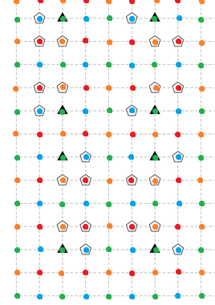

# 网络流合集

## 最大流与二分图匹配

### P2764 最小路径覆盖问题

[传送门](https://www.luogu.com.cn/problem/P2764)

模板题里比较不显然的。

考虑路径数怎么概括，容易发现路径数等于路径起点数（因为是 DAG 没有环），那么考虑起点和其它点的本质区别是什么，即**入度为** $0$，换句话说，路径数 $= n-\sum d_i$ 其中 $d_i$ 是 $i$ 的入度（显然只能为 $0$ 或 $1$）。

那么就要最大化入度总数了，容易发现每个入度必须要一个出度来匹配（一条有向边终点的入度与起点的出度匹配），就容易想到二分图最大匹配。左部点 $(i,0)$ 代表 $i$ 的出度，右部点 $(i,1)$ 代表 $i$ 的入度，然后左右点连边 $(i,0)\to (j,1)$ 当且仅当对应 $(i,j)$ 间有边。最小路径覆盖即最大匹配。

对于输出方案，容易发现匹配边 $(i,0)\to (j,1)$ 对应方案中的边 $(i,j)$。

/// details | 参考代码
	open: False
	type: success

```cpp
#include<bits/stdc++.h>
#define mem(a,b) memset(a,b,sizeof(a))
#define forup(i,s,e) for(int i=(s);i<=(e);i++)
#define fordown(i,s,e) for(int i=(s);i>=(e);i--)
using namespace std;
#define gc getchar()
inline int read(){
    int x=0,f=1;char c;
    while(!isdigit(c=gc)) if(c=='-') f=-1;
    while(isdigit(c)){x=(x<<3)+(x<<1)+(c^48);c=gc;}
    return x*f;
}
#undef gc
const int N=160,M=6000,inf=0x3f3f3f3f;
int n,m,s,t,ans;
struct edge{
	int v,rst,nxt;
}e[M<<2];
int cnte=1,head[N<<1];
void adde(int u,int v){
	e[++cnte]=edge{v,1,head[u]};head[u]=cnte;
	e[++cnte]=edge{u,0,head[v]};head[v]=cnte;
}
int dpt[N<<1],cur[N<<1];
queue<int> q;
bool bfs(){
	forup(i,1,(n<<1)+2){
		cur[i]=head[i];
	}
	mem(dpt,-1);
	while(q.size()) q.pop();
	q.push(s);
	dpt[s]=0;
	while(q.size()){
		int u=q.front();q.pop();
		for(int i=head[u];i;i=e[i].nxt){
			if(!e[i].rst||dpt[e[i].v]!=-1) continue;
			dpt[e[i].v]=dpt[u]+1;
			q.push(e[i].v);
		}
	}
	return dpt[t]!=-1;
}
int dfs(int x,int flow){
	if(x==t||!flow) return flow;
	for(int i=cur[x];i;i=e[i].nxt){
		cur[x]=i;
		if(dpt[e[i].v]==dpt[x]+1){
			int res=dfs(e[i].v,min(flow,e[i].rst));
			if(res){
				e[i].rst-=res;
				e[i^1].rst+=res;
				return res;
			}
		}
	}
	return 0;
}
int dinic(){
	int ans=0;
	while(bfs()){
		ans+=dfs(s,inf);
	}
	return ans;
}
signed main(){
	n=read();m=read();
	forup(i,1,m){
		int u=read(),v=read();
		adde(u,v+n);
	}
	s=(n<<1)+1;t=(n<<1)+2;
	forup(i,1,n) adde(s,i);
	forup(i,n+1,n<<1) adde(i,t);
	int ans=n-dinic();
	forup(i,1,n){
		if(e[head[i+n]].rst){
			int l=i;
			bool flag=true;
			while(flag){
				printf("%d ",l);
				flag=false;
				for(int j=head[l];j;j=e[j].nxt){
					if(e[j].v>(n<<1)) continue;
					if(!e[j].rst){
						l=e[j].v-n;flag=true;
						break;
					}
				}
			}
			puts("");
		}
	}
	printf("%d\n",ans);
}
```

///

具体来说

### P3163 [CQOI2014] 危桥

[传送门](https://www.luogu.com.cn/problem/P3163)

妙题。

第一眼：乂？这不是建个超级源点超级汇点直接做就行了吗（就把一次往返视为只经过一次）。

然后发现不对，因为会有 $a_1\to b_2$ 和 $a_2\to b_1$ 的流，还有无向边两个方向都走一遍的情况。

怎么办呢？考虑流的组成部分，设 $f(u,v)$ 表示从 $u$ 到 $v$ 的流量和是否为 $a_n+b_n$，称流量和为 $a_n+b_n$ 为“合法”。

则求出来的流是 $f(a_1,a_2)+f(a_1,b_2)+f(b_1,b_2)+f(b_1,a_2)$。

这时候怎么办呢？考虑有没有什么办法在不改变 $f(a_1,a_2)$ 和 $f(b_1,b_2)$ 的情况下改变剩下两项。一个想法是交换 $b_1,b_2$，即把 $b_2$ 作为源点，$b_1$ 作为汇点，此时流变为 $f(a_1,a_2)+f(a_1,b_1)+f(b_1,b_2)+f(b_2,a_2)$。由于是无向边，那么若 $f(a_1,a_2)$ 与 $f(b_1,b_2)$ 没有同时经过某一条边的两个方向 $f(b_2,b_1)$ 完全可以直接把原先的流反过来，故已经排除了反向边的情况。

接下来考虑串流的情况。若这个也合法，那么有两种情况：

1. $f(a_1,b_2)=f(a_2,b_1)=f(a_1,b_1)=f(b_2,a_2)=0$

显然合法。

2. $f(a_1,b_2)+f(b_1,a_2)=f(a_1,b_1)+f(b_2,a_2)$

由于可以构造出 $f(a_1,a_2)$ 不变，$f(b_1,b_2)$ 反向的情况，那么此时上面四个都相等。

那么有 $f(a_1,b_2)=f(a_1,b_1)$，且不影响 $f(a_1,a_2)$ 与 $f(b_1,b_2)$ 的流。此时可以将 $f(a_1,b_2)$ 反向加在 $f(b_1,b_2)$ 的流里面。

那么就以 $a_1,b_1$ 为源点，$a_1,b_2$ 为源点分别跑一遍即可。

/// details | 参考代码
	open: False
	type: success

```cpp
#include<bits/stdc++.h>
#define mem(a,b) memset(a,b,sizeof(a))
#define forup(i,s,e) for(int i=(s);i<=(e);i++)
#define fordown(i,s,e) for(int i=(s);i>=(e);i--)
#ifdef DEBUG
#define msg(args...) fprintf(stderr,args)
#else
#define msg(...) void()
#endif
using namespace std;
#define gc getchar()
inline int read(){
    int x=0,f=1;char c;
    while(!isdigit(c=gc)) if(c=='-') f=-1;
    while(isdigit(c)){x=(x<<3)+(x<<1)+(c^48);c=gc;}
    return x*f;
}
#undef gc
const int N=70,inf=0x3f3f3f3f;
int n,a1,a2,ca,b1,b2,cb;
struct FLOW{
	struct edge{
		int v,rst,nxt;
	}e[N*N*2];
	int head[N],cur[N],dpt[N],cnte,s,t;
	void adde(int u,int v,int w){
		e[++cnte]=edge{v,w,head[u]};head[u]=cnte;
		e[++cnte]=edge{u,w,head[v]};head[v]=cnte;
	}
	void clear(){
		cnte=1;mem(head,0);
		s=n+1;t=n+2;
	}
	bool bfs(){
		forup(i,1,t){
			cur[i]=head[i];
			dpt[i]=-1;
		}
		queue<int> q;
		q.push(s);dpt[s]=0;
		while(q.size()){
			int u=q.front();q.pop();
			for(int i=head[u];i;i=e[i].nxt){
				if(!e[i].rst) continue;
				int v=e[i].v;
				if(dpt[v]==-1){
					dpt[v]=dpt[u]+1;
					q.push(v);
				}
			}
		}
		return dpt[t]!=-1;
	}
	int dfs(int x,int flow){
		if(x==t||!flow) return flow;
		int res=0;
		for(int i=cur[x];i;i=e[i].nxt){
			cur[x]=i;int v=e[i].v;
			if(dpt[v]!=dpt[x]+1) continue;
			int gt=dfs(v,min(flow-res,e[i].rst));
			if(gt){
				res+=gt;
				e[i].rst-=gt;
				e[i^1].rst+=gt;
				if(res==flow) break;
			}
		}
		return res;
	}
	int dinic(){
		int res=0;
		while(bfs()){
			res+=dfs(s,inf);
		}
		return res;
	}
}flow;
char grp[N][N];
void solve(){
	a1=read()+1;a2=read()+1;ca=read();b1=read()+1;b2=read()+1;cb=read();
	flow.clear();
	forup(i,1,n){
		scanf(" %s",grp[i]+1);
	}
	forup(i,1,n){
		forup(j,i+1,n){
			if(grp[i][j]=='N'){
				flow.adde(i,j,inf);
			}else if(grp[i][j]=='O'){
				flow.adde(i,j,1);
			}
		}
	}
	flow.adde(flow.s,a1,ca);flow.adde(flow.s,b1,cb);
	flow.adde(a2,flow.t,ca);flow.adde(b2,flow.t,cb);
	int ans=flow.dinic();
	if(ans!=ca+cb){
		puts("No");
		return;
	}
	flow.clear();
	forup(i,1,n){
		forup(j,i+1,n){
			if(grp[i][j]=='N'){
				flow.adde(i,j,inf);
			}else if(grp[i][j]=='O'){
				flow.adde(i,j,1);
			}
		}
	}
	flow.adde(flow.s,a1,ca);flow.adde(flow.s,b2,cb);
	flow.adde(a2,flow.t,ca);flow.adde(b1,flow.t,cb);
	ans=flow.dinic();
	if(ans!=ca+cb){
		puts("No");
		return;
	}
	puts("Yes");
}
signed main(){
	while(scanf(" %d",&n)!=EOF){
		solve();
	}
}
```

///


### CF793G Oleg and chess

[传送门](https://www.luogu.com.cn/problem/CF793G)

简单题，但是一直想歪了，一直在想怎么优化建模。

容易发现如果规模比较小就是简单的二分图匹配。但是这道题 $n$ 很大（算是比较大吧），怎么办呢？

容易发现大部分连边都是某矩阵内横向所有点连向纵向所有点（即区间连区间），容易想到线段树优化建图，每次新建一个点作为中间点即可。找矩形可以用 ODT 之类的随便扫描线维护一下。

点数是 $O(n)$ 的，边数是 $O(n\log n)$ 的，dinic 随便过。

/// details | 参考代码
	open: False
	type: success

```cpp
#include<bits/stdc++.h>
#define mem(a,b) memset(a,b,sizeof(a))
#define forup(i,s,e) for(int i=(s);i<=(e);i++)
#define fordown(i,s,e) for(int i=(s);i>=(e);i--)
#ifdef DEBUG
#define msg(args...) fprintf(stderr,args)
#else
#define msg(...) void()
#endif
#define y1 y114514
using namespace std;
using pii=pair<int,int>;
#define fi first
#define se second
#define mkp make_pair
#define gc getchar()
inline int read(){
    int x=0,f=1;char c;
    while(!isdigit(c=gc)) if(c=='-') f=-1;
    while(isdigit(c)){x=(x<<3)+(x<<1)+(c^48);c=gc;}
    return x*f;
}
#undef gc
const int N=1<<14,inf=0x3f3f3f3f;
int n,m,cntn;
struct FLOW{
	struct edge{
		int v,rst,nxt;
	}e[N*80];
	int head[N*5],cur[N*5],cnte,s,t,dpt[N*5];
	void adde(int u,int v,int w){
		e[++cnte]=edge{v,w,head[u]};head[u]=cnte;
		e[++cnte]=edge{u,0,head[v]};head[v]=cnte;
	}
	bool bfs(){
		forup(i,1,t){
			cur[i]=head[i];
			dpt[i]=-1;
		}
		dpt[s]=0;
		queue<int> q;q.push(s);
		while(q.size()){
			int u=q.front();q.pop();
			for(int i=head[u];i;i=e[i].nxt){
				if(!e[i].rst) continue;
				int v=e[i].v;
				if(dpt[v]==-1){
					dpt[v]=dpt[u]+1;
					q.push(v);
				}
			}
		}
		return dpt[t]!=-1;
	}
	int dfs(int x,int flow){
		if(x==t||!flow) return flow;
		int res=0;
		for(int i=cur[x];i;i=e[i].nxt){
			cur[x]=i;int v=e[i].v;
			if(!e[i].rst||dpt[v]!=dpt[x]+1) continue;
			int gt=dfs(v,min(e[i].rst,flow-res));
			if(gt){
				e[i].rst-=gt;
				e[i^1].rst+=gt;
				res+=gt;
				if(res==flow) break;
			}
		}
		return res;
	}
	int dinic(){
		int ans=0;
		while(bfs()){
			ans+=dfs(s,inf);
		}
		return ans;
	}
}flow;
struct range{
	int l,r,op;
};
vector<range> add[N],era[N];
struct SegTree{
	int node[N<<1];
	void Build(int flag){
		forup(i,1,n) node[i+N]=i+flag*n;
		fordown(i,N-1,1){
			if(!node[i<<1]&&!node[i<<1|1]) continue;
			node[i]=++cntn;
			if(flag){
				if(node[i<<1]) flow.adde(node[i],node[i<<1],inf);
				if(node[i<<1|1]) flow.adde(node[i],node[i<<1|1],inf);
			}else{
				if(node[i<<1]) flow.adde(node[i<<1],node[i],inf);
				if(node[i<<1|1]) flow.adde(node[i<<1|1],node[i],inf);
			}
		}
	}
	void Link(int l,int r,int X,int flag){
		if(flag){
			for(l+=N-1,r+=N+1;l^r^1;l>>=1,r>>=1){
				if(!(l&1)) flow.adde(X,node[l^1],inf);
				if(  r&1 ) flow.adde(X,node[r^1],inf);
			}
		}else{
			for(l+=N-1,r+=N+1;l^r^1;l>>=1,r>>=1){
				if(!(l&1)) flow.adde(node[l^1],X,inf);
				if(  r&1 ) flow.adde(node[r^1],X,inf);
			}
		}
	}
}t1,t2;
map<pii,int> odt;
using mit=map<pii,int>::iterator;
mit split(int x){
	mit it=odt.lower_bound(mkp(x,0));
	if(it->fi.fi==x) return it;
	--it;
	int l=it->fi.fi,r=it->fi.se,c=it->se;
	odt.erase(it);
	odt.insert(mkp(mkp(l,x-1),c));
	if(x<=r){
		return odt.insert(mkp(mkp(x,r),c)).fi;
	}else{
		return odt.end();
	}
}
signed main(){
	n=read();m=read();
	flow.cnte=1;
	cntn=n*2;
	t1.Build(1);t2.Build(0);
	forup(i,1,m){
		int x1=read(),y1=read(),x2=read(),y2=read();
		add[x1].push_back(range{y1,y2,0});
		era[x2+1].push_back(range{y1,y2,1});
	}
	odt.insert(mkp(mkp(1,n),1));
	forup(i,1,n){
		for(auto j:era[i]){
			mit ed=split(j.r+1),st=split(j.l);
			odt.erase(st,ed);
			odt.insert(mkp(mkp(j.l,j.r),i));
		}
		for(auto j:add[i]){
			mit ed=split(j.r+1),st=split(j.l);
			for(mit it=st;it!=ed;odt.erase(prev(++it))){
				if(it->se<=i-1){
					int nw=++cntn;
					t1.Link(it->fi.fi,it->fi.se,nw,1);
					t2.Link(it->se,i-1,nw,0);
				}
			}
			odt.insert(mkp(mkp(j.l,j.r),n+1));
		}
	}
	for(auto j:odt){
		if(j.se<=n){
			int nw=++cntn;
			t1.Link(j.fi.fi,j.fi.se,nw,1);
			t2.Link(j.se,n,nw,0);
		}
	}
	flow.s=++cntn;flow.t=++cntn;
	forup(i,1,n){
		flow.adde(flow.s,i,1);flow.adde(i+n,flow.t,1);
	}
	printf("%d\n",flow.dinic());
}
```

///


### CF590E Birthday

[传送门](https://www.luogu.com.cn/problem/CF590E)

第一眼感觉巨大困难，过了一个小时发现会了，写完发现 dinic 时空被卡了，最后用匈牙利算法解决。

首先由于子串关系可以形成一个偏序集，那么这道题就是要求最长反链。

容易想到用 AC 自动机求子串关系，但是在 AC 自动机上暴力跳显然复杂度是错的。容易想到每个点只连 $fail$ 树上最近的**是某字符串结尾**的祖先（这个可以在建自动机时维护），然后对这样求出来的 DAG 求传递闭包就能得到我们想连的图了。

根据最长反链等于最小链覆盖，可以二分图匹配求出最小链覆盖。然后考虑在每条链上选一个点作为答案。但是不能随便选，因为可能形成偏序关系，怎么办呢？

其实很简单，首先找到每条链的末尾（即左部点中没连匹配边的），然后每次随便找一个不合法的，接着往前找该链第一个合法的即可（这个每次跳对应右部点的匹配点就是链上的上一个点）。根据最长反链等于最小链覆盖这样必定是能求出解的，并且由于每个点只会被经过一次所以复杂度 $O(n)$。

友情提示：dinic 时空会被卡，请使用匈牙利算法。

总复杂度 $O(\sum|s_i|+\frac{n^3}{w})$。

/// details | 参考代码
	open: False
	type: success

```cpp
#include<bits/stdc++.h>
#define mem(a,b) memset(a,b,sizeof(a))
#define forup(i,s,e) for(int i=(s);i<=(e);i++)
#define fordown(i,s,e) for(int i=(s);i>=(e);i--)
#ifdef DEBUG
#define msg(args...) fprintf(stderr,args)
#else
#define msg(...) void()
#endif
using namespace std;
#define gc getchar()
inline int read(){
    int x=0,f=1;char c;
    while(!isdigit(c=gc)) if(c=='-') f=-1;
    while(isdigit(c)){x=(x<<3)+(x<<1)+(c^48);c=gc;}
    return x*f;
}
#undef gc
const int N=755,M=1e7+5,inf=0x3f3f3f3f;
int n;
char str[M];
vector<int> pth[N];
int tr[M][2],fail[M],cntn,lst[M];
void Insert(int n,int num){
	int p=0;
	forup(i,1,n){
		int c=str[i]-'a';
		if(!tr[p][c]) tr[p][c]=++cntn;
		p=tr[p][c];
		pth[num].push_back(p);
	}
	lst[p]=num;
}
void Build(){
	queue<int> q;
	forup(i,0,1){
		if(tr[0][i]) q.push(tr[0][i]);
	}
	while(q.size()){
		int u=q.front();q.pop();
		if(!lst[u]) lst[u]=lst[fail[u]];
		forup(c,0,1){
			if(tr[u][c]){
				fail[tr[u][c]]=tr[fail[u]][c];
				q.push(tr[u][c]);
			}else{
				tr[u][c]=tr[fail[u]][c];
			}
		}
	}
}
bitset<N> grp[N],nw,vis;
int pre[N],pr[N],pl[N];
bool bfs(int s){
	queue<int> q;
	q.push(s);
	pre[s]=0;
	vis.set();
	while(q.size()){
		int u=q.front();q.pop();
		nw=vis&grp[u];
		for(int i=nw._Find_first();i<=n;i=nw._Find_next(i)){
			vis.reset(i);
			pre[i]=u;
			if(!pr[i]){
				while(i){
					pr[i]=pre[i];
					swap(i,pl[pre[i]]);
				}
				return true;
			}
			q.push(pr[i]);
		}
	}
	return false;
}
int work(){
	int ans=0;
	forup(i,1,n){
		ans+=bfs(i);
	}
	return ans;
}
bitset<N> v;
vector<int> ans;
signed main(){
	n=read();
	forup(i,1,n){
		scanf(" %s",str+1);
		Insert(strlen(str+1),i);
	}
	Build();
	forup(i,1,n){
		for(auto j:pth[i]){
			if(lst[j]==i){
				if(lst[fail[j]]){
					grp[i][lst[fail[j]]]=true;
				}
			}else if(lst[j]){
				grp[i][lst[j]]=true;
			}
		}
	}
	forup(k,1,n){
		forup(i,1,n){
			if(i==k) continue;
			forup(j,1,n){
				if(i==j||k==j||grp[i][j]) continue;
				grp[i][j]=grp[i][k]&grp[k][j];
			}
		}
	}
	printf("%d\n",n-work());
	forup(i,1,n){
		if(!pl[i]){
			ans.push_back(i);
		}
	}
	bool flag=true;
	while(flag){
		flag=false;
		for(auto x:ans){
			v=v|grp[x];
		}
		for(auto &x:ans){
			if(v[x]){
				flag=true;
				while(v[x]) x=pr[x];
			}
		}
	}
	for(auto i:ans){
		printf("%d ",i);
	}
}
```

///

### P2825 [HEOI2016/TJOI2016] 游戏

[传送门](https://www.luogu.com.cn/problem/P2825)

容易发现如果没有 `#` 就是一个很板的二分图匹配模型。

那么有了 `#` 其实仍然是二分图匹配模型，只是每个结点不代表一整行/列，而是代表**能互相到达的横/纵向最长宽度为 $1$ 的连通块**。

边数是 $O(n^2)$ 级别的，随便过。

/// details | 参考代码
	open: False
	type: success

```cpp
#include<bits/stdc++.h>
#define mem(a,b) memset(a,b,sizeof(a))
#define forup(i,s,e) for(int i=(s);i<=(e);i++)
#define fordown(i,s,e) for(int i=(s);i>=(e);i--)
#ifdef DEBUG
#define msg(args...) fprintf(stderr,args)
#else
#define msg(...) void()
#endif
using namespace std;
#define gc getchar()
inline int read(){
    int x=0,f=1;char c;
    while(!isdigit(c=gc)) if(c=='-') f=-1;
    while(isdigit(c)){x=(x<<3)+(x<<1)+(c^48);c=gc;}
    return x*f;
}
#undef gc
const int N=55,inf=0x3f3f3f3f;
int n,m;
int a[N][N],num[N][N],cntn;
char str[N];
namespace flow{
	struct edge{
		int v,rst,nxt;
	}e[N*N*2];
	int head[N*N*2],cur[N*N*2],dpt[N*N*2],cnte,s,t;
	void adde(int u,int v,int w){
		e[++cnte]=edge{v,w,head[u]};head[u]=cnte;
		e[++cnte]=edge{u,0,head[v]};head[v]=cnte;
	}
	bool bfs(){
		forup(i,1,cntn){
			dpt[i]=-1;
			cur[i]=head[i];
		}
		queue<int> q;
		q.push(s);dpt[s]=0;
		while(q.size()){
			int u=q.front();q.pop();
			for(int i=head[u];i;i=e[i].nxt){
				int rst=e[i].rst,v=e[i].v;
				if(!rst||~dpt[v]) continue;
				dpt[v]=dpt[u]+1;
				q.push(v);
			}
		}
		return ~dpt[t];
	}
	int dfs(int x,int flow){
		if(x==t||!flow) return flow;
		int res=0;
		for(int i=cur[x];i;i=e[i].nxt){
			cur[x]=i;int v=e[i].v,rst=e[i].rst;
			if(dpt[v]!=dpt[x]+1||!rst) continue;
			int gt=dfs(v,min(rst,flow-res));
			if(gt){
				res+=gt;
				e[i].rst-=gt;
				e[i^1].rst+=gt;
				if(res==flow) break;
			}
		}
		return res;
	}
	int dinic(){
		int ans=0;
		while(bfs()){
			ans+=dfs(s,inf);
		}
		return ans;
	}
}
signed main(){
	n=read();m=read();
	forup(i,1,n){
		scanf(" %s",str+1);
		forup(j,1,m){
			a[i][j]=(str[j]=='*'?0:str[j]=='x'?1:2);
		}
	}
	flow::s=1;flow::t=2;cntn=2;
	flow::cnte=1;
	forup(i,1,n){
		++cntn;bool flag=false;
		flow::adde(flow::s,cntn,1);
		forup(j,1,m){
			if(a[i][j]==2&&flag){
				++cntn;flag=false;
				flow::adde(flow::s,cntn,1);
			}
			if(a[i][j]!=2) flag=true;
			num[i][j]=cntn;
		}
	}
	forup(j,1,m){
		++cntn;bool flag=false;
		flow::adde(cntn,flow::t,1);
		forup(i,1,n){
			if(a[i][j]==2&&flag){
				++cntn;flag=false;
				flow::adde(cntn,flow::t,1);
			}
			if(a[i][j]!=2) flag=true;
			if(a[i][j]==0){
				flow::adde(num[i][j],cntn,inf);
			}
		}
	}
	printf("%d\n",flow::dinic());
}
```

///


### AGC029F Construction of a tree

[传送门](https://www.luogu.com.cn/problem/AT_agc029_f)

唉，Hall 定理。

妙题。

考虑什么情况显然无解，若选定 $k$ 个给定的点集 $V_{p_1},V_{p_2},\dots,V_{p_k}$，它们并起来小于等于 $k$，那么对不起，这些点集无论怎么选边必定会形成环（这对于“形成环”的结论是充分条件，但不是必要条件），那么就无法建出树了。（这个结论是显然的吧？如果能建出不是环的图至少包含 $k+1$ 个点）。那么若 $S=\begin{Bmatrix}p_1,p_2,p_3\dots p_k\end{Bmatrix}$，令 $f(S)=V_{p_1}\cup V_{p_2}\cup V_{p_3}\cup \dots \cup V_{p_k}$。容易发现若 $\exists S\subseteq [1,n-1],|f(S)|\le |S|$，则无解。

考虑逆否命题是若有解则有 $\forall S\subseteq [1,n-1],|f(S)|> |S|$。根据上文可知这是一个有解的必要不充分条件。而有经验的同学就能看出这长得非常像 Hall 定理，那么考虑跑一遍二分图匹配。

具体来说，左部点是点，右部点是题目给定的点集。然后每个点集内所有点向它连边。这样匹配出来（如果有解）最大匹配必定是 $n-1$。那么左部点必然恰好有一个点 $r$ 没被匹配。

考虑从点 $r$ 开始 dfs，设当前点是 $u$，每次找一条 $u$ 开始**不是匹配边**的边走到一个没用过的右部点（点集）。那么它的匹配点 $v$ 显然能和 $u$ 连一条边 $(u,v)$。并且由于每个左部点只会有一条匹配边（除去 $r$）所以显然不会连出环。这样构造出来的显然是正确的解。考虑有没有可能有解而无法被这样构造出来。

容易发现算法终止当且仅当对于每一个经过的左部点，和它相邻的所有右部点都被经过了（无法拓展新点）。那么考虑有没有可能在有解的情况下，在没求出解时终止算法。

假设存在一个有解的情况算法终止在一半。当算法终止时，对于剩下的右部点集合 $T$，容易发现 $f(T)$ 必然是没被经过的左部点的子集（更准确的说，由于最大匹配是 $n-1$，所以其实必定就是剩下的左部点集合）。又由于无论何时被经过的左部点数量都恰好是右部点数量 $+1$（考虑每次左右各拓展一个，但最初有一个 $r$）。则此时 $|f(T)|\le |T|$，根据上文可知无解，与假设矛盾。值得注意的是，由于命题“若有解则有 $\forall S\subseteq [1,n-1],|f(S)|> |S|$”是一个必要不充分条件，所以当无解时最大匹配也有可能是 $n-1$，但是这个构造方案是充分必要的，具体实现需要注意这一点。复杂度 $O(N+M+M\sqrt{N})$。

/// details | 参考代码
	open: False
	type: success

```cpp
#include<bits/stdc++.h>
#define mem(a,b) memset(a,b,sizeof(a))
#define forup(i,s,e) for(int i=(s);i<=(e);i++)
#define fordown(i,s,e) for(int i=(s);i>=(e);i--)
#ifdef DEBUG
#define msg(args...) fprintf(stderr,args)
#else
#define msg(...) void()
#endif
using namespace std;
using pii=pair<int,int>;
#define fi first
#define se second
#define mkp make_pair
#define gc getchar()
inline int read(){
    int x=0,f=1;char c;
    while(!isdigit(c=gc)) if(c=='-') f=-1;
    while(isdigit(c)){x=(x<<3)+(x<<1)+(c^48);c=gc;}
    return x*f;
}
#undef gc
const int N=2e5+5,inf=0x3f3f3f3f;
int n;
struct edge{
	int v,rst,nxt;
}e[N<<2];
int head[N],cur[N],dpt[N],cnte,s,t;
void adde(int u,int v,int w){
//	msg("%d %d||\n",u,v);
	e[++cnte]=edge{v,w,head[u]};head[u]=cnte;
	e[++cnte]=edge{u,0,head[v]};head[v]=cnte;
}
bool bfs(){
	forup(i,1,t){
		cur[i]=head[i];
		dpt[i]=-1;
	}
	queue<int> q;
	dpt[s]=0;q.push(s);
	while(q.size()){
		int u=q.front();q.pop();
		for(int i=head[u];i;i=e[i].nxt){
			if(!e[i].rst) continue;
			int v=e[i].v;
			if(dpt[v]==-1){
				dpt[v]=dpt[u]+1;
				q.push(v);
			}
		}
	}
	return dpt[t]!=-1;
}
int dfs(int x,int flow){
	if(x==t||!flow) return flow;
	int res=0;
	for(int i=cur[x];i;i=e[i].nxt){
		cur[x]=i;int v=e[i].v;
		if(dpt[v]!=dpt[x]+1) continue;
		int gt=dfs(v,min(flow-res,e[i].rst));
		if(gt){
			res+=gt;
			e[i].rst-=gt;
			e[i^1].rst+=gt;
			if(res==flow) break;
		}
	}
	return res;
}
int dinic(){
	int ans=0;
	while(bfs()){
		ans+=dfs(s,inf);
	}
	return ans;
}
int vis[N];
pii ans[N];
void dfs1(int u){
	for(int i=head[u];i;i=e[i].nxt){
		int p=e[i].v;
//		msg("%d %d %d|1\n",u,p,e[i].rst);
		if(p<s&&!vis[p-n]&&e[i].rst){
			vis[p-n]=1;
			for(int j=head[p];j;j=e[j].nxt){
				int v=e[j].v;
				if(v<s&&e[j].rst){
//					msg("%d %d %d|2\n",p-n,u,v);
					ans[p-n]=mkp(u,v);
					dfs1(v);
				}
			}
		}
	}
}
signed main(){
	n=read();
	cnte=1;
	s=n*2+1;t=n*2+2;
	forup(i,1,n){
		adde(s,i,1);adde(i+n,t,1);
	}
	forup(i,1,n-1){
		int k=read();
		forup(j,1,k){
			int v=read();
			adde(v,n+i,1);
		}
	}
	int res=dinic();
	if(res!=n-1){
		puts("-1");
		return 0;
	}
	int r=0;
	for(int i=head[s];i;i=e[i].nxt){
		if(e[i].rst){
			r=e[i].v;
			break;
		}
	}
	dfs1(r);
	forup(i,1,n-1){
		if(!vis[i]){
			puts("-1");
			return 0;
		}
	}
	forup(i,1,n-1){
		printf("%d %d\n",ans[i].fi,ans[i].se);
	}
}
```

///

### CF1630F Making It Bipartite

[传送门](https://www.luogu.com.cn/problem/CF1630F)

远看二分图，近看最小割，细看还是二分图。

考虑什么时候不是二分图，即什么时候会出现奇环。

手模一下可以得到若出现奇环，则必然存在三个点 $i,j,k$，使得 $a_j=\lambda_1a_i,a_k=\lambda_2a_j$，即 $a_j$ 既做因数又做倍数。故答案中**不能存在 $a_i$ 既做因数又做倍数**。感觉上和最小割比较类似（但不是最小割，因为一个点有三种选法，做因数、做倍数和删掉这个点），那么容易想到拆点，具体来说，将点 $i$ 拆成 $(i,0),(i,1)$ 两点，表示 $i$ 做因数或 $i$ 做倍数。因为这两个不能共存，而倍数关系又是偏序关系，可以考虑建模成最大反链。具体来说，$(i,0)\to (i,1)$ 连一条边（这个显然），然后 $\forall j,a_i=\lambda a_j$，连边 $(i,0)\to (j,0),(i,1)\to (j,1),(i,0)\to (j,1)$（由于 $a_i$ 是 $a_j$ 的倍数，所以 $a_i$ 不能做因数，$a_j$ 不能做倍数），求出这张图的最大反链即可。这个考虑 Dilworth 定理转化成最小链覆盖，那么可以二分图匹配求。

/// details | 参考代码
	open: False
	type: success

```cpp
#include<bits/stdc++.h>
#define mem(a,b) memset(a,b,sizeof(a))
#define forup(i,s,e) for(int i=(s);i<=(e);i++)
#define fordown(i,s,e) for(int i=(s);i>=(e);i--)
#ifdef DEBUG
#define msg(args...) fprintf(stderr,args)
#else
#define msg(...) void()
#endif
using namespace std;
#define gc getchar()
inline int read(){
    int x=0,f=1;char c;
    while(!isdigit(c=gc)) if(c=='-') f=-1;
    while(isdigit(c)){x=(x<<3)+(x<<1)+(c^48);c=gc;}
    return x*f;
}
#undef gc
const int N=5e4+5,inf=0x3f3f3f3f;
int n,a[N];
vector<int> po[N];
namespace flow{
	struct edge{
		int v,rst,nxt;
	}e[N*100];
	int head[N<<2],cur[N<<2],dpt[N<<2],s,t,cnte=1;
	void build(){
		s=n*4+1;t=n*4+2;cnte=1;
		forup(i,1,t){
			head[i]=0;
		}
	}
	void adde(int u,int v,int w){
		e[++cnte]=edge{v,w,head[u]};head[u]=cnte;
		e[++cnte]=edge{u,0,head[v]};head[v]=cnte;
	}
	bool bfs(){
		forup(i,1,t){
			dpt[i]=-1;
			cur[i]=head[i];
		}
		queue<int> q;
		q.push(s);dpt[s]=0;
		while(q.size()){
			int u=q.front();q.pop();
			for(int i=head[u];i;i=e[i].nxt){
				int v=e[i].v;
				if(dpt[v]!=-1||!e[i].rst) continue;
				dpt[v]=dpt[u]+1;
				q.push(v);
			}
		}
		return dpt[t]!=-1;
	}
	int dfs(int x,int flow){
		if(x==t||!flow) return flow;
		int res=0;
		for(int i=cur[x];i;i=e[i].nxt){
			cur[x]=i;
			int v=e[i].v,rst=e[i].rst;
			if(!rst||dpt[v]!=dpt[x]+1) continue;
			int gt=dfs(v,min(rst,flow-res));
			if(gt){
				res+=gt;
				e[i].rst-=gt;
				e[i^1].rst+=gt;
				if(res==flow) break;
			}
		}
		return res;
	}
	int dinic(){
		int ans=0;
		while(bfs()){
			ans+=dfs(s,inf);
		}
		return ans;
	}
}
void solve(){
	n=read();
	flow::build();
	int maxa=0;
	forup(i,1,n){
		a[i]=read();
		maxa=max(maxa,a[i]);
		po[a[i]].push_back(i);
	}
	forup(i,1,n){
		flow::adde(flow::s,i,1);
		flow::adde(i+n*2,flow::t,1);
		flow::adde(flow::s,i+n,1);
		flow::adde(i+n+n*2,flow::t,1);
		flow::adde(i,i+n+n*2,1);
		for(int j=a[i]*2;j<=maxa;j+=a[i]){
			for(auto k:po[j]){
				flow::adde(k,i+n+n*2,1);
				flow::adde(k,i+n*2,1);
				flow::adde(k+n,i+n+n*2,1);
			}
		}
	}
	int res=flow::dinic();
	printf("%d\n",n-(2*n-res));
	forup(i,1,n){
		po[a[i]].clear();
	}
}
signed main(){
	int t=read();
	while(t--){
		solve();
	}
}
```

///

### P2754 [CTSC1999] 家园 / 星际转移问题

[传送门](https://www.luogu.com.cn/problem/P2754)

第一眼：欸这有俩权值不是费用流吗？

但是显然不对，因为“时间”在每艘船上不是独立的，不能简单相加。这个可以考虑建分层图跑最大流。

具体来说，每一层表示一个时刻，每个时刻向下一时刻连对应边（两种，用船运一站和留在原地不动）即可。这样就能判断是否能在 $t$ 时刻内到达了。于是考虑二分答案。

显然，当 $-1,0$ 不连通时无解，否则容易发现答案不会太大，考虑最差情况是每个点都经过一次，每次都等对应船走完一轮，每艘船都只能载一个人，上限是 $12\times 15\times 50=9750$，但是显然卡不满，而且多人可以同时坐船，实际上答案不会大于 $1000$。注意边数，每个时刻要连 $n+m$ 条边。

总结下来就是遇到**时间**之类的限制可以考虑分层图最大流。

/// details | 参考代码
	open: False
	type: success

```cpp
#include<bits/stdc++.h>
#define mem(a,b) memset(a,b,sizeof(a))
#define forup(i,s,e) for(int i=(s);i<=(e);i++)
#define fordown(i,s,e) for(int i=(s);i>=(e);i--)
#ifdef DEBUG
#define msg(args...) fprintf(stderr,args)
#else
#define msg(...) void()
#endif
using namespace std;
#define gc getchar()
inline int read(){
    int x=0,f=1;char c;
    while(!isdigit(c=gc)) if(c=='-') f=-1;
    while(isdigit(c)){x=(x<<3)+(x<<1)+(c^48);c=gc;}
    return x*f;
}
#undef gc
const int N=25,inf=0x3f3f3f3f;
int n,m,k,h[N],r[N],s[N][N];
namespace flow{
	const int N=15000;
	struct edge{
		int v,rst,nxt;
	}e[N*40];
	int head[N],cur[N],dpt[N],cnte=1,s,t;
	void clear(){
		cnte=1;
		forup(i,0,t){
			head[i]=0;
		}
	}
	void adde(int u,int v,int w){
		e[++cnte]=edge{v,w,head[u]};head[u]=cnte;
		e[++cnte]=edge{u,0,head[v]};head[v]=cnte;
	}
	bool bfs(){
		queue<int> q;
		forup(i,0,t){
			cur[i]=head[i];dpt[i]=-1;
		}
		dpt[s]=0;q.push(s);
		while(q.size()){
			int u=q.front();q.pop();
			for(int i=head[u];i;i=e[i].nxt){
				int v=e[i].v;
				if(!e[i].rst||dpt[v]!=-1) continue;
				dpt[v]=dpt[u]+1;
				q.push(v);
			}
		}
		return dpt[t]!=-1;
	}
	int dfs(int x,int flow){
		if(x==t||!flow) return flow;
		int res=0;
		for(int i=cur[x];i;i=e[i].nxt){
			cur[x]=i;
			int v=e[i].v,rst=e[i].rst;
			if(dpt[v]!=dpt[x]+1||!rst) continue;
			int gt=dfs(v,min(rst,flow-res));
			if(gt){
				e[i].rst-=gt;
				e[i^1].rst+=gt;
				res+=gt;
				if(res==flow) break;
			}
		}
		return res;
	}
	int dinic(){
		int ans=0;
		while(bfs()){
			ans+=dfs(s,inf);
		}
		return ans;
	}
}
int fa[N];
int getfa(int x){return x==fa[x]?x:fa[x]=getfa(fa[x]);}
void merge(int u,int v){
	u=getfa(u),v=getfa(v);
	if(u==v) return;
	fa[u]=v;
}
bool chk(int mm){
	flow::clear();
	flow::s=(n+2)*(mm+1);flow::t=flow::s+1;
	forup(t,1,mm){
		forup(i,1,m){
			int u=s[i][(t-1)%r[i]],v=s[i][t%r[i]];
			flow::adde(u+(t-1)*(n+2),v+t*(n+2),h[i]);
		}
		forup(i,0,n+1){
			flow::adde(i+(t-1)*(n+2),i+t*(n+2),inf);
		}
	}
	flow::adde(flow::s,0,k);
	flow::adde((n+2)*(mm+1)-1,flow::t,inf);
	return flow::dinic()==k;
}
signed main(){
	n=read();m=read();k=read();
	forup(i,0,n+1) fa[i]=i;
	forup(i,1,m){
		h[i]=read(),r[i]=read();
		forup(j,0,r[i]-1){
			s[i][j]=read();
			if(s[i][j]==-1) s[i][j]=n+1;
			if(j>0){
				merge(s[i][j-1],s[i][j]);
			}
		}
	}
	if(getfa(1)!=getfa(n+1)){
		puts("0");
		return 0;
	}
	int ll=1,rr=1000,mm;
	while(ll<rr){
		mm=(ll+rr)>>1;
		if(chk(mm)) rr=mm;
		else ll=mm+1;
	}
	printf("%d\n",ll);
}
```

///

### CF884F Anti-Palindromize

[传送门](https://www.luogu.com.cn/problem/CF884F)

> 题意

- 给定一长度为 $n$（$n$ 为偶数）的字符串 $s$ 和长度为 $n$ 的序列 $b$。你需要将 $s$ 重排得到 $t$，要求 $t_i\ne t_{n+1-i}$。
- 令一个重排方案的权值为 $\sum_{i}^{n}b_i[s_i=t_i]$，输出最大权值，保证有解。
- $2\le n\le 100,1\le b_i\le 100$。

> 题解

很需要灵光一现的建模，但是做过一次后应该比较容易做出类似题。

首先 $s$ 就相当于限制了每种字符的使用次数最大化某权值，容易想到费用流建模。

那么对每个下标建点，每个字符建点。一个流过字符 $c$ 和下标 $i$ 的流的意义是 $t_i=c$，具体容量及费用是容易想到的。

但是怎么概括 $t_i\ne t_{n+1-i}$ 的限制呢？一个想法是对每个点对建个中间点，每个字符只向中间点连 $1$ 的容量，每个中间点再向两个点连边。

一个更聪明的想法是直接把这两个点建成一个点。具体容量及费用还是简单的。

点数为 $O(n)$，边数为 $O(n|\Sigma|)$，随便过的。

/// details | 参考代码
	open: False
	type: success
	
```cpp
#include<bits/stdc++.h>
#define forup(i,s,e) for(int i=(s),E123=(e);i<=E123;++i)
#define fordown(i,s,e) for(int i=(s),E123=(e);i>=E123;--i)
#define mem(a,b) memset(a,b,sizeof(a))
#ifdef DEBUG
#define msg(args...) fprintf(stderr,args)
#else
#define msg(...) void()
#endif
using namespace std;
using i64=long long;
using pii=pair<int,int>;
#define fi first
#define se second
#define mkp make_pair
#define gc getchar()
int read(){
	int x=0,f=1;char c;
	while(!isdigit(c=gc)) if(c=='-') f=-1;
	while(isdigit(c)){x=(x<<1)+(x<<3)+(c^48);c=gc;}
	return x*f;
}
#undef gc
const int N=105,inf=0x3f3f3f3f;
int n;
namespace flow{
	struct edge{
		int v,w,rst,nxt;
	}e[N*60];
	int head[N+30],incf[N+30],pre[N+30],vis[N+30],dis[N+30],s,t,cnte=1;
	void adde(int u,int v,int w,int rst){
		e[++cnte]=edge{v,w,rst,head[u]};head[u]=cnte;
		e[++cnte]=edge{u,-w,0,head[v]};head[v]=cnte;
	}
	bool spfa(){
		forup(i,1,t){
			dis[i]=-inf;
		}
		incf[s]=inf;incf[t]=0;
		queue<int> q;
		dis[s]=0;q.push(s);vis[s]=1;
		while(q.size()){
			int u=q.front();q.pop();
			vis[u]=0;
			for(int i=head[u];i;i=e[i].nxt){
				int v=e[i].v,w=e[i].w,rst=e[i].rst;
				if(dis[v]>=dis[u]+w||!rst) continue;
				dis[v]=dis[u]+w;
				incf[v]=min(incf[u],rst);
				pre[v]=i;
				if(!vis[v]){
					vis[v]=1;
					q.push(v);
				}
			}
		}
		return incf[t]!=0;
	}
	pii SSP(){
		int mxf=0,mxc=0;
		while(spfa()){
			mxf+=incf[t];
			for(int i=t;i!=s;i=e[pre[i]^1].v){
				mxc+=e[pre[i]].w*incf[t];
				e[pre[i]].rst-=incf[t];
				e[pre[i]^1].rst+=incf[t];
			}
		}
		return mkp(mxf,mxc);
	}
}
char str[N];
int cnt[26],b[N];
signed main(){
	n=read();
	scanf(" %s",str+1);
	forup(i,1,n){
		++cnt[str[i]-'a'];
		b[i]=read();
	}
	flow::s=n/2+27;flow::t=flow::s+1;
	forup(i,0,25){
		flow::adde(flow::s,n/2+i+1,0,cnt[i]);
	}
	forup(i,1,n/2){
		forup(j,0,25){
			if(str[i]==j+'a'&&str[n+1-i]==j+'a'){
				flow::adde(n/2+1+j,i,max(b[i],b[n+1-i]),1);
			}else if(str[i]==j+'a'){
				flow::adde(n/2+1+j,i,b[i],1);
			}else if(str[n+1-i]==j+'a'){
				flow::adde(n/2+1+j,i,b[n+1-i],1);
			}else{
				flow::adde(n/2+1+j,i,0,1);
			}
		}
		flow::adde(i,flow::t,0,2);
	}
	pii res=flow::SSP();
	printf("%d\n",res.se);
}
```

///


### CF1250K Projectors

[传送门](https://www.luogu.com.cn/problem/CF1250K)

> 题意

- 有 $n$ 堂讲课和 $m$ 次研讨会。有 $x$ 个高清投影仪和 $y$ 个普通投影仪。
- 每堂讲课要用一个高清投影仪，每堂研讨会可以使用普通或高清投影仪。
- 第 $i$ 堂讲课时间为 $[a_i,b_i)$，第 $i$ 次研讨会时间为 $[p_i,q_i)$。每个时刻每个投影仪只能用在一个地方。
- 构造投影仪分配方案或判断无解。
- $1\le n,m,x,y\le 300,1\le a_i,b_i,p_i,q_i\le 10^6$，带多测，$1\le t\le 300$。

> 题解

从简单考虑，假如只有讲课会发生什么事。容易发现有解当且仅当高清投影仪数量大于等于每个时刻的讲课数量。

那么加在一起呢？容易发现我们是能求出每个时刻至少需要多少普通投影仪的，即 $\max(c_i-x,0)$，其中 $c_i$ 是 $i$ 时刻讲课和研讨会堂数的总和。

然后容易发现这个就是 [P3980 志愿者招募](https://www.luogu.com.cn/problem/P3980) 的一个削弱版，于是跑网络流即可。

对于方案的构造，首先普通投影仪可以每次退 $1$ 流量看经过了哪些研讨会边。

然后剩下的高清投影仪用一个栈之类的东西随便搞一搞即可。 

关于时间复杂度，显然时间轴可以离散化，因为最大流流量不超过 $y$ 所以单次复杂度应为 $O((n+m)y)$，那么总复杂度 $O(t(n+m)y)$。

代码待补。

## 费用流

### P4249 [WC2007] 剪刀石头布

[传送门](https://www.luogu.com.cn/problem/P4249)

给部分边定向，其余边已给出，最大化竞赛图三元环数量。

考虑如果要判三元环，那么和三行都有关，不好搞。但是“从 $n$ 个点中选三个”这个问题是简单的。那么考虑用总的减去不是三元环的三元组数量。

容易发现，竞赛图上三个点不组成三元环，当且仅当其中一个点指向剩下的两个。换句话说，**存在一个点在导出子图中出度为二**。容易发现，令 $d_u$ 为 $u$ 的出度，那么要减去的就是 $\sum_{i=1}^n\frac{d_i(d_i-1)}{2}$。

对于一条边 $(u,v)$，若它是 $u\to v$ 的有向边，那么会向 $u$ 提供一个出度。若是无向边，那么有可能向 $u$ 或者 $v$ 提供出度。容易想到可以用 flow 做。

那么具体怎么做呢？注意到 $\frac{d_i(d_i-1)}{2}$ 这个式子长得像等差数列求和（其实手模一遍会发现这个问题本质上就是等差数列求和）。那么容易想到费用流，对每条边开一个点作为第一层，源点向第一层连费用为 $0$ 容量为 $1$ 的边。然后第二层是原图的点，从每个点向汇点连 $n$ 条流量为 $1$，费用分别为 $0,1,\dots n-1$ 的边。最后第一层向第二层中对应边的起点（如果是无向边就两端点都连）连一条费用为 $0$ 容量为 $1$ 的边（表示提供一个出度），然后就解决了。

/// details | 参考代码
	open: False
	type: success

```cpp
#include<bits/stdc++.h>
#define mem(a,b) memset(a,b,sizeof(a))
#define forup(i,s,e) for(int i=(s);i<=(e);i++)
#define fordown(i,s,e) for(int i=(s);i>=(e);i--)
#ifdef DEBUG
#define msg(args...) fprintf(stderr,args)
#else
#define msg(...) void()
#endif
using namespace std;
#define gc getchar()
inline int read(){
    int x=0,f=1;char c;
    while(!isdigit(c=gc)) if(c=='-') f=-1;
    while(isdigit(c)){x=(x<<3)+(x<<1)+(c^48);c=gc;}
    return x*f;
}
#undef gc
const int N=105,inf=0x3f3f3f3f;
int n,ans[N][N];
struct edge{
	int v,w,rst,nxt;
}e[N*N*7];
int head[N*N],cnte,pre[N*N],incf[N*N],s,t,dis[N*N],cntn;
bool vis[N*N];
void adde(int u,int v,int w,int c){
	e[++cnte]=edge{v,w,c,head[u]};head[u]=cnte;
	e[++cnte]=edge{u,-w,0,head[v]};head[v]=cnte;
}
bool spfa(){
	mem(dis,0x3f);
	queue<int> q;
	q.push(s);dis[s]=0;incf[s]=inf;incf[t]=0;
	while(q.size()){
		int u=q.front();q.pop();
//		msg("%d|",u);
		vis[u]=0;
		for(int i=head[u];i;i=e[i].nxt){
			int v=e[i].v,w=e[i].w,rst=e[i].rst;
			if(!rst||dis[v]<=dis[u]+w) continue;
//			msg("%d ",v);
			dis[v]=dis[u]+w;incf[v]=min(rst,incf[u]);pre[v]=i;
			if(!vis[v]){
				q.push(v);
				vis[v]=1;
			}
		}
//		msg("|%d|\n",q.size());
	}
	return incf[t]!=0;
}
int mxf,mnc;
void update(){
	mxf+=incf[t];
	for(int u=t;u!=s;u=e[pre[u]^1].v){
//		msg("%d ",u);
		e[pre[u]].rst-=incf[t],e[pre[u]^1].rst+=incf[t];
		mnc+=incf[t]*e[pre[u]].w;
	}
//	msg("%d|\n",mxf);
}
signed main(){
	n=read();cntn=n;
	cnte=1;
	s=++cntn;
	forup(i,1,n){
		forup(j,1,n){
			int a=read();
			ans[i][j]=a;
			if(j>i){
				int nw=++cntn;
				if(a!=1) adde(nw,j,0,1);
				if(a!=0) adde(nw,i,0,1);
				adde(s,nw,0,1);
				if(a==2) ans[i][j]=nw;
			}
		}
	}
	t=++cntn;
	forup(i,1,n){
		forup(j,0,n-1){
			adde(i,t,j,1);
		}
	}
//	msg("1");
	while(spfa())update();
	printf("%d\n",n*(n-1)*(n-2)/6-mnc);
	forup(i,1,n){
		forup(j,i+1,n){
			if(ans[i][j]>1){
				int nw=ans[i][j];
				for(int k=head[nw];k;k=e[k].nxt){
					if(e[k].rst&&e[k].v<=n){
						int v=e[k].v;
						if(v==i){
							ans[i][j]=0;ans[j][i]=1;
						}else{
							ans[i][j]=1;ans[j][i]=0;
						}
						break;
					}
				}
			}
		}
	}
	forup(i,1,n){
		forup(j,1,n){
			printf("%d ",ans[i][j]);
		}
		puts("");
	}
}
```

///

### P3967 [TJOI2014] 匹配

[传送门](https://www.luogu.com.cn/problem/P3967)

简单题啊。

首先求最大权匹配可以跑最大费用最大流。

那么怎么看一条边是不是在所有匹配中都出现了呢？删掉它看答案变不变不就行了。

/// details | 参考代码
    open: False
    type: success

```cpp
#include<bits/stdc++.h>
#define mem(a,b) memset(a,b,sizeof(a))
#define forup(i,s,e) for(int i=(s);i<=(e);i++)
#define fordown(i,s,e) for(int i=(s);i>=(e);i--)
#ifdef DEBUG
#define msg(args...) fprintf(stderr,args)
#else
#define msg(...) void()
#endif
using namespace std;
using pii=pair<int,int>;
#define fi first
#define se second
#define mkp make_pair
#define gc getchar()
inline int read(){
    int x=0,f=1;char c;
    while(!isdigit(c=gc)) if(c=='-') f=-1;
    while(isdigit(c)){x=(x<<3)+(x<<1)+(c^48);c=gc;}
    return x*f;
}
#undef gc
const int N=85,inf=0x3f3f3f3f;
int n,h[N][N];
vector<pii> vec,ans;
struct FLOW{
	struct edge{
		int v,c,rst,nxt;
	}e[N*N*3];
	int head[N*2],dis[N*2],pre[N*2],incf[N*2],vis[N*2],cnte,s,t;
	void adde(int u,int v,int w,int c){
		e[++cnte]=edge{v,-c,w,head[u]};head[u]=cnte;
		e[++cnte]=edge{u,c,0,head[v]};head[v]=cnte;
	}
	void init(){
		cnte=1;
		mxf=mnc=0;
		mem(head,0);
		s=n*2+1;t=n*2+2;
		forup(i,1,n){
			adde(s,i,1,0);adde(i+n,t,1,0);
		}
	}
	bool spfa(){
//		msg("1");
		mem(dis,0x3f);
		queue<int> q;q.push(s);dis[s]=0;
		incf[s]=inf;incf[t]=0;
		while(q.size()){
			int u=q.front();q.pop();
//			msg("%d %d|\n",u,dis[u]);
			vis[u]=0;
			for(int i=head[u];i;i=e[i].nxt){
				int v=e[i].v,c=e[i].c,rst=e[i].rst;
				if(!rst||dis[v]<=dis[u]+c) continue;
				dis[v]=dis[u]+c;incf[v]=min(rst,incf[u]);pre[v]=i;
				if(!vis[v]) q.push(v),vis[v]=1;
			}
		}
		return incf[t]!=0;
	}
	int mxf,mnc;
	void update(){
//		msg("2");
		mxf+=incf[t];
		for(int p=t;p!=s;p=e[pre[p]^1].v){
			e[pre[p]].rst-=incf[t];
			e[pre[p]^1].rst+=incf[t];
			mnc+=e[pre[p]].c*incf[t];
		}
//		msg("3");
	}
	void calc(){
		while(spfa()) update();
	}
	void find(){
		for(int i=head[s];i;i=e[i].nxt){
			if(!e[i].rst){
				int v=e[i].v;
				for(int j=head[v];j;j=e[j].nxt){
					if(!e[j].rst){
						msg("%d %d|\n",v,e[j].v);
						vec.push_back(mkp(v,e[j].v));
					}
				}
			}
		}
	}
}flow;
int oflow,ocost;
signed main(){
	n=read();
	flow.init();
	forup(i,1,n){
		forup(j,1,n){
			h[i][j]=read();
			flow.adde(i,j+n,1,h[i][j]);
		}
	}
	flow.calc();
	flow.find();
	oflow=flow.mxf;ocost=flow.mnc;
	for(auto t:vec){
		int u=t.fi,v=t.se;
		flow.init();
		forup(i,1,n){
			forup(j,1,n){
				if(i==u&&j+n==v) continue;
				flow.adde(i,j+n,1,h[i][j]);
			}
		}
		flow.calc();
		if(flow.mxf!=oflow||flow.mnc!=ocost){
			ans.push_back(t);
		}
	}
	printf("%d\n",-ocost);
	sort(ans.begin(),ans.end());
	for(auto i:ans){
		printf("%d %d\n",i.fi,i.se-n);
	}
}
```

///

### P1251 餐巾计划问题

[传送门](https://www.luogu.com.cn/problem/P1251)

神秘建模。

首先不同操作的费用不同，容易想到费用流建模

考虑把新餐巾和脏餐巾分开处理，那么对每一天开两个点，表示新餐巾输入和脏餐巾输出。注意到一个问题是脏餐巾和新餐巾会互相转化，不好用网络流概括。考虑去掉其中一种转化。

由于第 $i$ 天必须恰好用 $r_i$ 条餐巾，所以每天新餐巾的用量是固定的 $r_i$，那么考虑新餐巾向汇点连容量为 $r_i$，费用为 $0$ 的边，这样每条边的流量就必定是每天餐巾用量了。

考虑同样的，每天必有 $r_i$ 条脏餐巾产出，那么源点向脏餐巾连 $(r_i,0)$ 的边。

容易发现这样就不会有新餐巾转化为脏餐巾的问题了，那么考虑脏餐巾变成新餐巾的两种途径（洗干净），连两条出边。然后考虑脏餐巾留至下一天，连一条出边。以及买新餐巾，从源点向新餐巾连边。具体边权是简单的。边数点数均为 $O(n)$。

/// details | 参考代码
	open: False
	type: success

```cpp
#include<bits/stdc++.h>
#define mem(a,b) memset(a,b,sizeof(a))
#define forup(i,s,e) for(int i=(s);i<=(e);i++)
#define fordown(i,s,e) for(int i=(s);i>=(e);i--)
#ifdef DEBUG
#define msg(args...) fprintf(stderr,args)
#else
#define msg(...) void()
#endif
using namespace std;
using i64=long long;
using pii=pair<i64,i64>;
#define fi first
#define se second
#define mkp make_pair
#define gc getchar()
inline int read(){
    int x=0,f=1;char c;
    while(!isdigit(c=gc)) if(c=='-') f=-1;
    while(isdigit(c)){x=(x<<3)+(x<<1)+(c^48);c=gc;}
    return x*f;
}
#undef gc
const int N=2005,inf=0x3f3f3f3f;
int n,a[N],p,c1,d1,c2,d2;
struct flow{
	struct edge{
		int v,rst,c,nxt;
	}e[N*15];
	int head[N<<1],dis[N<<1],incf[N<<1],pre[N<<1],h[N<<1],vis[N<<1],cnte=1,s,t;
	void adde(int u,int v,int w,int c){
		e[++cnte]=edge{v,w,c,head[u]};head[u]=cnte;
		e[++cnte]=edge{u,0,-c,head[v]};head[v]=cnte;
	}
	bool dijkstra(){
		priority_queue<pii,vector<pii>,greater<pii> >q;
		forup(i,1,t){
			dis[i]=inf;vis[i]=0;
		}
		dis[s]=0;q.push(mkp(0,s));
		incf[s]=inf;incf[t]=-1;
		while(q.size()){
			int u=q.top().se;q.pop();
			if(vis[u]) continue;
			vis[u]=1;
			for(int i=head[u];i;i=e[i].nxt){
				int v=e[i].v,rst=e[i].rst,c=e[i].c;
				if(!rst) continue;
				if(dis[u]+c+h[u]-h[v]<dis[v]){
					dis[v]=dis[u]+c+h[u]-h[v];
					q.push(mkp(dis[v],v));
					pre[v]=i;incf[v]=min(incf[u],rst);
				}
			}
		}
		forup(i,1,t) h[i]+=dis[i];
		return incf[t]!=-1;
	}
	pii calc(){
		i64 mnc=0,mxf=0;
		while(dijkstra()){
			mxf+=incf[t];
			for(int u=t;u!=s;u=e[pre[u]^1].v){
				e[pre[u]].rst-=incf[t];e[pre[u]^1].rst+=incf[t];
				mnc+=1ll*e[pre[u]].c*incf[t];
			}
		}
		return mkp(mxf,mnc);
	}
}mf;
signed main(){
	n=read();
	mf.s=n*2+1;mf.t=n*2+2;
	forup(i,1,n){
		a[i]=read();
	}
	p=read();d1=read();c1=read();d2=read();c2=read();
	forup(i,1,n){
		mf.adde(mf.s,i+n,a[i],0);
		mf.adde(mf.s,i,inf,p);
		mf.adde(i,mf.t,a[i],0);
		if(i<n) mf.adde(i+n,i+1+n,inf,0);
		if(i+d1<=n) mf.adde(i+n,i+d1,inf,c1);
		if(i+d2<=n) mf.adde(i+n,i+d2,inf,c2);
	}
	pii res=mf.calc();
	printf("%lld\n",res.se);
}
```

///

### P3358 最长 k 可重区间集问题

[传送门](https://www.luogu.com.cn/problem/P3358)

建模最符合题意的一集。

首先因为有一个**限制**和一个**收益**。并且收益之间是可以简单相加的。所以考虑费用流。

那么核心思路就是用最大流来概括 $k$ 的限制，然后给对应的边赋收益相反数的费用。

先考虑 $k=1$。即任意区间不互相重叠。那么限制就是按左端点排列后，对于相邻两个区间后一个区间的左端点大于等于前一个区间的右端点。容易想到对于每个实数上的开区间 $[l_i,r_i]$ 视为整数上的 $[l_i,r_i)$ 区间（就是把空格视为点），然后对这样离散的序列建从左往右的流（连容量为正无穷，费用为 $0$ 的边）。对于一个区间 $[l_i,r_i)$，连一条 $l_i\to r_i$ 的边即可。限制流量考虑从原点向 $1$ 的边。

然后容易发现 $k>1$ 也能用这个方法。边数 $O(n)$（因为可以离散化）。

/// details | 参考代码
	open: False
	type: success

```cpp
#include<bits/stdc++.h>
#define mem(a,b) memset(a,b,sizeof(a))
#define forup(i,s,e) for(int i=(s);i<=(e);i++)
#define fordown(i,s,e) for(int i=(s);i>=(e);i--)
#ifdef DEBUG
#define msg(args...) fprintf(stderr,args)
#else
#define msg(...) void()
#endif
using namespace std;
using pii=pair<int,int>;
#define fi first
#define se second
#define mkp make_pair
#define gc getchar()
inline int read(){
    int x=0,f=1;char c;
    while(!isdigit(c=gc)) if(c=='-') f=-1;
    while(isdigit(c)){x=(x<<3)+(x<<1)+(c^48);c=gc;}
    return x*f;
}
#undef gc
const int N=505,inf=0x3f3f3f3f;
int n,k,l[N],r[N],sz;
vector<int> lsh;
namespace flow{
	struct edge{
		int v,rst,w,nxt;
	}e[N*10];
	int head[N*2],incf[N*2],dis[N*2],vis[N*2],pre[N*2],s,t,cnte=1;
	void adde(int u,int v,int rst,int w){
		e[++cnte]=edge{v,rst,w,head[u]};head[u]=cnte;
		e[++cnte]=edge{u,0,-w,head[v]};head[v]=cnte;
	}
	bool spfa(){
		incf[s]=inf;incf[t]=-1;
		queue<int> q;
		q.push(s);vis[s]=1;
		mem(dis,0x3f);
		dis[s]=0;
		while(q.size()){
			int u=q.front();q.pop();
			vis[u]=0;
			for(int i=head[u];i;i=e[i].nxt){
				int v=e[i].v,w=e[i].w,rst=e[i].rst;
				if(!rst) continue;
				if(dis[v]>dis[u]+w){
					dis[v]=dis[u]+w;
					incf[v]=min(incf[u],rst);
					pre[v]=i;
					if(!vis[v]){
						vis[v]=1;
						q.push(v);
					}
				}
			}
		}
		return incf[t]!=-1;
	}
	pii calc(){
		int mxf=0,mnc=0;
		while(spfa()){
			mxf+=incf[t];
			for(int i=t;i!=s;i=e[pre[i]^1].v){
				mnc+=e[pre[i]].w*incf[t];
				e[pre[i]].rst-=incf[t];e[pre[i]^1].rst+=incf[t];
			}
		}
		return mkp(mxf,mnc);
	}
}
signed main(){
	n=read();k=read();
	forup(i,1,n){
		l[i]=read();r[i]=read();
		lsh.push_back(l[i]);lsh.push_back(r[i]);
	}
	sort(lsh.begin(),lsh.end());
	lsh.erase(unique(lsh.begin(),lsh.end()),lsh.end());
	sz=lsh.size();
	flow::s=sz+1;flow::t=sz+2;
	flow::adde(flow::s,1,k,0);
	flow::adde(sz,flow::t,inf,0);
	forup(i,1,sz-1) flow::adde(i,i+1,inf,0);
	forup(i,1,n){
		if(r[i]<=l[i]) continue;
		int ll=lower_bound(lsh.begin(),lsh.end(),l[i])-lsh.begin()+1,rr=lower_bound(lsh.begin(),lsh.end(),r[i])-lsh.begin()+1;
		flow::adde(ll,rr,1,-(r[i]-l[i]));
	}
	pii res=flow::calc();
	printf("%d\n",-res.se);
}
```

///

### Stock Exchange

[传送门](https://www.luogu.com.cn/problem/CF1178H)

> 题意

- 现在有 $2n$ 支股票，第 $i$ 支在 $t$ 时刻的价格是 $ta_i+b_i$。
- 你手上有 $1\sim n$ 的 $n$ 张股票各一张，每个时刻你可以进行任意次“把某支股票换成价格小于等于它的另一支股票”操作。
- 问最早能在那个时刻把 $1\sim n$ 的股票全部换成 $n+1\sim 2n$ 的股票。若有解，再求出所需的最小交换次数。否则输出 $-1$。
- $1\le n\le 2200,0\le a_i,b_i\le 10^9$。

> 题解

对于第一问，首先容易发现答案具有单调性，因为你在 $1\sim t$ 时间内能换完肯定也能在 $1\sim t+t'$ 时间内换完，所以考虑二分，容易发现答案上界是 $b_i$ 的最大值减最小值（即两不平行一次函数在斜率差为 $1$ 时最远的交点），那么思考如何判断一个 $t$ 是否合法。

一个显然的结论是你只会在 $0$ 时刻或 $t$ 时刻换股票，因为每支股票的价格是一次函数，如果中间某个时刻能换的话那么必定 $0$ 时刻或 $t$ 时刻能换。

容易想到一个贪心，先在 $0$ 时刻把所有股票换成价格小于等于它，且在 $t$ 时刻价格最大的股票，再在 $t$ 时刻换到其它 $n+1\sim 2n$ 的。正确性比较显然，换成 $t$ 时刻更大的肯定有更多机会换到目标点。如果 $u$ 能在 $0$ 时刻换到一个 $n+1\sim 2n$ 的 $v$，那么小于它且在 $t$ 时最大的那个必定在 $t$ 时大于等于 $v$，要么 $u$ 在 $0$ 时刻换不了那肯定要选更大的。

然后考虑如何做第二问。这种匹配问题容易想到网络流相关建模，考虑费用流建模。

首先根据我们的贪心，一支股票只会换 $1$ 次或 $2$ 次，那么考虑最小化换两次的。

容易发现换两次的必定是在 $0$ 时刻换了一次又在 $t$ 时刻换了一次。也就是说所有**在 $0$ 时刻有超过一个的**都必定会换两次。那么考虑源点向 $0$ 时刻 $1\sim n$ 连容量为 $1$ 费用为 $0$ 的边。然后按大小从大往小连容量充分大费用为 $0$ 的边。每种股票只有一个是不需要代价的，那么每个点向 $t$ 时刻相应的点连一条容量为 $1$ 费用为 $0$ 的边和一条容量充分大，费用为 $1$ 的边。右侧同样从大到小连边。然后每个 $n+1\sim 2n$ 的点向汇点连容量为 $1$ 费用为 $1$ 的边表示每支股票至少有 $1$ 的代价。求出来的最小费用即答案。

点数边数均为 $O(n)$，前面二分复杂度 $O(n\log V)$，其中 $V$ 是值域。

/// details | 参考代码
	open: False
	type: success

```cpp
#include<bits/stdc++.h>
#define forup(i,s,e) for(i64 i=(s),E123123123=(e);i<=E123123123;++i)
#define fordown(i,s,e) for(i64 i=(s),E123123123=(e);i.=E123123123;--i)
#define mem(a,b) memset(a,b,sizeof(a))
#ifdef DEBUG
#define msg(args...) fprintf(stderr,args)
#else
#define msg(...) void();
#endif
using namespace std;
using i64=long long;
using pii=pair<i64,i64>;
#define fi first
#define se second
#define mkp make_pair
using i64=long long;
#define gc getchar()
i64 read(){
	i64 x=0,f=1;char c;
	while(!isdigit(c=gc)) if(c=='-') f=-1;
	while(isdigit(c)){x=(x<<1)+(x<<3)+(c^48);c=gc;}
	return x*f;
}
#undef gc
const i64 N=4405,inf=2e18;
i64 n,m,a[N],b[N];
namespace flow{
	const i64 N=8810,M=40005;
	struct edge{
		i64 v,rst,w,nxt;
	}e[M<<1];
	i64 head[N],incf[N],dis[N],pre[N],vis[N],cnte=1,s,t;
	void adde(i64 u,i64 v,i64 rst,i64 c){
		e[++cnte]=edge{v,rst,c,head[u]};head[u]=cnte;
		e[++cnte]=edge{u,0,-c,head[v]};head[v]=cnte;
	}
	bool spfa(){
		queue<i64> q;
		forup(i,1,t){
			dis[i]=inf;
		}
		incf[t]=-1;incf[s]=inf;
		q.push(s);dis[s]=0;vis[s]=1;
		while(q.size()){
			i64 u=q.front();q.pop();
			vis[u]=0;
			for(i64 i=head[u];i;i=e[i].nxt){
				i64 v=e[i].v,rst=e[i].rst,w=e[i].w;
				if(!rst||dis[v]<=dis[u]+w) continue;
				dis[v]=dis[u]+w;
				incf[v]=min(incf[u],rst);
				pre[v]=i;
				if(!vis[v]){
					q.push(v);
					vis[v]=1;
				}
			}
		}
		return ~incf[t];
	}
	pii SSP(){
		i64 mnc=0,mxf=0;
		while(spfa()){
			mxf+=incf[t];
			for(i64 i=t;i!=s;i=e[pre[i]^1].v){
				mnc+=incf[t]*e[pre[i]].w;
				e[pre[i]].rst-=incf[t];
				e[pre[i]^1].rst+=incf[t];
			}
		}
		return mkp(mxf,mnc);
	}
}
pii c[N],d[N];
i64 cnt[N];
bool chk(i64 t){
	forup(i,1,n*2){
		d[i].fi=t*a[i]+b[i];
		d[i].se=i;
		cnt[i]=0;
	}
	i64 mx=0;
	for(i64 i=1;i<=n*2;){
		i64 j=i;
		while(j<=n*2&&c[j].fi==c[i].fi){
			if(!mx||d[c[j].se].fi>d[mx].fi) mx=c[j].se;
			++j;
		}
		while(i<j){
			if(c[i].se<=n){
				++cnt[mx];
			}
			++i;
		}
	}
	sort(d+1,d+n*2+1);
	i64 cc=0;
	for(i64 i=1;i<=n*2;){
		i64 j=i;
		while(j<=n*2&&d[j].fi==d[i].fi){
			if(d[j].se>n&&!cnt[d[j].se]) ++cc;
			++j;
		}
		while(i<j){
			if(cnt[d[i].se]){
				cc-=(cnt[d[i].se]-(d[i].se>n));
				if(cc<0) return false;
			}
			++i;
		}
	}
	return true;
}
i64 lp[N],rp[N];
signed main(){
	n=read();
	forup(i,1,n*2){
		a[i]=read();c[i].fi=b[i]=read();
		c[i].se=i;
	}
	sort(c+1,c+n*2+1);
	i64 ll=0,rr=1e9,mm;
	while(ll<rr){
		mm=(ll+rr)>>1;
		if(chk(mm)) rr=mm;
		else ll=mm+1;
	}
	if(!chk(ll)){
		puts("-1");
		return 0;
	}
	flow::s=n*4+1;flow::t=n*4+2;
	printf("%lld ",ll);
	forup(i,1,n*2){
		lp[c[i].se]=i;rp[d[i].se]=i;
		if(c[i].se<=n) flow::adde(flow::s,i,1,0);
		if(d[i].se>n) flow::adde(i+n*2,flow::t,1,1);
		if(i>1){
			flow::adde(i,i-1,inf,0);
			if(c[i].fi==c[i-1].fi){
				flow::adde(i-1,i,inf,0);
			}
			flow::adde(i+n*2,i+n*2-1,inf,0);
			if(d[i].fi==d[i-1].fi){
				flow::adde(i+n*2-1,i+n*2,inf,0);
			}
		}
	}
	forup(i,1,n*2){
		flow::adde(lp[i],rp[i]+n*2,1,0);
		flow::adde(lp[i],rp[i]+n*2,inf,1);
	}
	printf("%lld\n",flow::SSP().se);
}
```

///


### P3980 [NOI2008] 志愿者招募

[传送门](https://www.luogu.com.cn/problem/P3980)

> 题意

- 有一件事情要办 $n$ 天，第 $i$ 天需要雇佣至少 $a_i$ 人。
- 有 $m$ 种不同的雇佣方法，形如 $(l_i,r_i,c_i)$，表示将一个人从第 $l_i$ 天雇佣到第 $r_i$ 天花费 $c_i$ 元。
- 求最小代价。
- $1\le n\le 1000,1\le m\le 10000$，其余数据在 $32$ 位整数范围内。

> 题解

第一眼：这不是我们网络流 $24$ 题里面的 $k$ 可重区间集问题吗。

发现不对，因为是“至少”要雇佣 $a_i$ 人而非至多。

考虑之前 $k$ 可重区间集的建模。容易发现每有一个流量流过那个表示区间的边，中轴上对应区间的流量都会减一。

用 $i-1\to i$ 的边表示第 $i$ 天，那么这条边的流量与最大流的差就是这天雇佣的人数。

于是源点向 $0$ 号点连容量为 $C$ 的边（$C$ 是充分大的数），然后对于每个 $i$，$i-1\to i$ 边的容量设为 $C-a_i$。每种雇佣方法连边 $(l_i-1,r_i,\inf,c)$，然后 $n$ 向汇点连容量为 $C$ 的边。由于题目保证有解，故最大流必定为 $C$，建模显然正确。

点数 $O(n)$，边数 $O(n+m)$，因为建模比较特殊跑的还挺快的。

/// details | 参考代码
	open: False
	type: success

```cpp
#include<bits/stdc++.h>
#define forup(i,s,e) for(i64 i=(s),E123123123=(e);i<=E123123123;++i)
#define fordown(i,s,e) for(i64 i=(s),E123123123=(e);i>=E123123123;--i)
#define mem(a,b) memset(a,b,sizeof(a))
#ifdef DEBUG
#define msg(args...) fprintf(stderr,args)
#else
#define msg(...) void();
#endif
using namespace std;
using i64=long long;
using pii=pair<i64,i64>;
#define fi first
#define se second
#define mkp make_pair
#define gc getchar()
i64 read(){
	i64 x=0,f=1;char c;
	while(!isdigit(c=gc)) if(c=='-') f=-1;
	while(isdigit(c)){x=(x<<1)+(x<<3)+(c^48);c=gc;}
	return x*f;
}
#undef gc
const i64 N=2e5+5,inf=1e18;
i64 n,m;
namespace flow{
	const i64 N=1005,M=20000;
	struct edge{
		i64 v,rst,w,nxt;
	}e[M<<1];
	i64 head[N],incf[N],dis[N],pre[N],vis[N],cnte=1,s,t;
	void adde(i64 u,i64 v,i64 rst,i64 c){
		e[++cnte]=edge{v,rst,c,head[u]};head[u]=cnte;
		e[++cnte]=edge{u,0,-c,head[v]};head[v]=cnte;
	}
	bool spfa(){
		queue<i64> q;
		forup(i,0,t){
			dis[i]=inf;
		}
		incf[t]=-1;incf[s]=inf;
		q.push(s);dis[s]=0;vis[s]=1;
		while(q.size()){
			i64 u=q.front();q.pop();
			vis[u]=0;
			for(i64 i=head[u];i;i=e[i].nxt){
				i64 v=e[i].v,rst=e[i].rst,w=e[i].w;
				if(!rst||dis[v]<=dis[u]+w) continue;
				dis[v]=dis[u]+w;
				incf[v]=min(incf[u],rst);
				pre[v]=i;
				if(!vis[v]){
					q.push(v);
					vis[v]=1;
				}
			}
		}
		return ~incf[t];
	}
	pii SSP(){
		i64 mnc=0,mxf=0;
		while(spfa()){
			mxf+=incf[t];
			for(i64 i=t;i!=s;i=e[pre[i]^1].v){
				mnc+=incf[t]*e[pre[i]].w;
				e[pre[i]].rst-=incf[t];
				e[pre[i]^1].rst+=incf[t];
			}
		}
		return mkp(mxf,mnc);
	}
}
signed main(){
	n=read();m=read();
	flow::s=n+1;flow::t=n+2;
	forup(i,1,n){
		i64 a=read();
		flow::adde(i-1,i,inf-a,0);
	}
	flow::adde(flow::s,0,inf,0);
	flow::adde(n,flow::t,inf,0);
	forup(i,1,m){
		i64 l=read(),r=read(),c=read();
		flow::adde(l-1,r,inf,c);
	}
	pii res=flow::SSP();
	printf("%lld\n",res.se);
}
```

///


### P5470 [NOI2019] 序列

[传送门](https://www.luogu.com.cn/problem/P5470)

感觉很适合入门模拟费用流啊。

> 题意

- 给定两长度为 $n$ 的序列 $a_i,b_i$。
- 你需要从 $a_i,b_i$ 中各选 $K$ 个数，要求其中至少有 $L$ 对相同下标。
- 最大化你选出来的数的总和。
- $1\le L\le K\le n\le 2\times 10^5$，带多测，$1\le \sum n\le 10^6$，所有数据在 $10^9$ 以内。

> 题解

首先容易想到一个费用流建模。源点向左部点连容量为 $1$，费用为 $a_i$ 的边，每个左部点向对应右部点连容量为 $1$，费用为 $0$ 的边。右部点向汇点连容量为 $1$，费用为 $b_i$ 的边。这样就能求出只考虑相同下标的最大贡献了。

对于不同下标，考虑建一个中转站，左部点全连向它，它再连向右部点。但是有 $K-L$ 的流量限制，那么将其拆点即可。

用超级源汇点限制流量为 $K$，再这张图上跑最大费用最大流，就能得到答案了。但是复杂度显然爆炸。于是考虑模拟费用流。

首先在初始网络上就有两种流，流过中转站的和流过横叉边的。第二种维护每一对点总和的最大值。第一种对两边分别维护最大值即可，注意第二种每次流过时应额外维护中转站上的流量。

然后当网络有了一定流量后，残量网络上还会出现新的种类的流：

> 下文 $s$ 代表源点，$t$ 代表汇点，$a_i$ 代表某个左部点，$b_i$ 代表某个右部点，中转站用 $u\to v$ 表示

- $s\to a_i\to b_i\to v\to b_j\to t$：$b_i$ 已经被经过中转站的流流过了，此时可以经过反向边前往 $v$ 将流量导向**没被流过的最大的 $b_j$ 点**。
- $s\to a_i\to u \to a_j\to b_j\to t$：与第一个同理。
- $s\to a_j\to u\to a_i\to b_i\to v \to b_k\to t$：$a_i$，$b_i$ 均被从中转站流过，这样其间的横叉边是没有流量的，那么可以找到一个 $a_i\to b_i\to v\to u\to a_i$ 的环，将其流量整体 $+1$，这样 $u\to v$ 就获得了一个新的容量，可以匹配一组 $a_j,b_k$。

于是维护这几种，每次找其中的最大值即可。复杂度 $O(K\log n)$。

我代码中的 $m$ 就是 $K$。另外容易发现在两边各找一个没用过的最大值显然无论何时都大于等于剩下四种，这个可以无脑选。

/// details | 参考代码
	open: False
	type: success

```cpp
#include<bits/stdc++.h>
#define forup(i,s,e) for(int i=(s),E123123123=(e);i<=E123123123;++i)
#define fordown(i,s,e) for(int i=(s),E123123123=(e);i>=E123123123;--i)
#define mem(a,b) memset(a,b,sizeof(a))
#ifdef DEBUG
#define msg(args...) fprintf(stderr,args)
#else
#define msg(...) void();
#endif
using namespace std;
using i64=long long;
using pii=pair<i64,int>;
#define fi first
#define se second
#define mkp make_pair
#define gc getchar()
int read(){
	int x=0,f=1;char c;
	while(!isdigit(c=gc)) if(c=='-') f=-1;
	while(isdigit(c)){x=(x<<1)+(x<<3)+(c^48);c=gc;}
	return x*f;
}
#undef gc
const int N=2e5+5,inf=0x3f3f3f3f;
int n,m,L,a[N],b[N],visl[N],visr[N];
i64 ans;
priority_queue<pii> q1,ql,qr,qpl,qpr;
//一对的最大值，左部点的最大值，右部点的最大值，
//所对应右部点已经流过的左部点的最大值，所对应左部点已经流过的右部点的最大值
void solve(){
	n=read();m=read();L=read();
	L=m-L;
	while(ql.size()) ql.pop();
	while(qr.size()) qr.pop();
	while(q1.size()) q1.pop();
	while(qpl.size()) qpl.pop();
	while(qpr.size()) qpr.pop();
	ans=0;
	forup(i,1,n) a[i]=read(),ql.push(mkp(a[i],i));
	forup(i,1,n) b[i]=read(),qr.push(mkp(b[i],i));
	forup(i,1,n){
		visl[i]=visr[i]=0;
		q1.push(mkp(a[i]+b[i],i));
	}
	forup(i,1,m){
		while(q1.size()&&(visl[q1.top().se]||visr[q1.top().se])) q1.pop();
		while(visl[ql.top().se]) ql.pop();
		while(visr[qr.top().se]) qr.pop();
		while(qpl.size()&&visl[qpl.top().se]) qpl.pop();
		while(qpr.size()&&visr[qpr.top().se]) qpr.pop();
		if(L>0){
			int l=ql.top().se,r=qr.top().se;
			ql.pop();qr.pop();
			ans+=a[l]+b[r];
			visl[l]=visr[r]=1;
			--L;
			if(visl[r]){
				++L;
			}else{
				qpl.push(mkp(a[r],r));
			}
			if(l!=r){
				if(visr[l]){
					++L;
				}else{
					qpr.push(mkp(b[l],l));
				}
			}
			continue;
		}
		int sl=-1,sr=-1,flag=0;
		if(q1.size()){
			int u=q1.top().se;
			if(!flag||a[u]+b[u]>a[sl]+b[sr]){
				sl=sr=u;flag=1;
			}
		}
		if(qpl.size()){
			int l=qpl.top().se,r=qr.top().se;
			if(!flag||a[l]+b[r]>a[sl]+b[sr]){
				sl=l;sr=r;flag=2;
			}
		}
		if(qpr.size()){
			int l=ql.top().se,r=qpr.top().se;
			if(!flag||a[l]+b[r]>a[sl]+b[sr]){
				sl=l;sr=r;flag=3;
			}
		}
		ans+=a[sl]+b[sr];
		visl[sl]=visr[sr]=1;
		if(flag==1){
			q1.pop();
		}else if(flag==2){
			qpl.pop(),qr.pop();
			if(visl[sr]){
				++L;
			}else{
				qpl.push(mkp(a[sr],sr));
			}
		}else{
			ql.pop(),qpr.pop();
			if(visr[sl]){
				++L;
			}else{
				qpr.push(mkp(b[sl],sl));
			}
		}
	}
	printf("%lld\n",ans);
}
signed main(){
	int t=read();
	while(t--){
		solve();
	}
}
```

///

### P2050 [NOI2012] 美食节

[传送门](https://www.luogu.com.cn/problem/P2050)

> 题意

- 有 $m$ 个厨师，$n$ 种菜，第 $i$ 种菜需要 $p_i$ 份。
- 第 $i$ 个厨师做一份第 $j$ 种菜所需时间为 $t_{i,j}$。
- 定义某份菜的“等待时间”为从开始时刻到这道菜做完的时间（即做这道菜的厨师做这道菜及其之前的时间和），求出等待时间之和最小是多少。
- $1\le n\le 40,1\le m\le 100,1\le \sum p_i\le 800,1\le t_{i,j}\le 1000$

> 题解

其实是挺一眼的费用流，容易发现若某道菜 $j$ 是厨师 $i$ 做的，并且该厨师在做了它后还做了 $w$ 道菜。那么它对时间总和的贡献为 $t_{i,j}\times(w+1)$。

那么按 $w$ 将每个厨师拆点即可。但是点数是 $n+m\sum p$，边数更是炸裂，显然过不了。

观察性质，容易发现每个厨师只有 $w$ 的一段前缀会被流过，即每个厨师都有大量拆出来的点是没用的。那么每次只对每个厨师建一个点，然后流一次。若某个厨师的点被用过了再建新点。这样点数就大约是 $n+m+\sum p$，边数变成 $n(m+\sum p)$ 的，就能过了。

/// details | 参考代码
	open: False
	type: success
	
```cpp
#include<bits/stdc++.h>
#define forup(i,s,e) for(int i=(s),E123=(e);i<=E123;++i)
#define fordown(i,s,e) for(int i=(s),E123=(e);i>=E123;--i)
#define mem(a,b) memset(a,b,sizeof(a))
#ifdef DEBUG
#define msg(args...) fprintf(stderr,args)
#else
#define msg(...) void()
#endif
using namespace std;
using i64=long long;
using pii=pair<int,int>;
#define fi first
#define se second
#define mkp make_pair
#define gc getchar()
int read(){
	int x=0,f=1;char c;
	while(!isdigit(c=gc)) if(c=='-') f=-1;
	while(isdigit(c)){x=(x<<1)+(x<<3)+(c^48);c=gc;}
	return x*f;
}
#undef gc
const int N=800,inf=0x3f3f3f3f;
int n,m,Tm[105][45],p[45],nd[45],nwd[105],ct[105],cntn,sum,vv[N*2];
namespace flow{
	struct edge{
		int v,w,rst,nxt;
	}e[N*100];
	int head[N*2],pre[N*2],dis[N*2],incf[N*2],vis[N*2],cnte=1,s,t;
	void adde(int u,int v,int rst,int w){
		e[++cnte]=edge{v,w,rst,head[u]};head[u]=cnte;
		e[++cnte]=edge{u,-w,0,head[v]};head[v]=cnte;
	}
	bool spfa(){
		forup(i,0,cntn){
			dis[i]=inf;
		}
		incf[s]=inf;incf[t]=0;
		queue<int> q;
		q.push(s);dis[s]=0;
		vis[s]=1;
		while(q.size()){
			int u=q.front();q.pop();
			vis[u]=0;
			for(int i=head[u];i;i=e[i].nxt){
				int v=e[i].v,w=e[i].w,rst=e[i].rst;
				if(dis[v]<=dis[u]+w||!rst) continue;
				dis[v]=dis[u]+w;
				pre[v]=i;
				incf[v]=min(incf[u],rst);
				if(!vis[v]){
					vis[v]=1;
					q.push(v);
				}
			}
		}
		return incf[t]!=0;
	}
	int solve(){
		int mxf=0,mnc=0;
		while(mxf<sum&&spfa()){
			mxf+=incf[t];mnc+=dis[t]*incf[t];
			for(int i=t;i!=s;i=e[pre[i]^1].v){
				e[pre[i]].rst-=incf[t];
				e[pre[i]^1].rst+=incf[t];
				vv[i]=1;
			}
			forup(j,1,m){
				if(vv[nwd[j]]){
					nwd[j]=++cntn;++ct[j];
					adde(s,nwd[j],1,0);
					forup(i,1,n){
						adde(nwd[j],nd[i],1,Tm[j][i]*ct[j]);
					}
				}
			}
		}
		return mnc;
	}
}
signed main(){
	n=read();m=read();
	flow::s=0;flow::t=1;
	cntn=1;
	forup(i,1,n){
		p[i]=read();
		sum+=p[i];
		nd[i]=++cntn;
		flow::adde(nd[i],flow::t,p[i],0);
	}
	forup(i,1,n){
		forup(j,1,m){
			Tm[j][i]=read();
		}
	}
	forup(j,1,m){
		nwd[j]=++cntn;ct[j]=1;
		flow::adde(flow::s,nwd[j],1,0);
		forup(i,1,n){
			flow::adde(nwd[j],nd[i],1,Tm[j][i]*ct[j]);
		}
	}
	printf("%d\n",flow::solve());
}
```

///

### [ABC363G] Dynamic Scheduling

[传送门](https://www.luogu.com.cn/problem/AT_abc363_g)

[洛谷专栏链接](https://www.luogu.com.cn/article/o1mle23w)

> 题意

- 有两个长度为 $n$ 的数组 $d_n,p_n$，表示有一个若在 $d_i$ 时刻前做完会获得 $p_i$ 收益的任务（若在 $d_i$ 时刻前没有做完则任务作废），每个时刻可以做一个任务。
- $q$ 次修改，每次在数据范围内修改某一个任务的参数。每次修改后输出最大收益
- $1\le n,q\le 10^5,1\le d_i\le n,1\le p_i\le 10^9$。

> 题解

jiangly 讲课时讲了这道题，受益良多，遂以题解记之。

首先对于静态问题有一个经典贪心，把每个人物挂在时间 $p_i$ 处，每个时刻都做时间后缀中剩下的收益最大的任务。

但是贪心显然不好改成在线。jiangly 的解法是考虑改成费用流，然后离线下来线段树分治去掉删除操作，用模拟费用流解决。

首先费用流是好改的，每个时刻开一个点向前连容量无限费用为 $0$ 的边，每个点向汇点连容量为 $1$ 费用为 $0$ 的边，根据每个任务的参数从源点向 $d_i$ 连容量为 $1$ 费用为 $p_i$ 的边，求最大费用最大流。这种费用流改成模拟费用流是比较经典的。

用线段树分治去掉删除操作后，考虑如何在网络流图上加边，加边后有三种可能：产生新的流，产生新的正环（显然求最大费用流时也有消圈定理），不对结果产生影响。

容易发现，任意时刻残量网络都形如时间轴上每个点向源汇点连若干条边（向汇点连的就是原先的边，向源点连的是流过后的反向边）。考虑如何新增一个流量（或者去掉一个正环），那么要么在时间轴上往前流找到一个费用最大的出边（可能是指向汇点的边或指向源点的反向边，前者流量 $+1$，后者解决正环），或者向后流若干条反向边找到费用最大的出边（同理）。

不妨设从某个点指向源汇的出边费用最大值为 $x$，那么第一种是简单的，就是从前缀 $x$ 的最大值处流出（因为时间轴上容量无限可以随便流），但是第二种还要考虑反向边是否存在，这怎么办呢？

考虑设某一条边的反向边容量为 $c$，那么就是往后走若干条 $c\ge 1$ 的边找到 $x$，即**第一个 $c=0$ 之前的 $x$ 最大值**。

容易发现这些都可以线段树维护，如果费用 $p+x >0$ 就流一下，那么考虑一个流量会对网络流图产生什么影响。

首先向左流会使区间的 $c$ 增加 $1$，向右流会使得区间的 $c$ 减少 $1$。然后会用掉原有的一条出边并新增一条反向边。

乂？我们发现了一个问题：$c$ 有区间加的操作，可能让区间内的 $0$ 突然出现或消失，怎么维护**第一个 $0$ 之前 $x$ 的最小值**呢？

这是经典的，先在序列末尾新增一条 $c$ 恒定为 $0$ 的边，然后改为维护 $c$ 的**区间最小值**之前 $x$ 的最大值，这样 $c$ 的区间加就不会对它产生影响，并且在后缀查询时和原问题是完全相同的。

注意一个点可能连多条反向边，需要用 `std::multiset` 在叶子处维护。

最后考虑线段树分治如何回退操作。每一层干的事情大致是若干个 $c$ 的区间修改和 $x$ 的单点修改，那么用一个栈把每一层的修改存下来，退出结点时反向做一遍就行了，因为每次操作只会对应 $O(1)$ 的修改所以不会使复杂度变劣。

线段树分治中，每条流会被考虑 $O(\log q)$ 次，每次复杂度 $O(\log n)$。于是复杂度 $O(q\log q\log n)$。

/// details | 参考代码
	open: False
	type: success
	

```cpp
#include<bits/stdc++.h>
#define forup(i,s,e) for(i64 i=(s),E123=(e);i<=E123;++i)
#define fordown(i,s,e) for(i64 i=(s),E123=(e);i>=E123;--i)
#define mem(a,b) memset(a,b,sizeof(a))
#ifdef DEBUG
#define msg(args...) fprintf(stderr,args)
#else
#define msg(...) void()
#endif
using namespace std;
using i64=long long;
using pii=pair<i64,i64>;
#define fi first
#define se second
#define mkp make_pair
#define gc getchar()
i64 read(){
	i64 x=0,f=1;char c;
	while(!isdigit(c=gc)) if(c=='-') f=-1;
	while(isdigit(c)){x=(x<<1)+(x<<3)+(c^48);c=gc;}
	return x*f;
}
#undef gc
const i64 N=1e5+5,inf=0x3f3f3f3f;
i64 n,q,d[N],p[N],pre[N],ans[N];
#define mid ((l+r)>>1)
#define lson l,mid,id<<1
#define rson mid+1,r,id<<1|1
struct Node{
	pii maxv,lmax;
	i64 minc;
	Node operator +(const Node &r){
		Node res;
		res.maxv=max(maxv,r.maxv);
		res.minc=min(minc,r.minc);
		if(res.minc==minc){
			res.lmax=lmax;
		}else{
			res.lmax=max(maxv,r.lmax);
		}
		return res;
	}
};
multiset<i64> ed[N];
struct SegTree{
	Node info[N<<2];
	i64 mark[N<<2];
	void PushDown(i64 id){
		info[id<<1].minc+=mark[id];
		info[id<<1|1].minc+=mark[id];
		mark[id<<1]+=mark[id];
		mark[id<<1|1]+=mark[id];
		mark[id]=0;
	}
	void Build(i64 l=1,i64 r=n,i64 id=1){
		mark[id]=0;
		if(l==r){
			ed[l].insert(0);
			info[id].maxv=info[id].lmax=mkp(0,l);
			return;
		}
		Build(lson);Build(rson);
		info[id]=info[id<<1]+info[id<<1|1];
	}
	void UpdateV(i64 P,i64 X,i64 l=1,i64 r=n,i64 id=1){
		if(l==r){
			ed[l].insert(X);
			info[id].maxv=info[id].lmax=mkp(*prev(ed[l].end()),l);
			return;
		}
		if(mark[id]) PushDown(id);
		if(P<=mid) UpdateV(P,X,lson);
		else       UpdateV(P,X,rson);
		info[id]=info[id<<1]+info[id<<1|1];
	}
	void EraseV(i64 P,i64 X,i64 l=1,i64 r=n,i64 id=1){
		if(l==r){
			ed[l].erase(ed[l].find(X));
			info[id].maxv=info[id].lmax=mkp(-inf,l);
			if(ed[l].size()) info[id].maxv=info[id].lmax=mkp(*prev(ed[l].end()),l);
			return;
		}
		if(mark[id]) PushDown(id);
		if(P<=mid) EraseV(P,X,lson);
		else       EraseV(P,X,rson);
		info[id]=info[id<<1]+info[id<<1|1];
	}
	void Modify(i64 L,i64 R,i64 X,i64 l=1,i64 r=n,i64 id=1){
		if(L>R) return;
		if(L<=l&&r<=R){
			info[id].minc+=X;
			mark[id]+=X;
			return;
		}
		if(mark[id]) PushDown(id);
		if(L<=mid) Modify(L,R,X,lson);
		if(mid< R) Modify(L,R,X,rson);
		info[id]=info[id<<1]+info[id<<1|1];
	}
	Node Query(i64 L,i64 R,i64 l=1,i64 r=n,i64 id=1){
		if(L>R){
			return Node{mkp(-inf,-1),mkp(-inf,-1),0};
		}
		if(L<=l&&r<=R){
			return info[id];
		}
		if(mark[id]) PushDown(id);
		if(R<=mid){
			return Query(L,R,lson);
		}else if(mid<L){
			return Query(L,R,rson);
		}else{
			return Query(L,R,lson)+Query(L,R,rson);
		}
	}
}mt;
vector<pii> node[N<<2];
void Update(i64 L,i64 R,i64 D,i64 P,i64 l=0,i64 r=q,i64 id=1){
	if(L<=l&&r<=R){
		node[id].push_back(mkp(D,P));
		return;
	}
	if(L<=mid) Update(L,R,D,P,lson);
	if(mid< R) Update(L,R,D,P,rson);
}
i64 ncost;
struct oper{
	i64 l,r,v;
};
void solve(i64 l=0,i64 r=q,i64 id=1){
	stack<oper> sv;
	i64 add=0;
	for(auto op:node[id]){
		i64 d=op.fi,p=op.se;
		pii lmx=mt.Query(1,d).maxv,rmx=mt.Query(d,n).lmax;
		if(lmx>=rmx){
			if(p+lmx.fi>0){
//				msg("A|%d %d|%d %d|\n",l,r,d,p);
				ncost+=p+lmx.fi;
				add+=p+lmx.fi;
				mt.EraseV(lmx.se,lmx.fi);
				sv.push(oper{-2,lmx.se,lmx.fi});
				mt.UpdateV(d,-p);
				sv.push(oper{-1,d,-p});
				mt.Modify(lmx.se,d-1,1);
				sv.push(oper{lmx.se,d-1,1});
			}
		}else{
			if(p+rmx.fi>0){
//				msg("B|%d %d|%d %d|\n",l,r,d,p);
				ncost+=p+rmx.fi;
				add+=p+rmx.fi;
				mt.EraseV(rmx.se,rmx.fi);
				sv.push(oper{-2,rmx.se,rmx.fi});
				mt.UpdateV(d,-p);
				sv.push(oper{-1,d,-p});
				mt.Modify(d,rmx.se-1,-1);
				sv.push(oper{d,rmx.se-1,-1});
			}
		}
	}
	if(l==r){
		ans[l]=ncost;
	}else{
		solve(lson);solve(rson);
	}
	while(sv.size()){
		oper i=sv.top();sv.pop();
		if(i.l==-1){
			mt.EraseV(i.r,i.v);
		}else if(i.l==-2){
			mt.UpdateV(i.r,i.v);
		}else{
			mt.Modify(i.l,i.r,-i.v);
		}
	}
	ncost-=add;
}
#undef mid
#undef lson
#undef rson
signed main(){
	n=read();q=read();
	forup(i,1,n) d[i]=read();
	forup(i,1,n) p[i]=read();
	forup(i,1,q){
		i64 c=read(),x=read(),y=read();
		Update(pre[c],i-1,d[c],p[c]);
		pre[c]=i;d[c]=x;p[c]=y;
	}
	forup(i,1,n){
		Update(pre[i],q,d[i],p[i]);
	}
	mt.Build();
	solve();
	forup(i,1,q){
		printf("%lld\n",ans[i]);
	}
}
```

///

## 最小割

### P1791 [国家集训队] 人员雇佣

[传送门](https://www.luogu.com.cn/problem/P1791)

首先如果不看各种 $E_{i,j}$ 的问题，即每个人贡献独立，那么就是一个经典最小割模型。

具体来说，核心思路为用收益综合减去最小代价。我们对每个人开一个点，然后直接从源点连向他们，从他们连向汇点。我们希望若他处于 $S$ 集合，则表示雇佣他，若处于 $T$ 集合则表示不雇佣他。

如果不雇佣他，那么就会损失他的贡献，此时会割掉源点到他的边，这条边容量就应该是他的贡献。而如果雇佣他，就会损失他的工资，此时会割掉他到汇点的边，所以这条边的容量就应该是他的工资。

形式化的，对于所有点 $u$ 连边 $(s,u,\sum E_{u,i}),(u,t,A_u)$。

接着考虑对于两个人 $i,j$，如果只雇佣其中一个人会发生什么。容易发现此时两人不在同一集合。即两人之间的边会被割掉。注意我们之前的贡献是假设**其余所有人都被雇佣**，那么就会在原贡献中减去一个 $E_{i,j}$，又因为题设中有说“若雇佣了 $i$ 没雇佣 $j$ 那么利润会减少 $E_{i,j}$”，故连一条 $(i,j,2E_{i,j})$ 的边即可。

/// details | 参考代码
	open: False
	type: success

```cpp
#include<bits/stdc++.h>
#define mem(a,b) memset(a,b,sizeof(a))
#define forup(i,s,e) for(i64 i=(s);i<=(e);i++)
#define fordown(i,s,e) for(i64 i=(s);i>=(e);i--)
#ifdef DEBUG
#define msg(args...) fprintf(stderr,args)
#else
#define msg(...) void()
#endif
using namespace std;
using i64=long long;
#define gc getchar()
inline i64 read(){
    i64 x=0,f=1;char c;
    while(!isdigit(c=gc)) if(c=='-') f=-1;
    while(isdigit(c)){x=(x<<3)+(x<<1)+(c^48);c=gc;}
    return x*f;
}
#undef gc
const i64 N=1005,inf=1e18;
i64 n,a[N],e[N][N],ans;
struct FLOW{
	struct edge{
		i64 v,rst,nxt;
	}e[N*N*3];
	i64 head[N],cur[N],cnte,s,t,dpt[N];
	void adde(i64 u,i64 v,i64 w){
		e[++cnte]=edge{v,w,head[u]};head[u]=cnte;
		e[++cnte]=edge{u,0,head[v]};head[v]=cnte;
	}
	bool bfs(){
		forup(i,1,t){
			cur[i]=head[i];
			dpt[i]=-1;
		}
		dpt[s]=0;
		queue<i64> q;q.push(s);
		while(q.size()){
			i64 u=q.front();q.pop();
			for(i64 i=head[u];i;i=e[i].nxt){
				if(!e[i].rst) continue;
				i64 v=e[i].v;
				if(dpt[v]==-1){
					dpt[v]=dpt[u]+1;
					q.push(v);
				}
			}
		}
		return dpt[t]!=-1;
	}
	i64 dfs(i64 x,i64 flow){
		if(x==t||!flow) return flow;
		i64 res=0;
		for(i64 i=cur[x];i;i=e[i].nxt){
			cur[x]=i;i64 v=e[i].v;
			if(!e[i].rst||dpt[v]!=dpt[x]+1) continue;
			i64 gt=dfs(v,min(e[i].rst,flow-res));
			if(gt){
				e[i].rst-=gt;
				e[i^1].rst+=gt;
				res+=gt;
				if(res==flow) break;
			}
		}
		return res;
	}
	i64 dinic(){
		i64 ans=0;
		while(bfs()){
			ans+=dfs(s,inf);
		}
		return ans;
	}
}flow;
signed main(){
	n=read();
	forup(i,1,n) a[i]=read();
	flow.cnte=1;flow.s=n+1;flow.t=n+2;
	forup(i,1,n){
		i64 sum=0;
		forup(j,1,n){
			e[i][j]=read();
			if(i!=j) flow.adde(i,j,2*e[i][j]);
			sum+=e[i][j];
			ans+=e[i][j];
		}
		flow.adde(flow.s,i,sum);flow.adde(i,flow.t,a[i]);
	}
	ans-=flow.dinic();
	printf("%lld\n",ans);
}
```

///

### P1361 小M的作物

[传送门](https://www.luogu.com.cn/problem/P1361)

套路题。

因为是把一些东西分成两半的形式，容易想到最小割。

那么先不考虑组合，就是经典最小割建模，这篇博客前面有，此处不具体说明。本题中我设在 $S$ 集合为在 $A$ 田地，在 $T$ 集合为在 $B$ 田地。

然后考虑一个组合何时不产生贡献。容易发现，当该组合**存在一个成员在 $A$ 田地时，会损失 $c_{2,i}$ 的代价**，对于 $c_{1,i}$ 同理。

那么考虑怎么构造一条边使得**当且仅当对应组合中所有点都在 $T$ 集合时，它不会被割掉**。容易想到新建一个点向汇点连容量为 $c_{2,i}$ 的边，然后组合内所有点向它连流量为正无穷的边。对于 $c_{1,i}$ 同理。

看起来最多需要连 $O(nm)$ 条边（就是每个组合都包含所有点），但是跑的贼快。我觉得可能是数据范围有锅。

/// details | 参考代码
	open: False
	type: success

```cpp
#include<bits/stdc++.h>
#define mem(a,b) memset(a,b,sizeof(a))
#define forup(i,s,e) for(int i=(s);i<=(e);i++)
#define fordown(i,s,e) for(int i=(s);i>=(e);i--)
#ifdef DEBUG
#define msg(args...) fprintf(stderr,args)
#else
#define msg(...) void()
#endif
using namespace std;
#define gc getchar()
inline int read(){
    int x=0,f=1;char c;
    while(!isdigit(c=gc)) if(c=='-') f=-1;
    while(isdigit(c)){x=(x<<3)+(x<<1)+(c^48);c=gc;}
    return x*f;
}
#undef gc
const int N=1005,inf=0x3f3f3f3f;
int n,m,a[N],b[N],cntn,ans;
namespace flow{
	struct edge{
		int v,rst,nxt;
	}e[N*N*4];
	int head[N*3],cur[N*3],dpt[N*3],cnte,s,t;
	void init(){
		cnte=1;
		cntn=n;s=++cntn;t=++cntn;
	}
	void adde(int u,int v,int w){
		e[++cnte]=edge{v,w,head[u]};head[u]=cnte;
		e[++cnte]=edge{u,0,head[v]};head[v]=cnte;
	}
	bool bfs(){
		forup(i,1,cntn){
			dpt[i]=-1;cur[i]=head[i];
		}
		queue<int> q;
		q.push(s);dpt[s]=0;
		while(q.size()){
			int u=q.front();q.pop();
			for(int i=head[u];i;i=e[i].nxt){
				int rst=e[i].rst,v=e[i].v;
				if(!rst||~dpt[v]) continue;
				dpt[v]=dpt[u]+1;
				q.push(v);
			}
		}
		return ~dpt[t];
	}
	int dfs(int x,int flow){
		if(x==t||!flow) return flow;
		int res=0;
		for(int i=cur[x];i;i=e[i].nxt){
			cur[x]=i;
			int v=e[i].v,rst=e[i].rst;
			if(!rst||dpt[v]!=dpt[x]+1) continue;
			int gt=dfs(v,min(rst,flow-res));
			if(gt){
				res+=gt;
				e[i].rst-=gt;
				e[i^1].rst+=gt;
				if(res==flow) break;
			}
		}
		return res;
	}
	int dinic(){
		int ans=0;
		while(bfs()){
			ans+=dfs(s,inf);
		}
		return ans;
	}
}
signed main(){
	n=read();
	forup(i,1,n) a[i]=read();
	forup(i,1,n) b[i]=read();
	flow::init();
	forup(i,1,n){
		flow::adde(flow::s,i,a[i]);flow::adde(i,flow::t,b[i]);
		ans+=a[i];ans+=b[i];
	}
	m=read();
	forup(i,1,m){
		int k=read(),c1=read(),c2=read(),n1=++cntn,n2=++cntn;
		flow::adde(n2,flow::t,c2);flow::adde(flow::s,n1,c1);
		ans+=c1+c2;
		forup(j,1,k){
			int u=read();
			flow::adde(u,n2,inf);flow::adde(n1,u,inf);
		}
	}
	printf("%d\n",ans-flow::dinic());
}
```

///

### P2805 [NOI2009] 植物大战僵尸

[传送门](https://www.luogu.com.cn/problem/P2805)

容易发现，这道题吃每个植物有个先后顺序，那么要求的就是反图的最大权闭合子图。

但有个问题，就是有环的情况。显然如果有环那么**原图**上的后继都要不了了，在原图上跑个拓扑排序即可。

边数最多是 $O(n^2)$ 的，主要看数据怎么给。

/// details | 参考代码
    open: False
    type: success

```cpp
#include<bits/stdc++.h>
#define mem(a,b) memset(a,b,sizeof(a))
#define forup(i,s,e) for(int i=(s);i<=(e);i++)
#define fordown(i,s,e) for(int i=(s);i>=(e);i--)
#ifdef DEBUG
#define msg(args...) fprintf(stderr,args)
#else
#define msg(...) void()
#endif
using namespace std;
#define gc getchar()
inline int read(){
    int x=0,f=1;char c;
    while(!isdigit(c=gc)) if(c=='-') f=-1;
    while(isdigit(c)){x=(x<<3)+(x<<1)+(c^48);c=gc;}
    return x*f;
}
#undef gc
const int N=605,inf=0x3f3f3f3f;
int n,m,val[N],deg[N],ans;
vector<int> e[N];
namespace flow{
	struct edge{
		int v,rst,nxt;
	}e[N*N*2];
	int head[N],cur[N],dpt[N],cnte,s,t;
	void adde(int u,int v,int w){
		e[++cnte]=edge{v,w,head[u]};head[u]=cnte;
		e[++cnte]=edge{u,0,head[v]};head[v]=cnte;
	}
	bool bfs(){
		forup(i,0,t){
			dpt[i]=-1;
			cur[i]=head[i];
		}
		queue<int> q;
		q.push(s);dpt[s]=0;
		while(q.size()){
			int u=q.front();q.pop();
			for(int i=head[u];i;i=e[i].nxt){
				int rst=e[i].rst,v=e[i].v;
				if(!rst||~dpt[v]) continue;
				dpt[v]=dpt[u]+1;
				q.push(v);
			}
		}
		return ~dpt[t];
	}
	int dfs(int x,int flow){
		if(x==t||!flow) return flow;
		int res=0;
		for(int i=cur[x];i;i=e[i].nxt){
			cur[x]=i;int v=e[i].v,rst=e[i].rst;
			if(dpt[v]!=dpt[x]+1||!rst) continue;
			int gt=dfs(v,min(rst,flow-res));
			if(gt){
				res+=gt;
				e[i].rst-=gt;
				e[i^1].rst+=gt;
				if(res==flow) break;
			}
		}
		return res;
	}
	int dinic(){
		int ans=0;
		while(bfs()){
			ans+=dfs(s,inf);
		}
		return ans;
	}
}
signed main(){
	n=read();m=read();
	flow::cnte=1;
	forup(i,0,n*m-1){
		val[i]=read();
		int k=read();
		forup(j,1,k){
			int x=read(),y=read();
			e[i].push_back(x*m+y);
			++deg[x*m+y];
		}
	}
	forup(i,0,n-1){
		forup(j,1,m-1){
			e[i*m+j].push_back(i*m+j-1);
			++deg[i*m+j-1];
		}
	}
	queue<int> q;
	forup(i,0,n*m-1){
		if(!deg[i]) q.push(i);
	}
	flow::s=n*m;flow::t=n*m+1;
	while(q.size()){
		int u=q.front();q.pop();
		if(val[u]>0){
			ans+=val[u];
			flow::adde(flow::s,u,val[u]);
		}else{
			flow::adde(u,flow::t,-val[u]);
		}
		for(auto i:e[u]){
			--deg[i];
			flow::adde(i,u,inf);
			if(!deg[i]){
				q.push(i);
			}
		}
	}
	printf("%d\n",ans-flow::dinic());
}
```

///

### [AGC038F] Two Permutations

可以把问题视作 $A,B$ 本来是 $1\sim N$ 的排列，然后要将某些 $A_i$ 替换为 $P_i$，$B_i$ 替换为 $Q_i$。

考虑问题的转化。由于 $A,B$ 最终是 $N$ 阶排列，这其实就相当于你一次替换必须替换整个置换环。也就是说这是个决策**是否替换某个置换环**的问题，是经典最小割建模的设问类型。

为方便叙述，记 $x_i$ 表示 $P_i$ 所在置换环是否被替换，$y_i$ 表示 $Q_i$ 所在置换环是否被替换。分情况讨论一下每个 $i$ 何时会做贡献。

1. $P_i=i,Q_i=i$：无论如何都会产生贡献，直接统计答案，不加入网络流图。
2. $P_i\ne i,Q_i=i$：当 $x_i=0$ 时会产生贡献。
3. $P_i=i,Q_i\ne i$：同理。
4. $P_i\ne i,Q_i\ne i,P_i\ne Q_i$：在 $x_i\lor y_i$ 时不会产生贡献。
5. $P_i\ne i,Q_i\ne i,P_i = Q_i$：在 $x_i\oplus y_i$ 时不会产生贡献，其中 $\oplus$ 表示异或。

那么考虑如何建模。首先容易想到源点向 $P$ 中所有置换环连边，$Q$ 中所有置换环向汇点连边。然后令割开后，$P$ 在 $S$ 集合中的置换环是被替换的，$Q$ 在 $T$ 集合中的置换环是被替换的。

为方便叙述，记 $P_i$ 所在的置换环为 $c(P_i)$。

首先情况 $2$，容易发现会在 $S\to c(P_i)$ 被割掉后产生贡献，即使 $S\to c(P_i)$ 的容量 $+1$。情况 $3$ 同理。

然后考虑情况 $4$，容易发现它在 $c(P_i)\in T，c(Q_i)\in S$ 的时候产生贡献，那么连一条 $c(Q_i)\to c(P_i)$ 的边，容量为 $1$ 即可。

最后考虑最复杂的情况 $5$，他在  $c(P_i)\in T\land c(Q_i)\in S$ 或 $c(P_i)\notin T\land c(Q_i)\notin S$ 时产生贡献。那么连一条 $c(P_i)\to c(Q_i)$ 的容量为 $1$ 的边，再连一条 $c(Q_i)\to c(P_i)$ 的容量为 $1$ 的边。它们其中之一被割掉都会产生贡献。

/// details | 参考代码
    open: False
    type: success

```cpp
#include<bits/stdc++.h>
#define mem(a,b) memset(a,b,sizeof(a))
#define forup(i,s,e) for(int i=(s);i<=(e);i++)
#define fordown(i,s,e) for(int i=(s);i>=(e);i--)
using namespace std;
using pii=pair<int,int>;
#define fi first
#define se second
#define mkp make_pair
#define gc getchar()
inline int read(){
    int x=0,f=1;char c;
    while(!isdigit(c=gc)) if(c=='-') f=-1;
    while(isdigit(c)){x=(x<<3)+(x<<1)+(c^48);c=gc;}
    return x*f;
}
#undef gc
const int N=1e5+5,inf=0x3f3f3f3f;
int n,a[N],b[N],c[N],d[N],ans,visa[N],visb[N];
vector<vector<int> > va,vb;
void find(int *a,int &la,int *vis){
	int cnt=0;
	forup(i,1,n){
		if(vis[i]||a[i]==i) continue;
		int l=i;
		++cnt;
		do{
			vis[l]=cnt;
			l=a[l];
		}while(l!=i);
		++la;
	}
}
struct dinic{
	struct edge{
		int v,rst,nxt;
	}e[N<<3];
	int head[N<<1],cur[N<<1],dpt[N<<1],cnte=1,s,t,szn;
	void adde(int u,int v,int w){
		e[++cnte]=edge{v,w,head[u]};head[u]=cnte;
		e[++cnte]=edge{u,0,head[v]};head[v]=cnte;
	}
	bool bfs(){
		forup(i,1,szn){
			cur[i]=head[i];
			dpt[i]=-1;
		}
		queue<int> q;q.push(s);
		dpt[s]=0;
		while(q.size()){
			int u=q.front();q.pop();
			for(int i=head[u];i;i=e[i].nxt){
				if(!e[i].rst) continue;
				int v=e[i].v;
				if(dpt[v]!=-1) continue;
				dpt[v]=dpt[u]+1;
				q.push(v);
			}
		}
		return dpt[t]!=-1;
	}
	int dfs(int x,int flow){
		if(x==t||!flow) return flow;
		int res=0;
		for(int i=cur[x];i;i=e[i].nxt){
			cur[x]=i;
			int v=e[i].v;
			if(dpt[v]==dpt[x]+1){
				int gt=dfs(v,min(e[i].rst,flow-res));
				if(gt){
					res+=gt;
					e[i].rst-=gt;
					e[i^1].rst+=gt;
					if(res==flow) break;
				}
			}
		}
		return res;
	}
	int maxflow(){
		int ans=0;
		while(bfs()){
			ans+=dfs(s,inf);
		}
		return ans;
	}
}mf;
map<pii,int> mp;
signed main(){
	n=read();
	forup(i,1,n){
		a[i]=read();
	}
	forup(i,1,n){
		b[i]=read();
	}
	int la=0,lb=0; 
	find(a,la,visa);find(b,lb,visb);
	mf.s=la+lb+1;mf.t=mf.s+1;
	mf.szn=mf.t;
	forup(i,1,n){
		if(a[i]==i){
			if(b[i]==i){
				++ans;
			}else{
				mp[mkp(la+visb[i],mf.t)]++;
			}
		}else{
			if(b[i]==i){
				mp[mkp(mf.s,visa[i])]++;
			}else if(a[i]==b[i]){
				mp[mkp(visa[i],la+visb[i])]++;
				mp[mkp(la+visb[i],visa[i])]++;
			}else{
				mp[mkp(la+visb[i],visa[i])]++;
			}
		}
	}
	for(auto i:mp){
		int u=i.fi.fi,v=i.fi.se,w=i.se;
		mf.adde(u,v,w);
	}
	printf("%d\n",ans+mf.maxflow());
}
```

///

### CF343E Pumping Stations

[传送门](https://www.luogu.com.cn/problem/CF343E)

[最小割树](../algo/graph/flow/#gomory-hu-tree)版题。

考虑把最小割树建出来，问题就转化成了设 $f(u,v)$ 表示路径 $u,v$ 上边权最小值，构造一个 $n$ 阶排列 $p_i$，最大化 $\sum_{i=1}^{n-1}f(p_i,p_{i+1})$（怎么感觉和网络流没什么关系捏）。

容易发现，最大边权至多只会产生一次贡献（只有那条仅含有它的链上它会产生贡献），此后，次大边权至多也只产生一次贡献（就算两边是相邻的也是这样），后面同理。那么容易发现答案的上界就是每条边都产生恰好一次贡献。考虑能否构造出来。

考虑如何让最大边产生贡献，即把它的两端点放在一起。然后容易发现从这两点引出的任意一条路径只要终点相同 $f$ 就相同。那不妨把这两个点缩在一起（可以用并查集维护），同时用单向链表维护答案序列。

复杂度 $O(n^3m)$，瓶颈在于建树，卡不满。

/// details | 参考代码
	open: False
	type: success

```cpp
#include<bits/stdc++.h>
#define mem(a,b) memset(a,b,sizeof(a))
#define forup(i,s,e) for(int i=(s);i<=(e);i++)
#define fordown(i,s,e) for(int i=(s);i>=(e);i--)
#ifdef DEBUG
#define msg(args...) fprintf(stderr,args)
#else
#define msg(...) void()
#endif
using namespace std;
using pii=pair<int,int>;
#define fi first
#define se second
#define mkp make_pair
#define gc getchar()
inline int read(){
    int x=0,f=1;char c;
    while(!isdigit(c=gc)) if(c=='-') f=-1;
    while(isdigit(c)){x=(x<<3)+(x<<1)+(c^48);c=gc;}
    return x*f;
}
#undef gc
const int N=205,inf=0x3f3f3f3f;
int n,m,ans;
namespace flow{
	struct edge{
		int v,rst,nxt,pw;
	}e[2005];
	int head[N],cur[N],dpt[N],s,t,cnte=1,vis[N];
	void clear(int _s,int _t){
		s=_s;t=_t;
		forup(i,1,cnte){
			e[i].rst=e[i].pw;
		}
		mem(vis,0);
	}
	void adde(int u,int v,int w){
		e[++cnte]=edge{v,w,head[u],w};head[u]=cnte;
		e[++cnte]=edge{u,w,head[v],w};head[v]=cnte;
	}
	bool bfs(){
		queue<int> q;
		forup(i,1,n){
			dpt[i]=-1;
			cur[i]=head[i];
		}
		q.push(s);dpt[s]=0;
		while(q.size()){
			int u=q.front();q.pop();
			for(int i=head[u];i;i=e[i].nxt){
				int v=e[i].v;
				if(!e[i].rst||dpt[v]!=-1) continue;
				dpt[v]=dpt[u]+1;
				q.push(v);
			}
		}
		return dpt[t]!=-1;
	}
	int dfs(int x,int flow){
		if(x==t||!flow) return flow;
		int res=0;
		for(int i=cur[x];i;i=e[i].nxt){
			cur[x]=i;
			int v=e[i].v,rst=e[i].rst;
			if(dpt[v]!=dpt[x]+1||!rst) continue;
			int gt=dfs(v,min(rst,flow-res));
			if(gt){
				res+=gt;
				e[i].rst-=gt;
				e[i^1].rst+=gt;
				if(res==flow) break;
			}
		}
		return res;
	}
	int dinic(){
		int ans=0;
		while(bfs()){
			ans+=dfs(s,inf);
		}
		return ans;
	}
	void dfs1(int x){
		vis[x]=1;
		for(int i=head[x];i;i=e[i].nxt){
			if(vis[e[i].v]||!e[i].rst) continue;
			dfs1(e[i].v);
		}
	}
}
struct edge{
	int u,v,w;
}e[N];
int a[N],cnte;
void build(int l,int r){
	if(l>=r) return;
	flow::clear(a[l],a[l+1]);
	int f=flow::dinic();
	e[++cnte]=edge{a[l],a[l+1],f};
	ans+=f;
	flow::dfs1(flow::s);
	vector<int> v1,v2;
	forup(i,l,r){
		if(flow::vis[a[i]]){
			v1.push_back(a[i]);
		}else{
			v2.push_back(a[i]);
		}
	}
	int pl=l;
	for(auto i:v1) a[pl++]=i;
	for(auto i:v2) a[pl++]=i;
	build(l,l+v1.size()-1);
	build(l+v1.size(),r);
}
mt19937 mr(time(0));
int fa[N],st[N],ed[N],nxt[N];
int getfa(int x){return x==fa[x]?x:fa[x]=getfa(fa[x]);}
void merge(int u,int v){
	u=getfa(u);v=getfa(v);
	if(u==v) return msg("WARNING"),void();
	nxt[ed[u]]=st[v];
	fa[u]=v;st[v]=st[u];
}
signed main(){
	n=read();m=read();
	forup(i,1,n) a[i]=i;
	shuffle(a+1,a+n+1,mr);
	forup(i,1,m){
		int u=read(),v=read(),w=read();
		flow::adde(u,v,w);
	}
	build(1,n);
	printf("%d\n",ans);
	sort(e+1,e+n,[&](edge a,edge b){
		return a.w>b.w;
	});
	forup(i,1,n){
		fa[i]=st[i]=ed[i]=i;
		nxt[i]=0;
	}
	forup(i,1,n-1){
		merge(e[i].u,e[i].v);
	}
	forup(i,1,n){
		if(fa[i]==i){
			for(int j=st[i];j;j=nxt[j]){
				printf("%d ",j);
			}
			break;
		}
	}
}
```

///

### [ARC161F] Everywhere is Sparser than Whole (Judge)

[传送门](https://www.luogu.com.cn/problem/AT_arc161_f)

乐，这一场我们打过，F 是 D 的 spj。

题意就是判断一张 $N$ 个点 $N\cdot D$ 条边无向图的所有导出真子图是否都有 $\frac{|E'|}{|V'|}< D$（严格小于）。

容易发现 $\frac{|E'|}{|V'|}< D$ 等价于 $|E'|-|V'|\cdot D<0$，那么容易想到计算 $|E'|-|V'|\cdot D$ 的最大值看是否大于等于 $0$。

容易（？）想到，“真子图”的条件相当于每选一条边那么它的两端点必选，这种“如果选了 $A$ 则必须选 $B$”让人联想到最大闭合子图建模。那么设计一个二分图，将原图的**边**作为左部点，每条边的权值为 $1$，**点**作为右部点，每个点的权值为 $-D$，然后每条边向它的两端点连有向边。容易发现这张图的最大闭合子图就是 $|E'|-|V'|\cdot D$ 的最大值，跑个经典最小割建模即可判断是否存在真子图使得 $|E'|-|V'|\cdot D>0$。

问题就在于 $|E|-|V|\cdot D=0$ 的情况，因为原图的这个就等于 $0$，无论何时都会有至少两个最小割恰好等于 $N\cdot D$（即 $(\begin{Bmatrix}s\end{Bmatrix},V\setminus\begin{Bmatrix}s\end{Bmatrix})$ 和 $(\begin{Bmatrix}t\end{Bmatrix},V\setminus\begin{Bmatrix}t\end{Bmatrix})$），怎么统计到其它最小割呢？容易发现只要找到一个不是上述两者的最小割即可，那么考虑钦定一条边被割掉/不被割掉。

具体来说，先随便找一条边（设左部点为 $L_1,L_2\dots L_{N\cdot D}$，右部点为 $R_1 \dots$，不妨设 $s\to L_1$ 这条边）钦定它不割掉（可以把容量设成 $\inf$）然后跑一遍最大流，假设原图合法，那么新图上必定只有一个最小割是 $(\begin{Bmatrix}t\end{Bmatrix},V\setminus\begin{Bmatrix}t\end{Bmatrix})$，若存在某最小割割掉 $s\to L_i$ 的一条边即可说明原图不合法。

显然，此时残量网络上 $s$ 能到达的点集就是一个最小割，那么**存在 $L_i$ 无法从 $s$ 到达**显然是**存在最小割割掉 $s\to L_i$ 这条边**的充分条件。考虑证明必要性，如果 $s\to L_i$ 的边被割掉，说明存在一种划分点集的方式，使得集合 $S$ 包含 $s$，集合 $T$ 包含 $L_i$，且所有 $S\to T$ 的边都不在残量网络上，说明 $s$ 不可达 $L_i$。

但是有可能 $L_1$ 就是那个 $L_i$ 捏，这时候就要考虑割 $L_1$ 了。但又出现了新的问题，就是那个存在的割可能要把 $L_1,L_2$ 一起割掉！显然这样是行不通的，因为你不能求 $N\cdot D$ 次最小割。

那考虑钦定 $s\to L_1$ 这条边要割掉（容量设为 $0$），那么就能得到最小割的容量为 $N\cdot D-1$，而这可以对应原图容量恰好为 $N\cdot D$ 的最小割，因为总存在一种方式使得 $s\to L_1$ 属于最小割的边集。若原图合法，那么新图上必定只有 $(\begin{Bmatrix}s\end{Bmatrix},V\setminus\begin{Bmatrix}s\end{Bmatrix})$ 一个最小割。那么同理可得到若存在 $R_i$ 在残量网络上不可达 $T$ 则说明原图不合法。这部分具体实现可以考虑把源点汇点交换。

然后容易发现这个也能直接解决 $|E|-|V|\cdot D>0$ 的情况，因为它不存在任何一个最小割全割左边（或右边），显然能被判断出来。

/// details | 参考代码
	open: False
	type: success

```cpp
#include<bits/stdc++.h>
#define forup(i,s,e) for(int i=(s),E123123123=(e);i<=E123123123;++i)
#define fordown(i,s,e) for(int i=(s),E123123123=(e);i.=E123123123;--i)
#define mem(a,b) memset(a,b,sizeof(a))
#ifdef DEBUG
#define msg(args...) fprintf(stderr,args)
#else
#define msg(...) void();
#endif
using namespace std;
using i64=long long;
#define gc getchar()
int read(){
	int x=0,f=1;char c;
	while(!isdigit(c=gc)) if(c=='-') f=-1;
	while(isdigit(c)){x=(x<<1)+(x<<3)+(c^48);c=gc;}
	return x*f;
}
#undef gc
const int N=1e5+5,inf=0x3f3f3f3f;
int n,d;
namespace flow{
	struct edge{
		int v,rst,nxt;
	}e[N*15];
	int head[N*2],cur[N*2],dpt[N*2],cnte,s,t;
	void adde(int u,int v,int w){
		e[++cnte]=edge{v,w,head[u]};head[u]=cnte;
		e[++cnte]=edge{u,0,head[v]};head[v]=cnte;
	}
	void clear(){
		s=n*d+n+1;t=n*d+n+2;
		forup(i,1,t){
			head[i]=cur[i]=0;
		}
		cnte=1;
	}
	bool bfs(){
		queue<int> q;
		q.push(s);
		forup(i,1,t){
			dpt[i]=-1;
			cur[i]=head[i];
		}
		dpt[s]=0;
		while(q.size()){
			int u=q.front();q.pop();
			for(int i=head[u];i;i=e[i].nxt){
				int v=e[i].v;
				if(dpt[v]!=-1||!e[i].rst) continue;
				dpt[v]=dpt[u]+1;
				q.push(v);
			}
		}
		return dpt[t]!=-1;
	}
	int dfs(int x,int flow){
		if(x==t||!flow) return flow;
		int res=0;
		for(int i=cur[x];i;i=e[i].nxt){
			cur[x]=i;int v=e[i].v,rst=e[i].rst;
			if(dpt[v]!=dpt[x]+1||!rst) continue;
			int gt=dfs(v,min(rst,flow-res));
			if(gt){
				res+=gt;
				e[i].rst-=gt;
				e[i^1].rst+=gt;
				if(res==flow) break;
			}
		}
		return res;
	}
	int dinic(){
		int ans=0;
		while(bfs()){
			ans+=dfs(s,inf);
		}
		return ans;
	}
}
int u[N],v[N];
void solve(){
	n=read();d=read();
	forup(i,1,n*d){
		u[i]=read();v[i]=read();
	}
	flow::clear();
	forup(i,1,n*d){
		flow::adde(flow::s,i,i==1?inf:1);
		flow::adde(i,u[i]+n*d,inf);flow::adde(i,v[i]+n*d,inf);
	}
	forup(i,1,n){
		flow::adde(i+n*d,flow::t,d);	
	}
	flow::dinic();
	forup(i,1,n*d){
		if(flow::dpt[i]==-1){
			msg("2");puts("No");
			return;
		}
	}
	flow::clear();
	forup(i,1,n*d){
		flow::adde(i,flow::t,i==1?0:1);
		flow::adde(u[i]+n*d,i,inf);flow::adde(v[i]+n*d,i,inf);
	}
	forup(i,1,n){
		flow::adde(flow::s,i+n*d,d);
	}
	flow::dinic();
	forup(i,n*d+1,n*d+n){
		if(flow::dpt[i]==-1){
			msg("3");puts("No");
			return;
		}
	}
	puts("Yes");
}
signed main(){
	int t=read();
	while(t--){
		solve();
	}
}
```

///

### [ARC142E] Pairing Wizards

[传送门](https://www.luogu.com.cn/problem/AT_arc142_e)

> 题意

- 有一张 $n$ 个点 $m$ 条边的简单无向图，每个点有 $a_i,b_i$ 两个点权。
- 你需要对每个点赋一个权值 $A_i$，必须满足对于任意一条边 $(u,v)$，满足 $A_u\ge b_u\land A_v\ge b_v$ 或 $A_u\ge b_v\land A_v\ge b_u$。
- 一种赋值方案的代价是 $\sum_{i}|A_i-a_i|$，求最小代价。
- $1\le n\le 100,1\le a_i,b_i\le 100,1\le m\le \binom{n}{2}$

> 题解

首先显然的，$A_i\ge a_i$ 必定不劣。对于一条边条件应是 $\max(A_u,A_v)\ge \max(b_u,b_v)\land \min(A_u,A_v)\ge \min(b_u,b_v)$，，其中取 $\min$ 的条件可以转化为 $A_u\ge b_v\land A_v\ge b_v$，于是可以先把每个 $A_i$ 加上某个数使得满足所有较小值的条件。然后题目就转化为了每条边有一个权值，要求它至少一个端点的 $A_i$ 大于等于它（下文 $a_i$ 均是这一步处理后的）。

但是这个转化显然太蠢了，我们可以考虑把这个权值挂到点上（假如 $b_u>b_v$ 就把 $b_u$ 挂到 $u$ 上），然后容易发现，如果 $A_u<b_u$，那么它所有邻居的 $A_v$ 必须 $\ge b_u$，否则对邻居没有要求。

这种“没选 $A$ 就必须选 $B$”的条件容易想到类似于 2-SAT 的东西，那么可以考虑建出 2-SAT 的图后给点赋权跑最大闭合子图。这道题求最小值那等会建模的时候点权全部取相反数即可。

那么建一个点表示“不满足 $A_u\ge b_u$”，那么不考虑其它点，此时取 $A_u=a_u$ 必定不劣。于是可以考虑假设本来有 $A_u=b_u$，给答案中加上 $b_u-a_u$，然后给这个点赋值 $-(b_u-a_u)$，就能概括这个点对答案的影响了。

然后考虑另一个条件形如“要求 $A_u\ge t$”，套路地，对 $A_u$ 的每个取值建一个点 $p_{u,j}$ 表示 $A_u\ge j$，显然每个点要向小于它的点连边。然后对大于 $a_u$ 的 $p_{u,j}$ 赋值 $1$ 即可。然后每一个“不满足 $A_u\ge b_u$”的点连向“$A_v\ge b_u$”即可（其中 $v$ 是 $u$ 的邻居）。

对上述的所有东西取反，注意到最大权闭合子图中“先加上所有正点权”的操作和“先给答案中加上 $b_u-a_u$”抵消了，然后剩下的东西形如 $-(0-\mathrm{mincut})=\mathrm{mincut}$，直接加上那张图的最小割即可。

注意加上最初 $a_u$ 调整到 $\min(b_u,b_v)$ 的代价。

点数 $O(nV)$，边数 $O(m+nV)$（其中 $V$ 是值域），跑的飞快。

/// details | 参考代码
	open: False
	type: success

```cpp
#include<bits/stdc++.h>
#define mem(a,b) memset(a,b,sizeof(a))
#define forup(i,s,e) for(int i=(s);i<=(e);i++)
#define fordown(i,s,e) for(int i=(s);i>=(e);i--)
#ifdef DEBUG
#define msg(args...) fprintf(stderr,args)
#else
#define msg(...) void()
#endif
using namespace std;
using pii=pair<int,int>;
#define fi first
#define se second
#define mkp make_pair
#define gc getchar()
inline int read(){
    int x=0,f=1;char c;
    while(!isdigit(c=gc)) if(c=='-') f=-1;
    while(isdigit(c)){x=(x<<3)+(x<<1)+(c^48);c=gc;}
    return x*f;
}
#undef gc
const int N=105,inf=0x3f3f3f3f;
int n,m,a[N],b[N],res;
int cntn;
namespace flow{
	struct edge{
		int v,rst,nxt;
	}e[N*N*8];
	int head[N*N*2],cur[N*N*2],dpt[N*N*2],cnte=1,s,t;
	void adde(int u,int v,int w){
		e[++cnte]=edge{v,w,head[u]};head[u]=cnte;
		e[++cnte]=edge{u,0,head[v]};head[v]=cnte;
	}
	bool bfs(){
		forup(i,1,cntn){
			dpt[i]=-1;cur[i]=head[i];
		}
		queue<int> q;
		q.push(s);dpt[s]=0;
		while(q.size()){
			int u=q.front();q.pop();
			for(int i=head[u];i;i=e[i].nxt){
				int v=e[i].v;
				if(!e[i].rst||(~dpt[v])) continue;
				dpt[v]=dpt[u]+1;
				q.push(v);
			}
		}
		return ~dpt[t];
	}
	int dfs(int x,int flow){
		if(!flow||x==t) return flow;
		int res=0;
		for(int i=cur[x];i;i=e[i].nxt){
			cur[x]=i;
			int rst=e[i].rst,v=e[i].v;
			if(!rst||dpt[v]!=dpt[x]+1) continue;
			int gt=dfs(v,min(flow-res,rst));
			if(gt){
				e[i].rst-=gt;
				e[i^1].rst+=gt;
				res+=gt;
				if(res==flow) break;
			}
		}
		return res;
	}
	int dinic(){
		int ans=0;
		while(bfs()){
			ans+=dfs(s,inf);
		}
		return ans;
	}
}
int node[N][N];
vector<int> e[N];
signed main(){
	n=read();
	forup(i,1,n){
		a[i]=read();b[i]=read();
	}
	m=read();
	forup(i,1,m){
		int x=read(),y=read();
		int p=min(b[x],b[y]);
		if(a[x]<p){res+=p-a[x];a[x]=p;}
		if(a[y]<p){res+=p-a[y];a[y]=p;}
		if(b[x]>b[y]){
			e[x].push_back(y);
		}else{
			e[y].push_back(x);
		}
	}
	flow::s=1;flow::t=2;
	cntn=2;
	forup(i,1,n){
		forup(j,1,100){
			node[i][j]=++cntn;
			if(j>1) flow::adde(node[i][j],node[i][j-1],inf);
			if(j>a[i]) flow::adde(node[i][j],flow::t,1);
		}
	}
	forup(i,1,n){
		if(b[i]<=a[i]) continue;
		int nd=++cntn;
		flow::adde(flow::s,nd,b[i]-a[i]);
		for(auto j:e[i]){
			if(node[j][b[i]]) flow::adde(nd,node[j][b[i]],inf);
		}
	}
	res+=flow::dinic();
	printf("%d\n",res);
}
```

///

### [ABC347G] Grid Coloring 2

[传送门](https://www.luogu.com.cn/problem/AT_abc347_g)

> 题意

- 有一个 $n\times n$ 的矩阵 $A$，每个数都是 $[0,5]$ 之内的整数。
- 现在你可以把一部分 $0$ 改为 $[1,5]$ 内的整数，最小化 $\left(\sum_{i=1}^{n-1}\sum_{j=1}^n(A_{i,j}-A_{i+1,j})^2\right)\left(\sum_{i=1}^n\sum_{j=1}^{n-1}(A_{i,j}-A_{i,j+1})^2\right)$。
- $1\le n\le 20$。

> 题解

这种值域很小，并且多个元素会相互影响的容易想到值域相关的网络流建模。

首先显然地，把所有 $0$ 都变成非 $0$ 必然是不劣的。

考虑如何刻画 $(A_{i,j}-A_{i+1,j})^2$（横着的同理），容易想到 $(A_{i,j}-A_{i+1,j})^2=A_{i,j}^2+A_{i+1,j}^2+2A_{i,j}A_{i+1,j}$，那么把 $A_{i,j}^2$ 和 $-2A_{i,j}A_{i+1,j}$ 分开维护。

这种多个东西有关联，几个必须一起选的容易想到最小权闭合子图建模（即最大权闭合子图取反）。那么考虑寻找“选了 $a$ 就必须选 $b$ 的关系”。

先不考虑有些 $A_{i,j}$ 已经确定了，这道题应该怎么做。

首先套路地，对于值域相关的网络流建模，对于每个 $A_{i,j}$ 维护 $P_{i,j,k}$ 表示 $A_{i,j}\ge k$ 的贡献，那么寻找将 $A_{i,j}$ 加一后 $A_{i,j}^2$ 的变化。容易发现 $k^2-(k-1)^2=2k-1$，所以给 $P_{i,j,k}$ 赋值 $(2k-1)\times 4$ （因为要算四次，边界记得特判）即可。

然后考虑 $-2A_{i,j}A_{i+1,j}$，这里就能找到“选了 $a$ 就必须选 $b$”的关系了。因为求最小权值，所以显然尽量选负数，那么就是选了 $-2A_{i,j}A_{i+1,j}$ 必须选对应的 $A_{i,j}^2$ 和 $A_{i+1,j}^2$。于是考虑对每一对 $A_{i,j}=m,A_{i+1,j}=n$ 新建一个点 $p$，给这个点赋一个权值表示 $-2mn$ 相比更小的 $n',m'$ 权值增加了多少。容易发现这会个二维差分，算出来这个权值应该是 $-2$。

容易发现这玩意取反后的最大闭合子图为空，怎么办呢？根据经典技巧，考虑有哪些点是必选的。容易发现 $P_{i,j,1}$ 是必选的，用一个新点 $\inf$ 连向它们即可。

然后考虑加上确定的 $A_{i,j}$，容易发现只需要钦定 $P_{i,j,A_{i,j}}$ 必选，$P_{i,j,A_{i,j}+1}$ 不选即可。钦定不选的技巧也是类似的。

点数边数均为 $O(n^2v^2)$，跑的飞快。

/// details | 参考代码
	open: False
	type: success

```cpp
#include<bits/stdc++.h>
#define forup(i,s,e) for(int i=(s),E123123123=(e);i<=E123123123;++i)
#define fordown(i,s,e) for(int i=(s),E123123123=(e);i>=E123123123;--i)
#define mem(a,b) memset(a,b,sizeof(a))
#ifdef DEBUG
#define msg(args...) fprintf(stderr,args)
#else
#define msg(...) void();
#endif
using namespace std;
using i64=long long;
#define gc getchar()
int read(){
	int x=0,f=1;char c;
	while(!isdigit(c=gc)) if(c=='-') f=-1;
	while(isdigit(c)){x=(x<<1)+(x<<3)+(c^48);c=gc;}
	return x*f;
}
#undef gc
const int N=25,inf=0x3f3f3f3f;
int n,a[N][N],cntn,res,vis[N*N*60];
namespace flow{
	struct edge{
		int v,rst,nxt;
	}e[N*N*300];
	int head[N*N*60],cur[N*N*60],dpt[N*N*60],cnte=1,s,t;
	void adde(int u,int v,int w){
		e[++cnte]=edge{v,w,head[u]};head[u]=cnte;
		e[++cnte]=edge{u,0,head[v]};head[v]=cnte;
	}
	bool bfs(){
		forup(i,1,cntn){
			cur[i]=head[i];
			dpt[i]=-1;
		}
		queue<int> q;
		q.push(s);dpt[s]=0;
		while(q.size()){
			int u=q.front();q.pop();
			for(int i=head[u];i;i=e[i].nxt){
				int v=e[i].v;
				if(!e[i].rst||(~dpt[v])) continue;
				dpt[v]=dpt[u]+1;
				q.push(v);
			}
		}
		return ~dpt[t];
	}
	int dfs(int x,int flow){
		if(x==t||!flow) return flow;
		int res=0;
		for(int i=cur[x];i;i=e[i].nxt){
			cur[x]=i;
			int v=e[i].v,rst=e[i].rst;
			if(!rst||dpt[v]!=dpt[x]+1) continue;
			int gt=dfs(v,min(rst,flow-res));
			if(gt){
				e[i].rst-=gt;
				e[i^1].rst+=gt;
				res+=gt;
				if(res==flow) break;
			}
		}
		return res;
	}
	int dinic(){
		int ans=0;
		while(bfs()){
			ans+=dfs(s,inf);
		}
		return ans;
	}
	void gcut(){
		queue<int> q;
		q.push(s);vis[s]=1;
		while(q.size()){
			int u=q.front();q.pop();
			for(int i=head[u];i;i=e[i].nxt){
				int v=e[i].v;
				if(!e[i].rst||vis[v]) continue;
				vis[v]=1;
				q.push(v);
			}
		}
	}
}
int nnode[N][N][10],tr,fa;
signed main(){
	n=read();
	forup(i,1,n){
		forup(j,1,n){
			a[i][j]=read();
		}
	}
	flow::s=1;flow::t=2;
	tr=3;fa=4;
	cntn=4;
	flow::adde(flow::s,tr,inf);
	flow::adde(fa,flow::t,inf);
	forup(i,1,n){
		forup(j,1,n){
			forup(v,1,5){
				nnode[i][j][v]=++cntn;
				flow::adde(nnode[i][j][v],flow::t,(2*v-1)*(4-(i==1)-(j==1)-(i==n)-(j==n)));
				if(v>1) flow::adde(nnode[i][j][v],nnode[i][j][v-1],inf);
			}
			if(a[i][j]){
				flow::adde(tr,nnode[i][j][a[i][j]],inf);
				if(a[i][j]<5){
					flow::adde(nnode[i][j][a[i][j]+1],fa,inf);
				}
			}else{
				flow::adde(tr,nnode[i][j][1],inf);
			}
		}
	}
	forup(i,1,n){
		forup(j,1,n){
			if(i<n){
				forup(vi,1,5){
					forup(vj,1,5){
						int nn=++cntn;
						flow::adde(flow::s,nn,2);
						res+=2;
						flow::adde(nn,nnode[i][j][vi],inf);
						flow::adde(nn,nnode[i+1][j][vj],inf);
					}
				}
			}
			if(j<n){
				forup(vi,1,5){
					forup(vj,1,5){
						int nn=++cntn;
						flow::adde(flow::s,nn,2);
						res+=2;
						flow::adde(nn,nnode[i][j][vi],inf);
						flow::adde(nn,nnode[i][j+1][vj],inf);
					}
				}
			}
		}
	}
	res-=flow::dinic();
	flow::gcut();
	forup(i,1,n){
		forup(j,1,n){
			if(a[i][j]){
				printf("%d ",a[i][j]);
			}else{
				fordown(k,5,1){
					if(vis[nnode[i][j][k]]){
						printf("%d ",k);
						break;
					}
				}
			}
		}
		puts("");
	}
}
```

///

### [ARC107F] Sum of Abs

[传送门](https://www.luogu.com.cn/problem/AT_arc107_f)

> 题意

- 给定一张 $n$ 个点 $m$ 条边的无向图，每个点有两个权值 $A_i,B_i$，可以用 $A_i$ 的代价删掉点 $i$ 及其项链的边。一个连通块的权值为其 $B_i$ 和的绝对值。
- 删除一些结点后（可以不删），收益定义为所有极大连通块的权值之和减去删除所用的带价和。求最大收益。
- $1\le N,M\le 300,1\le A_i\le 10^6,|B_i|\le 10^6$

> 题解

一步步分析即可很通顺地得到建模。

首先看到绝对值拆绝对值，容易发现每个没被删的 $B_i$ 要么给总和正的贡献，要么给总和负的贡献。

进一步的，容易发现一个连通块内要么全为正贡献，要么全为负贡献。

那么思路就明了了，将每个点 $u$ 拆为两点 $u,u'$​，表示这个点产生正贡献还是负贡献。

然后要选一些点，代价与限制如下：

- 若 $u,u'$ 均不选则产生 $-A_u$ 的收益。

- 选择 $u$ 产生 $B_u$ 的收益，选择 $u'$ 产生 $-B_u$ 的收益。

- $u,u'$ 不能同时选。

- 对于 $(u,v)\in E$​，$(u,v'),(u',v)$​ 均不能同时选。

因为要求最大值，所以转化为选一些点去掉贡献，那么初始贡献就是 $\sum |B_i|$，然后 $B_i\ge 0$ 的点选负以及 $B_i<0$ 的点选正会损失 $2|B_i|$ 的收益。

容易发现两种限制和代价 $1$ 都形如“一个正点和一个负点在同一边”，那么将正点在 $S$ 方设为选，负点在 $T$ 方设为选即可。具体连边是经典的。

/// details | 参考代码
	open: False
	type: success
	
```cpp
#include<bits/stdc++.h> 
#define forup(i,s,e) for(int i=(s),E123=(e);i<=E123;++i)
#define fordown(i,s,e) for(int i=(s),E123=(e);i>=E123;--i)
#define mem(a,b) memset(a,b,sizeof(a))
#ifdef DEBUG
#define msg(args...) fprintf(stderr,args)
#else
#define msg(...) void()
#endif
using namespace std;
using i64=long long;
using pii=pair<int,int>;
#define fi first
#define se second
#define mkp make_pair
#define gc getchar()
int read(){
	int x=0,f=1;char c;
	while(!isdigit(c=gc)) if(c=='-') f=-1;
	while(isdigit(c)){x=(x<<1)+(x<<3)+(c^48);c=gc;}
	return x*f;
}
#undef gc
const int N=305,inf=0x3f3f3f3f;
int n,m,a[N],b[N];
int ans=0;
namespace flow{
	struct edge{
		int v,rst,nxt;
	}e[N*16];
	int head[N*2],cur[N*2],dpt[N*2],cnte=1,s,t;
	void adde(int u,int v,int w,int rw=0){
		e[++cnte]=edge{v,w,head[u]};head[u]=cnte;
		e[++cnte]=edge{u,rw,head[v]};head[v]=cnte;
	}
	bool bfs(){
		forup(i,1,t){
			dpt[i]=-1;
			cur[i]=head[i];
		}
		dpt[s]=0;
		queue<int> q;
		q.push(s);
		while(q.size()){
			int u=q.front();q.pop();
			for(int i=head[u];i;i=e[i].nxt){
				int v=e[i].v,rst=e[i].rst;
				if(dpt[v]!=-1||!rst) continue;
				dpt[v]=dpt[u]+1;
				q.push(v);
			}
		}
		return dpt[t]!=-1;
	}
	int dfs(int x,int flow){
		if(x==t||!flow) return flow;
		int res=0;
		for(int i=cur[x];i;i=e[i].nxt){
			cur[x]=i;
			int rst=e[i].rst,v=e[i].v;
			if(dpt[v]!=dpt[x]+1||!rst) continue;
			int gt=dfs(v,min(rst,flow-res));
			if(gt){
				e[i].rst-=gt;
				e[i^1].rst+=gt;
				res+=gt;
				if(res==flow) break;
			}
		}
		return res;
	}
	int dinic(){
		int mxf=0;
		while(bfs()){
			mxf+=dfs(s,inf);
		}
		return mxf;
	}
}
signed main(){
	n=read();m=read();
	flow::s=n*2+1;flow::t=flow::s+1;
	forup(i,1,n) a[i]=read();
	forup(i,1,n) b[i]=read(),ans+=abs(b[i]);
	forup(i,1,n){
		flow::adde(i,i+n,inf,a[i]+abs(b[i]));
		if(b[i]>=0){
			flow::adde(i,flow::t,2*b[i]);
		}else{
			flow::adde(flow::s,i+n,-2*b[i]);
		}
	}
	forup(i,1,m){
		int u=read(),v=read();
		flow::adde(u,v+n,inf);
		flow::adde(v,u+n,inf);
	}
	printf("%d\n",ans-flow::dinic());
}
```

///

### P3749 [六省联考 2017] 寿司餐厅

[传送门](https://www.luogu.com.cn/problem/P3749)

> 题意

- 有 $n$ 种寿司各有无限份排成序列，每种寿司有个代号 $a_i$。
- 你每次可以吃一个区间的寿司，如果**存在某一次**你同时吃了 $i$ 寿司和 $j$ 寿司，就会获得 $d_{i,j}$ 的收益（重复吃不会重复获得收益）。
- 若你吃了 $c$ 种（$c>0$）代号为 $x$ 的寿司，就会消耗 $mx^2+cx$ 的代价（$m$ 为常数）。
- 求收益减去代价的最大值。
- $1\le n\le100,0\le m\le 1,1\le a_i\le 1000,|d_{i,j}|\le 500$

> 题解

容易想到最大权闭合子图建模（对每个点对 $(i,j)$ 建点），那么难点在于如何概括 $mx^2$ 的代价。

这种时候可以再对每个代号开一个点，如果选了 $d_{i,i}$ 就必须选 $a_i$。

点数边数均为 $O(n^2)$，应该还是比较好过的。

/// details | 参考代码
	open: False
	type: success
	
```cpp
#include<bits/stdc++.h>
#define forup(i,s,e) for(int i=(s),E123=(e);i<=E123;++i)
#define fordown(i,s,e) for(int i=(s),E123=(e);i>=E123;--i)
#define mem(a,b) memset(a,b,sizeof(a))
#ifdef DEBUG
#define msg(args...) fprintf(stderr,args)
#else
#define msg(...) void()
#endif
using namespace std;
using i64=long long;
using pii=pair<int,int>;
#define fi first
#define se second
#define mkp make_pair
#define gc getchar()
int read(){
	int x=0,f=1;char c;
	while(!isdigit(c=gc)) if(c=='-') f=-1;
	while(isdigit(c)){x=(x<<1)+(x<<3)+(c^48);c=gc;}
	return x*f;
}
#undef gc
const int N=105,inf=0x3f3f3f3f;
namespace flow{
	struct edge{
		int v,rst,nxt;
	}e[N*N*20];
	int head[N*N+1000],cur[N*N+1000],dpt[N*N+1000],cnte=1,s,t;
	void adde(int u,int v,int w,int rw=0){
		e[++cnte]=edge{v,w,head[u]};head[u]=cnte;
		e[++cnte]=edge{u,rw,head[v]};head[v]=cnte;
	}
	bool bfs(){
		forup(i,1,t){
			dpt[i]=-1;
			cur[i]=head[i];
		}
		dpt[s]=0;
		queue<int> q;
		q.push(s);
		while(q.size()){
			int u=q.front();q.pop();
			for(int i=head[u];i;i=e[i].nxt){
				int v=e[i].v,rst=e[i].rst;
				if(dpt[v]!=-1||!rst) continue;
				dpt[v]=dpt[u]+1;
				q.push(v);
			}
		}
		return dpt[t]!=-1;
	}
	int dfs(int x,int flow){
		if(x==t||!flow) return flow;
		int res=0;
		for(int i=cur[x];i;i=e[i].nxt){
			cur[x]=i;
			int rst=e[i].rst,v=e[i].v;
			if(dpt[v]!=dpt[x]+1||!rst) continue;
			int gt=dfs(v,min(rst,flow-res));
			if(gt){
				e[i].rst-=gt;
				e[i^1].rst+=gt;
				res+=gt;
				if(res==flow) break;
			}
		}
		return res;
	}
	int dinic(){
		int mxf=0;
		while(bfs()){
			mxf+=dfs(s,inf);
		}
		return mxf;
	}
}
int n,m,a[N],d[N][N],ans;
signed main(){
	n=read();m=read();
	int mxa=0;
	forup(i,1,n){
		a[i]=read();
		mxa=max(mxa,a[i]);
	}
	flow::s=n*n+mxa+1;flow::t=flow::s+1;
	forup(i,1,mxa){
		flow::adde(n*n+i,flow::t,i*i*m);
	}
	forup(i,1,n){
		forup(j,i,n){
			d[i][j]=read();
			if(i==j){
				d[i][j]-=a[i];
				flow::adde((i-1)*n+j,n*n+a[i],inf);
			}
			if(d[i][j]>=0){
				flow::adde(flow::s,(i-1)*n+j,d[i][j]);
				ans+=d[i][j];
			}else{
				flow::adde((i-1)*n+j,flow::t,-d[i][j]);
			}
			if(j>i){
				flow::adde((i-1)*n+j,(i-1)*n+j-1,inf);
				flow::adde((i-1)*n+j,i*n+j,inf);
			}
		}
	}
	printf("%d\n",ans-flow::dinic());
}
```

///

### CF1517G Starry Night Camping

[传送门](https://www.luogu.com.cn/problem/CF1517G)

> 题意

- 一张图上有 $n$ 个点 $(x_i,y_i)$。
- 你需要删除若干个点，使得对于任意横纵坐标均为偶数的点，不存在与其八连通的三个点和它构成矩形或平行四边形。下图示不合法形状，图源原题。


- 删除一个点有代价 $w_i$，最小化代价。
- $1\le n\le 1000,|x_i|,|y_i|\le 10^9,1\le w_i\le 10^9$

> 题解

属于做一次永远也忘不了程度的题。

发现**横纵坐标均为偶数的点**的限制很神奇。考虑将横纵坐标奇偶分类，涂成四种颜色。



容易发现每一种不合法形状都能被概括为一条 红 $\to$ 橙 $\to$ 绿 $\to$ 蓝 的链。

于是建分层图拆点跑最小割即可，点数边数均为 $O(n^2)$。

/// details | 参考代码
	open: False
	type: success
	
```cpp
#include<bits/stdc++.h>
#define forup(i,s,e) for(i64 i=(s),E123=(e);i<=E123;++i)
#define fordown(i,s,e) for(i64 i=(s),E123=(e);i>=E123;--i)
#define mem(a,b) memset(a,b,sizeof(a))
#ifdef DEBUG
#define msg(args...) fprintf(stderr,args)
#else
#define msg(...) void()
#endif
using namespace std;
using i64=long long;
using pii=pair<i64,i64>;
#define fi first
#define se second
#define mkp make_pair
#define gc getchar()
i64 read(){
	i64 x=0,f=1;char c;
	while(!isdigit(c=gc)) if(c=='-') f=-1;
	while(isdigit(c)){x=(x<<1)+(x<<3)+(c^48);c=gc;}
	return x*f;
}
#undef gc
const i64 N=1005,inf=0x3f3f3f3f;
namespace flow{
	struct edge{
		i64 v,rst,nxt;
	}e[N*40];
	i64 head[N*2],cur[N*2],dpt[N*2],cnte=1,s,t;
	void adde(i64 u,i64 v,i64 w){
		e[++cnte]=edge{v,w,head[u]};head[u]=cnte;
		e[++cnte]=edge{u,0,head[v]};head[v]=cnte;
	}
	bool bfs(){
		forup(i,1,t){
			dpt[i]=-1;
			cur[i]=head[i];
		}
		dpt[s]=0;
		queue<i64> q;
		q.push(s);
		while(q.size()){
			i64 u=q.front();q.pop();
			for(i64 i=head[u];i;i=e[i].nxt){
				i64 v=e[i].v,rst=e[i].rst;
				if(dpt[v]!=-1||!rst) continue;
				dpt[v]=dpt[u]+1;
				q.push(v);
			}
		}
		return dpt[t]!=-1;
	}
	i64 dfs(i64 x,i64 flow){
		if(x==t||!flow) return flow;
		i64 res=0;
		for(i64 i=cur[x];i;i=e[i].nxt){
			cur[x]=i;
			i64 rst=e[i].rst,v=e[i].v;
			if(dpt[v]!=dpt[x]+1||!rst) continue;
			i64 gt=dfs(v,min(rst,flow-res));
			if(gt){
				e[i].rst-=gt;
				e[i^1].rst+=gt;
				res+=gt;
				if(res==flow) break;
			}
		}
		return res;
	}
	i64 dinic(){
		i64 mxf=0;
		while(bfs()){
			mxf+=dfs(s,inf);
		}
		return mxf;
	}
}
i64 n,sum;
map<pii,i64> po;
signed main(){
	n=read();
	flow::s=n*2+1;flow::t=flow::s+1;
	forup(i,1,n){
		i64 x=read(),y=read(),w=read();
		sum+=w;
		po[mkp(x,y)]=i;
		flow::adde(i,i+n,w);
		if(x&1){
			if(y&1){
				flow::adde(flow::s,i,inf);
				if(po.count(mkp(x-1,y))) flow::adde(i+n,po[mkp(x-1,y)],inf);
				if(po.count(mkp(x+1,y))) flow::adde(i+n,po[mkp(x+1,y)],inf);
			}else{
				flow::adde(i+n,flow::t,inf);
				if(po.count(mkp(x-1,y))) flow::adde(po[mkp(x-1,y)]+n,i,inf);
				if(po.count(mkp(x+1,y))) flow::adde(po[mkp(x+1,y)]+n,i,inf);
			}
		}else{
			if(y&1){
				if(po.count(mkp(x-1,y))) flow::adde(po[mkp(x-1,y)]+n,i,inf);
				if(po.count(mkp(x+1,y))) flow::adde(po[mkp(x+1,y)]+n,i,inf);
				if(po.count(mkp(x,y-1))) flow::adde(i+n,po[mkp(x,y-1)],inf);
				if(po.count(mkp(x,y+1))) flow::adde(i+n,po[mkp(x,y+1)],inf);
			}else{
				if(po.count(mkp(x,y-1))) flow::adde(po[mkp(x,y-1)]+n,i,inf);
				if(po.count(mkp(x,y+1))) flow::adde(po[mkp(x,y+1)]+n,i,inf);
				if(po.count(mkp(x-1,y))) flow::adde(i+n,po[mkp(x-1,y)],inf);
				if(po.count(mkp(x+1,y))) flow::adde(i+n,po[mkp(x+1,y)],inf);
			}
		} 
	}
	printf("%lld\n",sum-flow::dinic());
}
```

///

### QOJ#1359 Setting Maps

[传送门](https://vjudge.net.cn/problem/QOJ-1359)

> 题意

- 给定 $n$ 个点 $m$ 条边的简单有向图，你可以将一些点涂黑，把某个点 $u$ 涂黑需要 $C_u$ 的代价，对于起点 $s$ 和终点 $e$，求使得 $S$ 到 $E$ 的所有路径上都至少有 $k$ 个黑点的最小代价并构造方案。
- $2\le n\le 200,1\le m\le 500,1\le k\le 5,1\le C_i\le 10^7$

> 题解

因为要统计的东西和点有关所以考虑拆点 $u,u'$，那么将某个点涂黑就是将对应的边 $u\to u'$ 权值变为 $1$，限制条件就是 $s\rightsquigarrow e$ 的最短路大于等于 $k$。

注意到最优情况最短路应恰好等于 $k$，那么到任意点的最短路都小于等于 $k$，于是考虑和值域有关的网络流建模。

那么限制和代价如下：

- $\forall (u,v)\in E,d_v\le d_{u'}$：最短路的性质。
- $\forall u\in V,d_{u'}\le d_{u}+1$：边权不是 $0$ 就是 $1$。
- 若 $d_{u'}=d_{u}+1$，则产生 $C_u$ 的代价。
- $d_s=0,d_e=k$。

这个是经典模型。对每个点 $u$ 开 $k+1$ 个点 $(u,1)\sim (u,k+1)$，然后建边 $(v,t)\xrightarrow{+\inf} (u,t)$，$(u',t)\xrightarrow{+\inf} (u,t-1)$，$(u',t)\xrightarrow{C_u} (u,t)$，$(u,t)\xrightarrow{+\inf} (u,t-1)$，$(u',t)\xrightarrow{+\inf} (u',t-1)$，对于 $t\ge 1$ 建边 $(s,t)\xrightarrow{+\inf} (s,t+1)$，对于 $t<k$ 建边 $(e',t)\xrightarrow{+\inf} (e',t+1)$。

点数为 $O(nk)$，边数为 $O(nk+mk)$，应该是比较好过的。

代码待补。

### CF843E Maximum Flow

[传送门](https://www.luogu.com.cn/problem/CF843E)

> 题意

- 给定一 $n$ 个点 $m$ 条边的简单有向图和一源点汇点，每条边有颜色。你需要给每条边定一个小于等于 $10^9$ 的正整数容量且求出一个最大流，使得黑色边流量不为 $0$，白色边流量为 $0$。最小化满流边数量。
- $2\le n\le 100,1\le m\le 1000,1\le s,t\le n,s\ne t$，多解输出任意一个。

> 题解

神秘思路，感觉只有天天刷网络流的人能想出来。

最大流最小割定理指出割边必定满流，所以若没有颜色的限制那么答案就是对每条边赋 $1$ 容量跑最小割。那么考虑这个颜色的限制是在干嘛。

其实就相当于对于黑边 $u\to v$，残量网络上 $v\to u$ 必定有剩余流量。对于白边 $u\to v$，残量网络上 $v\to u$ 必定有剩余流量，也就是说这些边不能割。那么事情就好办了，将这些边容量设为 $+\inf$，再加上所有黑边的正向赋容量为 $1$ 跑最小割，求出来的割边即为满流边。

对于构造方案，容易发现其实跑一个上下界最小流（白边不管，黑边下界 $1$ 上界 $+\inf$）就能搞定。然后满流边容量就设为流量，不满流的随便搞即可。点数为 $O(n)$，边数为 $O(m)$，复杂度算成 $O(n^2m)$ 也能随便过。

代码待补。

### QOJ#1197 Draw in Straight Lines

[传送门](https://vjudge.net.cn/problem/QOJ-1197)

> 题意

- 有一张 $n\times m$ 的网格图，初始全白，每次可以进行以下操作之一：
  - 将某个格子涂黑或涂白，代价为 $c$。
  - 将同一行或同一列若干连续的各自涂黑或涂白，设操作的格子数量为 $l$，则代价为 $al+b$。
- 有如下限制：
  - 每个格子至多被涂两次。
  - 不能将被涂白过的格子涂黑。
- 给出目标状态，求将网格图变成目标状态的花费。
- $1\le n,m\le 40,0\le a,b,c\le 40,c\le a+b$。

> 题解

感觉不可做，考虑先观察性质：

首先显然操作顺序应为：先进行若干次线段涂黑，再进行若干次线段涂白，最后进行若干次单点涂色。

另外又容易发现（真的容易发现吗？）同一个点不会被横涂两次或竖涂两次，证明简单分讨即可。

发现代价可以用最小割模型刻画，具体来说：

用 $Hb_{i,j},Vb_{i,j},Hw_{i,j},Vw_{i,j}$ 表示格子 $(i,j)$ 有没有被竖着/横着涂黑/涂白。

- 若 $Hb_{i,j}=1$，则产生代价 $a$.
- 若 $Hb_{i,j}=1,Hb_{i-1,j}=0$，则产生代价 $b$。

其它三种同理。

然后考虑何时需要单点涂：

- 对于要涂黑的格子，若没被涂黑过（即 $Hb_{i,j}=Vb_{i,j}=0$）则产生代价 $c$。
- 对于要涂白的格子，若被涂黑且没涂白过（即 $Hb_{i,j}=1,Vw_{i,j}=0$，或者行列相反）则产生代价 $c$。

最后考虑不合法情况：

- 要涂黑的格子被涂白过（$Vw_{i,j}=1$ 或 $Hw_{i,j}=1$）。
- 要涂白的格子被两个方向涂黑过（$Hb_{i,j}=Vb_{i,j}=1$）。

发现除了 $Hb_{i,j}=Vb_{i,j}=0$ 以及 $Hb_{i,j}=Vb_{i,j}=1$ 其余限制/贡献都是标准模型。对于这个，将 $Vb_{i,j}$ 的定义反转即可。

代码待补。

## 上下界网络流

### CF1416F Showing Off

[传送门](https://www.luogu.com.cn/problem/CF1416F)

> 题意

- 定义“方向矩阵 $A$”为元素全是字符 `L/R/U/D` 的矩阵，其中 $A_{i,j}$ 为 `L` 表示你在这个点可以向左走，依此类推。并且不能有指向矩阵外的方向。
- 现在给定矩阵 $S$，你需要构造一个方向矩阵 $A$ 与一个数字矩阵 $B$，使得从 $(i,j)$ 开始能走到的所有 $B_{i',j'}$ 之和恰好等于 $S_{i,j}$，或报告无解。
- $\sum n\times m\le 2\times 10^5,2\le S_{i,j}\le 10^9$，有多测。

> 题解

容易发现这玩意相当于是一个内向基环森林。

考虑对网格图黑白染色（染成国际象棋的样子），那么中间的环长度必然是偶数（不然就会出现相邻的两黑点/白点）。显然把它拆成一对一对是不劣的。所以其实就是对中间的环进行二分图匹配（白点在左黑点在右）。

考虑什么样的点才能加入环。容易发现一个环内所有点的 $S$ 必然是相同的，并且又容易发现不在环上的点必定指向一个严格小于它的点，那么分类讨论：

- $(i,j)$ 周围的所有数都大于 $S_{i,j}$：显然无解。
- $(i,j)$ 周围有至少一个数小于 $S_{i,j}$：那么 $(i,j)$ 可以不在环上（但显然也可以在环上）。
- $(i,j)$ 周围没有小于 $S_{i,j}$ 的数，但是有等于 $S_{i,j}$ 的数：此时 $(i,j)$ 必须在环上，不然不合法。

那么这是一个二分图匹配中，形如“其中有些点必须匹配，有些点则不需要匹配”的问题。于是转化为有源汇上下界可行流问题。

对于方案的构造，首先按二分图匹配连出二元环，其余的点随意连向一个小于自己的点即可。因为总容量是 $O(nm)$ 的（除去上下界网络流那条“充分大”的边，但它的容量取 $nm$ 就足够大了），复杂度 $O(nm\sqrt{nm})$。

/// details | 参考代码
	open: False
	type: success

```cpp
#include<bits/stdc++.h>
#define forup(i,s,e) for(int i=(s),E123123123=(e);i<=E123123123;++i)
#define fordown(i,s,e) for(int i=(s),E123123123=(e);i>=E123123123;--i)
#define mem(a,b) memset(a,b,sizeof(a))
#ifdef DEBUG
#define msg(args...) fprintf(stderr,args)
#else
#define msg(...) void();
#endif
using namespace std;
using i64=long long;
using pii=pair<int,int>;
#define fi first
#define se second
#define mkp make_pair
#define gc getchar()
int read(){
	int x=0,f=1;char c;
	while(!isdigit(c=gc)) if(c=='-') f=-1;
	while(isdigit(c)){x=(x<<1)+(x<<3)+(c^48);c=gc;}
	return x*f;
}
#undef gc
const int N=2e5+5,inf=0x3f3f3f3f;
int n,m;
vector<vector<int> > q,a,b;
int nxt[4][2]={
	{0,1},{-1,0},{0,-1},{1,0}
};
namespace flow{
	struct edge{
		int v,rst,nxt;
	}e[N*8];
	int head[N+5],cur[N+5],dpt[N+5],sub[N+5],cnte=1,s,t,S,T,cntn;
	void adde(int u,int v,int l,int r){
//		msg("%d %d %d %d|\n",u/m,u%m,v/m,v%m);
		e[++cnte]=edge{v,r-l,head[u]};head[u]=cnte;
		e[++cnte]=edge{u,0,head[v]};head[v]=cnte;
		sub[u]-=l;sub[v]+=l;
	}
	void clear(){
		s=n*m;t=n*m+1;
		S=n*m+2;T=n*m+3;
		cntn=n*m+3;
		forup(i,0,cntn) head[i]=sub[i]=0;
		cnte=1;
		adde(t,s,0,inf);
	}
	bool bfs(){
		queue<int> q;
		forup(i,0,cntn){
			dpt[i]=-1;
			cur[i]=head[i];
		}
		q.push(S);
		dpt[S]=0;
		while(q.size()){
			int u=q.front();q.pop();
			for(int i=head[u];i;i=e[i].nxt){
				int v=e[i].v;
				if(!e[i].rst||(~dpt[v])) continue;
				dpt[v]=dpt[u]+1;
				q.push(v);
			}
		}
		return ~dpt[T];
	}
	int dfs(int x,int flow){
		if(x==T||!flow) return flow;
		int res=0;
		for(int i=cur[x];i;i=e[i].nxt){
			cur[x]=i;
			int v=e[i].v,rst=e[i].rst;
			if(dpt[v]!=dpt[x]+1||!rst) continue;
			int gt=dfs(v,min(rst,flow-res));
			if(gt){
				e[i].rst-=gt;
				e[i^1].rst+=gt;
				res+=gt;
				if(res==flow) break;
			}
		}
		return res;
	}
	int dinic(){
		int ans=0;
		while(bfs()){
			ans+=dfs(S,inf);
		}
		return ans;
	}
	bool solve(){
		int pp=0;
		forup(i,0,n*m+1){
			msg("%d ",sub[i]);
			if(i%m==m-1) msg("|\n");
			if(sub[i]<0){
				flow::adde(i,T,0,-sub[i]);
			}else if(sub[i]>0){
				flow::adde(S,i,0,sub[i]);
				pp+=sub[i];
			}
		}
		int res=dinic();
		msg("%d %d|\n",res,pp);
		if(res!=pp) return 0;
		return 1;
	}
	void gans(){
		for(int i=head[s];i;i=e[i].nxt){
			int u=e[i].v;
			if(e[i].rst||u==t) continue;
			for(int i=head[u];i;i=e[i].nxt){
				int v=e[i].v;
				if(e[i].rst||v==s) continue;
				int x=u,y=v;
				if(x>y) swap(x,y);
				if(y==x+m){
					a[x/m][x%m]=4;
					a[y/m][y%m]=2;
				}else{
					a[x/m][x%m]=1;
					a[y/m][y%m]=3;
				}
				b[x/m][x%m]=1;
				b[y/m][y%m]=q[x/m][x%m]-1;
			}
		}
		forup(i,0,n-1){
			forup(j,0,m-1){
				if(a[i][j]) continue;
				forup(k,0,3){
					int nx=i+nxt[k][0],ny=j+nxt[k][1];
					if(nx<0||ny<0||nx>=n||ny>=m) continue;
					if(q[nx][ny]<q[i][j]){
						a[i][j]=k+1;
						b[i][j]=q[i][j]-q[nx][ny];
						break;
					}
				}
			}
		}
		puts("YES");
		forup(i,0,n-1){
			forup(j,0,m-1){
				printf("%d ",b[i][j]);
			}
			puts("");
		}
		forup(i,0,n-1){
			forup(j,0,m-1){
//				printf("%d ",b[i][j]);
				printf(a[i][j]<=2?(a[i][j]==1?"R ":"U "):(a[i][j]==3?"L ":"D "));
			}
			puts("");
		}
	}
}
void solve(){
	n=read();m=read();
	if(n==1&&m==1){
		puts("NO");
		return;
	}
	flow::clear();
	q.clear();a.clear();b.clear();
	q.resize(n,vector<int>(m));
	a.resize(n,vector<int>(m));
	b.resize(n,vector<int>(m));
	forup(i,0,n-1){
		forup(j,0,m-1){
			q[i][j]=read();
			if((i+j)&1){
				if(i>0&&q[i][j]==q[i-1][j]){
					flow::adde(i*m+j,(i-1)*m+j,0,1);
				}
				if(j>0&&q[i][j]==q[i][j-1]){
					flow::adde(i*m+j,i*m+j-1,0,1);
				}
			}else{
				if(i>0&&q[i][j]==q[i-1][j]){
					flow::adde((i-1)*m+j,i*m+j,0,1);
				}
				if(j>0&&q[i][j]==q[i][j-1]){
					flow::adde(i*m+j-1,i*m+j,0,1);
				}
			}
		}
	}
	forup(i,0,n-1){
		forup(j,0,m-1){
			int f1=1,f2=1;
			forup(k,0,3){
				int nx=i+nxt[k][0],ny=j+nxt[k][1];
				if(nx<0||ny<0||nx>=n||ny>=m) continue;
				if(q[nx][ny]<q[i][j]) f1=0;
				if(q[nx][ny]<=q[i][j]) f2=0;
			}
			if(f2){
				msg("1");puts("NO");
				return;
			}
			if((i+j)&1){
				flow::adde(flow::s,i*m+j,f1,1);
			}else{
				flow::adde(i*m+j,flow::t,f1,1);
			}
		}
	}
	int res=flow::solve();
	if(!res){
		msg("2");puts("NO");
	}else{
		flow::gans();
	}
}
signed main(){
	int t=read();
	while(t--){
		solve();
	}
}
```

///

### P6967 [NEERC2016] Delight for a Cat

> 题意

- 有一个长度为 $n$ 的序列，你可以把每个点涂成黑色或白色，涂成黑色能获得 $s_i$ 的收益，涂成白色能获得 $e_i$ 的收益。
- 要求连续 $k$ 个点内至少有 $m_e$ 个白点，$m_s$ 个黑点。问能获得的最大收益。
- $1\le n\le 1000$，其余数据在合理范围内，所有数都不爆 $32$ 位整数。

> 题解

神秘网络流模型，算是套路题吧。

另外这道题虽然是上下界网络流建模，但令人惊讶的是可以不用上下界网络流。

考虑假设最开始全黑，把某些涂白。这个限制相当于从第 $k$ 个开始每个往前 $k$ 个内至少有 $m_e$ 个白点，至多有 $k-m_s$ 个白点。这个“从 $i$ 往前选”是不好搞的。一个想法是换成“把 $i$ 涂白能影响 $[i,i+k)$” 的区间。这样就转化成类似 [P3980 [NOI2008] 志愿者招募](https://www.luogu.com.cn/problem/P3980) 的问题了。

但那个题只有上界，这道题上下界都有。那么考虑上下界网络流，于是做完了。

但是并不需要。考虑建模时，中轴上每条边的容量都是 $[m_s,k-m_e]$，因为所有下界相等，那么不妨设为 $[0,k-m_e-m_s]$，然后把 $s\to 1,n+1\to t$ 的边容量都设为 $k-m_s$，就去掉下界了。

/// details | 参考代码
	open: False
	type: success

```cpp
#include<bits/stdc++.h>
#define forup(i,s,e) for(i64 i=(s),E123123123=(e);i<=E123123123;++i)
#define fordown(i,s,e) for(i64 i=(s),E123123123=(e);i>=E123123123;--i)
#define mem(a,b) memset(a,b,sizeof(a))
#ifdef DEBUG
#define msg(args...) fprintf(stderr,args)
#else
#define msg(...) void();
#endif
using namespace std;
using i64=long long;
using pii=pair<i64,i64>;
#define fi first
#define se second
#define mkp make_pair
#define gc getchar()
i64 read(){
	i64 x=0,f=1;char c;
	while(!isdigit(c=gc)) if(c=='-') f=-1;
	while(isdigit(c)){x=(x<<1)+(x<<3)+(c^48);c=gc;}
	return x*f;
}
#undef gc
const i64 N=1005,inf=1e18;
i64 n,k,blim,wlim,b[N],w[N];
namespace flow{
	struct edge{
		i64 v,rst,w,nxt;
	}e[N*8];
	i64 head[N+5],incf[N+5],pre[N+5],dis[N+5],vis[N+5],s,t,cnte=1;
	void adde(i64 u,i64 v,i64 rst,i64 w){
		e[++cnte]=edge{v,rst,w,head[u]};head[u]=cnte;
		e[++cnte]=edge{u,0,-w,head[v]};head[v]=cnte;
	}
	bool spfa(){
		forup(i,1,t){
			dis[i]=inf;
		}
		queue<i64> q;
		dis[s]=0;q.push(s);vis[s]=1;
		incf[s]=inf;incf[t]=0;
		while(q.size()){
			i64 u=q.front();q.pop();
			vis[u]=0;
			for(i64 i=head[u];i;i=e[i].nxt){
				i64 v=e[i].v,w=e[i].w,rst=e[i].rst;
				if(dis[v]<=dis[u]+w||!rst) continue;
				dis[v]=dis[u]+w;
				pre[v]=i;incf[v]=min(incf[u],rst);
				if(!vis[v]){
					q.push(v);vis[v]=1;
				}
			}
		}
		return incf[t];
	}
	pii SSP(){
		i64 mnc=0,mxf=0;
		while(spfa()){
			mxf+=incf[t];
			for(i64 p=t;p!=s;p=e[pre[p]^1].v){
				mnc+=e[pre[p]].w*incf[t];
				e[pre[p]].rst-=incf[t];
				e[pre[p]^1].rst+=incf[t];
			}
		}
		return mkp(mxf,mnc);
	}
}
i64 ed[N];
signed main(){
	n=read();k=read();blim=read();wlim=read();
	forup(i,1,n) b[i]=read();
	forup(i,1,n) w[i]=read();
	flow::s=n+2;flow::t=flow::s+1;
	i64 sum=0;
	forup(i,1,n){
		flow::adde(i,i+1,k-blim-(i<k?0:wlim),0);
		flow::adde(i,min(n+1,i+k),1,b[i]-w[i]);
		ed[i]=flow::cnte;
		sum+=b[i];
	}
	flow::adde(flow::s,1,k-blim,0);flow::adde(n+1,flow::t,k-blim,0);
	pii res=flow::SSP();
	sum-=res.se;
	printf("%lld\n",sum);
	forup(i,1,n){
		if(flow::e[ed[i]].rst){
			putchar('E');
		}else{
			putchar('S');
		}
	}
}
```

///