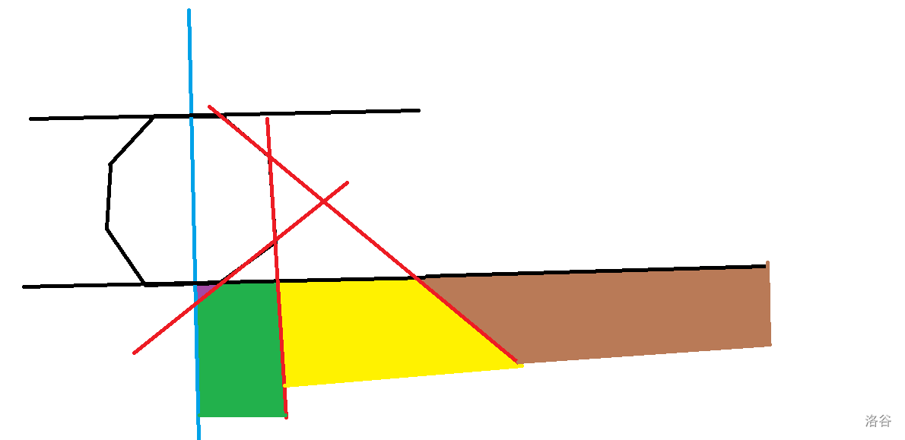

# 染色 题解
[传送门](https://junior.local.cwoi.com.cn:8443/contest/C108/problem/D)

## 题解
**感谢hfy提供的大体思路**

 观察到数据范围是 $10^5$ ,也就是说需要至多 $O(n \log n+q \log n)$ 的算法，我们考虑二分。
 
 题目给的染色条件有点难判断，__(为方便叙述,我们定义一条边所在直线多边形一侧为“里”，另一侧为“外”）__，容易发现，当且仅当一个点在至多 $\dfrac{n}{2}-1$ 条边外时，此点被染色。
 
> 即若一个点 $i$ 在 $k_i$ 边外， $\forall k_i \le \dfrac{n}{2}-1,i$被染色

容易发现，若定义任意一对对边为基准边，则对于点 $i$ 同时在两边内，必被染色；同时在两边外，必不被染色；若位于一边以内另一边以外，才需要运用以上性质。

由于我们需要二分（伏笔回收），我们考虑寻找单调性。发现若将平面按基准边的中线（其实不必要是中线），两侧的 $k_{i_1}$ 和 $k_{i_2}$ 分别关于边的编号单调。（淦我在写什么但反正都是我自己看）（但是想想不放个图解估计明天就看不懂了，而且万一有别人要看呢）



（仅考虑右半部分）一个点在上图中棕色部分时，在且仅在上基准边内。在黄色部分会多一条边，绿色部分会再多一条边，紫色部分（好小）又会多一条边。这就具有了二分的资本。

综上，我们梳理下做法。

>1. 读入时确定一组基准边，并将每一条边用一次函数按远离其中一条基准边的顺序存入。
>1. 对于每个询问，先确定是否同时在两条基准边内/外，若是，直接输出答案。
>1. 若不是，分别对两侧的边进行二分，算出 $k_i$ ,得出答案。

## Code

/// details | code
    open: False
    type: success
```cpp
#include<bits/stdc++.h>
#define int long long
using namespace std;
const int N=1e5+5;
int n,x[N],y[N];
int q,a,b;
double sx,sy;
struct Node{
	bool s,fl;//s true->竖向边; fl true->左侧/下方
	double k,b;// s true->b代表横坐标
};
Node lt[N],rt[N],upl,dwl;
int k1,k2=1;
Node ist(int a1,int b1){
	Node l;
	if(x[a1]==x[b1]){
		l.s=true;
		l.b=y[a1];
		if(sx<x[a1]){
			l.fl=true;
		}else{
			l.fl=false;
		}
	}else{
		l.s=false;
		l.k=double(y[b1]-y[a1])/(x[b1]-x[a1]);//一次函数
		l.b=y[a1]-x[a1]*l.k;
		if(sy<=sx*l.k+l.b){
			l.fl=true;
		}else{
			l.fl=false;
		}
	}
	return l;
}
bool pd(Node l,int a1,int b1){
	if(l.fl){
		if(l.s){
			return a1<=l.b;
		}else{
			return b1<=a1*l.k+l.b;
		}		
	}else{
		if(l.s){
			return a1>=l.b;
		}else{
			return b1>=a1*l.k+l.b;
		}		
	}
}
bool chk(int x1,int y1){
	if(pd(upl,x1,y1)&&pd(dwl,x1,y1)) return true;
	if(!pd(upl,x1,y1)&&!pd(dwl,x1,y1)) return false;
	int ll=1,rr=(n>>1)-1,mm,res=1;
	if(pd(upl,x1,y1)){ //二分
		while(ll<=rr){
			mm=(ll+rr)>>1;
			if(pd(lt[mm],x1,y1)) ll=mm+1;
			else rr=mm-1;
		}
		res+=rr;
		ll=1;rr=(n>>1)-1;
		while(ll<=rr){
			mm=(ll+rr)>>1;
			if(pd(rt[mm],x1,y1)) ll=mm+1;
			else rr=mm-1;
		}
		res+=rr;
		if(res>(n>>1)) return true;
		return false;		
	}else{
		while(ll<=rr){
			mm=(ll+rr)>>1;
			if(!pd(lt[mm],x1,y1)) ll=mm+1;
			else rr=mm-1;
		}
		res+=(n>>1)-ll;
		ll=1;rr=(n>>1)-1;
		while(ll<=rr){
			mm=(ll+rr)>>1;
			if(!pd(rt[mm],x1,y1)) ll=mm+1;
			else rr=mm-1;
		}
		res+=(n>>1)-ll;
		if(res>(n>>1)) return true;
		return false;	
	}
}
signed main(){
	scanf("%lld",&n);
	for(int i=1;i<=n;i++){
		scanf("%lld%lld",&x[i],&y[i]);
	}
	sx=(x[1]+x[(n>>1)+1])/2.0;sy=(y[1]+y[(n>>1)+1])/2.0;
	upl=ist(1,2);dwl=ist((n>>1)+1,(n>>1)+2);
	for(int i=2;i<=(n>>1);i++){
		lt[++k1]=ist(i,i+1);
	}
	rt[1]=ist(n,1);
	for(int i=n-1;i>=(n>>1)+2;i--){
		rt[++k2]=ist(i,i+1);
	}
	scanf("%lld",&q);
	int cnt=0;
	while(q--){
		scanf("%lld%lld",&a,&b);
		a^=(cnt*cnt*cnt);b^=(cnt*cnt*cnt);
		if(chk(a,b)){
			puts("Yes");
			cnt++;
		}else{
			puts("No");
		}
	}
}
```
///