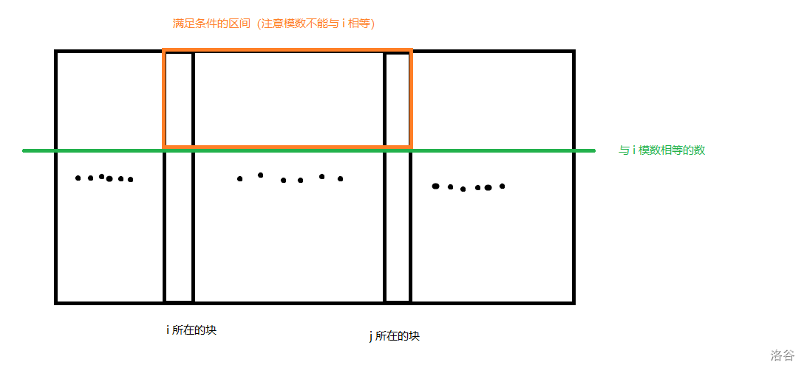
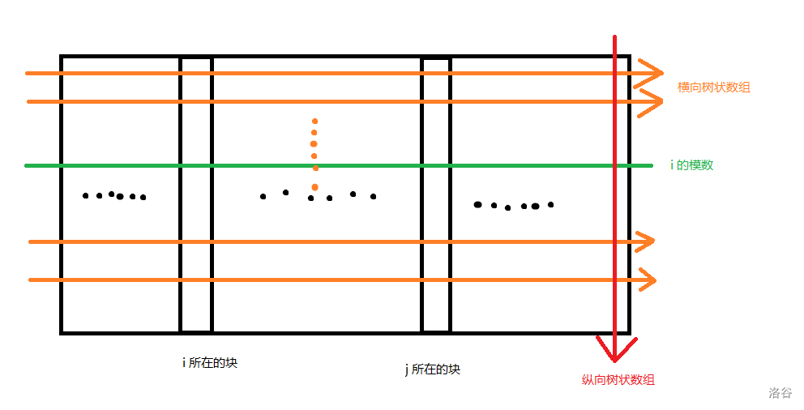
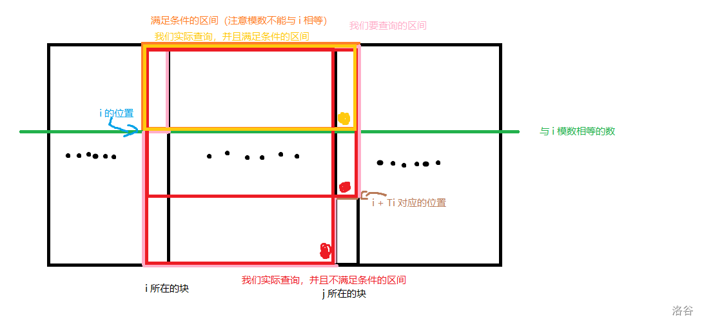

# 0426 C组模拟赛 题解

[传送门](https://local.cwoi.com.cn:8443/contest/C0229/problem/A)

## T1 题解

部分分暴力 $DFS$，后面两个特殊点可以用最大的一半和最小的一半匹配，不展开讲。

首先题意等价为选 $\dfrac{n}{2}$ 个 $i$ 的 $r$ 加起来，减去其他数的 $l$，求最大值。考虑贪心。

首先全选 $r$，把第 $i$ 个换成选 $l$ 就会使总和减小 $-l_i-r_i$，换句话说，把第 $i$ 个选成 $l$ 的代价是 $l_i+r_i$。

贪心选最小的 $\dfrac{n}{2}$ 个代价即可。

### code


/// details | code
    open: False
    type: success
```cpp
#include<bits/stdc++.h>
#define mem(a,b) memset(a,b,sizeof(a))
#define forup(i,s,e) for(register int i=(s);i<=(e);i++)
#define fordown(i,s,e) for(register int i=(s);i>=(e);i--)
using namespace std;
#define gc getchar()
inline int read(){
    int x=0,f=1;char c;
    while(!isdigit(c=gc)) if(c=='-') f=-1;
    while(isdigit(c)){x=(x<<3)+(x<<1)+(c^48);c=gc;}
    return x*f;
}
#undef gc
const int N=1e6+5,inf=0x3f3f3f3f;
int n,l[N],r[N];
long long lrlr[N],ans;
signed main(){
	n=read();
	forup(i,1,n){
		l[i]=read();r[i]=read();
		ans+=r[i];
		lrlr[i]=l[i]+r[i];
	}
	sort(lrlr+1,lrlr+n+1);
	forup(i,1,n/2){
		ans-=lrlr[i];	
	}
	printf("%lld",ans);
}
```
///

## T2 题解

这道题我没钻研过就不讲部分分了。

树上背包合并。

考虑枚举种族 $i$ 可能会造反，一个连通块中每有一个种族 $i$ 就产生 $1$ 贡献，反之产生 $-1$ 贡献，转化为求贡献大于 $0$ 的连通块个数。

考虑 $dp_{i,j}$ 表示 $i$ 的子树中包括 $i$ 的连通块有多少个值为 $j$（注意处理负数下标），依次将当前节点与每个子节点合并。

关于如何合并，枚举当前连通块 $u$ 的值 $j$ 与子节点 $v$ 的值 $k$，使得 $dp_{u,j+k}$ 增加 $dp_{u,j}\cdot dp_{v,k}$，需要注意开一个临时数组存不然可能出现错误。

每次枚举只需要枚举有意义的部分，其他负无穷的值略过，即对于每个节点存一个上界和下界来转移，并且只需要保留 $-cnt$ 至 $cnt$ 的部分（$cnt$ 为整棵树中当前颜色的数量），就能卡过去了。

关于复杂度，树上背包复杂度是 $O(nk)$ 的，这里 $k$ 即为 $cnt$，而 $\sum cnt=n$，故复杂度为 $O(n^2)$，由于转移时是 $O(n)$ 带小常数，所以总的复杂度是 $O(n^3)$ 带小常数。

### code

/// details | code
    open: False
    type: success
```cpp
#include<bits/stdc++.h>
#define ll long long
#define mem(a,b) memset(a,b,sizeof(a))
#define forup(i,s,e) for(register ll i=(s);i<=(e);i++)
#define fordown(i,s,e) for(register ll i=(s);i>=(e);i--)
using namespace std;
#define gc getchar()
inline ll read(){
    ll x=0,f=1;char c;
    while(!isdigit(c=gc)) if(c=='-') f=-1;
    while(isdigit(c)){x=(x<<3)+(x<<1)+(c^48);c=gc;}
    return x*f;
}
#undef gc
const ll N=3005,inf=0x3f3f3f3f,add=3005,mod=998244353;
ll n,c[N],cnt[N],ans;
vector<ll> e[N];
ll dp[N][N<<1],sv[N<<1],mn[N],mx[N];
ll nwco;
void dfs(ll x,ll fa){
	forup(i,-cnt[nwco],cnt[nwco]){
		dp[x][i+add]=0;
	}
	if(c[x]==nwco){
		dp[x][1+add]=1;
		mx[x]=mn[x]=1;//存储上下界
	}else{
		dp[x][-1+add]=1;
		mx[x]=mn[x]=-1;
	}
	for(auto i:e[x]){
		if(i==fa) continue;
		dfs(i,x);
		forup(j,mn[x],mx[x]){
			sv[j+add]=dp[x][j+add];
		}
		forup(j,mn[x],mx[x]){
			forup(k,mn[i],mx[i]){
				if(dp[x][j+add]==0||dp[i][k+add]==0||j+k>cnt[nwco]||j+k<-cnt[nwco]) continue;
				sv[j+k+add]=(sv[j+k+add]+dp[x][j+add]*dp[i][k+add]%mod)%mod;
				mn[x]=min(mn[x],j+k);
				mx[x]=max(mx[x],j+k);
			}
		}
		forup(j,mn[x],mx[x]){
			dp[x][j+add]=sv[j+add];sv[j+add]=0;
		}
	}
	forup(i,1,mx[x]){
		ans=(ans+dp[x][i+add])%mod;
	}
} 
signed main(){
	n=read();
	forup(i,1,n){
		c[i]=read();
		cnt[c[i]]++;
	}
	forup(i,1,n-1){
		ll u=read(),v=read();
		e[u].push_back(v);e[v].push_back(u);
	}
	forup(i,1,n){
		if(!cnt[i]) continue;
		nwco=i;
		dfs(1,0);
	}
	printf("%lld",ans);
}
```
///

## T3 题解
#### 子任务 #1 20pts 
设 $dp_i$ 表示从 $i$ 到 $n$ 的最大心情值，有一个显然的 dp 式子。

$$dp_i=\max\limits_{j=i+1}^{i+T_i}\{dp_j+H_i-\left\lfloor \frac{j-i}{K} \right\rfloor\cdot D\}$$

边界条件是 $dp_n=H_n$，特判即可，可以 $O(n)$ 转移，复杂度 $O(n^2)$。

#### 子任务 #3 子任务 #4

子任务 #3 中，$K=1$，此时下取整不会影响，#4 中，$K=n$，此时疲劳度始终为 $0$，这两个点可以直接用线段树维护，复杂度 $O(n\log n)$。

#### 90pts
~~其实棺方题解说这个方法可以 AC，但是我不太信 $O(n\log^2n)$ 可以过 $10^6$。~~

我们发现下取整非常麻烦，因为难以把 $i$ 和 $j$ 分别拆出来，但思考一下发现其实可以拆出来。

先不看后面的系数 $D$，那个式子可以这样转化：

令 $I=i \bmod K,J=j\bmod K$

$$\left\lfloor \frac{j-i}{K} \right\rfloor=\left\lfloor \frac{\left\lfloor\frac{j}{K}\right\rfloor\cdot K+J -(\left\lfloor\frac{j}{K}\right\rfloor\cdot K +I)}{K}\right\rfloor=\left\lfloor\left\lfloor\frac{j}{K}\right\rfloor-\left\lfloor\frac{i}{K}\right\rfloor+\frac{J-I}{K}\right\rfloor$$

由于前面两项都是整数所以可以直接提出来，则上式可化为：

$$\left\lfloor\frac{j}{K}\right\rfloor-\left\lfloor\frac{i}{K}\right\rfloor+\left\lfloor\frac{J-I}{K}\right\rfloor$$

由于 $J < K,I<K$，所以 $\left\lfloor\frac{J-I}{K}\right\rfloor$ 必定等于 $0$ 或 $-1$，当且仅当 $J <I,\left\lfloor\frac{J-I}{K}\right\rfloor=-1$。

故 20pts 的 dp 式子可化为：

$$dp_i=\max\limits_{j=i+1}^{i+T_i}\{dp_j+H_i-\left\lfloor\frac{j}{K}\right\rfloor\cdot D+\left\lfloor\frac{i}{K}\right\rfloor\cdot D+[j \bmod K < i\bmod K]\cdot D\}$$

其中中括号表示满足该条件时该表达式的值为 $1$（注意 $-1$ 与前面的减号负负得正就变成加号了）。

然后我们把带 $i$ 的式子拆出来：

$$dp_i=\max\limits_{j=i+1}^{i+T_i}\{dp_j-\left\lfloor\frac{j}{K}\right\rfloor\cdot D+[j \bmod K < i\bmod K]\cdot D\}+H_i+\left\lfloor\frac{i}{K}\right\rfloor\cdot D$$

令 $f_j=dp_j-\left\lfloor\frac{j}{K}\right\rfloor\cdot D$：

$$dp_i=\max\limits_{j=i+1}^{i+T_i}\{f_j+[j \bmod K < i\bmod K]\cdot D\}+H_i+\left\lfloor\frac{i}{K}\right\rfloor\cdot D$$

接下来我们只需要考虑那个让人头疼的中括号了。

注意到，假如我们把所有 $\left\lfloor\frac{j}{K}\right\rfloor$ 相等的 $j$ 分为一块，满足那个式子的一定在一个连续的区间内，且一定是这一块的前缀。

画个图理解一下，我们把所有 $\left\lfloor\frac{j}{K}\right\rfloor$ 相等的 $j$ 放在同一列，模数相同的放在同一行。



这启发我们用一个二维树状数组维护（或者笼统地说，树状数组套树状数组）。

对于每个模数（即上图中每一行），维护一个求前缀最大值树状数组，然后把这些树状数组压到一棵纵向的树状数组里，用来求二维区间最大值。



这样我们就能在 $O(\log^2n)$ 的时间内查询某个矩形内的最大值。

接下来我们考虑要查询哪些区间，带哪个式子。

分两种情况讨论：


这种情况下，$i+T_i$ 的模数大于 $i$ 的模数，我们需要查询以下几个区间。



上图几个彩色圆点即我们查询的点，前面多查的部分都赋为 $-\infty$ 所以不用管。

有人可能有问题：为什么红色部分和黄色部分带两个不同的式子，但红色部分包含了黄色部分。

欸这你就问对人了，我昨晚做梦都在想这个问题。

思考一个问题，黄色部分带的式子等于红色部分加 $1$，也就是说假如红色部分的最大值在黄色部分里，那么它并不会对答案产生贡献，可以忽略。

另一种情况：


同理，不解释了。


复杂度 $O(n \log \frac{n}{K}\cdot\log K)$ 题解说能过 $2 \times 10^6$，但我不信。

#### 100 pts

注意到每一列只有求前缀操作，且处理完当前列后就不会修改，想到纵向维度上并不需要树状数组，我们对当前列单独开一个树状数组，每次清空，处理完当列后顺着跑一边前缀最大值上传到对应的横向树状数组中。

复杂度 $O(n \log \frac{n}{K})$。

需要注意，100pts 做法和 90pts 做法都需要用 `vector` 动态开空间来防止 MLE。
### code


/// details | code
    open: False
    type: success
```cpp
#include<bits/stdc++.h>
#define mem(a,b) memset(a,b,sizeof(a))
#define forup(i,s,e) for(register ll i=(s);i<=(e);i++)
#define fordown(i,s,e) for(register ll i=(s);i>=(e);i--)
using namespace std;
typedef long long ll;
#define T (1<<15)
char buf[T],*p1=buf,*p2=buf;
#define nc() (p1==p2&&(p2=buf+fread(p1=buf,1,T,stdin),p1==p2)?-1:*p1++)
ll read(){//题目给的快读，赞美好题！
	ll x=0;char c;bool s=0;
	do c=nc();while(c!=45&&(c<48||c>57));
	if(c==45)c=nc(),s=1;
	do x=10*x+(c&15),c=nc();while(c>=48&&c<=57);
	return s?-x:x;
}
#undef T
const ll N=2e6+5,inf=1e18;
ll n,K,D,h[N],t[N],dp[N],blg[N],L[N],R[N];
void mymax(ll& a,ll b){
	if(a<b) a=b;
}
struct Tree1{
	vector<ll> c;
	ll sz;
	void resz(ll x){c.resize(x+1);sz=x;forup(i,1,sz)c[i]=-inf;}
	void Upd(ll x,ll k){
		for(;x<=sz;x+=x&-x){
			if(c[x]>k)break;
			c[x]=k;
		}
	}
	ll Ask(ll x){ll res=-inf;for(;x>0;x-=x&-x)res=max(res,c[x]);return res;}
}nt;
vector<Tree1> mt;
signed main(){
	n=read();K=read();D=read();
	mt.resize(K+1);
	forup(i,0,K){
		mt[i].resz((n+K-1)/K+1);
	}
	forup(i,1,n){
		h[i]=read();
	}
	forup(i,1,n-1){
		t[i]=read();
	}
	ll cnt;//块数
	for(int i=1;R[i-1]!=n;++i){
		cnt=i;
		L[i]=max((i-1)*K,1ll);R[i]=min(i*K-1,n);
		forup(j,L[i],R[i]){blg[j]=i;}
	}
	fordown(bl,cnt,1){
		nt.resz(K+1);//清空当前树状数组
		fordown(i,R[bl],L[bl]){
			ll pipi=i%K;//在哪一行
			if(i==n){//n 要特判
				dp[i]=h[i];
				nt.Upd(pipi+1,dp[i]-i/K*D);
				continue;
			}
			ll rted=min(t[i]+pipi+1,K);//在当前块最右能取到哪里
			ll res=-inf;
			mymax(res,nt.Ask(rted)+i/K*D);
			if(t[i]+pipi+1<=K){//如果 i+T 就在当前行可以直接跳过
				dp[i]=res+h[i];
				nt.Upd(pipi+1,dp[i]-i/K*D);
				continue;
			}
			ll post=blg[i+t[i]],ppt=(pipi+t[i])%K;//Ti+i 的行数和列数
			if(ppt>=pipi-1){
				if(pipi!=0) mymax(res,mt[pipi-1].Ask(post)+i/K*D+D);
                //注意不取等，所以要减一
				mymax(res,mt[K-1].Ask(post-1)+i/K*D);
				mymax(res,mt[ppt].Ask(post)+i/K*D);
			}else{
				mymax(res,mt[pipi-1].Ask(post-1)+i/K*D+D);
				mymax(res,mt[K-1].Ask(post-1)+i/K*D);
				mymax(res,mt[ppt].Ask(post)+i/K*D+D);
			}
			dp[i]=res+h[i];//统计答案
			nt.Upd(pipi+1,dp[i]-i/K*D);//上传到当前树状数组
		}
		ll mx=-inf;//前缀最大值
		forup(i,L[bl],max(R[bl],L[bl]+K-1)){
        //处理完后順向上传前缀最大值
			if(i<=R[bl]) mymax(mx,dp[i]-i/K*D);
			mt[i%K].Upd(bl,mx);
		}
	}
	ll ans=0;
	forup(i,1,n){
//		printf("%lld ",dp[i]);
		ans^=(dp[i]+i);
	}
	printf("%lld",ans);
}
```
///