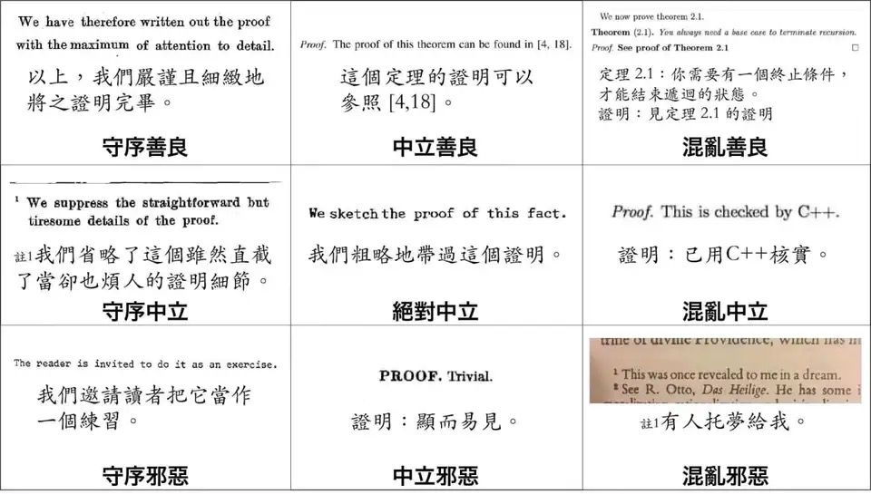

# 数数题 题解

TMD 这道题太恶心了我一定要写篇题解，另外这道题**官方题解有错**。

[传送门](https://local.cwoi.com.cn:8443/contest/C0244/problem/D)

update 2023/6/29 

修改了一些笔误。


感谢 kk 的建议。

## 分析

我们在处理树上链长度时，通常会转化为树上前缀和，所以这道题的询问就可以转化为 $dpt_u+dpt_v- 2dpt_{\mathrm{lca}(u,v)}$ 的期望，其中 $dpt_i$ 表示点 $i$ 与根节点（点 $1$）的距离，这样就可以把问题分为几个部分解决了。

## 如何求结点 $x$ 的期望深度

假如我们想知道点 $x$ 的深度，那我们肯定要知道它和点 $1$ 之间路径上所有边的边权，由于这道题边权只和结点有关，所以我们只要知道点 $x$ 到点 $1$ 之间具体有哪些点即可。设这些点（包括 $1$ 和 $x$）组成的集合为 $S'$，易得出现情况 $S'$ 的概率为：

$$\prod\limits_{i=1}^{\left|S'\right|-1}\dfrac{a_{S_{i+1}'}}{\sum_{j=1}^{S_i'-1}a_j}$$

其中 $S_i'$ 表示集合 $S'$ 中第 $i$ 大数。这个式子很好理解，因为所有点是从大到小顺次连接的，所以我们计算出每个点连向前一个点的概率求积即可。

容易发现上式的分母是一段前缀和，令 $b_i=\sum\limits_{j=1}^ia_i$，上式可转化为：

$$\prod\limits_{i=1}^{\left|S'\right|-1}\dfrac{a_{S_{i+1}'}}{b_{S_i'-1}}$$

我们发现除了 $S_1'$ 和 $S_{\left|S'\right|}'$ 以外 $S$ 中所有元素都以 $a_i$ 和 $\frac{1}{b_{i-1}}$ 的两种形式分别出现过一次，而 $S_1'=x,S_{\left|S'\right|}'=1$，故我们可以把这两项提出来，把其余的数放在一个集合 $S$ 里（这就是为什么我最开始要用 $S'$），然后分子分母重新配对，可以把上式转化成这样：

$$\dfrac{a_1}{b_{x-1}}\prod\limits_{i\in S}\dfrac{a_{i}}{b_{i-1}}$$

这就非常优雅了。然后我们考虑用概率乘以权值（即路径长度）算期望，路径长度用类似的方法可以化成这样的形式：

$$c_1+c_x+\sum\limits_{i\in S}2c_i$$

然后相乘：

$$\dfrac{a_1}{b_{x-1}}\prod\limits_{i\in S}\dfrac{a_{i}}{b_{i-1}}\times \left(c_1+c_x+\sum\limits_{i\in S}2c_i\right)$$

然后我们在外层枚举集合 $S$，容易发现 $S\subseteq(1,x)$，我们枚举所有满足这个条件的 $S$ 就能得到 $x$ 深度的期望为：

$$\sum\limits_{S \subseteq (1,x)}\left[\dfrac{a_1}{b_{x-1}}\prod\limits_{i\in S}\dfrac{a_{i}}{b_{i-1}}\times \left(c_1+c_x+\sum\limits_{i\in S}2c_i\right)\right]$$

容易发现 $c_1+c_x$ 在每个 $S$ 中都出现了，它们产生贡献的概率为 $1$，对期望的贡献就是它们自己，直接提出来，$\frac{a_1}{b_x}$ 和 $2$ 也在每个 $S$ 中都出现了，用乘法分配律提出来：

$$c_1+c_x+2\cdot\dfrac{a_1}{b_{x-1}}\sum\limits_{S \subseteq (1,x)}\left(\prod\limits_{i\in S}\dfrac{a_{i}}{b_{i-1}}\times \sum\limits_{i\in S}c_i\right)$$

看到 $\prod$ 和 $\sum$ 相乘的形式，考虑把 $\prod$ 乘到 $\sum$ 里面去：

$$c_1+c_x+2\cdot\dfrac{a_1}{b_{x-1}}\sum\limits_{S \subseteq (1,x)}\left[\sum\limits_{i\in S}\left(c_i \times \prod\limits_{j\in S}\dfrac{a_{j}}{b_{j-1}}\right)\right]$$

接下来这一步也是个套路，我们把它放到一个更一般的情况里（以下变量名与本题无关）。

- 我是分割线（markdown 的分割线在透明背景下几乎看不到，将就一下）

假如我们要算下面这个式子：

$$\sum\limits_{s\subseteq S}\prod\limits_{i\in s}w_i$$

那么我们可以发现，一个在 $S$ 中的 $i$ 要么在 $s$ 中，要么不在 $s$ 中，假如它在 $s$ 中它就会使结果乘以 $w_i$，假如它不在就会使结果乘以 $1$，所以假如我们把上式展开它大概就长这样（假设 $S$ 中的元素是 $1,2\dots n$）：

$$(w_1w_2\dots w_n)+(1w_2w_3\dots w_n)+(w_11w_3\dots w_n)+(1\times1w_3\dots w_n)\dots$$

我们对它因式分解，具体方法可以和分解这个式子 $ac+bc+ad+bd$ 一样，提两次公因式，只不过上式要提 $n$ 次公因式：

$$(w_1+1)(w_2+1)(w_3+1)\dots(w_n+1)$$

写成 $\prod$ 的形式长这样：

$$\prod\limits_{i\in S}(w_i+1)$$

- 我是分割线

回到本题，利用类似的方法我们可以把上式转化成这样：

$$c_1+c_x+2\cdot\dfrac{a_1}{b_{x-1}}\sum\limits_{i=2}^{x-1}\left(\dfrac{c_ia_i}{b_{i-1}} \times \prod\limits_{j=2,j\ne i}^{x-1}\dfrac{a_{j}+b_{j-1}}{b_{j-1}}\right)$$

由于含有 $i$ 的集合中 $\frac{a_i}{b_{i-1}}$ 必须选，所以要拿出来单独考虑。但是这样很不优雅，我们可以先乘在里面再除出来：

$$c_1+c_x+2\cdot\dfrac{a_1}{b_{x-1}}\sum\limits_{i=2}^{x-1}\left(\dfrac{c_ia_i}{b_{i-1}} \times \dfrac{b_{i-1}}{a_i+b_{i-1}}\prod\limits_{j=2}^{x-1}\dfrac{a_{j}+b_{j-1}}{b_{j-1}}\right)$$

注意到 $b$ 是 $a$ 的前缀和，所以 $a_j+b_{j-1}=b_j$，有：

$$c_1+c_x+2\cdot\dfrac{a_1}{b_{x-1}}\sum\limits_{i=2}^{x-1}\left(\dfrac{c_ia_i}{b_{i-1}} \times \dfrac{b_{i-1}}{b_{i}}\prod\limits_{j=2}^{x-1}\dfrac{b_{j}}{b_{j-1}}\right)$$

发现内层的 $\prod$ 也可以把分子分母的 $b_j$ 配对，然后进行一些简单的约分：

$$c_1+c_x+2\cdot\dfrac{a_1}{b_{x-1}}\sum\limits_{i=2}^{x-1}\left(\dfrac{c_ia_i}{b_{i}}\times\dfrac{b_{x-1}}{b_1}\right)$$

可以把里面的 $\frac{b_{x-1}}{b_1}$ 提出来，又发现 $b_1=a_1$，可得：

$$c_1+c_x+2\sum\limits_{i=2}^{x-1}\dfrac{c_ia_i}{b_{i}}$$

这样一个巨简短的式子，只要预处理 $\dfrac{c_ia_i}{b_{i}}$ 从 $2$ 开始的前缀和就可以 $O(1)$ 求。

以防有人不想看过程我把结论放在这里：

$$\boxed{E(dpt_x)=c_1+c_x+2\sum\limits_{i=2}^{x-1}\dfrac{c_ia_i}{b_{i}}}$$

## 如何处理 $\mathrm{lca}$ 的期望

还记得我们的目标式子吗？

$$dpt_u+dpt_v- 2dpt_{\mathrm{lca}(u,v)}$$

它的期望可以表达成这样：

$$E(dpt_u)+E(dpt_v)-2\sum\limits_{l=1}^{u}E(dpt_{l})P(l)$$

这个式子的前提是 $u<v$（假如 $u>v$ 交换即可，$u=v$ 的话你还算什么，直接输出 $0$），其中 $P(l)$ 表示 $l=\mathrm{lca}(u,v)$ 的概率。我们可以把它分为 $l=u$ 和 $l \ne v$ 的情况分别计算。

至于为什么 $dpt_{\mathrm{lca}(u,v)}=\sum_{l=1}^{u}E(dpt_l)P(l)$ 这要考虑到树的生成方式，容易发现某个点 $i$ 的父亲是谁与 $1\sim i$ 具体如何构造无关，只与 $a_1\sim a_{i-1}$ 的值有关，把这个结论具体到问题上，容易发现 $E(dpt_l)$ 只与 $a_1\sim a_{l-1}$ 的值有关，$P(l)$ 只与 $a_l\sim a_{v}$ 的值有关，换句话说，这是两个互相独立的事件，适用期望的可乘性。

- $l \ne u$

发现 $l$ 是 $\mathrm{lca}(u,v)$ 当且仅当 $l$ 是 $u$ 的祖先且 $l$ 是 $v$ 的祖先并且路径 $ul$ 和 $vl$ 中无重复的点。那么 $l$ 是 $\mathrm{lca}(u,v)$ 的概率就是这三个事件的概率相乘，我们考虑类似于刚才的方法，枚举 $ul$ 和 $vl$ 路径上点的集合满足顺次为下一个的父亲的概率求解，同样不包括端点。

$ul$ 的路径（跳了一点步骤，应该能看懂，和前文的转化差不多）：

$$\dfrac{a_l}{b_{u-1}}\sum\limits_{A\subseteq (l,u)}\prod\limits_{i\in A}\dfrac{a_i}{b_{i-1}}$$

$vl$ 的路径（同上）：

$$\dfrac{a_l}{b_{v-1}}\sum\limits_{B\subseteq ((l,u)\setminus A)\cup(u,v)}\prod\limits_{i\in S}\dfrac{a_i}{b_{i-1}}$$

考虑把这两个式子合并起来，容易发现 $B$ 和 $A$ 有一部分的范围是相同的（都是 $(l,u)$），由于 $A$ 和 $B$ 显然是没有交的（从式子的意义和它本身都能看出来），我们考虑把这一部分并起来，和剩下的（$(u,v)$ 这一部分）分开考虑（跳了一些步骤，应该能看懂）：

$$\dfrac{a_l^2}{b_{u-1}b_{v-1}}\sum\limits_{S_1\subseteq(l,u)}2^{\left|S_1\right|}\sum\limits_{S_2\subseteq(u,v)}\prod\limits_{i\in S_1}\dfrac{a_i}{b_{i-1}}\prod\limits_{j\in S_2}\dfrac{a_j}{b_{j-1}}$$

其中 $2^{\left|S_1\right|}$ 表示 $S_1$ 中的元素具体分给 $A$ 还是分给 $B$。

为什么不同的分配方法可以套同一个式子呢？回顾一下，这个式子是用最初的式子分子分母错开重新配对得到的，而 $S_1$ 中的元素在所有情况下均以 $a_i$ 和 $\frac{1}{b_{i-1}}$ 的形式各出现过一次（自己推一推，可以画一画图），也就是说不管原式长啥样，错开后都能写成一样的形式。

然后为了方便计算，把 $2$ 分配给第一个 $\prod$：

$$\dfrac{a_l^2}{b_{u-1}b_{v-1}}\sum\limits_{S_1\subseteq(l,u)}\sum\limits_{S_2\subseteq(u,v)}\prod\limits_{i\in S_1}\dfrac{2a_i}{b_{i-1}}\prod\limits_{j\in S_2}\dfrac{a_j}{b_{j-1}}$$

然后我们把两个 $\sum$ 分别分给两个 $\prod$：

$$\dfrac{a_l^2}{b_{u-1}b_{v-1}}\sum\limits_{S_1\subseteq(l,u)}\prod\limits_{i\in S_1}\dfrac{2a_i}{b_{i-1}}\sum\limits_{S_2\subseteq(u,v)}\prod\limits_{j\in S_2}\dfrac{a_j}{b_{j-1}}$$

用之前讲过的套路化简：

$$\dfrac{a_l^2}{b_{u-1}b_{v-1}}\prod\limits_{i=l+1}^{u-1}\dfrac{2a_i+b_{i-1}}{b_{i-1}}\prod\limits_{j=u+1}^{v-1}\dfrac{a_j+b_{j-1}}{b_{j-1}}$$

把 $a_j+b_{j-1}$ 换成 $b_j$（中间那坨因为换不换耦合度一样就不管它了）：

$$\dfrac{a_l^2}{b_{u-1}b_{v-1}}\prod\limits_{i=l+1}^{u-1}\dfrac{2a_i+b_{i-1}}{b_{i-1}}\prod\limits_{j=u+1}^{v-1}\dfrac{b_{j}}{b_{j-1}}$$


对第二个 $\prod$ 约分：

$$\dfrac{a_l^2}{b_{u-1}b_{v-1}}\prod\limits_{i=l+1}^{u-1}\dfrac{2a_i+b_{i-1}}{b_{i-1}}\cdot\dfrac{b_{v-1}}{b_{u}}$$

再约：

$$\dfrac{a_l^2}{b_{u-1}b_{u}}\prod\limits_{i=l+1}^{u-1}\dfrac{2a_i+b_{i-1}}{b_{i-1}}$$

后面这部分已经可以用前缀积处理了，设 $d_i=\prod\limits_{j=2}^{i}\frac{2a_i+b_{i-1}}{b_{i-1}}$：

$$\dfrac{a_l^2}{b_{u-1}b_{u}}\cdot \dfrac{d_{u-1}}{d_l}$$

发现这是一个只与 $u$ 和 $l$ 有关的式子，我们把它原式里与 $l$ 有关的部分拿过来（注意这是 $l \ne u$ 的情况）：

$$\sum\limits_{l=1}^{u-1}\dfrac{a_l^2}{b_{u-1}b_{u}}\cdot \dfrac{d_{u-1}}{d_l}\cdot E(dpt_l)$$

把 $u$ 和 $l$ 分开：

$$\dfrac{d_{u-1}}{b_{u-1}b_u}\sum\limits_{l=1}^{u-1}\dfrac{a_l^2}{d_l}\cdot E(dpt_l)$$

后面这个 $\sum$ 的限制里面的 $u$ 提不出来，但这个部分可以用前缀和维护，所以我们就优雅地处理完了这个子问题。

同样的，我把答案放在这里：

$$\boxed{\sum\limits_{l=1}^{u}E(dpt_{l})P(l)=\dfrac{d_{u-1}}{b_{u-1}b_u}\sum\limits_{l=1}^{u-1}\dfrac{a_l^2}{d_l}\cdot E(dpt_l)}$$

- $l=u$



和上个情况几乎一样，甚至更简单，自己推一下。

直接放答案（一定要自己推一下！！！！！！！！！！）：

$$\boxed{P(u)=\dfrac{a_u}{b_u}}$$

## 总结

答案长这样：

$$\boxed{c_1+c_u+2\sum\limits_{i=2}^{u-1}\dfrac{c_ia_i}{b_{i}}+c_1+c_v+2\sum\limits_{i=2}^{v-1}\dfrac{c_ia_i}{b_{i}}-2\dfrac{d_{u-1}}{b_{u-1}b_u}\sum\limits_{l=1}^{u-1}\dfrac{a_l^2}{d_l}\cdot \left(c_1+c_l+2\sum\limits_{i=2}^{l-1}\dfrac{c_ia_i}{b_{i}}\right)-2\dfrac{a_u}{b_u}\cdot\left(c_1+c_u+2\sum\limits_{i=2}^{u-1}\dfrac{c_ia_i}{b_{i}}\right)}$$

~~很答辩对吧~~，但假如我把 $E(dpt_i)$ 封装成函数 $dpt(i)$，用 $f$ 表示 $\frac{a_l^2}{d_l}\cdot E(dpt_l)$ 的前缀和，那么这个式子就可以优雅地写成这样：

$$\boxed{dpt(u)+dpt(v)-2\dfrac{d_{u-1}}{b_{u-1}b_u}\cdot f_{u-1}-2\dfrac{a_u}{a_v}\cdot dpt(u)}$$

容易发现这个式子只和 $u,v$ 有关，算上逆元可以 $O(\log mod)$ 求，其中 $mod$ 为模数。

预处理各种前缀和是 $O(n\log mod)$ 的，貌似每次 $\frac{1}{b}$ 都用快速幂过不了，可以先预处理存起来，这样询问就变成 $O(1)$ 的了。

另外有一个 $O(n+\log mod)$ 求一个序列所有数分别的逆元的[小 trick](https://www.cnblogs.com/Illyasviel/p/15054416.html)，但是这道题如果你不卷最优解没必要写，我就没写。

注意取模。另外官方题解错在完全没提 $l=u$ 的情况。

## code

/// details | code
    open: False
    type: success
```cpp
#include<bits/stdc++.h>
#define mem(a,b) memset(a,b,sizeof(a))
#define forup(i,s,e) for(i64 i=(s);i<=(e);i++)
#define fordown(i,s,e) for(i64 i=(s);i>=(e);i--)
using namespace std;
using i64=long long;
#define gc getchar()
inline i64 read(){
    i64 x=0,f=1;char c;
    while(!isdigit(c=gc)) if(c=='-') f=-1;
    while(isdigit(c)){x=(x<<3)+(x<<1)+(c^48);c=gc;}
    return x*f;
}
#undef gc
const i64 N=1e6+5,inf=0x3f3f3f3f,mod=1e9+7;
i64 n,q,a[N],b[N],c[N],sum1[N],mult[N],sum2[N],invb[N];
i64 ksm(i64 a,i64 b){
	i64 c=1;
	while(b){
		if(b&1) c=a*c%mod;
		a=a*a%mod;
		b>>=1;
	}
	return c;
}
i64 inv(i64 a){return ksm(a,mod-2);}
i64 dpt(i64 x){return x!=1?(c[1]+c[x]+2*sum1[x-1]%mod)%mod:0;}
signed main(){
	n=read();q=read();
	forup(i,1,n-1){
		a[i]=read();
		b[i]=b[i-1]+a[i];
		invb[i]=inv(b[i]);
	}
	forup(i,1,n){
		c[i]=read();
	}
	forup(i,2,n){
		sum1[i]=(sum1[i-1]+c[i]*a[i]%mod*invb[i]%mod)%mod;
	}
	mult[1]=1;
	forup(i,2,n){
		mult[i]=mult[i-1]*(a[i]*2%mod+b[i-1])%mod*invb[i-1]%mod;
	}
	forup(i,1,n){
		sum2[i]=(sum2[i-1]+dpt(i)*a[i]%mod*a[i]%mod*inv(mult[i])%mod)%mod;
	}
	forup(i,1,q){
		i64 x=read(),y=read();
		if(x==y){
			puts("0");
			continue;
		}
		if(x>y) swap(x,y);
		printf("%lld\n",(dpt(x)+dpt(y)+mod-2*mult[x-1]%mod*invb[x-1]%mod*invb[x]%mod*sum2[x-1]%mod+mod-2*dpt(x)%mod*a[x]%mod*invb[x]%mod)%mod);
	}
}
```
///