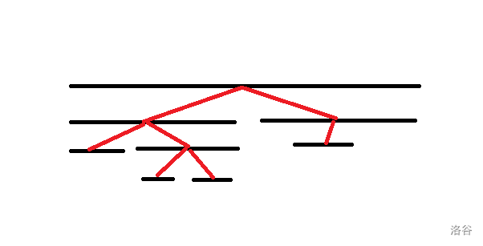

# 0626 B组模拟赛 题解

[内含：串，艺术家，黑白树，敢览求](https://local.cwoi.com.cn:8443/contest/C0272)

## 闲扯

怎么会有学校隔一天考一次啊。

这次 T2T3 考场上都想到做法了，但是两道题都没想通实现细节，直接报灵，感觉我是砂玻纸张。

这次数据结构大佬说 T2 是砂玻题，思维题大佬说 T3 是砂玻题，我说我是砂玻。

## T1

这道题好多人都是打表找的规律，让我这个用数学方法推的格格不入。

先特判 $k=0$ 的情况，然后考虑假设 $k> 1$ 个 $1$ 把剩下的 $0$ 分成 $k+1$ 段应该如何处理。

假设第一段连续的 $0$ 长度为 $a_1$，第二段为 $a_2$，依次类推。容易发现假如某区间的左端点在 $a_1$ 中或在 $a_1$ 右侧的 $1$ 上，右端点在 $a_2$ 或其左侧的 $1$ 上，区间内就只有一个 $1$，这样的情况有 $(a_1+1)\times (a_2+1)$ 种，同理，右端点在 $a_4,a_6,a_8 \dots$ 中都合法。容易推出结论：当且仅当某区间左右端点所在区间下标奇偶性不同，区间内有奇数个 $1$，证明显然。

那么总区间个数就可以用以下式子表示：

$$
\begin{aligned}
&\sum_{i \equiv 1\pmod 2}^{1 \le i \le k+1}(a_i+1)\times\sum_{j\equiv 0\pmod 2}^{1 \le j \le k+1} (a_j+1)\\\\
=&\left(\left\lceil\dfrac{k+1}{2}\right\rceil+\sum_{i \equiv 1 \pmod 2}^{1 \le i \le k+1}a_i\right)\times\left(\left\lfloor\dfrac{k+1}{2}\right\rfloor+\sum_{j \equiv 0 \pmod 2}^{1 \le j \le k+1}a_j\right)
\end{aligned}
$$

容易发现答案仅与 $\sum_{i \equiv 1 \pmod 2}^{1 \le i \le k+1}a_i$ 和 $\sum_{j \equiv 0 \pmod 2}^{1 \le j \le k+1}a_j$  有关，假如把它们分别看做两个整体 $x$ 和 $y$，那么式子就能化成这样：

$$\left(\left\lceil\dfrac{k+1}{2}\right\rceil+x\right)\left(\left\lfloor\dfrac{k+1}{2}\right\rfloor+y\right)$$

另外容易发现 $x+y=n-k$，证明显然，那么 $y=n-k-x$，带入原式：

$$\left(\left\lceil\dfrac{k+1}{2}\right\rceil+x\right)\left(\left\lfloor\dfrac{k+1}{2}\right\rfloor+n-k-x\right)$$

容易发现这是个关于 $x$ 的二次函数且开口向下，化成一般式找到对称轴求最大值，过程略。总之当 $x=\frac{n-k}{2}$ 时 $f(x)$ 取到最大值。

另外容易发现这个式子的大小和 $x,y$ 具体分给哪个 $a_i$ 无关，故构造方案时可以直接把 $a_1\sim a_{k-1}$ 全部取为 $0$（即输出一堆 $1$），然后把 $n-k$ 分给后面两个空。

### code

/// details | code
    open: False
    type: success
```cpp
//author: six-floor-slip-liu

#include<bits/stdc++.h>
#define mem(a,b) memset(a,b,sizeof(a))
#define forup(i,s,e) for(i64 i=(s);i<=(e);i++)
#define fordown(i,s,e) for(i64 i=(s);i>=(e);i--)
using namespace std;
using i64=long long;
#define gc getchar()
inline i64 read(){
    i64 x=0,f=1;char c;
    while(!isdigit(c=gc)) if(c=='-') f=-1;
    while(isdigit(c)){x=(x<<3)+(x<<1)+(c^48);c=gc;}
    return x*f;
}
#undef gc
const i64 N=1e5+5,inf=0x3f3f3f3f;
i64 n,k;
signed main(){
	n=read();k=read();
	if(k==0){//一定要记得特判 0！！！
		puts("0");
		forup(i,1,n){
			printf("0 ");
		}
	}
	i64 l=(n-k)/2,r=n-k-l;
	if(k&1){
		printf("%lld\n",(l+(k+1)/2)*(r+(k+1)/2));
	}else{
		if(l<r) swap(l,r);
		printf("%lld\n",(l+k/2)*(r+k/2+1));
	}
	forup(i,1,k-1){
		printf("1 ");
	}
	forup(i,1,l){
		printf("0 ");
	}
	printf("1 ");
	forup(i,1,r){
		printf("0 ");
	}
}
```
///

## T2

> 注：本文中称满足“区间内颜色两两不同”的区间为**合法**。

首先考虑假如只有一个区间，或者说假设是求某个序列在哪次修改后才合法应该如何解决。

显而易见，只用对这个区间开个桶动态统计每种颜色是否只出现了一次就行了，空间复杂度和时间复杂度都是线性的。

但是这道题区间的数量是 $O(n)$ 级别的，这样空间复杂度和时间复杂度就变成了平方级别，双双超标，考虑如何优化。

首先桶是肯定不能用了，我们可以用某种数据结构代替桶，比如动态开点权值线段树或者平衡树。但我们显然不能存完每个区间中所有颜色，不然空间复杂度不降反增，我们需要一种方法来重复利用空间。

看到题面上有这么一句话：

> 保证任何两个区间都是不相交或包含的关系。

这就暗示我们这道题的做法和区间的关系有关，考虑按覆盖关系连边会连成什么样。



容易发现这是一个树形结构，而且有一个很显然的性质：

> 一个区间（以下可以认为“区间”和“结点”是同义词）合法的必要条件是它子树内所有结点均合法。

或者换句话说，**假如一个结点不合法，那么它所有祖先均不合法**。也就是说我们每次只需要考虑所有叶子结点是否合法，假如它合法了才需要考虑它的祖先。而所有叶子结点所覆盖的区间长度和是 $O(n)$ 的，这就非常棒了。

注意到题面中要求的是每个结点**第一次合法**的时间戳，也就是说假如某个结点合法了后面就不用管它了，可以直接删掉它，这样就可以直接把子结点的空间交给父结点，方便快捷。（~~我不会告诉你我赛时就是没想到这一层报灵了。~~）

“把子结点的空间交给父结点”是个合并的过程，这道题线段树合并和启发式合并都可做，实测启发式更快更短空间更小。

另外我们需要快速求出序列上每个点对应的最深的结点是哪个，我用了个数组+DSU 乱搞，不想动脑子的可以用线段树。

### code

这里提供两份代码。

/// details | 启发式合并参考代码
    open: False
    type: success
```cpp
//author: six-floor-slip-liu

#include<bits/stdc++.h>
#define mem(a,b) memset(a,b,sizeof(a))
#define forup(i,s,e) for(int i=(s);i<=(e);i++)
#define fordown(i,s,e) for(int i=(s);i>=(e);i--)
using namespace std;
#define gc getchar()
inline int read(){
    int x=0,f=1;char c;
    while(!isdigit(c=gc)) if(c=='-') f=-1;
    while(isdigit(c)){x=(x<<3)+(x<<1)+(c^48);c=gc;}
    return x*f;
}
#undef gc
const int N=5e5+5,inf=0x3f3f3f3f;
int n,m,t,c[N],res;
bitset<N> bs;
int ff[N],blg[N],cnts[N],sz[N],pres[N];
struct que{
	int l,r,pos;
	bool operator <(const que &pp)const{
		if(l!=pp.l) return l<pp.l;
		return r>pp.r;
	}
}s[N];
map<int,int> mp[N];
int rt[N];
void merge(int U,int V){
	if(mp[rt[U]].size()<mp[rt[V]].size()) swap(rt[U],rt[V]);
	for(auto i:mp[rt[V]]){
		mp[rt[U]][i.first]+=i.second;
	}
	mp[rt[V]].clear();
}
void buildtree(){
	int stk[N],top=1;
	stk[top++]=0;
	s[0].l=-1;s[0].r=n+1;
	int nw;
	forup(i,1,m){
		while(stk[top-1]!=0&&s[stk[top-1]].r<s[i].l){
			if(sz[stk[top-1]]==0){
				forup(j,s[stk[top-1]].l,s[stk[top-1]].r){
					blg[j]=stk[top-1];
				}
			}else{
				forup(j,s[pres[stk[top-1]]].r+1,min(s[i].l-1,s[stk[top-1]].r)){
					blg[j]=stk[top-1];
				}
			}
			nw=stk[top-1];
			top--;
			ff[nw]=stk[top-1];
			if(sz[stk[top-1]]==0){
				forup(j,s[stk[top-1]].l,s[nw].l-1){
					blg[j]=stk[top-1];
				}
			}
			sz[stk[top-1]]++;
			pres[stk[top-1]]=nw;
		}
		stk[top++]=i;
	}
	while(stk[top-1]!=0){
		if(sz[stk[top-1]]==0){
			forup(j,s[stk[top-1]].l,s[stk[top-1]].r){
				blg[j]=stk[top-1];
			}
		}else{
			forup(j,s[pres[stk[top-1]]].r+1,s[stk[top-1]].r){
				blg[j]=stk[top-1];
			}
		}
		nw=stk[top-1];
		top--;
		ff[nw]=stk[top-1];
		if(sz[stk[top-1]]==0){
			forup(j,s[stk[top-1]].l,s[nw].l-1){
				blg[j]=stk[top-1];
			}
		}
		sz[stk[top-1]]++;
		pres[stk[top-1]]=nw;
	}
}
int fa[N];
int getfa(int x){return x==fa[x]?x:fa[x]=getfa(fa[x]);}
bool chk(int x){
	if(x==0) return false;
	return (int)mp[rt[x]].size()==s[x].r-s[x].l+1;
}
void work(int x,int CASE){
	if(chk(getfa(blg[x]))){
		int l=getfa(blg[x]);
		while(chk(l)){
			res^=CASE;
			bs[l]=true;
			merge(ff[l],l);
			cnts[ff[l]]++;
			fa[l]=ff[l];
			l=getfa(l);
		}
	}
}
void add(int x,int c){
	mp[rt[x]][c]++;
}
void del(int x,int c){
	int qwer=--mp[rt[x]][c];
	if(qwer==0){
		mp[rt[x]].erase(c);
	}
}
void solve(){
	forup(i,1,n){
		add(blg[i],c[i]);
	}
	forup(i,1,n){
		work(i,0);
	}
	forup(CASE,1,t){
		int x=read(),y=read();
		del(getfa(blg[x]),c[x]);
		c[x]=y;
		add(getfa(blg[x]),c[x]);
		work(x,CASE);
	}
}
signed main(){
	n=read();m=read();t=read();
	forup(i,1,n){
		c[i]=read();
	}
	forup(i,1,m){
		s[i].l=read();s[i].r=read();s[i].pos=i;
		fa[i]=i;rt[i]=i;
	}
	sort(s+1,s+m+1);
	buildtree();
	solve();
	forup(i,1,m){
		if(!bs[i]){
			res^=m+s[i].pos;
		}
	}
	printf("%d",res);
}
```
///

/// details | 线段树合并参考代码
    open: False
    type: success
```cpp
//author: six-floor-slip-liu

#include<bits/stdc++.h>
#define mem(a,b) memset(a,b,sizeof(a))
#define forup(i,s,e) for(int i=(s);i<=(e);i++)
#define fordown(i,s,e) for(int i=(s);i>=(e);i--)
using namespace std;
#define gc getchar()
inline int read(){
    int x=0,f=1;char c;
    while(!isdigit(c=gc)) if(c=='-') f=-1;
    while(isdigit(c)){x=(x<<3)+(x<<1)+(c^48);c=gc;}
    return x*f;
}
#undef gc
const int N=5e5+5,inf=0x3f3f3f3f;
int n,m,t,c[N],ans[N],res;
int ff[N],blg[N],cnts[N],sz[N],pres[N];
struct que{
	int l,r,pos;
	bool operator <(const que &pp)const{
		if(l!=pp.l) return l<pp.l;
		return r>pp.r;
	}
}s[N];
struct SegmentTree{
	#define mid ((l+r)>>1)
	#define lson l,mid,ls[id]
	#define rson mid+1,r,rs[id]
	private:
		int querycnt[N*40],ls[N*40],rs[N*40],rt[N],cntseg;
		bitset<N*40> queryleg;//bitset 是我爹，这里不压位会 MLE
		void _New(int &k){
			k=++cntseg;
		}
		void _PushUp(int id){
			queryleg[id]=true;
			if(ls[id]^0) querycnt[id]+=querycnt[ls[id]],queryleg[id]=queryleg[id]&queryleg[ls[id]];
			if(rs[id]^0) querycnt[id]+=querycnt[rs[id]],queryleg[id]=queryleg[id]&queryleg[rs[id]];
		}
		void _Insert(int X,int P,int l,int r,int id){
			if(l==r){
				querycnt[id]+=P;
				queryleg[id]=(querycnt[id]<=1);
				return;
			}
			if(X<=mid){
				if(ls[id]==0) _New(ls[id]);
				_Insert(X,P,lson);
			}else{
				if(rs[id]==0) _New(rs[id]);
				_Insert(X,P,rson);
			}
			_PushUp(id);
		}
		int _Merge(int U,int V,int l,int r){
			if(!U) return V;
			if(!V) return U;
			if(l==r){
				querycnt[U]+=querycnt[V];
				queryleg[U]=(querycnt[U]<=1);
				return U;
			}
			ls[U]=_Merge(ls[U],ls[V],l,mid);
			rs[U]=_Merge(rs[U],rs[V],mid+1,r);
			_PushUp(U);
			return U;
		}
	public:
		void Insert(int X,int P,int U){
			if(!rt[U]) _New(rt[U]);
			_Insert(X,P,1,n,rt[U]);
		}
		void Merge(int U,int V){
			if(!rt[U]) _New(rt[U]);
			rt[U]=_Merge(rt[U],rt[V],1,n);
		}
		bool Ask(int U){
			return queryleg[rt[U]];
		}
}mt;
void buildtree(){
	int stk[N],top=1;
	stk[top++]=0;
	s[0].l=-1;s[0].r=n+1;
	int nw;
	forup(i,1,m){
		while(stk[top-1]!=0&&s[stk[top-1]].r<s[i].l){
			if(sz[stk[top-1]]==0){
				forup(j,s[stk[top-1]].l,s[stk[top-1]].r){
					blg[j]=stk[top-1];
				}
			}else{
				forup(j,s[pres[stk[top-1]]].r+1,min(s[i].l-1,s[stk[top-1]].r)){
					blg[j]=stk[top-1];
				}
			}
			nw=stk[top-1];
			top--;
			ff[nw]=stk[top-1];
			if(sz[stk[top-1]]==0){
				forup(j,s[stk[top-1]].l,s[nw].l-1){
					blg[j]=stk[top-1];
				}
			}
			sz[stk[top-1]]++;
			pres[stk[top-1]]=nw;
		}
		stk[top++]=i;
	}
	while(stk[top-1]!=0){
		if(sz[stk[top-1]]==0){
			forup(j,s[stk[top-1]].l,s[stk[top-1]].r){
				blg[j]=stk[top-1];
			}
		}else{
			forup(j,s[pres[stk[top-1]]].r+1,s[stk[top-1]].r){
				blg[j]=stk[top-1];
			}
		}
		nw=stk[top-1];
		top--;
		ff[nw]=stk[top-1];
		if(sz[stk[top-1]]==0){
			forup(j,s[stk[top-1]].l,s[nw].l-1){
				blg[j]=stk[top-1];
			}
		}
		sz[stk[top-1]]++;
		pres[stk[top-1]]=nw;
	}
}
int fa[N];
int getfa(int x){return x==fa[x]?x:fa[x]=getfa(fa[x]);}
bool chk(int x){
	if(x==0) return false;
	if(cnts[x]!=sz[x]) return false;
	return mt.Ask(x);
}
void work(int x,int CASE){
	if(chk(getfa(blg[x]))){
		int l=getfa(blg[x]);
		while(chk(l)){
			ans[l]=CASE;
			mt.Merge(ff[l],l);
			cnts[ff[l]]++;
			fa[l]=ff[l];
			l=getfa(l);
		}
	}
}
void solve(){
	forup(i,1,n){
		mt.Insert(c[i],1,blg[i]);
	}
	forup(i,1,n){
		work(i,0);
	}
	forup(CASE,1,t){
		int x=read(),y=read();
		mt.Insert(c[x],-1,getfa(blg[x]));
		c[x]=y;
		mt.Insert(c[x],1,getfa(blg[x]));
		work(x,CASE);
	}
}
signed main(){
	n=read();m=read();t=read();
	forup(i,1,n){
		c[i]=read();
	}
	mem(ans,-1);
	forup(i,1,m){
		s[i].l=read();s[i].r=read();s[i].pos=i;
		fa[i]=i;
	}
	sort(s+1,s+m+1);
	buildtree();
	solve();
	forup(i,1,m){
		if(ans[i]!=-1){
			res^=ans[i];
		}else{
			res^=m+s[i].pos;
		}
	}
	printf("%d",res);
}
```
~~代码好他妈长。~~
///

## T3

这道题 @[GM_Joanna](https://www.luogu.com.cn/user/477865) 说很简单，我觉得也不难，但是实现细节没搞懂报灵了。

首先看到最长距离容易想到树的直径的性质：

> 定理：在一棵树上，与任意节点 $y$ 距离最远的节点 $z$ 必为直径的一端。

摘自 [OI Wiki](https://oi-wiki.org/graph/tree-diameter/#%E8%BF%87%E7%A8%8B)，证明这个链接里有。

也就是说无论怎么染色距离最远的两同色点其中一个必定是直径端点。

假设我们求出了直径为 $AB$。

首先考虑无论怎么染色价值都等于直径的情况，这种情况必然存在一个结点 $C$，使得 $AB=AC=BC$，易证这是个充分必要条件，因为无论怎么涂色 $ABC$ 三点至少有两个同色。

排除这种情况后还可能出现 $AB=AC \ne BC$ 的情况，但这无所谓，后面会发现它不影响结果。

首先考虑直径两端点同色的情况，这种情况总的贡献就是 $2^{n-2}\times length\;of\;diameter\times 2$，后面要乘二的原因是每种情况全部反色也是一种情况，这很好算，而且可以排除一种在通常情况下很难处理的情况。

然后排除这两个点后，容易发现其它点距离两直径有两个距离（~~这不一眼就看出来了吗~~），设其中比较大的为 $L_i$，另一个为 $S_i$，有一个显然的结论：**无论如何涂色，这棵树的价值必然大于等于 $\max\{S_i\}$**。因为由于直径两端点异色，无论如何涂色取到 $\max\{S_i\}$ 的这个点与同色端点的距离必然大于等于 $S_i$，得证。

考虑何时能使价值等于一个点 $i$ 的 $L_i$，发现能取到 $L_i$ 当且仅当 $L_i \ge \max\{S\}$ 且对于所有 $j$ 使得 $L_j>L_i$，$j$ 取到最小值，$L$ 更小的随便取即可。发现这是可以构造出来的，只要每个点取与某个合适的直径端点相同的颜色即可。对于 $L_i<\max\{S\}$ 的情况，我们也假设它产生了 $\max(L_i,\max\{S\})$ 的贡献，这样实现起来比较方便。这样就能列出式子：

$$\max(L_i,\max\{S\})\times 2^{Number\;of\;nodes\;with\;L\;less\;than\;L_i}\times 2$$

但上面的式子只考虑了 $L_i$ 两两不同的情况，对于 $L_i$ 相同的数个结点，我们发现假设将它们随意排序然后把排序后 $L$ 比 $i$ 靠前的全视为比它小来计算仍然是不重不漏的，故我们可以把所有结点按 $L_i$ 升序排列，然后总的价值就是：

$$\max(L_i,\max\{S\})\times 2^{i-1}\times 2$$

OK 到这一步就基本结束了，但想想我们漏掉了什么？我们没考虑全都取较小值的情况，容易发现只能构造出两组这样的涂色方案，价值为 $\max\{S\}$。

综上，分以下几种情况考虑。

- $AB=BC=AC,ans=2^{n+1} \times length\;of\;diameter$
- $else,ans=2^{n-1}\times length\;of\;diameter+\left(\sum\limits_{i-1}^n \max(L_i,\max\{S\}) \times 2^i\right)+\max\{S\}\times 2$

### code

/// details | code
    open: False
    type: success
```cpp
//author: six-floor-slip-liu

#include<bits/stdc++.h>
#define mem(a,b) memset(a,b,sizeof(a))
#define forup(i,s,e) for(i64 i=(s);i<=(e);i++)
#define fordown(i,s,e) for(i64 i=(s);i>=(e);i--)
using namespace std;
using i64=long long;
#define gc getchar()
inline i64 read(){
    i64 x=0,f=1;char c;
    while(!isdigit(c=gc)) if(c=='-') f=-1;
    while(isdigit(c)){x=(x<<3)+(x<<1)+(c^48);c=gc;}
    return x*f;
}
#undef gc
const i64 N=1e6+5,inf=1e18,mod=1e9+7;
i64 n,rt1,rt2,ans;
vector<i64> e[N];
i64 dpt1[N],dpt2[N];
void dfs(i64 x,i64 fa){
	dpt1[x]=dpt1[fa]+1;
	for(auto i:e[x]){
		if(i==fa) continue;
		dfs(i,x);
	}
}
void dfs2(i64 x,i64 fa){
	dpt2[x]=dpt2[fa]+1;
	for(auto i:e[x]){
		if(i==fa) continue;
		dfs2(i,x);
	}
}
i64 ksm(i64 a,i64 b){
	i64 c=1;
	while(b){
		if(b&1) (c*=a)%=mod;
		(a*=a)%=mod;
		b>>=1;
	}
	return c;
}
i64 mn=0;
struct Node{
	i64 mn,mx;
}nd[N];
bool cmp(Node a,Node b){
	if(a.mx!=b.mx) return a.mx<b.mx;
	return a.mn>b.mn;
}
signed main(){
	//freopen("tree.in","r",stdin);
	//freopen("tree.out","w",stdout);
	n=read();
	forup(i,1,n-1){
		i64 u=read(),v=read();
		e[u].push_back(v);e[v].push_back(u);
	}
	dpt1[0]=dpt2[0]=-1;
	dfs(1,0);rt1=1;
	forup(i,1,n) if(dpt1[i]>dpt1[rt1]) rt1=i;
	dfs(rt1,0);rt2=rt1;
	forup(i,1,n) if(dpt1[i]>dpt1[rt2]) rt2=i;
	dfs2(rt2,0);
	forup(i,1,n){
		if(dpt1[i]==dpt1[rt2]&&dpt2[i]==dpt2[rt1]){
			printf("%lld",ksm(2,n)*dpt1[rt2]%mod);
			return 0;
		}
		nd[i]=Node{min(dpt1[i],dpt2[i]),max(dpt1[i],dpt2[i])};
		mn=max(mn,nd[i].mn);
	}
	(ans+=mn*2%mod)%=mod;
	ans+=ksm(2,n-2)*dpt1[rt2]%mod*2%mod;
	sort(nd+1,nd+n+1,cmp);
	forup(i,1,n-2){
		(ans+=ksm(2,i)*max(mn,nd[i].mx)%mod)%=mod;
	}
	printf("%lld\n",ans);
}
```
///

## [T4 题解戳这里](./20230626B_D.md)