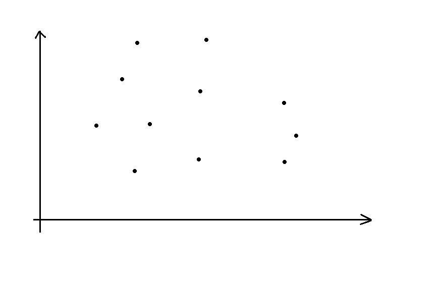

# 0704 B组模拟赛 题解

[传送门](https://local.cwoi.com.cn:8443/contest/C0281)

## 前言

这次前两道题很简单但是赛时卡了，记录一下思维过程以后不要再卡。第三道是思维题，第四道套路题，都有记一下的价值。

## T1

其实很简单，发现假如知道了第 $k$ 根棍子的长度可以很容易地判断能否取到，那么直接二分答案搞定。但赛时有个砂玻卡了 1.5h 才想出来。

做这种题假如正向思维卡住不妨反向来考虑，或者说这种简单的求最大/最小值的题应该优先考虑二分答案。

/// details | 参考代码
    open: False
    type: success

```cpp
using ld=long double;
const int N=55,inf=0x3f3f3f3f;
const ld eps=1e-9;
int n,c,k;
ld a[N],sum;
bool chk(ld x){
	int cnt=0,cc=c;
	forup(i,1,n){
		int num=floor(a[i]/x);
		if(num>cc+1) num=cc+1;
		cnt+=num;
		cc-=(num-1);
	}
	return cnt>=k;
}
signed main(){
	n=read();c=read();k=read();
	forup(i,1,n){
		scanf("%Lf",&a[i]);
	}
	sort(a+1,a+n+1,greater<ld>());
	ld ll=0,rr=1e9,mid;
	while(rr-ll>=eps){
		mid=(ll+rr)/2;
		if(chk(mid)) ll=mid;
		else rr=mid;
	}
	printf("%.12Lf",mid);
}
```

///

## T2

这种跟整除有关的题应该优先考虑数论分块。

对于一个固定的 $a$，容易发现 $b$ 的值域为 $[\left\lceil\frac{min_c}{a}\right\rceil,\left\lfloor\frac{max_c}{a}\right\rfloor]$。

而众所周知 $\left\lfloor\frac{n}{m}\right\rfloor$ 的取值只有 $2\sqrt{n}$ 种，因为当 $m \le sqrt{n}$，显然只有 $\sqrt{n}$ 种，当 $m \ge \sqrt{n}$，那么 $\frac{n}{m}$ 就只有 $\sqrt{n}$ 种取值。所以共有大约 $2 \sqrt{n}$ 种。

所以 $b$ 的值域至多会变化 $4\sqrt{max_c}$ 次，我们在 $a$ 的取值中二分下一次变化 $a$ 的值即可，复杂度 $O(\sqrt{max_c}\log{max_a})$。

/// details | 参考代码
    open: False
    type: success

```cpp
i64 a1,a2,b1,b2,c1,c2,ans,l;
signed main(){
	a1=read();a2=read();b1=read();b2=read();c1=read();c2=read();
	l=a1;
	while(l<=a2){
		i64 ll=l,rr=a2+1,mid;
		while(ll<rr-1){
			mid=(ll+rr)>>1;
			if(c2/mid==c2/l&&(c1+mid-1)/mid==(c1+l-1)/l) ll=mid;
			else rr=mid;
		}
		ans+=(rr-l)*max((min(c2/l,b2)-max((c1+l-1)/l,b1)+1),0ll);
		l=rr;
	}
	printf("%lld\n",ans);
}
```

///

## T3

据说以前考过，但当时我还在 D 组不知道在搞什么。

首先容易发现一个性质：

$$
10^k\bmod11=\begin{cases}
1 & k\equiv 0\pmod 2\\\\
-1 & k\equiv 1\pmod 2
\end{cases}
$$

然后我们就可以用这个性质做题了。

首先读入的时候不用高精度，由于我们最后算的是模以 $11$ 为 $0$ 的情况，不妨每读一位就模以 $11$，把每个数看做一个 $0 \sim 10$ 的数加一堆前导零，另外存储一下这个数的位数是奇数还是偶数。

然后假如我们得到的每个数为 $a_1,a_2\dots a_n$，位数为 $l_1,l_2\dots l_n$，那么按顺序拼出来的大概长这样：

$$a_1 \times 10^{l_2+l_3+\dots l_n}+a_2 \times 10^{l_3+l_4\dots l_n}+\dots a_n$$

还记得我们刚才的结论吗？这东西模 $11$ 和下面这东西模 $11$ 是等价的。

$$a_1 \times -1^{l_2+l_3+\dots l_n}+a_2 \times -1^{l_3+l_4\dots l_n}+\dots a_n$$

也就是说我们会把一些数的 $a$ 取相反数，一些不取反然后加起来。另外取反的 $a_i$ 必定满足 $l_{i+1}+l_{l+2}+\dots l_n \equiv 1 \pmod 2$。

假如我们现在已经拼出了后 $k$ 位，现在把某个数 $a_i$ 接在上面，那么假如 $k$ 为奇数，$a_i$ 就要取反，反之不取反，另外容易发现假如 $l_i$ 是一个奇数那么对于下一个 $a$ 它的 $k'$ 和 $k$ 奇偶性不同，假如 $l_i$ 是偶数那么 $k'$ 和 $k$ 奇偶性相同。这就有个很好的性质，我们发现可以先把所有奇数全部拼好再插入偶数，这对于奇数的答案是不会有影响的。

假如只考虑奇数，设奇数有 $odd$ 个，容易发现无论怎么构造都必定有 $\left\lfloor\frac{odd}{2}\right\rfloor$ 个 $a$ 取反，其余的不取反，那么我们可以不考虑具体放哪个位置，只关心它取不取反。考虑 DP，设 $dp_{i,j,k}$ 表示考虑前 $i$ 个奇数（随意排序），其中 $j$ 个取反，和（在模 $11$ 意义下）为 $k$ 的方案数，易得转移方程：

$$dp_{i,j,k}=dp_{i-1,j,k-a_i}\times (\left\lceil\frac{odd}{2}\right\rceil-(i-j-1))+dp_{i-1,j-1,k+a_i}\times (\left\lfloor\frac{odd}{2}\right\rfloor-(j-1))$$

这个式子前半部分是考虑 $a_i$ 不取反转移，其中 $\left\lceil\frac{odd}{2}\right\rceil-(i-j-1)$ 表示这个数具体塞在哪里的方案数，后半部分是考虑 $a_i$ 取反转移，具体实现时要注意取模和 $j$ 的边界。

然后考虑偶数如何放，仍然考虑 DP，设 $f_{i,j,k}$，定义与 $dp_{i,j,k}$ 类似，易得转移方程：

$$f_{i,j,k}=f_{i-1,j,k-a_i}\times (\left\lceil\frac{odd+1}{2}\right\rceil+(i-j-1))+f_{i-1,j-1,k+a_i}\times (\left\lfloor\frac{odd+1}{2}\right\rfloor+(j-1))$$

式子前后半部分的意义和 $dp_{i,j,k}$ 是类似的。

~~这时候聪明的小朋友就要问了，为什么一个是减去 $(i-j-1)$，另一个是加上呢？~~

感性理解一下，放奇数是一个萝卜一个坑地放，某个数占了一个位置那其它数就不能放这个位置了。但放偶数是插空放，放了一个数就会新增一个空。

然后最后统计答案时，首先奇数取反的必定有 $\left\lfloor\frac{odd}{2}\right\rfloor$ 个，直接枚举偶数有多少个取反，然后枚举 $k$ 相乘即可，具体见代码。

复杂度 $O(n^2)$。

/// details | 参考代码
    open: False
    type: success

```cpp
const i64 N=55,inf=0x3f3f3f3f,mod=1e9+7;
i64 a[N],n;
i64 dp[N][N][11],dp1[N][N][11];
vector<i64> od,ev;
signed main(){
	n=read();
	forup(i,1,n){
		char c=gc;
		i64 cnt=0;
		while(isdigit(c)){
			a[i]=(a[i]*10+(c^48))%11;
			++cnt;
			c=gc;
		}
		if(cnt&1){
			od.push_back(a[i]);
		}else{
			ev.push_back(a[i]);
		}
	}
	i64 cnto=od.size(),neg=cnto/2,pos=cnto-neg,cnte=ev.size();
	dp[0][0][0]=1;
	forup(i,1,cnto){
		forup(j,max(0ll,i-cnto+neg),min(i,neg)){
			forup(k,0,10){
				if(j<i){
					(dp[i][j][k]+=dp[i-1][j][(k-od[i-1]+11)%11]*(pos-i+j+1)%mod)%=mod;
				}
				if(j>0){
					(dp[i][j][k]+=dp[i-1][j-1][(k+od[i-1])%11]*(neg-j+1)%mod)%=mod;
				}
			}
		}
	}
	dp1[0][0][0]=1;
	forup(i,1,cnte){
		forup(j,0,i){
			forup(k,0,10){
				if(j<i){
					(dp1[i][j][k]+=dp1[i-1][j][(k-ev[i-1]+11)%11]*((cnto+2)/2+i-j-1)%mod)%=mod;
				}
				if(j>0){
					(dp1[i][j][k]+=dp1[i-1][j-1][(k+ev[i-1])%11]*((cnto+1)/2+j-1)%mod)%=mod;
				}
			}
		}
	}
	i64 ans=0;
	forup(i,0,cnte){// (1)!
		forup(j,0,10){
			(ans+=dp[cnto][neg][j]*dp1[cnte][i][(11-j)%11]%mod)%=mod;
		}
	}
	printf("%lld",ans);
}
```

1. 最终统计答案。
///

## T4

非常有意思的题。

这里有一个套路（我以前不会），就是假如某道题要求曼哈顿距离，但是曼哈顿距离在这道题上没有很好的性质时，可以考虑转化成切比雪夫距离求解。


/// details | 什么是切比雪夫距离
	type: question
	open: False

切比雪夫距离（Chebyshev distance）是向量空间中的一种度量，二个点之间的距离定义为其各坐标数值差的最大值。

在二维空间内，两个点之间的切比雪夫距离为它们横坐标之差的绝对值与纵坐标之差的绝对值的最大值。设点 $A(x_1,y_1),B(x_2,y_2)$，则 A,B 之间的切比雪夫距离用公式可以表示为：

$$d(A,B) = \max(|x_1 - x_2|, |y_1 - y_2|)$$

$n$ 维空间中切比雪夫距离的距离公式可以表示为：

$$
\begin{aligned}
d(x,y) &= \max\begin{Bmatrix} |x_1 - y_1|,|x_2 - y_2|,\cdot \cdot \cdot,|x_n - y_n|\end{Bmatrix} \\\\
&= \max\begin{Bmatrix} |x_i - y_i|\end{Bmatrix}(i \in [1, n])\end{aligned}
$$

摘自 [OI Wiki](https://oi-wiki.org/geometry/distance/#%E5%88%87%E6%AF%94%E9%9B%AA%E5%A4%AB%E8%B7%9D%E7%A6%BB)

///

并且切比雪夫距离和曼哈顿距离可以互相转化。

假如我现在有两个点 $A(x_1,y_1),B(x_2,y_2)$，它们的曼哈顿距离应该是 $|x_1-x_2|+|y_1-y_2|$，显然等于这个东西：

$$\max\begin{Bmatrix}(x_1-x_2)+(y_1-y_2),(-x_1+x_2)+(y_1-y_2),(x_1-x_2)+(-y_1+y_2),(-x_1+x_2)+(-y_1+y_2)\end{Bmatrix}$$

因为 $(x_1-x_2),(y_1-y_2)$ 都是取正数的时候更大。然后再考虑转化一下，就可以得到这个式子：

$$\max\begin{Bmatrix}(x_1+y_1)-(x_2+y_2),(y_1-x_1)-(y_2-x_2),(x_1-y_1)-(x_2-y_2),(x_2+y_2)-(x_1+y_1)\end{Bmatrix}$$

然后发现可以套一层绝对值：

$$\max\begin{Bmatrix}|(x_1+y_1)-(x_2+y_2)|,|(x_1-y_1)-(x_2-y_2)|\end{Bmatrix}$$

发现没有，这就是切比雪夫距离的形式。

故 $A(x_1,y_1),B(x_2,y_2)$ 的曼哈顿距离等于 $A'(x_1+y_1,x_1-y_1),B'(x_2+y_2,x_2-y_2)$ 的切比雪夫距离。

反过来也差不多，但不是这道题的重点就不讲了。

那么现在我们把所有黑点 $(x_i,y_i)$ 转化为 $(x_i+y_i,x_i-y_i)$，这样删点的代价就变成了它和切比雪夫距离最远的黑点的切比雪夫距离。为方便叙述，以下所有“距离”均为切比雪夫距离。

考虑转化后平面上的点集长这样：



容易发现每个点纵坐标值域为 $[-7,7]$，横坐标为 $[2,16]$。现在我们标注出最边缘的点。


容易发现每次删距离更远的两对边上的点一定是不劣的。

假如我们有这个一个点，它和四条边缘的距离分别是这样的：


假设 $A>B$，首先蓝边 $A$ 肯定会被算至少一次，因为你无论删边上的哪个点与它距离最远的都是对面的那个点。

然后对于那个红色点，假如删去它原本的代价是与蓝色边界的距离，那么删绿边上的点不会影响它。假如原本的代价是和绿边的距离，那么删绿边的点还可能让代价变小。容易发现对于每个点都是这样的。

那么考虑记忆化搜索，每次扫一遍当前点集找到更远的两边缘上的点，然后随便删一个。

这样的复杂度为什么是对的？考虑围成的矩形有多少种取法。

不妨考虑两对角顶点的位置有多少种取法，首先转化后点集横纵坐标取值都有 $14$ 种，那么两对角顶点的位置都有 $14^2$ 种选法，去掉重复的就是 $\frac{14^2 \times 14^2}{2}=19268$ 种，这本来就是个非常小的数了，还根本不可能卡满。

另外发现在一个矩形变形之前只可能取它边缘上的点，基本上可以认为复杂度只和矩形的数量有关，而且还要加记忆化使每个状态只会被访问一次，跑得就更快了。

注意对于状态我们可以用一个 `vector` 存点集，然后用 `map` 写记忆化。注意要给 `map` 的 $key$ 定义一个小于符号才不会 CE，但众所周知 `vector` 默认按字典序比较，我们只要给存的点定义小于符号即可。

/// details | 具体实现参考
	type: example
	open: False

```cpp
struct point{
	int x,y;
	bool operator <(const point &r)const{
		if(x!=r.x) return x<r.x;
		return y<r.y;
	}
};
vector<point> pp;
map<vector<point>,int> mp;
```
///

/// details | 完整代码参考
	type: success
	open: False

```cpp
#include<bits/stdc++.h>
#define mem(a,b) memset(a,b,sizeof(a))
#define forup(i,s,e) for(int i=(s);i<=(e);i++)
#define fordown(i,s,e) for(int i=(s);i>=(e);i--)
using namespace std;
#define gc getchar()
inline int read(){
    int x=0,f=1;char c;
    while(!isdigit(c=gc)) if(c=='-') f=-1;
    while(isdigit(c)){x=(x<<3)+(x<<1)+(c^48);c=gc;}
    return x*f;
}
#undef gc
const int N=10,inf=0x3f3f3f3f;
int n;
char a[N][N];
struct point{
	int x,y;
	bool operator <(const point &r)const{
		if(x!=r.x) return x<r.x;
		return y<r.y;
	}
};
vector<point> pp;
map<vector<point>,int> mp;
int dfs(vector<point> &vec){
	if(vec.size()<=1) return 0;
	if(mp.find(vec)!=mp.end()){
		return mp[vec];
	}
	int mxx=-20,mnx=20,mxy=0,mny=20;
	for(auto i:vec){
		if(i.x>mxx) mxx=i.x;
		if(i.x<mnx) mnx=i.x;
		if(i.y>mxy) mxy=i.y;
		if(i.y<mny) mny=i.y;
	}
	int res=inf,add;
	vector<point> vv;
	if(mxx-mnx>=mxy-mny){
		add=0;
		for(auto i:vec){// (1)!
			if(i.x==mxx){
				add+=(mxx-mnx);
			}else{
				vv.push_back(i);
			}
		}
		res=min(res,dfs(vv)+add);
		add=0;vv.clear();
		for(auto i:vec){
			if(i.x==mnx){
				add+=(mxx-mnx);
			}else{
				vv.push_back(i);
			}
		}
		res=min(res,dfs(vv)+add);
	}else{
		add=0;
		for(auto i:vec){
			if(i.y==mxy){
				add+=(mxy-mny);
			}else{
				vv.push_back(i);
			}
		}
		res=min(res,dfs(vv)+add);
		add=0;vv.clear();
		for(auto i:vec){
			if(i.y==mny){
				add+=(mxy-mny);
			}else{
				vv.push_back(i);
			}
		}
		res=min(res,dfs(vv)+add);
	}
	mp[vec]=res;
	return res;
}
signed main(){
	forup(i,1,8){
		scanf(" %s",a[i]+1);
		forup(j,1,8){
			if(a[i][j]=='#'){
				++n;
				pp.push_back(point{i-j,i+j});
			}
		}
	}
	printf("%d",dfs(pp));
}
```

1. 容易发现会先把边界删完，那不妨直接一次搞定，这样状态数就严格等于矩形数量。

///