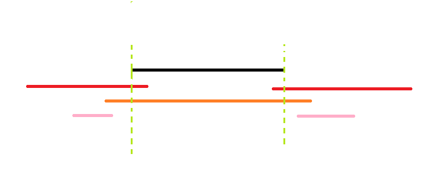

# 2023 NOIP 集训 模拟赛 1 题解

## 前言

开始集训力，考试要比以前稀疏的多了。

[题目](../files/20230707.rar)

压缩包密码是学校通用密码，大小写敏感。

## T1

/// details | 前置知识：Prüfer 序列
    type: info
    open: False

Prüfer 序列可以将一个带标号 $n$ 个结点的树用 $[1,n]$ 中的 $n-2$ 个整数表示。你也可以把它理解为完全图的生成树与数列之间的双射。Heinz Prüfer 于 1918 年发明这个序列来证明凯莱公式。

显然你不会想不开拿这玩意儿去维护树结构。这玩意儿常用组合计数问题上。

Prüfer 是这样建立的：每次选择一个编号最小的叶结点并删掉它，然后在序列中记录下它连接到的那个结点。重复 n-2 次后就只剩下两个结点，算法结束。

摘自 [OI Wiki](https://oi-wiki.org/graph/prufer/)，这道题基本知道这些就够用了。

///

考虑 Prüfer 序列的生成方式，不太准确的表述就是每次选定一个叶子结点然后删掉它。不妨设每次删掉一个结点时它唯一连了边的孔为特殊孔，容易发现除去删完剩下的两个结点之间的边以外，其它每条边都连接一个特殊点和一个非特殊点，而且假如确认了剩下 $n-2$ 条边那么这条边也是唯一确认的。考虑把所有点连起来的一个加边的过程，那么总方案数如下：

$$\prod_{i=1}^{n-2}(S-n-i+1)\times(n-i+1)$$

其中 $S=\sum d_i$。

式子很好理解，连了 $i-1$ 条边后就还剩 $S-n-i+1$ 个非特殊点和 $n-i+1$ 个特殊点，直接随便选两个，相乘即可。

这里有一个小 bug，因为我们没有考虑连边的具体顺序，容易发现这个式子把每种连边方案的所有连边顺序都算上了，直接除以 $(n-1)!$ 即可。

此外，选取特殊点的方案数为 $\prod d_i$，故最终答案为:

$$(\prod_{i=1}^{n} d_i)\times (\prod_{i=0}^{n-3}S-n-i)$$

复杂度 $O(n)$。

/// details | 参考代码
    open: False
    type: success

```cpp
#include<bits/stdc++.h>
#define mem(a,b) memset(a,b,sizeof(a))
#define forup(i,s,e) for(i64 i=(s);i<=(e);i++)
#define fordown(i,s,e) for(i64 i=(s);i>=(e);i--)
using namespace std;
using i64=long long;
#define gc getchar()
inline i64 read(){
    i64 x=0,f=1;char c;
    while(!isdigit(c=gc)) if(c=='-') f=-1;
    while(isdigit(c)){x=(x<<3)+(x<<1)+(c^48);c=gc;}
    return x*f;
}
#undef gc
const i64 mod=998244353; 
i64 n,d,ans=1,sum=0;
signed main(){
	n=read();
	forup(i,1,n){
		d=read();
		(ans*=d)%=mod;
		(sum+=d)%=mod;
	}
	forup(i,0,n-3){
		(ans*=(sum+mod-n-i)%mod)%=mod;
	}
	printf("%lld",ans);
}
```

///

## T2

首先考虑什么情况无解。

容易发现有解当且仅当 $\max\begin{Bmatrix}a_i\end{Bmatrix} \le k \le \sum a_i$。

最大值很好构造，直接不严格降序排列就完了。考虑如何构造最小值，其实也非常简单，从大到小考虑每个数，每次每个数尽可能插在每段的开头，这样就能最小化每次增加的段数。

这个构造方法启示我们，假如原本有个由若干个 $(i,n]$ 之间的整数组成的序列段数为 $k$，对于任意这样的序列，我们可以构造若干种插入 $i$ 的方法使得新序列段数 $l=[k,k+a_i]$ 之间的任意整数。

具体地，将 $a_i-(k-l)$ 个 $i$ 插在原先每段的前面，剩余的 $k-l$ 个 $i$ 插在任意不是段首的位置都会使段数加一。

我觉得这个很好理解，首先在结尾它会另起一段。假如插在某一段中间就会断开某一段，会增加一段。假如放在之前放的 $i$ 后面那么就会使它不严格递增，也会变成新段。

容易想到 DP，设 $dp_{i,j}$ 表示考虑 $[i,n]$ 之间的数，段数为 $j$ 的方案数，转移方程如下：

$$dp_{i,j}=\sum_{l=j-a_i}^{j}dp_{i+1,l}\times \dbinom{l}{a_i-(k-l)}\times \dbinom{(k-l)+[a_i-(k-l)+1+(\sum_{j=i+1}^{n} a_j)-l]-1}{[a_i-(k-l)+1+(\sum_{j=i+1}^{n} a_j)-l]-1}$$

首先中间的 $\dbinom{l}{a_i-(k-l)}$ 很好理解，表示不会增加段数的 $i$ 具体插在哪里，后面的这是个经典问题，我们先把它放在一个更笼统的情况：

> 把长度为 $n$ 的序列分成 $q$ 段，每一段可为空，求方案数。

可以等价为在 $n+q-1$ 个 $0$ 中选 $q-1$ 个变成 $1$，这样相当于用 $1$ 把 $0$ 分成了 $q$ 段，即 $\dbinom{n+q-1}{q-1}$。

然后懂了这个上面式子的后半段就很好懂了，就是把 $k-l$ 个 $i$ 分成 $[a_i-(k-l)+1+(\sum_{j=i+1}^{n} a_j)-l]$ 段的方案数。而这个数就是不是段首的位置的数量。

/// details | 参考代码
    open: False
    type: success

```cpp
#include<bits/stdc++.h>
#define mem(a,b) memset(a,b,sizeof(a))
#define forup(i,s,e) for(i64 i=(s);i<=(e);i++)
#define fordown(i,s,e) for(i64 i=(s);i>=(e);i--)
using namespace std;
using i64=long long;
#define gc getchar()
inline i64 read(){
    i64 x=0,f=1;char c;
    while(!isdigit(c=gc)) if(c=='-') f=-1;
    while(isdigit(c)){x=(x<<3)+(x<<1)+(c^48);c=gc;}
    return x*f;
}
#undef gc
const i64 N=55,M=2505,inf=0x3f3f3f3f,mod=1e9+7;
i64 n,k,a[N],sum;
i64 fact[M*3],inv[M*3],finv[M*3];
i64 ksm(i64 a,i64 b){
	i64 c=1;
	while(b){
		if(b&1) c=c*a%mod;
		a=a*a%mod;
		b>>=1;
	}
	return c;
}
void init(){
	fact[1]=fact[0]=inv[1]=finv[0]=finv[1]=1;
	forup(i,2,7000){
		fact[i]=fact[i-1]*i%mod;
		inv[i]=(mod-mod/i)*inv[mod%i]%mod;
		finv[i]=finv[i-1]*inv[i]%mod;
	}
}
i64 C(i64 n,i64 m){
	if(n<m) return 0;
	return fact[n]*finv[m]%mod*finv[n-m]%mod;
}
i64 calc(i64 ori,i64 gol,i64 i,i64 kk){
	return C(ori,a[i]-(gol-ori))*C(a[i]-(gol-ori)+kk+gol-ori,a[i]-(gol-ori)+kk)%mod;
}
i64 dp[N][M];
signed main(){
	n=read();k=read();
	forup(i,1,n){
		a[i]=read();
		sum+=a[i];
		if(a[i]>k){
			puts("0");
			return 0;
		}
	}
	init();
	if(sum<k){
		puts("0");
		return 0;
	}
	dp[n+1][0]=1;
	sum=0;
	i64 mx=0;
	fordown(i,n,1){
		sum+=a[i];
		mx=max(mx,a[i]);
		forup(j,mx,min(sum,k)){
			fordown(l,j,max(j-a[i],0ll)){
				if(dp[i+1][l]){
					(dp[i][j]+=dp[i+1][l]*calc(l,j,i,sum-a[i]-l)%mod)%=mod;
				}
			}
		}
	}
	printf("%lld",dp[1][k]);
}
```

///

## T3

首先这道题肯定不能把图画出来再遍历，这样时间空间双双爆炸。

考虑寻找性质，假如按题上给的条件，即以左下角为原点，从下到上从左到右分别是 $0\sim 2^{k}-1$，容易发现以下性质：

> 格子 $(i,j)$ 是黑色的当且仅当 $\exists k\in[0,k-1]\;s.t.\;i \And 2^k \ne 0,j \And 2^k =0$。或者说在二进制下存在某一位，使得 $i$ 这一位为 $1$，$j$ 这一位为 $0$。

/// admonition | 证明
	type: info

考虑数学归纳法。

首先对于 $0$ 阶画板，结论平凡。

假设 $0 \sim k-1$ 阶画板满足以上性质，考虑 $k$ 阶画板。

首先对于左上角的部分所有格子全为黑色的，$i \in [2^{k-1},2^{k}-1],j\in [0,2^{k-1}-1]$，容易发现 $i$ 的最高位（即 $2^{k-1}$ 这一位）必定为 $1$，$j$ 的最高位必定为 $0$。对于剩下的三块，最高位不满足条件（证明平凡），只考虑后面的位数，就是一个 $k-1$ 阶画板。

证毕。

///

故我们可以抛开原来的画板，转化成了这样一个问题：

> 求有多少个 $a,b\in [0,2^{k-1}]$ 且 $a+X,b+Y \in [0,2^{k-1}]$，使得二进制下，$a$ 所有为 $1$ 的位数 $b$ 对应位均不为 $0$，且 $a+X$ 所有为 $1$ 的位数 $b+Y$ 对应位均不为 $0$。

考虑数位 DP，设 $dp_{i,1/0,1/0}$ 表示考虑后 $i$ 位，$a+X$ 有/无来自上一位的进位，$b+Y$ 有/无来自上一位的进位的合法的取 $(a,b)$ 的方案数。转移枚举这一位 $a,b$ 分别取 $0$ 还是 $1$ 即可。

注意到要写高精度，其实非常简单，只需要时间高精加，高精除以二，高精模以二即可。复杂度 $O(k^2)$（因为高精也是 $O(k)$ 的）。

/// details | 参考代码
	type: success
	open: False
```cpp
#include<bits/stdc++.h>
#define mem(a,b) memset(a,b,sizeof(a))
#define forup(i,s,e) for(int i=(s);i<=(e);i++)
#define fordown(i,s,e) for(int i=(s);i>=(e);i--)
using namespace std;
#define gc getchar()
int read(){
    int x=0,f=1;char c;
    while(!isdigit(c=gc)) if(c=='-') f=-1;
    while(isdigit(c)){x=(x<<3)+(x<<1)+(c^48);c=gc;}
    return x*f;
}
const int N=5005;
int n;
struct Num{
	int a[5005],len;
	Num(){
		len=1;mem(a,0);
	}
	void read(){
	    char c;
	    while(!isdigit(c=gc));
	    while(isdigit(c)){
	    	fordown(i,len,1){
	    		a[i+1]=a[i];
			}
			a[1]=c^48;len++;
			c=gc;
		}
	}
	void operator +=(const Num &r){
		len=max(len,r.len);
		forup(i,1,len){
			a[i]=a[i]+r.a[i];
			a[i+1]+=a[i]/10;
			a[i]%=10;
		}
		if(a[len+1]!=0) ++len;
	}
	int get2(){
		return a[1]&1;
	}
	void div2(){
		fordown(i,len,1){
			if(i>1) a[i-1]+=(a[i]&1)*10;
			a[i]/=2;
		}
		if(a[len]==0) --len;
	}
	void print(){
		fordown(i,len,1){
			printf("%d",a[i]);
		}
	}
};
Num x,y,dp[N][2][2];
signed main(){
	n=read();x.read();y.read();
	dp[1][0][0].a[1]=1;
	forup(i,1,n){
		int tx=x.get2(),ty=y.get2();
		forup(a,0,1){
			forup(b,0,1){
				forup(c,0,1){
					forup(d,0,1){
						if((((c+a+tx)%2==1)&&((d+b+ty)%2==0))||(((c)%2==1)&&((d)%2==0))) continue;
						dp[i+1][(c+a+tx)/2][(d+b+ty)/2]+=dp[i][a][b];
					}
				}
			}
		}
		x.div2();y.div2();
	}
	if(x.a[1]!=0||y.a[1]!=0){
		puts("0");
	}else{
		dp[n+1][0][0].print();
	}
}
```

///

## T4

考虑一种贪心。

首先假设对于每个区间，往左边转发和往右边转发是两个独立的问题，我们设区间 $i$ 转发给左侧所有人的最小转发次数为 $fl_i$，显然可以找一个右端点在当前区间内，且 $fl_j$ 最小的区间 $j$，右侧同理，设这个数为 $fr_i$

假如左右独立，这个显然是对的，因为每次找一个最小的肯定比找一个较大的优。

但问题就在于左右不一定独立，比如这种情况：



假如黑色区间要传给两个粉色区间，按我们刚才的贪心策略就会走两个红色区间，答案为 $2$，但其实直接走那个橙色的显然更优，答案为 $1$。

考虑如何解决这个问题，这其实也非常简单，因为会让我们答案不优的一定是个包含它的区间，那么我们最后再特判一下第一步走一个包含它的区间得到的答案即可，假设我们已经求出了 $fl,fr$，那么某个区间 $i$ 的答案即为：

$$\min\begin{Bmatrix}fl_i+fr_i,\min\limits_{s_j \le s_i,t_i \le t_j}\begin{Bmatrix}fl_j+fr_j+1\end{Bmatrix}\end{Bmatrix}$$

/// details | 参考代码
	open: False
	type: success

```cpp
#include<bits/stdc++.h>
#define mem(a,b) memset(a,b,sizeof(a))
#define forup(i,s,e) for(int i=(s);i<=(e);i++)
#define fordown(i,s,e) for(int i=(s);i>=(e);i--)
using namespace std;
using i64=long long;
#define gc getchar()
inline int read(){
    int x=0,f=1;char c;
    while(!isdigit(c=gc)) if(c=='-') f=-1;
    while(isdigit(c)){x=(x<<3)+(x<<1)+(c^48);c=gc;}
    return x*f;
}
#undef gc
const int N=2e5+5,inf=0x3f3f3f3f;
int n,maxn;
struct que{
	int l,r,fl,fr;
}s[N];
bool cmp1(que a,que b){
	if(a.l!=b.l) return a.l>b.l;
	return a.r>b.r;
}
bool cmp2(que a,que b){
	if(a.r!=b.r) return a.r<b.r;
	return a.l<b.l;
}
bool cmp3(que a,que b){
	if(a.l!=b.l) return a.l<b.l;
	return a.r>b.r;
}
struct SegmentTree{
	#define mid ((l+r)>>1)
	#define lson l,mid,id<<1
	#define rson mid+1,r,id<<1|1
	int querymin[N<<3];
	void PushUp(int id){
		querymin[id]=min(querymin[id<<1],querymin[id<<1|1]);
	}
	void Build(){
		mem(querymin,0x3f);
	}
	void Update(int P,int X,int l=1,int r=maxn,int id=1){
		if(l==r){
			querymin[id]=min(querymin[id],X);
			return;
		}
		if(P<=mid) Update(P,X,lson);
		else       Update(P,X,rson);
		PushUp(id);
	}
	int AskMin(int L,int R,int l=1,int r=maxn,int id=1){
		if(L<=l&&r<=R){
			return querymin[id];
		}
		int res=inf;
		if(L<=mid) res=min(res,AskMin(L,R,lson));
		if(mid< R) res=min(res,AskMin(L,R,rson));
		return res;
	}
}mt;
void getf(){
	sort(s+1,s+n+1,cmp2);
	mt.Build();
	forup(i,1,n){
		if(s[i].l>s[1].r){
			int res=mt.AskMin(s[i].l,s[i].r);
			s[i].fl=min(res+1,inf);
		}
		mt.Update(s[i].r,s[i].fl);
	}
	sort(s+1,s+n+1,cmp1);
	mt.Build();
	forup(i,1,n){
		if(s[i].r<s[1].l){
			int res=mt.AskMin(s[i].l,s[i].r);
			s[i].fr=min(res+1,inf);
		}
		mt.Update(s[i].l,s[i].fr);
	}
}
i64 ans=0;
void work(){
	mt.Build();
	sort(s+1,s+n+1,cmp3);
	forup(i,1,n){
		int res=min(s[i].fl+s[i].fr,mt.AskMin(s[i].r,maxn)+1);
		if(res>=inf){
			puts("-1");
			exit(0);
		}
		ans+=res;
		mt.Update(s[i].r,s[i].fl+s[i].fr);
	}
	printf("%lld",ans);
}
signed main(){
	n=read();
	vector<int> lsh;
	forup(i,1,n){
		s[i].l=read();s[i].r=read();
		lsh.push_back(s[i].l);
		lsh.push_back(s[i].r);
	}
	sort(lsh.begin(),lsh.end());
	lsh.erase(unique(lsh.begin(),lsh.end()),lsh.end());
	maxn=lsh.size();
	forup(i,1,n){
		s[i].l=lower_bound(lsh.begin(),lsh.end(),s[i].l)-lsh.begin()+1;
		s[i].r=lower_bound(lsh.begin(),lsh.end(),s[i].r)-lsh.begin()+1;
	}
	getf();
	work();
}
```

///