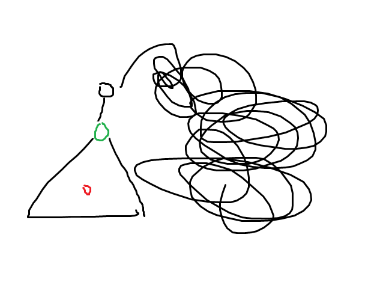
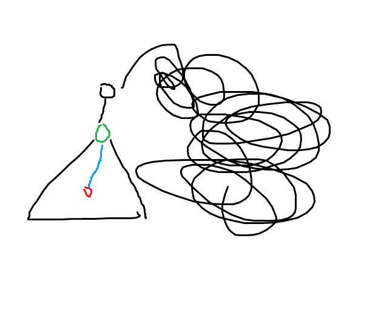
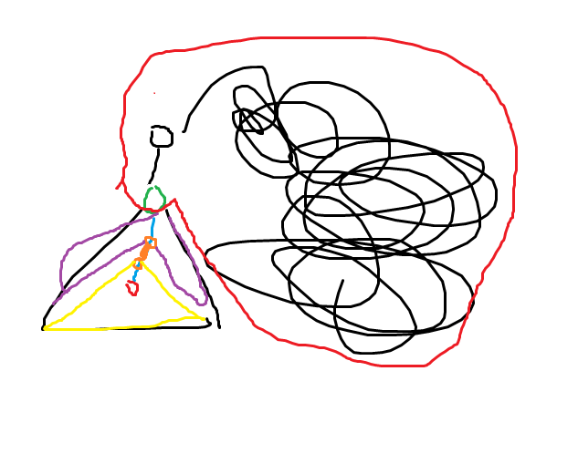

# 20230824 B 组模拟赛 C 题 题解

## 前言

这次 C 题挺有意思的。

[题面，密码是 CW 通用密码，大小写敏感](../files/0824.rar)

## 题解

首先不考虑改造操作，应该如何求贡献。

考虑求出每一条边的贡献，原式子可以这样化：

$$
\begin{aligned}
 &\sum_{i=1}^{n-1}\sum_{j=i+1}^nf(i,j)a_ia_j\\\\
=&\sum_{i=1}^{n-1}\sum_{j=i+1}^n\left(\sum_{(u,v)\in P(i,j)}^{v>u}w(u,v)\right)a_ia_j\\\\
=&\sum_{(u,v)}^{v>u}w(u,v)\sum_{i=1}^n\sum_{j=i+1}^na_ia_j[(u,v)\in P(i,j)]\\\\
\end{aligned}
$$

其中 $P(i,j)$ 表示 $i,j$ 间简单路径上边的集合，中括号为艾佛森括号，表示若内部表达式为真，值为 $1$，反之为 $0$。

容易发现后面那个艾佛森括号里面的表达式成立当且仅当断开边 $(u,v)$ 后，$i,j$ 在两棵不同的树内。

那么 $\sum_{i=1}^n\sum_{j=i+1}^na_ia_j[(u,v)\in P(i,j)]$ 的值其实就是断开 $(u,v)$ 后两棵树的点权和相乘（随便因式分解一下）。

换句话说，每条边的贡献就是由它分开的两部分点权和相乘乘以它的边权。

那么再考虑改造操作，考虑改造操作对总贡献的变化量。

首先考虑有这么一棵树，然后我们要改造的是以绿色节点为根的子树（图示很草，凑合看）：



那么假如选择红色节点作为新的根，总贡献会如何变化。

考虑红-绿的路径。



容易发现不在这条路径上的边贡献都不会边，考虑路径上的边贡献会怎么变化。



先看这条橙色边，假设它把那棵子树分成黄紫两部分，不妨设橙边边权为 $w$，红色部分和为 $R$，紫色部分和为 $P$，黄色部分和为 $Y$。

那么这条边原先的贡献就是 $w\times(R+P)\times Y$，改造后容易发现原先的黄色部分跑到橙边上面去了，紫色部分跑到橙边下面去了，那么贡献就变成了 $w\times(R+Y)\times P$。

那么差值即为 $w(RP+YP)-w(RY+YP)=w(RP-RY)$。

容易发现假如我们找到了绿点，那么 $Y+P$ 是可以知道的，设这个值为 $S$，显然，$R=sum-S$，其中 $sum$ 为所有点的点权和，但这个我们先放在一边。

那么 $w(RP-RY)=w(R(S-Y)-RY)=R(w(S-Y*2))$

那么考虑 红-绿 整条路径上面的所有边，设 $S_i$ 表示以点 $i$ 为根的子树点权和（或者某条路径所指向的儿子的子树和），绿点为点 $x$，红点为点 $y$，那么改变量总量即为：

$$
\begin{aligned}
 &(S_1-S_x)\sum_{(u,v)\in P(x,y)}^{v>u}(w(u,v)S_x-2w(u,v)S_{(u,v)})\\\\
=&(S_1-S_x)S_x\left(\sum_{(u,v)\in P(x,y)}^{v>u}w(u,v)\right)-2\left(\sum_{(u,v)\in P(x,y)}^{v>u}w(u,v)S_{(u,v)}\right)
\end{aligned}
$$

发现后面两个 $\sum$ 可以直接用前缀和维护那么设 $suma_i=\sum_{(u,v)\in P(1,i)}^{v>u}w(u,v),sumb_i=\sum_{(u,v)\in P(1,i)}^{v>u}w(u,v)S_{(u,v)}$，上面的式子就可以化成：

$$(S_1-S_x)[S_x\left(suma_y-suma_x\right)-2\left(sumb_y-sumb_x\right)]$$

这里的中括号就是普通的方括号。

这个式子很好看，给人一种可以维护的感觉，那么如何维护呢？我们把式子拆开来看。

$$
\begin{aligned}
 &(S_1-S_x)[S_x\left(suma_y-suma_x\right)-2\left(sumb_y-sumb_x\right)]\\\\
=&(S_1-S_x)(S_xsuma_y-S_xsuma_x-2sumb_y+2sumb_x)\\\\
=&(S_1-S_x)(2sumb_x-S_xsuma_x)+(S_1-S_x)(S_xsuma_y-2sumb_y)
\end{aligned}
$$

这样就好看了，容易发现前面的 $(S_1-S_x)(2sumb_x-S_xsuma_x)$ 是一个只与 $x$ 有关的式子，而后面的 $S_xsuma_y-2sumb_y$ 是一个可以斜率优化的式子，可以在凸包上二分解决，只要按 $S_1-S_x$ 的正负性分类讨论即可。

那么如何对某棵子树上所有点组成的凸包进行二分呢？首先树上问题可以转化为区间问题，那么就转化成对区间的凸包二分。这类似于一个区间取 $\max$，是有结合律的。

简单来说，点集 $A$ 的凸包与点集 $B$ 的凸包得到的答案取最值和点集 $A+B$ 的凸包得到的答案相等。证明显然。

那么有结合律就想到线段树，对线段树每个结点维护上下各一个一个凸包，上传时可以归并地合并（见代码），查询时对区间内每个凸包求出一个答案然后取最值即可，建树复杂度 $O(n\log n)$，查询复杂度 $O(\log^2 n)$，可以通过此题。

本题有个坑点，横坐标相同的多个点只保留最优的那个。

/// details | 参考代码
    open: False
    type: success

```cpp
#include<bits/stdc++.h>
#define mem(a,b) memset(a,b,sizeof(a))
#define forup(i,s,e) for(int i=(s);i<=(e);i++)
#define fordown(i,s,e) for(int i=(s);i>=(e);i--)
using namespace std;
using i64=__int128;
#define gc getchar()
inline i64 read(){
    i64 x=0,f=1;char c;
    while(!isdigit(c=gc)) if(c=='-') f=-1;
    while(isdigit(c)){x=(x<<3)+(x<<1)+(c^48);c=gc;}
    return x*f;
}
#undef gc
const i64 N=1e5+5,inf=1e35;
int n;
vector<int> e[N];
i64 sum[N],ans,res[N],pref[N],preg[N],a[N],fw[N];
void print(i64 x,bool p=0){
	if(x==0){
		if(!p) putchar('0');
		return;
	}
	if(x<0){
		putchar('-');
		x=-x;
	}
	int a=x%10;print(x/10,1);
	putchar(a+'0');
}
int st[N],ed[N],seq[N],Tm;
void dfs(int x){
	sum[x]=a[x];
	st[x]=++Tm;seq[Tm]=x;
	for(auto i:e[x]){
		dfs(i);
		sum[x]+=sum[i];
	}
	ed[x]=Tm;
}
void dfs1(int x,int fa){
	if(x!=1){
		pref[x]=pref[fa]+fw[x];
		preg[x]=preg[fa]+fw[x]*sum[x];		
	} 
	for(auto i:e[x]){
		dfs1(i,x);
	}
}
struct SegmentTree{
	#define mid ((l+r)>>1)
	#define lson l,mid,id<<1
	#define rson mid+1,r,id<<1|1
	using pii=pair<i64,i64>;
	#define fi first
	#define se second
	#define mkp make_pair
	vector<pii> upt[N<<2],dwt[N<<2];
	void _Merge(vector<pii> &L,vector<pii> &R,vector<pii> &P,bool up){
		int lp=0,rp=0,ls=L.size(),rs=R.size();
		while(lp<ls||rp<rs){
			pii nw=mkp(0,0);
			if(L[lp].fi==R[rp].fi){
				if(up){
					nw=min(L[lp],R[rp]);
				}else{
					nw=max(L[lp],R[rp]);
				}
				++lp;++rp;
			}else if(rp>=rs||(lp<ls&&L[lp].fi<=R[rp].fi)){
				nw=L[lp];++lp;
			}else{
				nw=R[rp];++rp;
			}
			if(up){
				while(P.size()>1&&(nw.se-P[P.size()-1].se)*(P[P.size()-1].fi-P[P.size()-2].fi)<=(P[P.size()-1].se-P[P.size()-2].se)*(nw.fi-P[P.size()-1].fi)) P.pop_back();
			}else{
				while(P.size()>1&&(nw.se-P[P.size()-1].se)*(P[P.size()-1].fi-P[P.size()-2].fi)>=(P[P.size()-1].se-P[P.size()-2].se)*(nw.fi-P[P.size()-1].fi)) P.pop_back();
			}
			P.push_back(nw);
		}
	}
	void Build(int *A,int l=1,int r=n,int id=1){
		if(l==r){
			upt[id].push_back(mkp(pref[A[l]],2*preg[A[l]]));
			dwt[id].push_back(mkp(pref[A[l]],2*preg[A[l]]));
			return;
		}
		Build(A,lson);Build(A,rson);
		_Merge(upt[id<<1],upt[id<<1|1],upt[id],1);
		_Merge(dwt[id<<1],dwt[id<<1|1],dwt[id],0);
	}
	i64 _calc(vector<pii> &V,i64 x,bool up){
		if(V.size()==1){
			return x*V[0].fi-V[0].se;
		}
		int ll=1,rr=V.size()-1,mm;
		while(ll<rr){
			mm=((ll+rr+1)>>1);
			if(up){
				if((V[mm].fi-V[mm-1].fi)*x>V[mm].se-V[mm-1].se) ll=mm;
				else rr=mm-1;
			}else{
				if((V[mm].fi-V[mm-1].fi)*x<V[mm].se-V[mm-1].se) ll=mm;
				else rr=mm-1;
			}
		}
		if(ll==1){
			if(up?(V[1].fi-V[0].fi)*x<V[1].se-V[0].se:(V[1].fi-V[0].fi)*x>V[1].se-V[0].se){
				ll=0;
			}
		}
		return x*V[ll].fi-V[ll].se;
	}
	i64 Ask(int L,int R,i64 X,bool up,int l=1,int r=n,int id=1){
		if(L<=l&&r<=R){
			if(up){
				return _calc(upt[id],X,1);
			}else{
				return _calc(dwt[id],X,0);
			}
		}
		i64 res=0;
		if(up){
			res=-inf;
			if(L<=mid) res=max(res,Ask(L,R,X,up,lson));
			if(mid< R) res=max(res,Ask(L,R,X,up,rson));
		}else{
			res=inf;
			if(L<=mid) res=min(res,Ask(L,R,X,up,lson));
			if(mid< R) res=min(res,Ask(L,R,X,up,rson));
		}
		return res;
	}
}mt;
signed main(){
	freopen("brain.in","r",stdin);
	freopen("brain.out","w",stdout);
	scanf("%d",&n);
	forup(i,1,n){
		a[i]=read();
	}
	forup(i,2,n){
		int u=read();fw[i]=read();
		e[u].push_back(i);
	}
	dfs(1);dfs1(1,0);
	mt.Build(seq);
	forup(i,2,n){
		ans+=fw[i]*sum[i]*(sum[1]-sum[i]);
	}
	forup(i,2,n){
		i64 res=(sum[1]-sum[i])*(mt.Ask(st[i],ed[i],sum[i],sum[1]-sum[i]>0)-pref[i]*sum[i]+2*preg[i]);
		print(ans+res);
		puts("");
	}
}
```

///