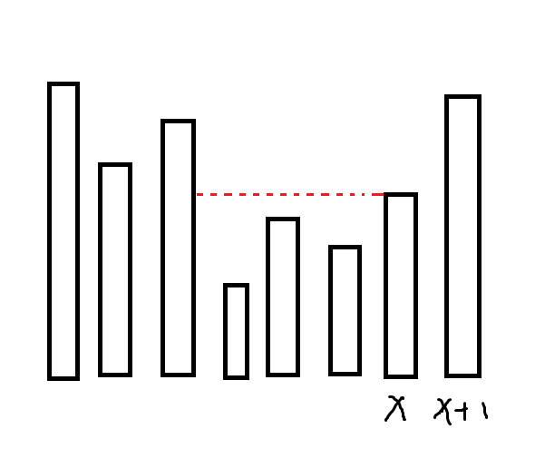
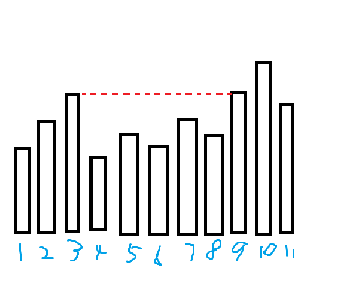

# 20230831 B组模拟赛 题解

## 前言

开学第一考（乐）。

[题目，密码还是成外通用密码，大小写敏感](../files/20230831.rar)

## T1

赛时打了个倍增双 $\log$ 60pts 部分分，倍增加了 Barrett 貌似能卡过去。但这道题有更好的做法。

首先假如 $P$ 是个质数那这道题就是普及难度，二维前缀积就搞定了，可惜它不是，所以我们有两个思路。

1. 把 $P$ 分解成多个质数，用 CRT 求解

非常浅显，感觉这句话出来了就做完了。

但是假如矩阵里面有 $P$ 某个质因数 $p$ 的倍数，那么做模 $p$ 前缀积的时候就会出现大问题，而且也没有逆元。针对这个，我们需要在给质因子 $p$ 做前缀积时把里面 $p$ 的倍数提出来做，在最后再乘进去。

由于 $10^9$ 范围内一个数最多有 $9$ 个不同的质因子（考虑前十个质数 $2\times 3\times 5\times 7\times 11 \times 13 \times 17\times 19\times 23\times 29=6469693230>10^9$），所以复杂度是对的，大概是 $O(q\omega(P)\log q)$，其中 $\omega(P)$ 表示 $P$ 中不同质因子的个数。

但是我们有更简单的做法，这个做法就不提供代码了，注意求逆元不能用快速幂，因为每个质因子在 $P$ 中的次数不一定为 $1$，也就是说可能要求某个数对合数的逆元。

2. 把整个矩阵变成与 $P$ 互质的数

思考一下，为什么当 $P$ 为质数时这个问题是简单的呢？因为小于某质数的所有数都与它互质，都存在逆元。那么我们只需要与 $P$ 互质就行了。可以考虑像之前一样维护前缀和，对于 $P$ 的每个维护前缀因子个数和，然后剩下的必然全部与 $P$ 互质，可以直接维护前缀积。

直接做复杂度是 $O(nm\log P+q\log P+q\omega(P))$ 的，但是我们有一些奇技淫巧可以优化它。

### 线性求整个序列的逆元

考虑逆元是完全积性函数（证明网上找，我以后可能会写，如果你看到了这片文章可以留意一下我博客的“数论”部分），那么前缀积的逆元等于逆元的前缀积。设 $pre_i$ 为 $\prod_{j=1}^i a_i$，那么显然有以下式子：

$$
pre_i^{-1}=pre_{i+1}^{-1}\times a_{i+1}\\\\
a_i^{-1}=pre_i^{-1}\times pre_{i-1}
$$

那么很显然，在 $O(\log P)$ 求出 $pre_{n}^{-1}$ 的逆元后就可以 $O(n)$ 推出整个序列所有数的逆元了。

那么我们可以把所有要求逆元的东西离线下来最后算，就优化了后面的那个 $\log$。

然后注意这时候求前缀积就不要 $s_{i,j}=s_{i-1,j}\times s_{i,j-1}\times s_{i-1,j-1}^{-1}$ 了，因为这个必须一边算一边求逆元，不能离线下来，考虑设当前正在求的这行的前缀积为 $pre_j$，然后 $s_{i,j}=s_{i-1,j} \times pre_j$，就优化了前面那个 $\log$。

这时候复杂度就优化成了 $O(nm+q+q\omega(P))$ 的近似线性复杂度了。

### Barrett 取模优化

优化幅度巨大的常数优化，尤其是在这种不停对同一个数取模的题，但这个优化不能加到 CRT 做法里（或者说加进去不太方便），因为模数很多。

[传送门]()

/// details | 参考代码
    open: False
    type: success

```cpp
#include<bits/stdc++.h>
#define y1 y_1
#define y0 y_0
#define mem(a,b) memset(a,b,sizeof(a))
#define forup(i,s,e) for(int i=(s);i<=(e);i++)
#define fordown(i,s,e) for(int i=(s);i>=(e);i--)
using namespace std;
char buf[(1<<21)+5],*p1,*p2;
#define getchar() (p1==p2&&(p2=(p1=buf)+fread(buf,1,1<<21,stdin),p1==p2)?EOF:*p1++)
int read(){
	int f=0,x=0;
	char ch=getchar();
	while(!isdigit(ch)){f|=(ch=='-');ch=getchar();}
	while(isdigit(ch)){x=x*10+ch-'0';ch=getchar();}
	return f?-x:x;
}
#define ull unsigned long long 
#define ui128 __uint128_t
const int N=1005,Q=2e6+5,P=147744151;
struct Barrett{
	ull d;ui128 m;
	void init(ull _d){
		d=_d,m=(((ui128)(1)<<64)/d);
	}
	ull operator()(ull a){
		ull w=(m*a)>>64;w=a-w*d;
		if(w>=d)w-=d;return w;
	}
}MOD;
int n,m,mod,a[N][N],pp;
int fct[15][2],cntf;
int prem[N][N],prec[N][N],pw[10005];
int q,m1[Q],m2[Q];
int m3[Q],m4;
int ans[Q];
int xx1[Q],xx2[Q],yy1[Q],yy2[Q];
void input(){
	n=read();m=read();mod=read();
	MOD.init(mod);
	forup(i,1,n){
		forup(j,1,m){
			a[i][j]=read();
		}
	}
	q=read();
	forup(i,1,q){
		ans[i]=1;
		xx1[i]=read();yy1[i]=read();xx2[i]=read();yy2[i]=read();
	}
}
void calcpre(){
	pp=mod;
	for(int i=2;i*i<=pp;i++){
		if(!(pp%i)){
			fct[++cntf][0]=i;fct[cntf][1]=0;
			while(!(pp%i)){
				pp/=i;
				++fct[cntf][1];
			}
		}
	}
	if(pp!=1){
		fct[++cntf][0]=pp;fct[cntf][1]=1;
	}
	forup(p,1,cntf){
		forup(i,1,n){
			forup(j,1,m){
				prec[i][j]=prec[i-1][j]+prec[i][j-1]-prec[i-1][j-1];
				while(!(a[i][j]%fct[p][0])){
					a[i][j]/=fct[p][0];
					++prec[i][j];
				}
			}
		}
		pw[0]=1;
		forup(i,1,prec[n][m]){
			pw[i]=MOD(1ll*pw[i-1]*fct[p][0]);
		}
		forup(i,1,q){
			int x1=xx1[i],x2=xx2[i],y1=yy1[i],y2=yy2[i];
			int cc=prec[x2][y2]-prec[x1-1][y2]-prec[x2][y1-1]+prec[x1-1][y1-1];
			ans[i]=MOD(1ll*ans[i]*pw[cc]);
		}
	}
	forup(i,1,n){
		prem[i][0]=1;
	}
	forup(i,1,m){
		prem[0][i]=1;
	}
	prem[0][0]=1;
	forup(i,1,n){
		int mul=1;
		forup(j,1,m){
			mul=MOD(1ll*mul*a[i][j]);
			prem[i][j]=MOD(1ll*prem[i-1][j]*mul);
//			printf("%d ",prem[i][j]);
		}
//		puts("");
	}
}
int ksm(int a,int b){
	int c=1;
	while(b){
		if(b&1) c=MOD(1ll*a*c);
		a=MOD(1ll*a*a);
		b>>=1;
	}
	return c;
}
void calcmul(){
	forup(Case,1,q){
		int x1=xx1[Case],y1=yy1[Case],x2=xx2[Case],y2=yy2[Case];
		m1[Case]=MOD(1ll*prem[x2][y2]*prem[x1-1][y1-1]);
		m2[Case]=MOD(1ll*prem[x1-1][y2]*prem[x2][y1-1]);
//		printf("%d||\n",m2[Case]);
	}
}
int exgcd(int a,int b,int &x,int &y){
	if(b==0){
		x=1;y=0;
		return a;
	}
	int _x,_y,d=exgcd(b,a%b,_x,_y);
	x=_y;
	y=MOD(_x+mod-MOD(1ll*(a/b)*_y));
	return d;
}
void calcinv(){
	m3[0]=1;
	forup(i,1,q){
		m3[i]=MOD(1ll*m3[i-1]*m2[i]);
//		printf("%d %d\n",m3[i],m2[i]);
	}
	int y;exgcd(m3[q],mod,m4,y);
//	printf("%d\n",m4);
	fordown(i,q,1){
		int inv=MOD(1ll*m4*m3[i-1]);
		m1[i]=MOD(1ll*m1[i]*inv);
		m4=MOD(1ll*m4*m2[i]);
	}
	forup(i,1,q){
		ans[i]=MOD(1ll*ans[i]*m1[i]);
	}
}
void print(){
	int res=0;
	forup(i,1,q){
		(res+=i^ans[i])%=P;
//		printf("%d|\n",ans[i]);
	}
	printf("%d\n",res);
}
signed main(){
	input();
	calcpre();
	calcmul();
	calcinv();
	print();
}
```

///

## T3

首先容易发现答案就是 $n-1+Ak$，其中 $A$ 是操作 $3$ 的次数。

那么假如没有修改操作，这个问题应该怎么做。

假如现在的区间为区间 $[L,R]$，取到区间最大值的位置为 $i$，那么操作 $3$ 可以抽象为找到 $i$ 左侧第一个大于 $a_i$ 的 $a_l$，右侧第一个 $a_r$，然后把区间最大值变为 $\min(a_l,a_r)$，至于 $L,R$ 具体变成什么，我们并不关心。

很显然，我们对于某个点 $i$，每次找到左边第一个大于 $a_i$ 的点 $a_l$,右边第一个 $a_r$，那么 $A_i$ 就是 $a_l,a_r$ 里较小的那一个的 $A$ 加一。可以用单调栈维护 $l,r$，然后记忆化搜索，输出时就是一个区间和。

那么考虑怎么维护交换操作，不妨设 $a_{x+1}>a_x$，然后考虑对于 $j<x$  的 $j$ 的变化，其余情况可以用类似的方法。

先假设 $a_i$ 互不相同，那么交换 $a_x,a_{x+1}$ 后，有这么一段的 $A$ 会 $-1$：



设 $x$ 之前第一个大于 $a_x$ 的值为 $a_p$，那么 $(p,x)$ 中就会 $-1$，因为本来 $x,x+1$ 都会为这一段贡献，交换后 $x$ 就不会产生贡献了。

但是 $a_i$ 可能相同，考虑相同会发生什么事：



在上图中，$A_6=4$ ，而假如我们交换 $9,10$，答案仍然是 $4$，并且容易发现中间这整个区间和左边的都不会变。

特判一下就行了。

关于如何找 $p$，这个可以线段树上二分解决。

那么开两棵线段树，一颗维护 $A$，另一棵维护 $a$（用来找点 $p$）。

第一棵支持 **单点修改**，**区间加**，**区间求和**。第二棵支持 **单点修改**，**线段树上区间二分找到下标最小的大于等于某值的数**，**线段树上区间二分找到下标最大的大于等于某值的数**。六个操作复杂度都是 $O(\log n)$ 的，复杂度 $O(n\log n+q\log n)$。

/// details | 参考代码
	open: False
	type: success

```cpp
#include<bits/stdc++.h>
#define mem(a,b) memset(a,b,sizeof(a))
#define forup(i,s,e) for(int i=(s);i<=(e);i++)
#define fordown(i,s,e) for(int i=(s);i>=(e);i--)
//#define DEBUG
using namespace std;
using i64=long long;
#define gc getchar()
inline int read(){
    int x=0,f=1;char c;
    while(!isdigit(c=gc)) if(c=='-') f=-1;
    while(isdigit(c)){x=(x<<3)+(x<<1)+(c^48);c=gc;}
    return x*f;
}
#undef gc
const int N=1e5+5,inf=0x3f3f3f3f;
int n,a[N],L[N],R[N],t;
stack<int> stk;
struct SegmentTree{
	#define mid ((l+r)>>1)
	#define lson l,mid,id<<1
	#define rson mid+1,r,id<<1|1
	i64 querysum[N<<2];
	int mark[N<<2],querymax[N<<2];
	void PushUp(int id){
		querysum[id]=querysum[id<<1]+querysum[id<<1|1];
		querymax[id]=max(querymax[id<<1],querymax[id<<1|1]);
	}
	void PushDown(int id,int len){
		querysum[id<<1]+=mark[id]*(len-(len>>1));
		querysum[id<<1|1]+=mark[id]*(len>>1);
		mark[id<<1|1]+=mark[id];
		mark[id<<1]+=mark[id];
		mark[id]=0;
	}
	void Update(int L,int R,int X,int l=0,int r=n+1,int id=1){
		if(L<=l&&r<=R){
			mark[id]+=X;
			querysum[id]+=1ll*X*(r-l+1);
			return;
		}
		if(mark[id]) PushDown(id,r-l+1);
		if(L<=mid) Update(L,R,X,lson);
		if(mid< R) Update(L,R,X,rson);
		PushUp(id);
	}
	void UpdateP(int P,int X,int H,int l=0,int r=n+1,int id=1){
		if(l==r){
			querysum[id]=X;
			querymax[id]=H;
			return;
		}
		if(mark[id]) PushDown(id,r-l+1);
		if(P<=mid) UpdateP(P,X,H,lson);
		else       UpdateP(P,X,H,rson);
		PushUp(id);
	}
	i64 AskSum(int L,int R,int l=0,int r=n+1,int id=1){
		if(L<=l&&r<=R){
			return querysum[id];
		}
		if(mark[id]) PushDown(id,r-l+1);
		i64 res=0;
		if(L<=mid) res+=AskSum(L,R,lson);
		if(mid< R) res+=AskSum(L,R,rson);
		return res;
	}
	int FindL(int L,int R,int X,int l=0,int r=n+1,int id=1){
		if(mark[id]&&r>l) PushDown(id,r-l+1);
		if(L<=l&&r<=R){
			if(querymax[id]<X){
				return -1;
			}else{
				if(l==r){
					return l;
				}else if(querymax[id<<1|1]>=X){
					return FindL(L,R,X,rson);
				}else{
					return FindL(L,R,X,lson);
				}
			}
		}
		int res=-1;
		if(mid<R){
			res=FindL(L,R,X,rson);
		}
		if(res==-1&&L<=mid){
			res=FindL(L,R,X,lson);
		}
		return res;
	}
	int FindR(int L,int R,int X,int l=0,int r=n+1,int id=1){
		if(L<=l&&r<=R){
			if(querymax[id]<X){
				return -1;
			}else{
				if(l==r){
					return l;
				}else if(querymax[id<<1]>=X){
					return FindR(L,R,X,lson);
				}else{
					return FindR(L,R,X,rson);
				}
			}
		}
		int res=-1;
		if(mark[id]) PushDown(id,r-l+1);
		if(L<=mid){
			res=FindR(L,R,X,lson);
		}
		if(res==-1&&mid<R){
			res=FindR(L,R,X,rson);
		}
		return res;
	}
}mt;
int ores[N];
int dfs(int x){
	if(ores[x]) return ores[x];
	if(x==0||x==n+1) return -1;
	ores[x]=dfs(L[x])+1;
	return ores[x];
}
int q;
signed main(){
	n=read();t=read();
	forup(i,1,n){
		a[i]=read();
	}
	a[0]=a[n+1]=inf;
	stk.push(0);
	forup(i,1,n){
		while(stk.size()&&a[stk.top()]<=a[i]) stk.pop();
		L[i]=stk.top();
		stk.push(i);
	}
	while(stk.size()) stk.pop();
	stk.push(n+1);
	fordown(i,n,1){
		while(stk.size()&&a[stk.top()]<=a[i]) stk.pop();
		R[i]=stk.top();
		stk.push(i);
	}
	forup(i,1,n){
		if(a[R[i]]<a[L[i]]) L[i]=R[i];
	}
	forup(i,1,n){
		if(!ores[i]) dfs(i);
		mt.UpdateP(i,ores[i],a[i]);
		#ifdef DEBUG
		printf("%d ",ores[i]);
		#endif
	}
	mt.UpdateP(0,0,inf);mt.UpdateP(n+1,0,inf);
	#ifdef DEBUG
	puts("");
	#endif
	q=read();
	forup(Case,1,q){
		int x=read(),l=read(),r=read();
		ores[x]=mt.AskSum(x,x);
		ores[x+1]=mt.AskSum(x+1,x+1);
		if(a[x]<a[x+1]){
			int p=mt.FindL(0,x-1,a[x]),q=mt.FindR(x+2,n+1,a[x]);
			#ifdef DEBUG
			printf("0 %d %d||\n",p,q);
			#endif
			if(a[p]!=a[x]){
				mt.Update(p+1,x-1,-1);
			}
			if(a[q]!=a[x]){
				mt.Update(x+2,q-1,1);
				ores[x]=mt.AskSum(q,q)+1;
			}else{
				ores[x]=mt.AskSum(q,q);
			}
			if(a[x+1]<a[q]) ores[x]=ores[x+1]+1;
			swap(a[x],a[x+1]);swap(ores[x],ores[x+1]);
			mt.UpdateP(x,ores[x],a[x]);mt.UpdateP(x+1,ores[x+1],a[x+1]);
		}else if(a[x]>a[x+1]){
			int p=mt.FindL(0,x-1,a[x+1]),q=mt.FindR(x+2,n+1,a[x+1]);
			#ifdef DEBUG
			printf("1 %d %d||\n",p,q);
			#endif
			if(a[p]!=a[x+1]){
				mt.Update(p+1,x-1,1);
				ores[x+1]=mt.AskSum(p,p)+1;
			}else{
				ores[x+1]=mt.AskSum(p,p);
			}
			if(a[q]!=a[x+1]){
				mt.Update(x+2,q-1,-1);
			}
			if(a[x]<a[p]) ores[x+1]=ores[x]+1;
			swap(a[x],a[x+1]);swap(ores[x],ores[x+1]);
			mt.UpdateP(x,ores[x],a[x]);mt.UpdateP(x+1,ores[x+1],a[x+1]);
		}
		printf("%lld\n",1ll*(n-1)*(r-l+1)+mt.AskSum(l,r)*t);
		#ifdef DEBUG
		forup(i,1,n){
			printf("%d ",a[i]);
		}
		puts("");
		forup(i,1,n){
			printf("%lld ",mt.AskSum(i,i));
		}
		puts("");
		#endif
	}
}
```

///

## T4

首先，考虑选点的顺序通常是个不可做或者很难做的事，我们考虑原问题等价于给边定向。

因为原图是个树所以无论怎么定向一定是个 DAG，那么我们按拓扑序来选点即可。发现这样每个点的贡献就是它能到达的点的数量乘以它的点权。

然后就有 $O(2^n)$ 做法了，我赛时就写的这个，喜提 20pts。

这个问题显然不能贪心，又不怎么看得出性质，我们考虑 DP。但是一般的 DP 需要不同子树之间问题相对独立，但这道题显然会出现一条路径从这棵字数进入另一棵字树的情况，两边都要算贡献。考虑在 DP 状态上做文章让子树相对独立。

设 $f_{i,j}$ 表示 $i$ 和父亲之间的边指向 $i$ ，且 $i$ 能到达子树内 $j$ 个点，$i$ 子树内所有点能获得的最大价值，$g_{i,j}$ 表示 $i$ 和父亲之间的边指向父亲，且钦定 $i$ 能到达子树外 $j$ 个点后，$i$ 子树内所有点能获得的最大价值（包含子树外面的 $j$ 倍点权）。这样不同子树的状态就相对独立了。

考虑转移，由于要计算能到子树内多少点子树外多少点，不太好直接枚举，考虑利用 DP 转移 DP。设 $h_{i,j,k}$ 表示钦定 $i$ 能到达 $j$ 个点，其中有 $k$ 个在子树内，整棵子树的贡献最大是多少，转移枚举每个儿子提供多少个结点，或者假如儿子的边指向 $i$，那么就加上儿子能到达子树外 $j$ 个点的贡献。形式化一点就是这样：

$$
h_{i,j,k}=\max_{v\in son(i)}(h_{i,j,k}+g_{v,j},\max_{l=1}^{min(k-1,size_v)}\begin{Bmatrix}h_{i,j,k-l}+f_{v,l}\end{Bmatrix})
$$

然后 $f_{i,j}=h_{i,j,j},g_{i,j}=\max_{k=j+1}^{n}\begin{Bmatrix}h_{i,k,k-j}\end{Bmatrix}$。

最后答案就是 $\max_{i=1}^n\begin{Bmatrix}f_{1,i}\end{Bmatrix}$。

然后有一些小细节：

1. 所有 $h_{i,j,1}$ 初始化为 $a_i\times j$，其余为负无穷。
1. $\max_{k=j+1}^{n}\begin{Bmatrix}h_{i,k,k-j}\end{Bmatrix}$ 的转移请使用刷表法，不然树上背包的复杂度是假的。
1. $h_{i,j,k}$ 可以把前两维压掉，具体见代码

最后分析一下复杂度，首先 $h$ 最后一维的转移是个树上背包，容量结点数同阶，复杂度是 $O(n^2)$，然后再套一层枚举 $j$，是 $O(n^3)$ 的，其它地方都挺好分析的，总之复杂度是 $O(n^3)$。

/// details | 参考代码
    open: False
    type: success

```cpp
#include<bits/stdc++.h>
#define mem(a,b) memset(a,b,sizeof(a))
#define forup(i,s,e) for(i64 i=(s);i<=(e);i++)
#define fordown(i,s,e) for(i64 i=(s);i>=(e);i--)
using namespace std;
using i64=long long;
#define gc getchar()
inline i64 read(){
    i64 x=0,f=1;char c;
    while(!isdigit(c=gc)) if(c=='-') f=-1;
    while(isdigit(c)){x=(x<<3)+(x<<1)+(c^48);c=gc;}
    return x*f;
}
#undef gc
const i64 N=405,inf=1e18;
i64 n,a[N],sz[N];
vector<i64> e[N];
i64 f[N][N],g[N][N],h[N],pre[N];
void dfs(i64 x,i64 fa){
	sz[x]=1;
	for(auto i:e[x]){
		if(i==fa) continue;
		dfs(i,x);
		sz[x]+=sz[i];
	}
	forup(j,1,n){
		i64 sum=1;
		forup(i,1,n){
			h[i]=-inf;
		}
		h[1]=a[x]*j;
		for(auto i:e[x]){
			if(i==fa) continue;
			fordown(k,min(j,sum),1){
				forup(k1,1,sz[i]){
					h[k+k1]=max(h[k+k1],h[k]+f[i][k1]);
				}
				h[k]=h[k]+g[i][j];
			}
			sum+=sz[i];
		}
		f[x][j]=h[j];
		forup(k,1,j-1){
			g[x][k]=max(g[x][k],h[j-k]);
		}
	}
}
signed main(){
	n=read();
	forup(i,1,n){
		a[i]=read();
		forup(j,1,n){
			g[i][j]=-inf;
		}
	}
	forup(i,1,n-1){
		i64 u=read(),v=read();
		e[u].push_back(v);
		e[v].push_back(u);
	}
	dfs(1,0);
	i64 ans=0;
	forup(i,1,n){
		ans=max(ans,f[1][i]);
	}
	printf("%lld\n",ans);
}
```

///