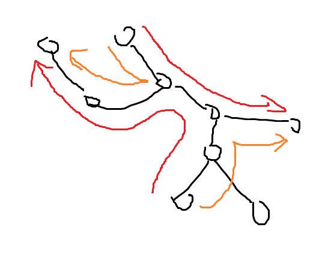

# 20231003 B 组模拟赛 题解

## 前言

这场爆大零，总结下来是基础知识不牢固导致卡 T1 最后一步树形背包板子，以后有时间复习一下。

[密码是通用密码，大小写敏感](../files/20231003.rar)

## T1

首先容易发现一个性质，所有通过某一条边的的松果必然方向相同（即不是全 $u\to v$ 就是全 $v\to u$），这个性质很容易猜出来也很容易证，考虑两个松果的路径经过某条边相向而行，那么必然可以吧两条路径的两半边连上删掉中间这条边，显然是不劣的。



上图中红色路径显然不如橙色路径。

那么每条边就只有一个方向，容易想到树形 DP。

另外，由于要求方差最小，那么必然有 $sum\bmod n$ 个点最后的松果数是 $\left\lfloor\frac{sum}{n}\right\rfloor+1$，其余是 $\left\lfloor\frac{sum}{n}\right\rfloor$。

我们设 $dp_{i,j}$ 表示 $i$ 子树内有 $j$ 个 $\left\lfloor\frac{sum}{n}\right\rfloor+1$ 的最小代价。容易发现我们很容易算出有多少个松果通过 $i-father_i$ 这条边，可以直接预处理这个代价。

然后转移就是一个树形背包了。容易证明复杂度是 $O(n^2)$ 的。考虑树形背包是把很多东西放在一起，那么两个东西只会在 $\mathrm{lca}$ 处单独合并（其余地方都是捆绑销售），那么这样的合并只会发生 $O(n^2)$ 次，所以是 $O(n^2)$ 的。

注意树形背包复杂度不要写假了。

/// details | 参考代码
    open: False
    type: success

```cpp
#include<bits/stdc++.h>
#define mem(a,b) memset(a,b,sizeof(a))
#define forup(i,s,e) for(i64 i=(s);i<=(e);i++)
#define fordown(i,s,e) for(i64 i=(s);i>=(e);i--)
using namespace std;
using i64=long long;
#define gc getchar()
inline i64 read(){
    i64 x=0,f=1;char c;
    while(!isdigit(c=gc)) if(c=='-') f=-1;
    while(isdigit(c)){x=(x<<3)+(x<<1)+(c^48);c=gc;}
    return x*f;
}
#undef gc
const i64 N=5005,inf=0x3f3f3f3f;
i64 t,n,a[N],sum,per,cnt;
struct edge{
	i64 v,w;
};
vector<edge> e[N];
i64 sz[N],siz[N],dp[N][N],st[N],ed[N];
void dfs(i64 x,i64 fa,i64 fw){
	sz[x]=a[x];siz[x]=1;
	mem(dp[x],0x3f);
	dp[x][0]=dp[x][1]=0;
	for(auto i:e[x]){
		i64 v=i.v,w=i.w;
		if(v==fa) continue;
		dfs(v,x,w);
		fordown(k,min(siz[x],cnt),0){
			forup(j,1,min(siz[v],cnt-k)){
				dp[x][j+k]=min(dp[x][j+k],dp[x][k]+dp[v][j]);
			}
			dp[x][k]+=dp[v][0];
		}
		sz[x]+=sz[v];
		siz[x]+=siz[v];
	}
	forup(i,0,siz[x]){
		dp[x][i]+=abs((siz[x]*per+i)-sz[x])*fw;
	} 
}
signed main(){
	t=read();
	while(t--){
		n=read();sum=0;
		forup(i,1,n){
			a[i]=read();
			sum+=a[i];
			e[i].clear();
		}
		per=sum/n;cnt=sum%n;
		forup(i,1,n-1){
			i64 u=read(),v=read(),w=read();
			e[u].push_back(edge{v,w});
			e[v].push_back(edge{u,w});
		}
		dfs(1,0,0);
		printf("%lld\n",dp[1][cnt]);
	}
}
```

///

## T2

一道很奇怪，又简单又难的题。

首先一眼望过去不容易看出复杂度小于 $O(r)$ 的做法，先考虑特殊情况应该怎么做。

在此之前，我们注意到或有一个很好的性质，即 $x|y\ge x,y$，因为 $x|y$ 必然包含 $x,y$ 中所有的 $1$，只会多不会少。

1. $l=1,r=x$

容易发现在这些数里有 $2^0,2^1\dots 2^{\left\lfloor\log x\right\rfloor}$ 次方这些（二进制下）的整数。而题目里又不限定你用几个数或起来，那么 $[1,2^{\left\lfloor\log x\right\rfloor+1}-1]$ 中所有整数均可取到，且显然取不到其它数。

2. $l\le 2^k,r=2^k$

容易发现 $[l,2^k-1]$ 中的数单独或起来只能得到 $[l,2^k-1]$（不会凭空出现更高位，又不可能变小），那么这些数只能和 $2^k$ 或起来得到 $[2^k+l,2^{k+1}-1]$，容易发现除去原本的 $[l,r]$ 以外只能得到这些数。

3. 那么我们可以把这两部分结合在一起。

首先容易发现 $l,r$ 高位的一段相同部分是没用的，那么我们先找到第一位不同的位。现在我们只讨论最高位为 $2^k$，且 $l,r$ 最高位不同的情况。

那么 $[l,2^k]$ 可以用第二种方法，$[2^k,r]$ 可以用第一种方法。

然后就做完了。

复杂度 $O(\log r)$。

/// details | 参考代码
    open: False
    type: success

```cpp
#include<bits/stdc++.h>
using namespace std;
using _=long long;
_ l,r,p,q;
signed main(){
	cin>>l>>r;
	if(l==r) return puts("1"),0;
	for(p=1ll<<60;;p>>=1){
		if((l/p)^(r/p)) break;
		l^=(l/p)*p;r^=(r/p)*p;
	}
	q=(1ll<<_(r-p?log2(r-p)+1:0));
	cout<<p-l+min(p-l+q,p);
}
```

///

## T3

挺有意思的题，我现在听说了三种不同的做法。但是我只会最简单暴力的一种。

首先核心思路是枚举 $\gcd$，设现在枚举的 $\gcd=g$，然后求出 $g$ 的倍数构成的序列的 $\mathrm{lcm}$ 的所有可能值相乘，然后就容易求解了。

容易发现 $g$ 的倍数个数的总和为调和级数,约为 $m\log m$，所以复杂度在这部分不会炸。那么我们只需要考虑如何比较快地计算 $g$ 的倍数构成的序列的 $\mathrm{lcm}$ 的所有可能值相乘即可。

$g$ 的倍数可以看做在值域大小为 $\left\lfloor\frac{m}{g}\right\rfloor$ 的问题中 $1$ 的倍数，下文均考虑值域为 $m$ 问题中 $1$ 的倍数的情况。

那么如何计算某个质数 $p$ 出现了多少次呢？可以用算概率时的常见套路，用总的 $\mathrm{lcm}$ 个数减去不含 $p$ 的 $\mathrm{lcm}$ 个数。总序列个数是简单的，$m^n$ 即可。对于 $p$ 未出现的序列个数，我们考虑用 $[1,m]$ 中所有不含质因子 $p$ 的数来组成序列，那么总数量就是 $(m-\left\lfloor\frac{m}{p}\right\rfloor)^{n}$。

但是容易发现 $\mathrm{lcm}$ 中 $p$ 可能以 $p^{c_p}$ 的形式出现，如何解决呢？其实也非常简单，用类似的方法计算 $p^2$ 出现了多少了次，容易发现 $p^2$ 的每一次出现必然在算 $p$ 的时候已经产生了 $p^1$ 的贡献了，那么对于每一次再多贡献一个 $p^1$ 即可，$p^3,p^4\dots$ 的计算也是同理。显然这部分复杂度是 $\log m$ 的。

注意到 $\left\lfloor\frac{m}{g}\right\rfloor$ 的取值只有 $O(\sqrt{m})$ 种，每一个取值里面质数的总个数显然不会超过 $\sum_{g=1}^{m}\left\lfloor\frac{m}{g}\right\rfloor$，由调和级数得这个和为 $m\log m$，由于算的时候要用快速幂，所以这部分的总复杂度是 $O(m\log m\log n)$。

但是这样求出来的序列 $\gcd$ 不一定恰好是 $g$，而可能是 $g$ 的任何倍数。这个其实也很简单，从大到小枚举 $g$ 然后简单容斥一下即可，复杂度 $O(m\log m\log P)$（$P$ 为模数，要求逆元的）。

/// details | 参考代码
    open: False
    type: success

```cpp
#include<bits/stdc++.h>
#define mem(a,b) memset(a,b,sizeof(a))
#define forup(i,s,e) for(int i=(s);i<=(e);i++)
#define fordown(i,s,e) for(int i=(s);i>=(e);i--)
using namespace std;
using i64=long long;
#define gc getchar()
inline int read(){
    int x=0,f=1;char c;
    while(!isdigit(c=gc)) if(c=='-') f=-1;
    while(isdigit(c)){x=(x<<3)+(x<<1)+(c^48);c=gc;}
    return x*f;
}
#undef gc
const int M=2e5+5,inf=0x3f3f3f3f,mod=998244353;
int n,m,phi,aaa=1;
int ksm(int a,int b,int M){
	int c=1;
	while(b){
		if(b&1) c=1ll*a*c%M;
		a=1ll*a*a%M;
		b>>=1;
	}
	return c;
}
int f[M],p[M],res[M];
int vv[M];
vector<int> pri;
void init(){
	forup(i,2,m){
		if(!vv[i]){
			pri.push_back(i);
		}
		for(auto j:pri){
			if(i*j>m) break;
			vv[i*j]=1;
			if(i%j==0) break;
		}
	}
}
int getr(int m){
	if(~res[m]) return res[m];
	int ans=1,tot=ksm(m,n,mod-1);
	for(auto j:pri){
		if(j>m) break;
		for(i64 t=j;t<=m;t*=j){
			ans=1ll*ans*ksm(j,(tot+mod-1-ksm(m-m/t,n,mod-1))%(mod-1),mod)%mod;
		}
	}
	res[m]=ans;
	return ans;
}
signed main(){
	n=read();m=read();
	init();
	mem(res,-1);
	fordown(g,m,1){
		p[g]=1ll*getr(m/g)*ksm(g,ksm(m/g,n,mod-1),mod)%mod;
		f[g]=p[g];
		for(int gg=g*2;gg<=m;gg+=g){
			f[g]=1ll*f[g]*ksm(f[gg],mod-2,mod)%mod;
		}
		aaa=1ll*aaa*ksm(f[g],g,mod)%mod;
	}
	printf("%d\n",aaa);
}
```

///

## T4

这题洛谷有削弱版，$n\le 50$，是紫，CF*2600。但这道题 $n\le 1000$。

容易发现最后连出来的图必然是一层一层，每一层与 $1$ 的距离相等的，且每一层的结点是相邻的，并且除去点 $1$，每个点会与前一层连**恰好** $1$ 条边（多了就不止一条最短路了，少了最短路长度就不对了）。然后每一层内剩余的度数随意连边即可。

为方便叙述，我们称当前层还没用过的度数为“自由边”，容易发现，除了点 $1$ 外，每个点必定要向前连边，故本来的自由边就只有一条或两条。

那么我们的初步思路就是每次枚举一段 $[l,r]$，然后枚举这一段内部自己连的边数 $c$ 计算内部连边方案数，其余自由边向后连。

确定 $l,r$ 之后，我们就能确定自由边个数为 $1$ 的点数量为 $x$，个数为 $2$ 的点数量为 $y$。

首先我们考虑内部的连边情况。把自由边为 $2$ 的点拆成两个点，那么连边方案数就是：

$$\frac{(x+2y)!}{(x+2y-2c)!\times 2^c\times c!}$$

很好理解，首先选出 $2c$ 个数，然后除去每一对内部的顺序，再除以对与对的相对顺序。

但是这样是可能有自环与重边的，考虑容斥。

容易发现只有自由边为 $2$ 的点才可能有自环或重边，假如我们钦定 $s$ 个点有自环与重边，其中有 $p$ 对重边，$q$ 个自环（$s=2p+q$），那么我们从 $y$ 个点中选出它们的方案数就是：

$$\frac{y!\times 2^p}{(y-s)!\times p!\times q!\times 2^{p}}$$

上面要乘个 $2^p$，因为前面随意连边时把一个点 $u$ 拆成 $u_1,u_2$ 两个点来算的，那么重边 $u,v$ 就有 $(u_1,v_1)(u_2,v_2)$ 和 $(u_1,v_2)(u_2,v_1)$ 两种，共有 $p$ 组重边所以有 $2^p$ 种。然后上面的式子约分一下：

$$\frac{y!}{(y-s)!\times p!\times q!}$$

钦定 $s$ 个点后，其余 $c-s$ 个点随意连边的方案就是：

$$\frac{(x+2y-2s)!}{(x+2y-2c)!\times 2^{c-s}\times (c-s)!}$$

然后剩余自由边必定向 $[r+1,r+x+2y-2c]$ 中每个点上连一个。方案数就是 $(x+2y-2c)!$。

但是刚刚我们都忽略了一件事，虽然我们把二度点的两条自由边拆开了看做两个点，实际上它们是相同的！但多亏我们**刚才**没有发现。容易发现**现在**只要在最后乘一个 $\frac{1}{2^y}$，除去每一对的顺序即可。

故最终式子为：

$$\sum_{s=2p+q}^{s\in[0,\min(y,c)]}\frac{(-1)^{p+q}y!}{(y-s)!p!q!}\times \frac{(x+2y-2s)!}{(x+2y-2c)!2^{c-s}(c-s)!}\times (x+2y-2c)! \times \frac{1}{2^y}$$

然后可以化一化式子：

$$\sum_{s=2p+q}^{s\in[0,\min(y,c)]}\frac{(-1)^{p+q}(x+2y-2s)!y!}{p!q!(y-s)!2^y(c-s)!2^{c-s}}$$

我们发现对于相同的 $s$，$\frac{(-1)^{p+q}}{p!q!}$ 是固定的。那么我们可以预处理 $v_s=\frac{(-1)^{p+q}}{p!q!}$，上式就能简化为：

$$\sum_{s=0}^{\min(y,c)}\frac{v_s(x+2y-2s)!y!}{(y-s)!2^y(c-s)!2^{c-s}}$$

那么我们就可以 DP 了。设 $dp_{i,j}$ 表示前 $i$ 个分好层，确定自由边连法，下一层长度为 $j$ 的方案数。转移就是从 $dp_{i,j}$ 转移到 $dp_{i+j,x+2y-2c}$。其中 $x,y$ 为 $[i+1,i+j]$ 中一度点与二度点的个数，$c$ 为枚举的下一层内部连边个数。

但是这样有个问题，我们需要枚举 $i,j,c,s$ 四个值，复杂度就是 $O(n^4)$ 的。怎么优化呢？这里需要用到一个小 Trick，我称之为“分部转移”。我们先再化一化式子：

$$\sum_{s=0}^{\min(y,c)}\frac{v_s(x+2y-2s)!y!}{(y-s)!2^y}\times \frac{1}{(c-s)!2^{c-s}}$$

然后我们不看已知量：

$$\sum_{s=0}^{\min(\dots,c)}\frac{v_s(\dots2s)!\dots}{\dots}\times \frac{1}{(c-s)!2^{c-s}}$$

容易发现前一半只和 $s$ 有关，后一半只和 $(c-s)$ 有关。

那么我们就可以考虑分部转移，先从 $dp_{i,j}$ 转移到 $f_{i+j,x+2y-2s}$。在 $i'=i+j$ 处，再从 $g_{i',j'-2(c-s)}$ 转移到 $g_{i',j'}$，这样只需要分开枚举 $s$ 和 $c-s$ 即可。

具体来说：

$$\forall b\in\left[0,\left\lfloor\frac{j}{2}\right\rfloor\right],dp_{i,j}\gets g_{i,j-b}\times \frac{1}{b!2^{b}}$$
$$\forall s\in[0,y],g_{i+j,x+2y-2s}\gets dp_{i,j}\times \frac{v_s(x+2y-2s)!y!}{(y-s)!2^y}$$

然后复杂度就是 $O(n^3)$ 的了，空间复杂度 $O(n^2)$。

这道题怪就怪在 $O(n^3)$ 能过 $1000$。而且我大常数居然也只跑了 $400ms$。

/// details | 参考代码
	open: False
	type: success

```cpp
#include<bits/stdc++.h>
#define mem(a,b) memset(a,b,sizeof(a))
#define forup(i,s,e) for(int i=(s);i<=(e);i++)
#define fordown(i,s,e) for(int i=(s);i>=(e);i--)
using namespace std;
#define gc getchar()
inline int read(){
    int x=0,f=1;char c;
    while(!isdigit(c=gc)) if(c=='-') f=-1;
    while(isdigit(c)){x=(x<<3)+(x<<1)+(c^48);c=gc;}
    return x*f;
}
#undef gc
const int N=2005,mod=1e9+7;
int n,d[N],dp[N][N],g[N][N],v[N];
int fact[N],finv[N];
int inv2=(mod+1)/2,pinv[N];
int ksm(int a,int b){
	int c=1;
	while(b){
		if(b&1) c=1ll*a*c%mod;
		a=1ll*a*a%mod;
		b>>=1;
	}
	return c;
}
signed main(){
	n=read();
	forup(i,1,n){
		d[i]=read();
	} 
	fact[0]=1;
	forup(i,1,n*2){
		fact[i]=1ll*fact[i-1]*i%mod;
	}
	finv[n*2]=ksm(fact[n*2],mod-2);
	fordown(i,n*2-1,0){
		finv[i]=1ll*finv[i+1]*(i+1)%mod;
	}
	pinv[0]=1;
	forup(i,1,n){
		pinv[i]=1ll*pinv[i-1]*inv2%mod;
	}
	forup(s,0,n){
		forup(p,0,s/2){
			int q=s-p*2;
			v[s]=(v[s]+1ll*(((p+q)&1)?mod-1:1)*finv[p]%mod*finv[q]%mod)%mod;
		}
	}
	dp[1][d[1]]=1;
	forup(i,1,n){
		int x=0,y=0;
		forup(j,0,i*2){
			if(!g[i][j]) continue;
			forup(dec,0,j>>1){
				dp[i][j-(dec<<1)]=(dp[i][j-(dec<<1)]+1ll*g[i][j]*pinv[dec]%mod*finv[dec]%mod)%mod;
			}
		}
		forup(j,1,n-i){
			if(d[i+j]==2) ++x;
			else ++y;
			if(!dp[i][j]) continue;
			forup(s,0,y){
				int xx=1ll*fact[y]%mod*fact[x+2*y-2*s]%mod*v[s]%mod*finv[y-s]%mod*pinv[y]%mod;
				g[i+j][x+2*y-2*s]=(g[i+j][x+2*y-2*s]+1ll*dp[i][j]*xx)%mod;
			}
		}
	}
	printf("%d\n",dp[n][0]);
}
```

///