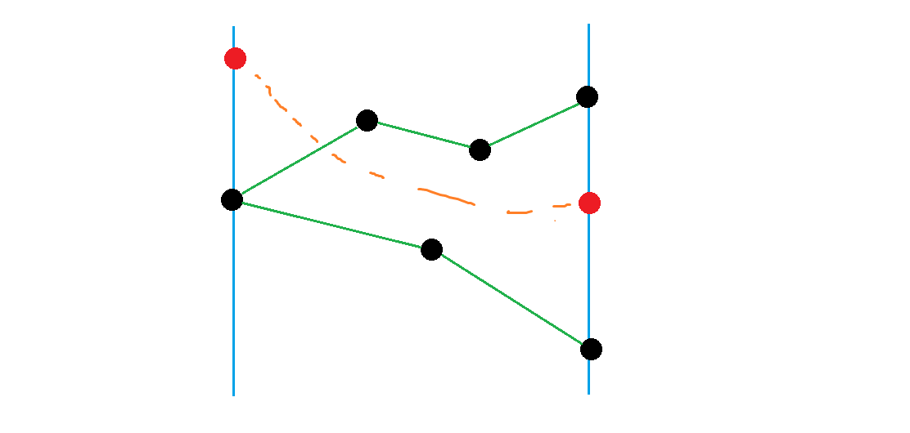
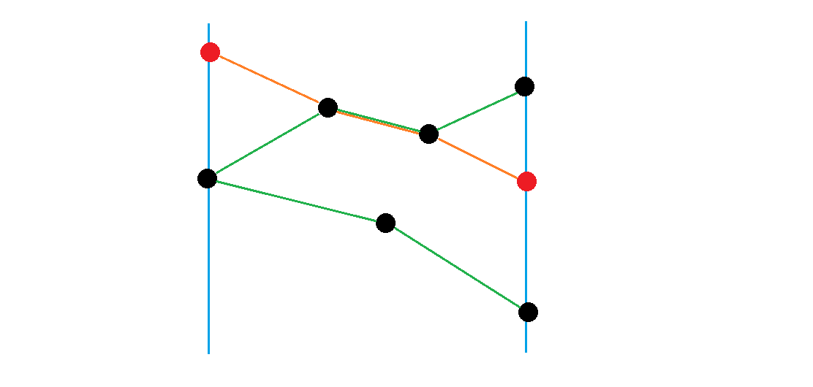
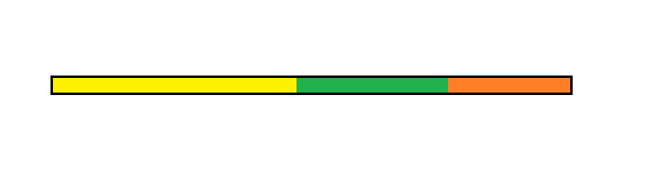

# 20231010 B 组模拟赛 题解

## 前言

这场我记得 T1 没看到“保证边在交点以外的任何地⽅不相交”这句话（其实是看到了，但是没看懂这句话是啥意思），然后 T4 是原题但是赛时没写出来，记得当时好像被初三老哥薄纱了。

然后这场四道都是原题，一看就是 h 先生的模拟赛。

[密码是通用密码](../files/20231010.rar)

## T1

首先可以 $O(n)$ DFS 一遍给能从东侧到达的所有点染色，然后就只关注这些染了色的点了，把其它点全删掉，下文默认所有点都能从东侧到达。

注意这句话：

> 保证边在结点以外的任何地⽅不相交

这是什么意思？我们画一张图：



假如黑色点和绿色边是已知的，然后存在一条路径从左侧红色点连到右侧红色点（橙色虚线）。由于边不相交，这就说明橙色路径中必定不和绿色路径相交，也就是必定经过黑色点。



比如可能是这样的。

这说明什么？若存在两条路径 $u\to x,v\to y$ 相交，那么 $u$ 也能到达 $y$，$v$ 也能到达 $x$。那么考虑再进一步，容易发现，东侧点某个点 $u$ 必定能到达西侧的一整个连续的区间（或者无法到达西侧）。

那么就简单了，首先由于我们只关注连通性，可以缩掉强连通分量，然后就是一个 DAG 了，那么我们可以按反图的拓扑序 DP，维护每个强连通分量能到达的西侧最高点和最低点，然后把编号相减即可。具体转移很简单，不做赘述。

貌似有不用缩点的办法，但是我不太懂。

/// details | 参考代码
    open: False
    type: success

```cpp
#include<bits/stdc++.h>
#define mem(a,b) memset(a,b,sizeof(a))
#define forup(i,s,e) for(int i=(s);i<=(e);i++)
#define fordown(i,s,e) for(int i=(s);i>=(e);i--)
using namespace std;
using pii=pair<int,int>;
#define fi first
#define se second
#define mkp make_pair
#define gc getchar()
inline int read(){
    int x=0,f=1;char c;
    while(!isdigit(c=gc)) if(c=='-') f=-1;
    while(isdigit(c)){x=(x<<3)+(x<<1)+(c^48);c=gc;}
    return x*f;
}
#undef gc
const int N=3e5+5,inf=0x3f3f3f3f;
int dp[2][N],n,m,a,b,x[N],y[N],rd[N],ans[N];
int mp[N];
struct edge{
	int u,v;
};
vector<edge> sve;
vector<int> e[N],re[N],est[N];
int dfn[N],low[N],Tm,ist[N],csc,blg[N];
stack<int> stk;
queue<int> q;
vector<pii> eseq;
int vis[N];
void dfs1(int u){
	vis[u]=1;
	if(x[u]==a){
		eseq.push_back(mkp(y[u],u));
	}
	for(auto i:e[u]){
		if(vis[i]) continue;
		dfs1(i);
	}
}
void Tarjan(int j){
	low[j]=dfn[j]=++Tm;
	ist[j]=1;stk.push(j);
	for(auto i:e[j]){
		if(!vis[i]) continue;
		if(!dfn[i]){
			Tarjan(i);
			low[j]=min(low[j],low[i]);
		}else if(ist[i]){
			low[j]=min(low[j],dfn[i]);
		}		
	}
	if(dfn[j]==low[j]){
		++csc;
		while(stk.top()!=j){
			int u=stk.top();
			blg[u]=csc;
			ist[u]=0;
			if(x[u]==a){
				dp[0][csc]=min(dp[0][csc],mp[u]);
				dp[1][csc]=max(dp[1][csc],mp[u]);
			}
			if(x[u]==0){
				est[csc].push_back(u);
			}
			stk.pop();
		}
		blg[j]=csc;
		ist[j]=0;
		if(x[j]==a){
			dp[0][csc]=min(dp[0][csc],mp[j]);
			dp[1][csc]=max(dp[1][csc],mp[j]);
		}
		if(x[j]==0){
			est[csc].push_back(j);
		}
		stk.pop();
	}
}
signed main(){
	n=read();m=read();a=read();b=read();
	mem(dp[0],0x3f);
	forup(i,1,n){
		x[i]=read();y[i]=read();
	}
	forup(i,1,m){
		int u=read(),v=read(),k=read();
		e[u].push_back(v);
		sve.push_back(edge{u,v});
		if(k==2){
			e[v].push_back(u);
		}
	}
	forup(i,1,n){
		if(x[i]==0){
			dfs1(i);
		}
	}
	sort(eseq.begin(),eseq.end());
	forup(i,0,eseq.size()-1){
		mp[eseq[i].se]=i+1;
	}
	forup(i,1,n){
		if(vis[i]&&!dfn[i]) Tarjan(i);
	}
	for(auto i:sve){
		if(!vis[i.u]||!vis[i.v]) continue;
		int u=blg[i.u],v=blg[i.v];
		if(u==v) continue;
		re[v].push_back(u);
	}
	forup(i,1,csc){
		sort(re[i].begin(),re[i].end());
		re[i].erase(unique(re[i].begin(),re[i].end()),re[i].end());
		for(auto j:re[i]){
			rd[j]++;
		}
	}
	while(q.size()) q.pop();
	forup(i,1,csc){
		if(rd[i]==0) q.push(i);
	}
	while(q.size()){
		int u=q.front();q.pop();
		for(auto i:re[u]){
			rd[i]--;
			if(rd[i]==0) q.push(i);
			dp[0][i]=min(dp[0][i],dp[0][u]);
			dp[1][i]=max(dp[1][i],dp[1][u]);
		}
	}
	forup(i,1,csc){
		for(auto j:est[i]){
			ans[j]=max(0,dp[1][i]-dp[0][i]+1);
		}
	}
	vector<pii> res;
	forup(i,1,n){
		if(x[i]==0){
			res.push_back(mkp(y[i],ans[i]));
		}
	}
	sort(res.begin(),res.end(),greater<pii>());
	for(auto i:res){
		printf("%d\n",i.se);
	}
}
```


///

## T2

期望题（还是离散型的），赛时直接跳了。但貌似暴力很好打的样子，痛失暴力分。

首先注意提示中的这句话：

> 对于 $n$ 个 $[0,1]$ 之间的随机变量 $x_1,x_2,\dots,x_n$，第 $k$ ⼩的那个的期望值是 $\frac{k}{n+1}$。

他给这个提示肯定是有用的，容易发现我们只要求出最小生成树上最大的那条边的**排名**取到 $k\in[1,m]$ 的概率分别是多少，然后乘以贡献相加即可。

那么假如我们按边权从小到大加边，当整张图第一次联通的时候，正在加的这条边就会产生贡献。形象化的，把恰好加到第 $n$ 条边时整张图首次联通的概率记作 $P(x=n)$，那么答案就是 $\sum_{k=0}^m\frac{k}{m+1}P(x=k)=\frac{1}{m+1}\sum_{k=0}^mkP(x=k)$。套路地，转化为 $\frac{1}{m+1}\sum_{k+0}^mP(x>k)$，其中 $P(x>k)$ 表示加到 $k$ 条边时整张图仍不连通的概率。

由于 $n$ 很小，考虑状压，这里开始就非常巧妙了。设 $f_{i,msk}$ 表示加入了 $i$ 条边，每条边的左右端点都在 $msk$ 中，使 $msk$ 不连通的方案数，$g_{i,msk}$，表示连通的方案数。为方便叙述，设 $h(msk)$ 表示左右端点都在 $msk$ 内的边的总数，易得（？）转移方程：

$$f_{i,msk}=\sum_{S\subsetneq msk\land p\in S}\sum_{j=0}^ig_{j,S}\dbinom{h(msk-S)}{i-j}$$

其中 $p$ 是随意钦定的一个点，满足 $p\in msk$。

首先，上面的意思是把 $msk$ 分成 $S,msk-S$ 两个集合，然后钦定两个集合之间不连边，然后 $S$ 内部用 $j$ 条边连通，其余随意连边。

至于为什么要钦定一个 $p$，容易发现 $msk-S$ 是有可能连通的，如果不钦定会在 $j'=i-j$ 时将当前情况重复计算，如果钦定连通的那一半包含某个点，由于每个点必然属于其中一边，那么就会自动去掉重复的情况。而在每种情况下，钦定的 $p$ 必然属于某个连通块，而 $S$ 显然能取遍 $p$ 可能所属的所有连通块，这样就不重不漏了。

那么如何求 $g$ 呢？这其实非常简单，因为显然 $f_{i,msk}+g_{i,msk}=\dbinom{h(msk)}{i}$，$g$ 可以直接计算。于是就做完了，复杂度 $O(3^nm^2)$。

/// details | 参考代码
    open: False
    type: success

```cpp
#include<bits/stdc++.h>
#define mem(a,b) memset(a,b,sizeof(a))
#define forup(i,s,e) for(i64 i=(s);i<=(e);i++)
#define fordown(i,s,e) for(i64 i=(s);i>=(e);i--)
using namespace std;
using i64=long long;
#define gc getchar()
inline i64 read(){
    i64 x=0,f=1;char c;
    while(!isdigit(c=gc)) if(c=='-') f=-1;
    while(isdigit(c)){x=(x<<3)+(x<<1)+(c^48);c=gc;}
    return x*f;
}
#undef gc
const i64 N=10,M=55;
i64 n,m,al;
i64 sz[1<<N],f[1<<N][M],g[1<<N][M];
i64 C[M][M];
double ans;
signed main(){
	n=read();m=read();
	al=(1<<n)-1;
	forup(i,1,m){
		i64 u=read()-1,v=read()-1;
		sz[(1<<u)|(1<<v)]++;
	}
	forup(i,0,m){
		C[i][0]=1;
		forup(j,1,i){
			C[i][j]=C[i-1][j-1]+C[i-1][j];
		}
	}
	forup(i,0,n-1){
		forup(msk,0,al){
			if(msk&(1<<i)){
				sz[msk]+=sz[msk^(1<<i)];
			}
		}
	}
	forup(i,0,al){
		if(i==(i&-i)){
			f[i][0]=0;
			g[i][0]=1;
		}else{
			f[i][0]=1;
			g[i][0]=0;
		}
	}
	forup(msk,1,al){
		i64 p=msk&-msk;
		forup(i,1,m){
			if(i>sz[msk]){
				g[msk][i]=f[msk][i]=0;
				continue;
			}
			for(i64 ss=msk&(msk-1);ss;ss=(ss-1)&msk){
				if(!(ss&p)) continue;
				forup(j,0,i){
					f[msk][i]+=g[ss][j]*C[sz[msk^ss]][i-j];
				}
			}
			g[msk][i]=C[sz[msk]][i]-f[msk][i];
		}
	}
	forup(i,0,m){
		ans+=1.0*f[al][i]/C[m][i];
	}
	printf("%.6lf\n",ans/(m+1));
}
```

///

## T3

挺板的数据结构题，但是赛后没看题解改出来了，中间大部分维护思路是在研学的时候想的，自己独立发明了线段树维护历史总和，感觉自己屌爆了。

首先考虑最大值怎么维护，最小值类似。

我们可以单调栈求出 $i$ 左侧最近的大于 $a_i$ 的位置 $L_i$，右侧第一个 $R_i$，那么 $i$ 在 $l\in(L_i,i],r\in [i,R_i)$ 的区间 $[l,r]$ 中会产生贡献，如果把区间按 $l$ 为纵坐标 $r$ 为横坐标放在矩阵上就是一个矩形，可以扫描线维护。

那么题意就转化成了有若干个三元组 $((x_1,y_1),(x_2,y_2),v)$，表示两点围成的矩形中所有点 $a_{i,j}$ 的权值都加 $v$，然后查询某矩形内所有点权值和。

那么可以把修改和查询都拆成两条垂直线段 $(x_1,y_1)-(x_1,y_2),(x_2,y_1)-(x_2,y_2)$，然后扫描线维护区间历史总和（即扫描到第 $i$ 列时 $v_i=\sum_{j=1}^ia_{i,j}$），然后前缀和减一减就完事了。

那么考虑如何维护，首先我们每个区间维护的东西形如这样：



其中不同颜色的交界表示一个修改操作。

容易发现在上一次修改之前（不包含修改的那一刻）的历史总和是固定，后面不会再改变的，但是最后的橙色那段长度是随时间递增的。

那么容易想到对每个区间维护三个值：**上一次修改之前的总和** $hsum$，**上一次修改的时间** $modi$，**当前值（即橙色部分每个切片的值）** $sum$，然后查询时下传当前的时间 $T$，区间历史总和就是 $hsum+(T-modi+1)\times sum$。

接下来考虑如何修改。首先考虑合并怎么写，其实很好想，上次修改的时间是两个儿子取较大值，那么 $hsum$ 就要加上另一边在差的这段时间的贡献，可以自己想一想。

接下来是难点，如何下传懒标记（因为你要区间修改嘛）。如果你稍微熟悉一点线段树，就会发现懒标记是一段时间的积累。也就是说，懒标记也要维护一个形如上面那条色彩斑斓的东西的玩意。

另外你也容易发现区间加的懒标记维护的是一段时间的**增量**，那么我们维护四个值：**懒标记的开始时间** $stmark$，**懒标记的结束时间** $edmark$，**懒标记总增量** $smark$，**增量从开始到结束的总和** $mark$。然后下传懒标记时，对区间历史总和的贡献就是 $(smark+sum\times (ed-modi))\times len$，其中 $len$ 是区间长度。

至于懒标记下传给懒标记，仿照这个即可，不多做赘述了。

然后我突然发现其实不需要维护懒标记开始时间，鉴定为研学的时候没纸没笔脑子秀逗导致的，但是代码懒得改了。

复杂度 $O(n\log n)$，常数不小。

/// details | 参考代码
	open: False
	type: success

```cpp
#include<bits/stdc++.h>
#define mem(a,b) memset(a,b,sizeof(a))
#define forup(i,s,e) for(i64 i=(s);i<=(e);i++)
#define fordown(i,s,e) for(i64 i=(s);i>=(e);i--)
using namespace std;
using i64=long long;
#define gc getchar()
inline i64 read(){
    i64 x=0,f=1;char c;
    while(!isdigit(c=gc)) if(c=='-') f=-1;
    while(isdigit(c)){x=(x<<3)+(x<<1)+(c^48);c=gc;}
    return x*f;
}
#undef gc
const i64 N=1e5+5,n=1e5,mod=1e9;
i64 q,mnl[N],mxl[N],mnr[N],mxr[N];
i64 ans[N],a[N],m1,m2;
struct Node{
	i64 l,r,pos,v;
};
struct SegTree{
	#define mid ((l+r)>>1)
	#define ls id<<1
	#define rs id<<1|1
	#define lson l,mid,ls
	#define rson mid+1,r,rs
	private:
		i64 querysum[N<<2],modi[N<<2],hsum[N<<2];
		i64 stmark[N<<2],edmark[N<<2],smark[N<<2],mark[N<<2];
		void _PushUp(i64 id){
			modi[id]=max(modi[ls],modi[rs]);
			querysum[id]=querysum[ls]+querysum[rs];
			hsum[id]=hsum[ls]+hsum[rs]+querysum[rs]*(modi[id]-modi[rs])+querysum[ls]*(modi[id]-modi[ls]);
		}
		void _Modify(i64 id,i64 len,i64 Tm,i64 val){
			hsum[id]+=querysum[id]*(Tm-modi[id]);
			querysum[id]+=val*len;
			modi[id]=Tm;
			if(stmark[id]==0){
				smark[id]=0;
				mark[id]=val;
				stmark[id]=edmark[id]=Tm;
			}else{
				smark[id]+=mark[id]*(Tm-edmark[id]);
				mark[id]+=val;
				edmark[id]=Tm;
			}
		}
		void _Mark_Modi(i64 id,i64 len,i64 st,i64 ed,i64 sum,i64 val){
			hsum[id]+=querysum[id]*(ed-modi[id]);
			hsum[id]+=sum*len;
			querysum[id]+=val*len;
			modi[id]=ed;
			if(stmark[id]==0){
				smark[id]=sum;
				mark[id]=val;
				stmark[id]=st;
				edmark[id]=ed;
			}else{
				smark[id]+=mark[id]*(ed-edmark[id]);
				smark[id]+=sum;
				mark[id]+=val;
				edmark[id]=ed;
			}
		}
		void _PushDown(i64 id,i64 len){
			_Mark_Modi(ls,((len+1)>>1),stmark[id],edmark[id],smark[id],mark[id]);
			_Mark_Modi(rs,len>>1,stmark[id],edmark[id],smark[id],mark[id]);
			mark[id]=stmark[id]=edmark[id]=smark[id]=0;
		}
	public:
		void Update(i64 L,i64 R,i64 Tm,i64 X,i64 l=1,i64 r=n,i64 id=1){
			if(L<=l&&r<=R){
				_Modify(id,r-l+1,Tm,X);
				return;
			}
			if(stmark[id]!=0) _PushDown(id,r-l+1);
			if(L<=mid) Update(L,R,Tm,X,lson);
			if(mid< R) Update(L,R,Tm,X,rson);
			_PushUp(id);
		}
		i64 Query(i64 L,i64 R,i64 Tm,i64 l=1,i64 r=n,i64 id=1){
			if(L<=l&&r<=R){
				return hsum[id]+querysum[id]*(Tm-modi[id]+1);
			}
			if(stmark[id]!=0) _PushDown(id,r-l+1);
			i64 res=0;
			if(L<=mid) res+=Query(L,R,Tm,lson);
			if(mid< R) res+=Query(L,R,Tm,rson);
			return res;
		}
}mt;
vector<Node> op[N],que[N];
void init(){
	m1=m2=1;
	forup(i,1,n){
		m1=m1*1023%mod;
		m2=m2*1025%mod;
		a[i]=m1^m2;
	}
	stack<i64> mns,mxs;
	mns.push(0);mxs.push(0);
	forup(i,1,n){
		while(mns.top()!=0&&a[mns.top()]>=a[i]) mns.pop();
		mnl[i]=mns.top()+1;
		mns.push(i);
		while(mxs.top()!=0&&a[mxs.top()]<=a[i]) mxs.pop();
		mxl[i]=mxs.top()+1;
		mxs.push(i);
	}
	while(mns.size()) mns.pop();
	while(mxs.size()) mxs.pop();
	mns.push(n+1);mxs.push(n+1);
	fordown(i,n,1){
		while(mns.top()!=n+1&&a[mns.top()]>a[i]) mns.pop();
		mnr[i]=mns.top()-1;
		mns.push(i);
		while(mxs.top()!=n+1&&a[mxs.top()]<a[i]) mxs.pop();
		mxr[i]=mxs.top()-1;
		mxs.push(i);
	}
	forup(i,1,n){
		op[mnl[i]].push_back(Node{i,mnr[i],0,-a[i]});
		op[i+1].push_back(Node{i,mnr[i],0,a[i]});
		op[mxl[i]].push_back(Node{i,mxr[i],0,a[i]});
		op[i+1].push_back(Node{i,mxr[i],0,-a[i]});
	}
}
signed main(){
	init();
	vector<i64> lsh;
	forup(i,1,10){
		lsh.push_back(a[i]);
	}
	sort(lsh.begin(),lsh.end());
	lsh.erase(unique(lsh.begin(),lsh.end()),lsh.end());
	q=read();
	forup(i,1,q){
		i64 l1=read(),r1=read(),l2=read(),r2=read();
		que[l1-1].push_back(Node{l2,r2,i,-1});
		que[r1].push_back(Node{l2,r2,i,1});
	}
	forup(i,1,n){
		for(auto j:op[i]){
			i64 l=j.l,r=j.r,v=j.v;
			mt.Update(l,r,i,v);
		}
		for(auto j:que[i]){
			i64 l=j.l,r=j.r,v=j.v,pos=j.pos;
			ans[pos]+=mt.Query(l,r,i)*v;
		}
	}
	forup(i,1,q){
		printf("%lld\n",ans[i]);
	}
}
```

///

## T4

首先，题给你的是个内向基环森林，这点后面会用到。

考虑如何构造，容易发现加的所有边都从点 $1$ 指出必然是不劣的，且基环树的叶子结点必须引一条边。

那么每次找到最深的距离大于 $k$/无法到达（但不能在环上）的点连边，容易发现你连得每条边都是必要的，即这样必定是最优解。

接下来就只有环没处理了，那么问题就转化成了一个环上有若干个黑点与若干个白点，然后你一次操作可以把从指定点 $i$ 开始往后连续的 $k-1$ 个点全部染黑，问把环全染黑的最小操作数。

这个有非常巧妙的贪心。容易发现连续 $k-1$ 个白点（指的不是紧挨着，两个连续的白点可能越过多个黑点），中必定至少有一个要操作一次（不然就涂不完了）。而你涂色操作可以每次跳 $k$ 个 $O(\frac{n}{k})$ 算出一个环至少要操作多少次才完成，那么复杂度就是 $O(k\times \frac{n}{k})=O(n)$！那么我们就能愉快地通过此题了（可能有一些操作实现比较复杂）。

/// details | 参考代码
	open: False
	type: success

```cpp
#include<bits/stdc++.h>
#define mem(a,b) memset(a,b,sizeof(a))
#define forup(i,s,e) for(int i=(s);i<=(e);i++)
#define fordown(i,s,e) for(int i=(s);i>=(e);i--)
using namespace std;
#define gc getchar()
inline int read(){
    int x=0,f=1;char c;
    while(!isdigit(c=gc)) if(c=='-') f=-1;
    while(isdigit(c)){x=(x<<3)+(x<<1)+(c^48);c=gc;}
    return x*f;
}
#undef gc
const int N=5e5+5,inf=0x3f3f3f3f;
int n,m,co[N],inc[N],ans;
int to[N],rd[N],dis[N];
int dfn[N],low[N],Tm,ist[N];
stack<int> stk;
vector<vector<int> > cir;
void Tarjan(int x){
	low[x]=dfn[x]=++Tm;
	ist[x]=1;stk.push(x);
	if(!dfn[to[x]]){
		Tarjan(to[x]);
		low[x]=min(low[x],low[to[x]]);
	}else if(ist[to[x]]){
		low[x]=min(low[x],dfn[to[x]]);
	}
	if(dfn[x]==low[x]){
		vector<int> vec;
		while(stk.top()!=x){
			vec.push_back(stk.top());
			inc[stk.top()]=1;
			ist[stk.top()]=0;
			stk.pop();
		}
		vec.push_back(x);
		inc[x]=1;
		ist[x]=0;
		stk.pop();
		if(vec.size()>1){
			reverse(vec.begin(),vec.end());
			cir.push_back(vec);
		}else{
			inc[x]=0;
		}
	}
}
queue<int> q;
signed main(){
	n=read();m=read();
	forup(i,1,n){
		int u=read(),v=read();
		to[u]=v;
		++rd[v];
	}
	mem(dis,0x3f);
	dis[1]=0;
	q.push(1);
	forup(i,1,n){
		if(!dfn[i]){
			Tarjan(i);
		}
		if(i!=1&&rd[i]==0){
			q.push(i);
			++ans;
			dis[i]=1;
		}
	}
	while(q.size()){
		int u=q.front();q.pop();
		if(dis[u]>m){
			if(inc[u]) continue;
			++ans;dis[u]=1;
		}
		co[u]=1;
		rd[to[u]]--;
		if(to[u]==1) continue;
		if(rd[to[u]]==0) q.push(to[u]);
		dis[to[u]]=min(dis[to[u]],dis[u]+1);
	}
	for(auto vec:cir){
		int sz=vec.size();
		vector<int> v1,nxt;
		int nd=inf;
		for(auto i:vec){
			nd=min(nd+1,dis[i]);
			if(nd<=m) v1.push_back(1);
			else v1.push_back(0);
		}
		forup(i,0,sz-1){
			v1.push_back(v1[i]);
		}
		nxt.resize(sz*2);
		int nw=inf,cnt=0,res=inf;
		fordown(i,sz*2-1,0){
			if(!v1[i]) nw=i;
			nxt[i]=nw;
		}
		int i=nxt[0];
		while(i<sz){
			int l=i,rr=0;
			++cnt;
			while(l<i+sz){
				++rr;
				if(l+m>=i+sz) break;
				l=nxt[l+m];
			}
			i=nxt[i+1];
			res=min(res,rr);
		}
		if(res==inf) res=0;
		ans+=res;
	}
	printf("%d\n",ans);
}
```

///