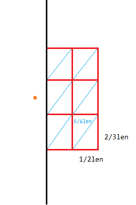

# 20231016 B 组模拟赛 题解

## 前言

这场赛时就写了 T1。

T2 $n\le 17$，结果赛时有位大哥写了超级无敌原神 $O(n)$ 写法（当然理所当然是错的，事后问他时他的解释是“我最终还是说服了自己”）。

T4 是神仙人类智慧题，有道削弱版原题是黑（甚至是 Ynoi 的，乐）。

[密码是通用密码](../files/20231016.rar)

## T1

考虑拓扑排序的过程，容易发现同一层的（就是顺序可以互相交换的）点不可能在一条简单路径上，那么不妨直接把关键点按拓扑序编号，然后对原图再跑一遍拓扑序，对每个点求出**以它结尾的路径能不能是关键点的一个前缀**，为了求这个还应该记一个对应前缀的长度。转移是简单的，不做赘述。

复杂度 $O(n)$。

/// details | 参考代码
    open: False
    type: success

```cpp
#include<bits/stdc++.h>
#define mem(a,b) memset(a,b,sizeof(a))
#define forup(i,s,e) for(int i=(s);i<=(e);i++)
#define fordown(i,s,e) for(int i=(s);i>=(e);i--)
using namespace std;
#define gc getchar()
inline int read(){
    int x=0,f=1;char c;
    while(!isdigit(c=gc)) if(c=='-') f=-1;
    while(isdigit(c)){x=(x<<3)+(x<<1)+(c^48);c=gc;}
    return x*f;
}
#undef gc
const int N=1e6;
int t,n,m,kk,dpt[N],pt[N],cs[N],rd[N],r1[N],pre[N];
int vis[N];
vector<int> e[N];
void init(){
	forup(i,1,n){
		e[i].clear();
		dpt[i]=pre[i]=-1;
		cs[i]=rd[i]=r1[i]=vis[i]=0;
	}
}
bool dfs(int x,int g){
	if(x==g) return true;
	if(dpt[x]==dpt[g]) return false;
	bool res=false;
	vis[x]=x;
	for(auto i:e[x]){
		if(vis[i]!=x){
			res|=dfs(i,g);
		}
	}
	return res;
}
bool cmp(int a,int b){
	return dpt[a]<dpt[b];
}
void solve(){
	n=read();m=read();
	init();
	forup(i,1,m){
		int u=read(),v=read();
		e[u].push_back(v);
		++rd[v];
	}
	kk=read();
	forup(i,1,kk){
		pt[i]=read();
	}
	vector<int> vec;
	forup(i,1,n){
		r1[i]=rd[i];
		if(rd[i]==0) vec.push_back(i);
	}
	int cnt=0;
	while(vec.size()){
		++cnt;
		vector<int> v1;
		v1.clear();
		for(auto x:vec){
			dpt[x]=cnt;
			for(auto i:e[x]){
				--rd[i];
				if(rd[i]==0){
					v1.push_back(i);
				}
			}
		}
		swap(vec,v1);
	}
	sort(pt+1,pt+kk+1,cmp);
	forup(i,1,kk){
		cs[pt[i]]=i;
	}
	vec.clear();
	forup(i,1,n){
		if(r1[i]==0) vec.push_back(i);
	}
	while(vec.size()){
		vector<int> v1;
		v1.clear();
		for(auto x:vec){
			if(cs[x]){
				if(cs[x]!=1&&pre[x]!=cs[x]-1){
					puts("No");
					return;
				}
				pre[x]=cs[x];
			}
			for(auto i:e[x]){
				pre[i]=max(pre[i],pre[x]);
				--r1[i];
				if(r1[i]==0){
					v1.push_back(i);
				}
			}
		}
		swap(vec,v1);
	}
	puts("Yes");
}
signed main(){
	t=read();
	while(t--){
		solve();
	}
}
```

///

## T2

这道题赛时写了个“看起来很对的假做法”挂成 $0$ 分了。

首先考虑把“区间操作”转化为差分序列上的“两个单点操作”（若区间右端点是序列右端点则是一个单点操作）。容易发现若差分序列异或和为 $0$ 则只需要 $n-1$ 次操作（考虑相邻两个操作一次），否则需要 $n$ 次操作（因为按之前的构造最后会剩一个数）。

那么容易发现，差分序列的每个子序列都满足这个性质，也就是说我们构造最优解可以考虑把完整序列分成一些子序列，然后每个异或和为 $0$ 的子序列都会产生 $-1$ 的贡献。

这个可以状压 dp 做，设 $dp_{msk}$ 表示子序列 $msk$ 的最小代价，然后转移是一个子集枚举，具体如何转移很简单，不做赘述。

复杂度 $O(2^nn+3^n)$。

/// details | 参考代码
    open: False
    type: success

```cpp
#include<bits/stdc++.h>
#define forup(i,s,e) for(_ i=(s);i<=(e);i++)
#define fordown(i,s,e) for(_ i=(s);i>=(e);i--)
using namespace std;
using _=long long;
#define gc getchar()
inline _ read(){
    _ x=0,f=1;char c;
    while(!isdigit(c=gc)) if(c=='-') f=-1;
    while(isdigit(c)){x=(x<<3)+(x<<1)+(c^48);c=gc;}
    return x*f;
}
#undef gc
_ n,a[17];
unsigned char dp[1<<17];
signed main(){
	n=read();
	forup(i,1,n) a[i]=read();
	fordown(i,n,1) a[i]^=a[i-1];
	dp[0]=0;
	forup(msk,1,(1<<n)-1){
		_ sum=0,cnt=0;
		forup(i,1,n){
			if(msk&(1<<(i-1))){
				sum^=a[i];
				++cnt;
			}
		}
		dp[msk]=cnt-(sum==0);
		for(_ nxt=msk;nxt;nxt=(nxt-1)&msk){
			dp[msk]=min((int)dp[msk],dp[nxt]+dp[msk^nxt]);
		}
	}
	printf("%d\n",dp[(1<<n)-1]);
}
```

///

## T3

树上点对距离，考虑点分治/点分树。

首先特殊性质 $1$ 是好做的，因为 $dis(y,b)$ 是一个定值，那么就是一个点分树板子了。

那么两个点应该如何做呢，有个比较容易想到的做法是开两棵点分树，对于一个点对 $(a,b)$ 存 $a$ 到 $a$ 的 $p_a$ 级祖先，$b$ 到 $b$ 的 $p_b$ 级祖先的距离之和，然后修改和查询都是 $\log^3$ 的（虽然两边都只有至多 $\log$ 级祖先，但还要考虑用什么容器存这个东西，不然会 MLE），总之就是过不了。

容易发现其他地方都无法优化，只有“用容器存”这一部分看起来有可能去掉。那么考虑离线下来。

具体来说，对 $a,x$ 做点分治，对于每次分治的连通块按时间顺序从前到后扫所有操作，把 $a,x$ 与连通块重心的距离分别挂到点分树上的 $b,y$ 上，然后在点分树上查找 $(y,b)$ 的距离加上挂上去的距离，由于我们求的是最小值，就可以不用考虑 $a,x$ 在连通块重心的同一子树的情况，因为必定会遇到某个连通块使得 $a,x$ 在不同子树上。

然后注意求距离需要用 $O(1)$ 的 $\mathrm{lca}$，不然还是 $O(n\log^3n)$，我代码里用的 dfs 序求 $\mathrm{lca}$。

复杂度 $O(n\log^2 n)$，常数巨大，跑的贼慢。代码不算太难写（虽然我写了 3.0kb），但有神仙只用 1.3kb 就搞定了，不懂为什么别人点分治写这么短。

破案了，别人一边求点分树一边写点分治，因为你点分树显然不会跳到更深的结点，这样常数还小了。但是我懒得改了。

/// details | 参考代码
    open: False
    type: success

```cpp
#include<bits/stdc++.h>
#define mem(a,b) memset(a,b,sizeof(a))
#define forup(i,s,e) for(int i=(s);i<=(e);i++)
#define fordown(i,s,e) for(int i=(s);i>=(e);i--)
using namespace std;
using i64=long long;
#define gc getchar()
inline int read(){
    int x=0,f=1;char c;
    while(!isdigit(c=gc)) if(c=='-') f=-1;
    while(isdigit(c)){x=(x<<3)+(x<<1)+(c^48);c=gc;}
    return x*f;
}
#undef gc
const int N=2e5+5;
const i64 inf=1e18;
int n,m,tp[N];
i64 ans[N];
struct edge{
	int v,w;
};
vector<edge> e[N];
int dfn[N],Tm,ST[18][N],f[N],dpt[N],lg[N];
i64 dis[N];
void dfs1(int x,int fa){
	dfn[x]=++Tm;
	ST[0][dfn[x]]=x;
	f[x]=fa;dpt[x]=dpt[fa]+1;
	for(auto i:e[x]){
		if(i.v==fa) continue;
		dis[i.v]=dis[x]+i.w;
		dfs1(i.v,x);
	}
}
void initlca(){
	dfs1(1,0);
	forup(i,1,17){
		forup(j,1,n-(1<<i)+1){
			if(dpt[ST[i-1][j]]<dpt[ST[i-1][j+(1<<(i-1))]]){
				ST[i][j]=ST[i-1][j];
			}else{
				ST[i][j]=ST[i-1][j+(1<<(i-1))];
			}
		}
	}
	lg[1]=0;
	forup(i,2,n){
		lg[i]=lg[i>>1]+1;
	}
}
int lca(int x,int y){
	if(x==y) return x;
	x=dfn[x];y=dfn[y];
	if(x>y) swap(x,y);
	++x;
	int len=lg[y-x+1];
	int r1=ST[len][x],r2=ST[len][y-(1<<len)+1],res;
	if(dpt[r1]<dpt[r2]) res=r1;
	else res=r2;
	return f[res];
}
i64 dist(int u,int v){
	return dis[u]+dis[v]-2*dis[lca(u,v)];
}
vector<int> vson[N];
int vfa[N],vrt;
int rt,als,sz[N],mx[N],vis[N];
void dfs3(int x,int fa){
	sz[x]=1;
	for(auto i:e[x]){
		if(i.v==fa||vis[i.v]) continue;
		dfs3(i.v,x);
		sz[x]+=sz[i.v];
	}
}
void dfs2(int x,int fa){
	mx[x]=als-sz[x];
	for(auto i:e[x]){
		if(vis[i.v]||i.v==fa) continue;
		dfs2(i.v,x);
		mx[x]=max(mx[x],sz[i.v]);
	}
	if(rt==-1||mx[x]<mx[rt]) rt=x;
}
void dfz(int x){
	vis[x]=1;
	dfs3(x,0);
	for(auto i:e[x]){
		if(vis[i.v]) continue;
		als=sz[i.v];rt=-1;
		dfs2(i.v,x);
		vfa[rt]=x;vson[x].push_back(rt);
		dfz(rt);
	}
}
void buildtree(){
	dfs3(1,0);
	als=n;rt=-1;
	dfs2(1,0);
	vrt=rt;
	dfz(rt);
}
struct Node{
	int tp,pos,b;
};
vector<Node> qu[N];
struct node{
	int pos,tp;
	i64 val;
	int b;
};
vector<node> nq;
i64 vdis[N];
void Insert(int x,i64 sd){
	int l=x;
	while(l){
		i64 dd=sd+dist(x,l);
		vdis[l]=min(vdis[l],dd);
		l=vfa[l];
	}
}
i64 Ask(int x){
	int l=x;
	i64 res=inf;
	while(l){
		res=min(res,vdis[l]+dist(x,l));
		l=vfa[l];
	}
	return res;
} 
void Erase(int x){
	int l=x;
	while(l){
		if(vdis[l]==inf) break;
		vdis[l]=inf;
		l=vfa[l];
	}
}
void dfs4(int x,int fa,i64 dis){
	for(auto i:qu[x]){
		nq.push_back(node{i.pos,i.tp,dis,i.b});
	}
	for(auto i:e[x]){
		if(vis[i.v]||i.v==fa) continue;
		dfs4(i.v,x,dis+i.w);
	}
}
bool cmp(node a,node b){
	return a.pos<b.pos;
}
void solve(int x){
	nq.clear();
	dfs4(x,0,0);
	sort(nq.begin(),nq.end(),cmp);
	for(auto i:nq){
		if(i.tp==1){
			Insert(i.b,i.val);
		}else{
			ans[i.pos]=min(ans[i.pos],i.val+Ask(i.b));
		}
	}
	for(auto i:nq){
		if(i.tp==1){
			Erase(i.b);
		}
	}
	vis[x]=1;
	for(auto i:vson[x]){
		solve(i);
	}
}
signed main(){
	n=read();m=read();
	forup(i,1,n-1){
		int u=read(),v=read(),w=read();
		e[u].push_back(edge{v,w});
		e[v].push_back(edge{u,w});
	}
	initlca();
	buildtree();
	forup(i,1,m){
		tp[i]=read();
		int a=read(),b=read();
		qu[a].push_back(Node{tp[i],i,b});
		ans[i]=inf;
	}
	forup(i,1,n){
		vdis[i]=inf;
	}
	mem(vis,0);
	solve(vrt);
	forup(i,1,m){
		if(tp[i]==2){
			if(ans[i]==inf){
				puts("-1");
			}else{
				printf("%lld\n",ans[i]);
			}
		}
	}
}
```

///

## T4

很有启发性的人类智慧题（这里不只是指这道题有神奇的乱搞做法，还因为这道题的整体思路真的太智慧了）。

首先如果不是区间查询，也不删点，那么是一道非常经典的 ~~人类智慧~~ 题，即平面最近点对。那道题大概是按 $x$ 排序后用一个类似 cdq 的做法来做。但这不重要，在这里我们关心的是中间合并两个区间的复杂度证明部分。

仔细考虑一下那道题是怎么做的。若要将 $l,r$ 两区间合并，首先考虑合并后答案必定小于等于 $len=\min(ans_l,ans_r)$，也就是说在只有两区间交界左右距离 $len$ 内的点才可能成为新的最近点对，然后每个点也只有往上下 $y$ 坐标差不超过 $len$ 的需要考虑，即**会影响答案的点并不多**，$l$ 中的每个点只用考虑 $r$ 中的一个 $2len\times len$ 的矩形。



对于左侧橙色点只用考虑右侧整个红色矩形内的点。

而假如如上图把红色大矩形分成 $6$ 份，容易发现某一份内若有超过一个点说明这两个点距离必定不超过 $\frac{5}{6}len$，那么 $len$ 就不是两边分别的最小距离（中的更小值）了。故每个左侧点只需要考虑与右侧至多六个点的距离。

然后考虑欧几里得距离换成切比雪夫距离，容易发现右边只需要分两块即可，但是这样分就有边界问题了（若所有点都在角落上仍然有六个有效点对），但无论怎么说，有效点对数显然不超过一个常数，可以考虑调整分的块数来取得更紧的下界。

---

接着考虑对于区间怎么做。对于区间我们显然不能再完整跑一遍那个类似于 cdq 分治的算法（不然复杂度就太劣了），也就是说我们在查询时无法找到一个确定的上界再做，也无法每次分成左右区间。那么怎么办呢？这里就要用人类智慧了。

首先处理上界问题，我们可以枚举这个上界，但是显然不能直接枚举值域，那么可以考虑枚举 $\log V$ 个上界，即所有 $2^k$。然后对于无法分成左右区间的问题，可以考虑把原平面划分成边长为 $2^k$ 的正方形，容易发现，若 $2^k\le ans <2^{k+1}$ 那么对应的点对必然在分成 $2^k$ 时相邻（八连通）的正方形中。而对于 $<2^k$，会在边长更小的时候被算到，而对于 $\ge 2^{k+1}$，会在边长更大的时候被算到。

而至于每一块，容易发现若一块内有超过 $4$ 个点那么答案必定会小于 $2^k$（考虑最坏情况是四个点在边角），也就是说对于一个点 $i$，只需要对于所有 $k$ 保留周围八块内每一块**最有可能在区间查询时产生贡献**的 $4$ 个点即可。

至于这个**最有可能在区间查询时产生贡献**，先考虑查询时要如何查，我们可以先按询问右端点升序排列，每次加入一个右端点对应的有效点对，这样右端点就必定小于等于 $r$ 了，那么对于左端点，可以用一个线段树维护，把点对挂在左端点上，这样就能左端点大于等于 $l$ 了。那此时容易发现，这个“最有可能产生贡献”其实就是保留点 $i$ 在序列上的前面离得最近的 $4$ 个点，因为若区间包含点 $i$ 和某个更远的点 $j$ 时，前面保留的 $4$ 个点显然会离 $j$ 更近（或者在 $k$ 更小时点对 $(i,j)$ 被统计到），而若区间不包含点 $j$ 或点 $i$，这个点对就不在查询区间内了。

---

再考虑删点如何维护。首先原本的最近点对两个端点显然必须删一个，不然必定不优（如果有多对最近点对其实是一样的，你可以随便钦定一对），那么就要维护删左端点和删右端点分别得到的两种“次近点对”（因为原点集次近点对可能和最近点对共用端点，所以两边都要考虑）。这就是一个线段树如何维护的问题了。另外由于你要删一个点所以每一块要额外多保留一个。

然后线段树如何维护，这其实是一个细节问题，但是我还是说一下。首先因为你是把点对挂在左端点上，那么对于叶子，删掉左端点后最近点对就变成了 $+\infty$，删右端点就是维护一个次小值。然后合并的时候要考虑一下左区间最小值右端点可能是右区间最小值的左/右端点，需要特判一下。那么我们需要对每个区间维护**最近点对**，**最近点对左右端点**，**删掉左右端点分别得到的新最小值**，共五个值，最好用结构体封装一下，因为你查询的时候也要合并这玩意。

代码有点难写，复杂度 $O(n\log^2 n)$，带一个 $8\times 5$ 的常数。

另外其实由于能卡掉的数据很难构造， ~~而且 OJ 上数据比较水~~ ，你每一块保留稍微少一点其实也能过， ~~比如我最终代码只保留了三个。~~

/// details | 参考代码
    open: False
    type: success

```cpp
#include<bits/stdc++.h>
#define mem(a,b) memset(a,b,sizeof(a))
#define forup(i,s,e) for(int i=(s);i<=(e);i++)
#define fordown(i,s,e) for(int i=(s);i>=(e);i--)
using namespace std;
#define fi first
#define se second
#define gc getchar()
inline int read(){
    int x=0,f=1;char c;
    while(!isdigit(c=gc)) if(c=='-') f=-1;
    while(isdigit(c)){x=(x<<3)+(x<<1)+(c^48);c=gc;}
    return x*f;
}
#undef gc
const int N=3e4+5,M=3e5+5,inf=0x3f3f3f3f;
int n,m,ans[M];
struct Node{
	int x,y;
	bool operator <(const Node &r)const{
		if(y!=r.y) return y<r.y;
		return x<r.x;
	}
}s[N];
struct rg{
	int x,y,pos;
	bool operator <(const rg &r)const{
		if(y!=r.y) return y<r.y;
		return x<r.x;
	}
}q[M];
map<Node,deque<int> > box;
vector<int> e[N];
struct tag{
	int mn,mnL,mnR,erL,erR;
	tag(int _l=0){
		erL=inf;
		mnL=_l;
		mnR=mn=erR=inf;
	}
};
tag operator +(const tag ls,const tag rs){
	tag res;
	if(ls.mnR==inf){
		return rs;
	}else if(rs.mnR==inf){
		return ls;
	}
	if(ls.mn<rs.mn){
		res.mn=ls.mn;
		res.mnL=ls.mnL;res.mnR=ls.mnR;
		res.erL=min(ls.erL,rs.mn);
		if(ls.mnR==rs.mnR){
			res.erR=min(ls.erR,rs.erR);
		}else if(ls.mnR==rs.mnL){
			res.erR=min(ls.erR,rs.erL);
		}else{
			res.erR=min(ls.erR,rs.mn);
		}
	}else{
		res.mn=rs.mn;
		res.mnL=rs.mnL;res.mnR=rs.mnR;
		if(rs.mnL==ls.mnR){
			res.erL=min(rs.erL,ls.erR);
		}else{
			res.erL=min(rs.erL,ls.mn);
		}
		if(rs.mnR==ls.mnR){
			res.erR=min(rs.erR,ls.erR);
		}else{
			res.erR=min(rs.erR,ls.mn);
		}
	}
	return res;
}
struct SegTree{
	#define mid ((l+r)>>1)
	#define lson l,mid,id<<1
	#define rson mid+1,r,id<<1|1
	tag tg[N<<2];
	void Build(int l=1,int r=n,int id=1){
		if(l==r){
			tg[id]=tag(l);
			return;
		}
		Build(lson);Build(rson);
		tg[id]=tg[id<<1]+tg[id<<1|1];
	}
	void Update(int P,int R,int Len,int l=1,int r=n,int id=1){
		if(l==r){
			if(R!=tg[id].mnR){
				if(Len<tg[id].mn){
					tg[id].erR=tg[id].mn;
					tg[id].mn=Len;
					tg[id].mnR=R;
				}else if(Len<tg[id].erR){
					tg[id].erR=Len;
				}				
			}
			return;
		}
		if(P<=mid) Update(P,R,Len,lson);
		else       Update(P,R,Len,rson);
		tg[id]=tg[id<<1]+tg[id<<1|1];
	}
	tag Query(int L,int R,int l=1,int r=n,int id=1){
		if(L<=l&&r<=R){
			return tg[id];
		}
		if(R<=mid) return Query(L,R,lson);
		else if(mid<L) return Query(L,R,rson);
		else return Query(L,R,lson)+Query(L,R,rson);
	}
}mt;
int dist(int l,int r){
	return max(abs(s[r].y-s[l].y),abs(s[r].x-s[l].x));
}
signed main(){
	n=read();
	forup(i,1,n){
		s[i].x=read();s[i].y=read();
	}
	m=read();
	forup(i,1,m){
		q[i].x=read();q[i].y=read();
		q[i].pos=i;
	}
	sort(q+1,q+m+1);
	forup(k,0,27){
		int len=(1<<k);
		box.clear();
		forup(i,1,n){
			int nx=(s[i].x+len-1)/len,ny=(s[i].y+len-1)/len;
			forup(ax,-1,1){
				forup(ay,-1,1){
					if(!ax&&!ay) continue;
					int px=nx+ax,py=ny+ay;
					if(!box.count(Node{px,py})) continue;
					for(auto j:box[Node{px,py}]){
						e[i].push_back(j);
					}
				}
			}
			box[Node{nx,ny}].push_back(i);
			if(box[Node{nx,ny}].size()>3) box[Node{nx,ny}].pop_front();
		}
	}
	forup(i,1,n){
		sort(e[i].begin(),e[i].end());
		e[i].erase(unique(e[i].begin(),e[i].end()),e[i].end());
	}
	int r=0;
	mt.Build();
	forup(i,1,m){
		while(r<q[i].y){
			++r;
			for(auto l:e[r]){
				mt.Update(l,r,dist(l,r));
			}
		}
		tag res=mt.Query(q[i].x,q[i].y);
		ans[q[i].pos]=max(res.erL,res.erR);
	}
	forup(i,1,m){
		printf("%d\n",ans[i]);
	}
}
```

///