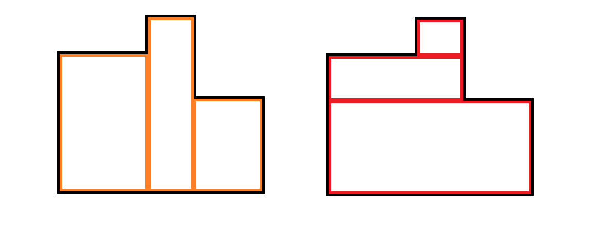
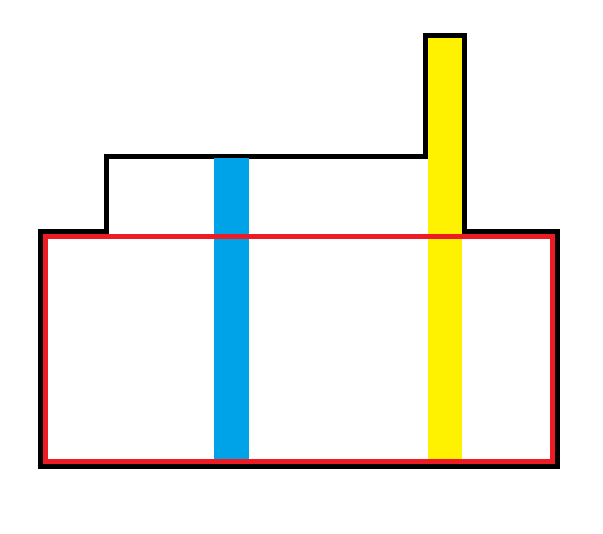
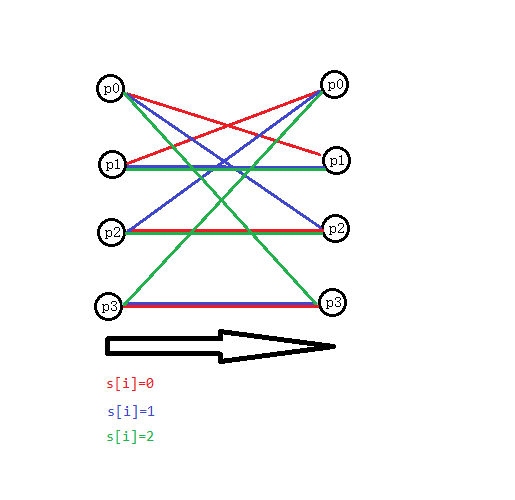

# 20231017 B 组模拟赛 题解

## 前言

T4 是巨大数据结构维护 dp，暂时还没写，准备先口胡了再写。

[密码是通用密码](../files/20231017.rar)

## T1

首先容易发现坏的区间是单调的。这么说比较抽象，其实是指若区间 $[l,r]$ 是坏的区间，那么它的任何超区间都是坏的（超区间指完全包含它的区间）。因为若 $[l,r]$ 中有连续的 $k$ 个那么无论怎么拓展这连续的 $k$ 个都不会变少。

那么可以维护一个双指针，每次动右指针 $R$，然后把左指针 $L$ 移到最左的合法位置，这样就有 $R-L+1$ 个好的区间。然后这个合法位置可以直接线段树维护值域，很板，就做完了。

复杂度 $O(n\log n)$（貌似可以 zkw，但是赛时没打）。

/// details | 参考代码
    open: False
    type: success

```cpp
#include<bits/stdc++.h>
#define mem(a,b) memset(a,b,sizeof(a))
#define forup(i,s,e) for(i64 i=(s);i<=(e);i++)
#define fordown(i,s,e) for(i64 i=(s);i>=(e);i--)
using namespace std;
using i64=long long;
#define gc getchar()
inline i64 read(){
    i64 x=0,f=1;char c;
    while(!isdigit(c=gc)) if(c=='-') f=-1;
    while(isdigit(c)){x=(x<<3)+(x<<1)+(c^48);c=gc;}
    return x*f;
}
#undef gc
const i64 N=2e5+5,inf=0x3f3f3f3f;
i64 n,m,a[N],ans;
i64 cnt[N];
struct SegTree{
	#define mid ((l+r)>>1)
	#define lson l,mid,id<<1
	#define rson mid+1,r,id<<1|1
	i64 querymax[N<<2],querylft[N<<2],queryrgt[N<<2];
	void PushUp(i64 id,i64 len){
		querymax[id]=max({querymax[id<<1],querymax[id<<1|1],queryrgt[id<<1]+querylft[id<<1|1]});
		if(querymax[id<<1]==(len-(len>>1))){
			querylft[id]=querymax[id<<1]+querylft[id<<1|1];
		}else{
			querylft[id]=querylft[id<<1];
		}
		if(querymax[id<<1|1]==(len>>1)){
			queryrgt[id]=querymax[id<<1|1]+queryrgt[id<<1];
		}else{
			queryrgt[id]=queryrgt[id<<1|1];
		}
	}
	void Update(i64 P,i64 X,i64 l=1,i64 r=n,i64 id=1){
		if(l==r){
			if(X==1){
				querymax[id]=querylft[id]=queryrgt[id]=1;
			}else{
				querymax[id]=querylft[id]=queryrgt[id]=0;
			}
			return;
		}
		if(P<=mid) Update(P,X,lson);
		else       Update(P,X,rson);
		PushUp(id,r-l+1);
	}
	bool Ask(){
		return querymax[1]<=m;
	}
}mt;
signed main(){
	n=read();m=read();
	forup(i,1,n){
		a[i]=read();
	}
	i64 l=1;
	forup(i,1,n){
		++cnt[a[i]];
		if(cnt[a[i]]==1){
			mt.Update(a[i],1);
		}
		while(l<i&&!mt.Ask()){
			--cnt[a[l]];
			if(cnt[a[l]]==0){
				mt.Update(a[l],0);
			}
			++l;
		}
		ans+=i-l+1;
	}
	printf("%lld\n",ans);
}
```

///

## T2

这道题赛时傻逼了，卡住了，最后也没写出来。

首先 `pop` 操作的答案是简单的，从前往后扫一遍可以知道每个数从什么时候开始变得不是最大值，也就是说**可能被删掉**，并且容易发现 `pop` 操作会等概率删掉当前**能被删掉但有可能没被删掉**的所有数（就是说除去最大值）。对于这个“有可能没被删掉”，意思就是除去每次删到只剩最大值时会清空集合，其余时候是累加的。

然后考虑  `push` 操作，其实也不难。在刚才“扫一遍”的过程中，你能求出每个数从什么时候开始**可能被删掉**，那么直到集合删空之前的所有操作都能等概率把它删掉，那么再倒着扫一遍即可。

复杂度 $O(n)$，需要预处理逆元。

/// details | 参考代码
    open: False
    type: success

```cpp
#include<bits/stdc++.h>
#define mem(a,b) memset(a,b,sizeof(a))
#define forup(i,s,e) for(int i=(s);i<=(e);i++)
#define fordown(i,s,e) for(int i=(s);i>=(e);i--)
using namespace std;
using pii=pair<int,int>;
#define fi first
#define se second
#define mkp make_pair
#define gc getchar()
inline int read(){
    int x=0,f=1;char c;
    while(!isdigit(c=gc)) if(c=='-') f=-1;
    while(isdigit(c)){x=(x<<3)+(x<<1)+(c^48);c=gc;}
    return x*f;
}
#undef gc
const int N=1e6+5,mod=998244353;
int n,sum[N],mx[N],pmx[N],inv[N],ans[N],tg[N];
struct op{
	int tp,val;
}s[N];
signed main(){
	n=read();
	inv[1]=1;
	forup(i,2,n){
		inv[i]=1ll*(mod-mod/i)*inv[mod%i]%mod;
	}
	forup(i,1,n){
		s[i].tp=read();
		if(s[i].tp==0){
			s[i].val=read();
			sum[i]=sum[i-1]+1;
			if(s[i].val>mx[i-1]){
				mx[i]=s[i].val;
				pmx[i]=i;
			}else{
				mx[i]=mx[i-1];
				pmx[i]=pmx[i-1];
			}
		}else{
			sum[i]=sum[i-1]-1;
			if(sum[i]!=0){
				mx[i]=mx[i-1];
				pmx[i]=pmx[i-1];
			}else{
				mx[i]=0;
				pmx[i]=0;
			}
		}
	}
	int nw=0;
	forup(i,1,n){
		if(s[i].tp==0){
			if(s[i].val==mx[i]){
				tg[i]=pmx[i-1];
				nw=(1ll*nw*(mod+1-inv[sum[i]-1])%mod+1ll*mx[i-1]*inv[sum[i]-1]%mod)%mod;
			}else{
				tg[i]=i;
				nw=(1ll*nw*(mod+1-inv[sum[i]-1])%mod+1ll*s[i].val*inv[sum[i]-1]%mod)%mod;
			}
		}else{
			if(sum[i]>0){
				ans[i]=nw;
			}else{
				ans[i]=mx[i-1];
				tg[i]=pmx[i-1];
				nw=0;
			}
		}
	}
	nw=0;
	fordown(i,n,1){
		if(s[i].tp==1){
			nw=(1ll*nw*(mod+1-inv[max(sum[i],1)])%mod+1ll*i*inv[max(sum[i],1)]%mod)%mod;
		}
		if(tg[i]!=0){
			if(nw!=0){
				ans[tg[i]]=nw;
			}
		}
	}
	forup(i,1,n){
		printf("%d ",ans[i]);
	}
}
```

///

## T3

很巧妙的结论题。

首先考虑有一些操作是显然不优的，如图：



左边橙色的切法显然不如右边红色的切法（考虑权值的计算方法），举例说，左边下面大块的每一行产生了三次贡献，右边只产生了一次贡献。

这说明每一块肯定都是从左到右拉通的，但是有一种例外，就是单独一竖列的情况，因为单独一列的权值计算方式不同，这个我们要分开考虑。

那么由于我们是一层一层切的，容易想到 dp，设 $dp_{l,r,k}$ 表示考虑区间 $[l,r]$（$a_l\sim a_r$ 均大于 $a_k$，不然不好转移），然后这一整个区间都被切掉了下半 $a_k$ 高度后（或者离散化后记删掉高度为 $k$ 的一块），还需要多少代价才能删完。

转移有两个，就是上面的两种情况，第一个是从左到右拉通删，那么删的高度显然必须是区间最小值（删多了不合法，删少了不优），第二个是删某一列。那么就要枚举删哪一列，复杂度为 $O(n^4)$。

但是容易发现，只有删最高的一列是不劣的，考虑画图：



如果你删蓝色的一列，那么由于红色矩形每一行的最大值显然取在黄色的那一列里面，那么蓝色列分出的右半边权值和原来的红色矩形相同，而左半边凭空多出来了，显然是更劣的。

那么具体来说，转移有两种，设 $a_p$ 为 $[l,r]$ 内的最小值，$a_q$ 为 $[l,r]$ 内的最大值，那么两种转移分别是：

$$dp_{l,r,k}=\min(dp_{l,q-1,k}+dp_{q+1,r,k}+cost_{q,q,k,a_q},dp_{l,p-1,p}+dp_{p+1,r,p}+cost_{l,r,k,p})$$

其中 $cost_{l,r,d,u}$ 表示删掉左边缘为 $l$，右边缘为 $r$，下边缘为 $d$，上边缘为 $u$ 的矩形的代价，这个可以 $O(1)$ 计算，是一个比较简单的模拟。

那么做个 RMQ 转移就是 $O(1)$ 的，复杂度是 $O(n^3)$……

吗？

其实这个做法加个记搜就能过了，因为可以证明状态数是 $O(n^2)$ 级别的。

首先考虑你的转移，首先如果只考虑最大值的转移，那么能被转移到的 $[l,r]$ 必定是笛卡尔树上的一个子树，是 $O(n)$ 级别的（这个等会会用到），而对于一个 $k$，根据状态的定义，容易发现 $i\in[l,r]$ 的所有 $a_i$ 必定大于 $a_k$，那么相当于整个序列把 $a_i\le a_k$ 的所有 $i$ 删掉后形成的一系列子区间。对于这样形成的极大子区间 $[L,R]$ 内，容易发现合法的 $l,r$ 要么 $l=L$ 或 $r=R$，要么是一个当前子区间笛卡尔树的子树。对于前者，它是一个前缀或后缀，显然是 $O(n)$ 的，对于后者，刚才已经说明了是 $O(n)$ 的。又因为 $k$ 有 $O(n)$ 种取值，那么乘起来状态数就是 $O(n^2)$ 的了。

复杂度 $O(n^2\log n)$（因为你要用一个容器存状态，如果用 `map` 就带 $\log$，或许可以试试哈希表）。

/// details | 参考代码
    open: False
    type: success

```cpp
#include<bits/stdc++.h>
#define mem(a,b) memset(a,b,sizeof(a))
#define forup(i,s,e) for(int i=(s);i<=(e);i++)
#define fordown(i,s,e) for(int i=(s);i>=(e);i--)
using namespace std;
#define gc getchar()
inline int read(){
    int x=0,f=1;char c;
    while(!isdigit(c=gc)) if(c=='-') f=-1;
    while(isdigit(c)){x=(x<<3)+(x<<1)+(c^48);c=gc;}
    return x*f;
}
#undef gc
const int N=3005,inf=0x3f3f3f3f;
int n,a[N];
int ST1[12][N],ST2[12][N],lg[N];
void init(){
	forup(i,2,n) lg[i]=lg[i>>1]+1;
	forup(i,1,n) ST1[0][i]=i,ST2[0][i]=i;
	forup(i,1,11){
		forup(j,1,n-(1<<i)+1){
			ST1[i][j]=a[ST1[i-1][j]]>a[ST1[i-1][j+(1<<(i-1))]]?ST1[i-1][j]:ST1[i-1][j+(1<<(i-1))];
			ST2[i][j]=a[ST2[i-1][j]]<a[ST2[i-1][j+(1<<(i-1))]]?ST2[i-1][j]:ST2[i-1][j+(1<<(i-1))];
		}
	}
}
int query1(int l,int r){
	int len=lg[r-l+1];
	return a[ST1[len][l]]>a[ST1[len][r-(1<<len)+1]]?ST1[len][l]:ST1[len][r-(1<<len)+1];
}
int query2(int l,int r){
	int len=lg[r-l+1];
	return a[ST2[len][l]]<a[ST2[len][r-(1<<len)+1]]?ST2[len][l]:ST2[len][r-(1<<len)+1];
}
struct Node{
	int l,r,k;
	bool operator <(const Node &pp)const{
		if(l!=pp.l) return l<pp.l;
		if(r!=pp.r) return r<pp.r;
		return a[k]<a[pp.k];
	}
};
map<Node,int> dp;
int calc(int mx,int st,int ed){
	int ll=mx-ed+1,rr=mx-st;
	return (ll+rr)*(rr-ll+1)/2;
}
int solve(int l,int r,int k){
	if(l>r) return 0;
	if(l==r){return a[l]-a[k];}
	if(dp.count(Node{l,r,k})) return dp[Node{l,r,k}];
	int res=inf;
	int mx=query1(l,r),mn=query2(l,r);
	res=min(solve(l,mx-1,k)+solve(mx,mx,k)+solve(mx+1,r,k),solve(l,mn-1,mn)+solve(mn+1,r,mn)+calc(a[mx],a[k],a[mn]));
	dp[Node{l,r,k}]=res;
	return res;
}
signed main(){
	n=read();
	forup(i,1,n) a[i]=read();
	init();
	printf("%d\n",solve(1,n,0));
}
```

///

## T4

这道题貌似是道比较板的 dp of dp。

首先**恰好有奇数个有恰好奇数个本质不同子序列的非空子串的方案数**这个很复杂，不妨先想**对于固定字符串有恰好奇数个本质不同子序列**这么一个子问题。

那么容易想到 dp，设 $g_{i,0/1/2}$ 表示考虑前 $i$ 个数，恰好有多少个以 $0/1/2$ 结尾的本质不同子序列有多少种，但是为了方便转移我们还可以记一个 $g_{i,3}$ 表示本质不同序列总数（包括空序列）。那么考虑转移，假如已经确定了第 $i$ 位是多少，那么不妨以 $0$ 为例，则 $g_{i,0}=g_{i-1,0}+g_{i-1,1}+g_{i-1,2}+1=g_{i-1,3}$，因为你这个 $0$ 可以接在任何原来的子序列后面，然后 $g_{i,1/2}$ 都可以直接继承，新的 $g_{i,3}=g_{i,0}+g_{i,1}+g_{i,2}+1=g_{i-1,3}+g_{i-1,1}+g_{i-1,2}+1$。至于为什么 $g_{i,0}$ 不需要继承 $g_{i-1,0}$，考虑这么一种情况：

```
121010
```

容易发现，对于第一个 $0$ 的 $7$ 个本质不同子序列 `0,10,20,120,210,110,1210`，在第二个 $0$ 都能从 $g_{i-1,1}$ 和 $g_{i-1,2}$（以及空序列）转移过来，如果继承了会算重。

那么我们就能求出一子串有多少个本质不同的子序列了。但容易发现这太浪费了，因为我们只关注子序列个数的奇偶性。考虑把 dp 的值设成 `bool` 型的，观察一下每个 dp 状态的奇偶性有什么性质。

为方便叙述，把 $g_{i,0/1/2/3}$ 写成一个向量 $\begin{bmatrix}g_0,g_1,g_2,g_3\end{bmatrix}$，那么初始状态就是 $\begin{bmatrix}0,0,0,1\end{bmatrix}$，假如 $s_i=0$，就会转移到 $\begin{bmatrix}1,0,0,0\end{bmatrix}$，而假如 $s_i=1$ 就是 $\begin{bmatrix}0,1,0,0\end{bmatrix}$，容易发现这相当于交换 $g_{s_i}$ 与 $g_3$。

那么这对于初始情况以外的情况是否适用呢？这个我们可以只看前两步，对于第一次转移显然，对于第二次，若 $g_3=g_{s_i}=0$，容易发现 $g_3$ 转移过后仍是 $0$，$g_{s_i}$ 也是，若 $g_3=0,g_{s_i}=1$，那么转移过后 $g_3=1,g_{s_i}=0$。而再进一步地，可以发现后面的所有情况均在前两次转移中可以出现。

也就是说本质不同的状态只有四种，分别是 $\begin{bmatrix}1,0,0,0\end{bmatrix},\begin{bmatrix}0,1,0,0\end{bmatrix},\begin{bmatrix}0,0,1,0\end{bmatrix},\begin{bmatrix}0,0,0,1\end{bmatrix}$，不妨设 $p_0=\begin{bmatrix}1,0,0,0\end{bmatrix},p_1=\begin{bmatrix}0,1,0,0\end{bmatrix},p_2=\begin{bmatrix}0,0,1,0\end{bmatrix},p_3=\begin{bmatrix}0,0,0,1\end{bmatrix}$。

这时候容易发现对于非固定字符串变得好处理了，这个具体为什么语言不太好描述，画一张图：



那么显然对于一个固定的 $s_i$ 转移是固定的，那么我们就可以设 $dp_{i,0/1/2/3}$ 表示考虑前 $i$ 个，$g_i=p_0/p_1/p_2/p_3$ 的填数方案数，然后对于一个可变的数那几种转移全转一遍即可，这样就能处理**对于一不固定字符串使其恰好有奇数个本质不同子序列的填数方案**了（虽然这个和解题关系不大）。

---

那么再考虑外层的**有奇数个满足以上条件子串**如何处理（先不考虑区间询问），那么因为维护的是子区间，那么不妨对于每个点维护以它为右端点的后缀的方案数再累加，而且我们同样不关心具体是多少，只关心奇偶性，那么容易想到设 $f_{i,0/1,0/1,0/1,0/1,0/1}$ 表示考虑前 $i$ 个数，有偶数/奇数个后缀的状态是 $p_0$，有偶数/奇数个后缀的状态是 $p_1$，有偶数/奇数个后缀的状态是 $p_2$，有偶数/奇数个后缀的状态是 $p_3$，$i$ 之前好的非空子串数量是偶数/奇数的填数方案（好长的状态定义）。

根据刚才图上的转移，容易发现 $f$ 的转移也是一个交换的过程，即交换 $p_0$ 与 $p_{s_i+1}$，对于最后一维的答案统计，相当于每次累加上 $p_0$。另外注意，$i$ 后移时还会新增一个状态为 $p_0$ 的空串。形式化的，以 $s_i=0$ 举例：

$$f_{i,a_3,a_1,a_2,a_0\oplus 1,a_4\oplus a_0}\gets f_{i-1,a_0,a_1,a_2,a_3,a_4}$$

其中 $\oplus$ 表示异或（显然二进制不进位加法就是异或吧）。

然后和之前的 $dp$ 数组的转移一样，对于可变的位置同时进行多种转移。

---

那么考虑区间询问。首先容易想到把转移封装进矩阵后用线段树维护，那么复杂度就是 $O(n\times s^3 + q\log n\times s^3)$（$s$ 为状态数，这里取 $32$），$50000\times 32^3+1000000\times \log_2 50000\times 32^3\approx 5.2\times 10^{11}$，显然过不了。

首先有个显而易见的优化，由于你只关心每个状态是多少，那么你线段树最终查询合并 $\log n$ 个区间的时候其实只需要上传一个行向量，那么查询时向量乘矩阵的乘法就变成 $O(s^2)$ 的了。总复杂度 $O(n\times s^3+q\log n\times s^2)$，还是不太过得了。

继续优化，容易发现对于一个 $s_i=0/1/2$，转移的矩阵大部分是空的，因为显然对于一个状态 $\begin{bmatrix}a_0,a_1,a_2,a_3,a_4\end{bmatrix}$，它只会转移到 $\begin{bmatrix}a_1\oplus 1,a_0,a_2,a_3,a_4\oplus a_1\end{bmatrix}$，也就是说，转移矩阵每一行只有一个位置有值。就算对于 $s_i=\text{?}$ 这种阴间情况也只有至多 $3n$ 个转移，反正就是 $O(n)$ 的。这样的矩阵也是可以 $O(s^2)$ 和一般矩阵做乘法的，就是先枚举这边有哪些地方有值，然后有值才乘以对应的一行/一列。我们可以考虑用猫树维护，这样查询的时候压掉一个 $\log$，预处理的时候还能变成 $O(s^2)$ 的矩乘，复杂度就变成了 $O(n\log n\times s^2+qs^2)$（注意查询是做两遍向量乘矩阵，一定要尽量避免矩阵乘矩阵）。

但是直接猫树空间要炸，打猫树分治就没问题了，复杂度还是一样。

然后还有一个优化，由于每次 $i$ 增加时，$a_0,a_1,a_2,a_3$ 四个数都会在交换之后对其中一个异或 $1$，也就是说这四个数的异或和只与 $i-l$（$l$ 是查询区间左端点）有关，那么在状态中我们只需要记三个值，然后再讨论奇偶性分开记一个 $f'$，这样矩阵乘法中的 $s$ 就会从 $32$ 变成 $16$，然后提一个 $2$ 出来放在外面，效率还能提升一倍，但是需要对奇数$\to$ 偶数，偶数 $\to$ 奇数构造两种转移矩阵。

看起来代码很难写，实际上确实很难写。

过了，很卡常，有个卡常技巧是最后你其实也不需要乘一整个向量。初始向量只有一个地方有值（$v_0=1$），你可以左边矩阵枚举对应的一行，然后假如有值再去乘右边矩阵对应的一行，复杂度上界没变，但是很多时候常数会减小。

/// details | 参考代码
	open: False
	type: success

```cpp
#include<bits/stdc++.h>
#define mem(a,b) memset(a,b,sizeof(a))
#define forup(i,s,e) for(int i=(s);i<=(e);i++)
#define fordown(i,s,e) for(int i=(s);i>=(e);i--)
using namespace std;
#define gc getchar()
inline int read(){
    int x=0,f=1;char c;
    while(!isdigit(c=gc)) if(c=='-') f=-1;
    while(isdigit(c)){x=(x<<3)+(x<<1)+(c^48);c=gc;}
    return x*f;
}
#undef gc
const int N=5e4+5,M=1e6+5,mod=998244353;
int t,n,seq[N],m,ans[M];
struct Matrix{
	int c[16][16];
	bool is_sparse;
	Matrix(){
		mem(c,0);is_sparse=false;
	}
};
Matrix tran[2][7];//0,1,2,a,b,c,?
void adm(int &a,int b){
	a+=b;
	if(a>=mod) a-=mod;
}
Matrix operator *(const Matrix &a,const Matrix &b){
	Matrix res;
	if(b.is_sparse){
		forup(j,0,15){
			forup(k,0,15){
				if(b.c[k][j]){
					forup(i,0,15){
						adm(res.c[i][j],1ll*a.c[i][k]*b.c[k][j]%mod);
					}
				}
			}
		}
	}else if(a.is_sparse){
		forup(i,0,15){
			forup(k,0,15){
				if(a.c[i][k]){
					forup(j,0,15){
						adm(res.c[i][j],1ll*a.c[i][k]*b.c[k][j]%mod);
					}
				}
			}
		}
	}else{
		puts("Genshin");
		exit(0);
	}
	return res;
}
Matrix operator +(const Matrix &a,const Matrix &b){
	Matrix res;
	forup(i,0,15){
		forup(j,0,15){
			res.c[i][j]=a.c[i][j];
			adm(res.c[i][j],b.c[i][j]);
		}
	}
	return res;
}
char str[N];
int gmsk(int *a){
	int res=0;
	res=(a[0]|(a[1]<<1)|(a[2]<<2)|(a[4]<<3));
	return res;
}
void init(){
	forup(msk,0,15){
		int a[5],b[5];
		a[0]=msk&1;a[1]=(msk>>1)&1;a[2]=(msk>>2)&1;a[4]=(msk>>3)&1;
		int p=a[0]^a[1]^a[2];
		forup(xs,0,1){
			a[3]=xs^p;
			forup(s,0,2){
				forup(i,0,4) b[i]=a[i];
				swap(b[s],b[3]);
				b[4]^=b[3];
				b[3]^=1;
				int mb=gmsk(b);
				tran[xs][s].c[msk][mb]++;
			}
		}
	}
	forup(xs,0,1){
		tran[xs][3]=tran[xs][0]+tran[xs][1];
		tran[xs][4]=tran[xs][0]+tran[xs][2];
		tran[xs][5]=tran[xs][1]+tran[xs][2];
		tran[xs][6]=tran[xs][0]+tran[xs][1]+tran[xs][2];
	}
	forup(xs,0,1){
		forup(i,0,6){
			tran[xs][i].is_sparse=true; 
		}
	}
}
struct query{
	int l,r;
}q[M];
Matrix ns[N][2];
vector<int> sv[1<<17];
int grt(int l,int r){
	l+=(1<<16);r+=(1<<16);
	while(l^r){l>>=1;r>>=1;}
	return l;
}
void solve(int sl,int sr,int id){
	if(sl==sr){
		if(sv[id].empty()) return;
		int res=0;
		forup(i,0,7){
			(res+=tran[1][seq[sl]].c[0][i|8])%=mod;
		}
		for(auto i:sv[id]){
			ans[i]=res;
		}
		return;
	}
	int mid=(sl+sr)>>1;
	if(sv[id].size()){
		ns[mid][0]=tran[1][seq[mid]];ns[mid][1]=tran[0][seq[mid]];
		ns[mid+1][0]=tran[1][seq[mid+1]];ns[mid+1][1]=tran[0][seq[mid+1]];
		fordown(i,mid-1,sl){
			ns[i][0]=tran[1][seq[i]]*ns[i+1][1];
			ns[i][1]=tran[0][seq[i]]*ns[i+1][0];
		}
		forup(i,mid+2,min(sr,n)){
			ns[i][0]=ns[i-1][1]*tran[1][seq[i]];
			ns[i][1]=ns[i-1][0]*tran[0][seq[i]];
		}
		for(auto i:sv[id]){
			Matrix m1(ns[q[i].l][0]),m2(((q[i].r-q[i].l+1)&1)?ns[q[i].r][0]:ns[q[i].r][1]);
			int res=0;
			forup(i,0,15){
				if(m1.c[0][i]){
					forup(j,0,7){
						(res+=1ll*m2.c[i][j|8]*m1.c[0][i]%mod)%=mod;
					}
				}
			}
			ans[i]=res;
		}		
	}
	solve(sl,mid,id<<1);solve(mid+1,sr,id<<1|1);
}
bool cmp(query a,query b){
	return a.r<b.r;
}
signed main(){
	init();
	n=read();
	scanf(" %s",str+1);
	forup(i,1,n){
		if(str[i]>='0'&&str[i]<='2') seq[i]=str[i]-'0';
		else if(str[i]>='a'&&str[i]<='c') seq[i]=str[i]-'a'+3;
		else seq[i]=6;
	}
	m=read();
	forup(i,1,m){
		q[i].l=read();q[i].r=read();
		int ps=grt(q[i].l,q[i].r);
		sv[ps].push_back(i);
	}
	solve(0,(1<<16)-1,1);
	forup(i,1,m){
		printf("%d\n",ans[i]);
	}
}
```

///