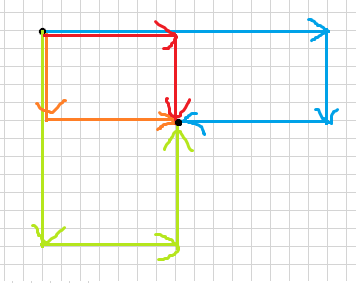

# 20231023 B 组模拟赛 题解

## 前言

这套没啥印象，只记得 T3 除了我所有人都会打 70pts 暴力/kk。

T3 是神秘构造，但是思路意外的通畅。

T4 乔安娜这道题做的贼 nb，她赛后说是 sb 题，我问他怎么做她说按 dfs 序染色即可，我问她能不能证明她说显然，太简单了不需要证明。结果事后讲题的时候高二学长纠结了半天才搞懂她是怎么想的。另外题解的证明方法非常玄妙，而且意外的好懂，所以本文中是题解证法。

[密码是通用密码](../files/20231023.rar)

## T1



如图，容易发现路线只有四种可能，分别是**从纵向的最小值绕过去**，**从横向的最小值绕过去**和两种不绕的路线。

分类讨论即可。

复杂度 $O(n+m+q)$，瓶颈在于读入。

/// details
    open: False
    type: success

```cpp
#include<bits/stdc++.h>
#define mem(a,b) memset(a,b,sizeof(a))
#define forup(i,s,e) for(int i=(s);i<=(e);i++)
#define fordown(i,s,e) for(int i=(s);i>=(e);i--)
using namespace std;
#define gc getchar()
inline int read(){
    int x=0,f=1;char c;
    while(!isdigit(c=gc)) if(c=='-') f=-1;
    while(isdigit(c)){x=(x<<3)+(x<<1)+(c^48);c=gc;}
    return x*f;
}
#undef gc
const int N=2e5+5,inf=0x3f3f3f3f;
int n,m,q,a[N],b[N],ma=inf,mb=inf;
signed main(){
	n=read();m=read();q=read();
	forup(i,1,n) a[i]=read(),ma=min(ma,a[i]);
	forup(i,1,m) b[i]=read(),mb=min(mb,b[i]);
	forup(Case,1,q){
		int sx=read(),sy=read(),tx=read(),ty=read();
		int res=inf;
		res=min(res,max({a[sx],a[tx],mb}));
		res=min(res,max({b[sy],b[ty],ma}));
		res=min({res,max(a[sx],b[ty]),max(b[sy],a[tx])});
		if(sx==tx){
			res=min(res,a[sx]);
		}
		if(sy==ty){
			res=min(res,b[sy]);
		}
		printf("%d\n",res);
	}
}
```

///

## T2

比较简单的换根 dp 吧？

首先第一步，对于子树内的答案是好求的。设 $dp_{i,j}$ 表示考虑以 $i$ 为根的子树，$i$ 度数为 $j$，子树内其余点度数都不大于 $2$ 的连通子图个数。转移就每次 $dp_{i,k}\gets dp_{i,k-1}\times (dp_{v,0}+dp_{v,1})$ 即可（$v\in son_i$，注意倒序枚举 $k$）。

然后考虑换根和求答案，首先假如当前节点是 $u$ 要换根到 $v$，那么显然要先扣掉 $dp_v$ 对 $dp_u$ 的贡献。设扣掉 $dp_v$ 贡献后的数组为 $g_i$，那么容易发现，$dp_v$ 对所有 $dp_{u,k}$ 的贡献都形如 $(dp_{v,0}+dp_{v,1})\times g_{k-1}$，而显然 $g_0$ 是已知的（显然一条边也不连的方案为 $1$ 吧），那么就可以直接推出 $g$ 了。然后的转移是简单的，和之前一样，自己推一下。

接下来考虑答案的计算，即 $\sum_{i=0}^m\sum_{j=0}^{m-i}dp_{v,i}\times g_j$，然后简单地，把内部的 $\sum$ 扔到 $g$ 那边去，就变成了 $\sum_{i=0}^mdp_{v,i}\times \sum_{j=0}^{m-i}g_j$，容易发现 $\sum_{j=0}^{m-i}g_j$ 是一个前缀和，然后就能直接维护了。

复杂度 $O(nm)$。

/// details | 参考代码
    open: False
    type: success

```cpp
#include<bits/stdc++.h>
#define mem(a,b) memset(a,b,sizeof(a))
#define forup(i,s,e) for(int i=(s);i<=(e);i++)
#define fordown(i,s,e) for(int i=(s);i>=(e);i--)
using namespace std;
#define gc getchar()
inline int read(){
    int x=0,f=1;char c;
    while(!isdigit(c=gc)) if(c=='-') f=-1;
    while(isdigit(c)){x=(x<<3)+(x<<1)+(c^48);c=gc;}
    return x*f;
}
#undef gc
const int N=3e5+5,mod=998244353;
int n,m,ans[N];
struct edge{
	int v,pos;
};
vector<edge> e[N];
int dp[N][55],pd[N][55];
int ksm(int a,int b){
	int c=1;
	while(b){
		if(b&1) c=1ll*a*c%mod;
		a=1ll*a*a%mod;
		b>>=1;
	}
	return c;
}
void dfs1(int x,int fa){
	dp[x][0]=1;
	for(auto i:e[x]){
		if(i.v==fa) continue;
		dfs1(i.v,x);
		fordown(j,m,1){
			(dp[x][j]+=1ll*(dp[i.v][0]+dp[i.v][1])*dp[x][j-1]%mod)%=mod;
		}
	}
}
int g[55];
void dfs2(int x,int fa){
	for(auto i:e[x]){
		if(i.v==fa) continue;
		pd[i.v][0]=1;
		forup(j,0,m) g[j]=pd[x][j];
		forup(j,1,m){
			g[j]=(g[j]+mod-1ll*(dp[i.v][0]+dp[i.v][1])*g[j-1]%mod)%mod;
		}
		forup(j,1,m){pd[i.v][j]=(dp[i.v][j]+1ll*dp[i.v][j-1]*(g[0]+g[1])%mod)%mod;}
		int s1=1;
		forup(j,1,m){
			(s1+=g[j])%=mod;
		}
		forup(j,0,m){
			(ans[i.pos]+=1ll*dp[i.v][j]*s1%mod)%=mod;
			s1=(s1+mod-(g[m-j]))%mod;
		}
	}
	for(auto i:e[x]){
		if(i.v==fa) continue;
		dfs2(i.v,x);
	}
}
signed main(){
	n=read();m=read();
	forup(i,1,n-1){
		int u=read(),v=read();
		e[u].push_back(edge{v,i});
		e[v].push_back(edge{u,i});
	}
	dfs1(1,0);
	forup(i,0,m){
		pd[1][i]=dp[1][i];
	}
	dfs2(1,0);
	forup(i,1,n-1){
		printf("%d\n",ans[i]);
	}
}
```

///

## T3

神秘构造题，但是思路还挺好想的。

为和直觉相符，可以把 $a,b$ 数列均 `reverse` 一下，就相当于前缀是 $a$，后缀是 $n\sim 1$ 的排列。

首先考虑 50pts 部分分，即序列长度不大于 $2n^2$，容易发现这道题的构造相当于要你把 $a$ 排序，但是限制你每次一个数不能前移超过一个位置，要你输出中间序列。容易发现冒泡排序是满足这个条件的，那么就可以拿到 50pts 了。但是容易发现后面的 20pts 特殊性质也能拿到，因为数据很水，而除非精心构造数据不然排完这样的数据需要的趟数是很少的。

然后就是正解，正解和部分分一点关系也没有（这是 ac 这道题的人数极少的原因之一）。首先考虑由于两个相同的数间隔不小于 $n-1$，相当于连续 $n-1$ 个数互不相同。那么可以考虑把 $b$ 序列分成 $n-1$ 个一段（先不考虑边界）。容易发现每一段内恰有一个数没出现过，不妨设上一段中这个数为 $x$，显然它在这一段是可以随意填的，还能发现每一段不会和上一段相差太大（这个比较感性，因为每个数不能往前移，即不会出现随意交换的情况）。那么可以考虑再简化问题，即对一段长度为 $n-1$ 的序列 $s$ 进行操作，并且你有一个自由的 $x$。

那么考虑你能对序列做什么，首先你可以把 $x$ 填到一个位置 $i$，那么 $s_i$ 就会变成下一段的 $x'$，相当于 `swap` 操作。然后你容易发现这个 $s_i$ 也能在 $i\sim n-1$ 中充当 $x$ 的作用。由于你每个数只能往后移动，换句话说，你只有 $x$ 是能自由交换的，那么显然你没有其它操作能做了。

总结下来，你的操作只有从左到右扫描 $s$，然后决策是否将当前 $x$ 与 $s_i$ 交换。

---

考虑如何构造决策方案，从考虑边界情况开始。容易发现若你取 $1\sim n-1$ 为第一段（注意前面说了序列是 `reverse` 过的），那么下一个数是固定的 $a_n$，我们无法进行操作。而你取 $2\sim n$ 为第一段，那么 $a_1$ 恰好能充当第二段的 $x$。而在最后，容易想到你需要让 $x=1$ 放到末尾，那么前面就是 $n\sim 2$ 的排列。

这里题解有个非常妙的构造，首先你可以知道最终需要使得 $s_i=n-i+1$，分两种情况。

1. 若 $x=1$ 且序列 $s$ 还没排好，那么无论如何你肯定要动序列，晚动不如早动，你找到后面的第一个 $s_i\ne n-i+1$，然后交换 $x,s_i$。
1. 若 $x\ne 1$，那么等到 $x=n-i+1$ 的位置就把 $x$ 给塞进去即可。

考虑这样为什么是对的，首先决策 $1$ 相当于随便找一个置换环，然后进入置换环。那么最劣情况就是耗费整整一轮才找到下一个置换环，由于数据随机，我们考虑置换环个数期望，设 $h(n)$ 表示 $n$ 阶排列置换环个数期望，考虑把 $n$ 均匀随机插入 $n-1$ 阶排列中，那么有 $\frac{1}{n}$ 的概率恰好插到 $n$ 这个位置，使置换环数量加一，其余位置不变，那么有 $h(n)=\frac{1}{n}(h(n-1)+1)+\frac{n-1}{n}h(n-1)=h(n-1)+\frac{1}{n}$，即 $h(n)=\sum_{i=1}^n\frac{1}{n}$，是一个经典的调和级数结论，大约是 $\log n$。

然后考虑对于每个 $x\ne 1$，我们的构造相当于让它前进若干步（放回原问题看了，或者你可以视为长度为 $n-1$ 的环），那么容易发现前进的步数为 $p_i-i+n[p_i<i]$。考虑求这玩意的期望，由于排列总数是好求的（就是 $n!$），那么考虑求出所有情况的总贡献，即 $\sum_{i=1}^n\sum_{j=1}^n(j-i+n[j<i])\times (n-1)!=n\times\frac{n(n-1)}{2}\times(n-1)!=n!\times\frac{n(n-1)}{2}$，然后再除以 $n!$ 就能得到期望是 $\frac{n(n-1)}{2}$。

那么 $b$ 序列期望长度就是 $(n-1)\log n+\frac{n(n-1)}{2}$，可以过了。

/// details | 参考代码
    open: False
    type: success

```cpp
#include<bits/stdc++.h>
#define mem(a,b) memset(a,b,sizeof(a))
#define forup(i,s,e) for(int i=(s);i<=(e);i++)
#define fordown(i,s,e) for(int i=(s);i>=(e);i--)
using namespace std;
#define gc getchar()
inline int read(){
    int x=0,f=1;char c;
    while(!isdigit(c=gc)) if(c=='-') f=-1;
    while(isdigit(c)){x=(x<<3)+(x<<1)+(c^48);c=gc;}
    return x*f;
}
#undef gc
const int N=1005,inf=0x3f3f3f3f;
int n,a[N],x;
vector<int> b;
int chk(){
	forup(i,2,n){
		if(a[i]!=n+2-i) return false;
	}
	return true;
}
signed main(){
	n=read();
	forup(i,1,n) a[i]=read();
	reverse(a+1,a+n+1);
	x=a[1];
	forup(i,1,n) b.push_back(a[i]);
	while(!chk()){
		forup(i,2,n){
			if(x==n+2-i||(x==1&&a[i]!=n+2-i)){
				swap(a[i],x);
			}
			b.push_back(a[i]);
		}
	}
	b.push_back(1);
	reverse(b.begin(),b.end());
	printf("%d\n",(int)b.size());
	for(auto i:b){
		printf("%d ",i);
	}
}
```

///

## T4

首先，“每个 $a_i>1$ 的边都存在一条边 $j$，使得 $i,j$ 相邻且 $a_i>a_j$”这个条件是不符合思维直觉的。考虑先把它转化成一个好想的。容易发现若从小到大加边，那么相当于每加一条边都要与之前的一条边相邻。即相当于从边 $1$ 开始，每次选一条与已染色边相邻的边染成黑色。

考虑此时如何计算代价。若在第一次涂黑以点 $u$ 为端点的边时视为把 $u$ “点亮”，把以它为端点的边全涂黑时视为把它“熄灭”，容易发现一个点的贡献就是它点亮的时间差。这时候我们就能推出来一些结论了。

首先，必定是涂完一整棵子树后才去涂其他边，因为假如一棵子树中有任何一个结点连了任何一条边，除非整棵子树都被涂完了，不然内部必定有至少一个点是点亮的状态。考虑画一画时间轴，容易发现总时间是固定的，那我们肯定希望同时点亮的点数尽可能少。

然后，我们就要考虑若已经把 $u$ 点亮了，应以什么顺序点亮它的儿子。首先由于上面的结论，那么显然子树内的答案是独立的，只需要考虑 $u$ 自己产生的贡献。那么 $u$ 产生的贡献如何计算呢？考虑在点亮最后一个儿子之前，$u$ 都是点亮的。不妨设最后一个点亮的儿子是 $v$，那么 $u$ 产生的贡献就是 $size_u-size_v$，那么显然，$v$ 取 $u$ 的重儿子最优。

综上，记 $u$ 的重儿子为 $son_u$，那么 $u$ 产生的贡献就是 $size_u-size_{son_u}$，这个就比较好计算了，可以先 dfs 一遍预处理出来（注意这个计算方式**不适用**于 $u$ 是叶子结点的情况）。

接下来考虑断边如何处理。首先由于我们已经把贡献化的与边无关了，那么我们完全可以把断边视作切下一棵子树 $u$，那么分四种情况讨论它到根的路径上的点 $x$ 贡献的变化。

1. **本来不是叶子的变成了叶子**：这个显然只有 $u$ 的父亲可能做到，贡献变成 $0$。
1. **本来 $u$ 所在的儿子不是 $x$ 的重儿子**：那么 $x$ 的贡献会从 $size_x-size_{son_x}$ 变成 $size_x-size_u-size_{son_x}$，即全局贡献减去 $size_{u}$。
1. **本来 $u$ 所在的儿子是 $x$ 的重儿子，删了还是重儿子**：贡献变成 $(size_x-size_u)-(size_{son_x}-size_u)$，即不变。
1. **本来是重儿子删掉之后变成不是重儿子了**：那么新的重儿子必定是次大儿子，不妨记作 $sec_x$。首先，这种情况会出现当且仅当 $size_{son_x}-size_{sec_x}<size_u$，然后贡献会从 $size_x-size_{son_x}$ 变成 $(size_x-size_u)-size_{sec_x}$，即全局贡献加上 $size_{son_x}-size_{sec_x}-size_u$。容易发现一个 $u$ 对应会产生这种贡献的 $size_{son_x}-size_{sec_x}$ 是一个前缀，那么可以用树状数组维护。

复杂度 $O(n\log n)$。

/// details | 参考代码
	open: False
	type: success

```cpp
#include<bits/stdc++.h>
#define mem(a,b) memset(a,b,sizeof(a))
#define forup(i,s,e) for(i64 i=(s);i<=(e);i++)
#define fordown(i,s,e) for(i64 i=(s);i>=(e);i--)
using namespace std;
using i64=int;
#define gc getchar()
inline i64 read(){
    i64 x=0,f=1;char c;
    while(!isdigit(c=gc)) if(c=='-') f=-1;
    while(isdigit(c)){x=(x<<3)+(x<<1)+(c^48);c=gc;}
    return x*f;
}
#undef gc
const i64 N=5e5+5;
i64 n,rt1,rt2,ans,res[N];
struct edge{
	i64 u,v;
}sve[N];
vector<i64> e[N];
i64 sz[N],son[N],sec[N],f[N],sres[N],dpt[N];
void dfs1(i64 x,i64 fa){
	sz[x]=1;f[x]=fa;dpt[x]=dpt[fa]+1;
	for(auto i:e[x]){
		if(i==fa) continue;
		dfs1(i,x);
		if(son[x]==0||sz[i]>=sz[son[x]]){
			sec[x]=son[x];
			son[x]=i;
		}else if(sec[x]==0||sz[i]>sz[sec[x]]){
			sec[x]=i;
		}
		sz[x]+=sz[i];
		sres[x]+=sres[i];
	}
	if(son[x]){
		sres[x]+=sz[x]-sz[son[x]];
	}
}
struct BIT{
	i64 c[N];
	void upd(i64 x,i64 k){++x;for(;x<=n+1;x+=x&-x)c[x]+=k;}
	i64 sum(i64 x){++x;i64 res=0;for(;x>0;x-=x&-x)res+=c[x];return res;}
}t1,t2;
void dfs2(i64 x,i64 fa,i64 cnt){
	if(fa!=0){
		res[x]=ans-sres[x]+t1.sum(sz[x])-(cnt+t2.sum(sz[x]))*sz[x];
		if(!sec[f[x]]){
			res[x]-=(sz[f[x]]-sz[x]);
		}
	}
	if(son[x]){
		if(sec[x]){
			t1.upd(sz[son[x]]-sz[sec[x]],sz[son[x]]-sz[sec[x]]);
			t2.upd(sz[son[x]]-sz[sec[x]],1);
			dfs2(son[x],x,cnt);
			t1.upd(sz[son[x]]-sz[sec[x]],-sz[son[x]]+sz[sec[x]]);
			t2.upd(sz[son[x]]-sz[sec[x]],-1);
		}else{
			dfs2(son[x],x,cnt);
		}
	}
	for(auto i:e[x]){
		if(i==fa||i==son[x]) continue;
		dfs2(i,x,cnt+1);
	}
}
signed main(){
	n=read();
	rt1=read();rt2=read();
	e[n+1].push_back(rt2);e[rt2].push_back(n+1);
	e[n+1].push_back(rt1);e[rt1].push_back(n+1);
	forup(i,2,n-1){
		i64 u=read(),v=read();
		e[u].push_back(v);
		e[v].push_back(u);
		sve[i]=edge{u,v};
	}
	dfs1(n+1,0);
	ans=sres[n+1];
	dfs2(n+1,0,0);
	forup(i,2,n-1){
		i64 u=sve[i].u,v=sve[i].v;
		if(v==f[u]) swap(u,v);
		printf("%d\n",res[v]-2);
	}
}
```

///