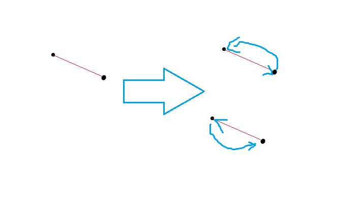

# 20231024 B 组模拟赛 题解

## 前言

这道题 T1 赛后大家想出一个神逼错误做法，贼好笑，我要分享给全世界。

[密码是通用密码](../files/20231024.rar)

## T1

首先，这道题做法比较符合直觉。为方便叙述，设当前小王手上有 $x$ 块钱。

考虑若 $2x<B$，那么为了赢你至少要先达到 $2x$，如果你把 $x$ 分成 $t$ 份那么（在这一步）赢的概率就是 $p^t$，显然最优决策是分成一份全投进去。

但是若 $2x\ge B$，类似的，最优决策也是一份投进去，那么显然投完是不好的，只需要投 $B-x$ 即可。

那么假如你把每个 $x$ 和可能的下一个 $x$ 连有向边，那么除去连向 $0$ 和 $B$ 的边之外（因为这两个状态的值是已知的，可以直接计算出来），出度全为 $1$，也就是说它是一个内向基环森林的形式。考虑对于一个环如何算答案，容易发现如果你沿着一个环走完整的一圈，那么你会得到一个 $x=kx+b$ 的形式，直接解方程即可（就省去了高斯消元）。

复杂度 $O(B\log B)$（因为要算逆元，说不定可以去掉，另外这个上界比较松，说不定有更紧的上界）。

/// details | 参考代码
    open: False
    type: success

```cpp
#include<bits/stdc++.h>
#define mem(a,b) memset(a,b,sizeof(a))
#define forup(i,s,e) for(int i=(s);i<=(e);i++)
#define fordown(i,s,e) for(int i=(s);i>=(e);i--)
using namespace std;
#define gc getchar()
inline int read(){
    int x=0,f=1;char c;
    while(!isdigit(c=gc)) if(c=='-') f=-1;
    while(isdigit(c)){x=(x<<3)+(x<<1)+(c^48);c=gc;}
    return x*f;
}
#undef gc
const int N=1e6+5,mod=998244353;
int a,b,q,p,vis[N],ans[N];
int ksm(int a,int b){
	int c=1;
	while(b){
		if(b&1) c=1ll*a*c%mod;
		a=1ll*a*a%mod;
		b>>=1;
	}
	return c;
}
void dfs(int t,int x,int &k,int &d){
	if(t==x) return;
	if(t*2<b){
		dfs(t*2,x,k,d);
		k=1ll*k*p%mod;
		d=1ll*d*p%mod;
	}else{
		dfs(t*2-b,x,k,d);
		k=1ll*k*q%mod;
		d=(1ll*d*q%mod+p)%mod;
	}
}
int solve(int x){
	if(x==0) return 0;
	if(ans[x]) return ans[x];
	if(vis[x]){
		int k=1,d=0;
		if(x*2<b){
			dfs(x*2,x,k,d);
			k=1ll*k*p%mod;
			d=1ll*d*p%mod;
		}else{
			dfs(x*2-b,x,k,d);
			k=1ll*k*q%mod;
			d=(1ll*d*q%mod+p)%mod;
		}
		ans[x]=1ll*d*ksm(mod+1-k,mod-2)%mod;
		return ans[x];
	}
	vis[x]=1;
	if(x*2<b){
		ans[x]=1ll*p*solve(x*2)%mod;
	}else{
		ans[x]=(1ll*q*solve(x*2-b)%mod+p)%mod;
	}
	return ans[x];
}
signed main(){
	a=read(),b=read(),q=read();
	p=1ll*q*ksm(1000000,mod-2)%mod;q=(mod+1-p)%mod;
	ans[b]=1;ans[0]=0;
	printf("%d\n",solve(a));
	return 0;
}
```

///

另外我们的神逼做法是这样的：

假如你每次只拿一半的钱，你就永远不会输。

那么最终状态显然只有赢和输两种，只要你一直不输，你就一定会赢。所以答案是 $1$。

~~当然这是错的。~~

## T2

我赛时唯一做出来的题。

首先考虑这个保证 $p_x=y$ 或 $p_y=x$ 的条件。容易发现它等价于在置换环上 $x,y$ 之间必须连一条有向边。那么这时候就能判无解了，即有某个点度数大于 $2$，因为置换环上每个点出度入度都必须为 $1$（算上自环）。

那么现在的问题就是你有一些游离的入度和出度需要匹配，然后每条链和环有两个方向，那直接一个阶乘乘上 $2$ 的多少次方就搞定了。

但是有个问题，就是形如这样的东西：



容易发现右边两种情况本质是相同的，但是会被算两次，怎么办呢？

其实这就是一个简单的容斥，大概是**钦定偶数组只有一种连法的方案数**减去**钦定奇数组只有一种连法的方案数**，具体式子很好推，不展开讲了。

复杂度 $O(n)$。

/// details | 参考代码
    open: False
    type: success

```cpp
#include<bits/stdc++.h>
#define mem(a,b) memset(a,b,sizeof(a))
#define forup(i,s,e) for(int i=(s);i<=(e);i++)
#define fordown(i,s,e) for(int i=(s);i>=(e);i--)
using namespace std;
using pii=pair<int,int>;
#define fi first
#define se second
#define mkp make_pair
#define gc getchar()
inline int read(){
    int x=0,f=1;char c;
    while(!isdigit(c=gc)) if(c=='-') f=-1;
    while(isdigit(c)){x=(x<<3)+(x<<1)+(c^48);c=gc;}
    return x*f;
}
#undef gc
const int N=5e5+5,inf=0x3f3f3f3f,mod=998244353,inv2=499122177;
int n,m,ans=1;
int ksm(int a,int b){
	int c=1;
	while(b){
		if(b&1) c=1ll*a*c%mod;
		a=1ll*a*a%mod;
		b>>=1;
	}
	return c;
}
vector<pii> adm;
vector<int> e[N];
int deg[N],vis[N];
int dfs(int x){
	vis[x]=1;
	int res=1;
	for(auto i:e[x]){
		if(vis[i]) continue;
		res+=dfs(i);
	}
	return res;
}
int fact[N],finv[N];
int C(int n,int m){
	if(n<m) return 0;
	return 1ll*fact[n]*finv[m]%mod*finv[n-m]%mod;
}
signed main(){
	n=read();m=read();
	forup(i,1,m){
		int x=read(),y=read();
		if(x>y) swap(x,y);
		adm.push_back(mkp(x,y));
	}
	sort(adm.begin(),adm.end());
	adm.erase(unique(adm.begin(),adm.end()),adm.end());
	for(auto i:adm){
		int u=i.fi,v=i.se;
		e[u].push_back(v);
		e[v].push_back(u);
		++deg[u];++deg[v];
		if(deg[u]>2||deg[v]>2){
			puts("0");
			return 0;
		}
	}
	int cnt=n,c1=0,c2=1;
	forup(i,1,n){
		if(!vis[i]&&deg[i]==1){
			c2=2ll*c2%mod;
			int rr=dfs(i);
			if(rr==2) ++c1;
			cnt-=(rr-1);
		}
	}
	forup(i,1,n){
		if(!vis[i]&&deg[i]==2){
			int rr=dfs(i);
			if(rr>1) c2=2ll*c2%mod;
			cnt-=rr;
		}
	}
	fact[0]=1;
	forup(i,1,cnt) fact[i]=1ll*fact[i-1]*i%mod;
	finv[cnt]=ksm(fact[cnt],mod-2);
	fordown(i,cnt-1,0) finv[i]=1ll*finv[i+1]*(i+1)%mod;
	ans=1ll*c2*fact[cnt]%mod;
	forup(i,1,c1){
		c2=1ll*inv2*c2%mod;
		ans=(ans+mod+(i%2==1?-1ll:1ll)*fact[cnt-i]*C(c1,i)%mod*c2%mod)%mod;
	}
	printf("%d\n",ans);
}
```

///

## T3

首先，容易发现如果你想以最小代价把书搬完，那么每个点作为搬书区间左端点/右端点的次数是很好求的。那么这个问题其实就和最优化没什么关系了。

然后考虑怎么用线段树维护询问，其实爆简单。若左儿子右端点与右儿子左端点颜色不同，新区间代价就是两边简单相加。否则就把尽量多左儿子的后缀与右儿子的前缀合并，减去 $\min(a_{mid},a_{mid+1})\times(w_{mid}+w_{mid+1})$。然后就可以直接维护了，比较简单（但是我赛时脑子抽了）。

为了维护区间涂色，还要额外维护一个“如果区间是同一个颜色，答案是多少”。

复杂度 $O(n\log n)$。

/// details | 参考代码
    open: False
    type: success

```cpp
#include<bits/stdc++.h>
#define mem(a,b) memset(a,b,sizeof(a))
#define forup(i,s,e) for(i64 i=(s);i<=(e);i++)
#define fordown(i,s,e) for(i64 i=(s);i>=(e);i--)
using namespace std;
using i64=__int128;
#define gc getchar()
i64 read(){
    i64 x=0,f=1;char c;
    while(!isdigit(c=gc)) if(c=='-') f=-1;
    while(isdigit(c)){x=(x<<3)+(x<<1)+(c^48);c=gc;}
    return x*f;
}
void print(i64 x,i64 p=0){
	if(x==0){
		if(p==0) putchar('0');
		return;
	}
	print(x/10,p+1);
	putchar(x%10+'0');
}
const i64 N=2e5+5;
i64 n,m;
struct Info{
	i64 al,ar,wl,wr,cl,cr,val,pval;
}s[N];
Info operator +(const Info ls,const Info rs){
	Info res;
	res.al=ls.al;res.ar=rs.ar;
	res.wl=ls.wl;res.wr=rs.wr;
	res.cl=ls.cl;res.cr=rs.cr;
	res.val=ls.val+rs.val;
	if(ls.cr==rs.cl) res.val-=(ls.wr+rs.wl)*min(ls.ar,rs.al);
	res.pval=ls.pval+rs.pval;
	res.pval-=(ls.wr+rs.wl)*min(ls.ar,rs.al);
	return res;
}
struct SegTree{
	#define mid ((l+r)>>1)
	#define lson l,mid,id<<1
	#define rson mid+1,r,id<<1|1
	Info queryinfo[N<<2];
	i64 cmark[N<<2];
	void PushDown(i64 id){
		queryinfo[id<<1].cl=queryinfo[id<<1].cr=queryinfo[id<<1|1].cl=queryinfo[id<<1|1].cr=cmark[id];
		cmark[id<<1]=cmark[id<<1|1]=cmark[id];
		queryinfo[id<<1].val=queryinfo[id<<1].pval;
		queryinfo[id<<1|1].val=queryinfo[id<<1|1].pval;
		cmark[id]=0;
	}
	void Build(i64 l=1,i64 r=n,i64 id=1){
		if(l==r){
			queryinfo[id]=s[l];
			return;
		}
		Build(lson);Build(rson);
		queryinfo[id]=queryinfo[id<<1]+queryinfo[id<<1|1];
	}
	void Update1(i64 P,i64 A,i64 W,i64 l=1,i64 r=n,i64 id=1){
		if(l==r){
			queryinfo[id].al=queryinfo[id].ar=A;
			queryinfo[id].wl=queryinfo[id].wr=W;
			queryinfo[id].val=queryinfo[id].pval=W*A*2;
			return;
		}
		if(cmark[id]) PushDown(id);
		if(P<=mid) Update1(P,A,W,lson);
		else       Update1(P,A,W,rson);
		queryinfo[id]=queryinfo[id<<1]+queryinfo[id<<1|1];
	}
	void Update2(i64 L,i64 R,i64 C,i64 l=1,i64 r=n,i64 id=1){
		if(L<=l&&r<=R){
			queryinfo[id].cl=queryinfo[id].cr=C;
			cmark[id]=C;
			queryinfo[id].val=queryinfo[id].pval;
			return;
		}
		if(cmark[id]) PushDown(id);
		if(L<=mid) Update2(L,R,C,lson);
		if(mid< R) Update2(L,R,C,rson);
		queryinfo[id]=queryinfo[id<<1]+queryinfo[id<<1|1];
	}
	Info Query(i64 L,i64 R,i64 l=1,i64 r=n,i64 id=1){
		if(L<=l&&r<=R){
			return queryinfo[id];
		}
		if(cmark[id]) PushDown(id);
		Info res;
		if(R<=mid) res=Query(L,R,lson);
		else if(mid<L) res=Query(L,R,rson);
		else res=Query(L,R,lson)+Query(L,R,rson);
		return res;
	}
}mt;
signed main(){
	n=read();m=read();
	forup(i,1,n){
		i64 a=read(),c=read(),w=read();
		s[i].al=s[i].ar=a;
		s[i].cl=s[i].cr=c;
		s[i].wl=s[i].wr=w;
		s[i].val=s[i].pval=a*w*2;
	}
	mt.Build();
	forup(Case,1,m){
		i64 op=read();
		if(op==1){
			i64 x=read(),a=read(),w=read();
			mt.Update1(x,a,w);
		}else if(op==2){
			i64 l=read(),r=read(),c=read();
			mt.Update2(l,r,c);
		}else{
			i64 l=read(),r=read();
			Info res=mt.Query(l,r);
			print(res.val);
			puts("");
		}
	}
}
```

///

## T4

最小割建模，赛时做不出来情有可原，NOIP 后要多看看网络流建模技巧了。

考虑问题的转化。发现题目上有一个“替换后，$C,D$ 都是 $n$ 阶排列”的条件，这其实就相当于你一次替换必须替换整个置换环。也就是说这是个决策**是否替换某个置换环**的问题，貌似是经典最小割建模的设问类型。

为方便叙述，记 $x_i$ 表示 $A_i$ 所在置换环是否被替换，$y_i$ 表示 $B_i$ 所在置换环是否被替换。分情况讨论一下每个 $i$ 何时会做贡献。

1. $A_i=i,B_i=i$：无论如何都会产生贡献，直接统计答案，不加入网络流图。
2. $A_i\ne i,B_i=i$：当 $x_i=0$ 时会产生贡献。
3. $A_i=i,B_i\ne i$：同理。
4. $A_i\ne i,B_i\ne i,A_i\ne B_i$：在 $x_i\lor y_i$ 时不会产生贡献。
5. $A_i\ne i,B_i\ne i,A_i = B_i$：在 $x_i\oplus y_i$ 时不会产生贡献，其中 $\oplus$ 表示异或。

那么考虑如何建模。首先容易想到源点向 $A$ 中所有置换环连边，$B$ 中所有置换环向汇点连边。然后令割开后，$A$ 在 $S$ 集合中的置换环是被替换的，$B$ 在 $T$ 集合中的置换环是被替换的。

为方便叙述，记 $A_i$ 所在的置换环为 $c(A_i)$。

首先情况 $2$，容易发现会在 $S\to c(A_i)$ 被割掉后产生贡献，即使 $S\to c(A_i)$ 的容量 $+1$。情况 $3$ 同理。

然后考虑情况 $4$，容易发现它在 $c(A_i)\in T，c(B_i)\in S$ 的时候产生贡献，那么连一条 $c(B_i)\to c(A_i)$ 的边，容量为 $1$ 即可。

最后考虑最复杂的情况 $5$，他在  $c(A_i)\in T\land c(B_i)\in S$ 或 $c(A_i)\notin T\land c(B_i)\notin S$ 时产生贡献。那么连一条 $c(A_i)\to c(B_i)$ 的容量为 $1$ 的边，再连一条 $c(B_i)\to c(A_i)$ 的容量为 $1$ 的边。它们其中之一被割掉都会产生贡献。

/// details | 参考代码
    open: False
    type: success

```cpp
#include<bits/stdc++.h>
#define mem(a,b) memset(a,b,sizeof(a))
#define forup(i,s,e) for(int i=(s);i<=(e);i++)
#define fordown(i,s,e) for(int i=(s);i>=(e);i--)
using namespace std;
using pii=pair<int,int>;
#define fi first
#define se second
#define mkp make_pair
#define gc getchar()
inline int read(){
    int x=0,f=1;char c;
    while(!isdigit(c=gc)) if(c=='-') f=-1;
    while(isdigit(c)){x=(x<<3)+(x<<1)+(c^48);c=gc;}
    return x*f;
}
#undef gc
const int N=1e5+5,inf=0x3f3f3f3f;
int n,a[N],b[N],c[N],d[N],ans,visa[N],visb[N];
vector<vector<int> > va,vb;
void find(int *a,int &la,int *vis){
	int cnt=0;
	forup(i,1,n){
		if(vis[i]||a[i]==i) continue;
		int l=i;
		++cnt;
		do{
			vis[l]=cnt;
			l=a[l];
		}while(l!=i);
		++la;
	}
}
struct dinic{
	struct edge{
		int v,rst,nxt;
	}e[N<<3];
	int head[N<<1],cur[N<<1],dpt[N<<1],cnte=1,s,t,szn;
	void adde(int u,int v,int w){
		e[++cnte]=edge{v,w,head[u]};head[u]=cnte;
		e[++cnte]=edge{u,0,head[v]};head[v]=cnte;
	}
	bool bfs(){
		forup(i,1,szn){
			cur[i]=head[i];
			dpt[i]=-1;
		}
		queue<int> q;q.push(s);
		dpt[s]=0;
		while(q.size()){
			int u=q.front();q.pop();
			for(int i=head[u];i;i=e[i].nxt){
				if(!e[i].rst) continue;
				int v=e[i].v;
				if(dpt[v]!=-1) continue;
				dpt[v]=dpt[u]+1;
				q.push(v);
			}
		}
		return dpt[t]!=-1;
	}
	int dfs(int x,int flow){
		if(x==t||!flow) return flow;
		int res=0;
		for(int i=cur[x];i;i=e[i].nxt){
			cur[x]=i;
			int v=e[i].v;
			if(dpt[v]==dpt[x]+1){
				int gt=dfs(v,min(e[i].rst,flow-res));
				if(gt){
					res+=gt;
					e[i].rst-=gt;
					e[i^1].rst+=gt;
					if(res==flow) break;
				}
			}
		}
		return res;
	}
	int maxflow(){
		int ans=0;
		while(bfs()){
			ans+=dfs(s,inf);
		}
		return ans;
	}
}mf;
map<pii,int> mp;
signed main(){
	n=read();
	forup(i,1,n){
		a[i]=read();
	}
	forup(i,1,n){
		b[i]=read();
	}
	int la=0,lb=0; 
	find(a,la,visa);find(b,lb,visb);
	mf.s=la+lb+1;mf.t=mf.s+1;
	mf.szn=mf.t;
	forup(i,1,n){
		if(a[i]==i){
			if(b[i]==i){
				++ans;
			}else{
				mp[mkp(la+visb[i],mf.t)]++;
			}
		}else{
			if(b[i]==i){
				mp[mkp(mf.s,visa[i])]++;
			}else if(a[i]==b[i]){
				mp[mkp(visa[i],la+visb[i])]++;
				mp[mkp(la+visb[i],visa[i])]++;
			}else{
				mp[mkp(la+visb[i],visa[i])]++;
			}
		}
	}
	for(auto i:mp){
		int u=i.fi.fi,v=i.fi.se,w=i.se;
		mf.adde(u,v,w);
	}
	printf("%d\n",ans+mf.maxflow());
}
```

另外这道题最影响程序运行效率的是评测机波动……

///