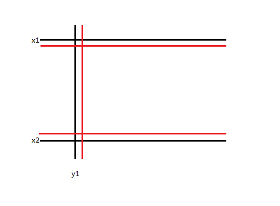
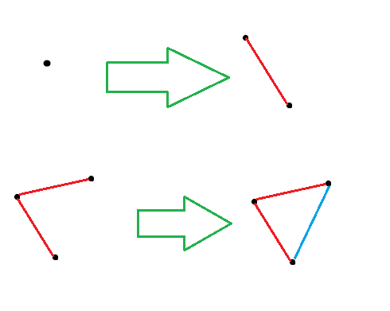
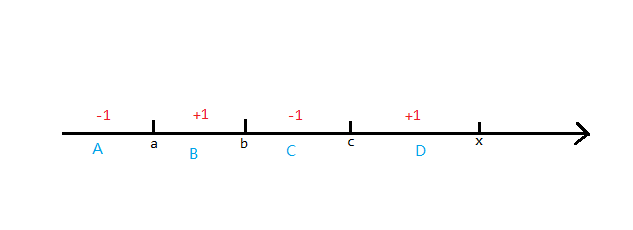

# 20231026 B 组模拟赛 题解

## 前言

T1 是巨大分类讨论，但目前大家还没找到一个真正正确的构造方案，鉴定为改了没什么营养。

[密码是通用密码](../files/20231026.rar)

## T2

很妙的题。

首先核心思路是**固定上下端点 $x_1,x_2$ 和左端点 $y_1$，求出有多少个右端点满足条件。**

你可以发现**没有空穴**和**有且仅有一个连通块**是可以分开处理的。

先处理比较简单的，“没有空穴”怎么处理呢？容易想到对于整张图上的每一个空穴，我们很容易找到完全包含它的最小矩形。那么完全包含这样的矩形的矩形就是有空穴的，另外容易发现这样的矩形是不重合的，可以直接存到 $(x_1,x_2,y_1)$ 的位置。也就是说，我们可以考虑对 $(x_1,x_2,y_1)$ 的三元组求出它的右端点到哪个位置完整包含第一个空穴，设这个位置为 $lim_{x_1,x_2,y_1}$，那么必定更往右的都有空穴。

而这其实是是很容易 $O(n^3)$ 做的：



考虑 $(x_1,x_2,y_1)$ 围出来的区域中，空穴除了 $(x_1+1,x_2,y_1),(x_1,x_2-1,y_1),(x_1,x_2,y_1+1)$ 三组围出来的以外，就只有它自己了。那么类似于区间 dp，可以 $O(1)$ 转移。

---

接下来考虑**有且仅有一个连通块**如何处理。这个要用到一个叫“平面图欧拉公式”的东西。

公示内容很简单，对于一个连通的有至少一个点的平面图，$V+F-E=2$，其中 $V$ 是图中点的个数，$F$ 是面的个数，$E$ 是边的个数。平面图的定义是**能画在平面上的图**，即**任意两条边相交都会产生一个新的点**，或者说从 OI 的 graph 视角来看，是**边在结点之外均不相交的图**。

考虑证明欧拉公式，这里做一个简单证明：



首先考虑单个点，显然 $V+F-E=2$(因为本来平面就是一个面)。

而考虑加一条边，容易发现一条边必定使点数 $+1$ 或使面数 $+1$，那么显然上式的值是不会变的。

并且如果你不算初始的平面的话，$V+F-E$ 就是**平面图连通块个数**！

注意到题目对于连通块的定义是**四连通块**，即每个黑色方格向上下左右黑色方格连边组成的连通块，恰好符合平面图的定义。那么我们可以考虑维护 $V+F-E$ 来判断矩阵内连通块个数。

回到我们的核心思路，即我们在**固定 $x_1,x_2$ 后求出有多少个 $y_2$ 能和枚举的 $y_1$ 匹配**。由于固定了 $x_1,x_2$，那么久只需要处理一个一维的问题了，很容易想到维护前缀和。

首先对于一个前缀，边和点的数量是好统计的，但是面的数量不好做，怎么办呢？注意到合法区间是没有空穴的，而除去空穴，**所有的面都是 $2\times 2$ 的矩形！**这就非常好做了。设 $v_i$ 为 $1\sim i$ 的前缀点的个数（即黑色方格的个数）。为方便前缀和，边要统计两种，设 $e1_i$ 为竖着的边的个数（即 $a_{x,y}=1$ 且 $a_{x+1,y}=1$，并且都在 $x_1,x_2$ 范围内），$e2_i$ 为横着的边的个数（即 $a_{x,y}=1$ 且 $a_{x,y-1}=1$，并且 $y\le i$，即往前统计）。然后类似于 $e2$，我们定义 $f_i$ 为 $2\times 2$ 面的个数，并且同样是往前统计。

那么一个 $y_2$ 能和 $y_1$ 匹配，当且仅当 $(v_{y_2}-v_{y_1-1})+(f_{y_2}-f_{y_1})-(e1_{y_2}-e1_{y_1-1})-(e2_{y_2}-e2_{y_1})=1$（注意有哪些下标是 $y_1$，哪些是 $y_1-1$），即 $(v_{y_2}+f_{y_2}-e1_{y_2}-e2_{y_2})-(v_{y_1-1}+f_{y_1}-e1_{y_1-}-e2_{y_1})=1$，且 $y_2<lim_{x_1,x_2,y_2}$。

容易发现，随着 $y_1$ 的减小，$lim_{x_1,x_2,y_2}$ 是单调不增的，那么可以类似于滑动窗口的做，由于 $v_{y_2}+f_{y_2}-e1_{y_2}-e2_{y_2}$ 的值域大约是 $[-n^2,2n^2]$，你可以直接开个数组记每个值出现了多少次，复杂度 $O(n^3)$。

注意 $v,f,e1,e2$ 每次单独求复杂度是错的，可以考虑先纵向求出每一列的答案然后每次扫的时候再拼成前缀和。

/// details | 参考代码
    open: False
    type: success

```cpp
#include<bits/stdc++.h>
#define mem(a,b) memset(a,b,sizeof(a))
#define forup(i,s,e) for(i64 i=(s);i<=(e);i++)
#define fordown(i,s,e) for(i64 i=(s);i>=(e);i--)
#define y1 y114514
using namespace std;
using i64=long long;
#define gc getchar()
inline i64 read(){
    i64 x=0,f=1;char c;
    while(!isdigit(c=gc)) if(c=='-') f=-1;
    while(isdigit(c)){x=(x<<3)+(x<<1)+(c^48);c=gc;}
    return x*f;
}
#undef gc
const i64 N=305,inf=0x3f3f3f3f;
i64 n,m,a[N][N],vis[N][N],ans,lim[N][N][N];
char str[N];
i64 nxt[4][2]={
	{0,1},{1,0},{0,-1},{-1,0}
};
struct Node{
	i64 u,d,l,r;
};
Node dfs(i64 x,i64 y){
	vis[x][y]=1;
	Node res=Node{x,x,y,y};
	forup(i,0,3){
		i64 nx=x+nxt[i][0],ny=y+nxt[i][1];
		if(nx<1||nx>n||ny<1||ny>m||a[nx][ny]||vis[nx][ny]) continue;
		Node gt=dfs(nx,ny);
		res.u=min(res.u,gt.u);
		res.d=max(res.d,gt.d);
		res.l=min(res.l,gt.l);
		res.r=max(res.r,gt.r);
	}
	return res;
}
struct Negative_index{
	i64 c[N*N*4];
	i64& operator [](const i64 &p){
		return c[p+N*N*2];
	}
}cnt;
i64 pv[N][N],pf[N][N],pe1[N][N],pe2[N][N];
i64 cv[N],cf[N],ce1[N],ce2[N];
signed main(){
	n=read();m=read();
	forup(i,1,n){
		scanf(" %s",str+1);
		forup(j,1,m){
			a[i][j]=(str[j]=='1');
		}
	}
	forup(i,1,n+1){
		forup(j,i-1,n){
			forup(k,1,m+1){
				lim[i][j][k]=m;
			}
		}
	}
	forup(i,1,n){
		forup(j,1,m){
			if(vis[i][j]||a[i][j]) continue;
			Node res=dfs(i,j);
			lim[res.u-1][res.d+1][res.l-1]=min(lim[res.u-1][res.d+1][res.l-1],res.r);
		}
	}
	forup(len,1,n){
		forup(i,1,n-len+1){
			i64 j=i+len-1;
			fordown(k,m,1){
				lim[i][j][k]=min({lim[i][j][k],lim[i+1][j][k],lim[i][j-1][k],lim[i][j][k+1]});
			}
		}
	}
	forup(y,1,m){
		forup(i,1,n){
			pv[i][y]=pv[i-1][y]+a[i][y];
			pe1[i][y]=pe1[i-1][y]+(a[i][y]&a[i][y-1]);
		}
		forup(i,1,n-1){
			pe2[i][y]=pe2[i-1][y]+(a[i][y]&a[i+1][y]);
			pf[i][y]=pf[i-1][y]+(a[i][y]&a[i+1][y]&a[i][y-1]&a[i+1][y-1]);
		}		
	}
	forup(l,1,n){
		forup(r,l,n){
			i64 ll=m;
			cv[0]=cf[0]=ce1[0]=ce2[0]=0;
			forup(y,1,m){
				cv[y]=cv[y-1]+pv[r][y]-pv[l-1][y];
				cf[y]=cf[y-1]+pf[r-1][y]-pf[l-1][y];
				ce1[y]=ce1[y-1]+pe1[r][y]-pe1[l-1][y];
				ce2[y]=ce2[y-1]+pe2[r-1][y]-pe2[l-1][y];
			}
			fordown(y,m,1){
				while(ll>lim[l][r][y]){
					cnt[cv[ll]+cf[ll]-ce1[ll]-ce2[ll]]--;
					--ll;
				}
				cnt[cv[y]+cf[y]-ce1[y]-ce2[y]]++;
				ans+=cnt[cv[y-1]+cf[y]-ce1[y]-ce2[y-1]+1];
			}
			while(ll>=1){
				cnt[cv[ll]+cf[ll]-ce1[ll]-ce2[ll]]--;
				--ll;
			}
		}
	}
	printf("%lld\n",ans);
}
```

///

## T3

容斥板子题。

首先**每条路径都是丰富多彩的**这个条件很难做，不妨考虑用**总的涂色方案数减去有任意一条路径不是丰富多彩的的方案数**。

那么套路地，我们每次钦定一个集合 $S$ 中的路径不是丰富多彩的，设这样的方案数为 $f(S)$，那么答案就是：

$$\sum_{S}(-1)^{|S|}f(S)$$

然后考虑这个 $f(S)$ 怎么算。其实很简单，我们可以很简单并查集求出有多少个必须涂同一种颜色的集合，然后快速幂一下就做完了。

复杂度 $O(2^mn\log n)$。

/// details | 参考代码
	open: False
	type: success

```cpp
#include<bits/stdc++.h>
#define mem(a,b) memset(a,b,sizeof(a))
#define forup(i,s,e) for(int i=(s);i<=(e);i++)
#define fordown(i,s,e) for(int i=(s);i>=(e);i--)
using namespace std;
using pii=pair<int,int>;
#define fi first
#define se second
#define mkp make_pair
#define gc getchar()
inline int read(){
    int x=0,f=1;char c;
    while(!isdigit(c=gc)) if(c=='-') f=-1;
    while(isdigit(c)){x=(x<<3)+(x<<1)+(c^48);c=gc;}
    return x*f;
}
#undef gc
const int N=65,inf=0x3f3f3f3f,mod=1e9+7;
int n,m,k,ans;
int ksm(int a,int b){
	int c=1;
	while(b){
		if(b&1) c=1ll*a*c%mod;
		a=1ll*a*a%mod;
		b>>=1;
	}
	return c;
}
vector<pii> e[N];
vector<int> pa[20];
bool dfs(int x,int fa,int pp,int ed){
	if(x==ed) return true;
	for(auto i:e[x]){
		if(i.fi==fa) continue;
		pa[pp].push_back(i.se);
		if(dfs(i.fi,x,pp,ed)) return true;
		pa[pp].pop_back();
	}
	return false;
}
int ppcnt(int x){
	int res=0;
	while(x){
		x-=x&-x;
		++res;
	}
	return res;
}
int fa[N];
int getfa(int x){return x==fa[x]?x:fa[x]=getfa(fa[x]);}
signed main(){
	n=read();m=read();k=read();
	forup(i,1,n-1){
		int u=read(),v=read();
		e[u].push_back(mkp(v,i));
		e[v].push_back(mkp(u,i));
	}
	forup(i,1,m){
		int st=read(),ed=read();
		dfs(st,0,i,ed);
	}
	forup(msk,0,(1<<m)-1){
		int pp=ppcnt(msk),ff=(pp&1?-1:1),cnt=0;
		forup(i,1,n-1){
			fa[i]=i;
		}
		forup(i,1,m){
			if(msk&(1<<(i-1))){
				int pre=0;
				for(auto j:pa[i]){
					if(pre!=0) fa[getfa(j)]=getfa(pre);
					pre=j;
				}
			}
		}
		forup(i,1,n-1){
			if(fa[i]==i) ++cnt;
		}
		ans=(ans+mod+1ll*ff*ksm(k,cnt)%mod)%mod;
	}
	printf("%d\n",ans);
}
```

///

## T4

题意就是让你求有多少个权值连续段在网格上恰好是一个矩形。

那么可以考虑扫描线，求出每个权值右端点有多少个合法的权值左端点。

但是每个点对于矩形的影响是很难做的，因为包含一个点的矩形总数量是很庞大的。怎么办呢，考虑把一个“矩形”的条件拆成更小的条件。

这里有个套路。假如你以每个格子为左上角框一个 $2\times 2$ 的小方格（包括左边缘往外一层和上边缘往外一层），容易发现网格图上有且仅有一个矩形，当且仅当恰好有 $4$ 个格子内有一个有效点，且没有任何一个格子内有三个有效点，证明考虑分讨，略。为方便叙述，我们令里面有 $k$ 个有效点的矩形个数为 $c_k$。那么容易发现，一个区间何方当且仅当区间内 $c_1+c_3=4$，因为若区间非空 $c_1$ 至少就是 $4$，然后 $c_3$ 显然不可能变成负数。

那么怎么维护呢？假如我们现在点的权值是 $x$，就有 $4$ 个小方格包含它，分别做即可。考虑对一个小方格应该怎么做。那么我们假设这个小方格里的四个数分别是 $a,b,c,x$，并且 $a<b<c<x$。画一条数轴：



容易发现右端点为 $x$，左端点在 $D$ 区间内的的区间 $c_0-1,c_1+1$，$C$ 区间内 $c_1-1,c_2+1$，前面两个区间同理，那么就是 $B,D$ 区间的 $c_1+c_3$ 增加，其余两个减少。

这个是可以线段树维护的，要维护**区间最小值**和**区间最小值个数**。查询的时候若区间最小值为 $4$ 就产生贡献，否则不产生贡献，代码还是挺好写的。

复杂度 $O(nm\log nm)$。

/// details | 参考代码
	open: False
	type: success

```cpp
#include<bits/stdc++.h>
#define mem(a,b) memset(a,b,sizeof(a))
#define forup(i,s,e) for(i64 i=(s);i<=(e);i++)
#define fordown(i,s,e) for(i64 i=(s);i>=(e);i--)
using namespace std;
using i64=long long;
#define gc getchar()
inline i64 read(){
    i64 x=0,f=1;char c;
    while(!isdigit(c=gc)) if(c=='-') f=-1;
    while(isdigit(c)){x=(x<<3)+(x<<1)+(c^48);c=gc;}
    return x*f;
}
#undef gc
const i64 N=2e5+5,inf=0x3f3f3f3f;
i64 n,m,x[N],y[N],ans;
struct SegTree{
	#define mid ((l+r)>>1)
	#define lson l,mid,id<<1
	#define rson mid+1,r,id<<1|1
	i64 querymin[N<<2],querycnt[N<<2],mark[N<<2];
	void PushUp(i64 id){
		querymin[id]=min(querymin[id<<1],querymin[id<<1|1]);
		querycnt[id]=0;
		if(querymin[id]==querymin[id<<1]) querycnt[id]+=querycnt[id<<1];
		if(querymin[id]==querymin[id<<1|1]) querycnt[id]+=querycnt[id<<1|1];
	}
	void PushDown(i64 id){
		mark[id<<1]+=mark[id];
		mark[id<<1|1]+=mark[id];
		querymin[id<<1]+=mark[id];
		querymin[id<<1|1]+=mark[id];
		mark[id]=0;
	}
	void Build(i64 l=1,i64 r=n*m,i64 id=1){
		if(l==r){
			querycnt[id]=1;
			return;
		}
		Build(lson);Build(rson);
		PushUp(id);
	}
	void Update(i64 L,i64 R,i64 X,i64 l=1,i64 r=n*m,i64 id=1){
		if(L<=l&&r<=R){
			querymin[id]+=X;
			mark[id]+=X;
			return;
		}
		if(mark[id]) PushDown(id);
		if(L<=mid) Update(L,R,X,lson);
		if(mid< R) Update(L,R,X,rson);
		PushUp(id);
	}
	i64 Ask(i64 L,i64 R,i64 l=1,i64 r=n*m,i64 id=1){
		if(L<=l&&r<=R){
			return querymin[id]==4?querycnt[id]:0;
		}
		if(mark[id]) PushDown(id);
		i64 res=0;
		if(L<=mid) res+=Ask(L,R,lson);
		if(mid< R) res+=Ask(L,R,rson);
		return res;
	}
}mt;
signed main(){
	n=read(),m=read();
	vector<vector<i64> > a(n+5,vector<i64>(m+5));
	forup(i,1,n){
		forup(j,1,m){
			a[i][j]=read();
			x[a[i][j]]=i;y[a[i][j]]=j;
		}
	}
	mt.Build();
	forup(i,1,n*m){
		vector<i64> v[4];
		i64 xx=x[i],yy=y[i];
		v[0].push_back(a[xx][yy]);v[0].push_back(a[xx-1][yy]);v[0].push_back(a[xx][yy-1]);v[0].push_back(a[xx-1][yy-1]);
		v[1].push_back(a[xx][yy]);v[1].push_back(a[xx-1][yy]);v[1].push_back(a[xx][yy+1]);v[1].push_back(a[xx-1][yy+1]);
		v[2].push_back(a[xx][yy]);v[2].push_back(a[xx+1][yy]);v[2].push_back(a[xx][yy-1]);v[2].push_back(a[xx+1][yy-1]);
		v[3].push_back(a[xx][yy]);v[3].push_back(a[xx+1][yy]);v[3].push_back(a[xx][yy+1]);v[3].push_back(a[xx+1][yy+1]);
		forup(j,0,3){
			sort(v[j].begin(),v[j].end());
			i64 nw=lower_bound(v[j].begin(),v[j].end(),i)-v[j].begin();
			i64 p=0;while(v[j][p]==0) ++p;
			if(nw==p){
				mt.Update(1,v[j][nw],1);
			}else if(nw==p+1){
				mt.Update(1,v[j][nw-1],-1);
				mt.Update(v[j][nw-1]+1,v[j][nw],1);
			}else if(nw==p+2){
				mt.Update(1,v[j][nw-2],1);
				mt.Update(v[j][nw-2]+1,v[j][nw-1],-1);
				mt.Update(v[j][nw-1]+1,v[j][nw],1);
			}else{
				mt.Update(1,v[j][nw-3],-1);
				mt.Update(v[j][nw-3]+1,v[j][nw-2],1);
				mt.Update(v[j][nw-2]+1,v[j][nw-1],-1);
				mt.Update(v[j][nw-1]+1,v[j][nw],1);
			}
		}
		ans+=mt.Ask(1,i);
	}
	printf("%lld\n",ans);
}
```	

///