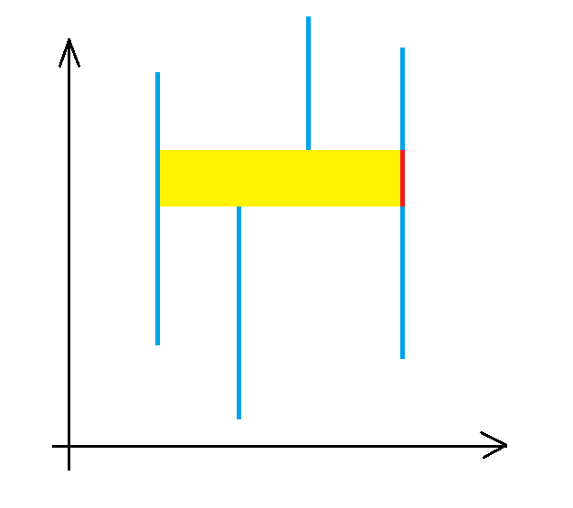

# 20231031 B 组模拟赛 题解

## 前言

T4 暂时不打算改，现在只有何神和波神改了（结果后面 H 先生的模拟赛又考了同一道原题）。

[密码是通用密码](../files/20231031.rar)

## T1

首先题目的意思就是边带权。

不管具体怎么做，先考虑应该如何构造方案。

可以把整棵树分成点 $1$ 的所有子树，容易发现无解当且仅当 $1\in T$ 或者 $\exists i\in T$，并且 $i$ 所在的子树中没有 $S$。

那么只考虑有解的情况。

首先容易想到可以先占领每棵含有 $T$ 的子树的根，这样显然是合法的。然后发现这样其实很浪费，因为首先一个子树不一定所有分叉中都有 $T$，只需要占领有 $T$ 的分叉即可。其次假如这样的分叉比较远，只需要保证在 Alice 能摸到这样的分叉之前占领即可，不必提前涂色。

那么容易想到树形 DP。设 $dp_i$ 表示若 Alice 第一步就能进入 $i$，Bob 在此之前至少需要行动多少步。

首先，若 $i\notin T$，那么显然 $dp_{i}=\sum_{v\in son_i}\max(dp_v-w,0)$，其中 $w$ 为 $(i,v)$ 的边权。

若 $i\in T$，记 $f_i$ 为 $i$ 子树中离 $i$ 最近的 $S$ 点。因为 Alice 是先手，转移后需要多走一步，故为了方便转移，此时必须找一个拓展过来，故 $dp_i=f_i+1$，并且显然上一种情况需要和 $f_i+1$ 取 $\min$（因为找一个拓展过来显然也是合法的）。

然后就做完了，复杂度 $O(n)$。

/// details | 参考代码
    open: False
    type: success

```cpp
#include<bits/stdc++.h>
#define mem(a,b) memset(a,b,sizeof(a))
#define forup(i,s,e) for(int i=(s);i<=(e);i++)
#define fordown(i,s,e) for(int i=(s);i>=(e);i--)
using namespace std;
#define gc getchar()
inline int read(){
    int x=0,f=1;char c;
    while(!isdigit(c=gc)) if(c=='-') f=-1;
    while(isdigit(c)){x=(x<<3)+(x<<1)+(c^48);c=gc;}
    return x*f;
}
#undef gc
const int N=505,inf=0x3f3f3f3f;
int c,n,cs,iss[N],ct,ist[N];
struct edge{
	int v,w;
};
vector<edge> e[N];
int dp[N],dis[N];
void dfs(int x,int fa){
	if(iss[x]) dis[x]=0;
	else dis[x]=inf;
	dp[x]=0;
	for(auto i:e[x]){
		int v=i.v,w=i.w;
		if(v==fa) continue;
		dfs(v,x);
		dp[x]=min(dp[x]+max(dp[v]-w,0),inf);
		dis[x]=min(dis[x],dis[v]+w);
	}
	if(x==1) return;
	if(ist[x]) dp[x]=dis[x]+1;
	else dp[x]=min(dp[x],dis[x]+1);
}
void solve(){
	n=read();cs=read();ct=read();
	forup(i,1,n){
		e[i].clear();
		iss[i]=ist[i]=0;
	}
	forup(i,1,n-1){
		int u=read(),v=read(),w=read();
		e[u].push_back(edge{v,w+1});
		e[v].push_back(edge{u,w+1});
	}
	forup(i,1,cs){
		int s=read();
		iss[s]=1;
	}
	forup(i,1,ct){
		int t=read();
		ist[t]=1;
	}
	if(ist[1]){
		puts("Impossible");
		return;
	}
	dfs(1,0);
	if(dp[1]>=1e9){
		puts("Impossible");
	}else{
		printf("%d\n",dp[1]);
	}
}
signed main(){
	c=read();
	while(c--){
		solve();
	}
}
```

///

## T2

带权二分图匹配典题，或许能算是最大流经典建模（因为我不会 KM 算法）。

由于保证有解，首先考虑假如每一行每一列都分别需要一个数产生贡献，那么显然代价就是 $\sum a+\sum b$（$a$ 是每一行的限定，$b$ 是每一列的限定）。

但是有些行列可以共用最大值，那么考虑对于一个可以填数的位置 $(x,y)$，若 $a_x=b_y$，那么就有一边可以少产生一次贡献。

然后容易发现这是一个带权二分图匹配的形式，直接 dinic 秒了。

/// details | 参考代码
    open: False
    type: success

```cpp
#include<bits/stdc++.h>
#define mem(a,b) memset(a,b,sizeof(a))
#define forup(i,s,e) for(i64 i=(s);i<=(e);i++)
#define fordown(i,s,e) for(i64 i=(s);i>=(e);i--)
using namespace std;
using i64=long long;
#define gc getchar()
inline i64 read(){
    i64 x=0,f=1;char c;
    while(!isdigit(c=gc)) if(c=='-') f=-1;
    while(isdigit(c)){x=(x<<3)+(x<<1)+(c^48);c=gc;}
    return x*f;
}
#undef gc
const i64 N=2505,inf=0x3f3f3f3f;
struct flow{
	struct edge{
		i64 v,rst,nxt;
	}e[N*N+5];
	i64 head[N<<1],cur[N<<1],s,t,cnte=1,n;
	i64 dpt[N<<1];
	void adde(i64 u,i64 v,i64 w){
		e[++cnte]=edge{v,w,head[u]};head[u]=cnte;
		e[++cnte]=edge{u,0,head[v]};head[v]=cnte;
	}
	bool bfs(){
		forup(i,1,n){
			cur[i]=head[i];
			dpt[i]=-1;
		}
		queue<i64> q;
		dpt[s]=0;q.push(s);
		while(q.size()){
			i64 u=q.front();q.pop();
			for(i64 i=head[u];i;i=e[i].nxt){
				if(!e[i].rst) continue;
				i64 v=e[i].v;
				if(dpt[v]!=-1) continue;
				dpt[v]=dpt[u]+1;
				q.push(v);
			}
		}
		return dpt[t]!=-1;
	}
	i64 dfs(i64 x,i64 flow){
		if(x==t||!flow) return flow;
		i64 res=0;
		for(i64 i=cur[x];i;i=e[i].nxt){
			cur[x]=i;i64 v=e[i].v;
			if(dpt[v]!=dpt[x]+1) continue;
			i64 nw=dfs(v,min(flow-res,e[i].rst));
			if(nw!=0){
				e[i].rst-=nw;
				e[i^1].rst+=nw;
				res+=nw;
				if(res==flow) break;
			}
		}
		return res;
	}
	i64 dinic(){
		i64 ans=0;
		while(bfs()){
			ans+=dfs(s,inf);
		}
		return ans;
	}
}mf;
i64 n,m,t,a[N],b[N],ans;
signed main(){
	n=read();m=read();t=read();
	forup(i,1,n){
		a[i]=read();
		ans+=a[i];
	}
	forup(i,1,n){
		b[i]=read();
		ans+=b[i];
	}
	mf.n=n*2+2;
	mf.s=n*2+1;mf.t=n*2+2;
	forup(i,1,n){
		mf.adde(mf.s,i,a[i]);
		mf.adde(i+n,mf.t,b[i]);
	}
	forup(i,1,m){
		i64 x=read(),y=read();
		if(a[x]==b[y]){
			mf.adde(x,y+n,a[x]);
		}
	}
	i64 rs=mf.dinic();
	ans-=rs;
	printf("%lld\n",ans);
}
```

///

## T3

首先套路地，把期望拆成贡献除以概率。总子区间数很好算，考虑如何算区间 $[q_l,q_r]$ 内所有子区间 $[L,R]$ 的 $w(L,R)$ 的总和。

这种看起来就不太好维护的首先可以考虑离线下来把询问挂在右端点上，然后求左端点的答案。

由于 $[L,R]$ 两边端点都不固定不好考虑，可以试着先固定 $R$，求 $L\in [q_l,q_r]$ 的所有 $[L,q_r]$ 的区间并。

那么容易想到如果我们能维护固定右端点 $R$，然后对每个左端点 $L$ 维护 $[L,R]$ 的区间并，那么这个操作就是一个区间查。所以考虑如何维护单个左端点的答案。

考虑把区间作为纵坐标，时间作为纵坐标考虑：



容易发现，对于红色的区间，当时间左端点取到黄色部分，右端点取到它右边时，它会产生贡献。

那么这个可以用珂朵莉树维护区间上一次被覆盖的时间，然后可以用数据结构维护区间加区间查解决。

然后考虑右端点也不固定应该怎么做，容易发现这就是区间历史版本和，然后就做完了。

然后简要讲一下区间历史版本和怎么维护。这个可以简单容斥，用总时间（可以维护总和再乘以查询的时间）减去没产生贡献的时间（就是上传的时间 $-1$，这个上传的时候就可以维护）。开两个线段树即可。

但是这道题卡常，需要用区间加区间查的树状数组。

复杂度 $O(n\log n)$。

/// details | 参考代码
	open: False
	type: success

```cpp
#include<bits/stdc++.h>
#define mem(a,b) memset(a,b,sizeof(a))
#define forup(i,s,e) for(int i=(s);i<=(e);i++)
#define fordown(i,s,e) for(int i=(s);i>=(e);i--)
using namespace std;
using pii=pair<int,int>;
#define fi first
#define se second
#define mkp make_pair
#define gc getchar()
inline int read(){
    int x=0,f=1;char c;
    while(!isdigit(c=gc)) if(c=='-') f=-1;
    while(isdigit(c)){x=(x<<3)+(x<<1)+(c^48);c=gc;}
    return x*f;
}
#undef gc
const int N=8e5+5,M=2e6+5,mod=998244353;
int n,m,ans[M];
struct range{
	int l,r;
}s[N];
int ksm(int a,int b){
	int c=1;
	while(b){
		if(b&1) c=1ll*a*c%mod;
		a=1ll*a*a%mod;
		b>>=1;
	}
	return c;
}
struct BIT{
	int c[N],d[N];
	void upd(int x,int k){
		int K=1ll*k*x%mod;
		for(;x<=n;x+=x&-x){
			(c[x]+=k)%=mod;
			(d[x]+=K)%=mod;
		}
	}
	int sum(int x){
		int res1=0,res2=0;
		for(int y=x;y>0;y-=y&-y){
			(res1+=c[y])%=mod;
			(res2+=d[y])%=mod;
		}
		return (1ll*res1*(x+1)%mod+mod-res2)%mod;
	}
	void Update(int L,int R,int X){
		upd(L,X);upd(R+1,mod-X);
	}
	int Query(int l,int r){
		return (sum(r)+mod-sum(l-1))%mod;
	}
};
BIT t1,t2;
struct query{
	int l,pos;
};
vector<query> q[N];
map<pii,int> odt;
using mit=map<pii,int>::iterator;
mit split(int key){
	mit it=odt.upper_bound(mkp(key,-1));
	if(it->fi.fi==key) return it;
	--it;
	int pl=it->fi.fi,pr=it->fi.se,pt=it->se;
	odt.erase(it);
	odt[mkp(pl,key-1)]=pt;
	mit res=odt.insert(mkp(mkp(key,pr),pt)).fi;
	return res;
}
signed main(){
	n=read();m=read();
	forup(i,1,n){
		s[i].l=read();s[i].r=read()-1;
	}
	forup(i,1,m){
		int l=read(),r=read();
		q[r].push_back(query{l,i});
	}
	odt[mkp(0,mod-1)]=0;
	forup(i,1,n){
		mit ed=split(s[i].r+1),st=split(s[i].l);
		for(mit it=st;it!=ed;odt.erase(prev(++it))){
			int c=it->fi.se-it->fi.fi+1;
			t1.Update(it->se+1,i,c);
			t2.Update(it->se+1,i,1ll*(i-1)*c%mod);
		}
		odt[mkp(s[i].l,s[i].r)]=i;
		for(auto j:q[i]){
			int l=j.l,pos=j.pos;
			int res=(1ll*t1.Query(l,i)*i%mod+mod-t2.Query(l,i))%mod;
			ans[pos]=1ll*res*ksm(1ll*(i-l+1)*(i-l+2)/2%mod,mod-2)%mod;
		}
	}
	forup(i,1,m){
		printf("%d\n",ans[i]);
	}
}
```

///