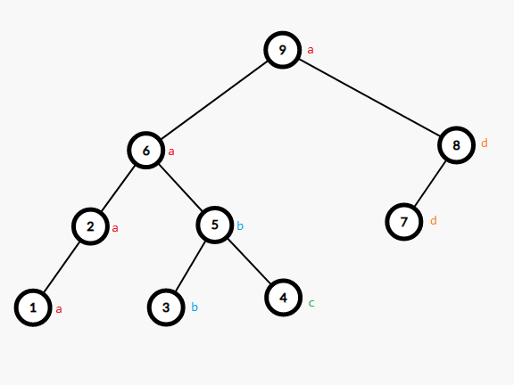

# 20231202 A 组模拟赛 题解

## 前言

哈哈，A 题不会，预估 0+0+0，实际得分“选手未找到”。

[密码是通用密码](../files/20231202.rar)

## T1

首先可以 $O(n)$ 地找到如果选了点 $i$，那么必须选的最大的点 $r_i$，和必须选的最小的点 $l_i$，具体实现大概就是个类似于 DP 的东西，很简单。

然后再考虑怎么做，容易发现一个区间 $[L,R]$ 是好的当且仅当 $\max_{i=L}^R\begin{Bmatrix}r_i\end{Bmatrix}=R\land\min_{i=L}^R\begin{Bmatrix}l_i\end{Bmatrix}=L$，因为这样你就可以恰好只选这个区间内的点而不选其余点。

两个限制不好做，考虑先解决一个再解决另一个，可以从右到左枚举左端点，对于左端点找所有合法的右端点。

可以想到用单调栈维护能成为右端点的点，具体来说，对于一个 $i$，显然 $[i,r_i)$ 都不可能成为右端点，每次扫到一个 $i$ 后把这些弹出即可。

现在我们就得到了一个 $R'$ 点集，假设现在左端点枚举到了 $L'$，那么 $\forall x\in R',\max_{i=L'}^x\begin{Bmatrix}r_i\end{Bmatrix}=x$，此时就只需要考虑左端点的条件了。

容易发现，$\min_{i=L'}^y\begin{Bmatrix}l_i\end{Bmatrix}$ 随着 $y$ 的增加单调不增，那么二分找到第一个和最后一个这玩意等于 $L'$ 的位置，然后区间查 $R'$ 的个数即可。

容易发现一个点 $i$ 能成为合法的 $L$ 的必要条件是 $l_i=i$（因为 $l_i\le i$，然后参考上面的限制），所以第一个那玩意等于 $L'$ 的位置必定是 $L'$，否则这个 $L'$ 就不可能成为合法区间的左端点。然后对 $R$ 也同理，可以当做一个小剪枝。

复杂度 $O(n\log n)$，具体实现可以考虑 ST 表 $+$ 树状数组或者线段树上二分。

/// details | 参考代码
    open: False
    type: success

```cpp
#include<bits/stdc++.h>
#define mem(a,b) memset(a,b,sizeof(a))
#define forup(i,s,e) for(int i=(s);i<=(e);i++)
#define fordown(i,s,e) for(int i=(s);i>=(e);i--)
using namespace std;
using pii=pair<int,int>;
#define fi first
#define se second
#define mkp make_pair
#define gc getchar()
inline int read(){
    int x=0,f=1;char c;
    while(!isdigit(c=gc)) if(c=='-') f=-1;
    while(isdigit(c)){x=(x<<3)+(x<<1)+(c^48);c=gc;}
    return x*f;
}
#undef gc
const int N=3e5+5,mod=1e9+7;
int n,m;
vector<int> e[N];
int mx[N],mn[N];
stack<int> stk;
int st[20][N];
void init(){
	forup(i,1,n){
		st[0][i]=mn[i];
	}
	forup(i,1,19){
		forup(j,1,n-(1<<i)+1){
			st[i][j]=min(st[i-1][j],st[i-1][j+(1<<(i-1))]);
		}
	}
}
int query(int l,int r){
	int len=31^__builtin_clz(r-l+1);
	return min(st[len][l],st[len][r-(1<<len)+1]);
}
struct BIT{
	int c[N];
	void upd(int x,int k){for(;x<=n;x+=x&-x)c[x]+=k;}
	int sum(int x){int res=0;for(;x>0;x-=x&-x)res+=c[x];return res;}
}mt;
void dfs(int x){
	mx[x]=mn[x]=x;
	for(auto i:e[x]){
		if(!mx[i]){
			dfs(i);
		}
		mx[x]=max(mx[x],mx[i]);
		mn[x]=min(mn[x],mn[i]);
	}
}
signed main(){
	n=read();m=read();
	forup(i,1,m){
		int u=read(),v=read();
		e[u].push_back(v);
	}
	forup(i,1,n){
		if(!mx[i]) dfs(i);
	}
	init();
	int ans=0;
	stack<int> stk;
	fordown(i,n,1){
		if(mx[i]==i){
			stk.push(i);
			mt.upd(i,1);
		}
		while(stk.size()&&stk.top()<mx[i]){
			mt.upd(stk.top(),-1);
			stk.pop();
		}
		if(mn[i]==i){
			int ll=i,rr=n+1,mm;
			while(ll<rr){
				mm=(ll+rr)>>1;
				if(query(i,mm)>=i) ll=mm+1;
				else rr=mm;
			}
			(ans+=mt.sum(ll-1))%=mod;
		}
	}
	printf("%d\n",ans);
}
```

///

## T2

很神秘的一道题。

容易发现（其实题目就是这样说的）一个合法序列相当于每次插空放同一种颜色的所有点，最后使得总共有 $n$ 个点。

但是这样还是不好做，一个很妙的想法是把同一种颜色的所有点作为一棵二叉树的一条左链（每个点向左儿子连边的一条链），然后每次插空就是把最右边的点作为对应空右边点的儿子。

比如序列 `aabcbadda` 变成二叉树就是这样：



容易发现二叉树形态和序列是一一对应的，序列 $\to$ 二叉树很好想，二叉树 $\to$ 序列考虑优先右儿子的 dfs 序然后 `reverse` 一下。

那么就可以通过计算对应二叉树的数量再乘以颜色的选取方案（如果二叉树上有 $i$ 条极长左链就是 $\binom{m}{i}\times i!$）来求出合法序列数量。

可以枚举这个极长左链数量 $i$，问题就变成了求出 $n$ 个点有根无标号有 $i$ 条极长左链的二叉树数量。

首先考虑把 $n$ 个点分成 $i$ 份，这个直接插板法，等于 $\binom{n-1}{i-1}$。

然后考虑右儿子怎么取，一个简单的想法是从 $n$ 个点中选取 $i-1$ 个点，表示钦定这 $i-1$ 个点**有右儿子**，然后像括号序列一样维护“未匹配的游离的右儿子”，一条一条往前连。

显然有很多情况这样是行不通的，考虑如何去掉它们。

容易发现这相当于是一个起点是 $1$ 终点是 $0$ 的括号序列，并且一个 $-1$ 和若干个 $+1$ 是绑定的，而除去绑定的块内部以外，中途其余地方都大于等于 $1$。

那么又可以发现，对于一个合法的左链序列（包含“哪些点有右儿子”的信息），随便 `rotate` 一下使其换一个起点就会使它不合法，因为除起点外任意一个地方到达终点都至少 $-1$，那么在中途就会到达 $0$。

并且对于任意一个左链序列，都能 `rotate` 得到一个合法的序列。由于恰有 $i$ 个 $-1$，$i-1$ 个 $+1$，故起点和终点的差一定是 $-1$，那么找到全序列第一个最小值，其余地方必定大于等于它，`rotate` 到它为起点就是一个合法的序列。

容易发现，每一组能通过 `rotate` 得到的等价类都会出现恰好 $i$ 次，那么将之前提到的方案数除以 $i$ 即可。

故对于一个固定的左链数量 $i$，二叉树数量是：

$$\dbinom{n-1}{i-1}\dbinom{n}{i-1}\frac{1}{i}\times \dbinom{m}{i}i!$$

那么总答案就是枚举 $i$ 加起来。预处理 $n$ 的下降幂可以做到 $O(\min(n,m))$。

/// details | 参考代码
    open: False
    type: success

```cpp
#include<bits/stdc++.h>
#define mem(a,b) memset(a,b,sizeof(a))
#define forup(i,s,e) for(int i=(s);i<=(e);i++)
#define fordown(i,s,e) for(int i=(s);i>=(e);i--)
using namespace std;
#define gc getchar()
inline int read(){
    int x=0,f=1;char c;
    while(!isdigit(c=gc)) if(c=='-') f=-1;
    while(isdigit(c)){x=(x<<3)+(x<<1)+(c^48);c=gc;}
    return x*f;
}
#undef gc
const int N=1e6+5,inf=0x3f3f3f3f,mod=1e9+7;
int n,m,invn;
int fact[N],finv[N],inv[N],fn[N];
int ksm(int a,int b){
	int c=1;
	while(b){
		if(b&1) c=1ll*a*c%mod;
		a=1ll*a*a%mod;
		b>>=1;
	}
	return c;
}
signed main(){
	n=read();m=read();
	invn=ksm(n,mod-2);
	fact[0]=fn[0]=1;
	forup(i,1,min(n,m)){
		fn[i]=1ll*fn[i-1]*(n+1-i)%mod;
	}
	forup(i,1,m){
		fact[i]=1ll*fact[i-1]*i%mod;
	}
	finv[m]=ksm(fact[m],mod-2);
	fordown(i,m-1,0){
		finv[i]=1ll*finv[i+1]*(i+1)%mod;
		inv[i+1]=1ll*finv[i+1]*fact[i]%mod;
	}
	int ans=0;
	forup(i,1,min(n,m)){
		int res=1ll*fn[i-1]*finv[i-1]%mod*fn[i]%mod*invn%mod*finv[i-1]%mod*inv[i]%mod*fact[m]%mod*finv[i]%mod*finv[m-i]%mod*fact[i]%mod;
		(ans+=res)%=mod;
	}
	printf("%d\n",ans);
}
```

///

## T3

首先容易想到一个费用流。

具体来说，设左部点代表 $a$，右部点代表 $b$，一个流的意义是选了一对 $a_i,b_j$。容易想到源点向左部点连费用为 $a_i$ 的边，右部点向汇点连费用为 $b_i$ 的边，然后中间每个左部点 $i$ 向所有 $j\ge i$ 的右部点 $j$ 连免费边即可。为了限制流量，可以建一个虚点代替原本的源点，然后源点连向这个虚点的边容量为 $k$ 即可。由于是向区间连边可以用线段树优化，据说可以得 $44pts$。

容易发现，根据我们费用流的过程，每次选代价最小的一条路增广。那么显然图像是下凸的，因为每次“代价最小的边”（就是每次的斜率）是单调不减得，考虑 wqs 二分。

思考一下转化后的问题长什么样，即从 $a,b$ 中各选相同个数个点，使得权值和最小。这是一个经典的反悔贪心，具体来说，每次考虑把当前的 $b$ 和前面最小的没用过的 $a$ 匹配，如果两者的和小于 $0$ 就产生贡献（如果不小于 $0$ 显然不优），否则跳过。由于可能后面会有一个 $b'$ 和 $a$ 搭配更好，就考虑再加一个“反悔”的操作。这个可以用优先队列维护，反悔就压入一个权值为 $-b$ 的点即可。

复杂度 $O(n\log n\log V)$，其中 $V$ 是 $a_i,b_i$ 的最大值，注意二分斜率的上限。

另外这道题还有 $O(n\log n)$ 模拟费用流做法，但是 wqs 二分显然更简单吧？

/// details | 参考代码
	open: False
	type: success

```cpp
#include<bits/stdc++.h>
#define mem(a,b) memset(a,b,sizeof(a))
#define forup(i,s,e) for(i64 i=(s);i<=(e);i++)
#define fordown(i,s,e) for(i64 i=(s);i>=(e);i--)
#ifdef DEBUG
#define msg(args...) fprintf(stderr,args)
#else
#define msg(...) void()
#endif
using namespace std;
using i64=long long;
using pii=pair<i64,i64>;
#define fi first
#define se second
#define mkp make_pair
#define gc getchar()
inline i64 read(){
    i64 x=0,f=1;char c;
    while(!isdigit(c=gc)) if(c=='-') f=-1;
    while(isdigit(c)){x=(x<<3)+(x<<1)+(c^48);c=gc;}
    return x*f;
}
#undef gc
const i64 N=1e5+5,inf=0x3f3f3f3f;
i64 n,m,a[N],b[N],ans,res;
bool chk(i64 mm){
	forup(i,1,n){
		a[i]-=mm;
	}
	ans=0;
	priority_queue<pii,vector<pii>,greater<pii>> q;
	i64 pp=0;
	forup(i,1,n){
		q.push(mkp(a[i],1));
		if(b[i]+q.top().fi<0){
			ans+=b[i]+q.top().fi;;
			pp+=q.top().se;
			q.pop();
			q.push(mkp(-b[i],0));
		}
	}
	forup(i,1,n){
		a[i]+=mm;
	}
	return pp<=m;
}
signed main(){
	n=read();m=read();
	forup(i,1,n) a[i]=read();
	forup(i,1,n) b[i]=read();
	i64 ll=0,rr=2e9,mm;
	while(ll<rr){
		mm=(ll+rr+1)>>1;
		if(chk(mm)) ll=mm,res=ans+mm*m;
		else rr=mm-1;
	}
	printf("%lld\n",res);
}
```

///