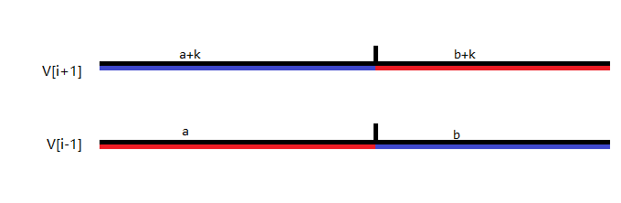

# 20231204 A 组模拟赛 题解

## 前言

感觉升到 A 组后模拟赛质量高了好多。

## T3

很智慧的一道题。

考虑一个暴力 DP，设 $dp_{i,j}$ 表示第 $i$ 天，换乘 $j$ 次的最大贡献是多少。转移很简单，就是考虑现在的城市是 $j\bmod k$，然后下一步换不换乘。复杂度 $O(n^2)$，有 25pts。

考虑如何优化。注意到这道题 $k$ 的范围很小，但是上面的方法复杂度和 $k$ 一点关系都没有。如何和 $k$ 扯上关系呢？考虑把 $j$ 写成 $pk+q$ 的形式，因为对于同一个 $q$，转移是相同的，所以考虑 $p$ 的取值。容易猜到 $dp_{i,pk+q}$ 在固定 $i,p$ 后，可能是关于 $p$ 上凸的（感性来说，最大值肯定在中间取到），考虑证明。

首先一个和上凸（$y_{i+1}-y_{i}$ 关于 $i$ 单调不增，不用除以 $x$ 是因为相邻两个 $x$ 之差均为 $1$）等价的命题是 $\forall i\in(1,n),\frac{y_{i+1}+y_{i-1}}{2}\le y_i$，代数证明可以考虑两边乘以二然后移项，几何证明考虑取 $(x_{i-1},y_{i-1}),(x_{i+1},y_{i+1})$ 的中点。

回到原问题，容易发现若令 $V_p=dp_{i,pk+q}$，那么假如我们能证明 $\frac{V_{i-1}+V_{i+1}}{2}\le V_i$，就能说明 $V$ 是上凸的。考虑把 $V_{i-1},V_{i+1}$ 的路径并排放在一起：



那么必定能找到一个分界点，使得分界点左侧，$V_{i+1}$ 和 $V_{i-1}$ 的换乘次数之差是 $k$，那么右侧换乘次数之差同样也是 $k$。那么显然在分界点处的位置是相同的。此时把两段分开重新拼起来（就是两红色线段和两蓝色线段）换乘次数必定是 $ik+q$，即一个换乘次数正确的 $V_i$。显然两方案中必定有一个大于等于 $\frac{V_{i-1}+V_{i+1}}{2}$，得证。

考虑上凸之后我们能干什么（这一步很不自然我也不知道题解怎么想到的，或许是因为上一步的证明让人想到把一个序列拆成两半？），可以想到，若把某个方案分成两半，合起来的时候就是一个 $(\max,+)$ 卷积。具体来说，设 $(l,r,x,y)$ 表示从 $l$ 到 $r$，换乘 $x$ 次，获利为 $y$ 的方案，那么 $(l,r,x,y)$ 必定能从 $(l,mid,x',y')+(mid+1,x-x',y-y')$（或者在中间换乘一次，$(l,mid,x',y')+(mid+1,r,x-x'+1,y-y')$）得到。而凸性和 $(\max,+)$ 卷积让人联想到闵可夫斯基和，考虑把刚刚很粗糙的猜想细化，并套入关于 $p$ 的凸性。

由于区间的左右端点不固定，所以还要记录起点和终点的城镇 $S,E$（容易发现 $q$ 就是 $(E+m-S)\bmod m$），那么容易想到固定 $(l,r,S,E)$，这样 $V$ 关于 $p$ 就是上凸的。然后分治，合并时每局中间点 $M$，求闵可夫斯基和即可。

这里有一个细节，合并是从 $(l,mid,S,M)+(mid+1,r,M,E)/(mid+1,r,(M+1)\bmod m,E)$ 转移，注意 $S\to M(\to (M+1)\bmod m)\to E$ 会不会额外绕一圈。

时间复杂度 $O(k^3\sum\frac{len}{k})=O(k^2n\log n)$，4s 还是随便过的。然后空间每次可以复用之前的，貌似可以做到 $O(k^2\frac{n}{k})=O(nk)$，但是我空间貌似写挂了，但是无所谓能过就行。

/// details | 参考代码
    open: False
    type: success

```cpp
#include<bits/stdc++.h>
#define mem(a,b) memset(a,b,sizeof(a))
#define forup(i,s,e) for(i64 i=(s);i<=(e);i++)
#define fordown(i,s,e) for(i64 i=(s);i>=(e);i--)
#ifdef DEBUG
#define msg(args...) fprintf(stderr,args)
#else
#define msg(...) void()
#endif
using namespace std;
using i64=long long;
#define gc getchar()
inline i64 read(){
    i64 x=0,f=1;char c;
    while(!isdigit(c=gc)) if(c=='-') f=-1;
    while(isdigit(c)){x=(x<<3)+(x<<1)+(c^48);c=gc;}
    return x*f;
}
#undef gc
const i64 N=1e5+5,inf=0x3f3f3f3f;
i64 n,m,q;
i64 a[7][N];
vector<i64> f[N<<2][7][7];
void work(vector<i64>& vec,vector<i64> &vls,vector<i64> &vrs,i64 flag){
	if(vls.empty()||vrs.empty()) return;
	i64 ll=1,rr=1,nw=vls[0]+vrs[0],lsz=vls.size(),rsz=vrs.size();
	vec[flag]=max(vec[flag],nw);
	forup(i,1,lsz+rsz-2){
		if(rr==rsz||(ll<lsz&&vls[ll]-vls[ll-1]>(rr==0?vrs[rr]:vrs[rr]-vrs[rr-1]))){
			nw+=vls[ll]-vls[ll-1];
			++ll;
		}else{
			nw+=(rr==0?vrs[rr]:vrs[rr]-vrs[rr-1]);
			++rr;
		}
		vec[i+flag]=max(vec[i+flag],nw);
	}
}
bool chk(i64 st,i64 ed,i64 m1,i64 m2){
	i64 len=(m1+m-st)%m+(ed+m-m2)%m+(m1!=m2);
	return len>=m;
}
void solve(i64 l,i64 r,i64 id){
	if(l==r){
		forup(i,0,m-1){
			f[id][i][i].push_back(a[i][l]);
		}
		return;
	}
	i64 mid=(l+r)>>1,ls=id<<1,rs=id<<1|1;
	solve(l,mid,ls);solve(mid+1,r,rs);
	forup(p,0,m-1){
		forup(q,0,m-1){
			if(r-l<(q+m-p)%m) continue;
			vector<i64> &vec=f[id][p][q];
			vec.resize((r-l-(q+m-p)%m)/m+1);
			forup(mm,0,m-1){
				work(vec,f[ls][p][mm],f[rs][mm][q],chk(p,q,mm,mm));
				work(vec,f[ls][p][mm],f[rs][(mm+1)%m][q],chk(p,q,mm,mm+1));
			}
		}
	}
	forup(p,0,m-1){
		forup(q,0,m-1){
			f[ls][p][q].clear();f[ls][p][q].shrink_to_fit();
			f[rs][p][q].clear();f[rs][p][q].shrink_to_fit();
		}
	}
}
signed main(){
	n=read();m=read();q=read();
	forup(i,0,m-1){
		forup(j,1,n){
			a[i][j]=read();
		}
	}
	solve(1,n,1);
	forup(Case,1,q){
		i64 k=read()-1;
		i64 pp=k/m,qq=k%m;
		printf("%lld\n",f[1][0][qq][pp]);
	}
}
```

///