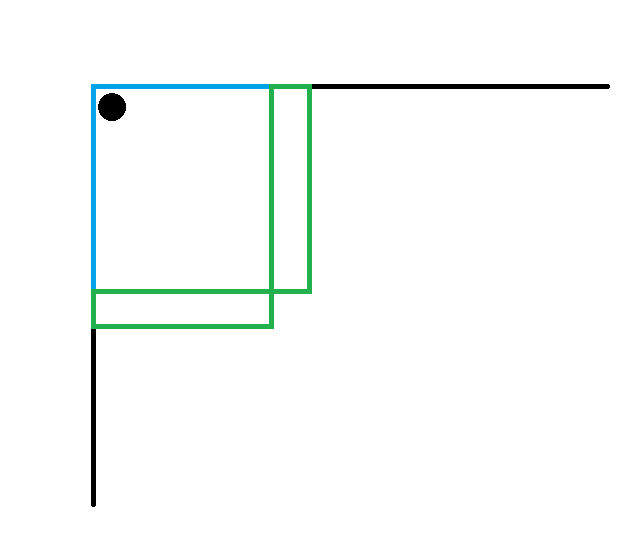
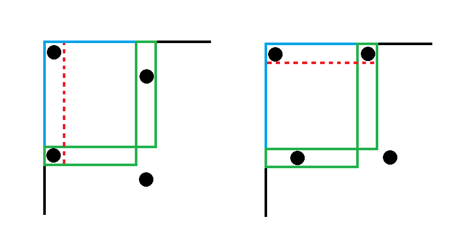
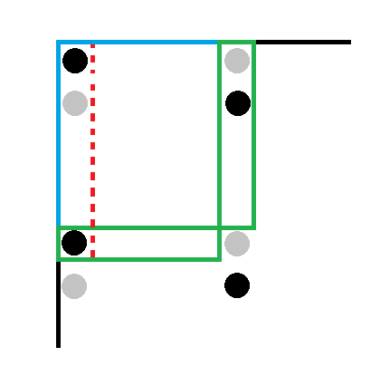

# 20240130 A 组模拟赛 部分题解

## 前言

T3 是模拟赛原，这里就不重复了。

## T1

瞪眼法做题。这里讲一下我赛时怎么猜出部分结论以及怎么**合理地**从这个结论猜到答案。

首先从简单开始，考虑假如在前 $r$ 行 $c$ 列里放一个 $1$，整个矩阵会如何改变。



容易发现两绿色矩阵里面都必须放恰好一个，且不能存在某 $r\times c$ 的子矩阵同时包含两者。



首先两边都对齐最开始放的那个显然符合要求，并且容易发现若一边不对齐则另一边必定对齐。更进一步的，若最开始是横向对齐，那么之后所有都会与前 $c$ 列横向对齐，纵向同理。

考虑推广到多个。但显然多个有横有纵会产生冲突（我赛时就卡这里了），怎么解决呢？

注意到“$1$ 的个数相同”等价于“$0$ 的个数相同”，那么对于空格也必定会有类似的性质。考虑把刚刚影响了的空格找出来。



显然这些空格是不能填横向对齐的 $1$ 的（不然就会出现“重复填在同一格”的情况）。

这下事情就好办了，直接 $2^{rc}$ 枚举前 $r\times c$ 的矩阵中每一格是与其它格子纵向对齐还是横向对齐的，然后统计每一列纵向对齐的个数和每一行横向对齐的个数。下面暂时只考虑每一列的纵向对齐。

设第 $i$ 列有 $col_{i}$ 个纵向对齐的格子，那么枚举其中有 $j$ 个 $1$，单独一组的填法就有 $\sum_{j=0}^{col_i}\binom{col_i}{j}$ 种，并且显然有 $\left\lceil\frac{m-i}{c}\right\rceil$ 组，设这个数是 $num$，纵向的纵方案数就是 $\prod_{i=1}^{r}\sum_{j=1}^{col_i}\binom{col_i}{j}^{num}$。

而横向的类似，但有一点要注意，就是可能出现**一整列都是 $1$**的情况。这样的情况会在该格子归为纵向时仍被算一遍。这个可以容斥解决，就枚举有多少列不变即可。

复杂度最优可以做到 $O(2^{rc}rc)$，但是需要一些预处理，我懒得写了，就带了一堆奇奇怪怪的 $\log$，照样能过。

/// details | 参考代码
    open: False
    type: success

```cpp
#include<bits/stdc++.h>
#define mem(a,b) memset(a,b,sizeof(a))
#define forup(i,s,e) for(int i=(s);i<=(e);i++)
#define fordown(i,s,e) for(int i=(s);i>=(e);i--)
#ifdef DEBUG
#define msg(args...) fprintf(stderr,args)
#else
#define msg(...) void()
#endif
using namespace std;
#define gc getchar()
inline int read(){
    int x=0,f=1;char c;
    while(!isdigit(c=gc)) if(c=='-') f=-1;
    while(isdigit(c)){x=(x<<3)+(x<<1)+(c^48);c=gc;}
    return x*f;
}
#undef gc
//const int N=4,inf=0x3f3f3f3f;
int n,m,r,c,mod,ans;
int col[4],row[4],binom[5][5];
int ksm(int a,int b){
	int c=1;
	while(b){
		if(b&1) c=1ll*a*c%mod;
		a=1ll*a*a%mod;
		b>>=1;
	}
	return c;
}
void upd(int &a,int b){
	a+=b;
	if(a>mod) a-=mod;
	if(a<0) a+=mod;
}
signed main(){
	n=read();m=read();r=read();c=read();mod=read();
	binom[0][0]=1;
	forup(i,1,max(r,c)){
		binom[i][0]=1;
		forup(j,1,i){
			binom[i][j]=(binom[i-1][j-1]+binom[i-1][j])%mod;
		}
	}
	forup(msk,0,(1<<(r*c))-1){
		mem(col,0);mem(row,0);
		forup(i,0,r-1){
			forup(j,0,c-1){
				if(msk&(1<<(i*c+j))){
					++row[i];
				}else{
					++col[j];
				}
			}
		}
		int res=1;
		forup(i,0,c-1){
			int num=(m-i+c-1)/c,t=0;
			forup(j,0,col[i]){
				upd(t,ksm(binom[col[i]][j],num));
			}
			res=1ll*res*t%mod;
		}
		forup(i,0,r-1){
			int num=(n-i+r-1)/r,t=0;
			forup(k,0,row[i]){
				int p=1ll*(k&1?mod-1:1)*binom[row[i]][k]%mod*ksm(2,k)%mod;
				forup(j,0,row[i]-k){
					upd(t,1ll*p*ksm(binom[row[i]-k][j],num)%mod);
				}
			}
			res=1ll*res*t%mod;
		}
		(ans+=res)%=mod;
	}
	printf("%d\n",ans);
}
```

///

## T2

神秘题，感觉根本想不到啊。

首先，每个询问都在树上跑是很困难的，考虑把询问离线下来放在一起考虑。观察部分分，发现有一个“链”的部分分，考虑这样的链具有什么样的性质。

容易发现，这样的链相当于维护一个 $x$，每次从底到顶计算 $x\gets|x-b_i|+a_i$，可以想到用线段树维护询问的时间轴，然后做一个“整体减 $b_i$ 后取绝对值”的操作。

这就是这道题最神秘的地方了。这可以 segbeats 维护，因为每次递归区间内的极差都会至少减少 $1$，然后和 segbeats 类似地进行势能分析即可（这就是为什么这道题 $a_i$ 比较小），由于极差之和是 $nv\log q$ 的，容易发现总复杂度是 $O((n+q)V\log q)$。

考虑树的情况怎么做，会了前面的之后用屁股都能想到线段树合并，具体合并方式是每次遇到某一边是完整的一个区间就开始进行 segbeats 的操作。

考虑复杂度证明，若对两个结点进行 segbeats 的操作说明其中一边势能为 $0$，而另一边每进入一个区间势能就会减少至少 $1$。而每个询问操作至多增加 $\log q$ 的势能（考虑线段树上“未被完全覆盖”的结点数量），那么时间复杂度仍是 $O((n+q)v\log q)$。

/// details | 参考代码
    open: False
    type: success

```cpp
#include<bits/stdc++.h>
#define mem(a,b) memset(a,b,sizeof(a))
#define forup(i,s,e) for(int i=(s);i<=(e);i++)
#define fordown(i,s,e) for(int i=(s);i>=(e);i--)
#ifdef DEBUG
#define msg(args...) fprintf(stderr,args)
#else
#define msg(...) void()
#endif
using namespace std;
using pii=pair<int,int>;
#define fi first
#define se second
#define mkp make_pair
#define gc getchar()
inline int read(){
    int x=0,f=1;char c;
    while(!isdigit(c=gc)) if(c=='-') f=-1;
    while(isdigit(c)){x=(x<<3)+(x<<1)+(c^48);c=gc;}
    return x*f;
}
#undef gc
const int N=1e5+5,inf=0x3f3f3f3f;
int n,q,a,ch[N][2],ans[N];
struct SegTree{
	#define mid ((l+r)>>1)
	#define lson l,mid,ls[id]
	#define rson mid+1,r,rs[id]
	int querymax[N*45],querymin[N*45],addmark[N*45],multmark[N*45],ls[N*45],rs[N*45],root[N],cntn;
	int New(){
		int nw=++cntn;
		querymax[nw]=querymin[nw]=0;
		addmark[nw]=0;multmark[nw]=1;
		return nw;
	}
	void PushUp(int id){
		querymax[id]=-inf;querymin[id]=inf;
		if(ls[id]){
			querymax[id]=max(querymax[id],querymax[ls[id]]);
			querymin[id]=min(querymin[id],querymin[ls[id]]);
		}
		if(rs[id]){
			querymax[id]=max(querymax[id],querymax[rs[id]]);
			querymin[id]=min(querymin[id],querymin[rs[id]]);
		}
	}
	void modi(int id,int mul,int add){
		if(mul<0) swap(querymax[id],querymin[id]);
		querymax[id]*=mul;querymax[id]+=add;
		querymin[id]*=mul;querymin[id]+=add;
		addmark[id]*=mul;addmark[id]+=add;
		multmark[id]*=mul;
	}
	void PushDown(int id){
		if(addmark[id]==0&&multmark[id]==1) return;
		if(!ls[id]) ls[id]=New();
		if(!rs[id]) rs[id]=New();
		modi(ls[id],multmark[id],addmark[id]);
		modi(rs[id],multmark[id],addmark[id]);
		multmark[id]=1;addmark[id]=0;
	}
	void Update(int L,int R,int X,int l,int r,int &id){
		if(L>R) return;
		if(!id) id=New();
		if(L<=l&&r<=R){
			modi(id,1,X);
			return;
		}
		PushDown(id);
		if(L<=mid) Update(L,R,X,lson);
		if(mid< R) Update(L,R,X,rson);
		PushUp(id);
	}
	int Merge(int u,int v){
		if(!u||!v) return u|v;
		if(querymin[u]==querymax[u]){
			if(querymax[v]<=querymin[u]){
				modi(v,-1,querymin[u]);
				return v;
			}else if(querymin[v]>=querymax[u]){
				modi(v,1,-querymax[u]);
				return v;
			}
		}
		if(querymin[v]==querymax[v]){
			if(querymax[u]<=querymin[v]){
				modi(u,-1,querymin[v]); 
				return u;
			}else if(querymin[u]>=querymax[v]){
				modi(u,1,-querymax[v]);
				return u;
			}
		}
		PushDown(u);PushDown(v);
		ls[u]=Merge(ls[u],ls[v]);
		rs[u]=Merge(rs[u],rs[v]);
		PushUp(u);
		return u;
	}
	void Ans(int l,int r,int id){
		if(l==r){
			ans[l]=querymin[id];
			return;
		}
		PushDown(id);
		Ans(lson);Ans(rson);
	}
}mt;
vector<pii> momo[N];
void dfs(int x){
	if(ch[x][0]){
		dfs(ch[x][0]);dfs(ch[x][1]);
		mt.root[x]=mt.Merge(mt.root[ch[x][0]],mt.root[ch[x][1]]);
	}
	int sz=momo[x].size()-1;
	forup(i,0,sz-1){
		mt.Update(momo[x][i].fi,momo[x][i+1].fi-1,momo[x][i].se,1,q,mt.root[x]);
	}
}
signed main(){
	n=read();
	forup(i,1,n){
		ch[i][0]=read();ch[i][1]=read();
	}
	forup(i,1,n){
		int a=read();
		momo[i].push_back(mkp(1,a));
	}
	q=read();
	forup(i,1,q){
		int u=read(),x=read();
		momo[u].push_back(mkp(i,x));
	}
	forup(i,1,n){
		momo[i].push_back(mkp(q+1,0));
	}
	dfs(1);
	mt.Ans(1,q,mt.root[1]);
	forup(i,1,q){
		printf("%d\n",ans[i]);
	}
}
```

///